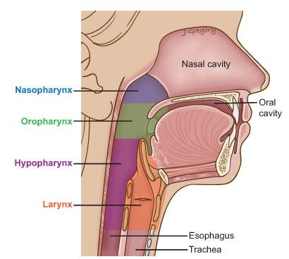
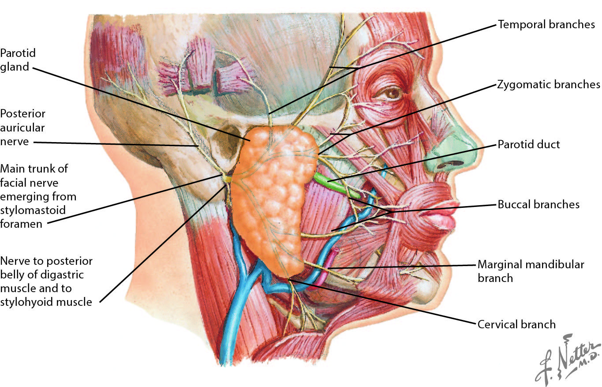
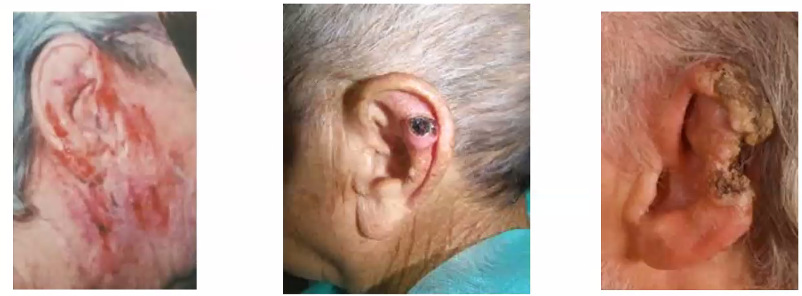
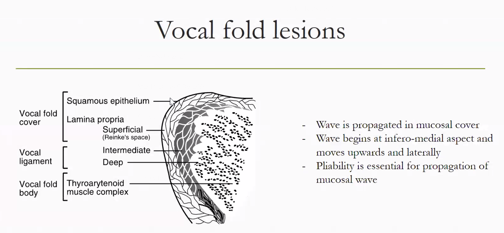
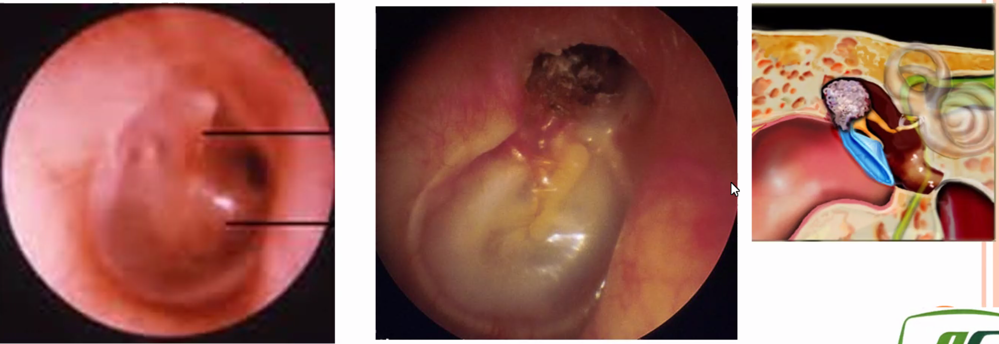
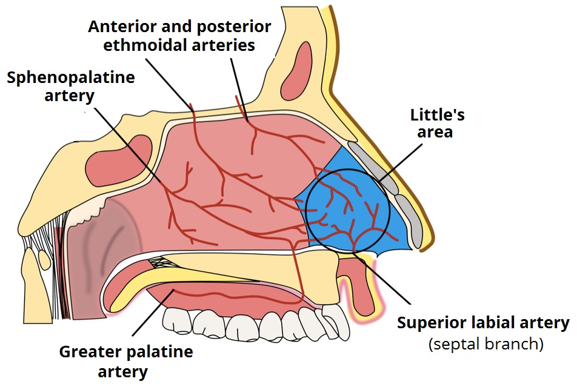
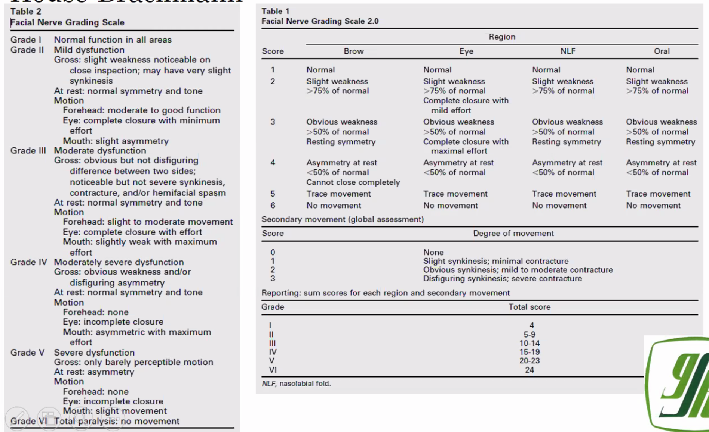
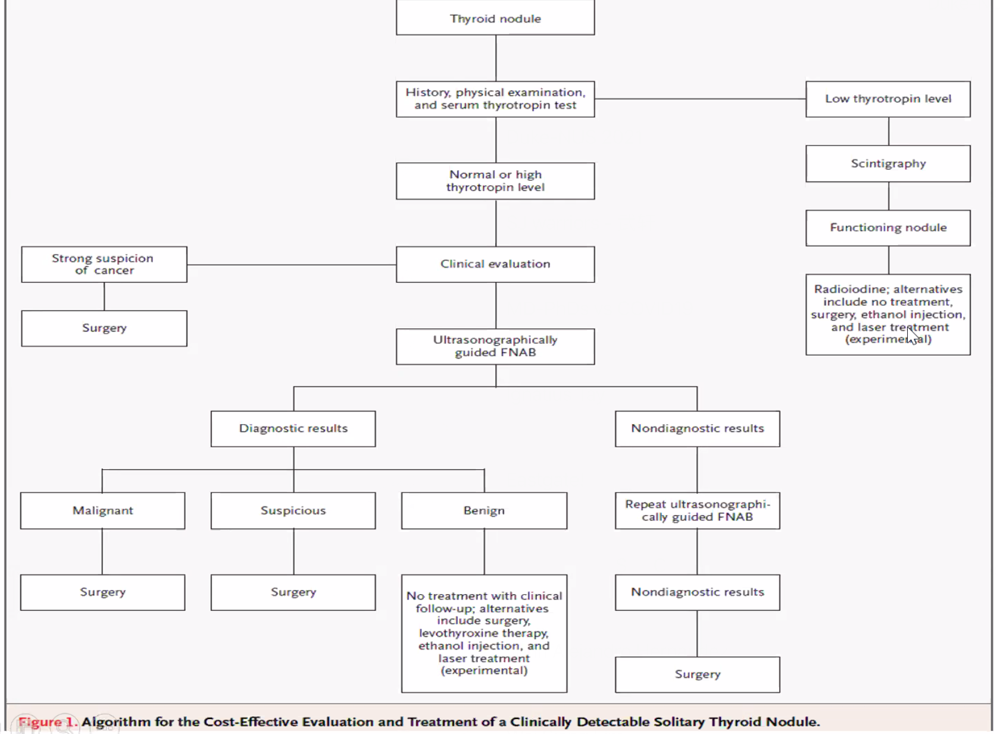

ENT
===
Oto(rhino)laryngology;

[[TOC]]

General
-------

### Key Principle
- Key Anatomy of the Throat
  - **Nasopharynx**: Cuboidal structure bounded by the sphenoid bone superiorly, the posterior choanae anteriorly, the clivus and the first two cervical vertebrae posteriorly, and the soft palate inferiorly. An opening on each side of the nasopharynx leads into the ear. The adenoids are also known as pharyngeal tonsil or nasopharyngeal tonsil, is the superior-most of the tonsils, and is located in the nasopharynx.
  - **Oropharynx**: The part of the throat at the back of the mouth behind the oral cavity. It is bounded by the back third of the tongue from the circumvallate papillae, the soft palate and nasopharynx, the side and back walls of the pharynx, the tonsils and the epiglottis posteriorly. 
  - **Hypopharynx**: Bottom part of the pharynx. It extends from the hyoid bone down to the uppermost muscle of the esophagus, which is called the cricopharyngeus muscle
  - **Larynx**: is also called the voice box, it consists of three parts
    - supraglottis - the area above the vocal cords that contains the epiglottis cartilage.
    - glottis - the area of the vocal cords.
    - subglottis - the part below the vocal cords, containing the cricoid cartilage that continues down into the windpipe. 

- Key Anatomy of the Facial Nerve
  - Temporal branch
  - Zygomatic branch
  - Buccal branch
  - Marginal mandibular branch
  - Cervical branch
  

- Other Points to Notes
  -  In childhood, because the immune system is still developing, they may have palpable lymph nodes.
  -  Always think of airway in ENT conditions
  -   ENT emergencies: epistaxis, aero-digestive foreign bodies / airway obstruction

### ENT-specific exams and procedures

-   Otoscope
    -   Lateral point anteriority.
-   Head and neck examination
-   Routine audiometric and vestibular tests
-   Voice and allergy testing
-   Hearing center - audiometric and vestibular assessments
-   Rehabilitation of hearing impaired children and cochlear implants

#### Rinne and Weber Tests

| Condition                  | Rinne                  | Weber                             |
| -------------------------- | ---------------------- | --------------------------------- |
| Normal                     | AC \> BC in both ears  | Midline                           |
| Conductive hearing loss    | BC \> AC in affect ear | Lateralizes to the affected ear   |
| Sensorineural hearing loss | AC \> BC in both ears  | Lateralizes to the unaffected ear |
| Mixed hearing loss         | BC \> AC in affect ear | Lateralizes to the unaffected ear |

In conductive hearing loss, Weber test lateralizes to the affected ear because the conductive deficit masks the ambient noise in the room, allowing the sound to be better heard. In sensorineural hearing loss, Weber test lateralizes to the unaffected ear because the inner ear on the affected side is impaired and does not allow sound to be heard. Rinne because abnormal if there is a component of conductive problem in hearing lost only.

#### Audiometry

Pure Tone Audiometry
-   For identifying the hearing thresholds
-   Need a very quiet room
-   Audiometer can be paired with different transducers: Bone vibrator, ear phone
-   Other than the tones, we can also do PTA, speech, tinnitus match, loudness discomfort level, aided
-   International audiogram symbols are used to document audiometry findings
-   Get (100 Hz + 1kHz + 2kHz)/3 for quantifying abnormality
-   Cross hearing can happen, masking or noise presented to the no-test ear helps

#### Tympanometry
Assess the eustachian tube dysfunction

-   checks the status of the middle ear cavity, by putting a probe in the middle ear. The probe has three parts, one top generates tone, one generates pressure, one measures the reflected sound
-   Study the mobility of the ear drum
-   middle ear compliance: 0.3 - 2.5 cc is normal
    -   Type As - Increased compliance: very thin TM, ossicular discontinuity
    -   Type Ad - Decreased compliance: otosclerosis, thick scarring on TM
-   middle ear pressure: +/- 100 daPa
    -   C tyoe - pressure peak
    -   B type - perforated eardrum, decreased middle ear mobility

Speech Banana

### Tracheostomy

Indications
- Prolonged intubation more than 2 weeks

Maintenance
- Tracheostomy tube may be dislodged, place hand over the tracheotomy tube to check for the presence of airflow

Tracheostomy vs Tracheostoma

Complications
- Intraop injury to structure
- Pediatric patients are good at scarring, need 6 month evaluation to remove granulation tissue
- Tracheostomy tube is rubbing

Associated Devices
- Laryngeal button; helps prevent 
- TEP prosthesis

### ENT Cases to Note

#### Vertigo in 55 year old man

55 year old man, nasal infection with left facial pain for past 16 days, increasing left facial pain involving left despite Klacid MR 500 mg bd for one week. Subsequently Augmentin 1g bd was prescribed with Predisone, cetirizine,

Resting nystagmus, fast phase left beating, more obious with Frenzels with obeys Alexandar law. No skew deviation and oculomotor tests were normal. Able to walk without aid. Audiogram shows normal hearing in the speech range. DHI scoring is 70% F32P18E20. Admitted for IV antibiotics and bed rest, also councelled about gaze stabilization exercises, nasal swab culture is pending.

symptoms of nasal infection with left facial pain for 16 days just as he was getting better, he had vertigo and sore throat.

-   Left beating nystagmus differentials
    -   Fast phase beats to normal peripherally i.e. peripheral right weakness
    -   Fast phase beats to problem centrally i.e. early stroke
-   Frenzel's goggles
-   Stopbang scoring for OSA

ENT Frameworks
---------------------

### Ear Pain (Otalgia)

Red flags
- Severe otalgia
- immunocompromised / DM / debilitated
- LMN 7th nerve palsy with abnormal looking ear
- Neurological signs and symptoms

Look at the skin, skin lesions resulting in otalgia: eczema, contact dermatitis, basal cell carcinoma, scc, pinna hematoma

Perform ear examination
   - If normal: referred otalgia
     - dental disease
     - temporomandibular joint disorders
     - mucosal head and neck SCC
   - If abnormal
     - otitis external
     - otitis media
     - foreign body
     - trauma

  

### Ear Discharge

### Tinnitus / Deafness / Hearing loss

Congenital Deafness vs Acquired Deafness
- Cerumen impaction

### Balancing Problem / Vertigo / Dizziness

Note that approach from ER, neuro, neuroopthal, ENT are different

-   ER
    -   vestiular vs non-vestibular
    -   non-vestibular implies medical and surgical conditions; remember to do DRE because patient might be bleeding and resulting in hypotension
-   Neurologist: after confirming medical
    -   Vestibular cause - peripheral vs central
    -   Central vestibular cause - history, exam, oculomotor test, smooth pursuit,gze testing, nystagmus directional changing, up or downbeat, HINTs, VOR cancellation, gait, Rombergs etc.
-   Neuro-opthal
    -   With visual symptoms or without visual symptoms
-   Vestibular therapist
    -   function
    -   Unilateral vs bilateral
    -   Compensated or decompensated

Balance:

-   Physiological: motion sickness (young female, mismatch of ocular vs vestibular, sit in front, mild sedative, height vertigo (ocular overload); the key is

-   Pathological

    -   Vertigo alone: vestibular neuronitis ddx anemia, hoTN, lupus and autoimmune condition, multiple sclerosis

    -   Vertigo with positional change: arnold chiari malgormation, BPPV (central vs peripheral - did the nystagmus fatigue - horizontal canal caplolithiasis),

    -   Vertigo with hearing loss and tinnitus: infection (Ramsay Hunt syndrome, influenza, mumps and measles, syphilis labyrinthitis), cholesteatoma with perilymph fistula, medical conditions e.g. lupus autoimmune conditions, syphilitic ladyrinthitis, vestibular schwannoma, meniere's disease (retrospective diagnosis, fluctuating)

    -   Vertigo with central symptoms and signs - LOC vs blackout, 3Ds dipoplia dysarthia, dysphasia, nystagmus ++, but minimal subjective symptoms e.g. vomiting, peripheral numbness or weakness, etc.

    -   Dysequilibrium of age

Common causes of vertigo
- Meniere disease: Recurrent episode lasting 20 minutes to several hours, a/w SNHL, tinnitus and or feeling of fullness in the ear
- BPPV: brief episodes triggered by head movement, Dix-Hallpike maneuver causes nystagmus
- Vestibular neuritis: acute single episode that can last days, often follow viral syndrome, abnormal head thrust test
- Labyrinthitis: vertigo, hearing loss and tinnitus, but symptoms lasts a few days to weeks
- Migraine: associated with headache and other migrainous phenomenon, resolves completely between episodes
- Brainstem / cerebellar stroke: suddent onset and persistent, usually with other neurological symptoms
- Vestibular Schawannoma: can cause unilateral SNHL, sometimes with imbalance and tinnitus; symptoms persist rather than being episodic
- Multiple sclerosis: can cause episodic vertigo and SNHL, along with multisystem manifestations e.g. paresthesias, weakness, visual disturbances, urinary continence
  

### Epistaxis

### Facial Palsy: LMN
Entire face is implicated unlike in UMN facial palsy

Investigation of Facial Nerve Palsy
- Grade
- Audiogram
- Imaging
  - MRI IAM for 
- ENoG for prognosis: faciak weakness grade 6 , do ENoG within 5 days to 2 weeks; >95% degeneration poorer prognosis for recovery; In America patients may be offered a complete decompression surgery

Differentials
- Ramsay Hunt Syndrome
- Lyme Disease 

### Facial Pain
1. suppurative parotitis
2. mumps parotitis
3. tetanus
4. temporomandibular joint dislocation
5. malignant hyperthermia

### Parotid Gland Swelling

-   Bilateral, non-tender - sialadenosis (alcohol, vit A def)
-   Bilateral, tender, after fever headache myalgia a few days prior - mumps
-   Bilateral, nontender, associated with dry mouth typically in woman - Sjogren syndrome
-   Unilateral, nontender - pleomorphic adenoma
-   Unilateral, tender, fluctuating, associated with eating - sialolithiasis

### Nasal Discharge
Bleeding
- Trauma
- Blood dyscrasia

Rhinnorhea
- allergic, irritant-induced, corrosive rhinitis
- cerebrospinal fluid rhinorrhea
- intranasal cocaine use
- rhinitis medicamentosa

### Jaw pain
- Giant Cell Arteritis

### Sore Throat
- Odynophagia
- Dysphagia
- Globud
- Heartburn
- Acid burn
- Odynophonia
- Dsyphonia
- Aphonia

History taking
- Describe your sore throat or throat discomfort
- pain on swallowing
- any difficulty swallowing
- food is stuck feeling
- sharp poking sensation, ask for hx of fb
- duration
- worse in mornings or and of the day
- any voice change, occupation, recreational voice use, abuse
- any breathing difficulties
- Etiology
  - Fever, urti, contact history, cough, productive, 
  - muffled voice, drooling, 
  - neck pain/swelling, 
  - bodily rash
  - hematuria
  - blood in sputum
  - loa / low constitutional
  - risk factors for cancer of upper aerodigestive tract -> smoking, alcohol
  - dietary habits to identify risk factors for acid reflux aka larynopharyngeal reflux
  
Physical exam
  - Vitals: temp SpO2
  - General status: GCS, respiratory distress, drooling, use of accessory muscles (sternocleidomastoid, mascating, pec major, supersternal costal muscles)
  - ENT exam: oral cavity and oral pharynx exam

Differential
- Nasophargynx: strep A
- Oropharygnx: tonsilitis
- Hypophargyngeal: cancer
- Laryngeal: GERD/LPR, laryngitis (viral or bacterial), laryngeal lesions (benign or malignant)
  - Vocal cord nodule has to be a pair

### Painful Neck in ENT
Neck is a tunnel 

Anatomy
- SCM and trapezius
- Strap muscles
- Paraspinal muscles
- Prevertebral muscles
- Neurovascular structures: internal jugular vein, carotid artery, 
- Aerodigestive tract: Laryngx and esophagus

Abscesses occur at extremes of ages

5 cardinal signs of inflammation
Restriction of movement: ROM, torticollis
Complications: name some regions
-  Airway complication
-  Mediastinal complication
-  Cranial complication
History of 
- Immunocompromised
- URTI
- TB contact
- FB, dentures, dental
Investigation: 
- biochemical: CBC, CRP
- radiological: lateral neck x-ray, ct
- occasionally aspiration: see if we get pus and if we get pus but not getting better with antibiotics, do incision and drainage
Management
- I&D: Marginal mandibular branch of the facial nerve need to be avoided by going two finger breath below the mandibular bone
  - Neck abscess drainage
  - Submandibular gland excision

Neck only incision and drainage, cannot KIV saucerization

### Voice Disorder / Hoarseness
Physiology of voice (nerve, muscles)
- Phonation: generation of sound by vibration of VC
- Resonance: induction of vibration in the rest of vocal tract
- Articulation: shaping of voice into words

History
- Define hoarseness
- Onset and duration
- Constant vs intermittent
  - Intermittent: dynamic causes e.g. muscle tension dysphonia
- Aggrevating symptoms
  - Worse at the end of the day e.g. use?
  - Worse in the morning
  - After a cough e.g. postinfection laryngitis
Associated symptoms
- Common symptom complexes
- RED FLAGS: blood
- COMPLICATIONS: a lot about airway
Past medical history
- Medications
- Surgeries 
  - thyroid
    - Recurrent laryngeal nerve
    - External branch of superior laryngeal nerve (pitch change, cannot hit high notes)
  - Anterior decompression of the cervical spine
  - Cardiac surgery damagin the branch of the recurrent laryngeal nerve around aorta
- Previous illnesses/cancer
Social history: smoking drinking
Functional needs: talkativeness profile, vocal commitments or activities
Patient's wishes
- VHI - voice handicap index
- Patient perception of severity is important

Physical exam
- Look
  - General appearance
  - Respiratory distress/stridor
  - Neurological disorders e.g. muscles, myasthenia gravis
  - Cachexia e.g. chronic malignant problem, systemic deterioration
  - Neck Scars
- Listening
  - Assess voice e.g. *rainbow passage* for patients to read, and ask for full name and address
  - GRBAS scale (grade, roughness, breathiness, asthesia, strain)
    - Grade is the overall severity after looking at RBAS - 0, 1, 2 highest of the other categories
    - Roughness is like overused voice
    - Breathiness is like vocal cord
    - Asthesia is like strangulated voice
    - Strain is like talking forcefully to get sound out
  - Mean phonation time (10 seconds or more is normal)
- Feel
  - Head and neck examination
  - Nasoendoscopy
    - Alternate sniff and saying E
    - check if cord close, if one of the cords is compensating well
  - Cranial nerve examination (IX, XI, XII)
  - KIV videostroboscopy

Differential Diagnosis (KITTENS method)
![hoarseness differential]

Differentials for vocal cord immobility
- surgery: thyroid, cervical spine fusion, 
- malignancy: lung / not lung
- Idiopathic
- Neurologic
- Inbutation
- Non surgical trauma
- Aortic ardiac: ortner's syndrome (hypertrophy of right atrium)
- criococartilage 
Investigation for vocal cord immobility
- CT skull base to thorax
- EMG
Management
- depends on diability, aspiration, cause, prognosis, patient's wishes
- speech therapy
- temporary: vocal fold injections
- Permanent, do laryngoplasty or thyroplasty, Japanese are good for voice treatment

Spot diagnosis

1. Vocal cord nodule - voice training is the best
2. Left vocal cord subepithelial cyst- incision and drainage, another type is ligamental cyst, worry contracoul leasion
3. Polyp - excise
4. Hemorrhagic cord - overuse, NSAIDs
5. Reinke's edema (bagging vocal cords)
6. Intubation trauma

Management
- if goes beyond superficial level of vocal focal, will definitely have scarring
- injection of vocal cord fillers to give it bulk; if injection for vocal cord palsy, to make the immobile cord central so as to make the job of the mobile cord easier

### HNN Lumps and Masses

History
- When was the lump first noticed (duration)
- What made the patient notice the lump (first symptom)
- What are the symptoms related to the lump (other symptoms)
- has the lump changed since it was first noticed (progression)
- Does the lump ever disappear (persistence)? What makes the lump to reappear
- Has the patient ever had any other lumps (multiplicity)
- What does the patient think caused the lump (cause)
- There is loss of body weight (constitutional symptoms)
- Family history
- Prior treatment history
- Social history for risk factors

Suspicious History
- Mass lasts longer than 2 - 3 weeks
- Mass gets larger
- Mass does not completely go away
- Voice changes
- Trouble or pain with swallowing
- Trouble hearing or ear pain on the same side as the neck mass
- Persistent neck or throat pain
- Unilateral 

Physical History
Look | Feel | Move
|---|---|---
Number of lumps, shape, site and extension, size, overlying skin (presence of ulcers, discharging sinuses) | temperature, tenderness, surface (smooth irregular nodular), edge (well defined, indistinct), consistency (stony hard, firm, rubbery, spongy, soft)

Anatomy is important to form a differential diagnosis and guide investigation choice
In the differential diagnosis the three most important categories to distinguish are: infective/inflammatory, congenital and neoplastic (or thyroid) masses.

Appropriate investigations are guided by differential diagnosis

### Neck Masses

Submandibular

-   Actinomyces lymphadenitis: submandibular mass with a draining sinus tract, typically occurs after dental infections or trauma in immunosuppressed patients and the sinus tract drain sulfur granules. Regional adenopathy is unlikely because the infection spreads by direct extension, ignoring normal tissue planes. rare infection presenting as a slowly progressive, nontender mass that can form abscesses and draining sinus tracts with characteristic yellow "sulfur granules". 

Midline

-   Thyroglossal duct cyst: tract between foramen cecum and base of anterior neck, cystic and moves with swallowing or tongue protusion, often presents after URTI.

-   Dermoid cyst: cystic mass with trapped epithelial debris, occurs along embryologic fusion planes, no displacement with tongue protusion

Lateral

-   Branchial cleft cyst: anterior to the SCM, tract may extend to the tonsillar fossa (2nd branchial arch) or pyriform recess (3rd branchial arch), often detected when it becomes secondarilyu infected after URTI, leading to

-   Reactive adenopathy: firm and often tender and multiple nodules

-   Mycobacterium avium lymphadenitis: necrotic lymph node, violaceous discoloration of the skin, frequent fistula formation

-   Laryngocele is an outpouching of the laryngeal mucosa that can be congenital or acquired. If it protudes through the thyrohyoid membrane, it can present as a lateral neck mass. It characteristically enlarges with Valsalva maneuver due to inflation with air. Acquired laryngoceles are classically seen in glassblowers or trumpet players due to repeated, intense oropharyngeal pressure.

Posterior

-   Cystic hygroma: dilated lymphatic vessels, and presents as a lateral cystic neck mass . It occurs most commonly in the posterior triangle of the neck and is typically diagnosed at birth or on prenatal ultrasound.

### The Catarrhal Child

Typical presentation

-   Gets 6 - 8 URTIs a year

-   In a childcare setting, this increases 4x to 24 - 26 times

-   Paraents complain that the child is perpetually having flu

-   Child may be subjected to several rounds of antibiotics and other symptomatic treatment; especially if they doctor hop.

Systematic Conditions with ENT Manifestations
-----------

### Alport Syndrome

Lamellated basement membrane
Can cause hereditary SNHL due to damage of the basement membrane in the cochlea. Presents with recurrent hematuria in childhood.

### Granulomatosis with polyangitis
Vasculitis that commonly cause ear (otitis) and nasal (rhinorrea, bloody discharge) symptoms. Patients usually have systematic manifestations including fever, malaise, weight loss, and ulcerative lesions.

### Giant Cell Arteritis
Present with pain while chewing (i.e. jaw claudication), but patients generally report pain the raw rather than otalgia. It rarely occurs in patient < 50 year old.

### Glossopharyngeal neuralgia 
Presents with intermittent, severe, stabbing pain in areas innervated by the glossopharyngeal and vagus nerves (CN IX and X), which includes the ear.

### Relapsing polychondritis
An inflammatory condition that can affect any cartilage in the body but most commonly affects the cartilaginous portions of the ear (the ear lobule is unaffected because it has no cartilaginous structure).  The ear canal is less affected than the pinna.

----------

General Neck Conditions
-----------------------

### Ludwig's Angina
Rapidly progressive bilateral cellulitis of the submandibular, submental, sublingual spaces, most often multibacterial arising form an infected mandibular molar, with potential airway obstruction from retropulsion of the tongue. 

**Presentation**
- fever, dysphagia, odynophagia, and drooling

### Nontuberculous Mycobacterium Lymphadenitis
Can present as a neck mass in children. It is typically slow growing lateral neck mass with overlying violaceous discoloration of the skin.

### Spinal epidural abscess

These can be caused by hematogenous dissemination (e.g. intravenous drug abuse), contiguous spread from vertebral osteomyelitis, or direct inoculation (e.g. epidural anesthesia). Symptoms include fever, focal back pain, and neurologic deficits.

### Retrophargyngeal Abscess

Presents with neck pain, odynophagia, and fever. May be due to penetrating trauma to posterior pharynx. Examination findings may include nuchal rigidity and bulging of the pharyngeal wall. These can progress quickly with potentiall fatal complications.

Infection within the retropharyngeal space drains inferiorly to the superior mediastinum. Spread to the carotid sheath can cause thrombosis of the internal jugular vein and deficits in cranial nerves IX, X, XI, XII. Extension through the alar fascia into the danger space can rapidly transmit infection into the posterior mediastinum to the level of the diaphgram. Acute necrotizing mediastinitis is a life-threatening complication characterized by fever, chest pain, dyspnea, and odytnophagia, and reuqires urgent surgical intervention.

### Surgical Neck Hematoma

Patient with enlarging fluid collection (ballotable neck swelling) after thyroidectomy likely has an expanding neck hematoma, or vascular compression causing venous congestion leading to laryngeal edema. Stridor, dysphagia, voice changes, with tripor positioning are all signs of increasing upper airway obstruction; however, patient can initially have few or no symptoms (e.g. only mild neck tightness). Patient can often maintain their peripheral blood oxygenation concentration until rapidly (\<1 min) decompensation.

Management

-   Immediately evacuate the hematoma (including at the bedside if necessary) by re-opening the incision and removing blood collection

-   The wound should then be explored in the operating room to control the source of bleeding, and the the patient's airway should be evaluated to assess for laryngeal edema and need for protective endotracheal intubation (until the edema subsides).

### Head and Neck Squamous Cell Carcinoma (HNSCC)

Most cancers of the head and neck arise from squamous epithelial cells that undergo stepwise, premalignant changes (i.e. hyperplasia to dysplasia to carcinoma). Lesions may initially manifest in the oral cavity as hyperplastic or dysplastic white (Leukoplakia) or red (erythroplakia) patches (which is likely what as noted on the patient's initial biopsy). Because these lesions are at right of malignant transformation, patients require counseling regarding risk reduction (e.g. tobacco chewing cessation), regular examination of the oral cavity, and rebiopsy if changes (e.g. thickness, firmness) are seen. If bioosy results are cancerous, regional metastatic spread to the cervical lymph nodes is highly likely; therefore, a CT scan of the neck with contrast should also be obtained, both to evaluate the extent of invasion and characterize the metastatic nodal spread.

Risk factor
- older age (>40)
- tobacco
- alcohol exposure
- poor dentition
- immunocompromised status 

Presentation
- Orophargyngeal SCCC may present with sore throat and odynophagia due to tumor invasion or local irritation. 
- Referred otalgia (ear pain in the setting of a normal ear examination is often referred otalgia)
- Persistent enlarged firm neck mass and ulcerated / friable tonsillar lesion
- A/w pharyngitis, dysphagia, halitosis

Management
- Biopsy of lesion with evaluation of HPV status (for tonsil lesion)
- neck imaging to characterize lesion and associated nodal metastasis
- endoscopic evaluation of the aerodigestive tract

#### HPV-positive HNSCC
Often seen in younger patients with NO tobacco exposure and multiple sexual partners. HPV-positive HNSCC primarily affects the oropharynx (possibly due to the higher concentration of lymphatic tissue facilitating viral processing) and often with neck lymphadenopathy. 

It is more responsive to therapy than HPV negative NHSCC. The most common causative agent is HPV-16, which is covered by the HPV vaccine.

### non-Hodgkin Lymphoma
Causes tonsillar enlargement rather than ulceration and is usually seen in patients with immunosuppression or autoimmune diseases.

### Cervical reactive Lymphadenopathy
Very common in children, often presents as an enlarged neck mass following an upper respiratory tract infection. It is typically lateral, often involves multiple nodes, and does not move with swallowing. 

---------------

External Ear Conditions
--------------

### Pinna Hematoma

**Risk Factors**
- Frequent falls
- Minor trauma
- Anticoagulation
  
**Progression**
- Califlower ear when the cartilage dies
- Difficulty fitting hearig aid later on
- Blockage of the ear canal resulting in conductive hearing lost

**Management**
- Local anesthesia
- Anti-helix cut and drain the hematoma, pressure dressing to prevent blood from re-accumulating
- Dental role of pressure dressing onto the ear

### Pinna Perichondritis
Unlike cellulitis of the pinna, there is ear lobe sparing, so only the top two thirds, where there is cartilage, will be affected. Usually due to 

**Risk Factors**
- Young people with ear piercing
- Old people complication of otitis externa

**Complication**
- Califlower ear due to pinna necrosis and deformity
  
**Management**
- Quinolone e.g ciproflocixin
- 3rd gen cephalosporin

### Cellulitis of the Pinna
Entire ear is affected due to break in the skin, caused by skin organisms e.g. Staph and Strep

**Management**
- Penicilin
- Outpatient oral, inpatient IV if severe.

### Foreign body of the ear
Normally not a problem, unless there is
- Drown live insects with olive oil; but local anesthetic is better because the patient will be less distressed with the sensation of insect dying in their ear.
- Organic product, when wet induce inflammation, and can be painful

### Otitis Externa
Also known as swimmer's ears; infection of the skin in the external ear canal, typically due to *Pseudomonas aeruginosa*. Characterized by otic pain, erythema, edema, and purulent discharge. Otitis externa can occur in adults but is more common in children and adolescents. Otitis external occurs frequently after swimming in outdoor water sources due to alteration of the ear canal pH, maceration of the skin, and introduction of bacteria into the ear canal. Cerumen is acidic and has antibacterial properties; loss of cerumen due to swimming or excessive ear cleaning increases the risk of otitis externa. Factors that disrupt the skin barrier (e.g. eczema, psoriasis, trauma) or retained foreign material and water in the canal (e.g. headphones, hearing aids) also increase the risk.

The most common pathogenic organism in otitis externa is *Pseudomonas aeruginosa*, which grow in water. Empiric treatment regimens for *Pseudomonas aeruginosa* should include drugs with antipseudomonal activity (e.g. fluoroquinolone drops). Staphylococcus aureus is also common, and is typically covered by anti-pseudomonal antibiotics.

**Presentation**
Ear pain with discharge, pain exacerbated by movement of pinna

**Risk factors**
- swimming
- ear picking

**Management**
- Topical antibiotics e.g. ciprofloxacin ear drops (if bacterial)
- A topical combination of neomycin, polymyxin B, and corticosteroids can be used to treat some cases of OE with intact tympanic membrane. 
- Keep ear dry is VERY IMPORTANT (say with ear plug and cotton ball everytime they shower) and no digging, no water sport until healed 
- If a lot of pus, refer to ENT for cleaning, using microsuction

### Necrotizing (Malignant) Otitis Externa
Aka skull base osteomyelitis. Life threatening infection of the external auditory canal, extending to the skull base (osteomyelitis), typically caused by Pseudomonas Aeruginosa. Pseudomonas Aeruginosa has pro-inflammatory adhesins (leading to granulation tissue formation) and secretes tissue-degrading proteases (leading to infection spread).

**Presentation**
Severe ear pain - unremitting, worse at night and with chewing (infection spread to TMJ)

**Risk Factors**
- Age > 60
- Diabetes Mellitus
- Aural irrigation (cerumen removal)

**Additional Clinical Features**
- Otoscopy shows granulation tissue in the external auditory canal at the bony cartilaginous junction, edematous external auditory canal, often with purulent drainage; may not look that bad actually. 
- Elevated erythrocyte sedimentation rate (ESR), although leukocyte count might be normal

**Complications**
- Deficits of lower cranial nerves (e.g. CN VII - facial drooping, CN X, CN XI)
- Temporomandibular joint involvement, meningitis, brain abscess, and death

**Prognosis**
Mortality was >50% prior to the introduction of antipseudomonal antibiotics (e.g. ciprofloxacin).

**Management**
- As GP if not too severe or unsure, start oral antibiotics; have a lot index of suspicion; swap ear first if suspious!
- Intravenous antipseudomonal antibiotics (e.g. IV ciprofloxacin - note risk of tendon rupture in elderly, IV fortum (Ceftazidime))
- $\pm$ surgical debridement for patients not responding to medical therapy or if culture does not grow anything
- At least 6 weeks of antibiotics. (like other cases of osteomyelitis)
- Control diabetes
- 3 weeks inpatient stay and frequent outpatient visit to clean ear and tract inflammatory markers
- if no oral antibiotics can be used, insert PICC line, come for OPAC - outpatient antibiotics therapy. 

### Fungal Otitis (Otomycosis)
More rarely with fungal (less common, in immunocompromised patients, or patients with initial otitis external with antibiotics for prolonged period and encouraged growth). Fungal otitis, which may be caused by Aspergillus fumigatus or Candida albicans, is uncommon but may occur following eradication of a bacterial otitis or in association with a foreign body (e.g. hearing aid). In general, otomycosis is less inflammatory than bacterial otitis, and has a more insidious onset with a protracted, frequent recurrent course. It often has a characteristic appearance of white fungal debris with fruiting bodies or spores. 

**Management**
- anti-fungal drops containing acetic acid is painful in the ear canal
- If patient cannot tolerate, use anti-fungal cream

### Furunculosis of External Ear
Staph Aureus infection. Hair bearing area of external auditory canal.

**Presentation**
Ear pain

**MAnagement**
- drain and pack
- change dressing every day, until heal by secondary intension
- oral augmentin, analgesia, ID

### Osteoma
Benign, solitary area of bony overgrowth in the outer ear that can lead to hearing loss. Osteomas are more common in adults and typically involve the external ear (rather than the middle ear).

### Keratosis Obturans
Problem with migration of skin in the ear canal. Skin migrate radially - ears are self-cleaning! Bone remodels around the ear wax due to pressure induced bone necrosis. First time cleaned is super painful. 

**Presentation**
Ear pain in young patients.

**Management**
- Lots of ear wax, no end to the ear wav cleaning. Lots of granulation and bleeding.
- Some patients may not even tolerate having their ears cleaned. Need to topical or injected analgesic.

----------------

Middle Ear Conditions
-----------------------
### Tympanosclerosis
Scarring of the tympanic membrane resulting in stiffening that may lead to conductive hearing loss in severe cases. Patients typically have a history of (typically chronic) otitis media, or previous tympanostomy tubes. Chalky, white patches are also often seen on the tympanic membrane.

### Cholesteatoma
It is an abnormal growth of squamous epithelium in the middle ear, resulting in an erosive, expansile mass of keratin debris. In children, cholesteatoma can either be congenital or acquired, with congenital lesions typically found in patients around age 5. Acquired cholesteatoma (which are more common) are usually due to chronic middle ear disease. Chronic middle ear disease leads to the formation of a retraction pocket in the tympanic membrane, which can fill with granulation tissue and skin debris, leading to chronic otorrhea.This condition should be suspected in any patient with continued ear drainage for several weeks despite appropriate antibiotics therapy.
- pass tensa has three layers pas flexida has only two layers; this is weaker and will get sucked in. Ear wax drop in, until the tympanic membrane perforates, Now the ear wax can enter middle ear, and erode away ossicles to result in conductive hearing loss. 
- Tegmen tympani may even be eroded, so that one gets meningitis
- Lateral canal can be eroded, vertigo and sensori hearing loss

**Presentation**
- Unilateral conductive hearing loss or blocked sensation often with otorrhea and a pearly white mass in the middle ear.
- Ear pain due to impact or secondary infection
- Sometimes also tinnitus, vertigo, facial palsy, or cranial nerve complication
- Chronically discharging ear; treated by GP as otitis external and repeatedly given antibiotics.

**Complications**
- Hearing loss
- Cranial nerve palsies
- Vertigo
- Potentially life-threatening infections (e.g. brain abscesses, meningitis)
  
**Management**
- Olive oil
- Flushing
- Micro-suction
- CT and or surgical visualization to confirm diagnosis
- Mastoidectomy and neurosurgery if intracranial abscess
- Prevent infection and do frequent cleaning if surgery is not an option.
- If there is cranial nerve facial palsy, this is an emergency, admit for decompression of the nerve.

### Acute Otitis Media
Otitis Media is the infection of the middle ear. It can be classified into:
- acute: $<$ 3 weeks
- subacute: 3 weeks to 3 months
- chronic: > 3 months

Unlike older children and adults, young patients, particularly aged 6 - 18 months, are predisposed to AOM due to narrower and straighter eustachian tubes (Jaw grows forward). Additional risk factors include day care / school attendance, positive family history, and cigarette smoke exposure. 

AOM often follows an upper respiratory infection, which causes inflammation and edema of the already narrow eustachian tube. Fluid accumulation in the distal tube allows for growth of colonized bacteria, most commonly Streptococcus pneumoniae, nontypeable Haemophilus influenza, and Moraxella catarrhalis.

Common presenting symptoms include otalgia, fever, and irritability. In addition, patients may have conductive hearing loss because fluid in the middle ear inhibits sound transmission. 

The most specific finding in AOM is bulging tympanic membrane due to middle ear inflammation. Other classic findings include decreased TM mobility on pneumatic insufflation or visible air-fluid levels, both indicating middle ear effusion. A pale yellow, opaque TM with bulging is suggestive of purulent effusion. TM erythema is also common but is not required for diagnosis; as an isolated finding, TM erythema without bulging or effusion is insufficient for diagnosis. 

- preceding URI
- fever
- otalgia
- hearing loss
- otorrhoea; the ear drum bursts due to high pressure from the pus. Prior to this the patient is feverish and in a lot of pain. ONce the ear drums burst, the fever settle and infection settle.
- head banging or ear pulling

Complication of acute mastoiditis is typically more common in children. Presents with ears turned downwards. 

**Evaluation**
- Tymapnogram
- Pneumatic otoscopy is gold standard
  - Color: red / pink in acute, opaque /yellow/blue (OME)
  - Position: bulging, retracted
  - mobility: normal hypoobile
  - Assocaited pathology, perfs, cholesteatoma, retraction pockets
- Consider NPC in asia!

**Microbiology**
- Virus: RSV, Rhinovirus, Parainfluenza, Influenza
- Bacteria: S.pneumoniae, H.influenzae, M.Catarrhalis
- Infant: higher incidence of G-ve bacilli from regugitated food and milk; have wider, less angled, shorter eustachian tube for passing of these

**Risk factors in children**
- Premaurities and low birth weight
- young age
- family history
- day care
- crowded lving conditions
- low socioeconomic status
- tobacco and polluant exposure
- Medical conditions affect eustachian tube
  - Cleft palete
  - Craniofacial disorders e.g. treachers collins
  - Downs 
  - Ciliary dysfunction
  - History of allergies
  - GERD
  - NG tubes, NT intubation, adenoids, malignancies, previous H&N irradiation induced scarring
- Meical conditions affect immune conditions
  - AIDS
  - Steroids 
  - Chem
  - IgG deficiency

**Complications**
- Aural/intratemporal
  - Hearing loss,
  - OE
  - TM perforation
  - Retraction pockets
  - CSOM
  - Mastoiditis/petrositis/labyrinthitis
  - adhesive OM
  - tyampanosclerosis
  - ossicular dyscontinuity/fixation
  - facial paralysis (30% patient does not have facial nerve in bones, prognosis is good)
- Intracranial
  - meningitis
  - extradural abscess
  - subdural empyema
  - focal encephalitis
  - brain abscess
  - lateral sinus thrombosis
  - otitic hydrocephalus

**Management of AOM**
- Symptomatic, should settle in 2 - 3 days
- Reduce smoke exposure, which is associated with increased incidence of recurrent AOM
- Antibiotics (Amoxycillin - high resistance, Augmentin - Amoxicillin / Clavulanic acid, if penicillin-allergic use clindamycin or azithromycin)
  - <6 month - antibiotics
  - 6 - 2 yr - antibiotics if certain, or very sick and uncertain
  - more than 2 - only if severe
- $\pm$ oral or nasal decongestant
- Complications -> ENT emergency
- Severe pain -> myringotomy (puncture ear drum and release pus)

**Prophylaxis for Recurrent Disease**
-   Vaccination against the infection is the main prophylaxis
-   Grommet tube can be placed to enhance drainage
-   If recurrent after grommet tube falls out, can do adenoidectomy at the same time of inserting the second grommet tube

### Acute Mastoiditis
Complication of EOM, presents as fever, ear pain, protrusion of the outer ear, and post auricular erythema and tenderness. Temporal CT scan may be indicated to confirm the diagnosis for atypical cases. 

**Management**
- ENT referral
- IV Antibiotics
- Imaging
- $\pm$ myringotomy and mastoidectomy

### Bullous Myringitis
An uncommon complication of AOM and presents with TM bullae.

### Otitis Media with Effusion / Chronic Otitis Media
Middle ear fluid without tympanic membrane inflammation. It is distinguished from AOM by the lack of acute inflammation (e.g. fever, TM bulging). Young children, particularly age 6-24 months, are predisposed to fluid accumulation within the middle ear due to narrow, straight eustachian tubes that drain poorly. Most effusions develop in the setting of a viral infection or following an episode of AOM. OME is typically asymptomatic but may cause mild discomfort (e.g. ear tugging and pulling) due to pressure on TM. Because the effusion limits TM vibration, conductive hearing loss is also common. OME does not cause fever or severe ear pain. 

**Presentation**
Speech delay in children and hearing loss

**Clinical features**
- may be asymptomatic
- hearing loss
- plugged and popping sensation
- Poor TM mobility on pneumatic insufflation
- Air fluid levels posterior to the TM; the effusion is nonpurulent
- TM is NOT bulging or erythematous.

**Management**
- Treat underlying cause
- Conservative; resolves within weeks and does not require treatment.
- Follow up and observe for resolution because chronic OME (>3 month) can results in speech delay and long-term hearing loss.
- Antibiotics - short term benefit only
- Surgical (myringotomy and ventilation tube insertion $\pm$ adenoidectomy) in persistent, affecting speech/language, high-risk children who are already impaired or delayed in some way.
- use grommet tube, last for 9 months to 10 months, and will drop spontaneously when it's done it's job; anterior inferior is the best part to put. Posterior superior is the worst! complications
  - Intraoperative: EAC injury, ossicular injury, dropped tube in middle ear (tell senior, crocodile retrieve, separate hole and insert, tell patient there is a tube in their middle ear, inert material no problem, offer a surgery to remove the tube, raise tympanonasal flap full exposure under GA)
  - Postoperative: infection, tube blockage, early extrusion, TM scarring, Persistent TM perforation

### Chronic suppurative otitis media
Characterized by otorrhea and hearing loss for >6 weeks and TM perforation on examination. It can happen when inserted grommet drops and the hole do not heal. 

**Presentation**
- Quiescent: asymptomatic, reduced hearing
- Active: otalgia, hearing problems

**Management**
- Conservative: keep ears dry (problem if patient like water sport)
- Surgery (tympanboplasty / myringoplasty): if patient prefer, or have recurrent infections

### Barotrauma of the Middle Ear
Barotrauma can occur during flying or diving if the middle ear pressure does not equilibrate with atmospheric pressure during ascent/descent. Symptoms may include bleeding in the middle ear space (i.e. hemotympanum) or TM rupture. 

### Otosclerosis

Otosclerosis results from an imbalance of bone resorption and deposition that leads to stiffening and ultimately fixation of the stepes, which dampens the transmission of sound energy from the tympanic membrane to the cochlea. It is inherited in an autosomal dominant pattern with incomplete penetrance. It tends to occur in younger Caucasian patients and is more common in women. Otosclerosis may progress during pregnancy.

**Presentation**
Progressive conductive hearing loss

**Additional Clinical Features**
-   Paradoxical improvement in speed discrimination in noisy environment (feature of conductive hearing loss). This is called oaracusis of Willis, possibly because CHL dampens the competing background noise, thereby allowing speech to be heard more clearly.
-   Reddish hue behind tympanic membrane; ear examination is generally unremarkable, although excessive bony resorption can expose underlying blood vessels, leading to a reddish hue sometimes seen behind the tympanic membrane.

**Management**

-   Hearing amplification using hearing aids
-   Surgical reconstruction of the stapes.

### Eustachian tube dysfunction
Eustachian tubes connect the middle ear to nasopharynx. Through physiologic opening and closing, they equalize middle ear pressure, drain middle ears, and prevent reflux of nasopharyngeal secretions into the middle ear. Inflammation due to infection, allergies, environmental irritation (cigarette smoke) can result in tube obstruction, leading to dysregulation and lack of middle ear ventilation.

**Clinical features**
- Ear fullness/discomfort
- Tinnitus
- Asymmetric conductive hearing loss (muffled hearing)
- Popping sensation (particularly during changes in pressure e.g. yawning and swallowing)
- Retracted TM due to negative middle ear pressure, dilated blood vessels around TM due to inflammation

**Diagnosis**
Clinical

**Complications**
- Permanent hearing loss
- TM rupture
- Cholesteatoma

**Management**
- Treat underlying cause (e.g. antibiotics for acute bacterial rhinosinusitis, antihistamine for allergic rhinitis)

-----------------------

Inner Ear Conditions
--------------------

### Congenital cytomegalovirus infection related SNHL
Most common cause of nonhereditary SNHL in children. SNHL results from damage to the inner ear or auditory nerve. Congential CMV is transmitted transplacentally from the mother to fetus in utero. Although some infants are born with features of CMV (e.g. small for gestational age, microphephaly, jaundice, hepatosplenomegaly), most infants are asymptomatic. Hearing loss occurs in up to 50% of symptomatic and 15% of asymptomatic patients; it may be present at birth and progress, or its onset may be delayed until childhood. One or both ears may be affected. 

**Diagnosis**
Diagnosis typically involves CMV PCR testing of the urine or saliva. 

**Management**
Symptomatic infants are treated with antivirals to prevent progresive hearing loss. Treatment is not recommended for asymptomatic individuals with isolated SNHL.

### Drug-induced Ototoxicity
Ototoxic medications may cause damage to multiple structures of the cochlea, resulting in bilateral SNHL that may be irreversible, beginning in the high frequencies, which may compound age-related hearing loss. Some of the most notable ototoxic medications (based on incidence of ototoxicity and frequency of use) are
- aminoglycoside antibiotics
- chemotherapeutic agents e.g. cisplatin
- high-dose salicylates
- loop diuretics e.g. furosemide; higher risk in renal failure patients

**Presentation**
bilateral SNHL esp in high frequencies

**Clinical feature**
- Also has tinnitus and balance difficulties

**Management**
- Formal audiogram
- Cease the offending medication if possible

### Presbycusis
An aging condition affecting >50% adults by age 75, and is likely related to cochlear hair cell loss and cochlear neuron degeneration. Age-related brain atrophy also likely contributes (likely due to increased information processing times) and may explain the disproportionate problems with speech discrimination in older compared with younger patients with SNHL.
 
**Presention**
- Social withdrawal in elderly
- Trouble understanding speech when there is competing background noise.
- Tinitus often develops and is typically described as continuous ringing, rushing, or buzzing.

**Additional Clinical Feature**
- High frequencies are affected first, making it more difficult for patients to understand higher-pitched voices (e.g. woman, children). 
- Hear better in one-to-one conversations in quiet room, however, even a small amount of competing noise impairs hearing (e.g. speech discrimination)

**Management**
- Patient and patient family education
  - Limit background noise
  - Families should be counseled to look directly at patient when speaking to them
- Amplification (e.g. hearing aids) may be beneficial

### Meniere's Disease
Increased endolymphatic fluid volume or pressure in the vestibular system i.e. endolymph hydrops.

**Presentation**
-   Episodic vertigo lasting 20 min to 24 hrs
-   asymmetric sensorineural hearing loss that fluctuates and varies in severity, usually worsening over time; this primarily affects low frequencies at first and then progress to permanent loss over all frequencies
-   low frequency tinnitus in affected ear, often accompanied by a feeling of fullness
-   Lack specific identifiable triggers.

**Management**
-   Conservative e.g. salt restriction, diuretics, vasodilators, labyrinthine sedative e,.g. Stemetil, Stugerone; more than 2/3 patients symptoms resolve on it's own.
-   Patient education on vertigo
-   Surgery
    -   Destructive: vestibular nerve section, labyrinthectomy, gentamicin infusion of the middle ear
    -   Reconstructive surgery: steroid infusion of the middle ear, endolymphatic sac surgery
    -   Others: Meniert's pump
    -   Advances: vestibular implant

### Perilymphatic Fistula
Inner ear contains endolymphatic fluid-filled semicircular canals (which convey movement and position of the head) and the cochlea (which is the sensory organ of hearing). Conditions that cause disruption of the endolymph flow can present with vertigo (semicircular canels) and/or sensorineural hearing loss (cochlea). Typically this is a complication of head injury or barotrauma. 

**Presentation**
Perilymphatic fistulas are a rare, but debilitating complication of head injury or barotrauma. They cause leakage of endolymph from the semicircular canals and cochlea into surrounding tissues, resulting in characteristic clinical features that can be triggered by sneezing, straining, or sudden loud noise.
- cause damage to cochlear hair cells from loss of endolymph:  progressive sensorineural hearing loss, tinnitus
- pressure changes in the inner near (e.g. Valsalva maneuver, elevation changes) due to acutely increased endolymph leakage: episodic vertigo with nystagmus, vertigo

**Diagnosis**
- Perfoming a loud clap near the patient's ear and observe for nystagmus (Tullio phenomenon)

**Management**
- Advise patients to limit activities that increase inner ear pressure
- Refer to ENT for further management

  
### Benign Proxysmal Positional Vertigo
Caused by debris (otoliths) that temporarily alters endolymph flow through the semicircular canals. Therefore, patients typically have sudden, brief (<1 min) episodes of vertigo triggered by head movement.

### Vertebrobasilar insufficiency
**Presentation**
Imbalance
A/w diplopia, perioral numbess, dysarthria, and ataxia

### Vestibular Migraine
Causes vertigo that is variable in severity, typically lasts several minutes to a few hours, and is usually associated with headache or other migrainous phenomena (e.g. photophobia).

### Vestibular Neuritis
A self-limiting disorder of the vestibulocochlear nerve that sometimes follows a viral URTI. It can be associated with significant nausea and vomiting as well as impaired gait, with the patient falling toward the affected side. VN associated with unilateral hearing loss is termed **labyrinthitis**.

**Presentation**
Acute persistent vertigo

**Clinical Feature**
- Significant nausea and vomiting
- Nystagmus that is suppressed when they direct their vision toward a stationary target (consistent with peripheral rather than central vertigo)
- In Head Trust Test, patient is asked to look at a fixed target while the head is rapidly rotated. Patients with normal estibular function maintain visual fixation, however, in patients with VN the eyes move away and then return to the target with a horizontal saccade.
  
**Diagnosis**
Clinical

**Management**
- Expectant
- May consider symptomatic relief with vestibular suppressants e.g. meclizine, corticosteroids, and vestibular rehabilitation.

### Acoustic Neuroma

### Vestibular Schwannoma
This is a benign tumor of CN VIII Schwann cells that forms in the internal auditory canal. CN VIII is comprised of both cochlear and vestibular nerves. Vertigo may not happen because of the tumor's slow growth allows for central compensation of gradual unilateral loss of input. 
Median age of patients is 50. Usually unilateral unless patient has neurofibromatosis type 2, in which case bilateral tumor may be seen. 

**Presentation**
CN VIII invasion: Asymmetric sensorineural hearing loss and imbalance
CN V and VII compression when tumpr expands from the internal auditory canal into the cerebellopontine angle: facial numbness and or paralysis

**Diagnosis**
1. Audiogram
2. MRI with contrast of internal auditory canal
   
**Management**
1. Observation in selected patients (e.g. small tumors, minimal symptoms, older or infirm patients)
2. Surgery
3. Radiation therapy

----------------

Nasal Cavity and Sinus Conditions
---------------

### Choanal Atresia
Congential anomaly that may occur in isolation or as a part of the CHARGE syndrome (coloboma - missing eye tissue, heart defect, atresia choanae, growth retardation, genital abnormalities, and ear abnormalities).

**Presentation**
- Unilateral (most common): chronic nasal discharge, symptomatic during childhood
- Bilateral: 
  - intermittent cyanosis in newborn that worsens with feeding and improves with crying (newnates are obligate nasal breathers)
  - noisy breathing (stertor)
  - Symptomatic shortly after birth

**Diagnosis**
- inbility to pass a catheter through the nares into the orophargynx
- CT scan or nasal endoscopy to confirm

**Management**
- Short-term airway maintainence(e.g. oral airway, intubation, surgical airway)
- Corrective surgery
- Orogastric tube feedings until corrective surgery

### Nasal Foreign Body
The diagnosis is usually straightforward. However, insertion of nasal foreign body is unobserved by caregiver 25% of cases. In these patients, the retained object can induce inflammation (e.g. nasal turbinate erythema) or become infected, leading to unilateral purulent discharge. Patients may also have sneezing and epistaxis. 

**Clinical Features**
- inorganic substance: asymptomatic, mild pain/discomfort
- organic substance: unilateral, foul-smelling, purulent discharge
- button battery: epistaxis, purulent discharge

**Complications**
- local irritation
- nasal septal perforation (with button battery or multiple magnet insertion)
- infection (e.g. sinusitis)
- aspiration into airway

**Management**
- positive pressure (e.g. patient exhalation with unaffected nare occluded)
- mechanical extraction

### Epistaxsis
Primarily a pediatric condition. Most of the bleeding is from the Little's area or Kisselbach's Plexus, the anterior part of nasal septum, and easily subjected to trauma. This is the area of anastomosis of several arteries.

Reasons for epistaxis can be:
-   Spontaneous (90% - not serious) - typically due to crusts formation on the Little's area secondary to inhalation of dry air (e.g. in AC room)
    -   People pick their nose and the Little's area is in the anterior portion of the nasal septum
    -   Allergic rhinitis
    -   Sinusitis
    -   Little's area bleed
-   Vascular lesions
    -   haemangioma - excision under GA, rare
    -   angiofibroma
    -   Lobular Capillary hemangioma
    -   Carotid Artery Rupture: A side effect of ChemoRT for NPC - osteoradionecrosis to expose carotid artery or to result in an aneurysm of the carotid artery subjecting to blow out. 
-   Blood dyscrasias
    -   Hereditary hemorrhagic telangiectasia (HHT), also known as Osler–Weber–Rendu disease and Osler–Weber–Rendu syndrome, is a rare autosomal dominant genetic disorder that leads to abnormal blood vessel formation in the skin, mucous membranes, and often in organs such as the lungs, liver, and brain. Curucao criteria is used for diagnosis.
-   Trauma
-   Tumors
    -   Primary NPC
    -   Radiation induced cancer after NPC treatment
-   Cocaine may result in nasal septum necrosis and hence nose bleeds

Important Questions for History
- Determine the site: 
  - Unilateral or bilateral: unilateral is more serious, may be able to find a cause
  - Anterior or posterior: most of the blood comes from the front of the nose or back of the throat
- Severity of bleeding:
  - Duration
  - Quantity of bleeding
- Any precipitating factors: trauma, infection, running nose
- Any past medical history: atopy, bleeding tendency
- Any drug history: anti-coagulants, anti-platelets, cocaine

Physical Examination
- Look into the nose, do anterior rhinoscopy (can see the inferior turbinate and nasal septum, sometimes middle turbinate)
- Look into oral cavity, looking for blood in oropharynx
- Look at the neck to look for NPC
- Nasoendoscopy after adequate decongestion

**Management**
- ABCs, vitals, IV fluid, blood works (CBC, group and type, PT/PTT)
  - A complete blood count needs to be ordered in the case of severe epistaxis that may require transfusion. 
  - Coagulation studies are order in patients who are anticoagulated or have recurrent spontaneous epistaxis.
- Control BP and correct abnormal results (high BP contribute to epistaxis)
- First aid: 
  - Pinch nose at the cartilagious region for about 10 minutes (or count slowly to 100). Most of the time this is enough and does not need to be cauterized. 
  - Cold pack on the forehead to reduce blood supply
  - Suck ice chips for vasoconstriction
  - Loosing constrictive things around the neck
  - Lean forward helps drain the blood from the nose and keeps it from the esophagus.
- When First Aid does not help
  - Chemical cautery using silver nitrate can also be used.
    - How it is done
      - Anesthesize the area first
      - Ensure good light source to visualize the area
      - Nasal speculum to open the nose
    - Precautions
      - Avoid cautery on both sides simultaneously
      - Warn patients of increased discharge and pain
      - Have swabs / cotton sitcks ready to soak up mucus and excess solver nitrate
    - Good for minor bleeding because more extensive blood flow will clear out the silver nitrate before it can induce coagulation.
    - Has a 80% or higher initial success rate.
  - Oxymetazoline, a topical vasoconstrictor, can be applied if direct compression alone is not effective. However, oxymetazoline cannot be used for more than 3 days due to rebound nasal congestion. It can be paired with chemical cautery
  - More severe epistaxis, do electrocautery embolization
- If Cautery Fails
  - Anterior packing
    - 10 cm Merocel, polyvinyl alcohol sponges
    - Coat with tetracycline ointment or lubricating gel
    - Shove it in, aiming DOWNWARDS along the floor of the nasal cavity
    - Pack the side that is bleeding first, then pack other side if bleeding persists
    - Can pack up to 2 Merocels in each side
    - Leave this in for 48 - 72 hours
  - Posterior Packing
    - Remove Merocel pack if anterior packing has been performed
    - Foley catheter may be used
    - Only used when anterior nasal packing cannot stop the bleeding e.g. bleeding from splenopalatine region
  - These can be uncomfortable for patients because they can be difficult to place and remove and typically are left in place for up to 5 days to confirm clot formation. Furthermore, these patients require oral antibiotic treatment to prevent toxic shock syndrome. Other known adverse effects of nasal packing include septal hematomas and abscesses, rhinosinusitis, septal perforation, necrosis, and even syncope.
  - Absorbable products, such as collagen foam (Gelfoam®), oxidized cellulose sheeting (Surgicel®), or gelatin-thrombin (FloSeal®), tend to be better tolerated by patients owing to ease of administration and the lack of need to remove packing at a later date. Several prospective studies have demonstrated that use of gelatin-thrombin resulted in initial control rates for anterior epistaxis above 80%. These products tend to be costlier than nondegradable packing, but these costs may be offset by the cost of follow-up visits and packing removal.

**Question**
- How to achieve nasal decongestion in preparation for nasoendoscopy?
Cophenylcaine spray, to anesthesize the nose and to decongest the nose.

#### Recurrent Epistaxis 2/2 CPAP
Continuous positive airway pressure predisposes users to recurrent epistaxis because of its drying effect on the nasal mucosa. After beginning CPAP, many patients develop new nasal symptoms, including dryness, obstruction, and epistaxis due to mucosal damage caused by cold, dry pressurized air. On examination, the nasal mucosa appears dry and erythematous with significant crusting.

Humidification and warming of the air through the CPAP machine are often effective in preventing CPAP-associated epistaxis. Nasal saline irrigation is recommended to moisturize the nasal mucosa and assist with clearing of dry secretions. Patients may also apply a lubricating jelly (e.g. saline gel, petroleum) to the anterior septum. However, improvement in nasal symptoms does not appear to increase compliance to CPAP therapy. 

### Nasal Bone Fracture
Common injury, that accounts for 40% facial fracture. It is common because it is a thin bone. 

**Presentation**
Nasal pain and epistaxis

**History**
- Main complaint: on-going problems of pain, nasal blockage, bleeding
- Mechanism of injury
- Signs of other injury: nasal blockage, epistaxis, visual disturbances, clear rhinorrhea, other facial injuries
- Previous Medical History: bleeding tendency, things that can affect healing

**Physical**
- Any deviation
- External nasal deformity - cosmetic
- Bruising
- Raccoon eye, Battle sign
- EOM, visual screen for diplopia /RAPD
- Palpation for steps or deformities
- Ask for previous photo
- Jaw movement / distraction of maxilla / mandible
- Septal hematoma

**Management**
- Isolated fractures - cosmetic deformity? need for x-rays?
  - If no cosmetic deformity or if the patient is not bothered by it, one can manage conservatively. 
  - x-ray (especially Water's view) help to confirm nasal bone fracture is mostly for medical-legal reasons
- Conservative vs M&R (manipulation and reduction)
  - M&R should be done within 14 days of injury
- Need to exclude associated and more serious fractures and injuries

### Septal Hematoma
Patient with nasal trauma and nasal obstruction with fluctuant swelling of the nasal septum has a septal hematoma, which is an accumulation of blood between the perichondrium and septal cartilage. 

Althought the incidence is rare, the complications of an untreated septal hematoma are significant. 
- Infection can develop rapidly (2-3 days) leving to a septal abscess. 
- In addition, because the septal cartilage has no direct blood supply and receives all nutrients via diffision from the perichondrium, a septal hematoma can cause avascular necrosis of the septal cartilate. Destruction of the nasal septal cartilage can result in septal perforations, external nasal deformities (e.g. saddle nose), or internal nasal valve collapse (i.e. nasal obstrction).

**Clinical Feature**
- All patients who sustain nasal trauma undergo examination of the nasal septum. 
- Palpation can differentiate between a deviated nasal septum (firm) and a hematoma (fluctant and soft). 

**Management**
- Patients with a septal hematoma require prompt incision and drainage. 
- After incision and drainage, anterior nasal packing should be placed to compress the perichondrium to the nasal septum; 
- Ice packs and NSAIDs can reduce edema due to inflammation. 
- Patients are treated with antibiotics and require otolargynology evaluation after a few days for packing removal and evaluation.

### Rhinoplasty complications

Complications are common following rhinoplasty, 1 in 4 may need revision. 
Common complications include patient dissatisfaction, nasal obstruction, and epistaxis. Those that involve the nasal septum are less common but more serious. The septum is made up of cartilage and has poor blood supply contrasting sharply with the rich anastomosing blood supply of the nasal sidewall. The underlying cartige relies completely on overlying mucosa for nourishment by diffusion. Because of the poor regenerating capacity of the septal cartilage, trauma, or surgery on the septum may result in septal perforation. The tyupical post-op presentation is a whistling noise heard during respiration. Following nasal surgery, septal perforation is typically the result of a septal hematoma though a septal abscess may also be the cause. Additional conditions that can cause septal perforation are self-inflicted trauma (nose picking), syphilis, tuberculosis, intranasal cocaine use, sarcoidosis, and granulomatosis with polyangitis (Wegner's).

### Pyogenic Granulomas
Benign vascular tumprs that occur on the nasal septum and cause congestion. However, bleeding is typically prominent because they are very friable.

### Nasal Furunculosis

Nasal furunculosis is a localized infection of the hair-bearing nasal vestibule. It is usually caused by the bacteria S aureus. It can occur as a primary infection or secondary to chronic rhinorrhea, upper respiratory infections, and nose picking. It is potentially life threatening as it can spread to the cavernous sinus. Patients complain of pain, tenderness and erythema in the nasal vestibule.

### Allergic Rhinitis

**Presentation**
- Bilateral rhinorrhea
- Severe rebound nasal congestion
  
**Additional Clinical Features**
- Personal and family history of atopy
- Pale or bluish, boggy, edematous turbinates
- A/w sneezing, itching, and watery eyes

#### Children

Complications / Presentation

-   Asthma
-   Ostitis media
-   Sinusitis
-   Sleep apnea
-   Failure to thrive
-   Chronic cough

If you treat AR well, the child may not progress to having asthma.

Physical exam

-   Lots of swollen tissue

-   Yellow secretion - not infection!

Management

-   Do a lot of counselling: Dust mite protectors

-   Above 6 year old, we do skin prick test, unless a patient has been taking antihistamine or immuno supressants recently.

-   Intranasal corticosteriods

    -   Mometasone: 2 years onwards
    -   Fluticasone: 4 years onwards
    -   Triamcinolone: 6 years onwards
    -   Budesonide: 6 years onwards

-   Antihistmine: desloratidine, claritin etc. if the child only has running nose.

Beware of glucocorticoid overloading in atopic children! the child may be receiving g steroid therapy for eczema, asthma, and rhinitis.

### Aspiring-exacerbated respiratory disease
This is a pseudo-allergy because it is not mediated by IgE. Although the pathophysiology is not fully elucidated, it seems to be related to overproduction of leukotrienes. Exposure to NSAIDs leads to acute reactions. 

**Presentation**
Persistent nasal symptoms and previously had a wheezing reaction after taking naproxen.

**Clinical Feature**
Triad of
- asthma (often severe and presenting in adulthood)
- bronchospasm or nasal congestion following ingestion of aspirin or NSAID
- chronic rhinosinusitis with nasal polyposis

**Management**
- inhalers
- intranasal saline and glucocorticoids
- leukotriene-modifying agents

### Nasal Polyposis
Recurrent bacterial sinusitis may result in nasal polyposis. This may manifest with nasal congestio and thick rhinorrhea. Recurrent sinusitis is not typically assoiciated with NPC.

**Clinical Feature**
- Anosmia resulting in bland-tasting food
- Recurrent nasal discharge / congestion
- Bilateral gray glistening mucoid masses

### Cerebrospinal fluid rhinorrhea
Usually due to accidental trauma (especially to skull base), but can also be due to surgical trauma (e.g. sinus surgery) or non-traumatic events (e.g. elevated intracranal pressure).

**Presentation**
- persistent unilateral rhinorrhea with salty or metalic taste
- meningitis if complicated

**Evaluation**
- When suspected, pack ear and arrange for scan! Imaging (with intrathecal contrast)
- Test for CSF specific proteins (beta-2 transferrin, beta-trace protein)
- Endoscopy ($\pm$ intrathecal fluorescein dye)

**Prognosis**
- At risk for meningitis due to nasal flora comtamination of the CSF

**Management**
- Bed Rest, head of bed elevation, avoidance of straining
- Lumbar drain placement
- Surgical repair

### Acute Rhinosinusitis
A common infection of the upper respiratory tract, characterized by inflammation of the nasal passages and paranasal sinuses. This is typically a viral conditions, especially if there is 
- No fever or early resolution of fever
- Mild symptoms (e.g. well-appearing, mild facial pain)
- Improvement and resolution by day 5-10

Bacterial causes should be considered if
- Fever $\geq$3 days OR
- - Persistent symptoms $\geq$ 10 days OR
- New/recurrent fever after initial improvement (i.e. biphasic disease. Fever may be absent

**Presentation**
Nasal congestion / nasal discharge
Facial pain

**Clinical Features**
- Nasal congestion and/or purulent drainage
- Facial pressure / pain
- $\pm$ fever, cough, headache, loss of smell, ear pain 

**Diagnosis**
- Clinical 

**Management**
- intranasal saline, saline irrigation
- NSAID
- antibiotics if bacterial and worsening symptoms, use amoxicillin OR amoxicillin-clavulanate) at time of diagnosis
- in patients with persistent but NOT worsening symptoms and a milder course, oral antibiotics or a 3-day period of observation for clinical improvement are both acceptable.

**Complication**
When complications are suspected, do CT; x-ray is not sufficiently sensitive.
-   Orbital cellulitis and subperiosteal abscess; if eye movement is restricted and visual acuity is dropping, then we have to drain the child
-   Cavernous sinus thrombosis: Most often due to contiguous spread of infection from the medial third of the face, sinuses, or teeth via the valveless facial venous system. Clinical findings include headache, fever, cranial nerve deficits (e.g. diplopia), and proptosis.
-   Subdural Empyema / brain abscess: Extension of infection from paranasal sinuses through the underlying bone. Clinical findings include fever, headache, and mass effect signs (e.g. altered mental state).

### Mucormycosis / Fungal Sinusitis
A fungal infection primarily seen in patients with diabetes mellitus or significant immunocompromise. 

Mucor species are responsible for invasive fungal sinusitis infections. These often fatal infections occur in immunocompromised individuals and can rapidly progress to involve the orbit or the brain. Black eschar from necrotic mucosa can often in seen in the nasal turbinates.

Note that patients with poorly controlled diabetes mellitus are susceptible to invasive fungal sinusitis from Rhizopus species. 

**Presentation**
Rapidly progressive fever, facial pain, nasal congestion, and changes in vision or mentation

**Additional Clinical Features**
- Necrotic destruction of bone may occur and examination often reveals black eschars.
- Pan-sinusitis
- Purulent rhinorrhea
- Almost exclusively on immunocompromised patients
- Can progress quickly into cranial neuropathies and life-threatening infections

----------

Oral Cavity Conditions
-------------------------

### Gingivostomatitis
Caused by HSV1 and presents with multiple vesicular lesions with erythematous and inflammatory base and erythematous border within the oral cavity and perioral area.

### Aphthous Stomatitis / Ulcers
Localized shallow painful ulcers with a gray base, that typically present with erythematous border and a white membrane covering the ulcer. They typically resolve in 1 - 2 weeks and are usually seen in the oral cavity (e.g. tongue, buccal mucosa).
- May be related to oral trauma
- Drug
- Malnutrition

**Management**
Topical glucocorticoids are sometimes used to treat aphthous ulcers, which tend to be multiple, painful, and short-lasting (\<2 weeks)

### Leukoplakia
This a white granular patch or plaque, often over the buccal mucosa. 

**Risk factors**
Similar to those of squamous cell carcinoma, with smokeless tobacco and alcohol use accounting for the majority of the cases. 

**Natural Progression**
The natural history of oral leukoplakia depends on the degree of dysplasia, with 1 - 20% of the lesions progressing to squamous carcinoma within 10 years. Fortunately, most lesions resolve within a few weeks after cessation of tobacco use. The development of areas with induration and/or ulceration should prompt biopsy to rule out malignant transformation of the leision. 

Although leukoplakia (white mucosal lesion) is often a benign, asymptomatic condition, evolving oral leukoplakia that is nonhomogeneous and friable (e.g. tasting blood) is concerning for squamous cell carcinoma, especially in a patient who uses smokeless tobacco.

### Oral Candidiasis or Thrush

Occurs in patients with diabetes, immunodeficiency states, and use of antibiotics or inhaled glucocorticoids. The leision of candidiasis typically consists of white plaques on the oral mucosal, tongue, or orophargynx with underlying erythema. In contrast to leukoplakia, the plaques of candidiasis can usually be scraped off with a tongue depressor. 

### Torus Palatinus 

A benign bony growth (i.e. exostosis) located at the midline suture of the hard palate. It is thought to be caused by both genetic and environmental factors and is more common in women and Asian individuals. TP can be congenital or develop later in life. Similar lesions at the lingual surface of the mandible are terms "tori mandibulari"

TPs are usually <2 cm in size but can gradually enlarge over time. They are typically asymptomatic and are frequently ignored by the patient but noted by clinicians or family members when examining the mouth for unrelated reasons. However, the thin epithelium overlying the bony growth may ulcerate with minor trauma of the oral cavity and heal slowly due to poor vascular supply. The diagnosis is obvious on clinical grounds.

Surgery is indicated for patients in whom the mass becomes symptomatic, interferes with speech or eating, or causes problems with the fitting of dentures later in life.

### Palatal fracture
Chronic complications
- dental malocclusion
- temporomandibular joint dysfunction
- complicated wounds

### Squamous Cell Cacinoma of the Oral Cavity
Risk factors include extensive use of tobacco and alcohol. SCC usually presents as persistent nodular, erosive, or ulcerative lesions with surrounding erythema or induration. Regional lymphadenopathy can be present as well. The white granular lesions in this patient are more consistent with oral leukoplakia.

### Bisphosphonate-related osteonecrosis of the jaw
Due to impaired bone remodeling. 

**Presentation**
Oral pain

**Risk factors**
- High dose parenteral bisphosphonate, e.g. zoledronic acid, for cancer of osteoporosis
- Dental procedures
- Concurrent glucocorticoid use
- Concurrent or previous malignancy

**Clinical Features**
- chronic indolent symptoms
- mild pain and swelling
- exposed bone, loosening of teeth, pathologic fractures
- mandible is more commonly affected than the maxilla

**Prognosis**
- Course can be intractable
  
**Management**
- Prevention: Dental consultation and complete dental procedures before initiating bisphosphonate theray
- Largely supportive: oral hygiene and antibacterial rinses
- Oral antibiotics and limited debridement only when needed

### Temporomandibular Joint Disorder
Patient with otalgia during chewing, signs of bruxism (worn and smooth teeth), and a normal ear examination likely has temporomandibular joint disorder (TMD). Otalgia in the setting of a normal ear examiantion is likely referred pain. The most common causes of referred otalgia are dental disease and TMD. Althrough the most recognizable symptoms of TMD are pain exacerbated by jaw motion and tenderness of the temporomandibular joint, headache, neck stiffness, and ear pain are quite common. Nocturnal teeth grinding (bruxism) can occur but may go unnoticed; it should be suspected if teeth are worn. 

**Presentation**
Ear Pain during chewing

**Risk factors**
- Joint trauma (e.g. injury, bruxism)
- Psychiatric illness (e.g. anxiety, history of abuse)

**Clinical Manifestation**
- Facial pain (worsens with jaw motion, at night due to teeth grinding - may wake patient from sleep)
- Ear pain, tinnitus
- HEadache (unilateral, worsen on awakening)
- Jaw dysfunction

**Diagnosis**
- Clinical, imaging not typically needed
- Palpation of mastication muscles during opening and closing elicits pain, crepitus, and/or audible clicks, but sensitivity can be low.
- Tooth wear (evidence of bruxism)
- Crepitus or clicking with TMJ motion

**Management**
- Education (e.g. avoidance of triggers, soft diet)
- Dental splints e.g. nighttime bite guard (if bruxism suspected)
- NSAIDs (e.g. naproxen)
- Add muscle relaxants (e.g. cyclobenzaprine) for patients with associated muscle pain

---------

Salivary Gland Conditions
------------------------

#### Warthin tumor 
Warthin tumpr is a benign tumor of the salivary gland. The first symptom is usually a painless, slow-growing bump in front of the ear, on the bottom of the mouth, or under the chin. Warthin tumors may increase in size over time, but few become cancerous.

### Ranula or Pseudocyst
Due to obstruction of sublingual salivary gland. If it is large, the pseudocyst can extend from the floor of the mouth into the neck. It is lateral and does not move with swallowing. 

### Sialadenosis
Benign noninflammatory swelling of the salivary glands, which can result from over-accumulation of secretory granules in acinar cells (possibly due to abnormal autonomic innervation) in patients with chronic alcohol use, bulimia, or malnutrition

**Presentation**
Gradual enlargement of the glands that does not fluctuate and is no associated with eating.

**Management**
- Investigate underlying disease e.g. alcoholism, vitamin A deficiency

### Mumps Parotitis
Present with parotid swelling. However, it is typically painful and presents a few days after the onset of systemic symptoms (e.g. fever, headache, myalgias).

### Suppurative Parotitis / Sialadenitis
Retrograde seeding of bacteria from oral cavity (e.g. Staphylococcus aureus, oral flora) through Stenson's fuct to the parotid gland. Patients then have rapid-onset and excruciatingly painful swelling of the involved parotid gland that is aggravated by chewing. 

**Presentation**
- Facial swelling / swollen tender neck mass
- Facial pain
- Limited jaw movement

**Risk factors**
- Elderly, dehydrated, postsurgical, dementiated
- Decreased oral intake (e.g. NPO perioperatively)
- Medications (e.g. anticholinergic)
- Obstruction (e.g. calculi, neoplasm)

**Additional Clinical Features**
- Exquisite tenderness exacerbated by chewing and palpation
- Firm, erythematous pre/postauricular swelling
- Trismus, systemic findings (e.g. fever, chills)
- Elevated serum amylast without pancreatitis

**Management**
- Ultrasound or CT scan to look for ductal obstruction and abscess
- Hydration, oral hygiene
- Antibiotics
- Massage ie. milking pus out of gland
- Sialagogues

-----

Nasopharyngeal Conditions
-------------------
Nasopharynx links the nasal cavity with the orophargynx.

### Adenotonsillar Hypertrophy
This is the most common cause of nasal obstruction in children. These are usually seen in early childhood and regress with age, and are much less likely to cause symptoms in an adolescent.  It can result in mucopurulent nasal discharge. Symptoms are typically bilateral. May occasionally obstruct the nasopharynx, leading to OSA or recurrent tonsillitis.

### Nasopharyngeal Carcinoma
NPC is endemic to Asia. Linked with reactivation of EBV. Tumors typically express EBV DNA and EBV assays are often used to monitor treatment response and disease replase. NPC is endemic to Southern China and parts of Africa and Middle East. Risk is thought to be higher in these locations due to diet (salt-cured food, early exposure to salted fish) and genetic predispositions. Tobacco smoking is also a risk factor.

**Presentation**
Obstruct the nasophargynx: nasal congestion, epistaxis, and headache
Mass effect: cranial nerve palsies (e.g. facial numbness), and/or serous otitis media (eustachian tube obstruction)
Local spread: Early metastatic spread to the cervical lymph notes may cause a nontender neck mass.

**Diagnosis**
Endoscope-guided biopsy of the primary tumor.

**Prognosis**
Survival is excellent if the neoplasm is discovered early, but most patients present with advanced disease.

**Treatment**
Combined chemotherapy and radiation therapy

### Juvenile Nasal Angiofibroma
A rare, benign tumor of the nasopharynx.

**Presentation**
- nasal obstruction and nasal drainage 
- usually also result in epistaxis

**Clinical feature**
- almost exclusively in teenage boys 

------------

Oropharyngeal Conditions
------------------------
### Herpangia

Caused by coxsackie A virus and presents with fever, sore throat, and odynophagia. It is most common in childrem.

**Presentation**
- characterized by vesicles on the tonsils and soft palate.

#### Group A Strep pharyngitis
Usually presents with acute-onset sore throat, tonsillar exudates, cervical lymphadenopathy, and no cough (Centor criteria).

### Tonsillitis
White lacy exudate, enlarged, and ulceration.
Usually viral.

#### Infectious Mononucleosis
This is due to Epstein-Barr Virus (EBV), and may cause enlarged tonsils and lymphadenopathy. Usually associated with fever. EBV is also associated with certain lymphomas (e.g. Burkitt) and with nasopharyngeal cancer.

**Diagnosis**
- Clinical
- Biochemistry

**Management**
- Augmentin and other amoxicillin related antibiotics will cause skin rash

#### Uncomplicated Tonsillitis
Characterized by tonsillar erythema and exudates, often with tender anterior cervical lymph nodes and palatal petechiae.

### Tonsillolith
Tonsil stones are commonly occuring concretions of food, cellular, and bacterial debris. These can be managed with gental removal (e.g. gargling with salt water). However, frequent manipulation (e.g. with toothpicks) can cause mucosal trauma, which may be mistaken as an ulcerated neoplasm.

### Peritonsillar Abscess
Most common in children and adolescents and presents with gradual onset of fever, muffled voice, and unilateral tonsillar swellign with uvular deviation. 

Diffuse erythema, bulge and swelling of the peritonsillar area with deviation of uvla to the contral lateral side

Also known as quisy, it is a complication of tonsilitis and is an acute bacterial infection of the region between the tonsil and the pharyngeal muscles. It begins as persistent tonsillitis/pharyngitis and progresses to cellulitis / phlegmin, with pus collecting into an abscess within a week of symptom onset. PTA is most common in older adolescents and young adults, and drug or alcohol use increases the risk.  

**Presentation**
- Spasms of jaw muscles (trismus)
- Muffled or "hot potato" voice
- Swelling of peritonsillar tissue with deviation of the uvula to the contralateral side
- Pooling of saliva
- Typically have prominent unilateral lymphadenopathy

**Prognosis**
The condition can be fatal secondary to either aiway obstruction or spread of the infection into the paraphargyngeal space, which may lead to involvement of the carotid sheath.

**Management**
- Needle aspiration or incision and drainage if the purulent material cannot be removed with aspiration alone.
- Intravenous antibiotics therapy to cover Group A hemolytic streptococci and respiratory anaerobes

---------

Hypopharyngeal and General Pharyngeal Conditions
------------------------

### Diphtheria
Presents with gradual onset of sore throat, low-grade fever, and an adherent gray, pharyngeal pseudomembrane. Stridor and respiratory distress can develop in severe cases, which also presents with marked edema of the posterior pharynx and neck.

### Foreign Bodies

A unilateral foul smelling mucopurulent nasal discharge in a child is pathognomonic of FB. The FB may be introduced by the child him/herself or by a sibling. Adults may have foreign body impaction as well, just less common. Presents in infants/toddlers with acute onset of wheezing, stridor, and or respiratory distress. Acute aspiration does not cause fever. Foreign body aspiration is also unlikely after 3 year old, when children are past the oral exploration stage.

### OSA

### GERD/LPR
  
### Acute Pharyngitis
Inflammation of pharyngeal tissue
-   Most commonly caused by viral infection
-   can also be caused by bacterial infection
-   Of note, appropirate identification
 
### Fusobacterium necrophorum (Lemierre Syndrome)
This is a life-threatening, deep neck space infection that progresses to suppurative thrombophlebitis of the internal jugular vein. It presents with painful pharyngitis and odynophagia. It also has a acute (<1 week) and toxic presentation with high fevers (>39 C) rigors, and respiratory distress from associated septic pulmonary emboli. 

### Infectious Epiglottis
Uncommon, rapidly progressive, potentially fatal infection of the epiglottis, that can lead to complete upper airway obstruction. Isolated pathogens are usually nasopharyngeal bacteria, most commonly Haemophilus Influenzae type b (Hib). Due to widespread vaccination against Hib, the incidence of epiglottis has diminished. However, the proportion of epiglottitis caused by other pathogens, such as other strains of H influenzae, Streptococcus species (S pneumoniae, S pyrogenes), and Staphylococcus aureus, has increased. 

**Presentation**
dysphagia / difficulty swallowing or dyspnea

**Risk factors**
- diabetes mellitus
- obesity
- preceding upper respiratory infection (disruption of the respiratory epithelium creates a portal of entry for bacteria

**Clinical Features**
-   Children: classically sudden onset of respiratory distress (stridor, retractions), dysphagia, drooliong, distress, high fever
-   Adult: subtle onset of sore throat, fever, laryngotracheal tenderness to palpation; with worsening swelling, difficulty swallowing, pooled oral secretions, and respiratory compromise (tachypnea, stridor) can develop.

**Diagnosis**
-   Lateral neck radiograph: enlarged epiglottis with the loss of vallecular air space, and / or distended hypopharynx.
-   Respiratory compromise is less common in adults but can progress quickly, therefore, patients with significant compromise (e.g. hypoxia resistant to noninvasive intervention) require airway establishment (intubation) prior to considering neck radiograph.

**Management**
- Secure Airway
  -  In patient unable to maintain adequate oxygen saturations, bag-valve-mask ventilation with 100% oxygen (to keep oxygen saturation %) should be initiated. 
  -  If BVM does not result in adequate oxygenation, endotracheal intubation using a video laryngoscope (to facilitate direct visualization of the epiglottis) should be attempted. 
  -  If first attempt at endotracheal intubation with a video laryngoscope fails, immediately establish a surgical cricothyrotomy by the most experienced provider available (preferably a otolaryngologist or general surgeon), due to the risk of rapid respiratory deterioration. Cricothyrotomy establishes an airway below the epiglottal swelling and potential obstruction.

-   Once the airway is stabilized, antimicrobial therapy is needed to clear the infection.
    -   Untreated HIV with white plaques on the orophargynx - Candida
    -   Broad-spectrum antibacterial agents with 
        -   vancomycin targeting S aureus (including MRSA) 
        -   AND ceftriaxone targeting H influenzae and Streptococcus species

-   Steroid to reduce edema around epiglottis

### Tonsil Adenocarcinoma
This is the most common tonsil malignancy. 

------------------

Laryngeal Conditions
---------------------

### Croup / Laryngotracheitis

Most common in children 6 months - 3 years.
Presents with hoarseness, stridor, and fever
Croup causes a characteristic barky cough.

### Vascular Rings
An anomalous branch of the aortic arch or pulmonary artery encircles the trachea and esophagus. They may cause biphasic or expiratory stridor due to tracheal compression and feeding difficulties due to esophageal compression. A barium swallow can identify indentations of the esophagus, and the diagnosis can be confirmed with contrasted CT scan or MR angiography.

### Laryngomalacia
Collapse of the supraglottic tissue on inspiration resulting in chronic stridor in infants. Proposed pathophysiologic etiologies include laryngeal hypotonia (due to delayed maturation or neuromuscular disorder), redundant supraglottic soft tissue, and inflammation due to reflux. 

**Presentation**
Inspiratory stridor that worsens when supine

**Additional Clinical Features**
- Begins in neonatal period
- Peaks at age 4 - 8 months
- Exacerbated by feeding or upper respiratory illnesses
- Prone positioning improves symptoms

**Diagnosis**
- visualization of the larynx typically by flexible fiberoptic laryngoscopy
- findings include omega-shaped epiglottis and collapse of the supraglottic structures during inspiration

**Management**
- Reassurance with follow up; most causes spontaneously resolve by 18 months
- Possibly concurrent GER treatment; often improve symptom
- Supraglottoplasty may be considered in severe cases with feeding difficulties, tachypnea, cyanosis, or failure to thrive

### Reflux Laryngitis

**Presentation**
- Hoarseness
- Dysphagia

### Vocal Cord Polyps
Often occur due to inefficient or excessive voice use (e.g. teachers, telemarketers). 

**Presentation**
- Hoarseness due to impaired vocal cord vibration

**Additional Clinical Features**
- Do not invade or ulcerate

### Recurrent Respiratory Papillomatosis
Constant or progressive hoarseness is often related to a vocal cord lesion and requires evaluation by laryngoscopy. Irregular, exohytic growths in clusters on the surface of vocal cords is likely laryngeal papillomas due to recurrent respiratory papillomatosis (RRP). These lesions are often warty or grapelike, and as with skin papillomas, have dark-red punctate areas corresponding to blood vessels. 

Laryngeal papillomas care caused by human papillomavirus (HPV) subtypes 6 and 11. Infants typically acquire HPV via vertical transmission, adults may develop symptoms due to reactivation of vertically transmitted HPV or from exposure of HPV through sexual contact. 

Although benign, RRP is associated with significant morbidity (e.g. voice outcomes, airway obstruction, repeated operative interventions). In addition, clinical course is variable and unpredictable with fluctuations in severity. In rare instances, it can spread beyond the vocal cords to involve the lower respiratory tract. Medical therapy (e.g. interferon, cidofovir) has limited efficacy, therefore the mainstay of treatment is surgical debridement, and patients often require many procedures. 

Smoking can cause maglignant transformation of RRP.

### Angioedema of the Larynx
IgE mediated (also with itching or urticaria) or inherited (deficiency of C1 esterase inhibitor), and is characterized by recurrent episodes of edema that may involve the larynx and cause hoarseness (although airway obstruction is the primary concern). It typically presents as discrete episodes (hours to a few days) as opposed to progressive. 

### Laryngeal Candidiasis
Opportunitic infection that often occurs conurrently with oral candidiasis in patients using corticosteroid inhalers (e.g. due to COPD). 

**Clinical Feature**
- White patches or plaques on mucosal surface

### Laryngeal Cancer
Glottic (60 - 65 %) - presents early, poor lymphatic drainage so usually does not spread until late
Supraglottic (30 - 35%) - lymphatic drainage well supplied
Subglottic (5%) - lymphatic drainage well supplied

History
- dysphonia
- dysphagia
- otalgia
- stridor / dyspnea
- blood stained sputum
  
Examination
- subsites involved
- VC mobility (normal vs impaired vs fixed); by getting patients to phonate
- Patency of airway
- fixity of larynx
- cervical lymphadenopathy

Investigations
- Biopsy:ELMS
- Staging scans: CT/MRI, CT chest/abdo, PET scan
- Lung function tests
- Speech therapy: to restore speech, but also to nasogastric tube insertion, electro larygnx etc
- Dental review: for radiation

Management for tumor
- Early Stage (I/II): RT or surgery
- Later Stage (III/IV): multimodality

#### Laryngeal Adenocarcinoma
Accounts for <1% of laryngeal malignancies. 

**Risk Factors**
- Smoking
- Age

#### Laryngeal Squamous Cell Carcinoma
This accounts for >90% of lesions in adult larynx. 

**Presentation**
- Persistent hoarseness of voice due to impaired vibration or movement of the vocal cords.
- Dysphagia due to blockage of passage of food
- Breathlessness secondary to airway obstruction
- Referred otalgia facilitated by either the glossopharyngeal nerve (CN XI) which innervates the base of the tongue and the external auditory canal, or the vagus nerve CNX which innervates part of the largynx/hypopharynx and the EAC
- Hemoptysis due to tumor friability (e.g. blood crusting)
- Neck mass due to regional nodal metastasis resulting in cervical adenopathy

**Risk Factors**
- Smoking
- Alcohol use

**Management**
- Persistent hoarseness of more than 30 days should always be evaluated by laryngoscopy to ensure no delay in diagnosis of possible cancer

-------------

Facial Conditions
--------------------

### Bell's Palsy
ACUTE LMN facial nerve palsy of unknown cause. Possible viral aetiology (e.g. HSV1, EBV, CMV, adenovirus, rubella, mumps, influenza, coxsackie virus), with reactivation of HSV1 being the leading cause. Inflammation of the nerve, lead to edema within bony canal. Recurrent Bell's palsy (4 - 14%). 

**Prognosis**
More than 80% recover, 20% don't recover fully

**Evaluation**
- Rule out other causes of LMN 7th nerve palsy: ear, parotid
- Do head and neck exam
  - Look for signs of cancer and growth
  - Hearing loss test
  - Chosteotoma etc
- Parotid palpation
- Check upper neck

**Grade the Bell's Palsy**
- House Brackmann
  
- Sunnybrook Facial Grading system

**Management of Bell's Palsy**
- Acyclovia 800 mg 5x/day x 1/52 if normal Bell's Palsy (within 2 weeks of onset)
- Valacyclovia is better for Ramsay Hunt Syndrome (within 2 weeks of onset)
- Prednisolone 1mg/kg/day + omeprazole (for stomach protection) if no contraindication to steroid; for 1 week
- Eye protection: tape eye when sleeping, lubricant eye drops; may refer to opthalmologist
- Facial exercises / rehabilitation to maintain facial tone for higher success rate of facial reanimation surgery

#### Melkelsson Rosenthal Syndrome 
Also get tongue / labial edema

#### Ramsay Hunt Syndrome
Aka herpes zoster oticus, this condition is caused by the reactivation of varicella zoster virus from the geniculate ganglion, disrupting motor fibers of cranial nerve VII with subsequent spread to cranial nerve VIII (vestibulocochlear nerve). In addition to the painful shingles rash, Ramsay Hunt syndrome can cause facial paralysis and hearing loss in the affected ear. Patients have facial nerve palsy. Neurosensory hearing lost. Much poorer prognosis.

**Clinical Feature**
The two defining manifestations are
1. painful erythematous vesicular rash on the auditory canal or auricle
2. ipsilateral facial paralysis

Many patients also develop vestibular (e.g. vertigo, nausea/vomiting), hearing, and taste disturbances, but systemic symptoms such as fever are rare (<20%).

**Management**
  Treatment with anti-viral medication (e.g. **valacyclovir**) may speed resolution and limit adverse outcomes. However, many patients are left with residual facial muscle weakness or paralysis.

### Facial Schwannoma
- Benign tumor, Rare incidence 0.8%, most common tumor of the VII nerve
- Can involve intracranial, intratemporal, or extratemporal segments
- Tumor location: geniculate ganglion, labyrinthine and tympanic segments most commonly reported
- Clinical presentation: progressive facial weakness, hearing loss, tinnitus, facial tic, imbalance/vertigo, headache, otalgia, 

**Management**
- Consider the degree of facial weakness and size
- House Brackman grade III is the best outcome after surgery
- Observe beforehand and then remove after the palsy becomes worse
- Discuss with facial surgeons to consider grafting

### Maxillofacial vascular malformation

### Traumatic Facial Nerve Injury
- iatrogenic
  
#### Temporal bone fracture
  - Battle sign
  - Otic capsule sparing vs otic capsule violating
  - Facial nerve injury more common in transverse and otic capsule-violating ractures
  - most common site of injury to facial nerve: geniculate, proximal tympanic segment

**Evaluation**
- ask for h/o DM, trauma, ear infections or generalized weakness
- determine 

**Management**
- Immediate complete facial nerve palsy - role for surgical decompression
- Delayed-onset partial/complete facial nerve palsy - generally good prognosis, almost all will recover with conservative management
- in ER document facial nerve palsy before patient loss consciousness

----------------

Thyroid Conditions
------------------

### Approach to Thyroid Nodules

Thyroid nodules are common and may be diagnosed on physical examination or noted incidentally when imaging studies are obtained for other reasons. Once a thyroid nodule is found, cancer risk factors (e.g. family history, radiation exposure) should be assessed by history. Physical examination should evaluate the approximate size, mobility, and firmness of the thyroid nodule and wheather enlarged cervical lymph nodes are present. A serum TSH should be obtained.

If TSH is low, radionuclide scans may be done. Such nodules are unlikely to be malignant.

If serum TSH is normal, a thyroid ultrasounds is conducted to determine nodule sonographic features and size. Certain sonographic features (e.g. microcalcification, irregular margins, internal vascularity) carry a much higher risk of malignancy than others (e.g. cystic or spongiform lesions). Thyroid nodules $>1$cm with high-risk sonographic features should undergo fine-needle aspiration biopsy. Thyroid noduldes $>2$cm should all undergo FNA unless they are cystic, as they have a lor risk of malignancy.

Pregnant women undergo the same evaluation but should not receive radioactive iodine (for either diagnosis or treatment), because it can lead to congenital hypothyroidism, intellectual disability, and increased risk of malignancy in the fetus. If a thyroidectomy is needed, it can often be delayed until after delivery. However, should the workup reveal a more aggressive or rapidly growing thyroid cancer, the optimal timing of surgery would be during the second trimester.

Thyroglobulin is produced by both normal thyroid tissue and differentiated thyroid cancer cells. Therefore, it is a useful tumor marker to monitor for recurrence after the thyroid gland has been completely removed.

Notes from Lim 
- One key diagnostic procedure is to know if the thyoid nodule is: Euthyroid, hypothyroid, OR hyperthyroid
- When should sonographybe performed
  - In all patients with one or more thyroid nodules
- Why is a diagnostic US necessary? 4 S of sonography
  - Confirmation of a sonographically identifiable nodule corresponding to the palpable abnormality (16% no corresponding nodules on US)
  - Get *Size* and Detection of additional non palpable nodules for which FNA may be indiciated (15% >1cm)
  - Sonographic features of the nodule: Consider they Thyroid Classification
    - echogenicity - **hypo**, hyper iso
    - calcification - **micro**, dense
    - margins - **infiltrative**, well-defined regular
    - vascularity - **intranodular**, peripheral absent
    - shape - **taller than wide**
  - Seek confirmation
  - Surrounding structure - suspicious cervical LNs present in the central compartment, posteriorly located thyroid nodule
- Initiatial assessment is ultrasounds then check TSH, if suppressed, do thyroid scan, if normal or elevated  - euthyroid state, do fine needle aspiration cytology
- Fine needle aspiration (FNA) is to put a 23 gauge needle into the nodule, sensitivity is 83% and specificity of 92%
- Allows real time direct visualization of the nodule when done under U/S guidance

Classification of FNAC, there are many 
* Non-diagnostic
* benign
* follicular lesions with indetermine sign risk 5 - 15\%
* 30%
* Suspicious 80%
* Malignancy 90 - 95%
Bedestial IV

Patients with cat IV need diagnostic thyroidectomy
Cat III repeat in 3-6 month
Cat II if not obstructive, repeat with U/S

What is the risk of malignancy in a multinodular goitre versus a single nodule? No consensus, multi slightly higher
Management algoirthm 
- history
  - Ascertain risk of thyroid CA e.g. hx of radiotherapy to H&N, certain deographics such as prior exposure to radionuclear accidents
  - -obstructive symptoms present?
  - Thyroid status
- PE: examine h&n, thyroid and cervical lymphadenopathy; if there is hoarseness need to do flexible larynoscope; if there is vocal cord palsy on the same side as the thyroid nodule, malignancy until proven otherwise
- u/S + TSH +/- US guided FNA
  - Identify high risk nodules
  - size of nodules may influence the adquare yield of cellular material
- FNA malignant or suspicious -> surgery
- FNA equivoval U/S suspcious -> surgery
- FNA benign -> repeat US in 6 -12 month
Overall individualized approach with these principles

### Useful Studies

Thyroid Panel
- Thyroglobulin - glycoprotein that serves as a substrate for production of thyroid hormone. levels are elevated in differentiated papillary thyroid cancer, for which it is used as a cancer marker. Thyroglobuline levels are also elevated in goiter, Graves disease, and thyroiditis. 
- Thyroid scintigraphy uses radiolabeled iodine to assess iodine uptake as a marker for thyroid metabolic activity; papillary and follicular thyroid caners take up radiolabeled iodine.
- Serum thyroxine is used in the initial diagnosis of hypo- and hyperthyroidism.
- TSH is used to titrate levothyroxine in thyroid hormone replacement therapy.

Histology on FNA
- Hurthle cells

### Thyroglossal Duct Cyst (TDC)
Forms along path of thyroid descent during embryogenesis, which is from foramen cecum (base of the tongue) to base of anterior neck.

**Presentation**
Incidental neck mass or tender neck mass after URTI

**Presentation**
- Midline cystic neck mass
- Moves superiorly with swallowing or tongue protrusion
- Often present after upper respiratory tract infection (secondary infection) with erythema and tenderness
- Associated with ectopic thyroid tissue

**Management**
- Confirm presence of normal thyroid tissue
- Surgical resection of cyst, associated tract, and central portion of hyoid bone to prevent recurrent infection
- TDC associated with ectopic tissue any may be the only source of functioning thyroid tissue, thyroid imaging is required post-operatively

### Inflammatory Thyroid Conditions

#### Hashimoto Thyroiditis 

This is a chronic lymphocytic thyroiditis, and patients may have anti-thyroid peroxidase antibodies.

### Thyroid Cancers

Management of thycoid cancer is based on risk stratification in order to make the following decisions
1. Extent of surgery - either lobectomy versus total thyroidectomy
2. Need for radioactive-iodide scan / ablasion (only in patients with total thyroidectomy)
3. Surveillance strategy
   
Total thyroidectomy
- not indiciated if tumor is less than 1 cm
- 1 - 4 cm total thyroidectomy only for patients with older age (>45 y/o) contralateral thyroid nodules, a personal history of radiation etc
- \>4cm and extension

Central compartment dissection
- indicated in patients with clinically involved central node
- may be considered in patients ith papillary thyroid carcinoma with clinially uninvolved central neck lymph nodes (cN0 ) who have advanced primary tumor (T3 T4) or clinically involved lateral neck nodes (cN1b) or if ino will be usd to plan further steps in therapy
- Not inidicated, small, non invasive, follicular CA (no tendency to spread)

Radioactive Iodine
- ATA low risk [T1a, N0, Nx, M0, Mx]; tumor size < 1cm (unilateral or multifocal) - not indicated
- ATA low risk [T1b, T2, N0, Nx, M0, Mx]; tumor size 1 - 4 cm: Not routinely given by need to consider for patients with aggressive histology or vascular invasion
- ATA low risk to intermediate risk [T3, N0, Nx, M0, Mx]: Need to be considered and take tumor size and age (55 y/o) into account
- ATA low intermediate risk (T3, N0, Nx, M0, Mx) or (T1-3 N1a, M0, Mx ) or (T1-3, N1b, M0, Mx): favored
- ATA high risk (T4 with any N or M or M1 with any T or any N): indicated 
Patients younger than 55, even with M1 disease, do very well. So the age cut-off is set to younger than 55.

Surgical anatomy
- Suyperior laryngeal nerve has internal and external branch, worry injury to the external branch
- Recurrent laryngeal nerve is important in patients with unilateral vocal cord palsy, sonographer need to cover the entire course of the nerve. 
- Ansa cervicalis to RLN re-anastomosis is mainly to preserve tone of the muscles, reduce largyngeal muscle atrophy; sometimes we can good movement, this is a bonus
- Berry's ligament, condensation fiascia, thyroid attachment to the trachea; When trachea moves up during swallowing, the thyroid also moves up.

Surgical technique approaches
- Central
- Remote approach / laterally

The general reported laryngeal reccurent nerve damage in surgery rate is 5%; but 1 - 2% is more typical.
Pathology report comes back in 1 week or so, start RAI then. 
Protocol for getting patient RAI
- TSH more than 30 mIU before we can do RAI; to stimulate iodine uptake
- Thyroxine withdrawal before TSH; may render patient hypothyroid
- Give recombinant TSH two injections a few days before
- Give T4 and then two days before the scan convert T4 to T3, render patient slightly hypothyroid

Nerve regeneration measure 

#### Follicular Thyroid Cancer (FTC)

#### Medullary Thyroid Cancer (MTC)
Neuroendocrine malignancy arising from calcitonin-secreting parafollicular C cells. Most cases of MTC are sporadic, although approximately 25% are due to germline mutations in the RET proto-oncogene (e.g. MEN2 - MTC, pheochromocytoma, and either parathyroid hyperplasia (2A) or mucosal neuromas (2B)).

**Presentation**
- MTC most commonly presents as an asymptomatic thyroid nodule. 
- A minority of patients have diarrhea and flushing due to hormones secreted by the tumor. 
- Unless there is concomitant *hyperparathyroidism* (e.g. MEN2A), serum calcium is usually normal, possibly due to down-regulation of calcitonin receptors. 

**Diagnosis and Evaluation**
- The diagnosis of MTC is confirmed with fine-needle aspiration. 
- MTC is often metastatic at the time of diagnosis, primarily to the cervical lymph nodes and upper aerodigestive tract, so always check.

**Management**
- Primary treatment is thyroidectomy, and therefore postoperative thyroid replacement therapy (i.e. levothyroxine) is necessary.
- Serum calcitonin levels correlate with the risk of metastasis and are measured at the time of diagnosis; they also correlate with risk of recurrence and are therefore measured serially following surgery.
- Carcinoembryonic antigen also correlate with disease progression and is typically measured with calcitonin.
