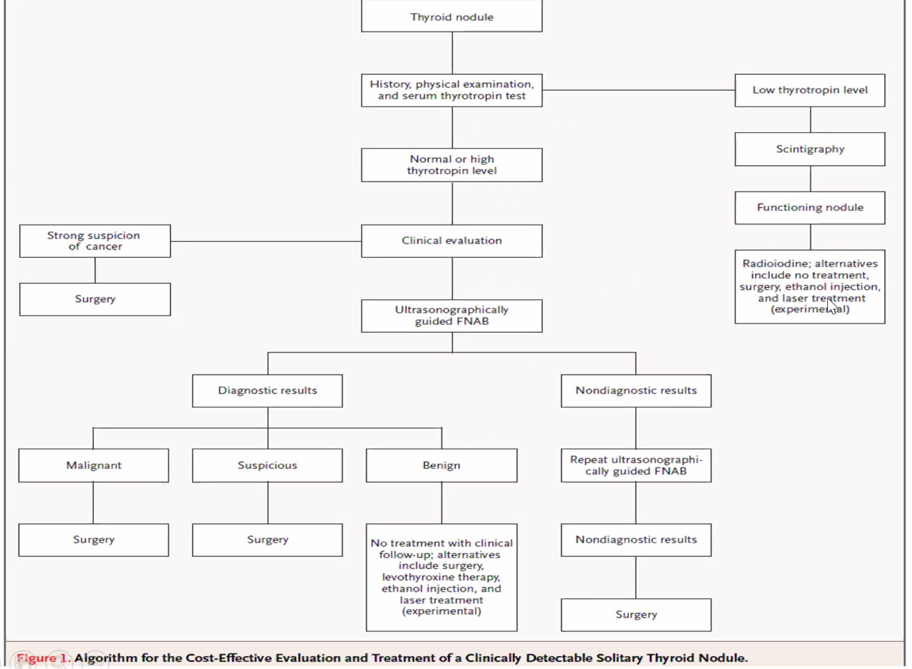

ENT
===

Questions
-   Doctor hop in Catarrhal child - switching between polyclinic may induce this; do we not have mechanism for continuity?

People
-   Gopal Krishna

General
-------

-   In childhood, because the immune system is still developing, they may have palpable lymph nodes.

-   ENT emergencies: epistaxis, aero-digestive foreign bodies, airway obstruction

Procedures required

-   Otoscope

-   Head and neck examination

-   Routine audiometric and vestibular tests

-   Voice and allergy testing

-   Hearing center - audiometric and vestibular assessments

-   Rehabilitation of hearing impaired children and cochlear implants

### Rinne and Weber Tests

| Condition                  | Rinne                  | Weber                             |
| -------------------------- | ---------------------- | --------------------------------- |
| Normal                     | AC \> BC in both ears  | Midline                           |
| Conductive hearing loss    | BC \> AC in affect ear | Lateralizes to the affected ear   |
| Sensorineural hearing loss | AC \> BC in both ears  | Lateralizes to the unaffected ear |
| Mixed hearing loss         | BC \> AC in affect ear | Lateralizes to the unaffected ear |

In conductive hearing loss, Weber test lateralizes to the affected ear because the conductive deficit masks the ambient noise in the room, allowing the sound to be better heard. In sensorineural hearing loss, Weber test lateralizes to the unaffected ear because the inner ear on the affected side is impaired and does not allow sound to be heard. Rinne because abnormal if there is a component of conductive problem in hearing lost only.

### Audiometry

Pure Tone Audiometry

-   For identifying the hearing thresholds

-   Need a very quiet room

-   Audiometer can be paired with different transducers: Bone vibrator, ear phone

-   Other than the tones, we can also do PTA, speech, tinnitus match, loudness discomfort level, aided

-   International audiogram symbols are used to document audiometry findings

-   Get (100 Hz + 1kHz + 2kHz)/3 for quantifying abnormality

-   Cross hearing can happen, masking or noise presented to the no-test ear helps

###Tympanometry
Assess the eustachian tube dysfunction

-   checks the status of the middle ear cavity, by putting a probe in the middle ear. The probe has three parts, one top generates tone, one generates pressure, one measures the reflected sound

-   Study the mobility of the ear drum

-   middle ear compliance: 0.3 - 2.5 cc is normal

    -   Type As - Increased compliance: very thin TM, ossicular discontinuity

    -   Type Ad - Decreased compliance: otosclerosis, thick scarring on TM

-   middle ear pressure: +/- 100 daPa

    -   C tyoe - pressure peak

    -   B type - perforated eardrum, decreased middle ear mobility

Speech Banana

### Cases

#### Vertigo in 55 year old man

55 year old man, nasal infection with left facial pain for past 16 days, increasing left facial pain involving left despite Klacid MR 500 mg bd for one week. Subsequently Augmentin 1g bd was prescribed with Predisone, cetirizine,

Resting nystagmus, fast phase left beating, more obious with Frenzels with obeys Alexandar law. No skew deviation and oculomotor tests were normal. Able to walk without aid. Audiogram shows normal hearing in the speech range. DHI scoring is 70% F32P18E20. Admitted for IV antibiotics and bed rest, also councelled about gaze stabilization exercises, nasal swab culture is pending.

symptoms of nasal infection with left facial pain for 16 days just as he was getting better, he had vertigo and sore throat.

-   Left beating nystagmus differentials

    -   Fast phase beats to normal peripherally i.e. peripheral right weakness

    -   Fast phase beats to problem centrally i.e. early stroke

-   Frenzel's goggles

-   Stopbang scoring for OSA

### Presentations

#### Rhinorrhea
- allergic, irritant-induced, corrosive rhinitis
- cerebrospinal fluid rhinorrhea
- intranasal cocaine use
- rhinitis medicamentosa

#### Epistaxsis

Primarily a pediatric conditions. Most of the bleeding is from the Little's area or Kisselbach's Plexus. This is the area of anastomosis of several arteries.

Reasons for epistaxis can be:

-   Spontaneous (90% - not serious) - typically due to crusts formation on the Little's area secondary to inhalation of dry air (e.g. in AC room)

-   Vascular lesions:

    -   haemangioma - excision under GA, rare

    -   angiofibroma

-   Blood dyscrasias

First aid: Pinch nose for about 10 minutes (or count slowly to 100). Most of the time this is enough and does not need to be cauterized. Chemical cautery using silver nitrate can also be used.

Embolization of the sphenopalatine artery is one method to control posterior epistaxis.

A complete blood count needs to be ordered in the case of severe epistaxis that may require transfusion. Coagulation studies are order in patients who are anticoagulated or have recurrent spontaneous epistaxis.

#### Ear Pain (Otalgia)

Red flags
- Severe otalgia
- immunocompromised / DM / debilitated
- LMN 7th nerve palsy with abnormal looking ear
- Neurological signs and symptoms

Perform ear examination
   - If normal: referred otalgia
     - dental disease
     - temporomandibular joint disorders
     - mucosal head and neck SCC
   - If abnormal
     - otitis external
     - otitis media

Differentials
- skin leisions: ecezema, basal cell carcinoma, scc, pinna hematoma
  

#### Ear Discharge

#### Facial Palsy: LMN
Entire face is implicated unlike in UMN facial palsy

#### Deafness / Hearing loss

Congenital Deafness vs Acquired Deafness

#### Balancing Problem

#### Vertigo / Dizziness

Note that approach from ER, neuro, neuroopthal, ENT are different

-   ER

    -   vestiular vs non-vestibular

    -   non-vestibular implies medical and surgical conditions; remember to do DRE because patient might be bleeding and resulting in hypotension

-   Neurologist: after confirming medical

    -   Vestibular cause - peripheral vs central

    -   Central vestibular cause - history, exam, oculomotor test, smooth pursuit,gze testing, nystagmus directional changing, up or downbeat, HINTs, VOR cancellation, gait, Rombergs etc.

-   Neuro-opthal

    -   With visual symptoms or without visual symptoms

-   Vestibular therapist

    -   function

    -   Unilateral vs bilateral

    -   Compensated or decompensated

Balance:

-   Physilogical: motion sickness (young female, mismatch of ocular vs vestibular, sit in front, mild sedative, height vertigo (ocular overload); the key is

-   Pathological

    -   Vertigo alone: vestibular neuronitis ddx anemia, hoTN, lupus and autoimmune condition, multiple sclerosis

    -   Vertigo with positional change: arnold chiari malgormation, BPPV (central vs peripheral - did the nystagmus fatigue - horizontal canal caplolithiasis),

    -   Vertigo with hearing loss and tinnitus: infection (Ramsay Hunt syndrome, influenza, mumps and measles, syphilis labyrinthitis), cholesteatoma with perilymph fistula, medical conditions e.g. lupus autoimmune conditions, syphilitic ladyrinthitis, vestibular schwannoma, meniere's disease (retrospective diagnosis, fluctuating)

    -   Vertigo with central symptoms and signs - LOC vs blackout, 3Ds dipoplia dysarthia, dysphasia, nystagmus ++, but minimal subjective symptoms e.g. vomiting, peripheral numbness or weakness, etc.

    -   Dysequilibrium of age

#### Tinnitus

#### Ear Discharge

#### Facial Pain
1. suppurative parotitis
2. mumps parotitis
3. tetanus
4. temporomandibular joint dislocation
5. malignant hyperthermia

#### Facial Palsy

#### Parotid Gland Swelling

-   Bilateral, non-tender - sialadenosis (alcohol, vit A def)

-   Bilateral, tender, after fever headache myalgia a few days prior - mumps

-   Bilateral, nontender, associated with dry mouth typically in woman - Sjogren syndrome

-   Unilateral, nonender - pleomorphic adenoma

-   Unilateral, tender, fluctuating, associated with eating - sialolithiasis

### Subdural Empyema

Extension of infection from paranasal sinuses through the underlying bone. Clinical findings include fever, headache, and mass effect signs (e.g. altered mental state).

### Cavernous sinus thrombosis

Most often due to contiguous spread of infection from the medial third of the face, sinuses, or teeth via the valveless facial venous system. Clinical findgins include headache, fever, cranial nerve deficits (e.g. diplopia), and proptosis.

### Spinal epidural abscess

These can be causedby hematogenous dissemination (e.g. intravenous drug abuse), continguous spread from vertebral osteomyelitis, or direct inoculation (e.g. epidural anesthesia). Symptoms include fever, focal back pain, and neurologic deficits.

### Neck Masses

Submandibular

-   Actinomyces lymphadenitis: submandibular mass with a draining sinus tract, typically occurs after dental infections or trauma in immunosuppressed patients and the sinus tract drain sulfur granules. Regional adenopathy is unlikely because the infection spreads by direct extension, ignoring normal tissue planes. rare infection presenting as a slowly progressive, nontender mass that can form abscesses and draining sinus tracts with characteristic yellow "sulfur granules". 

Midline

-   Thyroglossal duct cyst: tract between foramen cecum and base of anterior neck, cystic and moves with swallowing or tongue protusion, often presents after URTI.

-   Dermoid cyst: cystic mass with trapped epithelial debris, occurs along embryologic fusion planes, no displacement with tongue protusion

Lateral

-   Branchial cleft cyst: anterior to the SCM, tract may extend to the tonsillar fossa (2nd branchial arch) or pyriform recess (3rd branchial arch), often detected when it becomes secondarilyu infected after URTI, leading to

-   Reactive adenopathy: firm and often tender and multiple nodules

-   Mycobacterium avium lymphadenitis: necrotic lymph node, violaceous discoloration of the skin, frequent fistula formation

-   Laryngocele is an outpouching of the laryngeal mucosa that can be congenital or acquired. If it protudes through the thyrohyoid membrane, it can present as a lateral neck mass. It characteristically enlarges with Valsalva maneuver due to inflation with air. Acquired laryngoceles are classically seen in glassblowers or trumpet players due to repeated, intense oropharyngeal pressure.

Posterior

-   Cystic hygroma: dilated lymphatic vessels, and presents as a lateral cystic neck mass . It occurs most commonly in the posterior triangle of the neck and is typically diagnosed at birth or on prenatal ultrasound.

### The Catarrhal Child

Typical presentation

-   Gets 6 - 8 URTIs a year

-   In a childcare setting, this increases 4x to 24 - 26 times

-   Paraents complain that the child is perpetually having flu

-   Child may be subjected to several rounds of antibiotics and other symptomatic treatment; especially if they doctor hop.

### Voice Disorder

Auditory Conditions
--------------

### Pinna Hematoma

**Risk Factors**
- Frequent falls
- Minor trauma
- Anticoagulation
  
**Progression**
- Califlower ear when the cartilage dies
- Difficulty fitting hearig aid later on
- Blockage of the ear canal resulting in conductive hearing lost

**Management**
- Local anesthesia
- Anti-helix cut and drain the hematoma, pressure dressing to prevent blood from re-accumulating
- Dental role of pressure dressing onto the ear

### Pinna Perichondritis
Unlike cellulitis of the pinna, there is ear lobe sparing, so only the top two thirds, where there is cartilage, will be affected. Usually due to 

**Risk Factors**
- Young people with ear piercing
- Old people complication of otitis externa

**Complication**
- Califlower ear due to pinna necrosis and deformity
  
**Management**
- Quinolone e.g ciproflocixin
- 3rd gen cephalosporin

### Cellulitis of the Pinna
Entire ear is affected due to break in the skin, caused by skin organisms e.g. Staph and Strep

**Management**
- Penicilin
- Outpatient oral, inpatient IV if severe.

### Drug-induced Ototoxicity

Bilateral symetric SNHL: aminoglycoside, loop diuretics 
- These may compound age-related hearing loss

### Presbycusis
An aging condition affecting >50% adults by age 75, and is likely related to cochlear hair cell loss and cochlear neuron degeneration. Age-related brain atrophy also likely contributes (likely due to increased information processing times) and may explain the disproportionate problems with speech discrimination in older compared with younger patients with SNHL.
 
**Presention**
- Social withdrawal in elderly
- Trouble understanding speech when there is competing background noise.
- Tinitus often develops and is typically described as continuous ringing, rushing, or buzzing.

**Additional Clinical Feature**
- High frequencies are affected first, making it more difficult for patients to understand higher-pitched voices (e.g. woman, children). 
- Hear better in one-to-one conversations in quiet room, however, even a small amount of competing noise impairs hearing (e.g. speech discrimination)

**Management**
- Patient and patient family education
  - Limit background noise
  - Families should be counseled to look directly at patient when speaking to them
- Amplification (e.g. hearing aids) may be beneficial

### Cholesteatoma
An erosive, expansile mass of keratin debris in the middle ear. ALthough it may present with unilateral hearing loss, the hearing loss is usually conductive (i.e. BC > AC, lateralization to the affect ear in Rinne test), often with otorrhea and a pearly white mass in the middle ear.

### Otitis Externa

#### Necrotizing (Malignant Otitis Media)
Life threatening infection of the external auditory canal, extending to the skull base (osteomyelitis), typically caused by Pseudomonas Aeruginosa. 

**Presentation**
Ear pain - severe, unremitting, worse at night and with chewing (infection spread to TMJ)

**Risk Factors**
- Age > 60
- Diabetes Mellitus
- Aural irrigation (cerumen removal)

**Additional Clinical Features**
- Deficits of lower cranial nerves (e.g. CN II, CN X, CN XI)
- Otoscopy shows granulation tissue in the external auditory canal at the bony cartilaginous junction, edematous external auditory canal, often with purulent drainage

**Work up**
- Elevated erythrocyte sedimentation rate (ESR), although leukocyte count might be normal

**Management**
- Intravenous antipseudomonal antibiotics (e.g. IV ciprofloxacin - note risk of tendon rupture in elderly)
- $\pm$ surgical debridement for patients not responding to medical therapy
  
### Otitis Media

Acute if duration of Several types of OM

-   Purulent OM

-   Serous OM

-   Mucus OM

May resolve.

-   Management

    -   \<6mth: should be treated with antibiotics

    -   After 12 weeks, it becomes chronic, should drain.

    -   6mth - 2yr: cautiously observed first - depending on the certainty of the diagnosis, social supports, and clinical picture

    -   If \>2: observation without prescribing antibiotics

#### Children

Recurrent AOM - typically viral, no antibiotics

-   Chemoprophylaxia

-   Vaccination

-   Chronic case, use cromet tube, for 9 months to 10 months, and will drop spontaneously when it's done it's job

#### Adult

Jaw grows forward as we grow up,

#### Secretory Otitis Media

### Ramsay Hunt syndrome

Aka herpes zoster oticus, occurs when a shingles outbreak affects the facial nerve near one of your ears. In addition to the painful shingles rash, Ramsay Hunt syndrome can cause facial paralysis and hearing loss in the affected ear.

### Tympanosclerosis
Scarring of the tympanic membrane resulting in stiffening that may lead to conductive hearing loss in severe cases. Patients typically have a history of (typically chronic) otitis media, or previous tympanostomy tubes. Chalky, white patches are also often seen on the tympanic membrane.

### Otosclerosis

Otosclerosis results from an imbalance of bone resorption and deposition that leads to stiffening and ultimately fixation of the stepes, which dampens the transmission of sound energy from the tympanic membrane to the cochlea. It is inherited in an autosomal dominant pattern with incomplete penetrance. It tends to occur in younger Caucasian patients and is more common in women. Otosclerosis may progress during pregnancy.

**Presentation**
Progressive conductive hearing loss

**Additional Clinical Features**
-   Paradoxical improvement in speed discrimination in noisy environment (feature of conductive hearing loss). This is called oaracusis of Willis, possibly because CHL dampens the competing background noise, thereby allowing speech to be heard more clearly.
-   Reddish hue behind tympanic membrane; ear examination is generally unremarkable, although excessive bony resorption can expose underlying blood vessels, leading to a reddish hue sometimes seen behind the tympanic membrane.

**Management**

-   Hearing amplification using hearing aids
-   Surgical reconstruction of the stapes.

### Meniere's Disease
Increased endolymphatic fluid volume or pressure in the vestibular system. 

**Presentation**
-   Episodic vertigo lasting 20 min to 24 hrs, asymmetric sensorineural hearing loss, and aural fullness
-   Lack specific identifiable triggers.

**Management**
-   Conservative e.g. salt restriction, diuretics, vasodilators, labyrinthine sedative e,.g. Stemetil, Stugerone; more than 2/3 patients symptoms resolve on it's own.
-   Patient education on vertigo
-   Surgery
    -   Destructive: vestibular nerve section, labyrinthectomy, gentamicin infusion of the middle ear
    -   Reconstructive surgery: steroid infusion of the middle ear, endolymphatic sac surgery
    -   Others: Meniert's pump
    -   Advances: vestibular implant

### Eustachian tube dysfunction
May present with asymmetric conductive hearing loss. Typically accompanied by pain, popping sounds, and middle ear effusion.

### Perilymphatic Fistula
Inner ear contains endolymphatic fluid-filled semicircular canals (which convey movement and position of the head) and the cochlea (which is the sensory organ of hearing). Conditions that cause disruption of the endolymph flow can present with vertigo (semicircular canels) and/or sensorineural hearing loss (cochlea).

**Presentation**
Perilymphatic fistulas are a rare, but debilitating complication of head injury or barotrauma. They cause leakage of endolymph from the semicircular canals and cochlea into surrounding tissues, resulting in characteristic clinical features
- caused by damage to cochlear hair cells from loss of endolymph:  progressive sensorineural hearing loss
- pressure changes in the inner near (e.g. Valsalva maneuver, elevation changes) due to acutely increased endolymph leakage: episodic vertigo with nystagmus

**Diagnosis**
- Perfoming a loud clap near the patient's ear and observe for nystagmus (Tullio phenomenon)

**Management**
- Advise patients to limit activities that increase inner ear pressure
- Refer to ENT for further management
  
### Benign Proxysmal Positional Vertigo
Caused by debris (otoliths) that temporarily alters endolymph flow through the semicircular canals. Therefore, patients typically have sudden, brief (<1 min) episodes of vertigo triggered by head movement.

### Vertebrobasilar insufficiency
**Presentation**
Imbalance
A/w diplopia, perioral numbess, dysarthria, and ataxia

### Alport Syndrome

Lamellated basement membrane

Can cause hereditary SNHL due to damage of the basement membrane in the cochlea. Presents with recurrent hematuria in childhood.

### Acoustic Neuroma

### Vestibular Schwannoma
This is a benign tumor of CN VIII Schwann cells that forms in the internal auditory canal. CN VIII is comprised of both cochlear and vestibular nerves. Vertigo may not happen because of the tumor's slow growth allows for central compensation of gradual unilateral loss of input. 
Median age of patients is 50. Usually unilateral unless patient has neurofibromatosis type 2, in which case bilateral tumor may be seen. 

**Presentation**
CN VIII invasion: Asymmetric sensorineural hearing loss and imbalance
CN V and VII compression when tumpr expands from the internal auditory canal into the cerebellopontine angle: facial numbness and or paralysis

**Diagnosis**
1. Audiogram
2. MRI with contrast of internal auditory canal
   
**Management**
1. Observation in selected patients (e.g. small tumors, minimal symptoms, older or infirm patients)
2. Surgery
3. Radiation therapy

Nasal Cavity and Sinus Conditions
---------------

### Rhinoplasty complications

Complications are common following rhinoplasty, 1 in 4 may need revision. Common complications include patient dissatisfaction, nasal obstruction, and epistaxis. Those that involve the nasal septum are less common but more serious. The septum is made up of cartilage and has poor blood supply contrasting sharply with the rich anastomosing blood supply of the nasal sidewall. The underlying cartige relies completely on overlying mucosa for nourishment by diffusion. Because of the poor regenerating capacity of the septal cartilage, trauma, or surgery on the septum may result in septal perforation. The tyupical post-op presentation is a whistling noise heard during respiration. Following nasal surgery, septal perforation is typically the result of a septal hematoma though a septal abscess may also be the cause. Additional conditions that can cause septal perforation are self-inflicted trauma (nose picking), syphilis, tuberculosis, intranasal cocaine use, sarcoidosis, and granulomatosis with polyangitis (Wegner's).

### Septal Hematoma
Patient with nasal trauma and nasal obstruction with fluctuant swelling of the nasal septum has a septal hematoma, which is an accumulation of blood between the perichondrium and septal cartilage. Althought the incidence is rare, the complications of an untreated septal hematoma are significant. Infection can develop rapidly (2-3 days) leving to a septal abscess. In addition, because the septal cartilage has no direct blood supply and receives all nutrients via diffision from the perichondrium, a septal hematoma can cause avascular necrosis of the septal cartilate. Destruction of the nasal septal cartilage can result in septal perforations, external nasal deformities (e.g. saddle nose), or internal nasal valve collapse (i.e. nasal obstrction).

Therefore, all patients who sustain nasal trauma undergo examination of the nasal septum. Palpation can differentiate between a deviated nasal septum (firm) and a hematoma (fluctant and soft). Patients with a septal hematoma require prompt incision and drainage. After incision and drainage, anterior nasal packing should be placed to compress the perichondrium to the nasal septum; ice packs and NSAIDs can reduce edema due to inflammation. Patients are treated with antibiotics and require otolargynology evaluation after a few days for packing removal and evaluation.

### Nasal Furunculosis

Nasal furunculosis is a localized infection of the hair-bearing nasal vestibule. It is usually caused by the bacteria S aureus. It can occur as a primary infection or secondary to chronic rhinorrhea, upper respiratory infections, and nose picking. It is potentially life threatening as it can spread to the cavernous sinus. Patients complain of pain, tenderness and erythema in the nasal vestibule.

### Allergic Rhinitis

**Presentation**
- Bilateral rhinorrhea
- Severe rebound nasal congestion
  
**Additional Clinical Features**
- Personal and family history of atopy
- Pale or bluish, boggy, edematous turbinates
- A/w sneezing, itching, and watery eyes

#### Children

Complications / Presentation

-   Asthma

-   Ostitis media

-   Sinusitis

-   Sleep apnea

-   Failure to thrive

-   Chronic cough

If you treat AR well, the child may not progress to having asthma.

Physical exam

-   Lots of swollen tissue

-   Yellow secretion - not infection!

Management

-   Do a lot of counselling: Dust mite protectors

-   Above 6 year old, we do skin prick test, unless a patient has been taking antihistamine or immuno supressants recently.

-   Intranasal corticosteriods

    -   Mometasone: 2 years onwards

    -   Fluticasone: 4 years onwards

    -   Triamcinolone: 6 years onwards

    -   Budesonide: 6 years onwards

-   Antihistmine: desloratidine, claritin etc. if the child only has running nose.

Beware of glucocorticoid overloading in atopic children! the child may be receiving g steroid therapy for eczema, asthma, and rhinitis.

#### Adult

### Acute Sinusitis

Complication

-   Orbital cellulitis and subperiosteal abscess; if eye movement is restricted and visual acuity is dropping, then we have to drain the child

### Nasal Polyposis

Recurrent bacterial sinusitis may result in nasal polyposis. This may manifest with nasal congestio and thick rhinorrhea. Recurrent sinusitis is not typically assoiciated with NPC.

### Cerebrospinal fluid rhinorrhea
Usually due to accidental trauma (especially to skull base), but can also be due to surgical trauma (e.g. sinus surgery) or non-traumatic events (e.g. elevated intracranal pressure).

**Presentation**
- persistent unilateral rhinorrhea with salty or metalic taste
- meningitis if complicated

**Evaluation**
- Test for CSF specific proteins (beta-2 transferrin, beta-trace protein)
- Imaging (with intrathecal contrast)
- Endoscopy ($\pm$ intrathecal fluorescein dye)

**Prognosis**
- At risk for meningitis due to nasal flora comtamination of the CSF

**Management**
- Bed Rest, head of bed elevation, avoidance of straining
- Lumbar drain placement
- Surgical repair

Nasopharyngeal Conditions
-------------------
Nasopharynx links the nasal cavity with the orophargynx.

### Nasopharyngeal Carcinoma
NPC is endemic to Asia. Linked with reactivation of EBV. Tumors typically express EBV DNA and EBV assays are often used to monitor treatment response and disease replase. NPC is endemic to Southern China and parts of Africa and Middle East. Risk is thought to be higher in these locations due to diet (salt-cured food, early exposure to salted fish) and genetic predispositions. Tobacco smoking is also a risk factor.

**Presentation**
Obstruct the nasophargynx: nasal congestion, epistaxis, and headache
Mass effect: cranial nerve palsies (e.g. facial numbness), and/or serous otitis media (eustachian tube obstruction)
Local spread: Early metastatic spread to the cervical lymph notes may cause a nontender neck mass.

**Diagnosis**
Endoscope-guided biopsy of the primary tumor.

**Prognosis**
Survival is excellent if the neoplasm is discovered early, but most patients present with advanced disease.

**Treatment**
Combined chemotherapy and radiation therapy

### Bisphosphonate-related osteonecrosis of the jaw
Due to impaired bone remodeling. 

**Presentation**
Oral pain

**Risk factors**
- High dose parenteral bisphosphonate, e.g. zoledronic acid, for cancer of osteoporosis
- Dental procedures
- Concurrent glucocorticoid use
- Concurrent or previous malignancy

**Clinical Features**
- chronic indolent symptoms
- mild pain and swelling
- exposed bone, loosening of teeth, pathologic fractures
- mandible is more commonly affected than the maxilla

**Prognosis**
- Course can be intractable
  
**Management**
- Prevention: Dental consultation and complete dental procedures before initiating bisphosphonate theray
- Largely supportive: oral hygiene and antibacterial rinses
- Oral antibiotics and limited debridement only when needed

Oral Cavity Conditions
-------------------------

### Leukoplakia
This a white granular patch or plaque, often over the buccal mucosa. 

**Risk factors**
Similar to those of squamous cell carcinoma, with smokeless tobacco and alcohol use accounting for the majority of the cases. 

**Natural Progression**
The natural history of oral leukoplakia depends on the degree of dysplasia, with 1 - 20% of the lesions progressing to squamous carcinoma within 10 years. Fortunately, most lesions resolve within a few weeks after cessation of tobacco use. The development of areas with induration and/or ulceration should prompt biopsy to rule out malignant transformation of the leision. 

Although leukoplakia (white mucosal lesion) is often a benign, asymptomatic condition, evolving oral leukoplakia that is nonhomogeneous and friable (e.g. tasting blood) is concerning for squamous cell carcinoma, especially in a patient who uses smokeless tobacco.

### Oral Candidiasis or Thrush

Occurs in patients with diabetes, immunodeficiency states, and use of antibiotics or inhaled glucocorticoids. The leision of candidiasis typically consists of white plaques on the oral mucosal, tongue, or orophargynx with underlying erythema. In contrast to leukoplakia, the plaques of candidiasis can usually be scraped off with a tongue depressor. 

### Gingivostomatitis
Caused by HSV1 and presents with multiple vesicular lesions with erythematous and inflammatory base and erythematous border within the oral cavity and perioral area.

### Ludwig's Angina
Rapidly progressive bilateral cellulitis of the submandibular and sublingual spaces, most often arising form an infected mandibular molar. Clinical finding include fever, dysphagia, odynophagia, and drooling.

### Palatal fracture
Chronic complications
- dental malocclusion
- temporomandibular joint dysfunction
- complicated wounds

### Squamous Cell Cacinoma of the Oral Cavity
Risk factors include extensive use of tobacco and alcohol. SCC usually presents as persistent nodular, erosive, or ulcerative lesions with surrounding erythema or induration. Regional lymphadenopathy can be present as well. The white granular lesions in this patient are more consistent with oral leukoplakia.

Oropharyngeal Conditions
------------------------

### Maxillofacial vascular malformation

### Torus Palatinus 

A benign bony growth (i.e. exostosis) located at the midline suture of the hard palate. It is thought to be caused by both genetic and environmental factors and is more common in women and Asian individuals. TP can be congenital or develop later in life. Similar lesions at the lingual surface of the mandible are terms "tori mandibulari"

TPs are usually <2 cm in size but can gradually enlarge over time. They are typically asymptomatic and are frequently ignored by the patient but noted by clinicians or family members when examining the mouth for unrelated reasons. However, the thin epithelium overlying the bony growth may ulcerate with minor trauma of the oral cavity and heal slowly due to poor vascular supply. The diagnosis is obvious on clinical grounds.

Surgery is indicated for patients in whom the mass becomes symptomatic, interferes with speech or eating, or causes problems with the fitting of dentures later in life.

### Herpangia

Caused by coxsackie A virus and presents with fever, sore throat, and odynophagia. It is most common in childrem.

**Presentation**
- characterized by vesicles on the tonsils and soft palate.

### Foreign Bodies

A unilateral foul smelling mucopurulent nasal discharge in a child is pathognomonic of FB. The FB may be introduced by the child him/herself or by a sibling. Adults may have foreign body impaction as well, just less common.

### OSA

### GERD/LPR
  
### Aphthous Stomatitis / Ulcers
Localized shallow painful ulcers with a gray base, that typically present with erythematous border and a white membrane covering the ulcer. They typically resolve in 1 - 2 weeks and are usually seen in the oral cavity (e.g. tongue, buccal mucosa).

**Management**
Topical glucocorticoids are sometimes used to treat aphthous ulcers, which tend to be multiple, painful, and short-lasting (\<2 weeks)

### Tonsillolith
Tonsil stones are commonly occuring concretions of food, cellular, and bacterial debris. These can be managed with gental removal (e.g. gargling with salt water). However, frequent manipulation (e.g. with toothpicks) can cause mucosal trauma, which may be mistaken as an ulcerated neoplasm.

### Infectious Mononucleosis
This is due to Epstein-Barr Virus (EBV), and may cause enlarged tonsils and lymphadenopathy. Usually associated with fever. EBV is also associated with certain lymphomas (e.g. Burkitt) and with nasopharyngeal cancer.

### Group A Strep pharyngitis
Usually presents with acute-onset sore throat, tonsillar exudates, cervical lymphadenopathy, and no cough (Centor criteria).

### Uncomplicated Tonsilitis
Characterized by tonsillar erythema and exudates, often with tender anterior cervical lymph nodes and palatal petechiae.

### Peritonsillar Abscess

Also known as quisy, it is a complication of tonsilitis and is an acute bacterial infection of the region between the tonsil and the pharyngeal muscles. It begins as persistent tonsillitis/pharyngitis and progresses to cellulitis / phlegmin, with pus collecting into an abscess within a week of symptom onset. PTA is most common in older adolescents and young adults, and drug or alcohol use increases the risk.  

**Presentation**
- Spasms of jaw muscles (trismus)
- Muffled or "hot potato" voice
- Swelling of peritonsillar tissue with deviation of the uvula to the contralateral side
- Pooling of saliva
- Typically have prominent unilateral lymphadenopathy

**Prognosis**
The condition can be fatal secondary to either aiway obstruction or spread of the infection into the paraphargyngeal space, which may lead to involvement of the carotid sheath.

**Management**
- Needle aspiration or incision and drainage if the purulent material cannot be removed with aspiration alone.
- Intravenous antibiotics therapy to cover Group A hemolytic streptococci and respiratory anaerobes
 
### Fusobacterium necrophorum (Lemierre Syndrome)
This is a life-threatening, deep neck space infection that progresses to suppurative thrombophlebitis of the internal jugular vein. It presents with painful pharyngitis and odynophagia. It also has a acute (<1 week) and toxic presentation with high fevers (>39 C) rigors, and respiratory distress from associated septic pulmonary emboli. 

### Infectious Epiglottis

This is a rapidly progressive and life-threatening disorder. Hib and Strep pneumoniae are the most common causative agents. Further risk is increased if there is diabetes mellitus, obesity, and preceding upper respiratory infection (disruption of the respiratory epithelium creates a portal of entry for bacteria) increasing infection risk.

Presentation

-   Children: classically sudden onset of drooling, dysphagia, distress

-   Adult: suble onset of sore throat, fever, laryngotracheal tenderness to palpation; with worsening swelling, difficulty swallowing, pooled oral secretions, and respiratory compromise (tachypnea, stridor) can develop.

Diagnosis

-   Lateral neck radiograph: enlarged epiglottis with the loss of vallecular air space, and / or distended hypopharynx.

-   Respiratory compromise is less common in adults but can progress quickly, therefore, patients with significant compromise (e.g. hypoxia resistant to noninvasive intervention) require airway establishment (intubation) prior to considering neck radiograph.

Management

-   In patient unable to maintain adequate oxygen saturations, bag-valve-mask ventilation with 100% oxygen (to keep oxygen saturation %) should be initiated. If BVM does not result in adequate oxygenation, endotracheal intubation using a video laryngoscope (to facilitate direct visualization of the epiglottis) should be attempted. Howeverm given the risk of rapid respiratory deterioration, failure of a single attempt at endotracheal intubation with a video laryngoscope should immediately prompt the establishment of a surgical cricothyrotomy by the most experienced provider available (preferably a otolaryngologist or general surgeon). Cricothyrotomy establishes an airway below the epiglottal swelling and potential obstruction.

-   Once the airway is stablized, antimicrobial therapy is needed to clear the infection.

    -   Untreated HIV with white plaques on the orophargynx - Candida

    -   Broad-spectrum antibacterial agents (e.g. vancomycin, ceftriaxone)

-   Steroid to reduce edema around epiglottis

### Adenotonsillar Hypertrophy
These are usually seen in early childhood and regress with age. They are unlikely to cause symptoms in an adolescent but may occasionally obstruct the nasopharynx, leading to OSA or recurrent tonsillitis.

### Tonsil Adenocarcinoma
This is the most common tonsil malignancy. 

Salivery Gland Conditions
---------------------

### Sialadenosis

Benign noninflammatory swelliung of the salivary glands, which can result from overaccumulation of secretory granules in acinar cells (possibly due to abnormal autonomic innervation) in patients with chronic alcohol use, bulimia, or malnutrition

-   Presentation

    -   Gradual enlargement of the glands that does not fluctuate and is no associated with eating.

-   Management

    -   Investigate underlying disease e.g. alcoholism, vitamin A deficiency

### Mumps Parotitis
Present with parotid swelling. However, it is typically painful and presents a few days after the onset of systemic symptoms (e.g. fever, headache, myalgias).

### Suppurative Parotitis
Retrograde seeding of bacteria from oral cavity (e.g. Staphylococcus aureus, oral flora) through Stenson's fuct to the parotid gland. Patients then have rapid-onset and excruciatingly painful swelling of the involved parotid gland that is aggravated by chewing. 

**Presentation**
- Facial swelling
- Facial pain
- Limited jaw movement

**Risk factors**
- Elderly, dehydrated, postsurgical, dementiated
- Decreased oral intake (e.g. NPO perioperatively)
- Medications (e.g. anticholinergic)
- Obstruction (e.g. calculi, neoplasm)

**Additional Clinical Features**
- Exquisite tenderness exacerbated by chewing and palpation
- Firm, erythematous pre/postauricular swelling
- Trismus, systemic findings (e.g. fever, chills)
- Elevated serum amylast without pancreatitis

**Management**
- Ultrasound or CT scan to look for ductal obstruction and abscess
- Hydration, oral hygiene
- Antibiotics
- Massage ie. milking pus out of gland
- Sialagogues

Laryngeal Conditions
---------------------

### Reflux Laryngitis

**Presentation**
- Hoarseness
- Dysphagia

### Vocal Cord Polyps
Often occur due to inefficient or excessive voice use (e.g. teachers, telemarketers). 

**Presentation**
- Hoarseness due to impaired vocal cord vibration

**Additional Clinical Features**
- Do not invade or ulcerate

### Recurrent Respiratory Papillomatosis
Constant or progressive hoarseness is often related to a vocal cord lesion and requires evaluation by laryngoscopy. Irregular, exohytic growths in clusters on the surface of vocal cords is likely laryngeal papillomas due to recurrent respiratory papillomatosis (RRP). These lesions are often warty or grapelike, and as with skin papillomas, have dark-red punctate areas corresponding to blood vessels. Laryngeal papillomas care caused by human papillomavirus (HPV) subtypes 6 and 11. Infants typically acquire HPV via vertical transmission, adults may develop symptoms due to reactivation of vertically transmitted HPV or from exposure of HPV through sexual contact. 

Although benign, RRP is associated with significant morbidity (e.g. voice outcomes, airway obstruction, repeated operative interventions). In addition, clinical course is variable and unpredictable with fluctations in severity. In rare instances, it can spread beyond the vocal cords to involve the lower respiratory tract. Medical therapy (e.g. interferon, cidofovir) has limited efficacy, therefore the mainstay of treatment is surgical debridement, and patients often require many procedures. 

Smoking can cause maglignant transformation of RRP.

### Laryngeal Candidiasis
Opportunitic infection that often occurs conurrently with oral candidiasis in patients using corticosteroid inhalers (e.g. due to COPD). 

**Clinical Feature**
- White patches or plaques on mucosal surface

### Laryngeal Squamous Cell Carcinoma
This accounts for >90% of lesions in adult larynx. 

**Presentation**
- Persistent hoarseness of voice due to impaired vibration or movement of the vocal cords.
- Dysphagia due to blockage of passage of food
- Breathlessness secondary to airway obstruction
- Referred otalgia facilitated by either the glossopharyngeal nerve (CN XI) which innervates the base of the tongue and the external auditory canal, or the vagus nerve CNX which innervates part of the largynx/hypopharynx and the EAC
- Hemoptysis due to tumor friability (e.g. blood crusting)
- Neck mass due to regional nodal metastasis resulting in cervical adenopathy

**Risk Factors**
- Smoking
- Alcohol use

**Management**
- Persistent hoarseness of more than 30 days should always be evaluated by laryngoscopy to ensure no delay in diagnosis of possible cancer

### Laryngeal Adenocarcinoma
Accounts for <1% of laryngeal malignancies. 

**Risk Factors**
- Smoking
- Age

General Neck Conditions
-----------------------

### Retrophargyngeal Abscess

Presents with neck pain, odynophagia, and fever. May be due to penetrating trauma to posterior pharynx. Examination findings may include nuchal rigidity and bulging of the pharyngeal wall. These can progress quickly with potentiall fatal complications.

Infection within the retropharyngeal space drains inferiorly to the superior mediastinum. Spread to the carotid sheath can cause thrombosis of the internal jugular vein and deficits in cranial nerves IX, X, XI, XII. Extension through the alar fascia into the danger space can rapidly transmit infection into the posterior mediastinum to the level of the diaphgram. Acute necrotizing mediastinitis is a life-threatening complication characterized by fever, chest pain, dyspnea, and odytnophagia, and reuqires urgent surgical intervention.

### Surgical Neck Hematoma

Patient with enlarging fluid collection (ballotable neck swelling) after thyroidectomy likely has an expanding neck hematoma, or vascular compression causing venous congestion leading to laryngeal edema. Stridor, dysphagia, voice changes, with tripor positioning are all signs of increasing upper airway obstruction; however, patient can initially have few or no symptoms (e.g. only mild neck tightness). Patient can often maintain their peripheral blood oxygenation concentration until rapidly (\<1 min) decompensation.

Management

-   Immediately evacuate the hematoma (including at the bedside if necessary) by re-opening the incision and removing blood collection

-   The wound should then be explored in the operating room to control the source of bleeding, and the the patient's airway should be evaluated to assess for laryngeal edema and need for protective endotracheal intubation (until the edema subsides).

### Head and Neck Squamous Cell Carcinoma (HNSCC)

Most cancers of the head and neck arise from squamous epithelial cells that undergo stepwise, premalignant changes (i.e. hyperplasia to dysplasia to carcinoma). Lesions may initially manifest in the oral cavity as hyperplastic or dysplastic white (Leukoplakia) or red (erythroplakia) patches (which is likely what as noted on the patient's initial biopsy). Because these lesions are at right of malignant transformation, patients require counseling regarding risk reduction (e.g. tobacco chewing cessation), regular examination of the oral cavity, and rebiopsy if changes (e.g. thickness, firmness) are seen. If bioosy results are cancerous, regional metastatic spread to the cervical lymph nodes is highly likely; therefore, a CT scan of the neck with contrast should also be obtained, both to evaluate the extent of invasion and characterize the metastatic nodal spread.

Risk factor
- older age (>40)
- tobacco
- alcohol exposure
- poor dentition
- immunocompromised status 

Presentation
- Orophargyngeal SCCC may present with sore throat and odynophagia due to tumor invasion or local irritation. 
- Referred otalgia (ear pain in the setting of a normal ear examination is often referred otalgia)
- Persistent enlarged firm neck mass and ulcerated / friable tonsillar lesion
- A/w pharyngitis, dysphagia, halitosis

Management
- Biopsy of lesion with evaluation of HPV status (for tonsil lesion)
- neck imaging to characterize lesion and associated nodal metastasis
- endoscopic evaluation of the aerodigestive tract

#### HPV-positive HNSCC
Often seen in younger patients with NO tobacco exposure and multiple sexual partners. HPV-positive HNSCC primarily affects the oropharynx (possibly due to the higher concentration of lymphatic tissue facilitating viral processing) and often with neck lymphadenopathy. 

It is more responsive to therapy than HPV negative NHSCC. The most common causative agent is HPV-16, which is covered by the HPV vaccine.

### non-Hodgkin Lymphoma
Causes tonsillar enlargement rather than ulceration and is usually seen in patients with immunosuppression or autoimmune diseases.

Systematic Conditions with ENT presentations
-----------

### Granulomatosis with polyangitis
Vasculitis that commonly cause ear (otitis) and nasal (rhinorrea, bloody discharge) symptoms. Patients usually have systematic manifestations including fever, malaise, weight loss, and ulcerative lesions.

### Mucormycosis
A fungal infection primarily seen in patients with diabetes mellitus or significant immunocompromise. 

**Presentation**
Rapidly progressive fever, facial pain, nasal congestion, and changes in vision or mentation

**Additional Clinical Features**
- Necrotic destruction of bone may occur and examination often reveals black eschars.
- Pan-sinusitis
- Purulent rhinorrhea
- Almost exclusively on immunocompromised patients
  

Thyroid Conditions
------------------

### Approach to Thyroid Nodules

Thyroid nodules are common and may be diagnosed on physical examination or noted incidentally when imaging studies are obtained for other reasons. Once a thyroid nodule is found, cancer risk factors (e.g. family history, radiation exposure) should be assessed by history. Physical examination should evaluate the approximate size, mobility, and firmness of the thyroid nodule and wheather enlarged cervical lymph nodes are present. A serum TSH should be obtained.

If TSH is low, radionuclide scans may be done. Such nodules are unlikely to be malignant.

If serum TSH is normal, a thyroid ultrasounds is conducted to determine nodule sonographic features and size. Certain sonographic features (e.g. microcalcification, irregular margins, internal vascularity) carry a much higher risk of malignancy than others (e.g. cystic or spongiform lesions). Thyroid nodules $>1$cm with high-risk sonographic features should undergo fine-needle aspiration biopsy. Thyroid noduldes $>2$cm should all undergo FNA unless they are cystic, as they have a lor risk of malignancy.

Pregnant women undergo the same evaluation but should not receive radioactive iodine (for either diagnosis or treatment), because it can lead to congenital hypothyroidism, intellectual disability, and increased risk of malignancy in the fetus. If a thyroidectomy is needed, it can often be delayed until after delivery. However, should the workup reveal a more aggressive or rapidly growing thyroid cancer, the optimal timing of surgery would be during the second trimester.

Thyroglobulin is produced by both normal thyroid tissue and differentiated thyroid cancer cells. Therefore, it is a useful tumor marker to monitor for recurrence after the thyroid gland has been completely removed.

Notes from Lim 
- One key diagnostic procedure is to know if the thyoid nodule is: Euthyroid, hypothyroid, OR hyperthyroid
- When should sonographybe performed
  - In all patients with one or more thyroid nodules
- Why is a diagnostic US necessary? 4 S of sonography
  - Confirmation of a sonographically identifiable nodule corresponding to the palpable abnormality (16% no corresponding nodules on US)
  - Get *Size* and Detection of additional non palpable nodules for which FNA may be indiciated (15% >1cm)
  - Sonographic features of the nodule: Consider they Thyroid Classification
    - echogenicity - **hypo**, hyper iso
    - calcification - **micro**, dense
    - margins - **infiltrative**, well-defined regular
    - vascularity - **intranodular**, peripheral absent
    - shape - **taller than wide**
  - Seek confirmation
  - Surrounding structure - suspicious cervical LNs present in the central compartment, posteriorly located thyroid nodule
- Initiatial assessment is ultrasounds then check TSH, if suppressed, do thyroid scan, if normal or elevated  - euthyroid state, do fine needle aspiration cytology
- Fine needle aspiration (FNA) is to put a 23 gauge needle into the nodule, sensitivity is 83% and specificity of 92%
- Allows real time direct visualization of the nodule when done under U/S guidance

Classification of FNAC, there are many 
* Non-diagnostic
* benign
* follicular lesions with indetermine sign risk 5 - 15\%
* 30%
* Suspicious 80%
* Malignancy 90 - 95%
Bedestial IV

Patients with cat IV need diagnostic thyroidectomy
Cat III repeat in 3-6 month
Cat II if not obstructive, repeat with U/S

What is the risk of malignancy in a multinodular goitre versus a single nodule? No consensus, multi slightly higher
Management algoirthm 
- history
  - Ascertain risk of thyroid CA e.g. hx of radiotherapy to H&N, certain deographics such as prior exposure to radionuclear accidents
  - -obstructive symptoms present?
  - Thyroid status
- PE: examine h&n, thyroid and cervical lymphadenopathy; if there is hoarseness need to do flexible larynoscope; if there is vocal cord palsy on the same side as the thyroid nodule, malignancy until proven otherwise
- u/S + TSH +/- US guided FNA
  - Identify high risk nodules
  - size of nodules may influence the adquare yield of cellular material
- FNA malignant or suspicious -> surgery
- FNA equivoval U/S suspcious -> surgery
- FNA benign -> repeat US in 6 -12 month
Overall individualized approach with these principles

### Useful Studies

Thyroid Panel
- Thyroglobulin - glycoprotein that serves as a substrate for production of thyroid hormone. levels are elevated in differentiated papillary thyroid cancer, for which it is used as a cancer marker. Thyroglobuline levels are also elevated in goiter, Graves disease, and thyroiditis. 
- Thyroid scintigraphy uses radiolabeled iodine to assess iodine uptake as a marker for thyroid metabolic activity; papillary and follicular thyroid caners take up radiolabeled iodine.
- Serum thyroxine is used in the initial diagnosis of hypo- and hyperthyroidism.
- TSH is used to titrate levothyroxine in thyroid hormone replacement therapy.

Histology on FNA
- Hurthle cells

### Inflammatory Thyroid Conditions

#### Hashimoto Thyroiditis 

This is a chronic lymphocytic thyroiditis, and patients may have anti-thyroid peroxidase antibodies.

### Thyroid Cancers

Management of thycoid cancer is based on risk stratification in order to make the following decisions
1. Extent of surgery - either lobectomy versus total thyroidectomy
2. Need for radioactive-iodide scan / ablasion (only in patients with total thyroidectomy)
3. Surveillance strategy
   
Total thyroidectomy
- not indiciated if tumor is less than 1 cm
- 1 - 4 cm total thyroidectomy only for patients with older age (>45 y/o) contralateral thyroid nodules, a personal history of radiation etc
- \>4cm and extension

Central compartment dissection
- indicated in patients with clinically involved central node
- may be considered in patients ith papillary thyroid carcinoma with clinially uninvolved central neck lymph nodes (cN0 ) who have advanced primary tumor (T3 T4) or clinically involved lateral neck nodes (cN1b) or if ino will be usd to plan further steps in therapy
- Not inidicated, small, non invasive, follicular CA (no tendency to spread)

Radioactive Iodine
- ATA low risk [T1a, N0, Nx, M0, Mx]; tumor size < 1cm (unilateral or multifocal) - not indicated
- ATA low risk [T1b, T2, N0, Nx, M0, Mx]; tumor size 1 - 4 cm: Not routinely given by need to consider for patients with aggressive histology or vascular invasion
- ATA low risk to intermediate risk [T3, N0, Nx, M0, Mx]: Need to be considered and take tumor size and age (55 y/o) into account
- ATA low intermediate risk (T3, N0, Nx, M0, Mx) or (T1-3 N1a, M0, Mx ) or (T1-3, N1b, M0, Mx): favored
- ATA high risk (T4 with any N or M or M1 with any T or any N): indicated 
Patients younger than 55, even with M1 disease, do very well. So the age cut-off is set to younger than 55.

Surgical anatomy
- Suyperior laryngeal nerve has internal and external branch, worry injury to the external branch
- Recurrent laryngeal nerve is important in patients with unilateral vocal cord palsy, sonographer need to cover the entire course of the nerve. 
- Ansa cervicalis to RLN re-anastomosis is mainly to preserve tone of the muscles, reduce largyngeal muscle atrophy; sometimes we can good movement, this is a bonus
- Berry's ligament, condensation fiascia, thyroid attachment to the trachea; When trachea moves up during swallowing, the thyroid also moves up.

Surgical technique approaches
- Central
- Remote approach / laterally

The general reported laryngeal reccurent nerve damage in surgery rate is 5%; but 1 - 2% is more typical.
Pathology report comes back in 1 week or so, start RAI then. 
Protocol for getting patient RAI
- TSH more than 30 mIU before we can do RAI; to stimulate iodine uptake
- Thyroxine withdrawal before TSH; may render patient hypothyroid
- Give recombinant TSH two injections a few days before
- Give T4 and then two days before the scan convert T4 to T3, render patient slightly hypothyroid

Nerve regeneration measure 

#### Follicular Thyroid Cancer (FTC)

#### Medullary Thyroid Cancer (MTC)
Neuroendocrine malignancy arising from calcitonin-secreting parafollicular C cells. Most cases of MTC are sporadic, although approximately 25% are due to germline mutations in the RET proto-oncogene (e.g. MEN2 - MTC, pheochromocytoma, and either parathyroid hyperplasia (2A) or mucosal neuromas (2B)).

**Presentation**
- MTC most commonly presents as an asymptomatic thyroid nodule. 
- A minority of patients have diarrhea and flushing due to hormones secreted by the tumor. 
- Unless there is concomitant *hyperparathyroidism* (e.g. MEN2A), serum calcium is usually normal, possibly due to down-regulation of calcitonin receptors. 

**Diagnosis and Evaluation**
- The diagnosis of MTC is confirmed with fine-needle aspiration. 
- MTC is often metastatic at the time of diagnosis, primarily to the cervical lymph nodes and upper aerodigestive tract, so always check.

**Management**
- Primary treatment is thyroidectomy, and therefore postoperative thyroid replacement therapy (i.e. levothyroxine) is necessary.
- Serum calcitonin levels correlate with the risk of metastasis and are measured at the time of diagnosis; they also correlate with risk of recurrence and are therefore measured serially following surgery.
- Carcinoembryonic antigen also correlate with disease progression and is typically measured with calcitonin.
