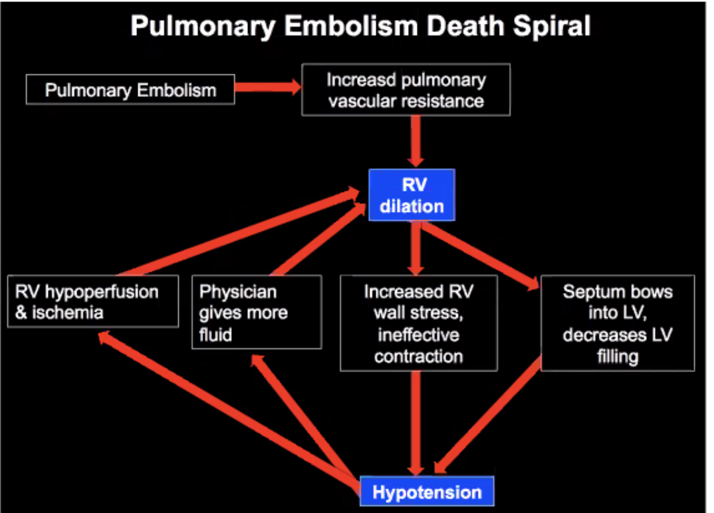

Framework / Approaches for Common Presenting Symptoms
=====================================================

This section discusses common frameworks and how to work-up common presentations. In all cases we want to consider

- Resuscitate (A,B,C,D)
- Treat symptoms, especially pain
- Treat underlying cause

Manage of symptoms are covered under these frameworks

Key sets of symptoms

| Symptoms             | What to ask                                                  |
| -------------------- | ------------------------------------------------------------ |
| Pain (general)       |                                                              |
| Pain (msk)           |                                                              |
| Bleeding Source      |                                                              |
| Bleeding Severity    |                                                              |
| Hydration            |                                                              |
| Vomiting             |                                                              |
| Diarrhoea            |                                                              |
| Pregnancy            | breast tenderness / swollen, n/v, spotting / cramping, food aversions or changes, headaches, constipation, mood swings, fatigue, faintness and dizzin |
| Mental status        |                                                              |
| Psychiatric symptoms |                                                              |

| Constellations                      | Symptomatic |
| :---------------------------------- | ----------- |
| Systemic inflammatory response      |             |
| Acute respiratory distress syndrome |             |
| Peritoneal signs                    |             |
|                                     |             |

Investigations

- 6 POC: POCT glucose, ECG, VBG/ABG, Urine dipstick, UPT, bedside U/S
- Lab: 
  - FBC, renal panel, cardiac enzymes
  - Liver panel, 
- Rad
  - 
- Special Invx:
  - VQ scans, 
  - MRI
  - Lumbar punctures

Treatment

- Primary treatment insulin
- Treat complications of diagnosis  - dehydration, co-infection; 
- Assess response to treatment
- Treat complication of treatment

### Telephone Triage

- Often collateral history

General
-------

### Fever

HR increases by 10 bpm per degree rise in temperature.

#### Definitions

| Term         | Meaning                                                      |
| ------------ | ------------------------------------------------------------ |
| Fever        | An elevation of normal body temperature in conjunction with an increase in the hypothalamic set point. |
| Hyperthermia | Uncontrolled increase in body temperature that exceeds the body's ability to lose heat WITHOUT a change in hypothalamic set point. |

- Heat injury, seizure

#### Diagnostic Approach

1. Stable or unstable

2. Infective or non-infective

3. If infectious

   1. Source and site of infection
   2. Causative organism - bacterial, viral, fungi
   3. If infection is contagious: contact tracing is required

4. If not infectious, consider

   - Metabolic: Thyroid storm, pheochromocytoma

   - Autoimmune / inflammatory: rheumatic fever, SLE

   - Environmental: heat stroke

   - Medications / drugs: neuroleptic malignant syndrome, sympathomimetics, serotonin syndrome, malignant hyperthermia

     | Drug induced syndrome                   | Associated Drugs                                             |
     | --------------------------------------- | ------------------------------------------------------------ |
     | Neuroleptic malignant syndrome          | Antipsychotics (haloperidol, olanzapine), some antiemetics (metoclopramide), widthdrawal of anti-Parkinson drugs |
     | Serotonin toxicity                      | SSRI, MOI, dextrometorphan, tramadol, tapentadol, linezolid, St John's Wort (toxicity most often occurs when the drugs are used in combination) |
     | Anticholinergic toxicity                | Antispasmodic, anticholinergic drugs, plant alkaloids (e.g. belladonna, Brugmansia), and mushrooms (e.g. Amanito) |
     | Sympathomimetic syndrome                | Phenthylamine e.g. amphetamines, methamphetamines (NMDA), cocaine, monoaminase oxidase inhibitors |
     | Malignant hyperthermia                  | Volatile anaesthetics and depolarising muscle relaxants e.g. suxamethonium |
     | Uncoupling of oxidative phosphorylation | Salicylates in overdose, dinitrophenol                       |

**History taking**

- Duration (day of febrile illness) and pattern (if any)
- Significant past medical history: pregnant, immunocompromised, malignancy etc
- Localising symptoms based on organ systems
- Significant travel and contact history with ill person or animal contact
- Occupations or new medications

**Treatment objectives**

- Antipyretic treatment for fever (will not work for hyperthermia, especially those that's drug induced, because the central temperature control mechanism is NOT working)
- Physical cooling should be initiated immediate in hyperthermia
- Subsequent treatment and monitoring depends on underlying cause of fever or hyperthermia

### Heat Stroke

- Core body temperature > 40.5, with CNS dysfunction
- 2 types of Heat stroke
  - Classical (non exertion) heat stroke
  - Exertion heat stroke

|            | Heat Exhaustion                                              | Heat Stroke                                                  |
| ---------- | ------------------------------------------------------------ | ------------------------------------------------------------ |
| Definition | Body temperature < 104&deg;F (40&deg;C)                      | >105&deg;F (40.5&deg;C)                                      |
| Symptoms   | Faint or dizzy, excessive sweating, cool, clammy skin, rapid, weak pulse, muscle cramps | Throbbing headache, no sweating, red / hot / dry skin, rapid strong pulse, may lose consciousness |
| First Aid  | Lay the person down  in ventilated area, drink water if fully conscious, spraying or sponging with cool water, fanning and monitor the person | Call local emergency number, lay the person down in ventilated area, with feet elevated, remove tight clothing, cool the person until help arrives |

**Management**

- Cooling
  - Remove clothing, sponge, fan the patient, apply body cooling units
  - Bedside inx: ECG, hypocount
  - Further investigation
    - Labs: FBC, electrolytes, CK, LFT, aptt/pt (risk of DIC)
    - IV fluids, catherization to measure urine output
  - Symptomatic management
    - Benzodiazepine for agitation

**Complications**

- Pulmonary oedema, ARDS, may require intubation if obtunded
- Myocardial injury
- Seizures 

### COVID 19

- Majority of patients with severe COVID19 have lymphophenia
- Some have disorders of 

Asymptomatic Transmission

#### Clinical Feature of COVID19

- Majority of patients with severe COVID19 have lymphopenia
- Some have disorders of the CNS or PNS
- Severe COVID19 may also lead to
  - Acute cardiac, kidney, and liver injury
  - Cardiac arrhythmias, rhabdomyolysis, coagulopathy, and shock
  - There organ failures may be associated with a cytokine release syndrome characterised by high fevers, thrombocytopenia, hyperferritinemia, and elevation of other inflammatory markers

#### Evaluation and management of severe COVID19

- Patients with severe coronavirus disease 2019 (COVID-19) may become critically ill with acute respiratory distress syndrome that typically begins approximately 1 week after onset of symptoms
- Deciding when a patient with severe COVID-19 should receive endotracheal intubation is an essential component of care
- After intubation, patients should receive lung-protective ventilation with plateau pressure &leq; 30 cmH2O and tidal volumes based on patient's height
- Prone positioning is a potential treatment strategy for refractory hypoxemia. 
- Thrombosis and renal failure are well-recognised complications of severe COVID19
- Data are needed from randomised trials to inform the benefits and risks of antiviral or immunomodulatory therapies for severe COVID19; as of mid-May 2020, no agents had been approved by the FDA
  - Preliminary data from a randomised, placebo-controlled trial involving patients with severe COVID19, suggest that the investigational antiviral **remdesivir** shortens time to recovery

### Sepsis

#### Definitions

**Sepsis**

SUSPECTED OR DOCUMENTED INFECTION and 2 or more of the following variables:

- Temperature >38.3c or <36c; 
- Heart rate >90/min; 
- Respiratory rate >20 breaths/min
- Acutely altered mental state
- Hyperglycaemia in absence of diabetes
- WBC **>12k**/mm3, **<4k**/mm3, OR **>10%** immature (band) forms
- Plasma CRP more than 2 SD above the normal value
- Plasma procalcitonin more than 2 SD above the normal value

**Severe Sepsis**

Defined as sepsis-induced organ dysfunction or tissue hypoperfusion:

- sepsis-induced persistent hypotension (SBP<90mmHg, MAP <70 or a SBP decrease >40mmHg from baseline)
- lactate >=4mg/dL
- oliguria

Organ system dysfunction must be remote to the site of infection with the exception of pulmonary criteria.

**Septic Shock**

Sepsis-induced tissue hypoperfusion not responding to **30ml/kg crystalloid** bolus.

#### Management

- Measure **lactate level**
- Obtain blood cultures prior to administration of antibiotics
- Administer broad spectrum antibiotics

**For severe sepsis**

- Administer 30 mL/kg crystalloid for hypotension or lactate &geq; 4 mmol/L

**To be completed within 6 hours for Septic Shock**

- Add vasopressors to maintain MAP &geq; 65 mmHg
- May consider measuring CVP and Scvo2
- Remeasure lactate if lactate is elevated

**DO NOT use Hydroxyethyl starch in Septic Shock (HES)** as it increases mortality, increases risk of renal impairment

#### Sepsis in Elderly

- Absence of fever response 
- Altered mental state/Confusion 
- Decline in general health 
- Unsteadiness/Falls
- Malaise/Lethargy/Immobility 
- Dizziness/Syncope

- Acute urinary or fecal incontinence

#### Neutropenic Sepsis

- A life threatening complication of chemotherapy
- A significant inflammatory response to a presumed bacterial infection in an oncological patient receiving chemotherapy with or without fever

**Management**

- Defined by an absolute neutrophil count (ANC) of less than 0.5 x 109/L
- To initiate empiric antibiotic treatment to ensure that occult infection is treated promptly

### Fever with Rash - Pediatrics

### Fever with Rash - Adult

### Social Withdrawal

## Eye Symptoms

### Anisocoria

**Anisocoria** is a condition characterized by an **unequal size of the eyes' pupils**. Affecting up to 20% of the population, **anisocoria** is often entirely harmless, but can be a sign of more serious medical problems.

**Causes of Anisocoria**

- the acute vestibular syndrome, the presence of anisocoria strongly suggests **lateral medullary infarct**

### Nystagmus

Nystagmus is a vision condition involving rhythmic, regular movements of the eyes. 

**How do patients present**

***Majority:*** reduce or blurred vision, affect depth perception, oscillopsia (environment moving back and forth), vertigo, balance and coordination and problem, abnormal head positioning.

***Minority:*** asymptomatic

**How to describe nystagmus**

- (Hx) ***Paroxysmal, continuous, or provoked*** ( e.g. as changes in gaze or head positioning)
- (Phy) ***Manifest, latent, or a combination of the two***
  - Manifest nystagmus is always present. 
  - Latent nystagmus occurs when covering one eye. 
  - Manifest-latent nystagmus is always present but worsens when one eye closes. 
- (Phy) ***Optokinetic*** (also known as pendular nystagmus) and ***vestibular*** (also known as jerk nystagmus).
  - Pendular nystagmus 
    - any direction – torsional, horizontal, vertical, or a combination of these.
    - can be monocular or binocular and can differ in both eyes.
    - characteristic finding: occurs **without fast phases**.
  - Vestibular nystagmus
    - has a fast phase and **classifies according to the direction of the fast phase**
    - eyes drift slowly in one direction and then jerk back in the other direction
    - upbeat, downbeat, horizontal, or mixed and is more common than optokinetic nystagmus

**Differential Diagnosis**

- ***oculogyric crises***: distinguishable from nystagmus as it is **arrhythmic**
- ***ocular bobbing***: more irregular and usually occurs in locked-in syndrome.

**Clinical Significance**

- Normal nystagmus
  - Infantile nystagmus 
    - usually develops by three months of age
    - horizontal movement and has correlations with conditions such as albinism, congenital iris absence, underdeveloped optic nerves, or congenital cataract
  - Spasmus nutans
    - Occurs in children age 6 months to 3 years
    - Improves without intervention between ages 2 through 8 years.
    - Characteristically, children will often nod or tilt their heads with this type of nystagmus, and the eyes may move in any direction.
- Causes
  - acquired nystagmus which develops later in adolescence or adulthood and can indicate a central nervous system issue
    - multiple sclerosis, head injury, brain tumor
    - metabolic disorder, medication side effect, hyperventilation, or even alcohol or drug toxicity

Psychiatric Symptoms
--------------------

### Depression

Depression is an alteration in mood, which can be confused with dementia in older patients. It frequently causes a decline in the ability to concentrate, which may worsen memory. Depression also leads to a lack of interest and energy, which may appear similar to the symptoms of dementia. Since depression is readily treatable, it is essential to diagnose this condition in patients who present with memory loss. In addition to representing the primary diagnosis, depression can be comorbid with dementia, and should be considered both because it may worsen symptoms related to dementia, and because it can be reversible.

Neurological Symptoms
---------------------

### Headaches

Primary vs secondary

- Primary: neurological vs non-neurological
- Secondary: life threatening vs vision threatening

Need to watch for acute glaucoma: mid dilated pupils, VA affected. EASILY MISSED! Time sensitive treatment


- Additional red flags: 
  - New onset in elderly older than 50 years
  - Worsening headache 

| Cases                                                        | Remark                                                       |
| ------------------------------------------------------------ | ------------------------------------------------------------ |
|  | Right EDH in the parental lobe, with associated fracture, hemocranium, |
|  | SAH along the fulx and on the left                           |
|  | Brain mets from breast CA                                    |
|  | Suprasellar mass; may have bitemporal hemianopia             |
|  | Bony erosions / lytic lesions; mets                          |
|  | starfish sign; ventricle is compressed, there is hydrocephalus from SAH; the aneurysm is on the right vertebral artery |
|  | Venous sinus thrombosis                                      |
|  | Left temporal lobe bleed;                                    |
|  | Subacute SAH (3 days to 3 weeks); isodense with the brain; also an old patient. |
|  | Dense MCA sign for MCS thrombotic stroke; dense basilar sign |
|                                                              |                                                              |

- Bone window can be selected post-hoc

| Red Flag             | Association                                                  | Action |
| -------------------- | ------------------------------------------------------------ | ------ |
| Thunderclap headache | Severe and explosive headache with peak intensity at onset. It is associated with **SAH**, cerebral venous sinus thrombosis, ICA dissection, 3rd reticle colloid cyst, pituitary apoplexy, posterior reversible enphalopathy, syndrome, benign idiopathic, migraine associated |        |


#### SAH

1% of all headaches at ED, +/- sentinel headache (severe and distinct headache preceding SAH, 20 - 50%  of patients with SAH); 85% of SAH cases are due to ruptured aneurysms (possible congenital weakness in the vessel wall, or degenerative changes resulting in destruction of elasticity of the vessel wall at points of high turbulence such as bifurcations), 20% risk of rebleeding, an most repeat bleeding occurs within the **first 6 hours**. 2 - 5% prevalence of unruptured intracranial aneurysms in the general population. 

- 12% worst headache of their life and NORMAL neuro exam
- 25% worst headache of their life and ABNORMAL neuro exam


**Hunt and Hess Classification for SAH to determine survival**


Physical

- Subhyaloid hemorrhage 20 - 40% in reduced GCS

2 pertinent investigations required for SAH

- CT head without contrast to look for bleed

  - Thicker cuts miss small collections of blood 

    Depending on who reads the scan, the sensitivity changes

    Sensitivity:

    - 98 to 100% within 12 hours of HA onset: ***can rule out SAH if there is negative CT within 6 hours, in neurological normal patient, a thunderclap headache presentation, a clear time of onset, and a modern CT scan performed within 6 hours of onset read by an attending radiologist***- NO NEED TO DO LP!
    - 93% within 24 hours
    - 86% after 1 day
    - 76% after 2 days
    - 58% after 5 days
    - 50% at 1 week

  - CT Angiography instead of LP

    - Incidental aneurysms: may still benefit from LP to distinguish from real SAH
    - Inability to detect small culprit aneurysms (sensitivity 92.3% for aneurysms < 4mm)
    - Patient issues, radiation, contrast use, costs

- Lumbar puncture for xanthochromia, RBC, high opening proceed, look for alternate diagnosis

  - When to do the LP; 
  - Xanthochromia is oxyhemoglobin and bilirubin from metabolised hemoglobin
  - Formation of bilirubin takes 12 hours (enzymatic process)
  - RBCs up to 20% of taps may be traumatic
  - So done within 12 hours
  - Even if we do LP, the yield for finding an aneurysm is still quite low (around 0.4%)
    - Two different animals: function of rarity of SAH; SAH only form 1% of SAH

**Management**

- Airway and GCS: good analgesics during RSI, maybe even using propofol
- BP control SBP <160 mmHg
- Reverse anti-coagulants
- Consider anti-epileptic drugs: blood is an irritant, may induce seizures
  - Keppra 1 g IV (levetiracetam) - good safety profile
- Interim measures for ICP management
  - 30 degree head up
  - Remove c-collar
  - Good sedation / analgesia
  - Reduce high PEEP
  - Mannitol 20%, 100 ml; OR hypertonic saline - preference for neurosurgeons
  - Hyperventilation? vasoconstriction, due to removal of CO2; keep PCO2 at low normal; 
- NES review for
  - EVD insertion
  - Coiling
  - Clipping

**Questions**

- CT with contrast?

#### Cavenous Sinus Thrombosis

Risks

- Any reasons for hyper coagulable state

#### Headaches and Females (and Pregnancy)

- Preeclampsia 
- Pituitaryt apoplexy
- Idiopathic HTN
- Cavenous sinus thombosis

#### Intracranial Bleeds


- Two major risk factors: Amyloid angiopathy - aging and HTN
- Management
  - Airway and GCS: good analgesia during RSI
  - BP control
    - INTERACT 2 study: SBP < 140 vs SBP <180, improved functional outcomes
    - Increase renal adverse outcomes for <140 mmHg group
  - Reverse anticoagulation and consider anti-epileptic drugs
  - Interim measures for ICP management
  - NES review for ECD insertion and hematoma evacuation

#### Stroke

- Differentials
  - Stroke ICH todd's paralysis
  - Hypoglycemia
  - Space occupying lesions
  - Encephalitis
  - Migraine
  - Functional

- Cincinnati Prehospital Stroke Scale (CPSS): any one positive implies stroke
  - Facial droop
  - Arm drift
  - Speech
- Initial management: 
  - airway, capillary blood glucose level, ECG for a fib, non-contrast CT head
    - CT signs of acute stroke?
      - Dense artery sign
      - Insular ribbon sign (furthest from circulation)
      - Grey-white differentiation
      - Cortical swelling and sulk effacement

**Modified Rankin Scale 0 - 6**

**Frontier**

- 1995 Tissue plasminogen activator for acute ischemic stroke NINDS2, rTPA 0 -3 hr, 13% benefit for mRS:  start of acute stroke management

- 2008: Thrombolysis with alteplase 3 to 4.5 hrs after acute ischemic stroke, ECASS III, 2008, rTPA 3 - 4.5 Hr, 7% benefit for mRS 0 - 1: Finally start to work

- 2015: endovascular therapy is useful so much so that a lot of subsequent trials are stopped because the differences are so significant

  - Thrombectomy extended from 6 to 24 hours after stroke with mismatch between deficit and infarct: stopped due to clear benefit
    - Patient selection using diffusion imaging
  - The thought is that penumbra still has blood supply, but there is a mismatch between ischemic core and the subregion penumbra; if there is salvageable tissue, do it

  

- 2019 AHA/ASA updated management guidelines
  - NCCT Head as initial scan
  - CT angiography with CT perfusion
  - CBG (blood glucose) before rTPA - hypoglycaemia to be rule out before rTPA very quick and reversible
  - rTPA asap after CT head
  - ECG, troponin
  - SpO2 > 94%; BP <185/110
  - Window up to 24 hours with EVT
  - Airway is important
  - No benefit for rTPA for NIHSS 0 - 5, volume expansion, extra O2, flat head position, BP > 220/120 and no intervention: to reduce the BP by 15% in 1st 24 hours to give penumbra perfusion.
    - BP is often high after stroke due to auto regulation; to push blood for perfusion

#### TIA

Transient episodes of neurologic dysfunction caused by focal brain, spinal cord, or retinal ischemia without acute infarction. - need MRI! Shift towards radiological diagnosis in 2019 was due to finding that up to 50% TIA has MRI findings. If not then use non-contrast CT.

**Clinical Features**

- Neurological symptom(s) duration lasting <24 hr, with typical episodes lasting < 1 hr. 

**TIA Approach**

- Exclude a stroke
- Exclude mimics - that may be reversible or need other specialised management
- Identify and minimise risk factors
  - MRI better than CT
  - Look for carotid artery stenosis, AF: U/S of the neck, ECG for AFib
  - Admit vs early outpatient follow-up
- ABCD2 score: age, BP, clinical feature, duration of symptoms, diabetes
  - Limitations: 
    - An assessment of the incremental value of the ABCD2 score in the emergency department evaluation of transient ischemic attach: no relationship between ABCD2 score at presentation and subsequent stroke after TIA at 7 and 90 days
    - Prospective validation of the ABCD2 score for patients
  - Local guideline
    - We don't have early outpatient clinic so we will admit SGH
    - Other hospitals have 2 - 3 days TCU, so no need to admit
      - If patients are seen early (SOS-TIA) decrease stroke risk (evidence)

**Question**

- The shift in definition: how is that practical? We need MRI to confirm diagnosis now? Or still a clinical diagnosis?

### Altered Mental Status

Goals

- To address easily reversible causes, e.g. hypoxaemia, hypercarbia, and hypoglycaemia.
- To differentiate structural from toxic-metabolic causes since the former require emergent central nervous system imaging, whereas the latter are usually more readily identified by laboratory studies.

Defined as when a patient is not thinking clearly or is incapable of being aroused. This is a spectrum of conditions from

- Coma
- Stupor
- Diminished consciousness
- Clouding of consciousness
  - Confused: Difficulty in maintaining a coherent stream of thinking and mental performance (consider the level of education, social and economic status and language)
  - Inattention
  - Memory Deficit: Time, Place, Person
  - Impaired mental performance
    - 7 digit backwards and forwards 
    - Serial calculations
    - Serial 3 subtraction

Mechanism of AMS involves dysfunction of 

- Reticular Activating System
- Large area of at least one cerebral hemisphere

Note that dementia and delirium can happen concurrently


**Managements**

- MMSE/CAM

- GCS

- Do hypo count

- Treat treatable causes first: glucose, metabolic changes

  

**Causes - TIPSAEIOU**

T: temperature, trauma

I : infection, CNS, or systemic

P : psychiatric

S: SOL, stroke, SAH

A: alcohol, drugs of addictoin

E: endocrine, exocrine, electrolytes

I: insulin / DM

O: oxygen (lack of), opiates

U: uraemia


**Measurement of Consicousness**

- Glasgow Coma Scale

**Management**

- Supportive
  - The patient should be managed initially in the critical care area.
    - If a promptly reversible cause of AMS is found, then the patient can be downgraded to the intermediate acuity area.
  - **Positive airway control/C-spine immobilization.**
    - Open the airway and search for foreign bodies.
    - Insert oral or nasopharyngeal airway.
    - Apply stiff collar or manual immobilization if history does not exclude trauma.
    - Definitive airway if patient is comatose: intubation with/without rapid sequence intubation **or** perform surgical airway such as emergency cricothyroromy.
  - **Oxygenation/ventilation.**
    - Provide supplemental high-flow oxygen.
    - In general, the PCO2 level should be between 35-40 mmHg.
      - Institute hyperventilation in moderation to achieve a PCO2 between 30-35 mmHg if there are indications of raised intracranial pressure. 
  - **Cardiac output**
    - Check that there is a major pulse; if not, start CPR!
    - Obvious external haemorrhage should be stopped with direct pressure only.
    - Start peripheral IV at a **slow rate** (unless hypoperfusion present) with isotonic crystalloid.
- Investigate and Monitor
  - Monitoring: ECG, pulse oximetry, vital signs q5-15 minutes.
  - History and physical
    - the focus is on differentiating structural from toxic-metabolic causes of AMS
    - **History:** rarely clear-cut; look for clues from patient's family, friends, belongings, and information scene from paramedic/ambulance officer.
    - **Examination:** brief external assessment of patient searching for stigmata of numerous disease processes. While a head-to-toe examination is important, in AMS pay most attention to a **focused neurological examination.**
  - Bedside: **Do stat capillary blood sugar.**
  - Labs: 
    - mandatory: FBC, urea/electrolytes/creatinine, ABG (look for metabolic acidosis and hypercarbia).
    - CO2 narcosis does not necessarily present with respiratory distress; they are usually in respiratory depression. Consider serum calcium, drug screen, serum ethanol, carboxyhaemoglobin level, and GXM.
  - Imaging
    - **X-ray cross-table lateral film of C-spine** if trauma cannot be excluded.
    - Perform head CT scan is suspect structural causes
- Interventions
  - If suspect structural causes
    
    - IV **mannitol** is useful in conjunction with neurosurgical consult. Dose is 1 g/kg body weight (BW), i.e. BW x 5 mls/kg BW of 20% mannitol solution.
  - If suspect toxic-metabolic causes
    - Do gastric lavage; to be performed with airway protection if required.
    
    - Use activated charcoal in suspected drug overdoses. Refer to Chapter 19, *Poisoning, General Principles.*
    
    - Check rectal temperature and consider heat stroke if temp >40°C and taking anticholinergics.
    
    - If meningitis is suspected, consider early **lumbar puncture** (after CT head scan). **Start empiric antibiotics before either of the tests** together **with** a neurological consult. 
    
      - IV ceftriaxone 2g (12 hourly)
      - IV vancomycin loading dose 20 mg/kg followed by 15 mg/kg
      - IV dexamethasone 0.15 mg/kg every 6 hours for 4 days
    
      Worry adrenal crisis; 
    
      After managing the patient, remember to have the team get chemo prophylaxis e.g. rifampicin and 

#### Seizures

Defined as generalized, uncoordinated muscular activity associated with a loss of consciousness; a convulsion.

- Catergorized as:

  | category                      | details                                                      |
  | ----------------------------- | ------------------------------------------------------------ |
  | Generalized (grand mal)       | Usually presents with an aura.   May be unifocal with progression to convulsion with loss of consciousness   Tonic phase   Clonic phase   Postictal phase   Be concern with status epilecticus |
  | Absence (petite mal)          | Also known as petit mal seizures  Most common in children  No loss of consciousness  No loss of postural tone  “Spacing out |
  | Simple partial (focal motor)  | ”Focal motor seizure or “Jacksonian” seizure.  Characterized by a rhythmic jerking of limb or one side of the body. |
  | Complex partial (psychomotor) |  Also known as pyschomotor seizures  Involve loss of consciousness  Characterized by stereotyped movements (automatisms) i.e. Movements may look purposeful but they are not e.g. Lip smacking, movement of hands  Typically present as intoxication, drug OD, or “psych patient” |
  | Febrile Seizures              |  Common in children under age of 2 years  Caused by spike in fever, usually patient has had cold or flu-like signs/symptoms.  Presents similar to grand mal seizure with accompanying postictal phase. |

- Causes
  - Congenital defects (epilepsy) 
  - Febrile or high fever
  - Brain structural problems (trauma)
  - Metabolic disorders
  - Chemical disorders (poisons/overdoses)
  - Can be cardiac

**Management**

- Check the pulse, make sure it is not cardiac cause
- If cardiac cause, shock; otherwise give lorazepam 4 mg or diazepam 4 mg IV

#### Dementia

Dementia is an acquired syndrome of gradual progressive deterioration in global intellectual ability that interferes with the ability to function in social and occupational roles. Important elements of the definition include: acquired (i.e., not congenital), progressive (i.e., worse over time), global (not isolated to memory), and interfering with function.

Conditions that can cause dementis

-   Alzheimers dementia
-   Vascular dementia
-   Dementia with Lewy bodies (DLB)
-   Parkinson's disease
-   Frontotemperal dementia
-   Huntington's disease
-   Creutzfeldt-Jakob disease.

The role of diagnostic testing in the setting of a patient with dementia is primarily to rule out treatable causes, which occur in less than 1% of cases of dementia.

-   MMSE, which has been widely used clinically during the same time period, is a multidimensional tool to assess cognitive function, and was not developed specifically for the assessment of delirium. In the same study mentioned above, the MMSE was the least useful in identifying a patient with delirium (likelihood ratio, 1.6; 95% CI, 1.2 - 2.0). A newer test, the Montreal Cognitive Assessment (MoCA), has been proposed to be a better alternative than the MMSE to assess cognitive function.

-   Depression is commonly comorbid with dementia symptoms and is widely recognized as a cause of \"pseudo-dementia.\" The Geriatric Depression Scale is a well-validated screening test for depression in older patients that may be used to rule out depression.

-   Other recommended tests include
    -   complete blood counts
    -   basic chemistries
    -   calcium
    -   thyroid
    -   vitamin B12 deficiency testing
    -   Folate deficiency can cause dementia, but is now extremely rare in North America due to the widespread fortification of grain products with folate. Testing for folate deficiency is therefore no longer recommended.
    -   Syphilis testing may be performed if there is a clinical suspicion or if the local prevalence is high.

#### Delirium

Delirium also causes a decline in cognition, but is particularly notable for acute disturbances in attention (e.g., an inability to shift focus), alertness (e.g., impaired consciousness and sleep cycles) and perception (e.g., hallucinations). In delirium, the symptoms fluctuate over short periods of time, whereas in dementia the symptoms are slowly progressive.

Possible conditions in dementia patients

-   UTI
-   Respiratory infection
-   Electrolyte disturbance
-   Depression
-   Urinary tract infection
-   Withdrawal
-   Pain
-   Cerebrovascular event
-   Urinary retention
-   Adverse drug effects

Diagnosis

-   Confusion Assessment Method (CAM) has been widely used over two decades and is the predominant tool used in clinical research regarding delirium. A recent systematic review of assessment tools in diagnosing the presence of delirium demonstrated that the best evidence supports use of the CAM, which takes five minutes to administer. The CAM has a summary-positive likelihood ratio of 9.6 (95% CI, 5.8 - 16.0) as a bedside delirium instrument.

Treatment

-   Prescribe a short course of oral haloperidol, which is helpful in aiding sleep, diminishing agitation, and clearing hallucinations.Potential side effect of constipation, tardive dyskinesia with prolonged use, but prolonged QT interval is rare.\
    Some providers prefer newer atypical antipsychotics such as olanzapine and quetiapine, which have fewer extrapyramidal side effects. There is a recent systematic review of the efficacy and safety of the off-label use of atypical antipsychotic medications for various conditions. For symptoms such as psychosis, mood alterations, and aggression associated with dementia in elderly patients, small but statistically significant benefits were observed for aripiprazole, olanzapine, and risperidone. However, these agents can lead to a prolonged QT interval and don't have the long track record of haloperidol.

Prevention of in-hospital delirium

-   Frequent reorientation and redirection by a familiar provider\
    Providing a safe environment for agitated and combative patients is a challenge for physicians and nurses. Frequent reorientation and redirection by a provider who is familiar with the patient can be very effective in reducing agitation. Nurses on a regular hospital ward typically have responsibilities for too many patients to redirect effectively a delirious patient. A one-to-one sitter provides a safe alternative that can minimize the use of physical and chemical restraints. Repeated reorientation, by a sitter, family member, nurse, or doctor can help reduce confusion. Review of a multifaceted hospital-unit-wide intervention (compared with two \"usual care\" units) showed a reduction in the number and duration of episodes of delirium. One element of the intervention was an orientation protocol that included frequent cognitive stimulation and active orientation.

-   Avoid medications that can lead to delirium\
    As you recall from earlier in the care of this patient, a wide variety of medications can lead to delirium. Sedating medications and those with anticholinergic side effects (e.g. narcotics, benzodiazepines, and tricyclic antidepressants) should generally be avoided in patients at risk of delirium, unless they are absolutely necessary (e.g., narcotics for post-operative pain). The updated American Geriatrics Society Beers Criteria is an evidence-based review of potentially inappropriate medications for older adults and providers should consider avoiding drugs on this list.

-   Provide early mobility and range of motion exercises\
    Providing early mobility and range of motion exercises to bedridden patients can help prevent delirium. Such exercises provide physical touch, cognitive and sensory stimulation, and can prevent decubitus ulcers.

-   Minimize unnecessary lines, cables, and catheters\
    Foley catheters, while preventing urinary incontinence in bed, can be uncomfortable and provide noxious stimuli that can augment delirium. Additionally, these lines and wires can lead to preventable falls. The same may be said for oxygen tubing, IV lines, telemetry monitors, and, particularly, physical restraints. All of these may be used when there is no alternative, but they should be discontinued as soon as safely possible.

-   Provide increased stimulation\
    Placing a patient at the end of the hall where it is dark and quiet at night would not be helpful. Mounting evidence suggests that sensory deprivation is a contributing factor to delirium in the hospital. Interventions that increase, rather than minimize, stimulation seem effective at preventing or minimizing delirium. As such, keeping patients in rooms with adequate lighting, windows, large clocks, and calendars helps keep the patient calm and more oriented. Keeping the patient close to the activity of the nursing station is also helpful. Visual and hearing disturbances can contribute to delirium. Dim lighting, ambient noise, and the removal of hearing and visual aids therefore should be avoided.

### Dizziness

- Diagnosis
  - How high risk is the patient

Note that approach from ER, neuro, neuroopthal, ENT are different

-   ER
    -   vestiular vs non-vestibular
    -   non-vestibular implies medical and surgical conditions; remember to do DRE because patient might be bleeding and resulting in hypotension
-   Neurologist: after confirming medical
    -   Vestibular cause - peripheral vs central
    -   Central vestibular cause - history, exam, oculomotor test, smooth pursuit,gze testing, nystagmus directional changing, up or downbeat, HINTs, VOR cancellation, gait, Rombergs etc.
-   Neuro-opthal
    -   With visual symptoms or without visual symptoms
-   Vestibular therapist
    -   function
    -   Unilateral vs bilateral
    -   Compensated or decompensated

| Syndrome | Description                                                  | Common Benign Causes                  | Common Serious Causes                 | Important Rare Causes                                        |
| -------- | ------------------------------------------------------------ | ------------------------------------- | ------------------------------------- | ------------------------------------------------------------ |
| AVS      | Acute, **continuous** dizziness **lasting days**, accompanied by nausea, vomiting, nystagmus, head-motion intolerance, and gait unsteadiness | Vestibular neuritis;  Labyrinthitis   | Posterior circulation ischemic stroke | • Multiple sclerosis • Wernicke encephalopathy  • Drug side effect or toxicity |
| s-EVS    | **Episodic** dizziness that occurs spontaneously, is not triggered, usually lasts **minutes to hours** | Vestibular migraine;  Ménière disease | Posterior circulation TIA             | • Cardiac dysrhythmia • Pulmonary embolism • Panic attack    |
| t-EVS    | **Episodic** dizziness triggered by a specific, obligate trigger (typically a change in head position or standing up), and usually lasting **less than 1 minute** | • BPPV  • Orthostatic hypotension     | • CPPV  • Orthostatic hypotension     | • Superior canal dehiscence • Postural tachycardia syndrome • Panic attack • Vertebral artery rotation |

AVS - acute vestibular syndrome

s-EVS - spontaneous episodic vestibular syndrome

t-EVS- triggered episodic vestibular syndrome


Tachypnea is the first sign of serious illness; look at the back for bruising

If problems turning in bed, see if patient can move

Dehydration - skin tugor intake and urine output; oral mucosa is NOT accurate in eldelry patients. 

Cranial nerve, and neurological examination; 


4 common sites of infection: fever, dysuria, back pain,

- Hepatbiliary
- Respiratory
- Skin
- Urinary

Heavy use ibuprofen or other nSAID, and black stools, suggesting GI bleeding

New antiHTN or anticonvulsant medication use, suggesting medical side effect

Moderate mechanism motor vehicle crash, suggesting verbialartery dissection vs cupola lithiasis vs intercranial bleed

Abdominal pain, vaginal bleeding, and positive pregnancy test, suggesting an ectopic pregnancy, chest pain, and dyspnea, suggesting myocardial ischemia or pulmonary embolus

Flank and back pain, suggesting aortic vascular complications

If HR > SBP = problematic

- Fever + thrombocytopenia = consider dengue
- 


**Dizziness with Focal Neurological Symptoms**

-   Seizures
-   Stroke
-   Transient Ischemic Attack
-   Coronary Artery Disease
-   Medication Side effect: hypokalemia due to thiazide, estrogens and neuroleptics, anti-HTN, alpha-blockers
-   Atrial fibrillation
-   Structural heart disease
-   HTN Emergency
-   Hypoglycemia
-   Temporal arteritis
-   Hypokalemic periodic paralysis

#### Syncope / Presyncope

Syncope is a sudden, temporary loss of consciousness and postural tone secondary to cerebral hypoperfusion. Presyncope is the feeling light-headed or faint, as opposed to actually passing out. Sometimes patients with presyncope feel worse when they stand up quickly. Happens when there is poor oxygenation of the brain due to reduced blood flow (2/2 reduced CO), poor Hb saturation.

- Fainting or passing out is a sign that something is not working right. Look for the underlying cause, be a good detective.
- All syncope should be evaluated in the ER, although 60% of all syncope is undiagnosed.

**Etiologies can be**

****

-   Psy: Stress, fright, pain (vasovagal syncope)
-   cardiac: decreased CO; arrhythmias, bradyarrhythmias, valvular heart disease like aortic stenosis, atrial fibrillation and uncontrolled heart rate
-   neurological
-   Endocrine: tachycardia of thyroid storm
-   Prolonged, forceful coughing
-   Orthostatic hypotension (standing BP drop)
    -   Decreased blood volume
    -   Increased size of vascular space
-   others such as hypovolemic hypotension, metabolic abnoramlities, psychiatric, medications, anemia
-   Dehydration due to acute illness or volume loss from blood loss.
-   Acute blood loss such as gastric ulcer bleed

Neurological causes are more common in younger patients.


- It is important, on first encounter, to ensure chat the patient does not have a significant **life- threatening disease,** such as the following:

  \1. Ischaemic heart disease, e.g. acute coronary syndrome. 2. Cardiac failure.
   \3. Cardiac dysrhythmias.
   \4. Stroke/vertebrobasilar insufficiency (VBI).

  \5. Sources of hypovolaemia, e.g. GIT bleeding.
   \6. Gynaecological problems, e.g. ectopic pregnancy/vaginal bleeding. 7. Hypoglycaemia.

**Initial Management**

- In the hospital setting, such cases are usually brought ro the attention of che triage nurse early. The patient should be transferred co rhe critical care area if his parameters are found to be unstable. Those who are stable should be rested in rhe intermediate care area.
- The patient should be placed on pulse, blood pressure, and cardiac rhythm monitoring.
- The patient's airway, breathing and cir<;:ulacionmuse be quickly assessed and low-Bow oxygen via nasal prongs should be provided.
- Intravenous line should be considered, especially if rhe initial parameters of the patient are not normal or if there is a high suspicion that che cause is due to a cardiac problem or volume loss (e.g. haemorrhage).

**PATIENT ASSESSMENT**

• History: ls this a true syncope? Are rhere clear life-threatening causes? If not, are there high- risk features? See this chapter, *Risk Stratification.*

• A thorough history is difficult to obtain because very often, the patient cannot remember the derails surrounding the event. It is also difficult at rimes ro differentiate a syncopal event frnm a seizure (Table 1). Ocher conditions, such as seizure, stroke, hypoglycaemia and head injury, do not meet rhe technical definition of syncope but should be considered during the initial assessment.

• **Physical findings** important in the evaluation of syncope include these:

1. Signs of blood loss: Pallor; tachycardia; and erect and supine blood pressure.
2. Conscious state of patient: If dro~sy, think of posc-icral scare, subarachnoid haemorrhage or hypoglycaemia.
3. Cardiovascular examination for abnormal heart rhythm, murmurs and signs of heart failure.
4. Carotid bruic may suggest transient ischemic attack as a cause.
5. Evidence of neurological deficit, indicating an ischaemic event.
6. Rectal examination for blood.
7. Associated seco'ndary injuries from the syncope, e.g. head injury, subdural/haematoma fractures.

• **Blood pressure** monitoring must be performed in all patients. Ir should be carried out 111 the following manner (2 persons are needed to prevent the patient from falling):

1. I. Take supine blood pressure and pulse after IO minutes of supine positioning.

2. 1. Stand rhe patient up for 2 minutes.
   2. Take standing blood pressure and pulse.
   3. If the patient is nor tolerant, tak~ 'sitting parameters instead, with legs hanging down the side of the rrollcy.

3. \5. Definition of postural hypocension: Decrease in systolic blood pressure (SBP) of >20 mmHg or increase in pulse rate of ?20 beats per minute.

**Investigations**

**Eletrocardiogram** (ECG) should be performed in all patients:

1. Normal ECG makes cardiac ischaemia less likely as the cause but does not exclude dysrhythmia.
2. Abnormal ECG indicates the risk of association between rhe syncopal event and cardiovascular disease. Look for conditions which predispose to dysrhychmias, e.g. Wolff- Parkinson-White syndrome (refer to Chapter 18 Figure 19), prolonged QT syndrome (refer to Chapter 18 Figure 23) or Brugada syndrome (refer to Chapter 18 Figures 20, 21 and 22) as well as hypertrophic cardiomyopathy (HOCM).

• **Optional investigations** depending on index of suspicion include: I. Capillary blood sugar for hypoglycaemia.

1. Urine HCG (human chorionic gonadotropin) for suspected ectopic pregnancy.
2. A computed tomography (CT) scan of the head if a central nervous system pathology is suspected.
3. Electrolyte and full blood count tests have low yield and should not be performed routinely.


#### Vertiginous

A sensation of the room spinning; consider positional or non-positional, central or peripheral. **Vertigo** tends to point to an **otological** or **brainstem problem**. An illusion of motion, which is frequently rotatory, but may be rocking, swaying, or a sense of linear propulsion and can be of varying degrees of intensity and persistence. It is indicative of vestibular dysfunction, whether peripheral or central. Not all patients will be able to describe vertigo in vivid terms.

**Balance:**

-   Physiological: motion sickness (young female, mismatch of ocular vs vestibular, sit in front, mild sedative, height vertigo (ocular overload); the key is

-   Pathological

    -   **Vertigo alone**: vestibular neuronitis ddx anemia, hoTN, lupus and autoimmune condition, multiple sclerosis

    -   **Vertigo with positional change**: arnold chiari malgormation, BPPV (central vs peripheral - did the nystagmus fatigue - horizontal canal caplolithiasis),

    -   **Vertigo with hearing loss and tinnitus**: infection (Ramsay Hunt syndrome, influenza, mumps and measles, syphilis labyrinthitis), cholesteatoma with perilymph fistula, medical conditions e.g. lupus autoimmune conditions, syphilitic ladyrinthitis, vestibular schwannoma, meniere's disease (retrospective diagnosis, fluctuating)

    -   **Vertigo with central symptoms and signs** - LOC vs blackout, 3Ds dipoplia dysarthia, dysphasia, nystagmus ++, but minimal subjective symptoms e.g. vomiting, peripheral numbness or weakness, etc.

    -   **Dysequilibrium of age**

**Common causes of vertigo**

- Meniere disease: Recurrent episode lasting 20 minutes to several hours, a/w SNHL, tinnitus and or feeling of fullness in the ear
- BPPV: brief episodes triggered by head movement, Dix-Hallpike maneuver causes nystagmus
- Vestibular neuritis: acute single episode that can last days, often follow viral syndrome, abnormal head thrust test
- Labyrinthitis: vertigo, hearing loss and tinnitus, but symptoms lasts a few days to weeks
- Migraine: associated with headache and other migrainous phenomenon, resolves completely between episodes
- Brainstem / cerebellar stroke: suddent onset and persistent, usually with other neurological symptoms
- Vestibular Schawannoma: can cause unilateral SNHL, sometimes with imbalance and tinnitus; symptoms persist rather than being episodic
- Multiple sclerosis: can cause episodic vertigo and SNHL, along with multisystem manifestations e.g. paresthesias, weakness, visual disturbances, urinary continence

-   **Stroke***
-   Aminoglycoside toxicity
-   BPPV
-   Meniere's disease
-   Labyrinthitis
-   Vestibular neuritis
-   Otitis Media
-   Transient ischemic attack (TIA)

Peripheral & Central\
Location of pathology & problems with the inner ear or vestibular system & central nervous system; tends to be more serious conditions than peripheral lesions\
Nystagmus & unidirectional (usually horizontal and rotational) and does not change direction; inhibited by fixating on a point and intensifies when fixation is withdrawn; Frenzel glasses prevent fixation and bring out the nystagmus & purely horizontal, vertical, or rotational; does not lessen when the patient focuses gaze; persists for a longer period\

Do the Head Thrust Test to distinguish between peripheral and central vertigo: Observation of nystagmus is essential to differentiating between peripheral and central vertigo. The head thrust test (sometimes called the head impulse test) is used to demonstrate a likely peripheral lesion. Normally, when you face your patient and ask them to keep looking at your nose, their eyes will stay fixed on your nose if you move their head suddenly to the side. If there is a peripheral lesion in the vestibular system, the vestibular ocular reflex will be disrupted and the patient's eyes will move with the head and then saccade back to center when their head is moved in the direction of the lesion. A normal or positive head thrust test in the presence of vertigo means the peripheral vestibular system is intact and that the lesion is central.


#### Disequilibrium

A feeling of being off balance.

-   Alcoholic cerebellar degeneration
-   peripheral neuropathy

### Upper Extremity Weakess

-   Physical
    -   Protonator Drift

Cardiorespiratory Symptoms
--------------------------

### Palpitations

-   Psy: Anxiety and Panic Disorder, Substance Use / Drugs, Vasomotor symptoms of climacteric
-   Heart: CHD (atypical presentation), Valvular Heart Disease, Arrhythmia
    -   Duration of palpitations greater than 5 minutes
    -   Description of a irregular beat
    -   Previous history of heart disease
    -   Male sex
    -   Affecting work or sleep
  
    Are suggestive of cardiac origin of palpitations.

-   Lungs: Pulmonary Embolism (rare)
-   Hemo: Anemia
-   Endo: Hyperthyroidism

Work Up
-   CBC, TSH and T4, Urine Drug Screen
-   EKG / Holter Monitor / Loop recorders / Echocardiogram

### Undifferentiated Chest Pain

Anatomic

-   Heart: Angina Pectoris/Coronary Artery Disease, Variant Angina, Cocaine Induced Chest Pain, Valvular Heart Disease (aortic stenosis), arrhythmia, aortic dissection, pericarditis, myocarditis, cardiac syndrome X, non-ischemnic cardiomyopathy
-   Lungs: PE, pneumonia, spontaneous pneumothorax, pleurisy / pulmonary hypertension,
-   GI: esophageal disease, GERD, esophageal spasm, biliary disease, pancreatic disease, Gastritis / PUD, Mesenteric ischemic
-   MSK: Costocondritis, Myofascial Pain, Rib fracture, muscular strain, herpes zoster
-   Psy: anxiety / panic, somatoform disorder, hyperventilation

Associated symptoms to ask about: SOB, dizziness, diaphoresis, nausea, vomiting, dyspepsia or belching, or palpitations

In general, consider three steps

-   Is this angina? The Three Criteria for Typical Angina

    Substernal chest discomfort with a characteristic duration and features Provoked by exertion or emotional stress Relief with rest or nitroglycerin Atypical Angina and Noncardiac Chest Pain

    Atypical angina is defined as chest pain having 2 of the 3 features of typical angina noted above. Patients who have diabetes, females, and older adults \> 65 years of age are more likely to present with atypical features. Occasionally they will present with only weakness or shortness of breath on exertion. Those symptoms are considered \"anginal equivalents\". Noncardiac chest pain is defined as meeting 1 or none of the characteristic anginal features noted above.

-   If it is angina, is it Stable vs. Unstable Angina

    Angina occurs when myocardial oxygen demand exceeds supply. When angina is thought to be present it is important to further characterize it as stable angina vs. unstable angina since these two syndromes are managed very differently.

    Stable angina pectoris is a predictable pattern of chest discomfort that usually occurs with exertion or extreme emotion. It is relieved by rest or nitroglycerin in less than 5-10 minutes. Unstable angina is a more serious condition characterized by chest pain that occurs at rest or with increasingly less exertion. New onset angina (within 4-6 weeks) and angina that has worsening severity, frequency or duration is also classified as unstable. Unstable angina is an acute coronary syndrome (along with non-ST segment elevation myocardial infarction and ST segment elevation myocardial infarction) and requires emergency care.

Additional tests for angina work-up

-   Obtaining a CBC is important to evaluate for a low hemoglobin. This is important because anemia reduces oxygen capacity which can aggravate or trigger ischemia and subsequent anginal symptoms, particularly when hemoglobin levels drop below 8 g/dL.
-   The basic metabolic panel provides valuable information, including evidence of renal disease, hyperglycemia, and electrolyte imbalances that can lead to cardiac disease. Knowing a patient's baseline BUN, creatinine, and electrolyte values may also be helpful when determining which cardiac medication are safest to prescribe since some medications can alter electrolytes and renal function.
-   Assessment of thyroid function with a TSH level may be valuable in evaluating potential triggers for angina. Hyperactivity of the thyroid can be associated with increased oxygen demands on the heart, while diminished thyroid function may aggravate risk factors such as weight gain and dyslipidemia.
-   Assessment of accurate fasting lipid values is particularly important in the workup on angina, as hyperlipidemia is a modifiable and independent risk factor for coronary artery disease.
-   While not directly related in the pathophysiology of coronary artery disease, assessment of baseline transaminase levels is important when initiation of statin therapy is being considered.
-   A chest x-ray is a noninvasive and a relatively inexpensive first-line imaging test for evaluating a patient with suspected anginal chest pain. It will screen for some non-cardiac causes of chest pain and may suggest underlying cardiac disease. It may provide important information regarding heart size, lung fields, and bony thorax pathology.

While patient is being worked up, explain

-   concerned about your symptoms. Even though the ECG is normal, we think it's possible that your chest pain is coming from your heart. We think the blood vessels that go to your heart might be narrowed in spots, resulting in your heart not getting enough blood flow
-   laboratory tests to check for anemia, electrolyte problems, elevated cholesterol and thyroid conditions that might cause or contribute to her symptoms as well as a chest x-ray to see if her heart is abnormally enlarged. You also tell her that if the results of those tests are OK, you will likely want her to have a stress test.
-   we can get the lab tests and x-ray as you leave the office today. I would encourage you start taking a daily aspirin because we've learned it is an effective preventative measure in patients older than 55, in whom we worry about heart disease. With no history of a bleeding disorder and the short time frame until we can determine the cause of the chest pain, the aspirin should be safe. And one important thing -- you should try to avoid the activities that cause your chest pain, like walking up stairs. If you experience any pain that is worse than what you've had or doesn't resolve quickly, you should call for an ambulance to take you to the Emergency Department.

### Angina / Cardiac Ischemia

Use this over the chest pain version when the presentation is more specific

-   Decreased Oxygen Supply
    -   Unstable plaque from CAD / unstable angina / acute coronary syndrome
    -   Coronary vasospasm
    -   Anomalous coronary anatomy - rare
    -   Coronary thromboembolism (e.g. infectious endocarditis) - rare
-   Increased Oxygen Demand
    -   Tachyarrhythmia
    -   Aortic stenosis
    -   Hypertropic cardiomyopathy
    -   Pheochromocytoma
    -   Surreptitious stimulant use
    -   Pulmonary embolism
-   Angina Mimics
    -   Aorta dissection
    -   Pulmonary embolism
    -   Anxiety
    -   Chest wall pain

### Dyspnea

| Stem                                          | Consideration |
| --------------------------------------------- | ------------- |
| Chest pain, SOB, tachycardia, pleurisy, cough | PE            |
|                                               |               |

Dyspnea is defined as an uncomfortable awareness of breathing.

Any problem in the mechanical system of breathing can trigger dyspnea, including (but not limited to):
-   blockage in the nose
-   fluid in the alveoli
-   irritation of the diaphragm

Anatomic Framework

-   Cardiac: CHF, coronary artery disease (CAD), dysrhythmia, pericarditis, acute myocardial infarction
-   Pulmonary
    -   Obstructive lung disease: Chronic Obstructive Pulmonary Disease (COPD), asthma, bronchitis (acute vs chronic)
    -   Diseases of lung parenchyma and pleura: pneumonia, pleural effusion, cancer involving the lungs, pneumothorax, pulmonary edema, restrictive lung disease, interstitial lung disease, lung cancer
    -   Pulmonary vascular disease: pulmonary embolism, pulmonary hypertension
    -   Obstruction of the airway: gastroesophageal reflux disease with aspiration, foreign body aspiration
    -   Environmental irritants and allergens: dust or chemical
-   Heme: Anemia
-   Renal
    -   Renal arteries
    -   Glomerular tubules
    -   Interstitial
    -   Collecting System
-   Psy: panic disorder, hypoventilation, sleep apnea
-   Others
    -   Deconditioning
    -   Neuromuscular conditions (myasthenia, Gullain-Barre, ALS)
    -   Metabolic (carbon monoxide, anion and non-anion gap acidosis)

Physiologic Framework
-   Hypoxia
    -   V/Q mismatch
    -   Impaired diffusion
    -   Shunt
-   Hypercapnia
    -   Obstructive lung disease
    -   Central hypoventilation
    -   Neuromuscular disease
    -   Decreased respiratory compliance
-   Acidemia
    -   Pathological acid production
    -   Poor acid elimination
-   Cortical input
    -   Anxiety
    -   Pain

### Chronic Cough

-   Tobacco-related cough
-   Post-infectious cough
-   Upper airway cough syndrome (Postnasal drip)
-   Vocal cord dysfunction
-   Asthma
-   COPD
-   Non-asthmatic eosinophilic bronchitis
-   Bronchogenic carcinoma of the lung (danger)
-   Sarcoidosis
-   Tuberculosis
-   Pulmonary embolism
-   Congestive heart failure (danger)
-   Gastroesophageal reflux disease (common)

### Wheeze

-   Upper airway cough syndrome
-   Foreign Body Aspiration
-   Vocal cord dysfunction
-   Persistent Bronchitis
-   Asthma
-   COPD
-   Pulmonary Embolism
-   CHF

## Respiratory Presentations

### Upper Airway Emergencies

#### Causes

| Category             | Conditions                                                   |
| -------------------- | ------------------------------------------------------------ |
| Infections           | Quinsy, epiglottis, Ludwig angina, ALTB (croup), retropharyngeal abscess, tracheal stenosis |
| Airway edema         | Angioedema, airway burns                                     |
| Trauma               | Largyngeal and tracheal injuries, pharyngeal hematoma        |
| Physical obstruction | Tongue in a comatose patient or foreign body; Secretions and gastric contents. |

- For burns patients
  - Ask if he is enclosed or not enclosed
  - How long was the patient in the burning area

### Shortness of Breath


#### Cases

Case: 40 year old gentleman, presents with the c/o chest pain and acute SOB

- How will you manage the patient
- Tell me what are the causes of SOB?


67 y/o gentleman 0630hr woke up breathless

- Distressed sitting up in trolley, tripod position
- Agitated, diaphoretic
- BP 230/114 mmHg, HR 112/min, sats 85%, afebrile,
- Well before this

ACS, acute decompensated CHF, myocarditis, aortic dissection (esp if type A , can be a cause of HTN crisis, in acute setting can be hypotensive)

Investigation

- POC:
  - ECG, VBG 
  - Bedside U/S for EF, lung

Management

- Give O2! Consider **CPAP**, intubation
  - PEEP positive end expiratory pressure; Drive at 60 km/hr, then lean out of window and then breath; the air is forced into our lungs. (Dr Lim Jia Hao)
- If patient is in tripod position, do not make the patient lie down
  - Put a thumb under the chin, and try to breath through the mouth -> very easily obstructured
  - Tilt head backwards, open up! 
  - Moral of the story
    - Does not take a lot of effort to obstruct the airway
    - Be careful not to obstruct airway during BVM
- **GTN** tab - 300 - 500 mcg sublingual dose, give 100 - 200 mcg /min as infusion; hit APO (acute pulmonary oedema) very hard at the get go. 
- analgesia: morphine, fentanyl might slow down the respiratory rate and depress respiratory but giving these to calm the patient down is better than benzo
  - Giving anything that can sedate patient without thinking about intubation is concerning 
  - Ketamine might even be better, dissociative dose with analgesic effect, preserve respiratory drive, and buys time to fit CPAP on patient
  - If O2 sat is low, be very careful about having no zero apneic time. Use ketamine to known patient out, then transit into RSI as the sats come up. 
  - in ED, ketamine is fine, to give the dissociate amnesia
however  if long term need sedation e.g. in ICU, better  to use dex so as not to have ICU induced delirium
- diuresis: diuretic effect takes a while to set in. 



Standby care for near-drowning (never say drowning). 22 years old gentleman, drunk, dived off the pier. Bystander CPR done. 

- Alert looking, conversant, denies chest pain
- Sats 92% on RA, tachycardia at 111 / min, no fever
- First CXR done - ?R LZ infiltrates "possible aspiration" antibiotics started, and admitted for observation.

ARDS 

- NIV may delay intubation
- ARDS takes a long time to turn around
- Causes of ARDS
- ECMO-CRP
  - NOT bypass! Bypass is open heart
  - ECMO is like dialysis but for gas exchange
  - VV EMCO for lung pathology
  - VA EMCO blood is returned to femoral artery
  - ECMO is NOT a treatment
  - It merely supports a patient
  - ARDS (pure) WILL recover bridging to therapy like heart lung transplant etc
- Lung protective ventilation strategies
  - Volume trauma and barotrauma
  - Reduce tidal volume and minimise PEEP
  - Permissive hypercapnia with some respiratory acidosis - purposely 
- Low tidal volume is preferred for ARDS and refractory cariogenic shock

22 year old young man, hx, anxiety, presents with shortness of breath; tachypnoeic, lung wheeze, anxious looking, RR 32/min, sats 100% on RA

What is this asthma? Classes + status asthmaticus (severe and refractory to treatment) + life threatening asthma

- SABA
  - Salbutamol with spacer - asthma action plan can take up to 4 puffs
  - ED can go up to 8 - 12 puffs as a burst therapy through a spacer; each puff 100 mg
  - Repeat every 5 - 10 min
  - Do not underdose in exacerbation
- Ipratropium
  - Ipratropium need to
- Steroids - 1 mg/kg textbook, here roughly 50 mg Stat in Australia, Singapore 30 mg
- life threatening asthma
  - Life threatening asthma patient O2 sats is dropping, hypotensive, cyanotic, tachypneic
  - Need definitive management - intubation
  - Worsen thing to intubate.
  - Hypotensive because of high intrathoracic pressure; cannot breath properly
- PEFR - peak expiratory flow rate
- NIV is contraindicated in patients with life threatening asthma or increased intrathoracic pressure because it might cause pneumothorax

Need to learn how to bag a patient and feel for bagging a patient. Bagging a ARDS and normal patient is very different. 


Tachypnoeic child with normal CXR

- Think DKA!
- Hyperventilation episode
  - Respiratory alkalosis with HAGMA
    - Salicylate 
      - Severe Seizures, cerebral edema
      - Treatment is supportive
        - Enhance elimination of drug e.g. urine alkalisation, multi dose activated charcoal
        - Cannot dialysis because it is protein bound drug


For all poisoning cases

- Always first risk assess before approaching the patient
  - May need to protect ourselves and patients
  - Does the patient need de-contamination?


Patient with pneumonia with lots of breathing problem we should actually give


Causes of hemoptysis

- Good pasture, Wagners, coagulopathy etc
- Need to intubate early if there is massive hemoptysis

Traumatic hemothorax


Follow up

- How to do chest tube
- Lung U/S

Abdominal Presentations
------------------

### GI Tract Bleeding

GIT bleeds can present as syncope or near-syncope, dyspepsia, or epigastric pain. Patients with a history of haematemesis, melaena, or haematochezia are at much higher risk for repeat GIT bleed.

#### Approach

Goals

- To identify shock and resuscitate: correct fluid losses and restore BP / perfusion.
- To identify potentially reversible causes of the bleeding (both systemic, e.g. over-anticoagulation, and local).
- To identify physiologic derangements resulting from blood loss (cardiac ischaemia, acute kidney injury, or symptomatic anaemia requiring blood transfusion).

Process

1. Assess **haemodynamic stability**: check patient vitals

2. Assess for the source of bleeding: 

   - Is this **truly GI Bleeding**?

     - Bear in mind the possibility of non-GI sources, e.g. haemoptysis or bleeding from the oropharynx. The corollary is that GI bleeding may still be present despite a non-GI source being found.
       - Always be aware that **aortic aneurysm** (aortoenceric fistula) may present as GIT bleeding.

   - Is this an **upper or lower GI** bleeding?

     The ligament of Treitz demarcate the junction between upper GI bleeding vs lower GI bleeding.

     

     | Upper GI Bleeding            | Lower GI Bleeding          |
     | ---------------------------- | -------------------------- |
     | Oesophageal varices bleeding | Massive upper GI bleeding  |
     | Oesophagitis                 | Inflammatory bowel disease |
     | Wallory weis tear            | Diverticular disease       |
     | Gastric erosion              | Angiodysplasia             |
     | Peptic ulcer disease         | Hemorrhoids                |
     | Duodenitis                   | Rectal disease             |
     | Malignancy                   | Malignancy / polyps        |

     - Melaena: sticky shiny porridge like; bad smell
     - Hematochezia: stool mixed with blood
     - Frank bleeding: usually lower GI
     - Iron stools: **greenish tinge**

3. Assess the **severity** of the bleed and risk factors

   - Red Flags
     - Alcoholism
     - Trauma
     - Disproportionate pain
     - Abnormal vitals
     - Active melena
     - Anti-coagulants
     - Liver cirrhosis - associated with massive variceal disease
   - Patients on beta blocker may not have tachycardia in response to hyovolemia
   - In hematemesis, be concerned about airway issue if the patient has low O2 sats

4. Assess the presence of **complication** (how does it affect the patient)

   - Hypovolemic shock
   - Anemia: chest pain for ischemic cardiac disease, postural hypotension, dizziness, acute kidney injury
   - Disease complication: perforation, sepsis

**Physical Exam**

- Note general appearance
- Examine Eye, Abdomen, and always do a **rectal examination** to establish whether frank melaena is present, or if it is due to local bleeding from the anal canal/perianal area.

#### Management of haemodynamically normal patients

1. To identify shock and resuscitate: correct fluid losses and restore blood pressure/ perfusion.

   - Patients must be managed in the critical care area.
   - Maintain airwav. Consider intubation if haematemesis is copious **and** the **patient** is **unable** to protect his own airway, e.g. depressed mental status from previou,s cerebrovascular accident (CVA).
   - Provide supplemental high-flow oxygen to maintain SpO 2 at >94%,
   - Establish two or more large-bore peripheral IV lines (14/16G).

2. To identify potentially reversible causes of the bleeding (both systemic, e.g. over- anticoagulation, and local).

   - Bedside: point-of-care tests
     - Vitals and ECG q5 min
     - Pulse oximetry
     - VBG, Hb, lactate, pH
   - Labs: 
     - GXM for at least four units
     - FBC, urea/electrolytes/creatinine, coagulation profile.
     - Order liver function tests if the patient is jaundiced.
     - Order cardiac enzymes if there is ECG evidence of myocardial ischaemia/injury.
   - Imaging: x-ray

3. To identify physiologic derangements resulting from blood loss (cardiac ischaemia, acute kidney injury, or symptomatic anaemia requiring blood transfusion).

   - Fluid
     - Infuse 1 L normal saline rapidly and reassess parameters. Arrange for blood transfusion if there is no significant improvement after the initial fluid challenge. 
     - If loss blood, give blood
   - Upper GI bleed
     - Proton pump inhibitors: **IV omeprazole 80 mg bolus** followed by infusion at **8 mg/h**
       - Mortality benefit only for asian population
     - Variceal bleeds: **Somatostatin** 250 mcg bolus then 200 mag/hr
     - Liver cirrhosis: antibiotics **IV ceftriaxone 2 g**

4. Blatchford and Oakland Score for admission of patients with GIT


### Dysentry 痢疾


### Diarrhea 腹泻

- In the majority of the cases, they are due to food-borne toxigenic diarrhoea, which is self-limiting and requires only symptomatic treatment and rehydration therapy. 
- The **most** disastrous **misdiagnosis** in the differential diagnosis of acute diarrhoea illness is that of a **missed** surgical abdomen, e.g. appendicitis, intestinal obstruction, or ectopic pregnancy.
- In the paediatric population, vomiting and diarrhoea may be a non-specific presentation for **varied** illnesses including otitis media, urinary tract infection, metabolic acidosis, raised intracranial pressure, toxins/drugs, intussusception, and malrotation.
  - In children do not forget to perform a focused hydration history and physical examination.
- In the elderly, be wary of the possibility of ischaemic colitis, which is associated with high mortality.
- In the clinical assessment, the general state of hydration and nutrition should be noted. Having excluded a surgical abdomen and an extra-intestinal cause for the diarrhoea/vomiting, the patient can then be treated symptomatically.

**Management**

- Initial Treatment

  - Survey for hydration status and manage it

  - Symptomatic treatment of diarrhoea

    | Antidiarrhoeal  agents           | Route and Dose                                               | Remark                                                       |
    | -------------------------------- | ------------------------------------------------------------ | ------------------------------------------------------------ |
    | Lomotil (diphenoxylate)          | PO 2 mg tds                                                  | **Used** to decrease frequency of stools; Not recommended in children <9 years of age |
    | Imodium (loperamide)             | PO 2 mg tds                                                  |                                                              |
    | Activated charcoal               | PO 1- 2 tabs tds / prn                                       |                                                              |
    | Bismuth subsalicylate (adult)    | PO 2 tab or 30 ml q1h prn up to 8 doses in 24 hours          | Avoid bismuth in patients with aspirin sensitivity           |
    | Bismuth subsalicylate (children) | [9-12 years] 1 tab or 15 ml q 1 h prn up to 8 doses in 24 h<br />[6-9 years] 2/3 tab or 1Oml q 1 h prn up to 8 doses in 24 h<br />[3-6 years] 1/3 tab or 5 ml q 1 h prn up to 8 **doses** in 24 h | Avoid bismuth in patients with aspirin sensitivity           |

    - Note the use of antidiarrhoeal agents is generally not recommended for invasive enteritis as they may increase the risk of bowel invasion by the organism. 

    | Antispasmodic/motility             | Route and Dose                           | Remarks                                                      |
    | ---------------------------------- | ---------------------------------------- | ------------------------------------------------------------ |
    | Buscopan (hyoscine-N-butylbromide) | IM (20 - 40 mg);<br />PO (10 mg tds/prn) | For symptomatic relief of abdominal colic associated with diarrhoea<br/> Generally contraindicated in invasive enteritis |

  - Manage associated vomiting (see next section)

  - Antibiotics

    - Most cases of food-borne toxigenic diarrhoea do not require antibiotics
    - The duration of traveller's diarrhoea (E coli, shigella) can be shortened by half with the use of **ciprofloxacin** or **Bactrim**
      - For travellers going to endemic areas where they may be prone to **travellers' diarrhoea,** the suggested empiric regime is a fluoroquinolone (**ciprofloxacin 500 mg** or norfloxacin 400 mg or ofloxacin 300 mg) bd for three days + **loperamide** when diarrhoea develops.
    - Indications: invasive diarrhoea characterised by fever and toxicity &pm; bloody diarrhoea, i.e. presumed bacterial diarrhea
      - **Ciproffoxacin** is the drug of choice when used empirically. **Dosage: 500 mg bd. Duration: three days.** Not suitable for the paediatric age group (<18 years old). An alternative for patients allergic to fluoroquinolones, pregnant, on warfarin or phenytoin, or travelling in Thailand where there is a high incidence of quinolone-resistant *Campylobacter*is **azithromycin** 1 g single dose.
      - **Metronidazole (Flagyl®)** **Dosage: 800 mg tds. Duration: 5 days.** Indicated when protozoan infection (giardiasis or amoebiasis) or *Clostridium difficile* (due to recent antibiotics use) is suspected.

- Admission if

  - Invasive diarrhoea .requiring stool investigations.
  - Inability to retain oral fluids.
  - Uncertain diagnosis requiring further evaluation.
  - Management of complications: severe dehydration, electrolyte abnormality.

### Vomiting 呕吐

- When vomiting occurs without diarrhoea, a search should be performed for a non-infective and extra-intestinal cause.
- In children do not forget to perform a focused hydration history and physical examination.

### Acute Abdominal Pain

- 10% of ED attendances
- Most common surgical emergency
- Mimics life threatening conditions
- Common causes of patient dissatisfaction
  - “ Your tummy is soft, so you can go home” 
  - “ Its nothing dangerous”
- Do testicular examination in all male with abdominal pain

Note referred pain from other quadrants and the chest

#### Pain Basics

For all symptoms of pain, think about the

- Subjective component: pain scale
- Objective component: referred pain (visceral pain), localized pain (somatic pain), neuropathic pain

**History taking**: Site, Onset, Character, Radiation, Associated Symptoms, Time/duration, Exacerbating /relieving factors, Severity

- Most importantly, it is the patients’ STORY
  - What were they doing when the pain started?
  - What did they do for the pain/ who have they seen?
  - What made them come today?
  - What is the sequence of events? (eg: Pain before vomiting or vice versa) 
  - Ideas, concerns, expectations
    - What do they think is going on?
    - What are their concerns?
    - Which is affecting them more (especially in gastroenteritis; to be able to treat them more appropriately)

**Examination** 

- soft skills: privacy, chaperone, patient's modesty / blanket, warm hands
- Hard skills
  - Position of patient
  - Start from periphey
  - Inspection, palpation, percussion, auscultation, DRE / PR examination

**Investigations**

- Bedside

- Bloods

  - FBC, Coagulation, GXM
  - Renal panel / LFT
  - Lactate

- Imaging

  - X-ray (erect chest / AXR / KUB)

  - CTAP

  - Multiphasic CT scan / CT aortogram

    | Location             | Imaging                            |
    | -------------------- | ---------------------------------- |
    | Right upper quadrant | U/S                                |
    | Left upper quadrant  | CT                                 |
    | Right lower quadrant | CT with IV contrast media          |
    | Left Lower quadrant  | CT with oral and IV contrast media |
    | Suprapubic           | U/S                                |

  

- Other fluids: Stool, Urine

- Procedure: OGD, Colonoscope

**Physiology of Pain**

- Visceral
  - Autonomic nerve supply
  - When organ stretched, poorly localized pain
    - Pain midline as organs are innervated bilaterally
    - If localized, to the embryonic site of origin
  - Based on embryology
    - Upper abdominal pain: Foregut structures e.g. stomach, liver
    - Central abdominal pain: MIDGUT structures e.g. small bowel, appendix
    - Lower abdominal pain: Hindgut structures e.g. colon, GU system
- Somatic
  - Irritation of parietal peritoneum
- Referred
  - Pain felt at a different site that synapses with the same dermatome→ pain misinterpreted by brain (shoulder tip pain for diaphragmatic irritation)

#### Clinical Pearls

- First of all, identify acute abdomen!

  - Identify those patients with significant posturing, e.g. lying perfectly still (perforation/ peritonitis) or rolling around in agony (bowel/ureteric colic).
  - Always consider the **potentially life-threatening aetiologies**

  | Intra-abdominal                                              | Extra-abdominal                                              |
  | ------------------------------------------------------------ | ------------------------------------------------------------ |
  | Perforated peptic ulcer<br />Intestinal obstruction<br />AAA/aortic dissection<br />Appendicitis<br />Pancreatitis<br />Ectopic pregnancy<br />Ischaemic bowel<br />Peritonitis: spontaneous bacterial peritonitis in liver cirrhosis, peritoneal dialysis related<br />Hepatobiliary sepsis | AMI<br />Lower-lobe pneumonia<br />Basal PE<br />DKA<br />SLE Vasculitis |

- Special populations

  - Always consider the possibility of ectopic gestation in pregnancy-capable females. 
  - In contrast, a male patient with right iliac fossa pain has appendicitis until proven otherwise
  - Elderly patient  often have non-specific complaints and atypical presentations leading to time-consuming work-up

- For investigation

  - In patients with acute abdominal or flank pain, in whom CT scans are likely to be obtained, there is minimal to no addition benefit from performing AXR.
  - Main reasons for AXR in emergency medicine:
    - Identify free air (perforated viscus)
    - Identify air-fluid interface (intestinal obstruction)
    - Identify ectopic calcification (urolithiasis, hepatobiliary calculi, pancreatitis, abdominal aortic aneurysm)
  - Main reasons for CXR
    - Look for subdiaphragmatic air 
      - If a **perforated peptic ulcer** is suspected and the CXR shows no obvious subdiaphragmatic air, the instillation of 200 ml air into the stomach via a nasogastric tube may show 'free' air on X-ray. This practice should be considered in light of local custom/preference since it is controversial: in the presence of signs of perforation, instilling air does nothing to change the management (i.e. to operate), and can worsen spillage of bowel contents into the peritoneal cavity. Moreover, with the wide availability of CT scan in the ED, the role of gastric insufflation is now quite limited.
    - Basal consolidation
    - Pulmonary embolism (ruling out other lung pathologies)

#### Initial Management

- If haemodynamically unstable
  - Setting up
    - Bring patient to critical care area
    - Maintain the airway and give supplemental high-flow oxygen
    - Monitoring: ECG, vital signs q5 minutes, and pulse oximetry
    - Establish 2 large-bore peripheral IVs (14 - 16 g) fluid challenge of 1 - 2 L crystalloid (if AMI is NOT suspected) then reassess the parameters
    - Insert a urinary catheter.
    - Keep patient nil by mouth
  - Investigate
    - Labs
      - Mandatory:
        - Capillary blood sugar
        - GXM 2 - 4 units, FBC,
        - Urea / creatinine / electrolytes
        - LFTs, serum amylase
        - UPT
        - First blood and urine cultures (if sepsis is suspected)
      - Optional
        - Urinalysis, cardiac enzymes, LFTs, and coagulation profile
    - Imaging
      - CXR and KUB x-ray
  - IV antibiotics in cases of intra-abdominal sepsis e.g. **ceftriaxone 1g and metronidazole 500 mg**. Depending on local practice, other antibiotics to cover Gram-negative and anaerobic organisms can be used
    - Avoid amino glycoside if patient has, or is at risk of, renal impairment
- Haemodynamically stable patient
  - Preparation
    - This patient can be managed in the intermediate acuity area.
    - Keep the patient nil by mouth· till disposition has been decided.
    - Consider a precautionary intravenous plug.
  - Investigation
    - Evaluate for signs of acute abdomen with frequent abdominal examinations.
    - Consider KUB, CXR, and ECG.
    - Labs should be based on clinical suspicion of the possible causes of abdominal pain in a particular patient.
  - Initial Treatment
    - At one time it was believed°·that analgesia interferes with the assessment of patients with abdominal pain. Many studies have disproved this idea; patients with abdominal pain should be treated judiciously with appropriate analgesics.

Extremities and Spine
---------------------

### Lower Back Pain

Mechanical lower back pain generally involves one or more of the following:

-   bones of the spine

-   muscles and ligaments surrounding the spine

-   nerves entering and exiting the spinal cord or problems with the cord itself

The locations can be

-   Axial

    -   Degenerative disc disease

    -   Facet arthritis

    -   Sacroiliitis

    -   Ankylosing spondylitis

    -   Paraspinal muscular issues

    -   SI dysfunction

    -   Lumbar strain

-   Radicular: Disc prolapse, Spinal stenosis

-   Trauma: Lumbar strain, Compression fracture

Non-mechanical causes to consider:

-   Neoplastic: lymphoma, leukemia, metastatic disease, multiple myeloma, osteosarcoma

-   Inflammatory: rhematoid arthritis

-   Visceral: endometriosis, prostatitis, renal lithiasis

-   Infectious: discitis, Herpes Zoster, Osteomyelitis, pyelonephritis, spinal/epidural abscess

-   Vascular: aortic aneurysm

-   Endocrine: hyperparathyroidism, osteomalacia, osteoporotic vertebral fracture, paget disease

-   GI: pancreatitis, peptic ulcer disease, cholecystitis

-   Gynecological: endometriosis, pelvic inflammatory disease

Physical exam

1.  Spasm of the paraspinous muscles - lumbosacral sprain / strain

2.  Abnormal gait and loss of ankle jerk - compression of regional nerve root

3.  Point tenderness on spinous processes - origin in the vertebra (e.g. osteoporotic fracture, malignancy)

4.  Abdominal Exam

    -   Palpation: Check for abdominal tenderness (on all patients, not just female patients), pelvic tenderness (pelvic inflammatory disease), pulsatile mass, unequal femoral/brachial pulses (abdominal aortic aneurysm), or any general tenderness indicating visceral pathology.

    -   Auscultation: Check for abdominal bruit, looking for abdominal aortic aneurysm.

5.  Passive Straight Leg Raise (SLR or Lasegue's sign)

    -   he normal leg can be raised 80 degrees.

    -   If a patient only raises their leg \<80 degrees, they have tight hamstrings or a sciatic nerve problem.

    -   To differentiate between tight hamstrings and a sciatic nerve problem, raise the leg to the point of pain, lower slightly, then dorsiflex the foot. If there is no pain with dorsiflexion, the patient's hamstrings are tight.

    -   The test is positive if pain radiates down the posterior/lateral thigh past the knee. This radiation indicates stretching of the nerve roots (specifically S1 or L5) over a herniated disc.

    -   This pain will most likely occur between 40 and 70 degrees.

6.  Crossed Straight Leg Raise: asymptomatic leg is raised

    -   Test is positive if pain is increased in the contralateral leg; this correlates with the degree of disc herniation. Such results imply a large central herniation.

    -   Cross SLR test is much less sensitive (0.25) but is highly specific (about 0.90). Thus, a negative test is nonspecific, but a positive test is virtually diagnostic of disc herniation.

7.  Faber test: Flexion, Abduction, and External Rotation

    -   The Faber test looks for pathology of the hip joint or sacrum (sacroiliac pain from sacroiliitis).

    -   The test is performed by flexing the hip and placing the foot of the tested leg on the opposite knee. Pressure is then placed on the tested knee while stabilizing the opposite hip.

    -   The test is positive if there is pain at the hip or sacral joint or if the leg cannot lower to the point of being parallel to the opposite leg from pathology of the hip, sacrum or sacroiliac joint.

    -   The FABER test should be done on all patients suspected of having sacroiliac pain, not just in the older adult patients. Sacroiliitis can occur in the young population as well.

8.  Muscle Atrophy: of quadriceps and calf muscles.

9.  Rectal Exam: only on patients with red flags or alarm symptoms

    -   Check for masses, bleeding, or abnormal rectal tone. Bleeding or rectal mass can be signs of cancer with metastasis to the spine causing back pain. Decreased tone can indicate disc herniation and/or cauda equina syndrome.

Investigations

-   Labs: CBC

-   Imaging: X-ray, lumbar spine film, MRI

-   Electrodiagnostic: Electromyography

In the absence of red flags or findings suggestive of systemic disease, diagnostic testing, especially imaging, is not indicated until after four to six weeks of conservative treatment.

### Knee Pain

Differential Diagnosis

-   Mechanical

    -   Patellofemoral Pain Syndrome

    -   Iliotibial Band Tendonitis

    -   Anterior Cruciate Ligament Pain

    -   Medial Collateral Ligament Sprain

    -   Lateral Collateral Ligament Sprain

    -   Meniscal Tear

    -   Popiteal (Baker's) Cyst

    -   Osteoarthritis

-   Non-Mechanical

    -   Septic Arthritis

    -   Gout / Pseudogout

Physical Exam

-   Have the patient put on a gown, as it is important to be able to fully examine and compare the painful knee and the non-painful knee.

-   Observe the patient walking and climbing onto the examination table.

-   Inspect both legs for erythema, edema, bruising, or atrophy of the quadriceps.

-   Palpate the knee joints, feeling for warmth, effusion, and point tenderness. Pay particular attention to the patella, tibial tubercle, patellar tendon, quadriceps tendon, anterolateral and anteromedial joint line, medial joint line, and lateral joint line.

-   Check knee range of motion by flexing and extending the knees (normal is 0 degrees extension, and 135 degrees flexion).

-   Assess for tenderness and range of motion on hip and ankle exam. In general, consider examining the joint above and below the area of concern on the musculoskeletal exam.

-   Specific Knee Exam Maneuvers ([Video](https://www.youtube.com/watch?v=eRPvoNe9Aho))

    -   anterior and posterior drawer sign is indicative of an anterior and posterior cruciate ligament injury\
        They are performed with the patient laying supine, knee bent to 90 degrees, and the foot stabilized, most easily done by the physician sitting on the foot. The physician's thumbs are placed on the tibial tubercle, while the fingers are placed on the posterior calf. The physician then attempts to displace the tibia, either anteriorly or posteriorly. Too much motion of the tibia, or lack of a clear end-point, especially as compared to the non-painful or non-affected side, constitutes an abnormal finding.

    -   Lachman test assesses the stability of the stability of the anterior cruciate ligament\
        This test is performed with the patient lying supine with the injured knee raised and slightly flexed to 30 degrees. The distal femur is stabilized by the physician with one hand, while the proximal tibia is held by the other hand. Force is applied to move the tibia anteriorly. The test is considered positive if there is excessive motion of the tibia.

    -   The valgus stress test assesses the medial collateral ligament and the varus stress test could indicate rupture of the lateral collateral ligament\
        These test are performed with the patient's leg in full extension with the knee flexed to about 30 degrees. The physician places his/her hand on the lateral knee joint to apply a valgus stress to the distal tibia, or on the medial knee joint to apply a varus stress to the distal fibula. Excessive motion of the knee signifies instability of the corresponding ligament.

    -   The McMurray test assesses the medial and lateral menisci.\
        The physician holds the patient's heel with one hand and grasps the knee over the medial and lateral joint lines with the other hand. The patient's knee is flexed as much as possible. The tibia is rotated either internally (tests lateral meniscus) or externally (tests medial meniscus) as the knee is extended to about 90 degrees. A varus stress (lateral meniscus) or valgus stress (medial meniscus) is applied across the knee joint while the knee is being extended. The test is positive if a clunk or click is felt, or if testing causes reproducible knee pain.

    -   Noble's test is useful for diagnosing iliotibial band tendonitis.\
        The patient lays supine and repeatedly flexes and extends the knee while the physician monitors the lateral femoral epicondyle with their thumb. Pain is typically worse when the knee is at 30 degrees of flexion.

Investigation

-   Blood: RF factor, CBC, ESR, C-reactive protein

-   Procedure: Arthrocentesis

### Lower Extremity Swelling

Differential diagnosis

-   Cellulitis

    -   Cellulitis is an acute inflammatory condition of the skin characterized by localized pain erythema, swelling, and heat.

    -   Small breaks of skin are associated with streptococcal infection, whereas staphylococcal cellulitis is commonly associated with larger wounds, ulcers, or abscesses.

    -   Patients with diabetes are more susceptible to infections like cellulitis. Diabetic neuropathy causes an unawareness of abnormal pressure distribution, ill-fitting shoes, and cuts or punctures which then develop ulcers.

    -   Vascular disease with diminished blood supply contributes to the development of the lesion, and infection is common.

-   Deep Venous Thrombosis

    -   Classic symptoms of DVT include swelling, pain, and discoloration in the affected extremity.

    -   Physical examination may reveal the palpable cord of a thrombosed vein, unilateral edema, warmth, and superficial venous dilation.

    -   Classic signs of DVT, including Homan's sign (pain on passive dorsiflexion of the foot), edema, tenderness, and warmth, are difficult to ignore, but they are of low predictive value and can occur in other conditions such as musculoskeletal injury, cellulitis, and venous insufficiency.

    -   Chronic venous insufficiency may result from DVT and/or valvular incompetence. Following DVT, the valve leaflets become thickened and contracted so that they are incapable of preventing retrograde flow of blood; the vein becomes rigid and thick-walled. Although most veins recanalize after an episode of thrombosis, some may remain occluded. Secondary incompetence develops in distal valves because high pressures distend the vein and separate the leaflets.

    -   Primary deep venous thrombosis can also occur without previous thrombosis. Patients with venous thrombosis often complain of a dull ache in the leg that worsens with prolonged standing and resolves with leg elevation. Examination reveals increased leg circumference, edema, and superficial varicose veins.

    -   The presence of a thrombus in a vein may be accompanied by an inflammatory response in the vessel which may be minimal or may be characterized by granulocyte infiltration, loss of endothelium, and edema. This inflammatory process may also result in a low grade fever.

    -   Smoking and obesity, are the most robust risk factors in the development of DVT and are independent of other risk factors. Diabetes, sedentary lifestyle, hypertension, hyperlipidemia, increasing age, prolonged immobility, surgery, trauma, malignancy, pregnancy, estrogenic medications (e.g., oral contraceptive pills, hormone therapy, tamoxifen (Nolvadex)), congestive heart failure, hyperhomocystinemia, diseases that alter blood viscosity (e.g., polycythemia, sickle cell disease, multiple myeloma), and inherited thrombophilias are other potential risk factors in the development of DVT.

-   Venous Insufficiency

    -   Chronic venous insufficiency (CVI) is a condition that occurs when the venous wall and/or valves in the leg veins are not working effectively, making it difficult for blood to return to the heart from the legs. CVI causes blood to "pool" or collect in these veins, and this pooling is called stasis.

    -   The edema of venous insufficiency can be differentiated from chronic lymphedema as venous insufficiency edema is softer, and there is often erythema, dermatitis, and hyperpigmentation along the distal aspect of the leg, and skin ulceration may occur near the medial and lateral malleoli.

    -   Obesity is commonly associated with venous insufficiency.

-   Lymphedema

    -   Lymphedema is generally painless, but patients may experience a chronic dull, heavy sensation in the leg.

    -   In the early stages of lymphedema, the edema is soft and pits easily with pressure. In the chronic stages, the limb has a woody texture and the tissues become indurated and fibrotic.

    -   Lymphedema initially involves the foot and gradually progresses up the leg so that the entire limb becomes edematous.

-   Peripheral arterial disease

    -   Peripheral arterial disease (PAD) is the presence of systemic atherosclerosis in arteries distal to the arch of the aorta. As a result of the atherosclerotic process, patients with PAD develop narrowing of these arteries.

    -   Patients with PAD have a history of claudication, which manifests as cramp-like muscle pain occurring with exercise and subsiding rapidly with rest. In addition, later in the course of the disease, patients may present with night pain, nonhealing ulcers, and skin color changes.

    -   An ankle-brachial index (ABI) can be done to determine the presence of PVD. An ABI of \<0.9 is consistent with the disease.

    -   Classic risk factors for PAD are smoking, diabetes mellitus, hypertension, and hyperlipidemia. Obesity (body mass index (BMI) \>30) increases risk for PAD as well. Recent trials have added chronic renal insufficiency, elevated C-reactive protein levels, and hyperhomocysteinemia to the list of risk factors.

    -   The greatest modifiable risk factor for the development and progression of peripheral arterial disease (PAD) is cigarette smoking. Cigarette smoking increases the odds for PAD by 1.4 for every ten cigarettes smoked per day.

    -   Arterial insufficiency is four times more prevalent in patients with diabetes than in those without diabetes. Nearly half of patients who've had diabetes for 20 years or more have peripheral arterial disease (PAD), usually below the knees.

- Systemic sclerosis often leads to peripheral edema due to inflammatory disruption of blood vessel walls; lymphedema due to inflammatory disruption of lymphatics can occur but is less common.  If systemic sclerosis were present in this patient, other suggestive features (eg, sclerodactyly, Raynaud phenomenon) would be expected.
- Severe albuminuria (eg, diabetic nephropathy) can lead to peripheral edema due to low oncotic pressure of the blood, and increased central venous pressure (eg, heart failure) can lead to lower extremity edema due to elevated hydrostatic pressure in the deep veins of the legs.  Lymphedema, evidenced by thick skin and a positive Stemmer sign, is not typical in either setting.

Cellulitis: acute unilateral swelling, erythema, warmth, fever; but fever may also be absent if the cellulitis is localized.

Venous insufficiency is most likely to be bilateral.

PAD is associated with claudication and normal pulses.

Fever

GI related; malnutrition - protein lossing hypoalbumineia

Nephrotic syndrome - fatigue, risk factors Diabetics and HTN


Adult MSK
---------

For all Joints Pains - go for the regular pain stuff OF-DP-LIQRAAA but in addition also ask the following

-   Inflammation: warm, redness, swelling

-   Structural: poping sound, positional effect on pain

-   Functional: stiffness, weakness, numbness or tingling, ROM, gait

-   Other joints: pain else where

-   Other systems: pass urine, pass stool, potency

-   Rheumatological: time of hurting, discoloration of skins in cold, hair loss, skin (photosensitivity, rash), ulcers, fatigque,

-   Exposure: trauma (weight lifting, accident, abuse), insect bite, occupation

-   Risk factors: Age, menstrual

Note to suspect Abuse!!\
In physical examination

-   Neuro: should check for reflexes, sensation

-   Cardiovascular: check peripheral pulse

-   Derm: check nails and skin

List of differentials\
Physical Examination

-   HEENT

-   Inspect, palpate, ROM, motor, reflexes, sensations, pulses, gait

-   CVS

Investigations

-   Rectal and pelvic exam (back pain)

-   CBC with differentials, S/E

-   LP, CSF

-   BUN:Cr [- why do we do this?]{style="color: red"}

-   ESR, RA factor, ANA

-   Arthrocentesis and analysis

-   X-ray, CT, MRI

-   DEXA, Ca, Vitamin D, PTH, PO4

-   D-dimer, FDP, Doppler U/S, Arteriography, Venography

Lab Based Findings
------------------

### High Blood Pressure

### Hypoalbuminemia

Physiologic Framework

-   Impaired intake of protein: malnutrition

-   Impaired utilization and synthesis protein: liver disease - spider angiomata and splenomegaly

-   Excessive glomerular filtration of protein: nephrotic syndrome - UA with protein

-   Excessive GI loss of protein: protein-losing enteropathy - diarrhea

### Anemia

Balancing loss and production.

-   Insufficient Production (Hypoproliferative)

    -   Nutritional deficiency

    -   Bone marrow failure

    -   Kidney disease

    -   Chronic disease / inflammation

-   Too much lost (Hyperproliferative)

    -   Acute blood loss

    -   Hemolysis

Two classification schemes are frequently employed to narrow down the differential diagnosis in anemia:

Size Classification: The first uses the MCV and/or the peripheral blood smear to classify the size of the red blood cell as microcytic, normocytic, or macrocytic. Although it can be quite helpful, the system is imperfect. Since MCV values in children vary with age, the age-specific MCV values must be used. Even so, certain conditions do not fit neatly into one category. (For example, the anemia of inflammation/chronic disease and of lead poisoning can be microcytic or normocytic, and the anemia seen with liver failure can be normocytic or macrocytic.)

Microcytic

Normocytic

Macrocytic

Iron deficiency Thalassemia Chronic inflammation Lead poisoning Sideroblastic anemia

Acute blood loss Immune hemolytic anemia Hereditary spherocytosis G6PD deficiency Sickle cell anemia Renal disease Transient erythroblastopenia of childhood (TEC) Folate deficiency B12 deficiency Liver disease Hypothyroidism Neoplasms Bone marrow failure syndromes (aplastic anemia, Diamond-Blackfan anemia (DBA), and congenital dyserythropoietic anemia (CDEA) Mechanism Classification: The second categorizes anemia by its mechanism. In this system, if a patient's hemoglobin is low, it is due to one of three basic reasons:

He/she is either not making adequate amounts (decreased production). It is being destroyed (increased destruction). The body is losing it from somewhere (blood loss). This system is intuitive and reliable, but more difficult to categorize:

Reticulocyte count

Mechanism

Possible causes

Low

Decreased production

Iron, folate, or B12 deficiency Lead toxicity Thalassemia Aplastic anemia Chronic inflammation Neoplasms TEC DBA Renal disease Hypothyroidism CDEA (congenital dyserythropoietic anemia) Sideroblastic anemia High

A high reticulocyte count indicates that the patient is able to adequately make red cells and is trying to compensate for the anemia, suggesting the cause to be either blood loss or destruction

Increased destruction

Jaundice Elevated bilirubin Dark urine Splenomegaly Schistocytes and microspherocytes on peripheral blood smear Low serum haptoglobin Immune hemolytic disease Hereditary spherocytosis G6PD deficiency Sickle cell disease Thalassemia DIC (disseminated intravascular coagulation) Mechanical heart valves Burns (PNH (paroxysmal nocturnal hemoglobinuria) Hypersplenism High

A high reticulocyte count indicates that the patient is able to adequately make red cells and is trying to compensate for the anemia, suggesting the cause to be either blood loss or destruction.

Blood loss

Acute hemorrhage Dysfunctional uterine bleeding (heavy and/or prolonged menstrual periods) Pulmonary hemosiderosis (pulmonary hemorrhage) Goodpasture's disease Gastrointestinal blood loss (peptic ulcer disease, other GI conditions)

### Acute Renal Failure

-   Pre-renal

    -   Dehydration

    -   Decreased cardiac output

-   Intra-renal

    -   Glomerular

    -   Tubular

    -   Interstitial

-   Post-renal

Psychiatry
----------

### New-onset Psychosis

Workup

1.  Complete physical
2.  Mental status examination
3.  Metabolic panel
4.  Complete blood count
5.  Urine toxicology screen

6.  Optional: syphilis, HIV, vitamin B12 levels, thyroid function test, ANA, neuroimaging

Differentials

-   Major depressive or manic episode with psychotic features

-   Her.

Managing Alcohol Use
--------------------

Safe drinking level

-   If a person is an alcoholic or has a history of substance abused, there is no safe drinking level

-   If pregnant, $\leq7$ drinks per week and $\leq3$ per occasion

-   For men, $\leq 14$ per week and $\leq4$ per sesion

-   If older than 65, ingest $\leq1$ per day.

### Anxiety

-   lala

### Irregular Sleep

Differential Diagnosis

-   Adjustment disorder

-   Delayed sleep-wake phase disorder

-   Hypersomnolence disorder

-   Insufficient sleep

-   Major depression with psychotic features

-   Narcolepsy

```{=html}
<!-- -->
```
-   Adjustment disorder

-   Dysthymia / depression

-   Alcohol use disorder

-   Insomnia Disorder

### Eating disorder

Workup

-   BMI

-   Serume electrolyte and amylase levels

-   Monthly visit to monitor weight

Urology
-------

### Lower Urinary Tract Symptoms - BPH Like

Increased frequency of urinary, nocturia, hesitancy, urgency, weak stream; Appearing typically slowly and progressively over a period of years.

-   BPH

-   UTI

-   Prostatitis

-   Prostate Cancer

-   Medication side effect

-   Overactive bladder

Check for complications

-   UTI

-   Acute urinary retention

-   Obstructive nephropathy

### Testicular / Scrotal Pain

-   trauma, testicular torsion, torsion of the testicular appendages

-   Inguinal hernia, hydrocele, Varicocele

-   epididymitis

-   Henoch-Schönlein purpura (HSP)

-   Testicular tumor

-   Referred pain: Retrocecal appendicitis is an important and a rare cause of referred scrotal pain in children and adolescents

Obstetrics and Gynecology
-------------------------

### Primary Amenorrhea

Lack of menses without secondary sex characteristics at $\geq$ 13 year old or with secondary sex characteristics $\geq$ 15 y/o. Work up include

-   TSH to evaluate for hypothyroidism

-   Pelvic U/S to confirm presence of uterus and ovaries

-   MRI brain if galactorrhea and elevated prolactin to evaluate for prolactinoma

**Eugonadptropic amenorrhea** Primary amenorrhea in patient with fully developed secondary sexual characteristics suggest anatomical defect in genital tract e.g. imperforated hymen or mullerian duct agenesis

### Dysmenorrhea

A. Adenomyosis B. Cervical stenosis C. Chronic pelvic inflammatory disease D. Endometrial cancer E. Endometriosis F. Fibroids G. Inflammatory bowel disease H. Irritable bowel syndrome I. Leiomyosarcoma J. Mental health concerns K. Ovarian cysts L. Uterine polyps

A complete blood count is always a consideration when a person seems to be bleeding more heavily than usual. Iron deficiency anemia is common in patients of reproductive age, affecting between 21% and 67% of those with menorrhagia. It can add to the fatigue a person feels. This type of anemia is responsive to therapy, which initially is oral iron supplementation and could progress to iron infusions if indicated.

A pregnancy test should be done on every person with a uterus of reproductive age with any changes in bleeding pattern or amount. Ectopic pregnancy can present with irregular bleeding and is life-threatening. Additionally, unusual forms of pregnancy---such as molar pregnancies---can cause heavy bleeding, abdominal pain, and uterine enlargement. Although it is acknowledged that pregnancy most commonly causes amenorrhea, these are diagnoses not to be missed.

Ultrasound is the study of choice for pelvic pathology. The sensitivity is 60% and specificity is 93% for detecting intracavitary issues. The sensitivity for detecting intramural pathology is also high, but not as high as it is for detecting intracavitary issues. Ultrasound has a high positive predictive value for detecting adenomyosis as well. It does not require any radiation to the ovaries (CT scans will), no intravenous dyes are needed, and it is generally painless for the patient. The pelvic ultrasound does require an intravaginal portion, and all should be advised of this in advance. This could be uncomfortable and can cause psychological distress if the patient does not realize this will be done or if they have a history of trauma, particularly sexual trauma. The combination of abdominal and vaginal ultrasounds allow for reliable measurements and anatomy of the cervix, uterus, and ovaries. Ultrasound is acceptable at the initial evaluation whenever the physician thinks the patient has secondary dysmenorrhea based on clinical history and physical exam.

Thyroid disorders are easy to check for and easy to treat. The fatigue and bowel symptoms of thyroid disease may also overlap with menstrual disorders, making the diagnosis easy to miss unless you are looking for it. Thyroid disorders can also affect the frequency of menses and should be considered if other causes of abnormal bleeding are excluded. Hypothyroidism is common in people of reproductive age, particularly those assigned female at birth. The American College of Obstetrics and Gynecology has not recommended this test for all initially without compelling history. However, guidelines from the United Kingdom do recommend thyroid testing.

Computed tomography (CT) scans have been studied but these do not give a well-defined look at pelvic pathology and are not routinely used for gynecologic problems. They may be used at the end of a work-up for pelvic pain, but usually to look for other, non-gynecologic abdominal causes.

Magnetic resonance imaging (MRI) is being used more often in diagnosing gynecologic pathology. It can give a better diagnosis of adenomyosis and locations of leiomyomas. MRI is able to more accurately assess changes in tumor volume preoperatively. At times it can provide better analysis of ovarian masses as well. MRI is expensive and time-consuming, factors that must be balanced with how useful the information obtained will be. MRI is not used as an initial study for secondary dysmenorrhea or menorrhagia.

Testing for von Willebrand disease should be considered in any person with menorrhagia and other potential episodes of heavy bleeding, such as postpartum hemorrhage. In the initial workup of isolated dysmenorrhea, this is not recommended. However, when dysmenorrhea is present with menorrhagia it should be considered. Even though the American College of Obstetrics and Gynecology recommends testing for von Willebrand for any women with severe menorrhagia, meta-analyses do not demonstrate this to be cost-effective in initial assessment. The one exception is when menorrhagia occurs in an adolescent. Bleeding disorders more commonly present as menorrhagia from the beginning of menses rather than starting 15 years after menarche. If considering starting OCPs in an adolescent, one should order the von Willebrand prior to initiation, as it may affect the results.

### Menorrhagia

A descriptive diagnosis that has at the core of its definition an increased length (usually days) and quantity of menses. Quantity of menses is very difficult to define precisely and is only one of the terms that can mean abnormal uterine bleeding. The absolute criterion for menorrhagia is blood loss of more than 80 milliliters.

### Metrorrhagia

irregular bleeding

### Infertility

Lack of conception after 6 months of unprotected intercourse in women age $>$35 or 12 months in women age $<$35.

-   Ovarian dysfunction - history of multiple miscarriages, and nulliparity

### Recurrent Pregnancy Loss

consecutive pregnancy losses (i.e. spontaneous abortions). Because anatomic, genetic, and thrombotic disorders are most common causes, initial workup include

-   Pelvic ultrasound

-   Karyotype

-   Thrombophilia testing

Differential diagnosis

-   Antiphospholipid syndrome

-   Submucosal and intravacitary fibroids

-   Poorly controlled DM

-   Hyper- or hypothyroidism

-   Inherited balanced maternal translocation

### Postmenopausal Vaginal Bleeding

Framework:

-   Cervical Polyps

-   Endometrial hyperplasia

-   Hormone-producing ovarian tumors

-   Endometrial cancer

-   Proliferative endometrium

-   Medications: anticoagulants, selective serotonin reuptake inhibitors, antipsychotics, corticosteroids, and hormonal medications

-   Disorders involving the hypothalamic, pituitary, thyroid, hepatic, adrenal, and hematologic systems

Physical:

-   Skin Exam: Look for evidence of bleeding disorders, like bruises. Also, jaundice on skin exam and hepatomegaly on abdominal exam might signify an underlying acquired coagulopathy via liver disease.

-   Neck Exam: Thyroid exam to look for goiter or nodules, as thyroid disease is one of several systemic diseases that can cause dysfunctional uterine bleeding.

-   

-   Abdominal Exam: Organomegaly, indications of liver disease

-   Pelvic Exam: Look for vulvar or vaginal lesions, signs of trauma, and cervical polyps or dysplasia. On bimanual examination, assess the size and mobility of her uterus, as a firm, fixed uterus would be concerning for uterine cancer.

### 3rd trimester Vaginal Discharge / Bleeding

-   Placenta Previa

-   Placental Abruption

-   Bacterial Vaginosis

-   Vaginal candiasis

-   Urinary tract infection

-   Cervical trauma

-   PPROM

-   Preterm Labor

-   Uterin Rupture

### Postpartum Hemorrhage

Causes of Postpartum Hemorrhage can be remembered as the 4 T's (from most to least common):

-   Tone (uterine atony leading to continued bleeding)

-   Trauma (perineal or cervical lacerations, uterine inversion)

-   Tissue (retained or invasive placental tissue in the uterus)

-   Thrombin (a bleeding disorder-much less common that the other three causes)

### Adnexal Masses

### Hirsutism

-   PCOS

-   Idiopathic hirsutism

-   Non-classic 21-hydroxylase deficiency

-   Androgen secreting ovarian tumors ovarian hyperthecosis

-   Cushing syndrome
