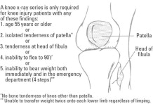

Framework / Approaches for Common Presenting Symptoms {#sec:approach}
=====================================================

This section discusses common frameworks and how to work-up common presentations.

General
-------

### Fever with Rash - Pediatrics

### Fever with Rash - Adult

### Social Withdrawal


Psychiatric Symptoms
--------------------

### Depression

Depression is an alteration in mood, which can be confused with dementia in older patients. It frequently causes a decline in the ability to concentrate, which may worsen memory. Depression also leads to a lack of interest and energy, which may appear similar to the symptoms of dementia. Since depression is readily treatable, it is essential to diagnose this condition in patients who present with memory loss. In addition to representing the primary diagnosis, depression can be comorbid with dementia, and should be considered both because it may worsen symptoms related to dementia, and because it can be reversible.

Neurological Symptoms
---------------------

### Presyncope

Feeling light-headed or faint, as opposed to actually passing out. Sometimes patients with presyncope feel worse when they stand up quickly. Happens when there is poor oxygenation of the brain due to reduced blood flow (2/2 reduced CO), poor Hb saturation.

-   Cardiac: arrhythmias, bradyarrhythmias, valvular heart disease like aortic stenosis, atrial fibrillation and uncontrolled heart rate

-   tachycardia of thyroid storm

-   anemia

-   Dehydration due to acute illness or volume loss from blood loss.

-   Acute blood loss such as gastric ulcer bleed

### Disequilibrium

A feeling of being off balance.

-   Alcoholic cerebellar degeneration

-   peripheral neuropathy

### Vertigo

A sensation of the room spinning; consider positional or non-positional, central or peripheral.

-   Aminoglycoside toxicity

-   BPPV

-   Meniere's disease

-   Labyrinthitis

-   Vestibular neuritis

-   Otitis Media

-   Transient ischemic attack (TIA)

Peripheral & Central\
Location of pathology & problems with the inner ear or vestibular system & central nervous system; tends to be more serious conditions than peripheral lesions\
Nystagmus & unidirectional (usually horizontal and rotational) and does not change direction; inhibited by fixating on a point and intensifies when fixation is withdrawn; Frenzel glasses prevent fixation and bring out the nystagmus & purely horizontal, vertical, or rotational; does not lessen when the patient focuses gaze; persists for a longer period\

Do the Head Thrust Test to distinguish between peripheral and central vertigo: Observation of nystagmus is essential to differentiating between peripheral and central vertigo. The head thrust test (sometimes called the head impulse test) is used to demonstrate a likely peripheral lesion. Normally, when you face your patient and ask them to keep looking at your nose, their eyes will stay fixed on your nose if you move their head suddenly to the side. If there is a peripheral lesion in the vestibular system, the vestibular ocular reflex will be disrupted and the patient's eyes will move with the head and then saccade back to center when their head is moved in the direction of the lesion. A normal or positive head thrust test in the presence of vertigo means the peripheral vestibular system is intact and that the lesion is central.

### Dementia

Dementia is an acquired syndrome of gradual progressive deterioration in global intellectual ability that interferes with the ability to function in social and occupational roles. Important elements of the definition include: acquired (i.e., not congenital), progressive (i.e., worse over time), global (not isolated to memory), and interfering with function.

Conditions that can cause dementis

-   Alzheimers dementia

-   Vascular dementia

-   Dementia with Lewy bodies (DLB)

-   Parkinson's disease

-   Frontotemperal dementia

-   Huntington's disease

-   Creutzfeldt-Jakob disease.

The role of diagnostic testing in the setting of a patient with dementia is primarily to rule out treatable causes, which occur in less than 1% of cases of dementia.

-   MMSE, which has been widely used clinically during the same time period, is a multidimensional tool to assess cognitive function, and was not developed specifically for the assessment of delirium. In the same study mentioned above, the MMSE was the least useful in identifying a patient with delirium (likelihood ratio, 1.6; 95% CI, 1.2 - 2.0). A newer test, the Montreal Cognitive Assessment (MoCA), has been proposed to be a better alternative than the MMSE to assess cognitive function.

-   Depression is commonly comorbid with dementia symptoms and is widely recognized as a cause of \"pseudo-dementia.\" The Geriatric Depression Scale is a well-validated screening test for depression in older patients that may be used to rule out depression.

-   Other recommended tests include

    -   complete blood counts

    -   basic chemistries

    -   calcium

    -   thyroid

    -   vitamin B12 deficiency testing

    -   Folate deficiency can cause dementia, but is now extremely rare in North America due to the widespread fortification of grain products with folate. Testing for folate deficiency is therefore no longer recommended.

    -   Syphilis testing may be performed if there is a clinical suspicion or if the local prevalence is high.

### Delirium

Delirium also causes a decline in cognition, but is particularly notable for acute disturbances in attention (e.g., an inability to shift focus), alertness (e.g., impaired consciousness and sleep cycles) and perception (e.g., hallucinations). In delirium, the symptoms fluctuate over short periods of time, whereas in dementia the symptoms are slowly progressive.

Possible conditions in dementia patients

-   UTI

-   Respiratory infection

-   Electrolyte disturbance

-   Depression

-   Urinary tract infection

-   Withdrawal

-   Pain

-   Cerebrovascular event

-   Urinary retention

-   Adverse drug effects

Diagnosis

-   Confusion Assessment Method (CAM) has been widely used over two decades and is the predominant tool used in clinical research regarding delirium. A recent systematic review of assessment tools in diagnosing the presence of delirium demonstrated that the best evidence supports use of the CAM, which takes five minutes to administer. The CAM has a summary-positive likelihood ratio of 9.6 (95% CI, 5.8 - 16.0) as a bedside delirium instrument.

Treatment

-   Prescribe a short course of oral haloperidol, which is helpful in aiding sleep, diminishing agitation, and clearing hallucinations.Potential side effect of constipation, tardive dyskinesia with prolonged use, but prolonged QT interval is rare.\
    Some providers prefer newer atypical antipsychotics such as olanzapine and quetiapine, which have fewer extrapyramidal side effects. There is a recent systematic review of the efficacy and safety of the off-label use of atypical antipsychotic medications for various conditions. For symptoms such as psychosis, mood alterations, and aggression associated with dementia in elderly patients, small but statistically significant benefits were observed for aripiprazole, olanzapine, and risperidone. However, these agents can lead to a prolonged QT interval and don't have the long track record of haloperidol.

Prevention of in-hospital delirium

-   Frequent reorientation and redirection by a familiar provider\
    Providing a safe environment for agitated and combative patients is a challenge for physicians and nurses. Frequent reorientation and redirection by a provider who is familiar with the patient can be very effective in reducing agitation. Nurses on a regular hospital ward typically have responsibilities for too many patients to redirect effectively a delirious patient. A one-to-one sitter provides a safe alternative that can minimize the use of physical and chemical restraints. Repeated reorientation, by a sitter, family member, nurse, or doctor can help reduce confusion. Review of a multifaceted hospital-unit-wide intervention (compared with two \"usual care\" units) showed a reduction in the number and duration of episodes of delirium. One element of the intervention was an orientation protocol that included frequent cognitive stimulation and active orientation.

-   Avoid medications that can lead to delirium\
    As you recall from earlier in the care of this patient, a wide variety of medications can lead to delirium. Sedating medications and those with anticholinergic side effects (e.g. narcotics, benzodiazepines, and tricyclic antidepressants) should generally be avoided in patients at risk of delirium, unless they are absolutely necessary (e.g., narcotics for post-operative pain). The updated American Geriatrics Society Beers Criteria is an evidence-based review of potentially inappropriate medications for older adults and providers should consider avoiding drugs on this list.

-   Provide early mobility and range of motion exercises\
    Providing early mobility and range of motion exercises to bedridden patients can help prevent delirium. Such exercises provide physical touch, cognitive and sensory stimulation, and can prevent decubitus ulcers.

-   Minimize unnecessary lines, cables, and catheters\
    Foley catheters, while preventing urinary incontinence in bed, can be uncomfortable and provide noxious stimuli that can augment delirium. Additionally, these lines and wires can lead to preventable falls. The same may be said for oxygen tubing, IV lines, telemetry monitors, and, particularly, physical restraints. All of these may be used when there is no alternative, but they should be discontinued as soon as safely possible.

-   Provide increased stimulation\
    Placing a patient at the end of the hall where it is dark and quiet at night would not be helpful. Mounting evidence suggests that sensory deprivation is a contributing factor to delirium in the hospital. Interventions that increase, rather than minimize, stimulation seem effective at preventing or minimizing delirium. As such, keeping patients in rooms with adequate lighting, windows, large clocks, and calendars helps keep the patient calm and more oriented. Keeping the patient close to the activity of the nursing station is also helpful. Visual and hearing disturbances can contribute to delirium. Dim lighting, ambient noise, and the removal of hearing and visual aids therefore should be avoided.

### Dizziness with Focal Neurological Symptoms

-   Seizures

-   Stroke

-   Transient Ischemic Attack

-   Coronary Artery Disease

-   Medication Side effect: hypokalemia due to thiazide, estrogens and neuroleptics, anti-HTN, alpha-blockers

-   Atrial fibrillation

-   Structural heart disease

-   HTN Emergency

-   Hypoglycemia

-   Temporal arteritis

-   Hypokalemic periodic paralysis

### Syncope

A sudden, temporary loss of consciousness and postural tone secondary to cerebral hypoperfusion. Etiologies can be

-   cardiac

-   neurological

-   others such as hypovolemic hypotension, metabolic abnoramlities, psychiatric, medications.

Neurological causes are more common in younger patients.

### Upper Extremity Weakess

-   Physical

    -   Protonator Drift

Cardiorespiratory Symptoms
--------------------------

### Palpitations

-   Psy: Anxiety and Panic Disorder, Substance Use / Drugs, Vasomotor symptoms of climacteric

-   Heart: CHD (atypical presentation), Valvular Heart Disease, Arrhythmia

    -   Duration of palpitations greater than 5 minutes

    -   Description of a irregular beat

    -   Previous history of heart disease

    -   Male sex

    -   Affecting work or sleep

    Are suggestive of cardiac origin of palpitations.

-   Lungs: Pulmonary Embolism (rare)

-   Hemo: Anemia

-   Endo: Hyperthyroidism

Work Up

-   CBC, TSH and T4, Urine Drug Screen

-   EKG / Holter Monitor / Loop recorders / Echocardiogram

### Undifferentiated Chest Pain

Anatomic

-   Heart: Angina Pectoris/Coronary Artery Disease, Variant Angina, Cocaine Induced Chest Pain, Valvular Heart Disease (aortic stenosis), arrhythmia, aortic dissection, pericarditis, myocarditis, cardiac syndrome X, non-ischemnic cardiomyopathy

-   Lungs: PE, pneumonia, spontaneous pneumothorax, pleurisy / pulmonary hypertension,

-   GI: esophageal disease, GERD, esophageal spasm, biliary disease, pancreatic disease, Gastritis / PUD, Mesenteric ischemic

-   MSK: Costocondritis, Myofascial Pain, Rib fracture, muscular strain, herpes zoster

-   Psy: anxiety / panic, somatoform disorder, hyperventilation

Associated symptoms to ask about: SOB, dizziness, diaphoresis, nausea, vomiting, dyspepsia or belching, or palpitations

In general, consider three steps

-   Is this angina? The Three Criteria for Typical Angina

    Substernal chest discomfort with a characteristic duration and features Provoked by exertion or emotional stress Relief with rest or nitroglycerin Atypical Angina and Noncardiac Chest Pain

    Atypical angina is defined as chest pain having 2 of the 3 features of typical angina noted above. Patients who have diabetes, females, and older adults \> 65 years of age are more likely to present with atypical features. Occasionally they will present with only weakness or shortness of breath on exertion. Those symptoms are considered \"anginal equivalents\". Noncardiac chest pain is defined as meeting 1 or none of the characteristic anginal features noted above.

-   If it is angina, is it Stable vs. Unstable Angina

    Angina occurs when myocardial oxygen demand exceeds supply. When angina is thought to be present it is important to further characterize it as stable angina vs. unstable angina since these two syndromes are managed very differently.

    Stable angina pectoris is a predictable pattern of chest discomfort that usually occurs with exertion or extreme emotion. It is relieved by rest or nitroglycerin in less than 5-10 minutes. Unstable angina is a more serious condition characterized by chest pain that occurs at rest or with increasingly less exertion. New onset angina (within 4-6 weeks) and angina that has worsening severity, frequency or duration is also classified as unstable. Unstable angina is an acute coronary syndrome (along with non-ST segment elevation myocardial infarction and ST segment elevation myocardial infarction) and requires emergency care.

Additional tests for angina work-up

-   Obtaining a CBC is important to evaluate for a low hemoglobin. This is important because anemia reduces oxygen capacity which can aggravate or trigger ischemia and subsequent anginal symptoms, particularly when hemoglobin levels drop below 8 g/dL.

-   The basic metabolic panel provides valuable information, including evidence of renal disease, hyperglycemia, and electrolyte imbalances that can lead to cardiac disease. Knowing a patient's baseline BUN, creatinine, and electrolyte values may also be helpful when determining which cardiac medication are safest to prescribe since some medications can alter electrolytes and renal function.

-   Assessment of thyroid function with a TSH level may be valuable in evaluating potential triggers for angina. Hyperactivity of the thyroid can be associated with increased oxygen demands on the heart, while diminished thyroid function may aggravate risk factors such as weight gain and dyslipidemia.

-   Assessment of accurate fasting lipid values is particularly important in the workup on angina, as hyperlipidemia is a modifiable and independent risk factor for coronary artery disease.

-   While not directly related in the pathophysiology of coronary artery disease, assessment of baseline transaminase levels is important when initiation of statin therapy is being considered.

-   A chest x-ray is a noninvasive and a relatively inexpensive first-line imaging test for evaluating a patient with suspected anginal chest pain. It will screen for some non-cardiac causes of chest pain and may suggest underlying cardiac disease. It may provide important information regarding heart size, lung fields, and bony thorax pathology.

While patient is being worked up, explain

-   concerned about your symptoms. Even though the ECG is normal, we think it's possible that your chest pain is coming from your heart. We think the blood vessels that go to your heart might be narrowed in spots, resulting in your heart not getting enough blood flow

-   laboratory tests to check for anemia, electrolyte problems, elevated cholesterol and thyroid conditions that might cause or contribute to her symptoms as well as a chest x-ray to see if her heart is abnormally enlarged. You also tell her that if the results of those tests are OK, you will likely want her to have a stress test.

-   we can get the lab tests and x-ray as you leave the office today. I would encourage you start taking a daily aspirin because we've learned it is an effective preventative measure in patients older than 55, in whom we worry about heart disease. With no history of a bleeding disorder and the short time frame until we can determine the cause of the chest pain, the aspirin should be safe. And one important thing -- you should try to avoid the activities that cause your chest pain, like walking up stairs. If you experience any pain that is worse than what you've had or doesn't resolve quickly, you should call for an ambulance to take you to the Emergency Department.

### Angina / Cardiac Ischemia

Use this over the chest pain version when the presentation is more specific

-   Decreased Oxygen Supply

    -   Unstable plaque from CAD / unstable angina / acute coronary syndrome

    -   Coronary vasospasm

    -   Anomalous coronary anatomy - rare

    -   Coronary thromboembolism (e.g. infectious endocarditis) - rare

-   Increased Oxygen Demand

    -   Tachyarrhythmia

    -   Aortic stenosis

    -   Hypertropic cardiomyopathy

    -   Pheochromocytoma

    -   Surreptitious stimulant use

    -   Pulmonary embolism

-   Angina Mimics

    -   Aorta dissection

    -   Pulmonary embolism

    -   Anxiety

    -   Chest wall pain

### Dyspnea

Dyspnea is defined as an uncomfortable awareness of breathing.

Any problem in the mechanical system of breathing can trigger dyspnea, including (but not limited to):

-   blockage in the nose

-   fluid in the alveoli

-   irritation of the diaphragm

Anatomic Framework

-   Cardiac: CHF, coronary artery disease (CAD), dysrhythmia, pericarditis, acute myocardial infarction

-   Pulmonary

    -   Obstructive lung disease: Chronic Obstructive Pulmonary Disease (COPD), asthma, bronchitis (acute vs chronic)

    -   Diseases of lung parenchyma and pleura: pneumonia, pleural effusion, cancer involving the lungs, pneumothorax, pulmonary edema, restrictive lung disease, interstitial lung disease, lung cancer

    -   Pulmonary vascular disease: pulmonary embolism, pulmonary hypertension

    -   Obstruction of the airway: gastroesophageal reflux disease with aspiration, foreign body aspiration

    -   Environmental irritants and allergens: dust or chemical

-   Heme: Anemia

-   Renal

    -   Renal arteries

    -   Glomerular tubules

    -   Interstitial

    -   Collecting System

-   Psy: panic disorder, hypoventilation, sleep apnea

-   Others

    -   Deconditioning

    -   Neuromuscular conditions (myasthenia, Gullain-Barre, ALS)

    -   Metabolic (carbon monoxide, anion and non-anion gap acidosis)

Physiologic Framework

-   Hypoxia

    -   V/Q mismatch

    -   Impaired diffusion

    -   Shunt

-   Hypercapnia

    -   Obstructive lung disease

    -   Central hypoventilation

    -   Neuromuscular disease

    -   Decreased respiratory compliance

-   Acidemia

    -   Pathological acid production

    -   Poor acid elimination

-   Cortical input

    -   Anxiety

    -   Pain

### Chronic Cough

-   Tobacco-related cough

-   Post-infectious cough

-   Upper airway cough syndrome (Postnasal drip)

-   Vocal cord dysfunction

-   Asthma

-   COPD

-   Non-asthmatic eosinophilic bronchitis

-   Bronchogenic carcinoma of the lung (danger)

-   Sarcoidosis

-   Tuberculosis

-   Pulmonary embolism

-   Congestive heart failure (danger)

-   Gastroesophageal reflux disease (common)

### Wheeze

-   Upper airway cough syndrome

-   Foreign Body Aspiration

-   Vocal cord dysfunction

-   Persistent Bronchitis

-   Asthma

-   COPD

-   Pulmonary Embolism

-   CHF

Abdominal Symptoms
------------------

### Abdominal Distension

### Acute Abdominal Pain

Anatomic

-   Epigastric

    -   Stomach: gastritis, peptic ulcer disease

    -   Pancreas: acute pancreatitis,

    -   Small Bowel: food poisoning, gastroenteritis, bowel infarction

-   Right Upper Quandrant

    -   Liver: hepatitis, abscess

    -   Gallbladder / Billary System: cholecystitis, cholangitis, biliary colic

-   Left Upper Quandrant

    -   Spleen:infarct, abscess

-   Lower Right Quandrant: Appendicitis (Psoas sign and Obturator sign)

-   Lower Left Quandrant

-   Chest (referred pain)

    -   Esophagus to epigastic: GERD

    -   Heart to epigastric: ACS (UA / MI)

    -   Lungs: PE -\> RUQ / LUQ and Epigastrium

-   Toxic / metabolic problems: does not cleanly map to any specific organ

    -   Heavy metal poisoning

    -   Acute intermittent porphyria

    -   Familial Mediterranean fever

    -   Angioedema

Note referred pain from other quadrants and the chest

#### Systems Approach

-   Gastrointestinal: gastritis, GERD, peptic ulcer disease, gastric outlet obstruction, acute or chronic hepatic failure with resulting complications (e.g., ascites), acute hepatitis (e.g., viral, autoimmune, alcoholic, drug-induced), inflammatory bowel disease, intestinal ischemia, intestinal obstruction, irritable bowel syndrome, pancreatitis, cholecystitis/cholelithiasis, diverticulitis/diverticulosis, appendicitis, perforation/peritonitis (e.g., gastric, colonic, intestinal), tumor (e.g., gastric, hepatic, pancreatic, intestinal, colonic).

-   Cardiac: Myocardial infarction, angina pectoris, abdominal aortic aneurysm dissection or rupture.

-   Psychogenic: Anxiety, panic disorder, somatoform disorder, post-traumatic stress disorder.

-   Pulmonary: Pleurisy, lower lobe pneumonia, pulmonary infarction, tumor.

-   Renal: Nephrolithiasis, pyelonephritis, cystitis, tumor.

-   Musculoskeletal: Abdominal wall muscle strain, hernia (e.g., ventral, inguinal, incarcerated), abscess (e.g., psoas, subphrenic), trauma (e.g., contusion, hematoma), cutaneous nerve entrapment.

-   Metabolic: Drug overdose, ketoacidosis, iron or lead poisoning, uremia, acute intermittent porphyria.

-   Medication, vitamin, and herbal supplement side effects

-   Dietary factors

#### Cases

A 28-year-old female who presents with two types of abdominal pain for two weeks: sharp, intermittent epigastric pain aggravated by stress and food and also achy pelvic pain worsened by activity and sexual intercourse. She reports associated nausea, vomiting, and alternating loose stools and constipation. Her last menstrual period was four weeks ago; she is sexually active without birth control and has many psychosocial stressors and reports her husband drinks alcohol frequently but she rarely drinks. Physical examination is notable for mid-epigastric and lower abdominal tenderness, numerous ecchymoses across her abdomen and extremities, cervical motion tenderness, and a small amount of yellowish malodorous vaginal discharge.

Extremities and Spine
---------------------

### Lower Back Pain

Mechanical lower back pain generally involves one or more of the following:

-   bones of the spine

-   muscles and ligaments surrounding the spine

-   nerves entering and exiting the spinal cord or problems with the cord itself

The locations can be

-   Axial

    -   Degenerative disc disease

    -   Facet arthritis

    -   Sacroiliitis

    -   Ankylosing spondylitis

    -   Paraspinal muscular issues

    -   SI dysfunction

    -   Lumbar strain

-   Radicular: Disc prolapse, Spinal stenosis

-   Trauma: Lumbar strain, Compression fracture

Non-mechanical causes to consider:

-   Neoplastic: lymphoma, leukemia, metastatic disease, multiple myeloma, osteosarcoma

-   Inflammatory: rhematoid arthritis

-   Visceral: endometriosis, prostatitis, renal lithiasis

-   Infectious: discitis, Herpes Zoster, Osteomyelitis, pyelonephritis, spinal/epidural abscess

-   Vascular: aortic aneurysm

-   Endocrine: hyperparathyroidism, osteomalacia, osteoporotic vertebral fracture, paget disease

-   GI: pancreatitis, peptic ulcer disease, cholecystitis

-   Gynecological: endometriosis, pelvic inflammatory disease

Physical exam

1.  Spasm of the paraspinous muscles - lumbosacral sprain / strain

2.  Abnormal gait and loss of ankle jerk - compression of regional nerve root

3.  Point tenderness on spinous processes - origin in the vertebra (e.g. osteoporotic fracture, malignancy)

4.  Abdominal Exam

    -   Palpation: Check for abdominal tenderness (on all patients, not just female patients), pelvic tenderness (pelvic inflammatory disease), pulsatile mass, unequal femoral/brachial pulses (abdominal aortic aneurysm), or any general tenderness indicating visceral pathology.

    -   Auscultation: Check for abdominal bruit, looking for abdominal aortic aneurysm.

5.  Passive Straight Leg Raise (SLR or Lasegue's sign)

    -   he normal leg can be raised 80 degrees.

    -   If a patient only raises their leg \<80 degrees, they have tight hamstrings or a sciatic nerve problem.

    -   To differentiate between tight hamstrings and a sciatic nerve problem, raise the leg to the point of pain, lower slightly, then dorsiflex the foot. If there is no pain with dorsiflexion, the patient's hamstrings are tight.

    -   The test is positive if pain radiates down the posterior/lateral thigh past the knee. This radiation indicates stretching of the nerve roots (specifically S1 or L5) over a herniated disc.

    -   This pain will most likely occur between 40 and 70 degrees.

6.  Crossed Straight Leg Raise: asymptomatic leg is raised

    -   Test is positive if pain is increased in the contralateral leg; this correlates with the degree of disc herniation. Such results imply a large central herniation.

    -   Cross SLR test is much less sensitive (0.25) but is highly specific (about 0.90). Thus, a negative test is nonspecific, but a positive test is virtually diagnostic of disc herniation.

7.  Faber test: Flexion, Abduction, and External Rotation

    -   The Faber test looks for pathology of the hip joint or sacrum (sacroiliac pain from sacroiliitis).

    -   The test is performed by flexing the hip and placing the foot of the tested leg on the opposite knee. Pressure is then placed on the tested knee while stabilizing the opposite hip.

    -   The test is positive if there is pain at the hip or sacral joint or if the leg cannot lower to the point of being parallel to the opposite leg from pathology of the hip, sacrum or sacroiliac joint.

    -   The FABER test should be done on all patients suspected of having sacroiliac pain, not just in the older adult patients. Sacroiliitis can occur in the young population as well.

8.  Muscle Atrophy: of quadriceps and calf muscles.

9.  Rectal Exam: only on patients with red flags or alarm symptoms

    -   Check for masses, bleeding, or abnormal rectal tone. Bleeding or rectal mass can be signs of cancer with metastasis to the spine causing back pain. Decreased tone can indicate disc herniation and/or cauda equina syndrome.

Investigations

-   Labs: CBC

-   Imaging: X-ray, lumbar spine film, MRI

-   Electrodiagnostic: Electromyography

In the absence of red flags or findings suggestive of systemic disease, diagnostic testing, especially imaging, is not indicated until after four to six weeks of conservative treatment.

### Knee Pain

Differential Diagnosis

-   Mechanical

    -   Patellofemoral Pain Syndrome

    -   Iliotibial Band Tendonitis

    -   Anterior Cruciate Ligament Pain

    -   Medial Collateral Ligament Sprain

    -   Lateral Collateral Ligament Sprain

    -   Meniscal Tear

    -   Popiteal (Baker's) Cyst

    -   Osteoarthritis

-   Non-Mechanical

    -   Septic Arthritis

    -   Gout / Pseudogout

Physical Exam

-   Have the patient put on a gown, as it is important to be able to fully examine and compare the painful knee and the non-painful knee.

-   Observe the patient walking and climbing onto the examination table.

-   Inspect both legs for erythema, edema, bruising, or atrophy of the quadriceps.

-   Palpate the knee joints, feeling for warmth, effusion, and point tenderness. Pay particular attention to the patella, tibial tubercle, patellar tendon, quadriceps tendon, anterolateral and anteromedial joint line, medial joint line, and lateral joint line.

-   Check knee range of motion by flexing and extending the knees (normal is 0 degrees extension, and 135 degrees flexion).

-   Assess for tenderness and range of motion on hip and ankle exam. In general, consider examining the joint above and below the area of concern on the musculoskeletal exam.

-   Specific Knee Exam Maneuvers ([Video](https://www.youtube.com/watch?v=eRPvoNe9Aho))

    -   anterior and posterior drawer sign is indicative of an anterior and posterior cruciate ligament injury\
        They are performed with the patient laying supine, knee bent to 90 degrees, and the foot stabilized, most easily done by the physician sitting on the foot. The physician's thumbs are placed on the tibial tubercle, while the fingers are placed on the posterior calf. The physician then attempts to displace the tibia, either anteriorly or posteriorly. Too much motion of the tibia, or lack of a clear end-point, especially as compared to the non-painful or non-affected side, constitutes an abnormal finding.

    -   Lachman test assesses the stability of the stability of the anterior cruciate ligament\
        This test is performed with the patient lying supine with the injured knee raised and slightly flexed to 30 degrees. The distal femur is stabilized by the physician with one hand, while the proximal tibia is held by the other hand. Force is applied to move the tibia anteriorly. The test is considered positive if there is excessive motion of the tibia.

    -   The valgus stress test assesses the medial collateral ligament and the varus stress test could indicate rupture of the lateral collateral ligament\
        These test are performed with the patient's leg in full extension with the knee flexed to about 30 degrees. The physician places his/her hand on the lateral knee joint to apply a valgus stress to the distal tibia, or on the medial knee joint to apply a varus stress to the distal fibula. Excessive motion of the knee signifies instability of the corresponding ligament.

    -   The McMurray test assesses the medial and lateral menisci.\
        The physician holds the patient's heel with one hand and grasps the knee over the medial and lateral joint lines with the other hand. The patient's knee is flexed as much as possible. The tibia is rotated either internally (tests lateral meniscus) or externally (tests medial meniscus) as the knee is extended to about 90 degrees. A varus stress (lateral meniscus) or valgus stress (medial meniscus) is applied across the knee joint while the knee is being extended. The test is positive if a clunk or click is felt, or if testing causes reproducible knee pain.

    -   Noble's test is useful for diagnosing iliotibial band tendonitis.\
        The patient lays supine and repeatedly flexes and extends the knee while the physician monitors the lateral femoral epicondyle with their thumb. Pain is typically worse when the knee is at 30 degrees of flexion.

Investigation

-   Blood: RF factor, CBC, ESR, C-reactive protein

-   Imaging: Ottawa Knee Rules to determine X-ray

    {width="75%"}

-   Procedure: Arthrocentesis

### Lower Extremity Swelling {#ssec:approach-legswelling}

Differential diagnosis

-   Cellulitis

    -   Cellulitis is an acute inflammatory condition of the skin characterized by localized pain erythema, swelling, and heat.

    -   Small breaks of skin are associated with streptococcal infection, whereas staphylococcal cellulitis is commonly associated with larger wounds, ulcers, or abscesses.

    -   Patients with diabetes are more susceptible to infections like cellulitis. Diabetic neuropathy causes an unawareness of abnormal pressure distribution, ill-fitting shoes, and cuts or punctures which then develop ulcers.

    -   Vascular disease with diminished blood supply contributes to the development of the lesion, and infection is common.

-   Deep Venous Thrombosis

    -   Classic symptoms of DVT include swelling, pain, and discoloration in the affected extremity.

    -   Physical examination may reveal the palpable cord of a thrombosed vein, unilateral edema, warmth, and superficial venous dilation.

    -   Classic signs of DVT, including Homan's sign (pain on passive dorsiflexion of the foot), edema, tenderness, and warmth, are difficult to ignore, but they are of low predictive value and can occur in other conditions such as musculoskeletal injury, cellulitis, and venous insufficiency.

    -   Chronic venous insufficiency may result from DVT and/or valvular incompetence. Following DVT, the valve leaflets become thickened and contracted so that they are incapable of preventing retrograde flow of blood; the vein becomes rigid and thick-walled. Although most veins recanalize after an episode of thrombosis, some may remain occluded. Secondary incompetence develops in distal valves because high pressures distend the vein and separate the leaflets.

    -   Primary deep venous thrombosis can also occur without previous thrombosis. Patients with venous thrombosis often complain of a dull ache in the leg that worsens with prolonged standing and resolves with leg elevation. Examination reveals increased leg circumference, edema, and superficial varicose veins.

    -   The presence of a thrombus in a vein may be accompanied by an inflammatory response in the vessel which may be minimal or may be characterized by granulocyte infiltration, loss of endothelium, and edema. This inflammatory process may also result in a low grade fever.

    -   Smoking and obesity, are the most robust risk factors in the development of DVT and are independent of other risk factors. Diabetes, sedentary lifestyle, hypertension, hyperlipidemia, increasing age, prolonged immobility, surgery, trauma, malignancy, pregnancy, estrogenic medications (e.g., oral contraceptive pills, hormone therapy, tamoxifen (Nolvadex)), congestive heart failure, hyperhomocystinemia, diseases that alter blood viscosity (e.g., polycythemia, sickle cell disease, multiple myeloma), and inherited thrombophilias are other potential risk factors in the development of DVT.

-   Venous Insufficiency

    -   Chronic venous insufficiency (CVI) is a condition that occurs when the venous wall and/or valves in the leg veins are not working effectively, making it difficult for blood to return to the heart from the legs. CVI causes blood to "pool" or collect in these veins, and this pooling is called stasis.

    -   The edema of venous insufficiency can be differentiated from chronic lymphedema as venous insufficiency edema is softer, and there is often erythema, dermatitis, and hyperpigmentation along the distal aspect of the leg, and skin ulceration may occur near the medial and lateral malleoli.

    -   Obesity is commonly associated with venous insufficiency.

-   Lymphedema

    -   Lymphedema is generally painless, but patients may experience a chronic dull, heavy sensation in the leg.

    -   In the early stages of lymphedema, the edema is soft and pits easily with pressure. In the chronic stages, the limb has a woody texture and the tissues become indurated and fibrotic.

    -   Lymphedema initially involves the foot and gradually progresses up the leg so that the entire limb becomes edematous.

-   Peripheral arterial disease

    -   Peripheral arterial disease (PAD) is the presence of systemic atherosclerosis in arteries distal to the arch of the aorta. As a result of the atherosclerotic process, patients with PAD develop narrowing of these arteries.

    -   Patients with PAD have a history of claudication, which manifests as cramp-like muscle pain occurring with exercise and subsiding rapidly with rest. In addition, later in the course of the disease, patients may present with night pain, nonhealing ulcers, and skin color changes.

    -   An ankle-brachial index (ABI) can be done to determine the presence of PVD. An ABI of \<0.9 is consistent with the disease.

    -   Classic risk factors for PAD are smoking, diabetes mellitus, hypertension, and hyperlipidemia. Obesity (body mass index (BMI) \>30) increases risk for PAD as well. Recent trials have added chronic renal insufficiency, elevated C-reactive protein levels, and hyperhomocysteinemia to the list of risk factors.

    -   The greatest modifiable risk factor for the development and progression of peripheral arterial disease (PAD) is cigarette smoking. Cigarette smoking increases the odds for PAD by 1.4 for every ten cigarettes smoked per day.

    -   Arterial insufficiency is four times more prevalent in patients with diabetes than in those without diabetes. Nearly half of patients who've had diabetes for 20 years or more have peripheral arterial disease (PAD), usually below the knees.

Cellulitis: acute unilateral swelling, erythema, warmth, fever; but fever may also be absent if the cellulitis is localized.

Venous insufficiency is most likely to be bilateral.

PAD is associated with claudication and normal pulses.

Adult MSK
---------

For all Joints Pains - go for the regular pain stuff OF-DP-LIQRAAA but in addition also ask the following

-   Inflammation: warm, redness, swelling

-   Structural: poping sound, positional effect on pain

-   Functional: stiffness, weakness, numbness or tingling, ROM, gait

-   Other joints: pain else where

-   Other systems: pass urine, pass stool, potency

-   Rheumatological: time of hurting, discoloration of skins in cold, hair loss, skin (photosensitivity, rash), ulcers, fatigque,

-   Exposure: trauma (weight lifting, accident, abuse), insect bite, occupation

-   Risk factors: Age, menstrual

Note to suspect Abuse!!\
In physical examination

-   Neuro: should check for reflexes, sensation

-   Cardiovascular: check peripheral pulse

-   Derm: check nails and skin

List of differentials\
Physical Examination

-   HEENT

-   Inspect, palpate, ROM, motor, reflexes, sensations, pulses, gait

-   CVS

Investigations

-   Rectal and pelvic exam (back pain)

-   CBC with differentials, S/E

-   LP, CSF

-   BUN:Cr [- why do we do this?]{style="color: red"}

-   ESR, RA factor, ANA

-   Arthrocentesis and analysis

-   X-ray, CT, MRI

-   DEXA, Ca, Vitamin D, PTH, PO4

-   D-dimer, FDP, Doppler U/S, Arteriography, Venography

Lab Based Findings
------------------

### High Blood Pressure

### Hypoalbuminemia

Physiologic Framework

-   Impaired intake of protein: malnutrition

-   Impaired utilization and synthesis protein: liver disease - spider angiomata and splenomegaly

-   Excessive glomerular filtration of protein: nephrotic syndrome - UA with protein

-   Excessive GI loss of protein: protein-losing enteropathy - diarrhea

### Anemia

Balancing loss and production.

-   Insufficient Production (Hypoproliferative)

    -   Nutritional deficiency

    -   Bone marrow failure

    -   Kidney disease

    -   Chronic disease / inflammation

-   Too much lost (Hyperproliferative)

    -   Acute blood loss

    -   Hemolysis

Two classification schemes are frequently employed to narrow down the differential diagnosis in anemia:

Size Classification: The first uses the MCV and/or the peripheral blood smear to classify the size of the red blood cell as microcytic, normocytic, or macrocytic. Although it can be quite helpful, the system is imperfect. Since MCV values in children vary with age, the age-specific MCV values must be used. Even so, certain conditions do not fit neatly into one category. (For example, the anemia of inflammation/chronic disease and of lead poisoning can be microcytic or normocytic, and the anemia seen with liver failure can be normocytic or macrocytic.)

Microcytic

Normocytic

Macrocytic

Iron deficiency Thalassemia Chronic inflammation Lead poisoning Sideroblastic anemia

Acute blood loss Immune hemolytic anemia Hereditary spherocytosis G6PD deficiency Sickle cell anemia Renal disease Transient erythroblastopenia of childhood (TEC) Folate deficiency B12 deficiency Liver disease Hypothyroidism Neoplasms Bone marrow failure syndromes (aplastic anemia, Diamond-Blackfan anemia (DBA), and congenital dyserythropoietic anemia (CDEA) Mechanism Classification: The second categorizes anemia by its mechanism. In this system, if a patient's hemoglobin is low, it is due to one of three basic reasons:

He/she is either not making adequate amounts (decreased production). It is being destroyed (increased destruction). The body is losing it from somewhere (blood loss). This system is intuitive and reliable, but more difficult to categorize:

Reticulocyte count

Mechanism

Possible causes

Low

Decreased production

Iron, folate, or B12 deficiency Lead toxicity Thalassemia Aplastic anemia Chronic inflammation Neoplasms TEC DBA Renal disease Hypothyroidism CDEA (congenital dyserythropoietic anemia) Sideroblastic anemia High

A high reticulocyte count indicates that the patient is able to adequately make red cells and is trying to compensate for the anemia, suggesting the cause to be either blood loss or destruction

Increased destruction

Jaundice Elevated bilirubin Dark urine Splenomegaly Schistocytes and microspherocytes on peripheral blood smear Low serum haptoglobin Immune hemolytic disease Hereditary spherocytosis G6PD deficiency Sickle cell disease Thalassemia DIC (disseminated intravascular coagulation) Mechanical heart valves Burns (PNH (paroxysmal nocturnal hemoglobinuria) Hypersplenism High

A high reticulocyte count indicates that the patient is able to adequately make red cells and is trying to compensate for the anemia, suggesting the cause to be either blood loss or destruction.

Blood loss

Acute hemorrhage Dysfunctional uterine bleeding (heavy and/or prolonged menstrual periods) Pulmonary hemosiderosis (pulmonary hemorrhage) Goodpasture's disease Gastrointestinal blood loss (peptic ulcer disease, other GI conditions)

### Acute Renal Failure

-   Pre-renal

    -   Dehydration

    -   Decreased cardiac output

-   Intra-renal

    -   Glomerular

    -   Tubular

    -   Interstitial

-   Post-renal

Psychiatry
----------

### New-onset Psychosis

Workup

1.  Complete physical

2.  Mental status examination

3.  Metabolic panel

4.  Complete blood count

5.  Urine toxicology screen

6.  Optional: syphilis, HIV, vitamin B12 levels, thyroid function test, ANA, neuroimaging

Differentials

-   Major depressive or manic episode with psychotic features

-   Her.

Managing Alcohol Use {#ssec:approach-alcohol}
--------------------

Safe drinking level

-   If a person is an alcoholic or has a history of substance abused, there is no safe drinking level

-   If pregnant, $\leq7$ drinks per week and $\leq3$ per occasion

-   For men, $\leq 14$ per week and $\leq4$ per sesion

-   If older than 65, ingest $\leq1$ per day.

### Anxiety

-   lala

### Irregular Sleep

Differential Diagnosis

-   Adjustment disorder

-   Delayed sleep-wake phase disorder

-   Hypersomnolence disorder

-   Insufficient sleep

-   Major depression with psychotic features

-   Narcolepsy

```{=html}
<!-- -->
```
-   Adjustment disorder

-   Dysthymia / depression

-   Alcohol use disorder

-   Insomnia Disorder

### Eating disorder

Workup

-   BMI

-   Serume electrolyte and amylase levels

-   Monthly visit to monitor weight

Urology
-------

### Lower Urinary Tract Symptoms - BPH Like

Increased frequency of urinary, nocturia, hesitancy, urgency, weak stream; Appearing typically slowly and progressively over a period of years.

-   BPH

-   UTI

-   Prostatitis

-   Prostate Cancer

-   Medication side effect

-   Overactive bladder

Check for complications

-   UTI

-   Acute urinary retention

-   Obstructive nephropathy

### Testicular / Scrotal Pain

-   trauma, testicular torsion, torsion of the testicular appendages

-   Inguinal hernia, hydrocele, Varicocele

-   epididymitis

-   Henoch-Schönlein purpura (HSP)

-   Testicular tumor

-   Referred pain: Retrocecal appendicitis is an important and a rare cause of referred scrotal pain in children and adolescents

Obstetrics and Gynecology
-------------------------

### Primary Amenorrhea

Lack of menses without secondary sex characteristics at $\geq$ 13 year old or with secondary sex characteristics $\geq$ 15 y/o. Work up include

-   TSH to evaluate for hypothyroidism

-   Pelvic U/S to confirm presence of uterus and ovaries

-   MRI brain if galactorrhea and elevated prolactin to evaluate for prolactinoma

**Eugonadptropic amenorrhea** Primary amenorrhea in patient with fully developed secondary sexual characteristics suggest anatomical defect in genital tract e.g. imperforated hymen or mullerian duct agenesis

### Dysmenorrhea

A. Adenomyosis B. Cervical stenosis C. Chronic pelvic inflammatory disease D. Endometrial cancer E. Endometriosis F. Fibroids G. Inflammatory bowel disease H. Irritable bowel syndrome I. Leiomyosarcoma J. Mental health concerns K. Ovarian cysts L. Uterine polyps

A complete blood count is always a consideration when a person seems to be bleeding more heavily than usual. Iron deficiency anemia is common in patients of reproductive age, affecting between 21% and 67% of those with menorrhagia. It can add to the fatigue a person feels. This type of anemia is responsive to therapy, which initially is oral iron supplementation and could progress to iron infusions if indicated.

A pregnancy test should be done on every person with a uterus of reproductive age with any changes in bleeding pattern or amount. Ectopic pregnancy can present with irregular bleeding and is life-threatening. Additionally, unusual forms of pregnancy---such as molar pregnancies---can cause heavy bleeding, abdominal pain, and uterine enlargement. Although it is acknowledged that pregnancy most commonly causes amenorrhea, these are diagnoses not to be missed.

Ultrasound is the study of choice for pelvic pathology. The sensitivity is 60% and specificity is 93% for detecting intracavitary issues. The sensitivity for detecting intramural pathology is also high, but not as high as it is for detecting intracavitary issues. Ultrasound has a high positive predictive value for detecting adenomyosis as well. It does not require any radiation to the ovaries (CT scans will), no intravenous dyes are needed, and it is generally painless for the patient. The pelvic ultrasound does require an intravaginal portion, and all should be advised of this in advance. This could be uncomfortable and can cause psychological distress if the patient does not realize this will be done or if they have a history of trauma, particularly sexual trauma. The combination of abdominal and vaginal ultrasounds allow for reliable measurements and anatomy of the cervix, uterus, and ovaries. Ultrasound is acceptable at the initial evaluation whenever the physician thinks the patient has secondary dysmenorrhea based on clinical history and physical exam.

Thyroid disorders are easy to check for and easy to treat. The fatigue and bowel symptoms of thyroid disease may also overlap with menstrual disorders, making the diagnosis easy to miss unless you are looking for it. Thyroid disorders can also affect the frequency of menses and should be considered if other causes of abnormal bleeding are excluded. Hypothyroidism is common in people of reproductive age, particularly those assigned female at birth. The American College of Obstetrics and Gynecology has not recommended this test for all initially without compelling history. However, guidelines from the United Kingdom do recommend thyroid testing.

Computed tomography (CT) scans have been studied but these do not give a well-defined look at pelvic pathology and are not routinely used for gynecologic problems. They may be used at the end of a work-up for pelvic pain, but usually to look for other, non-gynecologic abdominal causes.

Magnetic resonance imaging (MRI) is being used more often in diagnosing gynecologic pathology. It can give a better diagnosis of adenomyosis and locations of leiomyomas. MRI is able to more accurately assess changes in tumor volume preoperatively. At times it can provide better analysis of ovarian masses as well. MRI is expensive and time-consuming, factors that must be balanced with how useful the information obtained will be. MRI is not used as an initial study for secondary dysmenorrhea or menorrhagia.

Testing for von Willebrand disease should be considered in any person with menorrhagia and other potential episodes of heavy bleeding, such as postpartum hemorrhage. In the initial workup of isolated dysmenorrhea, this is not recommended. However, when dysmenorrhea is present with menorrhagia it should be considered. Even though the American College of Obstetrics and Gynecology recommends testing for von Willebrand for any women with severe menorrhagia, meta-analyses do not demonstrate this to be cost-effective in initial assessment. The one exception is when menorrhagia occurs in an adolescent. Bleeding disorders more commonly present as menorrhagia from the beginning of menses rather than starting 15 years after menarche. If considering starting OCPs in an adolescent, one should order the von Willebrand prior to initiation, as it may affect the results.

### Menorrhagia

A descriptive diagnosis that has at the core of its definition an increased length (usually days) and quantity of menses. Quantity of menses is very difficult to define precisely and is only one of the terms that can mean abnormal uterine bleeding. The absolute criterion for menorrhagia is blood loss of more than 80 milliliters.

### Metrorrhagia

irregular bleeding

### Infertility

Lack of conception after 6 months of unprotected intercourse in women age $>$35 or 12 months in women age $<$35.

-   Ovarian dysfunction - history of multiple miscarriages, and nulliparity

### Recurrent Pregnancy Loss

consecutive pregnancy losses (i.e. spontaneous abortions). Because anatomic, genetic, and thrombotic disorders are most common causes, initial workup include

-   Pelvic ultrasound

-   Karyotype

-   Thrombophilia testing

Differential diagnosis

-   Antiphospholipid syndrome

-   Submucosal and intravacitary fibroids

-   Poorly controlled DM

-   Hyper- or hypothyroidism

-   Inherited balanced maternal translocation

### Postmenopausal Vaginal Bleeding

Framework:

-   Cervical Polyps

-   Endometrial hyperplasia

-   Hormone-producing ovarian tumors

-   Endometrial cancer

-   Proliferative endometrium

-   Medications: anticoagulants, selective serotonin reuptake inhibitors, antipsychotics, corticosteroids, and hormonal medications

-   Disorders involving the hypothalamic, pituitary, thyroid, hepatic, adrenal, and hematologic systems

Physical:

-   Skin Exam: Look for evidence of bleeding disorders, like bruises. Also, jaundice on skin exam and hepatomegaly on abdominal exam might signify an underlying acquired coagulopathy via liver disease.

-   Neck Exam: Thyroid exam to look for goiter or nodules, as thyroid disease is one of several systemic diseases that can cause dysfunctional uterine bleeding.

-   

-   Abdominal Exam: Organomegaly, indications of liver disease

-   Pelvic Exam: Look for vulvar or vaginal lesions, signs of trauma, and cervical polyps or dysplasia. On bimanual examination, assess the size and mobility of her uterus, as a firm, fixed uterus would be concerning for uterine cancer.

### 3rd trimester Vaginal Discharge / Bleeding

-   Placenta Previa

-   Placental Abruption

-   Bacterial Vaginosis

-   Vaginal candiasis

-   Urinary tract infection

-   Cervical trauma

-   PPROM

-   Preterm Labor

-   Uterin Rupture

### Postpartum Hemorrhage

Causes of Postpartum Hemorrhage can be remembered as the 4 T's (from most to least common):

-   Tone (uterine atony leading to continued bleeding)

-   Trauma (perineal or cervical lacerations, uterine inversion)

-   Tissue (retained or invasive placental tissue in the uterus)

-   Thrombin (a bleeding disorder-much less common that the other three causes)

### Adnexal Masses

### Hirsutism

-   PCOS

-   Idiopathic hirsutism

-   Non-classic 21-hydroxylase deficiency

-   Androgen secreting ovarian tumors ovarian hyperthecosis

-   Cushing syndrome
