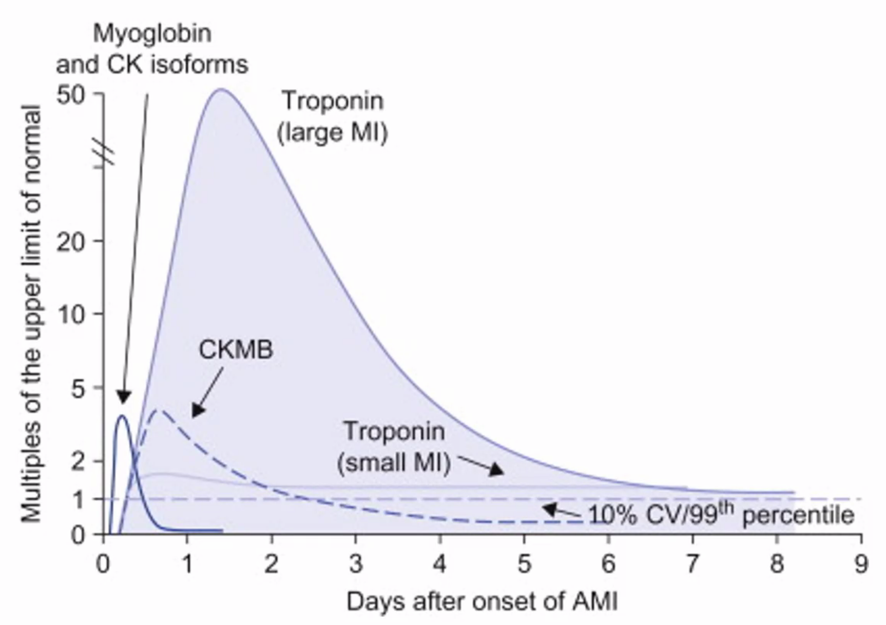
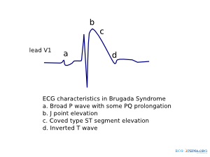
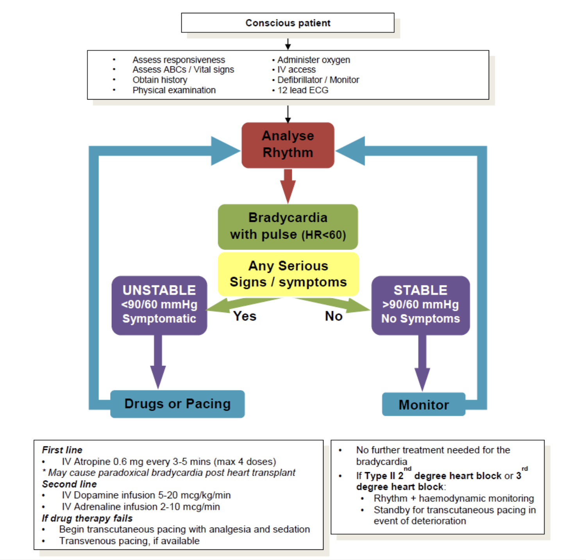
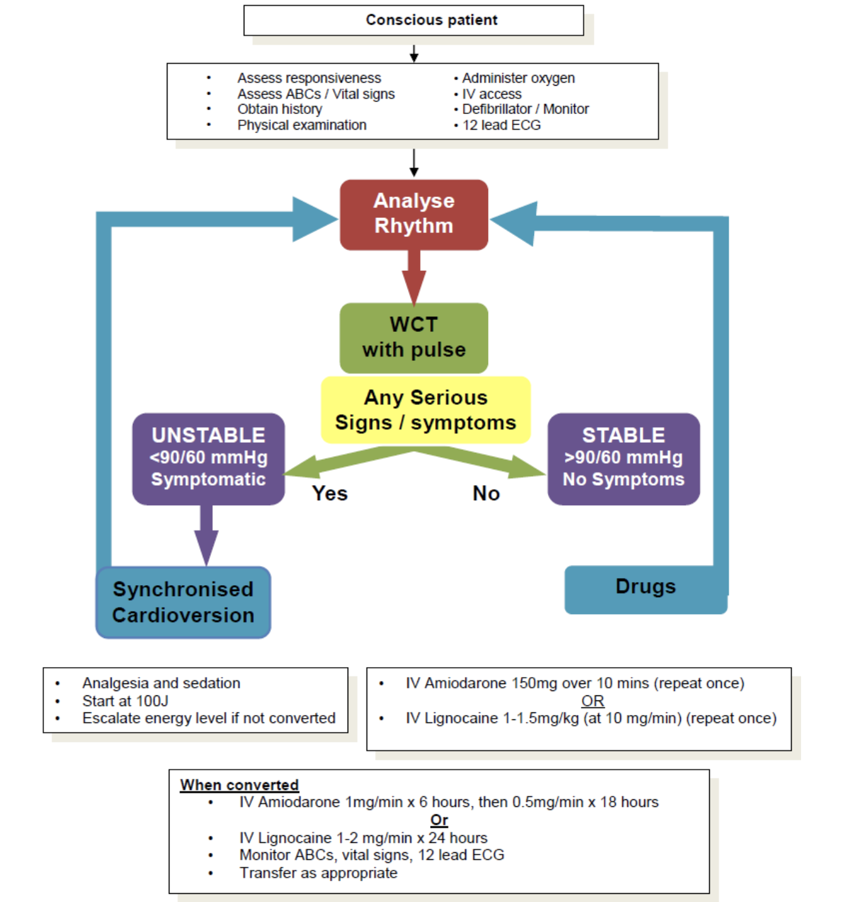
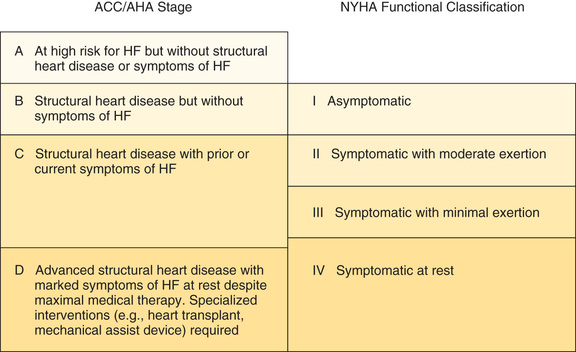
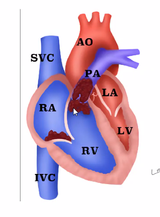

Cardiovascular
==============
[[TOC]]

Resources

- https://apps.apple.com/sg/app/dr-ecg/id1437641000

Questions

- Can we electrical cardiovert someone with pacemaker? Will the pace maker be damaged?
- Why high risk ticagrelor and low risk clopidogrel?

Struggle

- Patients refuse anticoagulation and are still ok; CHADVAS is not designed for Asians. Prof Lim See Han feels that perhaps Asian blood coagulates less easily than Caucasians.
- Echocardiogram for stroke volume (or even better, directly go for CO) of the heart; but not easily obtainable at bedside. Can we design an alternative? Pulse oximetry measures oxygen content of the heart but it is affected by the waves.
  - thermodilution and transthoracic echocardiography

## Basics for Cardiology

### What is normal

- Normal heart rate is 60 - 100

#### Coronary Arteries

| Artery                             | Distribution                                                 |
| ---------------------------------- | ------------------------------------------------------------ |
| Circumflex occlusion               | Posterior infarct  |
| Left anterior descending occlusion | Anterolateral of the heart   |
| Right coronary artery occlusion    | Inferior the heart  |

### Cardiac Markers

| Marker         | Onset                    | Offset   | Sensitivity | Specificity |
| -------------- | ------------------------ | -------- | ----------- | ----------- |
| Myoglobin      | hours                    | <1 day   | high        | low         |
| CK isoform     | hours                    | <1 day   | high        | low         |
| CKMB           | hours                    | 3-4 days | high        | low         |
| **Troponin T** | 1 day                    | 1 week   | **high**    | **high**    |
| **Troponin I** | 1 day                    | 1 week   | high        | high        |
| Total White    | Several hours - next day | s        |             |             |
| CRP, ESR       |                          |          |             | low         |

- Troponin is the best!

### CXR in Chest Pain

| Conditions                 | Features                                                     |
| -------------------------- | ------------------------------------------------------------ |
| CHF                        | Pulmonary venous congestion: distension of the pulmonary veins Cardiomegaly: >1/2 the trans-thoracic diameter Occasionally fluids: Kerley B lines |
| Pneumothorax               | Absent pulmonary marking beyond parenchyma Trachea is may be deviated if there is tension |
| Aortic aneurysm            | Widened mediastinum                                          |
| Dissecting aortic aneurysm | Normal or near normal CXR, except in older people, the arch of aorta may have a thin layer of calcification which should be on the outer lining; but in aortic dissection soft tissue can be seen outside of the calcification ; send for CT aortogram |
| Pneumonia                  | Consolidation                                                |
| Trauma                     | SC emphysema Fractures Bleeding: uniform opacity (supine CXR), fluid level in upright Contusion: variegated appearance NOT uniform |

Also look for interventions like intubation.

### CT

| Condition       | Investigation       |
| --------------- | ------------------- |
| PE              | Pulmonary angiogram |
| Aortic aneurysm | CT aortogram        |

### Indications for Telemetry Admission

#### Good evidence for cardiac monitoring

- Automated implantable cardiac defibrillator fired
- AV block
- Prolonged QT with associated ventricular arrhythmias 
- Acute heart failure/pulmonary oedema
- Admitted acute cerebrovascular disease 
- Acute coronary syndrome
- Patients requiring massive blood transfusions

#### Cardiac monitoring may be beneficial

- Patients evaluated for syncope
- Patients with gastrointestinal haemorrhage after endoscopy 
- Patients with atrial arrhythmias receiving therapy for rate control 
- Patients with electrolyte imbalance
- Patients with subacute congestive heart failure

#### No evidence for telemetry

- Patients requiring blood transfusions
- Patients evaluated for chest pain
- Patients with exacerbations of chronic obstructive pulmonary disease 
- Stable patients with pulmonary embolism receiving anti-coagulation

### Synchronized Cardioversion*

1. Look for indications

   - Broad complex tachycardia : VT

2. Look for contraindications

3. **Explain the procedure** to the patient.

4. **Administer** 

   - **IV sedation with midazolam 1 and 2 mg**, wait; (lower dose than shoulder reduction) 
     - Has amnesia properties which is good
     - Most dreaded complication: respiratory depression, BP may drop further
       - If patient stop breathing, bag-mask-valve the patient (get this ready)
   - **analgesia with fentanyl 50 - 100 mg**
   - **preoxygenate** the patient.

5. Apply **gel pads** or **self-adhesive defibrillator pads** to the patient. 

6. Ensure **synchronizer** ('sync') is ON.

   - This will time the delivery of the shock to the R wave of the QRS complex, so as to avoid shock delivery during the 'vulnerable period' (i.e. R on T) when ventricular fibrillation may be triggered.
   - **Check** for 'sync' **markers** above the R wave. If the 'sync' is on but there are no markers, the rhythm is too irregular for the defibrillator to synchronize the shock. 
     - Without sync, it becomes defibrillation.

   NOTE: If cardioversion is necessary but it is impossible to synchronize the shock due to an irregular rhythm, use high energy (defibrillation dose) unsynchronized shocks .

   -  Low energy unsynchronized shocks are more likely to induce ventricular fibrillation. 

7. Select the appropriate energy level and charge the defibrillator.

   - **Wide complex tachydysrhythmia**: 100J, 150J, 200J, 300J, and 360J
   - **Narrow complex tachydysrhythmia** (supraventricular tachycardia or atrial fibrillation): **50J**, 100J, 150J, 200J, 300J, and 360J 

8. Ensure all personnel are **'clear'** of the patient.

9. Re-confirm the rhythm

10. Deliver shock

    - Note that there is a brief moment before the synchronized shock is delivered.
    - If using **defibrillator paddles,** hold on to the triggers and maintain pressure on the paddles until the shock is delivered.
    - If using **self-adhesive defibrillation pads** and pressing a button on the defibrillator to shock, note that some models may require the operator to press and hold until the synchronized shock is delivered.

11. **Reassess** the patient and **rhythm**.

    * If the rhythm has converted to sinus, reassess the airway, breathing and circulation, and obtain a 12-lead ECG.
    * If the rhythm has not converted, escalate the energy levels and repeat shock.
    * If the patient has become pulseless, commence cardiopulmonary resuscitation (CPR) immediately, and proceed according to the cardiac arrest universal algorithm.
    * If rhythm has become VF, perform immediate defibrillation, and proceed according to VF protocol 
    
12. If patient converted, put on maintenance amiodarone

### Valsalva Manoeuvre

1. Indications
   - Narrow Complex Tachycardia Algorithm
2. **Explain the procedure** to the patient. 
3. The **supine position** is preferred
   - Adrenergic effect when sitting makes it hard to convert. 
4. Possible **techniques** include these:
   - Having the patient blow into a tube loading to a **manometer** and maintaining a pressure of **40 mmHg** at least.
   - Having the patient blow into a **20** **ml syringe** to push the plunger out.
   - Having the patient blow against a **closed glottis** like straining to have a bowel movement.

4. Have the patient **maintain** the Valsalva manoeuvre for about **30 seconds.**
   - The **heart rate will increase** above the supraventricular tachycardia rate during this period, as a compensatory response to the reduced venous return due to the increased intra-thoracic pressure.
   - Allow the patient to **release the strain** after about 30 seconds.
   - Immediately after the release of the intra-thoracic pressure, due to the **sudden return of blood** to the heart (which is still beating fast at this point}, there will be an **overshoot response** of blood pressure.
   - The sudden increase in blood pressure will trigger a **reflex bradycardia. Conversion,** if successful, will take place at this time.

5. The effectiveness of the Valsalva manoeuvre 
   - Is affected by patients with autonomic dysfunction.
   - At max, we have 30 - 40% conversion

### Carotid Sinus Massage

1. Do not perform in the elderly due to possible underlying **atherosclerotic disease** and **risk of stroke.** Do not proceed if present:
   - **Presence of carotid bruits**: risk of patient going into cardiac arrest, causing a stroke etc. 
   - Ask for TIA and stroke

2. **Explain the procedure** to the patient.
3. **Record ECG lead** during the procedure.
4. Position the patient in the **Trendelenburg position** to distend carotid sinuses, with the head turned to one side.
   - Some references describe carotid sinus massage (CSM) in the **sitting position**.
   - It has also been found that performing CSM with concurrent Valsalva may improve success rates.
5. Palpate for **carotid pulse** in the groove between the sternocleidomastoid and trachea.
6. Position the index and middle fingers over the **superior-most** point of a palpable carotid pulse, behind the angle of the jaw.
7. Apply digital pressure **backwards and medially,** compressing the carotid sinus against the cervical vertebrae, but take care **not** to occlude it.
8. Perform **massaging motions** (circular or longitudinal) with the fingertips on the carotid sinus for **no more than 5 to 10 seconds,** to stimulate the carotid baroreceptors and increase, atrioventricular junctional refractoriness and reduce conductivity.
9. **Stop** if the patient experiences giddiness or unilateral weakness.
10. Watch the ECG monitor for **conversion to sinus rhythm.**
11. If unsuccessful, you may **repeat once after 1 minute**, then retry on the opposite side.
12. Do not perform multiple attempts if both sides are unsuccessful.

### Delivery of IV Adenosine

1. Explain the procedure to the patient, warning of transient chest discomfort, flushing, and nausea
   - Roller coaster feeling, flushing, heart suddenly sank and stop
   - Patient may develop syncope and even seizure.
2. Record ECG lead during the procedure
3. Obtain IV access in a large proximal vein, such as an antecubital vein with a three-way tap connected to the cannula
5. Raise the arm and rapidly deliver adenosine **6 mg IV push** followed by a **20 ml saline flush** through the three-way tap
   - Conduction through the atrioventricular node will be slowed or even completely blocked, resulting in a brief period of asystole, followed by conversion to sinus rhythm in most cases
   - If unsuccessful, repeat up to 2 more times with **12 mg** after 1 to 2 minutes between attempts
6. The most common cause of failure is injecting too slowly, as the half-life of adenosine is less than 10 seconds
7. In cases of tachycardia of indeterminate origin, the ventricular rate may be slowed down transiently enough for diagnosis to be made
8. Adenosine may cause ventricular fibrillation. Thus, this should be performed in a monitored area with a defibrillator and other resuscitation equipment immediately available.

## Frameworks

### Palpitations

#### About Palpitations

- The underlying causes of palpitations may range from an increased awareness of a normal rhythm to life-threatening dysrhythmias
- Both tachydysrhythmias and premature complexes arising from either the atria or ventricles may result in a complaint of palpitations
  -  Note that bradydysrhythmias are more likely to present as breathlessness, giddiness, or syncope and not likely to present as palpitations
- Associated features frequently due to reduced CO (HR x SV)
  - Altered mental status or LOC
  - Heart failure or dyspnea
  - Chest 
  - Shock

#### Initial Assessment

- Check ABC, hemodynamic status, do 12-lead ECG, and identify serious signs and symptoms
- Administer oxygen and establish IV access
- Reassess patient's haemodynamic status frequently as this may change rapidly
- Patients who are unstable or have serious signs and symptoms should be transported to hospital by an ambulance service with continuous ECG monitoring capabilities
- Dysrhythmias such as VT and frequent PVCs, especially PVCs with R-on-T phenomena may predispose to VF. Have a manual or automatic external defibrillator ready in case the patient collapses suddenly.

#### Approach to Identify the Dysarrhythmia

- Determine heart rate
- Determine if there are additional (ectopic beats) or missing beats
- Determine if the abnormal rhythm or ectopic complexes are broad or narrow
- Determine if the morphology of the complexes are uniform or multiform
- Look for p-waves and determine their relationship with QRS complexes
  - P-waves all related to QRS: origin above AV junction
  - P-wave > QRS: conduction block
  - P-wave < QRS: origin below AV junction
  - P-wave absent (or masked): atrial fibrillation, supra ventricular, ventricular tachycardia
- Look for ectopic beats
  - Narrow QRS complex ectopic beats
    - Without preceding p-wave: junctional ectopics
    - Preceded by p-wave: atrial ectopics
  - Wide QRS complex ectopic beats
    - Usually originate from ventricles: ventricular ectopics
    - May also arise from bundle of His
    - Less commonly produced by atrial ectopic with aberrant conduction

#### Initial Managment

1. Patients should be managed in the critical care area, where constant ECG monitoring can be performed, and where resuscitation equipment, e_g.defibrillator, is immediately available

2. Administer supplemental oxygen if SpO2 is decreased. 

3. Monitoring: ECG, viral signs q 15min, pulse oximetry

4. Establish peripheral IV line

5. **Level of consciousness:** is the patient alert, orientated and responding appropriately to questions? Decreased mentation may indicate the need for immediate synchronised electrical cardioversion (see later comments).

6. **General appearance:** including presence of diaphoresis, cyanosis and tolerance of symptoms.

7. Evidence does not support the use of lignocaine to discriminate between perfusing ventricular

   tachycardia (VT) and wide complex tachycardia of uncertain origin.

8. Evidence does -not support the use of adenosine to discriminate between perfusing VT and supraventricular (SVT) with aberrant ventricular conduction (SVT which is conducted to only one ventricle because of transient bundle branch block).

9. **Amiodarone** is now the drug of choice in the management of stable tachydysrhythmias (except WPW with AF) due to a broad antidysrhythmic spectrum and less negative inotropic effect compared with most other agents.

### Acute Chest Pain

#### About Acute chest pain

- Symptoms < 24 hours / patient stops his or her usual activities to seek medical attention, typically within minutes to hours. 
- Typically on the anterior thorax, between diploid and suprasternal notch and between the right and left midaxillary lines. 
- Occasional patients with serious and life-threatening intrathoracic disorders will describe the location of their pain outside the anterior thoracic boundaries. Or have migratory pain that is no longer perceived to be in the chest by the time the patient reaches medical attention. Therefore, include significant intrathoracic disorders in the differential diagnosis whenever patients describe symptoms in adjacent regions (e.g. epigastric, neck, jaw, shoulder, and arm)

#### Pathophysiology of Chest Pain

- Stimulation of visceral or somatic afferent pain fibres results in two distinct pain syndromes. 
  - The dermis and parietal pleura are innervated by **somatic pain fibres**, which enter the spinal cord at **specific levels** and are arranged in a dermatomal pattern. 
    - Pain is easily described, precisely located, and experienced as sharp sensation
  - **Visceral pain fibres** are found in internal organs, such as the heart and blood vessels, the oesophagus, and the visceral pleura. These visceral pain fibres enter the spinal cord at **multiple levels** and map to areas on the parietal cortex, corresponding to the cord levels shared with the somatic fibres. 
    - Pain is more difficult to describe, and is imprecisely localized
    - Descriptors: discomfort, heaviness, or aching
    - Origin is often misinterpreted, as it is often referred to a different area of the body, corresponding to an adjacent somatic nerve. 
- Gender, age, comorbidities, medications, drugs, and alcohol, may all interact with psychological and cultural influences to affect the patient's perception and communication of pain

#### Initial Management

1. Before ED

   - Given **aspirin 300 mg** stat for all patients with ACS
   - Call ambulance, all cases of AMI should be sent by ambulance

2. Triage all patients promptly to rule out serious and life-threatening causes

   - **Primary survey** focus on character of chest pain, presence of associated symptoms, history of cardiopulmonary conditions, intensity of chest pain

   - Place patients with visceral type chest pain, abnormal vital signs, significant vascular disease risks, and dyspnea in a treatment bed and do ABC
   - Initiate cardiac monitor, Establish IV line, Administer Oxygen, Perform ECG
   - Vitals should be assessed and repeated at regular intervals, as determined by the patient's condition. 

3. Secondary survey after initial stabilisation consists of a more comprehensive history and physical examination, and appropriate laboratory and diagnostic testing. 

   - Focus on establishing a tentative diagnosis and ruling out immediate life threats. 

     - Quality, location, area of distribution, radiation, intensity, frequency, duration, first occurrence, associated symptoms, precipitating factors of chest pain. 
     - Precipitating factors: changes with inspiration, movement, palpation, or exertion and during sleep or rest

     | Question  | Signs and symptoms                                           | Conditions   |
     | --------- | ------------------------------------------------------------ | ------------ |
     | Character | crushing, tightening, squeezing or pressure like sensation   | ACS          |
     |           | Stabbing, positional, or pleuritic                           | Unlikely ACS |
     | Duration  | 2 - 20 minutes                                               | Angina       |
     |           | >30 min - 2 hours                                            | AMI simple   |
     |           | Split second                                                 | Unlikely ACS |
     |           | Constant unremitting pain 12 - 24 hours or more              | Unlikely ACS |
     | A&A       | Brought on by exertion, relieved by rest                     | ACS          |
     |           | Positional or associated with movement, pleuritic, palpation | Unlikely ACS |
     | Radiation | From chest to right shoulder, left arm, hand, or jaw         | ACS          |
     | Ass Symp  | Dyspnea, diaphoresis, nausea, vomiting                       | 2x ACS       |
     | Risks     | >40 year old, male or postmenopausal female, **HTN**, **smoking**, **hypercholesterolemia / H**L, **diabetes**, truncal obesity, **family history**, and sedentary lifestyle | ACS          |

     - Note that atypical presentation of ACS occur more frequently in women, non white, minorities, diabetics, elderly, and patient sixth psychiatric disease or altered mental status, compared with white males.
       - Atypical presentation of ACS in women: pain relived by antacids, pain unrelated to exercise, pain not relieved by rest or nitroglycerin, palpitations without chest pain, and fatigue as chief complaint
       - Silent schema may present as dyspnea at res tor exertion, shoulder, arm or jaw discomfort, nausea, light-headedness, generalised weakness, acute changes in mental status, or diaphoresis

   - **Physical exam** to focus on body systems not evaluated initially as well as rechecking abnormalities noted earlier. 

     | Steps       | Details                                                      |
   | ----------- | ------------------------------------------------------------ |
     | Positioning | Put patents at 45 degrees                                    |
   | Look        | Pallor (anaemia increases risk of chest pain and ACS) breathlessness (how breathless? Can they talk in sentences,  Sweatiness In pain (pain score) Surgical scars Unequal chest movements JVP |
     |             |                                                              |

     
   
   - Investigations
   
     - CXR: look for complications e.g. HF, pulmonary edema, aortic dissection, respiratory causes of chest pain, peripheral PE, pneumomediastinum

     - Cardiac markers

       | marker           | onset                                                   | peak                      | normalise     |
       | ---------------- | ------------------------------------------------------- | ------------------------- | ------------- |
       | Myoglobin        | 1 - 2 hours                                             | 6 - 9 hours               | 24 - 36 hours |
       | CK-MB            | 4 - 6 hours                                             | 18 - 24 hours             | 48 - 72 hours |
       | Troponin T and I | 4 - 6 hours (standard) OR 2 03 hours (high sensitivity) | 12 - 120 hours (standard) | 10 - 14 days  |
   
   - Disposition
   
     - Coronary care unit
     - Cardiology general ward
     - Discharged
     - Cardiothoracic ICU

#### Causes of Acute Chest Pain

- **Cardiac**: angina, STEMI, NSTEMI, acute pericarditis
- **Vascular**: pulmonary embolism, aortic dissection
- **Pulmonary**: Spontaneous pneumothorax, pneumonia
- **GI**: esophageal rupture, oesophageal spasms, peptic ulcer disease/gastritis, biliary disease, subphrenic abscess/inflammation
- **MSK**: chest wall pain syndromes, costochondritis, tietze syndrome
- **Neuro**: early herpes zoster neuralgia
- **PSY**: panic disorder, psychogenic chest pain

### Thoracic Pain 

Localized to the back, between the base of the next and the lumbar region. 

## Cardiac Arrest

Cardiac arrest: 

- Learn in 10: "cessation of normal blood flow due to the failure of the heart to contract effectively." 
- Cessation of cardiac mechanical activity as confirmed by the absence of signs of circulation

Note:

- The causes differ in adults and children
- Ventricular fibrillation / pulseless ventricular tachycardia, pulseless electrical activity, or asystole
  - AED only detects ventricular fibrillation
  - Do not remove pads if placed wrongly
- Arrest hearts do not beat, they only shiver, or they do not move at all...
  - If nothing is done during VF, it become asystole in around 10 minutes
  - The heart rate is 0 and the respiratory rate is 0 during VF because there is no CO; patient do not breath
- Chain of survival
  - Early access
  - Early CPR
  - Early defibrillation
  - Early advanced care

### Basic Life Support or Primary ABCD

- Early recognition and call for help

  - **Assess responsiveness**

    1. **Shake and shout** loudly **"Hello, are** you oki" co elicit **for response.**

    If there is **no response,**

    1. Call for **help** (activate crash ream or equivalent **in** hospital, or call emergency medical services **995** if out of hospital)
    2. Call for **defibrillator** or **Automated External Defibrillator** (AED) .

    3. In ED, bring patient to the **resuscitation area** immediately.

- Early CPR and early defibrillation

  - **A Airway:** Open the airway

    - Do head-tilt, chin lift: tilt head back with one hand
    - Do NOT press under the chin

  - **B Breathing** : Look, Listen & Feel for breathing 

    - Look for the rise and fall of the chest
    - Listen for air escaping when the casualty breaths out
    - Feel for air flow from casualty moving past your cheek
    - NOTE: gasping is NOT breathing
    - 400 - 600 ml; the volume of the bag is 1600 cc; only need to compress about 1/3; do not over ventilate to prevent increase in intra-thoracic pressure and hence reduction in venous return.

  - **C Circulation** : Check for pulse

    If no breathing/pulse, start CPR within 10s

    - Casualty must lie flat on the back
    - If lying on side or face-down, roll to his back as one single unit
    - If there is a team, do continuous CPR and breathing as opposed to 30:2; for every 10 compression, give 1 breath
    - 4 - 6 cm per compression or 1/3 of the chest
    - At least 100 compressions / minute

  - **D Defibrillator** : Attach Defibrillator/ECG monitor

    - In hospital we use manual defibrillator as opposed to automated defibrillator because the latter is slow; it takes about 9 seconds for the automated defibrillator to diagnose
    - Look for Hair, Sweat, Jewellery, Device, Medication patch
    - Only 5% of the energy gets into the heart
    - After shocking the hear, continue CPR for at least 1 minute;
      - After 3 cycles of 30:2 (about 1 minute)
      - Analyse rhythm again
    - ECG leads over the shoulder and iliac crest to minimise interference with the shoulder leads
    - Start at 150 or 200 J, if the patient does not convert and it is possible to increase, go for 300 - 360 J

- If breathing returns

  - Place patient in recovering position
  - Make sure hand supports head and the head is tilted back
  - Make sure the lower arm is free
  - Bend legs props the body

- If breathing does not return, go to secondary ABCD

### Advance Life Support or Secondary ABCD

Do secondary ABCD while:

- Analyse Rhythm
  - If there is Asystole, always confirm by inspecting the rhythm in more than 1 lead!
    - Differentials include **disconnected leads,** an organized rhythm in a plane 90 degrees **perpendicular** to the selected rhythm leads, **fine VF,** and **true asystole.**
    -  Perform the **'flatline' checks** to exclude other causes of fladine
      - **Check connections** of ECG cables and leads.
      - **Select different leads** on the monitor to identify presence of organized rhythms in other planes.
      - **Increase gain** on defibrillator monitor co identify fine VF.
  - If there is shockable rhythm VT / pulseless VT:  
    - 1st shock 360 J for monophasic and 150 - 360 J for biphasic; unsynchronised
    - No limit to the number of shocks, just keep doing it as long as the rhythm is shockable
    - Continue CPR 1 - 2 minutes
- Look for reason for cardiac arrest while resuscitating the patient: 5H 5T

**A Airway**

- Place advanced airway when expertise available
  - This can be ETT (in hospital) or laryngeal mask (usually for EMS)
    - Choose ETT: 6 - 8 for female, 7 - 10 for men
    - Ensure good lighting
    - Insert and then 
- Confirm placement and secure the device
  - Color of patient
  - Visible chest rise
  - Misting and demisting
  - 5 point auscultation: L and R anterior, L and R mid axillary, over stomach
  - Capnography

**B Breathing**

- Confirm effective oxygenation and ventilation: 
- Pre-intubation: 30:2
- Post-intubation: 8-10breaths/min

**C Circulation**

- IV/IQ/Central line access
  - Antecubital fossa is preferred; otherwise external jugular vein (occlude above the mid clavicular point)
  - Good CPR is important to see the veins
  - Do NOT use central lines for fluid resuscitation because they are long and thin
    - Rate of flow is inversely proportional to length and radius; not suitable for large volume
  - Intraosseous - 7 sites
    - Humeral head, distal radius, 
    - sternum, anterior superior iliac spine, 
    - distal femur, proximal tibia, medial malleolus
- Identify and monitor rhythm:
- Give drug to support (allow **30-60s** to cycle to heart)
  - IV **adrenaline 1 mg** every 3 - 5 min**
    - Drawing of adrenaline: take **1 ml of 1:1000** then dilute with 9 mls of normal saline before administering (1:10000)
    - Flush with 20 mls of normal saline; CPR will drive the adrenaline to the heart
    - Alternative routes: intra-osseous, central line, endotracheal tube (twice IV dose)
    - Called epinephrine in the States
    - Adrenaline is the ONLY drug for asystole
  - Include **amiodarone (300 mg then 150 mg push)** or **lidocaine ( 1 - 1.5 mg/kg push)** if rhythm is refractory to shock
    - Available in 150 ampules
    - Amiodarone has been shown to have better outcomes with shock-resistant VF
  - IV **MgSO4 1-2mg**  if torsades de pointes before shocking; 
  - IV NaHCO3 only if hyperkalaemia or TCA overdose
  - Atropine is no longer recommended, as in PEA

**D Differential Diagnosis **

Look for Reversible Causes of Cardiac Arrest

| 5H5T                    | Details                                                      |
| ----------------------- | ------------------------------------------------------------ |
| Hypovolemia             | get **history** for family e.g. hemetemesis, poor intake     |
| Hypothermia             | e.g. near drowning; this is real problem in temperate countries due to cold temperate; but less of a problem in Singapore; in hypothermic patients, need to **warm** to 33 - 36 degrees. |
| Hypoxia                 | e.g. COPD - look at the supply, do good CPR                  |
| Hyperkalemia            | e.g. missed dialysis; end stage renal failure; cannot see tall T waves etc on ECG. In these patients we only have flat waves, no classical features. If there is AV fistula and history we assume hyperkalemia, give **CaGluconate** 15 - 30 ml 10%, remember to flush the line; Then give glucose and insulin. Note that **bicarb** may also be used but do not give concurrently with Ca in case the calcium precipitate out. |
| Hydrogen ion (acidosis) | Two possible sources of acidosis: (1) Respiratory acidosis from lack of alveoli ventilation and CO2 build up - do good CPR and ventilate the lungs; (2) Metabolic acidosis - due to anaerobic metabolism in hypoxic tissue; a lot of H ion is produced in cardiac arrest; normally the body deals with this using it's buffer, the largest of which is the carbonic acid system; when a lot of metabolic acid is accumulated in the body, we want to drive towards the excretion of CO2 in the lungs - this again require **good alveolar ventilation with 100% O2**, and **good CPR** so CO2 can reach the lungs. Sodium bicarbonate may be used, under guidance of ABG, 1 - 1.5 ml of 8.4 % **NaHCO3** per kg of body weight; if we need to give it again, it will be half the initial dose. Do not give so much because adrenaline and other drugs don't work well in alkaline environment, and the heart does not pump very well in alkaline environment |
| Tamponade, cardiac      | Cannot use Beck's triad (HoTH, bulging veins, muffled heart sound ); stop CPR for a few seconds to do ultrasound; **tap** under ECG and ultrasound guidance |
| Thrombosis (MI and PE)  | Return of spontaneous circulation, there is ST elevation MI, send to **cardiovascular lab**, do angiogram and extend the vessels; May do **thrombolysis** while during CPR |
| Trauma                  | Survival is dismal even in best centers.                     |
| Tension pneumothorax    | Listen to the heart intermittently and monitor for trachea shift; do needle **thoracostomy** to convert to open pneumothorax; place **chest tube** to reinflat the lung that is affected. |
| Tablets (drug overdose) | Cardiotoxic drugs, typically water soluble, flush the kidneys; Furosemide and bicarb; forced alkaline diuresis; developing lipophilic agents the absorb stuff in the circulation. |

### End of Resuscitation

**When to Stop**

- We never stop on VF / PEA patients
- In asystole, try up to 15 minutes

**Return Of Spontaneous Circulation (ROSC)**

1. Signs of ROSC include a **palpable pulse,** spontaneous **breathing** (more than an occasional gasp), **coughing, movement,** a measurable **blood pressure** or **arterial waveform,** sudden sharp rise in end-tidal CO2"

2. This has been defined as the restoration of a spontaneous perfusing rhythm that provides evidence of more than an occasional gasp, fleeting palpable pulse, or arterial waveform for approximately **>30 seconds**.

**Sustained ROSC** 

This is deemed to have occurred when signs of circulation persist without need for chest compressions for a period of **>20 mins.**

### Post resuscitation

**Investigations**

- FBC, Urea/electrolytes/creatinine/glucose, cardiac enzymes / troponin, ABG lactate
- 12 lead ECG
- CXR, echocardiogram, CT / MRI

**Monitoring**

- Vitals: Pulse oximetry, Blood pressure, Temperature
- Cardiopulmonary: Continuous ECG, Capnography, CVP or Swan-Ganz Catheter, ScvO2
- End organ: Urine output, EEG monitoring
- CVP or Swan-Ganz Catheter 

**Management**: 

- Optimise cardiopulmonary function and vital organ perfusion

  - **Oxygenation**: SaO2 94-98%

    - Post ROSC ventilation with100% O2, in the first hour was associated with worse neurological outcome compared to immediate adjustment of FiO2 to targeted SaO2 levels, possibly due to generation of excess oxygen free radicals.
    - Oxygen therapy should thus be limited to **avoid unnecessary hyperoxia**.

  - **Ventilation**: PaCO2, 40 mmHg (normocarbia).

    - Hyperventilation may result in cerebral vasoconstriction and hypoventilation in hypoxia and hypercarbia.
    - If therapeutic hypothermia (see below) is employed, note that the reduced metabolism may
       result in reduced ventilatory needs.

  - **Early Haemodynamic Optimization**

    Use

    - Volume expansion: fluids
    - Vasopressors: Vasoactive (e.g. noradrenaline), inotropic (e.g. dobutamine)
    - Intra-aortic ballon pump
    - Extracorporeal membrane oxygenation (ECMO)

    Aim for these targets to maximize tissue perfusion and repay oxygen debt

    1. MAP 65-100 mmHg (important to **keep above 65 mmHg**)
    2. CVP 8-12 mmHg
    3. ScvO2 >70%
    4. Urine output > 1ml/kg/hours

    If ACS is suspected, do coronary angiography with PCI; or thrombolysis if PCI is unavailable

  - **Therapeutic Hypothermia (33 - 36 degree celsius)**

    - Mild hypothermia is the only therapy applied in the post cardiac arrest setting shown to improve survival rates.
    - Initial evidence supports the use of post resuscitation hypothermia for VF patients, though some benefit has been noted in patients with non-VF rhythms.
    - Additionally whilst initial recommendations were for induction of hypothermia after ROSC, there is increasing promise that initiating therapeutic hypothermia before ROSC may be beneficial.
    - Target temperature should be **32 to 34°C** for **12 to 24 hours**.
    - Methods for cooling the patient include non-invasive (e.g. cooling pads) and invasive (e.g. cooling catheters).
    - IV saline 2L at 4°C may be used to initiate cooling.
    - Pyrexia is common in the first 48 hours after cardiac arrest and should be prevented or aggressively treated with antipyretics or active cooling.

  - **Sedation and Neuromuscular Blockade**

    - This should be considered for mechanical ventilation and therapeutic hypothermia.
    - Continuous EEG monitoring may be needed to monitor for seizure activity.

  - **Seizure control and Prevention**

    - Treat seizures if they occur, and aggressively, but there is no evidence for routine prophylactic anticonvulsant use as yet. 
    - **Neuroprotective** pharmacology may be considered e.g. benzodiazepines

- Modifying outcomes from critical illness

  - Target capillary blood glucose: 8 - 10 mol/L
  - Steroid use is controversial
    - Spinal cord injury treated betamethasone
    - No standardisation right now, locally we don't give steroids
  - **Glucose Control (maintain 6 - 10 mmol/L)** 
    - Close monitoring of glucose should be performed to avoid hypo- or hyperglycaemia.
    - Recommended targets are 4.4 mmol/L to 6.1 mmol/L or 8 mmol/L.
  - Manage adrenal dysfunction, renal failure, infection, placement of AICDs

**Post Cardiac Arrest Prognostication**

1. Post resuscitation neurological prognostication should be performed only after 72 hours.
2. Factors that may affect outcomes include pre-, intra-, and post-cardiac arrest factors.
3. Tests for prognosis include neurophysiological tests, neuroimaging, and biochemical markers.

## Syndromes that Predispose Patients to Dysrhythmias

### Brugada Syndrome

- Associated with characteristic ST-T segment ECG changes with high incidence of sudden death in structurally normal hearts.

- Now believed co be the same entity responsible for Sudden Unexplained Nocturnal Death Syndrome (SUNDS) in South East Asia.

- ECG changes are often dynamic.

- May be unmasked by 

  -  fever
  - sodium channel blockers, vagoconic agents, alpha-agonises, beta- blockers, cyclic antidepressants, combination of glucose, insulin, hyperkalaemia, hypokalaemia, hypercalcaemia and alcohol and cocaine toxicity.

- **Brugada ECG** patterns (to be differentiated from Brugada Syndrome - 3 types of ECG repolarisation patterns are recognized.

  - In complete RBBB
  
  | Type               | Feature                                                      |
  | ------------------ | ------------------------------------------------------------ |
  | I (diagnosis)      | a. J-point elevation >2mm (0.2 mV). b. Negative T wave in >l right precordial lead (Vl-V3).  c. Coved ST-T configuration. d. Gradually descending ST segment.  |
| 2 (non-diagnostic) | Saddleback appearance with high take-off  ST segment elevation >2mm (0.2 mV) Either positive or biphasic T waves. |
  | 2 (non-diagnostic) | Either saddleback or coved appearance with  ST segment elevation <1mm (0.1 mV). |
  
  - Brugada-like ECG patterns may occasionally be recorded in the first few hours following DC cardioversion. The significance is unclear.

**Diagnosis**

1. Type 1 ECG pattern in >2 right praecordial leads (Vl-V3), in conjunction with one of the following:
   - Documented VF
   - Polymorphic VT
   - Family history of sudden cardiac death at <45 years old d. 
   - Coved-type ECG in family members
   - Inducibility of VT with programmed electrical stimulation
   - Syncopy
   - Nocturnal agonal respiration

2. Conversion of Type 2 or Type-3 baseline ECG to Type 1 after sodium blocker administration, in conjunction with above clinical features.

### Long QT Syndromes

- Associated with sudden cardiac death, VF, polymorphic VT, torsades de pointes, syncope.

- QTc = QT/✓fR-R interval]. (Bazett's correction for heart rate.)

- Causes of LQTS:

  1. **Congenital**
     - Channelopathy linked to gene mutations. Twelve types known to date (LQT1-LQT12).

  - ​	Most well-known being **Romano-Ward Syndrome** (AD inheritance) and **Jervell-Lange-Nielsen Syndrome** (AR inheritance with congenital deafness)

  2. **Acquired**
     - Electrolytes (Hypocalcaemia, -magnesaemia, -kalaemia)
     - Drugs
       - Class I or III antidysrhythmics, e.g. quinidine, procainamide, disopyramide, sotalol, amiodarone
       - Psychotropic drugs, e.g. phenothiazines,~TCAs, haloperidol
       - Erythromycin
  3. Severe bradycardia with long pauses
  4. Renal dysfunction
  5. Hepatic dysfunction
  6. Heart disease

### Short QT syndromes

- Channelopathy linked to gene mutations. Five types known to date (SQT1-SQT5).
- QT durations do not increase despite slow heart rates, hence Bazett's correction should not be used. QT intervals should be measured at heart rates <l00min.
- Very rare, only recently reported, all reported cases had QT durations <300ms. 
- QT intervals below 320ms proposed as cutoff to suspect this entity.

## Peri-arrest Arrhythmias

The peri-arrest arrhythmias in **Advanced Cardiac Life Support** (ACLS) are divided into the tachycardias and bradycardias.

The initial assessment for all Conscious patient include:

1. Assess **responsiveness**
2. Assess **ABCs** / **vital signs**
3. Obtain **history** and do **physical**
4. Administer **oxygen**
5. Get **IV access**
6. **Attach defibrillator / monitor**
7. Do **12 lead ECG** to identify the arrhythmia

If patient is unconscious, do resuscitation, e.g. synchronise cardioversion; if patient is conscious, proceed with the management algorithms in this section.

### Sick Sinus Syndrome

Sinus node dysfunction affects mainly older patients, especially those with another cardiac disorder or diabetes.

Many different **subtypes**

- Inappropriate Sinus Bradycardia

- Bradycardia-tachycardia syndrome

- Sinus pause or arrest

- Sinoatrial exit block

  In **SA exit block,** the SA node depolarizes, but conduction of impulses to atrial tissue is impaired.

  - In **1st-degree** SA block, the SA node impulse is merely slowed, and ECG is normal.
  - In **type I 2nd-degree** SA (SA Wenckebach) block, impulse conduction slows before blocking, seen on the ECG as a P-P interval that decreases progressively until the P wave drops altogether, creating a pause and the appearance of grouped beats; the duration of the pause is less than 2 P-P cycles.
  - In **type II 2nd-degree** SA block, conduction of impulses is blocked without slowing beforehand, producing a pause that is a multiple (usually twice) of the P-P interval and the appearance of grouped beats.
  - In **3rd-degree** SA block, conduction is blocked; P waves are absent, giving the appearance of sinus arrest.

**Treatment**

- Treatment of sinus node dysfunction is **pacemaker implantation**. Risk of atrial fibrillation is greatly reduced when a physiologic (atrial or atrial and ventricular) pacemaker rather than a ventricular pacemaker is used. Newer dual chamber pacemakers that minimize ventricular pacing may further reduce risk of AF. Antiarrhythmic drugs may prevent paroxysmal tachyarrhythmias after pacemaker insertion.
- If bradycardia is associated with syncope: atropine
- Theophylline and hydralazine are options to increase heart rate in healthy, younger patients who have bradycardia without syncope.

### Bradycardias

Serious signs and symptoms of bradydysrhythmias include altered mental status, giddiness, hypotension, and syncope **(Stokes-Adams** attack).

- Patients with such presentations should have an electrocardiogram **(ECG)** done.
- In general, in the absence of haemodynamic instability or serious signs and symptoms, the low heart rate may be left untreated.
- However, if the ECG shows potentially lethal rhythms such as a type II second-degree or third-degree heart block, these patients should be transferred to the emergency department for admission to hospital, even if they appear stable.
- Refer all unstable patients to the emergency department immediately via ambulance

#### Types of Bradycardias

| Type                                                | ECG Feature                                                  | Remark                                                       |
| --------------------------------------------------- | ------------------------------------------------------------ | ------------------------------------------------------------ |
| *Sinus bradycardia*                                 | • Heart rare that is <60 beats per minute. • Every P wave is associated with a QRS complex. | Causes include sick sinus syndrome, athlete, high vagal tone, acute myocardial infarction, hypothyroidism, electrolyte disorders, toxic exposures, and beta-blocker use. |
| *First-degree AV block*                             | • PR interval is constant AND >0.20 seconds (5 small squares) • Every P wave is associated with a QRS complex. | **Hyperkalaemia** may present with first-degree heart block. First degree heart block is not in itself important, but it may be a sign of coronary artery disease, acute rheumatic carditis, myocarditis, digoxin toxicity or electrolyte disturbances. Treat underlying cause and only pace if patient is unstable. |
| *Mobitz type I second-degree AV  block*             | **Progressive lengthening of the PR interval** followed by a **P wave** that is **not conducted.** The R-R interval shortens until the blocked beat. The cycle then restarts with resetting of the PR interval. This results in **'clusters'** of beats. Usually narrow QRS complexes, unless bundle branch block coexists. | Also called **Wenckebach phenomenon.** Typically due to a **high vagal tone**, ischemia, beta-blockers, CCB, AV nodal blockers.  Traditionally considered **benign**, but recent evidence suggests the benefit of pacemakers in these patients too. Only treat if the patient is symptomatic, if unstable, atropine (0.6 mg in Singapore) and pace transcutaneous. |
| *Mobitz type II second-degree AV block*             | **Fixed** **PR** **interval.** Unpredictable **non-conduction of P wave.** No clustering of beats. More likely to be infranodal in origin and hence associated with **widened QRS complexes,** though it may be narrow also. If two or more P waves are not conducted, it is a **high-grade AV block.** | Risk of deteriorating into complete heart block.             |
| 2:1, 3:1, 4:1, fixed ratio *second-degree AV block* | QRS intervals are constant                                   | This can be easily mistaken for complete heart block, as the QRS intervals are constant. The difference is that the P-R intervals for the conducted P waves are constant, as opposed to being non-constant in complete heart block. The level of the block may be supra- or infra-Hisian but it is often clinically difficult to distinguish between the two. |
| *Third-degree heart block*                          | There is **complete dissociation** of P waves from QRS complexes. QRS complexes are regular escape rhythms, as opposed to type II heart blocks, when they are irregular due to dropped beats. | Complete heart block; This is a potentially unstable rhythm. **Narrow QRS complexes** suggest a block at the level of the atrioventricular (AV) node. The heart rate is typically between 40-60 bears per minute, and is responsive to atropine.  **Broad QRS complexes** suggest an infranodal block, and the heart rate is typically 40 bears per minute or below. lnfranodal blocks are unlikely to respond to atropine. |

#### Management

1. Look for signs of haemodynamic instability

   - Breathlessness
   - Altered mental status
   - Systolic blood pressure of <90 mmHg and clinical features of shock
   - Clinical features of heart failure

   Important: Consider **severe hyperkalaemia**: these can cause junctional bradydysrhythmias, and may not respond to typical ACLS interventions. Maintain a high index of suspicion in patients with end-stage renal failure, severe metabolic acidosis, etc. Look for **tall T waves**.

2. If **serious signs and symptoms are present** and attributable to bradydysrhythmia, proceed to **intervention sequence for bradydysrhythmias.**

3. If there are no serious signs and symptoms, is there any type II **second-degree AV block** or **third-degree AV block?**

   - If present, these patients need to be **closely monitored** with **preparations for pacing,** as they may deteriorate.
   - If not, the patients may be observed.

**Intervention sequence for bradydysrhythmias**

1. Remove calcium channel blockers, as these may worsen heart block
2. First line: **Atropine 0.6 mg IV** repeated every **3 to 5 minutes**, up to a maximum of **4 doses** or 2.4 mg or 0.03-0.04 mg/kg for **Narrow** Complex Bradycardia
   - Target heart rate of 60-70 beats per minute, with resolution of serious signs and symptoms.
   - If the heart rate has increased to 60-70 beats per minute without improvement in the shock state, then the cause of the shock is unlikely to be due to the heart rate *per se,* and other causes need to be sought.
   - Atropine is a vagolytic and acts on bradydysrhychmias chat are vagally mediated, where the blocks are at the levels of the sinoatrial (SA) or AV nodes.
   - Atropine **does not affect infranodal blocks,** and thus is *unlikely* to work in type II second- degree or third-degree heart block with broad QRS complexes.
   - Administration of atropine doses **<0.6 mg may induce paradoxical bradycardia**.
   - Avoid atropine with transplanted hearts as it may induce paradoxical bradycardia or asystole; Patients with **transplanted hearts will respond better to intravenous catecholamines or theophylline**.

3. If atropine fail to resolve the bradycardia, and the patient remains symptomatic, prepare for **transcutaneous pacing**

-   Explain the procedure to the patient
-   Administer **IV sedation** and **analgesia**, **preoxygenate** the patient
-   Apply self-adhesive pacing pads to the patient
    -   Place one pad inferior to the right clavicle and the other over apex
    -   Place one pad anterior to the apex and the other behind the thorax, just medial to the scapula
-   Set the pacing mode
    -   FIXED mode **will** deliver a fixed number of beats regardless of the patient's intrinsic heart rate.
    -   DEMAND mode (preferred) will only deliver beats when the patient's heart rate falls · below the set rate.
-   Set heart rate to about 60 - 70 bpm (higher rates are unnecessary)
-   Set starting current output level to the minimum setting
    -   Note that in pacing, the setting is current (mA) not energy (J)
    -   The amount of energy delivered in each pacing impulses is less than 1/1000 of a defibrillation shock, and is safe for healthcare providers
-   Turn the pacer ON
    -   Note the presence of pacing spikes on the ECG monitor, indicating that pacing impulses are being delivered
    -   Increase the current slowly, the usually range is 0 to 200 mA.
-   Watch for electrical capture; this is when pacing spikes are followed by a broad **QRS complex** with **T wave**.
    -   If no T waves are associated with the broad QRS complex, that is likely to be an artifact and not a true cardiac depolarization.
-   Once electrical capture has occurred, check for **mechanical capture** by feeling for palpable pulses associated with the broad QRS complexes.
-   The minimum current at which capture occurs is the **threshold.** Set the **current output level** at about just above the threshold (approximately 10%).
-   If **capture** has taken place, recheck the patient's vital signs, 12-lead ECG labs and arrange for transfer.
-   If there is no capture, consider alternative placement of adhesive pads, consult the cardiologist for transvenous pacing and start second-line drugs.

**Other Treatment methods**

-   Second-line Drugs

    -   **Adrenaline** 2-10 μg/min IV infusion
    -   **Dopamine** 5-20 μg/kg/min IV infusion

-   Other drugs and modalities

    -   IV **theophylline** may be considered for the denervated heart (transplanted heart) or denervated muscles in patients with spinal cord injury.

    -   IV **glucagon** and **calcium gluconate** may be used for &beta;-blocker or CCB overdose

    -   **Percussion (fist) pacing** may be considered in haemodynamically unstable patients as a

        temporizing measure while preparing for electrical pacing.

**Disposition**

- Admit all **patients with symptomatic bradydysrhythmias.**
- All patients on **pacing** should be admitted to the **coronary care unit.**

### Tachycardia

#### Types of Tachycardia

Tachycardia is defined as any heart rate > I00 bears per minute. In management of tachycardia, classify the tachycardia using two axis: narrow complex (QRS &leq; 120 ms) vs. wide complex (QRS > 120 ms), as well as regular vs irregular.

- Causes of **regular narrow** complex tachydysrhythmias:
  - Sinus tachycardia
  - Paroxysmal supraventricular tachycardia (PSVT)
    - AV nodal re-entrant tachycardia (AVNRT), the most common type of re-entrant supraventricular tachycardia
    - AV re-entrant tachycardia (AVRT), which is associated with Wolff-Parkinson-White (WPW) syndrome
  - Atrial Flutter with regular atrioventricular conduction (e.g. 2:1)
- Causes of **irregular narrow** complex tachydysrhythmias: 
  - Atrial fibrillation (AF) is the most common
  - Atrial flutter with variable block
  - Multifocal atrial tachycardia (MAT) - uncommon
- Causes of **regular wide** complex tachydysrhythmias:
  - Ventricular tachycardia (VT).
  - SVT with abberant conduction.

#### Management

1. Look for signs of haemodynamic instability

   - Breathlessness
   - Altered mental status
   - Systolic blood pressure of <90 mmHg and clinical features of shock
   - Clinical features of heart failure

   *NOTE:* Tachydysrhythmias with rates of **<150 beats per minute** are unlikely to cause serious signs and symptoms in the *healthy heart,* though patients with significant myocardial dysfunction or comorbidities may be symptomatic at lower heart rates.

2. If **serious signs and symptoms are present** and attributable to the tachydysrhythmia, prepare for **synchronised cardioversion**

#### **Sinus Tachycardia**

- Not by itself a dysrhythmia but rather a physiological response to disease
- Causes are myriad and include 
  - Pain, anxiety, shock, sepsis, hyperthyroidism, pheochromocytoma
  - Pharmacological and toxicological causes: cocaine

**Note**

- Do not assume that sinus tachycardia is only due to fever, remember in general, HT increases by only about 10 bpm per 1 degree celsius raise in temperature. Disproportionate increase in HR should prompt a search for other causes
- For all unexplained sinus tachycardia, consider myositis, do troponin

**Management**

- Treat underlying causes
- Do NOT perform cardioversion

#### Atrial Flutter*

- A circus rhythm caused by cyclical depolarisation of the atria at a rate of **300 bpm**, resulting in a **saw-toothed** baseline pattern on ECG
  - If there is Fixed Conduction, rhythm is regular
  - If there is Variable Conduction, rhythm is irregular
- The saw-tooth waves are also called flutter or F waves
- Due to the AV nodal refractory period, conduction to the ventricles typically occurs at a **2:1** or **3:1** ratio, resulting in a ventricular rate of 150 or 100 bpm.
  - During 2:1 AV conduction, the flutter waves are often hidden as they are buried within the QRS complexes and ST/T wave segments. They are evident only when the AV conduction ratio is increased to 5:1 resulting in a slower ventricular rate. 

Manage: as AFib

#### Atrial fibrillation*

Atrial fibrillation is rapid, irregular, and chaotic atrial activity without definable p waves on electrocardiogram. Its presence should be suspected in individuals presenting with **dizziness, syncope, dyspnea, or palpitations**. While palpation of an irregular pulse or auscultation of an irregular heart rate may raise suspicion of atrial fibrillation, the diagnosis requires confirmation with electrocardiogram.

-   Epidemiology
    - Atrial fibrillation (AF) is the most common arrhythmia physicians face in clinical practice, accounting for about one-third of hospitalizations for arrhythmia. 
    - The prevalence of **AF increases with age** and the severity of **congestive heart failure** or **valvular heart disease**.  Think of it as a degenerating disease.
    - Furthermore, in most cases, AF is associated with the cardiovascular diseases of **hypertension**, **coronary artery disease**, **cardiomyopathy**, and mitral valve disease. 
    - Pulmonary disorders of **COPD**, **obstructive sleep apnea**, and **pulmonary embolism** are associated and predisposing factors. 
    - Other associated conditions include **surgery**, **excess alcohol intake**, **hyperthyroidism**, and **febrile illnesses**.
-   Persistent vs. paroxysmal

    -   Atrial fibrillation less than **72 hours** total duration would be classified as new onset.
    -   Chronic atrial fibrillation may be either persistent or paroxysmal. In the paroxysmal form, atrial fibrillation may recur and then revert back to normal rhythm spontaneously, with variable periods of normal sinus rhythm between episodes. The presence of normal rhythm does not rule out the existence of paroxysmal atrial fibrillation. This arrhythmia can occur episodically without clinical detection or significant symptoms for several months.

**New Onset AF**

- Defined as AF < 48 hrs
- Consider electrical or chemical cardioversion
- Give anticoagulation before cardioversion

**Management notes**

- Treat cause of A Fib
  - Valvular problem: mitral regurgitation 
  - Conduction problem: sinus node degeneration
  - Heart condition that affect atrium: HTN heart disease, AMI
- Treat aggravating conditions: 
  - Volume contraction
    - Most common cause of shock
      - Hypovolemia: Loss blood or loss fluid is the most common reason
      - Distributive: sepsis, anaphylaxis
      - Cardiogenic
      - Obstructive
- Consider the onset of AF
  - Duration < 48 hour - anticoagulation before cardioversion
    - How to ask patients about atrial fibrillation? Breathlessness and palpitation
  - Rhythm and rate control
    - If A Fib is chronic, **rhythm control is hard and dangerous**
    - **Rate control is usually preferred**, the best way to do rate control is to treat the cause, but if the patient is well and there is no other cause, the heart rate is fast, give drug that acts on AV node to slow down the heart rate. 
      - If patient has heart failure, and heart failure is the problem, the only choice is **IV amiodarone**; 
      - If patient has thyrotoxicosis, give **beta-blocker**
      - Otherwise we can do **IV diltiazem** - 50 mg run over 1 to 2 hours
  - Consider anti-coagulation
    - Valvular heart disease: give warfarin
    - Non-valvular heart disease: various other options
    - ED physicians treat the complications of anticoagulation but NOT start anti-coagulation; this is usually done by a cardiologist or haematologist. 
- In A Fib, we should count the heart rate for at least 30 seconds.
- A Flutter and A Fib are managed similarly; especially because Atrial Flutter can lapse into Atrial Fibrillation. 
- Desposition

**AF with Rapid Ventricular Response**

AF with Rapid Ventricular Response (RVR) is the presence of physiologic or non-physiologic (electrical) ventricular tachycardia in the presence of AF.

-   Etiology: Fever, myocarditis, pericarditis, volume contraction, thyrotoxicosis, endogenous catecholamines, and AV nodal dysfunction.

-   Complications: In the presence of a diminished cardiac output at baseline, AF with RVR predisposes to hemodynamic instability, functional impairment, heart failure and ischemia.

-   Treatment:

    -   **Rate control**: Controlling the heart rate improves blood flow and does not delay immediate need for emergency stroke treatment.
        -   A reasonable level would be about 100-110 beats per minute or less.
        -   If no heart failure
            -   Nondihydropyridine calcium channel blockers
                -   **Diltiazem** 2.5 mg IV every 3 minutes up to a maximum of 50 mg
                -   **Verapamil** 1 mg/min IV up to a maximum of 20 mg
                -   Note that Diltiazem is preferred over verapamil as it has less negative inotropic effects
                -   Avoid in hypotension, heart failure, AF with WPW and patients with concurrent &beta; blockers
            -   Beta blockers
                -   Drugs of choice in AF due to thyrotoxicosis.
                -   **Esmolol** 500 pg/kg IV over 1 minute, followed by infusion at 50-200 pg/kg/min.
                -   **Metoprolol** 2-5 mg *N* every 5 minutes up to 15 mg.
                -   **Propanolol** 100 pg/kg IV in 3 divided doses at 2- to 3-minute intervals. 
                -   **Avoid** in hypotension, heart failure, WPW with AF, Patients on concurrent calcium channel blockers.
        -   If heart failure
            -   **Digoxin**
                -   Digoxin 0.5 mg IV.
                -   Avoid in WPW with AF
            -   **Amiodarone**
                -   Amiodarone **150 to 300 mg IV over 30 minutes** followed by 900 mg over 24 hours. Maximum dose is 2.2 g/day.
                -   May cause hypotension due to its solvent. Reduce infusion rate.
                -   Avoid in WPW with AF
            -   **Procainamide** 
                -   Procainamide 20 mg/min IV until arrhythmia suppression, hypotension, QRS widened by >50% or maximum dose of 17 mg/kg
                -   Indicated in **AF** **with** **pre-excitation (WPW),** as it blocks both the AV node and the accessory bundle.
                -   **Avoid** in
                    -   Patients on concurrent drugs that prolong QT interval.
                    -   Pro-arrhythmic in hypokalaemia, hypomagnesaemia, or acute myocardial infarction.
    -   **Rhythm control**: Cardioversion either via electric shock to the heart with the patient under sedation or via medications given orally or intravenously. 
        -   In **stable** patients, this should not be necessary in the emergency department and is best performed under the care of a specialist
        -   The main concern is whether an **atrial thrombus** has formed due to the fibrillation. In the presence of atrial thrombus, conversion to sinus rhythm would restore organised atrial contractions, which may dislodge the thrombus and crease an embolisation of the clot resulting in stroke and other thromboembolic conditions. The thrombus is likely to have occurred if the AF has been present for >48 hours, or who have not been given three weeks of prior anticoagulant therapy.  **Transoesophageal echocardiography** may be employed to identify the presence of one.
        -   If a clot is present, or there is any doubt, the patient should be fully anti-coagulated prior to any attempts at converting the rhythm to sinus, unless the patient is **unstable,** in which case **electrical cardioversion** should be attempted immediately, followed by anti-coagulation without delay.
        -   **Chemical cardioversion** may be performed with the following drugs:
            -   Amiodarone
            -   Flecainide
            -   Ibutilide
            -   Propafenone

**Prevention of a First Stroke in Patients with AF**

Patient population consideration

- Non-valvular heart disease -> risk stratify

  There are multiple pharmacologic choices to use to prevent stroke in patient with AF. To make this decision, use risk calculators

  - **CHADS-VASc score** to determine if the patient should utilize an anti-platelet versus an anticoagulant to reduce their risk of stroke: CHF, HTN, Age, DM, Stroke/TIA/TE, Vascular disease, Sex
    - &geq; 2 should receive oral anticoagulation
  - **HAS-BLED** to determine bleeding risk: HTN, Abnormal renal/liver, stroke, bleeding tendency, labile INR, age, drugs (NSAID aspirin or alcohol)

- Valvular heart disease -> **warfarin**, NOACs data not strong

- Prosthetic heart valve -> **warfarin**

Therapy options

-   Adjusted-dose warfarin (target INR, 2.0-3.0)
    Recommended for all patients with non-valvular AF deemed to be at high risk and many deemed to be at moderate risk for stroke who can receive it safely (Class I; Level of Evidence A).
-   Antiplatelet therapy with aspirin
    Recommended for low-risk and some moderate-risk patients with AF on the basis of patient preference, estimated bleeding risk if anticoagulated, and access to high-quality anticoagulation monitoring (Class I; Level of Evidence A).
-   Dual-antiplatelet therapy with clopidogrel and aspirin
    Offers more protection against stroke than aspirin alone but with an increased risk of major bleeding and might be reasonable for high-risk patients with AF deemed unsuitable for anticoagulation (Class IIb; Level of Evidence B).
-   Direct oral anticoagulants (DOACs) such as dabigatran (Class I; Level of Evidence B), apixaban (Class I; Level of Evidence B), and rivaroxaban (Class IIa; Level of Evidence B) are all indicated for the prevention of first and recurrent stroke in patients with nonvalvular AF. These agents have compared favorably to warfarin in some studies, but they can be very expensive and they require careful adherence to prevent lapses in anticoagulant protection.

#### Supraventricular Tachycardia*

There are three subtypes

- **AV nodal re-entry tachycardia (AVNRT)**
  - Most common cause of SVT in structurally normal hearts
  - Due to a re-entrant circuiting formed between the slow and fast fibres of the AV node
- **AV re-entrant tachycardia (orthodromic, AVRT)**
  - Re-entrant circuit being formed between the normal conduction system and an accessory bundle called the bundle of Jnet
  - Orthodromic AVRT is when the conduction is integrate down the His-Purkinje bundles and retains the normal narrow QRS complexes
- **Junctional tachycardia**
  - This is uncommon but distant entity and often easily mistaken for AVNRT or AVRT.
  - The problem is one of **increased automaticity at the AV node**, as opposed to re-entry in PSVT
  - The result is a narrow complex tachycardia, where the p-waves may be absent due to retrograde conduction from the AV node back into the atria
  - Causes include AMI, myocarditis, digoxin, and catecholamine toxicity

Features SVT = **no p-wave**''

**Initial Management**

- **Non-pharmacological methods (vagal manoeuvres)** should be the first line of treatment for stable PSVT, and properly performed, should convert 20-25% of cases.
  - The 2 most common techniques are the **Valsalva manoeuvre** and **carotid sinus massage**.
- If vagal manoeuvres are unsuccessful, proceed to **chemical cardioversion**; the main drug options are **adenosine, verapamil,** and **diltiazem.** Conversion rate with CCB is higher than adenosine.
  - **Adenosine** is given as a rapid bolus followed by a 20 ml saline flush in a proximal vein
    - 6 mg ampules, given as a bolus
    - Elevate the arm when flushing
  - **Verapamil** is given as a constant infusion at **1 mg/min** IV, up to a maximum of **20 mg**.
  - **Diltiazem** is given at **2.5 mg/min** up to **50 mg**.
    - Note that this is much faster than how we give it in Atrial Fibrillation because AVT patients tend to be much healthier.
  - With the CCBs, stop infusion the moment patient convert. 
- Should the patient become **unstable** at anytime, **synchronized electrical cardioversion** should be performed without delay. - NOT FOR SGH
  - Once conversion has taken place, recheck the **vital signs** and record a 12-lead **ECG.**
    - **ST depressions** may also occur in what is known as the 'pqst-cachycardia syndrome'.
- There is no utility for *routine* cardiac biomarkers in the management of most cases of PSVT.

**Disposition**

- Most patients may be discharged after a **2-hour monitoring period,** if they remain haemodynamically stable and exhibit ·no ECG changes.
  - **Most patients do not require anti-arrhythmic medications** on discharge until reviewed by Cardiology, though patients with frequent episodes despite being already on ami-arrhyrhmic medications should be reviewed by a cardiologist early for more definitive treatment such as electrophysiological studies with radio frequency ablation.
  - All discharged patients should be given **advice on vagal manoeuvres** if they are able to understand and perform them.
- The following patients should be admitted:
  - Those who have failed chemical cardioversion.
  - Those who present with recurrent PSVT after conversion. 
  - Those with haemodynamic instability
  - Those who show ECG changes
  - All patients who have electrical cardioversion

### Wide Complex Tachycardia

**Wide complex tachydysrhythmias** (QRS >120 ms) may be **regular** or **irregular**.

Causes of **regular wide complex tachydysrhythmias:**

1. Ventricular tachycardia (VT).
2. SVT with aberrant conduction
3. Tachycardia with BBB or pre-excitation

Causes of **irregular wide complex tachydysrhythmias:**

1. Polymorphic VT and torsades de poinces. 
2. AF with aberrancy
3. AF with WPW
4. Tachycardia with BBB or pre-excitation

#### Initial Management

#### Polymorphic VT and Torsades de Pointes

- Polymorphic VT may be classified based on whether the underlying QT interval (during sinus

  rhythm) is prolonged or not. 

  - Where underlying QT is prolonged, this is torsades de pointes.

- Risk Factors

  - Women, elderly, genetics, long QT syndrome, familial history of sudden cardiac death
  - Heart disease, bradydysrhythmias with long pauses, acute neurological events, renal / hepatic dysfunction
  - Electrolyte disturbances, hypomagnesemia, hypokalaemia
  - Malnutrition, polypharmacy

- Signs for impending Torsades de Poirnes (TdP):

  - QT or QTc >500ms
  - QT or QTc prolonged by >60ms from baseline after commencement of pro-an·hychmic medication
  - Polymorphic PVCs
  - T wave alternans
  - Non-sustained rorsades de pointes

Management of Torsades De Pointes: this drugs and electrolytes

- Discontinue offending drugs
- Give **IV magnesium sulphate** 1-2 g over 60-90 seconds, followed by an infusion of 1-2 g/hr.
- Consider **overdrive pacing** under the care of a cardiologist.
  - Need to pace at a rate that is faster than the current heart rate
  - AED has a maximum rate of 180; if we have to go higher than that we need to place a pacing wire
- **Avoid drugs that prolong the QT interval,**
  - class I (quinidine, disopyramide, and procainarnide) 
  - class III (amiodarone, and sotatol) 
  - anti-dysrhythmics, phenothiazines, tricyclic antidepressants, and macrolides

Manage of Polymorphic VT

- **Amiodarone** may be effective for chemical cardioversion.
- Magnesium and lignocaine **are not** likely to be effective
- If the patient is **unstable,** use **defibrillation energy doses** and **unsynchronized** direct current shock 

#### Ventricular Tachycardia*

About VT

1. A regular broad complex tachycardia that is sustained for **&geq;30s or more**. 
   - QRS complexes >120ms wide
   - Rate > 120bpm
     - Wide complex tachycardias of <120bpm are unlikely to be VT. 
     - Consider differentials of hyperkalaemia, TCA overdose or accelerated idioventricular rhythm (AIVR).
   - Monomorphic: regular rhythm
   - Polymorphic: irregular rhythm

2. The majority of ventricular dysrhyrhmias occur in the presence of **structural heart disease,** such as IHD, LVH and HOCM.
3. An estimated 10% of VTs occurs m structurally normal hearts, when it is  termed **"idiopathic** **VT".**
   - These include outflow tract VTs and fascicular VT.
4. VT can be difficult to distinguish from SVT with aberrancy or BBB
   - AV dissociation is present in VT but not SVT
   - A wide QRS tachycardia is VT until proven otherwise;
   - This is especially in patients with history of heart disease

**Fascicular VT/Idiopathic Left Ventricular Tachycardia (ILVT)**

- A form of **idiopathic** **VT.**
- Typically has an RBBB morphology with a left axis deviation.

- Has relatively narrow QRS complexes of about 120ms, hence *easily mistaken for SVT*
- More common among young males with structurally normal hearts.
- Not responsive to Adenosine, but may respond to **Verapamil**. However, in general, **Verapamil** **is dangerous** if given to classical VT If *in doubt, one should treat as for* VT.
- If unstable, should be treated with synchronised cardioversion.

**Management**

- Main drug options are **amiodarone** and **lignocaine.**
  - **Amiodarone** is given as **150 mg** over 10 minutes, and repeated once if necessary, followed by an infusion of 1 mg/min for 6 hours then 0.5 mg/min. The maximum daily dose is 2.2 g.
    - Usually ischemic in origin, so this is the preferred drug
  - **Lignocaine** is given as 1-1.5 mg/kg IV push, repeated once at half the dose, if necessary, after about 5 to 10 minutes, up to a maximum of 3 mg/kg.

- **AHA: Procainamide** and **sotalol** are additional options that have been found to be superior to lignocaine.
  - **Procainamide** is given at a rate of 20-50 mg/ min or 100 mg every 5 minutes, until arrhythmia is suppressed, hypotension ensues or the QRS complex is prolonged by 50%, up to a maximum of 17 mg/kg.
  - Sotalol may be given at a rate of 100 mg or 1.5 mg/kg over 5 minutes
  - These drugs should be avoided in patients with heart-failure and prolonged QT intervals

- **Do not give more than one** anti-arrhythmic agent at any one time.
- If either drug fails, the next step should be **elective synchronized cardioversion.**
- If the patient is **stable,** then he should be admitted for the procedure to be performed by the cardiologist.
- If the patient becomes **unstable,** then perform synchronized cardioversion in the emergency department without delay.
- As VT may degenerate into VF, the patient should be managed in a **monitored area** and a **defibrillator** and other resuscitation equipment should be immediately available.

#### Supraventricular tachycardia with aberrant conduction*

- SVTs may appear as a wide complex tachycardia when associated with a rate-related conduction block in the bundle of His during the SVT (termed aberrant conduction or aberrancy) or when there is an existing fixed bundle branch block
- This may then be difficult to distinguish from VT

**Management**

- If **SVT with aberrancy** is strongly suspected, a **trial of adenosine** may be given
- When in doubt or if adenosine is unsuccessful, the patient should be treated as for VT.
  - Give amiodarone, less effective
  - IV calcium channel blocker can be given. 

#### AV re-entrant tachycardia (antidromic)

Antidromic AVRT causes a wide complex tachycardia, due to the initial antegrade conduction down the accessory pathway, producing a deflection before the retrograde conduction up the bundles

#### Wolf Parkinson White Syndromes

**4 ECG features characteristic of WPW**

1. PR Interval < 0.12 sec
2. Delta Wave
3. QRS complex > 0.12 s
4. Secondary ST-segment T-wave changes directed opposite to the delta wave and QRS complex changes

**Proxysmal Supraventricular Tachycardia**

- There are two types
  - Orthodromic (90%) - AVRT pattern, narrow QRS complex without delta wave, HR 160-220
  - Antidromic (10%) - rapid wide QRS complexes, difficult to distinguish from VT
    - There is a block in bundle of His

**Atrial Fibrillation**

- About 10-30% of panencs with Wolff-Parkinson-White syndrome may develop atrial fibrillation.
- Also called **pre-excited AF.**
- Irregularly irregular rhythm with very fast heart rates.
- QRS complexes are variably widened, due to variable conduction down both the accessory pathway and the AV junction.
- Drugs of choice for the termination of the AF are **procainamide,** flecainide, propafenone and dofetilide.
- **AV node blocking agents,** such as adenosine, beta-blockers, calcium channel blockers and digoxin (aka 'ABCD' drugs) are **absolutely contraindicated.**
- Although some authors have suggested the use of amiodarone for WPW with AF, there have been reports of worsening tachycardia or even conversion to VF with its use in chis setting. **Amiodarone should thus be avoided.**

**Others**

- atrial flutter
- Ventricular fibrillation

**Management**

- AVOID all agents that selectively block the atrioventricular node (adenosine, beta blockers, calcium channel blockers, and digoxin aka 'ABCD' drugs), as this will promote conduction of fibrillatory waves across the accessory bundle without the protective refractory period of the atrioventricular node.

### Heart Blocks

## Ischemic Cardiac Diseases

-   Note that CHD and stroke are together called atherosclerotic cardiovascular disease or ASCVD.
-   Most tools for assessing CHD risk is based on data from men, women can present different prodromal symptoms such as fatigue, dyspnea, neck and jaw pain, palpitations, cough, nausea and vomiting, indigestion, back pain, dizziness, numbness. Women also tend to be less aggressively treated than men and suffer worst outcomes.

**Risk Factors**

-   Major Risk Factors

    -   Unmodifiable: Age above 45 for male and 55 for female, First degree relative with premature coronary heart disease (CHD)

    -   Modifiable: Low HDL (\<40), Diabetes, HTN, Obesity, Smoking, Physical Inactivity

**Comparison of different types**

| Symptoms     | AsCAD           | SA              | UA              | NSTEMI          | STEMI           |
| ------------ | --------------- | --------------- | --------------- | --------------- | --------------- |
| Pain         | \-              | with exertion   | rest            | rest            | rest            |
| Relieve      | \-              | with rest       | \-              | \-              | \-              |
| ST changes   | \-              | \-              | \-              | \-              | increased       |
| Biomarker    | \-              | \-              | \-              | increased       | increased       |
| Blockage (%) | \<50            | 70              | 90              | 90              | 100             |
| Ischemia     | Demand ischemia | Demand ischemia | Supply ischemia | Supply ischemia | Supply ischemia |
| Disposition  | Home            | home            | Hospital        | Hospital        | Hospital        |

**Complaints and Presentations**

The following are anginal equivalent complaints, syndromes, and presentations:

1. **Anginal equivalent complaints:** Dyspnoea, nausea/vomiting, diaphoresis, weakness/dizziness, cough, and syncope.
2. **Anginal equivalent syndromes:** Delirium, confusion, and cerebrovascular accident.
3. **Anginal equivalent presentations and findings:** Cardiac arrest, new onset arrhythmia, new onset congestive cardiac failure, unexplained bronchospasm, unexplained tachycardia, and peripheral oedema.

**Clinical Features**

Characteristics of someone with chest pain from ischemic heart disease:

-   HPI - substernal, worse with exertion, relieved with NTG

    -   0 - 1: non-anginal

    -   2: atypical anginal

    -   3: typical anginal

-   Associated symptom: SOB, presyncope, and N/V increases pretest probability

-   Physical: Non-pleuric, non-positional, non-tender chest pain

**Physical**

-   Hypercholesteronemia: Xanthelasma
-   Vascular disease: Hypertension, Carotid bruits, Diminished peripheral pulses, Increased abdominal aortic size (the diameter of a normal abdominal aorta should be less than 2 cm)
-   CAD risk: Increased waist circumference (\> 40 inches in males, \> 35 inches in females), Increased waist-to-hip ratio (\> 0.85 for females or \> 0.90 for males)

| Where  | ED                                                           | After ED                                                     |
| ------ | ------------------------------------------------------------ | ------------------------------------------------------------ |
| STEMI  | Dual anti-platelets consisting of Aspirin + Ticagrelor / Prasugrel / Clopidogrel Heparin / LMWH Early coronary angiogram | Start B-blocker, ACEi, high dose statin within 24 hours      |
| NSTEMI | If Grace score is &leq;110; manage conservatively  because there is no inducible ischemia | Early invasive strategy <24 hours after first medical contact; Grace risk score >140 and/or presence of at least one primary high criteria e.g. rise or fall in troponin OR dynamic ST- or T- wave changes; Invasive strategy (<72 hours) after first medical contact if there is at least one secondary risk score 110 &leq; GRACE &leq; 140 |

**Basic investigations**

- ECG - 12 lead (must be done within 10 minutes of arrival)
- Bloods: full blood count, renal panel, cardiac biomarkers (Trop-T/I, CKMB/CK, NTproBNP)
  - Hematological tube: FBC - 2.5 ml
  - 1 biochemistry tube: Renal panel+ cardiac markers - 4 ml
  - If STEMI, patient might go for procedure
    - One more for PT/PTT
    - (Pink) One more for GXM in the event that they go for surgery
- CXR

### Stable Angina

**Management**

- Aspirin 300 mg stat
- Cardiprin 100 mg OM
- Isosorbide denigrate 5 - 10 mg tds
- Propranolol 20 mg bd
- Referral to cardiology specialist clinics

### Acute Coronary Syndromes

ACD is a consultation of signs and symptoms resulting from an imbalance between myocardial oxygen supply and demand. There are three general classifications: unstable angina, NSTEMI, and STEMI. 

#### Presentation

Patient usually present with one  of the following patterns of symptoms

- New onset (<2 months) of severe angina.
- Abrupt worsening of previous angina, with symptoms becoming more frequent, more severe, or more prolonged and less responsive to glyceryl trinitrate (GTN).
- Prolonged (>1.5minutes) angina occurring at rest.

Atypical presentations can occur in patients with

- Personality traits such as masculiniry, calmness, independence, and low anxiery.
- Behaviour pattern (low rates of physician presentation for past medical issues, the stoic patient, and the patient in denial).
- Higher pain thresholds (both non-cardiac and cardiac pain issues).
- Major depression or psychosis.
- Demented patient or other factors reducing effective communication.
- Physician and patient misinterpretation of symptoms and signs resulting from AMI.
- Sensory, motor, and autonomic neuropathy
- Impaired central nervous system recognition of the ischaemia.

Complications

- Heart failure
- Septal rupture

#### Diagnosis

- Use TIMI (thrombolysis in myocardial infarction), a 7-variable risk stratification tool that predicts the risk of death, reinfarction, or urgent revascularization at 14 days after presentation

  - &geq; 65 years of age
  - Presence of &geq; 3 cardiac risk factors
  - &geq; 2 anginas events in the preceding 24 hours
  - ST-segment deviations of &geq; 0.5 mm on ECG at presentation
  - Increased cardiac biomarkers
  - Aspirin use in the preceding seven days
  - Prior coronary artery stenosis of 50% or more

  TIMI score is intended to be used ONLY for patients in whom the decision has already been made to admit; TIMI is not intended to be used for undifferentiated chest pain patients and therefore even the lowest TIMI should never be used to decide to send a patient home.

  - If &geq; 5, high risks
  - If &leq; 2 low risk,

  - High risk patients experience greater benefit from early percutaneous coronary intervention and use of glycoprotein IIb/IIIa inhibitor and low molecular weight heparin than lower risk patients.

#### Management

**Goals**

- Control of symptoms and prevention of MI and death: anti-ischemic and anti-thrombotic therapy
- Manage HTN and HT in acute phase of ACD to reduce wall stress and myocardial ischemia
- Consider thrombolytic treatment in STEMI patients and patients with Acute MI + LBBB

**Initial Presentation**

- Give **aspirin 300 mg** and send patient to hospital via ambulance
  - Aspirin achieves platelet inhibition within an hour. Avoid enteric-coated aspirin because its onset of action is delayed for 3 co 4 hours. 
  - Aspirin reduces the risk of cardiac death and non-fatal myocardial infarction by about 50% at 3 months.
  - Check allergy
- **On arrival to ED**

  - Monitor patient's vital signs in critical care area
  - Given **oxygen** via mask
  - Investigations
    - Conduct IV **plug** and **blood tests,** i.e. full blood count, urea/electrolytes/creatinine, cardiac enzymes, cardiac troponin T or I, coagulation profile, type and screen for packed cells.
    - Get ECG Cardiac enzymes; compute TIMI
    - Do a chest X-ray to exclude other causes of chest pain and to look for complications of ACS.
    - **Detection and correction of an obvious precipitating factor,** e.g. anaemia, fever, chyrotoxicosis, hypoxia, tachydysrhychmias, aortic stenosis, or sympathomimetic drugs, avoids potential complications.
  - Pain Management
    - Give sublingual **glyceryl trinitrate** **(GTN)** in patients with ischaemic type chest pain. If a patient has persistent pain after nvo sublingual GTNs, proceed with IV GTN 10-20 μg/min at 5- to I0-minute intervals until the chest pain resolves or mean arterial pressure decreases by 10%. Discontinue if hypotensive. (APO 100 or 160 ug/min)
      - IV GTN is especially useful in patients with ACS and hypertension/heart failure. There is no evidence that administration by IV infusion is more efficacious than equipotent doses of long-acting nitrates given by other routes, but titration of dose may be quicker and easier to manage with IV administration. 
      - GTN is **contraindicated** 
        - In **right ventricular infarction** and patients with a history of **phosphodiesterase inhibitor** intake for erectile dysfunction in the prior 24 hours. 
        - If patient has low blood pressure 90/60 mmHg &rarr; ALWAYS CHECK BP BEFORE USING
    - Give IV **morphine** in titratable doses for **pain relief** if chest pain and **anxiety** persist despite IV GTN.
      - 10 mg in on ampule, dilute into a 10 cc syringe
      - Give 2 mg, and additional morphine in increments of 1 mg
  - Anti-platelets
    - Treat with **aspirin 300 mg orally** (if not already given)
    - Start dual anti-platelet therapy with aspirin and either **ticagrelor** or **clopidogrel**
      - For high risk patients with non-ST elevation ACS with dynamic ST changes or positive cardiac markers, give **oral ticagrelor 180 mg**, and admit for early cardiac catheterisation
        - High risk cases should also be treated with IV small molecule glycoprotein IIb/IIIa inhibitors for up to 96 hours. It should be given to those with elevated troponin T who are scheduled to undergo PCI using unfractionated heparin. E.g. eptifibatide and tirofiban.
        - Benefits of ticagrelor over clopidogrel
          - https://www.acc.org/latest-in-cardiology/articles/2016/06/13/10/01/ticagrelor-is-the-best-antiplatelet-agent-for-pretreatment-in-patients-with-acs
        - For patients we anticipate doing PCI for, use ticagrelor
      - For low risk non-ST elevation ACS with no dynamic ST or negative markers, give oral **clopidogrel 600 mg**.
  - For unstable angina
    - Give **beta blockers** to reduce the risk of infarction if there are no contraindications, e.g. heart failure, respiratory failure, more than or equal to second-degree heart block, and hypotension (systolic blood pressure <90 mmHg).
      - Cardioselective intravenous atenolol/metoprolol is useful in patients with severe hypertension. Otherwise, oral beta blockers can be started later if a patient is haemodynamically compromised with gradual titration upwards once more stable.
  
- Specialist Care

  - Anti-coagulate

    **Heparin,** when used intravenously, reduces the incidence of recurrent ischaemia and progression to Qwave MI

    - Giving when doing PCI
    - Use of IV heparin requires careful, monitoring of the level of anti-coagulation. Heparin is associated with a rebound in unstable angina when discontinued which can be blunted with the use of aspirin.
    - The use of low molecular weight heparins has advantages of a lower incidence of heparin- induced thrombocytopaenia (HIT), ease of administration without a need for monitoring, a more predictable action due to their almost complete bioavailability and lower degree of platelet aggregation.

**Specific management for STEMI**

- Consider **reperfusion therapy (method of choice for STEMI),** i.e. percutaneous coronary intervention (PCI) versus thrombolysis. PCI is the **preferred** strategy when available as multiple randomized controlled trials have shown enhanced survival compared to fibrinolysis with a lower rate of intracranial haemorrhage and recurrent Ml.

  |               | Thrombolysis                                                 | Percutaneous Coronary intervention                           |
  | ------------- | ------------------------------------------------------------ | ------------------------------------------------------------ |
  | Advantages    | • Rapid administration • Widely available • Convenient       | • Better clinical efficacy, i.e. superior vessel patency, TIMI grade 3 flow rates and reduced occlusion rates • Less haemorrhage  • Early definition of coronary anatomy |
  | Disadvantages | Patency ceiling, i.e. infarct-related artery is restored in only 60-85% of patients, with a normal TIMI grade 3 epicardial coronary flow in only 45-60% of patients Less clinical efficacy, i.e. optimal reperfusion is not achieved in more than 50% of patients, and re-occlusion of infarct vessel occurs in 5-15% of patients at week 1 and 20-30% within 3 months Risk of haemorrhage | Delay limits efficacy Less widely available Requires expertise |

- PCI

  - International standard for door to balloon time: 90 minutes
    - In Singapore, the door to balloon time is 30 - 60 minutes
  - After stenting - aspirin plus clopidogrel - to prevent thrombus formation

- If thrombolytic therapy is preferred (very rare in Singapore)

  - first make sure the criteria for thrombolysis is met

    - Typical chest pain of AMI
    - ST-semgnet elevation fulfilling criteria stated in Definition above
    - Chest pain <12 hours from onset
    - Patients < 75 years of age

  - If patients satisfy criteria for consideration of thrombolysis, review the following contraindications

    - Absolute: Hx of intracranial haemorrhage, history of ischemic stroke in the past 3 months (except acute ischaemic stroke within 3 hours), Presence of cerebral vascular malformation or intracranial malignancy, Suspected aortic dissection, Bleeding diathesis or active bleeding (except menses), Significant head trauma or facial trauma in the past 3 months.
    - Relative: 
      - History of ischaemic stroke >3 months, Severe hypertension (blood pressure >180/110 mmHg), Known intracranial disease that is not· an absolute contraindication, Traumatic or prolonged cardiopulmonary resuscnanon (CPR) that lasted more than 10 minutes, Major surgery within 3 weeks, The presence of active peptic ulcer, Internal bleeding within the last 2 to 4 weeks, Non-compressible vascular punctures, warfarin therapy
      - The presence of dementia, pregnancy
      - For streptokinase, prior exposure (more than 5 days ago) or history of allergic reaction.
    - If the answer to any of the above is 'yes', **do not** administer thrombolyrics. Discuss the case with the cardiologist-on-call first.

  - If there are no contraindications, consider the **choice of thrombolytics,** 1.e. streptokinase (SK) versus recombinant tissue plasminogen activator (rtPA):

    | SK                                                           | rtPA                                                         |
    | ------------------------------------------------------------ | ------------------------------------------------------------ |
    | The most commonly used and cost-effective choice. The better choice when the risk for intracranial haemorrhage is the highest (e.g. in the elderly) because the use of rtPA results in increased likelihood of intracranial haemorrhage. | Can be used in either gender; Patients are <50 years of age;  Patients have an anterior **AMI**; Chest pain of <12 hours. |
    | IV SK 1.5 mega units in 100 ml normal saline over 1 hour.    | 100 mg rtPA is dissolved in 100 ml sterile water; Administer 15 mg IV bolus. Administer IV infusion of 0.75 mg/kg over 30 minutes (not to exceed 50 mg). Followed by IV infusion of 0.5 mg/kg over 60 minutes (not to exceed 35 mg). |

  - Obtain consent (verbal or written) from patients and their relatives. Inform them of the benefits, risks, and alternatives of chrombolytic therapy.

    - The risk of intracranial bleeding (1 %) is higher in the following situations:
      - The patient is >65 years of age.
      - The patient has a body weight of <70 kg.
      - The patient has hypertension on presentation.
    - The drug rtPA is used (compared to SK).
    - **SK allergy** occurs in approximately 5% of patients treated for the first time, especially chose with a recent streptococcus infection. About 0.2% of patients expenence a senous anaphylactic reaction
    - **Hypotension** occurs during IV SK infusion (15%), but this type of low blood pressure responds to decreasing the rate of infusion and volume expansion.

- If patient is in **shock,** always look for precipitating causes:

  - Do a gentle rectal examination to look for **gastrointestinal bleeding.**
  - Is the patient **bradycardic?** Treat according to ACLS guidelines.
  - Is the patient **tachycardic?** Treat according to ACLS guidelines.
  - Is the patient having a **right ventricular infarct?**
    - Do right-sided leads in the presence of ST elevation in II and III and aVF as in inferior AMI. Look for at least 1 mm ST elevation in V4R, V5R, and V6R.
    - If so, give fluid challenge of 100-200 ml normal saline over 5 to 10 minutes and assess response.
    - This can be repeated if the patient does not become breathless and there are no clinical signs of pulmonary oedema.
    - Start inotropes (IV dobutamine/dopamine 5-20 ug/kg/min) if the blood pressure remains low despite IV fluid administration of 500 ml.
  - Is the patient in **cardiogenic shock** because of **mechanical complications,** e.g. papillary muscle dysfunction or rupture, septal rupture or cardiac tamponade from free wall rupture
    - Call the cardiologist and cardiothoracic surgeon.
    - Meanwhile, start inotropic support, e.g. IV dobutamine/dopamine 5-20 μg/kg/min.

Management

-   Workup:

    -   Rule out most severe disease, i.e. STEMI using 12 lead EKG; if there is STEMI, go to Cath lab immediately

    -   If not STEMI, get cardiac enzymes, if elevated, do Cath

        -   Troponin peaks first and last (sensitive and specific to the heart); good for brand new heart attack, not for reinfarction

        -   CKMb is good for reinfarction but peak later

        Note: some unstable angina, without cardiac enzyme elevation require Cath

    -   Do stress test (usually next day) - and if there is a problem with Cath

        -   Stress: exercise or pharmacology (if unable to exercise) - adenosine / dobutamine

        -   Evaluation: EKG, echo if baseline EKG is abnormal, and nuclear if all else fails.

        The ACC/AHA 2002 Guideline Update for Exercise Testing makes the case that all patients with intermediate risk (i.e. between  10 and 80% risk) should undergo exercise treadmill testing (ETT) as the initial diagnostic test for suspected CAD. A major exception to this rule is for patients in whom the baseline ECG is not interpretable (which includes those with Wolff-Parkinson-White syndrome, a paced heart rhythm, a left bundle branch block, or more than 1 mm of ST depression at baseline).

    -   Stress echocardiography and nuclear stress testing (either using **thallium** or **sestamibi** as the nuclear agent) are also both commonly used in patients with intermediate risk of CAD.

#### Prevention

-   Primary prevention of cardiovascular disease (preventing disease in those without known disease) involves 

    -   avoiding tobacco, aggressively controlling diabetes mellitus, keeping blood pressure and cholesterol in the normal range, and regular exercise.
    -    The USPSTF recommends initiating low-dose aspirin use for the primary prevention of cardiovascular disease in adults aged 50 to 59 years who have a 10% or greater 10-year CVD risk, are not at increased risk for bleeding, have a life expectancy of at least 10 years, and are willing to take low-dose aspirin daily for at least 10 years. 
    -   For adults aged 60-69 years of age with a 10% or greater 10 year risk of CVD, the decision to use low dose aspirin for primary prevention must be individualized based on each patient's life expectancy and longterm bleeding risk. 
    -   For patients \< 50 years or \> 70 years, there is insufficient evidence to assess the balance of risks versus benefits of daily aspirin use for primary prevention.

    Secondary prevention (preventing further disease in those with known disease) involves 

    - avoidance of risk factors, more aggressive cholesterol lowering, and optimizing hypertension and diabetic control. Aspirin and statins are mainstays of secondary prevention for most patients. Certain cardiovascular medications such as beta-blockers and angiotensin converting enzyme (ACE) inhibitors may be used as well, particularly for patients who have suffered a myocardial infarction and/or have reduced ventricular systolic function.

-   Medication

    -   For relief of stable angina symptoms, beta blockers (BBs), calcium channel blockers (CACBs), and nitrates have all been proven to be effective in the treatment of stable angina. These classes of medication may also be useful for secondary prevention of cardiovascular disease through their blood pressure lowering effects in patients with hypertension. Long acting formulations of CACBs are recommended for management of stable angina as shorter acting forms have been associated with greater risk of hypotension and reflex tachycardia, both of which can exacerbate anginal symptoms. At least one study comparing short and long acting CACB formulations demonstrated a higher mortality risk with a shorter acting agent. Longer acting nitrates are similarly preferred for chronic angina management as they tend to have a lower risk of hypotension, lightheadedness, and headache which promotes better medication adherence.
    -   In their 2012 guidelines, the American College of Cardiology/American Heart Association (ACC/AHA) stated their preference of BBs over CACBs and long acting nitrates since BBs have been shown to improve survival rates in patients with CAD. CACBs and long-acting nitrates should be considered when BBs are contraindicated or as additive therapy when BBs alone are not effective in controlled angina.
    -   ACE inhibitors (C) are not directly helpful for the treatment of angina and therefore not recommended for this indication. However, the ACC/AHA does recommend use of ACE inhibitors in patients with ASCVD and concomitant hypertension, diabetes, reduced systolic left ventricular function, or chronic kidney disease, conditions where they have been shown to decrease mortality.

## Heart Failure

Pathophysiology and Symptoms

-   Distinguish between left or right heart failure; most patients will have both but some times we see one of them, e.g. PE, COPD, MI.

-   Right heart symptoms: fluid back up in the periphery, lack of blood get into the lungs or the periphery.

    -   fluid back up in SVC - Jugularvenous distension

    -   fluid back up in IVC, goes through the abdomen first and then falls to the floor - HSM, congestive hepatopathy, peripheral edema,

    -   lack of blood going into the heart - exertional dyspnea

-   Left heart symptoms: lung drowns in excess fluid and lack of blood going to the rest of the body.

    -   fluid in the lungs - crackles in lung bases and dullness to percussion

    -   dyspnea is one of the cardinal manifestations of congestive heart failure (CHF), but is a nonspecific finding. One study found that dyspnea on exertion has a specificity of only 17% for CHF. Paroxysmal nocturnal dyspnea (PND) is more closely associated with CHF. Orthopnea, too, is often a symptom of CHF and/or pulmonary edema but can also occur with pulmonary pathology (such as asthma and chronic bronchitis) as well as with sleep apnea or panic disorder. When patients with CHF are recumbent for an extended period, such as at night, peripheral edema is reabsorbed. This increases total blood volume and blood pressure and can lead to pulmonary hypertension in people with underlying left ventricular dysfunction. Pulmonary hypertension leads to pulmonary edema which causes both orthopnea and PND. The absence of these symptoms makes CHF unlikely.

    -   Point of maximal impulse (PMI) that is laterally displaced from the mid-clavicular line towards the axillary line

-   General signs

    -   S3 from rapid ventricular filling or poor left ventricular functioning

Diagnosis

-   BNP - Brain natriuretic peptide (BNP) testing can help differentiate heart failure from non-cardiac conditions in patients with dyspnea. A normal BNP effectively rules out CHF. However, an elevated BNP cannot distinguish diastolic from systolic heart failure.

-   2D echocardiogram - ejection fraction and diastolic function are used to determine if we have diastolic or systolic disease

-   Left heart catheter (left ventricular gram) to know if this is ischemic or non-ischemic

-   CXR findings

    -   Cardiomegaly: Defined when the width of the heart is more than half of the width of the thorax.

    -   Central vascular congestion and hilar fullness: Patients in failure frequently have hilar fullness on a PA chest film. Individual vessels may appear enlarged.

    -   Pleural effusions: Identified by a blunting of the costophrenic angles. This can be seen posteriorly on a lateral film as well. Occasionally, prominent fluid in the horizontal fissure will be seen in the right lung.

    -   Cephalization of pulmonary vasculature: Typically, pulmonary vessels are not well seen in the upper lung fields. In CHF, however, they become engorged and can be seen extending from the hilum.

    -   Kerley B lines: These are small linear densities 2-3 cm in length seen in the periphery of the lung fields on the PA view. They represent interstitial fluid in the lung tissue.

Identify a Cause of CHF

-   Ischemic cardiomyopathy\
    Ischemic cardiomyopathy is the most common cause of CHF and is most often the result of long-term risk factors such as hypertension, hyperlipidemia, diabetes and behavioral factors resulting in significant CAD. Over time, damage to the myocardium and scarring lead to reduced systolic function.

-   Diastolic dysfunction due to uncontrolled hypertension\
    After CAD, the second most common cause of CHD is diastolic dysfunction, often due to uncontrolled hypertension.

-   Myocardial infarction (MI)\
    A recent myocardial infarction can overwhelm cardiac reserve and result in a new presentation of CHF. Acute MI is generally associated with chest pain. However, patients with diabetes may present with so-called \"silent\" MI-- painless but evident on ECG.During an acute MI, patients frequently experience hypotension, complicating the use of evidenced-based acute treatments such as nitrates and beta-blockers, both of which lower blood pressure.

-   Anemia\
    Anemia, which can exacerbate ischemia, is unlikely to present acutely in the absence of other contributing disorders.

-   Arrhythmia\
    Arrhythmias cause heart failure by impeding the forward flow of blood through the heart. Atrial fibrillation and flutter commonly do this particularly when they are associated with rapid ventricular response. Without the atrial kick the ventricle does not fill as well, a problem which is exacerbated by the decreased filling time that occurs with tachycardia. Paroxysmal supraventricular tachycardia (PSVT) may also cause this.

-   Non-ischemic cardiomyopathy\
    Non-ischemic cardiomyopathy is not related etiologically to CAD. There are four main types, including dilated, hypertrophic, arrhythmogenic right ventricular dysplasia (ARVD) and restrictive cardiomyopathy. Non-ischemic cardiomyopathy has many causes, such as idiopathic, infectious (e.g. viral), toxic (e.g. alcoholic), or infiltrative (e.g. sarcoidosis). It should be considered a possible diagnosis with new onset CHF.

-   Pulmonary embolism\
    Pulmonary embolism, a common cause of acute dyspnea and chest pain, can precipitate right heart failure. It would likely occur in a patient with a history of malignancy, a hypercoagulable state, recent surgery, or prolonged immobility and would present with acute chest pain and dyspnea.

-   Hypothyroidism\
    Hypothyroidism can precipitate CHF and should be ruled out. However it is a relatively uncommon cause of new-onset CHF. With hypothyroidism the heart muscle is weakened, does not relax normally, and can result in diastolic dysfunction. There is a decrease in nitric oxide in the lining of the blood vessels resulting in stiffening. Increased LDL and myxedema (non-pitting edema) are seen, along with slowed heart rate.

-   Valvular disease\
    Valvular disease such as aortic stenosis is less common than the conditions above, although is becoming increasingly common in older patients. Hypertension may be present depending on the valvular disorder. Patients with aortic stenosis rarely present with severe hypertension, since the outflow obstruction impedes the ability of the heart to raise the systolic blood pressure.

Types of Heart Failure

-   Diastolic heart failure occurs when signs and symptoms of heart failure are present, but left ventricular function is preserved (ejection fraction \>45%). It is caused by impaired LV filling and abnormal LV relaxation and is most commonly related to uncontrolled hypertension. The incidence of diastolic heart failure increases with age and is more common in older women. Diastolic heart failure has recently been renamed 'heart failure with preserved EF' (HFpEF), though the two terms are synonymous.

    The left ventricle develops an abnormality of filling and becomes stiffer and noncompliant as the disease progresses. Then there is increased pulmonary vessel pressure during exercise, increased filling pressure and, as left atrial pressure and size increase, congestion. At this point, exercise intolerance increases and clinical signs of failure, particularly dyspnea on exertion (DOE), appear. It's like a backup in the pump with increasing pressure and leakage resulting. So pulmonary congestion, hepatic congestion and peripheral edema appear.

-   As it turns out, all patients with systolic dysfunction also have concomitant diastolic dysfunction. Therefore, a patient cannot have pure systolic heart failure. On the other hand, certain cardiovascular diseases such as hypertension may lead to diastolic dysfunction without concomitant systolic dysfunction. On average, 40% of patients with CHF have preserved systolic function. These patients have a better prognosis than those with systolic dysfunction.

Classification of Heart Failure

{#tbl:heartfailureclassification width="80%"}

Management

-   Note: remove calcium channel blockers as these may worsen CHF

-   Thiazolidinediones such as rosiglitazone (Avandia) and pioglitazone (Actos) are contraindicated in CHF

-   For patients with new onset CHF, send them to ED for evaluation; if cardiac ischemia is suspected, provide 325 mg tablet of aspirin to chew right away, and to place her on 2 liters/minute of oxygen by nasal cannula, then serial cardiac enzymes and cardiac monitoring

-   Refer for cardiac consult if due to ischemia; need either cardiac catheterization or a stress test to evaluate her for coronary artery disease. Her test results might indicate that she is a candidate for revascularization surgery; for example, if she had either triple vessel disease or left main artery disease. However, until her blood pressure and diabetes are controlled she is not a good surgical candidate.

-   Medications for CHF

    -   ACE inhibitors represent the mainstay of management of systolic heart failure. Multiple randomized trials have demonstrated reductions in mortality and hospitalizations among patients treated with these medications. They also have key roles in the management of both diabetes and coronary artery disease.

    -   ARBs have also been demonstrated to improve mortality in patients with systolic failure. Given that they are more expensive than ACE inhibitors, they are typically reserved for patients who can't tolerate ACEs due to side effects such as cough. An ACE inhibitor should not be combined with an ARB, due to evidence of harms when they are combined.

    -   An ARNI has recently been developed, and is a combination medication consisting of an ARB (valsartan) and sacubitril, a neprilysin inhibitor. Neprilysin plays a crucial role in the degradation of natriuretic peptides. An RCT comparing this ARNI to an ace-inhibitor alone found a reduction in cardiovascular mortality and hospitalizations in the ARNI group; side effects include hypotension and renal insufficiency. Thus, this ARNI may be an appropriate replacement for some patients, though more clinical experience will further define the impact of this medication.

    -   Certain Beta-blockers such as metoprolol succinate have a central role in the management of both diastolic and systolic heart failure. Specifically, bisoprolol, carvedilol, and sustained-release metoprolol have been shown to reduce mortality in patients with NYHA Class II and III systolic heart failure (Grade C failure). Physicians need to have caution when starting beta-blocker therapy, since their negative inotropic and chronotropic effects can worsen failure initially. Generally, they should not be started in the setting of decompensated failure, and should be titrated up to maximal doses very slowly.

    -   Loop diuretics such as furosemide (Lasix) have a central role in the management of CHF to improve symptoms in patients with fluid retention. Fluid overload should be minimized so that other medications (such as ACE inhibitors and beta blockers) can work better. In patients with diastolic dysfunction (or Heart Failure with Preserved Ejection Fraction), excessive diuresis can worsen failure by decreasing left ventricular filling, so diuretics should be used with caution.

    -   Eplerenone (an aldosterone antagonist) was compared to placebo in a 2011 randomized, double-blind trial for NYHA Class II heart failure. Eplerenone reduced both the risk of death and the risk of hospitalization among patients with systolic heart failure whose ejection fraction was no more than 35% and who had mild symptoms (EMPHASIS-HF study). Other trials have demonstrated improvements in mortality for patients with NYHA Class III and IV heart failure who are treated with spironolactone, another aldosterone antagonist, but the efficacy of this particular potassium-sparing agent has not been demonstrated in NYHA Class II heart failure.

    -   Digoxin in randomized trials has demonstrated improved symptoms and reduced hospitalizations in patients with NYHA Class II, III, and IV systolic failure. Classes II and III fall under the umbrella of Grade C in the newer grading system. Physicians need to be cautious about digoxin toxicity, particularly in patients with renal insufficiency and in the elderly. Digoxin is not currently recommended for first-line therapy, but may be appropriate for certain patients.

-   The management of diastolic failure has been studied less than systolic failure. There are no randomized trials that demonstrate improvements in mortality for specific agents in this case. The general principles of treatment are to minimize fluid overload with diuretics, control the blood pressure, slow down the heart rate (particularly in patients with atrial fibrillation), and manage comorbid CHD. Many physicians start with either a **beta-blocker or non-dihydropyridine calcium channel blocker (such as diltiazem)** in order to slow down the heart rate, increase the ventricular filling time, and decrease the blood pressure. Excessive diuresis and preload reduction can actually worsen diastolic failure. No role for digoxin or potassium-sparing diuretics in diastolic failure. ACEi may be used.

-   discuss daily weights, restrict salt in diet

### Acute Heart Failure

Acute heart failure (AHF) is a **clinical syndrome** that may result from any structural or functional cardiac disorder that impairs the ability of the heart to fill with or eject blood, resulting in congestion and failure of the heart to maintain circulation that is adequate for organ and peripheral perfusion.

**Presentations**

A patient with AHF can present in any of 7 clinical categories:

1. **Acute decompensation of chronic left heart failure (ADHF).** This conventionally refers to an acute presentation by someone with pre-existing chronic heart failure (CHF). They typically present with signs of congestion and fluid retention such as orthopnoea, pedal oedema, weight gain and progressive exertional dyspnoea.
2. **Acute cardiogenic pulmonary oedema.** This is usually the result of an acute left heart failure in someone who does not have pre-existing CHF, primarily affecting the lungs, and is not usually accompanied by other signs of congestion and fluid retention as mentioned above. 
3. **Cardiogenic shock**
4. **Acute coronary syndrome (ACS)-related heart failure.** Patients present with the clinical picture (history and electrocardiogram) and biomarker evidence (troponins) of an ACS. AHF occurs in 15% of patients with ACS, and are frequently associated with or precipitated by episodes of dysrhythmias.

5. **Hypertensive acute heart failure.** Patients present with symptoms and signs of heart failure accompanied by high blood pressure but relatively preserved left ventricular function.

6. **High output failure.** This is characterized by high cardiac output, manifesting with high heart rate, warm peripheries, pulmonary congestion and sometimes with hypotension.

7. **Isolated right heart failure.** This is characterized by low output syndrome, jugular venous distension, congestive hepatomegaly and hypotension.

The following section focuses on presentations of 1 and 2, which is non-specific and consists of 

- Malaise
- Lightheadedness
- Weakness
- Abdominal pain
- Wheezing
- Nausea

**Diagnosis**

History and physical examination, supplemented with appropriate. diagnostic investigations remain the cornerstone in the diagnosis of heart failure. Clinical elements that increase the likelihood that a presentation is ADHF include:

| Category   | Description                                      | LR+  |
| ---------- | ------------------------------------------------ | ---- |
| Medical Hx | previous heart failure positive likelihood ratio | 5.8  |
|            | myocardial infarction                            | 3.1  |
|            | Coronary artery disease                          | 1.8  |
| Symptoms   |                                                  |      |

**Management**

General Notes

- Cardiogenic pulmonary oedema does not equate to systemic volume overload. Inappropriate and overaggressive diuresis risks hypotension and deterioration of renal function. In fact, 50% of cardiogenic pulmonary oedema is euvolaemic. Thus, the aim of treatment is **redistribution.**
- Exclude **renal failure** as a cause of fluid overload before diagnosis of heart failure.

### Chronic Heart Failure

## Valvular Conditions of the Heart

### Prosthetic Valve Conditions

#### Prosthetic Valve Thrombosis

In patients with prosthetic valve presenting with TIA, **embolization** in the setting of **prosthetic valve thrombosis** (PVT) should be strongly suspected. Prosthetic mitral (and tricuspid) valves are particularly susceptible to thrombus, at least in part due to lower blood flow rates through the valve.

The most common presentations of PVT include:

- Thromboembolism: left-sided (ie, mitral or aortic) PVT (which embolize to the systemic circulation) can present as TIA, stroke, myocardial infarction, bowel ischemia, and limb ischemia; by contrast, right-sided (eg, tricuspid) PVT may cause pulmonary embolism.
- Prosthetic valve dysfunction: usually manifesting as obstruction (stenosis) or, rarely, regurgitation. Patients may have a new murmur or signs and symptoms of heart failure.

Transthoracic **echocardiography** can confirm the diagnosis of PVT, assess the degree of thrombus, and evaluate for prosthetic valve dysfunction. To prevent PVT, patients with prosthetic valves are kept on antithrombotic therapy. Mechanical prosthetic valves are more thrombogenic and require anticoagulation. Bioprosthetic valves are less thrombogenic and typically require only aspirin therapy; however, PVT can still occur.

**Summary:** Prosthetic valve thrombosis (PVT) is a potential complication of both mechanical and bioprosthetic valves. Patients can have a new murmur, heart failure due to valvular obstruction (stenosis) or regurgitation, or a thromboembolic event (eg, transient ischemic attack). Suspected PVT should be promptly evaluated with echocardiography.

### Mitral Valve Prolapse

-   Patients are mostly asymptomatic but some can experience CP, SOB, palpitations

-   Characteristically manifest as a mid-systolic click; If associated with systolic murmur, hemodynamically significant regurgitation is present

-   Complications

    -   infective endocarditis

    -   arrhythmia

    -   sudden death

    -   cerebral embolism

### Ruptured Papillary Muscle

-   Usually a complication of IE or MI

-   Lead to mitral or tricuspid regurgitations, not associated with clicks

### Bicuspid Aortic Valve

-   Most frequent type of congenital defect of the aortic valve
-   May manifest with valvular stenosis, giving rise to systolic murmur sometimes with an opening click

## Endocardial Conditions

### Infective Endocarditis

Non-ischemic Myocardial Conditions
---------------------------

Non-ischemic cardiomyopathy has many causes, such as idiopathic, infectious (e.g. viral), toxic (e.g. alcoholic), or infiltrative (e.g. sarcoidosis).

### Myocarditis

### Dilated Cardiomyopathy

### Hypertrophy Cardiomyopathy

### Arrhythmogenic Right Ventricular Dysmorphia

### Restrictive Cardiomyopathy

Pericardial Diseases
-------------------

### Pericarditis

## Blood Pressure Disorders

### Hypertension

#### Hyptensive Crises

### Shock

**Tissue hypoxia** due to reduced oxygen delivery and/or increased oxygen consumption or inadequate oxygen utilisation. It is a **multi-system** involvement.

- Organs with highest oxygen consumption suffer the most
- Common end physiology: tissue hypoxia &rarr; tissue ischemia &rarr; tissue infarction

**Important physiology principles**

BP = CO x SVR = (HR x SV) x SVR

- SV is governed by: preload, myocardial contractility, afterload
- SVR is governed by: vessel length, diameter, permeability
- HR is governed by: SNS, PSNS, hormones

Shock is usually due to a single or combination of alteration in these factors.

Hemodynamic Measurements in Different Types of Shock

| Parameter                             | hypovolemic shock | cardiogenic shock | obstructive shock | distributive shock |
| ------------------------------------- | ----------------- | ----------------- | ----------------- | ------------------ |
| CVP (right-rided preload)             | &darr;            | &uarr;            | &uarr;            | &darr;             |
| PCWP (left-sided preload)             | &darr;            | &uarr;            | &darr;*           | &darr;             |
| Cardiac Index (LV output)             | &darr;            | &darr;            | &darr;            | &uarr;**           |
| SVR (afterload)                       | &uarr;            | &uarr;            | &uarr;            | &darr;             |
| SvO2 (mixed venous oxygen saturation) | &darr;            | &darr;            | &darr;            | &uarr;**           |

  *In tamponade, left-sided preload is decreased, but measured PCWP is paradoxically increased due to external compression by pericardial fluid.
   **Cardiac index and SvO2 are usually increased in neurogenic shock due to impaired sympathetic reflexes. 
   CVP = central venous pressure; LV = left ventricular; PCWP = pulmonary capillary wedge pressure; SvO2 = mixed venous oxygen saturation; SVR = systemic vascular resistance.

**How to recognise shock?**

- Note that low BP is NOT the definition of shock, it is a fair surrogate because tissue hypoxia is challenging to measure. The clinical definition is <90/60. In addition to BP, look out for:

  - CNS: agitation, drowsiness, obtundation
  - CVS: poor pulses, tachycardia, hypotension
  - Resp: tachypnea
  - GI: abdominal pain, vomiting
  - Renal - decrease urine output
  - Skin - mottled peripheries, decreased CRT

  However, these are all very non-specific symptoms and signs.

- Lactate
  - Tissue metabolism shunted to anaerobic glycolysis– releasing lactic acid into bloodstream.
  - Traditionally thought so, and included in Sepsis-3 guidelines.
  - However......pitfalls:
    - Serum lactate may take 1 hour to come back.
    - Lactate can be given in resuscitation fluids, in Hartmann’s.
    - Using lactate to guide improvement of circulatory system....is a persistent high lactate due to sustained production or decreased clearance by an injured liver in shock?
- In conclusion, it is not the easiest to recognise shock based one physical examination finding or ONE biomarker alone. Therefore always maintain a index of suspicion. 

**General Management**

- Shock in its initial stage is reversible
- If too many cells in organs become infarcted, shock becomes irreversible
  - Myocardium dysfunction
  - Renal failure
  - Liver failure etc
- Decompensated shock state usually leads to permanent organ damage or death

#### Hypovolemic Shock

Causes

- Hemorrhagic e.g. ruptured ectopic pregnancy
- Non-haemorrhagic

Hypovolemic shock involves an initial decrease in preload and cardiac output followed by a compensatory increase in systemic vascular resistance, heart rate, and ejection fraction. 

This patient with blunt thoracic and abdominal trauma is most likely in hypovolemic shock due to massive internal hemorrhage.  Loss of intravascular volume leads to a decrease in venous return to the right atrium (decreased preload) and a consequent decrease in cardiac output and systemic blood pressure.  In an effort to maintain adequate cardiac output and organ perfusion, the sympathetic nervous system is activated, resulting in peripheral vasoconstriction (increase in systemic vascular resistance) and an increase in heart rate.  The left ventricle, decreased in size due to low filling volume, also compensates by increasing ejection fraction.

These responses create the typical clinical presentation of hypovolemic shock, which includes hypotension, tachycardia, cold extremities, evidence of poor organ perfusion (eg, somnolence, unresponsiveness), and physical examination evidence of hypovolemia (eg, flat neck veins).  Despite the compensatory mechanisms in hypovolemic shock, cardiac output cannot be sustained and circulatory collapse (and death) occurs in the absence of aggressive volume resuscitation and control of volume loss.

**Hypovolemic shock** (ie, severe hypotension, tachycardia, flat neck veins) in the setting of **penetrating chest trauma** (ie, stab to chest) is attributed to **hemorrhage** until proven otherwise; trauma primary survey should seek to identify sources of bleeding. A source of bleeding should be sought, with special attention directed toward compartments that can conceal massive, traumatic hemorrhage: the chest, abdomen/pelvis (including retroperitoneum), and thigh. 

Volume resuscitation with blood transfusion while awaiting definitive management, Vasopressor administration without appropriate resuscitation can worsen tissue perfusion.

#### Cardiogenic Shock

**Causes**

- Cardiomyopathic: AMI, cardiomyopathy
- Arrhythmic: tachyarrhythmia 
- Valvular

**Clinical Presentation**

- Laboured breathing with audible coarse crackles or wheezing.
- Impaired circulation: Tachycardia (may be absent if patients are on beta blockers), delayed capillary refill, hypotension, diaphoresis, and poor peripheral pulses.
- End-organ dysfunction (e.g. decreased mental function and urinary output). • Jugular venous distension as evidence of right ventricular failure.

- Pulmonary oedema from left ventricular dysfunction.
- Loud murmurs may indicate valvular dysfunction.
- Beck's triad (diagnostic features are jugular venous distension, pulsus paradoxus and muffled heart sounds) may be present to suggest tamponade.
- Gallop (especially the S3 heart sound which is pathognomonic of congestive heart failure).

**Management**

- Initial Resuscitation ABC

  - A: Endotracheal intubation and mechanical ventilation for pauents with excessive work of breathing.
  - B: High flow oxygen given via a mask to maintain SpO2 at >90%.
  - C: Intravenous fluids to maintain adequate preload (consider central venous pressure monitoring, pulmonary capillary wedge pressure monitoring, and sonographic assessment of inferior vena cava filling).

- Symptomatic control

  - Intravenous **opioids** (e.g. morphine 2-4 mg) to relieve pain, induce sedation, block adrenergic discharge, and lessen cardiac stress.

  - Intravenous vasopressors provide inotropic support to increase perfusion.

    - To be used with **caution** to avoid extreme heart rates which may increase myocardial oxygen consumption, increase infarct size, and impair cardiac pump ability.

    - **Dobutamine** is the drug of choice to improve **cardiac contractility**.

      -  &beta;-adrenergic agonise with minimum chronotropic and peripheral vasoconstrictive effects. i.e. Potent &beta;1-agonist, some &alpha;1-agonism (vasoconstriction) balanced by &beta;2-agonism. Thus there is minimal effects on myocardial oxygen demand.
      - Does not cause the release of norepinephrine.
      - Does not increase infarct size or elicit dysrhythmias.
      - May be infused up to doses of **40 μg/kg/min** without significantly increasmg the heart rate.

    - **Dopamine**

      - **Low doses ('renal doses')** (2-5 μg/kg/min) increase coronary perfusion, renal perfusion, cerebral blood Row, and splanchnic Row. However, 'renal dose' of dopamine is not evidence-based; rather attempt to attain a mean arterial pressure of more than 60 mmHg).

      - **Moderate doses (5-10 pg/kg/min)** have direct **&beta;-adrenergic** receptor effects, which increase cardiac contractility without significant effects on blood pressure.

      - **Higher doses** elevate systemic vascular resistance by stimulating **&alpha;-adrenergic** receptors, cause tachycardia, and vasoconstriction of renal and splanchnic beds.

        d. Use with caution in patients with cardiogenic shock (moderate and high doses) as it may adversely influence the balance of myocardial oxygen delivery and consumption.

    - **Digoxin**

      - Modest inotropic effects. 
      - Useful for treatment in patients with atrial fibrillation with rapid ventricular response.

    - **Synchronised cardioversion** is preferred for any tachyarrhymia that cause patient to be unstable (Tallie Chua tutorial)

  - Intra-aortic balloon pump

    - Consult with the cardiologist early if cardiogenic shock is not readily reversed with pharmacological therapy.
    - This therapy is recommended as a stabilizing measure and combined with chrombolycic therapy if angiography and revascularization are not readily available.
    - Counter-pulsation reduces left ventricular afterload and improves coronary artery blood Row.

- Team formation

  - Early cardiology consultation

**Question**

- Use opioids
- Echo for measuring stroke volume?

A dilated left ventricle with apical hypokinesis and engorgement of the inferior vena cava are characteristics of cardiogenic shock.  Blunt thoracic trauma may cause myocardial contusion, leading to this scenario; however, evidence of elevated ventricular filling pressure (eg, jugular venous distension) would be expected.  As in hypovolemic shock, hypotension, tachycardia, and cold extremities due to peripheral vasoconstriction are present.

- Cardiogenic shock is a result of *decreased myocardial contractility* and *inadequate systemic vasoconstriction* from a systemic inflammatory response to extensive myocardial damage.
- It is primarily diagnosed based on clinical findings supported by haemodynamic measurements (e.g. cardiac index is less than 2.2 L/min/m2 and pulmonary artery wedge pressure is more than 18 mmHg). Clinical signs of hypoperfusion include altered mental state, cold, clammy skin, and oliguria.
- Examples of non-cardiac conditions mimicking cardiogenic shock include pulmonary embolism and aortic dissection.
- Cardiogenic shock has a very high mortality rate.

#### Obstructive Shocks

**Causes**

- **Prepulmonary obstructive shock** (due to massive PE or tension pneumothorax) is most common and results from obstruction involving the right atrium, right ventricle, or pulmonary arteries.  Because **blood is unable to pass from the right side of the heart to the left side**, PCWP is low or normal. 

  - Tension pneumothorax 
  - Pulmonary embolism / vascular shock
  - **Cardiac Tamponade** causes prepulmonary obstructive shock as blood is unable to fill the compressed right-sided heart chambers.  Despite reduced left-sided preload, the expected PCWP is paradoxically elevated due to external compression of the left atrium, a rare exception when left-sided preload and PCWP are discordant.
  - **Right ventricular myocardial infarction and failure** will demonstrate elevated CVP and low or normal PCWP, the same findings expected in prepulmonary obstructive shock.

  

- **Postpulmonary obstructive shock** typically involves obstruction within the left side of the heart or aorta; PCWP is elevated, making the hemodynamic parameters the same as those expected in cardiogenic shock.

  - **Aortic dissection** is a potential cause of postpulmonary obstructive shock because the dissecting aortic wall can create a false aortic lumen that obstructs blood flow in the true aortic lumen.  Severe aortic stenosis can also cause postpulmonary obstructive shock.  Elevated PCWP is expected with these postpulmonary obstructions.  Aortic dissection may also cause hemorrhagic (hypovolemic) shock; however, low CVP is expected.

**Management**

- Relieve the obstruction
- DO NOT give vasopressors

#### Distributive shock

- Septic shock
  - Primary disturbance is peripheral vasodilation
  - Leading to decreased CVP and decreased PCWP due to reduction in venous return
  - Reduction in SVR also lead to increased cardiac output i.e. relatively intravascularly hypovolemic
- Anaphylactic Shock
- Endocrine Shock

**Management**

- Monitoring
  - Vital signs monitoring
  - Close GCS monitoring
  - Inserting IDC to check hourly urine output (0.5 ml/kg/hour)
  - Serum lactate
  - **VBG** to check metabolic state (in ED)
- Treatment
  - IV fluids **30 ml/kg**
  - Vasopressors, especially with **noradrenaline (i.e. norepinephrine)**: due to its dominant alpha activity, but also beta agonist activity on the heart.
  - Early antibiotics and follow SEPSIS-3 guideline if septic shock
- Team formation

**Questions**

- Is VBG also available in general wards?

#### Neurogenic Shock

This may be classified under distributive but can be taken as it's own class because of the slightly different pathophysiology

- Management
  - Noradrenaline vs dopamine
    - Dopamine is ok but noradrenaline is preferred first line in SGH

## Rheumatic Heart Disease

