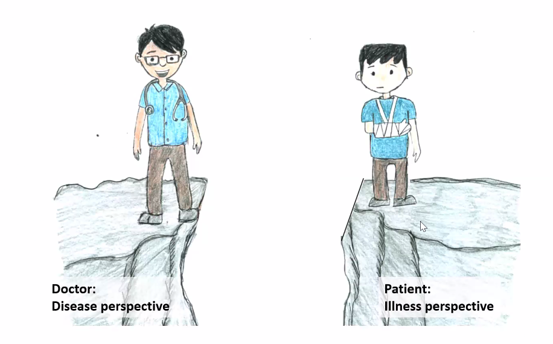

Foundation of Clinical Medicine
===============================

Struggles

- Low health literacy - Fatima lateef is interested
- When hit the wards, check with nursing manager for interpreter list
- What does the coroner actually do?

Basic Principles of Clinical Medicine 
-------------------------------------

-   Dangerous things are dangerous, common things are common
-   Multiple conditions may co-exist, and contribute to each other, e.g. PAD and cellulitis 2/2 foot ulcer; therefore do not over simplify, especially if there is a mixed picture
-   Disease is a function of the condition and patient.
-   In all disease, think from diagnosis to disability
-   Research is as great as clinical service

### Biopsychosocial Approach to Care

The term *biopsychosocial* indicate an approach to health service delivery that **addresses the psychological and social aspects of health and treatment**, that includes behavioral and environmental issues. Intervention that considers biopsychosocial issues related to health requires the use of a **transdisciplinary team** of professionals to address medical problems and concerns in a variety of settings. Note that besides all medical specialities, nurses, pharmacists, social works, administrators, therapists, and health aids, family members are also increasingly recognized as part of a multidisciplinary team.

Evidence in support of biopsychosocial approach to care
-   Among people with cardiovascular disease, untreated depression has been found to increase the risk of a heart attack (Monster, 2004)
-   After a major medical procedure, such as open heart surgery, a patient's anxiety may increase (Ben-Zur, 2000)
-   A person who is depressed may be less motivated to f/u with medical appointments, and cope poorly with his diagnosis and treatment regimens, further adversely impacting his physical health (Livneh, 2000)
-   Effective coping, enhanced self-efficacy, and optimism have been associated with enhanced quality of life in people with chronic illnesses (Rose, 2002)

### Disease and Illness

**Disease**

- A pathological process, or non funtioning of the body
- Involves some abnormality
- Cellular or subcellular level

**Illness**

- Social and psychological phenomena
- Directly influences by disease
- Involves perception, behavior, and experience

**Example**

- Disease
  - Discuss trajectory of CKD and expected time to end stage kidney disease
  - Describe discuss and counsel options for renal replacement therpay
  - If hemodialysis, map veins, and refer to vascular surgeons for creation of AV fistula
  - If peritoneal dialysis, refer to PD service for pre PD home visit and PD catheter placement
- Illness
  - How will it affect my life, my job? 
  - How will i pay for it?
  - How will I manage childcare etc.

**Meaning of pain to patients**

- Alive or close to death
- The meaning is conditioned upon the 
- Physical Pain: Functional impairments
- Spiritual pain: fear of the unknown, religion and faith
- Social pain: sense of loss
- Feeling alive, growth and becoming stronger, 
- See Facts, Honor feelings, Honor faith, Debunk fallacy

### Nature of Suffering and Goals of Medicine

Cassell, E.J. and Rich B.A. (2010)

**Pain**

- Illness symptoms causes physical pain
- Illness symptoms can lead to a sense of helplessness, isolation, and loss of control
- May create a sense of destructive threat to one's sense of self

**Suffering**

- A specific distress that occurs when an impending destruction of the person is perceived and continues until the threat is gone or the integrity of the person can be restored
- When pain produces suffering, the suffering, not the pain, becomes the central distress
- Extends beyond physical suffering, existential suffering
- An affliction of persons, not bodies
- Personal, individual, lonely, marked by self-conflict

### Emergency Department

Five factors have led emergency physicians to develop a unique approach to the patient: 

1. the pressure of time and volume 

   - must be prepared to “treat first and ask questions later.”
   - Lots of triage decisions everyday

2. the variety of conditions faced

3. the paucity of information

4. the limitation of therapeutic options: can provide only temporizing or symptomatic treatment

5. and the constraint of disposition.

   ED ultimately reduces to three binary decisions: 

   - Is the patient sick or not sick? 
   - If sick, should I treat or not treat? 
   - Should I admit or discharge? 

#### Objectives in ED

- Rapid and systematic clinical assessment
- Institute immediate life saving treatment
- Use information obtained clinically and via imaging to guide decide on the most appropriate patient pathway

#### Framework for Approaching a Patient in ED

- “Do I need to resuscitate this patient?”
  - In emergency: treatment, physical examination, laboratory testing, and history.
  - thinking required must be invested ahead of time
- Manage given the situation and ED limitations
- Disposition
  - outline plan to patient
  - Honest estimate of time required
  - Anticipatory guidance about probable outcome
  - Update patient and family periodically on progress

**Questions**

- What is cold gynaecological condition

- What do we do about social problem requesting for admission?

- Do we do the non-urgent procedures that should not be seen in the ED?

### Triage

Dominique Jean-Larry; Started triage and camel ambulance

Triage involves the sorting of patients based on the resources required for treatment and the resources that are actually available. 

- The order of treatment is based on the ABC priorities (airway with cervical spine protection, breathing, and circulation with hemorrhage control). 
- Other factors that can affect triage and treatment priority include the severity of injury, ability to survive, and available resources. 
- Triage also includes the sorting of patients in the field to help determine the appropriate receiving medical facility. Trauma team activation may be considered for severely injured patients.

Prehospital personnel and their medical directors are responsible for ensuring that appropriate patients arrive at appropriate hospitals.

Triage situations are categorised as multiple casualties or mass casualties

- Multiple casualties: number of patients and the severity of their injuries *do not* exceed the capability of the facility to render care
  - Patients with life-threatening problems and those sustaining multiple-system injuries are treated first.
- Mass casualties: number of patients and the severity of their injuries *does* exceed the capability of the facility and staff
  - Patients having the greatest chance of survival and requiring the least expenditure of time, equipment, supplies, and personnel are treated first

#### ED Triage in Singapore

We recognise that for practical purposes most EDs tend to have four different acuity-type patient care areas, viz :-

1. Resuscitation Area
2. Non-Resuscitation Major Emergency (Critical) Area
3. Minor Emergency (Ambulant) Area
4. Non-Emergency Area

It is also well recognised that the greater the number of triage categories present, the more difficult it is for triage nurses to accurately reflect the correct triage value. Sometimes, a more accurate acuity categorisation is done at the end of the patient visit by the Emergency Department doctor who attended to the patient.

In Emergency medicine, the work-up and intensity of initial investigations and management often depends on the presenting complaint, rather than on the final diagnosis. Waiting time, resource utilisation and process times would therefore tend to mirror more the presenting complaint than the final diagnosis. The A&E Services, MOH has therefore agreed that patient acuity criteria be based on a combination of initial complaints and initial provisional diagnoses. There will be four patient acuity classes for all public Emergency Departments.

Triage is a dynamic process, we might have to up-triage or down triage after some time.

| Scale | Description                                                  | % patients |
| ----- | ------------------------------------------------------------ | ---------- |
| PAC1  | These are patients who are either **already in a state of cardiovascular collapse or in imminent danger of collapse** and would therefore be required to be attended to without a moment’s delay. They would be likely to require the maximum allocation of staff and equipment resources for initial management. |            |
| PAC2  | These patients are **ill and non-ambulant** and in various forms of **severe distress**. They would appear to be in a stable state on initial cardiovascular examination and are **not in danger of imminent collapse**. The severity of their symptoms requires very early attention, failing which early deterioration of their medical status is likely. They would be trolley-based. |            |
| PAC3  | These patients have acute symptoms, but are ambulant, have mild to moderate symptoms and require acute treatment which will result in resolution of symptoms over time |            |
| PAC4  | These are non-emergency patients. They should not be presenting to Emergency Departments in the first place and should more appropriately be managed in a primary health care setting such as in family practice or public polyclinics. They may have an old injury or condition that has been present for a long time. They do not require immediate treatment. There is no immediate threat to their life or limb. | 2 - 4      |

#### Components of Triage

- Presenting complaint / events
- Drug allergies
- Past medical history
- Rapid and targeted examination
- Vitals: HR, BP, Sat, RR, Temperature
- Pain score

**Point of care test**

- Simple and rapid results
- POC test e.g. blood sugar level, ECH, analysis, urine pregnancy test, certain X-rays, visual acuity test
- Simple with rapid relief of pain or symptoms e.g. splinting, salbutamol nebulisation, oxygen therapy, pain medication, dressing, stopping bleeding

**Special areas**

- Fever

#### Triage Categories and Time to be Seen

| Category                                | Resource                                                     | 50%  | 95%  |
| --------------------------------------- | ------------------------------------------------------------ | ---- | ---- |
| PAC1 - resuscitation and critically ill | Everything is nearby in the cubicle; Resus room, has 6 cubicles with overhead x-ray; each cubicle trolley in the centre, video laryngoscopy, intubation, different oxygen supply and breathing device, cardiac defibrillators and monitoring; LEAN drugs in trolley. Sharp boxes. Step tool for CPR / mechanical CPR tool. Computer screen for every cubicle. Bloods and warmer. | 15   | 45   |
| PAC2 - major emergencies (non-ambulant) | Critical care without resus material; PAC1 in PAC2, cubicles near nurses; For pandemic, these are all empty. Before COVID19, stocked with blood taking, IV sets, oxygen, suction device. | 40   | 140  |
| PAC3 - minor emergencies (ambulant)     | Common oral drugs, and injectables.                          | 80   | 200  |
| PAC4 - non emergencies                  |                                                              | 90   | 210  |

#### Triage Categories and Complaints

| Complaints             | PAC1                                                         | PAC2                                                         | PAC3                                                         | PAC4                                                         |
| ---------------------- | ------------------------------------------------------------ | ------------------------------------------------------------ | ------------------------------------------------------------ | ------------------------------------------------------------ |
| Ingestion              | Acute poisoning with AMS (GCS < 14) / abnormal vital signs   | Acute poisoning with vital signs and no altered mental state; Drug overdose - conscious | Suspected ingestion, stable                                  |                                                              |
| Bite, unknown creature | Swollen limb - bitten by unknown creature, non-ambulant and or has abnormal vital signs; | Bite - swollen limb - bitten by unknown creature, non ambulant, normal vital sign; |                                                              |                                                              |
| Bite, snake bite       | snake bite with associated symptom                           | Snake bite without associated symptoms                       |                                                              |                                                              |
| Bee Sting              | Unstable patient                                             | Bee sting is > 5 stings plus normal haemodynamics or vital signs; | Bee sting &leq; 5  stings with normal vital signs            |                                                              |
| Injury and Trauma      | Patient unstable, AMS                                        | Electric shock injury - patient stable; Mechanism consistent with major trauma without other complaint; moderate trauma - non-ambulant | Dislocation - minor joint / jaw                              | Old trauma with residual disability                          |
| Fever                  |                                                              | High fever (&geq; 40&deg; C)                                 | Fever 40&deg; C with chills for one day + adult diabetic with no other complaint;  Fever / cough / headache several days; Fever with giddiness, ? HIV/?TB and stable; Fever with spontaneous pain |                                                              |
| AMS                    | Unconscious                                                  | No unconscious, non-violent, normal vital signs;             |                                                              |                                                              |
| Seizure                | Active seizures                                              | Seizures – Alert on arrival                                  |                                                              |                                                              |
| Anxiety                |                                                              | Acute stress reaction with agitated / violent behavior;      | Acute stress reaction (neurosis) - calm                      |                                                              |
| Depression             |                                                              | Depression with suicidal intention                           | Depression without suicidal intention                        |                                                              |
| Head injury            | Unconcious, AMS                                              | Head Injury, Alert + Vomiting;                               | Contusion with normal x-ray and vital sign                   |                                                              |
| Neuro signs            |                                                              | Facial weakness;                                             |                                                              |                                                              |
| Giddiness              |                                                              | Giddiness rendering patient non-ambulant;                    | Giddiness - patient ambulant                                 |                                                              |
| Headache               | non ambulant and or abnormal vital sign                      | non-ambulant with normal vital sign                          | Alert, not-vomiting                                          |                                                              |
| Backache               |                                                              | Back pain and weakness in limb; Back pain - ambulant with tachycardia / high BP | Backache / back sprain - ambulant                            | Chronic backache, no history of trauma and ambulant          |
| Eye                    |                                                              | Oculo-gyric crisis; Red eye with associated symptoms present; Retinal detachment | Abscess - eyelid; Red eye - basic common ailments            | Non-urgent eye conditions                                    |
| Eye trauma             |                                                              | impaired vision                                              | no impaired vision                                           |                                                              |
| Ear pain               |                                                              |                                                              | Earache / acute ear discharge; Ear ache radiating to neck with normal vital signs |                                                              |
| Neck pain              | Patient unstable                                             | Neck pain with associated symptoms                           | Neck pain / ache with no associated symptoms                 |                                                              |
| Cardiac                | Arrest                                                       | Mild / Moderate Heart Failure                                | Abnormal ECG referred by GP but patient looks well; Palpitation with normal ECG / heart rate |                                                              |
| Cough                  |                                                              | Cough with 1 week fever despite primary medical care, wheezing, history of asthma; Cough with shortness of breath but no past medical history, normal vital signs; | green phlegm, fever with history of asthma; Blood-streaked sputum with normal vital sign |                                                              |
| SOB                    | respiratory distress, unstable vital signs                   | Baby with history but pink when presented; Chest infection with breathlessness; Hyperventilation; SOB but patient is stable. |                                                              | Minor upper respiratory illnesses;                           |
| Asthma                 | Near death asthma                                            | Mild / moderate asthma                                       |                                                              |                                                              |
| PO bleed               |                                                              |                                                              | Bleeding from mouth - vital signs stable                     |                                                              |
| PR Bleed               | In Shock                                                     |                                                              | Prolapsed piles                                              |                                                              |
| PV Bleed               | Pregnant, unstable vital sign                                | Pregnant with stable vital sign                              | PV bleed, stopped, normal vitals;                            | Cold gynaecological cases                                    |
| Dysmenorrhoea          |                                                              |                                                              | Normal vital signs; Menopausal spotting / problems;          |                                                              |
| Dysuria                |                                                              |                                                              | Painful micturition                                          |                                                              |
| Male Repro             |                                                              |                                                              | Phimosis                                                     |                                                              |
| Diarrhea and vomiting  |                                                              | Diarrhoea and vomiting; Persistent Vomiting - ?Cause;        | Vomiting - unable to retain but not dehydrated               |                                                              |
| Constipation           |                                                              |                                                              | Constipation 1 week < 1 episode vomiting                     |                                                              |
| Abdominal pain         | Ectopic pregnancy in shock, severe pain in shock             | Dysmenorrhoea rendering patient non-ambulant; Severe pain    | Not severe, normal vital signs; Moderate to severe - ambulant |                                                              |
| Limb swelling          |                                                              | Bilateral lower limb swelling (>65 year old)                 | Bilateral swelling of the lower limbs - ambulant             |                                                              |
| Cellulitis             |                                                              | Cellulitis (any lower limb) with abnormal vital sign         | Cellulitis with normal vital signs or low range fever        | Non-urgent skin problems                                     |
| Wounds                 | Punctured chest wound                                        |                                                              | Chronic discharging wounds:                                  |                                                              |
| Amputation             | limb amputations                                             |                                                              | old amputation site, afebrile, with GP referral              |                                                              |
| Limb Injury            | limb-threatening injury                                      | Fractured femur; Limb injury with cut tendon;                | Healed fracture site re-injured; not-limb threatening        | Fractures already seen at ortho - ED visit for MC extension  |
| Weakness               |                                                              |                                                              |                                                              | Chronic weakness of the body                                 |
| Metabolic              |                                                              | High blood sugar with associated symptoms                    |                                                              |                                                              |
| Sore throat            |                                                              |                                                              | Sore throat                                                  | Sore throat with absence of respiratory problems             |
| Hoarseness of voice    |                                                              |                                                              | Hoarseness of voice                                          |                                                              |
| Others                 | Any shock state                                              | Bed sores; Scrotal swelling; Severe painful states           | Gangrene toe; Foreign body in orifices, eyes, throat; Post-op bleeding - normal vitals | Minor ill-defined conditions; Requests for non-urgent treatment; Non-urgent surgical procedures |
| Police case            |                                                              | Pre- or post-statement examination – patient non ambulant.   | Symptomatic patient with acute pain / injury                 | Straightforward blood alcohol; Epigastric pain for two weeks Pre- or post- statement examination with no acute pain / injury |
| Referrals              |                                                              |                                                              | From primary health doctors / army; MOs/NKF:normal vitals / patient no in pain | Requests for certification and general check-ups             |

#### Triage Category and Provisional Diagnosis

**Initial Provisional Diagnosis**

- AMI with / without complications
- Acute stroke with AMS
- Acute renal failure; fluid overload, SOB
- Acute vision-threatening conditions e.g. acute glaucoma
- Allergic reaction - anaphylactic shock
- Dissecting aneurysm
- Emergency labor
- Epiglottitis
- Facial burns with airway compromise
- Febrile fit - fitting when presented in A&E
- Head injury with unconciousness
- Hypoglycemia
- Leaking abdominal aortic aneurysm
- Multiple major trauma
- Ocular burns
- Open wound of chest
- Pneumothorax - traumatic / tension
- Septic shock
- Severe Heart failure
- Shock of whatever cause
- Status Asthmaticus
- Status Epilepticus
- SVT - normal vital sign
- Trauma arrest
- Tricyclic overdosage
- Unstable angina pectoris

**Initial Provisional Diagnosis**

- Acute appendicitis
- Acute CVA but alert, acute stroke with normal vitals and normal mental state
- Acute ureteric colic, pyelonephritis, urinary retention, renal colic patient in pain
- Acute exacerbation of peptic ulcer
- Acute psychotic states
- Angioedema
- Bronchial asthma
- Bronchopneumonia
- Cancers with complications
- Chest pain - cause not obvious
- Cholecystitis
- Closed major lower extremity fractures
- Crush injury
- Diabetic ketoacidosis
- Ectopic pregnancy - stable
- Gastrointestinal bleed - normal vital signs
- Hyperosmolar non-ketotic diabetes
- Intestinal obstruction
- Major limb fractures
- Major joint dislocation
- Major vertebrogenic syndromes
- Multiple rib fractures
- Neck/spinal cord injury
- Open extremity fractures
- Perforated viscus
- Post febrile fit < 5 year old (>38.5 &deg; C)
- Severe sepsis without shock
- Syncope

**Typical Provisional Diagnosis**

- Acute gastroenteritis
- Allergic reaction - urticaria only
- All sprains
- Clavicular fracture
- Closed upper extremity fractures
- Foreign bodies of ENT and extremities
- Gastrointestinal reflux
- Head injury, alert, no vomiting, other minor fractions
- Hyperpyrexia
- Insect stings, snake, and animal bites
- Migraine and similar headaches
- Otitis media / externa
- Post-febrile fit < 5 years old - depending on temp of fever (<38.5)
- Superficial injuries 
- Urticaria
- Vomiting

**Provisional diagnosis**

- Non urgent operations
  - Removal of metal plates, screws
  - Old unreduced dislocations
  - Chronic sprains
  - Cold lumps and bumps in the body
  - Varicose veins
  - Cyst
  - Requests for circumcision
  - Patching of Earlobe
  - Removal of tattoo
  - Removal of corns, warts
  - Removal of keloids
- MSK and derm
  - Old scars
  - Deformities of bones, limbs, or spine
  - Joint contractures
  - Old Fractures

- Weakness of body
  - Cerebral palsy, spastics
  - Cervical spondylosis
  - Post polio
  - Old hemiplegics, old strokes
  - Old paraplegia
  - Osteoarthritis knees
- Non-urgent eye conditions
  - Refractive disorders of the eye, spectacles
  - Pterygium
  - Cataract
  - Defective vision
  - Squints
- Non-urgent ENT conditions
  - Chronic rhinitis
  - Defective hearing
  - Nasal polyps
  - Wax in ears
- Ill defined conditions
  - Chronic vague symptoms like tiredness, dyspepsia
  - Upper respiratory infection without fever
  - Chronic cough
  - Social problem - request admission
  - Psychosomatic problems
  - Chronic headaches on and off
  - Insomnia

 #### Mass Casualty Triage

- International humanitarian work is common for ED physicians

- 4 Categories

  | Category                    | Remark                                                       |
  | --------------------------- | ------------------------------------------------------------ |
  | 4 - Dead or expectant death | Death is usually pronounced in the field for these casualties or they are hopelessly wounded and death is almost a certainty. They are made comfortable and may be given supportive management only. Treat with dignity and respect. Palliative care on the ground! |

- Note to distinguish between mass casualty vs multi-casualty incident

  - In multi-casualty incidents, we do the normal triage, and try to do our best for every patient

### Chronic Diseases

Chronic diseases can be categorized according to
-   Four key dimensions that have an impact on the family system (Rolland (1994)):
    1.  onset - family adapt differently when the onset is rapid vs. gradual
    2.  course - progressive, constant, improves over time, or fluctuating
    3.  outcome - fatal OR lifespan reduction but nonfatal; nonfatal conditions do not have neither a predictable timeline of demise nor a strong likelihood that they will emerge as the principal cause of death; fatal disease require more direct confrontation with high likelihood of death, calling for particular adaptive demands by the affected individual and the family system that are a part of the death and dying process.
    4.  degree of incapacitation
-   Distinct psychosocial typologies, each with its own set of implications for the adaptation and social functioning of the family system. These depend on the interaction between the 4 dimensions of a disease

Domains of Impact of Chronic Disease on Family

-   Chronic disease affects the family system's instrumental functions as a social unit to meet

    -   Economic needs

    -   Developmental and emotional needs

    -   Physical needs - primary care and support system for ill and disabled

-   They can also affect the family's functioning in

    -   Structural and organizational patterns

    -   Communication processes

    -   Multigenerational patterns

    -   Family life cycle and belief systems

Although the importance of family involvement in the process of health care delivery is recognized, there is still little knowledge about which particular attributes of family involvement are efficacious in improving health outcomes (IOM, 2008).

Safety in the Clinical Setting
----------------------

### Infection Control

Hospital acquired infection: infection not present before coming to the hospital but developed while in the hospital.

#### Modes of Transmission

Microorganisms are spread primarily through three ways within a hospital setting

1.  Airborne: occurs when infectious pathogens are aerosolized and remain suspended in the air for long periods of time. e.g. TB, chickenpox, measles

2.  Droplet: occurs when droplets containing microorganisms from the infected person are propelled a short distance through the air and deposited on the susceptible host's conjunctivae, nasal mucosa, or mouth. E.g. repiratory tract infections, influenza, mumps, rubella, MRSA respiratory disperser, Neisseria Meningitis

3.  Contact: there are two forms of contact transmission
    -   Direct transmission: involves physical contract between an infected person and a susceptible person
    -   Indirect transmission: involves contact of a susceptible person with a contaminated intermediate object
    Examples: MRSA, VRE, clostridium difficle

#### Identifying Patient's Precaution Status 

Method of identifying infectious patients in SGH

-   Coloured discs: [multi-drug resistant organism]{style="color: orange"} and [clostridium difficile, norovirus]{style="color: green"} patients are identified by orange / green discs on their medical records.

-   Precaution status can also be seen on Sunrise Clinical Manager (SCM), outpatient appointment system (OAS), and systems, applications and products (SAP) electronic systems.

#### Eliminate Transmission

| Modes             | Airborne                                                     | Droplet                                                      | Contact                                          |
| ----------------- | ------------------------------------------------------------ | ------------------------------------------------------------ | ------------------------------------------------ |
| Patient placement | Airborne infection isolation room                            | Single room if possible;                                     | Single room if possible                          |
| PPE               | Fit-tested NIOSH-approved N95 or higher level respirator; gloves, gown, mask, eye protection | Gloves, gown, mask, eye protection                           | Gloves and gown                                  |
| Source control    | Restrict susceptible healthcare personnel from entering the room | Put a mask on patient; Limit transport and movement of patient | Minimise patient movement in and out of the room |

**Standard Precaution**

-  What does it do
    - Reduce the risk of transmission of microorganisms from both recognised and unrecognized sources of infection in hospital
    - Apply to ALL patients receiving care in hospitals regardless of their diagnosis or presumed infection status.

-   When is it used?
  
    These are applied when one has contact with blood, non-intact skin, body fluids, mucous membrane

-   How

    -   5 Moments of **Hand hygiene**: Moments of hand hygiene (WHO)
-   Inpatient
            1.  Before touching a patient
            2.  Before clean / aseptic procedure
            3.  After body fluid exposure risk
            4.  After touching a patient
            5.  After touching patient surroundings
        
-   Outpatient
        
    1.  Before touching a patient
            2.  Before clean / aseptic procedure
            3.  After body fluid exposure risk
            4.  After touching a patient
        
-   **Respiratory Hygiene**
        Maintain goodrepsiratory hygiene / cough etiquette
        1. Cover mouth and eyes when coughing
        2. Do not come to work if ill
      
    -   **PPE**
        -   Where PPE when there is a need to prevent tranmission of containants from patient's blood and body fluid
        -   Surgical masks prevent respiratory transmission; change mask every 4 - 6 hours, or if soiled.
            - Current models in SGH is 3M 1860 and 1870+ 
            - N95 respiratory user seal check is very important
        - Gloves
          - Protect healthcare workers when in contact with patient's blood and body fluids
          - Perform hand hygiene before donning on gloves
          - Ensure that the gown's flaps overlap and fully cover the inner clothing. Ensure that the gloves overlap with the cuffs of the gown.The white part is only cotton and NOT waterproof
        - Eye Protection
          - Protect healthcare worker's mucous membrane of eyes from contact with blood and body fluid
          - The eye protection should be fit well
          - If it is a reusable eye protection, clean and disinfect in between
        
      - Preparation and administration of drugs
        - Use aseptic technique to avoid contamination of sterile products
        - Never re-use devices
          - Vacutainer: rubber shield contains needle
          - Butterfly: blood taking from difficult vein (i.e. pediatric)
          - Safety cannula: never reuse the cannula after a failed attempt
          - Needleless connectors: hold breath 3 seconds when scrubing the hub (at least 10 times. )
          - Autisheild due pen needle: must be used by nursing staff for patient who are not able to do self-administration. Patients and caregivers to use standard pen needle
          - Blood Transfer device: is sterile can enter
          - Bard Safestep Huber Needle Set for implanted port (for trained nurses); firmly pull the handle up

**Sharps and Sharp Injury**

-  Always ensure the disposal container is nearby before starting
-  What to do following a sharp injury
   -  Wash the punctured wound
   -  Cover wound
   -  Inform supervisor and occupational health

**Computer on Wheels**

- Working desk needs to be wiped before and after procedures
- Unused items taken from drawer and brought into patient's environment (e.g. bed) should not be returned to clean stock

**Wipes**

- Alcohol impregnanted wipes (mikerozid wipes): for orange sticker
- Alcohol free: for sensitive equipment
- Sporicidal wipes for equipment and environment contaminated with Clostridium difficile and all commodes cleaning. Patient is identified with green disc

**Cleaning blood spillage**

- Use NaDCC granules (sodiu hypochlorite)
- Wait for 2 minutes
- Grab and discard into biohazard  

**Others**

-  Hospital waste
-  Linen handling: Contaminated linen refers to linen used by an infectious patient, these will be treated with a different temperature

Clinical Reasoning
------------------

*Clinical reasoning is the process, by which a health care provider takes objective data, acquired from an actual patient, and interprets it from factual knowledge from a textbook or the medical literature in order to either make a diagnosis or develop a treatment plan.* 

It isn't a single skill but rather a collection of related skills including

-   Interpretation of subjective data
-   Evaluation of the accuracy and validity of data
-   Synthesis of individual pieces of data into higher order groups
-   Determination of the relevance of scientific literature for a specific clinical situation
-   Critical evaluation of the arguments for and against diagnoses
-   Application of biostatistics
-   Integration of different types of knowledge into a complete decision-making process.

### Generating a Differential Diagnosis

A differential diagnosis is a list of possible diagnosis which may explain the patient's presentation. It should

-   Include those diagnoses in which either the likelihood is high enough or the danger, if it should be missed is high enough, in order to warrant additional testing to investigate that specific diagnosis.
-   It may include additional diagnoses whose likelihood is low enough to not warrant immediate testing, but which have not been completely ruled out
-   It is prioritized in descending order of likelihood.
-   Unlike a framework / approach, *the differential diagnosis is specific to the patient while the framework (or approach) is not*
-   Note atypical presentations!

A solid focused differential diagnosis should include

-   The one diagnosis that you believe to be the most likely - the \"working diagnosis\", or \"provisional diagnosis\"
-   2 - 4 diagnosis that are very common in general, for which this patient case could be either a typical or an atypical presentation
-   Any diagnoses which are rapidly fatal if untreated, of which this patient case could plausibly be a result - a \"don't miss diagnosis\"
-   Any diagnoses which are specifically suggested by standout features of the patient's history - most of these will turn out to be \"red herrings\"

Generating a list of differentials consists of 5 steps as outlined in the following subsections.

#### Acquire Data

-   Sources can include: Previous charts, Hx, PE, Tests, Talking to family and friends for collateral information etc.

-   More mature clinicians can dynamically identifying differential diagnosis as data collection is going on; this helps them select the necessary lab tests. However it does not always result in a more accurate diagnosis. In particular, such a process can set one up for **Anchoring Bias**. *This is the tendency to place too much weight on a single piece of information acquired early in the data acquisition process, and a failure to update the differential diagnosis when conflicting information is later presented.* Be aware of this bias, once all data is acquired, force myself to return to the beginning of the clinical reasoning process so that each piece of data is given equal weight.

#### Identify Key Features

Key features are individual elements of the presentation which are likely to help differentiate one diagnosis from another.

-   This include both positive and negative findings

-   May be from history, exam, labs, other tests, or chart review

#### Create a problem representation / summary statement / impression 

This is a 1 - 2 sentence summary, using precise medical terminology, of the most highly relevant aspects of the patient's history, exam, and diagnostic tests.\
\
Now consider using the following structure for the problem representation:

1.  Age and gender

2.  Highly relevant PMH

    -   multiple cardiovascular risk factors: HTN, diabetes, obesity, smoking
    -   multiple psychosocial stressors
    -   alcohol use
    -   40 pack year smoking history
    -   previously healthy
    -   significant sun exposure

3.  Primary symptom using semantic qualifiers\
    Semantic qualifiers are qualitative abstraction of the signs and symptoms of a case in which an opposing abstraction is either explicit or implied. These help to reframe a patient's symptom into terms more familiar to the clinician and easier to communicate to others. Common categories of qualifiers include:

    -   **Onset**: abrupt or progressive
    -   **Duration**: acute or chronic
    -   **Course**: continuous or episodic
    -   **Site**: unilateral or bilateral, proximal or distal, diffuse or localized
    -   **Symptom trigger**: Post-prandial, exertional, pleuritic, or positional
    -   **Presence of pain**: painful or painless

    Note that some information is lost when patient's presentation is translated into semantic qualifiers, which can set one up for bias if the original history is never revisited.

4.  Summarize highly relevant diagnostic data, especially the ones directly relevant to the chief complain. Synthesize constellation of clearly related findings into a single clinical syndrome when possible

    -   **Hemodynamically stable**: unremarkable vitals
    -   **Without evidence of acute infarction**: lack of Q waves or lack of ST segment elevation, normal cardiac enzymes.
    -   **SIRS**: elevated WBC, fever, tachycardia, tachypnea
    -   **ARDS**: acute onset dyspnea, bilateral opacities consistent with pulmonary edema detected on CT or CXR, PaO2/FiO2 ratio < 300 mmHg
    -   **Peritoneal signs**: soft abdomen and lack of rebound tenderness
    -   **Hepatic failure**: 
    -   **Volume overload**: peripheral edema, dyspnea, abdominal distention, fatigue, and lassitude

    Don't mis-interpret the clinical syndrome for the diagnosis! e.g. sepsis is not a diagnosis, find the cause of the sepsis.

Examples of representation:

-   A 60 year woman with a history of poorly controlled diabetes, presents with chronic progressive exertional dyspnea, with exam and CXR findings of volume overload, and with unremarkable routine labs and EKG.

-   A 54 year male without health concerns or known medical problem presents for routine physical examination after not engaging with regular healthcare for over a decade. He is overweight and his blood pressure is elevated today, but the remainder of his physical exam is unremarkable. He has some cardiovascular risk factors including physical inactivity due to his work as a taxi driver, regular intake of fast food, and mother with hypercholesteronemia. His father had a MI at age 64, though this does not conferr significant risk to this patient, and he has some financial stressors and does not have health insurance.

-   Marissa is a 12-year-old female with a three-day history of fever, cough, sore throat, myalgia, and headache. Physical exam shows diffuse rhonchi, occasional wheezing, a hyperemic oropharynx, tender cervical lymphadenopathy, but no crackles. She missed her influenza immunization.

-   Sarah is a 24-year-old female with a family history of migraines who presents complaining of two types of chronic, progressively worsening headaches. The first type are severe, throbbing, and unilateral with associated nausea, photophobia, and hyperacusis, last all day when present, occur one- to two- times weekly, are worse prior to menses, and do not improve with ibuprofen. The second type are mild-to-moderate and bilateral, last all day most days, and have associated neck discomfort. On exam Sarah is afebrile with normal vital signs, has a mildly tender occiput, and has no focal neurologic defects, signs of increased intracranial pressure, or meningeal irritation.

-   Andrew is a sexually active 17-year-old male who presents with a four-hour history of severe right groin pain with radiation to the right scrotum and associated nausea but no vomiting, fever, or urinary symptom. The patient reports a similar episode six to nine months ago that resolved spontaneously. Physical exam finds a swollen, erythematous right scrotum with an exquisitely tender right testicle, no masses, a negative Prehn sign, an absent cremasteric reflex on the right, absent blue dot sign, and no transillumination of the scrotum. iMr. Barley is a 58-year-old male smoker who presents with a two-week history of productive cough and dyspnea on exertion. He has had similar symptoms during the past two winters. He denies fever, chest pain, epigastric pain, symptoms of CHF, recent travel, or TB or chemical exposures.

-   Mr. Marshall is a 72-year-old man, with a history of hypertension, COPD and moderate dementia, who presents with 4 days of increased confusion, nighttime restlessness, visual hallucinations, and urinary incontinence. His physical exam is unremarkable except for tachypnea, a mildly enlarged prostate, inattentiveness, and a worsening of his MMSE score from a baseline of 18 to 12 today.

-   Mrs. Saleh is a 28-year-old woman with a recent upper respiratory infection who presents with acute onset constant, non-positional vertigo with associated nausea and vomiting. On exam she has normal orthostatic vital signs, normal hearing, a positive Romberg test, and left horizontal nystagmus that resolves with gaze fixation and does not change with direction of gaze.

#### Adopt a Framework

To help better understand the patient's problem. This may be anatomic, physiologic, or other, commonly adopted from a referenced text. 

#### Apply the Key Features to the Framework to Generate Preliminary DD

The idea is to use the presence or absence to estimate the likelihood of the diseases suggested by the framework.

History Taking
----------------

### Key Questions

#### Diagnostic Part

| System           | Must Ask (Danger)                                            | Others                                                       |
| ---------------- | ------------------------------------------------------------ | ------------------------------------------------------------ |
| Constitutional   | (**Malignancy / Chronic inflammation**) Have you lost weight without dieting? Have you had fevers, night sweats, shivers and shakes (triggers)? |                                                              |
| Neurological     | (**SAH**) Is your headache very severe and did it begin very suddenly? | Do you get headaches?  Have you had dizziness, fainting episodes, fits, or blackouts?  Have you had memory problems or trouble concentrating? Do you have trouble seeing or hearing or saying what you want to say?  Have you had weakness, numbness, or clumsiness in your arms and legs?  Have you ever had a stroke or head injury? |
| Eyes and ENT     |                                                              |                                                              |
| Cardiovascular   | (**MI**) Have you had any pain or pressure in your chest, neck, or arm? (**HF**) Have you ever woken up at night short of breath? (**Strokes-Adams Attacks**) Have you had blackouts without warning? (**Severe AS** or **HOCM**) Have you felt dizzy or blacked out when exercising? | Are you short of breath on exertion? How much exertion is necessary? Have you noticed your heart racing or beating irregularly Can you lie flat without feeling breathlessness? Do you have pain in your legs on exercise? Have you had swelling of your ankles? Have you ever rheumatic fever, a heart attack, or high blood pressure? |
| Respiratory      | (**PE**) Have you ever become short of breath very suddenly? (**Pneumonia**) Is your cough associated with shivers, shakes, breathlessness and chest pain? (**Bronchial carcinoma**) Have you coughed up blood? | Do you snore loudly? Do you fall asleep easily during the day? When? Have you fallen asleep while driving?  Have you had any cough? Do you cough up anything?  Do you ever wheeze when you are SOB? Have you ever had pneumonia or tuberculosis? Have you had a recent chest x-ray? What type of work have you done? |
| Gastrointestinal | (**GIT bleed**) Have you seen blood in your vomit or motion? Have your stools been black? (**Oesophageal Carcinoma**) Have you had difficulty swallowing? (**Colon Carcinoma**) Has your bowel habit changed recently? Has the stool been black? | Are you troubled by indigestion?  Do you have heartburn? Have you had pain or discomfort in your abdomen? Have you had any abdominal bloating or distension? How many bowel motions a week do you usually pass motion? Have you lost control of your bowels or had accidents? Have your eyes ever been yellow? Have you ever had hepatitis, peptic ulceration, colitis, or bowel cancer? Tell me about your diet recently. |
| Endocrine        | (**New onset diabetes**) Have you been usually thirsty recently? | Have you noticed any swelling in your neck?  Do your hands tremble? Have you noticed increases sweating? Do you have a strong preference to hot or cold weather? Have you had a thyroid problem or diabetes?  Are you troubled by fatigue?  Have you noticed any change in your appearance, hair, skin, or voice? |
| Haematological   | (**Bleeding disorder**) Do you have difficult stopping a small cut from bleeding? (**Haem malignancy**) Have you noticed any lumps under your arms, or in your neck or groin? | Do you bruise easily?  Have you ever had blood clots in your legs or in your lungs? |
| Genitourinary    | (**Urinary tract malignancy**) Have you seen blood in your urine? | (Infection) Has the urine color changed? Do you have difficulty or pain on passing urine?  Is there a delay before you start to pass using? Is your urine stream as good as it used to be? Is there dribbling at the end?  Do you have to get up at night to pass urine?  Are you passing larger or smaller amounts of urine? |
| MSK              | (**Septic arthritis**) Are any of your joints red, swollen, and painful? | Do you have painful or stiff joints? Have you had a skin rash recently?  Do you have any  back or neck pain?  Have your eyes been dry or red? Have you ever had a dry mouth or mouth ulcers? Do your fingers ever become painful and become white and blue in the cold?  Have you been diagnosed as having rheumatoid arthritis or gout? |
| Psychiatric      | (**Suicide/homicide**) Have you thought about harming yourself or other people? | Have you had difficulty sleeping? Do you feel sad or depressed, or have problems with your 'nerves'? Have you ever been sexually or physically abused? |
| Women            | (**Breast Cancer**) Have you had any bleeding  (**Endometrial Cancer**) Have you noticed any bleeding? | How many pregnancies have you had?  Have you had any miscarriages?  Have you had high blood pressure or diabetes in pregnancy? Were there any other complications during your pregnancies or deliveries?  Have you had a Caesarean? |
| Elderly          | (**High risk**) Have you had problems with falls or loss of balance? | Do you walk with a frame or stick? (**Fall risk**) Do you take sleeping tablets or sedatives? (**Orthostatic HoTN**) Do you take blood pressure tablets?  Have you ever been tested for osteoporosis?  Can you manage at home without help? Are you affected by arthritis? (**Cognitive decline**) Have you had problems with your memory or with managing things like paying bills? (**Risk of polypharmacy and confusion**) How do you manage your various tablets? |

#### Health maintenance part

- Smoking, alcohol, drugs
- BP, cholesterol, sugar awareness and management
- Exercise, weight, and diet, perception, practice, and goals
- Health screening and vaccination

### Quick Technique Notes

- Start with open ended questions, then ask directed high yield questions, finish with overview to catch missed points
- Social-emotional-behavioral determinants of health are IMPORTANT
- If emotions are uncovered, name the emotion to indicate understanding, show respect and express support
- TB, HIV, syphilis, and sarcoidosis are the great mimickers
- Give patients a chance to ask questions

### Obtaining Sexual History 

It is necessary to ask very personal questions when taking a sexual history. It is wise to warn the patient that you are going to ask these questions and to explain why they are necessary.
The prime consideration for patients is CONFIDENTIALITY and the reluctant patient may be more forthcoming when reassured of this by the physician. Moralistic attitudes should never be adopted, except perhaps towards the “repeater” or “defaulter” who continually puts both his/her own health and the health of others at risk.
Questions should also be phrased in a language that the patient will understand i.e. non- technical, and terms may need to be phrased in “street language”.

We ask questions to find out –
- risk of exposure to certain infections
- sites of exposure to infection (so we know where to take samples from)
- contact tracing – is it possible to contact the sexual contacts to advise them to
seek tests and treatment

Golden rules for taking a sexual history –
- assume nothing
- demonstrate that you have heard it all before
- never look shocked or surprised
- do not appear judgemental

Difficulty is often encountered in establishing the patient’s sexual orientation. It is naive to assume that a married man, perhaps with children, would not have indulged in homosexual activity. Unambiguous direct questioning is often necessary, again followed by further explanation if needed. Indeed all physicians should be aware of the spectrum of human sexual behaviour.

It is not sufficient merely to ask whether the patient has noticed any “troubles” or “symptoms”. A negative reply may be an important “negative” and should be substantiated by a properly taken history.

When syphilis or other systemic infections are suspected, the history must be more comprehensive and direct questions asked about each system.

Take the opportunity to do some health promotion. The majority of patients know very little about STIs/HIV.

#### General points
- Age
- Sex
- Presenting complaints (see below under male and female)
- Last sexual contact (LSI)
  - When
  - With whom (regular/casual)
  - Type of sex (oral/vaginal/anal)
  - Condoms? Accidents (such as condom breakages)?
- Previous sexual contact (PSI) with a different individual from the last sexual contact
  - as above
  - avoid tactless inquiry into sexual history in “marital” cases when the source of the partner's infection is clear
- HIV – previous tests and risk factors
- Past history of other STI and treatment
  - Have you had any sexually transmitted infections in the past or sought advice for suspected infection?
  - In females include details of presumptive cystitis, thrust etc, treated by other practitioners
- Past medical history/drug allergies
  - Have you ever had any illnesses or operations requiring hospital admission? Record details

#### Males 
Discharge
- Have you noticed any discharge/pus coming from your penis? If “yes” record details, including:
    - Do you think it is coming from the urethra or under the foreskin?
    - How long have you had it?
    - What colour is it?

Urinary Symptoms
- Have you had any problems passing urine? If “yes” record details, including:
    - Is there a burning sensation?
    - Are you going more often?
    - Are you passing blood?

Genital Lesions
- Have you noticed any sores, spots or irritation on or near your penis? If “yes” record details, including:
    - Whereabouts?
    - For how long
    - Any symptoms such as pain or itch?
    - Have you had anything similar before?
    - What, if any, medicaments have you applied?

Other Symptoms
- Have you noticed any aching or swelling in your joints or pain or redness in your eyes?
- Have you ever had infectious hepatitis / yellow jaundice?
  (Particularly important to ask drug addicts and homosexuals about this as such patients are more likely to be carrying hepatitis B surface antigen than are other categories of patient)
- Are you allergic to any medicines?
- Are you currently, or have you recently, taken any antibiotics or other medicines?

#### Female
This should follow the same format as that adopted for males, but with certain modification in regard to symptomatology and female physiology.

Discharge
- Have you noticed excessive vaginal discharge? If “yes” record details, including:
    - What colour is it?
    - Does it cause irritation or itch?
    - Is it foul smelling?
    - Is it blood-stained?
    - (If long-standing) is it related to periods?

Urinary Symptoms
- Have you noticed any burning sensation passing water? As for males, but if “yes”
- Do you think the burning is caused by the urine coming out, or by urine coming into contact with inflammation on the outside? (external or vulval dysuria)
- Also enquire about urgency, loin pains, fever and rigors. (Suggestive of pyelonephritis secondary to urinary infections)

Genital Lesions
- Have you noticed any sores, spots or irritation in your genital area? Details as for males

Menstrual History
- What was the date of the first day of your last menstrual period (LMP)?
- Was this period “normal” for you? If not, was it heavier (menorrhagia)? Lighter (oligomenorrhoea)?
Record details of preceding period (s) as indicated
- Have you noticed any bleeding after intercourse (post-coital bleeding – PCB) or
any bleeding in between your periods (intermenstrual bleeding IMB)?

Gynaecological and Obstetric History
- Are you or your partner using any form of contraception? Eg oral contraceptive (OC), intrauterine device (IUD), diaphragm, sheath, pessaries, “rhythm” method etc.
    - If a barrier method is employed – is it always, usually or occasionally used?
    - If taking OC have any pills been missed?
- Have you ever been pregnant?
If “yes” record details – can use GxPx format
Patients may sometimes misunderstand the question to mean how many children they have. It is important to ask for number of pregnancies and number of live births. This may reveal a past history of failed pregnancy such as termination of pregnancy, spontaneous abortion or ectopic pregnancy.
- Have you had any tummy pains recently other than you would expect with your periods?
- Do you suffer from pain on intercourse?
If “yes” record type (superficial or deep), frequency (always or occasionally), duration (eg 1 week, 3 months or always)
- Have you had any gynaecological problems in the past?
(Eg Laparoscopy for suspected ectopic pregnancy 2 years ago)
- Have you had a (cancer) pap smear test before? If yes, when was the most recent one, and what was the result
- Have you had vaccination against the human papilloma virus (Cervarix / Gardasil)?

Physical Examination
--------------------

### Start with the Vitals

#### Temperature

| Location          | Normal | Fever |
| ----------------- | ------ | ----- |
| Axilla / Tympanic | 36.4   | >36.9 |
| Mouth             | 36.8   | >37.3 |
| Rectum            | 37.3   | >37.7 |

### General Appearance

#### Body weight, habitus, and posture

- Obesity increases the risk of certain conditions
- Malnutrition increases the risk of certain conditions
- Gait is important and can first be observed when a patient enters the clinic

#### Smell

| Smell                           | Conditions                                                 |
| ------------------------------- | ---------------------------------------------------------- |
| Sickly sweet acetone smell      | Ketoacidosis                                               |
| Sweet smell                     | Liver failure                                              |
| Ammoniacal fish breath          | Kidney failure                                             |
| Bad breath                      | Poor dental hygiene, gingivitis, nasopharyngeal tumors     |
| Foul smelling breath and saliva | Chronic suppurative infection of the lung                  |
| Fecal smell in breath           | severe IO                                                  |
| Offensive smell                 | Skin infections, bacterial vaginosis, urinary incontinence |
| Melaena smell                   | Meleana                                                    |
| Stale cigarette                 | Smoking                                                    |
| Alcohol smell                   | Alcohol                                                    |

#### Hydration Status

| Degree of Dehydration | Deficit       | Signs                                                        |
| --------------------- | ------------- | ------------------------------------------------------------ |
| Mild                  | <5% (2.5 L)   | Mild thirst Dry mucous membrane Concentrated urine |
| Moderate              | 5 - 8 % (4 L) | Moderate thirst Reduced skin turgor (elasticity), especially arms, forehead, chest, abdomen Tacycardia |
| Severe                | 9 - 12 %      | Great thirst  Reduced skin turgor and decreased eyeball pressure Collapsed veins, sunken eyes, gaunt face Postural hypotension Oliguria (<400 mL urine / 24 hours) |
| Very Severe           | >12% (6L)     | Above PLUS Comatose, moribund, signs of shock           |

####  Color

| Color    | Notes                                                        |
| -------- | ------------------------------------------------------------ |
| Pallor   | Facial pallor is observed in shock; but usually use the conjunctiva is more specific |
| Jaundice | Occurs when serum bilirubin is twice of the normal;          |
| Cyanosis | If more than about 50 g/L of deoxygenated Hb is present in the capillary blood, the skin will have blue tinge. Cyanosis does not occur in anaemic hypoxia because the Hb level is low. The examiner need to distinguish between central (cyanosis where there is good blood flow such as the tongue) vs peripheral cyanosis |

#### Diagnostic Facies

| Facies                                   | Feature                                                      |
| ---------------------------------------- | ------------------------------------------------------------ |
| Down syndrome                            |                                                              |
| Turner's syndrome                        |                                                              |
| Amiodarone                               | Deep blue discoloration around molar area and nose           |
| Acromegaly                               |                                                              |
| Marfanoid                                |                                                              |
| Pagetic                                  |                                                              |
| Ricketic                                 |                                                              |
| Myopathic                                |                                                              |
| Myotonic                                 |                                                              |
| Cushingoid                               |                                                              |
| Myxoedematous (prolonged hypothyroidism) |                                                              |
| Thyrotoxic                               |                                                              |
| Parkinsonian                             |                                                              |
| Mitral                                   |                                                              |
| Hippocratic (advanced peritonitis)       | Eyes are sunken, temples collapsed, nose is pinched with crusts on the lips and the forehead is clammy |
| Uraemic                                  |                                                              |
| Virile facies                            |                                                              |

### Periphery

#### Nails

### STI patients

There are two essentials – first privacy for the patient, and secondly a good source of light for the doctor.

It is rarely practicable to perform a full physical examination on all patients, but in certain circumstances, such as when **Syphilis, Reiter’s disease, disseminated gonococcal infection or HIV infection** is suspected a thorough general examination is indicated.

In all cases, however, a meticulous examination of the genitalia and anal region should be performed. However, it takes very little additional time to inspect the skin and mucous membranes (eyes and mouth) and to check for the presence of generalized lymphadenopathy.

#### Genital Examination in Males
The genitalia should be fully exposed with both trousers and underpants fully dropped or preferably removed.

First inspect the inguinal region and then palpate it for evidence of lymphadenopathy - the distribution, consistency and tenderness of any nodes should be noted. At the same time closely inspect the pubic area and surrounding exposed skin for evidence of pediculosis, folliculitis or other skin lesions.

Next palpate the spermatic cord on both sides between the thumb and index finger. Although it may be difficult to discern the individual components, take note of any undue tenderness, thickening or asymmetry. The vas deferens may readily be palpated separately, but in patients who have had a vasectomy, ill-defined nodular thickening may be apparent.

The scrotum should then be inspected for asymmetry, erythema and superficial lesions (eg scrotal cysts, varicocoele) and the scrotal contents palpated (carefully!) for abnormality of the testis or epididymis. Slight variation in testicular size is common, but if marked variation is apparent, enquiry into past trauma, surgery or infection (eg mumps orchitis) may provide the reason for such discrepancy. If the scrotal contents seem enlarged and are difficult to discern on palpation transillumination may support the diagnosis of a hydrocoele.

Finally, attention should be directed to the penis itself, which first should be inspected from base to tip noting any abnormalities. The patient should then be asked to retract his foreskin (if present) as far back as it will go, and the subpreputial area inspected for evidence of balanitis, posthitis or any other abnormality. Special care should be taken that the entire circumference of the coronal sulcus is visualized. In patients with phimosis, especially of recent onset, careful palpation may reveal tenderness or induration under the foreskin.

While the foreskin is retracted inspect the external urinary meatus for evidence of meatitis, urethra should be “milked” gently by the examiner or patient. Examination of the inside of the front of the underpants may also provide evidence supportive of a urethral discharge.

The perianal region should also be examined (the patient is asked to bend over forwards and separate his buttocks), especially when there is a genital fungal infection or warts. These conditions often spread to this area and may be asymptomatic.

Both perianal and proctoscopic examination are essential in passive homosexuals. Proctoscopy may be performed in either the left lateral or knee-elbow position.

#### Genital Examination in Females
This is most easily performed with the patient in the lithotomy position.

Understandably, many women find this position and the genital examination embarrassing and uncomfortable. Moreover, time spent waiting in a half-undressed state increases anxiety, which makes the examination more difficult and time-consuming.

The inguinal region and surrounding area should first be examined first as in the male, and then attention focused on the external genitalia and introitus. Wipe off any discharge with cotton wool, and gently separate first the labia majora and then the labia minora to exclude any labial erythema, oedema, fissuring or vulval lesions. At the same time palpate to assess any enlargement of Bartholin’s glands, and inspect their ducts for evidence of discharge. The buttocks should then be separated for inspection of the perianal region.

Next, after forewarning the patient, introduce a bivalve speculum (warmed under the tap if necessary). After passing of the speculum, visualize the cervix first and then take a sample for the appropriate test.

The appearance of the cervical epithelium, any abnormality and the presence or absence of any cervical exudates (eg purulent, mucopurulent, clear) should be recorded, as should the presence of the IUD thread. Withdraw the speculum carefully and inspect the walls of the vagina (cleaned with cotton wool if necessary) for lesions.

The urethra is best examined after removal of the speculum. Urethral tests are taken at the same time, and particular note should be made of any discharge.

Finally, a bimanual examination should be done, both to assess the size of the uterus and to detect the presence of any abnormalities in the adnexae. Rocking of the cervix (“cervical excitation”) is a useful test in the diagnosis of salpingitis.

## Medical Ethics / Legal

### Basic rights of a patient

- Patients **can consent** to treatment if deemed mentally competent
- Patients **can refuse** treatment if mentally competent even if the refusal appears irrational to most people
- Patients **cannot demand** treatments that are deemed inappropriate or highly unlikely to yield its intended benefits.

#### Advanced Medical Directive

A living will (advanced directive) specifies a patient's wishes for health care in advance of losing the ability to communicate or of becoming incapable of making his or her own decisions. The physician's responsibility is to the patient, and ethically the physician must adhere to the patient's wishes as outlined in the living will. The **living will protects** the patient's **autonomy** and **overrules** the wishes of any **family members**.

If there is no advanced medical directive:

- Initiating a family meeting if the family members disagreed about the course of action and there was no living will and/or no designated health care proxy in place.
- Referral to the hospital ethics committee or the courts for a judgment would become necessary if no consensus was achieved.

#### Advanced Care Planning

Alternative to AMD is ACP, which is not a legal document but more useful.

There is general ACP and also disease specific ACP.

Particularly useful for patients who has less than 1 year of life remaining. 

Because it is not legally binding, it still leaves room for discussion.

https://www.livingmatters.sg/

#### HIPPA and Handling of Protected Health Information

The Health Insurance Portability and Accountability Act protects health information by requiring **verbal or written authorization** for release of information. Hospitals and physicians' offices frequently have additional policies requiring written forms for release of information and procedures to verify the identity of phone callers. It is important that health care providers be familiar with these rules and **disclose only the minimum necessary information**, which is a central aspect of the HIPAA privacy rule.

Confidential patient information should be disclosed only to fellow health care workers who are directly involved in the patient's care. Physicians should avoid discussing a patient's medical condition in public areas where comments might be overheard. Inappropriate inquiries from colleagues curious about a patient's medical condition should be politely but firmly rebuffed.

Do not suggest that information should be obtained directly from the patient, as it could play the patient in a difficult situation.

#### Forced Hospitialization

In general, adult patients with intact decision-making capacity have the right to refuse treatment, even if it would be life-saving. However, protection of individual patient rights (patient autonomy) must be balanced with a **physician's duty to protect the health of the public** by mandating hospitalization and isolation of patients with a **communicable disease** (e.g. meningococcal meningitis).

Physicians should first encourage the patient to voluntarily comply with treatment by fully explaining the illness, the need for isolation, and the risk he poses to himself and others. The patient should also be educated about the potential harm he could cause if treated at home.

A patient who does not comply voluntarily needs to be hospitalized against his/her wishes. It is ethical for the physician to isolate a noncompliant patient until the patient no longer poses a risk. 

#### Jehovah's Witness

Most Jehovah's Witnesses carry advance directive cards that explicitly document the individual's refusal of a blood transfusion. In the case of adult patients, courts have consistently supported the right to refuse blood on religious grounds. Yet, The Health Care Consent Act has been applied to Jehovah's Witnesses to **allow transfusion** to preserve a patient's life in an **emergency** when no blood refusal card is present.

#### Maternal-fetal Ethics

Until delivery, the mother has complete **autonomy** for medical decisions affecting both herself and the fetus, including **refusal of treatment** (even if this leads to adverse fetal outcomes). In these scenarios, the rights of the mother are considered over those of the fetus. Therefore, pregnant women with capacity have the same right to refuse treatment (eg, emergency cesarean delivery) as nonpregnant patients, even if the decision does not represent the best interests of the fetus.

#### Cesarean Ethics

Although most **cesarean deliveries** are medically indicated (eg, breech presentation, fetal distress), a small number are performed **on maternal request** in the **absence of maternal or fetal indications**. After the risks and benefits of both cesarean and vaginal delivery are discussed, patients can choose their mode of delivery. Providers uncomfortable with performing a cesarean delivery on maternal request are **not professionally or ethically required to perform the procedure**. However, providers are responsible for ensuring continuous and comprehensive patient care. Therefore, the most appropriate management for this patient is an early **referral to another obstetric provider**.

### Decision Making Capacity

| **Criterion**                        | **Patient task**                                             |
| ------------------------------------ | ------------------------------------------------------------ |
| **Understands** information provided | Patient understands condition & treatment options            |
| **Appreciates** consequences         | Patient acknowledges having condition & likely consequences of treatment options, including no treatment |
| **Communicates** a choice            | Patient able to clearly indicate preferred treatment option  |
| **Rationale** given for decision     | Patient able to weigh risks & benefits & offer reasons for decision |

Considerations

- Due to emotional (eg, fear) and/or physiological (eg, brain hypoperfusion) derangements resulting from trauma and/or hypovolemic shock, this patient may have temporarily lacked decision-making capacity to give informed refusal (or consent).
- Patients with psychotic illness do not necessarily lack decision-making capacity. If a patient's psychotic symptoms do not interfere with understanding or ability to communicate a choice regarding medical treatment, the patient has the right to refuse treatment, even if it would be lifesaving.

#### 5 Statutory Principles of the Mental Capacity Act

1. Assume a person has capacity unless the opposite is proven
2. Take all practicable steps to help a person make their own decisions
3. A person has the right to make an unwise decision
4. Always act in the person's best interest
5. Choose the less restrictive option

### Informed Consent and Refusal

**Informed consent** provides patients with information that allows for educated decision-making about their health care. The procedure and its indications, risks, benefits, and alternatives should be clearly described. 

- Informed consent is typically required prior to performing any procedure on a patient; this respects patient autonomy, allowing patients to make educated decisions about their own health care. 

- A main **exception** to the rule is when a **life-saving procedure** is necessary in an **emergency** and obtaining consent is not possible.

#### Informed Refusal

**Informed refusal** is the **negative corollary** of informed consent: if appropriately informed, patients with decision-making capacity can refuse life-saving treatment (eg, intubation). However, this **requires** that the **same information** be discussed with the patient as is typically discussed for informed consent, including:

- The diagnosis
- The proposed procedure or treatment, along with its risks/benefits
- Alternative treatment options, along with their risks/benefits
- The risks of refusing treatment

In the absence of informed refusal, the physician should act in the patient's best interest and proceed with life-saving procedure.

To establish informed refusal, we need to fully explore and assess the decision making progress and ability of the patient to ensure that that there is no misunderstanding. If the patient continues to refuse medical intervention despite clarification and reassurance from the physician, then this decision should be respected and treatment withheld.

#### Informed Consent in a minor

Circumstances in which minors can provide their own consent

- Medical emancipation
  - Emergency care
  - Sexually transmitted infection
  - Mental health and substance abuse treatment
  - Pregnancy care
  - Contraception
- Legal emancipation
  - Financial independent
  - Parent
  - Married
  - Active military service
  - High school graduate

When the patient is unemancipated, i.e. individual age <18 years who requires consent by a parent or legal guardian for medical or surgical treatment, informed consent ideally is obtained from the **parents of minors** prior to performing a procedure. 

- In patients with divorced parents, only parents with **custody** may give consent for medical care
- Parents with joint custody are each able to consent, but consent from only **one parent** is all that is necessary to proceed with treating the minor, especially when the decision is clearly in the child's best interests. 
- In all cases, treatment is ideally discussed with both parents to reach an agreement that will help the child and facilitate cooperation between the treatment team and the parents.
- If both parents refuse to consent to life-saving treatment, the physician would need to seek court approval before administering necessary but nonurgent treatment (eg, chemotherapy for acute lymphoblastic leukemia in a stable patient).

The **exception** is **emergency, life-threatening conditions** in which the parent or legal guardian cannot or does not provide consent and delaying treatment would result in harm to the patient. Parents have the responsibility to make decisions in the **best interest** of their child and therefore **cannot refuse life-saving treatment**. 

- In situations that are not time-sensitive, the hospital legal counsel and ethics committee should be involved and a court order obtained to overrule the parent's wishes.
- In time-sensitive situations, we should proceed with treatment regardless of parental consent.

#### Patients Leaving Against Medical Advice

According to principles of patient autonomy, adult patients have the right to both **decline initiation of treatment** and **terminate treatment** already underway. In either case, the provider should advise the patient of the potential risks of refusing care but may not mandate that a competent patient submit to treatment.

In cases in which a patient chooses to prematurely discontinue treatment (eg, leaving a hospital **against medical advice** [AMA]), the provider should ensure that the patient has been clearly **informed of the risks** of doing so. If the patient still insists on discontinuing treatment, the principle of beneficence mandates that the provider **continue to act in the patient's best interest**. 

**Assess decision-making capacity**

Determine that the patient:

- understands the proposed treatment (& alternatives, if applicable)
- understands the risk of treatment refusal
- demonstrates a reasoned basis for refusing treatment

**Provide options for continued care**

- Offer alternate treatment that is acceptable to the patient (as appropriate)
- Offer to resume care if the patient reconsiders
- Offer assistance with outpatient/follow-up care

### Deceased Patient and Training

The ethical dilemma of using newly deceased patients for training purposes involves weighing the conflicting considerations of respect for patient integrity with the need to train health care providers to perform lifesaving procedures. The consensus of major medical organizations (eg, American Medical Association, American Heart Association's Emergency Cardiovascular Care Committee, Society for Academic Emergency Medicine) is that **it is ethical** for students to perform procedures for training purposes as long as the physician **obtains permission from** the **family** (or the patient prior to death) before the student performs the procedures. The training must occur as part of a **structured training** sequence and be performed under **close supervision**.

If the patient's previously expressed consent is not documented and an appropriate family member cannot be found to grant permission, procedures for training purposes should not be performed. Physicians should also be aware that approaching a family for permission to perform procedures shortly after a death may be overwhelming and distressing.

### Setting Professional Boundaries

#### Inappropriate demand to be seen

This physician is faced with a patient who **inappropriately demands** to be seen after hours for a non-urgent concern. A stable patient who fails to arrive at the appointed time should be advised to reschedule the appointment; the physician is under no obligation to immediately see this patient. Performing an examination after hours is inappropriate and reinforces the patient's sense of entitlement and poor boundaries. Acquiescing to the patient's demands would only encourage similar behavior in the future and create further tension in the physician-patient relationship due to the patient's lack of respect for the physician's time. 

The most appropriate response is to calmly **set limits** and establish **clear professional boundaries**. The physician should explain in a polite yet firm tone that the examination will be deferred until the next day because the condition is not an emergency.

Several actions suggest that patient could have boundary issues. These include:

- Arrival at unscheduled times and/or at closing time (when others are less likely to be available)
- Insistence on seeing the same physician for each visit (for mild conditions) and in private
- Frequent return visits for nonspecific complaints
- Health complaints that necessitate examination of private areas or undressing, despite recent normal findings

When dealing with difficult patients, the physician must maintain professional conduct and responsibilities while addressing their medical and psychological needs.

### Gifts

#### Gifts from Companies

Physicians should exercise caution when **accepting gifts** from external parties, such as pharmaceutical and medical device companies, that have a direct interest in a medical practice. These gifts **can influence** a physician's prescriptions or **practices**, even on a **subconscious** level.

To safeguard patients and preserve the reputation of doctors, the American Medical Association (AMA) guidelines (Opinion 8.061 - Gifts to Physicians from Industry) suggest **accepting nonmonetary gifts** from interested parties only if the gifts **directly benefit patient care** and are of **small monetary value** (eg, unbiased educational materials, drug samples). No gifts of cash or high value, or with implied reciprocity, should be accepted. The flash drive, although not of high monetary value, does not directly benefit patient care and should not be accepted.

#### Gifts from Patients

### Reportable Conditions

#### Child Abuse

**Risk Factors**

- Caregiver background
  - Young or single parents
  - Lower education levels
  - Drug or alcohol abuse
  - Psychiatric conditions (depression, impulse control disorders)
  - History of childhood abuse

- Home environment
  - Unstable family situation (eg, divorce, conflict)
  - Financial difficulties, job loss
  - Lack of social support
  - Domestic violence

- Victims
  - Physical, intellectual, or emotional disabilities
  - Unplanned pregnancy/unwanted child

**Clinical Feature**

- Unexplained or implausible injuries
- Injuries in different stages of healing
- Malnutrition
- Sudden behavioural or scholastic changes

**Management**

- Physical, sexual and emotional abuse should be considered early when evaluating mood and behavioral symptoms in children due to the high risk of recurrent abuse and the need for prompt intervention. 
- The physician should ask the parent(s) to leave the room and provide a safe environment for the child to talk about her feelings and concerns. 
- If abuse is confirmed or there remains a high index of suspicion of abuse, the physician is **mandated to report it**.

Patient Communication
----------------------

- Check with nursing manager - intranet for interpreters

Be understanding; patients and their family by default are going through a rough time and need help navigating their physical discomfort and a complicated unfamiliar system.

- Giving, receiving or exchange of information, opinions, and ideas
- Professionalism is based on the principles of primacy of patient welfare, autonomy, and social justice. It involves the following responsibilities: 
  - competence, confidentiality, 
  - honesty, appropriate relations with patients, good and effective communications,
  - improving quality of care, just distribution of finite resources, commitment to scientific knowledge
  - maintaining trust by management of conflict of interest and commitment to professional responsibilities. 
- Use pictures to explain there appropriate
- Verbal and non-verbal communications = non-verbal is 85 - 93%
- Therapeutic relationship: make patient feel better after talking to us! 
- Be aware of low health literacy, cultural differences, language differences

### Foundation

#### Principles of Communication in Patient Care

1. Communication is part of care
2. Emotions are data
3. Effective communication can be learned

Assess what the aptient already knows

Assess what the patient wants to know

Be empathic

Slow down

Keep it short and simple

#### Characteristics of An Effective Communicator

- Self-aware
- Keen observer
- Active listener
- Able to see from the other party's perspective (empathy)
- Able to discern coping styles
- Comfortable with silence

#### Guide for Communication

**5 Step Framework for Goal-oriented communication**

- Establish rapport and trust

  - Use non-verbals
  - Active listening
  - Empathy (acknowledge emotions)
  - Value and appreciate comments

- Establish perspective

  Establish understanding of condition, prognosis, and treatment options, before giving information.

  - What do you understand of your condition / illness?
  - What did the doctors tell you?
  - Are you aware that what you have is a serious illness?
  - If it's serious, would you like to know more?

- Establish values

  - **Concern / worries / fears**: What are your biggest fears / worries / concerns with your health / condition?
  - **Critical abilities**: What abilities or activities in your life are so important to you that you must have them for life to be acceptable / meaningful to you? For some people, it may be..., some may be...
  - **Goals**: 
    - What do you hope to achieve by asking xxx (specific treatments/interventions)?
    - If your health situation worsens / time is short, what is most important for you?
    - What are your wishes that are not fulfilled but you would like to?
  - **Family**: Does your family know about your condition / preferences / what you shared with me?

- Information giving

  - Invitation: how much information would you like? Some people like details, others prefer summary. Would you like me to talk to your family instead?
  - Layman terminology
  - Paced information with pauses for questions
  - Warning shot (if giving bad news): preface with "I wish"

- Shared decision making resulting in agreed plan of action

  - Recommendations
  - Strategy
  - Show support

**Note in all conversations**

- Dynamic
- Don't just ask questions, but ask the right ones. 
- Remember the other party often wants information too.

**When stuck, possible tactics**

- Tell me more about ...
- What do you mean by...
- How are you feeling about what was just discussed...
- How will you like me to help...
- I'm sorry to hear this ...
- I'm not sure I know what to say ...

#### SPIKE model for breaking bad news

S - setting

P - perception

I - invitation

K - knowledge

E - emotional support

S - summarize

- Patient's kin need to know the full story for closure
- Good to separate children in the beginning

#### Common Pitfalls

- Use medical jargon
- Information overload
- Not exploring patient's family knowledge and information needs
- Fixated on one's agenda
- Premature assurance
- Just focusing on physical issues
- Use cliches
- Saying "nothing can be done"

#### The development of hope: Rumbold’s three orders

Hope is a state of mind, not of the world. Hope, in this deep and powerful sense, is not the same as joy that things are going well, or willingness to invest in enterprises that are obviously heading for success, but rather an ability to work for something because it is good.

*—Václav Havel, b 1936, Czechoslovakian writer, politician, playwright*

- First order: **Denial of symptoms &rarr; Hope for recovery**
- Second order: **Denial of non-recovery &rarr; Hope beyond recovery**
  - To die with dignity;
  - For the continuing success of children;
  - That a partner will find the support they need;
  - That their life’s contribution will continue and be found useful.
- Third order: **Hope that faces existential extinction**
  - Finds a sense of ultimate meaning in the life that has been lived.
  - Such hope may hold to a belief in a life after death, but recognises this belief as a contingency of faith.

#### Dignity conserving care

A core framework of dignity conserving care has been developed by Chochinov, with the aim of reminding practitioners about the importance of caring for, as well as caring about, their patients. The mnemonic ABCD stands for Attitude, Behaviour, Compassion and Dialogue

- Attitude: be respectful, acknowledging the patient as an individual with cognisance of many issues including culture and ethics
- Behavior: An awareness of one’s attitude may lead to a more positive behaviour towards patients. Small acts of kindness and respect boost a patient’s sense of worth. Taking a little time to explain to patients what is happening dispels fear. Practising open and honest communication and giving patients full attention allows them to develop trust, thereby enabling more per- sonal and appropriate care
- Compassion refers to a deep awareness of the suffering of another coupled with the wish to relieve it. Compassion is felt beyond simply intellectual appreciation. Compassion may be inherent in the healthcare provider and hopefully develops over time with both professional and life experience. Demonstrating compassion does not need to take time and can be both verbal and non-verbal.
- Healthcare professionals speak to patients about their illness but may fail to touch on the issues that are most important to the patient, such as the emotional impact of the illness and the importance of being recognised as an individual and not another sick person. Healthcare decisions need to be taken considering not only the medical facts but also the life context of the patient. Psychotherapeutic approaches, such as life review or remi- niscence, can be used to support patients to regain or retain a sense of meaning, purpose and dignity.

#### Build Resilience

The capacity of an individual person or a social system to grow or to develop in the face of very difficult circumstances. Resilience can be promoted at different levels in:

- Individuals
- Families and carers
- Groups
- Communities
- Staff, teams and organizations

#### Being Present

- I don't know what to say. When I hear what you said, my heart really ached. And where you are, it must be thousands of times worse.

### Difficult Conversations

- The person across the table is not the issue; the problem both parties are trying to resolve is
- Show empathy
  - Mirroring: turning into addict?
  - Labelling: it sounds like while you would like to have her be comfortable, you are worried about any harm that may come to her

#### Suspected Abuse

Patients who are victims of suspected physical abuse should be approached with **empathic interviewing techniques**. The physician should ask open-ended questions to allow patients to describe their situation on their own terms. The first priorities are to obtain an accurate and thorough understanding of the abuse and take any necessary action to ensure patient safety. Additional steps may then be needed to address concurrent emotional symptoms and satisfy legal reporting requirements.

#### Inappropriate Request for Antibiotics

Several communication strategies can **reduce antibiotic prescriptions** for viral infections:

- The clinician should express **awareness** of the patients' symptoms and **concern** for their well-being. 
- The clinician should also probe patients' understanding of the illness and its self-limited nature, providing specific **education**. 
- Referring to acute bronchitis as a "cold" or **"chest cold"** can sometimes alleviate concern about having an infection requiring antibiotics. 
- The clinician should also clarify that antibiotics have **risks and adverse effects**. 

#### Counselling Patients in Clinical Uncertainty

**Introduction**

- Establish rapport and express concern
- Assess patient's knowledge and understanding of current facts

**Data Review**

- Review established facts
- Explain differential diagnosis (individualized not general)
- Clearly state level of uncertainty
  - If there is a chance of serious condition, we should acknowledge this
  - And then also explain the uncertainty associated, whether high or low.
- Give patients adequate **opportunity to ask questions** and obtain clarification.

**Plan of care**

- Recommend plan to clarify diagnosis (eg, tests, specialty consultation)
- Emphasize shared decision-making
- Arrange for follow-up, with plans to be clear and specific as possible (eg, "I will call you with test results on Monday")

#### Dealing with Emotional Reaction

- Do not react too quickly. Let patient digest the information first.
- Go through the stages of **what's lost, what's left, and what's possible**; no need to rush patients to the next stage, just be there for the patient whichever stage the patient is in. 
  - It is NOT our job to make patient accept the situation
- Always keep cool in face of angry patients
  - Know that anger is a secondary emotion, what often lies behind it is fear / guilt / grief etc.
  - It may appear to be personal attach but most of the time, it's not. You just happen to be there at the "wrong time"
  - "I'm sorry..." is a powerful tool
  - Respecting phases, "I wish" statements
  - **Acknowledging** the **patient's distress**, remaining **nondefensive**, and asking **open-ended questions** regarding what is upsetting the patient are the best means of establishing an open dialogue. 

| Patient                                                      | Doctor                                                       | Doctor Intention                                             |
| ------------------------------------------------------------ | ------------------------------------------------------------ | ------------------------------------------------------------ |
| The patient is silent and turns to her husband who holds her. | I’m wondering if you are feeling sad or overwhelmed after hearing this. | Name the emotion                                             |
| Oh no, what am I going to do?                                | That was rough information to hear. Right now, I would really like to check in on how you are feeling. | Resist the temptation to immediately discuss the plan and check on the emotion first. |
| What do you mean "we"                                        | Sorry I don't mean to upset you. Yes the pain is on you and I cannot do it on your behalf. What I really want to say is that while you are going through this, I will be here to support you and help you as much as I can. | Acknowledge the patient;s emotions, apologize and understand them |
| Wish I could have lived my life differently                  | ----                                                         | Let the patient have her space; sometimes best response is to not say anything |
|                                                              | I imagine this must be a shock                               | Legitimizing the patient’s emotion                           |
|                                                              | I am so impressed with your courage                          | Praise or acknowledge their work                             |
|                                                              | I want you to know I will be with you until the end          | Let them know they are not alone                             |
|                                                              | Tell me more about what’s going through your mind            | Ask the patient to elaborate on their feelings               |
| It’s impossible for me to believe this is it                 | This must feel awful. What do you mean when you say "it"     | The doctor is asking for clarification to ensure that they share the same understanding of the situation. If differences in understanding are identified, the physician is then able to correct misconceptions with the Btell. |
| That, you know, I’m dying                                    | I certainly wish I had different news.                       | The "wish statement" is an empathic statement. It allows the doctor to align with the patient while implicitly acknowledging that the wished for thing is unlikely. |
| I don’t know, doctor. I believe in the power of healing, and I have people all over the world who are praying for me. I think you’re wrong. I think I’m going to beat this. | I hope I’m wrong, too. But, if time were short, what would be most important to you? | Empathic statement, followed by an open-ended question designed to help the patient refocus his/her goals on priorities that may be possible, even when the goal of living longer is not. Helping patients to uncover important goals and life tasks that are not about living longer is an important part of sustaining hope. |
| Well, my daughter is getting married in the spring. I need to be there to give her away. | That sounds important.  I certainly hope you are able to make it to her wedding in the spring, but I’m worried that may not happen. | The initial empathic statement aligns doctor and patient, while the Bworry[ gently urges the patient to identify ways of achieving meaningful goals in the time that he/she has left. |
| It has to                                                    | Let’s hope for that. And, I’ll certainly work with you to meet that goal. What else is important to you? |                                                              |
| I want to spend as much time with my family as  I can. And, of course, I want to get better. | Spending time with your family is an important goal. We’ll work together to keep goal in mind as we plan your treatments and your care. | Reiterates goal to let the patient know he/she was heard and takes a collaborative approach with the patient in arranging a treatment plan that addresses his/her multiple goals. |
| Thank you.                                                   | When you think about the future and your illness, what worries you the most? | Hope and concern are 2 sides of the same coin. Helping a patient identify his/her worries about the future is another way to help him/her identify goals and sustain hope. |
| Mostly missing  out on time with my familyVthings like my daughter’s wedding. Also, my kids know I’ve been sick, but I haven’t wanted to worry them with the details. | It sounds like there are some details of your illness that you might want to share with your daughter at this point. Do I have that right? Would it be helpful for me to talk with your daughter? We could do | Restates the patient’s concern and recommends a strategy to address it. In suggesting a collaborative plan for their next visit, the physician is demonstrating his/her ongoing presence with the patient and in his/her care. |
| That might be useful. Maybe she can come to my next visit, along with my wife, and we can all talk together. | Of course. Do you feel like I’ve given you the information that you need? |                                                              |
| Yes, at this point. Let’s just try to make that wedding      |                                                              |                                                              |

**Example**

- My Life: https://www.youtube.com/watch?v=esUPX8crlR4

  - The results are back. Based on your response to the treatment, I can't recommend further treatment. We are losing ground Bob, the tumor is growing, and I think we have to face things as they are. I think we will continue to monitor everything, you could still have three or four months. I think you should aim for that. You have a spring to look forward to, the symptoms wouldn't be too bad. We have drugs to manage the pain.
  - Denial or silence
  - Bargaining: Trying the therapy again or try other treatments
    - Medicine has got some terrible limitations
    - I wish there is something more I can say
  - Anger: You think you can take away my life; it's all I have; 
    - Doctor said "let's not make this any more painful" - took the hope away
- Role play during palliative

  - Your body is telling us that we cannot do it anymore

  - Jane if I could tell you I would do it in a heart beat; 3 - 4 months

  - Worried about explaining death to her children and husband

    - Ask more about her family and understand the situation
    - Worried about crying in front of children
    - Cannot carry her children

  - Offer hope in there is a lot of things that can be done

    - Counsellors to talk to
    - Places to look up information

  - If patients start crying,

    - Stay calm; 
    - It's ok to cry, not a sign of weakness; But don't cry so much that the attention is on us instead of the patients; 
    - silence is ok, don't rush aptient to stop crying; go through the emotional tunnel
    - don't give tissue paper too early; give tissue when patients,  when you see them looking for one, when their nose is running
      - Don't give tissues until the Chendol starts to flow out

  - Frame palliaive as alternative treatment plan but not no treatment

    - It's bad luck
    - People may want things in life but not for themselves, but for loved one
    - Every waking moments you can do the things you want to do

  - Agenda for bad news visit

    - Explain what's happening
    - Address initial emotions
    - Show continued support
    - Arrange for supportive care
    - Arrange for follow up to continue palliative care

#### Handling Collusion

- Assume motive is good
- Do not assume all patients what to know
- Reflective questions may help
- Negotiation is key. Be patient.
- There is often 2 way collusion

In general, a patient has the right to know a diagnosis.  If family members ask for information to be withheld, it is imperative for the physician to understand their reasoning. Occasionally, it is in the patient's best interest to withhold especially distressing news (eg, if a severely depressed patient might become suicidal). Therefore, it is best to clarify the situation with the concerned family members first before deciding how best to proceed.

#### Handling Colleague Mistake

Handling the aftermath of a mistake made by a colleague can be awkward, especially when the patient's family is pressing for detailed information. Nevertheless, it is the acting physician's obligation to discuss the essential truth with the patient in a tactful and concise manner. The colleague is not available in this case. Therefore, a brief and honest explanation should be provided to the patient with the understanding that a definitive answer will be available once the matter has been fully discussed with the colleague. In the meantime, the patient has evidence of acute renal injury likely due to acute tubular necrosis (ATN), and appropriate therapy should be started to treat her acute condition.

Physicians should consider admitting a mistake, especially under the following circumstances:

- Actual patient harm
- Clear or potential clinical significance
- An unwanted treatment, device, or substance reaching the patient
- An unanticipated outcome
- An unexpected safety event

#### Breaking Bad News

**Breaking bad news** is one of the most difficult situations a physician will encounter. A sensitive, **patient-centered approach** that is responsive to the patient's needs is preferred rather than expressing excessive sympathy or prematurely suggesting treatment options. An important **first step** is to **find out how much** the **patient already knows** and what the patient believes about his or her condition. This patient has a previous diagnosis of breast cancer, but to what extent she has been informed or understands her risk for metastatic disease is unclear. First listening to how the patient discusses her condition and fears will help the physician **phrase the information accordingly**. The physician can then communicate his or her suspicions and concerns in an empathic manner using language that is understandable to the patient, considering any religious or cultural issues, and adjusting the level of detail according to how much the patient wants to know.

Let the patient ask questions but do not overload him or her with too much information. Information may need to be repeated later after the emotion of the situation has been absorbed. Although each situation is different and the physician's response should be guided by the patient, a protocol such as **SPIKES** can be used for general guidance.

**S** - **Setting** up the interview

**P** - Assessing the patient's **perception** : Assess patient's understanding

**I** - Obtaining the patient's **invitation** : Assess patient's desired information needs

​		Patient may ask for prognosis but unsure what he specifically wants to know

  - Clarify what patient really wants to know
    - How much information do you want?
    - Desire for information can change over the course of illness
    - Avoiding talking about it ends up with patient losing the chance to do the important things

**K** - Giving **knowledge** and information to the patient 

  - Honesty with gentleness; realistically while preserving hope
  - Prognostic information regarding "time left"
    - Time is statistics, not a real patient, not you; make sure there is this understanding before 
    - It is still possible not to talk about how much time one has and get the final matters sorted out
    - Time not a indication of patient status, and patients do not abruptly drop dead with the patient dies; a decline phase is expected.
    - The heart starts counting down

**E** - Addressing the patient's **emotions** with empathetic responses

**S** - **Strategy** and summary

#### Coroner's Case

- Very scientific, respectful thing to do
- Patient's kid can view the body in a special room
- Explain what they will see so they don't get a nasty shock

#### Multiple Relatives

Elect a spokes person from big families. 

#### Recording

- Do not recording, for confidentiality of patient
- Institution guideline do not allow video or audio record information

#### Discussing extend of care, including resuscitation status

#### Discussing Prognosis

#### Discussing Place of Care

#### Request for non-disclosure of diagnosis / prognosis

#### Request for futile treatment

#### Request for euthanasia / hastening death

### Discussion of Goals of Care and Treatment

### Complementary and Alternative Medicine

Patients are increasingly interested in **complementary and alternative medicine** (CAM), and physicians must be prepared to discuss CAM modalities with them and integrate treatments that have demonstrated safety and efficacy. The **initial response** to a patient who requests an alternative approach is to **explore the reasons** for requesting a **different treatment**.

This patient may be dissatisfied or have concerns about the quality of current care. She may be experiencing bothersome medication side effects of which the physician is unaware. Once the patient's reasons are clarified, the physician can discuss the **risks and benefits** of the proposed CAM treatment in addition to suggesting modifications to the current treatment regimen that may address her concerns.

### Motivational Interview

The psychotherapeutic technique of **motivational interviewing** is used to encourage patients to change maladaptive behaviors. Interventions are geared to the patient's stage of **readiness to change**. Elements include a nonjudgmental stance focusing on the patient's intrinsic motivation to change, acknowledging ambivalence and resistance to change, and supporting the patient's autonomy and efforts to take responsibility.

| **Stage**            | Description                                                  | **Motivational interviewing**                                |
| -------------------- | ------------------------------------------------------------ | ------------------------------------------------------------ |
| **Precontemplation** | **Not ready to change:** patient does not acknowledge negative consequences | Focus on Education Encourage patient to evaluate consequences of current behavior; Explain & personalize the risk Recommending action is premature |
| **Contemplation**    | **Thinking of changing:** patient acknowledges consequences but is ambivalent | Assessed for conviction (understanding importance of change) and confidence (self-perceived ability to change). Do cost-benefit analysis; develop discrepancy between patient goals and current behavior to promote new, positive behaviors |
| **Preparation**      | **Ready to change:** patient decides to change               | Brainstorm options; assist in developing a concrete action plan Encourage small initial steps Reinforce positive outcome expectations |
| **Action**           | **Making change:** patient makes specific, overt changes     | Encourage tracking/monitoring actions; validate patient and provide feedback;  Help identify appropriate change strategies & enlist social support Promote self-efficacy for dealing with obstacles |
| **Maintenance**      | **Changes integrated** into patient’s life; focus on relapse prevention | Check progress; troubleshoot slips / concerns of the patient; reinforce successes and build patient confidence; reinforce intrinsic rewards; Troubleshoot slips / concerns of the patient; Develop relapse prevention strategies |
| **Identification**   | **Behavior is automatic:** changes incorporated into sense of self | Praise changes                                               |
| **Relapse**          | Addressing relapse or relapse prevention                     | Judge choices; not the patient;  focus on past success;  identify new supports that reinforce healthy behavior |

Effective brief intervention for lifestyle change should be:
-   Patient-focused
-   Health-connected
-   Behavior-oriented
-   Realistic
-   Controllable
-   Measurable
-   Practical

### Working with Dying Patients

#### Explaining Dying

- Check what the patient actually wants to know
  - When is it going to happen?
  - Is it going to be painful?

#### Explaining Palliative Care

Formulae
----------

#### Maximum Heart rate

**maximum heart rate** = 220 - age

For prescribing exercise.

### Acidosis

#### Expected PCO~2~ compensation
pCO~2~ = 1.5 (Actual [HCO~3~] ) + 8 mmHg

Clinical Tools
-----------------

### List of useful criteria

| Criteria                                                     | Use Case                                                     |
| ------------------------------------------------------------ | ------------------------------------------------------------ |
| Pooled Cohort Equations 10 year ASCVD risk](http://tools.acc.org/ASCVD-Risk-Estimator-Plus/#!/calculate/estimate/) | ASCVD risk                                                   |
| AUDIT-C                                                      | alcohol use: 14/week or 4/day for men 7/week or 3/day for women |
| Wagner Grading System                                        | Foot ulcers                                                  |
| Curucao criteria                                             | For diagnosing hereditary hemorrhagic telangiectasia or Osler–Weber–Rendu disease |

### Ottawa Knee Rules

A knee radiographic examination is only required for patients with acute knee injuries with 1 or more of these findings related to age, tenderness, or function:
1. Age 55 years or older
2. Tenderness at head of fibula
3. Isolated tenderness of patella
4. Inability to flex to 90 degrees
5. Inability to bear weight both immediately and in the ED (4 steps)

### The Wagner Grading System of Foot Ulcers

Grade | Description | Management
---|---|---
1. | Diabetic ulcer (superficial) | Outpatient; should include extensive debridement, local wound care, and relief of pressure. If there is significant erythema and or purulent exudate, then treatment for infection is warranted.
2. | Ulcer extension (involving ligament, tendon, joint capsule or fascia) | Same as 1
3. | Deep ulcer with abscess or osteomyelitis | Brief hospitalization to evaluate for possible osteomyelitis as well as peripheral arterial disease. Both of these conditions may need to be addressed prior to resolution of the ulcer. 
4. |Gangrene forefoot (partial)| Emergent hospitalization and surgical consultation, often resulting in amputation.
5. |Extensive gangrene of foot | Same as 4

Biostatistics and Epidemiology
--------------
### Basic Statistical Principles

An outlier is defined as an extreme and unusual value observed in a dataset.  It may be the result of a recording error, a measurement error, or a natural phenomenon.  An outlier can affect the measures of central tendency (mean, median, mode) as well as the measures of dispersion (eg, standard deviation). The mean (mathematical average) is extremely sensitive to outliers and easily shifts toward them, especially with a small sample size. 

Important Terms | Definitions
---|---
False negative| probability that a person tests negative but has disease
False positive| probability that a person tests positive but has no disease
Sensitivity| probability that a symptom is present when there is disease
Specificity| probability that a symptom is absent when there is no disease
Positive predictive value| probability that a positive test correctly identifies an individual who actually has a disease; computed as  (TP / [TP + FP]), it depends on sensitivity, specificity, and prevalence of disease
Negative predictive value| probability that a negative test correctly identifies an individual without disease; computed as (TN / [TN + FN]), it depends on sensitivity, specificity, and prevalence of disease
Incidence| Probability of a person without a disease developing disease in a given time frame
Risk | Risk is a measure of incidence of a disease.  It shows the probability of getting a disease over a certain period of time.
Prevalence| Probability of being diseased at a given time; It can be approximated by considering the product of incidence and duration of disease.
Absolute risk reduction| Risk in control group minus risk in intervention group
Relative risk reduction| Absolute risk reduction divided by risk in control group. The relative risk (RR) is the risk of an outcome divided by the risk of that outcome in the unexposed group. RR is a point estimate of association, but it does not account for random error.  It is always possible that the calculated RR occurred by chance. RR of null hypothesis is 1.0. 
Number needed to treat| number of treatments to save 1 life is 1/ARR
Attributable risk percent | ARP represents the excess risk in the exposed population that can be attributed to the risk factor.  It can be easily derived from the relative risk using the following formula: ARP = (RR - 1)/RR.
Exposure Odds Ratio | A measure of association commonly used in case-control studies.  It compares the odds of exposure among individuals with the disease (cases) to the odds of exposure among individuals without the disease (controls).  If the disease is rare (low disease prevalence), disease incidence (number of new cases) is typically low, and the OR generally approximates the RR.  This is called the "rare disease assumption."    Besides the "rare disease assumption," OR also approximates RR (regardless of disease incidence) when the cases and controls used in a study are representative of individuals with and without the disease in the overall population (with regard to the exposure of interest).

#### p-value
p-value represents the probability of observing a given (or more extreme) result by chance alone, assuming the null hypothesis is true. The commonly accepted upper limit (cut-off point) of the p-value for a result to be considered statistically significant is 0.05 (ie, p <5% is statistically significant).

#### Correlation coefficient
The correlation coefficient (r) assesses a linear relationship between 2 variables.  The null value for the correlation coefficient is 0 (no association), and the sign of the correlation coefficient indicates a positive or negative association.  The closer r is to its margins (-1 or 1), the stronger the association.  In this study, as there was a negative correlation between HDL2 and carotid intima-media thickness (given r = -0.25 <0), when there was an increase in one of the variables (eg, HDL2), there was a decrease in the other variable (eg, carotid intima-media thickness).  This statement regarding the direction of change does not imply causality.

### Clinical Study Methods

Observational epidemiological studies (eg, case series, case control, cohort, and cross-sectional studies) differ from experimental studies (eg, clinical trials) in that the researchers passively observe the study participants rather than monitor the result of a specific intervention.  Observational studies can be subdivided into descriptive and analytical.  Descriptive epidemiology deals with the collection of data to characterize a specific health problem (eg, disease prevalence; incidence rates; distribution over time, location, and demographics).  Analytical epidemiology is used to test hypotheses generated after analyzing the data from descriptive studies (eg, risk factor associations).

Design Considerations | Remarks 
----|----
Generalizability | Aka external validity, is defined as the applicability of the obtained results beyond the cohort that was studied.  
Internal validity | validity as generally taught
Reliability | measure of random error
Reproducibility | measure of random error
Post-hoc analysis | Post-hoc analysis refers to performing unplanned statistical tests on patterns that were identified after the fact in data from a completed study.  This can lead to incorrect conclusions, particularly if the appropriate statistical measures have not been taken to account for these additional tests.  Post-hoc analysis can be problematic with non-predefined subgroup analysis.
Latency Period | Latency is an important natural phenomenon of disease epidemiology.  Most infectious diseases have relatively short latency periods (ie, the time elapsed from initial exposure to clinically apparent disease).  In contrast, some disease processes (eg, cancer, heart disease) have a long latency period before clinical manifestations develop.  The concept of a latency period can also be extended to risk factors and risk reducers.  Sometimes, a significant amount of time must pass before exposure to a risk modifier has a clinically evident effect on the disease process.  In addition, exposure to a risk modifier may need to occur continuously over a certain period before the disease outcome is affected.  In this case, at least 1 year of high-dose statin therapy was required to show a significant protective advantage over moderate-dose therapy.
Hawthorne Effect | Hawthorne effect can be defined as the tendency of a study population to affect the outcome because these people are aware that they are being studied.  This awareness leads to a consequent change in behavior while under observation, thereby seriously affecting the validity of the study.  Hawthorne effect is commonly seen in studies that concern behavioral outcomes or outcomes that can be influenced by behavioral changes.  In order to minimize the potential of the Hawthorne effect, studied subjects can be kept unaware that they are being studied; however, this may pose ethical problems.  Randomized control trials have a sense of uncertainty and risk due to randomization, which may be more potent behavior modifiers than mere observation.
Confounding| Confounding is present when at least part of the exposure-disease relationship can be explained by another variable (confounder). The effects of confounding bias can be reduced through good study design and proper analysis of the results.  Methods used to control for confounding during data analysis include stratified analysis and statistical modeling (eg, multivariate analyses).  In addition, methods to control for confounders during   **study design** include the following:  - **Matching** is an efficient method to control confounding.  It is frequently used in case-control studies.  The initial step involves the selection of matching variables, which should always be the potential confounders (e.g., age, race).  Cases and controls are then selected based on the matching variables, such that both groups have a similar distribution in accordance with the variables. Matching: Frequently used in case-control studies, this method involves matching known or suspected confounding variables between the cases and controls.  For example, if smoking status is a known confounder, then controls will be selected on a case-by-case basis so that there are similar numbers of smokers and nonsmokers in both the case and control groups.  - **Restriction**: This method involves limiting study participation to individuals with specific characteristics.  For example, if sex is thought to be a confounder, then a restricted study may enroll only men.  However, this method is limited as the study results may not be applicable to the excluded population (ie, women).  - **Randomization**: Commonly employed in clinical trials, this technique helps to balance the distribution of confounding variables between treatment and placebo groups so that the unconfounded effect of the exposure of interest can be isolated.  An important advantage of randomization, compared to other methods, is the possibility of controlling known risk factors (eg, age and severity of heart failure) as well as the unknown and difficult-to-measure confounders (eg, level of stress and socioeconomic status).Randomization also eliminates partiality in treatment assignments, minimizing selection bias.    Analysis Stage  -stratified analysis  -statistical modeling
Effect modification |  Effect modification (interaction) results when an extraneous variable (modifier) changes the direction or strength of an association between a risk factor and a disease.  A modifier is associated with the disease but not the risk factor.  Effect modification can sometimes be confused with confounding, the bias that results when the exposure-disease relationship is obscured by the effect of an extraneous factor (confounder) associated with both exposure and disease.

Stratified analysis by the extraneous variable can help distinguish whether that variable is a confounder or an effect modifier, as follows:
- Confounder:  The measures of association (eg, relative risk [RR] of bladder cancer among alcohol users) calculated in each of the stratified groups (eg, smokers and nonsmokers) are similar to one another (eg, nonstatistically significant RR = 0.95 [95%CI: 0.51, 1.76] and RR = 1.03 [95%CI: 0.34, 3.13]), but they differ from the measure of association calculated in the crude analysis (eg, statistically significant RR = 1.81 [95%CI: 1.06, 3.10]); stratification can remove the effects of the confounder (eg, smoking).
- Effect modifier:  The measures of association calculated in each of the strata are significantly different (in strength or direction) from one another; stratification can make the effects of the modifier more apparent.

#### Meta-analysis
Data from multiple studies are statistically combined & analyzed.

#### Case Series

Detailed information gathered about one individual (or a small group of individuals)

A case series is a study involving only patients already diagnosed with a condition of interest.  A case series can be helpful in determining the **natural history** of uncommon conditions, but it provides no information about disease incidence.

#### Ecological Studies

In ecological studies, the unit of observation is a population.  Disease rates and exposures are measured in 2 (or more) populations, and the association between disease rates and exposures is determined.  However, results about **associations at the population level** may not translate to the individual level.  Ecological studies cannot be used to determine incidence.

For example, ecological longitudinal studies using national data showed that lung cancer rates increased 2 decades after smoking rates increased.  Although this suggested an association between smoking and lung cancer, the ecological studies did not link cases of lung cancers with individual smokers; case-control and cohort studies were needed to further study the association.

#### Case-control Study Design

Data gathered from individuals with the condition of interest (cases) & compared to individuals without the condition (controls)

Case control studies are analytical observational studies that retrospectively associate outcomes with specific risk factors. 

The researcher begins by selecting cases with a certain outcome (eg, multidrug-resistant tuberculosis infection) and controls without that outcome (eg, pansensitive tuberculosis infection).  The cases and controls are then assessed retrospectively for the presence of risk factors.  Exposure status is determined by such activities as personal interviews and analysis of health records and laboratory reports.  

In a case-control study design, patients with the disease of interest (cases) and people without the disease (controls) (presently) are asked about previous exposure to the variable being studied. 

The main measure of association is the exposure odds ratio, in which the exposure of people with the disease (cases) is compared to the exposure of those without the disease (controls).

This is a passive epidemiological study. It is meant to determine **associations** between risk factors and disease occurrence.  An odds ratio can be calculated in a case-control study, but the incidence of a disease cannot.

#### Retrospective Cohort Studies

Data gathered from the same individuals over time (longitudinal)
Can assess risk factors or outcomes

Review past records to examine the effect of risk factors on disease incidence.

This is a passive epidemiological study.

The critical distinction between case control and retrospective cohort studies is the order in which outcomes and risk factors are assessed: case-control studies determine the outcome and then look for associated risk factors; retrospective cohort studies ascertain risk factor exposure and then determine the outcome. 

Because risk factor exposure is determined before the outcome is known, one could calculate the **relative risk** using the retrospective cohort studies but not case-control study

#### Cross-sectional Study
Observational Study
- data gathered at one point in time
- can determine prevalence of an outcome in a population

Cross-sectional studies are observational studies that can be either descriptive or analytical depending on study design.  Since they assess both exposure and outcome at a single point in time, they can show that an association exists but cannot establish causation.

Study determines the prevalence of a variable of interest and of a disease of interest in a sample population at a given point in time.

The null hypothesis of cross-sectional study represents a statement of no association between variables of interest.

**Prevalence odds ratio** is calculated in cross-sectional studies to compare the prevalence of a disease between different populations. 

As this is a cross-sectional study, the temporal relationship between the 2 variables (ie, whether the exposure preceded the outcome, or whether the outcome preceded the exposure) cannot be determined.

This is a passive epidemiological study.

#### Prospective Cohort Studies
Observational study
- Data gathered from the same individual over time
- Can assess risk factors or outcomes

Prospective cohort studies are analytical observational studies in which a group of exposed and unexposed individuals is followed prospectively over time for development of the outcome of interest.  Cohort studies are considered stronger than case control and cross sectional studies because of their greater ability to prove causation.

Null hypothesis is the presence of similar level of risk in subjects with and without the variable factor studied.

Relative risk and relative rate are calculated.  Median survival is calculated in cohort studies (and also in clinical trials), and is usually used to compare the median survival times in two or more groups of patients (e.g., receiving a new treatment or placebo).

This is a passive epidemiological study. It is especially suited to studying **incidence** of a disease: Incidence is defined as the number of new cases of a disease arising in an at-risk population over a specified time period.  Subjects without the disease are followed over a period of time to discover how many eventually develop that disease.  

#### Nonrandomized Design
- Active experimental study
- non-random allocation into treatment and placebo groups
- can determine efficacy of the intervention

#### Randomized Control Trial
Similar in timeline as prospective cohort study. However, instead of looking at risk factors, the study population contains those who received a treatment under study and the control group. 

This is an active experimental study.
- Random Allocation into Treatment and Placebo groups
- CAn determine efficacy of the intervention

A randomized control trial is an experimental study that is considered the gold standard for studying the efficacy of a treatment or procedure.  Subjects are randomly assigned to an experimental or control group and monitored for the outcome of interest.  This study design often has the least bias and provides the strongest evidence for a causal relationship.

RCT design | Remark
---|---
Parallel study |  A parallel study randomizes one treatment to one group and a different treatment to the other group, such as treatment drug to one group versus placebo to the other group.  There are usually no other variables measured.
Cross-over|  A cross-over study is one in which group of participants is randomized to one treatment for a period of time and the other group is given an alternate treatment for the same period of time.  At the end of the time period, the two groups then switch treatments for another set period of time.  This study gave the same treatment to the patients for the duration of the trial.
Factorial Design | A factorial design involves 2 or more experimental interventions, each with 2 or more variables that are studied independently. Factorial design studies involve randomization to different interventions with additional study of 2 or more variables.
Cluster | Cluster analysis usually involves randomization at the level of groups rather than at the level of individuals.

#### Types of Biases and Issues

Statistical biases can be divided into
1. Selection bias: results from the manner in which the subjects are selected for the study, or from the selective losses from the follow-up. 
2. Observational bias: inaccurate measurement or classification of disease, exposure, or other variables

Statistical Selection Bias | Remarks
---|---
Ascertainment bias| Study population differs from target population due to nonrandom selection methods
Berkson bias | Disease studied using only hospital-based patients may lead to results not applicable to target population
Selective survival bias | occurs in case-control studies* when cases are selected from the entire disease population instead of just those that are newly diagnosed.  For instance, a study on cancer survival that is not limited to newly diagnosed patients will contain a higher proportion of relatively benign malignancies as these patients generally live longer. 
Prevalence (Neyman) bias | Neyman bias occurs if exposure is a prognostic factor that can impact survival.  Exposures that happen long before disease assessment can cause the study to miss diseased patients who die earlier.  In rapidly fatal diseases, the impact can be even more extreme.  For example, a hospital-based study on snow shoveling and myocardial infarction will miss patients who die in their driveways before reaching the hospital.
Non-response bias | High non-response rate to surveys and questionnaires can cause errors if non-responders differ in some way from the responders.
Attrition bias | Significant loss of study participants may cause bias if those lost to follow-up differ significantly from remaining subjects
Sample distortion bias | When the estimate of exposure and outcome association is biased because the study sample is not representative of the target population with respect to the joint distribution of exposure and outcome.

Observation bias | Remarks
---|---
Respondent (Reporting) bias | Respondent bias is present when the outcome is obtained by the patient's response, and not by objective diagnostic methods (e.g., migraine headache). Subjects may over- or under- report exposure history due to perceived social stigmatization.
Recall bias| Recall bias results from inaccurate recall of past exposure by patients, and applies primarily to **retrospective studies**.  People who have suffered an adverse event are more likely to recall risk factors than people without such experiences. 
Observer bias| Observer bias occurs when the investigator's decision is adversely affected by knowledge of the exposure status.    Observer bias can be controlled with blinding, not randomization.
Lead-time Bias| Lead-time bias should always be considered while evaluating any **screening test**. This bias occurs when there is an incorrect assumption or conclusion of prolonged apparent survival and better prognosis due to a screening test.  What actually happens is that detection of the disease was made at an earlier point in time, but the disease course itself or the prognosis did not change, so the screened patients appeared to live longer from the time of diagnosis to the time of death.   
Surveillance (detection) bias | Risk factor itself causes increased monitoring in exposed group relative to unexposed group, which increases probability of identifying a disease.
Information bias | Occurs due to the imperfect assessment of association between the exposure and outcome as a result of errors in the measurement of exposure and outcome status.  It can be minimized by using standardized techniques for surveillance and measurement of outcomes, as well as trained observers to measure the exposure and outcome.

 

### Data Analysis and Representations

#### z-test and t-test

The z-test and t-test are used to compare two means, not proportions. 

The two-sample t test is commonly employed to compare two means.  The basic requirements needed to perform this test are the two mean values, the sample variances, and the sample size.  The t statistic is then obtained to calculate the p value.  If the 'p' value is less than 0.05, the null hypothesis (that there is no difference between two groups) is rejected, and the two means are assumed to be statistically different.  If the 'p' value is large, the null hypothesis is retained.

The two-sample z test can also be used to compare two means, but population (not sample) variances are employed in the calculations.  Because population variances are not usually known, the test has limited applicability.

#### ANOVA

Analysis of variance (ANOVA) is used to compare the means of three or more variables.

#### Chi-square test

The chi-square test is used to compare the proportions of a categorized outcome.  For example, the outcome may be categorized as either "high" and "normal," and then presented with the exposure in a 2 x 2 table. In one of the commonly used chi-square tests, the observed values in each of the cells are compared to expected (under the hypothesis of no association) values.  If the difference between the observed and expected values is large, an association between the exposure and the outcome is assumed to be present.

#### Meta-analysis
Meta-analysis is an epidemiologic method of pooling the data from several studies to do an analysis having a relatively big statistical power.

#### Hazard Ratio

Hazard ratios are the ratio of an event rate occurring in the treatment arm versus the non-treatment arm.  Ratios less than 1 indicate that the treatment arm had a lower event rate while ratios higher than one indicate the treatment arm had a higher rate of events.

#### Kaplan-Meyer Survival Curve

#### Receiver Operating Characteristic (ROC) Curve
Receiver operating characteristic (ROC) curve is generated by plotting the true-positive rate (sensitivity) against the false-positive rate (1 - specificity).

Important test parameters given by the ROC curve include the following:
1. Sensitivity: Indicates how well a test can screen for a disease.  A higher sensitivity makes it less likely that there are false negatives, meaning that a negative test better rules out the disease (snout).
2. Specificity: Indicates how well a test can confirm the diagnosis.  The higher the specificity, the less likely there are false positives, meaning that a positive test result better rules in the condition (spin).
3. Accuracy: Is defined as the proportion of true results (true positive and true negative) out of all the results of a given diagnostic test.  Test accuracy depends on the sensitivity and specificity of the test as well as the prevalence of the condition in the population being tested.  Accuracy increases as the total area under the ROC curve increases. Accuracy can be measured as the total area under the ROC curve.  The closer the plotted curve approaches the left and top borders of the graph, the more accurate the test.  In this case, the total area under the plotted curve increases with aspirin use (because the increase in sensitivity is larger than the decrease in specificity), leading to an overall increase in test accuracy.

Points labeled along the ROC curve represent different quantitative cutoff values for determining positive and negative test results.  As the cutoff point is modified, sensitivity and specificity are also changed.  With most ROC curves, an increase in sensitivity is offset by a decrease in specificity and vice versa.  The ideal diagnostic test is 100% sensitive and specific and provides the most useful information (square line).  In contrast, a diagnostic test that provides no useful information demonstrates an inverse linear relationship between sensitivity and specificity (straight line).

#### Intention to Treat Analysis
Intention-to-treat analysis compares the initial randomized treatment groups (the original intention) regardless of the eventual treatment to avoid selection bias.

#### Composite Outcome

When comparing the effects of a treatment on a composite outcome, it is important to note any differences between the individual endpoints.

Screening Tests
-----------------

Screening tests need high sensitivity, and confirmatory tests need high specificity.

#### Qualities of a Good Screening Test

1. Important health problem and with high prevalence in the population
2. The natural history of the disease should be adequately understood.
3. There should be a latent stage of the disease.
4. There should be a test or examination for the condition.
5. There should be an agreed policy on who to treat.
6. There should also be effective treatment for the condition.
7. Facilities for diagnosis and treatment should be available.
8. The test should be acceptable to the population and the total cost of finding a case should be economically balanced in relation to medical expenditure as a whole. The potential benefits of early detection and treatment of a condition need to be weighed against many factors including: adverse side effects of the screening test, time and effort required (of both the patient and the healthcare system) to take the test, financial cost of the test, potential psychological and physical harm of false positive results (such as labeling and over-treatment), adverse effects of the treatment.
9. Case-finding should be a continuous process, not just a \"once and for all\" project.
10. An effective screening test should have very good sensitivity (identify most or all potential cases) and specificity (label incorrectly as few as possible as potential cases). Even a test with a sensitivity of 95% will lead to many false positives when the prevalence of the condition is very low.

#### Screening Tests to Note

Condition | Evid Lvl | Who | Interval
---|---|---|---
HIV | | Adults 15-65 | HIV antibody screen: 1 time
Hepatitis C | | Adults born 1945-1965 | Anti-HCV antibody: 1 time
Cervical cancer | | Women 21-65 | Pap smear: every 3 years (OR HPV every 5 years in women 30 - 65)
Chlamydia | B | All sexually active women age &leq; 24,  and all high risk sexually active women age > 25
Lipid Screening | | for average risk individuals, begin at age 35 in men and 45 in women | 5-year interval (debated)
Breast Cancer | | Women 50-74 | Mammogram: every 2 years
Colon Cancer | | Adults 50-75 | FOBT or FIT: yearly or colonoscopy every 10 years or CT colonography every 5 years
Lung cancer | | Adults 55-80, ≥30-pack-year smoking, current smoker, or quit in last 15 years | Low-dose CT scan: every year
Abdominal aortic aneurysm | | Men age 65-75 who ever smoked| Abdominal U/S x 1 time
Osteoporosis | | Women 65+ | DEXA: interval uncertain

## Vaccinations

- Preterm infants should receive routine immunizations according to chronologic age rather than age corrected for gestation. 
- Live virus vaccines are withheld in immunocompromised patients, but mild intercurrent illness is not a contraindication to vaccination.
- Proliferation of **CD8+ T cells** occurs mainly in response to **intracellular pathogens**. Certain live attenuated vaccines, such as the measles (MMR) and intranasal influenza vaccines, produce a predominately CD8+ T-cell response.

### Pneumococcal Vaccines

These vaccines work by **relatively T-cell independent B-cell response**. Each infectious serotype produces a distinct capsular polysaccharide, and anti-capsular antibodies formed during an immune response provide immunity against only a single serotype. As such, at-risk patients are given a pneumococcal vaccine containing multiple capsular antigens. Two types of vaccines are currently available for use in the United States:

1. **Pneumococcal polysaccharide vaccine** (PPSV23) contains capsular material from 23 serotypes that have historically been responsible for the majority of pneumococcal infections. Because polysaccharides alone cannot be presented to T cells, the vaccine induces a relatively T-cell-independent B-cell response that is less effective in young children and the elderly.
2. **Pneumococcal conjugate vaccine** (PCV13) consists of capsular polysaccharides from 13 of the most common serotypes that have been covalently attached to inactivated diphtheria toxin protein. This polysaccharide-protein conjugate induces a T-cell-dependent B-cell response, resulting in improved immunogenicity due to the formation of higher-affinity antibodies and memory cells

Routine administration of the PCV13 is recommended for **all infants and young children**. PPSV23 is administered to **adults age <65 with predisposing comorbidities** (eg, chronic heart or lung disease, diabetes mellitus, cirrhosis). **Immunocompromised patients** and **all individuals age >65** should receive both vaccines to maximize protection.

### Polio Vaccine

induce a predominantly IgA (mucosal) response. promotes the secretion of anti-poliovirus IgA antibodies into the gastrointestinal tract.

### Rotavirus Vaccine

The rotavirus vaccine is recommended at age **2-8 months** as the greatest risk for dehydration from severe gastroenteritis is during early infancy. The vaccine is not administered past this age range.

### Diphtheria-tetanus-acellular pertussis vaccine

The **diphtheria–tetanus–acellular pertussis (DTaP) vaccine** is a combination vaccine containing acellular pertussis antigen with diphtheria and tetanus toxoids. Combination vaccines are safe, effective at preventing infection, and beneficial in reducing the number of needlesticks required (resulting in decreased pain and improved compliance). Children should receive 5 doses of the inactivated DTaP vaccine at ages **2, 4, and 6 months; 15-18 months; and 4-6 years**.

Postexposure antibiotic prophylaxis is indicated for close contacts (eg, household, day care) of anyone with pertussis within the last 21 days. Because this child was exposed to pertussis 6 weeks ago, prophylactic antibiotics are no longer required.

The risk of an adverse reaction to the DTaP vaccine is low and generally includes minor erythema/swelling at the injection site and/or fever. **Seizure**, triggered by fever or by the pertussis vaccine component, is **rare** and is typically short (<5 minutes) and self-limited, as in this child. Patients with a family history of febrile seizures or epilepsy may be at increased risk. However, neither personal nor family history of seizures is a contraindication to immunization. Specifically, uncomplicated seizure following vaccine administration is **not a contraindication** to future vaccination. The benefit of DTaP vaccination, especially in the setting of a pertussis outbreak, outweighs the unlikely risk of significant side effects.

The DTaP vaccine is contraindicated in a few circumstances. 

- When **anaphylaxis** develops following DTaP administration, the patient should not receive future dose**. **
- In addition, **unstable neurologic disorders** (eg, infantile spasms, uncontrolled epilepsy) and **encephalopathy** (ie, coma, decreased level of consciousness, prolonged seizures) within a week of DTaP vaccine administration are **contraindications** to the combination vaccine; as a result, diphtheria and tetanus toxoids should be administered without pertussis

### Quadrivalent Meningococcal Vaccination 

routinely administered at age 11 or 12, followed by a booster dose at age 16 due to the risk of college outbreaks. Children with asplenia, HIV, or complement deficiency may be vaccinated as early as age 2. This patient is at low risk for meningococcal disease and does not require early vaccination.

### Chalmydia and Gonorrhea

*Chlamydia trachomatis* and *Neisseria gonorrhoeae* cause the most common bacterial **sexually transmitted infections** (STIs) in young adults but are often asymptomatic, particularly in young women. Both STIs can cause cervicitis, which if undetected and left untreated, can lead to pelvic inflammatory disease with its associated complications (eg, infertility, ectopic pregnancy, chronic pelvic pain) and increase the likelihood of HIV transmission.

For these reasons, **annual screening** for **chlamydia and gonorrhea** is recommended in **sexually active women age <25**, as well as those with other risk factors (eg, multiple sexual partners, illicit drug use). Patients who test positive should receive antibiotics immediately and refrain from sexual intercourse until treatment is complete. **All sexual partners from the preceding 2 months** should also be tested and treated.

### Travel Vaccinations

| Region              | Remarks                                          |
| ------------------- | ------------------------------------------------ |
| North Africa        | Hepatitis A, Hepatitis B, typhoid, polio booster |
| Asia                | Hepatitis A, Meningococcal                       |
| Mecca, Saudi Arabia | Meningococcal                                    |
| Sub-saharan Africa  | Yellow Fever, Meningococcal                      |
| South Africa        | Yellow Fever                                     |

Medical Laboratory Studies
--------------------------

### Biochemical Study Panels - What are they?

-   Basic Metabolic Panel
    -   Creatinine
    -   Estimated GFR: To assess kidney function and diagnose, stage, and monitor chronic kidney disease (CKD).

### Cut-offs and Normal Values to Remember

-   Normal endometrial thickness is <4mm.
-   MMSE cut-off is /30
-   Montreal cognitive assessment is /30

### Specific Studies

Test | Remark
---|---
Cardiac stress test | only order if pre-test probability is high
d-dimer | due to high sensitivity and poor specificity, negative value is most useful as it can ruling out thrombosis, ; use if pre-test probability is low
venous dopper | best sensitivity and specificity for diagnosing a DVT; use if pre-test probability is high

### Antibodies and diseases

-   Anti-hu: paraneoplastic encephalomyelitis a/w small cell lung CA, feature limbic encephalitis (e.g. behavior changes), seizures, brainstem symptoms, and diffuse sensory impairments

-   Anti-NMDA: NMDA receptor encephalitis, feature psychiatric symptoms, autonomic instability, memory impairment, and rigidity

-   Anti-Jo-1: polymyositis and dermatomyositis

### Cancer Markers

### Other proteins

-   Hypocretin is low in narcolepsy type 1
-   Alpha-synuclein is low in PD and dementia with Lewy bodies
-   14-3-3 protein in Creutzfeldt-Jakob Disease

Death
-----

Death is the permanent cessation of all biological functions that sustain a living organism.

Around 150,000 people die each day. People can die due to:

1.  Aging (largest unifying cause of death in developed world)
2.  Disease
    -   leading cause in developing countries: infectious diseases
    -   leading causes in developed countries: Atherosclerosis (MI and stroke), Cancer, as well as obesity and aging related diseases
3.  Suicide
4.  Homicide
5.  Predation
6.  Malnutrition
7.  Starvation
8.  Dehydration
9.  Accidents or trauma

It is important to recognize that dying is a process leading to death. In a hospital setting, one may see a dying patient rather than a dead patient.

8 Stages of death include:

Stages | Description
----|---
**Pallor mortis** | paleness happens in 15 - 120 minutes after death
**Algor mortis** | reduction in body temperature following death
**Rigor mortis** | limbs of corpse become stiff and difficult to move or manipulate
**Livor mortis** | a settling of blood in the lower (dependent) portion of the body
**Putrefaction** | beginning signs of decomposition
**Decomposition** | reduction into simpler forms of matter, accompanied by a strong, unpleasant order
**Skeletonization** | the end of decomposition, where all soft tissues have decomposed, leaving only the skeleton
**Fossilization** | the natural preservation of the skeletal remains formed over a very long period.

### Definitions of Death 

Definitions of death is controversial. There are three main ones at the moment:

-   Circulatory Definition of Death (DCDD): circulatory and respiratory functions cease
    -   Problem: cessation of these functions are not always irreversible, therefore careful definitions of permanent and irreversible are required
    -   Problem: without a functioning heart or lungs, life can sometimes be sustained with a combination of life support devices, organ transplants and artificial pacemakers.

-   Brain death / Biological death: irreversible cessation of electrical activity in the whole brain (some argues for only neo-cortex)
    -   It is presumed that an end of electrical activity indicates the end of consciousness; this is a reliable and reproducible criteria and the brain is crucial in determining our identity or who we are as human beings.
    -   Problem:    
        -   mechanically ventilated patients who are brain dead can retain a large array of biological functions such as the ability to sustain circulation and respiration, control temperature, excrete waste, heal wounds, fight infections, and to gestate fetuses (if pregnant).
        -   EEGs can detect spurious electrical impulses, while certain drugs, hypoglycemia, hypoxia, or hypothermia can suppress or even stop brain activity on a temporary basis.
        -   In cases of electric shock, cardiopulmonary resuscitation (CPR) for an hour or longer can allow stunned nerves to recover, allowing an apparently dead person to survive. People found unconscious under icy water may survive if their faces are kept continuously cold until they arrive at an emergency room. This \"diving response\", in which metabolic activity and oxygen requirements are minimal, is something humans share with cetaceans called the mammalian diving reflex.

-   Information-theoretic death: The structures that encode memory and personality have been so disrupted that it is no longer possible in principle to recover them.
    -   Currently only used in cryonics

In 1995, the American Academy of Neurology (AAN), established a set of three criteria that became the medical standard for diagnosing neurologic death:
-   coma with clear etiology
-   cessation of breathing
-   and lack of brainstem reflexes

### Mechanism of Death 

Loss of homeostasis, leads to cardiac arrest, causing loss of oxygen and nutrient supply, causing irreversible deterioration of the brain and other tissues.

### Diagnosis of Death 

Steps when you have been asked to confirm the death of a patient:

1.  Go through Medical History

    -   Identification of history or physical examination findings that provide a clear etiology of brain dysfunction
    -   Exclusion of any condition that might confound the subsequent examination of cortical or brain stem function

2.  Perform Physical Examination You should observe the patient for a minimum of 5 minutes. To ensure that you perform all necessary steps, you can use a systematic **A to E approach**:

    -   Airway / Breathing -- Auscultate the lungs for \>1min
        -   There will be no respiratory effort and no audible breath sounds.

    -   Circulation -- Palpate for a pulse for \>1min and auscultate the heart for \>1min

        -   There will be no palpable central pulse and no audible heart sounds\*
        -   Make sure you check for any palpable cardiac pacemaker
        -   EEG is shows asystole

    -   Disability -- Check for a pupillary response and check for a motor response to pain

        -   Following 5 minutes of continued cardio-respiratory arrest the patient's pupils will be fixed, dilated and unresponsive to light.
        -   There will be no response to a painful stimulus. This can be tested by applying supra-orbital pressure and looking for any motor response.
    
    -   Exposure -- The patient may be peripherally cold (depending on the timing of your assessment)

3.  Notify next of kin

4. Certification and brain death documentation

   DATE 02/12, TIME: 2310: DEATH CERTIFICATION

   Is there a pace maker and has it been removed?

   No audible breath or heart sounds for greater than 1 minute.

   No palpable pulse for greater than 1 minute. No palpable cardiac pacemaker.

   Pupils are fixed, dilated and unreactive to light.

   There is no response to painful stimulus.

   The patient has died.

   Diagnosis

   Duration of diagnosis

- As a HO, do not sign Death Certificates!

### DNR, AMD, and LPA in Singapore

-   DNR is only an instruction, it can be part of Advanced Medical Directive (AMD), Advanced Care Planning (ACP), as well an order from LPA or the treating physician
-   AMD and LPA has legal power but not ACP; Yet the latter is easier to use than AMD. AMD has very limited applicability
-   To make an AMD, one need to get a witness and a physician to certify the plan, and submit it to a registry
-   Doctors are not allowed to ask patients about their AMD status.

### Diseases and Death 

| Disease      | Consequence                                                  |
| ------------ | ------------------------------------------------------------ |
| Smokers      | lung cancer, ischemic heart disease, COPD                    |
| Hypertension | single largest risk factor for cardiovascular mortality, uncontrolled hypertension decreases life expectancy by 20 years, incurs risk for coronary artery disease, hypertensive cardiomyopathy, cerebrovascular disease and chronic renal disease |
| Diabetes     | cardiovascular disease and chronic renal failure; hx of DM induces the same level of risk in CVD patients as a previous MI |
| DVT          | More than 95% of pulmonary emboli arise from thrombi in the deep venous system of the lower extremities. Ninety percent of deaths due to pulmonary embolism result within an hour or two -- before diagnostic and therapeutic plans can be implemented. |

### Signs of Active Dying

| Signs                             | Remark                                                       | Management                                                   |
| --------------------------------- | ------------------------------------------------------------ | ------------------------------------------------------------ |
| Change in breathing pattern       | Irregular breathing, shallow and rapid with episodes of apnea | Provide assurance, re-position, ensure ventilation           |
| Terminal delirium                 | Neurological change nearing death, moaning and grimacing misinterpreted as physical pain, irreversible, distressing | Check for underlying causes, review and discontinue, commencen drug therapy, provide counselling **Haloperidol** 0.5 mg state (PO/IV/SC) -> 0.5 mg prn q4g OR 10 - 20 mg/24 hr by continuous infusion **Midazolam** 1-2 mg stat (IV/SC), repeat till agitation settles; 10-60mg/24hr by continuous infusion |
| Mottling Signs                    | Cold extremities: indicative of a circulatory failure. This spread upwards to arms and legs, cyanotic and mottled | Cover with a light blanket, keep feet warm, keep room at a comfortable temperature |
| Decreased Level of Consciousness  | Neurological change, increasingly drowsy -> unarousable      | Provide reassurance                                          |
| Decreased urine output            | Perfusion of kidney diminishes, poor oral intake, concentrated urine | Provide reassurance                                          |
| Decreased food and water intake   | Decreased oral intake, rarely express hunger                 | Oral care, review medication, provide reassurance            |
| Loss of bowel and bladder control | Blower and bladder incontinence, distressing                 | Provide reassurance, keep affected areas clean and dry       |

### End of Life Care

#### Hydration and Nutrition

Why caregivers want to continue giving food and water

- Comfort for patient
- Comfort for caregiver
- Want the medical team to continue 
- Pressure from other family members

Dangers of food and hydration

- SC needle and NGT problems
  - Risk of infections
  - Risk of pain
- Excess output

Aging 
-----

Questions:

-   Is aging the same as senescence?

Senescence or biological aging is the gradual deterioration of functional characteristics. The word senescence can refer either to cellular senescence or to senescence of the whole organism.

Senescence is the inevitable fate of all multicellular organisms with germ-soma separation, but it can be delayed or accelerated:

-   calorie restriction can extend lifespan by 50% in rats

-   some organisms such as Hydra have negligible senescence

-   rare human mutation can cause accelerated aging (i.e. Progeroid syndromefs)

-   exposure to ultraviolet radiation accelerates skin aging

Biological aging and chronological aging are also different concepts because organisms from the same species can age at different speeds.

**Gompertz--Makeham law of mortality** says that that the age-dependent component of the mortality rate increases exponentially with age.

In 2013, Lopez-Otin et al defined nine hallmarks of aging that are common between organisms with emphasis on mammals:

1.  genomic instability,
2.  telomere attrition,
3.  epigenetic alterations,
4.  loss of proteostasis,
5.  deregulated nutrient sensing,
6.  mitochondrial dysfunction,
7.  cellular senescence,
8.  stem cell exhaustion,
9.  altered intercellular communication.

Aging has been defined as *\"a progressive deterioration of physiological function, an intrinsic age-related process of loss of viability and increase in vulnerability.\"* It is characterized by

-   the declining ability to respond to stress
-   increased homeostatic imbalance
-   increased risk of aging-associated diseases including cancer and heart disease

## Culture Religion and Traditions

https://www.youtube.com/watch?v=c18KiUncwNE

- Autopsy 
- Organ donation
- Praying with patients

Glossary
----------

| Medical Terms               | Definitions |
| --------------------------- | ----------- |
| xerostomia                  | dry mouth   |
| keratoconjuncitivitis sicca | dry eyes    |

