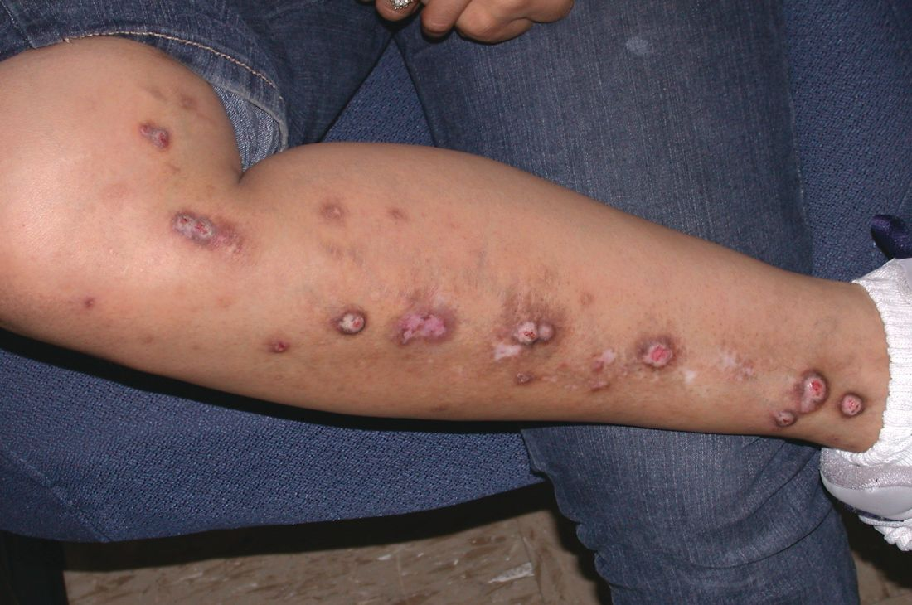
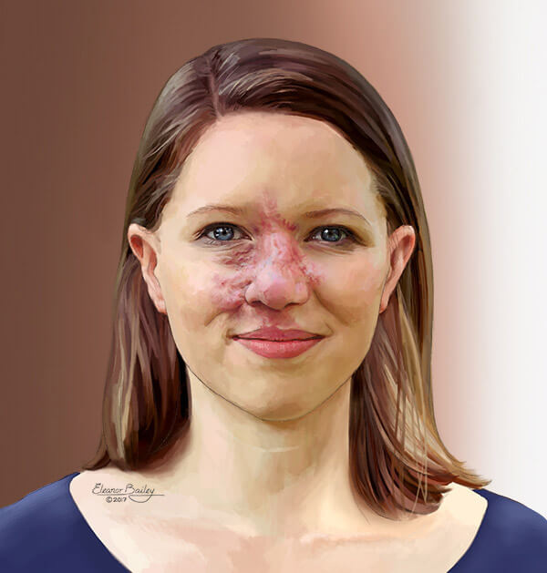
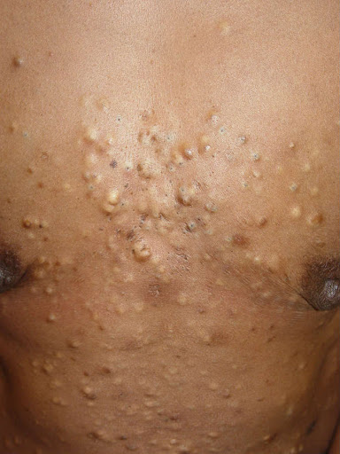

Dermatology 皮肤,头发, 指甲健康
===================

- Lim Yen Loo: yllim@nsc.com.sg
- Chong Wei Sheng: wschong@nsc.com.sg
  

[[TOC]]

Question:
- Why is there a time window for performing DIF?

Doc said it's eczema. applied cream given by doctor but it got worse. it's becoming swollen and started bleeding. anyone know what can be done? (asking on behalf of a mummy!)

## General Skills

### Useful Things to Note
- Type I rashes, due to IgE dependent mast cell and basophil degranulation, tend to occur very quickly. These are examined using the skin prick.
- Type II rashes, due to antibody-dependent cellular cytotoxicity, are more likely to manifest as blisters or bullae (e.g. pemphigus vulgaris, bullous pemphigoid) than papules. 
- Type III rashes, due to IgG mediated immune-complex deposition, resulting in phagocyte and NK cell activation, as well as complement fixation, tend to be more erythematous and maculopapular.
- Type IV rashes, due to delayed cytotoxic response involving T-cells, resulting in macrophage and eosinophil activation.
- Chronic photoageing of the skin is primarily caused by chronic exposure to UVA (320-400nm).

### Key Derm Red Flags

- Painful
- Involving mucous membranes
- Constitutional symptoms - fever, malaise
- Systemic symptoms - neuro, respi, abdo
- New medications

### Skin Anatomy and Physiology
The skin is the largest organ of the body. The skin covers over 1 sq metre surface in an adult and accounts for 20% of total body weight.

#### Functions of the skin
1. Barrier function - the skin protects the body against external solids, fluids and gases. However, it allows limited exchange of fluids and gases between the body and the environment.
2. Temperature regulation
3. Protection from ultraviolet radiation - Melanocytes, Keratinocytes
4. Sensory organ - input of external environment
5. Metabolism - Vitamin D

#### Anatomy of the Skin
The skin is composed of the following layers, each serving its own function.
1. Stratum corneum: composed of compact keratin
2. Epidermis which is composed of 
   - Keratinocytes
   - Melanocytes which produce melanin, important in skin pigmentation
   - Langerhan's cells which are antigen presenting cells
3. Dermal-epidermal junction: composed of protein/collagenous substances separating the epidermis from the dermis.
4. The dermis is composed of collagen/elastic tissues, neurovascular bundles and the adnexal structures, which include hair follicles, hair, sweat glands, sebaceous glands and nails. It can be further divided into two parts:
   - Papillary dermis 
   - Reticular dermis (i.e. Hypodermis?)
5. Subcutaneous fat

Question: How thick is the skin usually? How much to biopsy?

### Approach to Dermatological Diagnosis
#### Introduction
A detailed history-taking is usually unnecessary in the initial stages of assessment. The approach to a dermatological problem should consist of the following:
1. Obtaining a short **initial history** to establish the duration, primary location and secondary spread of the skin lesions, associated symptoms and past dermatological disorders.
2. Then proceed to a **full physical examination** of the skin, hair, nails and mucus membranes. Examination of the skin should include the affected skin and all other areas of the skin. Dermatology requires acumen in recognition of physical signs and their significance. Identifying the essential features helps one arrive at a correct diagnosis.
3. **Additional history** is then obtained after the examination. The history taking should be directed based on the provisional diagnosis and differential diagnoses suspected. For example, when a contact dermatitis, occupational dermatosis, a drug eruption or a sexually transmitted disease is suspected, relevant history related to contactants, work processes, drug ingestions and exposure to STI respectively should be elicited.
4. A **clinical diagnosis and differential diagnoses** is achieved.
5. A full systemic physical examination is usually not necessary. Most skin conditions are confined to the skin. However, when connective tissue disease, systemic involvement or cutaneous manifestation of underlying systemic disease is suspected, a **full systemic examination** should be undertaken.
6. **Laboratory** investigations including skin biopsies may be necessary to confirm or exclude the diagnosis and detect systemic complications.

#### History Taking
It is important to elicit the following information during history taking.
1. Duration of symptoms and signs.
2. Primary site of rash and subsequent spread.
3. Morphology of lesion at primary site and subsequent evolution.
4. Course of disease (progressive / static / improving / persistent / fluctuating / episodic).
5. Associated symptoms - itch, pain, paraesthesia, hypoaesthesia. 
6. Aggravating factor
7. Relieving factors
8. Recent contact with someone with a similar rash.
10. Previous episodes of similar skin disease.
12. Personal history of atopy
    - Hand washing in COVID19 trigger pan-eczema
11. Present and past medical history including treatment received.
9. Topical and systemic medication used before and after onset of rash, as well as its effect on present illness.
13.  Family history of skin disorders (atopy and medical problems)
2.  Occupational history including part-time job.
3.  Social history including hobbies.
4.  Domestic work, pets.
5.  Cleansing habits

#### Physical Examination
**Basic Considerations during examination**
1. Always conduct the examination under bright natural light or a well lit room.
2. The skin should be adequately exposed but patient's dignity and privacy must be maintained at all times during examination.
3. Observe the skin lesions. Look for specific signs. Palpate the lesions
4. Examine the mucous membrane, scalp, hair and nails for associated signs.
5. Use a torch, spatula and magnifying lens where necessary.

**Distribution of the Rash**
The distribution of the skin lesions is important in diagnosing skin diseases. Many conditions have typical patterns or affect specific regions of the body.
- Extensor surface: psoriasis
- Flexor surface: atopic eczema
- Palms and soles: erythema multiforme, secondary syphilis and eczema.

**The Arrangement of Lesions**
The arrangement of the skin lesions may give a clue to the diagnosis, e.g.:
- Examples of linear lesion
  - Contact with exogenous agents e.g. a contact reaction to an exogenous substance brushing across the skin.
  - Koebner phenomenon
  - Developmental origin: epidermal naevi, incontinentia pigmenti
  - Blood vessels, nerves or lymphatics: herpes zoster, thrmoboplebitis
  - Unknown origin e.g lichen striatus,morphea,m porokeratosis
- Group lesions: typically exogenous, related to nerve or vessels e.g. Herpes simplex virus infection, bites, warts
  - Zosterform: refers to lesions arranged along the cutaneous distribution of a spinal nerve.
- Annular or arciform  (semi circular) lesions, centrifugal spread, refractory centre e.g. dermatophytosis, Erythema Multiforme

**Colour of Lesions** The colour of the skin lesion may be diagnostic in some skin disorders
- purplish blue e.g. lichen planus
- heliotropes in dermatomyositis
- leucoderma e.g. vitiligo

**Size**
It is important to measure some lesions, especially nevi and skin malignancies like squamous cell carcinoma. 
- Squamous cell carcinoma of the skin greater than 2 cm in diameter is regarded to be high risk for recurrence and metastasis. 
- Nevi larger than 6 mm in diameter are more likely to be malignant than smaller nevi.

**Shape of Lesions** Descriptions like oval, round, linear etc. can be used to describe the shape of the lesions. 

**Palpation**
Additional tests: texture, consistency, thickness, tenderness, temperature
Scratching: nature of saling; elicit dermographism
Linear pressure - Nikoplsky's sign in pemphigus or TEN
Rubbing - Darier's sign (blistering in erticaria poigmentosa)
- Dermatographism: The whealing or urticarial response of the skin produced when it is stroked firmly with a pointed object is known as dermatographism ("skin writing"). This phenomenon may be elicited in up to 50% of normal people with firm stroking and is an exaggeration of the physiologic triple response of Lewis. The diagnosis of dermatographism is given only to those few individuals who manifest an urticarial response to mild physical trauma. 

  The significance of dermatographism is primarily its ability to reproduce the lesions of which the patient complains. It is classified as a form of physical urticaria and is not actually more common in people with chronic urticaria than in other people. Interestingly, it has been reported that up to 75% of pregnant women may have dermatographism, and the wheal response may also be elicited with urticaria pigmentosa (see Darier's sign, below).
- Darler's Sign:  Similar to dermatographism, this sign refers to the wheal or hive produced by rubbing a flat, tan macule of urticaria pigmentosa. Lesions of urticaria pigmentosa contain excessive numbers of mast cells, which release histamine in response to trauma and cause the skin to urticate. Lesions of urticaria pigmentosa in children may even blister when traumatized, and a solitary mastocytoma may also give this response. Although Darier's sign is virtually diagnostic of urticaria pigmentosa, failure to elicit this sign does not necessarily exclude the diagnosis.
- Nikolsky's Sign: This sign is elicited in blistering diseases to determine whether the epidermis is adherent to the underlying dermis. A finger or rounded object such as a pencil eraser is used to rub or rotate the skin with a mild shearing effect. One should suspect disadherence in the presence of large blisters, large areas of erosion and crusting, and areas of nonblanchable red skin. Diagnostic possibilities include pemphigus and toxic epidermal necrolysis due to staphylococcal scalded skin syndrome. Nikolsky's sign is most easily produced when the epidermis is acantholytic, a condition in which the epidermal cells lose attachment to one another. This sign is not diagnostic or absolutely specific, for it may be seen in severe cases of erythema multiformae, epidermolysis bullosa, pemphigoid, and variegate porphyria.
- Auspitz Sign: When the thick white scale of psoriasis is carefully scraped away from the surface of a plaque, tiny bleeding points may be seen in the underlying epidermis. These points are the vascular dermal papillae that have been traumatized by removal of the thin suprapapillary epidermis. It is typical, but not diagnostic, of psoriasis.

**Office Techniques for Dermatological Testing**
- Diascopy: Diascopy is a test for blanchability performed by applying pressure with a finger or glass slide and observing color changes. It is used to determine whether a lesion is vascular (inflammatory or congenital), nonvascular (nevus), or hemorrhagic (petechia or purpura)
  
  This technique is a more sophisticated modification of the simplest method for assessing superficial erythema: pressing the fingertip against the skin and withdrawing it quickly to see if blanching occurs. Diascopy is a refinement in which a piece of clear glass or plastic is pressed against the skin while the observer looks directly at the lesion under pressure. The purpose of this procedure is to empty blood from the superficial vessels to determine if skin redness is due to blood within vessels (erythema) or extravasated into the skin (petechiae, purpura). The former will blanch with pressure, the latter will not. By varying the pressure on the skin, vessels can be seen to blanch and fill. The amount of pressure required to blanch a given lesion is variable, but care should be exercised when using a glass microscope slide, lest a sharp edge damage the skin or the slide break under pressure and lacerate the skin. It is probably best to use two glass slides together to minimize this risk.
  - Hemorrhagic lesions and nonvascular lesions do not blanch("negative diascopy");
  - inflammatory lesions do("positive diascopy").
  - granulomatous nodules such as sarcoidosis, granuloma annulare, and lupus vulgaris (all three of which will reveal a brownish-yellow "apple jelly" translucent quality upon diascopy).
  -  telangiectasia (in which the central "feeder" vessel may be distinguished); 
- Dermoscopy: aka epiluminescence microscopy, it allows for inspection of skin lesions unobstructed by skin surface reflections

**Laboratory Investigations**
- Skin scraping
- Patch testing
- Photopatch testing
- Phototesting

**Associated symptoms**
Associated symptoms, like itching, pain, or burning sensation are helpful to make a diagnosis of certain skin diseases. Eczema tends to be itchy compared to fungal skin infections. Pain is usually associated with herpes simplex or herpes zosters.

#### Reporting a skin lesion
Every skin lesion should be described and documented with proper medical terms. When documenting physical signs, note the colour, size, shape and texture of the skin lesions. The following are some basic descriptive skin signs:

Definitions
-   Primary Skin Lesions: uncomplicated lesions that represent initial pathologic change, uninfluenced by secondary alterations such as infection, trauma, and surgery
-   Secondary Skin Lesions: changes that occur as consequences of progression of the disease, scratching, or infection of primary lesions.

**Size**
- miliary (1-2 mm)
- small (2-5 mm) 
- large (>5mm)

**Shape**
- round
- conical 
- flattened 
- umbilicated 
- elongated 
- angular 
- polygonal 
- stellate 
- annular: circular with normal skin in the center.
  - Common conditions: drug eruptions, secondary syphilis and lupus erythematosus
  - iris lesion (target or bull's eye lesion): special type of annular lesion in which an erythematous annular macule or papule develops a second ring or a purplish papule or vesicle in the center (e.g. seen in Lyme disease)
- hemispherical

**Color**
Term | Definition
---|---
Erythema |red macular lesion which blanched on pressure.
Violaceous hue |purplish (violet) discolouration e.g. lichen planus
Leucoderma | vitiligo
Black | eschar
Salmon Pink | Psoriasis

**Primary Individual Lesion Descriptors**
Term | Definition
---|---
Macule | Sometimes "macule" is used for flat lesion of any size. A flat circumscribed area of non-palpable skin discolouration measuring up to 1 cm in diameter. Some authors use 5 mm for size criterion. 
Patch | A small, circumscribed superficially raised area on the skin of less than 0.5 cm. It is always palpable.
Milia | small, dome-shaped bumps that are usually white or yellow; usually not itchy or painful.
Papule | A papule is a solid raised lesion that has distinct borders and is less than 1 cm in diameter. 
Plaque | A plaque is a solid, raised, disc-shaped, flat-topped, confluent lesion greater than 1 cm in diameter. It is analogous to the geological formation, the plateau. It may consist of confluent papules.
Wheal | A transient edematous plaque in the upper epidermis often surrounded by a zone of erythema. A weal usually exist for <24 hours.
Nodule | A nodule is a raised palpable solid lesion and may be in the epidermis, dermis or subcutaneous tissue, ranging from 0.5 cm to 1 cm in diameter.
Tumor | A tumor is a solid mass of the skin or subcutaneous tissue; it is larger than a nodule.
Vesicle | A vesicle is a raised lesion <0.5 cm in diameter and is filled with clear fluid. USMLE world cut off is 1 cm.
Pustule | A pustule is a vesicle containing pus.
Bulla | A bulla is a circumscribed fluid filled lesion that is >0.5 cm in diameter. USMLE world cut off is 1 cm. 

**Distribution**
- Sun-exposed or unexposed parts affected 
- Generalised or localised 
- Central or peripheral (truncal or acral)
- Bilateral or unilateral
- Symmetrical or asymmetrical 
- Extensor or flexural

**Arrangement**
- Grouped/linear/peripheral
- Discrete/confluent/scattered 
- Diffuse/well-defined edges
- Circinate/gyrate outlines

**Overlying Changes**

Term | Definition
---|---
Crust |brownish dried exudate of blood, serum, pus and epithelial debris on the surface of the skin.
Scales | a collection of detached keratinous material on the surface of the skin. The scales may be powdery or forming sheets.
Lichenification | Thickening of epidermis with accentuation of natural skin lines. Usually secondary change.
Induration | palpable thickening or hardness of the skin due to infiltration of the dermis with cells or connective tissue materials.
Keloid | Extend beyond the wound boundary
Hypertrophic | Within the wound boundary
Atropy | Thinning of the skin

**Break in Skin**

Term | Definition
---|---
Excoriation | superficial skin ulceration due to scratching. It is usually linear in appearance.
Fissure |deep linear break (crack) in skin surface usually stretching from epidermis into the dermis.
Erosion |superficial ulcer involving denudation of the epidermis only.
Ulcer| Breach in the epidermis and part of the dermis. It is usually crateriform, measuring >0.5 cm in diameter.
Sinus | a track originating under the epidermis and opening through the skin surface.

**Extravasation Pattern**

Term | Definition
---|---
Petechiae |tiny pin-head size macular purpuric spots on the skin.
Purpura|red macular or papular spots on the skin resulting from extravasation of red blood cells from blood vessels into the skin. It cannot be blanched.
Ecchymosis |large purpura usually measuring more than 1 cm in diameter
Telangiectasia | persistently dilated capillaries on the skin that blanch with pressure.

**Pigmentation Changes**

Term | Definition
---|---
Hypopigmentation |decreased skin pigmentation.
Hyperpigmentation| increased skin pigmentation
Depigmentation|total loss of skin pigmentation.
Melanosis| darkening from increased melanin deposition of the skin (hypermelanosis, hyperpigmentation).

**Hair Changes**

Term | Definition
---|---
Alopecia |loss of hair.
Furuncle | Also known as a boil, is a painful skin abscess that forms around a hair follicle and contains pus, usually due to Staphylococcus aureus.
Carbuncle | collection of furuncle that develop under the skin.

**Reaction Patterns**

Combinations of findings that can be summarized into known patterns and hence reported as such.

Patterns | Details 
---|---
Eczematous  | erythema, lichenification, 
Papulosquamous | Papules and scaly
Papulonodular | papules and nodules
Acneiform | pustules, comedone, papules
Urticarial | hives and wheals
Vesiculobullous | 
Erosive-ulcerative | 
Exanthematous | Only exanthen, erythemaous macule
Vasculitic | Palpable purpura or plaque
Erythrodermic | All over

### Symptoms in Dermatology
Symptoms in dermatology are usually characteristic. Common symptoms include:
- **Itch**: Note
   Some skin diseases, e.g. scabies, lichen planus, contact eczema and atopic eczema are invariably itchy. In some skin diseases, the severity of pruritus is variable and very subjective e.g. psoriasis and pityriasis rosea.
   - Pruritus without rash.
   - Pruritus with excoriation, Prurigo.
   - Pruritus with rash.
   - Pruritus may precede or follow the rash.

- **Pain**: The commonest painful dermatological lesions are associated with skin infections (e.g. herpes zoster); skin fissures; skin erosions and ulcers especially of the mucus membrane; cutaneous vasculitis (especially those associated with skin infarcts).
- **Paresthesia and Anaesthesia**: Paresthesia is often associated with inflammation affecting the nerves, e.g. herpes simplex infection and herpes zoster. Tuberculoid Hansen's disease is associated with anaesthesia.
- **Tightness**: This symptom is often seen in patients with chronic inflammatory skin diseases, e.g. over dry psoriatic plaques and chronic eczema. It is severe in patients with scleroderma/morphoea.
  
#### Special Signs
- Skin tags
- Acanthosis Nigricans

Term | Description
|---|---
Leser&nbsp;Trelat&nbsp;Sign| Explosive onset of multiple seborrheic keratoses (many pigmented skin lesions), often with an inflammatory base. This can be an ominous sign of internal malignancy as part of a paraneoplastic syndrome.
Cafe&nbsp;au&nbsp;Lait&nbsp;Spots | Benign lightly pigmented congenital macules, which may be an isolated finding, or in the presence of multiple lesions, suggest underlying systemic disease (e.g. neurofibromatosis, McCune-Albright syndrome). These may enlarge over time but is not a key feature.
Erythema marginatum |  a faintly erythematous, ring-like rash that comes and goes, is a manifestation of acute rheumatic fever
Exfoliative Dermatitis or Erythroderma | Intense and usually widespread reddening of the skin due to inflammatory skin disease (erythema and scaling in >90% of the body). Bright red patches coalesce and gradually peel. It often precedes or is associated with exfoliation (skin peeling off in scales or layers), when it may also be known as exfoliative dermatitis (ED). It may be drug in-induced, idiopathic, or secondary to an underlying dermatological or systemic disease. 
Koebner phenomenon | aka isomorphic phenomenon or isomorphic reaction, it is the phenomenon where small trauma, such as rubbing of the skin, results in the development of a skin leision; it is seen most often in psoriasis, eczema, lichen planus and vitiligo

### Laboratory Tests in Skin Disease

#### Drug Testing

- In vivo dermal depending on type of hypersensitivity reaction. 
  - Type I prick and intradermal
  - Morphology is severity
  - Type of hypersensitivity depends 
- If negative, still might be the drug, because it is the metabolite causing the problem; then need to go by clinical scenario for the conclusion.
- Most accurate challenge is oral drug challenge; SJS and TEN never challenge to scary.

#### Skin Sampling

These can be done for histology (not scraping), cultures, microbiology (scraping), and immunoflurescence studies.

Type of biopsy | Procedure | Tool and specimen size
---|---|---
Incisional / punch biopsy | Incisional biopsy means taking out only a representative portion of a lesion. It is typically used for large lesions for which excision is impractical or for lesions with a low risk of malignancy. Punch biopsy is a specific incisional biopsy using a cylindrical dermal biopsy tool. | Disposable punches are very convenient and available from two to eight millimeters in size.A full thickness of skin can easily be obtained with a punch biopsy. If a lesion is less than three millimeters in size, it does not need stitches after biopsy.
Excisional biopsy | Excisional biopsy involves removing the whole lesion with a two to three millimeter margin, depending on the nature of the lesion. | Larger-sized punches may be useful for excisional punch biopsies. This is the diagnostic method of choice if there is a strong suspicion of malignant melanoma.
Shave biopsy | Shave biopsy is feasible when the lesion is elevated above the surface. It is used for microscopy for mycology, bacteria, parasites, viral inclusions body and giant cells. It is also used for culture for fungus, bacteria, parasite, and viruses | Some experts occasionally elevate the lesion with lidocaine and shave in certain circumstances in order to avoid stitches.

In rashes, there is C-level evidence that Skin biopsy is helpful in diagnosing
- Psoriasis
- Lichen planus
- Erythema multiforme
- Bullous pemphigoid
- Dermatitis Hherpetiformis
- Cutaneous T-cell lymphoma (e.g. mycosis fungoides)
- Rocky mountain spotted fever
- Subacute cutaneous lupus erythematosus
- Sweet syndrome (i.e. acute febrile neutrophilic dermatosis)
- Toxic epidermal necrolysis

#### Other Tests
- Patch test & Photopatch test for contact allergy and photocontact allergy
- Phototest for photosensitivity
- Prick and intradermal tests for type I hypersensitivity reactions
- Hematological and biochemical studies
- serology studies
- Others e.g. examination of hair (anagen/telogen ratio) X-rays etc.

#### Patient Counseling for Skin Biopsy
The risk with this procedure is that obviously you will have a scar after the procedure. There is also a small chance of bleeding and infection, even though we do our best to prevent these things. After the procedure, Steri-Strip may fall off after a few days. If patient sees that the wound is red about six to seven days after the procedure, or sees pus coming out, (signs of delayed healing or infection) he should contact Dr without delay. Finally teach patient how to manage possible bleeding and schedule a follow up in a week or so.

#### Final Diagnosis
The final diagnosis should be based on etiology, anatomic and pathogenetic parameters. E.g.
- Allergic contact dermatitis to nickel from costume jewelleries on earlobes. 
- Stasis eczema with ulceration, left ankle.
- Maculo-papular drug eruption from oral penicillin allergy.

### Skin Conditions and Associated Diseases
|Skin conditions | Associated Conditions |
|-------| --------|
Acanthosis nigricans in younger individual | insulin resistance|
Acanthosis nigricans with sudden appearance in middle-aged or elderly patient | GI malignancy 
Explosive onset of multiple itchy seborrheic keratoses | GI adenocarcinoma
Multiple skin tags | Insulin resistance, pregnancy, Crohn disease (perianal) |
Porphyria cutanea tarda, cutaneous leukocytoclastic vasculitis (palpable pupura) secondary to cryoglobulinemia | Hepatitis C|
Dermatitis herpatiformis | Celiac diease
Sudden-onset severe psoriasis, recurrent herpes zoster, disseminated molluscum contagiosum, tinea versicolor | HIV infection
Severe seborrheic dermatitis | HIV infection and Parkinson disease
Pyoderma grangrenosum | Inflammatory bowel disease
Erythema nodosum, Lupus pernio | Sarcoidosis
Sweet syndrome (Acute febrile neutrophilic dermatosis) | hematologic malignancies, upper respiratory and GI infections, inflammatory bowel disease
telangiectasias and angiokeratomas | Fabry disease, a lysosomal storage disorder due to alpha-galactosidase A deficiency, typically causes neuropathic pain and glomerular disease

#### Common Skin Lesions in Singapore
The following are common skin diseases in Singapore. These conditions are also among the most common skin diseases in most developing countries. Students should be familiar with the clinical presentation and management of these disorders.
1. Dermatitis
2. Benign Skin Tumors
3. Acne
4. Viral Skin Infections
5. Pigmentation Disorders 
6. Hair Disorders
7. Urticaria
8. Fungal Skin Infections 9. 
9. Naevus
10. Psoriasis

### Skin Lesion Therapy

#### Sun Protection
Sunburn is an inflammatory response to excessive exposure to ultraviolet (UV) radiation.  Regardless of skin type, additional risks from UV exposure include photoaging and skin cancer.  Therefore, all patients should be counseled about the carcinogenic effects of UV exposure and the benefits of photoprotection.

1. Sun avoidance is the best method of photoprotection, especially during peak hours of UV intensity, from 10:00 AM to 4:00 PM.  
2. If it is impractical to stay indoors, broad-spectrum sunscreens with sun protection factor (SPF) ≥30 should be used. 
    -  Sunscreen should be applied liberally 15-30 minutes before sun exposure, as this patient does, to allow the formation of a protective film on the skin, and reapplied at least every 2 hours.  
    -  Sunscreens with SPF >50 provide a negligible increase in UV protection as compared to sunscreens with SPF 30-50 and are not routinely recommended. 
    -  Even if products are labeled as "water-resistant," reapplication after swimming is necessary as sunscreen is washed off with swimming and sweating .
3. Sunscreen alone is inadequate. 
    - Dark colors, long sleeves, and broad-brim hats are recommended to block sun exposure.  Darker fabrics offer greater UV protection as the rays cannot penetrate the fabric as well.
    - In addition, cloud coverage does not block UV rays, which can be reflected off water, sand, snow, and concrete.  As a result, patients can burn in the shade or while skiing in the winter.

#### Phototherapy

Therapy | Condition
|---|----
NBUVB phototherapy | Vitiligo, Psoriasis, Mycosis Fungoidis, Atopic Dermatitis (for reduction of sreroid use)
PUVA Psoralen + UVA (Photochemotherapy) can be give orally, soaking, topical etc | Eryoderma in psoriasis, myocosis fungoides, alopecia areata
UVA1 phototherapy for deeper penetration | Sclerotic skin conditions such as morphoea, eczema scleroderma
LEVIA (optic fiber) | Scalp treatment
Omnilux | acne
Excimer light 308 nm | eyelid vilitigo
Aktlite (red light, peak 630nm) | photodynamic therapy for actinic keratosis, Bowen's disease, BCC
Woods lamp | assess faint lesions
Intense pulse light therapy | Photorejuvenation

Side effects of phototherapy
- Sunburn: 4 hours later, redness and itch, blisters and peeling, tanning, skin hardening, photo-aging
- Polymorphic light eruption
- Lentigenes
- Recurrence of HSV
- Photo-toxicity 
- Skin cancer

Psoralen side effects
- accidental smearing
- excessive application resulting in burns
- peeling

#### Surgical and Radiochemo
Therapy | Conditions treated | More details
---|---|---
Mohs microscopic surgery | Patients with any nonmelanoma skin cancer >2cm, lesions with indistinct margins, recurrent lesions, and those close to important structures, including the eyes, nose, and mouth, should be considered for referral for complete excision via Mohs micrographic surgery, with possible plastic repair. | The surgeon can immediately review the pathology to confirm complete excision during a staged excision. Since this allows removal of the least necessary amount of tissue, this procedure is indicated in cosmetically sensitive areas. This ability to immediately confirm pathology is also useful in lesions with indistinct margins where more tissue than clinically apparent may require removal. If a difficult repair is anticipated or a poor cosmetic result is expected, referral is appropriate.
Surgical excision | Most widely used treatment for cutaneous squamous-cell carcinomas (SCCs), particularly high risk lesions. | Well defined, small (< 2 centimeters) SCC lacking any high-risk features requires a four millimeter margin of normal tissue around the visible tumor to result in 95% histologic cure rate.
Cryotherapy | Useful for small, well defined, low risk invasive SCCs and Bowen's disease. | Destroys malignant cells by freezing and thawing. Cryotherapy does not permit histologic confirmation of the adequacy of treatment margins; thus, a substantial amount of training and experience is required to achieve consistently high cure rates.
Radiation therapy | An option for the initial management of small, well-defined, primary SCCs, especially older patients and those who are not surgical candidates. | However radiation therapy is contraindicated on tumors located on trunk and extremities. These areas are subjected to greater trauma and tension than skin on the head and neck, and they are more prone to break down and ulcerate as a result of the atrophy and poor vascularity of irradiated tissue.
Topical 5-fluorouracil (5-FU) | Actinic keratoses | Although topical 5 -FU is not approved for the treatment of Bowen's disease (squamous-cell carcinoma in-situ) and superficial SCCs, it is widely used in these diseases when other treatment modalities are impractical and for patients who refuse surgical treatment.

Derm Approaches Frameworks
------------------------
### Hirsutism

### Generalized Rashes

There are a few subtopics of generalized rashes
- Viral Exanthems
- Drug Eruptions
- Rashes Associated with Fever

One should also consider the nature of the rash
- Non-specific maculopapular rashes
- Purpura
- Petechiae
- Bullous or vesicular rashes

Different rashes may also affect specific patient populations
- Pregnant Women
- Newborn
- Immunocompromised persons
- Persons from certain geographical locations (e.g. topics and dengue)

Patients with acute generalized maculopapular rashes and no systemic symptoms are often treated symptomatically without a definitive diagnosis. If the rash does not resolve spontaneously, skin biopsy and blood testing (e.g., serologies, complete blood count) may be indicated. 

Current recommendations for practice
- Systemic symptoms, and involvement of palms, soles, and nails can help distinguish various rashes. [C]
- When evaluating generalized rash, physicians should determine the patient's primary symptom, then focus on the clinical appearance of the rash before taking a more focused history to help narrow down the differential diagnosis. [C]

Keys to Diagnosis in History Taking
- **Risk Assessment**: recent travel, insect and plant exposure, drug exposure (including over-the-counter drugs, alternative medications, and illicit drugs), contact with persons who are ill, pets, hobbies, occupational exposures, chemical exposure, chronic illness, sexual history, personal or family history of atopy (e.g., asthma, allergic rhinitis, childhood eczema).
- **Associated Symptoms**: recent systemic symptoms, especially fever
- **Lesion Specific**: pruritus, painful lesions, the initial site of involvement

Keys to Physical Examination
- The **size** of individual lesions can vary from pinpoint to total-body redness
- The **shape** of individual lesions and their **tendency to cluster (arrangement)** can also provide important clues.
  - linear patterns of erythema or vesicles are typical of poison ivy; 
  - oval lesions are typical of pityriasis rosea; 
  - round lesions are typical of nummular eczema; 
  - annular lesions are typical of tinea corporis;
  - geometric patterns may imply a contact component
- The **color** of the lesions should also be noted. Although most generalized rashes are pink or red, lichen planus is characterized by violaceous lesions, and secondary syphilis by red-brown lesions 

Common Causes  | Uncommon Causes | Rare Causes
|---|---|---
Atopic dermatitis  Contact dermatitis  Drug eruption  Erythema multiforme  Fifth disease (erythema infectiosum)  Folliculitis  Guttate psoriasis  Insect bites  Keratosis pilaris  Lichen planus  Miliaria rubra  Nummular eczema  Pityriasis rosea  Plaque psoriasis  Roseola (exanthem subitum sixth disease)  Scabies  Seborrheic dermatitis  Tinea corporis  Urticaria  Varicella  Non-specific Viral Exanthem | Bullous pemphigoid  Dermatitis herpetiformis  HIV acute exanthem  ID reaction  Kawasaki disease  Lupus (subacute cutaneous lupus erythematosus)  Lyme disease  Meningococcemia  Cutaneous  cell lymphoma  Rocky mountain spotted Fever  Scarlet fever  Secondary syphilis  Staphylococcal scalded skin syndrome  Steven Johnson syndrome / Toxic epidermal necrolysis  Sweet syndrome (i.e., acute febrile neutrophilic dermatosis)  Toxic shock syndrome |lichen nitidus  pityriasis lichenoides  pityriasis rubra pilaris  rickettsialpox  rubella  rubeola

### Neonatal Rashes

Diagnosis | Clinical presentation | treatment
|----|-----|----
Erythema toxicum neonatorum | Asymptomatic, scattered erythematous papules and pustules, common in first 2 weeks of life, may wax and wane, and can occur on any part of the body (although it often spares palms and soles) | none; often spontaneously resolve without sequelae
Neonatal HSV | Vesicular clusters on skin, eyes and mucous membranes, CNS infection, fulminant, disseminated multi-organ disease | Acyclovir
Staphylococcal scalded skin syndrome | Fever, irritability, diffuse erythema &rarr; flaccid, flexural blistering; positive Nikolsky sign | Oxacillin, nafcillin, or vancomycin

### Blistering Lesions

- **Staphylococcus Scalded Skin Syndrome** - caused by exfoliative toxin–producing strains of Staphylococcus aureus and typically occurs in infants and young children.  A prodrome of fever, irritability, and skin tenderness is followed by generalized erythema, superficial flaccid blisters, and epidermal shedding with light pressure (ie, Nikolsky sign).
- **Bullous impetigo** is a localized form of SSSS also caused by exfoliative toxin–producing S aureus.  Patients typically appear well, with blisters confined to the primary area of infection.  In addition, when ruptured, the blisters leave a distinct honey-colored crust, which is not seen in this patient.
- **Erysipelas** is a bacterial infection (eg, group A Streptococcus) of the dermis that presents with a well-demarcated, warm, tender area of erythema.  Overlying bullae can develop in severe cases, and patients often have constitutional symptoms (eg, fever, chills).  However, diffuse rash and shedding do not occur.
- **Toxic epidermal necrolysis** manifests as extensive (>30% body surface area) skin blistering and erosion; it is typically triggered by a medication.  Nikolsky sign is positive; however, mucous membrane involvement is expected with this condition but is not seen in this patient.

### Shin lesion
- Lichen planus
- Prurigo nodularis
- Viral warts
- psoriasis
- Pityriasis lichenoides chronica

### Papules Over Hands and Feet
- Bilateral
  - Secondary Syphilis by Treponema Pallidum
- Unilateral
  - Viral Wart by HPV
  - Superficial fungal infection
  - Cutaneous Larval Migrans
  - Lichen Planus

### Mucopurulent Genital Discharge
- Chlamydia trachomatis
- Mycoplasma genitalium
- Neisseria gonorrhoea
- Ureaplasma urealyticum

Note that syphilis is NOT a part of genital discharge differential because it presents with painless genital ulcers.

### Hair Loss (Alopecia)
hair transplant, anagen, catagen, telogen; 

hypertrichosis, hirsutism, 
alopecia
- scarring vs scarring
- patchy, diffuse, pattern

**Non-scarring Alopecia**
1. Androgenetic Alopecia - mickey mouse pattern, 
2. Alopecia Areata - nonscaring, not in the pattern of androgenetic pattern
3. Traction alopecia
4. Tinea capitis - more common in children, especially there is contact with infected animal
5. Telogen effluvium - more hair into the telogen resting phaseic 
6. Trichotillomania
7. Hair loss of chronic illness
   - diffuse nonscarring alopecia
   - an acute precipitating factor cannot be identified
   - Exclude the following
     - Anemia
     - iron deficiency
     - thyroid dysfunction
     - systemic lupus erythematosus

**Scarring Alopecia**
1. Discoid Lupus Erythematosus
   - Erythematous scaly atrophic plaques
   - Hyperpigmented borders
   - Hypopigmented center
   - Follicular plugging
   - Treatment
     - Potent topical steroids
     - Intralesional steroids
2. Lichen planus / lichen planopiaris
   - Violaceous atrophic plaques
   - Folliclar plugging
   - Examine for other sites of involvement
   - Nails, mucosa, skin

### Pigmentary Disorders
Key Classification
- Hypo/depigmentation, hyperpigmentation, localized vs diffuse
- congential or acquired

- localized or diffused
- well circumscribed or ill defined
- patterned (e.g. linear reticualr)?
- Associated with inflammation and/or prior cutaneous injury

#### Hypemalnosis
- Acongential or acquired
- Diffuse or circumscribed / localized

Common conditions
- melasma - more ill defined than solar lentigo
- solar lentigo
- fixed drug eruption
- freckles
- naevus of ota

#### Depigmentation / Hypopigmentation
- pityriasis alba
- albinism increase risk of skin cancer
- vitiligo is an acquired condition, milky white, total depigmentation, without increased in skin cancer risk
  - Treatment is for cosmesis with
  - Topical corticosteroid creams and calcineurins inhibitors
  - UV light treatment: NBUVB, eximer light
  - Surgical options celllar grating
  - Camouflage cosmetics
- post-inflammatory hyperpigmentation
  - Common, especially in individuals with more darkly pigmented skin
  - Develop after skin injury
- hypopigmented mycosis fungoides -  unlike pityriasis vesicolor, has buttock involvement
- pityriasis vesicolor

### Skin Ulcers
Ulcers are destruction of the epidermis that extends into the dermis and may reach subcutaneous fat or deeper tissues. If there is only partial loss of epidermis, it is only an erosion.
Consider history, site, and morphology.

#### Leg Ulcer
Can be multi-factorial. Most common causes
Feature | Venous | Arterial | Neuropathic | Malignant | Traumatic | Pressure | Infective | Metabolic | vsculitis
|---|---|---|---|---|---|---|---|---|---|---
Pain| Mild to moderate | Severe | Painless
Location | Gaiter distribution   malleolar regions (medial > lateral) | Pressure sites  and distal points (toes) | Pressure sites
History | Prioar DVT, stroke, miscarraiges. Obesity, multiple pregnancies. Pain upon prolonged standing | Cigarette smoking, diabetes, dyslipidemia, intermittent claudication | Diabetes, other cuases of peripheral neuropathy|
Morphology| Irregular borders, shallow | Necrotic eschar, punched out | Punched out
Surrounding skin| Pigmentation secondary to hemosiderin, lipodermatosclerosis | Shiny atropic skin and hair loss | Thick callus surrounding ulcer|
Other PE finding | Varicosities, peripheral edema, stasis dermatitis | Weak /absent peripheral pulses, prolonged capillary refilling time (>3 to 4 sec), pallor on leg elevation (45 deg for 1 min) | Peripheral neuropathy with decreased sensation| 
Revelent studies | Duplex U/S | ABI, CTA, MRA | 

Pyoderma gangrenosum is a diagnosis of exclusion.

#### Oral Ulcers

The most common is aphthous ulcer.
- infection
- drug
- autoimmune

Aphthous ulcers (canker sores) are characterized by shallow, fibrin-coated ulcerations with underlying mononuclear infiltrates.  They are recurrent, self-limiting ulcerations of the oral cavity and do not affect surfaces covered by keratinized stratified squamous epithelium.

### Urticaria
**History**
1. Ascertain if condition is acute or chronic (> 6 weeks).
2. Ascertain:
   - Duration of the skin eruptions. How long does the lesions last?
       - if it is >24 hours, then urticaria is excluded. 
       - Lesions lasting longer than 24 hours and resolving with residual pigmentation are more likely to be urticarial vasculitis
   - Morphology of eruptions. 
     - Small papular wheal with flare, localized around sweat ducts, precipitated and aggravated by sweating - consider cholinergic urticaria
   - Ascertain if there is any periorbital or perioral swelling or dyspnea with attacks suggestive of angioedema; any associated abdominal cramps/diarrhoea with attacks.
3. Look for a family history of urticaria and familial angioedema or atopy
4. Ascertain the possible causes of the urticaria:
   - Drug ingestion
   - Infection
    - Parasitic infestation
    - Underlying systemic disease
    - Insect bites reaction
    - Physical causes eg heat, cold, visible light, water, pressure (light and heavy)
    - Food, food preservatives and food dyes
    - Contact urticaria

**Physical examination**

Exclude underlying systemic diseases e.g. infections, atopic eczema, collagen disease etc.
Look for evidence of physical urticaria and dermographism.

**Laboratory Investigations**
Only simple screening tests are necessary unless otherwise indicated.
1. Full blood counts
2. ESR
3. Urine microscopy
4. Stools for ova and cysts
5. Other tests depending on clinical suspicions based on findings from
history, physical examinations and screening tests.

### Annular-Ringed Lesions

**Differentials**
1. Dermatophytosis (ringworm)
2. Hansen's disease
3. Annular erythemas
4. Psoriasis
5. Urticaria
6. Lupus erythematosus (LE)
7. Impetigo
8. Lyme disease
9. Granuloma annulare
10. Erythema multiforme
11. Secondary and tertiary syphilis
12. Others, eg non-infective granulomas, sarcoidosis
13. Mycosis fundoides
14. Pityriasis rosea
15. Leprosy

### Grouped Lesions
Usually exogenous, related to nerve or vessels
- Herpes simplex virus infection
- Bites
- Warts

### Suspected Vasculitis

When cutaneous vasculitis is suspected, work-up and investigations are geared towards confirming the diagnosis of vasculitis, eliciting the cause or triggers and screening for systemic involvement or complications.
1. Confirm Diagnosis 
     - Skin Histology
       - Definitive diagnosis of cutaneous vasculitis
       - Size of vessels involved
       - Associated inflammatory infiltrate
     - Direct immunofluorescence (DIF)
       - DIF studies complement the information obtained by histology
       - To be performed on an early lesion present for 12-24 hours
       - A negative DIF does not preclude the diagnosis of vasculitis
2. Elicit cause or triggers
   - Intercurrent illness (eg. upper respiratory tract infection, urine infection)
   - History of hepatitis
   - History of any disorder known to be associated with a vasculitis (eg SLE)
   - Drug history
3. Screen for systemic involvement/complications
    - History and physical examination
      - General: fever, fatigue, weight loss, and arthralgias
      - Eye: scleritis
      - Respiratory: persistent nasal crusting, epistaxis, hemoptysis
      - Neurology: acute foot drop or wrist drop, limb claudication
      - Renal: hematuria, blood pressure
    -  Investigations include:
      - FBC
      - Urinalysis, Creatinine
      - Antistreptolysin O Titre (ASOT), throat swab (If history is suggestive of a prior upper respiratory throat infection and clinically suggestive of Henoch-Schoenlein purpura)
      - ANCA, CXR and ECG (If suggestive of EGPA or GPA)

Histological Observations
Vessel Size | Predominant Infiltrate | Disease
|---|----|-----|
Small | Lymphocytes | Viral infection|
~ | Neutrophils | Cutaneous Small Vessel Vasculitis   Henoch Schoenlein purpura (HSP)   Urticarial vasculitis|
~| Eosinophils  | Drug   Eosinophilic Granulomatosis with Polyangiitis (EGPA)
Small +/- Medium | Lymphocytes |Connective tissue disease
~ | Neutrophils | ANCA-associated vasculitis
~| Eosinophils | Eosinophilic Granulomatosis with Polyangiitis (EGPA)   Connective tissue disease
~| Granulomatous |Granulomatosis with polyangiitis (GPA) 
Medium | Lymphocytes | Lymphocytic thrombophilic arteritis (LTA)   macular lymphocytic arteritis (MLA)   macular arteritis
~ | Neutrophils | Polyarteritis nodosa (PAN)

### Suspected Panniculitis

**History**
- Duration of rashes
- Presence of ulceration/ drainage
- Drug history
- Preceding or concurrent infective symptoms
- Systemic review: fever, arthralgia, bowel symptoms, LOA/ LOW

**Physical examination**
- Extent and distribution of lesions
- Concomitant venous insufficiency, alopecia/ malar rash, respiratory and abdominal
examination

**Diagnosis**
- Skin biopsy to confirm diagnosis and type and panniculitis
  - Predominantly septal, lobular, mixed septo-lobular panniculitis on histology
  - Presence of vasculitis can be seen in erythema induratum 
- Systemic workup depends on suspected type of panniculitis.

### Skin Lesions/Rash - Non-tender, Non-pruritic

#### Redness

#### Discoloration

### Skin Lesions/Rash - Non-tender, pruritic

### Skin Lesions/Rash - Tender, Non-pruritic

### Skin Lesions/Rash - Tender, pruritic

### Nail Changes

### Approach to Skin Tumours
- Skin tumours can broadly be divided under the following categories:
  - Benign
  - Premalignant
  - Malignant
- Histological classification:
  - Tissue/cell of origin
  - Tumour differentiation
- Tumours in the skin can arise from practically every cell constituent in the skin.
- Tumours can be further categorised under tumours arising from:
  - Epidermis
  - Connective tissue
  - Adnexal structures eg. hair follicles, sweat ducts Blood vessels
  - Lymphatic vessels
  - Nerves
  - Melanocytes

Dermatological Emergencies
-------------------------

### Angioedema
- Acute subcute swelling
- eyelid lips tonque cheeks, hands feet
- amy have other body parts
- Deeper than
- Risk of airway obstruction and death

Type 1 hypersentivity to drug insect stings, food; IGE medicated

Intolerance to NSAID
- not immunologically mediated
- functional 
- arachidonic acid

Intolerance to drug so fACEi group

Rare C1 esterase inhibitor deficiency, herditary type 1 and 22
excessive catabolism of the C1 inhibitor
Rae: exercise induced urticaria, and angioedema, may be precipitated by certain foods or drugs.

- ACEi has been implicated in drug-induced angioedema due to effect on bradykinin pathway.
- If no suspicious drug, use C4 as a screening for C1-esterase inhibitor deficiency, if positive to more detailed testing.
- Airway management
- IM adrenaline 
  - 0.01 ml/kg
- IV Diphenyhidramine 25 -50
- IV Hydrocortico 200
- Oral santihistamine  prednisolone 1mg/oig.day for 2 days
- Prescribe Epipen for self-administered adrenaline

### Generalized Pustular Psoriasis (GPP)

Patient ill with fever painful skin lesiosn
Widespread erythema and pustules
Pustules may occur in waves
May be recurrent underluiong genetic predisposition e.g. iL36RN, innate immunity, automosomal recessive and IL-1alpha. 

Main differential diagnosis is AGEP, a drug eruption, AGEP patients not sick, 
May need a sklin biopsy for confirmation if 1st presentation
Monitor fluid balance nad electrolytesincluding calcium
Look for organ involvement
- Liver: Look for neutrophilic colonigitise, obstructive jaundice, deranged LFT,
- Lung: Aseptic pneumonitis, neurophil infiltrate lungs, need intubation
Supportive care
Monitor fluid balance and electrolytes
Cyclosporin, acitretin, methotrexate
Biologics if very severe: TNFi, IL-17Ai, IL-23i 

BP may crash, patient may develop high output cardiac failure. 
A lot of hemodynamic instability. 

### Generalized Exfoliative Dermatitis (GED)
- Erythroderma
- Erythema and scaling of BSA &geq; 90%
- Significant morbidity and mortality related to the state of GED or the underlying condition and its treatment
- Prognosis of erythroderma is determined by its underlying cause
- Some patient has subacute condition, body is used to it; not urgent
- The fast developing kind, due to massive vasodilation, patient can develop high output cardiac failure; may have septic shock or loss of fluids, electrolyte impanalcce, AKI, precipitate into acute GED. This is especially dangerous for elderly patients. 
- Whether a patient can be treated dependent on the cause of the GED. It is not a diagnosis it is a condition. 
  - Most Common: Atopic dermatitis and Psoriasis
  - CADR, cutaneous T cell luymphoma, scabies, pemphigus foliaceous
  - Chronic actinic dermatitis, seborrhoeic dermatitis - always exclude HIV in these
  - Internal malignancy (paraneoplastic) - Peripheral blood film, flow cytometry to ensure that patient has not malignancy

In acute GED, patients can be very unwell
- poor thermoregulation so patient feels cold
- Fluids and electrolyte problem
- Cardiac decompensation (high output CF)
- Sepsis

**Management**
- Lots of good nuring care
- Symptomatic treatment
  - Emollient, antihistmine
  - Topical corticosteroid, prednisolone
- Supporive care: give fluids and treat infection
- Investimage underlying cause
  - History and physical examination
  - Skin biopsy to *exclude mycosis fungoides*
- Specific treatment according to underying etiology

### Necrotising Fasciitis
- Uncommon severe infection
- Characterized by widespread necross 
- Initially localized pain and marked swelling
- Rapidly spreading painful cellulitis with blister formation and eventual patchy skin necrosis
- Within a day or so, skin color change from red to patches of bluye grey
- Skin my break down with BUllaw, and rank gangrene may form
- high fever

Predisposing: immunosupp
-chronic disease
chronic alcoholism
Malnutrition
obesity
Peripheral scarring
Surgery

Complication
- septic shock
- AKI in renal failure
- Severe scarring
- high mortality 30 -70%

Management
- Do MRI to diagnose the plan of involve (is the deep tissue involved), Doppler (look for DVT), 
- Blood culture
- Antibiotics various reimen
- IV penicillin G 3 MU q6h
- IV Clindamuycin 600 q 8h
- Metronidazole

### Ezcema Herpaticum
Uncommon form of preimary of recurrent herpes simplex infection.

Eruption of vesicles over an area of active ore recently active exczematous kin
- may be extensive
- punch out and ulcers

May complicate other dermatoses; in which case it is called Kaposi vericelliform eruption; same condition. 

Diagnosis
- Swab HSV PCR culture
- Histology look for Tzanck cells

Management
- Acyclovir IV if very sick, or oral is less sick 7 -14 days.

Systematic Conditions In Dermatology
------------------------
### Platelet Diseases
Poor platelet adhesion can occur in a variety of settings including
- antiplatelet therapy (aspirin, clopidogrel, eptifibatide)
- von Willebrand disease
- Chronic kidney disease
- bone marrow failure

These can manifest as petechiae on the skin. Distribution of purpuric lesions is not typically gravity/pressure dependent

#### Thrombotic Thrombocytopenic Purpura 
Presents with a petechial rash associated with fever, renal failure, abdominal pain, and neurologic manifestations.

#### Idiopathic Thrombocytopenic Purpura

#### Hemolytic Uremic Syndrome
Schistocytes are present in hemolytic uremic syndrome, which is characterized by hemolytic anemia, thrombocytopenia, and acute kidney injury.  This syndrome typically accompanies a diarrheal illness.

### Serum Sickness
Serum sickness is an immune reaction against blood products or antigens from a nonhuman species (eg, chimeric mouse antibodies [rituximab, infliximab]).  Certain medications (including sulfonamides) can induce a serum sickness-like reaction, but this typically manifests with fever, joint pain, and an urticarial or vasculitis-like rash.

### Porphyria cutanea tarda
Porphyria cutanea tarda is the most common porphyria, disorders of heme synthesis, and is due to deficiency of uroporphyrinogen decarboxylase. 

Blisters, scars, generally on sun-exposed areas

Porphyrias are hereditary or acquired disorders of heme synthesis. 
- Enzyme deficiencies in the early steos of porphyrin synthesis (e.g. acute intermittent porphyria) cause abdominal pain and neuropsychiatric manifestations (e.g psychosis, neuropathy() 
- Abnormalities in the later steps (e.g. PCT) lead to photossenitivity due to accumulation of porphyrinogens that react with oxygen on excitation by ultraviolet light.  
Porphyria cutanea tarda is the most common porphyria, and it is due to deficiency of uroporhyrinogen decarbocylase.

**Clinical Feature**
- Painless blisters that heal with scarring, as well as hypopigmentation / hyperpigmentation on sun-exposed skin (e.g. back of hands, forearms, face)
- It can be triggered by ingestion of certain substances (e.g. ethanol, estrogens)
- Associated conditions
  - Heptitis C
  - HIV
  - Excessive alcohol consumption
  - Estrogen use
  - smoking
  

**Diagnosis**
- Mildly elevated liver enzymes and iron overload
- Elevated plasma or urine porphyrin levels

**Management**
- Phlebotomy or hydroxychloroquine may provide relief, as can treatment for hepatitis C. 

### Hemochromatosis
Diabetes mellitus and hyperpigmentation of the skin are features of hemochromatosis ("bronze diabetes"), but the characteristic skin findings are different from those of acanthosis.  The coloration in hemochromatosis is typically brownish or bronze, and at times slate gray.  The hyperpigmentation also tends to be more prominent on sun-exposed skin, especially the face.

### Neurocutaneous Syndromes

#### Neurofibromatosis Type I
This disease is associated with optic gliomas and may present with café-au-lait macules, which are hyperpigmented (brown) patches.

An autosomal dominant neurocutaneous disorder characterized by axillary freckling, hyperpigmented café-au-lait macules, and neurofibromas.

#### McCune-Albright syndrome
Café au lait macules are flat, hyperpigmented lesions that can be isolated or associated with McCune-Albright syndrome or neurofibromatosis.  

#### Tuberous Sclerosis
Autosomal dominant mutation (inherited or de novo) in TSC1 or TSC2 gene. Skin lesions occur in most patients with TS and may be the presenting sign.

**Clinical Features**
- Dermatologic
  - Ash-leaf spots
  - Angiofibromas of the malar region
    - red or flesh-colored, fibrous papules 
    - often increase in number during childhood
    - may be mistaken for acne that is unresponsive to typical treatments
  - Shagreen patches: hypopigmented macules
- Neurologic
  - CNS lesions (e.g. subependymal tumors)
  - Epilepsy (e.g. infantile spasms)
  - Intellectual disability
  - Autism and behavioral disorder (e.g. hyperactivity)
- Cardiovascular: Rhabdomyomas
- Renal: angiomyolipomas

**Diagnosis**
Genetic Testing

**Management**
- Surveillance
  - Tumor screening
    - Regular skin and eye examination
    - Serial MRI of the brain and kidney
    - Baseline echocardiography and serial ECG
  - Baseline EEG
  - Neuropsychiatric screening

#### Occult Spinal Cord Malformation

May present with cutaneous stigmata of sacral dimples and hair tufts.

### Rheumatological Disorders

#### Dermatomyositis
Dermatomyositis is a rare inflammatory disease. Common symptoms of dermatomyositis include a distinctive skin rash, muscle weakness, and inflammatory myopathy, or inflamed muscles. It's one of only three known inflammatory myopathies. 

The condition can affect adults and children. In adults, dermatomyositis usually occurs from the late 40s to early 60s. In children, it most often appears between 5 and 15 years of age. Dermatomyositis affects more females than males.

There's no cure for dermatomyositis, but periods of symptom improvement (remission) can occur. Treatment can clear the skin rash and help you regain muscle strength and function.

**Clinical Features**

The most common signs and symptoms of dermatomyositis include:
- Skin changes. A violet-colored or dusky red rash develops, most commonly on your face and eyelids and on knuckles (Gotton's papules), elbows, knees, chest and back. The rash, which can be itchy and painful, is often the first sign of dermatomyositis.
  
- Muscle weakness. Progressive muscle weakness involves the muscles closest to the trunk, such as those in your hips, thighs, shoulders, upper arms and neck. The weakness affects both the left and right sides of your body, and tends to gradually worsen.

**Management**

#### Systemic Lupus Erythematosus
**Clinical Features**
- Malar rash, 
- Discoid plaques and ulcers
- Generalized photosensitivity
- Elevated aPTT with 'paradoxical' thrombosis risk due to the lupus anticoagulant
  The lupus anticoagulant is an IgM or IgG immunoglobulin that prolongs the activated partial thromboplastin time (aPTT) by binding to phospholipids used in the assay. The prolonged aPTT is a laboratory artifact; the lupus anticoagulant is not a physiologic anticoagulant but actually increases the risk of thrombosis!

**Management**
- Hydroxychloroquine is used for SLE, which causes skin lesions predominantly in sun-exposed areas (e.g. face).
  
#### Discoid Lupus
Characterized by erythematous scaling plaques predominantly affecting face, ears, and scalp. The lesions can have central atrophy and erythematous raised rims, and are associated with local areas of hair loss. Chronic lesions may develop depigmentation in the center. Presents with well-demarcated inflammatory plaques, hypo- or hyperpigmented lesions, scarring, and photosensitivity.

Hypopigmented scarred plaques with hyperpigmentation at the borders

If it affects the scalp, patients will experience hair loss with inflammation, scarring, and hypopigmentation of the skin.  There are often additional lesions on the face or extremities.

#### Subacute Cutaneous Lupus Erythematosus

### Systemic Sarcoidosis
Causes erythema nodosum, as well as a variety of skin papules and subcutaneous nodules. 

### Acute febrile neutrophilic dermatosis (Sweet Syndrome)
Characterized by abrupt onset of painful edematous papules, plaques or nodules on the head, neck and upper extremities. It is associated with hematologic malignancies, in addition to upper respiratory and gastrointestinal infections and inflammatory bowel disease.

### Pellagra
Niacin deficiency (pellagra) typically presents with photosensitive dermatitis, erythematous tongue, diarrhea, vomiting, and neurologic symptoms (eg, insomnia, dementia, confusion).

Cutaneous Manifestations of Endocrine Diease
-----------------------

These endocrine diseases can have skin manifestations
- Diabetes Mellitus
- Thyroid Disease
- Cushing's Syndrome
- Addison's Disease

### Congenital Adrenal Hyperplasia

Late-onset, or nonclassic, congenital adrenal hyperplasia (partial 21-hydroxylase deficiency) can present with hyperandrogenism (eg, severe acne, hirsutism) in adolescent girls.

### Primary adrenal insufficiency (Addison's diease)
Hyperpigmentation of the skin in primary adrenal insufficiency (Addison's disease) is generalized.  However, it is more prominent in areas exposed to friction (eg, elbows, knees) and light (eg, face, dorsum of hands).  The other findings of Addison's disease are vitiligo, dehydration, and hypotension.  

### Diabetes Mellitus

Cutaneous changes develop in about 30% of diabetics in the course of their disease. Many types of skin lesions are observed. In some instances, the skin lesions are the presenting complaint of the diabetic state.

#### Candidiasis: 
Recurrent candidal balanitis is an indicator of diabetes mellitus in men, but candidial vulvovaginitis is not. Candidal intertigo, characterized by moist erythematous plaques with satellite papules or pustules on skin folds, is more common in diabetes.

#### Bacterial infections
These are not necessarily more common in diabetics, but when they occur tend to be severe and protracted, as for example carbuncles and ecthyma.

#### Peripheral vascular disease
This is a common complication of diabetes. The toes feel cold, the skin shiny with loss of hair and the nails dystrophic. Progression of macroangiopathy results in gangrene and ulceration.

#### Diabetic dermopathy.
This is is found in 60% of male diabetics and 30% of female diabetics. This is attributed to microangiopathy and correlates significantly to diabetic retinopathy. These “shin spots” begin as red-brown papules that evolve into circumscribed atrophic hyperpigmented areas, which may be mildly scaly.

#### Diabetic peripheral neuropathy 
It results in sensory loss and neurotropic ulcers develop on pressure points of the feet. Autonomic neuropathy leads to dry skin from lack of sweating.

#### Acanthosis nigricans
There are many conditions associated with this pigmented velvety thickening of the skin, particularly in skin folds. Diabetes is one, attributed to insulin resistance. High insulin level has been postulated to stimulate insulin like growth factors on keratinocytes; Increased levels of insulin and/or insulin-like growth factors are thought to stimulate epidermal and dermal proliferation. 

#### Necrobiosis lipoidica diabeticorum 
This occurs in less than 1% of diabetics. It is rarely seen in local (Singapore) diabetics. The lesions are usually limited to one or both shins. They have shiny yellowish atrophic centers, which may ulcerate.

#### Diabetic thick skin 

Up to one third of diabetics have thick, tight waxy skin on the dorsum of their hands. Thickening may be manifested as “pebbling” of fingers near the knuckle pads. Long-standing young insulin-dependent diabetics also have limited joint mobility, demonstrable by an inability to flatten the hands on a plane surface.
Thickening of the skin of the neck and upper back is called scleredema, not to be confused with scleroderma. This condition occurs mainly in the obese male, non-insulin dependent (Type II) diabetic. Unlike the post-streptococcal type, scleredema diabeticorum tends to be chronic.

#### Eruptive xanthomas
Uncontrolled diabetes leads to hypertriglyceridemia. This in turn may lead to eruptive xanthomas. These appear in crops of reddish yellow papules, especially on the buttocks, shoulders, elbows, but may be on any parts of the body. Once the diabetes is controlled and serum triglycerides normalize, the xanthomas gradually regress.

#### Diabetic bullae 
These are painless, noninflammatory, often large and asymmetrical blisters which appear on the soles and sides of the feet, although rarely may appear in other locations. These are tense (subepidermal) bullae which heal within a few weeks without scarring.

#### Diabetic rubeosis
This refers to the red (flushed) faces attributed to decreased vascular tone.

Adverse cutaneous reactions to treatment in diabetics occur frequently.
Allergic reactions to insulin may be local or systemic. Local cutaneous reactions are common, and may be immediate or delayed. Early reactions manifest as urticarial wheals at the injection site 20 to 30 minutes after injection. Delayed reactions present as pruritus or painful indurated lesions on injection sites. Systemic allergic reactions to insulin are rare and manifest as widespread urticaria, angioedema and/or anaphylaxis. Both lipoatrophy and lipohypertrophy may occur in injections sites, the former being more frequent. With the introduction of highly purified or synthetic human insulins, these abnormalities have become uncommon.
The oral hypoglycaemic agents, mainly the sulfonylureas, cause a variety of adverse reactions: exanthema, urticaria, or photodermatitis. Chlorpropamide, in particular, can induce unpleasant flushing following ethanol ingestion.

Generalized pigmentation
- hydroxychloroquine
- retalcycline from derm
- Additions

Drug-induced Skin Conditions
--------------------

Cutaneous adverse drug reactions (ADR) are noxious, unintended morphological skin changes, with or without systemic involvement, in response to a medication at doses normally used in man.

The skin is a common primary target of an adverse drug reaction (ADR). Nevertheless, systemic manifestation are not uncommon- these include fever, arthritis, hepatitis, nephritis, pneumonitis and hematological disorders e.g. eosinophilia, neutropenia, thrombocytopenia.

Recognising a severe adverse drug reaction is of critical importance as it can be life-threatening and have medico-legal consequences.

### Approach to Drug Eruptions
Some eruptions are not always caused by drugs
  e.g. exanthem or urticaria may be infection related
Difficult to identify the offending drug with certainty
Patients with suspected drugs may need some time to sort out in cases of polypharmacy

#### Evaluation of Suspected ADR

1. Determine morphology of the eruption
   
   This influences the prognosis and narrows down the list of drugs which may be the cause Consider differential diagnoses eg. infectious exanthema or acute urticaria due to infection. Immune blistering disorders eg bullous pemphigoid, acute lupus can mimic SJS/TEN

2. Drug history
   
   Comprehensive history-taking is required. The exact date of onset and progression of the rash is vital. A thorough list of drugs taken with date of initiation of each drug is essential- this may require looking through patients’ electronic medical records, contacting the patient’s general practitioner or other doctors, and correlation of drug exposure with the patient and relatives.
   
   Be clear of the indications of the suspected drugs- if not indicated, the drug should be stopped.

3. Previous Experience with the Drug (epidemiological data)
   
   The specific morphologic pattern may increase or decrease the likelihood that a given drug is responsible for a given reaction. Eg DRESS is more likely to be caused by anticonvulsants than antihistamines for example. This helps to narrow down the list of possible causative drugs.

4. Dechallenge
   
   Most ADRs improve with the removal of the suspected drug. A reaction is unlikely to be drug-related if improvement does not occur after the dechallenge and appropriate therapy. Note that some ADRs eg DRESS take several weeks to resolve.

5. Alternative Drug
   
   Consider equivalent alternative drugs. Be aware of cross-reactivity (eg. Pencillins) and chemical structure similarity (eg cetirizine and hydroxyzine)

6. Determining drug causality
   
   This may be difficult in the acute situation when multiple drugs are used within the same time frame. Further evaluation to determine drug cause may be done after the acute phase has resolved. Depending on the type of reaction and type of drug, skin tests eg. patch test or prick/intradermal tests may be performed. Systemic drug provocation test remains the gold standard for establishing drug causality but is contraindicated in severe ADRs eg SJS/TEN.

#### Taking a Detailed Drug History
- What drugs
- What for
  - Weak indications e.g. asymptomatic hyperuricaemia
  - Strong indication; any siutable alternative drug? Is ADR a SCAR? may not be able to stop culprit drug (weight risl and benefits?)
- Drugs - when taken? whens topped?
- Rash - when started? what rash? lasted how long?
- Past exposure to drug(s) and any reaction?
- Did patient take the drug(s) again after the reaction
- What are the other concurrent medications
- History of similar symptoms or signs in the past
- Risk factors favouring reactions to certain medications e.g. HIV?

#### Need to draw drug charts
- Write down the respective dates
- Rank ADRs in terms of probability
- Probably possible likely, unlikely
  - More than 7 days is sufficient for sensitization
  - Note that immunological half-life of a drug can be longer than the therapeutic half life of the drug. 
  - Depot injections may have delayed effects
  - Drug reaction may become evident only after the offending meication has been stopped. 
  - Substitution of a chemically closely related drug may perpetuate a reaction. 

It is not always possible to identify the exact drug case
Stop suyspected drugs during the acute reaction especially if severe
After resolution of drug rash, further evaluation
- Skin testing eg. patch test, prick test, intradermal test
- Systemic drug challenge

Note for patient the systemic drugs that might cause problems

#### Patient Education
- if there is some genetic implication for family members, such information should be converyed
- the patient may obtain Medik Awas card

### Exanthem
- Most common type of drug eruption.
- Maculopapulo rash, mobiliform, rubellaform
- Difficult to differentiate from infection-related exanthem
- Many drugs can cause this
  - antibiotics
  - antituberculosis drugs
  - anticonvulsants
  - NSAIDS
  - beta-blocker
- Onset usually a few days up tot 2 weeks after drug exposure.
  - If the person has taken the drug before, the effect can be in a few hours
  - If the drug exposure if first time, and the patient is still taking the drug, it takes a while for T cells to be sensitized, takes 2 - 3 weeks to be fully sensitized. 7 - 14 days is the typical duration.
- No organ involvement usually
- Beware of exanthem that continue to get worse over time after stopping the drug - might be DRESS or DIHS
  

**Treatment**

- Withdraw drug, disappear within 2 weeks
- Topical steroid, antihistamine
- Short dose pred if severe.
- Label the patient response in EHR

### Uticaria
- Second commonest presentation
- circumscribed, edematous wheals
- Individuals lesions resolve within 24 hours
- Onset usually fast, within 1 hour of drug exposure, if already exposed due to IgE-mediated e.g. penicillin; at most 6 hours
- It is also possible to be non-immunologically mediated e.g. opioates and NSAIDs, radiocontrast, not IgE related, direct mast cell degranulate. This is a pseudoallergic reaction.

Treatment 
- Antihistamines
- stopping the causative drug
- Watch for angioedema and anaphylaxis; stand by E-trolley if relevant
- Can use short course of prednisolone as well

### Fixed Drug Eruption

Fixed drug eruptions (FDE) are distinctive because they recur on the same sites every time upon exposure to the same drug. Onset is usually rapid, within 30mins up to a few days. More lesions can appear with subsequent episodes. Lesions resolve typically with postinflammatory hyperpigmentation which may be persistent.

The term fixed drug eruption (FDE) describes the development of one or more annular or oval erythematous patches as a result of systemic exposure to a drug; these reactions normally resolve with hyperpigmentation and may recur at the same site with reexposure to the drug because it involves resident memory T cells. Thus the name fixed. Repeated exposure to the offending drug may cause new lesions to develop in addition to "lighting up" the older hyperpigmented lesions.

Acute onset of erythematous, round plaques, oval in shape
Occasionally vesiculobullous
Recur at the same site with each intake of drug
Within 30 minutes to a few days of drug exposure
Hands, feet, glans penis, perioral are common sites
Characteristic hyperpigmentation. 
Common causes are NSAIDs, paracetamol, tetracyclines and penicillins.

Note fixed food /drink eruption from quinin in Soda water; and fixed solar eruption.

**Management**

- Identify and stop the drug. 
- Topical or systemic steroids may be used for faster resolution of the rash.
- Octenidine dihydrochloride is a cationic surfactant, with a gemini-surfactant structure, derived from pyridine. It is active against Gram-positive and Gram-negative bacteria. Since 1987, it has been used primarily in Europe as an antiseptic prior to medical procedures, including on neonates.

### Stevens-Johnson Syndrome and Toxic Epidermal Necrolysis

Stevens johnson syndrome is an inflammatory reaction to drugs or certain infections (e.g. Mycoplasma pneumoniae) and is characterized by coalescing erythematous macules, bullae, desquamation and mucositis. Systemtic signs include fever, haemodynamic instabiloity, and altered level of consciousness. 

Acute mucocutaneous disorder with associated systemic toxicity. Due to inflammatory **type IV hypersensitivity** (T-cell mediated) reaction to drugs, or certain infections. 

TEN and SJS are related disorders that may be considered on a continuum of severity. By convention, SJS denotes involvement <10% of body surface area. 

| BSA      | Condition       |
| -------- | --------------- |
| <10%     | SJS             |
| 10 - 30% | SJS/TEN overlap |
| \>30%    | TEN             |

Stevens-Johnson Syndrome & Toxic epidermal necrolysis (SJS/TEN) is the most severe cutaneous adverse drug reaction. It constitutes a spectrum of disease ranging from mild (SJS) to severe (TEN), based on body surface area involvement. By definition, SJS involves < 10% BSA, TEN involves >30% BSA and SJS-TEN overlap involves 10-30% BSA.

Clinically, it can resemble thermal burns but differs as it involves only the epidermis. Causes include allopurinol, anti-convulsants, NSAIDs and Bactrim. Onset of rash is usually 5-28 days after drug use. A minority are caused by infection eg. Mycoplasma pneumonia. Up to 30% remain idiopathic.
Mortality depends on extent of involvement and can be up to 30%.

Spectrum of diseaes
Serious life-threateing CADR

HLA-B*1502 pre-dispose patients to carbamazepine-induced SJS/TEN

**Clinical features**

- 4 - 28 days after exposure to trigger (2 days after repeated exposure)
  - 5-28 days, up to 56 days prior to rash development
  - a few days after repeat exposure
- Acute influenza-like prodrome
- Clinical features are variable by typically include 
  - Characterized by painful epidermal detachment and erosions of mucous membranes
  - Start with Dusky patches that multiple, and targetoid lesions (NOT 3 ring target Lesion in Erythema Multiforme - dusky - pale-red). The targetoid lesion is two rings. The middle is dusky and outter is ligher. The dusky part is the most severe part with epidermis died and detached.
  - coalescing erythematous macules, bullae, vesicle, desquamation and mucositis (Mucosal involvement). 
  - Sloughing of epidermis with light pressure, (positive Nikolsky's sign), due to necrosis.  
  - Systemic signs are common and may include fever, tachycardia, hypotension, altered level of consciousness, conjunctivitis, seizures, and coma. 
 blisters

**Triggers**

- Drugs: allopurinol, antibiotics (e.g. sulfonamides), anti-convulsants (e.g. carbamazepine, lamotrigine, phenytoin), NSAIDs (e.g. piroxicam), Sulfasalazine
  - ALWAYS exclude drug first.
  - These are the red flag drugs: allopurionol, NSAID
- Infection: mycoplasma pneumoniae
- Vaccination
- Graft-vs-host disease

**Diagnosis**
Based on the typical mucocutaneous lesions, systemic signs, and exposure to a likely causative medication. 

**Complication**
Complications include corneal scarring, blindess, renal failure, pneumonia and respiratory failure. Urgent management by a dermatologist is needed. Supportive care managing fluid/electrolyte imbalance and sepsis. Referral to Eye specialist is needed. Ciclosporin or systemic steroids may be considered in specific treatment but more evidence is needed to prove efficacy.

- Fluid-eletrolyte imbalance
- Large slits of detachment

**Management**
Treatment is **supportive**, with aggressive fluid support and wound care similar to that for burns, Secondary infections are common and fatalities may occur despite treatment. 

- **SCORTEN** for prognosticating SJS/TEN

  | Prognostic Factor             | Points |
  | ----------------------------- | ------ |
  | Age > 40 years                | 1      |
  | Tachycardia > 120 bpm         | 1      |
  | Neoplasia                     | 1      |
  | Initial detachment > 10%      | 1      |
  | Serum urea > 10 mmol/L        | 1      |
  | Serum bicarbonate < 20 mmol/L | 1      |
  | Blood glucose > 14 mmol/L     | 1      |

  | Score   | Mortality |
  | ------- | --------- |
  | 0 -1    | 3         |
  | 2       | 12        |
  | 3       | 35        |
  | 4       | 58        |
  | &geq; 5 | 90        |

- Identify and stop culprit drug

- Supportive care

- Eye care very important, refer to opthalmologist; Look at private cases

- For TEN, manage in Burns unit if possible

- Specific treatment
  - **Early SJS: corticosteroids** may be considered
  - **SJS-TEN overlap, TEN: Just support**
    - Corticosteroids increase mortality
    - IV IG not found to be useful
    - Cyclosporin - blocks activated T cells, pending further evidence

**Prognosis**

- Usually don't scar

**Differentials**

- Rowell syndrome, a form of SLE.
- DDx Staphylococcus Scaled Skin Syndrome - due to exotoxins that bind to Desmoglein 1.

### Drug rash with eosinophilia and systemic symptoms (DRESS)

Also known as drug hypersensitivity syndrome (DIHS). 

More serious.

Onset of rash is later then SJS/TEN – often 2 to 6 weeks after drug exposure.

**Clinical Feature**
- The patient presents with fever, an extensive rash (pustules) and lymphadenopathy. 
- Blood test abnormalities may include eosinophilia, deranged liver function tests and renal impairment among others.
- Often has facial edema

Common culprit:
- carbamazepine, allopurinol, NSAIDs, antibiotics, indomethacine

**Prognosis**
Resolution of rash is also delayed, often > 2weeks, and occasionally several months after stopping the drug.
Mortality is around 5-10% from liver failure, renal failure or other organ involvement. 

Anticonvulsants, Dapsone, Bactrim and allopurinol are common causes.

**Management**
Treatment is dependent on severity of disease. Topical steroids if there is only cutaneous involvement. Systemic steroids are required if there is significant organ involvement.
- withdrawal of drug
- topical corticosteroids
- prednisolone may be considered in severe cases
- cyclosporin in severe cases

### Acute generalized exanthematous pustulosis (AGEP)
Present with fever, widespread erythema and non-follicular pustules with predilection for the skinfolds. Common drug causes include betalactam antibiotics, quinolones, terbinafine and diltiazem.
Onset of rash is usually within a few days of drug exposure.
Treatment involves stopping the causative drug and use of topical steroids. Systemic steroids may be needed if more severe.

Striking resemblance with pustular psoriasis, but difference is
- More facial edema and more pustulation
- Rapidly resolve after drug removal
- Relatively less toxic
- AGEP has lots of eosinophil in biopsy

### Papulosquamous Drug Eruptions
An adverse drug eruption is an undesirable clinical manifestation resulting from administration of a particular drug.
Different drugs can give rise to a single type of cutaneous reaction. One drug can give rise to various patterns of eruptions

Type | Drugs
|---|---
Psoriasiform eruptions | beta-blockers captopril chloroquine lithium
Pityriasis rosea-like eruptions | barbiturates bismuth beta-blockers captopril gold salts metronidazole
Lichenoid eruptions | beta-blockers captopril carbamazepine methyldopa phenothiazines penicillamine quinidine sulfonylureas tetracycline thiazides

### Generalized exfoliative dermatitis (GED) 
Aka
erythroderma is characterized by widespread erythema and scaling involving BSA>90%. Drugs eg. anti-TB drugs must be excluded. Other causes of GED must be considered – these include severe atopic eczema or psoriasis and cutaneous T cell lymphoma.

### Photosensitivity
Common drugs associated with photosensitivity reactions
|Class | Drug
|----|----|
Antibiotics | Tetracyclines (e.g. doxycycline)
Antipsychotics | Chloropramazine, prochlorperazine
Diuretics | Furosemide, hydrochlorothiazide
Others | Amiodarone, promethazine, piroxicam

Drug-induced photosensitivity requires sunlight to interact with the drug concerned to produce the adverse reaction. Thiazides, sulfonylureas, phenothiazines and NSAIDs are common causes of acute drug-induced phototoxicity.

Phototoxic drug reactions result from production of reactive oxygen species by the interaction of drug metabolites with ultraviolet radiation. Thse reactive oxygen products then directly damage cell membranes and DNA. Symptoms resemble commoon subnburn, with erythema, pain, and bullae formation in sun-exposed areas. However, the ractionms may have exaggerated severity, and the solar exposure needed to cause symptoms may be much less than that needed to cause nonphototoxic sunburn. 

Patients being prescribed implicated drugs should be advised to minimize sun exposure and use appropriate sunscreens and barrier solar protection when outdoors.

Topical and systemic medications can also cause photoallergic reactions, in which ultraviolet light alters the structure of the drug, which then induces a delayed hypersensitivity reaction. These skin manifestations are typically eczematous in appearance. Prior sensitization is required for a photoallergic response, but not a phototoxic reaction.

### Drug-induced Hypersensitivity Type I
Due to formation of drug-specific immunoglobulin E (IgE) on exposure to a medication, although most do not. Once formed, the drug-specific IgE occupies receptors on mast cells an basophils. If the drug is encountered again, these cells may activate, resulting in symptoms. Onset is rapid (within seconds to minutes), and symptoms can range from mild (e.g.urticaria, pruritus, flushing) to more severe (e.g. angioedema of the larynx, anaphylaxis). Most commonly implicated in type 1 reactinos are beta lactam drugs, neuromuscular blocking agents, quinolones, platinum-containing chemotherapeutic agents, and foreign proteins (e.g. chimeric antibodies).

Urticaria and pruritus without systemic symptoms are usually treated with antihistamines, and treatment with the offending drug is discontinued. 

Treatment with epinephrine and corticosteroids is reserved for more severe reactions accompanied by systemic systems (e.g. anaphylaxis). Patients requiring such therapy usually have respiratory symptoks (dyspnea, wheeze, stridor) or abdominal symptoms (diarrhea, cramps), unstable vital signs (hypotension) and hypoxia.

Eczema 湿疹
--------------------
Eczema (aka dermatitis) is the most common skin condition seen at NSC. These HAVE TO BE ITCHY! So look for excorations.

Eczema is an inflammation of the skin caused by a variety of internal and/or external stimuli. Therefore, ezcema should always be classified into either Endogenous or Exogenous eczema. 

Endogenous Ezema | Exogenous Eczema
|----|------
Atopic,  discoid,  seborrhoeic,  stasis,  asteatotic,  lichen simplex chronicus,  pompholynx | Allergic contact dermatitis,  irritant contact dermatitis,  photodermatitis

Ezcema is not static. The reaction in the skin can be acute, subacute or chronic depending on the strength and duration of the stimuli. 
- Acute eczema is characterized by oedema, vesicle /bullae formation, oozing and crusting. 
- Chronic eczema is characterised by thickening of the skin,lichenification, and pigmentary disturbances. 
- In an intermediate form called subacute dermatitis, the chief manifestations are erythema and scaling, but may display both vesiculation and thickening of the skin.
Patient may have acute exacerbation of chronic eczema etc. 

The diagnosis of the type of eczema is based on 
- its onset
- its association with contactants
- its association with ultraviolet lights
- its morphology
- its distribution
- its evolution
- its associated personal and family history

### Endogenous Eczema
Endogenous eczema should be classified according to type.

Eczema | Age of Onset | Morphology | Distribution
|---|---|---|---
Seborrhoeic | 2 peaks - early infacy, elderly | Greasy yellowish scales on ill-defined erythematous plaques| Scalp, eyebrows, nasolabial folds, ears, presternal, interscapular, axillae, groin
Atopic | Childhood | Subacute to chronic eczema | Infancy – cheeks, extensor of limbs Childhood – periorbital, neck, flexures of limbs, wrists, ankles, buttocks Adulthood – forehead, neck, flexures of limbs, hands, feet
Discoid | Childrean, young adults | Round, crusted red plaques | Limbs >> trunk, face
Pompholyx | Young adults | Vesicles | Hands, feet
Lichen simplex chronicus | Adulthood | Well demarcated, lichenified and thick |Anogenital region, back of neck, front of ankle
Stasis/ venous | Middle-age to elderly adults | Scaly erythematous plaques with surrounding hyperpigmentation | Lower legs, especially over the medial malleolus, and feet
Asteatotic | Elderly | Dry, erythematous plaques; scaling with a ‘crazy-paving’ pattern of fissuring | Limbs > trunk

#### Seborrhoeic Eczema
This is a common chronic dermatitis characterized by erythema and yellowish greasy scaling that occurs in areas of the body rich in sebaceous glands such as the scalp and face.
- onset: usually infancy (craddle cap) and post middle age.
- distribution: seborrhoeic areas - scalp, face, axillae, groins, chest, back.
- morphology: scaly eczema with greasy scaling, Excessive dandruff with an itchy, scaly, greasy, erythematous eruption affecting the scalp, eyebrows, ears and nasolabial folds
- Imflammation to yeast on the skin

Incidence of SD peaks in the first year of life and again in adulthood.  SD is associated with colonization by Malassezia species and primarily affects areas with numerous sebaceous glands.  In infants, these areas include the scalp ("cradle cap") (red circle), eyelids, nasolabial folds, postauricular area, and umbilicus.

**Clinical Features**
- 2 age groups are affected: Infants (6 weeks to 6 months), Adults
- There are 2 common patterns:
  1. Scalp and facial involvement
  2. A dry eczema over the presternal/interscapular area: Flexural area, axillae, inframammary areas and groin are affected by a moist, red and sore intertrigo, often secondarily colonized by Candida albicans.

**Etiology**
Endogenous, genetic factors and an overgrowth of Pityrosporum ovale, which is a commensal yeast, seems to be involved in the pathogenesis. Seborrhoeic dermatitis is more common in Down syndrome, Parkinson’s disease and in patients with AIDS.

**Clinical features**
- peaks in infancy and adulthood
- Erythematous plaques /patches and/or yellow, greasy scales
- mild pruritus may be present
- Located on scalp, face, umbilicus, diaper area
- Pediatric seborrheic dermatitis most commonly presents in infancy with cradle cap or moist-appearing erythema along the skin folds (eg, neck, axillae, thighs).  Patients are typically asymptomatic. 

**Diagnosis**

Clinical

**Differential Diagnosis**
- Psoriasis may be difficult to distinguish from seborrhoeic dermatitis. In psoriasis, the lesions are well demarcated with large coarse silvery scales, whereas in seborrhoeic dermatitis, they are more diffuse with greasy yellowish scales.
- Langerhans cell histocytosis is a rare disease that mimics infantile seborrhoeic dermatitis. Nodules, petechiae, purpura within the areas of persistent dermatitis, or visceral involvement eg hepatosplenomegaly should alert the physician to this diagnosis.
- Tinea capitis may resemble seborrhoeic dermatitis on the scalp. In tinea capitis, there may be broken off hairs; a fungal culture will often be positive.

**Management**
- Treatment
  - Treatment is not always necessary as spontaneous resolution is common
  - First line: emolients, nonmedicated shampoos
  - Second line: topical antifungals or low potency glucocorticoids
    - Medicated shampoos (eg those containing coal tar), are helpful. 
    - Moderately potent topical steroid scalp preparations such as betamethasone valerate scalp lotion may be needed to reduce the redness, pruritus and scaling.
    - Facial lesions respond to 1% hydrocortisone et vioform cream bid. 
    - Avoid prolonged use of fluorinated steroids on the face.
- Health Risk Management
  - Look for signs and symptoms of Down syndrome, Parkinson’s disease and in patients with AIDS

#### Atopic Dermatitis: a chronic relapsing eczema
Atopic dermatitis is defined as a chronic relapsing, intensely pruritic, characteristically distributed, inflammatory skin condition, often in the presence of a personal history or a family history of atopy. Pathogenesis involves epidermal dysfunction due to improper synthesis of stratum corneum components.  Allergens can enter the disrupted skin barrier and generate an inflammatory response.  Excessive bathing, dry environments, stress, overheating, and irritating detergents can trigger flares.

Atopic dermatitis in infancy presents with pruritus, and scaly erythematous lesions on the face, chest, and extensor surfaces of the extremities.  Flexural involvement is common in children and adults.  Topical emollients are the first-line treatment.

Atopy is a familial hypersensitivity of skin and mucous membrane associated with increased IgE production. The clinical manifestations of atopy are asthma, atopic dermatitis and allergic rhino-conjunctivitis.

**Epidemiology**

Atopic dermatitis is a widely prevalent disease, more prevalent in urban areas and in higher socio- economic class.
Prevalence is increasing in developed countries.
Both sexes are equally affected

**Pathogenesis**

The normal skin is a strong bricks - corneocytes, good morta  = epidermal lipids, no water loss, prevents entry of allergens. In Eczematous skin this is failing aparts, making it more likely for our skin to be attacked.

The pathogenesis of AD is a complex interplay of genetic and environmental factors which induce skin barrier dysfunction and immunological abnormalities. Studies have shown that null mutations in the filaggrin gene cause ichthyosis vulgaris and predispose to AD. Recently, a study investigating the spectrum of FLG-null mutations in Singaporean Chinese patients with ichthyosis vulgaris and/or moderate-to-severe AD showed a wider genetic landscape of FLG-null mutations.
Immune response in atopic dermatitis skin.

Immunological triggers like food and aeroallergens eg. house dust mite, products of Staphylococcus aureus start an inflammatory cascade of TH2 type cytokines (eg. interleukins 4, 5, 13). The IL-4 and IL-5 contribute to mast cell liberation of histamine and increased eosinophils. T cell infiltration in acute lesions of atopic dermatitis is associated with a predominance of TH2 cytokines, whereas maintenance of chronic inflammation is associated with both TH2 and TH1 (eg. interferon gamma) cytokines. The persistent skin inflammation in chronic atopic dermatitis is linked to the prolonged survival of eosinophils and macrophages in atopic skin. Most patients with atopic dermatitis have peripheral blood eosinophilia and increased serum IgE levels.
Skin barrier function.

Atopic dermatitis skin has a marked decrease in barrier function associated with reduced ceramide levels and enhanced transepidermal water loss. These changes likely contribute to increased antigen absorption into the skin. It also increases the likelihood of S aureus colonization. 

**Clinical Progression**
- The majority of patients have an onset of atopic dermatitis in early childhood. About 60% present before the first year of life. Adult-onset atopic dermatitis can occur but is not as common.
- The age of onset and severity of atopic dermatitis is an important prognostic factor. In general, the signs and symptoms of atopic dermatitis improve with age. However, severe childhood disease with early onset tends to persist into adulthood.
- Eczematous lesions usually begin with pruritus alone and evolve to erythematous papules and scaly plaques.  Severe lesions may have serous exudates and crusting. 
- Infants typically have lesions in the distribution of the face, scalp, and extensor surfaces of the extremities.  The lesions can also be seen in flexural creases in older children and adults. 
- The lesions usually last for days or weeks. 

**Clinical Presentation**
- The sites affected vary according to age:
  - Infantil: The face, especially the cheeks, and the **extensor surfaces** of the limbs are often affected. The diaper area is spared (because it is moist)
  - Childhood stage: The face, especially **periorbital** skin and forehead, neck, **flexural surfaces** of the limbs and wrists. These are sometimes infected.
  - Adult stage: In adulthood, the predominant sites affected are the face, especially the forehead, neck, flexural surfaces of the limbs, hands and feet.
- Onset is usually childhood
- Distribution : face, groins (infants) flexures (childhood) 
- Morphology : 
  - itchy lichenified eczema.
  - Excoration
  - Flexor area
  - Xerosis cyst
  - Purigo nodules
    
  - Crusting scape
- often associated with other atopic disease.
- Common aggravating factors
  - Scratching
  - Dryness
  - Staphylococcal skin infection

**Diagnosis by UK Working Party**
- An itchy skin condition (parental report of scratching in a child)
- PLUS any of the following

**Management**

The main principles of treatment are:
- Identify and eliminate trigger factors, food allergies, aeroallergens 
- Patient education and counselling
  - Patient education is important as it can contribute effectively in preventing complications, improving the quality of life and treatment adherence.
  - Behavioural modification, relaxation, stress relief programs are helpful.
  - Nurse educators teach on the disease pathogenesis, appropriate use of steroids and skin care.
- Scoring system exists, e.g. SCORAD - most prcise and specific scoring system to determine the 
- Proactive Therapy
  - Long term, topical antiinflammatory applied to previously affected area twice a wek combined with liberal use of emollients. 
  - Moderate to severe atopic eczema with frequent relapses
- Normal-looking skin of patients with AD is characterized by a barrier defect and a subclinical eczematous skin reaction
- In the case of acute flare-ups, paients may benefit a short course of systemic corticosteroids but long term use should be avoided. 

Agents that can be used
- Treating the dry skin with moisturizing soaps and moisturizers; e,g,
  - Aids in restoring the impaired barrier function of the epidermis
  - Reduce the itch of dry skin
  - Increase the efficacy of topical steroids
  - Steroid sparing effect
  - Frequently and liberately: don't only use a little bit of expensive; think cost effectiveness
    - Humanctant function - urea/ glycerine
    - Occlusive - paraffin
    - Ceramite - in expensive moisturiers to minimic skin lipids
- Treating the inflammation with topical steroids
  - Aqueous cream, urea cream, white soft paraphine, liquid paraphine
  - Mainstay fo treatment in atopic dermatitis
    - Proactive approach is to prevent flaring
    - Steroid only to affected area and then moisturizers to more places focusing on the dry
    - Don't assume that lower percentage is less potent
    - Use mild steroids on face, neck, groin axilla
    - Increase potency where skin is thicker
  - Worry side effects: minimize use in special locations such as face and groin.
    - Telangiectasia, striae, atrophy, purpura are common problems when potent topical steroids are used for prolonged periods of time
    - Glaucoma can occur after prolonged or excessive periocular application
    - Tachyphylaxis with chronic usage
    - The signs and symptoms of infections like impetigo, dermatophyte infections (“tinea incognito”) and scabies may be masked
    - Uncommonly allergic contact dermatitis to topical steroids or a component of the vehicle (eg. preservative)
    - Systemic side effects like pituitary-adrenal axis suppression, weight gain, poor growth, glycosuria, Cushing syndrome can occur, especially in children
  - Application
    - 1 fingertip unit = tip of adult index finger to first crease, contains about 0.5 g, and enough to cover aree of 1 flat adult hands.
    - Reactive therapy: Twice daily appliaction to affected skin only and stopped or tapered down once visible lesions have cleared. To taper:
      - Use a less potent steroid on a daily basis
      - Keep more potent one while reducing the frequency of application (intermittent regimen)
    - Proactive therapy: For recurring lesions
      - A combination of predefined, long term, low dose anti-inflammatory treatment (topical steroids or calcineurin inhibitors) applied to previously affected areas of skin in combination with liberal use of emollients. 
      - The proactive, usually twice weekly treatment regimen is started after all lesions have been successfully treated. 
      - The aim of this is to induce long term remission as normal looking, non- lesional skin of atopic dermatitis patients is immunobiologically not normal but characterized by an invisible inflammation and barrier defect.
      - Do it for 1 or 2 months; if required for more than 3 months, something is wrong and need to be reviewed. 

- Topical calcineurin inhibitor (e.g. Tacrolimus, pimecrolimus)
  - Approaved for use in children >2 years old
  - Tacrolimus ointment (Protopic) 0.03%, 0.1%
  - Pimecrolimus cream (Elidel) 1% - milder than tacrolimus
  - As effective as the intermediate potency steroids
  - Good for patients with steroid-phobia, but is very expensive compared to topical steroids
  - Good for sensitive area like the face
  - Side effects
    - Black box on increased risk of maignancy risk, no causal relationship established in humans case-control
    - Burnign sensation on first use, improve on repeat usd
    - Lymphoma risk - unrelated to TCI use
- Wet Wraps
  - Used as an adjunct in the treatment of moderate to severe AD
    - Double pyjamas treatment
    - Wet tubifast dressing
    - 1 layer of steroid
    - 1 layer of moisturerizer
    - 1 layer wet clothe
    - 1 layer dry clothe
- Phototherapy
  - The mechanism of ction is via immunomodulation
    - Apoptosis of inflammatory cells
    - Inhibitory of Langerhans cells
    - Alteration of cytokine production
  - Improves skin barrier: 
  - Has a antimicrobial affect via reducing the colonization of S. aureus
- Antihistamine
  - Histamine is not the only mediator of itch in atopic eczema so it is not that useful for itch
  - It is useful for controlly urticaria and allergic rhinitis at the same time, say if the patient is having problem sleeping during post nasal drop. Some antihistamine can help to dampen the symptoms. It is important to treat the skin inflammation rather than rely on antihistamine for symptom relief.
  - Antihistamines contribute to sedation. The use of a sedative antihistamine before bedtime may promote restful sleep.
  - Examples of sedating anti histamines are: chlorpheniramine, hydroxyzine
- Appropriate use of antibiotics in staphylococcal infections 
  - Staphyloccocus aureus often colonizes atopic dermatitis lesions. 
  - Heavy colonization and infection cause atopic dermatitis to be oozy, and recalcitrant to topical treatment. 
  - A short course of anti- Staphylococcal antibiotics is needed in such circumstances eg cloxacillin and cephalexin. 
  - For those allergic to β-lactam antibiotics, use erythromycin.
- Recognizing complications, especially eczema herpeticum

**Triggers**
- House Mite Allergy
  - Hypersensitivity to HDM can give rise to eczematous lesions
  - HDM is also an aggravating factors in AD patients, and becomes increasingly relevant during childhood and adolescence
  - Patient may present with contact dermatitis, or sneezing in dusty places
  - Allergy test is a marker of sensitization
- Food allergy
  - Usually in children with gut symptoms and poorly controlled eczema; 
  - Should already be known in adults
  - Skin prick test test for type I hypersensitivity / immediate, not delayed, Patch test for delayed. 

**Complication**
- Eczema Herpaticum
  - A dreaded complication is the appearance of herpes simplex virus infection on atopic dermatitis lesions. The onset is heralded by a sudden appearance of multiple painful vesicles, "punched-out" erosions, and hemorrhagic crusting on erythematous skin along with fever and lymphadenopathy.
  - Can spread very rapidly
  - Most cases are due to infection by HSV
  - Treatment: Urgent treatment with antivirals is necessary, in the form of systemic acyclovir or valaciclovir ie. acyclovir 400 mg 3 times per day x 1 week, or valaciclovir 500 mg bd x 1 week
- Cellulitis/abscess
- Discomfort interfering with daily activities &  sleep

#### Discoid or Nummular Eczema

Nummular eczema is an idiopathic inflammatory disorder that most commonly affects the skin and extremities. The incidence is highest in middle aged and older individuals. The cause is uncertain but frequent occurrence in the setting of chronically dry skin suggests decreased production of skin lipids. The name refers to the characteristic round lesions that would fit under a large coin (nummum is Latin for 'coin).

- onset: adolescent
- distribution: limbs, occasionally trunk.
- morphology: coin shaped/discoid subacute eczematous plaques
- associated with atopic eczema occasionally. 

**Clinical Features**
Discoid eczema occur in all age groups but particularly in young adults. 
- It is characterized by circular, sharply demarcated, symmetrically distributed areas of dermatitis 
- Occurring primarily on the extremities although the trunk can also be involved. 
- Patients often present initially with pruritic, scaly, fissured, crusted and oozy plaques (intermittent exudate).

**Diagnosis**
Primarily based on clinical findings
Biopsy can be considered in atypical cases, but most plaques improve with empiric therapy, eliminating the need for extensive diagnostic testing. 

**Differential Diagnosis**
Tinea corporis may be excluded by a KOH examination of skin scrapings.
Psoriasis may simulate discoid eczema but the former has adherent silvery white scales. Allergic contact dermatitis to nickel which may have a discoid pattern of dermatitis, will be identified with Patch testing

**Management**
- Patient should be informed of the chronicity of discoid eczema, and its tendency to recur.
- Counseling on measures to reduce xerosis (e.g. emollients, minimizing use of harsh soaps)
  - Treat dry skin: emollients, and avoidance of harsh soap
  - Potassium permanganate compresses as an astringent is helpful in oozy lesions. In cases that are secondarily infected, an oral course of cloxacillin, cephalexin or erythromycin for one to two weeks is useful. 
- First line: topical glucocorticoids (e.g. betamethasone dipropionate)
  - A moderately potent or potent topical steroid twice a day is helpful. 
- At times, a short course of oral prednisolone may be given. 
- Sedating antihistamines eg. hydroxyzine given at night may help to relieve the pruritus.
  
#### Stasis Eczema
- onset : old age
- morphology : pigmented eczematous eruptions around ankles
- distribution : especially medial malleolus
- usually associated with ankle edema, varicosities.

**Clinical Features**
This is a chronic dermatitis of the lower legs seen in persons with chronic venous insufficiency eg varicose veins and after deep vein thrombosis. Most patients are middle-aged or elderly. Dilated venules and hyperpigmentation (from extravasated red blood cells) around the ankles are early signs. The eczema affects the inner lower leg with erythema and scaling. Oedema, ulceration and induration are often associated.
The most common site of ulceration is over the medial malleolus. Stasis ulcers are commonly single and although they may be extremely large, they are relatively pain-free, in contrast to arterial ulcers.

**Etiology**
Increased venous pressure due to venous hypertension increases the hydrostatic pressure in the dermal capillaries resulting in an escape of fibrinogen leading to the deposition of a fibrin sheath around the capillaries. The sheath impedes the diffusion of oxygen and other nutrients into the tissues, leading to the clinical changes.

**Differential Diagnosis**
Venous ulcers can be differentiated from other ulcers by history, site and additional signs. In the absence of the typical hyperpigmentation and venous stasis, one should consider other causes of ulcers eg 
- arterial ulcers (deep and painful ulcers)
- vasculitic ulcers 
- pyoderma gangrenosum
- squamous cell carcinoma
- lipodermosclerosis: inverted champagn bottle appearanace, lower layer is constricted, it is a panniculitis with fibrosis from the lower layer, and is painful, unlike eczema.

**Treatment**
- General measures to reduce venous pressure are important. 
  - The patient should minimize prolonged standing. 
  - Walking is encouraged because muscle action pumps blood through the veins. 
  - Advise the patient to elevate the feet when sitting or sleeping. 
  - Surgical support stockings are helpful to minimize dilation of the veins.
- If the dermatitis is oozy
  - potassium permanganate soaks bid for 15 minutes is helpful. 
  - Prescribe moderately potent topical steroids (eg 0.1% betamethasone cream bid). 
  - When the dermatitis improves, use a milder topical steroid (eg 1⁄4 str betamethasone cream bid) together with moisturizers. 
  - If secondary infection is present, prescribe systemic antistaphylococcal antibiotics (eg cloxacillin, cephalexin or erythromycin) for 1-2 weeks.
- For ulcers
  - daily normal saline soaks and TG dressings are helpful. 
  - Hydrocolloid dressings may be used for clean ulcers to promote granulation.
- Allergic contact dermatitis to medicaments is common in stasis eczema and should be considered if the condition does not respond to treatment.

#### Asteatotic Eczema 
**Key Points**
- onset : usually old age
- morphology : cracked, scaly eczema with erythema, discoid or confluent
- distribution : legs and forearms.

**Clinical Features**
- This is a dry skin dermatitis that occurs on the limbs and sometimes trunk of elderly people. 
- It may be caused by reduced surface lipids in the skin in elderly people and is exacerbated by excessive washing, dry climates, hypothyroidism and use of diuretics.
- The skin is erythematous, dry and scaling with a ‘crazy-paving’ pattern of fissuring. The limbs are particularly affected.

**Treatment**
- relieving the dryness. 
- Medicated soaps should be stopped. 
- Prescribe emulsifying ointment as a soap followed by liberal application of moisturizers (eg aqueous cream, 10% Urea cream). 
- Prescribe mild topical steroid ointments bid until the eczematous component has resolved.

#### Lichen simplex chronicus
Also known as neurodermatitis. Characterized by thickened, excoriated plaques caused by persistent scratching and rubbing. 
**Key Points**
- onset : any age
- morphology : circumscribed, localised lichenified plaques of chronic eczema
- distribution : ankles, forearms, neck, scrotum

**Clinical Features**
- This is a circumscribed area of lichenified eczema due to repeated rubbing or scratching, as a habit or due to stress or ther eczema.
- Areas typically affected are the anogenital region, back of the neck and the fronts of the ankles, sites accessible to scratching.
- It is associated with anxiety disorders and typically occurs in areas that easy to reach.

**Treatment**
- This is designed to break the *itch-scratch cycle*.
- Make the patient aware of the role of rubbing in maintaining the disease and that this has to be stopped.
- A potent topical steroid is needed.

#### Pityriasis Alba
A type of dermatitis, commonly seen in children and young adults as dry, fine-scaled, pale patches on the face. It is self-limiting and usually only requires use of moisturizer creams.
- Differential with tinea vesicolor

#### Pompholyx (Dyshidrotic Eczema)
Dyshidrotic eczema is a common, although poorly understood, disorder that primarily affects the hands and feet. It is also known as acute palmoplantar eczema. The etiology is uncertain but likely multifactorial and variable; contributing factors may include irritant or allergic contact dermatitis, ultraviolet radiation, and immune reactions to remote allergens or fungi.

**Key Points**
- onset : adolescent and adults
- morphology : vesicular eczema
- distribution : fingers, hands and feet

**Diagnosis**
- Clinicall: A recurrent, pruritic rash characterized by deep-seated vesicles that preferentially affect the palms, soles, and sides of the digits is typical.  
- Biopsy can be performed for confirmation but is not usually necessary.

**Clinical Features**
- This is a special vesicular type of hand and foot eczema affecting both sexes usually before the age of 40 years.
- Clinically, crops of clear small vesicles that look like sago develop on the palms, soles and sides of the fingers and toes. These dry out after about a week and may lead to painful fissuring of the skin. 
- Attacks may recur at 3 to 4 week intervals for months or years. Later, scaling and lichenification occurs.

**Management**
- Acute pompholyx requires application twice a day of wet dressings (eg potassium permanganate). 
- Once the acute stage settles, moderately potent steroid creams and emollients are useful.
  -  Patients should be counseled on the use of emollients, avoidance of irritants, and protection from cold and/or wet conditions.  
  - When additional intervention is needed
    - topical corticosteroids are the first-line treatment; high-potency and super high–potency corticosteroids (eg, betamethasone dipropionate) are preferred.
    - Oral antibiotics (eg cloxacillin, cephalexin or erythromycin) are given for one to two weeks if bacterial infection is present. 
- Photochemotherapy eg. soak PUVA, can be considered in recalcitrant cases.

**Differential Diagnosis**
- Examine the feet for tinea pedis since a fungal infection of the feet can provoke vesicles on the hands (id phenomenon). Fungal infection is unlikely if a properly done microscopy is negative for fungal elements.
- Patch testing to exclude allergic contact dermatitis is recommended for most patients with hand dermatitis.

#### Hyperkeratotic Eczema

Hyperkeratotic eczema of the palms, a common yet somewhat neglected entity, is characterized by chronic, scaly, hyperkeratotic, fissure-prone, erythematous plaques on the palms and palmar surfaces of the fingers. In some patients, the eruption is itchy.

Treatments: Immunosuppressive drug; Light therapy

### Exogenous Eczema (Contact Dermatitis)
An eczematous response of the skin as a result of contact with external substance(s). This is classified into 
- Irritant contact dermatitis
- Allergic contact dermatitis

#### Irritant Dermatitis

Occurs when external substances irritate the skin. This is a direct physical-chemical process as opposed to an allergic contact dermatitis, which occurs via a type IV delayed hypersensitivity immunological mechanism. Irritant contact dermatitis therefore has the following features:
- Irritant contact dermatitis remains localized to the area of contact with the offending irritant.
- Irritant contact dermatitis can occur in all predisposed individuals in contact with an irritant. There is no requirement of the person being previously sensitized to the substance (as opposed to allergic contact dermatitis).
- However, there is an individual susceptibility to irritant contact dermatitis. Atopics are particularly prone to irritant contact dermatitis.
- relapsing nature, improves with withdrawal and aggravated with exposure to contactant

Irritant contact dermatitis can be broadly classified further into 2 types:
1. Acute irritant contact dermatitis
   - caused by contact with strong irritants such as in a lab
   - sudden onset
   - usually presents with blisters, erosion, erythema and oedema
   - complete recovery on avoiding irritant
   This occurs when the skin is in contact with a fairly strong irritant eg Dithranol. The skin reacts by developing, after a short interval of time, an acute vesicular eczematous response.
2. Chronic cumulative insult irritant contact dermatitis
   - usually caused by mild irritants, such as in hand-washing
   - slow to develop, requires repeated exposures
   - presents with erythema, lichenfication, scaliness and fissuring
   - tend to be persistent
   This occurs when the skin is repeatedly in contact with a mild irritant eg water, coolant, solvents.

When an irritant contact dermatitis is established, it is clinically difficult to differentiate this from an allergic contact dermatitis.

#### Allergic Contact Dermatitis

Allergic contact dermatitis is a T-cell mediated delayed type hypersensitivity reaction (type IV). This type of reaction requires prior exposure to the allergen, allowing antigen-specific T cells to proliferate and , on reexposure, create a delayed inflammatory response. Classic antigens include urushiol (Toxicodendron plants [ poison ivy, oak, sumac]), nickel (jewelry, belt buckles), and neomycin (topical antibiotic).

Delayed type-IV hypersentivity diagnosed with a patch test. The patch is stuck on the back for 2 days. On. day 3 and 7 we check for reaction. Common trigers include nickle and hair dye. There are different panels for common causative agents.
- tends to be relapsing or persistent
- presents as acute or subacute eczema
- diagnosis can be confirmed with patch test

An allergic contact dermatitis has 2 phases.
1. An afferent phase (sensitization phase)
   
   Sensitization is via cutaneous contact. This is a complicated process involving antigen presenting cells (Langerhans cells) presenting the antigen to T- lymphocytes in the lymph nodes. The T-cells are then converted to memory cells.
  
2. An efferent phase (elicitation phase)
   
   A person who had previously been sensitized by prior cutaneous contact, on subsequent contact with the substance, manifests a type IV hypersensitivity response. Following sensitization, contact with the allergen causes pruritus and irritation. Rubber and plastic from ear buds can cause allergic contact dermatitis. 

It is therefore clear that before a person can develop ACD to a substance, he must have had prior exposure to the substance.

Allergic contact dermatitis always occurs at the site of contact. Though usually confined to the site, the eczematous response may spread secondarily.

**Rash**
Erythematous, indurated, scaly, plaque like rash. 
- ACD due to poison ivy exposure often causes linear lesions due to allergen inoculation into the skin by the branches and leaves of the plant. Starting 12 hours after expossure, severve pruritus and erythematous streaks develop with edema and vesicles, often leading to weeping drainage and crusting. 
- Anywhere and follows the distribution of item inducing the dermatitis.

**Diagnosis**

Diagnosis is clinical

Patch Testing
- The patch test procedure is an invaluable tool in the assessment of contact dermatitis. It is used to confirm allergic contact dermatitis.
- Patch testing refers to the procedure of applying a small amount of a substance, at a non-irritant, non-sensitizing concentration, on an uninvolved part of the skin (usually the back). Multiple substances are often tested at one sitting. In most contact dermatitis clinics, a series of common and important allergens are grouped together as a "standard series" to be patch tested to all patients. Special substances are added according to individual circumstances. 
- Application of petrolatum containing patch testing substance should preferably be 20 mg +/- 2 mg onto the Finn chamber.
- The patch test is occluded for 48 hours (removed at day 2), and read at day 3 (72 hours) and day 7 after application of patches.
- Keep test area dry for the first 48 hours, minimize perspiration and no showering.
- In a patient who is not sensitized, there will be no response. (Note that the test substance is applied at a non-irritant concentration. This concentration is determined by testing on controls). A person who is allergic to a test substance will develop a small allergic contact dermatitis response at the test site.

Examples of contact allergens include

Allergens | Reaction
|---|---
Nickel | costume jewellery, spectacle frames. 
Chronmium | cement
Epoxy resin | Industrial adhesives
Fragrances | Perfumes, skin care products
Neomycin, flavin | topical medication
Colophony | adhesive plaster, soldering flux 

**Management**
1. Remove and avoid direct contact with offending irritant or allergen
2. First line therapies
   - Acute oozy dermatitis: potassiu permanganate compresses and a short course of systemic steriod if severe
   - Subacute dermatitis: Topical steroid cream/ moisturiser
   - Chronic dermatitis: Topical steroid ointment / moisturiser.
3. If the contact dermatitis appears secondarily infected, add an antibiotic eg cloxacillin/erythromycin.
4. lesions typically resolves within 1 - 3 weeks. Prevention is achieved by allergen avoidance (e.g. wearing pants and long-sleeved shirts), and treatmnet includes reduction of post-exposure spread (e.g removing exposed clothing, washing fingernails) and topical / oral corticosteroids.

### Acute Urticaria
IgE-mediated food allergies (Type I Hypersensitivity) present with rapid onset of urticaria, usually within minutes of exposures. Urticaria are characterized by pruritic, raised, erythematous plaques that arise suddenly and resolve over several hours.

Acute urticaria lasts for <6 wekks while chronic urticaria lasts > 6 weeks. Urticaria is due to mast cell activation in the superficial dermis, which increases release of multiple mediators e.g. histamine that cause pruritus and localized swelling in the upper layers of the skin. Urticaria can be accompanied by angioedema, which is due to mast cell activation in the deeper dermal and subcutaneous tissues (e.g. face, hands, and buttocks).

Clinical feature
- Well-circumscribed, raised erythematous plaques with central pallor
- lesions can be oval, round or serpiginous up to several centimeters in diameter
- Intense pruritus that can persist at night
- Lesions can worse over minutes to hours, then resolve within 24 hours. 

Etiologies
- infections (Viral bacterial parasitic)
- IgE mediated (antibiotics, insect bites, latex, food, blood products)
- Direct mast cell activation (narcotics,muscle, relaxers, radiocontrast medium)
- NSAIDs
- Idiopathic (up to 50% of patients)

#### Contact Uticaria
IgE mediated or non-immunologic; 
Allergens
- latex protesin
- Proteinaceous food stuffs
Investigation
- scratch / prick test
  - test site on arms
  - histamine as positive control and saline as negative control

Some substances, on contact with the skin, can evoke, within a very short time, usually minutes, an itchy wheal and flare response. This phenomenon is termed contact urticaria. Unlike allergic contact dermatitis which is a Type IV Hypersensitivity reaction, immunologic contact urticaria is a type I IgE mediated response.

Substances known to cause contact urticaria include:
1. Rubber latex
   - For those allergic to rubber latex, donning of latex gloves results in an itchy reaction, often with wheal formation, within minutes, on the hands.
   - Occasionally, this type I reaction can develop into a full-blown anaphylactic attack. Occupations at risk include medical personnel. Patients, especially those with spine bifida who have had multiple operations and catheterizations, are also at risk of being sensitized to rubber latex, probably because of frequent exposure. They will be at risk of a severe reaction if intubated with a latex endotracheal tube.
   - Note: Patients with contact urticaria to rubber latex can tolerate synthetic rubber.
1. Proteinaceous foods
   - Proteinaceous foods can also cause contact urticaria. Occupations at risk are food handlers. The presentation here is more subtle. Instead of complaining about immediate itch, patients present instead with worsening of pre-existing hand eczema.

Prick Testing

The investigative procedure for detecting contact urticaria is the prick test. The substance, eg a piece of latex glove, is placed on the skin, usually the forearm. The skin is pricked to break the stratum corneum barrier. Histamine is used as a positive control, and saline as a negative control. The test is read at 20 minutes. A positive reading is shown by a wheal and flare response at the test site.

#### Photocontact Dermatitis
Some substances, on contact with the skin, provoke contact dermatitis only after UV exposure. There are 2 types of photocontact dermatitis:

1. Photoallergic contact dermatitis
   
    This occurs in a person previously sensitized. Common photocontact allergens include musk ambrette, and sunscreens.

    Note: Allergens causing photoallergic contact dermatitis are different from those causing allergic contact dermatitis.

2. Phototoxic contact dermatitis
   
    This occurs in all persons in contact with the phototoxic agent and exposed to UV light. Examples of phototoxic agents are psoralens and tar.

**Diagnosis**

Photo-Patch Testing
- This test is essential to confirm a diagnosis of photoallergic contact dermatitis and it should be carried out with a battery of compounds whenever this condition is suspected. The photopatch test differs from the plain patch test in that it requires exposure of the sensitizer to ultraviolet light at some stage of the testing procedure.
- Long wave UV light (UVA) is used for irradiation for this test, because photo allergy is usually produced by radiation with wavelengths over 320 nm.
- Patches put in  2 sets
  - UVA on 1 set
  - Control without UVA on 1 set
- Read at 48 and 96 hours

#### Occupational Contact Dermatitis
- Occurs usually on the hands and forearms.
- Irritant contact dermatitis is more common than allergic contact dermatitis.
- Common occupational irritants include water, detergent, solvents, coolants, oils and
greases.
- Common occupational allergens include cement, epoxy resin, rubber (gloves and boots).

In Singapore, common causes of occupational contact dermatitis include:

Industry | Allergen
---|---
Construction industry | Cement (allergen and irritant) Rubber (allergen) Epoxy resin (allergen)
Electronic industry | Flux (irritant and allergen) Solvents (irritant) Epoxy resin (allergen and irritant) 
Metal-machining industry | Coolant (irritant)
Transport industry | Oils and greases (irritant)
Food industry |  Proteinaceous foods (contact urticaria)

#### Occupational Dermatoses
An occupational dermatoses refers to a skin disorder occurring as a result of, or aggravated by, the work environment.
Types of occupational dermatoses.
1. The commonest by far is occupational contact dermatitis (>90%).
2. Other types include:
   - Oil folliculitis
   - Chemical leucoderma 
   - Sclerodermoid reaction 
   - Skin cancers

Occupational dermatoses are notifiable in Singapore.

Autoimmune Blistering Diseases
-------------------------
Aka autoimmune bullous disorders

Autoimmune blistering diseases are characterized by the presence of autoantibodies directed against structural proteins of the skin. At the basal cell layer of the epidermis, there are proteins which are essential for adhesion of epidermal keratinocytes (eg. desmogleins) and those responsible for epidermal-basement membrane adhesion (eg. BP180/230). These proteins may be affected by autoantibodies, leading to autoimmune blistering diseases. 

| Intraepidermal Blister     | Subepidermal Blister                          |
| -------------------------- | --------------------------------------------- |
| Split within the epidermis | Split below the epidermis                     |
| Flaccid bulla              | Tense bulla                                   |
| Ruptures easily            | Persistent bulla, tends not to rupture easily |
| Clear fluid or pas         |                                               |

|--- |---
Split within the epidermis | Split below the epidermis
Flaccid bulla | Tense bulla
Ruptures easily | Persistent bulla, tends not to rupture easily
Clear fluid/ pus |  Clear/ Haemorrhagic fluid
Heals with post-inflammatory pigmentary changes | Heals with post-inflammatory pigmentary changes, milia, +/- scarring

Conditions that wax and wane, with occasional flares, think autoimmune!

### Bullous Pemphigoid
This is a chronic, subepidermal AIBD, characterised by **severe itch**. Autoantibodies (IgG/IgM/IgE) specific to the **hemidesmosomal** bullous pemphigoid antigens bind to BP180 and BP230, resulting in cytokine release from T cells, complement activation, neutrophil recruitment, destruction of hemidesmosomes and ultimately, the formation of **subepidermal** blisters.

- A little more common in Singapore
- Quite benign, seen in older people
- NO ORAL lesions

**Clinical Feature**
- The disease is characterized by a variable prodrome of **urticarial plaques** or eczematous patches in the early stages and subsequently develop **large tense bullae and plaques** affecting the **flexural areas, groin, or axilla**.
- It is commonly seen in the elderly, aged 60 years or more. Apart from old age, bullous pemphigoid also occurs commonly in patients with neurological disorders such as strokes, dementia and Parkinson’s disease due to cross-reactivity. 

**Diagnosis**
For diagnosis, these investigations are done:
- Skin biopsy for histology
  Subepidermal blister with eosinophils is seen on histology, as the antibodies target hemosdesmosal protein antigens which line the epidermal-dermal junction/ basement membrane zone (BMZ).
- Direct Immunofluorescence (DIF) which is the gold standard
  DIF demonstrates presence of immunoreactants along the BMZ, typically linear C3 and IgG and is positive in 90% of cases. 
- Indirect Immunofluorescence (IIF)
  IIF on salt split skin shows a immunoreactivity on the roof of the salt-split skin.
- Serological tests (ELISA, Immunoblot)

Significant morbidity and mortality is associated with active bullous pemphigoid. The most common causes of death include infections, in particular pneumonia, cardiovascular disease, and stroke. 

**Management**\\
The goal of treatment in bullous pemphigoid is to achieve clinical remission with the least treatment-related side effects.

- Topical corticosteroids (superpotent) e.g. clobetasol
- Systemic immunomodulatory agents such as 
  - systemic steroids (prednisolone)
  - doxycycline with nicotinamide
  - dapsone (anti-eosinophilic property, anti-neutrphilic property)
  - azathioprine
  - methotrexate
  - mycophenolate mofetil
  - IV immunoglobulins (IVIG): temporary measure
- Biologic therapy such as **rituximab** (anti-CD 20 antibody), in recalcitrant cases.
- Drain the blisters and have proper wound care

**Differential-Bullous Leisions**

- Bullous impetigo
- Dyshidrotic hand ezcema
- Pemphigus vulgaris
- Bullous pemphigoid
  
### Pemphigus 
An autoimmune disease caused by antibiotics to desmosomes. There are 3 main types of pemphigus. Only pemphigus vulgaris, pemphigus foliaceous and paraneoplastic pemphigus will be discussed here.

- Uncommon in Asian population, common in Jews

**Treatment of pemphigus**
Immunsuppress and reduce production of autoantibiotics.
- Biologic therapy such as rituximab (anti-CD 20 antibody)
  - First line in Europe
  - Very expensive; SGD 12,000; Medisave only cover 450 per day of hospitalization.
  - pre B cell no CD-20, then they express, then might loss when they become long lasting memory cells; so we can only target this while B cell is express CD20. 
- Oral hygiene
- Local mucosal treatment with topical corticosteroids
  - No evidence for full body topical corticosteroids
- Systemic Immunomodulatory agents such as 
  - systemic steroids (IV prednisolone)
  - dapsone (for PF, not for pemphigus vulgaris - too intense; dapsone work at the end of the cascade, damage is done)
  - azathioprine
  - mycophenolate mofetil
  - methotrexate and cyclophosphamide
  - IV immunoglobulins (IVIG): temporary measure

#### Pemphigus Vulgaris

There are **mucosal-dominant** and **mucocutaneous types** of PV. There are IgG autoantibodies directed against **desmoglein 1 (Dsg 1) and desmoglein 3 (Dsg 3)**, leading to keratinocytes separation. In mucosal-dominant type, mainly anti-Dsg3. In mucocutaneous type, both anti-Dsg1 and anti-Dsg2

**Clinical Features**
Onset of disease is between 50-60 years old, sometimes even in children. Characterised by erosions and flaccid blisters of the skin and mucous membranes, and separation of the epidermis from the dermis with light friction leaving raw ulcers. A lot of post-inflammatory hyperpigmentation arising from healing process of initial injury and insult. Post-inflammatory hyperpigmentation indicate time has past, early lesions solved.

**Diagnosis**

- On histology, there will be an intraepidermal blister with a split at the suprabasal level of the epidermis with inflammatory infiltrates and RBCs. 
- DIF and IIF show bright **intercellular IgG and C3 deposits within the epidermis**. This is called a fish net appearance.

**Differentials**
- Like SJS it can cause mucosal lesions and desquamating bullae, however, systemic signs (e.g.fever) are less prominent, and the course is typically more chronic, with oral lesions appearing weeks to months prior to skin symptoms. No post-inflammatory hyperpigmentation unlike pemphigus vulgaris due to the sudden appearance of the lesions.
- Dermatitis hepertiformis: extensor surfaces, and also more subdermal.

#### Pemphigus Foliaceous (PF)

IgG autoantibodies are directed against desmoglein 1 (Dsg 1). Mucosa surface cells is supported mainly by Dsg 3, therefore there is sufficient compensation to protect mucosal. Foliaceous is like leaves.

**Clinical features**
- No mucosal involvement 
- Erosions tend to be **distributed in the seborrhoeic areas**.
- Rarely present with blister because the blisters typically have bursted upon presentation.
  

**Diagnosis** 
- On histology, there will be an **intraepidermal blister with a split at the subcorneal area**.

**Differential**
- Discoid eczema

#### Paraneoplastic Pemphigus

Paraneoplastic pemphigus is characterised by painful blisters and erosions in the mouth, lips, oesophagus and skin. It is rare and diagnosis is based on characteristic histology, DIF findings and detection of **antibodies against other cell-cell adhesion proteins**  e.g. **desmoplakins**. 

A search for an underlying cancer or lymphoproliferative disorders is required. 

Treatment involves treatment of underlying cancer or lymphoproliferative disorders, immunosuppressant, IVIG or B cell depleting therapy.

#### Epidermolysis bullosa
Epidermolysis bullosa (EB) is a group of inherited disorders characterized by epithelial fragility (eg, bullae, erosions, ulcers) triggered by minor trauma.  These conditions are caused by mutations of proteins involved in intraepidermal and dermoepidermal adhesion complexes in the basement membrane zone.

There are four primary subtypes of EB (simplex, junctional, dystrophic, Kindler syndrome), with variable severity within subtypes. EB simplex, is the most common form, which is caused by mutations in keratin genes.  EB simplex presents in children and young adults with friction-induced blisters at the palms and soles and other exposed areas. The lesions typically heal with no residual scarring, although patients may have chronic thickening of the skin of the feet.  Infants with EB simplex may develop oral blisters with bottle-feeding, but mild cases often do not lead to definitive diagnostic testing.

#### Epidermolysis Bullosa Acquista 
Epidermolysis bullosa acquisita (EBA) a chronic autoimmune subepidermal blistering disease of the skin and mucus membranes. It is caused by antibodies targeting type VII collagen, the major component of anchoring fibrils that connect the basement membrane to dermal structures. 

**Clinical Features**
- The classic presentation is characterized by blisters, mild mucosal involvement, and healing with dense scars primarily at trauma-prone areas. 
- A second clinical presentation, the inflammatory form of epidermolysis bullosa acquisita, involves a generalized vesiculobullous eruption primarily on the trunk and flexural areas.

**Diagnosis**
Suspected EB warrants biopsy of a fresh blister for immunofluorescence microscopy; genetic testing is available for confirmation.  

**Management**
- Treatment primarily involves careful wound care and supportive measures.

#### IgA-mediated Bullous Dermatoses

Other Autoimmune and Inflammatory Skin Conditions
---------------------
### Pyoderma Gangrenosum
Pyoderma gangrenosum causes a rapidly progressive and painful ulcer with a purulent base and violaceous border.  Most patients have associated systemic disease (eg, inflammatory bowel disease).  Diagnosis is made clinically after excluding other etiologies, usually with skin biopsy.

Clinical Features
- starts as an inflammatory papule, pustule, or nodule
- Rapidly progressive, painful ulcer with purulent base and an irregular, violaceous border
- Precipitation of ulceration at site of injury (pathergy)
- PG can present as single or multiple lesions, usually on the trunk or lower extremities. 
- Nearly 30% of cases are triggered by local trauma (pathergy).
  

Epidemiology
- Peak onset age 40-60
- Women > men
- Most patients with PG have an associated systemic disorder.  Common associations include inflammatory bowel disease, inflammatory arthropathies (eg, rheumatoid arthritis), and hematologic conditions (eg, acute myeloid leukemia). 

Diagnosis
-  PG is diagnosed clinically after excluding other diagnoses (eg, infection, venous ulcers, cutaneous cancers).  
-  Skin biopsy of the ulcer margin is recommended and typically shows a mixed cellular infiltrate with dermal and epidermal necrosis.  

Management
-  Surgical debridement is usually avoided due to the potential of inducing pathergy;
-  most lesions respond to treatment with local or systemic glucocorticoids.

### Erythema Multiforme
A self-limited illness characterized by acute erythematous rash involving target lesion with erythematous iris shaped macules that can also contain vesicles or bullae. Usually occurs after HSV infection.

A self-limited acute inflammatory disorder due to a cell-mediated immune process that is typically associated with HSV infection but also:
- certain infections (e.g. herpes simplex virus, Mycoplasma) and 
- may be an immune response against antigens deposited in the skin
- certain medications (e.g. sulfonamides)
- malignancies 
- and collagen vascular diseases

**Rash Characteristics**
- Characterized by acute erythematous rash involving 2-layer erythematous iris shaped macules (i.e. targetoid lesions including erythematous halo at the periphery with a dusky center); but the appearance can vary and include vesicles or bullae.
- Locations: symmetrically distributed on the extensor surfaces of extremities, including palms and soles, as well as face, neck, trunk, sometimes oral mucosa
- Can be painful or pruritic
- Last for a few days
  

**Diagnosis**
Based on clinical findings; Although biopsy may be useful.

**Management**
- Reassurance: self-limited disease
- Symptoms may be alleviated with antihistamines and topical glucocorticoids
- Despite the association with HSV (which causes painful recurrent genital vesicles or ulcers), antiviral therapy does not shorten the course. 

**Differential**
- EM may cause mucosal lesions similar to those of SJS, but the predominant skin lesions are typicaly targetoid plaques favoring the distal extremities rather than desquamating bullae, systemic symptoms are not as prominent as in SJS. 

Erythema multiforme consists of erythematous target lesions with a dusky center that may be precipitated by infection or medication.  Scaling, as seen in this patient, would not be expected.

### Dermatitis Herpetiformis
An autoimmune dermal reaction due to dietary gluten and is commonly associated with gluten-sensitive enteropathy (celiac disease), and management requires a strict gluten-free diet. This disorder presents with intensely pruritic papules, vesicles, and bullae.

**Clinical Feature**
- Intensely pruritic erythematous papules, vesicles, and bullae 
- Occur symmetrically in grouped (herpetiform) clusters on the extensor surfaces of the elbows, knees, back, and buttocks. 
- Signs and symptoms of celiac disease e.g. diarrhea and weight loss
- Dermal manifestation may precede GI manifestation.

**Diagnosis**
- Skin biopsy shows subepidermal microabscesses (blisters) at the tips of the dermal papillae
- Immunofluorescence studies show deposits of anti-epidermal transglutaminase IgA in the dermis. 

**Management**
- Initial treatment: Dapsone - antiinflammatory and immunomodulatory properties for rapid relief of symptoms
- Long term: gluten-free diet

### Rosacea
Etiology is unknown but may be due to a chronic inflammatory reaction to cutaneous microorganisms, ultraviolet light damage, or vasomotor dysfunction. There are a few subtypse:

- Erythemato-telangiectatic: 
  -   Persistent facial erythema / flushing, 
  -   Roughness or scaling
  -   telangiectasias
  -   Burning discomfort
  -   typically in fair skinned individuals >30 year old. 
  -   Precipitate by hot drinks, alcohol, heat, emotion, and other causes of rapidly changing body temperature. 
  -   Epsiodes are usually intermittent but can progressively lead to permanent skin flushing.
  

- Papulopustular: 
  - small inflammatory papules and pustules
  - skin sensitivity
  - typically affects the convex surfaces of the central face
  - symptoms are often aggravated by hot or spicy foods, alcohol, sun exposure, or high ambient temperatures.
- Ocular: 
  - conjunctival hyperemia
  - lid marginal telangiectasias

Treatment
- Avoidance of triggers (e.g. alcohol, spicy foods)
- Sun protection
- Gentle cleansers and emollients
- Topical metronidazole for papulopustular type
- Laser or topical brimonidine (vasoconstrictive alpha 2 agonist) for erythematotelangiectatic type

DDX
- Carcinoid syndrome may also cause flushing and telangiectasias, but flushing in rosacea tend to last much longer, whereas only 20 - 30 seconds of flushing accompanied by cyanosis and hypotension i severe cases is characteristic of carcinoid. Diarrhea is also often seen in carcinoid syndrome
- Dermatomyositis can cause a rash involving sun-exposed areas but most commonly appears on the eyelids, forehead, neck, chest, and hands. The lesions have a dusky purple hue. The skin lesions of dermatomyosistis may occur prior to muscle symptoms, bvut most patients will have associated weakness
- Photosensitivty  reaction can cause acute erythema following brief sun exposure, However symptoms are wide spread, involving all sun exposed areas rather than just the central face, it is most common with tetracyclines, diuretics, antiemetics and antipsychotics but not with antihistamines or glucocorticoids.
- Seborrheic dermatitis causes a scaly erythematous rash in skin folds around the nose eyebrows ears and scalp
- SLE causes a facial rash similar in distribution to rosacea. however, the rash is typically darker in color, spares the nasolabial folds, is not affected by alcohol intake and is often accompanied by other manifestations of lupus e.g. constitutional symptoms, arthralgia, oral ulcers.

Hypo- and Depigmented Skin Lesions
----------------------

### Piebaldism
Piebaldism is a rare autosomal dominant disorder of melanocyte development characterized by patchy absence of melanocytes. It is usually noticed at birth and is confined to the head and neck.

Common clinical characteristics include 
- a congenital white forelock
- scattered normal pigmented and hypopigmented macules 
- and a triangular shaped depigmented patch on the forehead.

### Vitiligo

Acquired depigmentation disorder that occurs due to melanocute destruction. Although vitiligo typically has a more generalized distribution, a subset of patients have lesions that affect only genital or oral mucosa. Patients with vitiligo develop flat, hypopigmented macules with distinct borders, that can expand and coalesce. THese lesions do not have overlying scaling or inflammation, therefore patients are often asymptomatic (e.g. normal vulvar architecture) and the vitiligo may be an incidental finding. Although the etiology of vitiligo is unknown, it is likely partially immune-mediated, as it often occurs in those with concomitant autoimmune disease (e.g. type 1 DM, thyroid disorder). Diagnosis is clinical, and treatment is dependent on disease severity and includes corticosteroids (which can stabilize disease progression) and phototherapy (which may help with repigmentation).

Regional autoimmune destruction of melanocytes, leading to hypopigmentation. It is often associated with other autoimmune disorders, especially chronic lymphocytic (Hashimoto) thyroiditis and Graves disease.

**Clinical Feature**
- Depigmented macules on acral areas and extensor surfaces, face commonly affected
- Lesions may be symmetrical, dermatomal, or unilateral

**Clinical Course**
- Most cases progress gradually
- Repigmentation is spontaneous in 10 - 20% of cases
- Increased incidence of other autoimmune disorders (e.g. lupus, thyroid disease, pernicious anemia, Addison disease, alopecia areata, rheumatoid arthritis, Sjogren Syndrome, primary adrenal insufficiency)

**Management**
- Limited disease: topical corticosteroids
- Extensive/unresponsive disease: oral corticosteroids, topical calcineurin inhibitors, PUVA
- Due to common co-existence of autoimmune thyroid disease (e.g. Graves or Hashimoto), many experts advise patients with vitiligo be assessed for thyroid function.

Differentials
- Discoid lupus erythematosus can cause areas of depigmentation, however, patients typically have associated well-circumscribed erythematous plaques with an overlying scale and surrounding inflammtion
- Vulvar lichen sclerosus appears as hypopigmented skin with a thin, wrinkled appearance. Patients are often symptomatic with associated pruritus. In addition, lichenification and plaque formation obliterate the vulvar architecture and can cause vaginal introitus stenosis
- Tinea vesicolor can cause hypopigmented, coalescing, scaled macules. These lesions are also usually asymptomatic and preferentially involve the trunk, and upper extremities (rarely the vulva)

### Post-inflammatory hypopigmentation
Patchy involvement in areas of prior trauma or inflammation. 

### Idiopathic guttate hypomelanosis
A common finding with aging and is characterized by small macules in sun-exposed areas.

Hyperpigmented Leisions
---------------------

### Congenital Melanocytic Nevus
Congenital melanocytic nevus (CMN) is a benign proliferation of melanocyte cells. 

**Clinical Feature**
- CMNs present within the first few months of life 
- are usually solitary, hyperpigmented lesions with an increased density of overlying dark, coarse hairs
- Initially presenting with flat homogenous hyperpigmentation
- CMNs can grow during infancy and appear as heterogeneously pigmented and raised.

**Prognosis**
- The risk of transformation to melanoma increases (up to 5%) with increasing size of a CMN

**Management**
- Large lesions are often removed surgically to reduce risk of malignant transformation.  
- Small lesions may be removed for cosmetic reasons given their low risk of melanoma transformation.

### Congenital Dermal Melanocytosis 
CDM, previously known as "Mongolian spots") presents as benign, flat, blue-gray patches that are usually found in infants over the lower back and buttocks.  As the name suggests, the macules are caused by the presence of melanocytes within the skin's dermis.  Most infants of African, Asian, and Hispanic ethnicity have CDM at birth.  No treatment is required as the hyperpigmentation usually fades spontaneously during the first decade of life.

CDM should be documented as these patches can be mistaken for bruises, potentially raising concern for coagulopathy or child abuse.

### Lentigo
Intraepidermal melanocyte hyperplasia. Most common in older individuals and is characterized by a round or oval macule with even pigmentation.

Vascular Skin Lesions
------------------

### Henoch-Schönlein purpura (HSP)
HSP is IgA mediated and is the most common systemic vasculitis of childhood.  

**Clinical Feature**

The classic tetrad of clinical findings includes:
- Lower extremity palpable purpura
- Lower extremity arthralgia/arthritis
- Abdominal pain/intussusception
- Renal disease
  - Renal manifestations are present in over one third of children with HSP and can develop at symptom onset or months after the initial presentation.  
  - Hematuria is the most common finding, followed by mild (non–nephrotic-range) proteinuria.  
  - Nephrotic syndrome, hypertension, and elevated creatinine are less common and typically occur more frequently in adults with HSP.  

**Diagnosis**
- A normal platelet count and coagulation studies are required for a diagnosis of HSP, to distinguish it from other cases of gravity dependent purpura of thrombocytopenia.

**Prognosis**

Children usually make a full recovery with rare cases of end-stage renal failure.

### Senile Purpura
Aka solar or actinic purpura, is an non-inflammatory disorder, caused by loss of elastic fibers in perivascular connective tissue, that is most common in the elderly but can also be seen in middle-aged patients with extensive sunlight exposure. Minor abrasions that would merely stretch the skin in younger patients can rupture superficial blood vessels in the elderly. The subsequent extravasation of blood leads to ecchymosis over vulnerable areas, such as the dorsum of the hands and forearms. Patients can have residual brownish discoloration from hemosiderin deposition. The incidence and severity are also increased in patients taking anticoagulants, corticosteroids, or NSAIDs.

**Clinical Features**
- skin fragility
- ecchymosis with normal labs (blood counts and coagulations studies).

**Management**
Senile purpura is usually not a dangerous condition and requires no further investigation. However, many older patients with severe skin fragility may require careful wound care measures following even minor lacerations.

### Nevus Simplex
Nevus simplex (a.k.a. salmon patches, erythema nuchae, angel's kiss, stork bite) is the most common vascular anomaly of infancy, present in approximately 40% of newborns. This birthmark is formed by dilated (ectatic) capillaries which are remnants of fetal blood circulation in the skin.

**Clinical Feature**
- a blanching, pink patch 
- most commonly occurs on the eyelid, glabella, and nape of neck
- typically present at birth and fades spontaneously by age 1-2, although neck lesions may persist with no sequelae.

### Nevus Flammeus
A nevus flammeus, or port wine stain, is a capillary malformation that appears as a blanchable, erythematous patch.  These lesions are present from birth and do not regress.

### Pyogenic Granuloma
Pyogenic granuloma is a relatively common, reactive proliferation of capillary blood vessels. 

**Clinical Feature**
- presents as a shiny red lump with a raspberry-like or minced meat-like surface.
- The lesion grows initially and does not involute.
- Although they are benign, pyogenic granulomas can cause discomfort and profuse bleeding.

### Superficial Infantile Hemangioma or Strawberry Angiomas
This patient has a superficial infantile hemangioma, also known as a strawberry hemangioma, which is a benign capillary tumor formed from abnormally proliferating endothelial cells. 

**Clinical Feature**
- This vascular birthmark appears during the first few weeks of life as a bright red, sharply demarcated, blanching nodule or plaque.  
- The lesion typically undergoes rapid growth during the first year of life followed by spontaneous regression during childhood.

**Managment**

Although most patients require no intervention, beta blockers (eg, propranolol) are recommended for complicated hemangiomas that are disfiguring, ulcerating, disabling (eg, strabismus from eyelid hemangioma), or life-threatening (eg, tracheal lesions).  Propranolol promotes involution by causing vasoconstriction and by inhibiting growth factors.

### Cherry Angiomas
Cherry angiomas are the most common benign vascular proliferations in adults.  They are small, bright red or violaceous macules or papules composed of dilated capillaries and postcapillary venules in the papillary dermis.  They are usually widespread on the trunk and increase in number as the patient ages.

### Leukocytoclastic Vasculitis

### Cryoglobulinemic Vasculitis 
Erythematous lower extremity papules or macules

### Cavernous Hemangiomas

### Spider Angiomas

### Arteriovenous Malformations
Arteriovenous malformations are composed of veins, arteries, and capillaries and appear as purple-red patches with visible veins.  They are often warm with a palpable thrill or audible bruit.

### Polyarteritis Nodosa 

May cause nodular lesions resembling erythema nodosum, but it is usually associated with systemic (eg, fever, arthralgias, weight loss) and extradermal (eg, renal insufficiency, abdominal pain, mononeuritis multiplex) manifestations.

Genetic Skin Conditions
------------------

### Ichthyosis Vulgaris

A chronic inherited skin disorder characterized by diffuse dermal scaling. It is caused by mutations in the **filaggrin** gene and is significantly worse in individuals who are homozygous. 

The skin appears dry and rough with horny plates resembling fish or reptile scales ('ikhthys' is Greek for 'fish').  

Ichthyosis is a lifelong condition, but symptoms in early life are frequently mild and may be attributed to simple dryness. However, the condition often worsens later in life, leading to the diagnosis. Ichthyosis often worsens in winter due to decreased ambient humidity. 

Patients with ichthyosis may have concurrent atopic dermatitis, which can aggrevate symptoms. 

Management
Use simple emollients, and if these are ineffective, keratolytics (e.g. coal tar, salicylic acid) and topical retinoids are useful for controlling symptoms.

Cutaneous Vasculitis 
--------------

Vasculitis is inflammation of the blood vessel walls, and it can have a wide range of clinical manifestations. A classification scheme based clinically on vessel-size predominance is perhaps the most practical as it allows physicians to narrow down the list of differential diagnoses.

1. Elicit cause or triggers
2. Screen for systemic involvement / complications
    - General: fever, fa
3. Histology
   - Size of vessels involved
   - Assocaited inflammatory infiltrate
4. Direct immunofluorescence 
5. BP, FBC, urinalysis, creatinine, ASOT, throat swab, 
6. If suspect EPA or GPA: ANCA, CXR, ECG

**Classification and relevance**
1. Large vessels: aorta, large arteries and veins
2. Medium-sized vessels: medium-sized and small arteries and veins 
3. Small vessels: arterioles, venules and capillaries

Predominantly Small vessel | Small and medium vessel (predominantly small vessel) | Predominantly Medium vessel
|---|---|---
Cutaneous small-vessel vasculitis (CSVV)    Henoch-Schonlein purpura (HSP)    Urticarial vasculitis    Cryoglobulinaemic vasculitis |ANCA-associated vasculitis - Microscopic polyangitis (MPA) - Granulomatosis with Polyangiitis (GPA) (aka Wegener’s granulomatosis) - Eosinophilic Granulomatosis with Polyangiitis (EGPA) (aka Churg Strauss Syndrome)  Drug-induced vasculitis   Vasculitis associated with connective tissue diseases - Systemic lupus erythematosus  - Rheumatoid arthritis - Sjogren’s syndrome|Polyarteritis nodosa (PAN) - Systemic - Cutaneous

**Clinical Manifestation of Vasculitis**
Depending on type of blood vessel affected and extent of involvement, clinical signs can range from isolated cutaneous vasculitis to widespread internal organ involvement. The following table outlines the clinical features of small and medium sized vessel vasculitis. It is important to note that considerable overlap of clinical signs occurs.
|Organ involvement| Small vessel vasculitis | Medium vessel vasculitis|
|--- |---|---
Cutaneous| Palpable purpura   Non-palpable purpuric macules   Petechiae   Infiltrated erythema   Urticaria   Vesiculobullous lesions   Pustules   Superficial ulceration   EM-like lesions   Splinter haemorrhages| Subcutaneous nodules   Deep ulcers  Livedo reticularis   Digital infarcts   Digital gangrene   Papulonecrotic lesions|
Extracutaneous | Scleritis   Episcleritis   Uveitis Glomerulonephritis   Pulmonary haemorrhage   Mononeuritis |Hypertension (renal artery)   Myocardial infarction or angina  coronary artery aneurysm,   ischaemic cardiomyopathy    (coronary arteries involvement)|

Question: iIs EM erythema multiforme?

### Cutaneous Small Vessel Vasculitis (CSVV)
Cutaneous small vessel vasculitis (CSVV) is a disorder characterized histologically by neutrophilic inflammation predominantly limited to the superficial postcapillary venules. By its definition, extracutaneous manifestations are uncommon. Mild myalgia and/or arthralgia are possible, but frank arthritis with joint effusion is more suggestive of systemic disease or connective tissue disease. The most common causes are idiopathic (50%), infections (15-20%), connective tissue disease (15- 20%), drug (10-15%) and neoplasms (2-5%).

### Henoch-Schonlein purpura (HSP)
HSP also known as IgA vasculitis, is a disorder that causes the small blood vessels in your skin, joints, intestines, and kidneys to become inflamed and bleed that most commonly affects children. HSP may present with extracutaneous features including musculoskeletal complaints and gastrointestinal involvement.

**Diagnostic criteria:**
Palpable purpura (essential) in the presence of any one of the following:
- Diffuse abdominal pain
- Acute arthritis or arthralgia
- Renal involvement defined as any haematuria or proteinuria
- Any biopsy showing predominant IgA in the skin or kidney

**Clinical Course**
- Childhood HSP is usually self-limiting and resolves within 8 weeks.
- Recurrence in the 1st year is seen in 30-40% of patients but is generally less symptomatic and of shorter duration.

### Urticarial vasculitis 

### Cryoglobulinaemic vasculitis

### ANCA associated vasculitis 
Skin manifestations:
- Palpable purpura
- Ulcers
- Livedo racemosa
- Urticarial plaques
- Nodules in the absence of a livedoid pattern
- Oral and cutaneous ulcers
- Red, friable and hyperplastic gingiva
- Papulonecrotic lesions
  

Other organ involvement:
- Pulmonary
- Renal
- Ears, nose, throat
- Musculoskeletal
- Neurologic
- Gastrointestinal

#### Microscopic polyangitis (MPA)
#### Granulomatosis with Polyangiitis (GPA) (Wegener’s granulomatosis)
#### Eosinophilic Granulomatosis with Polyangiitis (EGPA) (Churg Strauss Syndrome)

### Polyarteritis Nodosa (PAN)
PAN is a medium sized arteries vasculitis which is not associated with ANCA. It typically presents with systemic symptoms and signs, but can be only cutaneous.

Skin Manifestation
- livedo
- palpable purpura
- ulcers
- subcutaneous nodules / plaques
- peripheral gangrene

#### Systematic PAN

#### Cutaneous PAN

Panniculitis
---------------
Panniculitis is the inflammation of adipose tissue. It presents clinically as tender, inflamed, subcutaneous nodules or plaques. Ulceration with drainage may develop in certain type of panniculitis.

**Types of panniculitis**
More common types: 
- Erythema nodosum
- erythema induratum
- lipodermatosclerosis
- lupus erythematosus panniculitis
- infection-induced panniculitis
- childhood panniculitis

Less common types: 
- Pancreatic panniculitis
- Panniculitis-like T-cell lymphoma, 
- Dermatomyositis associated panniculitis,
- subacute nodular migratory panniculitis, 
- a1-antitrypsin deficiency panniculitis, 
- cytophagic histiocytic panniculitis

Several of these can be distinguished using their locations

**Management**
- Analgesia
- Bed rest and leg elevation
- Stop causative agent if any
- Treat systemic and underlying conditions

### Erythema nodosum
Erythema nodosum is the most common type of panniculitis. It is a delayed hypersensitivity reaction more commonly seen in women than men. 

There are many causes of erythema nodosum.
- Common causes include: 
  - idiopathic
  - streptococcal infections
  - other infectious associations – tuberculosis, yersinia, salmonella, campylobacter
  - sarcoidosis, 
  - inflammatory bowel disease,
  - drugs – OCP, sulphonamides, penicillins
- Less common causes are: 
  - neutrophilic dermatosis
  - pregnancy
  - malignancy e.g. AML

**Clinical Features**
It is characterized by 
- acute, red or violaceous tender subcutaneous nodules
- typically do not ulcerate or have any drainage
- usually located on the pre-tibial area bilaterally and less commonly on other parts of the body such as the thighs and forearms

Associated symptoms include fevers, arthralgia and malaise. 

**Diagnosis**
Histologically, erythema nodosum is a septal panniculitis.

**Management**
EN is a self-limited condition that typically resolves within weeks, but residual hyperpigmentation is common.

If an underlying infection is found, it should be treated. Otherwise, erythema nodosum is usually managed with leg rest, analgesics, anti-inflammatory medications and compression stockings.

### Erythema Induratum
(aka nodular vasculitis) is a less common type of panniculitis. It mainly affects women. Although it can be idiopathic, an underlying tuberculosis infection needs to be excluded.

**Clinical Feeature**
It presents as tender, inflamed nodules and plaques on the lower legs, esp on the calves (as compared to the shins in erythema nodosum). Lesions tend to be persistent. Ulceration and drainage can occur and healing results in scars. 

**Diagnosis**

Histologically, erythema induratum is a lobular panniculitis.

**Management**
- Exclude TB

### Lipodermatosclerosis
Lipodermatosclerosis is another common panniculitis. It typically occurs in middle-aged to older women with chronic venous insufficiency. 

**Clinical Features**
- In the acute phase, it presents as painful, warm, erythematous-violaceous, poorly defined plaques with variable induration on the leg and can be often misdiagnosed as cellulitis. 
- In the chronic form, there is induration and hyperpigmentation of the affected lower limbs, with “inverted champagne bottle” appearance. 

It is strongly associated with obesity, venous insufficiency and systemic hypertension. 

**Management**
- Management of the underlying venous insufficiency, 
- weight reduction, compression stockings, 
- analgesics and pentoxyfylline

**Differential**
- Often co-exists with stasis eczema, difference is in palpation.
- Often treated as bilateral cellulitis. Important to distinguish between lipodermatosclerosis and cellulitis. The latter has fever and raised WBC, but lipodermatsclerosis doesn't.

### Lupus erythematosus panniculitis
This is an uncommon form of chronic cutaneous lupus. It is associated with discoid lupus in a third of cases. Systemic lupus is found in 10-15% of the cases. 

**Clinical Features**
- Lupus panniculitis presents as painful subcutaneous nodules or plaques, often on the face, proximal extremities, buttocks or trunk. 
- It tends to spare the lower limbs and has a chronic remitting course. 
- It often occurs prior to other manifestations of lupus. 
- Lupus panniculitis is a predominantly lobular panniculitis.

Question: What is a lobular panniculitis?

### Pancreatic Panniculitis
Pancreatic panniculitis may be the initial presentation of pancreatic disease or develop during its course. It is more frequently associated with pancreatitis than pancreatic cancer.

**Clinical Features**
- favours the lower limbs. 
- Lesions of pancreatic panniculitis may become fluctuant, ulcerate and drain an oily substance. 
- Affected patients can also have fever, abdominal pain, polyarthritis, ascites, pleural effusions, or multiple lytic bone lesions. 
- **The Schmid’s triad** of pancreatic panniculitis, eosinophilia and polyarthritis portends a poor prognosis.

Acneiform Disorders 暗疮,痤疮,青春痘
--------------

### Acne Vulgaris

Acne is a chronic inflammatory disease of the pilosebaceous unit, - characterized by the formation of comedones, erythematous papules, pustules, as well as occasional cysts and scars. It is characterized by lesion in various stages of development and typically occurs on the face in adolescents. 

It usually starts in adolescence and frequently resolves by mid-twenties. It develops earlier in females than in males. The peak incidence is 14-17 years in females and 16-19 years in males.

**Pathgenesis**

Main pathological changes in acne are:
1. An increase in sebum secretion (presenting as seborrhoea)
2. Pilosebaceous duct hypercornification leading to comedones
3. An increase in Propionibacterium acnes bacteria in the duct
4. Inflammation around the sebaceous gland (probably as a result of the
release of bacterial enzymes and cytokines)

Several factors also contribute to the development of acne
1. Hormones
   - Androgens increase the size of sebaceous glands and the amount of sebum in both male and female adolescents. Oestrogens have the opposite effect. In some women with acne, there is lowering of the concentration of sex hormone binding globulin (SHBG), and a consequent increase in free testosterone concentration. There may also be an increase in androgen sensitivity of the pilosebaceous glands.
   - Acne is also seen in endocrine disorders such as Cushing’s disease, congenital adrenal hyperplasia and polycystic ovarian syndrome in which there is excessive secretion of hormones (corticosteroids, androgens). These should be investigated in patients with additional suggestive symptoms.
2. Other factors:
   - Acne may be aggravated premenstrually in females due to fluid retention attributed to hormonal changes, leading to increased hydration of and swelling of the duct.
   - The role of diet is controversial and apart from high glycaemic index and dairy product consumption, has not been shown in studies to be an aggravating factor in acne. Genetic factors, however, do play a role in acne.
3. External Factors Causing Acneiform Eruptions
   - **Oils and Tars**. Oils, vegetable oils or mineral oils, can cause “oil folliculitis”, leading to acne-like lesions. Other acnegenic substances include coal tar, dicophane (DDT) and cutting oils. Any site may be affected especially the thighs and lower arms.
   - **Chloracne**. This is caused by exposure to halogenated hydrocarbons (polychlorinated biphenols and related chemicals). Characteristically, there are multiple comedones, inflammatory lesions being infrequent, and these are fairly resistant to therapy. They are commonly found behind the ears, axilla and groin.
   - **Acne cosmetica**. This is a low grade persistent acneiform eruption seen in adult women who have used cosmetics containing comedogenic oils over many years. .
   - **Drugs.** 
     - Corticosteroids, both topical and systemic
     - antiepileptics (in particular, phenytoin)
     - anti-tuberculous drugs (in particular, isoniazid) 
     - lithium.
Some data suggest that refined carbohydrates have an acne-promoting effect, dietary modifications are not effective in treating comedonal acne.

**Clinical Features of Acne Vulgaris**
- Acne lesions develop from the sebaceous glands associated with hair follicles. Areas involved are the face (99%), back (60%), chest (15%) and anogenital area. Seborrhoea is an almost universal feature. 
- Lesions include:
  - Non-inflamed lesions (comedones)
    - whiteheads (closed comedones)
    - blackheads (open comedones)
  - Inflammatory lesions
    - superficial: 
      - papules
      - pustules
    - deep: 
      - deep pustules
      - nodules/cysts (not true cysts as they have no cyst walls: large fluctuant nodules)
    - scars:
      -  atrophic macules
      -  pits & ice-pick scars
      -  depressed fibrotic scars
      -  keloids and hypertrophic scars (chest, back, jawline)

  After the inflammatory lesion resolves, it may also leave behind erythematous macules and post-inflammatory hyperpigmentation.
- Aggravating factor: ingestion of high glycermic index foods

**Management**
- Initial treatment depend on subtype of lesion (see below). 
- Treatment options include
  - Isotretinoin (Roaccutane) - 13-cis Retinoic Acid (0.5-1 mg/kg/day)
    - Acts directly on the pathogenetic factors in acne: decreases sebum production, decreases comedogenesis, decreases inflammation and is also associated with a decrease in p acnes.
    - Main indication: severe acne (nodular) - drug of choice
    - Other indication: moderate acne not controlled on oral antibiotics or frequent relapses on cessation of antibiotic therapy
    - Most serious side effect: teratogenicity (contraindicated in pregnancy; female patients must be on contraception)
    - Other side effects include: 
      - dry mucous membranes and skin 
      - hyperlipidaemia
      - raised liver enzymes 
      - headache
      - benign intracranial hypertension (combination of a tetracycline family member with isotretinoin increases this risk)
      - arthralgia
    - Monitoring
      - Pretreatment: liver function test, fasting lipids (± urine pregnancy test) 
      - During treatment: repeat fasting lipids, liver function test & fasting lipids at least once while on medication (± urine pregnancy test)
  - Hormonal therapy in female patients: oestrogens / anti-androgen. 
    - Eg. Diane-35 (cyproterone acetate and ethinyl oestradiol)
    - Useful if antibiotic therapy fails especially when menstrual regulation or contraception is required as well. Also useful in polycystic ovarian syndrome.
- In all cases, patients with oily skin should be advised to use water- or gel-based cleaners. 
- Inflammatory acne should be treated with oral bactrim (sulfamethoxazole and trimethoprim) or doxycycline. But it is often not first line due to the risk of cutaneous ADR. 
- In pregnant woman, use topical benzoyl peroxide.
- Management of acne scars 
  - First Line: Intralesional steroid injections (triamcinolone acetonide 5 or 10 mg/ml): keloids /hypertrophic scars, also useful as an adjunct for nodulocystic acne
  - Surgery: scar excision, subcision
  - CO2 fractional ablative laser: laser resurfacing with 10600 nm
  - Chemical peels: superficial scars

**Differentials**
- Rosacea 
  - This is a persistent eruption which occurs on the forehead and cheeks. 
  - It is more common in females and in those aged 30 to 60 . 
  - There is erythema with prominent telangiectasia, pustules and papules.
  - There are no comedones, nodules or cysts and truncal lesions are rare. 
  - It may be associated with blepharitis, conjunctivitis and rhinophyma. 
  - Patients complain of frequent flushing and is usually aggravated by sunlight, hot and spicy food and alcohol.
- Perioral dermatitis. 
  - This is a persistent erythematous eruption composed of tiny papules and papulopustules with a distribution primarily around the mouth and not responsive to topical treatments. 
  - It results from prolonged therapy with powerful (usually fluorinated) topical corticosteroids given for a variety of conditions affecting the “muzzle” area of the face.
- Gram-negative folliculitis. 
  - This may complicate long-term conventional acne treatment. It presents either as a sudden eruption of multiple small follicular pustules or as a development of nodulocystic lesions. 
  - Therapy usually involves stopping the current antibiotics and replacing them with antibiotics to which the organisms are susceptible to (amoxycillin or cotrimoxazole.)
- Malassezia folliculitis. 
  - This is a folliculitis caused by Malassezia furfur. 
  - The lesions are erythematous follicular papules and pustules occurring mainly on the upper trunk and shoulders. 
  - It is usually pruritic.

Following are some specific types of acne and their treatment

#### Comedonal Acne
- Closed or open comedones on forehead, nose and chin
- May progress to inflammatory pustules or nodules

Treatment
- Topical retinoids
- Topical organic acid: Salicylic, azelaic, or glycolic acid

#### Inflammatory Acne
Inflamed papules (<5mm) and pustules; erythema

Treatment
- Mild: topical retinoids + benzoyl peroxide
- Moderate: Add topical antibiotics (e.g. erythromycin, clindamycin)
- Several: Add oral antibiotics (e.g. tetracycline) against P acnes
  
#### Nodular Acne
- large (>5 mm) nodules that can appear cystic
- nodules may merge to form sinus tracts with possible scarring

Treatment
- Moderate: topical retinoid + benzoyl peroxide + topical antibiotics
- Severe: Add oral antibiotics (tetracyclines)
- Unresponsive severe: oral isotretinoin - greatly diminishes sebum excretion but has limited availability and several serious side effects (particularly teratogenicity)

### Acne Excoriée 
This occurs more often in females than males. There might be underlying psychiatrical issues such as depression. These patients tend to who squeeze and pick their pimples excessively.

### Acne Conglobata
A severe form of acne, found particularly in males. The lesions usually occur on the trunk, buttocks, face and limbs. Nodules and cysts are characteristic and may fuse to form multiple draining sinuses. Grouped multiple fused blackheads and extensive scarring are also features.

### Acne Fulminans
Also known as acute febrile ulcerative acne conglobata. Patients are predominantly males who have extensive painful inflammatory and ulcerated nodular acne predominantly over the chest and back. There is severe acne scarring and associated features are fluctuating fever, polyarthropathy, marked leucocytosis, elevated erythrocyte sedimentation rate, weight loss, anorexia and general malaise.

### Pyoderma Faciale (also known as rosacea fulminans) 
An explosive post-adolescent facial acne in which mild acne suddenly worsens, with many purulent nodulocystic lesions developing on the face. This is usually found in female patients in the 20 - 30 years age group. No systemic symptoms in contrast to acne fulminans.

### Infantile and Juvenile Acne
This condition, usually in males, presents as facial acne at around 3 months and may last up to 5 years of age. Most of the affected individuals have elevated plasma adrenal androgens, which probably comes from transplacental stimulation of the adrenal. An associated virilizing tumour or underlying congenital adrenal hyperplasia is rare but evaluation may be done if acne develops after infancy or after 5 year old.

### Drug-induced Acne
Also called steroid-induced folliculitis or steroid acne. This is an acute papular inflammatory rash typically associated with systemic glucocorticoids but can also be caused by topical glucocorticoids, glucocorticoid-sparing agents (e.g. azathioprine, cyclosporine), and a variety of other drugs (e.g. anti-convulsants, anti-tuberculous drugs).

**Clinical Feature**
In contrast to acne vulgaris (which displays lesions in various stages of development and typically occurs on the face in adolescents), drug-induced acne can be seen in any age group, is characterized by 
- monomorphic papules or pustules without associated comedones, 
- comedones, scarring cystic and nodular lesions are not seen. 
commonly involves the upper back, shoulders, and upper arms; which is atypical for acne vulgaris

**Management**
Drug-induced acne does not response to typical acne treatment but improves rapidly on discontinuation of the offending agent.

### Chloracne 
Severe skin disorder caused by exposure to halogenated hydrocarbons (e.g. occupational exposure to pollutant dioxin). It is characterized by inflammatory nodules an dlarge comedones affecting the head, neck and axillae.

Papulosquamous Eruptions
-------------------
Papulosquamous disorders are characterized by the presence of scales.

Differences amount common disorders
Sites
- psoriasis - scalp, extensors, umbilicus
- Sub der - eyebrows, nasolabial folds
- PR - trunk, proximal limbs
- LP - flexural surfaces, nails, scalp

Morphology - silvery is psoriasis
            - collarett in PR
                        - Gresy in seb dem
                        - violaceous in LP

Symptoms - short duration in drug rash, PR
- Long standing-psoriasis, seb derm
- Very pruritic in LP
- Not itchy in Secondary syphilis

Other features
- nail + joint in psoriasis
- nail + buccal mucosa in LP

Investigation
- KOH preparation: fungal scraping to see mycilium
- Skin Biopsy: 
- Syphilic serology

### Psoriasis 牛皮廯 and Variants (NOT SKIN DEEP)
Monophorphic! 

A genetically-determined, chronic, and proliferative autoimmune disease of the skin, characterized by keratinocyte proliferation, inflammation and angiogenesis. In its usual form, it is characterized by the presence of well-defined erythematous plaques surmounted by silvery scales.

**Pathology**
Psoriasis is a T lymphocyte-mediated disease, esp Th17.  There is a genetic predisposition, probably multifactorial. Environmental factors are also needed to trigger the disease.

Cornea Stratum turnover rate is accelerate to 4 days as opposed to 28 days. Abnormal corneal site because there is no time to turn around and differentiated properly:
- Thick keratin scale, that forms a poor barrier: silvery scale
- Increased thickness of epidermis
- Polymorphs
- Dilated tortuous blood vessels (Auspitz sign)

In pustular psoriasis neutrophil component becomes dominant.

Phenotype of psoriasis basically is a spectrum with two ends - the plaque psoriasis and the pustular psoriasis. And think about the 

**Epidemiology**
- The percentage of new psoriatic cases seen in Singapore has been estimated to
be 1.1% of all new dermatology cases seen in the Skin Clinic.
- Prevalence : 1-2% of the general population
- Sex ratio : M =F
- Racial distribution: significantly higher in Indians in Singapore.
- Age of onset: There are 2 peaks, 20-30 years and a smaller peak at 50-60 years. In Singapore, mean age of onset is 34 years.
- Family history: one-third has a positive family. In a patient with psoriasis, the chance of another sibling having psoriasis is 16% if one parent has psoriasis and rises to 50% if 2 parents are affected.

**Precipitating Factors**
Before looking at the trigger, definitely check medication compliance first.

- Local skin trauma (Koebner Phenomenon); isomorphic response, viligo; Need to have moisturizer whether or not the patient is itchy - treating the dry skin is an effective way to 
- Infections - streptococcal throat infection which tends to provoke guttate
psoriasis
- Drugs - lithium, beta-blockers, withdrawal of systemic steroids
  - The classical teaching is to not give systemic steroids to psoriasis patient
  - Psoriasis is definitely responsive to steroids
  - However, it is the withdrawal effect of steroids that is terrible
  - Rebound psoriasis will recur after withdrawing of steroid, worse than baseline, and might transform to general pustular psoriasis; which is a emergency!
- Endocrine – tends to improve during pregnancy and deteriorate after delivery
- Certain medications (e.g. antimalarials, indomethacin, propranolol, hydroxychloroquine)
- Systemic glucocorticoid withdrawal can precipitate severe erythrodermic or pustular psoriasis
- HIV infection - hard to control or worsening psoriasis, always screen for psoriasis.
- Pregnancy is a TH2 environment, psoarisis improves; After delivery, psoariasis flares; Psoriasis might manifest in the third trimester, impetigo herpetiformis in the old textbooks now it is called pustular psoriasis of pregnancy. Patients may have fetal distress and require emergency cesarean. 

**Clinical Features**

- Well-defined, erythematous, hyperkeratotic papules with silvery scale that coalesce to form oval plaques
- Pinpoint bleeding following scraping of the scales (Auspitz sign) is a common finding. 
- Sites: Scalp, hairline, elbows, knees, umbilicus, sacrum.
- Symmetrical, well-demarcated, salmon-pink plaques with silvery scales. Removal of scales reveals small bleeding points (Auspitz sign)

Types of Psoriasis | Differentials 
|----|---
Chronic plaque type | Discoid eczema, tinea corporis
Guttate | Pityriasis Rosea, Secondary syphilis
Erythrodermic | Other eczema, drug eruption
Pustular (localized, generalized) | Pyoderma, Herpetic whitlow, Pustular Drug Eruption
Palms and soles | hand/feet eczema
Scalp | Seborrhoeic dermatitis
Nail | Lichen planus, onychomycosis
Psoariatic arthropathy|

- Note that partially treated psoriasis it looks annular and might be confused with tinea corporis. Because the psoriasis clear from the center first. Check that there can be some
- The scale is yellow and greasy instead of silver, it is Sehorrhoeic Dermatitis instead of psoriasis of the scalp; Psoriasis tend to extend to the hair line but not sehorrhic dermatitis.
- In rare cases, inverse psoriasis or flexorial psoriasis can happen, that deviate from the usual presentation. 
- Intertrigunous candidiasis presents as plaques and papules in diabetic patients, treat with anti-topical; not inverse psoriasis!
- Well defined border means patient has psoriasis not ezcema
- Red women or men - generalized erythrodermic psoriasis (described as erythroderma, which is not a diagnosis and is saying that the skin rash is very bad)
- Palm flakes and dry looking, with well demarcated border 
- Pustular psoriasis can affect the toes

Pustular Psoriasis End of the Spectrum
- palmaplantar pustulosis: strongly associated with smoking, definitely need to stop
  
- Acrodermatitis continua of Hallopeau (ACH)
- GPP - Generalized Pustular Psoriasis
  - Psoriatic plaque is starting to disappear
  - Little pustules are appearing and becoming confluent
  - discrete pustules forming lakes
  - patients have chills and rigors, and fever
  

Nail psoriasis
- Nail changes - 25-50% of cases
- Divide into Matrix or Nail Bed
  - Nail matrix - pitting, red lunula, leukonychia, crumbling
  - Nail Bed - onycholysis, subungual hyperkeratosis, discoloration and dystrophy
- Identifying the location helps to direct local treatment
- Nail is an enthesis, when patients have nail problems, they will likely have joint problem

Oral psoriasis
- Oral leukoplakia
- Psoriatic cheilitis
- Geographical tongue\

**Extracutaneous manifestations**

Psoriatic Arthropathy (5-8% of cases):
10 - 30% of psoriasis patients
1. Oligoarticular asymmetrical arthritis (70%) eg. "sausage digit"
2. RA - Type (15%)
   Look for Z, swan neck, boutonair deformities WITH nail changes
3. Arthritis involving the DIP joints (5%)
4. Arthritis mutilans (5%)
5. Axial involvement including ankylosing spondylitis-type (5%)
6. Peripheral arthritis (85%)
   - ASymmetrical oligoarthropathy
   - RA type
   - Distal TYpe
   - Arthr

Dactylitis is Pathognomonic of PsA!!!

Eye Psoriasis
- Hallmark is anterior uveitis in psoriatic patient
- Blepharitis
- Conjunctivitis
- Keratitis
- Association with psoriatic arthritis esp psoriatic uveitis

**Comorbidities**\
Psoriasis may be associated with comorbidities:
1. Psoriatic arthritis
2. Metabolic disorders (diabetes, hypertension, hyperlipidaemia, obesity,
metabolic syndrome)
3. Cardiovascular disease
4. Cerebrovascular disease
5. Renal disease e.g. nephrotic syndrome, IgA nephropathy
6. Gout - because of epithermis hyperproliferation, and obesity
7. Non-alcoholic fatty liver
8. Smoking,alcohol abuse
9. Mood disorders e.g. depression - not just reactive, but can be a cerebropsoriatic syndrome.

TNF mediated diseases - common with the above, especially in young patients

**Management**\
HOLISTIC APPROACH and multi-drug is key to psoriasis.
- consider 6 domains:Peripheral arthritis, Enthesitis, Dactylitis, Axial disease, Skin, Nail
- never skin deep: consider all the comorbidities
- Severity estimation
  - Rule of 10; more than 10% is bad. Burns is rule of 9. 1 palm size is 1 percent.
  - PASI: BSA, degree of erythema, degree of thickness, degree of scaling; research study need to use this, in clinical work this is challenging to get because it is very troublesome.
- Mild topical
- Moderate - Severe: phototherapy
  
1. Patient education and counseling
   
2. Topical Therapy
   - Calcipotriol, a Vit D derivative, inhibits mitosis and induces cell differentiation. Is non-staining and is steroid-sparing agent. Problem of irritation especially if used on the face and flexures. Expensive. Worry about hypercalcemia when used in large area
     - In combination with betamethason is currently the FIRST LINE!
   - steroids 
     - Care when used in large areas because of rebound phenomenon, skin atrophy, adrenal suppression, and making psoriasis more unstable. For special sites such as flexures, face – less potent steroids should be used.
   - Combine Sterorid wtih Tar e.g. steroid in the day, tar at night
     - inhibits mitosis. Problems of staining and smell. Formulations: coal tar cream, shampoo, soap and wash.
   - Dithranol (aka anthralin)
     - Can go well with elderly but not good in young patient because it is too complicated
     - Required short contact
     - Rarely used now
     - inhibits mitosis. Can cause staining and irritation. Less often used
     - short contact (30 minutes) anthralin therapy
   - Keratolytic agents - salicyclic acid. For thick scaly plaques and scalp psoriasis.
   - Pimecrolimnus, tacrolimus are used as well
   - Emollients - aqueous cream, white soft paraffin, urea cream
  
3. Phototherapy: inspired by patients going to dead sea for bath helps to improve psoriasis;
   - Narrow Band Ultraviolet B (UVB) 
     - the mainstay of treatment for patients with moderate to severe psoriasis.
     - Need to do it 2 - 3 times a week in the initial stage and then tailored to one week and then stopped
     - very effective
   - Excimer light (localised plaques) - localized NVUVB (308 nm)
   - Photochemotherapy or PUVA (Psoralen + UVA)
     - Second line, more difficult to use 
     - Soak patient
   
   

 Worry about sun burn and skin caner, so this is short term therapy.

 Acute side-effects of phototherapy include pruritis, erythema and pigmentation. Chronic side-effects include photoaging, PUVA lentigenes and skin cancers (actinic keratoses, Bowen’s disease, BCC and SCC)

4. Systemic Therapy
   - Methotrexate: 
     - inhibit DNA synthesis, weekly dose 2.5 - 25 mg/week, 
     - given with folic acid to reduce liver toxicity and GI side effects of MTX
     - LFT, FBC regularly
     - First line for skin and joint, as well as pustular
   - Acitretin
     - An retinoid, brother of isoretinol
     - Good for pustular types: GPP, ACH, palmoplantar pustulosis
     - Extensive
     - Mucocutaneous effect (e.g. on lips) limit effect
   - cyclosporin
      - Specifically inhibit T-helper cell function
      - for recalcitrant psoriasis
      - Side effect: HTN, nephrotoxicity gingival hyperplasia, hypertrichosis (not hirsutism - male distribution pattern, hypertrichosis means a lot of hair everywhere)
   - Acitretin
   - Apremilast
   - Hydroxyurea
5. Biologics therapy
   - Ethanercept
   - Ustekinumab
   - Ixekizumab
   - Adalimumab
   - Secukinumab
   - Guselkumab
   - Infliximab
   - Certolizumab

For pustular psoriasis
- Always do calcium

#### Plaque Psoriasis
Chronic skin condition, characterized by erythematous plaques with a white or silvery scale, primarily located on the extensor surfaces. 
**Skin Lesions**
- Primarily on extensor surfaces (knees, elbows), hands, scalp, back, nail plates
- Usually bilateral

**Extradermal Manifestations**
- Nail pitting
- Inflammatory disorders of the eye (e.g. conjunctivitis, uveitis)
- Psoriatic arthritis

**Diagnosis**
- Typically made by history and physical examination. 
- Skin biopsy may be necessary in difficult cases. 

**Management**
- Topical: 
  - high-potency glucocorticoids (e.g. betamethasone, fluocinonide)
  - vitamin D analogs (e.g. calcipotriene)
  - calcineurin inhibitors (e.g. tacrolimus) 
  - tar, retinoids, tazarotene
- Moderate or severe disease is defined as >5% total body surface area are affected; in these patients, consider:
  - Ultraviolet light / phototherapy 
  - Systemic therapy: methotrexate, calcineurin inhibitors, retinoids, apremilast, biologic agents(e.g. tumor necrosis factor inhibitors such as etanercept) 
- Systematic treatment are also used if patients have psoriatic arthritis.

#### Inverse Psoriasis

#### Guttate Psoriasis
HIV and streptococcal pharyngitis are associated with flares of guttate psoriasis.
presents with scattered, scaly, erythematous papules or small plaques, typically following an acute streptococcal infection.

Guttate psoriasis presents with widely scattered, erythematous, scaly papules and plaques.  It typically follows a streptococcal infection but can also occur in patients with rheumatoid arthritis, especially those on tumor necrosis factor-α inhibitors.  Treatment options include ultraviolet phototherapy, topical glucocorticoids, and vitamin D analogs.

#### Pustular Psoriasis

- Long period of psoriasis
- Stop being compliant
- Steroid use

Management

- Methotrexate, cyclosporine, 
- Early admission of patient and dermatology consult

### Pityriasis Rosea
A common, self-limiting papulosquamous eruption, affecting children and young adults.
- Aetiology: Unknown. Infective cause proposed. 
- Sex: Both males and females.
- Age: Usually between 10 – 40 years of age 

Variants - papular, vesicular, purpuric, inverse pattern.

**Clinical Feature**
- Typically presents from early adolescence to young adulthood.  
- A mild viral prodrome may precede pityriasis rosea e.g. fever, headache, and malaise.
- The rash classically begins with a herald patch, an erythematous, annular lesion about
1-5cm along its long axis on the trunk. This patch may increase in size and develop scaling around the edge (Collarette scale). 
- Within a week, clusters of smaller, erythematous, oval lesions appear on the trunk (rose spots).  These collarette scaly macules and papules are typically distributed obliquely along the lines of tension (along the Langer lines; embryological) in a "Christmas tree" pattern, most noticeable on the back.  
  
- Lesions mainly on the trunk and proximal arms or thighs, tending to spare
the sun-exposed parts. Spares palms and soles (ddx secondary syphilis which involves palms and soles)
- The rash is often asymptomatic but may be associated with mild pruritus.  

**Diagnosis**
- Always screen for RPR in patients with risk factors before diagnosis

**Prognosis**
- Pityriasis rosea is self-limited and spontaneously resolves within weeks to months.  

**Management**
- reassurance
- symptomatic relief of pruritus (eg, antihistamines, topical corticosteroids) may be indicated.
  - topical steroids
   - antihistamines
   - oral erythromycin 250mg qds 2wks 
   - phototherapy

**Differentials** 
- pityriasiform drug eruption
- guttate psoriasis
- secondary syphilis

### Lichen Planus
A pruritic inflammatory dermatosis of unknown aetiology with distinct clinical and histological features that is common in middle age. LP is an autoimmune disorder driven by CD8+ T cells and may occur after exposure to a trigger, such as an infection, a medication, or a contact allergen. LP occurs in a higher frequency in patients with hepatitis C, although the relevance of this association is controversial.

**Aetiology**
Unknown. Proposed causes include bacterial and viral agents, or immunologic
aetiology.

**Rash characteristic**
6Ps: pruritic, purplish, polygonal, plane, polish, papules
- Lichen planus typically presents as multiple 2-10 mm violaceous, polygonal, flat-topped papules with an irregular, angulated border (polygonal papules) 
- The lesion are very itchy; which is an important prominent feature. (no itch unlikely to be lichen planus)
- Typically bilateral and symmetrical
- Classical sites are flexors of the wrists, forearms, shins, lumbar area, thighs, trunk and the glans penis
- Special sites include
  - Scalp - giving rise to scarring alopecia known as Lichen planopilaris
    
  - Nail - longitudinal ridging and splitting, pterygium formation.
    
- Koebner phenomenon occurs.

**Management**
1. Must screen for Hep B and Hep C
2. Benign, self-limiting disease. Clears in 18 to 24 months. Hypertrophic variant (usually occur on legs) and mucosal lesions tend to be more chronic and recalcitrant to treatment.
3. Symptomatic treatment
   - Topical steroids(mainstay of treatment)
   - Oral steroids, for severe cases
   - Anti-histamines
   - Phototherapy (UVB)

#### Lichen planus pigmentosus

A rare form of lichen planus characterized by oval or irregularly-shaped brown to gray-brown macules and patches on the skin. Common in sun-exposed area or in places where two areas of skin touch or rub together (i.e. the armpit, groin, etc). 

#### Oral Lichen Planus

Oral manifestations of LP may occur alone or in association with skin or genital lesions. Unlike cutaneous LP (eg, pruritic purple/pink polygonal papules), oral LP lesions are most commonly characterized by **white papules** or plaques connected by white, lacy markings known as **Wickham striae**; erythematous mucosal atrophy or ulcerations can also occur. Lesions are typically bilateral and symmetric and can form along the lines of minor trauma **(Köbner phenomenon)**. Oral LP is often asymptomatic but can be associated with pain or irritation.

Mucous membrane – especially buccal mucosa, tongue and lips. 

May become erosive and painful. Patients can complain of burning mouth, cannot eat spicy food; related to dental almougum allergic contact dermitisi of buccal mucosa; might need patch to test. Rarely, carcinoma may develop.

The diagnosis of LP is based primarily on examination, but biopsy should be considered for confirmation, especially in patients with erythematous mucosal atrophy or ulceration. Treatment includes **topical high-potency glucocorticoids** (eg, fluocinonide). Unlike cutaneous LP, which is self-limited and often resolves within 2 years, oral LP often has a prolonged course with relapsing symptoms over many years.

### Pityriasis lichenoides et varioliformis acuta and chronica (PLEVA, PLC)
An acute form of an inflammatory skin condition of unknown etiology. Rash comes in waves, like **tsunami**. It affects adolescents and young adults. Crops of lesions usually occur on the trunk and proximal extremities. It is a spectrum of conditions that can range from a relatively mild chronic form to a more severe acute eruption. 

**Common Clinical Features**
1. Individual lesions heal over 3-4 weeks, leaving hyperpigmented or
hypopigmented macules.
2. The course is variable with new crops appearing lasting between months to
years.

**Treatment**
1) Oral antibiotics – Erythromycin
2) Phototherapy - UVB

#### Pityriasis lichenoides chronica (PLC)
 The mild chronic form, pityriasis lichenoides chronica (PLC), is characterised by the gradual development of symptomless, small, scaling papules that spontaneously flatten and regress over weeks. In PLC, crops of reddish-brown papules with adherent ‘mica’ scales develop. The scale may be detached by gentle scraping to reveal a shining brown surface.
- papules everywhere
- whitish scales / mica scale
- look like guttate psoriasis

#### Pityriasis lichenoides et varioliformis acuta (PLEVA) 
In PLEVA, the patient suddently develops lesions of various morphology eg macules, papules, vesicles, pustules, crusts. People with PLEVA may develop a few to more than one hundred scaling papules which may become filled with blood and/or pus, or erode into crusted red-brown spots.

- Differential with chicken pox
- Topical steriod if mild, then phototherapy, then immunosuppressant

### Pityriasis Rubra Pilaris
Islets of sparing in a really red person. Pilaris because it starts from hair folicles. This is a group of rare skin disorders that present with reddish-orange coloured scaling patches with well-defined borders. They may cover the entire body or just parts of the body such as the elbows and knees, palms and soles.

6 types
- classical adult onset
- atypical adult
- classical juevenil onset
- circumscribed juvnile
- atypical juvenile onset
- HIV assocatied PRP

Associations: HIV, malignancy, autoimmune disease

### Primary Localized Cutaneous Amyloidosis
Cutaneous amyloidosis is a syndrome in which amyloid is deposited in previously apparently normal skin, with no evidence of deposits occurring in internal organs.
- More common amongst Chinese, and populations of Middle East, Central or South
America.
- On histology, deposits of amyloid are found in the papillary dermis. The overlying epidermis is thick and hyperkeratotic.
- Two commonest clinical forms of cutaneous amyloidosis are papular (lichen amyloidosis) and macular amyloidosis. They often co-exist in the same patient

Treatment
- Treatment is difficult and response to treatment variable
- Topical potent steroids with keratolytics
- Acitretin

#### Papular amyloidosis (Lichen amyloidosis)
Persistent, pruritic papular eruption on the shins, extensor aspects of thighs, forearms and upper arms.
Multiple discrete papules which are scaly, pigmented, and arranged in a rippled pattern. The lesions may coalesce into thickened plaques.
Pruritus is a predominant symptom.
- Itchy
- Very difficult to treat
- Topical steriod to ease itch and bump
- Pin-point macules on the back

#### Macular
Macular amyloidosis tends to occur in the interscapular area, with macular hyperpigmented areas coalescing to produce a reticular or rippled appearance.

Common Skin Infections
----------------------
This may be either a primary or secondary pyoderma. 
- Primary pyoderma is most commonly caused by Coagulase-positive Staphylococcus or B-haemolytic Streptococcus. The part of the skin infected may be the epidermis (Impetigo) epidermis and dermis (Ecthyma, Cellulitis), upper dermis and superficial lymphatics (Erysipelas), or the hair follicle (Folliculitis, Furunculosis, Carbunculosis).
- Secondary pyoderma is an infection of previously broken or diseased skin by bacteria. The type of organism depends on the site and circumstances of the injury. Corynebacterium infection includes: Erythrasma (C. minutissimum), Pitted Keratolysis (C.minutissimum) and Trichomycosis axillare (C. tenius).

### Bacterial Diseases

Subcutaneous bacterial invasion may lead to cellulitis or, in the case of Clostridium perfringens, gas gangrene with myonecrosis.  Cellulitis is typically characterized by skin warmth and gas gangrene is characterized by crepitus.

#### Erysipelas or Antony's Fire 
Infection by Streptococcus Pyogenes and GAS that is limited to the epidermis and superficial dermis, which gives erysipelas its characteristic raised sharp borders and intense erythema. Erysipelas is a superficial form of cellulitis most commonly due to Streptococcus Pyogenes. Erysipelas affects the **upper dermis** (epidermis and superficial dermis) and extends into the superficial cutaneous lymphatics. It is also known as St Anthony's fire due to the intense rash associated with it.

**Clinical Features**

- Fever early in course of the disease
- Rash with characteristic raised **SHARP** borders and intense erythema due to upper dermis involvement
- Overlying bullae can develop in severe cases, and patients often have constitutional symptoms (eg, fever, chills).
- Rapid spread and onset

**Diagnosis**
Erysipelas is usually diagnosed by the characteristic rash. The differential of erysipelas is similar to the cellulitis mimics. There is often a history of a relevant injury. 

Tests may reveal:
- Raised white cell count
- Raised C-reactive protein
- Positive blood culture identifying the organism

MRI and CT are undertaken in case of deep infection.

**Management**
- General
  - Cold packs and analgesics to relieve local discomfort
  - Elevation of an infected limb to reduce local swelling
  - Compression stockings
  - Wound care with saline dressings that are frequently changed
- Antibiotics
  - Oral or intravenous penicillin is the antibiotic of first choice.
  - Erythromycin, roxithromycin or pristinamycin may be used in patients with penicillin allergy.
  - Vancomycin is used for facial erysipelas caused by MRSA
  - Treatment is usually for 10–14 days

#### Cellulitis
A skin infection of the **deep dermis and subcutaneous fat** usually caused by beta hemolytic streptococcus (non-purulent) or staphylococcus (purulent). Infections take root in areas of skin disruption (e.g. insect bite, toe-web impetigo, stasis edema). 

- DM is 

| Type                    | Agent                           | Features                                                     |
| ----------------------- | ------------------------------- | ------------------------------------------------------------ |
| Non-purulent cellulitis | Streptococcus pyogenes and MSSA | Flat edges with poor demarcation, Indolent (over days), Localized (fever later in course) |
| Purulent cellulitis     | Due to MSSA and MRSA            | Purulent drainage, **Folliculitis**: infected hair follicle, **Furuncles** formation: folliculitis &rarr; dermis &rarr; abscess, **Carbuncles formation**: multiple furuncles |

**Clinical Features**
- Patients typically develop a SLOW spreading rash that is warm, tender, and erythematous with flat, indistinct borders. 
- Fever and regional lymphangitis/lymphadenitis may be present. 
- Laboratory studies usually show leukocytosis with a predominance of neurophils, a characteristic of most acute bacterial infections. 

**Diagnosis**
Diagnosis is based largely on clinical findings, but blood cultures may be useful in patients with systemic toxicity, extensive rash, or certain comorbidities (e.g. immunocompromised).

**Management**
- Mild cases (cover all gram positive): Cephalexin or Augmentin
- Draw border, give oral outpatient antibiotics, tell the patient if the border is bridged, start having high grade fever, then come back for IV antibiotics
  - Also give poly referral
- If received antibiotics in the community but not getting better or immunocompromised admit

#### Necrotizing fasciitis
Destructive infection of the **fascia and subcutaneous fat** marked by severe pain, systemic toxicity, bullae, crepitus, and skin necrosis. Might be hematogenous spread e.g. sore throat to a site. DOES NOT need to be due to penetrating skin trauma.

| Type | Description                                                  |
| ---- | ------------------------------------------------------------ |
| I    | Polymicrobial - affect immunocompromised                     |
| II   | Monomicrobial - vibro spp in marine workers, GAS in sandy beach goer |

**Diagnosis**

- Clinical presentation
- Gold standard is surgical exploration
- LRINEC Score if ambiguous
- May also get an MRI (Ultrasounds doesn't help, why?)

**Differential Diagnosis**

- Bullous cellulitis - patient usually quite well

**Management**

#### Staphylococcal Scalded Skin Syndrome
Staphylococcal scalded skin syndrome (SSSS) is a blistering skin condition most commonly found in infants and young children.  The pathogenesis involves infection with certain strains of Staphylococcus aureus that produce exfoliative toxins, which disrupt keratinocyte adhesion in the superficial epidermis. In neonates, the source of infection is often the umbilicus or circumcision site, whereas in older children, there may be nasopharyngeal colonization or a primary skin lesion (eg, pustule).

**Clinical Feature** 
- Usually seen in children age < 6. 
- Begins with a prodrome of fever, irritability, and skin tenderness.  
- Generalized erythema is then followed by flaccid blisters/bullae located predominantly in flexural areas exposed to mechanical pressure (eg, axillae, groin).  
- Although perioral crusting can occur, mucosal surfaces are typically spared.  
- Gentle pressure on the skin surface causes detachment of a superficial layer of skin (ie, Nikolsky sign), and epidermal shedding exposes underlying erythematous skin with a scalded appearance.

**Diagnosis**
Clinical

**Management**
- supportive wound care for denuded areas
- antistaphylococcal antibiotics (eg, nafcillin, vancomycin)

**Prognosis**
- mortality rate is low in children, and symptoms typically resolve in 1-2 weeks.

#### Bullous Impetigo
Bullous impetigo is a localized form of SSSS due to epidermal infection by exfoliative toxin–producing S aureus or group A streptococcus.

**Clinical Feature**
- It is characterized by pruritic, honey-colored macules, vesciles, and bullae on the face or other exposed parts. 
- The skin becomes a tense, clear blister. There are little or no symptoms. Flaccid blisters filled with purulent exudates.
- Usually non-symmetric lesions.
- Usually located in areas with skin folds like the armpit, groin, between the fingers or toes, beneath the breast, and between the buttocks.
- This is common in children

**Management**
Oral **clindamycin** is appropriate therapy for extensive impetigo, a superficial bacterial infection of the skin.

#### Crusted Impetigo
Bacteriology - Staph aureus in 90% and Strep in 10%. Children often acquire the organism from adults, including asymptomatic nasal carriers.

- Very superficial

**Clinical Feature**

- painful, non-pruritic pustules with honey-crusted adherent coating
- begins as tiny blisters that eventually burst (epidermis is eroded) and leave small wet patches of red skin that may weep fluid. Gradually, a yellowish-brown or tan crust covers the area, making it look like it has been coated with honey or brown sugar.  There are little or no symptoms. 

**Management**

- Topical mupirocin, BD, 1 week

- Try not to scratch

- Topical therapy — Benefits of topical therapy include fewer side effects and lower risk for contributing to bacterial resistance compared with oral therapy [29]. Mupirocin and retapamulin are first-line treatments [25]. Mupirocin is applied three times daily and retapamulin is applied twice daily. The recommended length of treatment is five days [25].

  Topical fusidic acid can be effective for impetigo; however, evidence for increasing resistance of S. aureus to fusidic acid in locations where topical fusidic acid use is common has made it a less favorable option for therapy [31].

### Ecthyma 

Ecthyma is a skin infection characterised by crusted sores beneath which ulcers form. It is a deep form of impetigo, as the same bacteria causing the infection are involved. Ecthyma causes deeper erosions of the skin into the dermis.

**Clinical Features**
- Round, erythematous plaques 
- Presents acutely
- Often associated with pustules and small ulcers

### Ecthyma Gangrenosum

Ecthyma gangrenosum is a skin infection most frequently due to Pseudomonas aeruginosa.  It presents as hemorrhagic pustules with surrounding erythema that evolve into necrotic ulcers and occurs most commonly in the setting of profound neutropenia and bacteremia. Unlike in pyogenic gangrenosum, patients typically have less pain but more signs of systemic infection (eg, fever).

#### Scarlet fever
Caused by erythrogenic toxin–producing strains of group A Streptococcus

- presents with a fine, pink, sandpaper-like rash 
- following an episode of pharyngitis 
- in children.  
- the rash is prominent in flexural areas and often desquamates

### Toxic Shock Syndrome
Toxin-mediated illness marked by rapid onset of fever, hypotension, and diffuse skin rash that includes the palms and soles. 

Inflammatory response cause by a staphylococcal exotoxina nd presents with fever rash, hypotension, constitutional symptoms, and multiorgan injury. The rash is characteried by diffuse erytema, resembling sunburn, with desquamation involving the palms and soles. 

### Ecthyma Gangrenosum
Seen in pseudomonal bacteremia and presents as painless red macules quickly evolving into vesicles and necrotic ulcers.

### Streptococcal Perianal Dermatitis
Streptococcal perianal dermatitis is a superficial infection of Streptococcus pyogenes (group A Streptococcus) in the perianal region.  

**Clinical Features**
- Presents in infants and young children with bright, sharply demarcated, confluent erythema in the perianal or perineal region.  
- Associated features include perianal pruritus and pain, particularly with stooling.  
- In some patients, perirectal fissures and blood-streaked stools may occur.  
- Due to pain while stooling, patients may also have constipation from withholding.  
- Although patients often do not have concomitant streptococcal pharyngitis, there may be a close contact with recent streptococcal infection (eg, cellulitis, pharyngitis).

**Diagnosis**
This condition can be suspected based on clinical features alone, and the diagnosis can be confirmed with a perianal bacterial culture.  

**Management**
Treatment is with oral beta-lactam antibiotics (eg, penicillin, amoxicillin).

(Choice A)  Candidal diaper dermatitis presents with significant erythema but its distribution is usually more widespread, including satellite lesions or lesions in skinfolds.  In addition, this patient's lack of response to antifungal creams makes candidal infection less likely.

(Choice B)  Irritant diaper dermatitis presents with erythema and skin breakdown in the diaper area due to prolonged exposure to urine or stool in the diaper, particularly in the setting of diarrhea.  This patient's lack of response to barrier ointments and use of diapers only at night make irritant diaper dermatitis less likely.

(Choice C)  Pinworm infection is caused by Enterobius vermicularis and presents with perianal pruritus (pruritus ani), classically at night.  Perianal erythema and excoriations may be seen, and abdominal pain may occur if the worm burden is high.  However, the perianal erythema is not typically well-demarcated or significantly painful.

#### Ecthyma
Usually caused by Streptococci and appears as deep sores which extend into the upper dermis. Lesions heal with scarring.

#### Cellulitis
Infection of subcutaneous tissues by Streptococci. Entry is through a breach in the skin surface. Affected area is red and warm with a poorly demarcated margin.

#### Erysipelas
Due to subcutaneous infection by Strep. The toxin produces a bulla with a sharply demarcated border and there is accompanying redness and warmth.

#### Fasciitis
Infection extends to fascia.. Edge is sharp and colour dusky red.

#### Folliculitis
Staph infection of hair follicle. Collection of pus seen at the
opening of the hair follile.

#### Furuncle 
Infection is deep and involves the whole pilosebaceous apparatus.
Presents as a red, swollen and warm lesion centred on a hair follicle.

#### Carbuncle

Occurs when a number of furuncles coalesce to form a big, boggy
mass. Diabetes is a common predisposing condition.

Treatment: Appropriate antibiotics which Staph and Strep are sensitive to.

### Corynebacterium Infection

Treatment: Topical or oral Erythromycin.

#### Erythrasma
Due to C. minutissimum. Occurs in the groin and axillae as well- demarcated brown-red macular patches. Fluoresces coral-pink with Wood’s light.

#### Pitted keratolysis
Also due to C minutissimum. Characterised by crateriform pitting that primarily affects the pressure bearing areas of the feet. Hyperhidrosis is a common accompanying factor.

#### Trichomycosis axillaris
Due to C tenius. Characterised by yellow, black or red granular concretions that stick the hair shaft. Sweat may also be coloured according to the colour of the concretions.

### Secondary Pyoderma

This is a pyogenic infection of damaged skin. The common preceding causes include scabies, eczema, insect bites, injuries and burns. The organism involved depends on the environment. For example, coliform bacteria typically predominates in the lower part of the body. Bacterial cultures are therefore important in identifying the causative organism and determining the choice of antibiotics.

### Mycobacterium infections
Mycobacterium tuberculosis, Mycobacterium leprae and atypical mycobacteria cause a large number of chronic skin infections.

#### Cutaneous Tuberculosis

The disease may be due to direct innoculation, spread from an endogenous focus, or an immunological response to the TB bacilli.
1) Lupus vulgaris: TB bacilli can be found in the granuloma. Lesions are
usually well-defined reddish-brown nodules typically found on the face or hand. There is a typical ‘Apple-jelly’ appearance on diascopy and lesions may persist for years, leading to subsequent scarring and disfigurement. It is very rare these days.
2) Tuberculosis verrucosa cutis: The most common cutaneous TB seen in Singapore. Typically presents as a verrucous, hyperkeratotic mass on the exposed parts of the body. Occurs after direct inoculation of TB into the skin.
3) Scrofuloderma: Direct extension of underlying TB infection from a deep structure like lymph nodes, bone, etc. Often seen as a discharging sinus.
4) Orificial TB: Occurs around the mouth, nose or perinanal region as a result of extension of infection from the GIT.
5) Erythema Induratum (Bazin’s Disease): Painful, subcutaneous masses on the calves. Strongly positive Mantoux test. Responds to TB treatment.
6) Erythema nodosum: Painful evanescent nodules on the shin which can be due to many other causes like drugs and fungal infection.

**Diagnosis**

Identification of AFB from tissue sections or a positive culture for M. tuberculosis is definite proof of infection. However, in practice, evidence of TB infection in the lung or elsewhere, and a strongly positive Mantoux test is sufficient to make a diagnosis

**Treatment**

Patients with cutaneous TB need to be treated with antituberculous drugs as for extrapulmonary TB. This usually involves a combination of antibiotics (isoniazid, rifampicin, pyrazinamide and ethambutol) given over a period of several months and sometimes years.

#### ATYPICAL MYCOBACTERIA INFECTION 02
A number of mycobacteria which are normally resident in soil and water can infect humans when inoculated into the skin during injury. The common species are M. marinum and M. avium-intracellulare. They cause a granuloma or ulcer on the exposed part, usually the hand. They are called ‘Fish-tank granuloma’ because they are more common among aquarium hobbyists who acquire the disease from injuries sustained during the cleaning of fish-tanks.

#### LEPROSY
Microbiology: Caused by Mycobacterium leprae. Humans are the major host and reservoir of M. leprae and armadillos are the only natural environmental reservoir of M. leprae. In the laboratory, it can infect nude mice and Mankeby monkeys.
Transmission of leprosy:
Leprosy bacilli are only found in human beings and Armadillos. It is transmitted by droplet spread. Multibacillary patients with nasal involvement are the highest risk. Close contacts and fomites are not thought to be important. Only about 5-10% of the whole population is naturally able to develop Leprosy following exposure.
Pathology: The bacilli grow in the skin and nerves, and rarely, the mucous membrane and testis. They produce granulomata which destroy the nerve and skin, leading to nerve damage and permanent disfigurement and disablement. The dead bacilli in the body act as antigens and cause an immunological phenomenon called “Type 1 and 2 reactions”, which can result in rapid damage to nerve and skin.

The damaged nerve results in:
1. sensory loss – leading to repeated trauma, unconscious injuries and consequent loss of limbs.
2. motor loss - resulting in permanent joint deformities. 
3. neuropathic loss - resulting in resorption of bone and loss of digits

**Presentation**

Patients with leprosy may present with Type 1 or 2 reactions as the first presentation. While leprosy granulomata are usually asymptomatic and gradual in onset, a Reaction is a very acute episode with redness, swelling and pain. Nerve deficit can be sudden with paralysis.
- Type 1 or Leprae Reaction is due to a change in the immune status at the site of the lesion (both skin and nerve). Previously subclinical sites can become obvious, giving the impression that a new site is involved. The nerve becomes painful, tender and paralysed.
- Type 2 or Erythema Nodosum Leprosum (ENL) Reaction is due to an immune- complex mediated process. It occurs following treatment during which the bacilli is killed, but also occurs without prior treatment. The dead bacilli, acting as antigen, results in excessive circulating antibodies which lead to the formation of immune- complexes. These are trapped by the capillaries, and depending on where it is, produces the following:
  - Erythema nodosum leprosum in the skin
  - Neuritis in the nerve
  - Nephritis, hepatitis, leucocytosis, raised ESR etc.
  

**Clinical features**
Skin lesion is the presenting disease in 95% of cases and nerve damage in the remaining 5%.

The skin lesion of leprosy has a very varied morphology. It may be hypopigmented, skin coloured, or red. It may appear dry, or markedly swollen. The characteristic feature is that of anaesthesia due to damage to nerve fibres around it. It is neither itchy nor painful. Based on the type of skin lesions, leprosy is classified according to RIDLEY AND JOPLING’S CLASSIFICATION:
1) Indeterminate Leprosy
2) Tuberculoid Leprosy (TT)
3) Borderline Tuberculoid Leprosy (BT)
4) Borderline Borderline Leprosy (BB)
5) Borderline Lepromatous Leprosy (BL)
6) Lepromatous Leprosy (LL)

The cardinal features of Leprosy are:
- Skin lesion that is anaesthetic on pin-prick.
- Skin lesion with concomitant nerve lesion (ie thickened nerve, sensory loss, motor deficit, autonomic function loss - loss of sweating, loss of hair, negative histamine flare and negative Mecholol test for sweating).
- Skin lesion with Acid-Fast Bacilli (AFB) demonstrated on slit skin smear.
- Skin lesion with histological features consistent with leprosy on biopsy.

Nerve trunk lesions may present as:
- Loss of sensation noticed by patients, or on testing by doctors.
- Injuries on the body (usually hands and feet) which may be unnoticed by patients. Often present as ulcers or blisters.
- Thickened nerve. The superficial nerves near the body surface are most vulnerable. They are Greater Auricular Nerve, Facial Nerve, Ulnar Nerve, Median Nerve, Radial Nerve and Posterior Tibial Nerve.
- Muscle weakness and wasting.

**Laboratory Diagnosis**
1) Slit Skin Smear: Test used to demonstrate the AFB bacilli from the skin lesion and to quantify them. The tissue fluid is collected by a tiny slit of the skin with a scalpel blade and smeared on a microscopic slide and dried. It is then stained with Carbofuschin, decolorised with alcohol, and counterstained with Methylene blue. The bacilli appear as red rods or clumps. They are reported by the indices BACTERIAL INDEX (BI) and MORPHOLOGICAL INDEX (MI). BI= 0 1+ 2+ 3+ 4+ 5+or 6+
MI = %.
2) Histological Examination.
3) Serological Tests using Synthetic antigen (NBO-BSA) is not useful
4) Lepromin test: M. leprae antigen grown in armadillo is injected intradermally
and a reading is performed after 21 days. The size of the induration is recorded in mm. This provides a measure of a person’s immunity towards leprosy but cannot be used for diagnosis.
5) Culture of bacilli in Mouse foot pad and Armadillo can be used for drug sensitivity testing.

**Treatment**
First-line standard treatment as per WHO Recommendation for Multi-drug therapy (MDT).
 Type | Adult | Children (10-14 years old)
|---|---|---
Multibacillary leprosy | Rifampicin: 600 mg once a month   Dapsone: 100 mg daily    Clofazimine: 300 mg once a month, and 50 mg daily     Duration= 12 months*| Rifampicin: 450 mg once a month   Dapsone: 50 mg daily    Clofazimine: 150 mg once a month, and 50 mg every other day    Duration= 12 months*|
|Paucibacillary leprosy|Rifampicin: 600 mg once a month Dapsone: 100 mg daily   Duration= 6 months**| Rifampicin: 450 mg once a month   Dapsone: 50 mg daily     Duration= 6 months**

At National Skin Center in Singapore, treatment durations are longer than that recommended by WHO.
- For multibacillary leprosy, treatment duration is for a minimum of 12 months and may be prolonged to 24 months if the patient is clinically and bacteriologically not cleared, or when bacillary index is ≥4+.
- For paucibacillary leprosy, treatment duration is for a minimum of 6 months and may be prolonged if the patient is clinically and bacteriologically not cleared.

Type I Reaction: Prednisolone, or Cyclosporin
Type 2 Reaction: Prednisolone, Clofazamine 300 mg daily (in combination with prednisolone), or Thalidomide

Complications of Leprosy from permanent nerve damage:
1) Blindness: From anaesthesia of the eye and repeated injuries
2) Loss of fingers: From muscle weakness, repeated trauma and neuropathic changes.
3) Neuropathic ulcer on the sole: From anaesthesia, repeated trauma, and muscle weakness.
4) Below-knee amputation: From chronic ulcers, neuropathic joints, infection, septicaemia, and squamous cell carcinoma.

Control of Leprosy is a public health problem
Vaccination: No useful vaccine is available
The main strategy is the identification and successful treatment of all human cases so as to eradicate the pool of infection.

### Fungi Diseases
Fungal disease of the skin may involve the keratin layer of skin, nail or hair and are termed SUPERFICIAL MYCOSES. When it involves the subcutis it is termed DEEP OR SUBCUTANEOUS MYCOSES.

The common fungi are 
1. Malassezia furfur
   
   - Malassezia furfur only grow on the keratin layer to produce Tinea Versicolor (or Pityriasis Versicolor).
2. Dermatophytes 
  
   Dermatophyte is a general name for fungi of three genera, namely Trichophyton, Microsporum and Epidermophyton. They cause disease of the skin, nail and hair. The disease is referred to as “Tinea” followed by a term denoting the anatomical site e.g. Tinea Corporis = body infection.
     - The most common species found in Singapore are: 
       - Trichophyton rubrum
       - Trichophyton mentagrophytes
       - Epidermophyton flocossum 
       - Microsporum canis
     - Clinical feature summary
       -  Tinea corporis: Smooth skin of body: topical or oral
       -  T cruris: Groin, scrotum and buttock: topical or oral
       -  T pedis: Toe web and sole: oral
       -  T mannum: Palm: oral
       -  T unguium: Nail plate and surrounding skin: oral
       -  T capitis: Scalp hair and skin: oral
3. Candidal yeasts. 
   
   - Candidal yeasts affect the mucous membrane and nail and have a predilection for the wet part of the skin like toe webs, groin and axillae.

Fusarium, Culvararia, Aspergillus and Scytallidium are the other less common fungi involved.

#### Malassezia Folliculitis

Previously known as pityrosporum folliculitis, it is an infection of hair follicles caused by lipophilic malassezia yeasts. There are multiple malassezia species, including furfur, globosa, sympodialis and restricta. The yeast is a normal inhabitant of human skin and only causes disease under specific conditions

**Clinical Feature**
- Common complication of acne. 
- **Monomorphic** appearing lesions.

#### Pityriasis Versicolor (Tinea Versicolor)
Fungus: M. furfur is part of the normal flora in 70% of individuals. Only some develop disease. Predisposing factors include: genetics, heat, sweat, poor hygiene and immunocompromised states.

**Presentation**
- Patient noticed multiple hypopigmented spotsafter sun exposure, when the surrounding skin becomes more darkly pigmented than the affected area. 

**Clinical features**
- Hypopigmented (pale) or Pigmented (black or brown) skin lesions
- Pink lesions with a sharply demarcated edge 
- May have fine, powdery scales
- May have pruritus
- Extent and shape of lesions vary greatly.
- Location
  - Typically in the trunk and upper extremity
  - Facial involvement in children

**Diagnosis**
- ‘Spaghetti and Meatball’ on 30% Potassium hydroxide mount. Culture is not done.

**Treatment**
- Topical: Selenium sulphide, sodium thiosulphate, imidazoles, allyllamines, amorolfine, propylene glycol.
- Oral: Ketoconazole, itraconazole, fluconazole.

**Differentials**
-   Mycosis fungoides, a hypopigmented rash that typically appears on the trunk, may be an initial presentation of cutaneous T-cell lymphoma.  Severe pruritus is common.  The presentation is less acute, and lesions relapse and remit over time regardless of season or sun exposure.
-   Vitiligo presents as hypopigmented areas of skin that commonly involve the face but may be seen on any part of the body.  The lesions are asymptomatic and do not present with scaling or itching.

#### Tinea Corporis
Cutaneous dermatophyte infection, most commonly caused by Trichohyton rubrum. The fungi thrive in warm moist areas. 
Clinical feature: Circumscribed lesion with a sharp edge which is more raised and scaly than the centre. May be red and inflamed or skin-coloured depending on the species responsible. Follicular prominence may be seen. It grows slowly and may be itchy. Diagnosis is confirmed by scrape for fungus and culture.

**Risk factor**
- Athletes who have skin-to-skin contact
- Humid environment
- Contact with infected animals (e.g. rodents, kittens) or formites

**Presentation**
- Pruirit plaque with a raised scaly border
- Scaly, erythematous, pruritic patch with centrifugal spread
- Subsequent central clearing with raised annular border

**Diagnosis**
- Generally apparent on inspection
- Can be confirmed with potassium hydroxide examination of skin scraping in severe, atypical, or refractory cases. 

**Treatment**
- First-line / localized: topical antifungals (e.g. clotrimazole, terbinafine)
- Second-line / extensive: oral antifungals (e.g. terbinafine, griseofulvin)

**Differentials**
- Erythema migrans are occasionally pruritic but are not scaly and typically do not have a raised border; Patients frequently have systematic symptoms such as myalgia / fatigue, and a history of exposure to ticks in an endemic area
- Psoriasis presents with scaly plaques but typically occurs symmetrically on the extensor surfaces of the elbows and knees. Itching may be present but is usually mild. Psoriasis may occur in adolescents but is more common at age >30.
- Subacute cutaneous lupus erythematosus can cause annular plaques but typically presents with numerous lesions, predominantly in sun-exposed areas of the upper body. Itching is common
- Urticaria presents acutely (minutes to hours) as well-circumscribed, erythematous plaques with intense pruritus and associated edema (i.e. wheals). The lesions do not develop scale and typically resolve within 24 hours.

#### Tinea Cruris
Clinical features: Lesion similar to T corporis but affects the groin. Usually starts on one side and subsequently affects the contralateral side. It is the most common dermatophyte infection in Singapore.

#### Tinea Pedis
This is a ubiquitous dermatophyte infection and the most common of the superficial fungal infections. Most commonly due to Trichophyton rubrum and similar species

**Risk factors**
- Barefoot walking in public areas (e.g. swimming pools, athletic facilities)
- Local friction and warmth between the toes, in combination with the patient's wearing and frequency of changing of socks and shoes as well as wearing of wet shoes for a prolonged period of time, and the accumulation of moisture in his feet, particularly between the toes represent common contributory factors.
- Other factors could be diabetes, immune compromising states such as chronic steroid therapy, and chemotherapy. HIV/AIDS can also lead to tinea pedis and onycomycosis.

**Clinical features**
-  May be one of 4 types. 
    Type | Feature
    |---|---
    Intertriginous type | - Wet soggy toe-web, usually begins with the 4th web.   - pruritus, erythema, erosion between toes  - May be odorous.   - Also called Athlete’s Foot.
    Keratotic type | - Skin of sole becomes dry and scaly.   - May extend form toe-web to forefoot.
    Vesiculo-bullous type| - Non-itchy, irregular, vesicles which may be multi-loculated and sometimes pustular.  -painful bullae, erythema (lateral midfoot)
    Moccassin type | -scales/fissures   -extension onto the soles, side or dorsum of foot   - Entire skin of sole is uniformly thickened and smooth
- Clinical progression
  - Disease is often one-sided initially.
  - Progession is very very slow
  - Acute: pruritus, burning pain, erythematous vesicles/bullae
  - Chronic: pruritus, erythema, interdigital scales/fissures/erosions with extension onto the sole, side, or dorsum of the foot
- Complications: 
  - secondary infection
  - recurrence
  

**Diagnosis**
The diagnosis is often made clinically but can also be aided with microscopy, where scrapings from the affected area are examined under microscopy, after treatment with potassium hydroxide. KOH preparation of skin scrapings show branches segmented hyhae. 

**Management**
- Keep feet dry and dispose of old footwear
- First line: Topical antifungal medications (miconazole, tolnaftate)
    -   A wide variety of topical agents are available, in cream, gel, lotion, and shampoo formulations. A majority of the agents are of the 'azole' antifungal family (clotrimazole, miconazole, econazole, coiconazole, ticonazole, etc.).
    -   Terbinafine and naftifine represent the 'allylamine' family of agents. Both families of drugs are known for their high efficacy against the dermatophytes.
    -   Tolnaftate can also be used
    -   Nystatin (primarily used for Candida infections) is not effective against dermatophytes.
- Second line: oral antifungals (e.g. fluconazole)

#### Tinea Mannus
Clinical features: Similar to Tinea pedis on the glabrous skin of the palm.

#### Tinea Unguium - Onychomycosis
Aka Onychomycosis-dermatophyte. Onychomycosis is a chronic dermatophyte infection of the nails most commonly caused by Trichophyton rubrum and similar fungi.  The same organisms can affect the interdigital spaces of the toes, leading to tinea pedis; manifestations include itching, erythema (as in this patient), and scaling.

**Risk factors**
- Advanced Age
- Tinea pedis
- Diabetes
- Peripheral Vascular Disease

**Clinical feature**
- Very slow and progressive
- Typically painless but the thickening and roughness of the nails may cause problems with stockings and footwear. 
-  In addition, fissuring of the surrounding skin may allow the entry of bacteria, leading to paronychia.  
- Thick, brittle, discolored nails
- Nail plate may be involved to a varying degree to produce various types:
  Types | Feature
  |--- |---
  White Superficial Onycomycosis (WSO)| Only top layer of nail plate.
  Lateral Subungal Onychomycosis (LSO)| The lateral edge of nail plate is raised and appears white or yellow.
  Proximal Subungal Onychomycosis (PSO) |
  Distal Subungal Onychomycosis (DSO) |
  Total Nail Dystrophy (TND)| The nail plate becomes friable and breaks off.

**Diagnosis**
- KOH
- Periodic acid-Schiff stain, culture

**Treatment**
- First line: terbinafine, itraconazole
- Second line: griseofulvin, fluconazole, ciclopirox

(Choice E)  Trichotillomania is due to repeated plucking of hair, leading to an irregular pattern of broken hair strands of varying length.

#### Candida Infections
Candida love wet skin.

Predisposing ondition
- DM
- Antibiotic superinfection
- Immunocompromised
- Genetic condition affecting immune system

Clinical diseases:
- Oral mucosal candidiasis: disease of the very young or very old
- Candidal glossitis membranous type, Atrophic glossitis, Median rhomboid glossitis- Tongue
- Vulvovaginal candidiasis - Female Genital tract
- Candidal balanoposthitis (man equivalent for Vulvovaginal candidiasis) - Glans penis and prepuce
- Candidal intertrigo - Axillae, groin, inframammary region and toe-webs
- Candidal onychomycosis and chronic paronychia - Nail plate and nail-fold
- Chronic mucocutaneous candidiasis
- Cutaneous candidiasis causes an erythematous, vesiculopapular rash in warm, moist areas (eg, skinfolds). 

Diagnosis: 
- Sin and nails examined with KOH mount which shows yeast cells with budding. 
- Vaginal fluid and scrappings from oral mucosa can be stained with Gram stain which shows gram +ve yeast cells.
- Culture in SDA for species of Candida responsible. The most common being Candida albicans. C tropicalis, krusei are the other species involved.

**Treatment:**

Administation Routes | Drugs
|---|---
Topical | Nystatin, Imidazoles, Terbinafine, Amorolfine, Ciclopirox olamine 
Genital | Pessary, vaginal cream
Mouth | Oral suspection, gel, losenges
Oral | Ketoconazole, Itraconazole, Fluconazole

Other Moulds and Yeasts:
Many other fungi can infect skin and nail, though more rarely. These include Scytalidium, Curvularia, Fusarium and Aspergillus. They do not respond to the antifungal drugs available now.

### Subcutaneous Mycoses

#### Chromoblastomycosis 

Chromoblastomycosis is a chronic fungal infection of the skin and the subcutaneous tissue caused by traumatic inoculation of a specific group of dematiaceous fungi (usually Fonsecaea pedrosoi, Phialophora verrucosa, Cladosporium carrionii, or Fonsecaea compacta) through the skin.

**Clinical Features** 
The skin may be hard or warty.

**Diagnosis** Histological examination shows a typical “Sclerotic body” without staining. Culture with SDA is necessary to identify the species involved.

**Treatment**: 
- Surgical excision
- cryotherapy
- oral Itraconazole
- IV Amphotericin B

#### Sporotrichosis
Fungus: Sporothrix schenckii. Found in soil and thorns of plants. Very rare in Singapore, but common in Africa and South America. This is a fungal infection acquired by direct traumatic inoculation of the skin, typically from rose bushes or other plant materials. It is characterized by ulcerating, pustular nodules at the site of inoculation and associated lymphatic channels. 

**Clinical Feature**
- The fungus enters though a puncture wound and grows gradually into a painless, firm nodule. 
- It presents as a small papule or nodule at the inoculation site, usually on exposed skin of the hand or arm which then may enlarge, ulcerate, and lead to additional lesions along the draining lymphatics. 
- It may ulcerate and present as an ulcer. 
- Lymphatic spread produces a chain of nodules and ulcers. 
- Pain, if present, is mild.

**Treatment**: 
- Excision of lesions
- Oral Terbinafine
- Amphotericin B

#### Mycetoma
May be due to fungus (EUMYCETOMA) or Actinomyces (ACTINOMYCETOMA)
- Fungus: Madurella mycetomatis, Phialophora jeanselmei.
- Actinomyces: Actinomadura, Norcardia, Streptomyces.

**Clinical Feature**
- The fungus grows in the subcutis to produce a boggy mass which is characterised by multiple sinuses. 
- Grains of various colours, called “Sulphur granules” can be found amongst the pus. 
- The lesion is painless and may eventually destroy the bone. 
- Feet are the most common site - also called “Madura Foot”.

**Diagnosis** Demonstration of grains on direct microscropy or on histological examination and culture of fungus.

**Treatment**
- Surgical excision
- Amphotericin B
- Itraconazole or antibiotics depending on the organism involved.

### Virus

#### Herpes Simplex
Herpes simplex type 1 and 2. Often transmitted through close and sexual contact through mucous membrane and broken skin. Following infection, the virus lies dormant in the dorsal root ganglion and travels periodically to the skin or mucous membrane to cause recurrence of clinical disease. Shedding of virus may occur without obvious clinical disease.

**Clinical diseases:**
1) **Primary Gingivostomatitis**: A
   - Affects children of age 1 to 5 years old. 
   - Mouth becomes ulcerated and may be associated with fever and refusal to feed. 
   - Up to 75% of individuals can have this disease by 18 years old.
1) **Recurrent herpes labialis**: 
   - Also called Cold-sores. 
   - Clear vesicles and ulcers occur at the same site during each recurrence and is preceded by a tingling or numb sensation. 
   - Lesions heal within a week without scarring. 
   - Can be precipitated by stress, menstruation, etc.
1) **Primary attack genital herpes and recurrent genital herpes**: 
   - Usually sexually transmitted (But may be by other contact). 
   - Affects both the female and male genital tracts. 
2) **Disseminated herpes**: 
   - Most commonly in newborns but also in adults. 
   - Lesions are seen on all parts of the body
3) **Inoculation herpes**: 
   - Most commonly over the finger pulp following traumatic inoculation. 
   - It is extremely painful and is called ”Whitlow”
4) **Eczema herpeticum**: 
   - Patients with eczema of any cause can have a superimposed herpes simplex infection.
   - Painful, vesicular rash with "punched out" erosions, and hemorrhagic crusting 
   - *Kaposi’s varicelliform eruption* refers to a generalised, and sometimes systemic herpetic infection in a patient with eczema which can be fatal.

   Eczema herpeticum is a potential complication of severe atopic dermatitis.  Superinfection with herpes simplex virus can cause a vesicular eruption on preexisting inflamed skin.  These patients often have fever and pain.

   

**Diagnosis:**
1) Tzanck smear: Skin cells at the base of vesicle or ulcer becomes enlarged
and vacuolated. On staining with Giemsa stain, it appears as “Giant Cells”. Tzanck smear is positive in many other vesicles due to virus e.g. Chickenpox. It is not specific for Herpes simplex infection.
2) Staining with monoclonal antibody (Immunofluorescence).
3) Cultures on fertilised egg: Cytopathic effect is seen.
4) Antibody to herpes simplex is not useful. It shows only past infection and
does not differentiate the type of disease. Antibodies can be found in 3/4 of normal individuals.

**Treatment**
- Topical Antiviral: Acyclovir cream, Idoxuridine cream.
- Oral Antiviral: Acyclovir, Valacyclovir, Famciclovir. 
- Drug is given within 72 hours for maximal benefit.
- Antibiotics orally or topically, may be necessary to treat secondary bacterial infection.

#### Chicken Pox
Virus: Varicella-zoster virus. Highly contagious and spread by droplets.
Primary varicella zoster infection (chickenpox) is characterized by a prodrome (eg, fever, sore throat, fatigue) followed by a diffuse vesicular, pruritic eruption.  The lesions classically appear in crops of varying stages (eg, clear vesicles, pustules, crusted papules). 

**Clinical features:**
- Begins with cough, sorethroat, and fever (which can be mild and unnoticed). Incubation of 7-21 days. Skin rash begins as a red papule which becomes vesicular, then pustular and scabbed. All these stages occur simultaneously and is refered to as “POLYMORPHIC”.
- Pneumonitis, and encephalitis may complicate.

**Diagnosis**
Tzanck smear and Immunofluorescence.

**Treatment**
- Oral Acyclovir 800mg 4x/day for 7 days.
- Oral Valacyclovir 1000mg 3x/day for 7 days
- Oral Famciclovir 500mg 2x/day for 7 days
- Antibiotics and antihistamines for the prevention of bacterial infection and relief of itch.
- Treat Acute neuralgia and post herpetic neuralgia with: Carbamazepine, gabapentin, pregaballin, amitryptyline
- VACCINATION against chickenpox is available.
  - Chickenpox vaccine
  - Herpes zoster vaccine

#### Herpes Zoster

After Chickenpox infection, the virus may survive in a dorsal root ganglion. Years later it may reactivate and surfaces on the skin to produce herpes zoster. 

**Clinical features**
- The disease involves the area innervated by the affected dorsal root. Usually 1 or 2 dermatomes are involved. 
- Disseminated if &geq; 3 dermatome is involved
- Various Locations of Manifestations
  - On the skin, patient may experience itch, pain or tingling for a few days before lesions occur. It begins as a red papule which becomes vesicular, then pustular and scabbed. It can last for up to 4 weeks. Pain may persist after clearance and is referred to as “Acute Neuralgia”. 
  - Blisters and ulcers in the mouth are seen in involvement of the maxillary division whilst conjunctival and corneal ulcers (dendritic ulcer) are seen in involvement of the ophthalmic division of Trigeminal nerve. 
  - Facial palsy is seen in involvement of the Facial nerve (Ramsay-Hunt Syndrome).
  - Paralysis of diaphragm resulting in hypoxia is seen in 4th Cervical root involvement.
- Hematuria, bloody stool, and ulcers in the external genitalia can be seen in sacral nerves involvement.
- Additional
  - **Ramsay hunt** or Herpes Zoster Oticus: affects ears
    - Will start to affect facial paralysis - lower motor neurone paralysis
    - Loss of sensation over the anterior 2/3 of the tongue
  - **Herpes Zoster Opthalmicus**: affecting eyes
    - Check Nose and Eyes next
    - Nasociliary branch! Means CN I and danger of cornea involvement

 
 

**Diagnosis** 

As in Chickenpox.

**Complication**

Post herpetic neuralgia, which can last for life.

**Management**

- **Lessen duration**: oral acyclovir 800mg 5x/day for 7 days.
- Post herpetic neuralgia will need **analgesia** and sometimes other drugs like carbamazepine or gabapentin.
- Treat **secondary bacterial infections**
- Prednisolone might 
- Discharge with advice

#### Hand foot and mouth disease
Virus: Coxsackie virus type 16 and 17 is acquired by the oral-faecal route. Primary infection is in the gut.

Skin lesions are seen in mouth, palms and soles. 
Typical vesicle and ulcer with a halo. 
Affects children mainly and heals within one week.

**Diagnosis** 
- Tzanck smear provides a presumptive diagnosis. (shows Giant cells indicating a viral infection; but does not say whic)
- Culture of stool may dtect the Coxsackie virus.

**Treatment**
Only symptomatic and prevention of secondary bacterial infection. Antiviral has no place in its treatment.

#### Viral Warts
Human Papilloma virus (HPV) grows only in epithelial cells to produce a benign tumour. Commonly spread by contact, including auto-innoculation and sexual contact or through wet surfaces. Incubatio n period of 3 months. DNA hybridisation technique reveals 56 types of HPV. Some have preference for a particular anatomical site. Type 16 and 18 may be premalignant.

Clinical diseases | Features
|----|----
Common warts | Begins as a deep shiny papule which grows into a firm, verrucous growth with a distinct border. Small black dot, due to infarcted capillaries may be seen. When the hard layer is removed, tiny bleeding spots (capillaries) may be seen. 
Plane warts | Small, smooth surface, often seen on face, neck and forearm. May undergo koebnerization (appearance of skin lesion at site of trauma). 
Plantar warts | Grows deep into the skin and appear flush with the skin with overlying callosity. May be single, or multiple. ”Mosaic warts’ are numerous and occur most commonly on the heel.
Filiform warts| Appear as finger-like projections, found mainly on the face. 
Periungal (and subungal) warts | Under the nail plate or on periungal skin with extension under the nail plate.   
Genital warts (Condylomata acuminata) | Soft, sessile and fast-growing tumour in the glans, prepuce, vulva, vaginal wall and cervix. Some HPV types may be premalignant. A rare, giant wart is referred to as “Buschke- Lowenstein tumour”. 
Epidermodysplasia verruciformi | Also known as treeman syndrome, is an extremely rare autosomal recessive hereditary skin disorder associated with a high risk of skin cancer. It is characterized by abnormal susceptibility to human papillomaviruses (HPVs) of the skin. Patients have a large number of warts on the body, ranging from small plane warts, to large plaques. There is a genetic problem and malignant changes occur in 20% of cases. 
Generalised warts | Multiple large warts on the body. May be associated with abnormal immune status e.g. Hodgkin’s disease.

**Diagnosis**

Based on typical clinical features and histological examination if in doubt. DNA hybridisation of tissue is an expensive and hard to obtain technique.

**Management**
- Treatment
  1) Spontaneous remission occurs in 40% within 2 years.
  2) Topical: 
     - Salicylic acid, lactic acid
     - Podophyllin and Podophyllotoxin paint for genital warts
     - imiquimod, 5-florouracil
  3) Cryotherapy: 
     - Using Liquid nitrogen. Repeated treatment is needed.  (T = - 196 C)
     - Dimethylether and propane e.g. wartner, histofreeze (T = - 57 C)
  4) Surgical techniques using electrosurgery, laser surgery or surgical excision under anaesthesia.
  5) Oral cimetidine appears to work in children.
  6) Oral diphencyprone
  7) Bleomycin injection
  8) Immunotherapy by various methods to change the immune response.
- Health Risk management
  - HPV is also associated with increased risk for other sexually transmitted diseases, especially HIV.  HIV screening should be offered to patients with a new diagnosis of HPV.  
  - Biopsy may be considered in atypical cases.  HPV infection (especially serotypes 16 and 18) is associated with increased risk for squamous cell carcinoma of the anus, genital organs, and throat. 
  
#### Molluscum Contagiosum
A self-limited poxvirus infection transmitted via skin-to-skin contact by close contact (including sexual) and autoinnoculation or by fomites. Species of Pox virus. Transmitted by close contact (including sexual) and autoinnoculation.

**Clinical Feature** 
- Characterized by small skin-colored, pruritic papules that may occur anywhere except the palms and soles.
- When mature, it becomes pearly and develops a central pit in which an amorphous, cheesy material (Molluscum body) can be found. 
- The Molluscum body drops to result in umbilication.
- In children with atopic dermatitis, immunocompromised children, and HIV patients, the condition may be more widely disseminated and persistent in these patients (especially if CD4 cell count <100/mm3),  very extensive disease may be seen. 

**Management**
- Spontaneous remission seen within 9 months in many cases.
- Destruction with application of Trichloroacetic acid or liquid nitrogen can be used.

It is also frequently seen in patients with HIV and may be more widely disseminated and persistent in these patients (especially if CD4 cell count <100/mm3). 

**Clinical Feature**
- Small skin-colored papules with umbilicated centers
- lesions may be widely scattered or grouped due to autoinoculation from nearby skin.
- may be accompanied by pruritus and local dermatitis and may cause conjunctivitis if the lid margin is involved.

**Location**
- In children, lesions commonly appear on the extremities, face, or trunk; in adults sexual transmission may lead to elsions on the lower trunk and anogenital regions. 
- Spares palms and soles

**Diagnosis**

Primarily clinical based on appearance of the lesion

**Management**
- MC is self-limited with resolution within 6 - 12 months
- If lesions are widespread or involve the face, HIV testing.
- Treatment with curetaage, cryotherapy, or topical agents (e.g. podophyllotoxin) may be considered to prevent further spread, reduce symptoms, or improve cosmesis
  - Trichloroacetic acid
  - Cantharidin
  - Cryotheray
  - Imiquimod

### Parasitic Infestation

#### Scabies
Scabies is caused by *Sarcoptes scabiei* infestation, a mite that infects only humans. Transmitted by close contacts, with an incubation period of 3-6 weeks. Female mite burrows into the skin to lay eggs.  Classically, scabies is an intensely pruritic rash characterized by small erythematous papules in a linear arrangement (burrows) favor the **web spaces, wrists and ankles, genitals, nipples, and waistline**. **This the wet damp area.** First-line treatment is topical 5% permethrin or oral ivermectin.

**Clinical Course**
Immune response to mite, eggs and faecal material produce the itch, redness and swelling. Secondary bacterial infection causing pus-filled lesions invariably occurs. The skin lesion may also undergo secondary eczematisation. Immune reaction maybe localised and persistent.

- Infants tend to have scabies around the whole head

**Clinical features**
The itch is typically more severe at night (nocturnal exacerbation). Other family members with itch or similar disease simultaneously or shortly before is a useful clinical pointer.

1) Classical scabies: 

   -  The rash consists of small, erythematous papules or vesicles 
   -  Pathognomonic burrows, or <1-cm lines on the skin, caused by the female mite burrowing into the epidermis to lay eggs. Burrow may be found on close examination, or the burrow may be revealed by painting with a marker pen and washed off. Burrows may not be visible or may be difficult to visualize due to excoriation.

2) Scabies with secondary bacterial infection: 

   - Most common type of disease seen. 
   - Most common in children and young adults. 
   -  Infants can get scabies from care-givers, and tend to have pustular lesions by the time they present.

3) Scabetic nodules: An extremely itchy nodule on the scrotum, vulva, and axillae. 

   -  The mite is extremely difficult to find in these patients.

4) Scabies incognito: 

   - A persistent itchy patch that do not spread or extent may be produced. 
   -  Occurs in individuals with good personal hygiene.

5) Norwegian or crusted scabies: 

   - Often occurs in old patients or in individuals with poor general condition. 
   - The whole body, especially the back of the ear, dorsum of elbow, knee, sacral regions, and nail bed are thickened with crusts. 
   - Millions of mites are present, but the patient does NOT itch.

**Diagnosis**

Diagnosis is usually clinical but may be confirmed by identify mites, part of its body, eggs and faecal material on scraping of the crust and from debris under the nail.

**Treatment:**

Scabies must be treated to prevent severe disease and spread to others. 
- Break the chain of infection: treat household contacts and decontaminating linens (eg, hot water washing of clothing and bedding).
- Antibiotics are important because secondary bacterial infection is common. 
- Symptomatic treatment for itch and secondary eczema. 
- Anti-scabetics include:
  - First line: 
    - topical **5% permethrin** (kills both mites and eggs) 
    - or oral ivermectin: new drug! important because it is easier to use than topicals and hence more effectives; currently reserved for treatment of recalcitrant scabies and Norwegian scabies.
  - Others
    - Benzyl benzoate 10% or 25%
    - Topical Malathion 1% - negligible rate of systemic absorption, one of preferred 1st line.
    - Crotamiton cream
    - Lindane (Gamma-benzene hexachloride)
    - Monosulfiram / 4% sulphure cream - requires multiple application, not as easy to apply

#### Cutaneous Larval Migrans

Larve of animal hookworm e.g. Gnathostoma caninum. From soil sandy beach etc. Reaction to wandering larva in the skin. 

**Management**
- This is a self-limiting condition. The larva dies when it is unable to complete life cycle.
- Ethyl chloride cryotherapy (-30 to 35 degree celsius)
- Oral anti-parasite drug like Albendazole may not help since it takes 10 - 14 days to 'work'; designed to work in the stomach. 

#### Louse Infestation
Patient usually has poor personal hygiene or may acquire the pubic louse through sexual contact.

3 types of lice affect the head, body and pubic region respectively:
1. Pediculus capitis. 
2. Pediculus corporis and 
3. Pediculus pubis.

They produce itch because of bites or bleeding spots on the clothing. Diagnosis is by demonstrating the louse or its egg (nit) on the hair shaft, skin or clothing.

Treatment is by application of anti-parasite (anti-scabetic) to the body.

Skin Growths and Tumours
------------------------

### Benign Skin Growths

#### Seborrhoeic Keratosis
Benign pigmented epithelial lesion with a well-demarcated border and a velvety or greasy surface. It may be nearly flat, but thickened lesions are often described as having a "stuck on" appearance.

**Clinical Feature**
- Occurs in the elderly - on the face, upper trunk.
- Looks like a greasy warty plaque “stuck on” the epidermis.
- May be pedunculated.
- Dark brown to black in colour with keratin plugs in the follicles
- Range in size from 1 mm to several cm.
- May get irritated or infected. May have bleeding, oozing and crusting.
- Elevated hyperpigmented lesions with a well-circumscribed border, stuck-on appearance, and variable tan-brown-black color and are most commonly located on the face and trunk.

**Treatment**
1. Electrosurgery
2. Liquid nitrogen (smaller lesions)

#### Dermatosis papulosa nigra
Epithelial Benign Tumor
Common in Blacks.
Variant of seborrhoeic keratosis.
Resemble skin tags.
Multiple black or dark brown papules. Usually on the malar region, forehead, chest, back and neck.

Treatment
1. Electrosurgery

#### Skin Tags or Acrochordon
- Benign connective tissue tumor
- Occurs in the middle-aged and elderly.
- Usually multiple, soft and pedunculated (approximately 2mm diameter). 
- Soft, skin-colored to slightly hyperpigmented pedunculated papule 
- Occurs on the side of the neck, face, chest, back, axillae and groins.

Treatment
1. Snip excision 
2. Electrosurgery 
3. Liquid nitrogen

#### Pearly Penile Papules
Pearly pink penile papules, also known as hirsutoid papillomas, are a common anatomical variant, typically presenting as small papules evenly distributed in a ring around the corona of the glans penis.  They are a benign non-infectious condition, though patients often request removal to avoid the appearance of having a sexually transmitted disease.

#### Prurigo Nodularis

Prurigo nodularis (PN), aka Picker's nodule is a skin disease that causes hard, itchy lumps (nodules) to form on the skin. The itching (pruritus) can be intense, causing people to scratch themselves to the point of bleeding or pain. Scratching can cause more skin lesions to appear. The itching is worsened by heat, sweating, or irritation from clothing. In some cases, people with PN have a history of other diseases including eczema (atopic dermatitis), lymphoma, HIV infection, severe anemia, or kidney disease.

#### Trichoepithelioma
- Benign hair follicle tumor
- Can occur singly or in multiplicity
- Often familial in cases of multiple lesions
- Slow growing
- Rounded, skin-colored firm papules or nodules
- Occurs on face or upper trunk, with predilection for the nose 

Differential diagnoses include angiofibroma and syringoma

Treatment
1. Excision if large 
2. Laser ablation 
3. Electrosurgery

#### Syringoma
- Benign sweat duct tumors
- Starts to appear in adolescence
- Females more than males.
- Small, skin-coloured-yellowish papules.
- Bilateral symmetrical distribution, predominantly over the upper and lower eyelids.
- Reaches a limiting size. May be eruptive.

Treatment
1. Electrosurgery
2. Laser
3. Excision

#### Epidermal Inclusion Cyst
A discrete benign nodule lined with squamous epithelium that contains a semisolid core of keratin and lipid. An EIC occurs when the epidermis becomes lodged in the dermis due to trauma or comedones, or it can arise de novo.  EICs can be seen anywhere on the body, but are most common on the face, neck, scalp, or trunk.  The lesion can gradually increase in size and may intermittently produce a cheesy white discharge.  Some patients may develop significant inflammation with rupture and involvement of surrounding tissue.  An EIC will usually resolve spontaneously but can recur.

**Clinical Features**
- Skin-colored to yellowish, firm, well-demarcated dermal nodules 
-  dome-shaped, firm, and freely movable cyst or nodule with a central punctum (small, dilated, pore-like opening)
- May have a visible central punctum
- May be multiple.
- Slow growing.
- May get inflamed or infected and may sometimes calcify.

**Treatment**
1. Excision for cosmetic reasons
2. Incision and drainage are occasionally needed for infected and fluctuant cysts that are painful and erythematous.

#### Pilar Cyst
Keratin-containing cyst.
Usually on the scalp.
May be multiple and may be familial. Smooth, mobile, firm, rounded nodule. Large lesions may be lobular.
May get inflamed or infected

**Treatment**
1. Excision

#### Milia
Small keratin-containing cyst.
Occurs in all ages.
May be eruptive.
May follow trauma such as blistering, dermabrasion, radiotherapy. White or yellowish firm papule.

Milia are small, bump-like cysts found under the skin. They are usually 1 to 2 millimeters (mm) in size. They form when skin flakes or keratin, a protein, become trapped under the skin. Milia most often appear on the face, commonly around the eyelids and cheeks, though they can occur anywhere.

Treatment
1. Incision and extraction

### Steatocystoma Multiplex
- Occurs in adolescence or early adulthood
- Sporadic or autosomal dominant inheritance.
- Multiple, smooth, elastic to firm, small mobile dermal cysts
- May be few mm to 20 mm in size.
- May look yellowish, with creamy or oily fluid expressed if pricked. Commonly occurs over the chest, arms, axillae and neck

**Treatment**
1. Leave alone
2. Incision and squeezing out cyst contents 
3. Excision

### Dermatofibroma
A dermatofibroma is a common benign fibrous nodule that most often arises on the skin of the lower legs. A dermatofibroma is also called a cutaneous fibrous histiocytoma.

Dermatofibromas occur at all ages and in people of every ethnicity. They are more common in women than in men.

It is not clear if dermatofibroma is a reactive process or if it is a neoplasm. The lesions are made up of proliferating fibroblasts. Histiocytes may also be involved.
They are sometimes attributed to an insect bite or rose thorn injury, but not consistently. They may be more numerous in patients with altered immunity.

**Clinical Features**
Dermatofibromas most often occur on the legs and arms, but may also arise on the trunk or any site of the body
- People may have 1 or up to 15 lesions.
- ize varies from 0.5–1.5 cm diameter; most lesions are 7–10 mm diameter.
- They are firm nodules tethered to the skin surface and mobile over subcutaneous tissue.
- The skin dimples on pinching the lesion.
- Colour may be pink to light brown in white skin, and dark brown to black in dark skin; some appear paler in the centre.
- They do not usually cause symptoms, but they are sometimes painful or itchy.

### Lipoma
Slowly enlarging, mobile subcutaneous massess with a soft or rubbery texture and are often golf-ball size or larger by the time they are brought to clinical attention. Lesions with the typical appearance of a lipoma are rarely malignant and can be safely observed without biopsy.

### Premalignant Tumors

#### Actinic Keratoses
Actinic keratoses are scaly keratotic patches / plaques that are often more easily felt than seen.A history of significant sun exposure is a risk factor for actinic keratosis. History of SCC can be a indicator for signifcant sun exposure.

Incidence increases with age
Usually multiple and in sun-exposed fair skin.
Rough, erythematous papule with white to yellow scale
May become thick and horny with a sharp well-demarcated edge. Occurs over areas of skin with long-term sun exposure, including the face, ears, bald scalp, back of hands and forearms.

Small risk of malignant change

Presents as scaly plaques or papules, most commonly in fair skinned individuals. Chronic sun exposure is the major risk facor, and surrounding skin often displays features of solar damage (e.g. telangiectasias, hyperpigmentation). AK is found predomininatly on the scalp, face, lateral neck, dorsal surface of the hands. Its clinical significance is due primarily to the potential progression to SCC, although the likelihood of malignant progression is low.

AK is diagnosed based on appearance, but biopsy is indicated for lesions >1cm in diameter, have an indurated appearance, exhibit ulceration, are rapidly growing, or fail appropirate treatment. Histopathology shows thickening of the epidermis (acanthosis). retention of nuclei in the stratum corneum (parakeratosis), nuclear atypia, and abnormal keratinization with thickening of the stratum corneum. 

Individual lesions can be treated with focal cryotherapy (e.g. liquid nitrogen), but involvement of a large area may require field therapy (e.g. fluorouracil).

**Treatment**
- topical 5-flourouracil, imiquimod, diclofenac, or ingenol mebutate
- liquid nitrogen cryotherapy 
- photodynamic therapy. 
- curettage

#### SCC in-situ (Bowen's diease)
Occurs in adulthood, especially in older individuals
Usually occurs on sun-exposed skin, commonly at head and neck Erythematous scaly patch or slightly elevated plaque
May be crusted
Risk of progression to invasive squamous cell carcinoma about 3-5%

Management

-   Surgical Excision
-   Topical therapy eg. 5-flourouracil, imiquimod
-   Liquidnitrogen
-   Photodynamictherapy
-   Curettage

#### SCC in-situ (erythroplasia queyrat)
Erythroplasia of Queyrat (EQ) is an in situ squamous cell carcinoma of the penis. The glans and prepuce are most commonly involved. Erythroplasia of Queyrat is seen almost exclusively in uncircumcised men.

### Malignant Epithelial Tumors

Predisposing Factors to Skin Cancers (Malignant Epithelial Tumours)
- Environmental Factors
  - UV radiation from sun exposure
    - 80% of lifetime sun exposure is obtained before 18 years of age 
    - single greatest risk factor so sun protection is very important
    - outdoor work
    - Living near equator (UV exposure)
  - Arsenic exposure
  - Use of coal-tar products, Tobacco use, Psoralen use (PUVA therapy)
  - Viruses eg. human papilloma virus
- Host Factors
  - Skin and hair type
    - Caucasian skin more susceptible than pigmented skin
    - People who burn easily, burn scars
    - People who tan poorly and freckle
    - Red, blonde or light brown hair
    - Celtic ancestry
    - Fair complexions
  - Genetic diseases eg. xeroderma pigmentosum
  - Immunosuppression eg. transplant patients
  - Medical conditions
    - Chronic ulcers
    - Chronic osteomyelitis sinus tracts
    - Xeroderma pigmentosum
    - Human papillomavirus infection
    - Previous skin cancer of any type gives 36% to 52% five-year risk of second skin cancer
  - Increasing age
  - Male >>> female
  
#### Basal Cell Carcinoma
Slow-growing, flesh-colored, translucent nodule on sun-exposed skin.

Most common malignant tumour of the skin. Risk factors include fair skin and a history of heavy sun exposure.
- Nodular BCC, which represents up to 80% of cases, is characterized by a pearly or translucent nodule covered by thin epidermis, with an elevated or rolled border and central telangiectasias.
- Other presentations
  - Plaque like
  - A keratotic slightly indurated area, or a small superficial ulcer.
  - Persistent open sore that bleeds, oozes, or crusts
  - Reddish patch or irritated area (superficial BCC)
  - Elevated or rolled border with central ulceration
  - Pale scar-like area with poorly defined borders

-   Usually there is no associated itching or change in skin color.
-   Basal cell carcinoma is common on the face and on other exposed skin surfaces but may occur anywhere.
-   Comprising 60 percent of primary skin cancers, basal cell carcinomas are typically slow-growing lesions that invade local tissues but rarely metastasize.
    - Can enlarge and ulcerate causing morbidity, especially around the eyes, nose or ears.
    - The cancer usually remains local and only rarely spreads to distant parts of the body, but it may continue to grow and invade nearby tissues and structures, including the nerves, bones, and brain.
-   A long history of sun exposure is a risk factor for basal cell carcinoma: usually occurs usually on the head and neck, especially upper central part of the face

**Diagnosis**
- Excisional biopsy with narrow margin

**Differentials**
- SCC occurs more commonly among immunosuppressed patients and more commonly on the extremities, and it is more likely to cause neural invasion.

**Treatment**
The treatment of BCC varies, depending on the histologic subtype, size, depth, and location of the cancer, as well as the presence of any concommitant and relevant medical issues.
- Low-risk lesions on the trunk or extremities can be managed with electrodessication and curettage (ED&C).  However, ED&C is not recommended for higher-risk lesions or for BCC on the face, where the resulting scarring and hypopigmentation are undesirable. 
-  Nodular BCC on the trunk or extremities may be easily managed with standard **surgical excisional biopsy with narrow margins**, typically with 3-5 mm margins.  
   -  Excision with narrow margins carries a low (<5%) risk of recurrence while avoiding the sacrifice of large amounts of normal tissue and minimizing the risk of wound complications. 
- Mohs surgery is characterized by sequential removal of thin skin layers with microscopic inspection to confirm that the margins have been cleared of malignant tissue.  This technique currently has the highest cure rate for BCC and provides the least disruption to surrounding tissues, making it ideal for delicate or cosmetically sensitive areas (eg, perioral region, nose, lips, ears).
- Other methods: 
   -  Radiation therapy is occasionally used to treat BCC in patients who are unable to undergo surgical excision.  It is otherwise not considered first-line management.
   -  Systemic chemotherapy is used in patients with widely metastatic BCC.  However, this occurrence is rare and few patients with BCC require systemic treatment.
   -  Low-risk superficial BCC may be managed with topical therapy using either 5-fluorouracil or imiquimod. 
   -  Topical salicylic acid is useful for treating common warts and many other benign conditions (eg, acne, psoriasis, corns/calluses).  It is occasionally considered in combination with topical fluorouracil for low-risk BCC but has a higher risk of recurrence; excision is generally preferable for definitive management.

#### Squamous Cell Carcinoma
Second most common skin cancer
Usually occurs in older patients
Typically on sun-exposed skin – head and neck, backs of hands and forearms
Erythematous keratotic papule or nodule. May be plaque-like, verrucous, tumid or ulcerated.
May arise in chronic conditions such as scars and chronic ulcers.

SCC is the most common malignancy of the lip, with 95% of cases occurring in the lower lip vermilion, likely due to higher exposure to sunlight.  In addition to ultraviolet (eg, sunlight) exposure, other risk factors for SCC include fair skin tone, tobacco use (smoking or chewing), heavy alcohol use, chronic inflammation or scar formation, and immunosuppression.

Squamous cell carcinoma (SCC) should be suspected in patients with a rough, scaly nodule or nonhealing, painless ulcer that develops in the setting of a scar or chronic inflammatory lesion.  Sun exposure is the most common cause of SCC, but other risk factors include radiation exposure; immunosuppression; and chronic wounds, burns, or scars.

The diagnosis of SCC should be confirmed with skin biopsy (punch, shave, or excisional) that includes the deep reticular dermis to assess the depth of invasion.  Typical pathologic findings include invasive cords of squamous cells with keratin pearls.

Management
-  Prognosis is usually very good for cutaneous SCC, with curative resection seen in >90% of patients.
   -  Small or low-risk lesions are usually managed with surgical excision or local destruction (eg, cryotherapy, electrodessication); 
   -  lesions that are high risk or located in cosmetically sensitive areas should be referred for Mohs micrographic surgery
- Most lesions do not metastasize, but untreated SCC can cause extensive local destruction and may eventually spread to local lymph nodes or distant structures.  
- Adverse prognostic features include larger size, deeper invasion, and involvement of regional lymph nodes.
- SCC is not usually metastatic at the time of diagnosis, but SCC arising in a wound or burn (termed a Marjolin ulcer) is associated with an increased risk of metastasis.

SCC (both in situ and invasive) is most common in patients age > 60, and men are more frequently affected. Fair-skinned individuals are at increased risk. When SCC occurs in black patients, it is more likely to be found in atypical locations(axilla, mucosa, lower extremities)

Risk factors
- Sun/UV light, ionizing radiation exposure
- Immunosuppression
- Chronic scars / wound / burn injuries

Clinical feature
- Scaly plaques/nodules
- $\pm$ hyperkeratosis or ulceration
- Neurologic signs (if perineural invasion)
- SCC in situ: slow-growing, red, scaly patches / plqaues

Diagnosis
- biopsy: dysplastic/anaplastic keratinocytes

Management
-   Squamous cell carcinomas are scaly and erythematous but, unlike actinic keratosis, tend have a raised base.
-   Lesions may take the form of a patch, plaque, or nodule, sometimes with scaling and/or an ulcerated center.
-   Borders are often irregular and bleed easily.
-   Unlike basal cell carcinomas, the heaped-up edges of a squamous cell carcinoma are fleshy rather than clear in appearance.
-   Squamous cell carcinoma comprises 20 percent of all cases of skin cancer.
-   History of significant sun exposure is a risk factor for squamous cell carcinoma and it typically occurs on areas of the skin that have been exposed to sunlight for many years, such as the extremities or face.

**Treatment**
1. Surgical excision
2. Radiotherapy in patients unable to undergo surgery

#### Marjolin Ulcer
SCC arising within a burn wound is known as a Marjolin ulcer. In addition, SCC has been seen within the skin overlying a focus of osteomyelitis, radiotherapy scars, and venous ulcers.  SCC arising within chronic wounds tends to be more aggressive (i.e. increased risk of metastasis), so early diagnosis with biopsy is important for preventing metastatic disease. 

### Malignant Melanocytic Tumors

Risk factors
- Genetic factors: Family history of dysplastic nevi or melanoma, lightly pigmented skin, tendency to burn and inability to tan, red hair color, DNA repair defects (eg. xeroderma pigmentosum)
- Environmental factors: Intense intermittent sun exposure, sunburns
- Phenotypic factors: Melanocytic nevi (increased total numbers, multiple dysplastic nevi, large/giant congenital melanocytic nevi), personal history of melanoma

-   In the United States, the median age at diagnosis of melanoma is 53, with about one in four new cases occurring in those younger than 40 years.
-   Lesions that are growing, spreading or pigmented, or those that occur on exposed areas of skin are of particular concern for melanoma.
-   Although it comprises only 1 percent of all skin cancers, malignant melanoma accounts for over 60 percent of skin cancer deaths.
-   The lesions of superficial spreading melanoma are dark brown or black.
-   Slowly spreading irregular outline in the initial phase. Some areas may be a lighter shade.
-   Since not all malignant melanomas are visibly pigmented, physicians should be suspicious of any lesion that is growing or that bleeds with minor trauma.
-   More than half of melanoma in females occurs on the legs.
-   Sun exposure is a risk factor for melanoma; studies have shown that the prevalence of melanoma increases with proximity to the equator.
-   Persons with skin types that burns easily and tans with difficulty, and with red or blond hair, and freckles are at higher risk.
-   Although cumulative sun exposure is linked to nonmelanoma skin cancer, intermittent intense sun exposure seems to be more related to melanoma risk.

Risk Factors

-   Male \> female (slight)
-   Early adulthood and later in life
-   Previous melanoma, nonmelanoma skin cancer, and other malignancies
-   Xeroderma pigmentosum
-   Immunosuppression
-   \"Intense, intermittent exposure and blistering sunburns in childhood and adolescence are associated with increased risk\"
-   Living near equator (UV exposure)
-   Radiation exposure
-   People who burn easily
-   People who tan poorly and freckle
-   Melanoma in 1st or 2nd degree relative
-   Familial atypical mole-melanoma syndrome (FAMMS)
-   Nonfamilial dysplastic nevi
-   Indoor work
-   Higher incidence in those with more education and/or income
-   Celtic ancestry
-   Fair complexions
-   Red, blonde or light brown hair
-   Large number of benign pigmented nevi
-   Giant pigmented congenital nevi
-   Nondysplastic nevi (markers for risk, not precursor lesions)

Clark and Breslow staging

-   Depth being the most important prognostic factor

4 types of melanoma

-   superficial spreading melanoma: young
-   lentigo melanoma: Hawaii,
-   acral lentiginous melanoma: darker, acral
-   nodular melanoma: discover depth

Prognosis
- Early diagnosis is critical in malenoma as survival rates rapidly decrease with increased tumor thickness and depth of invasion

#### Melanoma
Most common in the skin, although it may occur wherever there are pigmented cells, such as the eye and GI mucosa. Malignant neoplasm of melanocytes that begins with proliferation of melanocytes within the epidermis and may eventuate in extension of atypical melanocytes into the dermis, and sometimes, into the subcutaneous fat.
May metastasize. May arise de novo (75%) or in association with a pre-existing congenital melanocytic nevus. Early lesions are small andlightly pigmented. Lesions eventually become asymmetrical, with poor circumscription and scalloped borders. May vary in colour from tan to brown and may be papular, nodular or ulcerated. Zones of whiteness indicate partial regression.

Sunlight exposure, hereditary factors, fair skin, and a history of preexistent dysplastic nevi are important risk factors. 

**Diagnosis**

- Superficial spreading melanoma
  - ABCDE criteria for evaluation of superficial spreading melanoma
     -   Asymmetry: Asymmetry in two or more axes.
     -   Border: Irregular border.
     -   Color: Two or more colors, mixture of brown, tan, black, and red
     -   Diameter: Six millimeters or greater.
     -   Enlargement: Enlargement of the surface of the lesion. (Some references refer to alternate E's: evolution or elevation). 
- Nodular malignant melanoma
  - Nodular melanomas account for up to 30% of all melanomas but may not meet any of the ABCDE criteria until they are relatively advanced. 
  - In contrast to superficial spreading melanoma, which grows horizontally along the dermal layer, nodular melanoma grows vertically.  Therefore, it often presents with few of the classic ABCDE criteria.  Most cases are marked by a darkly pigmented lesion with uniform color and symmetric borders; however, suspicion is generally raised due to the presence of ≥1 of the following features:
    - The "ugly duckling sign" - patients with several pigmented cutaneous lesions (nevi) usually have lesions that all appear somewhat similar.  When a single lesion looks significantly different from the others this is called the "ugly duckling sign"; it has a high sensitivity (up to 90%) for melanoma
    - Elevation from surrounding skin (eg, nodular, pedunculated): Palpable nodularity often corresponds with vertical growth of a melanoma and increases metastatic risk.  The Breslow depth (distance from the epidermal granular cell layer to the deepest visible melanoma cells) is the most important prognostic indicator in malignant melanoma.
    - Firm to palpation
    - Continuous growth over a month
    - The diagnosis is generally confirmed by full-thickness excisional biopsy.
    - Benign pigmented lesions are usually asymptomatic; biopsy should be considered for moles that itch, bleed, or are associated with local sensory symptoms (eg, tingling).
- Other atyical melanoma should be diagnosed with additional visual criteria as well.

Early diagnosis is critical in melanoma as survival rates rapidly decrease with increased tumor thickness and depth of invasion. 
- Patient with suspected melanoma should undergo a full-thickness excisional biopsy with initial margins of 1-3 mm of normal tissue.
- Although wide-margin (eg, >5 mm) excision is indicated for melanoma and high-risk or recurrent nonmelanoma skin cancer, it is associated with greater risk of wound complications and significant scarring.

### Cutaneous Adnexal Carcinoma

#### Paget’s Disease Of The Nipple
Progressive, marginated scaling or crusting of the nipple and areola due to invasion of the epidermis by tumour cells (Paget’s cells). These cells originate from intraductal carcinoma of the breast which is present in this condition.
Uncommon tumour.
Almost always occurs in women.
Early changes - small, crusted, intermittently moist area on the nipple. Itching, pricking or burning sensation.
May have a serous or blood stained discharge from the nipple.
May have a lump in the breast.
Gradually produce an eczematous appearance.
Slow spreading.

**Treatment**
1. Surgical excision (eg. mastectomy, wide local excision) 
2. Radiotherapy if refuse/unfit for surgery

#### Extramammary Paget’s Disease
A marginated plaque resembling Paget’s disease clinically and histologically.
Occurs in the anogenital area or the axillae.
Commonest area: vulva, scrotum, penis and axillae.
Most commonly in individuals aged 50-60 years
Sharp margin, erythematous, may be scaly, crusted or eroded.
Often itchy or burning in sensation, resulting in excoriations or lichenification.
Eczematization may occur.
Approximately 25% have an underlying in-situ or invasive neoplasm, most commonly an adnexal apocrine carcinoma. Other associated malignancies include colorectal, urethra, bladder, cervix, vaginal, endometrium and prostate.
Upon diagnosis, requires screening for a primary site - urogenital tract and gastrointestinal tract

**Treatment**
1. Surgical excision

### Malignant Vascular Tumour

### Cutaneous T-cell Lymphoma

Sometimes referred to as mycosis fungoides, most commonly appears as scaly, pruritic patches or plaques. 

#### Angiosarcoma
Angiosarcoma is a relatively rare malignant tumor derived from the internal lining of blood vessels and lymphatics, with an aggressive behaviour. Primary angiosarcoma can occur anywhere in the body (eg, liver, breast). Patients who have received localized radiation therapy for cancer treatment (eg, breast cancer) are at risk of developing secondary angiosarcoma of the skin.  In addition, patients with chronic axillary lymphedema, often precipitated by surgical lymph node resection (e.g. for breast cancer treatment), are at increased risk.

Patients with secondary angiosarcoma most commonly present with multiple ecchymoses or purpuric masses on the skin of the breast, axilla, or upper arm 4-8 years following completion of breast cancer therapy.  Lymphedema (nonpitting edema) is often present in the ipsilateral arm, and the skin of the breast may have a dimpled (peau d'orange) appearance.  

As with most sarcomas, early hematologic metastasis is common, and patients may also have signs of metastatic disease (eg, dyspnea due to lung involvement).  Secondary angiosarcomas are typically high-grade on pathology and generally carry a poor prognosis (worse than primary angiosarcomas).  However, when possible, surgical resection is potentially curative.

Usually occurs in 6th or 7th decade, in the head and neck region. Characteristic appearance: bruise-like dusky red macules or plaques, ill- defined edge. May appear nodular.
May also occur against background of chronic lymphoedematous limbs eg. post-mastectomy and post-irradiation.
Often delayed diagnosis because of insidious onset and asymptomatic nature, which further contributes to the poor outcome.

**Treatment**
1. Surgical excision 
2. Radiotherapy
3. Chemotherapy

#### Kaposi’s Sarcoma
Kaposi sarcoma is most commonly seen in the setting of coinfection involving HIV and human herpes virus 8.  The lesions typically begin as papules and later develop into plaques or nodules.  The color can change from light brown to violet, and patients often have multiple lesions.

Controversial whether Kaposi’s sarcoma (KS) represents a neoplasia or hyperplasia
All clinical variants viewed as virally-induced disease – human herpesvirus-8 (HHV-8)
- Classical KS
- African endemic KS
- KS in iatrogenically immunosuppressed patients
- AIDS-related epidermic KS

Classical Kaposi’s Sarcoma
- Predominantly people of Jewish Ashkenazi descent and/or Mediterranean descent
- Usually after age 50 years
- Typically on distal lower extremities
- Slow-growing blue-red to violet macules that may coalesce to form plaques, or develop into nodules or tumors
- May become eroded, ulcerated or fungating.

Kaposi’s Sarcoma and AIDS
- Usually occurs in homosexuals with AIDS. Lesions may be very subtle or very extensive.

**Treatment**
1. Excision
2. Cryotherapy
3. Radiotherapy
4. Cytotoxic drugs for extensive lesions or rapidly progressive KS 
5. HARRT (highly active antiretroviral therap) for AIDS-related KS

### Other Growths

#### Keratoacanthoma
Cutaneous tumors that usually present as dome-shaped nodules with a central keratinous plug. They are generally benign and can spontaneously regress, although rare cases with malignant transformation and metastasis have been reported.  It can also occur as multiple lesions as part of a syndrome. Usually considered to be a variant of squamous cell carcinoma

**Clinical Feature**
- Incidence increases with age
- Typically grows rapidly from a firm, flesh-coloured or erythematous papule into a crateriform nodule with a keratin-filled central core within a few weeks, then resolve slowly over months to leave an atrophic scar 
- Commonly over the face and neck, or sun-exposed areas of the extremities
- Most commonly found as a solitary lesion.
- Resembles squamous cell carcinoma histologically.

**Treatment**
1. Excision

Hair, Follicule, and Eccrine Gland Conditions
--------------

### Miliaria
Miliaria (heat rash) is due to blockage of the eccrine sweat ducts in the setting of increased heat or humidity. It is small keratin-containing cyst that can occur in all ages but is most common in newborns and young children. Its manifestations can range from small, thin-walled vesicles to patches of erythematous papules or pustules. 

### Hidradenitis suppurativa
Also known as acne inversa, is a chronic, relapsing disorder characterized by the occurrence of painful nodules and abscesses in intertriginous areas. These are typically painful and break open, releasing fluid or pus. The areas most commonly affected are the underarms, under the breasts, and groin. Scar tissue remains after healing.

The exact cause is usually unclear but believed to involve a combination of genetic and environmental factors. The condition is not infectious or related to hygiene or the use of deodorant. The underlying mechanism is believed to involve either a dysfunction of apocrine sweat glands or hair follicles

Risk factors
- Family member with the condition
- Obesity 
- Smoking

Clinical feature
- HS initially presents as solitary, painful, inflamed nodules that can last for several days to months.  
- Most patients have a chronic, relapsing course: The nodules may regress or can progress to abscesses that open to the surface with purulent or serosanguineous drainage. 

Complications 
- sinus tracts
- comedones
- scarring
  - Severe scarring can lead to dense, rope-like bands in the skin with strictures and lymphedema.  

The diagnosis of HS is usually made clinically without the need for biopsy or cultures.

Management
- No known cure
- Warm baths may be tried in those with mild disease.
- May consider immunosuppressive medicine and antibiotics but these do not have strong evidence for efficacy
- In those with more severe disease, laser therapy or surgery to remove the affected skin may be carried out.

Complication
- Self-image issue
- Depression
- Rarely, a skin lesion may develop into skin cancer.

### Keratosis Pilaris (KP)
A benign condition characterized by retained keratin plugs in the hair follicles. 

**Clinical Feature**
- KP can occur anywhere on the body but is most common on the posterior surface of the upper arm.  
- It presents with small, painless papules, a roughened skin texture, and mottled perifollicular erythema.  
- Exacerbations are common in cold, dry weather. 
- It is usually asymptomatic, although small pustules or pruritus may sometimes occur; exacerbations are common in cold, dry weather.

**Associated Conditions**
KP can occur alone or in association with atopic dermatitis or ichthyosis vulgaris.

**Diagnosis**
Typically obvious based on appearance and clinical history.  

**Management**
- Treatment includes emollients and topical keratolytics (eg, salicylic acid, urea).

### Folliculitis

Folliculitis (bacterial or fungal) is due to inflamed hair follicles and typically causes an *acute*, erythematous, pustular eruption.  The lesions can be asymptomatic or cause significant pruritus and pain.  

### Pseudofolliculitis
Pseudofolliculitis presents with small, painful papules caused by growth of the hair shaft into the perifollicular skin.  It is most common in individuals with tightly curled hair and occurs in the beard or other areas where the hair is shaved closely.

### Tinea Capitis
A dermatophyte infection occurring most commonly in children and immunocompromised patients.  The most common form in the United States is black dot TC (BDTC), which is due to Trichophyton tonsurans, but other dermatophytes (eg, Microsporum canis, Microsporum audouinii) can also cause TC.  Although TC can affect all races, BDTC is most common in African Americans. Transmission is usually through human-to-human contact or fomites (eg, shared combs).

**Presentation**
Circumscribed area of hair loss with broken hairs and changes in the skin.

**Clinical features**
- Patients develop an initial scaly, erythematous plaque on the scalp that can progress to patchy alopecia with residual black dots (proximal hair shafts).  
- The skin may be swollen and filled with pus (ie KERION), or swollen and crusted called (ie FAVUS).
- Other findings can include inflammation, pruritus, occipital or postauricular lymphadenopathy, and scarring. 

**Diagnosis**
- TC is often diagnosed clinically 
- Wood's lamp examination to help visualize infection with Microsporum species
- Can be confirmed with potassium hydroxide (KOH) examination of hair stubs.
- Culture with Sabouraud’s Dextrose Agar (SDA) will identify the species of dermatophyte responsible.

**Management**
-   Oral therapy is required to adequately treat tinea capitis, as they are able to penetrate the infected hair shaft where topical therapies cannot. (Disease of the skin (T pedis, T corporis and T Cruris) can be treated with topicals. However T unguium and T capitis will require oral therapy.)
    -   Griseofulvin is the first-line oral antifungal treatment approved for use. Suggested dosing is 20-25 mg/kg/day using the microsize formulation, for 6-12 weeks. Where the ultramicrosize formulation is used, a dose of 10-15 mg/kg/day is suggested, as it is more rapidly absorbed than the microsize form.
    -   Terbinafine hydrochloide was also approved by FDA in 2007 for tinea capitis for children ages 4 years and older. The approved pediatric dose of terbinafine granule is 125 mg, 187.5 mg, or 250 mg for children weighing less than 25 kg, 25 to 35 kg, and more than 35 kg, respectively, once daily for 6 weeks.
    -   In multiple studies, terbinafine was consistently more effective than griseofulvin against tinea capitis caused by Trichophyton tonsurans. However, in children with microsporum infection, new evidence suggests that the effect of griseofulvin is better than that of terbinafine.
- As dermatophyte carriers can be asymptomatic, many experts recommend that household contacts be treated with selenium sulfide or ketoconazole shampoo. 

### Trichorrhexis Nodosa
Trichorrhexis nodosa is a defect in the hair shaft characterized by thickening or weak points (nodes) that cause the hair to break off easily. This group of conditions contributes to the appearance of hair loss, lack of growth, and damaged-looking hair. It can be congenital or acquired (e.g. excessive heat, hair dyes, salt water). Close inspection show fractured strands with splitting of fibers.

### Androgenetic Alopecia
Causes uneven hair loss in a characteristic pattern. Men have thinning  at the frontotemporal hairline and vertex; women predominantly have thinning at the vertex and sides with preservation of the hairline.

**Management**
- Topical Minoxidil
- Oral finasteride (reversible erectile dysfunction requiring on-going treatment)

### Female Pattern Hair Loss
FPHL is characterized by the replacement of terminal hairs by smaller vellus hairs (follicular miniturization). Although most hair loss in men is driven by androgens (primarily dihydrotestosterone, i.e. androgenetic alopecia), and hair loss often occurs in women with hyperandrogenic states (e.g. polycystic ovary syndrome), androgen levels in most women with FPHL are normal.

**Diagnosis**
- Based on the characteristic pattern of hair loss demonstrating gradual thinning of the hair at the vertex and midline. Whereas men with androgenetic alopecia usually have a receding hairline, the hairline in women is often preserved.

**Prognosis**

FPHL is likely to worsen without treatment.

**Management**
- First line treatment for FPHL is topical minoxidil, a direct vasodilator that increases blood flow to the scalp. 
  - Primary side effects include basal irritation and itching
  - systemic absorption can lead to lightheadedness and reflex tachycardia, but this is uncommon. 
- Antiandrogenic agents may occasionally be used in women who fail the minoxidil therapy.
  - Oral spironolactone (electrolyte monitoring is required, may induce gynecomastia due to antiandrogen effect)

### Telogen Effluvium
Acute diffuse noninflammatory hair loss. One of the most common causes of hair loss in adults. Hair follicles pass through 3 phases: growth phase (anagen; 90% of follicles), transformative phase (catagen; <1 %), and rest/shedding phase (telogen, 10%). In TE follicles undergo a widespred shift into the rest/shedding phase, with cessation of growth and subsequent shedding. It if often triggered by a stressfule vent, such as weight loss, pregnnacy, major illness or surgery, or psychiatric trauma. 

Patients with TE have widespread thinning of hair but the scalp and hair shafts appear normal. In the hair pull test, small tracts of hair (50 - 60 fibers) are pulled firmly; extraction of >10 - 15% of fibers is abnormal and suggests TE. It is a self-limited disorder but may take up to a year to resolve completely.

Management
- patient reassurance

**Clinical Features**
- Acute diffuse non-inflammatory hair loss
- Scalp and hair fibers appear normal
- Hair shafts easily pulled out (hair pull test)

**Triggers**
- Severe illness, fever, surgery
- Pregnancy, childbirth
- Emotional distress
- Endocrine and nutritional disorders

**Management**
- Address underlying disease
- Reassurance (self-limited disorder)

### Alopecia Areata

An autoimmune disease characterized by circumscribed patches of nonscarring, complete hair loss. Hair shafts show narrowing close to the surface and may be broken off. Alopecia areata is characterized by smooth circular areas of hair loss without scaling. It's pathogenesis is related to
- Autoimmune attack on hair bulb cells
- Genetic predisposition

**Presentation**
Hair loss

**Clinical Feature**
- Painless, patchy, non-scarring hair loss
- Narrowing of hair shafts close to skin surface (exclamation point hairs)
- May be associated with other autoimmune conditions (eg, vitiligo, systemic lupus erythematosus, autoimmune thyroid disease)

**Diagnosis**
- based on visual inspection (often with the assistance of dermatoscopy)
- close inspection may show narrowing of the hair shafts close to the skin surface (exclamation point hairs)
- hair pull test is often positive as well (a cluster of ~50 hair fibers is pulled firmly; extraction of >5 or 6 strands is abnormal)

**Management**
- Management of AA depends on the size and extent of the lesions. 
  - Mild/moderate: 
    - intralesional corticosteroids (eg, triamcinolone) when there is limited involvement
    - topical corticosteroids in patients who want to avoid injections (e.g. children)
  - Extensive hair loss: 
    - oral corticosteroids
    - topical immunotherapy 
- Survelliance
  - Look for vitiligo
  - Look for SLE
  - Look for thyroid condition
- Counselling
  - AA does not cause permanent damage to the hair follicle, and most patients have at least partial regrowth, although recurrences are common.

### Pressure-Induced alopecia
Also known as post-operative alopecia. It is due to prolonged pressure on the scalp during surgical procedures or bed-rest.  Transient hair loss develops a few weeks after the surgery, followed by regrowth without significant residual alopecia.

### Trachotillomania
Behavior disorder characterized by compulsive hair pulling. 

**Clinical Features**
- It presents with irregular patches of hair loss and broken fibers
- Signs of regrowth with new hair shafts of various lengths.
- Typically affects the front and sides of the scalp, eyebrows, and eyelashes.
- It commonly occurs on the patient's dominant side (ie, usually right).

**Management**
- Treatment: cognitive behavioral therapy

Others
__________

### Mixed Cryoglobulinemia

A condition associated wiht heptitis C, due to immune complex deposition in small blood vesels, leading to endothelial injury and end-organ dmage. Typical manifestations include palpable purpura, arthralgias, and glomerulonephritis. impetigo

### Lupus-related Conditions

### Lichen PLanus Pigmentosus
### Lupus Pernio

### Carcinoid Syndrome

### Deep Vein Thrombosis
May cause calf swelling, erythema, and warmth. An anterior rash, high fever, and leukocytosis are not typical.

### Periperal Artery Diesaes

### Pressure sores

Ulcers and Superficial Wounds
------------------

### Pressure (decubitus) ulcers
Pressure ulcers are most common over bony prominences, such as the sacrum, ischial tuberosities, malleoli, heels, and 1st or 5th metatarsal head.  Constant, unrelieved pressure causes necrosis of overlying skin and muscle as blood flow to the soft tissues is impeded.  Risk factors include impaired mobility, malnutrition, abnormal mental status (eg, dementia), decreased skin perfusion, and reduced sensation.

Initial management of pressure ulcers includes local wound care, repositioning of the patient to reduce pressure, pain control, and nutritional support.  Shallow ulcers can be managed with occlusive or semipermeable dressings to maintain a moist wound environment.  Full-thickness wounds may require more complex dressings and surgical intervention for debridement or closure.

### Arterial ulcers 
Arterial ulcers are due to insufficient blood supply that leads to tissue necrosis.  They usually occur in the most distal parts of the body where blood flow is lowest, such as the tips of the toes.

### Diabetic foot ulcers 
Result from chronic unnoticed trauma due to peripheral neuropathy and poor wound healing due to microvascular insufficiency.  They often occur in association with Charcot deformity and are most common on the soles of the feet under the metatarsal heads and at the tops of the toes.

### Venous stasis ulcers 
Usually occur in the setting of chronic lower-extremity edema and stasis dermatitis.  They are most common at the pretibial area or above the medial malleolus.

### Keloids
Intralesional glucocorticoids are used for symptomatic keloids, which may form in the setting of an established scar.  Keloids are not usually ulcerated.

### Granulomatous ulcers 
These can be seen in a number of disorders, such as tertiary syphilis, tuberculosis, or disseminated fungal disease.  Most patients with these conditions would have additional systemic (eg, fever, night sweats in tuberculosis) or local (eg, genital lesions in syphilis) symptoms or known immunocompromised states.

Others 
----------

### Seborrheic Keratoses

### Lyme Disease
Characteristic skin lesion in Lyme disease (transmitted by Ixodes tick) is erythema migrans, a slowly expanding erythematous macule or patch with central clearing. Untreated patients may develop multiple lesions. However, compared with EM, the lesions are flatter and are located primarily on the trunk rather than the extremities.

Treatment: doxycycline
### Rocky Mountain Spotted Fever

### Dengue

### Malaria

### Erythrasma

### Herpetic Whitlow

### Non-tuberculous Bacteria Infection
Infection of the skin and soft tissue characterized by papules, pustules, plaques, nodules, abscesses, cellulitis, or ulcer.

### Crytococcus Skin Infection
Disseminated cryptococcosis is usually seen in immunosuppressed patients.  The skin is the most common site.  It presents as multiple, discrete, flesh- to red-colored papules of varying size with slight central umbilication.

These papular skin lesions resembling Molluscum Contagiosum. However, skin manifestations are usually seen in disseminated infection, along with involvement of the lungs or central nervous system (e.g. meningitis).

### Bacillary Angiomatosis

Characterized by friable papules and subcutaneous plaques. It is caused by Bartonella species in immunocompromised patients. It is often associated with fever and other systemic symptoms and may involve the mucosa and visceral organs. 

### Herpes Simples Virus

#### HSV1
Group vesicles and ulcers on an erythematous base that evolve into painful ulcerations (orolabil herpes). In immunosuppressed patients, it can spread to eyes, other sites on the skin, internal organs (Disseminated HSV), and central nervous system (encephalitis).

### Human Papillomavirus
Causes warts that appear as verrucous papules on the skin or mucous membranes. Certain serotypes are also associated with squamous cell carcinoma of the skin, cervix and other mucosal sites.

### Infectious Mononucleosis
Due to Epstein barr virus.

Typically presents with fever, fatigue, exudatie pharynigitis, and posterior cervical lymphadenopathy.

A polymorphous, maculopapular rash, may develop after administration of amoxicillin and other antibiotics. This rash, unlike drug-induced type 1 reactions, which occur immediately, typically develops after 24 hours. 

### Viral Exanthem
Usually presents after a prodrome of fever with non-pruritic erythematous maculopapular eruptions lasting for days. Unlike urticaria, the lesions are usually fixed without resolution or development of new lesions.

### Erythema Infectiosum
A pediatric condition due to Parvovirus B19.

### Pityriasis Rosea

A self-limited condition likely due to viral etiology. 

It begins as a solitary pink/skin colored plaque (herald patch) followed by the eruption of multiple scaly and ovoid papules and plaques on the back. Location can be flexor surfaces of proximal extremities.

Scaly erythematous, patches of thin plaque with central clearing, distribution on the truck like a christmas tree. 

DDx
- Tinea corporis (erythematous scaly plaque with active edges)

### Hand-foot-mouth disease

### Candidal Intertrigo
Intertrigo is due to infection with Candida species and presents as well-defined, erythematous plaques with satellite vesicles or pustules in intertriginous and occluded skin areas.  These disorders typically do not follow a chronic course or cause significant scarring.

### Dermatophytes

#### Tinea facialis

#### Tinea Unquium / Onychomycosis

Treatment: Oral antifungal with affinity for keratin

-   terbinafine 250 mg/day for 12 weeks (toenails) or 6 weeks (fingernails only)

-   itraconazole 200 mg twice daily as pulse therapy

    -   one pulse: 1 week of itraconazole followed by 3 weeks without itraconazole

    -   two pulses: fingernails

    -   three pulses: toenails

#### Tinea Manuum
Tinea manuum is a fungal infection of the hands. Tinea is also called ringworm, and manuum refers to it being on the hands. When it's found on the feet, it's called tinea pedis or athlete's foot. Tinea causes a red, scaly rash that usually has a border that is slightly raised.

#### Tinea Corporis
TC , sometimes called ring worm, is a superficial dermatophyte infection caused by Trichophytno rubrum and similar species. The fungi thrive in **warm moist areas** (e.g. shower surfaces, pools, gym mats) and can be transmitted by skin-to-skin contact, contact with animals (e.g. cats), or via fomites.

Patients with TC are at risk for developing additioanl foci of infection elsewhere on the body, toes, groin or nails due to autoinoculation. However, extensive widespread involvement should raise concern for immunocompromise. Possible contributing factors include DM, systemic glucocorticoid therapy, and HIV infection. In addition to appropriate screening studies, patients with widesrpead diease should receive systemic (e.g. oral fluconazole) rather than topical antifungal therapy. 

**Risk factors**

- athelets who have skin to skin contact
- humid environment
- contact with infected animals

**Presentation**

- slow expanding annular rash with raised border and central clearing
- scaly erythematous pruritic patch with centrifugal spread
- Subsequent central clearing with raised annular border

**Treatment**

- First line / localized: topical antifungals (e.g. clotrimazole, terbinafine)
- Second-line / extensive: oral antifungals (e.g. terbinafine, griseofulvin)

**DDX**

- Lyme disease: no raised border and has systemic symptoms

Subacute SLE: confluent annular plaques on upper body, but should predominantly involve sun-exposed skin; the lesion should also have minimal itching

**Rash Features**
Scaly erythematous patches, that are typically annular, pruritic, and spread centrifugally with central clearing.

#### Tinea Cruris
This is a common dermatophyte infection caused by Trichophyton rubrum and similar species. Risk of infection is higher in men and in individuals with diabetes or other immune-suppressing conditions. The symptoms are frequently aggrevated by heavy sweating and warm ambient temperatures.

Pruritic rash at the groin sparing the scrotum, Lesions are annular plaques with raised, scaly border. 

