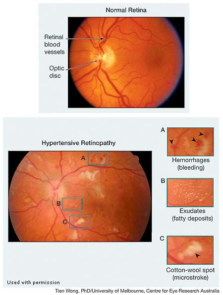

Preventative Medicine and General Health 
========================================

The model for clinical practice, especially for family medicine, besides working on urgent care and illnesses always consistutes **RISE**:

-   R - risk assessment

-   I - immunization

-   S - screening / preventative medicine

-   E - educating patient

Risk
----

### Guidelines for Adolescent Preventive Services (GAPS)

Preventing hypertension, hyperlipidemia Preventing the use of tobacco products, the use and abuse of alcohol, and other drugs Preventing learning problems Preventing infectious diseases Preventing physical, sexual, and emotional abuse Preventing severe or recurrent depression and suicide Promoting adjustment to puberty and adolescence Promoting safety and injury prevention Promoting physical fitness Promoting healthy dietary habits and preventing eating disorders and obesity Promoting healthy psychosexual adjustment and preventing the negative health consequences of sexual behaviors Promoting parents' ability to respond to the healthcare needs of their adolescents

### sexual risk behaviors and problems

Many young people engage in sexual risk behaviors that can result in unintended health outcomes.

To reduce sexual risk behaviors and related health problems among youth, physicians can help young people adopt lifelong attitudes and behaviors that support their health and well-being-including behaviors that reduce their risk for HIV, other STIs, and unintended pregnancy.

Counsel youth that abstinence from vaginal, anal, and oral intercourse is the only 100% effective way to prevent HIV, other STIs, and pregnancy. The correct and consistent use of male latex condoms can reduce the risk of STI transmission, including HIV infection. However, no protective method is 100% effective, and condom use cannot guarantee absolute protection against any STD or pregnancy.

In many states, minors can legally consent to certain types of health care on their own - including STI and HIV testing.

### Intimate Partner Violence

The American College of Obstetrics and Gynecology suggests screening all patients who come to them: family planning patients, all ob-gyn patients, and all prenatal patients, at first visit, at each trimester, and at the post-partum visit. It may help to preface asking such questions with a statement such as: \"Because domestic violence is so common, I ask all of my patients about this \...\"

The USPSTF recommends that clinicians screen women of childbearing age for intimate partner violence, such as domestic violence, and provide or refer women who screen positive to intervention services. (Level of Evidence: B)

This is routinely done at annual exams or when red flags are present.

-   Prevalence
    It is important to be aware of domestic violence when addressing our patients as approximately 25% of women in the US report being victimized by an intimate partner at some point in their lifetime. While the majority of intimate partner violence (IPV) victims are women, IPV victims are both male and female, occur in both heterosexual and same sex relationships and cross all socioeconomic, age and ethnic divides.

-   Complications
    In addition to the trauma incurred, the rates of chronic disease, including heart disease, diabetes, depression and suicide are significantly higher in victims as well as in adults who were victimized as children as a result of direct abuse and exposure to domestic violence.

-   Increased Health Risk

    -   Migraines, frequent headaches

    -   Chronic pain syndrome

    -   Heart and blood pressure problems

    -   Arthritis

    -   Stomach ulcers, frequent indigestion, diarrhea, constipation, irritable bowel syndrome, spastic colon

    -   Pain during sex (dyspareunia), dysmenorrhea, vaginitis, pelvic inflammatory disease, chronic pelvic pain syndrome, and other gynecological diagnoses

    -   Invasive cervical cancer and preinvasive cervical neoplasia

    -   Depression, anxiety and post-traumatic stress

    -   Unexplained or poorly explained findings on physical exam

-   Behavorial Red Flags

    -   Delay in seeking medical care

    -   Non-compliance with treatment plan

    -   Partner insisting on staying close and answering questions directed to patient

    -   Hesitancy or not answering questions or inconsistent or incorrect answers given to questions

    -   Shyness or reticence in answering questions

-   Interviewing someone about domestic partner violence

    -   Ask screening questions \"Do you feel safe at home?\"

    -   Create a safe setting - posters on walls and brochures about safety

    -   Interview patient alone - if the partner insist on staying, ask for a urine sample or another test outside of the room; children above 3 should ideally not be in the room either

    -   Ensure confidentiality

    -   Direct assessment

    -   Know your local laws and be open with your patient about your legal constraints

    -   Facilitate impartiality

    -   Listen non-judgementally

-   Intimate Partner Violence Safety Assessment

    1.  Increasing severity of violence

    2.  Presence of gun / weapon in the house

    3.  Threats to kill or commit suicide by either victim or abuser

    4.  Use of drugs or alcohol by victim or abuser

    5.  Victim trying to leave or left recently

    6.  Harm to children

Vaccinations
------------

L1.25 in\|L2.25 in\|L2.5 in Vaccination & Indications & Contraindications\

### Flu Vaccine

For patients who have experienced previous apparent vaccine failure, which has discouraged him from accepting future vaccination. In this case, the patient's past illness could have been due to a different flulike infection, which would not represent true vaccine failure. In addition, there may be differences between the strains in the vaccine and those in circulation. Even if the patient acquired influenza despite vaccination in a prior flu season, he is still likely to benefit from seasonal influenza vaccination because it reduces both the risk of infection and the severity of illness.

In cases in which a patient declines a recommended service based on inaccurate or incomplete information, the clinician should provide a balanced assessment of the recommended intervention, including the likely benefits, risks, and limitations. Giving a more accurate and thorough explanation can reinforce patient autonomy and improve decision-making.

During influenza outbreaks, oseltamivir can be given prophylactically to exposed, high-risk patients (eg, patients in skilled nursing facilities, family members of confirmed cases). In such situations, it is administered in short courses, not through the whole season.

### Tetanus, Diphtheria, and Acellular Pertussis (Td/Tdap) Vaccination In Adults

-   Persons aged 11 years or older who have not received Tdap vaccine or for whom vaccine status is unknown should receive a dose of Tdap followed by tetanus and diphtheria toxoids (Td) booster doses every 10 years thereafter. Tdap can be administered regardless of interval since the most recent tetanus or diphtheria-toxoid containing vaccine.

-   Adults with an unknown or incomplete history of completing a 3-dose primary vaccination series with Td-containing vaccines should begin or complete a primary vaccination series including a Tdap dose.

-   For unvaccinated adults, administer the first 2 doses at least 4 weeks apart and the third dose 6 to 12 months after the second.

-   For incompletely vaccinated (i.e., less than 3 doses) adults, administer remaining doses.

### Pneumococcal 23-Valent Pneumococcal Polysaccharide Vaccine \[PPSV23\] Vaccination In Adults with Chronic Disease

Adults age 19 through 64 with chronic heart disease (including congestive heart failure and cardiomyopathies, excluding hypertension), chronic lung disease (including chronic obstructive lung disease, emphysema, and asthma), chronic liver disease (including cirrhosis), alcoholism, cigarette smoking, or diabetes mellitus: Administer PPSV23. Additionally, patients age 19 to 64 with chronic immunosuppression (e.g. human immunodeficiency virus (HIV) disease, post-splenectomy) should receive PPSV23.

Screening and Preventative Medicine
-----------------------------------

### Cardiovascular Risk Factors Screening

ASCVD Risk Factors Screening

-   ALL adults \>18 yrs be screened for hypertension;

-   All adults should be asked about tobacco use, and all smokers be given tobacco cessation interventions.

-   Assess traditional ASCVD risk factors, including fasting lipids, every 4 to 6 years in adults 20 to 79 years who are free from ASCVD

-   Adults \> 20 yrs should be screened for hyperlipidemia if at increased risk for CAD (i.e., diabetic, hypertensive, premature personal history of atherosclerosis or family history of CAD in males \< 50 yrs or females \< 60 yrs);

-   Estimate 10-year ASCVD risk every 4 to 6 years in adults 40-79 years of age without ASCVD

-   The USPSTF recommends initiating **low-dose aspirin** use for the primary prevention of cardiovascular disease (CVD) and colorectal cancer (CRC) in adults

    -   aged 50 to 59 years

        -   who have a 10% or greater 10-year CVD risk

        -   are not at increased risk for bleeding

        -   have a life expectancy of at least 10 years,

        -   are willing to take low-dose aspirin daily for at least 10 years.

    -   aged 60 - 69 years with 10% or greater 10-year CVD risk can have individualized decision.

### Women's Health Screening

Pap Smear

-   Regular Pap for age 21:3:65

-   OR regular pap for 21:3:30 AND pap cytology PLUS HPV 30:3:65

-   not indicated for patients who have had a hysterectomy including complete removal of the cervix for non-cancer reasons and do not have a history of CIN2 or greater lesions

Mammogram

-   USPSTF: 50:2:74

-   ACS: 40 - 45 optional, 45 - 74 screen

-   ACOG: 40:1/2:75

### Cancer Screening

Colon Cancer: Average risk patients: 50 - 75 year old necessary, 75 - 85 optional, 85 and older do NOT screen

-   Guaic-based fecal occult blood tests (gFOBT): need three samples, every year

-   Fecal immunochemical tests (FIT): need 1 samples, every year

-   DNA-based testing AND FIT: every 1 - 3years

-   Flexible sigmoidoscopy: every 5 years, anesthesia is optional, good for low resource setting

-   Colonoscopy: every 10 years

General Health Conditions
-------------------------

### Metabolic Syndrome

The National Cholesterol Education Program defines the metabolic syndrome as any three of the following five:

-   Fasting plasma glucose equal and above 100 mg/dL (or on medical therapy for hyperglycemia)

-   BP ≥ 130/85 mmHg (or on medical therapy for hypertension)

-   Triglycerides ≥ 150 mg/dL (or on medical therapy for hypertriglyceridemia)

-   High density lipoprotein (HDL) cholesterol \< 40 mg/dL for men, \< 50 mg/dL for women (or on medical therapy for low HDL cholesterol)

-   Abdominal obesity (waist circumference \> 40\" for men, \> 35\" for women)

Insulin resistance is believed to be the underlying mechanism of the metabolic syndrome. There is some controversy about the existence of a metabolic syndrome, as opposed to a collection of independent risk factors; however, this distinction should not discourage appropriate risk factor management and risk reduction.

Treatment: Aggressive lifestyle modification (dietary modification, physical activity, weight loss, and smoking cessation) is first-line therapy for the metabolic syndrome. Medication is often indicated if lifestyle modification is unsuccessful.

Coexisting disorders - The metabolic syndrome is also associated with a higher risk of:

-   diabetes mellitus

-   hepatic steatosis

-   hepatocellular carcinoma

-   cholangiocarcinoma

-   chronic kidney disease

-   obstructive sleep apnea

-   hyperuricemia

-   gout

### Obesity

#### Obesity History Taking

Weight History

-   Begin in childhood and include any significant weight changes, as well as any family history of weight problems and related complications.

-   Ask about prior attempts at weight loss (information about previous diets tried, weight loss achieved, reasons for stopping, and subsequent weight gain should be obtained). This information can be very helpful in counseling patients about weight loss.

-   Obtain information about barriers encountered in prior weight loss attempts to help the patient plan strategies to avoid or deal with those barriers in the future.

Diet History

-   Types and quantities of foods eaten

-   Types and quantities of beverages consumed, including soft drinks, fruit juices, and any sweeteners or flavorings added to coffee or tea

-   Composition of meals (amounts of protein, carbohydrates, fat)

-   Timing of meals

-   Triggers for eating (hunger, environmental, and emotional)

Physical activity history to determine calorie requirement

-   Activities associated with work

-   Leisure time activities

-   Structured exercise

Alcohol, tobacco, and other substance use\
Psychosocial stressors Medical history

-   Ask about symptoms of medical conditions which might predispose patients to secondary obesity.

    -   Cushing syndrome (easy bruising, hyperpigmentation, muscle weakness)

    -   Hypothyroidism (fatigue, cold intolerance, constipation)

    -   Hypogonadism (decreased libido)

-   Ask about symptoms of medical conditions associated with obesity, including symptoms of cardiovascular disease.

    -   Sleep apnea (snoring, daytime somnolence, and morning headaches)

    -   Cardiovascular disease (chest pain or pressure or dyspnea)

    -   Cerebrovascular disease (changes in vision or focal neurologic symptoms)

    -   Peripheral vascular disease (claudication)

Family History Review of Systems (ROS)

#### Health Impact

Obesity is rapidly gaining on smoking as the single greatest cause of mortality in USA. A body mass index (BMI) of over 32 kg/m2 has been associated with a doubled mortality rate among women over a 16-year period and obesity is estimated to cause an excess 111,909 to 365,000 death per year in the United States. Obesity on average reduces life expectancy by six to seven years. A BMI of 30-35 reduces life expectancy by two to four years while severe obesity BMI \> 40 reduces life expectancy by 20 years for men and 5 years for women.

Obesity is associated with many poor health outcomes, including cardiovascular disease (including hypertension, dyslipidemia, stroke (B), and coronary heart disease(A)); osteoarthritis (C); obstructive sleep apnea (F); gallbladder disease (E); and several cancers (including breast, endometrial, pancreatic, renal, colon). Lung cancer (H) has not been associated with obesity. While obesity is a cause of restrictive lung disease, it is not associated with obstructive lung diseases (D).

The metabolic effects of obesity increase the risk of a number of common medical conditions, including: Type 2 diabetes mellitus hypertension dyslipidemias heart disease stroke peripheral vascular disease

Other adverse health outcomes associated with obesity: congestive heart failure atrial fibrillation chronic back pain osteoarthritis venous thromboembolic disease cholelithiasis hepatic steatosis gastroesophageal reflux obstructive sleep apnea

Patients with a BMI ≥ 40 also have higher death rates from a number of cancers, including:

non-Hodgkin lymphoma multiple myeloma cancers of the esophagus, colon, rectum, liver, gallbladder, pancreas, stomach, kidney, prostate, breast, uterus, cervix, and ovary. In females, obesity is associated with irregular menses, anovulatory cycles, and infertility.

#### Classification for BMI

::: {#tbl:bmi-class}
----------------- -------------
  Underweight       $\leq$ 18.5
  Normal weight     18.5 - 24.9
  Overweight        25 - 29.9
  Obesity           30 - 40
  Extreme Obesity   \> 40
----------------- -------------

  : Body mass index categories
:::

#### Management

| Behavioral interventions         | Details                                                      |
| -------------------------------- | ------------------------------------------------------------ |
| **Stimulus control**             | Maintain stocks of easy-to-prepare, healthy foodsStore healthy foods in prominent locationsLimit stocks of less healthy foods |
| **Physical activity**            | Moderate-to-intense aerobic exerciseResistance/strength trainingLifestyle activity (eg, take stairs, reduce sitting time) |
| **Self-monitoring**              | Regular documentation of:WeightFood intakeExercise           |
| **Accountability/****follow-up** | Provider visits, phone calls, Internet contactsGroup participation sessions |

-   Regardless of the specific diet chosen, successful **weight loss** can be enhanced by incorporating behavioral strategies into the overall program. In particular, detailed **self-monitoring** of **dietary intake**, **exercise**, and **daily weight** is associated with **increased success** rates. Self-monitoring is also associated with greater **long-term maintenance** of weight loss. Although some patients fear that daily weighings may lead to frustration and less weight loss, most studies have not found this effect in practice.
-   Exercise should be included in a broader weight loss program because it is associated with greater weight loss and better long-term maintenance. However, exercise alone is not generally effective for weight loss.
-   Weight-loss medications are recommended for patients in whom conservative measures have failed and whose BMI is ≥30 kg/m2 or ≥27 kg/m2 with additional weight-related conditions (eg, diabetes mellitus). However, the costs and potential adverse effects of these medications are not typically justified for otherwise healthy, overweight patients.
-   Bariatric surgery: if BMI kg/m2 or BMI kg/m2 in association with obesity-related comorbidities (e.g. T2DM)

### Hypertension

#### Screening and Risk Factors

USPSTF recommendation

-   Screen in adults aged 18 years or order

-   And preferable outside of clinical setting for diagnostic confirmation before starting treatment

Risk factors, which are important to ascertain as part of history related to HTN include

-   History or symptoms of CHF

-   History or symptoms of cardiovascular disease

-   History or symptoms of diabetes

-   History of high cholesterol

-   Medications and OCT that might confound or induce HTN

-   Family history of cardiovascular disease

-   Smoking, alcohol, and drug

#### Diagnosis and Classification

Diagnosis of HTN is confirmed when

-   Patient has at least two elevated measurements, five minutes apart, and one in each arm, made on 2 or more visits

-   Cannot be acutely ill or in acute pain

-   Measurements are done after patient has been sitting quietly for 5 minutes with their back supported, arm at heart level.

Note conditions that may cause a pressure differential in 2 arms include

-   Aortic dissection

-   Plaque in subclavian artery

-   Coarctation of the aorta if the left subclavian artery originates distal to the narrowing.

Evaluation of a patient with possible new diagnosis of hypertension has three goals:

1.  Assess for the presence or absence of target end organ disease (A patient with more than 10 years of hypertension may already have end-stage organ disease.)

    1.  Brain - cerebrovascular accident or transient ischemic attack

    2.  Eyes - retinopathy

    3.  Heart - LVH, angina, MI, heart failure

    4.  Blood Vessels - peripheral vascular disease

    5.  Kidneys - chronic renal failure

2.  Assess cardiovascular risk factors or concomitant disorders that may affect prognosis and guide treatment

    -   Diabetes, HTN, Hypercholesterolemia, Obesity, Smoking

    -   Increased age

    -   Family history of premature CVD (male \< 55, female \< 65)

    -   Physical inactivity

    -   Chronic kidney disease (GFR \< 60 mL/min)

    -   Unhealthy diet

3.  95% to 98% of the hypertension diagnosed in the United States is essential hypertension, Consider evaluation for secondary causes such as

    -   Obstructive sleep apnea

    -   Anxiety

    -   Coarctation of the aorta

    -   Thyroid or Hyperparathyroid disease

    -   Pheochromocytoma

    -   Primary aldosteronism

    -   Cushing's Syndrome

    -   Renal artery stenosis and other renovascular diseases

    -   Renal parenchymal disease

    -   Drug or alcohol indused (NSAID, sympathomimetics, cocaine etc)

    This is especially important if there were poor response to treatment, increasing severity of HTN, or if the patient has history of physical examination findings that point to a secondary cause.

4.  Other questions

    -   Family history of diabetes and / or hypercholesterolemia

    -   Diet history

    -   Psychosocial stressors

Physical for patient with HTN should include

-   Check for BMI

-   Fundoscopy - assess for arteriovenous nicking, cotton-wool spots, flame hemorrhages, exudates, and other changes associated with HTN retinopathy, or papilledema associated with HTN emergencies.

    {#fig:htn-retinopathy width="65%"}

-   Quick neurological examination for changes due to cerebrovascular diesases

-   Palpate the thyroid gland

-   Examine the lungs for signs of CHF such as crackles or diminished breath sounds,

-   Examine the heart for rate, rhythm, murmurs, and enlarged point of maximal impulse which may indicate cardiovascular disease, valvular disease, or cardiomegaly

-   Examine the abdomen for aortic pulsation, bruits, or masses

-   Examine the lower extremity for presence of cardiovascular diseas or peripheral vascular disease such as diminished pulses, loss of extremity hair, thick toenails, cold, and red skin.

-   Auscultation for carotid, abdominal, femoral bruits

Classification of HTN

  BP category   SBP (mmHg)    DBP (mmHg)
------------- ------------- ------------
  Normal        $<120$        $<80$
  Elevated      $120 - 129$   $<80$
  Stage 1 HTN   $130 - 139$   $80-89$
  Stage 2 HTN   $\geq 140$    $\geq 90$

Historical context

-   For many years, we defined blood pressures between 120-139/80-89 as 'prehypertensive.' Blood pressures in this range were recognized to put people at higher risk of cardiovascular events, and physicians were supposed to give patients with prehypertension guidance on making changes to their diet and exercise to prevent the development of hypertension. But this label is typically ignored.

-   American College of Cardiology (ACC) and the American Heart Association (AHA), now define blood pressures of 130/80 or greater as hypertensive, which could push physicians and patients to focus more on the importance of lifestyle changes.

-   Yet, AAFP (American Academy of Family Physicians) did not endorse these guidelines because they did not fully address the risk of harms with lower blood pressure goals, and potential conflict of interest.

Therefore beware of using the current recommendations when considering lowering blood pressure, especially in vulnerable populations such as the elderly.

#### Interventions for HTN

General lifestyle interventions include:

-   Weight loss for those who are overweight and obese

-   Increased physical activity through a structured exercise program

-   Adopt a Heart healthy diet, such as the DASH diet or Mediterranean diet (MOST Effective! other 5 mmHg drop, DASH 10!)

-   Sodium restriction, or in those over 75 who are well nourished a trial of sodium restriction (sodium restriction may lead to decreased oral intake in older patients).

-   Potassium supplementation, particularly from diet (eg. tomatoes, avocados, green leafy vegetables, et al.)

-   Restriction of alcohol consumption to no more than 2 standard drinks per day for men or 1 standard drink per day for women and for all adults 65 years or older.

Start medications targeting blood pressure of 130/80 mmHg for:

-   All patients with clinical atherosclerotic cardiovascular disease (ASCVD), diabetes mellitus, and chronic kidney disease

-   Stage 1 HTN patients with 10-year ASCVD risk of more than 10%

-   Stage 2 HTN patients

Note that older patients are more prone to adverse events with tight BP control, including orthostasis, falls, and kidney injury. Caution should be taken to ensure that older patients are not orthostatic before changes in medication therapy. Recommendations for tight BP control are restricted to community-dwelling seniors who are not nursing-home eligible. Patients with a limited life expectancy are unlikely to benefit from tight BP control.

  Medications   General   CKD   Black   Preg
------------- --------- ----- ------- ------
  Thiazide      1         2     1       \-
  CCB           2         2     1       \-
  ACE-i / ARB   2         1     2       \-
  Methyldopa    \-        \-    \-      1

  : Choice of medical therapy

#### Initial Tests in HTN

Here is a list

1.  Lipid Profile - to further assess and treat CVD risk factors

2.  Basic Metabolic Panel

    -   Fasting blood glucose - look for potential comorbid condition of diabetes and sign of metabolic syndrome

    -   Potassium level - monitor HTN therapy-induced hypokalemia, may be affected in Cushing's syndrome or primary hyperaldosteronism

    -   Sodium level - monitor for HTN therapy-induced hyponatremia

    -   Serum creatinine (and corresponding estimated GFR) - sign of end-organ damage, ACEi, ARB, and diuretics may also elevate creatinine

    -   Calcium - evaluate for primary hyperparathyroidism, which can be associated with HTN.

3.  TSH - screen for hypothyroidism or hyperthyroidism, both causes of secondary hypertension.

4.  Urinalysis

    -   proteinuria, which can be evidence of hypertensive nephropathy

    -   glucosuria, which may be evidence of undiagnosed diabetes or poorly controlled diabetes

5.  Electrocardiogram

    -   Left ventricular hypertrophy (LVH) is an important prognostic factor for death in all people with or without hypertension. LVH is reversible with proper attention and medical management.

6.  Echocardiogram - if aptient is \< 18 y/o, has a history or physical exam findings suggestive of congestive heart failure, has longstanding poorly controlled hypertension, or evidence of secondary hypertension.

7.  Urinary albumin excretion or albumin/creatinine raio (optional) -

#### Referal for HTN

Generally, failure to achieve blood pressure goal in patients who are adhering to full doses of an appropriate three-drug regimen that includes a diuretic may warrant referral to a nephrologist or cardiologist.

Before referring, clinicians should first review other causes of inadequate hypertension control such as:

-   Improper blood pressure measurement

-   White coat hypertension

-   Excess sodium intake

-   Medication issues (e.g., nonsteroidal anti-inflammatory drugs (NSAIDs), illicit drugs, sympathomimetics, oral contraceptives)

-   Excess alcohol intake

-   Underlying identifiable causes of hypertension (secondary hypertension)

### Hypercholesterolemia

#### Medical Intervention for Hypercholesterolemia

Key principles

-   Low density lipoprotein cholesterol (LDL-c) goals no longer recommended as treatment targets.

-   Only HMG Co-A Reductase Inhibitors (statins) have been consistently shown to reduce cardiovascular endpoints including cardiovascular mortality.

-   Therefore, ACC/AHA guidelines simplified the pharmacologic management of hypercholesterolemia to the decision of whether or not to initiate statin therapy for a given patient. The current indications for initiating therapy is

    1.  Individuals with clinical ASCVD High-intensity

    2.  \> 21 years with LDL-c \> 190 mg/dL (implies genetic hyperlipidemia and high ASCVD risk) High-intensity

    3.  40 -75 y/o with diabetes and ASCVD risk \> 7.5% High-intensity

    4.  40 -75 y/o with diabetes and 10-year ASCVD risk \> 7.5 (Pooled Cohort ASCVD Risk Equations)% High or Moderate -intensity

    5.  40 -75 y/o with diabetes Moderate-intensity

Categories of Statins

  Drug name      Dose         Intensity
-------------- ------------ -----------
  Pitavastatin   1 mg         Low
                 2 - 4 mg     Moderate
  Simvastatin    10 mg        Low
                 20 - 40 mg   Moderate
  Prevastatin    10 - 20 mg   Low
                 40 - 80 mg   Moderate
  Lovastatin     20 mg        Low
                 40 mg        Moderate
  Fluvastatin    20 - 40 mg   Low
                 40 mg BID    Moderate
  Rosuvastatin   5 - 10 mg    Low
                 20 - 40 mg   High
  Atrovastatin   10 -20 mg    Moderate
                 40 - 80 mg   High
