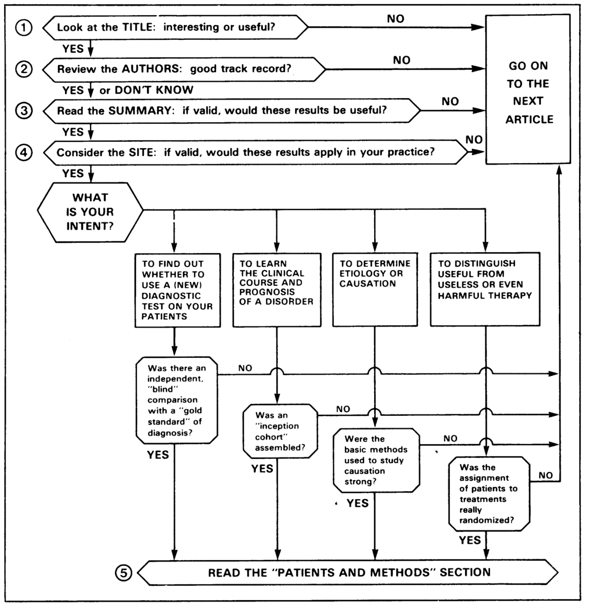

Frontiers in Medicine
=====================

## EMBS Activities

### Make an impact webinar preparation

- Go through the flow
- Make sure everyone can speak and knows how to use the various functions on the application

Innovation Ideas
----------------
1. OSA - automating polysonogram reading
2. Scribes in ED
3. Insulin dose adjustment
4. 

Clinical Medicine Developments
------------------------------

Industry Trends
---------------

### Trends in biotech

-   More approved drugs but with a shift from mass-market treatments to more specialist therapy areas

    -   In 2017, the U.S. Food and Drug Administration, gatekeeper to the world's biggest drugs market, has approved 41 novel drugs compared with 22 for the whole of 2016.

    -   Average internal rate of return (IRR) down sharply from 10.1 percent in 2010 to 3.2 percent this year for 12 big pharma in Deloitte study including Pfizer, Roche, Novartis, Sanofi, GlaxoSmithKline, Johnson & Johnson, AstraZeneca, Merck & Co, Eli Lilly, Bristol-Myers Squibb, Takeda and Amgen

-   More gene-modified cell therapy: Novartis' cell therapy Kymriah costing \$ 475,000, while gene therapy could fetch around \$1 million per patient.

-   Higher cost in drug development: Today, the average cost of bringing a new drug to market at a large company is nearly \$2 billion, up from \$1.2 billion in 2010, while forecast annual peak sales per drug have fallen from \$816 million in 2010 to \$465 million.

Why is there an increase in cost and price?

-   According to pharm: The high costs of their products are justified because the proceeds generate money for crucial research on new cures and treatments.

-   According to study: A social disease called maximizing shareholder value

    Companies spend more on share buyback and dividends in a recent 10-year period than on R & D. From 2006 through 2015, the 18 drug companies in the Standard & Poor's 500 index spent a combined \$516 billion on buybacks and dividends. This exceeded by 11 percent the companies' research and development spending of \$465 billion during these years. The authors contend that many big pharmaceutical companies are living off patents that are decades-old and have little to show in the way of new blockbuster drugs. But their share buybacks and dividend payments inoculate them against shareholders who might be concerned about lackluster research and development.

    -   Gilead Sciences spent \$27 billion on buybacks versus \$17 billion on research
-   Biogen Idec repurchased \$14.6 billion in stock and spent \$13.8 billion on R&D.

Research Meetings
-----------------
### COVID-19 Initiatives

### NK and VST: Mostly heard rarely seen

Occasion: MD-PhD meeting May 27
Presenter: **Prof Leung Wing Hang**

Haematology/Oncology Service, and Director of Paediatric Bone Marrow Transplant and Cell Therapy Centre of the KK Women's and Children's Hospital. 

NK = natural killer cells; VST = Virus specific T cells


- **NK cells** and clinical use in cancer therapy

  - NK cells co-develop with B cells; architecture similar to T cells, but primarily use check points

  - Best way to test NK potency is T-cell depleted HSCT

    - 3 month old, ALL< WBC 479k
      - Poor prednisone response
      - Father transfer NK to patient
      - Successful treatment! Now 10 years after!
    - 6 months, t(4;11) ALL
      - Relapsed 1 year after completion of chemotherapy
      - 90% blast at time or referral
      - Transferred NK cells to the child
      - Now 8 years after transplant

  - Do donar KIR typing, NK cell purification, NK cell expansion and activation; NK cell adoption and transfer to patient

  - KIR is the receptor of NK cells; gremlin polymorphism vs. T-cell through somatic mutation

  - Genotyping is important because not everyone has the same type of genes

  - Select donors with high level expression of KIR D2L1 allele

  - Surface anchoring; mismatched is better than the matched?

    - Mismatched with KIR matching is better
    - Mismatched also over comes the graft vs host

  - 

  - Current survival

    - CAR-T half will relapse; NK cell is better
    - NK cell may be used to replace BMT
      - Cheaper, safer, no latency effect

  - Therapeutic antibody + NK cell work better

  - Can be used in high risk patient e.g. neuroblastoma; to double survival

  - Never cause GVHD

  - Massive chemical screening of 5600 FDA approved compounds and found that it is possible to up regulate NKG2D lights

  - Control of osteosarcoma

    - Tumor shrink away

  - Increase post-translational maturation

    - PRL-3 can improve maturation of ligands
    - CAR-NK has similar cytotoxicity but less cytokine release

  - Increase potency

    - BaEV allow CAR+NK to act more effectively
    - Add in more cells
    - Faster NK cell grow, the better the survival; increase chance of relapse 7 folds
      - TOX2 as a novel transcription factor

  - Similar mechanisms and approach can be applied to other immune cells

    

  - Questions

    - NK cell may be used for solid tumors
    - Solid tumor issue: homing and tumor microenvironment are two additional issues compared to liquid tumors
    - Always have activating receptor inhibiting receptor, activating ligand and inhibiting ligand
    - NK cell most important function in the body is to aid reproduction 
      - It works in placenta, interact with placenta cells to control development of spiral artery so that the fetus get nutrition; 
      - **NK cells** work to control viral infections by secreting IFNγ and TNFα.
      - **Killing** is mediated by cytotoxic molecules which are stored within secretory lysosomes, a specialized exocytic organelle found in **NK cells**.
      - **Natural killer** (**NK**) **cells** target and **kill** aberrant **cells**, such as virally infected and tumorigenic **cells**.

- **Virus-specific T cells** in COVID19 treatment
  - The disease kills like an autoimmune disease, therefore we can control it immunologically

  - Active immunity: vaccines, natural infection

  - Passive immunity: B cells (antibody, plasma), T cells (pioneered by his group)

    - In US the most commonly prescribed therapy is plasma

    - His group can do T cells and NK cells, choose T cells because of the pathophysiology

      - Patients recovering from COVID-19 has to make T cells (mandatory for recovery)

      - Whether the T cells are made by the patient or by a kind convalescent donor, they have the same basic function (in terms of efficacy and side effects)

      - Increased T cell is associated with reduced cytokine levels

        

  - Process of therapy

    - Recruit convalescent donor: collect whole blood or leukapheresis
    - Stimulate with poly peptides: covering M, N, and S proteins
    - Select functionally reactive cells: e.g. IFNg+ cells
    - Adoptive transfer to patients with severe COVID-19

  - Homologous Use

  - Why T cell might be better

    

    - Living drug means that the T cells continue to grow

  - Product contains memory cells with few naive cells

    - 69% CD4 direct control; CD8 help B cells to make antibody
    - Started treatment in first patient

  - Question

    - Stimulate T cells with SARS2; accessory proteins
      - MCH I and MCH II is about 15 amino acids
      - Whenever we present this, we do not know
      - Each person's MHC is different, so the polypeptide we use are different; in the clinical setting, we cannot say this is a T-cell we use
      - COVID19 M, N, S protein are important for immunogenic - among the three S (spike protein) - corona virus is due to Spikes; S binds and enable virus to enter cells
        - Therefore if we can only choose one thing, we should choose S.
        - However, S is not the only one; others are important too. 
        - In his approach, he cover not only S but also others since it is War time.
    - Adaptive T cell transfer to patient, no MHC matching, what will be the immune reaction to the donor T cell that is not matched; 
      - Design an experiment, do we need matching between donor and recipient? If we need matching how much?
      - If we want T cell to kill virus infected host cells, we need some form of recognition, there needs to be some matching; this is the Nobel prize experiment; we cannot transfer without any MHC matching; at least 1 is required
      - Clinically this means that if we really need to transfer T cells into you
      - Probability of having at least 1 matched?
        - When travel and work place travel becomes lower and lower
        - People get it from people in similar ethic group, almost essentially share a MHC
        - HLA, even if three donors, we cover 90% of Singaporeans.
        - Don't have to worry about HLA matching
        - Any random 2 person in their study has a medium of 2 -3 antigen sharing
      - Rejection? Yes
        - Don't need a week or two in the body is enough
        - CMV, EBV, can never clear
    - CAR-T applied to treat immune disease and other disease
      - Cancer already has a lot of good drugs
      - Two other disease that is most useful is autoimmune disease and infectious disease
      - He used to work in Pharma, blockbuster are autoimmune and infectious disease
      - Cancer has no long term disease
      - CML is the rare case in which they have to take the drug for a long time
      - Currently CAR T make no economic sense to develop further
      - If we can transfer it to use in autoimmune disease and infectious disease, the economics is much better
      - Cancer is very difficult to treat but autoimmune disease and infectious disease don't have similar problems.
      - Can always tune the NK cells if we want; NK cells function by aiding other cells
    - A lot of biologics can be repurposed
      - As MD-PhD learn what is basic from professor
      - Based on medical knowledge, we can cross apply
      - Biology and biotechnology background help to pull it through
    - Always think outside of the box, usually not that difficult, MD-PhDs we need to link things together that may not appear to be very relevant.
    - Don't use VST in infection, use in CMV cells stay in body forever
      - Can VST as payload? E.g. insulin, dopamine? Long term repurposing of cells
    - Anti-inflammatory drugs, inverse between T cells and cytokines, do we know where the inflammatory cytokines are coming from? They are from the TOL like receptor pathways
      - COVID19 is RNA virus, very potent stimulator of TOL like receptor pathway
        - Cytokine is the alarm, the actual police not coming
        - Patients with hyper immunity have problem not those with no immunity
        - Patients with cancer and aids and immunodeficiency are better
        - Patients inflammatory background e.g. diabetes etc get into trouble
        - When we put RNS into it, they flare up a lot. 
      - Can we load with anti-inflammatory drugs 
        - IL-1 pathway turns out to be great for COVID19
        - At the end of the day still need adaptive immunity, therefore plasma therapy is useful
        - However, if we can give anti-inflammatory molecule with minimal side effect, there is less
      - IL10 (prototypical cytokine) - can the drop be associated with clearing of virus?  Chin Yee Tan
        - When ever we trigger the TCL all inflammatory pathways will up regulate
        - Whenever we have inflammatory cytokine, the anti-inflammatory cytokine also goes up
        - Whenever classify cytokine into TH1 TH2 Th17 etc, a lot of cytokine action depend on dose range and also what is around. IL10 + something else, have paradoxic effect; if we have TGF beta it modulate the cytokine
        - If there a lot of NK cells receptor
    - Treatment for COVID 19 commercialization
      - Plasma therapy is good because blood bank is everywhere; in pandemic, whether low or high income country can do it
      - Fancy drugs are harder; very few company think they can make money from COVID19; 
      - Transfusion based practice will have best market value because one can delivery very fast; easy to prepare easy to make easy to delivery
      - We don't even need to know biology or the bug; we just need someone to recover from the condition

### EMB AdCom Meeting

#### EMB Journals update by Amier in 2020 April

COVID19-related papers
- Increasing COVID19 paper
- Advertise activities in soliciting nice COVID19 paper
- PULSE published paper on PPE
- More papers will be published related to COVID19
- 600+ papers are made available for free download on IEEE Xplore

His jobs
- Recruit and manage editors
- Get the impact factors up
- Reduce backlog for Journals
- TBME: 15- 20% acceptance
- open access journal wanting more papers
- IEEE Access: open access, all fields, EMB started a section in 2019 sep
- Package revenue: IEEE Xplore's value does down
- Paper award for most cited paper

#### Colin VP Technical
- TC has clear objective; active leadership team
- Improve operation and make it easier for people to run the TCs
  - Projects driven by technical committee has no firm process
  - Technical committee chairs need to know about these
  - Technical committee development
  - Fill out a sheet that says what is the project we want to do
  - June 1 proposal due
  - Seed funding that can be obtained to start projects
  - Visibility to the society is a metric
- EMBS awards are now under-way, 60 applications received across different awards
  - Each TC contributed one or two nominees from different categories
  - Balance in gender and regional diversity
  - Region 7 and Region 9 looking for people
- Transition to technical committees
  - New websites and links to where people have to go to sign up
  - Goal is for 50% - 100% people be on a technical committee
- Lead the initiation of point of care conference for a new TC
  - Postponed to next year
- Nic Chabat - cardiopulmonary technical committee
  - Expanding on modeling and have a broader view on physio modeling
  - Busy with COVID19 and his company
- Standards area very active; neuroengineering leadership and ownership in that area
  - Natural way to interact with companies and medical
- Jeff palmer: wearable sensors, big data
  - Summer school
  - Big data is strategic
  - Biosignal processing and imaging
- New Website
  - Technical committee need to populate sub-website
  - Government of the TC
  - Need a publicity chair
- New NIH initiative
  - Colin is in steering committee for POC research network
  - New allocation of funds to compat COVID19
  - 25 billion for diagnostic testing
  - 1 billion allocated to NIH to accelerate the QC and deployment of testkits
  - Everyone in US test 2 -3 rounds
  - First round of testing by the end of the year
  - RADiagx: skills in testing to clinical deployment should engage
  - Help by guidance
  - Best people, best advice, best outcome
- Areas not addressed by the technical committee according to Luis Kun
  - Public health informatics
  - Epidimiology surveiliance
  - Integration of multiple applications
  - Multiple system integration

### MD-PhD Round: How to Read Clinical Journals

{#fig:approach-readpaper width="\\textwidth"}

#### When to start clinical trial

-   Available
-   Accessible
-   Affordable
-   Acceptable

#### Methods of Randomization

Problems with randomization
-   Assign patients in turn to control or placebo group
-   Assign patients in one clinic to one arm and the other to another

#### Outcome Design of Clinical Trial

-   Composite Measures
    -   Look at all possible outcomes
    -   Example: time to first event

#### Ways of Analysing a RCT Clinical Trial

-   Intention-to-treat approach
    -   This is a statistical concept described by Fisher in 1990 to handle problem of major complications in RCT, i.e., noncompliance and missing outcomes
    -   ITT analysis includes every subject who is randomized according to randomized treatment assignment. It ignores noncompliance, protocol deviations, withdrawal, and anything that happens after randomization. ITT analysis is usually described as "once randomized, always analyzed".
    -   Advantage
        -   ITT analysis avoids overoptimistic estimates of the efficacy of an intervention resulting from the removal of non-compliers by accepting that noncompliance and protocol deviations are likely to occur in actual clinical practice.
        -   ITT analysis preserves the sample size because if noncompliant subjects and dropouts are excluded from the final analysis, it might significantly reduce the sample size, leading to reduced statistical power.
        -   Moreover, subjects may be noncompliant or may drop out from the study due to their response of treatment.
        -   Reduces Type I error
    -   Cons
        -   estimate of treatment effect is generally conservative because of dilution due to noncompliance.
        -   Also, heterogeneity might be introduced if noncompliants, dropouts and compliant subjects are mixed together in the final analysis.
        -   Moreover, end-point data will differ markedly among noncompliant, dropouts and compliant subjects, and interpretation might become difficult if a large proportion of participants cross over to opposite treatment arms
        -   Subjected to increase Type II error
-   Modified intention-to-treat approach
    -   mITT is a subset of the ITT population and allows the exclusion of some randomized subjects in a justified way (such as patients who were deemed ineligible after randomization or certain patients who never started treatment).
    -   Definition given to the modified ITT (mITT) in randomized controlled trial has been found to be irregular and arbitrary because there is a lack of consistent guidelines for its application
    -   mITT analysis allows a subjective approach in entry criteria, which may lead to confusion, inaccurate results, and bias.
-   Per-protocol (PP) Analysis
    -   Inclusion in the analysis of only those patients who strictly adhered to the protocol.
    -   The PP analysis provides an estimate of the true efficacy of an intervention, i.e., among those who completed the treatment as planned. However, as discussed above, its results do not represent the real life situation and it is likely to show an exaggerated treatment effec

#### Statistical measures

-   Kaplan-Meier Analysis:
    -   non-parametric statistic used to estimate the survival function from lifetime data.
    -   Let $\tau \geq 0$be a random variable, which we think of as the time until an event of interest takes place, survival function is defined as $S(t) = p(\tau>t)$, where $t = 0 , 1, \dots$

-   Harzard Ratio based on Cox Regression Analyses

### Examining COVID19 - Through a Multidimensional Lens

#### COVID19 in the context of emerging Zoonoic Bat Viruses in a Quarter of Century

Prof Wang Linfa\
Founding director of Programme in Emerging Infectious Disease at Duke-NUS\
SingHealth Global Health Institute\

-   It will not be the first and will not be the last EZBV outbreak

    -   Hendra is 25 years

    -   Hendra-Autralia, Nipah-Malaysia, SARS-China, MERS-Saudia Arabia, Ebola-Guinea, COVID-19-China

-   COVID19 is very different from SARS

    -   No, majority of patients (80%) present mild disease, not Severe Acute Respiratory Syndrome

    -   But the virus is 80% identical genetically to SARS-CoV

    -   Virus taxonomy - 4 levels - family, genus, and species, strain (same species as SARS)

-   5 levels of up response

-   Genetic stability

    -   Genetically stable - good for vacine and diagnostics development; bad because it will maintain the transmission/case fatality

    -   There is now a mutation

-   Role of serology

    -   PCR is more sensitive and precise but narrow window

    -   Serology is more specific and longer window

-   Application

    -   Koch's postulates: when there is an infectious disease outbreak, a while before you can claim before it is a new disease;

    -   Double edge sword of social media - good for spreading information, but also cause panic and misinformation

    -   It's not bats' fault

    -   Work for war time has to be done in peace time

#### Exploring the Use of Modelling to Evaluate Policy Response to COVID19

A/Prof John Ansah\
Health Service and Systems Research in Duke-NUS\
SingHealth Global Health Institute\

-   Models

    -   Synthesizing the best available data

    -   Identifying important areas of uncertainty that may be prioritized for urgent research e.g. what predicts mortality, what's contributing to the spread of disease

    -   Comparing control and mitigation strategies to see how these impact incidence, prevalence, outcome etc.

-   Current strategies

    -   Contract tracing and qurantine/isolation

    -   Social distancing: limit large gathering

    -   Vaccination

    -   School closure

    -   Risk communication

    -   Travel ban

-   Methods

    -   He uses system dynamics - stock and flow model!

    -   Develop a mental model of the diease

    -   Identify where are the strategies that's applied

    -   Show the confirmed cases in worst-case, bsae-case, best-case

    -   Infection outcomes and healthcare outcomes

-   In Singapore, assume best case

    -   Contact tracing - 4 days: 90% contact tracing vs 100% contact tracing - not too much of a difference

    -   Reduction is significant with faster contact tracing

    -   87 ICU beds only

-   What is the relative importance of the different strategies

#### Deploying Digital Technology for COVID19

Prof Wong Tien Yin\
Vice Dean Duke-NUS\
Deputy CEO Research and Technology SingHealth\

-   non-digital methods

    -   Telepresence robots

    -   Medical drones

    -   Novel laboratory techniques

-   Digital health technology: for Monitoring, surveillance, detection, and prevention of COVID19, as well as mitigation of impact

    -   Digital platform for data

    -   Digital platforms for communication

    -   Internet of things:

        -   Real-time tracking and live updates in various online databases in US, UK, and China

        -   Live-tracking of the at-risk vincity in Korea

        -   Virtual clinics

        -   Public information dissemination via WhatsApp in Singapore

    -   Big data

        -   modelling disease activity

        -   potential growth and areas of spread

        -   Modeling of the preparedness

        -   HangZhou Health stratification

    -   Artificial Intelligence (AI)

        -   real time analytics of big data to inform decisions

-   Problems

    -   How do we get data?

    -   Online screener

    -   Risk stratify

    -   How to go forward? Cloud-based referral platform / digital consultation

-   A unique opportunity for digital technology, public and patients' acceptance might improve during infectious disease;

-   Good publication opportunity - digital health in ID

#### Issues in Coordinating a Global Response

Prof John Lim\
Singhealth Duke-NUS Global Health Insitute\
Center for Regulatory Excellence\

-   Current gaps in global coordination and response mobilization include

    -   Diverse local and global players

    -   Timely disease detection

    -   Availability of basic care

    -   Contact tracing, quanrantine, and isolation procedure

    -   Preparedness outside health sector

-   Mobilization and distribution of resoures to countries and vested partners is critical - fall out from resource limited countries even in developed world, can negate positive efforts

-   Securing and maintaining commitment of governments and vested partners - once current threat is over, attention is lost

-   WHO does not have sufficient influence over local and national juristication

-   International Health Regulations allow WHO to work with countries to investigate outbreaks, assess risk, and facilitate timely declaration of outbreak status; but activation of WHO is slow

-   Coalition for Epidemic Preparedness INnovations (CEPI) set up at 2017 World Economic Forum following Ebola

    -   Worried about antibody-dependent enhancement

    -   Risks due to ongoing parallel research not building on previous finings

    ```{=html}
    <!-- -->
    ```
    -   Investment in prevention and preparation

    -   Esstblish clear mechnaism for coordaintion and escalation

    -   Engage counications

    -   Promote harmonization

#### Gauging the Economics and Market Implications of COVID19

Dr Taimur Baig\
Managing Director and Chief Economist, DBS Bank\

-   Thesis: Financial market contagion

-   Summary of contagion is Fatality Rate vs Ro

-   Impression is that Ro is the function of behavior, policy, and treatment $\text{Ro} = f(b, k, d)$ However, there is a huge heterogenity in global responses; this has undermined market confidence

-   Considerable uncertainty and senst of vulnerability

    -   When will this end?

    -   How will this end?

    -   What will be the damage?

    -   Are asymptomatic carriers infectious?

-   Downside risk galore

    -   Supply shock - we will see this as a rippling effect in the coming months; even when China goes back to work, it will take time for things to come back to normal

    -   Demand shock - travel and transportation shutdown; the world is largely service industry driven; we cannot make up for service sector cesassion of activity.

    -   Shortages

    -   Credit risk

    -   Limited policy efficacy

#### Converging the Discourses on COVID19

-   Read how serology was used to enable tracing

-   How are we able to mobilize the Apple to do this

-   Online screener - what does it take to develop?

-   How do you accelerate the development of these tools?

-   Prof Wong - as the virus evolve, how does that impact the testing and vaccine development?

-   Dr Baig - business world worried about? How long would it take for us to recover? Would this impact research funding in the future? Prof Ansah, can we use system dynamics to model the economic effect? and global oscillation; Prof Wong - technolgoies reach patients fast? Online screener easy to implement? Prof Lim -

-   Impact on medical tourism

-   Market underwhelmed - 700 - 800 billion governemnt; 1 - 2 years for recovery; money thrown at what? how long are we going to have no movies and no going to restaurants?

-   How to prevent this in the future?

```{=html}
<!-- -->
```
-   States is working on mitigation as opposed to containment

-   

### NSRL P01 Meetings - Multi-scale Anesthesiology Reesarch

#### General

Principles of Pharmacological Research

-   Dose dependent effects are important to account for in pharmacological research. This may not just be about the intensification of one type of effect but onset of / switching between rather different effects.

    -   ketamine - high - 1.67 mg/kg/min

-   Bolus and continuous infusion has different dynamics / effects.

#### Human

Propofol

-   Globally coherent frontal alpha oscillations

-   Globally incoherent slow-delta oscillations

-   PCA slow delta oscillations

-   Loss of frontal parietal functional connectivity

Dex has GABA-ergic effect and at high dose may potentiate GABAergic effects

#### Non-human Primate

Jake

-   Gamma is lower in humnan than primate.

-   Frequency bands are different in different species.

Yumi - recovery of brain from anesthetic induced unconsciousness

-   Maybe prediction of ROC is more important than LOC because ROC is more variable.

#### Rodents

Jen (2018 Feb 9)

-   Propofol, dex, ketamine given to rats and induced distinct PFC LFP signatures that have in common high-amplitude delta oscillations

-   Propofol in paradoxical excitation has beta-gamma;

-   Slow oscillations have sharp peaks

-   Morlet wavelet analysis and period selection with PCA and k-means clustering asking for 2 states for capture of distinct oscillatory states. Just looking for an objective way of pulling out the states.

-   Onset of prefrontal delta and alpha-beta oscillations correlates with loss of EMG tone under propofol anesthesia, consistent with Purdon et al 2013, and Flores et al 2017. Alpha-beta oscillations dominate after loss of EMG tone.

-   Template spectrum for classification

Eric Microinjection

-   picrotoxin is a GABA antagonist used in research due to high toxicity as a CNS and respiratory system stimulant

-   microinjection of picrotoxin at PFC

Francisco

-   Multi-electrode arrays record multiple single unit activity and local field potentials from one or more brain regions during and after anestheic dosing

-   Note that we can re-establish the LORR with EEG recording to establish the LOPWM.

#### Modeling

#### Data Core
