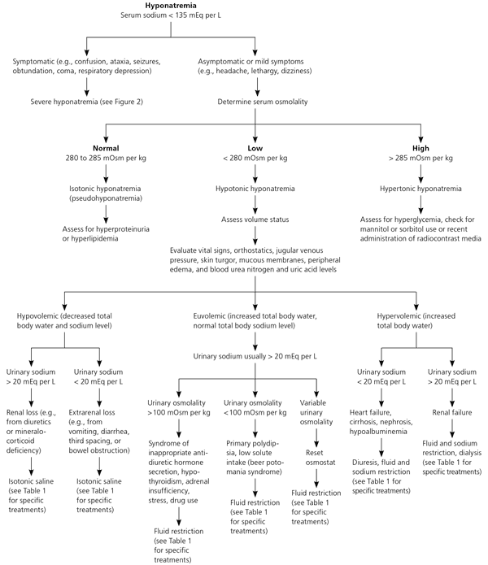
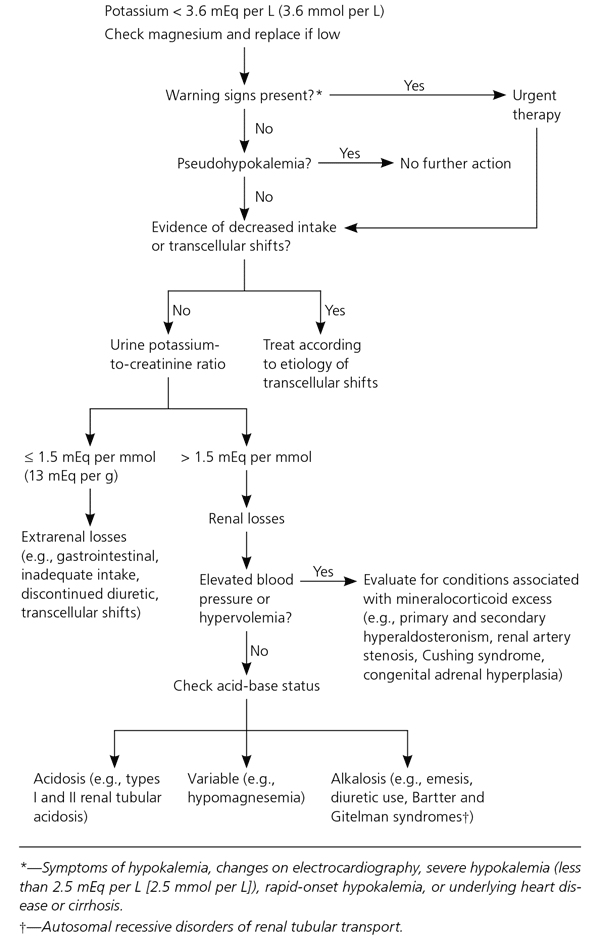
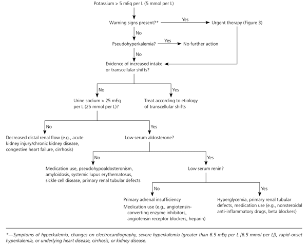
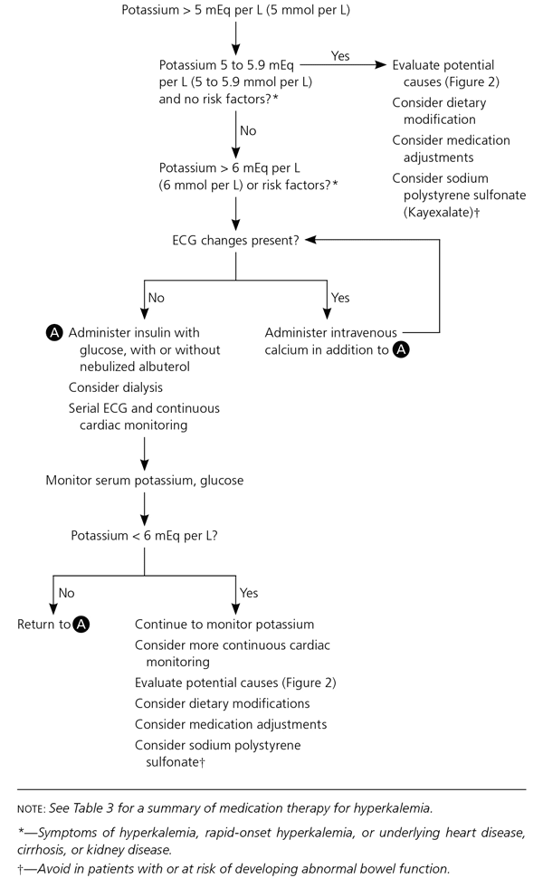

# General Medicine

## Nutrition 营养健康

### Carbohydrates

### Protein

### Fat

### Fibre 纤维

### Vitamin 维他命

### Iron 铁质

### Calcium 钙质

## Deconditioning Problems

### Falls

## Hydration

### Assessment of Dehydration

Important in all patients, especially if someone is losing blood or fluids.

**History**

- Input: 
  - Intake of fluids, including the volume, type (hypertonic or hypotonic), and frequency
  - Method of mixing infant formula; volume of water to powder being used
  - Possible ingestions, antibiotics use
  - Appetite patterns
- Output:
  - Urine output, including the frequency of voiding (last wet diaper), presence of concentrated or dilute urine, hematuria
  - Stool output, frequency of stools, stool consistency, presence of blood or mucus in stools
  - Emesis, including frequency and volume and whether bilious or nonbilious, hematemesis
- Cause / Issues
  - Fever; Weight loss; measure of recent weight versus weight on presentation
  - Contact with ill people, especially others with gastroenteritis, use of daycare
  - Underlying illnesses, especially cystic fibrosis, diabetes mellitus, hyperthyroidism, renal disease

**Symptoms and Signs of Dehydration**

| **Symptom/Sign**          | **Mild Dehydration**   | **Moderate Dehydration** | **Severe Dehydration**  |
| ------------------------- | ---------------------- | ------------------------ | ----------------------- |
| Level of consciousness    | Alert                  | **Lethargic**            | Obtunded                |
| Respiratory rate/pattern* | Normal                 | **Increased**            | Increased and hyperpnea |
| Capillary refill*         | 2 s                    | **2 - 4 s**              | >4 s, cool limbs        |
| Skin turgor*              | Normal                 | Slow                     | Tenting                 |
| Mucous membranes          | Normal                 | **Dry**                  | Parched, cracked        |
| Tears                     | Normal                 | Decreased                | Absent                  |
| Heart rate                | **Slightly increased** | Increased                | Very increased          |
| Blood pressure            | Normal                 | Normal, but orthostasis  | Decreased               |
| Pulse                     | Normal                 | Thready                  | Faint or impalpable     |
| Fontanel                  | Normal                 | **Depressed**            | Sunken                  |
| Eyes                      | Normal                 | Sunken                   | Very sunken             |
| Urine output              | **Decreased**          | Oliguria                 | Oliguria/anuria         |

**Estimated Fluid Deficit**

| **Severity**         | **Infants (weight < 10 kg)** | **Children (weight >10 kg)** |
| -------------------- | ---------------------------- | ---------------------------- |
| Mild dehydration     | 5% or 50 mL/kg               | 3% or 30 mL/kg               |
| Moderate dehydration | 10% or 100 mL/kg             | 6% or 60 mL/kg               |
| Severe dehydration   | 15% or 150 mL/kg             | 9% or 90 mL/kg               |

**Management**

- Clinical assessment to guide therapy: 
  - Other than clinical signs, the **presence of ketonuria** and **elevated urine specific gravity (SG)** on urine dipstick are useful indicators of dehydration.
    - Normal urine SG is 1.002-1.030.
  - If there is clinical signs of dehydration or prolonged course of illness, check for urea/electrolytes.
- Oral rehydration
  - It is as effective as IV rehydration in patients who can tolerate oral fluids.
  - Administer in small amounts repeatedly.
  - **Principle:** water and sodium enter the intestinal cell via the linking (coupling) of one organic molecule, e.g. glucose. Hence the oral fluids should contain glucose to stimulate the absorption of water and electrolytes across the small intestines. This **sodium glucose** coupled with active absorption mechanisms is largely unaffected by enteric toxins. Servidrat, Pedialyte, and Gastrolyte are examples of useful oral rehydration agents.
- Admit patient if 
  - Inability to retain oral fluids
  - Patient is severely dehydration and have electrolyte abnormality

### Free Water

## Fluids

- No strong evidence for whether crystalloid or colloids is better.
- Only specific solutions have certain contraindications
  - Avoid HGS starch, increased mortality in patients with increased ICP and bleeds
  - Avoid normal saline in patients with coagulopathy, and patients in shock because they are already acidotic because of lactate build up (HAGMA).
  - Avoid Hartmann's in patients with increased ICP; use normal saline instead. 

### Crystalloid Fluids 

| Tonicity   | Fluid type                                   | Clinical Use                                                 |
| ---------- | -------------------------------------------- | ------------------------------------------------------------ |
| Isotonic   | 0.9% Saline                                  | Volume Resuscitation (e.g. hypovolemia and shock); An unbalanced fluid because its chloride concentration is supraphysiologic (154 vs 103 mmol/L) and can cause a **hyperchloremic metabolic acidosis (normal anion gap)** when *large* volumes (4 -5 L) are given. It has also been associated with **hypocoagulability**. |
|            | Lactated Ringer Solution (Hartmann solution) | **Volume Resuscitation** (e.g. hypovolemia and shock); Preferred over 0.9% saline because it is a **balanced fluid**, containing near-physiologic levels of chloride, potassium, and calcium and includes sodium lactate, a buffer that is hepatically metabolized to bicarbonate, which helps correct acidosis and maintain normal blood pH.  There are only two situations this is inferior to normal saline 1) **Do not use in patients with increased ICP** because this is slightly hypertonic, worry cerebral edema. 2) **end stage renal failure / hyperkalemic patients** - already hyperkalemic, should hartmanns because it contains potassium. However, there is conflicting evidence on this because the concentration in Hartmann is low so it should not significantly affect the hyperkalemic; and if we give normal saline with low potassium, potassium shift may occur and worsen the hyperkalemia. |
|            | Ringer's Acetate                             | Similar to lactated ringer but reduce the lactate content so that we can avoid messing up lactate measurements; But more expensive than Hartmann's (i.e. Lactated Ringer Solution); Used mainly in ICU. |
|            | Plasma Lite                                  | Same intension as Ringer's Acetate; Same issues.             |
|            | Albumin (5% or 25 %)                         | Volume replacement, **treatment of spontaneous bacterial peritonitis or hepatorenal syndrome** |
| Hypotonic  | Dextrose 5% in water                         | Correct free water deficit (e.g. hypernatremia) Maintenance of severely hypoglycaemia patients (after 50% dextrose) |
|            | 0.45% (half-normal) saline                   | Correct free water deficit; Useful in treating **hypernatremia**.  It is also used as a maintenance fluid in those unable to maintain adequate oral hydration and **may be used after initial volume resuscitation**. |
|            | Dextrose 5% in 0.45% (half normal) saline    | Maintenance hydration                                        |
| Hypertonic | 3% (hypertonic) saline                       | severe, symptomatic hyponatremia                             |
|            | D10W                                         |                                                              |
|            | D20W                                         |                                                              |

- Note that hypotonic solutions must be infused slowly because the low osmolality causes much of the fluid volume to shift into the intracellular space following infusion, which can result in cerebral edema.

- Dextrose formulation available: D5, D10, D20
  - Dextrose is thick and viscous, need to be flushed if given peripherally
  - D5 and D10 are least irritating

### Colloid Solution

- Usually have some form of protein in it

| Fluid               | Remark                                                       |
| ------------------- | ------------------------------------------------------------ |
| Fresh frozen plasma | indicated for replacement of coagulation factors (eg, diffuse intravascular coagulation, major bleeding on warfarin, massive transfusions) |

- These are more expensive and less effective than crystalloids for volume resuscitation.

### Examples of Fluids Therapy

#### Fluids in Septic Shock

After securing an airway, if needed, the goals in managing septic shock include restoring adequate tissue perfusion and identifying the underlying infection and treating it appropriately.  

- Crystalloid solution (eg, normal saline, Ringer's lactate) is the fluid of choice to restore volume quickly as it is as effective as albumin in terms of survival but is less costly and easier to acquire.
  - Crystalloid should be given as **intravenous boluses (500-1000 mL)** to improve systolic blood pressure **>90 mm Hg**, at which perfusion is considered adequate.  
  - If a patient's arterial blood gas is suggestive of a compensated metabolic acidosis (likely lactic acidosis due to organ hypoperfusion), it would be reasonable to administer isotonic saline without concern about worsening the acidosis.
  - This is continued with close monitoring for evidence of **volume overload** (eg, pulmonary edema, hypoxia) or **until fluid no longer improves the blood pressure**.  
- If the patient fails to respond or develops evidence of volume overload without improvement in blood pressure, then **vasopressors** (eg, norepinephrine) should be started to improve perfusion

## Blood Products and Transfusion

- Goal of transfusion is to keep the **hemoglobin >7 g/dL** unless they have not responded to crystalloid and vasopressors
- Fresh frozen plasma should be given to patients with known or suspected coagulopathy (eg, International Normalized Ratio >1.5) as the cause of hemoptysis. 

### Various Blood Products

### Adverse Effects of Transfusion 

#### Transfusion-transmitted bacterial infection 

This is associated with high fever, rigors, tachycardia, and hypotension. Bacterial contamination results from bacteria entering the blood component during processing. When these bacteria are introduced during the transfusion, they can cause septic shock (fever, chills, hypotension) but do not cause anaphylaxis.

#### Anaphylactic Transfusion Reaction

Anaphylactic transfusion reaction most often occurs in those with **IgA deficiency** due to the reaction of anti-IgA antibodies with transfused blood.  Respiratory distress and hypotension are common, but patients also have hives, wheeziness, stridor, and/or angioedema.

#### Blood group incompatibility

Blood group (eg, ABO, Rh, minor antigen) incompatibility, which is less common with donor O-negative blood, causes an acute hemolytic reaction. Common findings are fever, flank pain, and hemoglobinuria, but not anaphylaxis.

#### Circulatory overload and lung injury

This can be due to 

- **TACO = transfusion-associated circulatory overload**
- **TRALI = transfusion-related acute lung injury**
  - TRALI is a rare but life-threatening complication of blood product transfusion marked by the massive release of cytokines, reactive oxygen species, and other inflammatory mediators from neutrophils in the pulmonary vasculature in response to transfused blood components.
  - Manifestations begin within **minutes to hours** of transfusion initiation 
  - Clinical features include a
    - acute, inflammatory pulmonary edema with hypoxia, tachypnea, and bilateral pulmonary infiltrates.  
    - Fever, tachycardia, and hypotension also commonly occur.  
   - Treatment includes immediate cessation of the transfusion and ventilatory support.  Some patients recover within 24-48 hours, but up to 50% die.

| Feature                   | TRALI                        | TACO                         |
| ------------------------- | ---------------------------- | ---------------------------- |
| Pulmonary Symptoms        | Acute dyspnea                | Acute dyspnea                |
| Chest x-ray               | Diffuse bilateral infiltrate | Diffuse bilateral infiltrate |
| Auscultation              | Crackles / rales             | Crackles /rales &pm; **S3**  |
| Jugular venous distension | Absent                       | **Present**                  |
| Ejection fraction         | Normal                       | **Decreased**                |
| BNP                       | Normal                       | **High**                     |

## Eletrolyte Disturbances

### Sodium Disorders

Hyponatremia and hypernatremia are common findings in the inpatient and outpatient settings. Sodium disorders are associated with an increased risk of morbidity and mortality. Plasma osmolality plays a critical role in the pathophysiology and treatment of sodium disorders. Hyponatremia and hypernatremia are classified based on volume status (hypovolemia, euvolemia, and hypervolemia). Sodium disorders are diagnosed by findings from the history, physical examination, laboratory studies, and evaluation of volume status. 

Treatment is based on symptoms and underlying causes. In general, 

- Hyponatremia (Na **<135** mEq per L) is treated with 

  - Hypertonic saline (severe symptomatic)
  - isotonic saline (in hypovolemia)
  - fluid restriction (in the setting of euvolemia), 
  - diuresis (in hypervolemia)

  A combination of these therapies may be needed based on the presentation. Medications such as vaptans may have a role in the treatment of euvolemic and hypervolemic hyponatremia. 

- The treatment of hypernatremia involves correcting the underlying cause and correcting the free water deficit.

#### Diagnosis of Hyponatremia

Glucose/4 + Na = corrected sodium

### Potassium 

#### Hypokalaemia

A focused history includes evaluation for possible GI losses, review of medications, and assessment for underlying cardiac comorbidities. A history of paralysis, hyperthyroidism, or use of insulin or beta agonists suggests possible transcellular shifts leading to redistributive hypokalemia. The physical examination should focus on identifying cardiac arrhythmias and neurologic manifestations, which range from generalized weakness to ascending paralysis.

**Causes of hypokalemia**

- Increased beta2-adrenergic stimulation
  - Delirium tremens
  - Head injury
  - Myocardial ischemia
- Thyrotoxicosis: initial diagnosis has hypomyopathy, 20 -30% will have hypokalemia
  - https://www.ncbi.nlm.nih.gov/pmc/articles/PMC1426181/
- GI losses 
  - Food related
    - Refeeding syndrome, TPN
    - Inadequate intake, anorexia, dementia, starvation
  - Particularly among hospitalised patients. The mechanism by which upper GI losses induce hypokalaemia is indirect and stems from the kidney's response to the associated alkalosis. As a portion of daily potassium is excreted in the colon, lower GI losses in the form of **persistent diarrhea** (severe gastroenteritis) can also result in hypokalemia and may be accompanied by hyperchloremic acidosis
- Familial hypokalemic periodic paralysis
- Iatrogenic
  - Procedure: Hypothermia
  - Drugs and substance related
    - Liquirice
    - Non-sparing diuretics

**Treatment of hypokalemia**

Goals

- The immediate goal of treatment is the prevention of potentially life-threatening cardiac conduction disturbances and neuromuscular dysfunction by raising serum potassium to a safe level. 
- Further replenishment can proceed more slowly, and attention can turn to the diagnosis and management of the underlying disorder.
- Careful monitoring during treatment is essential because supplemental potassium is a common cause of hyperkalemia in hospitalized patients. The risk of rebound hyperkalemia is higher when treating redistributive hypokalemia. 

How much

- Patients with a history of congestive heart failure or myocardial infarction should maintain a serum potassium concentration of at least **4 mEq per L** (4 mmol per L), based on expert opinion.

- Because serum potassium concentration drops approximately **0.3 mEq per L** (0.3 mmol per L) **for every 100-mEq** (100-mmol) reduction in total body potassium, the approximate potassium deficit can be estimated in patients with abnormal losses and decreased intake. For example, a decline in serum potassium from 3.8 to 2.9 mEq per L (3.8 to 2.9 mmol per L) roughly corresponds to a 300-mEq (300-mmol) reduction in total body potassium. Additional potassium will be required if losses are ongoing. 

- Concomitant hypomagnesemia should be treated concurrently.

- For hypokalemia associated with diuretic use, stopping the diuretic or reducing its dosage may be effective. 

- Another strategy, if otherwise indicated to treat a comorbid condition, is use of an **angiotensin-converting enzyme (ACE) inhibitor, angiotensin receptor blocker (ARB), beta blocker, or potassium-sparing diuretic** because each of these drugs is associated with an elevation in serum potassium.

  It is appropriate to increase dietary potassium in patients with low-normal and mild hypokalemia, particularly in those with a history of hypertension or heart disease.  The effectiveness of increased dietary potassium is limited, however, because most of the potassium contained in foods is coupled with phosphate, whereas most cases of hypokalemia involve chloride depletion and respond best to supplemental potassium chloride.

  Because use of intravenous potassium increases the risk of hyperkalemia and can cause pain and phlebitis, **intravenous potassium should be reserved for patients with severe hypokalemia, hypokalemic ECG changes, or physical signs or symptoms of hypokalemia,** or for those unable to tolerate the oral form. Rapid correction is possible with oral potassium; the fastest results are likely best achieved by combining oral (e.g., 20 to 40 mmol) and intravenous administration.22

  When intravenous potassium is used, standard administration is **20 to 40 mmol of potassium in 1 L of normal saline**. Correction typically should not exceed 20 mmol per hour, although higher rates using central venous catheters have been successful in emergency situations. Continuous cardiac monitoring is indicated if the rate exceeds 10 mmol per hour. In children, dosing is 0.5 to 1.0 mmol per L per kg over one hour (maximum of 40 mmol). Potassium should not be given in dextrose-containing solutions because dextrose-stimulated insulin secretion can exacerbate hypokalemia.

  Nonurgent hypokalemia is treated with 40 to 100 mmol of oral potassium per day over days to weeks. For the prevention of hypokalemia in patients with persistent losses, as with ongoing diuretic therapy or hyperaldosteronism, 20 mmol per day is usually sufficient.

#### Hyperkalemia

- Causes
- Physical signs
  - Evidence of hyperkalemia: parasthesia, muscle weakness, arrhythmias
  - Difficulty breathing - Kussmaul breathing from acidosis
- Workup

- Treatment
  - IV 15 - 30 ml of 10%  **calcium glutamate** - stabilize the myocardium 
  - **10 units of intrepid** PLUS **40 ml 50% dextrose** lower K by 1 mEq/L
    - intrepid onset 10 - 15 min, peak 1 - 2 hours 
  - **Sodium bicarbonate** (50ml) - help to push potassium back into the cell while insulin take action
    - Risk increase sodium load, increase osmolality
    - Risk make the environment alkaline, which affect heart function
  - Give **salbutamol / albuterol** - use Na/K pump to push potassium into the cell
    - Salbutamol nebuliser or inhaler with spacer
  - **Resonium** may be given later, it is slow acting
    - PO (15 g) or PR (30 g)
  - **Dialysis** - get renal reg; need to send patient to renal unit
  - Do not give calcium and NaHCO3 together: CaCO2 will precipitate out

### Calcium

#### Hypocalcemia

 Hypocalcemia can result in hand cramping and paresthesia but typically occurs in association with perioral numbness and tetany. It would not usually be more severe unilaterally or worsen during hemodialysis.

## Acid-Base Disorders

Acidosis and alkalosis arise from changes in respiration or metabolic disturbances, result in deviation of body pH from the **normal range of 7.35 - 7.45**. 

### Foundation

#### Important Physiology

- Important buffers in the body are bicarbonate, phosphates, and proteins. Key chemical equation for buffering is *Henderson Hasselbalch Equation*. 

  CO2 + H2O = H2CO3 = HCO3 - + H+

- Ventilatory compensation begins within minutes, but takes up to 24 hours for maximal effect; the renal response occurs over hours to days.

- Lactate accumulates due to tissue hypoxia and aerobic glycolysis. 

- Under metabolic stressors, fatty acid oxidation releases acetoacetate and beta-hydroxybutyrate; ketone-body concentration may be > 70 times normal.

#### Classification Approaches

**Boston or Descriptive Approach**

Defines 6 primary states of acid-base disturbances

1. Acute respiratory acidosis
2. Chronic respiratory acidosis
3. Acute respiratory alkalosis
4. Chronic respiratory alkalosis
5. Metabolic acidosis
6. Metabolic alkalosis

| Rule | Condition                     | Secondary Response in PaCO2 [HCO3]-         | Secondary Response in PaCO2 or Standard base Excess (SBE) |
| ---- | ----------------------------- | ------------------------------------------- | --------------------------------------------------------- |
| 1    | Acute respiratory acidosis    | Expected [HCO3]- = 24 + 1 [(PaCo2 - 40)/10] | SBE = 0 &pm; 2                                            |
| 2    | Chronic respiratory acidosis  | Expected [HCO3]- = 24 + 4 [(PaCo2 - 40)/10] | SBE = 0.4 (PaCo2 - 40)                                    |
| 3    | Acute respiratory alkalosis   | Expected [HCO3]- = 24 - 2 [(PaCo2 - 40)/10] | SBE = 0 &pm; 2                                            |
| 4    | Chronic respiratory alkalosis | Expected [HCO3]- = 24 - 5 [(PaCo2 - 40)/10] | SBE = 0.4 (PaCo2 - 40)                                    |
| 5    | Metabolic acidosis            | Expected PaCO2 = 1.5 [HCO3]- + 8 &pm; 2     | &Delta;PaCO2 = SBE                                        |
| 6    | Metabolic alkalosis           | Expected PaCO2 = 0.7 [HCO3]- + 20 &pm; 5    | &Delta;PaCO2 = 0.6 SBE                                    |

**Other Approaches**

- **The anion gap approach** and the **corrected anion gap approach** (that considers changes in albumin) give a more detailed interpretation of metabolic disturbances.
- **The delta gap approach**, or the **delta ratio** evaluates the proportionality of the decrease in bicarbonate to the increase in the anion gap. Values of 1 to 2 represent a pure anion gap acidosis; values < 1 suggest renal failure or nonanion gap acidosis if < 0.4; values > 2 suggest alkalosis.
  - Change in Anion Gap = Anion gap - 12 (some centers use 10)
  - Change in Bicarb = 24 - bicarb
  - Delta gap = Change in Anion Gap / Change in Bicarb
- **The Copenhagen (base excess approach)** measures variation from a standardized bicarbonate level in order to identify and quantify nonrespiratory disturbances without requiring an intimate knowledge of clinical chemistry.
- **The quantitative or physico-chemical (Stewart) approach** relies on 4 independent variables: (1) dissolved carbon dioxide (PaCO2), (2) strong ion difference, (3) total weak and nonvolatile acids (ATOT), and (4) “other species.”

#### General management principles

-   Identify the type of acid and base disorder
-   Correct underlying disorder
-   symptomatic treatment depends on type of disorder

    -   respiratory acidosis: restoring ventilation
    -   respiratory alkalosis: treat root cause
    -   metabolic acidosis: give bicarbonate
        -   The use of bicarbonate infusions in severe acidosis is controversial, with no convincing data showing improved hemodynamics and many documented adverse effects.
        -   In a recent multicenter trial of patients with **severe acidemia + AKI**, there was a mortality benefit to sodium bicarbonate therapy.
    -   metabolic alkalosis: some are chloride responsive, otherwise treat underlying disorder

#### Clinical Pearls

- It may be reasonable to consider venous sampling in lieu of arterial sampling for estimation of pH and pCO2 except when you need to calculate alveolar-arterial (A-a) gradient or determine the PaO2/FiO2 ratio.
- Balanced crystalloids (eg, lactated Ringer’s, Plasma-Lyte®) may have a mortality benefit and decrease the need for renal replacement therapy versus normal saline (NS) in ICU pa- tients, but there is little benefit over NS in the general hospital population and those receiving < 2 liters NS.

### Interpretation of ABG

Unlike other ‘blood tests’, which are either ‘high or low’, ABGs present the doctor with six numbers that need to be interpreted as ‘one result’. 

ABGs tell us about activity in two systems; the respiratory system and the ‘metabolic’ system. If one system is disturbed, the other tries to restore balance. Both systems are primarily concerned with keeping blood pH in the normal range. Even for the respiratory system, ***pH (rather than oxygen) is the priority***.

- PaO2 < 8 kPa is when the hypoxic drive start to compete with the pH balance mechanisms to prevent harmful levels of hypoxia
- When PaCO2 rises, PaO2 falls; and vice versa

Normal bicarb = 22 - 26

Normal PaCO2 = 35 - 45

#### Is the pH low or high?

- Low pH (<7.35) indicates acidemia
- High pH (>7.45) indicates alkalemia

#### Is the PaCO2 high or low?

| PaCO2 | Acidemia                              | Alkalemia                              |
| ----- | ------------------------------------- | -------------------------------------- |
| low   | Helping &rarr; metabolic acidosis     | Worsening &rarr; respiratory alkalosis |
| high  | Worsening &rarr; respiratory acidosis | Helping &rarr; metabolic alkalosis     |

#### Is there a mixed problem?

Look at bicarb next, and determine if there is a mixed problem. This is when the bicarb move in the same direction as PaCO2 to worsen the problem of acidosis / alkalosis.

#### Is there enough compensation?

Base excess (BE) measures all bases, not just bicarbonate. However, because bicarbonate is the greater part of the base buffer, for most practical interpretations, BE provides essentially the same information as bicarbonate. 

Respiratory compensation is fast (seconds to minutes), metabolic compensation is slow (hours to days)

- **For metabolic acidosis / alkalosis, is there adequate respiratory compensation**?

  - Expected respiratory compensation in ***metabolic alkalosis***

    PaCo2 = (0.9 x bicarbonate + 16) &pm; 2

  - Expected respiratory compensation in ***metabolic acidosis*** 

    Winter's formula: PaCO2 = (1.5 × bicarbonate + 8) ± 2

- For respiratory acidosis / alkalosis, is there metabolic compensation?
  - This tells us about the duration of the respiratory problem; 
  - If bicarb within normal i.e. acute respiratory problem
  - If bicarb changed to compensate, acute on chronic

Remember that one cannot live for long with pH outside of the normal range. If the pH is outside the normal range, one should never fall into the trap of assuming the problem is ‘probably all chronic’ (no matter how high the bicarbonate). An abnormal pH means there has to be an acute component to the problem.

#### Is there high anion gap?

**Anion Gap** = Sodium - (Chloride + Bicarbonate)

Albumin-Corrected *Anion Gap* = *Anion Gap* + 2.5 x (Normal Albumin - Observed Albumin) 

A high anion gap (>10) means there are more anions than cations. 

- If there NAGMA and HAGMA?
  - If there is DKA, we should volume replace, sodium chloride in massive amount, would result in NAGMA
  - Increase the risk of rebound DKA. 
  - So use something more balanced compared to sodium chloride if there is NAGMA and HAGMA

#### Look at the oxygen

Type 1 respiratory failure: lung (pulmonary-vascular) disease leading to V/Q mismatch

- PaCO2 increase, PaO2 decrease

Type 2 respiratory failure: an issue of underventilation

- PaO2 decrease, PaCO2 normal

Type 1 and type 2 respiratory failure can occur simultaneously e.g. COPD. 

- If PaCO2 is high, always consider whether or not a low PaO2 can be accounted for by under-ventilation alone or whether there is an additional Type I problem

- This is done by measuring the A-a gradient

  Alveolar gas equation: PAO2 = PiO2 - PaCO2/0.8

  - 0.8 is the ‘respiratory quotient’ (ie the ratio between the CO2 produced and the O2 utilised)
  - PiO2 = FiO2*(Atm Pressure - PH2O) = FiO2 * 713

  A-a gradient = PAO2 - PaO2 &leq; 4 kPa  (30 mmHg) if normal; high A-a gradient indicate type I respiratory problem, i.e. there is V/Q mismatch.

The normal A-a gradient can be taken as age/4 + 4 in mmHg.

#### P/F ratio

### Metabolic Acidosis

Metabolic acidosis/alkalosis can be due to electrolyte disturbances, severe vomiting or diarrhea, ingestion of certain drugs and toxins, kidney disease, and diseases that affect normal metabolism such as diabetes. 

Diarrhea is commonly associated with metabolic acidosis (due to loss of organic anions and bicarbonate), hyponatremia, and hypokalemia. Metabolic alkalosis is only rarely seen with diarrhea.

#### Hyperlactatemia and Lactate Acidosis

Mortality associated with hyperlactatemia occurs more often when buffer systems can no longer com- pensate and a lactic acidosis ensues.

-   Type A lactic acidosis = poor perfusion and acute hypoxia; 
-   Type B lactic acidosis = absence of overt hypoperfusion or hypoxia.

#### Acidemia in Chronic Alcohol Consumers

Chronic alcohol consumers often have limited nutritional intake and depleted glycogen stores, leading to lipolysis and fatty acid oxidation, ketogenesis, and, ultimately, acidemia.

### Acetaminophen Ingestion

#### Methanol and Ethylene Glycol Poisoning

#### Isopropanol Ingestion

### Metabolic Alkalosis

Metabolic alkalosis is often present due to loss of gastric acid.  Volume depletion also causes a contraction metabolic alkalosis with activation of the renin-angiotensin-aldosterone system.

Causes

- Hyperemesis gravidarum

### Respiratory Acidosis

This patient has respiratory acidosis evidenced by arterial blood gas values that show a decreased pH (<7.35) and a primary increase in PaCO2 (>40 mm Hg). High PaCO2 and low PaO2 levels are suggestive of alveolar hypoventilation, although an elevated PaCO2 alone, in the range of 50-80 mm Hg, is sufficient to make the diagnosis. 

Causes of alveolar hypoventilation and respiratory acidosis include the following:

- Pulmonary/thoracic diseases: Chronic obstructive pulmonary disease, obstructive sleep apnea, obesity hypoventilation, scoliosis
- Neuromuscular diseases: Myasthenia gravis, Lambert-Eaton syndrome, Guillain-Barré syndrome
- Drug-induced hypoventilation: Anesthetics, narcotics, sedatives
- Primary central nervous system dysfunction: Brainstem lesion, infection, stroke
- Obesity can cause hypoventilation (ie, Pickwickian syndrome), leading to chronic respiratory acidosis.

In addition, the A-a gradient (PAO2 – PaO2) can help determine the specific cause of hypoxemia. The A-a gradient is a measure of oxygen transfer from the alveoli to the blood. The alveolar oxygen tension can be calculated using the following equation:

PAO2 = (FiO2 x [Patm – PH2O]) – (PaCO2/R)= (0.21 x [760-47]) – (59/0.8) = 76

Then, calculate the A-a gradient:

A-a gradient = PAO2 – PaO2 = 76 – 62 = 14

A normal A-a gradient is <15. Values increase with age, but an A-a gradient >30 is considered elevated regardless of age.

**The A-a gradient is normal in patients with reduced inspired oxygen tension and hypoventilation.**

Recent subdiaphragmatic surgery, narcotic pain medications, and obesity make this patient at risk for alveolar hypoventilation. The resultant respiratory acidosis confirms the hypoventilation (CO2 retention).

Pulmonary embolism, atelectasis, pleural effusion, and pulmonary edema cause V/Q mismatch. In V/Q mismatch, the A-a gradient is elevated. In all these conditions, there is a decrease in PaCO2 (respiratory alkalosis) due to compensatory tachypnea.

### Respiratory Alkalosis

Hypocapnia is a normal phenomenon of late pregnancy caused by a direct stimulatory effect of progesterone on the central respiratory center. This leads to increased respiratory drive, relative hyperventilation, and primary respiratory alkalosis.

The most common acid-base disturbance in asthma is respiratory alkalosis (due to tachypnea). Respiratory or metabolic (lactic) acidosis may also occur and suggests a more severe exacerbation. Metabolic alkalosis is not a common finding in asthma.

## Substance Use Issues

### Drug Overdose and Abuse

### Alcohol Related Disorders

#### Alcohol Intoxication

#### Alcohol Abuse

#### Alcohol Withdrawal

#### Alcohol Liver Disease

Alcoholic liver disease occurs after years of heavy drinking. Over time, scarring and cirrhosis can occur. Cirrhosis is the final phase of alcoholic liver disease.

Alcoholic liver disease does NOT occur in all heavy drinkers. The chances of getting liver disease go up the longer you have been drinking and more alcohol you consume. You do not have to get drunk for the disease to happen.

The disease is common in people between **40 and 50 years** of age. **Men** are more likely to have this problem. However, women may develop the disease after less exposure to alcohol than men. Some people may have an **inherited risk** for the disease.

**Stages**

Early symptoms include:

- Loss of energy
- Poor appetite and weight loss
- Nausea
- Belly pain
- Small, red spider-like blood vessels on the skin

As liver function worsens, symptoms may include:

- Fluid buildup of the legs (edema) and in the abdomen (ascites)
- Yellow color in the skin, mucous membranes, or eyes (jaundice)
- Redness on the palms of the hands
- In men, impotence, shrinking of the testicles, and breast swelling
- Easy bruising and abnormal bleeding
- Confusion or problems thinking
- Pale or clay-colored stools

**Exams and Tests**

Examine patient for chronic liver disease, cirrhosis, and complications

Tests you may have include:

- Complete blood count (CBC)
- Liver function tests
- Coagulation studies
- Liver biopsy

Tests to rule out other diseases include:

- Abdominal CT scan
- Blood tests for other causes of liver disease
- Ultrasound of the abdomen
- Ultrasound elastography

### Poisoning

