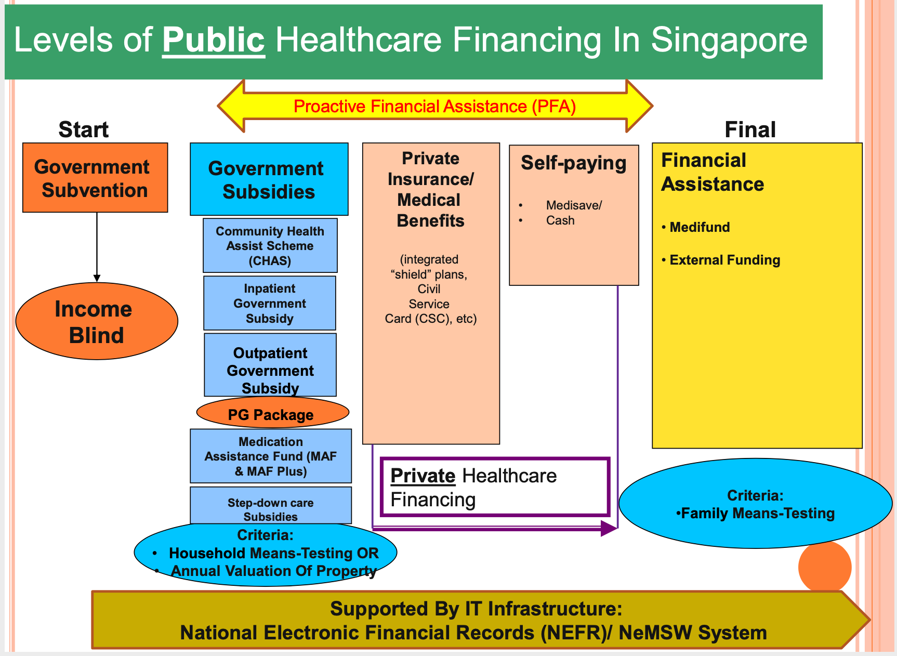
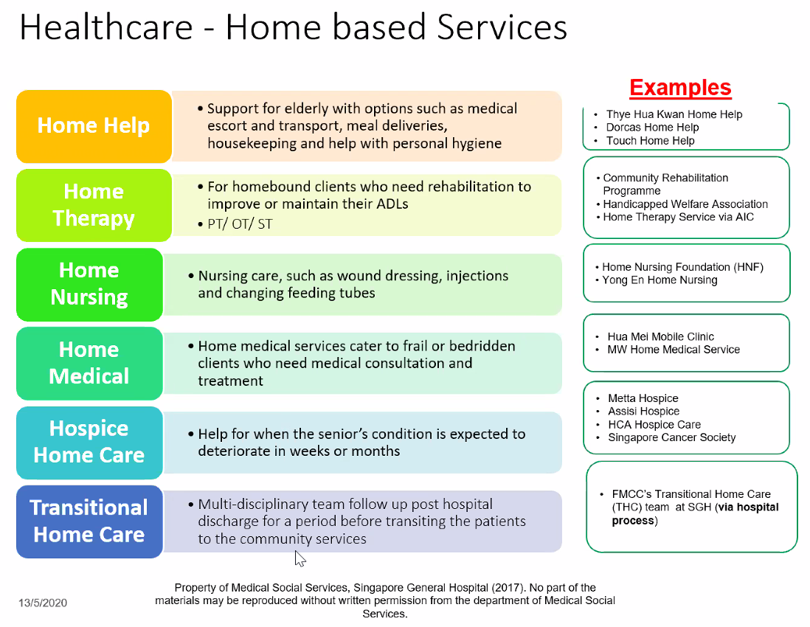
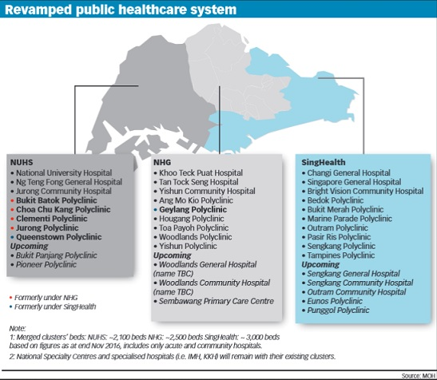

Healthcare System
=================
[[TOC]]

Models of Care
--------------

There are different levels of collaboration

-   Multidisciplinary - professionals work autonomously with little interaction)
-   Interdisciplinary - professionals interact with one another to provide services but maintain clear professional boundaries dictated by terminology and interventive preferences
-   Transdisciplinary - close collaboration among the professionals, including sharing a common language, and approach to programming and intervention planning

Medical Error and System Improvement
------------------------------------

In the United States, there about 100,000 medical error-induced death per year. For every person who dies, 5-10 suffers a non-fatal medical error. Every 15-20 minutes, 5-7 patients will die due to medical error and around 100 will be injuried. As many as 88 out of every 1000 suffer injury or illness as a consequence of treatment. As healthcare professionals, we need to strive to ensure that the quality of our services matches our knowledge and aspirations.

### Continuous Process Improvement

This is the key concept of Toyota production system, which is to perform small, quick experiments to uncover and solve problems as they occur. This tightly couples the process of doing work with the process of learning to do it better (couple execution with improvement). The original Toyota production system idea consists of four things

-   Study of the way in which people work
-   Study of how people interact
-   Study of how is the production line constricted
-   Study of how people learn to improve

When applied to healthcare, the Steven J. Spear suggests, in \"Fixing Healthcare from the Inside, Today\" that we should strive to

-   Eradicate ambiguities
-   Score big gains through small changes
-   Conduct simulations
-   Institutionalize change - leaders need to embrace and embody TPS in their own work

Medical Social Work - SGH
-------------------------

Surprises

-   No central number or website to reach the MSW

### Who are MSWs?
-   MSWs are trained as social worker
-   This means one need to go to SUSS diploma, or bachelor's in social workers
-   Medical social works is a paid job, not volunteers, it is a professional
-   Medical knowledge of MSWs are obtained on the job, therefore MSWs are organized into medical specialities, so as to have a better understanding of the needs of patients with particular diseases.
-   Each large hospitals have about 60 - 80 social workers; in SGH, where there is the largest group of social worksers, the total is around 80.

### How to engage MSWs

-   There is at least one MSW for each clinical specialty, we can get in touch with MSW
-   No officially trained medical translator in Singapore hospitals
-   Computer based referral system, normally the nurses;
-   On-call MSW helps to manage distressed family members during trauma, accident, autopsy.

### Additional Issues 

-   Do not self-disclosure; nearing one patient is alienating another one

### What do MSWs do?

They attend to patients and their families who have difficulties coping with emotional, psychological, social, and care problems arising from medical issues. Specific services include:

#### Discharge care and planning

-   Early identification and asessment of patient's needs
-   Coordinate discharge for patients and family
-   Collaborate with healthcare team and community resources
-   Plan and Set Goals with patient and family
-   Implement timely discharge plans to ensure continuity of care
-   Evaluate the process and outcome
-   Ensure efficient use of hospital and community resources

Differentiating the roles of different team members in multidisciplinary care:

-   **Doctors**
    -   Medical management plan, medical updates, whether patient is medically fit/ unfit for discharge, any tentative discharge dates
    -   Convey patient/ family's concerns to medical team and encourage medical team to communicate their assessment to patients/ family
    -   Provide psychosocial assessment inputs to facilitate appropriate care and treatment plans for patient

-   **Nurses** (Ward Staff Nurse and Patient Navigators)
    -   Find out about patient's behaviours, wound situation, toileting needs, nursing procedures (e.g. feeding, any diet restriction, etc)
    -   Co-creation of care plans and follow-up plans with patients and patient navigator.
    -   Co-management of patient's care with PN
    -   Referral to community services

-   **Therapist** (PT, OT, ST)

When considering discharging a patient, think from three angles as above.

#### Counselling and therapy

-   Therapy is a chargable service!

-   Can provide family / martial therapy

-   Can provide counselling for illness coping, bereavement, family relationship issues, eating disorders etc.

#### Financial assistance

Philisophy

- Non-welfarism
- Individual and family's responsibility
- Yet, interventionistic in nature
  - Private inpatient = private outpatient
  - PG is pioneer generation

{#fig:health-finance-sg width="80%"}

**Criteria**

- Government subsidies
  - Household means test: only family members living within the same household
  - Annual valuation of property: for retirees or unemployed
- Financial assistance
  - Family means test - looks at the income of immediate family members and those living in the same household
  - Treatment-related costs
  - Other financial resources

**3 M Healthcare Funding**

1. Medisave (55k is the cap)
2. Medishield Life
   - Paid for using CPF account holder's Medisave or that an immediate family members
   - If Medisave balance is inadequate or depleted, Medishield Life coverage will lapse and then cease if no payment is made towards it.
3. Medifund: for needy Singapore citizens
   - Covers basic medical treatment
     - Consultations
     - Investigative procedures
     - Medications  e.g. SD, NSD, NFD
     - Approved retail items e.g. DM and TPN consumables
   - Does not cover
     - Cosmetic
     - Delivery
   - Based on family income
   - The option for one-year assistance is effective since 2017
   - Means-tested; sliding scale of assistance
   - Not-straightforward cases: justified help for cases that do not meet the income eligibility criteria
   - Hospital Medifund Committee (quarterly meetings)
     - MOH provides each institution an annual MF budget

**Fundings available from MSW**

- Medifund endorment fund - medication, labs, counsultation

- Hospital remission for needy Singapore permanent residents

  -   Not available in all institutions

- Institution-based charity funds

  -   for medical treatment not covered by Medifund, medical supplies, assistive devices, transport etc. 

- Medications assistance fund

  -   Drug list approved by MOH
  -   To help needy patients who face difficulty affording selected NSDs for specific medical conditions

- Medications assistance fund plus

  -   Drug list is based on RHI's discretion
  -   NSD considered by doctors to be necessary for patients
      -   With a documented history of non-response or serious side effects to options in the SDL or MAF list
      -   Where there are no other drug alternatives

- Equipment, transport, or things that Medifund and medications assistant fund does not cover, will be covered by charity funds.

- Community resources

- Home-based

  - Interim caregiver service (ICS)

    This service is to bridge the gap between the period post discharge till a long term care plan is in place (i.e. waiting for a domestic helper to arrive). The ICS period is usually for 2 weeks. If extension if required, MSW will need to appeal to AIC for ICS plus. The period of extension is maximum 3 months.

  -   Meals on wheels

  -   Medical escort service

  -   Home nursing foundation - for wound dressing, medication packing

  -   Housekeeping - to help with simple household chores like mopping the floor

  -   Home personal care - to assist patients with their ADLs, medication, mind stimulating activities, elder-sitting and other care tasks. The service is charged on an hourly basis

  -   Cluster support - usually referred for community case management, especially for more complex cases which will benefit from more frequent follow-ups e.g. NTUC cluster support

  -   Community nurse referral

-   Center-bsaed

    -   Day rehab and or day care center
    -   dementia day care
    -   hospice day care
    -   respite care at senior care centers - family members can apply directly

-   Institution based

    -   Community hospital
    -   Inpatient services

Other issues

-   Foreign workers tend to have less help
-   Employers and embassies may be able to help

**What types of people fall through the crack?**

- Lower middle and middle middle income

#### Suicide Assessment and intervention

-   These patients are supported by a dedicated team of MSWs who are competent in Applied Suicide Skills & Intervention Training (ASIST) of LivingWorks (Calgary, Canada) Suicide.

-   Apart from the attempted suicide cases, we also assess patients with suicide ideation.

-   This is mainly in the outpatient setting.

#### Interpersonal violence intervention

-   A team of specialised MSWs provide risk assessment, safety planning and emotional support for victims of family violence, including domestic violence, child abuse and elder abuse.

-   Our MSWs also care for victims of sexual assault--- empowering them through empathy and supportive services--- with the aim of transforming sexual assault victims to sexual assault survivors

#### Grief and bereavement support

-   We provide grief and bereavement support to families whose loved ones died of sudden or traumatic deaths.

#### Psychological trauma support

-   Patients admitted for burns, road traffic accidents and other traumatic injuries are exposed to psychological trauma.

-   ICU on-call MSWs attend such crises outside of office hours.

-   Provides psychological first aid to people affected by critical incidents or national disaster situations.

#### Advance care planning and facilitation

-   "Living Matters" is a national advance care planning (ACP) initiative that promotes open conversations amongst patients, their families and their healthcare providers, about patients' future care preferences.

-   There is also a renal-specific problem.

-   Advance care planning describes what kind of care the patient would want or not want if he or she is to become very sick and is unable to make decisions in the future.

-   It involves 4 parts:

    -   **Sharing** your personal values and beliefs

    -   **Exploring** what you might or might not want in a certain medical situation

    -   **Choosing** someone to voice your wishes if you can no longer do so in the future

    -   **Writing** down your wishes and sharing your plan

    Takes the stress and guilt away from your family member.

#### Living donor organ transport assessment

-   One 1 liver transplant social work

-   Transdisciplinary approach is preferred

-   MSW does the psychosocial evaluation, there could be multiple issues such as

    -   Willingness to accept donation from a kin

    -   Willingness to donate to a kin

    -   Sell organs?!

#### Home visits

-   As part of post-discharge care services, we conduct home visits to establish patients' coping capacity in their home environment, linking them with other community resources where necessary.

-   Home visits also allow us to gain a better understanding of patients' family dynamics and financial situation, hence facilitating us in our case assessment and intervention.

#### Support groups

-   As part of increasing their coping capacity, MSWs facilitate support groups, where patients can share their concerns in a supportive environment.

-   Some of these groups include those for patients with human immunodeficiency virus (HIV), and caregivers of patients with traumatic brain injury.

#### Staff counseling

-   Our department is the first among public hospitals to offer peer support and staff counselling for hospital employees who may be affected by personal, family and workplace problems.

-   Employees requesting such services are either self-referred or referred by their colleagues or supervisors.

-   Like in all counselling contexts, employees' counselling information is kept confidential.

-   SAFE Assess line: 88793342

#### Teaching

-   Social Work undergraduate interns from National University of Singapore (NUS) and SIM University (UniSIM) are among some students we train. Some of our MSWs are also faculty at NUS and SUSS.

-   We conduct counselling and social work-related training for healthcare and social work professionals, as well as corporate clients.

#### Research: Topics include

-   Health services research

-   Clinical intervention and evaluation

-   Healthcare financing

-   Social Work administration and leadership

### Questions

-   Support groups - where can I find a comprehensive list of the support groups? Do patients may to attend the support groups? Who ensures that a patient really in need of support group actually goes to one? How to form a new support group?

-   Staff Counselling - what is the utilization rate of the services? Can you provide some examples of the things you can for staff members facing workplace, personal, and family problems beside moral support (which is important)?

-   Patient Navigators - are these part of the MSW team? What's the role of MSW in the multidisciplinary team care? Who in the team is ultimately responsible for having oversight of the patient?

-   MSW does early identification and assessment of patient's needs in discharge care and planning, how is this communicated with the medical team? Do MSW round with the clinical team?

-   Any special support for primary care-giver of a child or elderly who becomes ill?

-   Is Singapore's healthcare a fee for service model? or accountable care model?

-   Do every school in Singapore have a school nurse?

Healthcare Clusters and Culture in Singapore 
--------------------------------------------

There are now three integrated clusters of healthcare groups in Singapore. Each cluster will have the full suite of healthcare services, from primary care to general hospitals and community hospitals; each will also have a medical school. The Health Minister in Singapore is Gan Kim Yong.

{width="75%"}

\
Other important people

-   Ms Diana Chia, general secretary of the Healthcare Services Employees' Union (HSEU)

### Central: National Healthcare Group (NHG) 

CEO: Philip Choo\
Specialist Centers

-   National Skin Center

-   Institute of Mental Health

### Eastern: SingHealth

CEO: Ivy Ng\
Specialist Centers

-   National Cancer Centre Singapore

-   KK Women's and Children's Hospital

### Western NUHS 

CEO: John Wong Eu Li\
National University Polyclinics (CEO: Lew Yii Jen)

Healthcare system and resources in Singapore
--------------------------------------------

This section considers how patients interact with the healthcare system in Singapore.

### Primary Care Settings 

### Tertiary Hospitals

### Community Hospital
