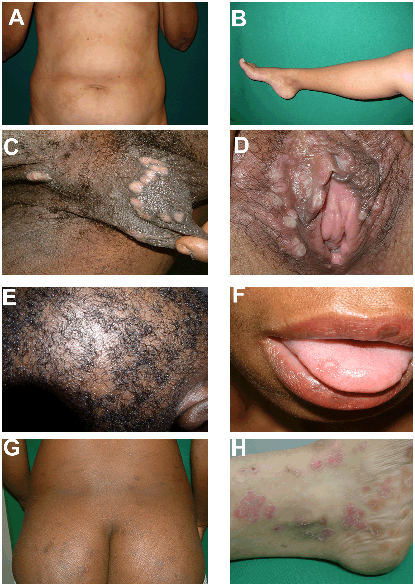

Infectious Diseases
===================

[[TOC]]

General ID Knowledge and Conditions
-------------------

| Word   | Definition                                                   |
| ------ | ------------------------------------------------------------ |
| Fomite | A fomite or fomes is any inanimate object that, when contaminated with or exposed to infectious agents, can transfer disease to a new host. |

### Infection Control Measures

#### MDRO Prevention Program - At SGH

- Prompt identification and notification
  - Active surveillance for MRSA, VRE and CP-CRE (carbapenemase producing carbapenem-resistant enterobacteriaceae)
  - System of tagging in Citrix
  - Screen contacts of CP-CRE
- Patient isolation (follow criteria) and Contact Precautions
- Hand hygiene
- Antiseptic baths for all
- Environmental hygiene including alcohol toilet seat cleaners
- Decolonization regime in all MRSA carriers

#### Criteria for Patient Isolation (with limited isolation rooms)

- CP-CRE (ALL)
- Suspected and known TB patients till rendered non-infectious after 2 weeks of effective therapy
- VZV (chicken pox and herpes zoster)
- VRE patients with diarrhea, VRE patients requiring HD and ICA care
- MRSA patients who are respiratory dispersers or whose wounds cannot be covered
- C difficile till no more diarrhea for at least 48 hours
- Symptomatic Influenza patients of Haematology, Oncology departments and those on other transplant programs (single room in their own ward as 1st line)

#### Preventing CLABSI

- Daily review of line necessity with prompt removal of unnecessary lines
- Optimal catheter site selection: if possible subclavian and avoid femoral vein
- Hand hygiene
- Maximal barrier precautions
- Chlorhexidine skin antisepsis
  - Chlorhexidine 2% in 70% IPA
  - Apply using back and forth friction scrub for at least 30 seconds
  - Allow antiseptic solution time to dry completely before puncturing the site
  - Do not wipe or blot

#### Preventing CAUTI

- Review catheter necessity daily and remove promptly - use Houdini
- Insert using aseptic technique
  - Ensure only trained personnel performs the catheterization
  - Choose appropriate catheter size
  - Choose appropriate antiseptic solution (CHG 0.05%)
  - Single-use lubrication jelly for insertion
- Maintain catheter based on recommended guidelines
- Avoid unnecessary urinary catheters
  - Leave catheter in place only for as long as necessary
  - Avoid changing indwelling catheters or drainage bag at routine or fixed intervals except in presence of infection such as blood streaks and cloudy urine including obstruction and when there is break in the closed drainage system is suspected.

## Sepsis

### Septic Shock

## Infections with Immunization

### Bacterial

#### Haemophilus Influenzae Type b (Hib) 乙型流感嗜血杆菌

#### Tetanus 破伤风

#### Typhoid fever 伤寒

#### Typhus 班疹伤寒

### Viral

#### Influenza and Flu 流行性感冒(流感)

#### Poliomyelitis 脊髓灰质炎

#### Smallpox 天花

#### Measles 麻疹

#### Mumps 腮腺炎

#### Rubella 风疹 

#### Pertussis 百日咳

#### Hepatitis B, B 型肝炎

#### COVID19

**Presentation**

- Palpitation

  

  - Rule out PE with wells score + D-dimer

- 

- 

- Comments
- This is determined by the medication available to the migrant workers; 

Mental Health and COVID

- 
- 
- 
- 
- 
- 
- 

- 
- 
- 

#### Skin Bugs and Diseases

### Methicillin-Resistant Staphylococcus Aureus (MRSA) 抗药性金黃葡萄球菌

## Respiratory Infectious Disease

### Tuberculosis 肺结核 / 肺痨病

Caution

- **Biologics** should be used in caution in patients with tuberculosis as they can reactivate latent TB.

### Pneumococcal 肺炎球菌

## GI Infectious Disease

### Dysentery 痢疾

### Cholera 霍乱

### Vancomycin-Resistant Enterococci (VRE) 抗万古霉素腸球菌

### Norovirus (Stomach Flu) 諾沃克病毒(肠胃感冒)

Systemic Infectious Diseases
----------------------------

### Meningococcus 脑膜炎球菌

#### Meningococcoal meningitis

This is a highly contagious disease that can lead to devastating complications and outbreaks in the community. Treatment involves isolation, intravenous antibiotics, and supportive care in an intensive care setting to monitor disease progression. 

**Management**

Three therapies:

- IV ceftriaxone 2g (12 hourly)
- IV vancomycin loading dose 20 mg/kg followed by 15 mg/kg (12 hourly), 
- IV dexmethasone 0.15 mg/kg  every 6 hours for 4 days.

Patient should be placed in an isolation room with **droplet precautions** until all his contacts receive prophylaxis. All other exposed close contacts (including medical staff) will need **chemoprophylaxis** (eg, rifampin, ciprofloxacin). 

#### Waterhouse-Friderichsen Syndrome

Complication of meningococcemia involving adrenal gland destruction, disseminated intravascular coagulation and shock.

Meningococcal LOS differ from enteric LPS because it lacks repeating O-antigen of LPS; the outer membrane LOS (lipooligosaccharide) &rarr; Toll like receptor 4 &rarr; TNF-&alpha;, IL-6 and IL-8

Regional Infectious Diseases
----------------------------

### Dengue Fever

### Malaria

### Lymes Diease

Caused by Borrelia burgdorferi.

Typically presents with acute monoarticular joint pain.

More likely to occur during the summer in endemic areas, such as the northeastern region of the United States.

Usually a history of possible exposure to a tick bite.

Typically a history of a rash, this does not rule out the possibility of Lyme disease, as some patients with Lyme disease do not develop or notice a rash.

### Japanese Encephalitis 日本脑炎

### Yellow Fever 黄热病

### Typhoid 班疹伤寒

### West Nile Virus 西尼罗病毒

## Pandemic Infections

### SARS (Severe Acute Respiratory Syndrome) 非典型肺炎

### Pandemic Influenza  流感大流行

## Nosocomial Infections

## Childhood Infections

Sexually Transmitted Diseases
-----------------------------
### General Information

#### Cervical Discharge Microscopy

Microorganism | Feature
|---|---
N Gonorrhoeae | Diplocci on endocervical smear, low sensitivity (especially in asymptomatic patients)
Bacterial Vaginosis | Clue cells
Spirochete | Dark-field microscopy
Tichomonads | Flagellated protozoans

### STI Frameworks

#### GENITAL DISCHARGE IN A MALE
1. Non-gonococcal urethritis (NGU)
2. Gonorrhoea

#### GENITAL DISCHARGE IN A FEMALE
1. Physiological
2. Candidal vulvo-vaginitis
3. Chlamydia cervicitis
4. Gonococcal cervicitis
5. Trichomoniasis Bacterial vaginosis
Herpetic cervicitis
6. Mucopurulent cervicitis (MPC)

### Trichomonas

**Presentation**
- Vaginal discharge with odor or itching
- OR Asymptomatic (picked up during screening in high risk patients)

Diagnosis is made by saline wet mount; rapid antigen testing, or Trichomonas culture. 

Management
- Surveillance
  - HIV screening is recommended for patients in all health-care settings after the patient is notified that testing will be performed unless the patient declines (opt-out screening). Separate written consent for HIV testing should not be required; general consent for medical care should be considered sufficient to encompass consent for HIV testing.

### Chlamydia 衣原体属

**Presentation**

Dysuria, discharge (penile or vaginal), pain with sex, abdominal or testicular pain, breakthrough bleeding or can be asymptomatic. 

**Diagnosis** 

Nucleic acid amplification test of urine, endocervical sample, or urethral sample. 

### Gonorrhea 淋病

The causative organism is Neisseria gonorrhoea – the gonococcus. The preferred sites of infection are the columnar and transitional epithelia. The common sites of infection include the urethra, the endocervix, the rectum, the pharynx and the conjunctiva. Classically gonorrhoea affects the male urethra and the endocervical canal and urethra in women.
Man is the only reservoir and sexual contact is the commonest and the most important mode of transmission. However, during birth the conjunctiva of the newborn may be infected by contamination with the infected genital secretions of the mother during passage through the birth canal.
Non-sexual modes of transmission are uncommon. Gonococcal vulvo-vaginitis in children occurs from contaminated towels, bed sheets or more likely direct genital contact from infected adults.
Adult gonococcal conjunctivitis is usually acquired from fingers contaminated with gonococcal genital secretions.
Incubation period is 3 to 5 days (up to 2 weeks).

**Presentation**
Patients with gonorrhea can be either asymptomatic, or have dysuria, discharge (penile or vaginal), pain with sex, abdominal or testicular pain, or breakthrough bleeding. 

**Clinical Features**
- Male presents with urethritis
  - dysuria, no frequency
  - purulent urethral discharge
  - asymptomatic in 10%
  - no constitutional symptoms usually
  - meatitis
  - enlarged inguinal lymph nodes
- Female 
  - Cervicitis: no symptoms in 60% patients, vaginal discharge in the rest
  - Urethritis: dysuria
  - Endometritis: irregular bleeding, lower abdominal discomfort, mucopurulent discharge
- Both Sexes
  - Oropharyngeal: asymptomatic usually
  - Rectal:  may present as tenesmus and purulent discharge - examination may show proctitis

**Complications**
1. Acute epididymitis. Epididymo-orchitis
2. Prostatitis
3. Tysonitis
4. Urethral stricture – late complications
5. Acute salpingitis. Pelvic inflammatory disease. Tubo-ovarian mass
6. Chronic salpingitis. Tubal infertility. Ectopic pregnancy
7. Peri-hepatitis (Fitz Hugh Curtis Syndrome)
8. Bartholinitis, Bartholin’s abscess
9. Conjunctivitis in adults
10. Opthalmia neonatorum
11. Vulvo-vaginitis in children
12. Disseminated gonococcal infection (DGI)

**Diagnosis**
- Nucleic acid amplification test of urine, endocervical sample, or urethral sample; 
- Gonococcal culture for rectal or pharyngeal specimens. 

DIAGNOSIS OF GONORRHOEA
1. Gram-stained smear on specimen from : Male: urethral exudates
Female: urethral, endocervical canal (Not HVS) exudates
Microscopic identification of typical Gram-negative intra and extracellular diplococci
Presumptive diagnosis of gonorrhoea is easily made on the urethral Gram- stained smear from males as this test is sensitive in males. The test is less useful in women where repeat cultures may be necessary to detect infection.
2. Culture performed on exudates from urethra, endocervical canal, pharynx and rectum.
By direct plating on a modified Thayer Martin medium. Identification by typical colony morphology, positive oxidase reaction and typical Gram-stained morphology
Definitive diagnosis confirmed by sugar utilization test and/or fluorescent (FA) testing
Serology: Complement Fixation Test (GCCFT) is useless for diagnosis
3. Polymerase chain reaction (PCR)
A combined PCR test kit is available to detect Neisseria gonorrhoeae, in addition to Chlamydia trachomatis.
The specimens suitable for PCR are:
Use first void urine (FVU). Urethral swab may be used as an alternative, and is as sensitive.
Females: endocervical swab

**Management**
- Uncomplicated infection in adults – urethral, endocervical and rectal. Recommended Regimens include:
  1. Ceftriaxone 500 mg I/M single injection
  2. Cefixime 400 mg orally single dose

  Alternative Regimens:
  1. Cefotaxime 1g I/M single injection
  2. Aztreonam 1g I/M single injection

  The fluroquinolones (e.g. ciprofloxacin, ofloxacin, norfloxacin) are contraindicated as 50% of isolates in Singapore and the region are resistant.

- Together with antichlamydial therapy
  
    All patients should also receive concomitant antichlamydial therapy such as PO doxycycline 100mg bd or azithromycin 1g stat.
- Follow up
  - Follow-up test of cure cultures are obtained from infected sites 14 days after treatment.
  - Assessment for post-gonococcal urethritis or cervicitis is done on the 14th day.
  - All patients should be offered serological tests for syphilis and HIV after 3 months.
  - All sex partners should be traced, examined and treated where necessary.

- ANTIMICROBIAL RESISTANCE IN GONORRHOEA
  - Penicillinase-Producing Neisseria Gonorrhoea (PPNG)
    - Early in 1976 strains of gonococci that acquired the ability to produce penicillinase (beta-lactamase) were isolated. This is a plasmid-mediated (extra chromosomal DNA) penicillinase production. The penicillinase renders penicillin group of antibodies ineffective by breaking up to the beta-lactam ring. PPNG stains show absolute resistance to penicillin.
    - In Singapore today over 50% of all gonococcal isolates are PPNG.
  - Chromosomally Mediated Resistant Neisseria Gonorrhoea (CMRNG)
    - Over the last three decades the gonococcus has become progressively less sensitive or partially resistant to penicillin. Besides PPNG, this partial resistance to penicillin is associated with resistance to several other antibiotics. This includes resistance to chloramphenicol, erythromycin, tetracycline, co- trimoxazole, streptomycin and spectinomycin.
    - In CMRNG there is chromosomally mediated alteration of the cell wall permeability, alteration of penicillin binding proteins in the cell wall and alterations in the ribosomes.
    - Generally, the Far East and South East Asian strains have a high level of CMRNG. As a result the following drugs are not recommended for use in gonococcal infections in Singapore – tetracycline, doxycycline, minocycline, erythromycin, penicillin, cloxacillin, ampicillin, cotrimoxazole, and kanamycin.

#### Disseminated Gonococcus
Majority (80-90%) of patients are women usually in 16 to 35 year old age group. Onset of bacteraemia often occurs during the first week of the menstrual cycle, second half of pregnancy and just after delivery.

**Clinical Features**
Vesiculopustular rash, tenosynovitis, and migratory polyarthralgias. Most patients are febrile, and the skin lesions are predominantly found on the distal extremities and usually last only a few days. 
- Arthritis: Multiple asymmetrical peripheral arthritis. Most common joints involved include the knees, ankles, wrists, small joints of hands and feet. Tenosynovitis may be prominent.
- Skin Lesions: Petechial, haemorrhagic papules or pustules occur in crops numbering from 5 to 20. Characteristically distributed peripherally on arms and legs.
- Fever: Low grade. Intermittent.
- Other Organs: Endocarditis, pericarditis, meningitis.

#### GONOCOCCAL OPHTHALMIA NEONATORUM
Acute conjunctivitis occurring within the first 3 weeks of life from contact with infected birth canal during childbirth. The mother is usually asymptomatic.

**Clinical Features**
- Redness and swelling of eyelids associated with purulent discharge. 
- Corneal perforation, ulceration and blindness may occur if not treated promptly.
- Incubation period between 1 to 5 days.

**Differentials**
- chlamydial ophthalmia (mother has chlamydial genital infection)
- pyogenic (staph aureus) infection
- chemical conjunctivitis

### Syphilis 梅毒

#### Secondary Syphilis
Secondary syphilis is characterized by a rash that appears from 2 to 8 weeks after the chancre develops and sometimes before it heals, a flulike syndrome, and generalized adenopathy.

Condyloma lata are a manifestation of secondary syphilis characterized by flattened pink or gray velvety papules.  These are seen most commonly at the mucous membranes and moist skin of the genital organs, perineum, and mouth.

### Herpes Zoster 带状泡疹

### Chancroid

### Genital Warts

### HIV 人类免疫力缺乏症病毒 and AIDS 艾滋病
Persons at high risk for HIV infection should be screened for HIV at least annually. 

#### Major or minor neurocognitive disorder due to HIV infection

Insects 
-------

### Lice 头虱

### Tick Diseases

#### Lyme Disease

**Clinical Features**
- The initial rash, erythema migrans, is classically a target lesion with central clearing (not ulceration) at the site of tick bite.  The tick must remain attached for ~48 hours before transmission occurs.
- Arthritis, arrhythmias, and facial palsy can occur as late complications of Lyme disease; these typically do not develop until months after the tick bite.  

### Spider Bites

#### Brown Recluse Spider Bite
Brown recluse spider bites can cause a deep necrotic ulcer at the bite site.  The ulcer can progress over days to an eschar.

**Clinical Feature and Diagnosis**
- A small ulcer developing at the site of a recent bite, is highly suggestive of a brown recluse spider bite.  
- Such bites commonly occur as patients are putting their clothes on, although they often go unrecognized initially
- Over the course of a few days, a deep skin ulcer develops at the site of bite with an erythematous halo and a necrotic center, which can progress to an eschar.

**Management**
- With basic wound management, the lesion often heals without scarring.  
- Debridement should be avoided in the early stages of necrosis but may facilitate healing once the lesion is stable and well-demarcated; 
- Severe cases may require skin grafting.

#### Black Widow Spider Bites
Black widow spider bites often lead to more pronounced local and systemic manifestations due to effects of the toxin.  

**Clinical Feature**
Local and systemic manifestation of black widow spider bite include 
- muscle pain (a prominent finding)
- abdominal rigidity (sometimes mimicking a surgical abdomen)
- and muscle cramps (seen in >60% of patients).  
- Wound ulceration is uncommon
- Patients commonly develop nausea and vomiting within hours of the bite.

### Snake Bites

Hemoglobinuria, bleeding, and muscle paralysis may be seen with snakebites, which would cause severe local pain, swelling, and discoloration within hours of the bite.

### Rabies 狂犬病

