# Investigations

- ECMO efficacy is dependent on workflow of centres more than the technology and other things
- Survival radiology
  - Started by lai lok chen
- Kee Tze Phei - neuroradiology and neurointerventionist

## Monitoring

### Vitals

#### Non-invasive Blood Pressure

#### Postural Blood Pressure

#### Body Temperature

#### Oxygen Saturation

### ECG

- Based on ECG Made Easy
- In SGH every patient presenting with chest pain need to have a ECG within 10 minutes. 
  - Once a ECG is done, it will be shown to a senior doctor in the department

#### How to put on ECG

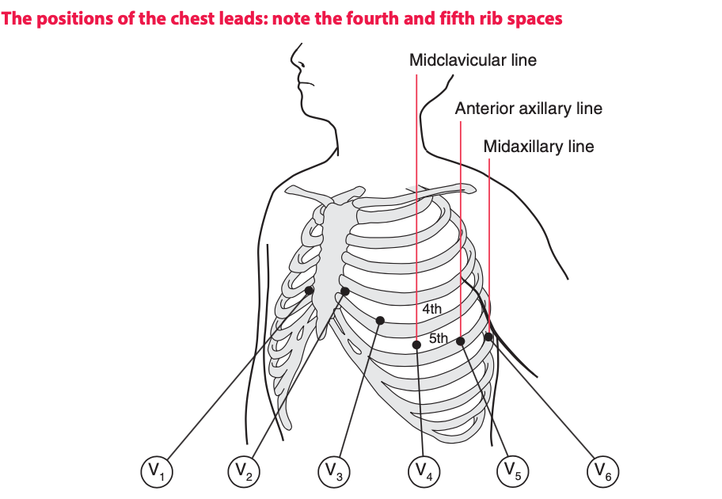

- Clean skin with alcohol; then wipe off the alcohol
- Rub skin with a paper towel to introduce mild abrasion
- Identify the second rib interspace by feeling for the sternal angle – this is the point where the manubrium and the body of the sternum meet, and there is usually a palpable ridge where the body of the sternum begins, angling downwards in comparison to the manubrium. The second rib is attached to the sternum at the angle, and the second rib space is just below this. Having identified the second space, feel downwards for the third and then the **fourth rib spaces**, over which the electrodes for **V1 and V2** are attached, to the right and left of the sternum, respectively
- The other electrodes are then placed as shown in Figure with V4 in the midclavicular line of the 5th intercostal space (the imaginary vertical line starting from the midpoint of the clavicle); V5 in the anterior axillary line (the line starting from the fold of skin that marks the front of the armpit); and V6 in the midaxillary line.
- Get the patient comfortable and relaxed

#### How ECG Works

- The ECG results from electrical changes associated with activation (depolarization) first of the atria and then of the ventricles.
- When the depolarization wave spreads towards a lead, the deflection is predominantly upward. When the wave spreads away from a lead, the deflection is predominantly downward.
- The septum is normally depolarized from the left side to the right.
- In a normal heart the left ventricle exerts more influence on the ECG than the right ventricle.
- The first downward wave is called a Q, the first upward wave is called an R

#### How to Read ECG

1. Initial Preparation

   - Check patient name
   - Check the calibration signal: **1 mV** of signal causes a deflection of **1 cm** on the ECG paper

   - Check the paper speed: 25 mm/s &rarr; Small square is **40 ms**, and large square is 200 ms

2. Determine the **rate and rhythm**: 

   - The rhythm of the heart is best interpreted from whichever ECG lead shows the P wave most clearly. This is usually, but not always, **lead II** or **lead V1**. 
   - Estimate **rate**: 300/RR interval if rhythm is regular.

   - Is the rhythm **regular or irregular**? 

     - If irregular
       - Is there extrasystoles or escape beats? 
         - Extrasystoles arrive early, escape beats arrive late.
         - Does the next P wave after the extrasystole appear at an expected time?  The next P wave in supraventricular extrasystole usually comes late due to effect on SA node periodicity.
     - If regular
       - Is there **P** wave and **QRS**? i.e. look for fibrillation
       - Is there **one p wave for every QRS complex**? 
         - Yes: Atrial / sinus rhythm &rarr; differentiate using P wave morphology
         - No: junctional or ventricular rhythm &rarr;  differentiate using QRS and T
           - Is the QRS <120 ms (3 small squares)
           - Is the QRS complex the same shape throughout (i.e. has it the same initial direction of deflection as the normal beat, and has it the same duration)? Supraventricular beats look the same as each other; ventricular beats may look differe       dnt from each other.
           - Is the T wave the same way up as in the normal beat? In supraventricular beats, it is the same way up; in ventricular beats, it is inverted.

     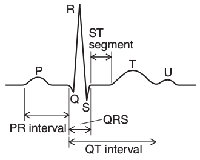

3. Check the **Cardiac Axis** using leads I and II

   - Look at I and II, both should be positive

   - If I negative, right axis deviation (I and II point towards): right ventricular hypertrophy e.g. PE

   - If I positive  and II negative, left axis deviation (I and II point away): left ventricular hypertrophy e.g. conduction defect

     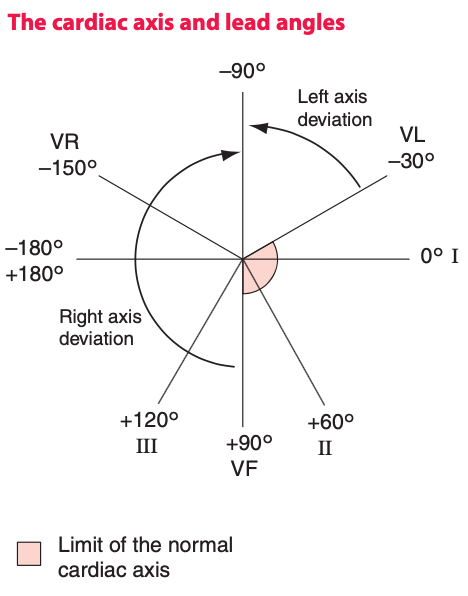

4. Look at the critical intervals

   - What is the duration of the PR interval ( normal is 140 - 220 ms or 3.5 -  5.5 small squares); 
   - QT interval <450 ms (11 small squares) 
     - May need to correct QT interval for heart rate.

5. Look closely at the **P-wave**

   - Does the P wave look normal? It can be normal, unusually tall, unusually broad to have multiple morphologies

6. Look closely at the **QRS complex**

   - Is it of normal duration? Does its morphology look normal?
   - The QRD complex can only have three abnormalities - it can be too broad, too tall, or may contain an abnormal Q wave.

7. Appearance of **ST segment** 

   - Is the ST segment raised or depressed?

8. Look closely at the **T waves**

   - Make sure it is upward (or down in the case of aVR)
   - draw a line from the tip to the base to see which side is steeper
     - Steep drop-off is more likely to be an acute MI

**Summary template**

" The patient is having a XXX rhythm, at X /min) , with normal cardiac axis, "

#### Conduction Patterns

- Think of conduction problems in the order in which the depolarization wave normally spreads: SA node &rarr; AV node &rarr; His bundle &rarr; bundle branches. So when we think about conduction problems, we think in three levels

  - Heart block
  - Bundle branch block
  - Fascicle or anterior division block

- There are three main types of **heart blocks**:

  - PR interval prolonged but beats are not dropped = 1st degree heart block

    - Often seen in normal people.
    - Think about acute myocardial infarction and acute rheumatic fever as possible causes.
    - No specific action needed.

  - Excitation intermittently fails to pass through the AV node or the bundle of His = 2nd degree heart block. There are three variants of second degree heart block

    | Variant                                      | Feature                                                      |
    | -------------------------------------------- | ------------------------------------------------------------ |
    | ‘Wenckebach’ or ‘Mobitz type 1’              | Progressive lengthening of the PR interval and then failure of conduction of an atrial beat, followed by a conducted beat with a shorter PR interval and then a repetition of this cycle. Usually benign. |
    | ‘Mobitz type 2’                              | Most beats are conducted with a constant PR interval, but occasionally there is atrial depolarization without a subsequent ventricular depolarization. May herald ‘complete,’ or ‘third degree’, heart block. |
    | ‘2:1’ (‘two to one’), ‘3:1’ (‘three to one’) | There may be alternate conducted and nonconducted atrial beats (or one conducted atrial beat and then two or three nonconducted beats), giving twice (or three or four times) as many P waves as QRS complexes. May herald ‘complete,’ or ‘third degree’, heart block.  May indicate a need for temporary or permanent pacing, especially if the ventricular rate is slow. |

    - Usually indicates heart disease; often seen in acute myocardial infarction.

  - Atrial contraction is normal but no beats are conducted to the ventricles = third degree heart block

    - When this occurs the ventricles are excited by a slow ‘escape mechanism’
    - Complete heart block may occur as an acute phenomenon in patients with myocardial infarction (when it is usually transient) or it may be chronic, usually due to fibrosis around the bundle of His. It may also be caused by the block of both bundle branches.
    - Always indicates conducting tissue disease – more often fibrosis than ischaemic.
    - Consider a temporary or permanent pacemaker.

- **Bundle Branch Blocks**

  If the depolarization wave reaches the interventricular septum normally, the interval between the beginning of the P wave and the first deflection in the QRS complex (the PR interval) will be normal. However, if there is abnormal conduction through either the right or left bundle branches (‘bundle branch block’) there will be a delay in the depolarization of part of the ventricular muscle. The extra time taken for depolarization of the whole of the ventricular muscle causes **widening of the QRS complex** (>3 small squares or 120 ms).

  - Ddx: widening also occurs when depolarization occurs within the ventricle muscle itself

  The different possible combinations of bundle branch blocks are:

  | Blockage                      | ECG Pattern                                                  |
  | ----------------------------- | ------------------------------------------------------------ |
  | Block of both bundle branches | Same effect as block of the His bundle, and causes complete (third degree) heart block. |
  | RBBB                          | An **‘RSR’ pattern see in V1**, with a QRS complex of normal width (less than 120 ms); PLUS deep, wide S wave in lead V6;  Treat as a ***normal variant*** if there is no widening of QRS (common). Think about ***ASD*** if associated with widening of QRS; and think of ***pulmonary embolism*** if associated with other signs of RVH or RAH |
  | LBBB                          | **M pattern in V6** - abroad QRS complex with a notched top; May have a W pattern in V1 but is often not fully developed. Think about aortic stenosis and ischemic disease If patient is asymptomatic, no action is required  If patient has recent ly had severe chest pain, LBBB may indicate an acute myocardial infarction, and intervention should be considered |

- **Distal Left Bundle Branch Blocks**

  - The right bundle branch has no main divisions, but the left bundle branch has two – the anterior and posterior ‘fascicles’. The depolarization wave therefore spreads into the ventricles by three pathways
  - Blockage of the left anterior 

  | Blockage                                                     | Results                                                      |
  | ------------------------------------------------------------ | ------------------------------------------------------------ |
  | Block of left **anterior fascicle** or left anterior hemiblock | Left ventricle has to be depolarized through the posterior fascicle, and so the cardiac axis rotates upwards; resulting in left axis deviation; lead I positive, lead II negative. QRS complexes may be slightly wide but remain within normal limit. |
  | Bifascicular block (RBBB + left anterior fascicle block)     | ECG shows RBBB and left axis deviation; this ECG pattern obviously indicates widespread damage to the conducting system; No specific treatment is needed but pacemaker is required if the patient has symptoms suggestive of intermittent complete heart block. |

  - In general when there is left axis deviation, also consider left ventricular hypertrophy and its causes. 

#### Rhythms of the Heart

- Key to rhythm abnormalities are

  - P - wave - can I find them? Look for the lead in which they are most obvious
  - The relationship between P wave and QRS complexes
  - The width of the QRS complexes
  - Because an arrhythmia should be identified from the lead in which P waves can be seen most easily, full 12 lead ECGs are better than rhythm strips

- There are multiple ways to classify cardiac rhythms

  - By **location of origin**

    - **Sinus Rhythms**
    - **Atrial Rhythms**: Abnormal rhythms starting in the atrial muscle 
    - **Junctional Rhythms**: Abnormal rhythms starting at the region around the atrioventricular node
    - **Ventricular Rhythms**: Abnormal rhythms starting in the ventricular muscle

  - By **the node**

    - **Supraventricular rhythms**
      - Sinus rhythm, atrial rhythm and junctional rhythm together constitute the ‘supraventricular’ rhythms
      - the depolarization wave spreads to the ventricles in the normal way via the His bundle and its branches
      - The QRS complex is therefore normal, and is the same whether depolarization was initiated by the SA node, the atrial muscle, or the junctional region.
        - The only exception to this rule occurs when there is a **supraventricular rhythm with right or left bundle branch block**, or the **Wolff–Parkinson–White (WPW) syndrome**, when the QRS complex will be wide
    - **Ventricular rhythms**
      - the depolarization wave spreads through the ventricles by an abnormal and slower pathway, via the Purkinje fibres
      - The QRS complex is therefore wide and is abnormally shaped. 
      - Repolarization is also abnormal, so the T wave is also of abnormal shape.

  - By the **rate and number of beats**

    - **bradycardias** – slow and sustained
    - **tachycardias** – fast and sustained
    - **extrasystoles** – occur as early single beats
    - **fibrillation** – activation of the atria or ventricles is totally disorganized.

    This is the most useful way to organise the rhythms management wise.

- **Changes in heart rate associated with respiration** are normally seen in young people. This is because the rate of discharge of the SA node is influenced by the vagus nerves, and also by reflexes originating in the lungs.

**Bradycardias**

- Escape rhythms are not primary disorders, but are the response to problems higher in the conducting pathway. They are commonly seen in the acute phase of a heart attack, when they may be associated with sinus bradycardia. It is important not to try to suppress an escape rhythm, because without it the heart might stop altogether.
- Patients with any bradycardia that is affecting the circulation can be treated with **atropine**, but if this is ineffective they will need temporary or permanent pacing
- Various **heart blocks** result in bradycardia, see earlier section on Conduction patterns

| Arrhythmia         | ECG Features                                                 | Remarks                                                      |
| ------------------ | ------------------------------------------------------------ | ------------------------------------------------------------ |
| Sinus bradycardia  | Long RR interval but otherwise normal ECG                    | Associated with athletic training, fainting attacks, hypothermia or myxoedema, and is also often seen immediately after a heart attack. |
| Atrial escape      | Occasional **abnormal P wave** is followed by a normal QRS complex; Remaining beats show a return to sinus arrhythmia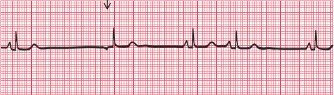 | If the rate of depolarization of the SA node slows down and a different focus in the atrium takes over control of the heart, the rhythm is described as ‘atrial escape’ |
| Junctional escape  | **No P waves** in junctional beats (indicates either no atrial contraction or P wave lost in QRS complex); Normal QRS complex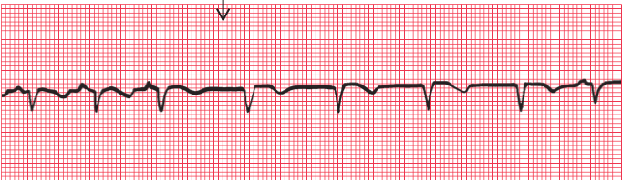 | Region around the AV node takes over as the focus of depolarization. |
| Ventricular escape | Transient abnormal QRS complexes; when no relationship between P waves and wide QRS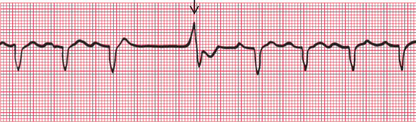 | Ventricular escape rhythms can occur without complete heart block, and ventricular escape beats can be single |

**Tachycardias**

- The first treatment for any abnormal tachycardia is carotid sinus pressure.
- Narrow complex tachycardias should be treated initially with **adenosine**.
- Wide complex tachycardias should be treated initially with **lidocaine**.
- In patients with acute heart failure or low blood pressure due to tachycardia, DC cardioversion should be considered early on.

| Arrhythmia                         | ECG Features                                                 | Remarks                                                      |
| ---------------------------------- | ------------------------------------------------------------ | ------------------------------------------------------------ |
| sinus tachycardia                  | Normal P waves, which may superimpose on T waves of preceding beat | Associated with exercise, fear, pain, haemorrhage or thyrotoxicosis. |
| Atrial tachycardia                 | abnormal P waves may superimpose on the T waves of the preceding beats (M shaped T)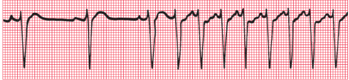 | Supra ventricular tachycardia with atrial depolarising faster than **150/min**; The AV node cannot conduct atrial rates of discharge greater than about 200/min. If the atrial rate is faster than this, ‘atrioventricular block’ occurs, with some P waves not followed by QRS complexes, but not due to conduction problem as in heart block. |
| Atrial Flutter                     | no flat baseline between the P waves; 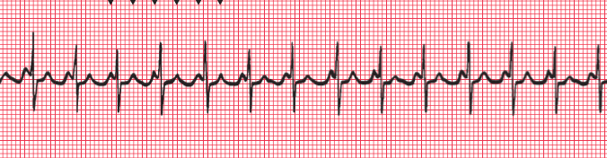 | Supraventricular tachycardia with atrial depolarising faster than **250/min**; A narrow complex tachycardia with a ventricular rate of about 125–150/min should always alert you to the possibility of atrial flutter with 2:1 block - look carefully to identify extra P wave, these can be differentiated from T waves of the preceding QRS by regularity. **Carotid sinus pressure** can increase the block between atria and the ventricles, to make atrial flutter appear more obvious. |
| Junctional Tachycardia             | P waves may be seen very close to the QRS complexes, or may not be seen at all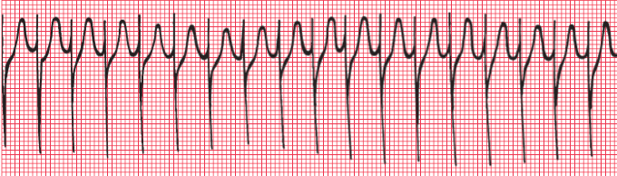 |                                                              |
| Ventricular Tachycardia            | QRS complex is wide and abnormal.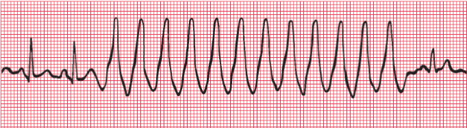 | Carotid sinus pressure has no effect since it acts of the AV node and the source of VT is below the AV node. |
| Accelerated idioventricular rhythm | Transient rhythm with no p-wave and wide QRS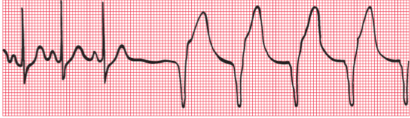 | The rhythm of the heart controlled by a ventricular focus with an intrinsic frequency of discharge faster than that seen in complete heart block. Often associated with AMI. Although appears similar to ventricular tachycardia, it should NOT be treated. VT should not be treated unless it is faster than 120/min |

**Extrasystoles**

- **extrasystole comes early** and an escape beat comes late.
- These rarely need treatment
- They have to be transient
- In both supraventricular and ventricular extrasystoles there is a (‘compensatory’) pause before the next heartbeat, but a supraventricular extrasystole usually upsets the normal periodicity of the SA node, so that the next SA node discharge (and P wave) comes late.

| Arrhythmia               | ECG Features                                                 | Remarks                                                      |
| ------------------------ | ------------------------------------------------------------ | ------------------------------------------------------------ |
| Atrial extrasystole      | Abnormally shaped P wave; normal QRS complex; P wave after missed P wave appears late |                                                              |
| Junctional extrasystole  | No P wave or P wave appears immediately before or after the QRS complex; normal QRS; P wave after missed P wave appears late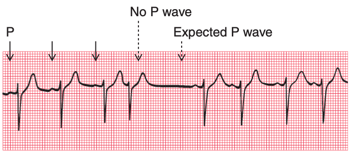 |                                                              |
| Ventricular extrasystole | Early beat with wide QRS complex and abnormal T wave; 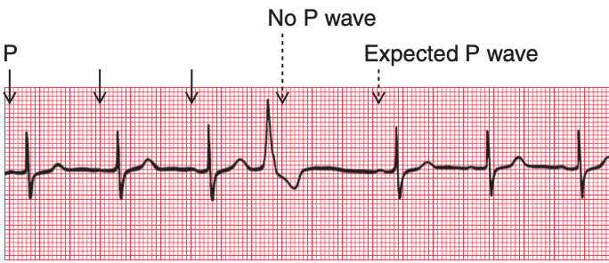 may also have 'R on T' phenomenon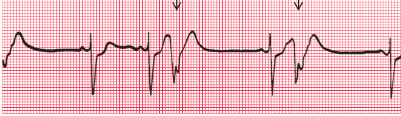 | Ventricular extrasystoles are common, and are usually of no importance. However, when they occur early in the T wave of a preceding beat they can induce ventricular fibrillation, and are thus potentially dangerous. |

**Fibrillations**

| Arrhythmia               | ECG Features                                                 | Remarks                                                      |
| ------------------------ | ------------------------------------------------------------ | ------------------------------------------------------------ |
| Atrial fibrillation      | No P waves, and an irregular baseline; Normally shaped QRS complexes; Irregular rhythm | When the atrial muscle fibres contract independently there are no P waves on the ECG, only an irregular line. The AV node is continuously bombarded with depolarization waves of varying strength, and depolarization spreads at irregular intervals down the His bundle. |
| Ventricular Fibrillation | no QRS complex can be identified, and the ECG is totally disorganized | When the ventricular muscle fibres contract independently,   |

**Wolff-Parkinson-White Syndrome**

- Accessory bundles form a direct connection between the atrium and the ventricle, usually on the left side of the heart, and in these bundles there is no AV node to delay conduction. A depolarization wave therefore reaches the ventricle early, and ‘pre-excitation’ occurs. The PR interval is short, and the QRS complex shows an **early slurred upstroke called a ‘delta wave’**.
- The second part of the QRS complex is normal, as conduction through the His bundle catches up with the pre-excitation.
- It can cause paroxysmal tachycardia: Depolarization can spread down the His bundle and back up the accessory pathway, and so reactivate the atrium before the SA nodes does. A ‘re-entry’ circuit is thus set up, and a sustained tachycardia occurs.

#### Abnormalities in Waves

**Abnormalities in P waves**

- P waves cannot always be seen in all leads, but if there is a total absence of P waves the rhythm is probably not sinus and may be sinus arrest, junctional escape or atrial fibrillation; or the patient may have hyperkalaemia.

| Feature                                            | Remarks                                                      |
| -------------------------------------------------- | ------------------------------------------------------------ |
| Tall (more than 1 small box in V1; >2.5 box in II) | **right atrial** hypertrophy (think tricuspid valve stenosis or pulmonary HTN)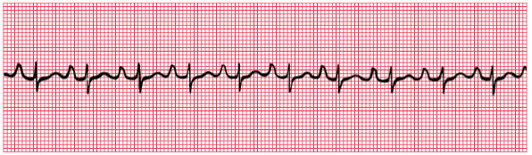 |
| Broad (>120 ms) AND bifid                          | **left atrial** hypertrophy (think mitral stenosis if there is NO LVH)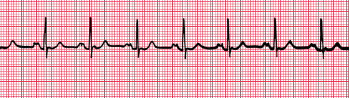 |

**Abnormalities in QRS Complex**

| Feature                                    | Remarks                                                      |
| ------------------------------------------ | ------------------------------------------------------------ |
| Deep (>1 mm), wide (>2 mm) Q waves         | Myocardial infarction;  Q waves that are less than 1 mm across and less than 2 mm deep are due to septal depolarization; and are normal. |
| Broad QRS complex >120ms (3 small squares) | Abnormal intraventricular conduction:  it is seen in bundle branch block, in complexes originating in the ventricular muscle, and in Wolff–Parkinson–White syndrome. |
| Upright QRS in V1 with deep S;             | Right ventricular hypertrophy, if associated with inverted T waves in lateral leads |
| Tall QRS &geq; 25 mm in V5 - V6            | left ventricular hypertrophy                                 |
| Small QRS                                  | Check the calibration of the ECG recorder. If this is correct, possible explanations of small QRS complexes are obesity, emphysema and pericardial effusion. |

- More on Q Waves
  - Small (septal) ‘Q’ waves in the left ventricular leads result from depolarization of the septum from left to right 
    - These features often disappear if the ECG is repeated with the subject taking and holding in a deep breath.
    - Can be normal even when associated with inverted T waves
  - Deep and wide Q wave indicate MI, and the leads in which the Q wave appears give some indication of the part of the heart that has been damaged.
    - The ventricles are depolarized from inside outwards
    - If a myocardial infarction causes complete death of muscle from the inside surface to the outside surface of the heart, an electrical ‘window’ is created, and an electrode looking at the heart over that window will record a cavity potential – that is, a Q wave.
    - The presence of a Q wave does not give any indication of the age of an infarction, because once a Q wave has developed it is usually permanent.
      - For acute infarction, the Q wave is associated with ST segment and T wave changes; for old infarcts these are NOT seen.

**Abnormalities in ST Segment**

- Compare the ST segment with the part between T wave and the next P wave

| Feature                     | Remarks                                                      |
| --------------------------- | ------------------------------------------------------------ |
| ST segment elevation        | Acute myocardial infarction due to either a recent MI or pericarditis; The leads in which the elevation occurs indicate the part of the heart that is damaged. In STEMI the damage is full thickness as opposed to NSTEMI. Pericarditis is usually a global affair, and causes ST elevation in most leads. |
| ST segment depression       | Horizontal depression of the ST segment, associated with an upright T wave, is usually a sign of ischaemia as opposed to infarction. When the ECG at rest is normal, ST segment depression may appear during exercise, particularly when effort induces angina |
| Downward-sloping ST segment | Usually due to treatment with digoxin                        |

**Abnormalities in T Wave**

| Feature                                                      | Remarks                                                      |
| ------------------------------------------------------------ | ------------------------------------------------------------ |
| T wave inversion                                             | normal when in leads III, VR, V1, and maybe V2 Otherwise, associated with bundle branch block (when occurring along with wide QRS complex, does not mean ischaemia), ischaemia, and ventricular hypertrophy. **digoxin**;  Leads adjacent to those showing inverted T waves sometimes show biphasic T waves; which are initially upright and then inverted T wave inversion following MI is also often permanent |
| T wave flattening or peaking with an unusually long or short QT interval | electrolyte abnormalities                                    |

**U waves**

- May be seen in normal people
- May also mean hypokalaemia when flat U waves follow flat T waves with a prolonged QT interval.
- Causes of prominent U: **>1-2mm or 25% of the height of the T wave.**
  - Prominent U waves most commonly found with:
    - Bradycardia
    - Severe hypokalaemia.
  - Prominent U waves may be present with:
    - Hypocalcaemia
    - Hypomagnesaemia
    - Hypothermia
    - Raised intracranial pressure
    - Left ventricular hypertrophy
    - Hypertrophic cardiomyopathy
  - Drugs associated with prominent U waves:
    - Digoxin
    - Phenothiazines (thioridazine)
    - Class Ia antiarrhythmics (quinidine, procainamide)
    - Class III antiarrhythmics (sotalol, amiodarone)

#### Disease Patterns to Note

| Condition                                | ECG Features                                                 |
| ---------------------------------------- | ------------------------------------------------------------ |
| Right atrial hypertrophy                 | Tall P waves                                                 |
| Left atrial hypertrophy                  | Bifid or abnormal looking P waves                            |
| ASD                                      | Right bundle branch block with a QRS complex duration greater than 120 ms is sometimes seen in healthy subjects, but should be taken as a warning of things like an atrial septal defect. |
| Right ventricular hypertrophy            | Right axis deviation Peaked P wave, especially in lead II Upright QRS in V1 (i.e. tall R) and deep S Shift of transition point to the left (R=S in V5 / 6) Inversion of T waves in V1 spreading to V2 (sometimes V3, V4) |
| Pulmonary embolism                       | Commonly sinus tachycardia with no other changes All right ventricular hypertrophy signs A Q wave in lead III resembling inferior infarction Plus right bundle branch block (some times) |
| Left ventricular hypertrophy             | Tall R > 25 mm in V5, V6 Deep S in V1 or V2 Inverted T waves in I, VL, V5, V6, and sometimes V4 Maybe left axis deviation Left ventricular hypertrophy can only be diagnosed with confidence when tall QRS complexes are associated with inverted T waves in the lateral leads |
| LV anterior wall infarction              | Wide and deep Q wave in V2 - V4 or V5                        |
| Anterior and lateral surfaces infarction | Wide and deep Q wave in V3 and V4 PLUS the lateral leads I, VL, V5 and V6 |
| Inferior surface infarction              | Wide and deep Q wave in III or VF May be associated with AV node problems; always look for them! |
| Posterior surface infarction             | Dominant R in V1 (**upright QRS in V1** as though there is RVH since the depolarization of the right ventricle is less overshadowed by the left; other changes in RVH are not seen) Flattened T waves in leads I and VL (lateral heart) Do right chest leads when suspected |
| NSTEMI                                   | Biphasic or inverted T waves                                 |
| Digoxin                                  | Atrial fibrillation Narrow QRS complexes **Downward-sloping ST segments** (reversed tick) Inverted T waves |
| Hypercalcemia                            | Shortened QT interval                                        |
| Hypocalcemia                             | prolongation of the QT interval                              |
| Hyperkalemia / Hypermagnesemia           | A high potassium level causes peaked T waves with the disappearance of the ST segment. The QRS complex may be widened. |
| Hypokalaemia / Hypomagnesemia            | T wave flattening and the appearance of a hump on the end of the T wave called a ‘U’ wave. |
| Wellens syndrome                         | A pattern of electrocardiographic (ECG) changes, particularly deeply inverted or biphasic T waves in leads V2-V3, that is highly specific for critical, proximal stenosis of the left anterior descending (LAD) coronary artery. It is alternatively known as anterior, descending, T-wave **syndrome**. |
|                                          |                                                              |

#### Examples

**Case 1**

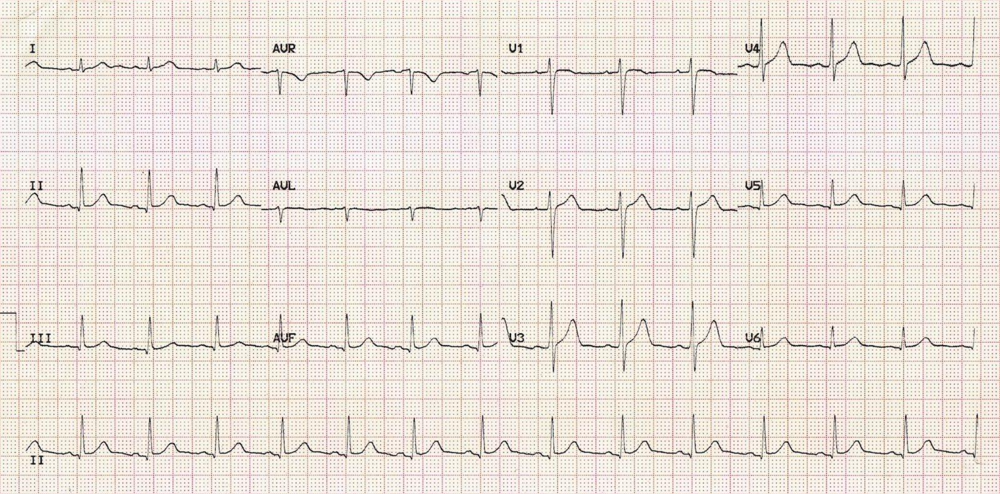

- Diagnosis: **Normal**
  - My diagnosis: Left atrial hypertrophy without signs of LVH; suggestive of mitral stenosis - no the P wave is not broad but just appears to be bifid, he doesn't see this as being abnormal
- ECG Features 
  - regular, 90 - 100 bpm, normal axis
  - PR interval is 120 ms, QRS is of normal wide, QT interval is normal

**Case 2** 

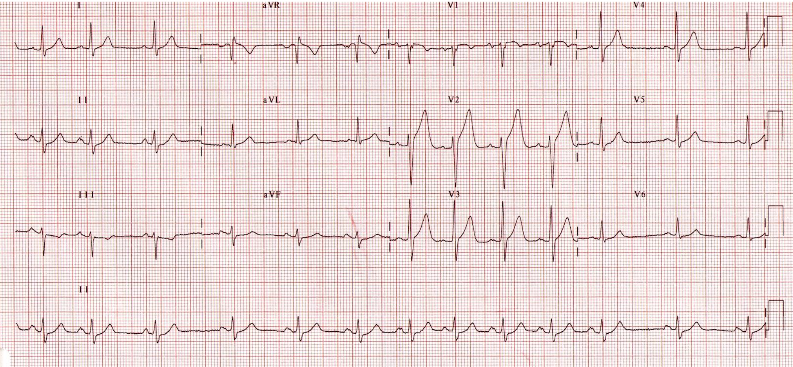

- Diagnosis: **Sinus arrhythmia**
  -  (My guess) septal infarct - unlikely because in thin chested individual, we can have tall T waves in some leads
- ECG Features
  - Irregular rhythm likely 
  - Tall T waves: asymmetrically T waves (in hyperkalemia, the tall T waves are symmetrical); for asymmetrical T waves, consider MI
  - Bifid P wave in lead II (but not too broad)
  - J point (the place where S ends and T starts) is elevated in V2 and V3, this can be reflected in V1 as a little notch.
- Ddx: multifocal atrial arrhythmia: p wave morphology different in a single lead
- How to treat
  - Sinus arrhythmia is normal in young persons
  - In older persons: look for COPD or some other condition

**Case 3**

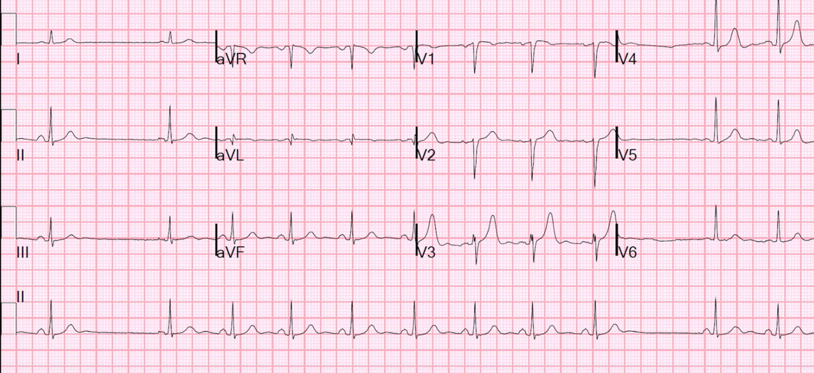

- Diagnosis: **sick sinus syndrome / SA exit block**
- ECG Features
  - Irregular rhythm; with intermittent bradycardia (40 - 75 bpm), failure to generate P waves suddenly and occasionally
  - Normal PR, QRS, QT intervals
- Associated symptoms
  - Palpitation
  - Skipped beat
  - Fainting spells
- How to treat: Pacemaker

**Case 4**

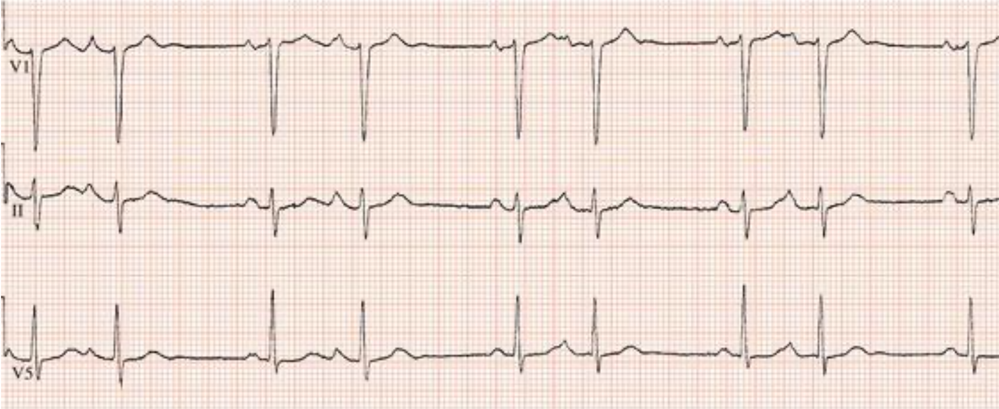

- Diagnosis: **atrial bigeminy**
  - NOT! 2:1  block
- ECG Features
  - Polymorphic P waves in the leads
  - Ectopic atrial beats
  - The ectopic atrial beat can be superimposed on the preceding T wave
- Associated symptoms
  - Palpitation
  - Missed beat
  - Faintness or dizziness.
  - a sensation of the heart stopping for a moment.
  - a racing **heartbeat**.
  - a fluttering sensation in the chest.
- Factors causing the condition
  - These premature heartbeats are associated with **lung diseases**, especially if high blood pressure is present in the arteries that go between the heart and lungs.
  - Or due to coronary artery disease 
  - **Stimulants** (such as coffee and tea, alcohol or some types of cold, allergy or asthma remedies, cocaine) will sometimes set off the extra beat.
  - Atrial ectopic beats happen more often in older people than younger ones.
- How to treat
  - Identifying what triggers the extra beat can be helpful. By avoiding the trigger, it may be possible to eliminate the extra beat. 
  - If this is not possible and frequent, intolerable palpitations are present, drugs to control irregular heart rhythms are helpful e.g. beta-blockers, CCB to slow down the rate of ectopics.
  - If the extra heartbeat happens often, it can — but does not always — set off atrial fibrillation.

**Case 5**

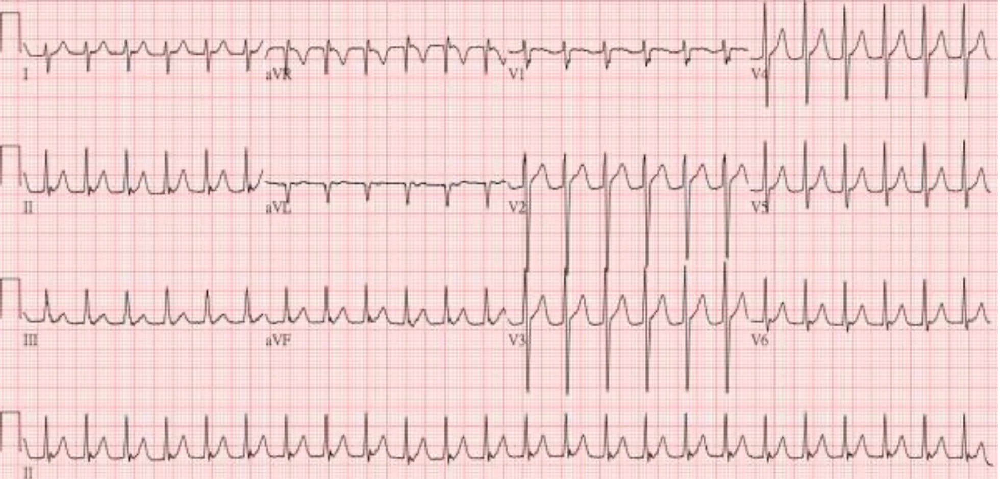

- Diagnosis: **Junctional tachycardia**
  - Ddx: Atrial flutter with rapid ventricular response with 2:1 conduction
    - Valsava manoeuvres to differentiate the two
- ECG Features
  - Regular rhythm with rate of 150 bpm
  - Normal cardiac axis
  - No p wave, narrow QRS with slight delta wave
- Factors causing the condition: 
  - AMI, myocarditis, digoxin, and catecholamine toxicity
  - AV nodal problems
  - Thyrotoxicosis
  - Theophylline
  - Caffeine intake / alcohol
- How to treat
  - Vagal manoeuvres
  - Give adenosine / CCB
  - If unstable, 

**Case 6**

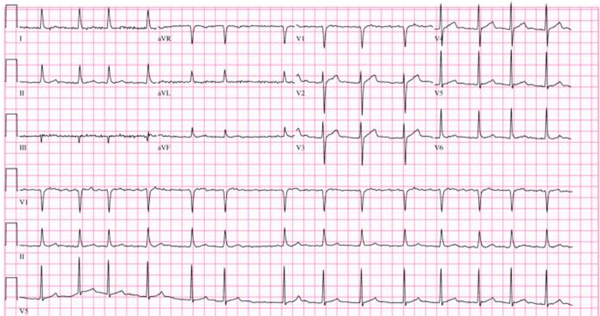

- Diagnosis: **atrial fibrillation**
- ECG Features
  - no p wave, narrow QRS, wavy baseline
- Factors causing the condition
  - Hyperthyroidism
  - COPD
  - Mitral valve conditions
- Further investigation required
- How to treat
  - IV amiodarone 150 - 300 mg IV over 30 minutes
    - If no HF, can do beta-blocker
    - If WPW, use procainamide instead

**Case 7**

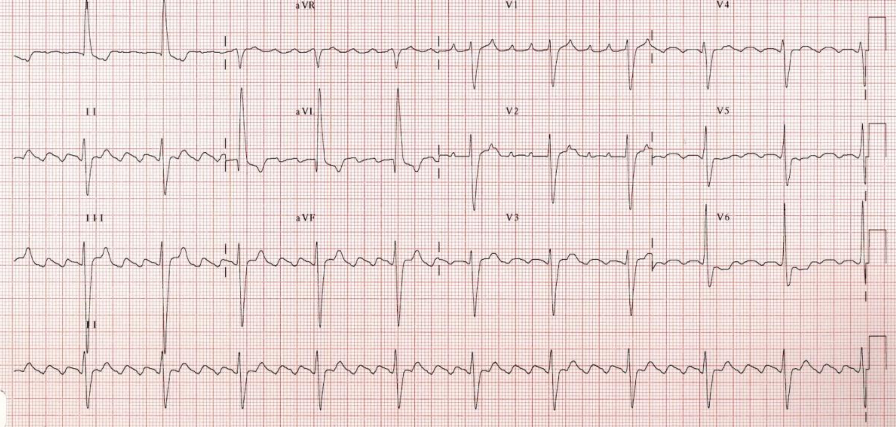

- Diagnosis: **atrial flutter with 4;1 block**
- ECG Features
  - Saw tooth appearance of P waves; atrial rate just below 300 bpm
  - Narrow QRS; RR rate is around 70 - 80 bpm
- Associated symptoms: palpitation, syncope
- How to treat
  - As in AFib

**Case 8**

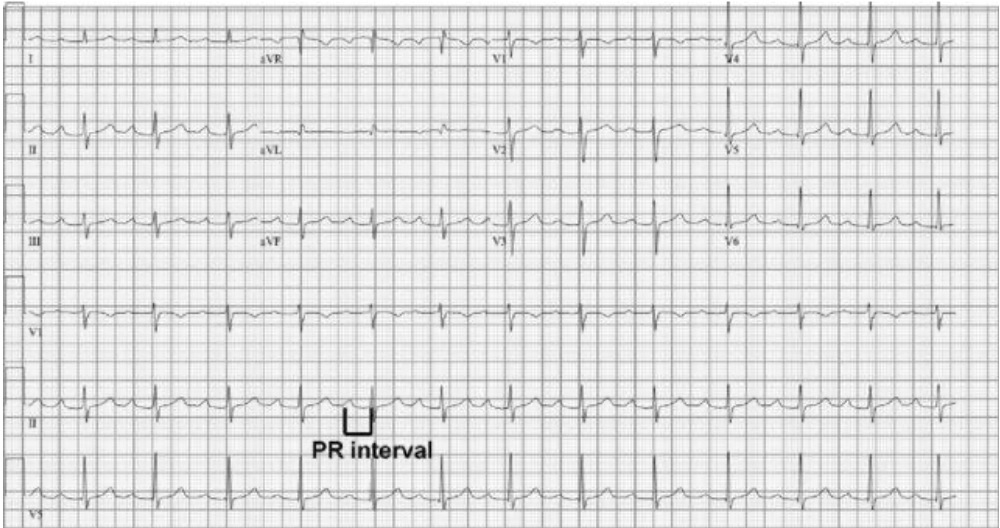

- Diagnosis: **first degree heart block**
- ECG Features
  - Regular rhythm with 75 bpm, normal cardiac axis
  - Prolonged PR interval, normal QRS and QT
  - Normal P, QRS, T wave morphologies, no U or delta waves
- Associated symptoms
  - Asymptomatic

**Case 9**

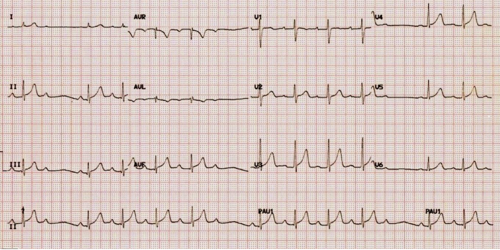

- Diagnosis: **Mobitz Type 1 AV Block**
- ECG Features
  - PR intervals elongate followed by dropped beats
- Associated symptoms
- Factors causing the condition
- How to treat

**Case 10**

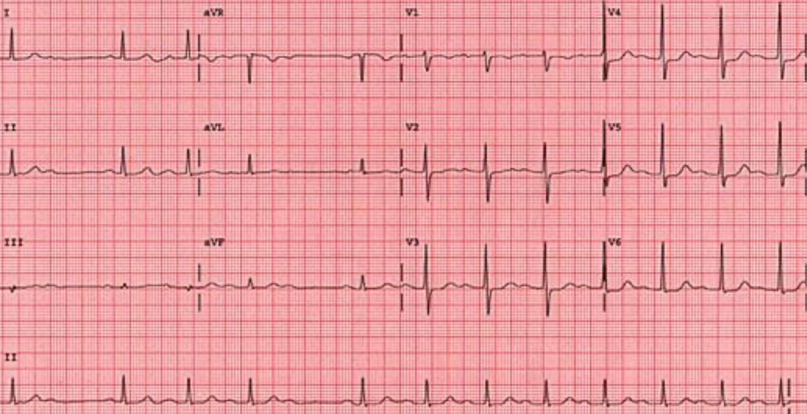

- Diagnosis: **Mobitz type II AV Block**
- ECG Features
  - PR interval is prolonged and fixed
  - Occasional non-conduction of P wave
- How to treat
  - Transcutaneous pacing is very painful due to higher energy
  - Atropine then dopamine drip start at 5 mcg/kg/min increase in stepwise until we achieve desired heart rate; 

**Case 11**

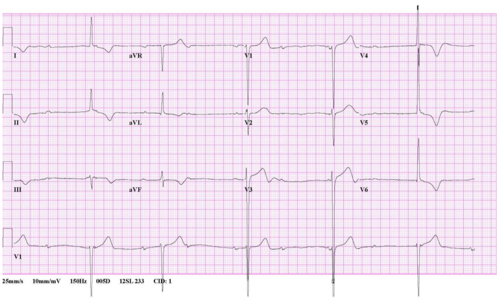

- Diagnosis: **Third degree heart block**
- ECG Features
  - Bradycardia irregular 45 beats/min
  - T wave inversion in II, III aVF, V4-6
  - AV dissociation
  - Large S in V2 and large R in V5
- Factors causing the condition
  - Inferior MI
    - Right coronary artery supply AV node is 90% of patients, 10% left circumflex
  - LVH
- Presentation: chest pain, palpitation, diaphoresis, syncope / dizzy, HoTN
- How to treat: 
  - Definitive: pacemaker

**Case 12**

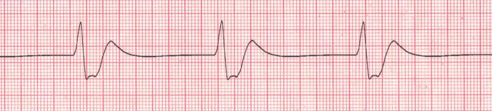

- Diagnosis: **Ventricular Escape**
- ECG Features
  - no p-wave, wide QRS
- How to treat

**Case 13**

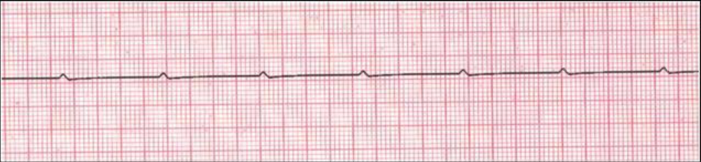

- Diagnosis: **Ventricular asystole**
- ECG Features
  - No QRS complex

**Case 14**

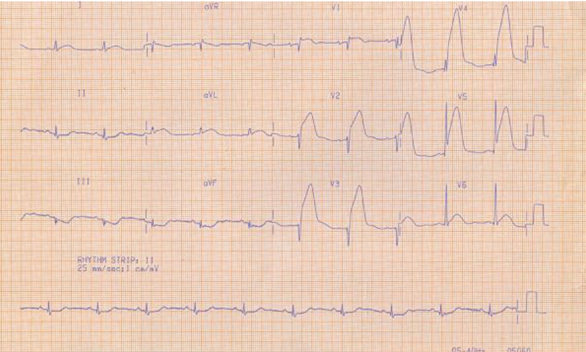

- Diagnosis: Extensive Anterior STEMI (Left descending artery)
- ECG Features
  - Prominent tall asymmetrical T waves with ST elevation in V1 - 5
- Associated symptoms
  - Chest pain, SOB, diaphoresis, syncope
- How to treat
  - For patient with breathlessness, place patient at 45 degrees

**Case 15**

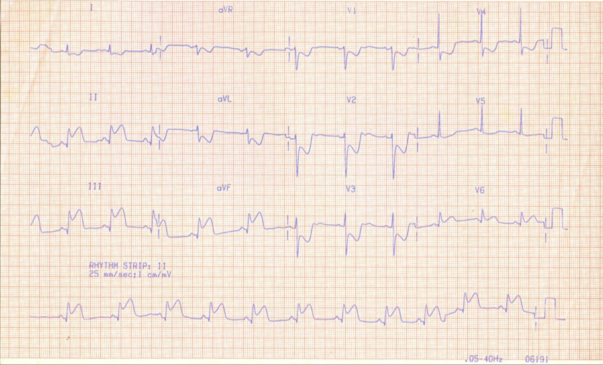

- Diagnosis: Inferior STEMI
- ECG Features
  - ST elevation in II, II, aVF
  - Reciprocal degression in 1 - 4, I aVR and aVL
- Possible complications of inferior STEMI
  - Do posterior leads to inferior STEMI: 
  - Check for AV node
  - Right ventricular involvement by doing right leads

**Case 16**

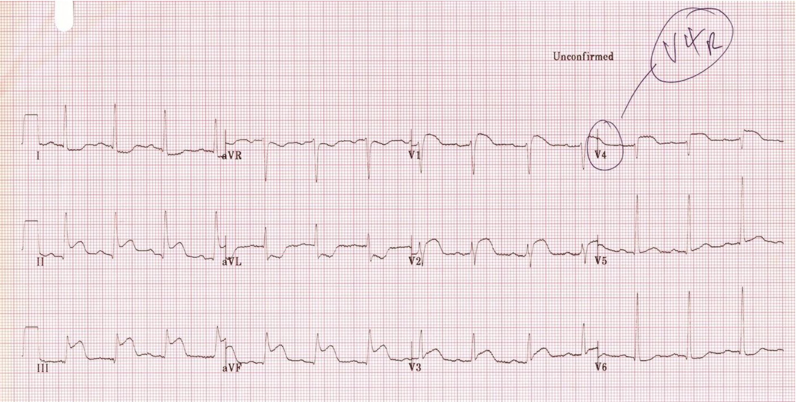

- Diagnosis: inferior-fronto STEMI with right ventricular infarct
  - Worry dual vessel disease: dominant right coronary is possible
  - PR interval is prolonged
- How to treat
  - Worry low BP
  - Low saturation because of poor perfusion to the lungs
  - JVP for RA failure signs: give fluid challenges
    - Fluid challenge 200 - 300 ml and watch BP; if this brings up the BP it's good. 
    - If not give vasopressor gradually to try to bring up the blood pressure; but note that if we give sympathomimetics it will affect the heart rate.
  - If they require coronary angiogram, get consent for PCI

**Case 17**

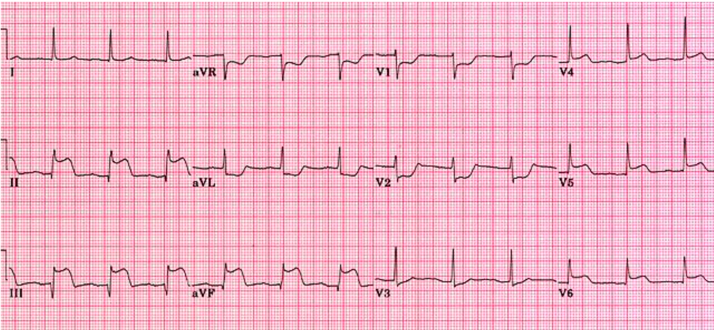

- Diagnosis: Inferior STEMI with, lateral, posterior extension, with AV block
  - Very dominant right coronary, that extends to the apex of the heart
- ECG Features
  - II, III, aVF elevated ST segment
  - V4 - 6 ST elevation
  - Reciprocal changes in aVL
  - ***V2 has a significant R, depressed ST and upright T: indicating a posterior infarct*** - the **inverted mirror image** sign
  - Prolonged PR interval
- Investigation
  - Posterior lead
  - Right view
- How to treat

**Case 18**

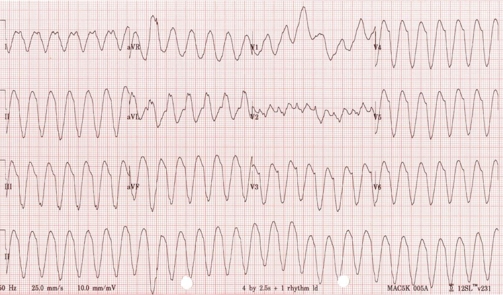

- Diagnosis: ventricular tachycardia
- ECG Features
  - Monomorphic broadened QRS
- How to treat: amiodarone

**Case 19**

- Diagnosis: torsade de pointes
- How to treat: **MgSO4**

**Case 20**

- Diagnosis: **Pulmonary Embolism**
  - Right ventricular hypertrophy 
- ECG Features
  - Sinus tachycardia
  - Right deviation
  - T wave inversions: I, II, III, aVF, 2 - 5
  - RBBB
- Signs and symptoms on PE
  - Leg swelling for DVT: calf
  - pelvic veins, IVC
  - Recent surgery
  - Acute right heart strain signs: elevated JVP, loud P2, 
  - CT pulmonary angiography looking for filling defect in pulmonary vasculature
- How to treat

**Case 21**

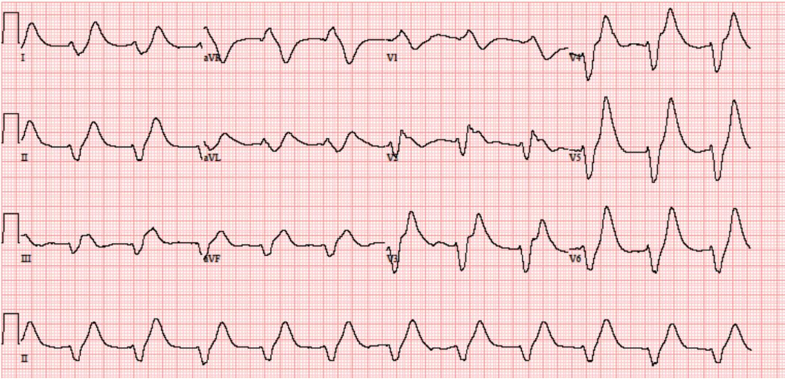

- Diagnosis: **Hyperkalemia**
- ECG Features
  - Main
  - Minor
- Associated symptoms
- Factors causing the condition
- Further investigation required
- How to treat

**Case 22**

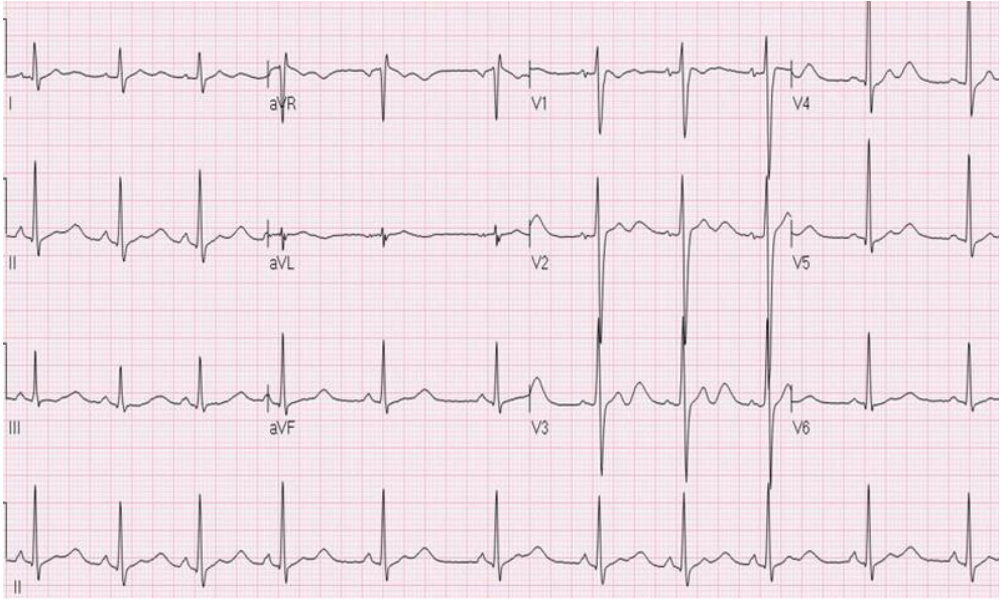

- Diagnosis: **hypokalaemia** (?)
- ECG Features
  - Main
    - Prominent U wave
  - Minor
    - Tall R deep S in V1 suggestive of RVH
    - Tall R in V4 V5, with deep S in V2 and V3, suggestive of LVH
    - Tall P wave in II ? RAH
    - Bifid P wave in V4 ? LAH

**Case: de winters** 

Key diagnostic features include ST depression and peaked T waves in the precordial leads. The **de Winter** pattern is seen in ~2% of acute LAD occlusions and is under-recognised by clinicians

- Cat lab activation is indicated in patients with de Winter and Cath lab

**Case: SVT**

**Case : Fast Afib**

**Case: Sinus bradycardia with t-wave inversion**

- T-wave inversion HTN, LVH, 

**Case: RBBB**

- ST depression and Slurred S wave are part of RBBB

**Case: VT**

**Case: Atrial Flutter**

**Case: Fronto-lateral MI**

- Poor R progression

**Case: Inferior with posterior AMI**

- Do Right sided leads 
- Right ventricular infarct, becomes preload dependent, worry GTN
- Be careful about fluids
- Interior MI is associated with bradycardia

Case: normal ECG

Case: Is this MI? LBBB

- Use sgarbossa criteria if patient has chest pain
- 

Case

- RBBB with ST elevation

**Case: Complete heart block**

### Blood Pressure

### Oximetry

### Capnography

### Thermometers

## Bedside

### Hypocount

### VBG

### Urine dipstick

### Urinary Pregnancy Test

### Bedside U/S

## Labs

For each lab, consider:

- How to **prepare patients** before sample collection
- When, how, where and how much material to collect
- Types of containers used e.g. sterile, plain, with preservative, anticoagulant or transport media
- Conditions of storage and transportation of samples to the laboratories

### Bloods 

#### Sample collection

1. Verify to ensure that the sample is collected from the correct patient by checking for at least two identifiers, asking for the patient’s name, and NRIC number/Passport number, or address or date of birth, or by checking the patient’s wristband for name and NRIC number/Passport number.
2. An adequate amount of the sample must be collected to enable the test to be carried out. If multiple tests are ordered, make sure that sufficient sample is collected. If the sample is insufficient, the authorised requestor should state which tests should be done in order of priority.
3. Aseptic techniques must be employed during collection to prevent the introduction of micro-organisms into the patient’s anatomical space, and to prevent the sample from being contaminated during the process of collection.
4. All samples should be regarded as potentially infectious and **standard precautions guidelines** should be followed by all healthcare workers during sample collection and handling.
   Samples must be collected into appropriate containers before despatch to the laboratory.
   Be careful to check for cracks in the containers and to ensure that the lids of containers are properly tightened to prevent leakage of samples during handling and transportation. This can pose infection hazards to transport and laboratory staff.
5. Ensure that the outer surfaces of the containers are not contaminated by the patients’ samples.

#### Vacutainers in SGH

| **Description**                                              | **Order of Draw** | **Tube Content**                                             | **Draw Volume**      | Use                                                          | **Instructions**                                             |
| :----------------------------------------------------------- | :---------------- | :----------------------------------------------------------- | :------------------- | :----------------------------------------------------------- | :----------------------------------------------------------- |
| BACTEC Blood Cultures                                        | 1                 |  | 8 – 10 mL per bottle | Aerobic & Anaerobic **Cultures**                             | Blood cultures should be done separately. However, if blood samples need to be taken, then **blood cultures are done first to avoid contamination by the other blood tubes**. |
|  Blue | 2                 | Sodium Citrate                                               | 2.7 mL               | **PT/PTT PT/INR** **Platelets Function Test** (PFT) (use **7 tubes** for PFT) | Allow tube to fill completely. Tube inversion x 4            |
|  Red | 3                 | Plain                                                        | 6 mL                 | **Antibody** identifications (Immunohaematology)             | Tube inversion x 5                                           |
|  Gold | 4                 | SST (Plain with Gel)                                         | 5 mL                 | For **Biochemistry** tests (serum determinations)            | Tube inversion x 5                                           |
|  Green | 5                 | Lithium Heparin                                              | 4 mL                 | **Ammonia** (send in with ice-pack), HLAB27 (use 2 tubes), **Cytogenetic** investigations | Tube inversion x 8                                           |
|  Pink | 6                 | K2EDTA 10.8 mg                                               | 6 mL                 | Strictly for **Group X-Match**; Pre-transfusion Tests (Blood Group, Antibody Screen, Compatibility test) | Tube inversion x 8                                           |
|  Lavender | 7                 | K2EDTA 5.4 mg                                                | 3 mL                 | **FK506, Cyclosporin, G6PD, FBC, HbA1c, Homocysteine** (send in with **ice-pack**) | Tube inversion x 8                                           |
|  Grey | 8                 | Sodium Fluoride                                              | 6 mL                 | **Lactate** (send in with **ice-pack**), **Pyruvate, GTT**   | Tube inversion x 8                                           |

- Pink and Red for blood bank
- O negative - give to female, caucasian, and Indians; other patients give O positive

#### FBC

#### APTT/PT

#### Renal Panel

Urea / creatinine ratio

#### Liver Panel

#### Procalcitonin

#### CRP

#### ABG

**Arterial blood gas** (ABG) sampling is a commonly performed procedure which allows healthcare professionals to quickly obtain information on a patient’s respiratory status (blood oxygen and carbon dioxide levels), as well as the patient’s acid-base balance.  Taking an **arterial blood gas** (ABG) involves using a needle and syringe to directly sample blood from an artery (usually the radial artery). 

**Wash hands**

**Introduce yourself**

**Confirm patient details:**

- Name / date of birth
- Take note of whether the patient is requiring oxygen and record how much (*e.g. FiO2 concentration or flow rate*)

**Check for any contraindications to ABG sampling:**

- **Absolute –** poor collateral circulation / peripheral vascular disease in the limb / cellulitis surrounding the site / arteriovenous fistula
- **Relative** **–** impaired coagulation (e.g. *anticoagulation therapy / liver disease / low platelets <50)*

**Explain procedure:**

*“I need to take a sample of blood from an artery in the wrist to assess the oxygen levels in your circulation. It will be a little painful, but should hopefully only take a short amount of time. The procedure does involve some risks which include bleeding, bruising, infection and permanent damage to the artery.”*

**Gain consent:**

*“Do you understand everything I’ve said so far? Are you happy for me to go ahead?”*

**Modified Allen’s test**

*This test involves the assessment of the arterial supply to the hand.*

**1.** Ask the patient to clench their fist

**2.** Apply pressure over both the radial and ulnar artery to obstruct blood supply to the hand

**3.** Ask the patient to open their hand, which should now appear blanched (if not you have not completely occluded the arteries with your fingers)

**4.** Remove pressure from the ulnar artery whilst maintaining pressure over the radial artery

**5.** If there is adequate blood supply from the ulnar artery, colour should return to the entire hand within 5-15 seconds

*It should be noted that there is no evidence performing this test reduces the rate of ischaemic complications of arterial sampling.\*

**Gather equipment**

- Arterial blood gas syringe, Needle (23G)
- Lidocaine – *with small needle/syringe for administration*
- Prep: Alcohol wipe – *70% isopropyl* 
- Post: Gauze, Tape, Sharps container
- PPE: Gloves, Apron

**Local anaesthetic**

The sample is routinely obtained from the radial artery and it is recognised that that the procedure causes significant pain for the patient and that this can be markedly reduced by the use of subcutaneous local anaesthetic.  The British Thoracic Society recommends the routine use of local anaesthetic for obtaining ABG samples except in emergencies, or in unconscious or anaesthetised patients.

**Reading ABG**

- HAGMA

  

#### A-a gradient

Measure of gradient between alveolar oxygen PaO2 and 

- Normal 
- Elevated

### Urine

#### Toxicology

### Microscopy

#### Peripheral Blood Smear

## Imaging

**Resources**

- Survival Radiology: Lee Shu Yi Sonia - Changyi
- Tan Jin Rong - chief resident, interest in MSK
- Speaker is Mark Wang - final year resident at SGH
- Zehan Tan is in radiology

**General Notes**

- **Ring enhancement** refers to a bright intensity that can be observed surrounding many lesions on both CT and MRI when *contrast is administered*. It usually indicates local edema around a mass lesion, and in the brain can indicate the breakdown of blood-brain barrier.
- **CT vs MRI**
  - CT is faster and less expensive, greater sensitivity for acute head trauma, better for detection of cord compression and calcifications
  - MRI is better for visualization of soft tissue and tissue edema, including brain and spinal cord (higher sensitivity for strokes, mass lesions, etc.). Allows for multiplanar imaging (Axial, coronal, sagittal, and oblique), no ionizing radiation.

### Body Imaging, Abdomen

#### Abdominal X-Rays

**Possible Positions**

1. Standard Abdo AP is a supine position
2. Erect position Abdo X-Ray
   - To look for free intraperitoneal air
3. Lateral decubitus
   - For patients in whom erect position is not possible

**Approach = Air, Bone, Calcifications, Soft Tissues, and Review Area**

X-ray densities

| black | dark-grey | light-grey          | nearly white       | white |
| ----- | --------- | ------------------- | ------------------ | ----- |
| gas   | fat       | Soft tissue / Fluid | Bone calcification | Metal |

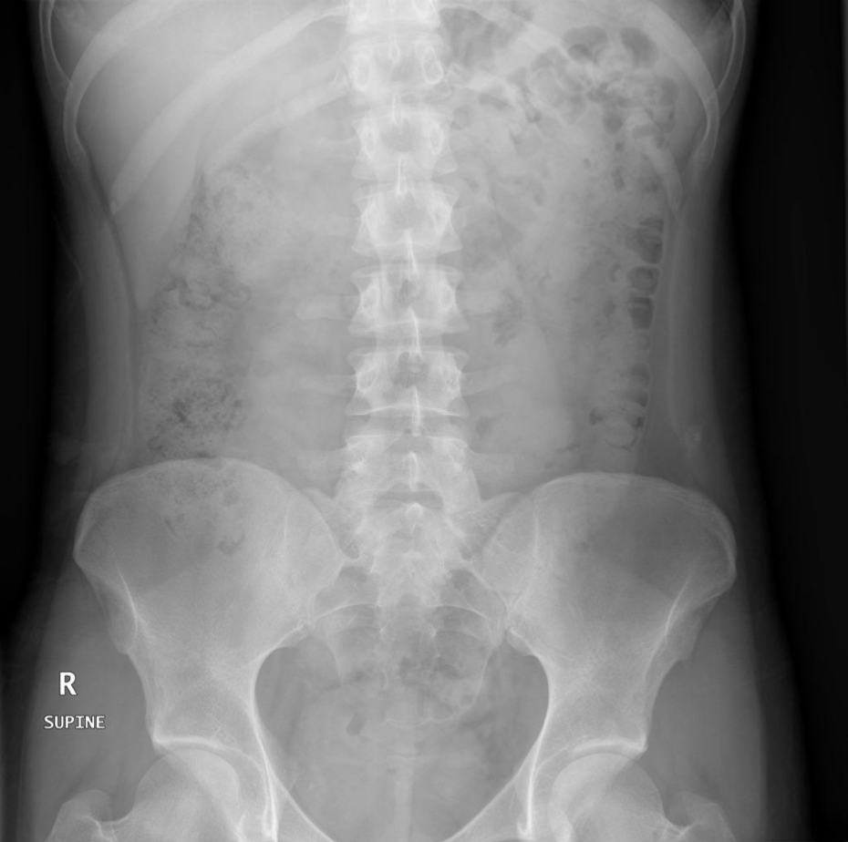

- **Bowel gas pattern**

  - Within normal gas-containing organ? (e.g. bowel, lungs)
  - Within organ which is not normally gas-containing?
  - Within intraperitoneal / retroperitoneal space? (i.e. perforated viscus)
  - Remember that air rises
    - 3 - 6 - 9 rule

  | Characteristics        | Stomach                                                | Small bowels                                                 | Large bowel                                                  |
  | ---------------------- | ------------------------------------------------------ | ------------------------------------------------------------ | ------------------------------------------------------------ |
  | Location               | Epigastrium or left upper quadrant                     | Central                                                      | Peripheral (tends to frame small bowel)                      |
  | Contents               | Variable                                               | Fluid and air                                                | Faeces (mottled densities), fluid, air                       |
  | Mucosal / wall pattern | Rugal folds: mucosa and submucosa forming thick ridges | Valvular conniventes - mucosal folds cross full width; closely spaced in jejunum and widely spaced in ileum | Haustra - sacculations formed in spaces between taeniae coli; do not cross entire width |
  | Size / diameter        | Variable                                               | 3 cm                                                         | 6 cm (caecum 9 cm)                                           |

  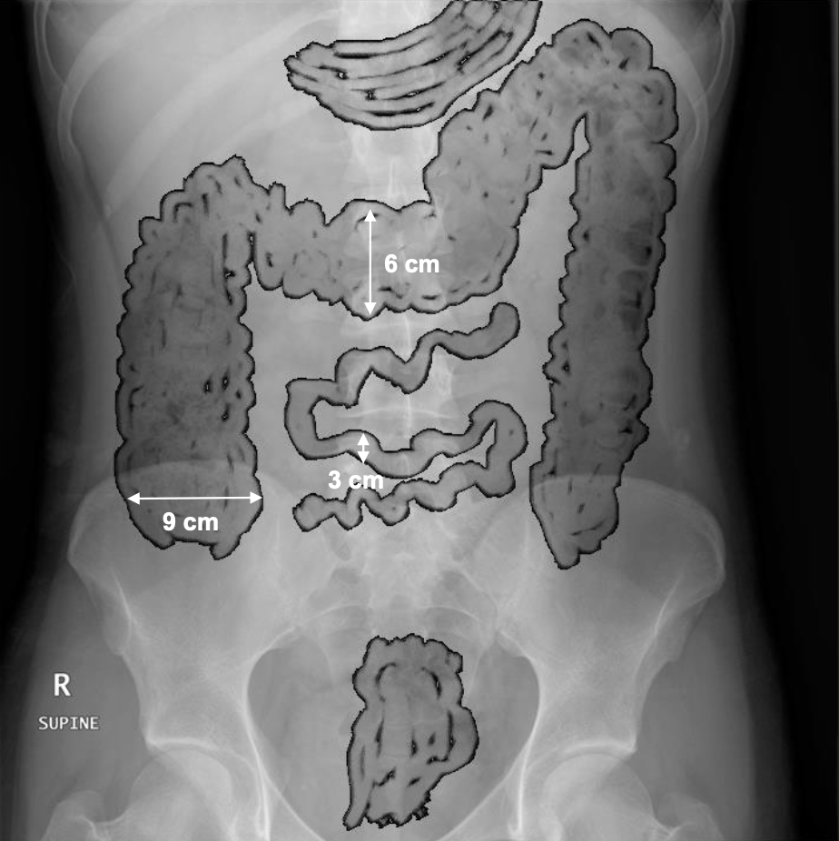

- 5 Locations of extra-luminal air

  1. **Intra-mural gas** = gas in the bowel wall
     - This is a sign of bowel ischemia
     - Other causes include meds, iatrogenic, pulmonary disease e.g. COPD
     - If present, also look for portal venous gas
  2. **Intra-peritoneal gas** = gas in peritoneal cavity
     - This is a sign of perforated hollow viscus and a surgical emergency
     - Look for air under the diagram in erect films
     - Look for **Rigler's sign**: presence of air along the luminal and peritoneal aspects of bowel wall
     - Other signs of penumoperitoneum
       - **Cupola/saddlebag/mustache sign** — Air accumulation underneath the diaphragm central tendon in midline.
       - **Lucent liver sign** — Reduction of liver opacity due to air anterior to the liver.
       - **Football sign** — Massive pneumoperitoneum outlining abdominal cavity
       - **Falciform ligament sign** — Air outlines the falciform ligament
       - **Inverted V sign** — Air outlining lateral umbilical ligaments (inferior epigastric vessels)
       - **Doge's cap sign** — Triangular collection of gas in Morison pouch
       - **Telltale triangle sign** — Triangular air pocket between three loops of bowel.
       - **Urachus sign** — Air outlining middle umbilical ligament
       - **Hepatic edge sign** — Air outlining hepatic edges
  3. **Retro-peritoneal gas**
     - This is a sign of perforated retroperitoneal hollow organ (viscus) or infection that produce gas
     - It shows up as air around retroperitoneal organs
       - Rectum, ascending and descending colons, duodenum (D2 to  D4)
       - Psoas muscle
       - kidneys, adrenal glands, ureters
       - Pancreas (except tail)
       - Aorta and inferior vena cava
  4. **Portal venous gas** = Gas in portovenous system
     - This is a sign of bowel ischemia;
     - The gas is in a peripheral location within liver
  5. **Pneumobilia** = Gas in biliary tree
     - This is often seen after ERCp or Whipple's
     - Centra location in the liver

- 5 groups of Intra-abdominal soft tissue

  - Liver
  - Spleen
  - Kidneys
  - Psoas muscles
  - Urinary bladder

- 5 areas of Calcifications

  1. Renal calculus

     - These can occur at three places: pyeloureteric junction (PUJ), pelvic brim, vesicoureteric junction (VUJ)

  2. Gallstones: RUQ, often laminated

  3. Appendicolith: Right lower quadrant (RLQ)

  4. Parenchymal

     - Chronic pancreatitis: Multiple punctate Ca++

  5. Tumors

     - Dermoid cysts (tooth-like Ca++ and fat lucency)

  6. Vascular

     - Phlebolith: Round, lucent centre; Often in pelvis; Can mimic urinary calculus

     - Beware aneurysm: Curvilinear, left paravertebral region

- Review areas

  - Lung bases: e.g. consolidation, mass
  - Other soft tissues e.g. herniated bowel in groin
  - Bones
    - Fractures
    - Paget's disease
    - Rugger Jersey spines
    - Bamboo and dagger spines
    - Osteosclerosis
    - Destruction
    - Fibrous dysplasia

**Signs to note**

| Signs                                                        | Diagnosis                                                    |
| ------------------------------------------------------------ | ------------------------------------------------------------ |
| Staghorn calculi |                                                              |
|  | Patient with stag horn calculi and fever, emphysematous pyelonephritis |
|  | hepatosplenomegaly                                           |
|  | Small bowel obstruction                                      |
|  | Portal venous gas, dilated bowel secondary to ileum, intramural gas, perforation = ischemia |
|  | Large bowel obstruction                                      |
|  | Sigmoid volvulus coffee bean; Endoscopic decompression may be done in stable patient, and exploratory laparotomy.  Common surgical emergency, elderly with chronic constipation and redundant sigmoid loops; closed-loop obstruction (competent ileocaecal valve may result in additional closed-loop) |
|  | Caecum volvulus; large bowels are collapsed in contrast to sigmoid volvulus |
|  | Perforation, pneumoperitoneum with air under the diaphragm, hyperlucent liver sign, Rigler's sign |
|  | Intussusception, invagination of bowel into lumen of more distal bowel; most commonly 6 months to 2 years (no lead point); look at the target sign |
|                                                              |                                                              |

- Majority radioopaque x-ray almost all visible on CT, smooth ovoid, linear or staghorm
- Size <=3 mm can pass through spontaneously most of the time. 
- Start fluid resus, rep
- Emphesematous pyelonephritis
  - Severe infection with gas accumulation in renal parenchyma
- Abdominal mass
  - Paucity of gas in the area
  - Displacement of adjacent bowel gas
  - Origin of mass inferred by location
    - Organ itself being diffusely enlarged
    - Within the organ
    - Outside the organ

### Body Imaging, Chest

- 5 radiographics densities
  - Air
  - Fat
  - Water / soft tissue
  - Bone
  - Metal
- 

- Same density processes or structures efface one another
- Position matters
- 2D representation of a 3D structure - think 3D

General principles for reviewing X-rays

- Correct patient, date and side (left/ right)
- Technical factors: aptient position, exposure, rotation etc
- Anatomy-specific systematic approach: differs for chest vs abdomen vs bones etc
- Compare with prior imaging
  - Highlights subtle changes and abnormaltiies
- Clinical contact: guides diagnosis and differentials

CT myelogram

- When a patient cannot tolerate the long scan time of MRI,, or has a metallic implant that is not MRI compatible, CT myelogram can still be used
- One of the scenario, is when the patient has an implant that is not MRI compatible
- If there are contraindications to MRI (for example, if the patient has MRI-noncompatible pacemaker), and you need to evaluate the cord, CT myelogram is a reasonable alternative.
- usually MRI is enough to see the various structures. rarely in cases for nerve root injury (brachial plexus) we can better delineate anatomy. or if the patient has absolute contra-Ix to MRI

Sorry not sure if this was answered but - Considering that posterior stroke is quite poorly deteted on CT/MRI brain, how might we be able to better order directed imaging for patients with posterior circulation strokes? Is there any recommended interval between scans and any dangerous complications we need to be very much on the look out for?

- MRI brain is very useful for posterior circulation strokes

  S1: Kee Tze Phei       03:58 PM

  CT brain (non-contrast) remains the first line of investigation for patient presenting acutely with suspected posterior circulation stroke - to assess for intracranial haemorrhage and infarct
  You may be able to detect the mass effect associated with posterior circulation stroke on CT as well. 
  If it appears normal on the initial CT, you can then proceed with MRI brain stroke protocol. 
  CT is fast and readily available, and more sensitive than MRI in detecting intracranial haemorrhage, therefore it remains the first line of investigation in this group of patient, despite the reduced sensitivity in detecting posterior circulation infarct. 
  MRI on the other hand may not be readily available in all institutions and not as good as CT in detecting intracranial haemorrhage.

  S1: Kee Tze Phei       04:00 PM

  Potential complications as we learnt from the two cases I presented - mass effect causing brainstem compression, obstructive hydrocephalus and intracranial herniation.

may I know what are the general principles/ indications for ordering a T1 vs T2

Cheng Tim-Ee Lionel       03:56 PM

S2: Tan Zehao       03:57 PM

There are usually standardized protocols for common examinations so you to do not need to specify unless it is for a uncommon indication

Tan Min-On       03:57 PM

You don't usually need to specify the sequences on a radiology order. Your clinical indication should be clear and radiology will protocol accordingly

Cheng Tim-Ee Lionel       03:57 PM

This is because modern day MRI sequences can be very complex and may vary from institution to institution.

What is the specific yield of doing a ADC in comparison to a DWI in MRI?

Tan Min-On       03:57 PM

They are part of the same sequence. Both come together

S1: Kee Tze Phei       04:03 PM

ADC (apparent diffusion coefficient) complements DWI in assessing infarct. 
In short, 
Acute infarct - restricted diffusion - bright on DWI, dark on ADC
Subacute infarct - bright on DWI, slightly dark or isointense on ADC
Chronic infarct - may or may not be bright on DWI, bright on T2W, bright or isointense on ADC

For a post contrast T1W scan, we usually suppress the fat so that the enhancement becomes more prominent.

hi! can i check how do we choose between contrast and non-contrast CT TAP besides looking at the eGFR?

Mindy Choong Chu Ming       04:05 PM

this would depend on the indication of the scan. what is the clinical question to be answered and whether contrast is necessary.

S2: Tan Zehao       04:05 PM

General principle is if you are looking for anything that is infective or tumours you should give contrast. 
Non-contrast to identify things that are already dense without contrast. like calculi and foreign bodies.

Cheng Tim-Ee Lionel       04:06 PM

When intending to give contrast, we must look for any potential contraindications:
- renal impairment
- contrast allergy
- vascular access issues

Sometimes, even if there are contraindications, we may still want to give contrast if the benefits outweigh the risks. This usually has to be discussed with the patient.

When in doubt, discuss with your friendly radiologist! :)

Tan Min-On       04:06 PM

Contrasted scans for the chest, abdomen and pelvis by far have greater utility than non-contrast studies. A lot of pathology in the abdomen and pelvis for.e.g requires differentials in enhancement to diagnose e.g. a liver mass ?HCC vs mets vs cholangiocarcinoma. Non-contrast scans are also useful in lookin for gross abnormalities and calcified lesions but you can imagine differentiating one organ from another is very very difficult.

| Signs                                                        | Diagnosis       |
| ------------------------------------------------------------ | --------------- |
| Lytic lesions in the ribs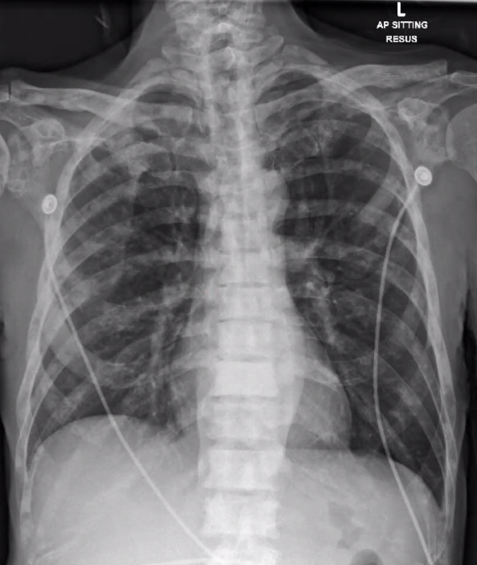 | Bone metastasis |

### MSK Imaging

- Lines should be smooth
- Unfused apophysis can be seen in young patients
- 

- TLICS Thoraco-lumbar Injury Classification and Severity Score 

| Sign                                                         | Condition                                                    |
| ------------------------------------------------------------ | ------------------------------------------------------------ |
|  | Communicated calcaneal fracture                              |
|  | Left pubic bone fracture and widened sacroiliac joint (diathesis) - the osseous and ligamentous components of the pelvis cause it to act like a ring, injury at a location should prompt searching for injury at another location |
|  | L2 burst fracture                                            |
|  | L2 burst fracture with surrounding edema and caudal equina compression |
|  | T10 anterior translation, T11 fractured,                     |
|  | Vertebral fracture with epidural hematoma (Slightly bright on T1) resulting in cord compression |
|  | Ankylosing spondylosis patients are very prone to trauma induced fracture due to altered biomechanics |
|  | Mets, look for primary                                       |
|  | Another case of mets                                         |
|  | Disc space narrowing, X-ray with opacity with central lucency, cystic with small nodules around it called tree in bud, indicate small airway disease favouring inflammatory / infectious ethology, disruption of the vertebrae, necrotic psoas muscle; ***spondylodiscitis***; drainage of psoas abscess; consider Staph aureus and TB |
|  | avascular necrosis Alcohol, SLE / sickle cell, exogenous steroids, pancreatitis, trauma, infection, Caisson disease |
|  | Fat fluid level, tibea plateau fracture with lipohaemarthrosis; very specific but not sensitive for intra-arthrotic fracture Osseofascial compartment pressure rising. Emergent fasciotomy is needed.  Fractures involving arms and leg look for second injury, remember it is a ring |
|  | Supracondylar fracture Anterior and posterior fat pads, the latter is NOT normal. Elbow dislocation is a differential but NOT common. |
|  | boxer's fracture                                             |
|  |                                                              |
|  | Sunburst, sclerotic, lifting of periosteneum: osteosarcoma   |
|  | oscius mets to the lung                                      |
|  | Soft tissue loss, air tracking: osteomyelitis; osteomyelitis is a clinical diagnosis; treat with ray amputation |
|  | Air in soft tissue; arranged MRI ned fas, treated with IV antibiotics; Often polymicrobial; Risk factor is immune suppression (esp diabetes); imaging is NOT required for diagnosis or treatment, treat emergency debridement is required. |
|  | Prosthetic loosening; aseptic osteolysis; parallel lucency greater than 2 mm at the bone-prosthetic interface, progressive linear lucency after 2 years postoperatively; change in position of arthroplastic |
|  | periprosthetic fracture                                      |
|  | Besides fixing the fracture, need to review medication, including analgesics. Bisphosphonate related fracture - the other leg has abnormal thickening, focal lateral cortical thickening, in history there is minimal trauma; |
|  | Avulsion injury; frequent cause of hip pain in adolescents involved in sports. At this age the tendons are generally stronger than the apophyses. |
|  | Pathological fracture; worry malignant lesion, look at other bones |
|  | Young person, bilateral knee pain. There are bilateral stress fractures. |
|  |                                                              |

- Galeazzi fracture. Maisonneuvre fracture, Pilon fracture, Segound fracture etc
- Fatigue, insufficiency, stress fractures; often missed and even when no clinical history given. 

### Ultrasound

-   Abdominal aneurysm, gallbladder disease, renal and adrenal masses, kidney stones, ectopic pregnancy, pregnancy
-   80/20 rule: on Utz, gallstones are diagnosed 80% of the time and kidney stones 20% of the time; on x-ray gallstones are diagnosed 20% of the time and kidney stones 80% of the time.

#### FAST

- Useful tools for quick detection of intraabdominal blood, pneumothorax, and hemothorax
- Once done DPL cannot be repeated, FAST can be done
- The extended **FAST** (**eFAST**) allows for the examination of both lungs by adding bilateral anterior thoracic sonography to the **FAST** exam. This allows for the detection of a pneumothorax with the absence of normal 'lung-sliding' and 'comet-tail' artifact.
- **Focused Assessment with Sonography for Trauma** **(FAST)** **scan** is a point-of-care ultrasound examination performed at the time of presentation of a trauma patient. 
  - patient in supine position
  - 3.5-5.0 MHz convex transducer
  - five regions may be scanned 
    - **pericardial** view: commonly referred to as the subcostal or subxiphoid view
      - to examine the pericardium, the liver in the epigastric region is most commonly used as a sonographic window to the heart
      - the potential space between the visceral and parietal pericardium is examined for a pericardial effusion
      - if anatomical factors preclude epigastric probe placement, parasternal or apical four-chamber views may be used
    - **right flank** view
      - commonly referred to as the perihepatic view, Morison pouch view or right upper quadrant view
      - four potential spaces are sequentially examined for the accumulation of free fluid: the **hepatorenal interface** (Morison Pouch) is first identified, with subsequent assessment of the more **cephalad subphrenic** and **pleural** spaces, visualization of the inferior pole of the kidney, which is a continuation of the right **paracolic gutter**, defines the caudad extent of an adequate view
    - **left flank** view
      - commonly referred to as the perisplenic or left upper quadrant view
      - four potential spaces are sequentially examined in an analogous fashion to the right flank, albeit the splenorenal interface is assessed on the left
    - **pelvic** view
      - commonly referred to as the suprapubic view, this space is the most dependent peritoneal space in the supine trauma patient
      - a transverse sweep, using the bladder as a sonographic window, the **pouch of Douglas** or rectovesical space is explored for free fluid
- An extended FAST or "eFAST" scan is now standard of care, and is performed by incorporating two views assessing the anterior thorax 7: 
  - anterior pleural views
    - the anterior pleura is assessed for the presence or absence of sliding lung as a sensitive, but non-specific, indicator of a traumatic pneumothorax
    - the probe is placed in a sagittal orientation in the midclavicular line between the clavicle and diaphragm
    - anterior and lateral interrogation of interspaces 5-8 bilaterally is recommended
- Causes of false negatives
  - obesity: severely limits assessment of the peritoneal cavity
  - subcutaneous emphysema
  - posterior acoustic enhancement caused by the fluid-filled bladder can result in free fluid being missed in the pelvic view
- Causes of false positives
  - epicardial fat pads, the descending aorta, and pericardial cysts have been mistakenly identified as an effusion
  - pre-existing ascites, pleural, and pericardial effusions due to medical conditions
  - seminal vesicles mistaken for pelvic free fluid in the young male patient

#### 2D echocardiogram

Provide information on

-   Ejection fraction
-   Diastolic function
-   Pulmonary artery pressure

#### Doppler Ultrasonography

Doppler ultrasonography of the lower extremities may be performed to evaluate deep venous thrombosis. This patient's symptoms suggest lumbar stenosis and warrant a spinal MRI.

### X-Rays

General principles for reviewing x-rays

1. Correct patient, date, and side (left/right) 
2. Note technical factors - Patient position, exposure, rotation etc
3. Anatomy-specific systematic approach
   - Differs for chest vs abdomen vs bones etc
4. Compare with prior imaging
   - Highlights subtle changes and abnormalities

5. Use clinical context to guides diagnosis & differentials

**Observations**

- More radioopaque object appears brighter than more radiolucent object on plain film
- On plain film, '**lucency**' is a focal area of bone or tissue that has decreased density e.g. on x-ray, a lucent bone lesion may appear like a dark, punched-out hole in the surrounding normal bone. In contrast, **sclerotic** bone lesions appear denser than the surrounding bone and appear whiter.

#### Chest X-Rays

First check that the CXR is in good condition

1. Identification - name, date
2. Orientation - left vs right markers
3. Rotation - clavicles and spinous process
4. Position - supine, erect
5. Penetration - thoracic spine should be visible
6. Degree of inspiration (anterior 6th and posterior 10th rib visible)

Then at each part in turn:

1. Heart and mediastinum
   - Overall shape: mediastinal mass, cardiomegaly
     - CTR = max transverse diameter / width of the thorax
       - Traditional upper limit = 0.50
       - Acceptable upper limit = 0.55
       - Neonate upper limit = 0.60
   - Unusual densities: calcification, foreign bodies (e.g. vascular lines, surgical clips etc)
   - Unusual lucencies: Pneumomediastium, pneumopericardium etc.
2. Lungs and pleura
   - Abnormal white (densities): consolidation, nodules
   - Abnormal black (licences): bulla, emphysema
   - Airway alignment, vascularity, bronchial cuffling etc.
   - Compare left and right lungs
     - Upper third: careful to note changes behind clavicle and upper ribes
     - Middle third: compare hila
     - Lower third: lungs behind diaphragm, check behind heart
   - Check pleura
     - Thickening, effusions etc.
     - Always ask yourself "is there pneumothorax"?
   - External soft tissues: lymph nodes? subQ emphysema? other lesions
3. Bones and soft tissue
   - Ribs and spine: fractures, lytic/sclerotic lesions, defects
   - Neck
   - Upper abdomen
     - Check for pneumoperitoneum!
     - Always ask myself, is there free gas under the diaphragm?
     - Diaphragm: flattened (COPD), blunted angles (effusions), or elevated (airspace consolidation)?

Caution: Blind spots easily missed in CXR

- Apices, hila
- Behind the heart, and below the diaphragms
- Bones, soft tissues, and neck

| Sign                         | Condition |
| ---------------------------- | --------- |
| Free air under the diaphragm |           |

- Scapular drawn out, patient is asked to hug something - good
- Patient is not rotated 0 the centre of clavicle is about equi-distance from the center
- Can make out the aortic 
- Patient is taking in a deep breath - 9 / 10 posterior ribs; so that atelectasis is pathological if seen
- In CXR don't use lobes, say zones, 

- Mediastinal outline - go for veins, artery, heart

Cases: 56M, 2 days of fever, cough and anosmia

Case: Nursing home resident, Fever 3 days

- Consolidation effacing right heart border
- Vascular marking is obscured
- Linear band on the lower left is called a linear atelectasis; which may indicate that a patient didn't take breath adequately to inflate the lungs when taking the CXR

Lobe collapses

Trauma

- Pneumothorax
- Hemothorax
- Lung contusion
- Flail chest

Injury patterns on CXR indicate underlying soft tissue injury; 

Case:  

- Cannon ball appearance
- Small amount of gas - normal in the context of recently inserted chest drain
- Pneumothorax - both left and right
- Satisfaction of reach - have a systemic way to review the film
- Position dependent again
- 

Aortic Dissection:

- widened mediastinum, 
- Double wall sign
- 

- Arrange CT angiogram

- Aortic dissection is not uncommon, Amy be rapidly fatal
- Have a high index of suspicion with the appropriate clinical symptoms
- CXRs are often normal, but sometimes the signs are there
- Beware of the displaced mural calcification

Epigastric Pain

- Peanut shape lucency
- Hiatal hernia

- Cardiomegaly with double density sign (left atrial enlargement)
- Upper lobe venous distension
- Kerley lines
- Bat winging
- Pleural effusions - may be caught in oblique fissure

AP CXR 

Supine CXR

Lateral CXR - if outpatient and polyclinic and trying to know if the mass is anterior posterior o mediastinum. If not then move to CT.

HO has to report Xray;  do not miss

0 gas, large things, 

From Hui Fen UCL to All Panelists:  04:43 PM
can I ask what would an thoracic aortic aneurysm look like? would it also appear as a widened mediastinum?

Moderator: Tan Jin Rong       04:45 PM

it may have a widened mediastinum (esp compared with prior xrays) with abnormal contour, possible mural calcifications along its course

Shanisse Tsai_YLL       04:45 PM

Hi Doctors :) i have a qn about kerley abc lines. Just a little bit confused if they are classified according to their length (a: 2-6cm; b:1cm ish; c: finer lines) or based on location (a: hilar, b: bases) etc?

S2: Tan Zehao       04:46 PM

Classified by location. And also usually only Kerley B lines are the ones more commonly described currently. A and C are more academic.

Tan Min-On       04:47 PM

These were based on old assessments of CXR. Kerley B refers to the peripheral most lines. Nowadays, the definition is useful but not really relevant. What these lines refer to is fluid along the interlobular septa due to pulmonary venous congestion.

Christabelle Tee Jie Ying       04:46 PM

Hello! May i clarify whats the difference between Kerley A / B / C lines? Thank you! (:

Tan Min-On       04:48 PM

S2: Tan Zehao 04:46 PM 
Classified by location. And also usually only Kerley B lines are the ones more commonly described currently. A and C are more academic.
You 04:47 PM 
These were based on old assessments of CXR. Kerley B refers to the peripheral most lines. Nowadays, the definition is useful but not really relevant. What these lines refer to is fluid along the interlobular septa due to pulmonary venous congestion.

Cheng Tim-Ee Lionel       04:49 PM

There are many types of Kerley lines. 
In practical terms, most doctors only remember kerley B lines. 
They are all interstitial opacities (as opposed to air-space opacities/consolidation).

Andrew Seet_LKC       04:48 PM

May I clarify the significance / meaning of the term "ground-glass opacity"?

S2: Tan Zehao       04:49 PM

This term is usually used on CT rather than xray refering to increased densities in the airspaces (i.e. alveoli).

Tan Min-On       04:50 PM

Ground-glass is a description of an appearance either on CXR or CT. Ground-glass opacity (GGO) specifically is described in Fleishner criteria. Groudn-glass changes can be seen in many pathologies not limited to infection (e.g. COVID), pulmonary fibrosis or even tumour (adenocarcinoma of the lung)

Nicolle_Monash       04:48 PM

is there a chronological order to the pulmonary oedema cxr signs? e.g. is pleural effusion a later sign?

Tan Min-On       04:53 PM

There is probably an order to it but it is difficult to say exactly for e.g. when a pleural effusion occurs. Patient's present when they are decompensated usually when the physiological limits have been reached. Not uncommonly we do see the compensatory mechanisms e.g. upper lobe diversion before the consolidation

David Jianyuan Ho       04:50 PM

why was there air in all those locations in the last case?

Tan Min-On       04:51 PM

air can dissect along tissue planes. Along chest wall, abdominal wall, retroperitoneum, intraperitoneum. depends how much air

Benedict Flinders University       04:53 PM

For cases like boahearve syndrome, would you continue with CXR initially, or proceed to CTPA straightaway since the management of boarheave syndrome would need a CT ultimately.

Tan Min-On       04:54 PM

A CTPA is specific to looking for a Pulmonary Embolus. A CT Thorax would suffice. CXR is easy and fast to acquire and should be first line in managing your patients.

S2: Tan Zehao       04:54 PM

If there is pneumomedistinum, can move on CT. In fact, if the site of perforation is not seen we can do a contrast swallow under fluoroscopy

S2: Tan Zehao       04:54 PM

to see in real time where does the contrast leaks from.

CT_YLL       04:53 PM

Sorry would someone mind explaining again how a left upper lobe collapse differs again from other lobe collapses? Why is it dense superiorly and less dense inferiorly? Thank you!

Tan Min-On       04:55 PM

Left upper lobe collapses superor anteriorly due to it's anatomy. The left lower lobe compensatory hyperinflates. Gives you the veil sign- denser at the top, more lucent inferiorly due to hyperinflated left lower lobe

Cheng Tim-Ee Lionel       04:55 PM

This is because the collapsed LUL collapses anteriorly. And the collapsed LUL is thicker at its superior aspect compared to the inferior aspect (like an inverted triangle). So when you look from the front, it looks denser superiorly.

From Hui Fen UCL to All Panelists:  04:43 PM
can I ask what would an thoracic aortic aneurysm look like? would it also appear as a widened mediastinum?

Moderator: Tan Jin Rong       04:45 PM

it may have a widened mediastinum (esp compared with prior xrays) with abnormal contour, possible mural calcifications along its course

Shanisse Tsai_YLL       04:45 PM

Hi Doctors :) i have a qn about kerley abc lines. Just a little bit confused if they are classified according to their length (a: 2-6cm; b:1cm ish; c: finer lines) or based on location (a: hilar, b: bases) etc?

S2: Tan Zehao       04:46 PM

Classified by location. And also usually only Kerley B lines are the ones more commonly described currently. A and C are more academic.

Tan Min-On       04:47 PM

These were based on old assessments of CXR. Kerley B refers to the peripheral most lines. Nowadays, the definition is useful but not really relevant. What these lines refer to is fluid along the interlobular septa due to pulmonary venous congestion.

Christabelle Tee Jie Ying       04:46 PM

Hello! May i clarify whats the difference between Kerley A / B / C lines? Thank you! (:

Tan Min-On       04:48 PM

S2: Tan Zehao 04:46 PM 
Classified by location. And also usually only Kerley B lines are the ones more commonly described currently. A and C are more academic.
You 04:47 PM 
These were based on old assessments of CXR. Kerley B refers to the peripheral most lines. Nowadays, the definition is useful but not really relevant. What these lines refer to is fluid along the interlobular septa due to pulmonary venous congestion.

Cheng Tim-Ee Lionel       04:49 PM

There are many types of Kerley lines. 
In practical terms, most doctors only remember kerley B lines. 
They are all interstitial opacities (as opposed to air-space opacities/consolidation).

Andrew Seet_LKC       04:48 PM

May I clarify the significance / meaning of the term "ground-glass opacity"?

S2: Tan Zehao       04:49 PM

This term is usually used on CT rather than xray refering to increased densities in the airspaces (i.e. alveoli).

Would a type B aortic dissection also result in a widened mediastinum?

Tan Min-On       04:41 PM

definitely can. depending on size of dissection

Wang Qi Wei Mark       04:41 PM

Yes. Mediastinal contour made up of both the ascending and descending aorta - so dissection in either segment can cause widening.

I thought cardiomegaly cannot be dx from an AP film due to cardiac enlargement? How would you be able to tell from that film that the patients heart is enlarge?

Tan Min-On       04:42 PM

the heart size is not accurately assessed however if the heart is markedly enlarged then it would be a fair assessment. Some take >55-60% on an AP film as a potential guide

Moderator: Tan Jin Rong       04:42 PM

yes you are right we shouldn’t use AP films to evaluate heart size. but if its grossly enlarged (eg. >60%of thoracic diameter) then you can mention it. sometimes you see other signs, for example splaying of the carina for left atrial enlargement.

S2: Tan Zehao       04:42 PM

You are right as in this is what is usually taught in textbooks but in clinical practice typically applied to borderline cases (i.e. the cardiothoracic ratio is slightly more than 0.5). If it grossly enlarged we can actually conclude it on AP xrays.

Is there a right clavicle fracture in the chest drain xray or is that normal?

S2: Tan Zehao       04:37 PM

It is a calcified coracoclavicular ligament - normal variant

Tan Min-On       04:37 PM

no. the left clavicle looks similar. The patient has pseudoarticulations of the coraco-clavicular interface

So sorry in my previous question, I meant whether for counting ribs - do we attempt to count from the true first anatomical rib (which may not be easily seen on CXR) or the first most visible rib on CXR (which may correspond to the 2nd or 3rd anatomical rib in reality)? Thank you!

Tan Min-On       04:31 PM

You count anatomically from the 1st rib. The 1st rib shuold be included in the CXR otherwise it's a suboptimal CXR.

Moderator: Tan Jin Rong       04:31 PM

a proper CXR should include the lung apices, hence the 1st ribs should be included

Cheng Tim-Ee Lionel       04:32 PM

Actually, if you trace carefully, you can almost always identify the first rib.

I understand what you mean about them being crowded, especially the posterior aspect of the ribs at the top of the chest.

However, if you trace the ribs from the front (i.e. trace the same rib from anterior to posterior), you can identify the posterior aspects more easily.

I understand that Dr Wong was talking about how lung zones are the terms used in radiology, but I have also seen people talking about lung fields. Is this used in a clinical context for describing findings during physical examinations?

Cheng Tim-Ee Lionel       04:18 PM

Lung fields is a generic reference to the area where the lungs are located/assessed (e.g. on auscultation, or where we see them in x-rays or scans).

The zones (upper, mid and lower) are used in CXR description, but some may also use this when describing a finding on physical examination (e.g. loss of breath sounds in the left upper zone).

Wang Qi Wei Mark       04:24 PM

Zones are the preferred term when describing location on CXR.
Lobe is preferred term when describing location on CT (as you can localise to the exact lobe).
Generally speaking, I avoid the term ‘lung field’ as it does not help to describe things better  - i.e. you can say the lungs are clear rather than lung fields are clear.

YongYao Monash       04:21 PM

How do we differentiate between a good inspiratory film vs a film of a patient with poor inspiration + hyperinflated lungs ?

This question has been answered live

Jyothirmayi Velaga       04:23 PM

The diaphragms get flattened in hyperinflated lungs

Benjamin Huang_Duke-NUS       04:25 PM

How common is it for cavitatory lesions to be seen in compared to the probably aspiration pneumonia case in the nursing homr resident we saw?

S2: Tan Zehao       04:27 PM

In general, cavitation lesions in infection you think of TB but Klebsiella pneumonia can cavitate as well

Cheng Tim-Ee Lionel       04:27 PM

Cavitatory lesion in the lungs usually imply an underlying lung abscess / necrosis / TB.

Cavitatory lesions are less common than air-space opacities (consolidation).

Tan Min-On       04:27 PM

not common. Also note a cavitating lesion has to have air inside it to be clearly seen on CXR. Most aspirations lead to pneumonia. Severe or certain kinds of pneumonia lead to cavitation. TB and septic emboli are common differntials for cavitating lesions. Don't forget lung cancer for solitary cavitating mass

usually pneumonia should not have cavitation. presence of cavitation may indicate abscess formation. Another consideration is pneumonia superimposed on patients with underlying cavitating lesions (eg. lung cancer or TB infection/abscess)

hi! can i check how do we choose between contrast and non-contrast CT TAP besides looking at the eGFR?

Mindy Choong Chu Ming       04:05 PM

this would depend on the indication of the scan. what is the clinical question to be answered and whether contrast is necessary.

S2: Tan Zehao       04:05 PM

General principle is if you are looking for anything that is infective or tumours you should give contrast. 
Non-contrast to identify things that are already dense without contrast. like calculi and foreign bodies.

Cheng Tim-Ee Lionel       04:06 PM

When intending to give contrast, we must look for any potential contraindications:
- renal impairment
- contrast allergy
- vascular access issues

Sometimes, even if there are contraindications, we may still want to give contrast if the benefits outweigh the risks. This usually has to be discussed with the patient.

When in doubt, discuss with your friendly radiologist! :)

Tan Min-On       04:06 PM

Contrasted scans for the chest, abdomen and pelvis by far have greater utility than non-contrast studies. A lot of pathology in the abdomen and pelvis for.e.g requires differentials in enhancement to diagnose e.g. a liver mass ?HCC vs mets vs cholangiocarcinoma. Non-contrast scans are also useful in lookin for gross abnormalities and calcified lesions but you can imagine differentiating one organ from another is very very difficult.

Hi can i check if there are any specific diagnosis (other than pleural effusions / pleural thickening) where we would need to order a lateral decubitus xray view on top of the usual supine/ap/pa view.

Wang Qi Wei Mark       04:16 PM

Yes - small pneumothorax can also be confirmed on lateral decubitus view (suspected side up).

S2: Tan Zehao       04:16 PM

Theoretically, you can do it for pneumothorax too. the principles are fluid layers and air rises. but in this age. CT thorax will probably be ordered instead.

Moderator: Tan Jin Rong       04:16 PM

pneumothorax / pneumoperitoneum. lying the patient with the right side up can help to detect free gas against the liver margin, esp if patient is unable to sit up for erect film

when + how often would you request expiratory CXR?

S2: Tan Zehao       04:14 PM

One of the indication is in paediatrics to look for foreign body. It will show air trapping

Cheng Tim-Ee Lionel       04:16 PM

Sometimes an expiratory CXR is also done to make a small pneumothorax look more obvious (as the lungs appear denser in expiration, making the lucent pneumothorax more obvious)

Ng Kah Siang, Isaac       04:15 PM

Hi may I ask for counting of posterior ribs, do we start from the first fully visible rib on the radiograph or the first anatomical rib? Thank you!

Moderator: Tan Jin Rong       04:17 PM

yes usually start counting from first rib. the 12th/last rib can have variants

David Jianyuan Ho       04:15 PM

when identifying zones and ribs do we look at the anterior or posterior ribs?

Wang Qi Wei Mark       04:18 PM

Zones - based on anterior ribs.
Upper - 1st to 2nd
Mid - 2nd to 4th 
Lower -  anything below 4th anterior rib

Gavin_Dundee       04:16 PM

I understand that Dr Wong was talking about how lung zones are the terms used in radiology, but I have also seen people talking about lung fields. Is this used in a clinical context for describing findings during physical examinations?

Cheng Tim-Ee Lionel       04:18 PM

Lung fields is a generic reference to the area where the lungs are located/assessed (e.g. on auscultation, or where we see them in x-rays or scans).

The zones (upper, mid and lower) are used in CXR description, but some may also use this when describing a finding on physical examination (e.g. loss of breath sounds in the left upper zone).

I understand that Dr Wong was talking about how lung zones are the terms used in radiology, but I have also seen people talking about lung fields. Is this used in a clinical context for describing findings during physical examinations?

Cheng Tim-Ee Lionel       04:18 PM

Lung fields is a generic reference to the area where the lungs are located/assessed (e.g. on auscultation, or where we see them in x-rays or scans).

The zones (upper, mid and lower) are used in CXR description, but some may also use this when describing a finding on physical examination (e.g. loss of breath sounds in the left upper zone).

Wang Qi Wei Mark       04:24 PM

Zones are the preferred term when describing location on CXR.
Lobe is preferred term when describing location on CT (as you can localise to the exact lobe).
Generally speaking, I avoid the term ‘lung field’ as it does not help to describe things better  - i.e. you can say the lungs are clear rather than lung fields are clear.

#### 

|      |      |
| ---- | ---- |
|      |      |
|      |      |
|      |      |

#### MSK R Ray

| Sign              | Condition                                                    |
| ----------------- | ------------------------------------------------------------ |
| Posterior Fat Pad | Occult fracture; supracondyla in children, occult radial head in adult |

#### Wrist X Ray

| Sign                                     | Condition          |
| ---------------------------------------- | ------------------ |
| Pie sign                                 | Lunar dislocation  |
| Ulnar head dislocation + radial fracture | Galeazzi fracture  |
| Radial head dislocation + ulnar fracture | Monteggia fracture |
| Distal radial fracture                   | Smith fracture     |
| Distal ulnar fracture                    | Colles fracture    |

#### IV pyelogram

**Intravenous pyelogram** (**IVP**) is an x-ray exam that uses an injection of contrast material to evaluate your kidneys, ureters and bladder and help diagnose

- blood in the urine 
- pain in your side or lower back
- Genito-urinary obstruction

### CT

X-rays are applied in a circular motion with detectors on the opposite side of the body. Body tissue slices (typically 1 cm) are mathematically reconstructed and displayed on a gray scale matrix. The density of the tissue is in proportion to the attenuation of the x-rays which pass through.

- Dense tissue appear more white

  | Status | 

- *Tissues like air and water have little attenuation and are displayed as low densities (dark), whereas bone has high attenuation and is displayed as high density (bright) on CT*. 
- Among pathologic conditions, high density lesions are often seen with freshly clotted blood, hyperemia and with the use of contrast. Low density lesions include edema and necrosis.

Similar to gadolinium in MRI, iodinated contrast agents are used in CT to demonstrate vascular structures and breakdown of the blood-brain barrier. The latter most often occur in tumors, infection and inflammation.

#### CT brain

Basic Anatomy

- The first ventricle that can be seen is 4th ventricle - bean like structure

- Midbrain is like a heart shape; also imagine that this cut is smily bear; Don't want the eye to be too big either - indication of hydrocephalus

- Sylvian fissure and singular cortex

- Caudate nuclei + lentiform nucleus = basal ganglia, thalamus,  internal capsule,

- Central sulcus (has an omega shape) and lies next to pars marginalis

  - Anterior to is frontal lock
  - Primary motor cortex and primary sensory cortext
  - Parietal cortex

- Territaries of cerebral arteries

  Cerebrellar tonsils cannot be below the foramen magnum

1. Look for something obvious,
   - Look for abnormal white: acute blood appears hyperdense/white on CT
   - Look for abnormal black: infarcts appear hypodense/black on CT

2. If nothing is obviously abnormal,
   - Check for overall symmetry: assess the sulci and gyri
   - Check for grey-white matter differentiation (this can be subtle, important in the context of early infarct)
   - Assess the midline structure e.g. the ventricles (size – hydrocephalus or ventricular compression, content – blood or pus) and interhemispheric falx (for parafalcine blood, mass or midline shift)
   - Check the basal cisterns (remember, a CT should “smile” at you – if not, the basal cisterns may be effaced) 

3. Change to bone window
   - Check the bones for fracture especially if there is history of trauma/fall.
   - Look closely for underlying bleed (in soft tissue window) if there is a fracture.

**Cases**

Case 1: Present with contralateral lower limb weakness

Left anterior cerebral artery infarct involving the paramedian frontal lobe

- Parafrontal cortex infarct with deep nulcei involvement 
- Loss of grey-white differentiation
- Cortical swelling and sulk effacement
- 
- 

Case 2 : Left vital homonymous hemianopia

Left posterior cerebral artery infarct.

Three important concepts

- Optical fiber is nasal and temporal aspect of the retina
- The nasal fibres are responsible for temporal view and temporal fibres are responsible for nasal view
- Nasal faber cross at optical chasm and temporal continue

Case 3: Left sided weakness 

- Focus on the 
- There is calcification in the choroid plexus is normal
- Loss of insular ribbon sign
- Within thrombolysis is 4.5 hours and thrombectomy is 24 hours
  - Additional considerations: patient’s cormorbidities, NIHSS score, contraindication to thrombolysis, extent of infarct, any hemorrhagic conversion
  - ASPECT score to assess the extent of infarct at the midbrain level
    - Divide MCA territory 
    - Then consider the deep nuclei and internal capsule for the remaining 4 points
    - 10 means all areas are fine

***Case 4: 1 weeks ago MCA infarct, now drowsy***

- Check DWI sequence and CT on admission

****

Case: 48 M with HTN presents with seizure GSC 3

- Bilateral and midline abnormality
- Patchy hypo densities on the right and the left affecting pons and midbrain
- There is a white spot in the basilar artery infarct, dense basilar artery sign
- Pupils became fixed and dilated with absence of brainstem reflexes
- Posterior fossa is a small anatomical space, increased mass effect can quickly lead to hydrocephalus, and  death.

Case 5 

- Note the posterior fossa crowding

- Neurosurgeon put in external ventricular drain (EVD) insertion
- Posterior fossa craniectomy

Complications of ischemic stroke

- Hemorrhagic stroke - increased risk in large infarcts, post thrombolysis, uncontrolled HTN; Petchial haemorrhage or large intraparenchymal hemorrhage
- Cytotoxic oedema with ass effect and intracranial HTN

Identify the ischmeic stroke, itendiy vascular territory, look for complications

Case 6: 83 F fall, drowsy and speech problem

- Hyperdensity over the right cerebral
- Acute subdural hematoma

- Epidural hematoma is often associated with a fracture

  - More risk for rapid expansion than SDH

  

Case: 55 yo suden onset headache and left sided weakness

- Subarachnoid hemorrhage
- Can go into sulci
- Patient did not have head injury
  - Do CT cerebral angiogram, likely due to ruptured aneurysm
- Causes if ICH - aneurysm is the most common especially at branching areas with high hemodynamic stress

Case 8: 62 M, GSC 5, not moving

- Intraventricular hemorrhage

- Intraparenchymal

- Often due to hypertension - predilection, NOT aneurysm

- CT angiogram to look for continued extravasation indicating risk of hematoma expansion. 

- Complication: hydrocephalus, ned ECD insertion

- 

  

- 

- Involusion over time

ICH

- Traumatic vs non-traumatic
- Common locations of aneurysm and HTN bleeds

Case 9: 40 year old lady accompanied by husband, increased lethargy

- Hx of breast CA

Case 10: 29 y/o man presents with intermittent right arm numbness

- Left ventricle compressed
- Brain is fuller on the left than right
- Streaks of hyperdensity - depressed cortex that has been compressed
- There is a mass compressing on the cortex
- After contrast, we can see meningioma
- 

- Ddx: Feds or adult
- Intraaxial or extraaxial?
- Single or multiple? If multiple, think mets

Mass effects

- Monroe-kellie hypothesis
  - Volume of three components (brain, CSF, blood) nearly constant in a state of dynamic equilibrium
  - Decrease in one component should be compensated by the increase in the other and vice-a-versa

Take home points

- Identify signs of mass effect on CT
- SOL
- Common intracranial tumors

For CT brain, know the names for various cuts

Questions:

Acute vs chronic infarct

- there is usually swelling in an acute infarct whilst there is volume loss (gliosis) in chronic infarcts- For CT. On MRI there is restricted diffusion for acute infarcts
- on radiology - acute infarcts present with loss of grey-white differentiation, mass effect and sulcal effacement. may also see a hyperdense clot. As the infarct becomes chronic, the dead brain parenchyma has volume loss and becomes more CSF density

for hemorrhagic conversion in stroke, could i clarify if a repeat ct brain is required prior to resumption of antiplatelets or its dependent on patients' clinical symptoms. Will also like to check if there's any recommended duration to hold off antiplatelets.

- Depends on size of haemorrhage. Small and petechial … the neurologist may decide to restart antiplatelets. In this case they judge benefit to outweight risk. If large bleed definitely will hold off

Hi, I was wondering if it is possible to differentiate a calcified artery from a clot in artery on ct head scan?

- calcifications are usually very dense, denser than clotted blood in a thrombus

  S3: Steve Wong Chen Pong       02:42 PM

  One good way is to compare with the skull which is calcified. Clots will be dense but much less so than the skull bone. Calcification of the arteries are also typical around the vessel rather than withtin the vessel.

  Wen Wei, David       02:43 PM

  With modern CT scanners yes. Calcified arterial plaque are usually a lot denser ( or “brighter”) compared to clot. However rarely you can have calcified clot … probably <10%. Location also helps  … surrounding the vessel, usually calcified plaque. Within the vessle usually clot.

  Tan Min-On       02:43 PM

  There will be some difficulty however seeing a clot in a calcified artery. That's where a CT angiogram will be more useful. In some centres, there is use of dual energy CT's to help problem solve. MRI can also help differentiate.

how do you tell the difference between intraventricular haemorrhage and calcifications?

- Calcifications usually have typical patterns of distribution. They are also usually of much higher density than blood. For e.g. the choroid plexuses commonly calcify with age.

Moderator: Tan Jin Rong       02:42 PM

intraventricular haemorrhage also will layer - check for a dense layer at the occipital horns

why would we choose CT contrast for SAH? Since blood would be hyperdense on CT non-contrast already

- We do a CT angiogram of the head to look out for potential causes for the SAH, especially if atraumatic, such as aneurysm etc.

  Moderator: Tan Jin Rong       02:43 PM

  usually we will want to evaluate a cause for a SAH. Circle of willis angiography (i.e. with contrast) is needed to evaluate the vessels

CT is arterial phase contrast 1) acute stroke within window of thrombolysis and thrombectomy 2) Look for AVM, 3) 

is the ‘spot sign’ akin to ‘swirl sign’?

Tan Min-On       02:45 PM

Not exactly the same. Both can be seen concurrently. A swirl sign is usually seen in rapidly extravasating blood- a very bad sign. A spot sign refers to a potential bleeding point. Both portend a bad prognosis for increasing clot size.

Wen Wei, David       02:46 PM

Nope.

Spot sign - See on contrast CT as focus of enhancement within the haemorrhage.

Swirl sign - described as hypodense (dark) apperance within the bright acute haemorhrhage. In the context of acute bleed it possibly represents hyperacute blood and/or active bleeding

Moderator: Tan Jin Rong       02:46 PM

swirl sign refers to mixing of acute blood on unenhanced CT..can be quite hard to appreciate.

When do you perform a DWI in acute stroke?

Moderator: Tan Jin Rong       02:46 PM

always. its part of the MRI acute stroke protocol, as it is the most sensitive for acute infarct

S3: Steve Wong Chen Pong       02:47 PM

These days so long as the MRI is requested to evaluate for stroke / TIA, a DWI sequence with accompanying ADC will be included to detect any acute infarcts, or to date the infarct (acute or chronic)

How would small-vessel infarcts appear on CT/MRI?

Moderator: Tan Jin Rong       02:49 PM

ok will will address this later during Q&A

Tan Min-On       02:49 PM

On CT very small acute infarcts are difficult to differentiate from chronic infarcts. Same rules apply- acute/swelling, chronic/gliosis. MRI is much more useful- restricted diffusion for acute infarcts

How would you tell the difference between a mass and normal brain tissue on imaging because they look similar in terms of intensity

Tan Min-On       02:50 PM

Often it's very very difficult. Contrast helps for certain masses. MRI by far is a superior modality

Moderator: Tan Jin Rong       02:50 PM

mass will have “mass effect” on the rest of brain parenchyma, displacing the other normal structures

Wen Wei, David       02:51 PM

can be difficult on non-contrast CT. Look for secondary signs of mass effect.
Often times will need a contrast enhanced study, best a MRI

Can you comment on how to spot bilateral abnormalities which respective midline shifts cancel each other out?

Tan Min-On       02:52 PM

Understanding the normal of imaging is the start before detecting abnormalities- sorry very philosophical but an accurate description for the start of radiology training

Moderator: Tan Jin Rong       02:52 PM

both sides will have mass effect. it is important to know normal anatomy (eg. sulcal spaces and ventricular size). mass effect is also not limited to midline shift, includes various cerebral herniations

Wen Wei, David       02:52 PM

Rare to have completely symmetrical bilateral abnormalities with equivalent midline shift. 
Can assess the midline structures such as 3rd ventricle or patency of the basal cisterns

Is it possible for someone to show signs of cerebellar tonsillar herniation on CT scan but be asymptomatic?

Wen Wei, David       02:53 PM

yes. cerebellar ectopia. Can be asymptomatic variant

Tan Min-On       02:53 PM

not exactly herniation - because it denotes an acute or changing finding. 
We sometimes refer to them as tonsillar ectopia- low-lying tonsils. Some such individuals have symptoms such as headache whilst others are symptomatic.

how do we distinguish cytotoxic oedema vs vasogenic oedema based on imaging

S3: Steve Wong Chen Pong       02:54 PM

Cytotoxic typically involves the cortex as well like in an infarct (hence loss of grey white differentiation). Vasogenic only affects the white matter.

Tan Min-On       02:55 PM

Good question. Vasogenic oedema usually is seen with masses or mets- Oedema usually tracks along the white matter tracts. Cytotoxic oedema is like those seen in acute strokes and involve both grey and white matter

Posterior circulation infarct

- Clinical: patients have cerebellar signs, depressed GCS
- Imaging: bilateral involvement is more difficult, otherwise look for the typical stroke signs; look for hypo density in brainstem, look for dense artery sign (esp in basilar artery)

**Specific Signs to Look for**

| Signs                                                        | Condition                   |
| ------------------------------------------------------------ | --------------------------- |
| Star Signs                                                   | SAH                         |
|                                                              | Subdural hemorrhage         |
|                                                              | Epidural hemorrhage         |
| 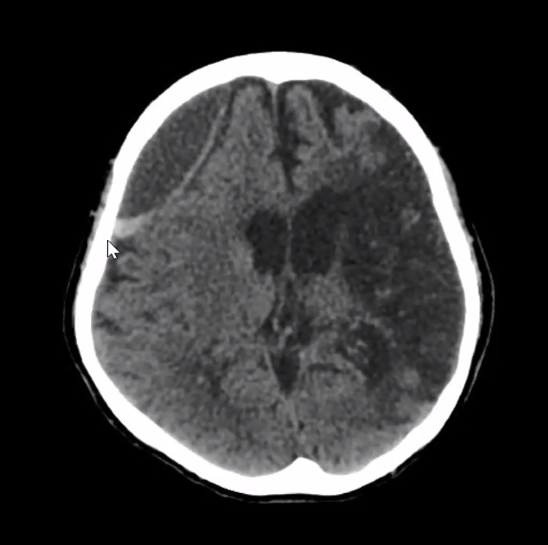 | Acute and chronic condition |

#### CT Angiography

**Complications**

-  Acute tubular necrosis secondary to the contrast used during angiography
  - May be prevented with adequate hydration e.g.  via IV
  - Patients can still incur contrast-induced kidney injury despite all precautionary measures.

#### Spine, Neurological

CT myelogram: direct injection into the spinal canal, can see dural very well. 

Think of the spine as a very simple version of brain

**Spinal anatomy**

- Spinal cord (focus: anything and everything that compresses on the spinal cord)
- T2 fluid bright, T1 fat is bright
- 3 clasffication
  - Intramedullary
  - Extramedullary, intramural: neoplastic
  - Extradural: tumor, degenerative process, infective and trauma

****

**Approach to spinal lesions / pathology**

**Tips in image interpretation**

#### Spine, MSK

### MRI

#### MRI Spine

1. Identify the sequences (T1W, T2W, STIR/TIRM, Pre- and post-contrast)

    T2 water is bright, T1 fat is bright

2. Understand basic anatomy – different spaces (extradural, intradural extramedullary, intramedullary)

3. Look for something obvious. If you see a lesion, try to localise it – which level (cervical, thoracic or lumbar spine), which space (can be difficult at times)

4. Look for mass effect – most importantly, what does it do to the cord or cauda equina (compress or expand), that determines the urgency

5. Come to a diagnosis – not always easy!

Key points:

- To rule out external compression: 
  - Degenerative/Trauma/Masses (extradural/intradural extramedullary)
- To ascertain tumor vs non-tumor for intramedullary lesion:
  - Tumor often has mass effect, with exception in small lesions
- To rule out spinal cord infarct
  - Clinical presentation is the key!

Case: Urinary retention

- T1 weighted sequence, 
- Loss of normal fat in bone marrow - suggestive of marrow infilatration
- T1 fat suppressed post contrast sequence
- Cauda equina syndrome

Spine / bone radiographs: alignment - 2 orthogonal view; bone (contour density), cartilage (decreased), 

T2 normal on the left, and T1 post contrast on the right

Case 2:  Chronic neck pain

Bilateral neck pain and bilateral upper limb numbness

Case: 30M upper limb weakness and bilateral hearing loss

Neurofibromatosis, npc type II

- Meningitis cannot be diagnosed on imaging

Case: 55M unsteady, decreased sensation in the chest over 3 months

Case 5: 30 year old lady presented to you with episodic numbness of all limbs and recent urinary incontinence

- Incomplete horseshoe enhancement and Dawson's fingers are characteristics

Hi there, may I ask you to explain what exactly arterial vs venous phase contrast enhancements are? And what indications are for each?

- WRT the brain, arterial phase will better show the blood vessels, so we can look for clots or aneurysms. The venous phase is taken later than the arterial phase and if better for parenchymal masses /  lesions.

How would one differentiate between a non-contrast scan vs contrast scan, just from images alone? (without knowing what was ordered) thank you!

- Look at the vessels. Contrast scans have more dense vessels...as a general rule
- you can see vessels, mucosa (sinuses) enhancing / brighter

Case: 70 M chest discomfort and sudden onset paralysis of lower limbs, MRI spin

- 

- Spinal cord infarct

When suspecting a posterior circulation stroke, what will be the initial imagining modality of choice? CT or MRI? CT to rule out a bleed. MRI for further assessment if indicated

May I know what are the indications for doing a MRI stroke protocol? Is it done for all suspected stroke?

Also I previously heard that certain institutions in Singapore do not do a non-contrasted CT scan for suspected stroke and will go straight to a MRI can i check whether its true? Thank you

CT Brain is first line. MRI is bad at diagnosisng acute blood. MRI Brain can be done for all potential strokes. Posterior circulation strokes are by far bnetter asessed with MRI Brain. When there is uncertainty regarding an acute stroke, size of stroke etc then MRI brain can be performed. Protocols are always changing

CT  with CT angiogram is the most common way to assess acute stroke around the world. Because fast and more accessible. 

MRI is an option but tends to take longer to acquire

CT brain (non-contrast) is by default the first line of investigation for patient presented with acute neurological deficit - to look for acute intracranial haemorrhage or territorial infarct
If CT brain is normal, then you may further investigate it with MRI brain stroke protocol - this is because lacunar or small cortical infarct may not be visible on CT. 
If clinically patient is suspected to have lacunar or cortical infarct, and patient is not within window for thrombolysis, you may choose to go straight for MRI brain, provided your institution can support early MRI.

Hi can I clarify to following workflow regarding stroke. Upon a clinical suspicion of stroke > 1st is non-contrast CT to determine ischemic vs hemorrhagic. When do you do DW MRI? if the ct don't reveal any pathology and you suspect lacunar infarcts?

CT brain (non-contrast) is by default the first line of investigation for patient presented with acute neurological deficit - to look for acute intracranial haemorrhage or territorial infarct
If CT brain is normal, then you may further investigate it with MRI brain stroke protocol - this is because lacunar or small cortical infarct may not be visible on CT. 
If clinically patient is suspected to have lacunar or cortical infarct, and patient is not within window for thrombolysis, you may choose to go straight for MRI brain, provided your institution can support early MRI.

For cord compression, can I just MRI the suspected spinal segment or the whole spinal cord?

in trauma, usually the affected region is enough (but surgeons may also ask to screen entire spinal axis). but if suspecting other causes (eg. malignancy) often you need to screen the entire spinal axis; you will have to determine the level of neurological involvement ( cervical vs thoracic ). usually the suspected level is enough, but for malignancy the whole spine may be imaged so as to plan further management (as patient may need decompression and instrumentation at multiple levels)

isolating a spinal level is helpful. MRI sequences are usually acquired in sagittal and axial. Sagittal views are large views that can usually see a spinal section e.g. the lumbar spine or cervical spine or thoraco-lumbar or cervico-thoracic spine. Axial sections of a small area is definitely faster to acquire than it is to axial image the entire spine

A little confused regarding the different sequences in MRI and what they are used for. Could you please clarify that please? Thanks!

- As a pre-amble, a very simple way to think about MRI sequences is T1 weighted (T1W) and T2 weighted (T2W) sequences.
- For T1W, we can do it before and after giving IV contrast (gadolinum) to look for abnormal enhancement. For example, inflammation and tumour generally enhances. Just like the metastases that enhanced on the case shown.
- For T2W sequences, fluid is bright. So CSF is very bright, and so are other lesions that contain extra fluid/water (e.g. sites of inflammation, oedema etc). 

When we do an MRI, we use a combination of different sequences and planes (axial, coronal, sagittal) and sometimes IV contrast to make the lesion more obvious.

For case 1 (spine), if patient had no neurological deficits, would a MRI spine be still warranted on the basis of the xray findings?

yes the sclerotic vertebral body is abnormal and the pedicles are not seen, features are suspicious and need further evaluation

S1: Kee Tze Phei       03:29 PM

Assuming the patient does not have neurological deficit, perhaps only vague back pain, we should still proceed with MRI spine for further evaluation based on the x-ray findings.

In spinal cord metastasis, will you usually see a mixed picture of extradural, intradural and intramedullary lesions?

spinal (bone) mets are fairly common and these are extra-dural. spinal cord mets is a specific term used for lesions within the spinal cord (intra-medullary).  leptomeningeal / dural mets can also happen, but these are not cord lesions per se.

Hi, can I ask if there are other differentials to abnormal vertebral sclerosis (as in the first case) besides tumor?

thinking in big categories, need to consider infection and metabolic causes. infection usually involves contiguous segments with disc involvement (spondylodiscitis). Metabolic causes are usually diffuse. Correlation with biochemical markers (FBC, Calcium panel) will help too

Yes.  pattern and distribution of sclerosis will narrow down the differentials. Tumour, infection, healing fractures, metabolic (hyperparathyroidism), congenital (osteopetrosis) are just some examples

Hi, sorry may I clarify what is the usual radiological workup sequence for a patient presenting with initial suspicion of metastatic spinal cord compression? Would it be X-ray —> MR spine (contrast v no contrast?) or CT myelogram.. and is MRI the gold standard for diagnosis? Thank you very much!

MRI with contrast will be the investigation of choice.

What does the term 'effacement of CSF' mean in MRI descriptions? (eg- cervical myelopathy etc)

Effacement in radiology terms means that its ‘lost’ or obscured. In this case is means something is occupying the CSF space hence the normal signal is lost.

Moderator: Tan Jin Rong       03:41 PM

it means the CSF space around the spinal cord is narrowed, for example due to disc-osteophyte complexes in context of degeneration

S1: Kee Tze Phei       03:41 PM

Effacement of cerebrospinal fluid (CSF) space suggest underlying mass effect. 
Remember the Monroe-Kellie hypothesis in the brain lecture? If there is a pathology with mass effect, whether it is in the brain or in the spine, it should be compensated by narrowing / effacement of the CSF spaces.

Just wondering how long does it usually take to MRI the whole spine if to rule out malignant cord compression?

S3: Steve Wong Chen Pong       03:42 PM

Persegment of the spine cervical , thoracic, lumbar, takes about 30 mins each for routine sequences plus contrast sequences. So whole spine can take up to 1.5 hours.

Tan Min-On       03:42 PM

There are fast screening protocols and normal detailed protocols. A screening mRI whole spine consisting of whole spine sagittal images and maybe a 3 level axial image in a single sequence may take 30-40 mins depending on patient cooperation.
A mri whole spine pre-post contrast looking for mets for e.g. may take up to 1.5-2 hours

Would we prescribe anticoagulation for spinal cord strokes?

Tan Min-On       03:43 PM

this would depend on the cause for the stroke and other clinical factors

S1: Kee Tze Phei       03:45 PM

Yes you should consider instituting antiplatelet therapy, in the absence of other contraindications. 
More importantly, you need to look for the cause of spinal cord infarct especially if there is any underlying aortic dissection.

Good afternoon! How would we differentiate dissection and aneuryms on imaging?

Tan Min-On       03:46 PM

they are two separate vascular abnormalities. A dissection- a flap needs to be seen. Aneurysms refer to a focal area of saccular or fusiform dilatation of a vessel. in general you need dedicated imaging (ct angiography / angiography) to see the flap and probably evaluated the vascular lumen

### Positive Emission Tomography

PT/CT fused FDG PET /CT commonly obtained for staging CA

### Nuclear Imaging

#### Radionuclide bone scan 

 Identify foci of osteomyelitis or bone metastasis.

Nuclear **scintigraphy** of the **bone** commonly utilizes the **radionuclides** technetium-99m (Tc-99m) or fluoride-18 (F-18). Tc-99m is usually attached to medronic acid (Tc-99m MDP), and F-18 is usually incorporated into sodium fluoride (F-18 NaF).

### Tubes and Lines in Imaging

Mark Wong

For all lines and tubes trace the full length.

#### CXR for assessment of NGT insertion

Every reinsertion and repositioning should require a check CXR.

**Possible Outcomes**

- NGT wrongly inserted into the lung
- NGT has perforated into the mediastinum
- NGT is coiled proximally
- NGT coiled in the stomach / distal esophagus
  - Esophagus, usually coiled vertically
  - Coiled horizontally rather than esophagus
- Nothing wrong, external artefact

**Normal**

- Follows the esophagus
- Tip should be at least 10 cm below gastroesophageal junction - so all side holes are below lower esophageal junction; about 1.5 - 2 cm below the 
- Relatively straight and no coiling
- Cuts across the left main bronchus (should not follow it)

**Complications**

- Look out for aspiration pneumonia
- Look for bronchial insertion with penetration resulting in pneumothorax

#### CXR for assessment of ETT placement

- Normal EGG 
  - Is expected to move up and down with neck flexion and extension (+/- cm approximately)
  - Tip should be between medial end of clavicles and >2 cm from carina
  - Follows tracheal outline (in contrast to esophageal insertion)

**Problems**

- Over-inserted ETT tends to enter the right main bronchus due to its more vertical orientation
  - Complications: 
    - Left lung collapse
    - Right upper lobe collapse
    - Pneumothorax (barotrauma from positive pressure ventilation)
      - In supine CXR patients have **deep sulcus sign** (collect in inferior sulcus of the lung) instead of collecting at the apex
      - **Chest tube** may also be a tip
- Oesophageal Intubation
  - Gastric buble extended

#### CXR Sepsis query source

- Acute pulmonary edema with **bats wing appearance**
  - Patient has ECG for a while
- Dislodged teeth post-intubation - rare complication
- Commoner complications
  - Right main bronchus intubation
  - Oesophageal intubation
  - Pneumothorax (barotrauma from positive pressure ventilation)

#### Post Chest-tube Insertion for Review

- Chest tube has side holes, they need to be in the pleural space as well.
  - Subcutaneous emphysema can be a red herring that comes and goes; Far more important is to pay attention to the tube position 
  - The side hole must not migrate out
    - Fluid will accumulate
- Check that all side holes are in position

#### Cholecystostomy Tube

- Percutaneous cholecystoscopy

#### PICC

These are inserted in a vein in the arm, i.e. brachial or basilic vein; The catheter will end in the SVC and the right atrium. 

**Learning points**

- Venous catheter tips should be in the large central veins (e.g. SVC, atriocaval junction)
- Atriocaval junction about 1.5 - 2 vertebral bodies below the carina
- Too far in the right atrium or ventricle will have thrombus

#### Central Line

Central line SHOULD NOT cross the spine

Venous line in ARTERIAL system

- Do not remove the line (fatal haemorrhage)
- Clinical bright red pulsatile flashback, arterial blood gas, arterial waveform
- KIC CT or ultrasound
- Contact interventional radiologist
  - Fluroscopy 
  - Arterial closure devices

Axillary line / stent in situ.

#### Pacemaker

- Pneumothorax: not an uncommon complication of thoracic line / device insertion. Always check
- Hemothorax / haemoatoma, 

#### Biliary Stent

#### Pancreatic Stent
