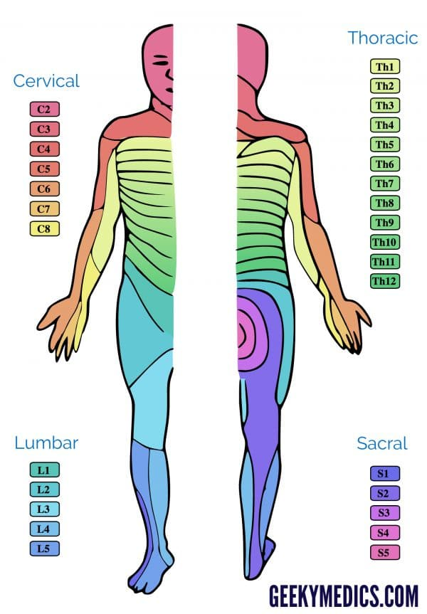

Neurology
=========

## General

### Dermatome and Myotome

|Dermatome | Key Sensory Landmarks | Action
|----|----|---
C1 | na       |
C4 | Shoulder |
C5 | Lateral antecubital fossa just proximal to elbow joint | elbow flexion - biceps and brachialis, biceps reflex 
C6 | Dorsal proximal phalanx of thumb | wrist extension - extensor carpi radialis longus and brevis, biceps reflex, supinator reflex
C7 | Middle Finger | elbow extension-tricepts, triceps reflex
C8 | Little Finger | middle finger flexion - flexor digitorum profundus (distal phalanx)
T1 | | Little finger abduction - abductor digiti minimini, interossei
T4 | Nipples | 
T6 | Xiphoid | 
T10 | Umbilicus
T12 - L 1 | inguinal and medial thigh | No motor deficit
L3 | Just above the patella | Weakened quadriceps, deminished patellar reflex
L4 | Medial malleolus | Extensor weakness of big toe and foot
L5 | Great toe | Diminished or absent Achilles reflex
S1 | Lateral malleolus
S4-5 | Peri-anal

### Muscle Grading System

Grade | Description
|---|---
0 | Total paralysis
1 | Palpable or visible contraction
2| Active movement, full range of motion, gravity eliminated
3 | Active movement, full range of motion, against gravity
4| Active movement, full range of motion, against gravity and provides some resistance
5| Active movement, full range of motion, against gravity and provides normal resistance
NT | Patients unable to reliably exert effort or muscle unavailable for testing due to factors such as immobilization, pain on effort, or contracture

----------------------

Key Presentations

-   mass effect -- headaches, bitemporal hemianopsia, psychiatric disorders, cognitive difficulties

**Nystagmus**
Central vs. Peripheral
Rarely an eye cause, most of the time an eye cause
Ophthalmologist sees to distinguish between different nystagmus because other doctors are not interested.
Dr. Umapthi and a few worldwide doctors are interested.

Ears
----

### Benign paroxysmal positional vertigo (BPPV)

Causes acute onset vertigo that can be associated with nausea and vomiting and intact hearing.

Vertigo in BPPV is thought to be caused by calcium carbonate debris in the semicircular canals.

BPPV typically causes episodic rather than constant vertigo that is triggered by positional change as calcium debris moves within the semicircular canals. Symptoms usually resolve several seconds to minutes following position change in BPPV.

Physical Exam

-   Dix-Hallpike Maneuver - Turn the patient's head to 45 degrees and quickly lay him down supine with his head just over the end of the exam table. Then turn the head to the side which should reproduce the symptoms of dizziness and produce nystagmus. Observe for 20 to 30 seconds. If present, the nystagmus will have the fast component in the direction of the pathology. Next, sit the patient up and observe again for nystagmus.

Diganosis is clinical based on history and physical exam

Management

-   The Epley maneuver, or canalith repositioning, is the hallmark of treatment for BPPV. The etiology of vertigo in BPPV is the presence of calcium debris in the semicircular canals. Through careful positioning of the patient, the Epley maneuver relieves symptoms by returning the deposits back to the vestibule. The maneuver can be performed in the clinic and modified by the patient at home. To perform the Epley maneuver for right-sided symptoms, the patient sits on the exam table with his head turned 45 degrees to the right. With the clinician supporting the head, the patient quickly lies back with his head hanging over the exam table supported by the clinician as in the Dix-Hallpike test. Once the nystagmus has stopped, the clinician turns the head 90 degrees to the left and the position is held for 30 seconds. Next, the patient rolls onto his left side, with his face at a 45 degree angle to the floor. This position is held for 30 more seconds. The patient returns to the sitting position now with his legs off the left edge of the table. After another 30 seconds, the patient can resume normal head position. The maneuver can also be repeated on the other side. Repositioning maneuvers are not effective for the treatment of vertigo not caused by canalith debris.

-   A Cochrane review found \"There is moderate to strong evidence that vestibular rehabilitation is a safe, effective management for unilateral peripheral vestibular dysfunction, based on a number of high quality randomized controlled trials.\" Patients can be trained in vestibular rehabilitation by a physical therapist.

-   Vestibular suppressant medications can be effective short-term treatment of vertigo. Commonly used anticholinergic vestibular suppressants such as meclizine and dimenhydrinate also have some anti-emetic effects that are useful in controlling the nausea and vomiting associated with vertigo. Anti-emetics can be a useful adjunct in select patients. Non-selective phenothiazine anti-emetics, such at metoclopramide and promethazine, can be effective. Since all these medications can also cause sedation, they should be used acutely only and avoided in the elderly.

### Vestibular neuritis

Commonly associated with a recent URI.

Results when a viral (or, less commonly, bacterial) infection of the inner ear causes inflammation of the vestibular branch of the eighth cranial nerve.

Nystagmus caused by a peripheral lesion such as this does not change direction with gaze.

### Acute labyrinthitis

Similar to vestibular neuritis in that it is associated with recent URI and follows a similar clinical course.

Distinguished from vestibular neuritis by its associated hearing changes (not present in the former).

occurs when an infection affects both branches of the eighth cranial nerve resulting in tinnitus and/or hearing loss as well as vertigo.

### Vestibular migraine

Vestibular migraine is a variant of migraine that can cause central vertigo.

Most patients will give a history of previous migraine headaches. However, at the time of a vestibular migraine, many patients do not have a headache.

This is a central cause of vertigo, which can be distinguished by a careful exam.

### Meniere's disease

Episodes of unilateral hearing loss, tinnitus, and vertigo form the classic triad of Meniere's disease.

Management

-   Diuretics and a low salt diet are commonly used to treat the vertigo of Menière's disease following reasoning that use of diuretics will decrease the endolymphatic pressure and abate symptoms. A 2006 Cochrane review noted that there were \"no trials of high enough quality\" to allow a recommendation for or against the use of diuretics in the treatment of Menière's disease.

### Otitis Media

Otitis media can occasionally be a cause of vertigo. After a recent upper respiratory infection, otitis media is a possibility; however, patients with otitis media usually have ear pain and an abnormal ear exam. Fever also commonly accompanies otitis media.

#### Uncomplicated otitis media

-   Management

    -   If \>2: observation without prescribing antibiotics

    -   6mth - 2yr: cautiously observed first - depending on the certainty of the diagnosis, social supports, and clinical picture

    -   children less than six months should be treated with antibiotics

Cerebrovascular Diseases
------------------------

Mechanisms of cerebrovascular disease include (TECH)

1.  Thrombotic -- Native clot within the intracranial vasculature -- 85% of strokes are caused by vascular occlusion (thrombotic); these may be associated with hematologic mechanisms including

    -   hyperviscosity or myleoproliferative syndromes (polycythemia, leukemias, or thrombocytosis)

    -   vascular obstruction (sickle cell anemia)

    -   severe anemia and conditions associated with hypercoagulable states (lupus anticoagulant or antiphospholipid antibody;

    -   presence of Factor V Leiden;

    -   or deficiencies of protein C, protein S, or antithrombin III).

2.  Embolic -- Most commonly from the heart or carotid artery-- arrhythmias may produce emboli from mural thrombi, atrial appendages, or from diseased heart valves

3.  Cardiogenic -- Secondary to a decrease in cerebral perfusion caused by decreased cardiac output (e.g.: anginal event associated with coronary artery disease), severe hypotension, or hypoxemia related to severe anemia or poor oxygen saturation; note that it is also possible to have extrinsic compression of cranial vessels (cervical osteophytes, or rotational kinking, tumor), vasospasm (migraine, cocaine) and vasculitis.

4.  Hemorrhagic -- Secondary to pathologic cerebrovascular changes within the brain attributable to aging, smoking, hypertension, and hyperlipidemia.

Location of Infarct and Associated Symptoms

-   Right parietal infarct: Right-hand dominant patients with strokes in the area of the brain are likely also to have left hemiplegia. Patients with right middle cerebral infarcts affecting the right parietal hemisphere may have difficulties with their spatial and perceptual abilities, which causes them to misjudge distances, or they may attempt to read holding books upside down. They may ignore people or objects in their left visual field or not pay attention to that area of the room. They may also not recognize their functional impairments (denial of stroke disability).

-   Strokes that occur in the brain stem would likely be the cause of respiratory impairment and affect vital functions of blood pressure, heartbeat and consciousness.

-   Expressive and receptive aphasia and right facial weakness are classically associated with a left middle cerebral artery stroke.

-   A central nerve injury such as a stroke often spares involvement of the portion of the facial nerve that controls the forehead. This is because there is bilateral central control of this portion of the facial nerve. In contrast, a peripheral injury to the facial nerve (such as Bell's Palsy) causes facial weakness of the forehead.

Complication of Stroke

-   Aspiration Pneumonia

-   Malnutrition and dehydration

-   Pressure sores

-   Post-stroke depression

    -   Epidemiology: One third of stroke survivors experience post-stroke depression.

    -   Definition: DSM 5 defines this the occurrence of a mood disorder judged to be due to the direct physiological effects of another medical condition.

    -   Cause: The precise cause of depression following stroke is unknown and its development is thought to be due to multiple factors which include lesion location, individual adjustment to disability, and levels of family or social support.

    -   Complications: Untreated post-stroke depression can impede rehabilitation progress and lead to impaired functional outcome, cognitive decline, and increased mortality.

    -   Management: SSRIs are accepted first-line therapy and have been proven to improve clinical outcomes in suffers of post-stroke depression. Selection of a particular SSRI is guided by the potential for drug-drug interactions and patient tolerance.

Assessment of stroke implication and rehabilitation

-   Basic activities of daily living

    -   Bathing

    -   Dressing and undressing

    -   Eating

    -   Transferring from bed to chair, and back

    -   Voluntarily control urinary and fecal discharge

    -   Using the toilet

    -   Walking (not bedridden)

-   Instrumental activities of daily living

    -   Light housework

    -   Preparing meals

    -   Taking medications

    -   Shopping for groceries or clothes

    -   Using the telephone

    -   Managing money

#### Prevention of Stroke in Patients with History of Stroke or TIA

Anticoagulation

-   For patients with ischemic stroke or TIA with proxysmal (intermittent) or permanent AF\
    Anticoagulation with a vitamin K antagonist (target INR, 2.5; range, 2.0-3.0)or DOAC is recommended (Class I Level of Evidence A).

-   For patients unable to take oral anticoagulants\
    Use asprin alone (Class I; level of Evidence A). The combination of clopidogrel plus aspirin carries a risk of bleeding similar to that of warfarin and therefore is not recommended for patients with a hemorrhagic contraindication to warfarin (Class III, level of evidence B). The selection of an antithrombotic agent should be individualized on the basis of risk factors, cost, tolerability, patient preference, potential for drug interactions, and other clinical characteristics, including time in INR therapeutic range if the patient has been taking warfarin.

Manage Risks

-   Hyperlipidemia: All patients with a history of TIA or CVA should be placed on high-intensity statin such as atorvastatin 40 or 80 mg or rosuvastatin 20 mg.

-   Hypertension

    -   Antihypertensive treatment is recommended for prevention of recurrent stroke and other vascular events in persons who have had an ischemic stroke and are beyond the hyperacute period.

    -   Recent guidelines suggest that setting a blood pressure goal of 130/80 mmHg is appropriate. Given his age, one should be cautious about lowering his blood pressure too aggressively, leading to orthostasis and a subsequent fall.

    -   JNC-8 guidelines also recommend utilizing an ACEi and a diuretic for recurrent stroke prevention.

-   Diet (level A)

    -   The ACC/AHA Lifestyle Guidelines recommend all adults consume a Mediterranean diet to reduce their risk of ASCVD.

    -   patients with hypertension should limit sodium intake to 2,400 mg per day or less.

-   Smoking: All ischemic stroke or TIA patients who have smoked in the past year should be strongly encouraged not to smoke. (Level C)

-   Physical activity: all adults are encouraged to engage in moderate-to- vigorous intensity physical activity 3-4 times per week for 40 minutes per session. For those with disability after ischemic stroke, a supervised therapeutic exercise regimen is recommended. (Level C)

Finally, do stroke education, including knowledge of stroke warning signs and need to call 911 in the event of a cerebrovascular event as well as awareness of individual's own risk factors.

#### Stroke rehabilitation therapy

Rehabilitative therapy begins in the acute-care hospital after the patient's medical condition has been stabilized, often within 24 to 48 hours after the stroke. The first steps involve promoting independent movement because many patients are paralyzed or seriously weakened. Patients are prompted to change positions frequently while lying in bed and to engage in passive or active range-of-motion exercises to strengthen their stroke-impaired limbs. Patients progress from sitting up and transferring between the bed and a chair to standing, bearing their own weight, and walking, with or without assistance. Rehabilitation nurses and therapists help patients perform progressively more complex and demanding tasks, such as bathing, dressing, and using a toilet, and they encourage patients to begin using their stroke-impaired limbs while engaging in those tasks. Beginning to reacquire the ability to carry out these basic activities of daily living represents the first stage in a stroke survivor's return to functional independence.

Post-stroke rehabilitation involves physicians; rehabilitation nurses; physical, occupational, recreational, speech-language, and vocational therapists; and mental health professionals.

### Transient Ischemic Attack

-   Prognosis: Individuals experiencing TIA symptoms have been shown to have an 8% to 12% chance of having a stroke within one week and an 11% to 15% chance of having a stroke within one month.

### Ischemic Stroke

-   Evaluation

    -   CT and MRI

    -   Renal function and electrolytes

    -   ECG and markers for cardiac ischemia

    -   CBC and PT/PTT

    -   Oxygen Saturation

    -   Blood glucose

-   Management

    -   Time is crucial in evaluation of a patient with suspected ischemic stroke because if given within four-and-a-half hours, intravenous t-PA has proven benefit in salvaging hypoxic brain tissue. Intra-arterial therapy improves functional outcomes if it can be given within six hours.

    -   As for all critically ill patients, the initial evaluation follows the path evaluation and stabilization of the patient's CABs (circulation, airway, breathing).

    -   This is quickly followed by a secondary assessment of neurological deficits and possible comorbidities with the National Institutes of Health Stroke Scale (NIHSS).

    -   The overall goal is not only to identify people with possible stroke, but also to exclude stroke mimics, identify other conditions requiring immediate intervention, and determine potential causes of the stroke for early secondary prevention.

    -   While some labs may be conducted during initial emergency evaluation, rtPA thrombolytic therapy should not be delayed awaiting for results unless

        1.  there is clinical suspicion of a bleeding abnormality or thrombocytopenia

        2.  the patient has received heparin or warfarin

        3.  use of anticoagulants is not known

Seizures
--------

-   Presentation

    -   Seizure may present with an aura of dizziness or lightheadedness.

    -   May occur with sudden and extreme elevations of blood pressure associated with papilledema.

    -   May be followed by a brief period of temporary paralysis (Todd's paralysis). The seizure is followed by partial or complete paralysis on one side of the body and may also affect speech and vision. The average duration of the paralysis is 15 hours, but can last from thirty minutes to 36 hours at which point symptoms resolve completely.

    -   Aura is a disturbance of visual, hearing, taste, smell or altered body sensation usually arising for the temporal lobe signaling impending seizure onset.

    -   Amnesia for the event and alteration of consciousness is a hallmark of seizure disorder.

    -   A seizure (idiopathic or due to an identified cause) is unlikely if the patient has recall of the event, no post- ictal period of confusion, and no evidence of focal findings, oral injury, or urinary/fecal soiling.

Meningitis and Encephalitis
---------------------------

Traumatic Brain Injury
----------------------

Delirium
--------

-   Clinical feature

    -   Fluctuating disturbance in attention and arousal that can develop acutely in the context of an underlying medical illness

    -   Common postoperatively or in the setting of new or worsening infections (e.g. UTI)

    -   May also occur with the introduction of new medications (e.g. opioids, benzo, anticholinergics)

    -   Elderly are at higher risk for delirium

-   Diagnosis

    -   Supercedes psychotic disorder due to a medical condition

-   Management

    -   Identification and treatment of the underlying condition

    -   Antipsychotic may be used, but second line

Dementia
--------

Differential Diagnosis of Dementia Subtypes

L1.75 in\|L3 in\|L2 in Alzheimer Disease & Early insidious short-term memory loss, language deficits and spatial disorientation, later personality changes&\
Vascular dementia & Stepwise decline, early executive dysfunction, cerebral infarction and or deep white matter changes on neuroimaging &\
Frontotemporal Dementia & Early personality changes, apathy, disinhibition and compulsive behavior, hypeorality, frontotemporal atrophy on neuroimaging & SSRI, trazodone\
Dementia with Lewy bodies & Visual hallucinations, spontaneous Parkinsonism, fluctuating cognition &\
Normal pressure hydrocephalus & Ataxia early in disease, urinary incontinence, dilated ventricles on neuroimaging\
Prion Disease & Rapid progressive dementia, myoclonus, hypokinesia, and cerebellar dysfunction\
HIV-associated Dementia & Characterized by subcortical symptoms in the early course of disease, CD4+ \<200/mm3 &\

### Vascular Dementia

-   Clinical

    -   Mild memory impairments

    -   Prominent executive dysfunction

    -   Focal neurological deficits corresponding to cerebrovascular pathology

    -   Stepwise decline

### Creutzfeldt-Jakob Disease

A prion disease in which abnormally folded proteins (i.e. prions) accumulate, leading to neuronal death. The majority of cases (85%) are sporadic, but hereditary and iatrogenic forms also exist. The average age of onset of sporadic CJD is between 50 -70.

-   Clinical features

    -   Rapidly progressive dementia

    -   of 4 clinica features

        -   Myoclonus

        -   Akinetic mutism

        -   Cerebellar or visual disturbances

        -   Pyramidal / extrapyramidal dysfunction (e.g. hypokinesia)

-   Lab findings

    -   of the following:

        -   Periodic sharp wave complexes on EEG

        -   Positive 14-3-3 CSF essay

        -   Caudate nucleus / putamen MRI findings

    -   Neuropathology: spongiform changes, neuronal loss without inflammation

-   Management

    -   No treatment is available

    -   Fatal within 12 months of diagnosis

### Alzheimer's Disease

Diagnosis

-   mild atrophy of the hippocampus on CT head

Management

-   Cholinesterase inhibitors\
    Four cholinesterase inhibitors (donepezil, rivastigmine, tacrine and galantamine) show statistically significant, though clinically small benefits for patients with mild to moderate dementia. Studies have demonstrated improvements in MMSE, ADL, and IADL scores, but the improvements are small enough that most families and clinicians will be unable to detect them. A recent meta-analysis demonstrated that a physician would need to treat 12 patients with mild to moderate Alzheimer's dementia for one to achieve minimal improvement or better, and for one to have a treatment-related side effect. A systematic review in 2008 concluded that cholinesterase inhibitors lead to statistically significant but \"clinically marginal\" effects.

-   Vitamin E\
    The use of vitamin E in the treatment of dementia is controversial. One large trial (the Alzheimer's Disease Cooperative Study) of 2000 IU daily demonstrated a delay in the onset of death, institutionalization, or progression to severe dementia of 670 days compared to placebo among patients with moderate to severe dementia. Due to this study, the American Academy of Neurology recommends the use of Vitamin E in the management of dementia. Concern has arisen from a recent meta-analysis of vitamin E supplementation that demonstrated a rise in all-cause mortality. A 2012 Cochrane Collaboration review concluded that there was no convincing evidence that Vitamin E is of benefit in the treatment of Alzheimer's dementia. Clinicians should discuss the potential risks and benefits with patients and their families on an individual basis.

-   Memantine\
    Memantine (Namenda) is an N-methyl d-aspartate (NMDA) receptor antagonist that is FDA-approved for use in moderate to severe dementia. Randomized trials suggest that, like the cholinesterase inhibitors, memantine leads to small but statistically significant improvements in cognition. The clinical relevance of the improvements is not clear, but the medication is generally well tolerated and there are few other options. It may be used in combination with cholinesterase inhibitors in patients with severe dementia. A 2011 systematic review found no evidence that memantine is effective in mild Alzheimer's and only meager evidence of its efficacy in moderate Alzheimer's.

-   Respite\
    For community dwelling patients with dementia, providing support and respite to their caregivers is essential to their care. Respite care may take a variety of forms. For a family with ample local support, simply having family members take turns replacing the primary caregiver is inexpensive and effective. Patients may pay to have a home health aid come at various intervals. Such aids can provide assistance with specific non-medical tasks such as bathing, shopping, and laundry, or they may simply allow the primary caregiver to leave for a while. The most structured form of respite is an adult day program. Such programs provide all the services available in a nursing home (e.g., nutrition, nursing, medication management, recreation) but only during work hours on weekdays. Such programs may allow a patient with advanced dementia to delay long-term institutionalization.

-   Atypical antipsychotics\
    Behavioral disturbance (such as aggression or psychosis) is a common and difficult problem as dementia progresses. Careful identification of exacerbating factors can lead to specific approaches to alleviate the problem (e.g. recognition and treatment of constipation leading to agitation). However, medications often have a role in the management of behavior. The atypical antipsychotics olanzapine (Zyprexa) and risperidone (Risperdal) appear to have a modest benefit in managing such neuropsychiatric symptoms and are commonly used. Two recent studies have suggested that patients given atypical antipsychotics have a slightly higher risk of death. In 2006 the FDA placed \"black box\" warnings on the labeling for these medications and the conventional antipsychotics (such as haloperidol) indicating the increased risk of death among elderly patients with dementia. Because of this, it is important to attempt behavioral treatments first and to openly discuss the goals and risks of treatment with patients' families prior to starting these medications. For some families, managing severe behavioral symptoms using a medication with a known mortality risk is preferable to the alternative of living with the symptoms. Additionally, providers should understand that the increased mortality concerns come from data about the long-term use of antipsychotics in chronic behavioral disturbance. The safety of these medications in the acute management of delirium should be considered separately.

### Frontotemporal Dementia

### Major or minor neurocognitive disorder due to HIV infection

### Dementia with Lewy Bodies

abnormal aggregates of protein that develop inside nerve cells in Parkinson disease and often presents with Parkisonian symptoms, fluctuations in alertness and attention (delirium), and visual hallucinations.

-   Clinical feature

    -   Presents with dementia plus of the following features

        -   Visual hallucinations

        -   Parkinsonism

        -   Fluctuating cognition

        -   REM sleep behavior disorder

        Importantly, the cognitive impairment would develop in this condition before or at the same time as parkinsonism, not years later, as in PDD.

-   Management

    -   Carbidopa-levodopa for parkinsonism

    -   Cholinesterase inhibitos (e.. rivastigmine) for cognitive impairement

    -   Melatonin for REM sleep behavior disorder

    -   Trial of anti-psychotic (e.g. quetiapine) may be indiciated in patients with functionally impairing visual hallucinations or delusions, but it must be prescribed with caution due to extreme antipsychotic hypersensitivity of patients with DLB, which presents with:

        -   Worsening confusion

        -   Parkinsonism

        -   Autonoic dysfunction - orthostatic hypotension

Movement Disorders
------------------

### Huntington's Disease

### Parkinson's Disease and Parkinsonism

Parkinson disesaes leads to the loss of dopaminergic neurons in the substantia nigra. It may present wiht social isolation and withdrawal.

#### Parkinson Disease Dementia

Approximately 1/3 of patients with Parkinson Disease develop PDD.

-   Risk factors

    -   Age

    -   Duration

    -   Severity

-   Presentation

    -   Executive and visuospatial dysfunction

    -   Visual hallucinations, delusions, sleep disorder occur at a higher rate in PDD then in Parkinson disease

-   Diagnosis

    -   PDD is diagnosed when parkinsonism predates cognitive impairment by ?1 year

-   Management

    -   Cognitive impairment is treated symptomatically with cholinesterase inhibitor e.e.g donepezil

#### Psychosis in Parkinson Disease

-   Due to underlying disease process, medication, or a combination

-   Two of the most common anti-Parkinson medication classes associated with psychosis are dopamine precursors (e.g. levodopa) and dopamine agonists (e.g. pramipexole)

-   Management

    1.  Review patient's medication

    2.  Consider a cautious dose reduction

    3.  Patients who do not improve with a reduction or who cannot tolerate dose reduction due to resurgent motor symptoms can be treated with a low-potency, second-generation antipsychotic (e.g. quetiapine, pimavanserin).

#### Antipsychotic-induced parkinsonism

Antipsychotic medication may cause drug-induced parkinsonism, which is a type of extrapyramidal symptoms (EPS)

-   Management

    -   Reducing the dose of the antipsychotic

    -   Switching to an antipsychotic with less potential to cause EPS if feasible

    -   Adding an anticholinergic antiparkinsonian medication with the antipsychotic is working well e.g. benztropine or amantadine

### Progressive Supranuclear Palsy

A rare syndrome, that presents with falls, impaired vertical gaze, and parkinsonism.

Myelin Diseases
---------------

### Multiple Sclerosis

Most common autoimmune inflammatory demyelinating disease, common in woman age 15 - 50 year old, and is characterized by a relapsing-remitting course of CNS dysfunction. Relapses of MS may be more common after stressful life events.

-   Diagnosis

    -   \>2 clinically distinct episodes of CHS dysfunction with resolution

    -   Hyperintense lesions on MRI

-   Complication

    -   Depression has been found in 2/3 of MS patients and is likely caused by a combination of factors including

        -   inflammatory changes in the brain

        -   immune system changes

        -   psychological reactions to neurological deficits and challenges of living with MS

        Manage with antidepressants and psychotherapy.

    -   Psychosis due to use of high-dose glucocorticoids.

Neuro-Oncology
--------------

### Glioblastoma Multiforme

Locally invasive and destructive cancer, never metastasis but kills.

### Schwannoma

S100 stain

Syndromes
---------

#### Osler Weber Rendu Syndrome
