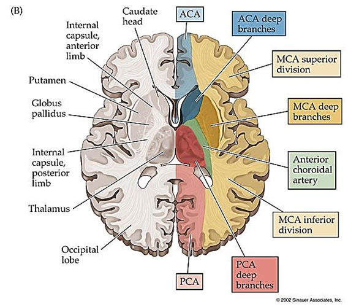
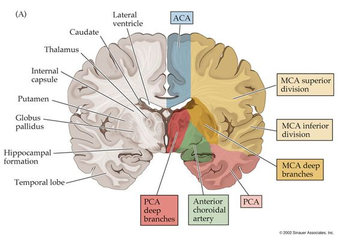
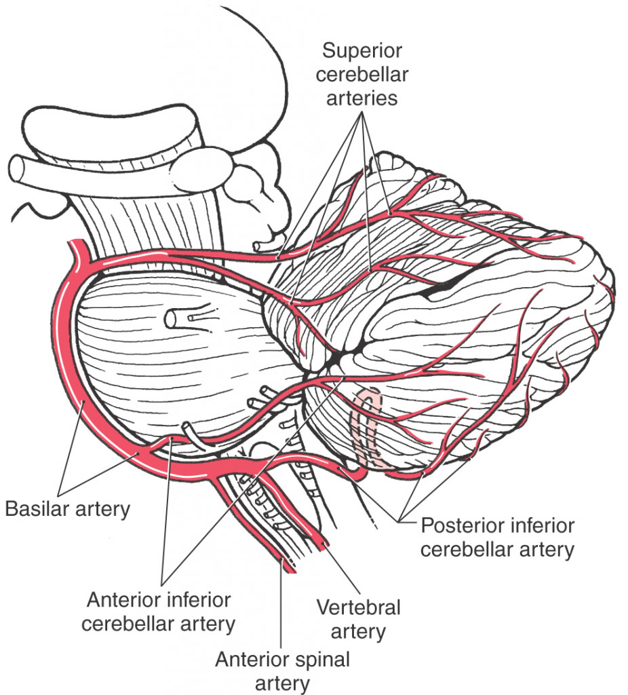
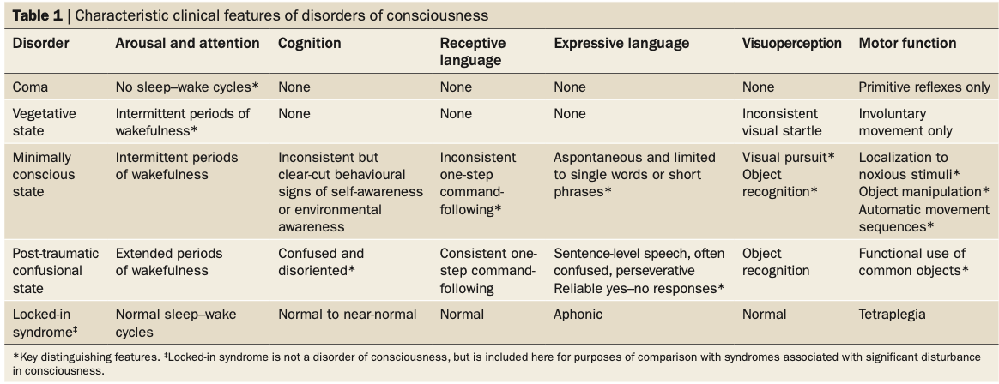
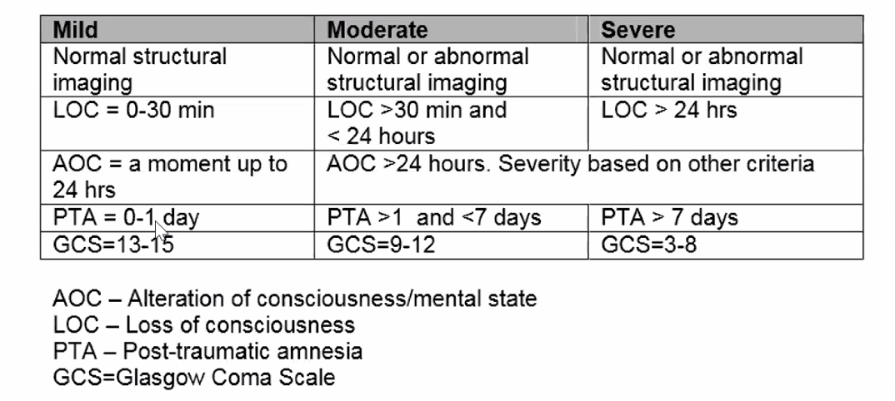
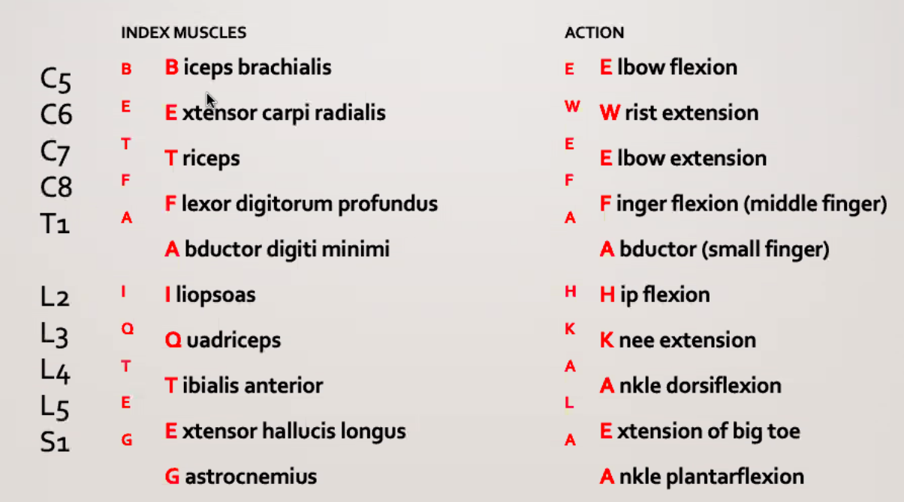
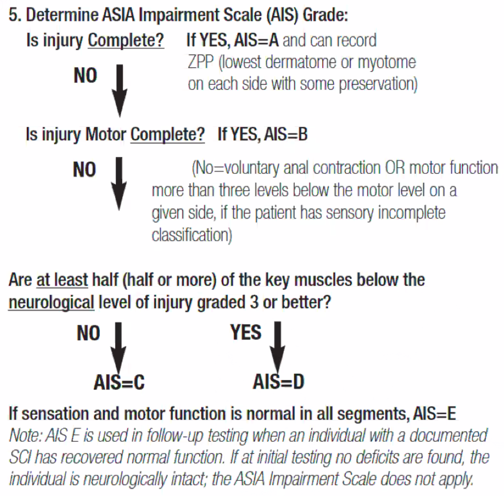
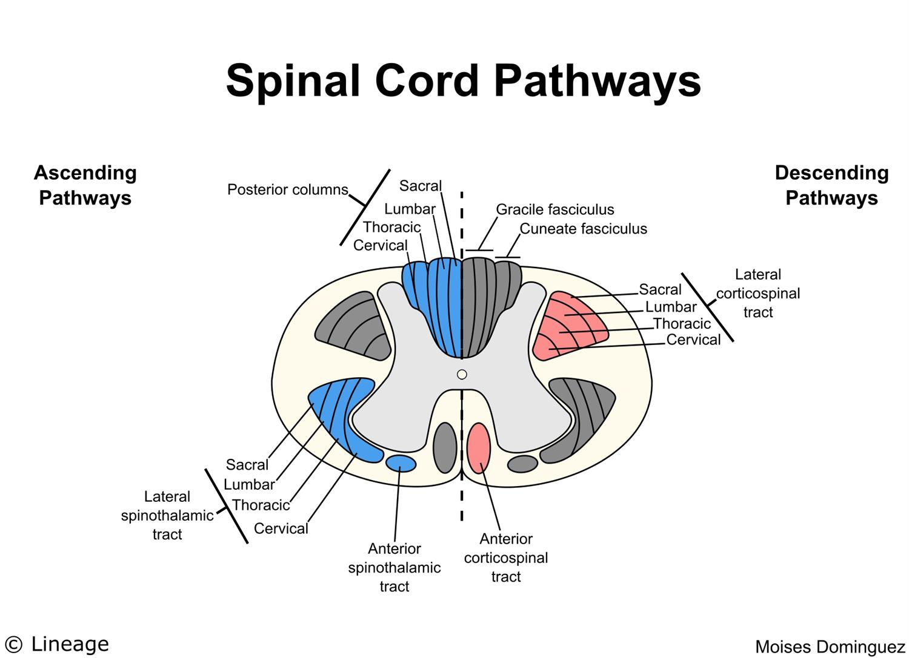
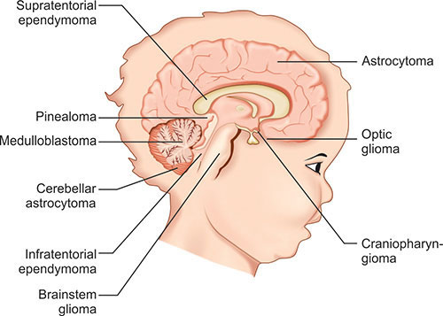

Neurology
=========

## General

### Blood Supply

### Dermatome and Myotome

|Dermatome | Key Sensory Landmarks | Action
|----|----|---
C1 | na       |
C4 | Shoulder |
C5 | Lateral antecubital fossa just proximal to elbow joint | elbow flexion - biceps and brachialis, biceps reflex 
C6 | Dorsal proximal phalanx of thumb | wrist extension - extensor carpi radialis longus and brevis, biceps reflex, supinator reflex
C7 | Middle Finger | elbow extension-tricepts, triceps reflex
C8 | Little Finger | middle finger flexion - flexor digitorum profundus (distal phalanx)
T1 | | Little finger abduction - abductor digiti minimini, interossei
T4 | Nipples | 
T6 | Xiphoid | 
T10 | Umbilicus
T12 - L 1 | inguinal and medial thigh | No motor deficit
L3 | Just above the patella | Weakened quadriceps, deminished patellar reflex
L4 | Medial malleolus | Extensor weakness of big toe and foot
L5 | Great toe | Diminished or absent Achilles reflex
S1 | Lateral malleolus
S4-5 | Peri-anal

### Muscle Grading System

Grade | Description
|---|---
0 | Total paralysis
1 | Palpable or visible contraction
2| Active movement, full range of motion, gravity eliminated
3 | Active movement, full range of motion, against gravity
4| Active movement, full range of motion, against gravity and provides some resistance
5| Active movement, full range of motion, against gravity and provides normal resistance
NT | Patients unable to reliably exert effort or muscle unavailable for testing due to factors such as immobilization, pain on effort, or contracture

### Signs and Symptoms

- A frontal cortex lesion results in hemiparesis (with motor aphasia if the dominant lobe is involved).
- Left temporal lobe involvement leads to receptive aphasia.
- Occipital lobe damage results in visual disturbances.

#### Hemineglect Syndrome

The patient neglects the left side of a space and responds to the stimuli coming only from the right side. Patients may shave only the right side of their face, comb the right side of their hair, and ignore objects located in the left side of a space. Anosognosia (ie, unawareness of the condition) may also be present. Asking a patient to fill in the numbers of a clock is a typical test that is used to detect hemineglect syndrome.

This syndrome is caused by the lesion of the right **(nondominant) parietal lobe**, which is responsible for spatial organization.

#### Cranial Nerves and Clinical Relevance

| Cranial Nerve                 | Clinical                                                     |
| ----------------------------- | ------------------------------------------------------------ |
| Abducens nerve (CN VI)        | Uncal herniation usually occurs later in the clinical presentation, with a symptom of inability to abduct the eye. |
| Facial Nerve CN VII           | The facial nerve originates between the pons and medulla, and lesions at that level can cause an upper motor neuron lesion, resulting in contralateral lower facial droop. |
| Glossopharyngeal nerve CN IX  | Most commonly injured by compression from a nearby tumor, as in jugular foramen syndrome (posterior fossa tumor). A glossopharyngeal nerve lesion would cause loss of the gag reflex, loss of taste and sensation on the posterior one-third of the tongue, loss of pharyngeal sensation, and dysfunction of the carotid sinus reflex leading to an increased risk of syncope. |
| Accessory nerve (i.e., CN XI) | dysfunction can be due to lesions in the medulla, such as occlusion of the posterior inferior cerebellar artery. The accessory nerve can also be injured during surgical procedures involving the anterolateral neck. Injuries present with paralysis of the ipsilateral sternocleidomastoid and trapezius muscles. |

### Neurological Investigations

- Electromyography (EMG) and nerve conduction studies (NCS) are useful for assessing neuropathy. These tests are not necessary for diagnosing lumbar stenosis, although they may aid in evaluating nerve injury caused by this disease.
- 

## Framework

Key Presentations

-   mass effect -- headaches, bitemporal hemianopsia, psychiatric disorders, cognitive difficulties

**Nystagmus**
Central vs. Peripheral
Rarely an eye cause, most of the time an eye cause
Ophthalmologist sees to distinguish between different nystagmus because other doctors are not interested.
Dr. Umapthi and a few worldwide doctors are interested.

## 

### Ptosis 

### Intracranial Bleedings

- Prematurity
- AVM in the brain
- Berry aneurysm rupture

## Migraine 偏头痛 and Headaches 头疼

### Tension Headache

## Disorders of Consciousness

Disorders of consciousness (DOC) arise from direct perturbations of neural systems that regulate arousal and awareness, and indirectly from disruptions in the connections between these systems. Distinct clinical syndromes have been identified, but behavioural features often fluctuate and cross diagnostic borders within individual patients, probably reflecting aberrant dynamic changes in corticothalamic neuronal activity.

- Novel applications of functional neuroimaging and electrophysiological techniques have been employed to detect covert signs of conscious awareness, improve outcome prediction, and establish brain–computer interfaces to augment communication ability
- Recent empirical evidence suggests that treatment interventions aimed at neuromodulation can accelerate recovery and enhance outcome during both the acute and chronic phases

### Coma

### Vegetative State

### Minimally Conscious States

### Post-traumatic Confused State

### Locked-in Syndrome

### Delirium

-   Clinical feature

    -   Fluctuating disturbance in attention and arousal that can develop acutely in the context of an underlying medical illness

    -   Common postoperatively or in the setting of new or worsening infections (e.g. UTI)

    -   May also occur with the introduction of new medications (e.g. opioids, benzo, anticholinergics)

    -   Elderly are at higher risk for delirium

-   Diagnosis

    -   Supercedes psychotic disorder due to a medical condition

-   Management

    -   Identification and treatment of the underlying condition

    -   Antipsychotic may be used, but second line

Dementia 失智症
--------

Differential Diagnosis of Dementia Subtypes

| Dementia                      | Features                                                     |
| ----------------------------- | ------------------------------------------------------------ |
| Alzheimer Disease             | Early insidious short-term memory loss, **language deficits and spatial disorientation**, later personality changes |
| Vascular dementia             | **Stepwise decline**, early executive dysfunction, cerebral infarction and or deep white matter changes on neuroimaging |
| Frontotemporal Dementia       | Early personality changes, apathy, disinhibition and compulsive behavior, hypeorality, frontotemporal atrophy on neuroimaging |
| Dementia with Lewy bodies     | Visual hallucinations, spontaneous Parkinsonism, fluctuating cognition |
| Normal pressure hydrocephalus | **Ataxia** early in disease, urinary incontinence, **dilated ventricles** on neuroimaging |
| Prion Disease                 | Rapid progressive dementia, **myoclonus**, hypokinesia, and **cerebellar** dysfunction |
| HIV-associated Dementia       | Characterised by subcortical symptoms in the early course of disease, CD4+ \<200/mm3 |

- Elderly patients who are severely depressed often present with memory loss that is sometimes referred to as **pseudodementia**. Deficits in attention, concentration, memory, and executive functioning can be seen and are often compounded by poor effort during testing. Although these patients are at higher risk for developing dementia later on, their **depression-related cognitive impairment** is usually **reversible** and improves with treatment of the underlying depression. Alzheimer disease can be difficult to differentiate from depression-related cognitive impairment as depression can occur in patients with Alzheimer disease. However, this patient lacks other dementia symptoms such as apraxia, agnosia, and aphasia. In addition, patients with depression are more likely to be concerned about their memory loss, whereas those with dementia are typically brought for clinical attention by their families.
- Normal ageing is associated with memory loss and may cause worries about dementia

### Vascular Dementia 血管型失智症

-   Clinical

    -   Mild memory impairments
    -   Prominent executive dysfunction
    -   Focal neurological deficits corresponding to cerebrovascular pathology
    -   Stepwise decline

### Bovine Spongiform Encephalopathy 牛海绵状脑病

### Creutzfeldt-Jakob Disease 库贾氏病

A prion disease in which abnormally folded proteins (i.e. prions) accumulate, leading to neuronal death. The majority of cases (85%) are sporadic, but hereditary and iatrogenic forms also exist. The average age of onset of sporadic CJD is between 50 -70.

-   Clinical features

    -   Rapidly progressive dementia

    -   of 4 clinical features

        -   Myoclonus

        -   Akinetic mutism

        -   Cerebellar or visual disturbances

        -   Pyramidal / extrapyramidal dysfunction (e.g. hypokinesia)

-   Lab findings

    -   of the following:

        -   Periodic sharp wave complexes on EEG

        -   Positive 14-3-3 CSF essay

        -   Caudate nucleus / putamen MRI findings

    -   Neuropathology: spongiform changes, neuronal loss without inflammation

-   Management

    -   No treatment is available

    -   Fatal within 12 months of diagnosis

### Alzheimer's Disease 阿尔兹海默症

Diagnosis

-   mild atrophy of the hippocampus on CT head

Management

-   Cholinesterase inhibitors\
    Four cholinesterase inhibitors (donepezil, rivastigmine, tacrine and galantamine) show statistically significant, though clinically small benefits for patients with mild to moderate dementia. Studies have demonstrated improvements in MMSE, ADL, and IADL scores, but the improvements are small enough that most families and clinicians will be unable to detect them. A recent meta-analysis demonstrated that a physician would need to treat 12 patients with mild to moderate Alzheimer's dementia for one to achieve minimal improvement or better, and for one to have a treatment-related side effect. A systematic review in 2008 concluded that cholinesterase inhibitors lead to statistically significant but \"clinically marginal\" effects.

-   Vitamin E\
    The use of vitamin E in the treatment of dementia is controversial. One large trial (the Alzheimer's Disease Cooperative Study) of 2000 IU daily demonstrated a delay in the onset of death, institutionalization, or progression to severe dementia of 670 days compared to placebo among patients with moderate to severe dementia. Due to this study, the American Academy of Neurology recommends the use of Vitamin E in the management of dementia. Concern has arisen from a recent meta-analysis of vitamin E supplementation that demonstrated a rise in all-cause mortality. A 2012 Cochrane Collaboration review concluded that there was no convincing evidence that Vitamin E is of benefit in the treatment of Alzheimer's dementia. Clinicians should discuss the potential risks and benefits with patients and their families on an individual basis.

-   Memantine\
    Memantine (Namenda) is an N-methyl d-aspartate (NMDA) receptor antagonist that is FDA-approved for use in moderate to severe dementia. Randomized trials suggest that, like the cholinesterase inhibitors, memantine leads to small but statistically significant improvements in cognition. The clinical relevance of the improvements is not clear, but the medication is generally well tolerated and there are few other options. It may be used in combination with cholinesterase inhibitors in patients with severe dementia. A 2011 systematic review found no evidence that memantine is effective in mild Alzheimer's and only meager evidence of its efficacy in moderate Alzheimer's.

-   Respite\
    For community dwelling patients with dementia, providing support and respite to their caregivers is essential to their care. Respite care may take a variety of forms. For a family with ample local support, simply having family members take turns replacing the primary caregiver is inexpensive and effective. Patients may pay to have a home health aid come at various intervals. Such aids can provide assistance with specific non-medical tasks such as bathing, shopping, and laundry, or they may simply allow the primary caregiver to leave for a while. The most structured form of respite is an adult day program. Such programs provide all the services available in a nursing home (e.g., nutrition, nursing, medication management, recreation) but only during work hours on weekdays. Such programs may allow a patient with advanced dementia to delay long-term institutionalization.

-   Atypical antipsychotics\
    Behavioral disturbance (such as aggression or psychosis) is a common and difficult problem as dementia progresses. Careful identification of exacerbating factors can lead to specific approaches to alleviate the problem (e.g. recognition and treatment of constipation leading to agitation). However, medications often have a role in the management of behavior. The atypical antipsychotics olanzapine (Zyprexa) and risperidone (Risperdal) appear to have a modest benefit in managing such neuropsychiatric symptoms and are commonly used. Two recent studies have suggested that patients given atypical antipsychotics have a slightly higher risk of death. In 2006 the FDA placed \"black box\" warnings on the labeling for these medications and the conventional antipsychotics (such as haloperidol) indicating the increased risk of death among elderly patients with dementia. Because of this, it is important to attempt behavioral treatments first and to openly discuss the goals and risks of treatment with patients' families prior to starting these medications. For some families, managing severe behavioral symptoms using a medication with a known mortality risk is preferable to the alternative of living with the symptoms. Additionally, providers should understand that the increased mortality concerns come from data about the long-term use of antipsychotics in chronic behavioral disturbance. The safety of these medications in the acute management of delirium should be considered separately.

### Frontotemporal Dementia 额颞叶型失智症

### Dementia with Lewy Bodies 路易氏体失智症

abnormal aggregates of protein that develop inside nerve cells in Parkinson disease and often presents with Parkisonian symptoms, fluctuations in alertness and attention (delirium), and visual hallucinations.

-   Clinical feature

    -   Presents with dementia plus of the following features

        -   Visual hallucinations

        -   Parkinsonism

        -   Fluctuating cognition

        -   REM sleep behavior disorder

        Importantly, the cognitive impairment would develop in this condition before or at the same time as parkinsonism, not years later, as in PDD.

-   Management

    -   Carbidopa-levodopa for parkinsonism

    -   Cholinesterase inhibitos (e.. rivastigmine) for cognitive impairement

    -   Melatonin for REM sleep behavior disorder

    -   Trial of anti-psychotic (e.g. quetiapine) may be indiciated in patients with functionally impairing visual hallucinations or delusions, but it must be prescribed with caution due to extreme antipsychotic hypersensitivity of patients with DLB, which presents with:

        -   Worsening confusion

-   Parkinsonism
        -   Autonoic dysfunction - orthostatic hypotension

### Polypharmacy-related Cognitive Effects

The elderly are especially vulnerable to the **cumulative adverse cognitive effects** of multiple drugs, which may produce **cognitive impairment** that can mimic dementia. Cumulative adverse effects may be further complicated by drug-drug interactions (eg, cytochrome P450 inhibitors), resulting in higher blood levels of impairing drugs. The most common medications associated with cognitive impairment in the elderly have anticholinergic properties; examples include oxybutynin for urinary incontinence and amitriptyline for diabetic neuropathy. Drugs without anticholinergic properties, especially sedating drugs (eg, benzodiazepines), may also contribute to the adverse effect burden of polypharmacy.

This patient is taking more than one medication that may cause adverse effects in cognition. The tricyclic antidepressant amitriptyline is frequently used as a first-line agent for diabetic neuropathy and has strong anticholinergic properties. In addition, anticholinergic medications (eg, oxybutynin) are frequently used in the treatment of incontinence, potentially adding to the anticholinergic burden. Given this patient's high risk for polypharmacy-related adverse effects, her medication regimen should be reviewed prior to further diagnostic workup or treatment for dementia. Reducing or **discontinuing** the use of **anticholinergic** and **sedating medications** would be a priority in this patient.

Cerebrovascular Diseases
------------------------

Mechanisms of cerebrovascular disease include (TECH)

1.  **Thrombotic** -- Native clot within the intracranial vasculature -- 85% of strokes are caused by vascular occlusion (thrombotic); these may be associated with hematologic mechanisms including
-   hyperviscosity or myleoproliferative syndromes (polycythemia, leukemias, or thrombocytosis)
    
-   vascular obstruction (sickle cell anemia)
    
-   severe anemia and conditions associated with hypercoagulable states (lupus anticoagulant or antiphospholipid antibody;
    
-   presence of Factor V Leiden;
    
-   or deficiencies of protein C, protein S, or antithrombin III).
    
2.  **Embolic** -- Most commonly from the heart or carotid artery-- arrhythmias may produce emboli from mural thrombi, atrial appendages, or from diseased heart valves

3.  **Cardiogenic** -- Secondary to a decrease in cerebral perfusion caused by decreased cardiac output (e.g.: anginal event associated with coronary artery disease), severe hypotension, or hypoxemia related to severe anemia or poor oxygen saturation; note that it is also possible to have extrinsic compression of cranial vessels (cervical osteophytes, or rotational kinking, tumor), vasospasm (migraine, cocaine) and vasculitis.

4.  **Hemorrhagic** -- Secondary to pathologic cerebrovascular changes within the brain attributable to aging, smoking, hypertension, and hyperlipidemia.

Location of Infarct and Associated Symptoms

| Location                    | Associated Symptoms                                          |
| --------------------------- | ------------------------------------------------------------ |
| Right parietal infarct      | Right-hand dominant patients with strokes in the area of the brain are likely also to have left hemiplegia. Patients with right middle cerebral infarcts affecting the right parietal hemisphere may have difficulties with their spatial and perceptual abilities, which causes them to misjudge distances, or they may attempt to read holding books upside down. They may ignore people or objects in their left visual field or not pay attention to that area of the room. They may also not recognize their functional impairments (denial of stroke disability). |
| Left MCA                    | Expressive and receptive aphasia and right facial weakness; contralateral sensory loss due to infarction of the somatosensory cortex in the post-central gyrus; sensory deficits are typically accompanied by hemiparesis (due to primary motor cortex injury) and cortical signs (eg, aphasia, agnosia). |
| Brainstem                   | respiratory impairment and affect vital functions of blood pressure, heartbeat and consciousness |
| posterolateral **thalamus** | Typically occurs due to atherothrombotic occlusion of the small, penetrating (thalamogeniculate) branches of the posterior cerebral artery. The ventral posterolateral and ventral posteromedial nuclei of the thalamus transmit sensory information from the contralateral side of the body and face, respectively. Consequently, patients with thalamic stroke in this region often present with sudden-onset **contralateral sensory loss** involving all sensory modalities (ie, pure sensory stroke). Symptoms can be accompanied by transient hemiparesis, athetosis, or ballistic movements due to disruption of neighboring basal ganglia structures and corticospinal fibers in the posterior limb of the internal capsule. Weeks to months later, patients can develop **thalamic pain syndrome**, characterized by severe paroxysmal burning pain over the affected area that is exacerbated by light touch (allodynia). |
| internal capsule            | contralateral pure motor or combined sensorimotor deficits due to disruption of the corticospinal and somatosensory fibers in the posterior limb |
| Lateral medullary           | typically occurs due to posterior inferior cerebellar artery occlusion. Patients develop **loss of pain/temperature sense** over the ipsilateral face and contralateral body (due to spinal trigeminal and spinothalamic tract injury), ipsilateral bulbar muscle weakness (nucleus ambiguus), **vertigo/nystagmus** (vestibular nuclei), and **Horner syndrome** (ascending sympathetic fibers). |
| Midbrain strokes            | ipsilateral oculomotor nerve palsy, **ataxia** (due to damage of the superior cerebellar peduncle), and contralateral hemiparesis (cerebral peduncle). |
| putamen                     | common site of hypertensive intraparenchymal brain hemorrhage. The internal capsule that lies adjacent to the putamen is almost always involved, leading to contralateral hemiparesis, sensory loss, and **conjugate gaze palsy** toward the side of the lesion. |

-   A central nerve injury such as a stroke often spares involvement of the portion of the facial nerve that controls the forehead. This is because there is bilateral central control of this portion of the facial nerve. In contrast, a peripheral injury to the facial nerve (such as Bell's Palsy) causes facial weakness of the forehead.

Complication of Stroke

-   Aspiration Pneumonia

-   Malnutrition and dehydration

-   Pressure sores

-   Post-stroke depression

    -   Epidemiology: One third of stroke survivors experience post-stroke depression.

    -   Definition: DSM 5 defines this the occurrence of a mood disorder judged to be due to the direct physiological effects of another medical condition.

    -   Cause: The precise cause of depression following stroke is unknown and its development is thought to be due to multiple factors which include lesion location, individual adjustment to disability, and levels of family or social support.

    -   Complications: Untreated post-stroke depression can impede rehabilitation progress and lead to impaired functional outcome, cognitive decline, and increased mortality.

    -   Management: SSRIs are accepted first-line therapy and have been proven to improve clinical outcomes in suffers of post-stroke depression. Selection of a particular SSRI is guided by the potential for drug-drug interactions and patient tolerance.

Assessment of stroke implication and rehabilitation

-   Basic activities of daily living

    -   Bathing

    -   Dressing and undressing

    -   Eating

    -   Transferring from bed to chair, and back

    -   Voluntarily control urinary and fecal discharge

    -   Using the toilet

    -   Walking (not bedridden)

-   Instrumental activities of daily living

    -   Light housework

    -   Preparing meals

    -   Taking medications

    -   Shopping for groceries or clothes

    -   Using the telephone

    -   Managing money

### Prevention of Stroke in Patients with History of Stroke or TIA

Anticoagulation

-   For patients with ischemic stroke or TIA with proxysmal (intermittent) or permanent AF\
    Anticoagulation with a vitamin K antagonist (target INR, 2.5; range, 2.0-3.0)or DOAC is recommended (Class I Level of Evidence A).

-   For patients unable to take oral anticoagulants\
    Use asprin alone (Class I; level of Evidence A). The combination of clopidogrel plus aspirin carries a risk of bleeding similar to that of warfarin and therefore is not recommended for patients with a hemorrhagic contraindication to warfarin (Class III, level of evidence B). The selection of an antithrombotic agent should be individualized on the basis of risk factors, cost, tolerability, patient preference, potential for drug interactions, and other clinical characteristics, including time in INR therapeutic range if the patient has been taking warfarin.

Manage Risks

-   Hyperlipidemia: All patients with a history of TIA or CVA should be placed on high-intensity statin such as atorvastatin 40 or 80 mg or rosuvastatin 20 mg.

-   Hypertension

    -   Antihypertensive treatment is recommended for prevention of recurrent stroke and other vascular events in persons who have had an ischemic stroke and are beyond the hyperacute period.

    -   Recent guidelines suggest that setting a blood pressure goal of 130/80 mmHg is appropriate. Given his age, one should be cautious about lowering his blood pressure too aggressively, leading to orthostasis and a subsequent fall.

    -   JNC-8 guidelines also recommend utilizing an ACEi and a diuretic for recurrent stroke prevention.

-   Diet (level A)

    -   The ACC/AHA Lifestyle Guidelines recommend all adults consume a Mediterranean diet to reduce their risk of ASCVD.

    -   patients with hypertension should limit sodium intake to 2,400 mg per day or less.

-   Smoking: All ischemic stroke or TIA patients who have smoked in the past year should be strongly encouraged not to smoke. (Level C)

-   Physical activity: all adults are encouraged to engage in moderate-to- vigorous intensity physical activity 3-4 times per week for 40 minutes per session. For those with disability after ischemic stroke, a supervised therapeutic exercise regimen is recommended. (Level C)

Finally, do stroke education, including knowledge of stroke warning signs and need to call 911 in the event of a cerebrovascular event as well as awareness of individual's own risk factors.

### Stroke rehabilitation therapy

Rehabilitative therapy begins in the acute-care hospital after the patient's medical condition has been stabilized, often within 24 to 48 hours after the stroke. The first steps involve promoting independent movement because many patients are paralyzed or seriously weakened. Patients are prompted to change positions frequently while lying in bed and to engage in passive or active range-of-motion exercises to strengthen their stroke-impaired limbs. Patients progress from sitting up and transferring between the bed and a chair to standing, bearing their own weight, and walking, with or without assistance. Rehabilitation nurses and therapists help patients perform progressively more complex and demanding tasks, such as bathing, dressing, and using a toilet, and they encourage patients to begin using their stroke-impaired limbs while engaging in those tasks. Beginning to reacquire the ability to carry out these basic activities of daily living represents the first stage in a stroke survivor's return to functional independence.

Post-stroke rehabilitation involves physicians; rehabilitation nurses; physical, occupational, recreational, speech-language, and vocational therapists; and mental health professionals.

**Rehabilitation** 

- Functional recovery can occur in the absence of neurological recovery
- Impaired cognition at admission is associated with poorer functional prognosis
- Hemorrhagic strokes with similar initial deficits as ischemic strokes tend to have a faster recovery
- Pure sensory deficits without weakness may influence motor function
- Urge incontinence is the most common type of urinary continence after a stroke, and is also an independent predictor of functional outcomes and mortality
- Normal cut-off of PVRU is about 150 ml
- Task-specific training (e.g. gait training to improve gait) is a cornerstone to post-stroke rehabilitation
- Amputee: 

### Recognising Acute Stroke

#### Case 1

A 76-year-old woman is brought to the hospital with a 1-hour history of confusion. Her husband says that the patient started having an occipital headache 2 hours ago and took acetaminophen and went to bed. An hour later, he had difficulty waking her up and found her confused. The patient's medical history is significant for coronary artery disease, diabetes mellitus type 2, hypertension, and persistent atrial fibrillation. She underwent coronary artery bypass grafting 8 years ago. Her current medications include apixaban, metoprolol, lisinopril, insulin glargine, and insulin aspart. She is an ex-smoker with a 30-pack-year smoking history, and she drinks a glass of wine daily. The patient lives with her husband and is independent in her daily activities. Her temperature is 37.9 C (100.2 F), blood pressure is 170/100 mm Hg, and pulse is 70/min and irregular. The patient is somnolent but wakes up with painful stimuli and withdraws all 4 extremities to pain. She is unable to follow simple commands and mumbles a few unintelligible words. Deep tendon reflexes are symmetric and Babinski sign is absent bilaterally. Fingerstick blood glucose is 110 mg/dL. 

- This patient's new-onset neurologic deficits, confusion, headache, and medical history of vascular disease, hypertension, and atrial fibrillation raise suspicion for **stroke**. 

### Transient Ischemic Attack

-   Prognosis: Individuals experiencing TIA symptoms have been shown to have an 8% to 12% chance of having a stroke within one week and an 11% to 15% chance of having a stroke within one month.

### Ischemic Stroke

-   Risk
-   Patients with **sickle cell disease** are at increased risk
-   Evaluation
-   CT and MRI
    
-   Renal function and electrolytes
    
-   ECG and markers for cardiac ischemia
    
-   CBC and PT/PTT
    
-   Oxygen Saturation
    
-   Blood glucose
-   Management

    -   Time is crucial in evaluation of a patient with suspected ischemic stroke because if given within four-and-a-half hours, intravenous t-PA has proven benefit in salvaging hypoxic brain tissue. Intra-arterial therapy improves functional outcomes if it can be given within six hours.

    -   As for all critically ill patients, the initial evaluation follows the path evaluation and stabilization of the patient's CABs (circulation, airway, breathing).

    -   This is quickly followed by a secondary assessment of neurological deficits and possible comorbidities with the National Institutes of Health Stroke Scale (NIHSS).

    -   The overall goal is not only to identify people with possible stroke, but also to exclude stroke mimics, identify other conditions requiring immediate intervention, and determine potential causes of the stroke for early secondary prevention.

    -   While some labs may be conducted during initial emergency evaluation, rtPA thrombolytic therapy should not be delayed awaiting for results unless

        1.  there is clinical suspicion of a bleeding abnormality or thrombocytopenia
2.  the patient has received heparin or warfarin
        3.  use of anticoagulants is not known

#### Hemorrhagic Transformation 

Carotid artery atherosclerosis with thrombosis or embolism can cause ischemic stroke, which may undergo hemorrhagic transformation. Embolic strokes are more likely to bleed than thrombotic strokes; however, they typically involve the cortical/lobar regions of the brain and affect multiple vascular distributions.

#### Cerebral venous thrombosis

Typically occurs in patients with hypercoagulable conditions (eg, contraceptive use, malignancy) and can present with headache, altered mentation, seizures, and focal neurologic deficits. The diagnosis is confirmed using MRI of the brain with venography as head CT scan often shows no abnormalities.

#### Meningeal artery tears 

Typically occur due to traumatic head injury and result in epidural hematoma. Patients may have altered consciousness, headache, nausea/vomiting, and focal neurologic deficits; however, head CT scan typically shows acute hemorrhage in a biconvex pattern that does not cross suture lines.

### Cortical Hemorrhagic Stroke

**Clinical Feature**

- Sudden onset of **headache**, vomiting, hypertension, or **altered mental status** due to increased intracranial pressure
- Seizures are common with intracerebral hemorrhage, and patients often have **focal neurologic deficits** (eg, contralateral hemiparesis), as seen in this patient.

**Diagnosis**

- Visualization of an intraparenchymal, intraventricular, or subarachnoid bleed on **head CT scan**

#### In children

In children, hemorrhagic stroke is rare and most commonly caused by rupture of an underlying **vascular malformation**, such as an arteriovenous malformation (AVM). AVMs are usually isolated, congenital, anomalous connections between arteries and veins, resulting in high pressure flow through weak vessels. Hereditary hemorrhagic telangiectasia is an autosomal dominant disorder associated with mucocutaneous telangiectasias and multiorgan (eg, lungs, liver, brain) AVMs and, therefore, an increased risk of hemorrhagic stroke. Intraparenchymal bleed from a ruptured AVM would be seen on imaging as a **hyperdense fluid collection** with **irregular margins** in the right cerebral cortex.

#### Cerebral amyloid angiopathy 

The most common cause of spontaneous lobar/cortical hemorrhage (eg, occipital, parietal) in the elderly (age >60).

#### Complication of Brain Mets

Brain metastases (eg, from lung, breast, or kidney carcinoma) may be complicated by intratumoral hemorrhage; however, metastatic brain lesions typically appear as multiple circumscribed lesions at the grey-white junction.

#### Spontaneous deep intracerebral hemorrhage

Typically caused by hypertensive vasculopathy involving the penetrating branches of the major cerebral arteries. Common locations include the basal ganglia (putamen), cerebellar nuclei, thalamus, and pons. Putaminal hemorrhage often produces contralateral hemiparesis and contralateral sensory loss due to injury of the adjacent internal capsule.

### Lacunar Syndromes

Infarction of the internal capsule typically occurs due to lacunar stroke and can result in acute contralateral hemiparesis due to corticospinal tract injury in the posterior limb. However, lacunar infarcts typically lack impaired consciousness or cortical signs (eg, aphasia, neglect).

#### Basal Ganglia (Putaminal) Hemorrhage

Intraparenchymal brain hemorrhages typically present with sudden focal neurologic deficits that gradually worsen over minutes to hours. Putaminal hemorrhage almost always involves the adjacent **internal capsule**, leading to **contralateral hemiparesis and hemianesthesia** due to disruption of the corticospinal and somatosensory fibers in the posterior limb. As the hemorrhage expands, headache, nausea/vomiting, and altered mental status can develop due to elevated intracranial pressure. Acute hemorrhage appears hyperdense on noncontrast head CT scan.

**Hypertensive vasculopathy** involving the **small penetrating branches** of the major cerebral arteries is the most common cause of spontaneous deep intracerebral hemorrhage. Chronic hypertension leads to the formation of **Charcot-Bouchard aneurysms**, which may rupture and bleed within the deep brain structures. The most frequently affected locations include the basal ganglia (putamen), cerebellar nuclei, thalamus, and pons. The basal ganglia are supplied by the lenticulostriate arteries (small vessel branches from the middle cerebral artery).

### Post-stroke Rehabilitation

Maximise patient's function given underlying physiological and environmental limitations. 

Posterior circulation: brainstem and posterior lobes

Anterior circulation : rest of the brain

Above is simplistic view

- When damage occurs in one region of the brain, not only are those specialised centres associated with the impaired region affected, but also he entire brain suffers from loss of input from the injuries part
- Diaschisis: a state of depressed function as a result of sudden interruption of major input to a part of the brain

Seizures
--------

-   Presentation

    -   Seizure may present with an aura of dizziness or lightheadedness.
-   May occur with sudden and extreme elevations of blood pressure associated with papilledema.
    -   May be followed by a brief period of temporary paralysis (Todd's paralysis). The seizure is followed by partial or complete paralysis on one side of the body and may also affect speech and vision. The average duration of the paralysis is 15 hours, but can last from thirty minutes to 36 hours at which point symptoms resolve completely.
-   Aura is a disturbance of visual, hearing, taste, smell or altered body sensation usually arising for the temporal lobe signaling impending seizure onset.
    -   Amnesia for the event and alteration of consciousness is a hallmark of seizure disorder.
-   A seizure (idiopathic or due to an identified cause) is unlikely if the patient has recall of the event, no post- ictal period of confusion, and no evidence of focal findings, oral injury, or urinary/fecal soiling.
    -   Although the incidence of epilepsy is highest in early childhood and late adulthood, a **first-time seizure** can occur at any age and can be unprovoked. Emotional stress and lack of sleep (as seen in this patient) may lower the seizure threshold.

|                    | Seizure                                                      | **Vasovagal syncope**                                        |
| ------------------ | ------------------------------------------------------------ | ------------------------------------------------------------ |
| **Triggers**       | Lack of sleep Flashing light Emotional stress Alcohol withdrawal Idiopathic | Prolonged standing Physical/emotional stress Heat  |
| **Clinical clues** | Preceding aura (eg, olfactory hallucinations) Can occur with sleeping/sitting Tonic/clonic movements Rapid, strong pulses Tongue biting Incontinence | Preceding lightheadedness (ie, presyncope) Unlikely to occur while sleeping/sitting Uncommon to have clonic jerks (can occur with prolonged cerebral hypoperfusion) Weak, slow pulses Pallor & diaphoresis |
| **Sequelae**       | Delayed return to baseline (postictal drowsiness or confusion) | Immediate return to baseline                                 |

### Unprovoked First Seizure

Neuroimaging with computed tomography (CT) or magnetic resonance imaging (MRI) should be performed in all patients with an apparent unprovoked seizure as part of neurodiagnostic evaluation. Given this patient's history of fall and possible head trauma, brain CT without contrast should be the initial imaging study in the emergency department. It can be performed relatively quickly even in an unstable patient and can exclude acute life-threatening neurologic problems (eg, intracranial or subarachnoid bleed) that might require urgent intervention.

In nonemergency or elective situations, MRI is the neuroimaging modality of choice. It is more sensitive than CT in identifying most structural causes of epilepsy, including temporal sclerosis, cortical dysplasia, vascular malformations, traumatic brain injury, cerebral infarction, central nervous system tumors, and infections.

CT scan of the brain with contrast is useful in identifying structural abnormality or mass lesions (eg, primary or metastatic cancer, abscess, infarct). However, it is less sensitive, and MRI is the preferred modality in nonemergency situations. In addition, CT with contrast is not helpful for identifying intracranial hemorrhage.

Electroencephalography (EEG) is a useful diagnostic study in patients with unprovoked first seizure. It helps to stratify patient risk in the need for maintenance antiepileptic agents. However, it is important to rule out any structural brain lesions (eg, mass, intracranial bleeding) with neuroimaging prior to EEG.

Computed tomography (CT) scan of the brain without contrast is the initial imaging study of choice in patients with unprovoked first seizure to exclude acute neurologic problems (eg, intracranial or subarachnoid bleed) that might require urgent intervention. Magnetic resonance imaging is more sensitive than CT in identifying most structural causes of epilepsy and is the neuroimaging modality of choice in elective situations.

### Todd Paralysis

 Transient limb weakness following partial seizure activity is known as postictal (Todd) paralysis. 

## Pressure Problems

The presence of hypertension, bradycardia, and respiratory depression (Cushing's reflex) indicates elevated intracranial pressure. 

### Normal Pressure Hydrocephalus

Normal pressure hydrocephalus is characterized by the accumulation of cerebrospinal fluid (CSF) leading to **ventriculomegaly** with **normal opening pressure** on lumbar puncture. Most cases are idiopathic and occur in the elderly; however, **secondary** disease can occur in those with prior neurologic insults (eg, **subarachnoid hemorrhage** [SAH], trauma, meningitis) that result in scarring and destruction of the arachnoid granulations responsible for CSF resorption.

**Clinical Features**

Symptoms are classically described as a triad of **incontinence**, **cognitive impairment** (eg, psychomotor retardation, apathy), and **gait abnormalities**; however, all symptoms may not be present in early disease. 

- Gait instability (wide-based) with frequent falls
  - A **magnetic gait** with slow, wide-based steps that appear as though the patient's feet are stuck to the ground is characteristic and typically appears early in the disease process. 
- Upper motor neuron signs in lower extremities
- Cognitive dysfunction
- Urinary urgency/incontinence
- Depressed affect (frontal lobe compression)

**Diagnosis**

- Marked improvement in gait with spinal fluid removal: Miller Fisher (lumbar tap) test
- Enlarged ventricles out of proportion to the underlying brain atrophy on MRI

**Treatment**

- Ventriculoperitoneal shunting

### Orthostatic Hypotension

Orthostatic hypotension is characterized by a significant drop in blood pressure after shifting from a lying to a standing position, typically causing presyncope. Etiologies include intravascular volume depletion (eg, dehydration) and medication-related autonomic instability (eg, alpha blockers). Although LOC can occur, subsequent confusion would not be expected unless associated with a head injury, which is not seen in this patient.

### Pulsus Paradoxus

Pulsus paradoxus is a fall in systemic blood pressure >10 mm Hg during inspiration. It is common in patients with cardiac tamponade, which can present with syncope but also causes tachycardia, hypotension, and elevated jugular venous pressure, none of which are seen here.

### Transtentorial Herniation

The uncus is the innermost part of the temporal lobe and herniates through the tentorium to cause pressure on the ipsilateral oculomotor nerve, ipsilateral posterior cerebral artery, and contralateral cerebral peduncle against the edge of the tentorium. Patients typically present with the focal neurologic signs shown in the table:

| **Lesion**                                                   | **Neurologic Signs**                                         |
| ------------------------------------------------------------ | ------------------------------------------------------------ |
| Compression of the contralateral crus cerebri against the tentorial edge | Ipsilateral hemiparesis                                      |
| Compression of the ipsilateral oculomotor nerve (i.e., CN III) by the herniated uncus | Loss of parasympathetic innervation causes mydriasis (occurs early); loss of motor innervation causes ptosis and a down-and-out gaze of the ipsilateral pupil due to unopposed trochlear (i.e., CN IV) and abducent (i.e., CN VI) action (occurs late) |
| Compression of the ipsilateral posterior cerebral artery (i.e., ischemia of visual cortex) | Contralateral homonymous hemianopsia                         |
| Compression of the reticular formation                       | Altered level of consciousness; coma                         |

- Abducens nerve (i.e., CN VI) injury from uncal herniation usually occurs later in the clinical presentation, with a symptom of inability to abduct the eye.

Traumatic Brain Injury
----------------------

### Concussion

Concussion is a mild traumatic brain injury caused by axonal shearing from **rapid rotational acceleration** of the brain during a fall or strike to the head. The injury results in **neurologic disturbance** but **no structural intracranial injury**.

**Clinical Features**

- Transient neurologic disturbance (eg, dizziness, disorientation, amnesia) after mild TBI
- No structural intracranial injury
- The predominant finding in patients with concussions is **headache**, 
  - typically develops shortly after the head trauma and may be triggered by physical or cognitive exertion, as well as visual tasks (eg, rapid eye movement between two points). 
  - Light and/or **noise sensitivity** is also common and may worsen the headache. 
- Other symptoms can include cognitive impairment (eg, confusion, difficulty concentrating), **emotional changes** (eg irritability), and sleep disturbances.

**Diagnosis**

- typically based on **clinical** symptoms in the context of a normal physical examination

**Management**

Treatment of a concussion involves symptomatic management (eg, nonsteroidal anti-inflammatory drugs for headache), as well as **physical and cognitive rest**, followed by a gradual return to activity.

- Remove from same-day physical play
- Neurologic evaluation
  - Neuroimaging may be performed for persistent, worsening concussion symptoms to exclude structural intracranial injury. 
- Physical and cognitive rest for **24 - 48 hrs**
  - Returning to full, competitive play immediately or after 24 hours will likely exacerbate or prolong concussion symptoms. 
  - In addition, recurrent head injury from any contact sport during the initial recovery period can lead to **second impact syndrome**, which is characterized by **cerebral edema** and can be fatal. In contrast, patients should begin with rest followed by light activity after a concussion and gradually advance to avoid reinjury.
- Gradual return to normal activity if symptoms do not worsen
  - Physical: light aerobic exercise → noncontact sports → contact sports
    - Prolonged, strict rest after a concussion is associated with delayed recovery and deconditioning. Early return to light exercise is safe as long as the progression of intensity is gradual.
  - Neurocognitive: limited screen time, school accommodations (eg, frequent breaks, shortened days)

### Cerebral contusion

Cerebral contusion is characterized by damage to the intraparenchymal vessels due to coup-contrecoup injuries. 

**Clinical features**

- Symptoms of increased intracranial pressure can occur with significant cerebral edema but typically develop gradually over a few days and usually resolve without medical intervention.

### Brain Haemorrhages

| Haemorrhage   | Time After Injury | Plain CT                    |
| ------------- | ----------------- | --------------------------- |
| Subarachinoid |                   | Intraventricular hemorrhage |
| Subdural      |                   | Crescenteric                |
| Epidural      |                   | Lentiform                   |

- Primary and secondary injury
- Often has concomitant **cranial nerves** and **spinal cord injury** 
  - Spinal Cord Injury Occur in 20 - 30% of patients with TBI: radiculopathies, plaxopathies, peripheral nerve injuries from traction injury, compression or bony injuries of the upper extremities

#### Intraventribular Hemorrhage 2/2 Prematurity

Rupture of fragile germinal matrix vessels. The germinal matrix is a fetal structure that eventually gives rise to neurons; it contains fragile vasculature that is prone to rupture with acute changes in **cerebral perfusion** (eg, hypotension, hypo- or hyperventilation, increased venous pressure). Involution of the germinal matrix begins at gestational age 32 weeks; therefore, **prematurity** is the primary risk factor for IVH.

**Clinical Features**

- IVH typically occurs within the first few days of life 
- Newborns with IVH are often asymptomatic.
- Nonspecific signs such as **apnea**, hypotonia, and decreased movements are also common, and **seizures** occur in a minority of cases. 
- Hemorrhage may also cause **anemia**, a **bulging fontanelle**, tachycardia, a **rapidly increasing head circumference**, bradycardia (eg, Cushing reflex), and apnea.

**Diagnosis**

Cranial U/S: the hemorrhage can be limited to the germinal matrix or enter the lateral ventricles; Hyperechoic material (blood) within germinal matrix ± extension to ventricles or parenchyma

**Management**

- generally supportive (eg, seizure management, oxygenation/ventilation, nutrition)
- Long-term sequelae include neurodevelopmental conditions such as cerebral palsy and intellectual disability.

#### Subdural Hematoma

SDH occurs when shearing forces tear the **bridging veins**, causing them to slowly bleed into the subdural space. Subdural hematomas result from traumatic tearing of the bridging veins. Patients can have headache, altered mentation, seizures, and/or focal neurologic deficits; however, noncontrast head CT scan classically reveals a concave hemorrhage that crosses suture lines.

**Risk factors**

- Elderly and alcoholics (cerebral atrophy, increased fall risk)
- Infants (thin walled vessels)
- Anticoagulant use

**Clinical Features**

- Acute: gradual onset 1 - 2 days after injury
  - Impaired consciousness (e.g. coma), confusion
  - Headache, nausea and vomiting (increased intracranial pressure)
- Chronic: insidious onset weeks after injury
  - Headache, somnolence, confusion, lightheadedness
  - Focal neurologic deficits

**Diagnosis**

- Head CT: crescent shaped hyper density (acute) or hypo density (chronic) crossing suture lines

**Treatment**

- Reverse / discontinue anticoagulants
- Surgical evaluation of sympatomatic or large bleeds

#### Subarachnoid Hemorrhage

Subarachnoid hemorrhage most commonly occurs due to rupture of a saccular cerebral aneurysm and presents with the **abrupt onset of severe headache**. Visual disturbances may be present, but severe hypotension does not occur.

Ruptured berry aneurysms cause subarachnoid hemorrhage, which is characterized by the abrupt onset of severe (thunderclap) headache and hyperattenuation of the sulci and basal cisterns on head CT. Focal neurologic deficits are uncommon.

**Hunt-Hess Classification for SAH**

The **Hunt** and **Hess scale**, introduced in 1968, is one of the **grading** systems used to **classify** the severity of a subarachnoid hemorrhage based on the patient's clinical condition. It is used as a predictor of patient's prognosis/outcome, with a higher grade correlating to lower survival rate.

| Grade | Symptoms                                              | Morality (%) |
| ----- | ----------------------------------------------------- | ------------ |
| I     | asymptomatic, mild headache                           | 1            |
| II    | Moderate-severe headache, nuchal rigidity, CN deficit | 5            |
| III   | confusion, lethargy, mild focal signs                 | 19           |
| IV    | stupor, hemiparesis                                   | 42           |
| V     | comatosed, extensor posturing                         | 77           |

#### Epidural Hematoma

Acute epidural hematoma (EDH) is an accumulation of blood between the cranium and dura mater. In adolescents and adults, EDH most commonly occurs following high-impact head trauma (eg, motor vehicle collision), resulting in trauma to sphenoid bone with tearing of **middle meningeal artery**. However, low-velocity falls are more likely to result in EDH in young children.

**Clinical Feature**

- Brief loss of consciousness followed by **lucid interval** of minutes to hours.
- Hematoma expansion leads to:
  - ↑ Intracranial pressure (impaired consciousness, headache, nausea/vomiting)
  - **Uncal herniation** (ipsilateral pupillary dilation due to  oculomotor nerve [CN III] compression & contralateral hemiparesis due to ipsilateral **crus cerebri** compression)
  - **Cushing triad** (ie, hypertension, bradycardia, irregular respirations)

**Diagnosis**

Head CT scan: **biconvex** (lens-shaped) hyperdensity that does not cross suture lines

**Management**

- emergency craniotomy is required in patients with neurologic deficits to prevent brain herniation and death.
- **Complications**
  - **Aqueductal stenosis** can also occur after SAH and causes ventricular enlargement; symptoms of elevated intracranial pressure (eg, headache, nausea/vomiting) predominate.
  - **Vasospasm** is a common complication of SAH and results in cerebral ischemia and stroke, but this characteristically occurs within 8 days of the primary bleed. Symptoms develop acutely, correspond to the location of the stroke.

#### Warfarin-associated intracerebral hemorrhage

Provoked by the use of over-the-counter cold medications, which often contain acetaminophen (potentiates anticoagulant effect of warfarin) and decongestants such as phenylephrine (may elevate blood pressure)

**Clinical Feature**

- elevated intracranial pressure (eg, headache, nausea/vomiting, altered mental status) can develop as the hemorrhage expands

Patients with warfarin-associated intracerebral hemorrhage should have their anticoagulation reversed immediately to reduce the risk of death and permanent disability. Initial therapy should include intravenous **vitamin K**, which has a sustained response but takes approximately 12-24 hours to be effective (promotes clotting factor synthesis in the liver). **Prothrombin complex concentrate (PCC)** should also be provided as it contains vitamin K-dependent clotting factors (eg, II, VII, IX, X) that offer rapid (minutes) and short-term (hours) reversal of warfarin. Fresh frozen plasma can be considered if PCC is not available; however, it takes longer to prepare/administer and requires more volume infusion compared to PCC.

### Classification of Severity of TBI

### Prognosis of TBI

### Management og TBI

### Rehabilitation of TBI

#### Common Issues in TBI

- Pressure ulcers, DVT prophylaxis
- Contractures, spasticity
- Autonomic dysfunction, Seizures, Cognitive issues
- Pain
- Insomnia, behavioural issues

#### TBI rehab consultation

- Detailed history of the injury

- Document co-morbid conditions and concurrent injuries

- Physical examination

- Severity of impairment

  

  ​		There are also other variants.

  - **Post traumatic amnesia**

    - Levin defined PTA s the interval during which the patient is confused, amnesic for ongoing events and likely to show behavioural disturbance

    - More recently PTA has been defined as the interval from the injury until the patient is oriented and can form and later recall new memories

    - **Galveston Orientation and Amnesia Test (GOAT)**

    - Westmead, O-log

      - No of days beginning from the end of coma to the time the patient attains the first of 2 successive GOAT score &geq; 75

      | Duration of PTA | Severity | Expected Outcome                                      |
      | --------------- | -------- | ----------------------------------------------------- |
      | < 24 hours      | Mild     | no focal neurological deficits                        |
      | 1 - 7 days      | moderate | some deficits likely: patients often quite functional |
      | 1 week          | severe   | Severe deficits likely                                |

  - **Glasgow Coma Scale**

    - Best score within 24 hours of injury

      - 3 - 8 = severe injury
      - 9 - 12 = moderate injury
      - 13  - 15 = mild injury

    - Best motor response is the best acute predictor of outcome

    - E4V5M6

      | Feature              | Response                                                     |
      | -------------------- | ------------------------------------------------------------ |
      | Best eye response    | 4 - open spontaneously 3 - open to verbal command 2 - open to pain 1 - no eye opening |
      | Best verbal response | 5 - oriented 4 - confused 3 - inappropriate words 2 - incomprehensible sounds 1 - no verbal response |
      | Best motor response  | 6 - obeys commands 5 - localising pain 4 - withdrawal from pain 3 - flexion to pain 2 - extension to pain 1 - no motor response |

  - **Glasgow Outcome Scale**

    | State                                          | Remarks                                                      |
    | ---------------------------------------------- | ------------------------------------------------------------ |
    | Dead                                           |                                                              |
    | Vegetative State (alive but unconscious)       |                                                              |
    | Severe disability (conscious but dependent)    | Unable to live alone for more than 24 hours the daily assistance of another person at home is essential as a result of physical and / or cognitive impairments |
    | Moderate disability (independent but disabled) | Independent at home; able to utilise public transportation; able to work in a supported environment |
    | Good recovery                                  | Capacity to resume normal activity                           |

- **Disability prediction**
  - Severe disability is unlikely if PTA < 2 months, coma < 2wks
  - Good recovery is unlikely if PTA is > 3 months, coma > 4 wks

#### The Agitated Patient

- Agitation = an excess of one or more behaviours that occurs during an altered state of consciousness
- At least 50% of TBI patients will have agitation
  - Need to exclude medical factors first e.g. pain, seizures, hypoxia, delirium
- Agitated behaviour scale
  - Designed for serial assessment of agitated patients
  - Based on observations made after 8 hours nursing shift or therapy sessions
  - < 21 normal, 22 - 28 mild, 29 - 35 moderate; > 35 severe
- Reduce patient's cognitive confusion
  - 1 person speaking to patient at atime
  - Tolerate restlessness when possible: allow thrashing about in floor bed, allow patient to pace around the unit
- Treatment
  - Consider environmental issues
    - Reduce level of stimulation in the environment
    - Reduction of physical discomfort: restraints, tubes
    - Staff to behave in a Calm and reassuring manner
    - Limit number and length of therapy sessions
  - Protect patient from harming self and others
    - Ideally place patient in a floor bed with padded side panels
    - Place patient in a locked ward
  - Maintenance therapy with
    - Anticonvulsants (mood stabilizers): valproix acid, carbamazepine
    - Beta-blockers: propanolol
    - Trazodone
    - Neurostimulants: methylphenidate, bromocriptine, amantadine

#### Rehabilitation Methods

- Specific impairment related treatments include
  - Neuromedical management of **complication of immobility** such as a bladder, bowel, and skin issues
  - **Pain control and management** is important with headache, fracture, and injury-related pain
  - Vestibular and balance assessment and rehabilitation
  - Visual and hearing assessment
  - Rehabilitation in minimally conscious states
- Cognitive remediation and retraining for attention and memory deficits including group training programmes and use of memory aids
- Tone, spasticity, and contracture management medications where possible
- Limited evidence exists regarding the role of neurostimulants for neurorecovery and dopaminergic and noradrenergic agents such as amphetamines have some benefits in enhancing neurorecovery and processing spped
- Constraint induced movement therapy is of benefit in selected high-level patients with partial upper limb recovery
- Body weight supported treadmill training may be beneficial in those with residual hemiplegia or gait impairment post TBI
- Social, educational, and vocational reintegration and rehabilitation, driving retraining, virtual reality training for remediation of visual-spatial deficits and computer-aided cognitive rehabilitation maybe required to address the needs of high-functioning TBI survivors.
- Caregiver support is also important
- Independence medical examinations for assessment of permanent disability, legal, and worker's compensation or litigation, end of life and legal-ethnical issues for those in a permanent vegetative state.

Specialities that manage this condition: rehabilitation, surgery, neurology

## Myelopathy

Damage to spinal cord that causes temporary or permanent changes to its function.

The causes can be divided into traumatic or non-tramaic

- Trauma: road traffic accident, falls, assault
- Non-traumatic
  - Cervical spondylitis myelopathy
  - Transverse myelitis
  - Spine infections
  - Spinal tumors

**Continuum of SCI journey**

- Pre-hospital care
- Emergency and acute care: spinal stabilisation
- Subacute phase: rehabilitation of SCI
- Chronic SCI care

- most frequent neurological category in SCI: Incomplete tetraplegia
- Life expectancy estimates in spinal cord injury 
- Leading cause of death in spinal cord injury: pneumonia

### Foundation

#### Vertebral Anatomy

We have 7 cervical, 12 thoracic, 5 lumbar, and 5 sacral

- Spinous process, lamina, transverse process, pedicle, neural foramen, neural arch, anterior body
- Spinal cord ends at L1, above it is the conus medullaris, below is caudal equida

#### Dermatome

- Dorsal column
  - Dorsal columns
  - Sensory ataxia, absent join position sense, proprioception, vibratory sense
- Afferent somatic ;localising pain, light touch, joint position, proprioception
- Afferent autonomic : non localising pressure, pain, visceral pain, sympathetic and parasym

#### ISNCSCI

International Standards for Neurological Classification of Spinal Cord Injury (ISNCSCI) is an examination used to **score the motor and sensory impairment and severity of a spinal cord injury**. The American Spinal Injury Association (ASIA) International Standards Committee is responsible for reviewing and revising the ISNCSCI to reflect current evidence.

The ISNCSCI scoring is used for **classification** and **prognostication**. It consists of

1. Motor examination: 10 muscles bilaterally
   - Patient should be supine
   - Typically a '+' or '-' scoring
   - Non-testable designation (NT) = motor levels cannot be determined due to inability to appropriately examine the patient
     - Contracture limits motion, but patient has 50% or more of normal ROM – Grade according to same 0-5 scale
     - Contracture limits motion, and patient has less than 50% of normal ROM – NT = Not testable
2. Sensory examination: 28 dermatomes for pinprick and light touch
   - 
   - 
3. Anorectal examination:  assess sensation and volitional sphincteric contraction

- Differences from regular muscle testing
  - No + / -
  - Option of non-testable
    - Contracture
      - Limits motion, but patient has &geq;50% normal ROM: grade according to 0 -5 scale
      - Limits motion, and patient has <50% of normal ROM: Not testable
    - Rom limited by spasticity
    - Pain, disuse or weakness appear to limit Grade 5 contraction
      - Examiner determines whether muscle action is truly fully innervated or not
      - Full innervation but not full contraction = 5
      - Question innervation = NT

- SI ankle plantar flexors Grade 3
  - Instructions to patient: 
  - ActionL patient pushes the forefoot downward into the examiner's hand

- Sensory level: most caudal, intact dermatome for both pin prick and light touch sensation
  - T12: T11 R, L
  - Overall T11
- Motor level: most caudal segment where MMT >/= 3/5 with the rest of the levels graded 5/5 in strength
  - If the motor level cannot be tested, take the sensory level as the motor level
- The **neurological level** of injury **is** determined by identifying the most caudal segment of the cord with both intact sensation and normal antigravity muscle function strength: T11
- Determine whether the injury is complete or incomplete
  - Absence or presence of sacral sparing
  - If voluntary anal contraction = No AND all S4-5 sensory score = ) AND deep anal pressure = NO, then the injury is complete; otherwise the injury is incomplete
- Determine the ASIA Impairment Scale Grade

**A: Complete** No sensory or motor function is preserved in the sacral segments S4-S5.
**B: Sensory incomplete** Sensory but not motor function is preserved below the neurological level and includes the sacral segments S4-S5 (light touch, pin prick at S4-S5 or deep anal pressure), AND no motor function is preserved more than three levels below the motor level on either side of the body.
**C:  Motor incomplete** Motor function is preserved below the neurological level and more than half of key muscle functions below the single neurological level of injury (NLI) have a muscle grade less than 3.
**D: Motor incomplete** Motor function is preserved below the neurological level and at least half of key muscle functions below the NLI have a muscle grade of 3 or greater.
**E: Normal** If sensation and motor function as tested with the ISNCSCI are graded as normal in all segments, and the patient had prior deficits, then the AIS grade is E. Someone without an initial SCI does not receive an AIS grade.

### Incomplete Spinal Cord Syndromes

Incomplete spinal cord syndromes are caused by lesions of the ascending or descending spinal tracts that result from trauma, spinal compression, or occlusion of spinal arteries. In contrast to a complete spinal cord injury, lesions only affect part of the cord and patients present with a dissociated sensory loss. A spine MRI is the diagnostic modality of choice to determine the etiology, level, and extent of the lesion. Treatment depends on the underlying etiology. In some cases, surgery may be necessary to treat the underlying cause and to improve the patient's outcome. Spinal compression is a medical emergency and requires urgent treatment with steroids and decompressive surgery.

#### Spinal Cord Anatomy and Typical Syndromes

There are three tracts to pay attention to:

1. **Pyramidal tracts** (lateral corticospinal tract and anterior corticospinal tract)
   - Descending tracts originate in the cerebral cortex and extend to the alpha (α) motor neuron in the ventral horn of the spinal cord.
   - About 90% of pyramidal neurons decussate as they pass through the medulla and descend further as the lateral corticospinal tract. 
   - The remaining 10% continue as the anterior corticospinal tract and decussate at the segmental level.
   - Function: controls **motor function**
     - Anterior: axial and trucal muscles
     - Lateral: limbs
     - Disruption: paralysis, &uarr; muscle tone, &uarr; DTR, abnormal pathological reflexes
2. **Posterior column** (posterior funiculus consisting of gracile and cuneate fasciculi)
   - Decussation at the medulla oblongata
   - Remains **ipsilateral** in the spinal cord
   - Function
     - Conveys epicritic sensation: **fine touch, vibration, pressure**
     - Conveys **proprioception**: awareness of position in relation to one's body in space
3. **Spinothalamic tract** (anterior spinothalamic tract and lateral spinothalamic tract)
   - Decussation only at **segmental level** or shortly above
   - Also has an anterior and lateral components
   - Function: 
     - conveys protopathic sensation (**contralateral temperature, pain stimuli, and crude touch**)
     - Disruptions: &darr; or absent **pain and temperature** sensation on contralateral side

|                                                   |                    Affected spinal tracts                    |                         **Etiology**                         | **Clinical features**                                        |
| :-----------------------------------------------: | :----------------------------------------------------------: | :----------------------------------------------------------: | ------------------------------------------------------------ |
|    **Central cord syndrome** **(most common)**    | Bilateral **central corticospinal tracts** and **lateral spinothalamic tracts** | Hyperextension injury (e.g., car crash) associated with chronic cervical spondylosis; Spinal cord compression | **Bilateral paresis:** **upper** > lower extremities; lateral corticospinal tract from center to peripheral is from cervical, thoracic, lumbar and sacral; sacral sensory sparing; Occurs with cervical region hyperextension injury |
|            **Anterior cord syndrome**             | Corticospinal and spinothalamic tracts; anterior 2/3 of cord; preserving the posterior columns | Trauma (e.g., penetrating injury, burst fracture of vertebra)Occlusion of **anterior spinal artery** | Bilateral motor paralysis, loss of pain and temperature sensation, and autonomic dysfunction below the level of the lesion |
|            **Posterior cord syndrome**            |                      Posterior columns                       | Trauma (e.g., penetrating injury; Occlusion of the [posterior spinal artery Multiple sclerosis | Ipsilateral loss of proprioception, vibration, and touch sensation below the level of the lesion |
| **Brown-Séquard syndrome** (hemisection syndrome) |                   Hemisection of the cord                    |  Trauma (e.g., penetrating injury) Spinal cord compression   | **Ipsilateral****Loss of proprioception, vibration, and tactile** discrimination below the level of the lesionSegmental flaccid paresis at the level of the lesion, spastic paralysis below the level of the lesion , and ipsilateral Babinski sign **Contralateral**: **loss of pain and temperature sensation** one or two levels below lesion |

- Others
  - Conus Medullaris Syndrome
    - Occurs with central disc herniation 
    - Mixed UMN/LMN pattern
  - Cauda Equina Syndrome
    - Occurs with central disc herniation, lumbar disc herniation, lumbar burst fractures
    - Presents as LMN flaccid paralysis, Areflexic bladder, bowel dysfunction 

#### Syringomyelia

Syringomyelia is a disorder in which a **fluid-filled cavity (ie, syrinx) forms within the spinal cord.** The syrinx may represent dilation of the central canal or a separate cavity within the spinal parenchyma and is usually located within the cervical or thoracic spine. Syringomyelia is most associated with **Chiari type 1 malformation** but may also occur with spinal cord inflammation, infection, neoplasms, or trauma. 

**Clinical Features**

- Patients frequently have **loss of pain/temperature sensation** in the dermatomes corresponding to the site of spinal involvement (eg, **"cape" distribution**). This is due to disturbance of the crossing spinothalamic tracts (STTs) in the anterior white commissure.
- Vibratory/proprioceptive sensation is typically intact due to preservation of the dorsal columns (ie, **dissociated sensory loss**).
- Continued syrinx enlargement can encroach on the central aspect of the lateral corticospinal tracts (LCTs) (in which the upper extremity fibers are somatotopically arranged more centrally) and/or the anterior horn gray matter. This produces **weakness** that **disproportionately** affects the **upper extremities** compared with the lower extremities.

#### Vitamin B12 deficiency

Degeneration of the dorsal and lateral spinal tracts (ie, subacute combined degeneration) can occur with vitamin B12 deficiency. It typically causes impaired vibratory/proprioceptive sensation (with dorsal column involvement) and spastic muscle weakness (with LCT involvement). 

#### Ischemic Injury of the Anterior Spinal Cord

**Clinical feature**

- Anterior cord syndrome typically results in loss of pain/temperature sensation and motor function below the level of spinal injury 
- Urinary incontinence

#### Segmental Demyelination or Inflammation

Can occur in multiple sclerosis

**Clinical Feature**

- typically presents with rapidly progressive weakness and loss of all types of sensation (eg, pain/temperature, vibratory/proprioceptive) below the level of spinal injury
- Bowel and bladder dysfunction, from disruption of autonomic tracts, is common.

### Lumbar spinal stenosis

This patient has classic symptoms of **lumbar spinal stenosis**, a common cause of **pain in the low back and legs**. Lumbar spinal stenosis may result from any condition that narrows the spinal canal and compresses nerve roots. The most common cause is **degenerative joint disease** (DJD). In DJD, disc herniation and facet osteophytes impinge upon the spinal cord. This is most commonly seen in middle-aged and elderly patients.

Flexion of the spine causes widening of the spinal canal, while extension causes narrowing of the canal. Therefore, the symptoms of lumbar spinal stenosis are **exacerbated by extension of the spine** (eg, standing and downhill walking) and **improved by flexion of the spine** (eg sitting and uphill walking). Weakness, sensory loss, numbness/tingling, and discomfort of the legs may all be seen. Neurologic examination may be entirely normal and only 10% of patients have a positive straight leg test. The diagnosis is confirmed radiologically. **MRI** demonstrates bony anatomy, neural structures, and soft tissue, making it the study of choice for suspected lumbar spinal stenosis.

Lumbar spinal stenosis is most commonly caused by degenerative joint disease. The term "neuropathic claudication" is often used to describe lumbar stenosis. This refers to the exacerbation of leg symptoms with walking (similar to peripheral vascular disease [PVD]). However, unlike PVD, the symptoms are positional and remain while standing still. Pain is relieved by flexion of the spine. Diagnosis is made based on clinical history and classic findings on spinal MRI.

### Complications

#### DVT

#### Pressure ulcers

- Prevention is more important because treatment is very hard
- Know the common locations

#### Autonomic dysreflexia

- A strong sensory input (not necessarily noxious) is carried into the spinal cord via intact peripheral nerves
- Most common origins &rarr; bladder and bowel
- This strong sensory input

#### Bladder Issue

- Urodynamics: recovering neurogenic bladder
- Wean of IDC
- Monitor PVRU 0 ml

#### Bowel Issue

#### Pulmonary Complications

#### Heterotopic Ossification

- Formation of mature lamellar bone in soft tissues especially muscles / tendons - unclear cause
- Affects up to 50% of patients
- Onset months after injury
- Sites: hip, knee, shoulder, elbow, (in order frequency)
- Look for: decreased ROM, erythema, oedema, tenderness, increased spasticity, AD

#### Neurogenic shock 

Results from loss of sympathetic tone due to spinal cord injury. Patients develop severe hypotension that is usually accompanied by bradycardia. 

### Subacute Rehabilitation of SCI

### Chronic SCI Care

- Chronic: more than 1 year after acute injury typically
- Spasticity management
- Osteoporosis
- Nurtrition
- Urinary tract surveillance
- Mood issues
- Wheelchair assessment and home equipment
- Return to work/drive

## Radiculopathy

Radiculopathies typically occur due to compression of the nerve root due to disk herniation (evidenced by acute symptom onset) or progressive spinal spondylosis (evidenced by subacute or progressive symptom onset). 

### Cervical Radiculopathy

Cervical radiculopathy occurs most commonly in middle-aged men and may develop after repetitive exercise (eg, golf). Manifestations depend on the involved nerve root but typically include **pain in the neck and upper extremity** associated with **sensory and motor deficits** and **diminished reflexes**. Shoulder abduction reduces tension on the impinged nerve root, and improvement of radicular symptoms when the hand is placed on the top of the head (ie, **shoulder abduction relief test**) is both diagnostic and therapeutic for short-term pain relief.

| **Nerve root** | **Disk space\*** | **Pain distribution**                         | **Reflex**     | **Sensory**                                            | **Motor**                                                    |
| -------------- | ---------------- | --------------------------------------------- | -------------- | ------------------------------------------------------ | ------------------------------------------------------------ |
| **C5**         | **C4-C5**        | Lateral arm, medial scapula                   | Biceps         | Lateral deltoid                                        | **Deltoid** (abduction & elevation of arm up to 90 degrees); **Infraspinatus** (external rotation of flexed arm) |
| **C6**         | **C5-C6**        | Lateral forearm, thumb/index fingers, neck    | Biceps         | Lateral forearm, thumb, index finger                   | **Biceps** (flexion of supinated forearm)                    |
| **C7**         | **C6-C7**        | Posterior arm, dorsal forearm, dorsal hand    | Triceps        | Middle finger                                          | **Triceps** (extension of forearm); **Wrist/finger extensors** |
| **C8**         | **C7-T1**        | Fourth & fifth fingers, medial hand & forearm | Finger flexors | Medial hand & forearm, palmar surface of little finger | Abductor pollicis brevis (abduction of thumb); Opponens pollicis (opposition of thumb against fifth finger); Interossei (abduction & adduction of fingers) |
| **T1**         | **T1-T2**        | Medial arm, axilla                            | Finger flexors | Axilla & medial arm                                    |                                                              |

*The spinal nerves exit the cervical spine above their corresponding vertebral body level.

**Differentials**

- **Cervical muscle strain** can cause neck pain but would not cause arm weakness, diminished reflexes, or a positive shoulder abduction relief test.
- **Rotator cuff muscle tear** can cause shoulder pain but typically occurs following an injury (eg, fall on outstretched hand) and results in weakness with shoulder abduction and rotation. Arm flexion and biceps reflex would be unaffected.
- **Shoulder joint capsulitis** (ie, frozen shoulder) is characterized by gradual-onset shoulder stiffness with a reduction in both passive and active range of motion in multiple planes. Reflexes are unaffected.
- **Thoracic outlet syndrome** results from brachial plexus compression as it passes through the thoracic outlet; patients develop upper extremity weakness and paresthesia, often with swelling and exertional arm pain (due to involvement of the subclavian vessels). Raising the arm worsens compressive symptoms, as opposed to the improvement seen in this patient.

**Management**

- Patients with mild deficits and low concern for malignancy or infection usually experience gradual resolution and may be **managed conservatively** (eg, with nonsteroidal anti-inflammatory drugs and physical therapy) without neuroimaging. 
- Those with progressive pain should undergo further evaluation (eg, MRI) and possibly surgery.

## Polyneuropathy

### Uremic polyneuropathy

is common in patients with ESRD but causes progressive pain and paresthesia in the feet, not the hands. Because it is due to uremia, the polyneuropathy typically resolves when dialysis is initiated.

## Mononeuropathy

### Carpal Tunnel Syndrome

#### Dialysis Related

CTS is the most **common mononeuropathy** in patients on **hemodialysis**, with up to a third reporting symptoms. The etiology in this population is multifactorial. The most common cause is likely **dialysis-related amyloidosis**, in which inflammation stimulates the formation of beta-2 microglobulin. This is inadequately cleared and deposited as amyloid within the carpal tunnel. Other contributing factors include **increased venous pressure during hemodialysis**, blood tracking (through fascial planes) from the fistula into the carpal tunnel during vascular access, and deposition of calcium phosphate in the tunnel, all of which worsen extrinsic compression of the nerve. In addition, vascular steal through the fistula may lead to ischemic neuropathy.

Clinical Features

- This patient with **end-stage renal disease** (ESRD) has tingling, numbness, and burning of the bilateral hands that worsen during hemodialysis, suggesting **carpal tunnel syndrome** (CTS). 
- Manifestations include pain and paresthesia involving the first 3 digits and the radial aspect of the fourth; however, patients may also have referred pain throughout the hand. Symptoms typically **worsen during dialysis** and are **more severe in the arm with vascular access** (eg, fistula, graft). In all forms of CTS, including that caused by dialysis-related amyloidosis, symptoms are frequently reproducible with provocative measures. 

**Diagnosis** is usually made clinically but can be confirmed with electrodiagnostic studies.

## Encephalopathy

### Toxic-metabolic encephalopathy

can be caused by infection, toxins, or metabolic derangements (eg, electrolytes disturbance, uremia, hyperammonemia). Patients typically present with confusion, lethargy, and neuromuscular findings (eg, bradykinesia, asterixis) due to global cerebral dysfunction. Focal neurologic deficits are not characteristic.

Movement Disorders
------------------

### Huntington's Disease

### Parkinson's Disease and Parkinsonism

Parkinson disesaes leads to the loss of dopaminergic neurons in the substantia nigra. It may present wiht social isolation and withdrawal.

#### Parkinson Disease Dementia

Approximately 1/3 of patients with Parkinson Disease develop PDD.

-   Risk factors

    -   Age

    -   Duration

    -   Severity

-   Presentation

    -   Executive and visuospatial dysfunction

    -   Visual hallucinations, delusions, sleep disorder occur at a higher rate in PDD then in Parkinson disease

-   Diagnosis

    -   PDD is diagnosed when parkinsonism predates cognitive impairment by ?1 year

-   Management

    -   Cognitive impairment is treated symptomatically with cholinesterase inhibitor e.e.g donepezil

#### Psychosis in Parkinson Disease

-   Due to underlying disease process, medication, or a combination

-   Two of the most common anti-Parkinson medication classes associated with psychosis are dopamine precursors (e.g. levodopa) and dopamine agonists (e.g. pramipexole)

-   Management

    1.  Review patient's medication

    2.  Consider a cautious dose reduction

    3.  Patients who do not improve with a reduction or who cannot tolerate dose reduction due to resurgent motor symptoms can be treated with a low-potency, second-generation antipsychotic (e.g. quetiapine, pimavanserin).

#### Antipsychotic-induced parkinsonism

Antipsychotic medication may cause drug-induced parkinsonism, which is a type of extrapyramidal symptoms (EPS)

-   Management

    -   Reducing the dose of the antipsychotic

    -   Switching to an antipsychotic with less potential to cause EPS if feasible

    -   Adding an anticholinergic antiparkinsonian medication with the antipsychotic is working well e.g. benztropine or amantadine

### Progressive Supranuclear Palsy

A rare syndrome, that presents with falls, impaired vertical gaze, and parkinsonism.

###  Amyotrophic lateral sclerosis 

Characterized by progressive degeneration and death of motor neurons. Patients typically present with upper (eg, spastic weakness, hyperreflexia) and lower (eg, atrophy, fasciculations) motor neuron signs.

Myelin Diseases
---------------

### Multiple Sclerosis

Most common **autoimmune** inflammatory **demyelinating** disease, common in woman age 15 - 50 year old, and is characterized by a relapsing-remitting course of CNS dysfunction. Relapses of MS may be more common after stressful life events. Multicentric central nervous system inflammation and demyelination are indicative of multiple sclerosis, which typically presents in women age 15-50 with neurologic deficits disseminated in space and time (eg, optic neuritis, internuclear ophthalmoplegia).

-   Diagnosis

    -   \>2 clinically distinct episodes of CHS dysfunction with resolution

    -   Hyperintense lesions on MRI

-   Complication

    -   Depression has been found in 2/3 of MS patients and is likely caused by a combination of factors including

        -   inflammatory changes in the brain

        -   immune system changes

        -   psychological reactions to neurological deficits and challenges of living with MS

        Manage with antidepressants and psychotherapy.

    -   Psychosis due to use of high-dose glucocorticoids.

**Management**

- **Baclofen**, a muscle relaxant, can be used to treat symptoms of muscle spasticity in MS
- **Gabapentin** may improve symptoms of neuropathic pain in patients with MS
- **Interferon beta** and **glatiramer acetate** are disease-modifying agents used for chronic maintenance therapy as they decrease the frequency of exacerbations in patients with relapsing-remitting or secondary, progressive forms of MS. 

#### Acute Exacerbation

Occurs in patient with multiple sclerosis who develops new neurologic deficits (e.g. left hemisensory loss, urinary incontinence) and areas of demyelination in the setting of medication discontinuation. 

**Management**

- Mild sensory symptoms generally do not require corticosteroids.
- Patients with MS exacerbation and **disabling symptoms** are typically treated with **glucocorticoids** (eg, intravenous methylprednisolone) as this hastens neurologic recovery. Mild sensory symptoms generally do not require corticosteroids. 
- **Plasmapheresis** should be considered in patients with MS flare who are **refractory** to corticosteroid therapy

### Guillain-Barre Syndrome

Acute inflammatory demyelinating polyneuropathy (Guillain-Barré syndrome) is characterized by acute ascending muscle weakness with areflexia. Most patients have a preceding viral illness.

## NMJ Conditions

### Botulism

#### Food Botulism

Foodborne botulism is caused by decreased acetylcholine release from the presynaptic terminal of motor neurons, which leads to the acute onset of bilateral cranial neuropathies and symmetric descending flaccid paralysis. Muscle weakness is usually preceded by a prodrome of gastrointestinal symptoms (eg, nausea/vomiting, diarrhea).

#### Wound Botulism

This patient's cranial nerve (CN) palsy (ptosis, dilated pupil), acute hypoxemic respiratory failure, muscle weakness (eg, inability to hold the head up), and cutaneous abscesses raise strong suspicion for **wound botulism**. Most cases occur when *Clostridium botulinum* spores contaminate a **puncture wound** (eg, injection drug use), germinate in the anaerobic environment, and generate **botulinum toxin** *in vivo*. Botulism can also occur when spores (infant botulism) or preformed botulinum toxin (foodborne botulism) are ingested.

Exposure to botulinum toxin, which impairs the presynaptic release of acetylcholine at the neuromuscular junction, generally results in:

- Symmetric, **descending motor paresis** beginning with the **CNs**; this often includes CN III, CN IV, and CN VI (diplopia, ptosis, mydriasis) and CN IX and CN X (dysphagia, suppressed gag)
- Progressive respiratory compromise due to **diaphragmatic paralysis**
- Autonomic dysfunction (eg, ileus, orthostatic hypotension, urinary retention)

Because botulinum toxin targets the motor synapse, **sensory abnormalities and confusion are rare** (although lethargy from respiratory failure can occur). In contrast to infant or foodborne botulism, wound botulism is often associated with **fever and leukocytosis** and generally presents ~10 days (rather than within hours) after transmission.

Confirmation requires the isolation of *C botulinum* in culture or identification of toxin in serum. However, urgent treatment with **equine botulinum antitoxin** is required to prevent progression and should not be delayed for testing in suspected cases. Respiratory support and wound debridement are also often required.

### Tetanus 

It is a neuromuscular disease caused by the toxin-producing *Clostridium tetani*. Risk is increased in those who use intravenous drugs. However, tetanus causes tonic contraction of skeletal muscles (eg, trismus, rigid abdomen) and severe muscle spasms.

### Myasthenia Gravis

**myasthenia gravis** (MG), a neuromuscular disorder that usually presents in the second to third decade in women and in the sixth to eighth decade in men. Patients typically have fluctuating, fatigable muscle weakness that worsens with repetitive motions of the same muscle groups and improves with rest. Ocular symptoms (eg, ptosis, diplopia) and **bulbar dysfunction** are the most common manifestations, the latter of which may lead to fatigable chewing, dysphagia with nasopharyngeal regurgitation, and dysarthria.

MG is caused by **autoantibodies** (originating in the thymus) directed against **nicotinic acetylcholine receptors** at the neuromuscular junction. Antibody binding leads to complement activation with **receptor degradation**, causing impaired action potential propagation and muscle weakness. Most patients with acetylcholine receptor antibodies have thymic abnormalities (eg, **thymoma**, thymic hyperplasia), which may appear as an anterior mediastinal mass on chest imaging. Patients with MG typically receive a CT scan of the chest to evaluate for thymoma as thymectomy can result in long-term disease remission.

**Clinical Features**

- Fluctuating muscle weakness
  - Ocular (ptosis, diplopia)
  - Bulbar (dysphagia, dysarthria)
  - Facial, neck, and limb muscles

**Management**

- Oral antimotility agents containing atropine may be used to treat the muscarinic side effects (eg, diarrhea) of anticholinesterase therapy in patients with MG.
- Thymectomy is generally recommended in MG patients with thymoma as it can lead to long-term clinical improvement. 

**Summary:** Myasthenia gravis is caused by autoantibody-mediated degradation of acetylcholine receptors at the neuromuscular junction, which often leads to fatigable ocular and bulbar muscle weakness. Most patients with acetylcholine receptor antibodies have thymic abnormalities (eg, thymoma, thymic hyperplasia), which appear as an anterior mediastinal mass on chest imaging.

#### Myasthenic Crisis

**Precipitating Factors**

- Infection or surgery
- Pregnancy or childbirth
- Tapering of immunosuppressive drugs
- Medications (eg, aminoglycosides, beta blockers)

**Signs and symptoms**

- ↑ Generalized & oropharyngeal weakness
- Respiratory insufficiency/dyspnea

**Management**

- Intubation for deteriorating respiratory status
- Plasmapheresis or IVIG as well as corticosteroids

**myasthenic crisis**, characterized by severe respiratory muscle weakness leading to respiratory failure. Individuals often have increasing generalized and bulbar muscle weakness (eg, difficulty coughing up sputum) prior to the onset of crisis. The condition may be precipitated by infection (eg, pneumonia), surgery, or various medications (eg, azithromycin).

Patients with deteriorating respiratory status (eg, declining oxygen saturation and vital capacity) should first be **intubated** for airway protection. Following intubation, acetylcholinesterase inhibitors (eg, pyridostigmine) used in the daily management of MG are temporarily held to reduce excess airway secretions and the risk of aspiration

Once stabilized, patients in myasthenic crisis require treatment with intravenous immunoglobulins or **plasmapheresis** (preferred) in addition to **corticosteroids**. Other immunomodulatory therapy (eg, mycophenolate mofetil or azathioprine) can be considered, especially if corticosteroid therapy is ineffective, but usually requires several weeks to reach clinical efficacy.

### Lambert-Eaton Syndrome

a neuromuscular disorder caused by autoantibodies against **presynaptic voltage-gated calcium channels** in the motor nerve terminal that leads to decreased acetylcholine release and subsequent weakness. Approximately 50% of cases are associated with an underlying malignancy, mostly **small cell lung cancer**. This patient's long smoking history and recent presentation with cough, weakness, low BMI, and a lung mass on chest CT scan are concerning for malignancy.

**Clinical Features**

- progressive **symmetric proximal limb muscle weakness** (eg, standing from a chair, combing hair, putting dishes in overhead cabinets)
- Autonomic dysfunction (e.g. dry mouth, erectile dysfunction)
- Cranial nerve involvement (e.g. ptosis)
- Diminished or absent deep-tendon reflexes
- Vigorous muscle activity can improve reflexes and muscle strength temporarily

**Diagnosis**

The diagnosis is confirmed by checking for autoantibodies against voltage-gated calcium channels and by electrophysiological studies. 

- Differential
  - In contrast to LEMS, patients with myasthenia gravis typically present with fatigable ocular (eg, ptosis, diplopia) and bulbar (eg, dysarthria) muscle weakness, which are not seen in this patient. In addition, myasthenia gravis would not cause loss of reflexes. Finally, myasthenia gravis is classically associated with thymoma rather than lung mass.

**Management**

- Patients should also be evaluated and treated for a primary underlying malignancy. 
- Symptomatic therapy includes **guanidine** or **3,4-diaminopyridine** to increase presynaptic acetylcholine levels. 
- Refractory symptoms may respond to immunologic therapy with intravenous immunoglobulin or oral immunosuppressants (eg, corticosteroids, azathioprine).

Neuro-Oncology
--------------

**Paediatric CNS Tumors**

- Central nervous system (CNS) tumors are the second most common pediatric malignancies after leukemia and the most common pediatric solid tumors.
- Tumors originating in the **cerebral cortex** (ie, supratentorial) classically present with **headache** due to increased intracranial pressure; however, **new-onset seizure** may be the presenting symptom.
- **Changes in speech, memory, and personality** (eg, irritability, declining academic performance) can also occur with **supratentorial masses**, and **hemiparesis** and **hyperreflexia** are common with parietal lobe involvement.

### Craniopharyngioma 

A rare tumor that usually arises in the pituitary stalk and typically affects children age 5-14. Manifestations arise from compression of the optic chiasm (eg, visual field defects) or pituitary stalk (eg, growth hormone deficiency). This tumor type is not associated with NF1 and is unlikely to cause proptosis.

Craniopharyngiomas arise in the sella turcica and appear as cystic structures with calcifications on imaging. Local compression of the optic chiasm and pituitary stalk may lead to visual field defects and hormonal deficiencies (eg, growth hormone), respectively.

### Pituitary Adenoma

#### Pituitary Apoplexy

Pituitary apoplexy typically involves **sudden hemorrhage into an enlarged pituitary adenoma (eg, prolactinoma)**. Most cases occur without a clear precipitating cause, although size appears to be a risk factor, possibly due to the expanding mass outgrowing or compressing its blood supply.

Clinical Features

- Bleeding into the tight anatomic space of the sella turcica can cause sudden-onset, severe **headache** as well as **visual disturbances** (eg, diplopia, bitemporal hemianopsia) and eye dysfunction (eg, ptosis) due to compression of the oculomotor nerves or optic chiasm. 
- In addition, there is typically loss of all pituitary function; in the acute setting the loss of ACTH is most important and can lead to **adrenal crisis** (acute adrenal insufficiency).
  - **Cortisol** helps maintain vascular tone by potentiating the vasoconstrictive effects of catecholamines (eg, norepinephrine).
  - In the absence of ACTH, the adrenal cortex ceases production of cortisol and **severe hypotension** and **distributive shock** can develop. 
  - **Hypoglycemia** may also be present. 

**Management**

- rapid volume resuscitation
- prompt administration of intravenous glucocorticoids (eg, hydrocortisone, dexamethasone). 
- Neurosurgical intervention may also be necessary

### Optic Glioma

### Astrocytoma

#### Low-grade Astrocytoma

The **most common** brain tumor in **children** is **low-grade astrocytoma**. Astrocytomas are derived from astrocytes (the dominant glial cell in the brain) and can be low or high grade. Low-grade astrocytomas (eg, pilocytic astrocytoma, diffuse astrocytoma) are typically slow-growing and benign, causing symptoms to develop over many months.

#### High-grade Astrocytoma

High-grade astrocytomas (eg, glioblastoma) are malignant and much less common than low-grade astrocytomas. In contrast to the patient's presentation, this aggressive tumor type causes symptoms over days to weeks, not months.

### Ependymomas

Ependymomas arise from the ependymal cell lining of the ventricles and spinal cord. In children, the most common intracranial site is the fourth ventricle in the posterior fossa (not cerebral cortex). In addition, ependymomas are far less common than low-grade astrocytomas.

### Glioblastoma Multiforme

Locally invasive and destructive cancer, never metastasis but kills.

### Schwannoma

S100 stain

### Medulloblastoma

A malignant pediatric brain tumor that typically results in increased intracranial pressure (eg, headache, nausea, vomiting) and cerebellar dysfunction (eg, gait ataxia, incoordination). Proptosis and esotropia would be uncommon; there is no association of medulloblastoma with NF1.

Medulloblastoma is one of the most common pediatric posterior fossa tumors and typically arises from the cerebellar vermis. Presentation includes ataxia due to involvement of the cerebellum 

A medulloblastoma is an enhancing cerebellar mass that can present with signs of increased intracranial pressure (eg, morning headache and vomiting). However, patients typically have subacute cerebellar symptoms (eg, ataxia, poor coordination), which are not seen here.

### Secondary Tumors

#### Neuroblastomas 

Arise from sympathetic ganglion cells and usually present with an abdominal mass. Although end-stage disease can metastasize to the brain, primary pediatric CNS tumors are much more common than CNS metastases, making this diagnosis unlikely.

## Idiopathic Neurological Conditions

### Pseudotumor Cerebri

Pseudotumor cerebri (idiopathic intracranial hypertension) most commonly affects overweight, premenopausal women and can present with headaches and diplopia. It tends to cause hypertension and bradycardia (via the Cushing reflex).

Syndromes
---------

#### Osler Weber Rendu Syndrome
