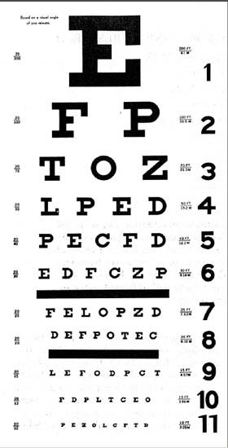
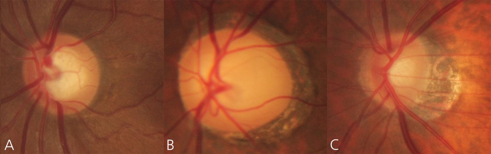

Ophthalmology
=============
[[TOC]]

Teachers and Resources
- https://timroot.com
- Khung Peng Shuan Sebastian Sim kiew.sieh.yean@singhealth.com.sg (eye exam)
- beau.fenner@mohh.com.sg (red eye and visual loss)
- Louis.tong.h.t@singhealth.com.sg (osce cases)
- Ng Wei Yan
- Ms Yap Shi En (Optometrist)
- Marcus Ang 
- Dr Lim Hou Boon
- Dr Shaun Sim
- Prof Louis Tong 
- Sonal Farzavandi

Red desaturation: hemoanopia detection.
Count finger is normal: adnemoa but compression
Red pin: temporal quadral anopia.

General Ophthalmology Skills
------------
### Eye Anatomy

- Anterior Chamber = area between iris (and lens) and the cornea; filled with aqueous humor
- Ciliary body = ciliary process + ciliary muscle
- Uvea = choroid + ciliary body + iris.
- IOP is a problem with the production vs drainage balance; usually it is a drainage problem not production problem.
- Lens become thicker as one grows older - people with shallow anterior chamber has a tendency to develop acute closed angle glaucoma when they age. 
- Ciliary body is where aqueous humor is produced

#### Glands

**Meibomian glands** are holocrine type exocrine glands, along the rims of the eyelid inside the tarsal plate. They produce meibum, an oily substance that prevents evaporation of the eye's tear film. Meibum prevents tears spilling onto the cheek, trapping the tears between the oiled edge and the eyeball, and making the closed lids airtight. There are about 50 glands on the upper eyelid and 25 glands on the lower eyelid.

#### Conjunctiva

#### Cornea anatomy
Consists of 5 layers:
 1. Epithelium - keep water out
 2. Bowman's layer
 3. Stroma - protective layer
 4. Descemet's membrane
 5. Endothelium - keep water out
Collagen fibers in cornea are arranged so that light can

#### Iris 

#### Lens 

- When lens is unaccommodated, it is in the state for focusing on distant object
- When lens is accommodated, it is in the state for focusing on near object

#### Retina 
- Nerve fibre layer is also called the optic fiber layer (OFL)
- Superior temporal arcade and inferior temporal arcade
- Optical disk is medial in identifying the eye
- Retina has 10 layers
- Fovea is 2 disc area away from the disc
- Edge of the disc is the where the vessels are turning
  

#### Choroid 

#### Sclera 

### Orbital Components

#### Blood supply of the eye

- Blood supply to the retina
  - central retinal artery supplies the inner 2/3 retina (nerve side)
  - choroidal circulation from posterior ciliary arteries supplies outer 1/3 retina (sensor side)
  
#### Pupillary Light Reflex
The pupillary light reflex (PLR) or photopupillary reflex is a reflex that controls the diameter of the pupil, in response to the intensity (luminance) of light that falls on the retinal ganglion cells of the retina in the back of the eye, thereby assisting in adaptation of vision to various levels of lightness/darkness. A greater intensity of light causes the pupil to constrict (miosis/myosis; thereby allowing less light in), whereas a lower intensity of light causes the pupil to dilate (mydriasis, expansion; thereby allowing more light in).

**Bilateral Afferent Pupillary Defect** is a conditions in which both pupils do not constrict in response to the light stimuli.

**Relative Afferent Pupillary Defect (RAPD)**, also known as Marcus Gunn pupil, is a condition in which pupils respond differently to light stimuli shone in one eye at a time due to unilateral or asymmetrical disease of the retina or optic nerve. This is elicited using the Swinging flashlight test or Marcus Gunn test. 

Sign | Lesions
---|---
Unequal is more obvious in the light | The dilated eye is abnormal (failure to constrict); DDx parasympathetic denervation, CNIII lesion, Drugs (atropine and cocaine use)
Unequal is more obvious in the dark | The constricted eye is abnormal (failure to dilate); DDx of small eye include sympathetic denervation, Horner's syndrome, drugs (pilocarine and morphine)

Optic Nerve Conditions Leading to RAPD | Remark
-----|------
Optic nerve disorders| Unilateral optic neuropathies are common causes of RAPD.
Demyelination Optic neuritis| Even very mild optic neuritis with a minimal loss of vision can lead to a very strong RAPD.
Ischemic optic neuropathies| These include arteritic (Giant Cell Arteritis) and non-arteritic causes. Usually there will be a loss of vision or a horizontal cut in the visual field.
Glaucoma| While glaucoma normally is a bilateral disease, if one optic nerve has particularly severe damage, an RAPD can be seen.
Traumatic optic neuropathy| This includes direct ocular trauma, orbital trauma, and even more remote head injuries which can damage the optic nerve as it passes through the optic canal into the cranial vault.
Optic nerve tumor| This is a rare cause and includes primary tumors of the optic nerve (glioma, meningioma) or tumors compressing the optic nerve (sphenoid wing meningioma, pituitary lesions, etc.).
Compressive optic neuropathy with or without orbital disease| This could include compressive damage to the optic nerve from thyroid related orbitopathy (compression from enlarged extraocular muscles in the orbit), orbital tumors, or vascular malformations.
Radiation optic nerve damage|
Hereditary optic neuropathies | such as Leber's optic neuropathy (usually eventually bilateral) and other inheritable optic neuropathies.
Other optic nerve infections or inflammations| Cryptococcus can cause a severe optic nerve infection in the immunocompromised. Sarcoidosis can cause inflammation of the optic nerve. Lyme disease can affect the optic nerve.
Optic atrophy | post papilledema - This is usually bilateral.
Post Surgical damage to the optic nerve| This could include damage following retrobulbar anesthesia; damage following orbital hemorrhage related to eye, orbital, sinus, or plastic surgery; damage following neurosurgical procedures such as pituitary tumor resection; and damage related to migration of an orbital plate after surgery to correct a blow-out fracture.

Retinal disease may also lead to RAPD but the damage has to be quite extensive
Retinal Problems in RAPD | Remarks
---|---
Ischemic retinal disease| Causes include ischemic central retinal vein occlusion, central retinal artery occlusion, severe ischemic branch retinal or arterial occlusions, severe ischemic diabetic or sickle-cell retinopathy.
Ischemic ocular disease (Ocular ischemic syndrome)| This usually arises from obstruction of the ophthalmic or carotid artery on one side.
Retinal detachment| A RAPD can often be seen if the macula is detached, or if at least two quadrants of retina are detached.
Severe macular degeneration| If unilateral and severe, a RAPD can be seen. Usually the visual acuity would be less than 20/400.
Intraocular tumor| Retinal and choroidal tumors including melanoma, retinoblastoma, and metastatic lesion could lead to a RAPD if severe.
Retinal infection| Cytomegalovirus, herpes simplex, and other causes of retinitis can lead to a RAPD if there is extensive disease.

Other Causes | Remark
---|----
Amblyopia| i.e. Lazy eye If severe, can lead to a relative afferent pupillary defect. Usually the visual acuity would be 20/400, or worse.
Cerebral vascular disease| Usually, it is an optic nerve disorder that leads to a RAPD, rather than an optic tract or visual cortex disorder. However, there tends to be a higher percentage of crossed vs. uncrossed nerve fibers at the optic chiasm. Thus, in a patient with a homonymous hemianopia from an optic tract disorder, an RAPD could be seen in the eye with the temporal visual field defect. The nasal retina serves the temporal visual field, and these are the fibers that would cross at the chiasm

#### Ocular Nerves and Movements

### Ophthalmic Examination

List of Equipments
- Visual Acuity charts (Snellen) 
- Occluder with pinhole
- Pen Torch
- Eyedrops
  - to anaesthetise surface (alcaine)
  - to dilate pupils (tropicamide, phenylephrine)
- Fluorescein strips for identifying eye injury
- Direct Ophthalmoscope
- Pseudo-isochromatic plates (Ishihara)

#### Basic Ophthalmic Examination

Apps for color vision and Snellen chart - Eye Handbook for Android;

- Anisotopia
  - Pupils constrict (PSNS) and dilate (SNS - long ciliary nerve) by different mechanism; In the dark, both pupils equally dilated. In the light, both constricted well. 
  - Turning off the light
    - Both 

Intereye RPDR should be the same as the 

#### Indications for Examination
1. routine physical exam and eye screening
2. Eye complaints – blurred vision, redness, injury to the eyes, diplopia, etc
3. Screening for end organ damage
    -   diabetic retinopathy
    -   hypertensive retinopathy
    -   raised intracranial pressure
    -   etc

#### Inspection / Palpation of the Eye / Orbit
Inspection
- Asymmetry of face, peri-orbital tissue| 
  - Squints, proptosis, enophthalmos
- Lid problems: 
  - Ptosis, lid retraction, entropion, ectropion, lagophthalmos;  
  - Lumps & bumps
- Globe: 
  - Conjunctival injection, cornea opacities, gross pupil irregularities

Palpation
- Peri-orbital area: orbital fractures, masses
- Lids: (including eversion where appropriate)
- Globe (closed eyes): 
  - Thrills
  - Pulsations
  - Intraocular pressure estimation 
    - Useful in acute close angle glaucoma attack where the IOP is usually 40 -60 mmHg (ballot the eyes, should have equal tension, that of a longan; patients with acute closed-angle glaucoma will be hard.)
    - In exams, put stethoscope over the eyes; 

Orbit Signs | Remark
|-----|--------
lid retraction | think about thyroid problem
ptosis | 
swollen eye lids | hordeolum
lid laceration | look for lid margin involvement - need to repair the tarsal before repairing the lid margin; then lacrimal gland and lacrimal canaliculus involvement - if damaged, patient may have watery eye later on 
scar on the lateral side of the eye | tarsorrhaphy 
peri-orbital swelling and redness | ocular movement is affected in intra-orbital cellulitis but not in periorbital cellulitis;   Also worry about intraorbital abscess   
excess of skin in the upper or lower eyelid | need to distinguish between being too tight or too loose by pulling; if loose, the patient has dermatochalasis 
tenting of the eyelid | may be due to previous surgery
eyelashes pointing vertically | Epiblepharon 

#### Visual Acuity

Visual acuity is the **spatial resolving capacity** of the visual system. It is a term to describe the eye’s ability to discriminate details in an object.

**Types of Acuity Tasks**
1. **Target detection** ‐ requires only the perception of the presence or absence of an aspect of the stimuli, not the discrimination of target detail. The Landolt C (a) and the illiterate E (b) are examples of target detection used in visual acuity measurement. Patient is required to detect the location of the gaps.
   
   

2. **Target recognition** ‐ requires the recognition or naming of a target, such as with Snellen letters and Logmar Scale. Test objects used here are large enough that detection is not a limiting factor, but careful letter choice and chart design are required to ensure that letter recognition tasks are uniform for different letter sizes and chart working distances. 
   
     

   **The Snellen Letter** is designed in a way such that each limb or space subtends one arc minute (1/60 degree) at specific distance and the overall letter height subtend five arc minutes. The small number on the chart is the distance at which a normal person can see the letter. Snellen acuity is defined as *testing distance in meters / Distance in meters at which the letters on the best line subtended 5 (arc minute)*
     - Testing Distance
       - Normal testing distance is at 6 meters. A testing distance of 6 meters is as good as testing of the eyes at an infinity distance. This is important as the eye will have well controlled accommodation and it can aid in accurate testing.
     - Reading 
       - An individual with ‘normal’ VA will be able to see a Snellen letter positioned at 6 meters from the eye. (VA=6/6)
       - If an individual with ‘normal’ VA can perceive a Snellen letter at 18 meters but a patient can only see it at 6 meters, the VA of the patient will be 6/18.
       - Record the VA line that patient can read at least 50%.
       - If a patient can only read part of the line, it should be recorded as it is.
     - Recording
       - 6/6 (20/20); or if the patient has missed a few letter, we can add the superscribe -1 for 1 missing, -2 for 2 missing, etc.
       - 6/9 (20/30); if the patient can do better than this, +n, where n is the number of letter the patient can read in the next row.
       - 6/18: severe vision loss
       - 6/60 (20/200)
       - Legally blind is defined as 6/80 in the better eyes.
       - Counting Fingers (2m, 1m, closely etc)
         - Examiner can stand a few meters (start from the end of the room) from the patient and show fingers (One finger, two fingers or five fingers) to examine if patient can see. If patient is not able to resolve, examiner will then move nearer until patient can resolve the number of fingers shown. 
         - VA can be recorded as e.g. CF at 1 meter.
       - Hand Movements 
         - If patient fails to resolve the fingers at even half a meter, proceed with detection of hand movement (HM). 
         - Wave the hand in front of the tested eye. If hand movement can be seen, record as HM.
       - Perception of Light (PL / LP) 
         - If hand movement is not detected, proceed with perception of light test.
         - Examiner will shine a source of light (pen torch or ophthalmoscope) onto the patient’s tested eye. If light is perceived, record as PL. If light is not seen, record as NPL.
         - No perception of light (NPL): total blindness
       - If a person cannot read the Snellen chart from 6 meters but is doing it from a nearer distance due to space constraint e.g. 3, just record the results differently, such as 3/6, 3/9  etc.
     - Advantages:
       - The Snellen chart is commonly used and widely available. It is available in letter, number, tumbling E and picture formats.
    - Disadvantages:
      - Snellen chart has fewer big sized targets and increasing number of targets on lower lines. This ensures that the chart can be accommodated on the rectangular frame. However, due to the fewer big sized targets; Snellen chart is less useful for patients with poor VA as there are lesser targets to be tested for. 
      - The problem with increasingly number of targets on lower line is that it is harder to read due to crowding phenomenon. The level of difficulty in reading is not constant throughout the chart.

  **Bailey-Lovie LogMAR chart** is very linear and an improved from the Snellen chart. The logMAR chart uses logarithmic scale meaning the progression of letter sizes follows a constant ratio of 1.26 (0.1 log unit steps). There are five letters on every row. Each letter spacing is equal to one letter width and the row spacing is equal to the height of the letter on the lower row. This makes the task of reading the same as the patient reads down the chart. The letters chosen have equal legibility as well.
   - Testing distance: The Early Treatment Diabetic Retinopathy Study (ETDRS) chart is a logMAR chart that is designed to be tested at 4 meters.
   - Recording of logMAR visual acuity
     - Smaller number is good
     - 6/6 equivalent in LogMar is 0.0
     - The score of each row is 0.1 and the score of each letter is 0.02
     - Top row starts at 1, every row lower is -0.1, and then plus the 0.02n where n is the number of mistakes in that row
     - Add 0.3 for each time the distance is halved. e.g. 2 meters, add 0.3; 1 meter add 0.6
     - For research, and the low vision chart, LogMAR is preferred because it is more detailed and has no jumps. It is therefore better for monitoring progression and changes.

  Additional Testing Mechanisms
  - Near reading chart e.g. N5 N6 N12
  - Pinhole (Super Useful): if improve vision, should make glasses.
    - A pinhole test is performed when VA of a patient is worse or equal to 6/12. 
    - The pinhole reduces the width of light band entering the eye, hence reduce glare and increase depth of focus. Poor vision due to refractive errors will show improvement in VA with pinhole test. Pinhole test is a good indication for any residual refractive errors that can be corrected with optical lenses.
     - Corrects refractive errors (up to -4D or +4D fully)
     - Cannot overcome organic/structural disease
     

**Procedure for measuring VA**
  1. Hand hygiene and equipment hygiene
  2. Verify patient identity, use 2 identifiers such as name, identification number, address or date of birth
  3. History taking, ask patient if he or she uses any spectacles. 
     - Do you have any spectacules?
       - If yes, ask if the specs are for distance or near task
       - Ask patient when was the current specs prescribed, frequency of use and if there is any issue with the spec
     - Have you been diagnosed with any lazy eye or eye problems when you are young?
       - Ask for history of amblyopia
       - Important to ask in order to know which one to start with
  4. Habitual distance
      - Unaided if patient has no spec, and aided if the patient has spec
      - Progressive and bifocal lens users, can continue to use. However, for near vision, don't let patients tilt their head down. They should use the bottom of the lens to read. Keep patient's head in a slightly tilted position at best, and ask them to use their eye muscles to look down.
      - Start with the poorer eye
      - Start reading the chart from the biggest letter on the top, and proceed down the chart, reading row by row
      - If patient can only do <50% of the characters, stop at that row. 
      - Perform pinhole testing for VA 6/12 or worse. 
      - Repeat for the fellow eye, Use different testing targets to reduce the chances of the patient memorising the chart. Alternatively, get the patient to read from right to left in one eye and left to right for the fellow eye.
      - Measure habitual near VA.Get the patient to put on the spectacles specific for near seeing if he/she has any. Get the patient to hold the reading material at their habitual reading distance and report the smallest row of letters on the reading chart that can be read. Record the near VA and the habitual reading distance. Near VA should also be tested monocularly.
      - Repeat for fellow eye
   5. Observe the patient throughout the testing and note down any special observation such as abnormal head tilt, head turn, slow reading, reading with great effort, can only read one side of the chart etc.

  Note: Crowding phenomenon - Isolate the letters helps patients read helps

**Testing Children and Babies**

Note: When testing VA in children, a whole row of targets should be shown during VA measurement. Targets should not be isolated. This is to help in diagnosing any cases of amblyopia. Amblyopia is the reduction in best corrected VA. It is due to an underdeveloped nerve that resulted in the brain favouring one eye over another. Crowding phenomenon is strongly related to amblyopia. Crowding phenomenon is the increased in difficulty in recognition of a character due to the presence of neighbouring characters. Hence a row of characters is critical in testing for amblyopia.

   Tests for Recognition VA | Age | Description
   |---|----|---
   Response to eye occlusion | <18 month | Eye is occluded to test for any objection (e.g. crying, pushing of hands away, loss of fixation, fidgeting of head). The test can suggest any amblyopic or poor seeing eye.
   Bock’scandytest (100’s and 1000’s test) | 10 -12 month | The child is asked to pick up candy beads of 1 mm size at a testing distance of 40cm. Ability to do so estimate VA to be Snellen equivalent 6/60.

   Tests for Resolution VA | Age | Description
   |----|---|---
   Optokinetic nystagmus drum| < 18 month | Nystagmus is elicited by passing a drum with black and white lines. The width of the lines resolved gives an estimation of the VA.
   Preferential looking test| < 18 month | The child is presented with two adjacent stimulus fields, one is plain and the other is with stripes. The ability to look toward the field with stripes shows image is resolved. The width of strips indicates the estimated VA.
   Keeler acuity test| < 18 month | It is a type of preferential chart
   Cardiff acuity test| 18 mth - 3 yr | It is a type of preferential chart.
   Broken wheel| 2 -5 yr | Pair of cars of progressively smaller sizes, one of them with a broken wheel is shown and the child is asked to identify the one with the broken wheel.
   Kay picture test| 2- 5 yr | A child is asked to identify picture shown at 3 meters. Matching is possible with the key cards.
   LogMar list symbols | 2 - 5 yr | The chart will be shown at 3 meters and a child is required to match targets to the matching key cards.
   Visual evoked potential | all ages |A specially ordered test. An EEG response from the occipital lobe is recorded to document the functional ability of the visual pathway. That can give a rough estimate of the VA. Test is ordered when there is an inconsistent response from child. Possible reasons for reduction in vision can be amblyopia, malingerer, and tumors in the brain.

General practitioners can screen VA using response to eye occlusion method and matching tests for babies and young child respectively. The more elaborated testing such as optokinetic drum, preferential looking test, VEP etc. will be used in a hospital setting or paediatric specialist clinics.

**How to read a glass prescription?**

  |Sphere | cylindrical | Axis 
  |--- |---|---
  |-1.00 | - 0.50 |x180
  |+1.00 | -1.00  |x90
  |number id dioptres, - is myoptic, + is hyperopia | can be + or - in dioptres | angle of lens

  A dioptre or diopter is a unit of measurement of the optical power of a lens or curved mirror, which is equal to the reciprocal of the focal length measured in metres. It is thus a unit of reciprocal length. For example, a 3-dioptre lens brings parallel rays of light to focus at ​¹⁄₃ metre.

**Optometrists Roles and Responsibilities**
  - Mostly refractory disease
  - Fit contact lens

#### Visual field testing by confrontation
Find central or peripheral lesion

Procedure
- Seat the patient and occlude one eye
- Face the patient at 1m and close your eye that is opposite the patient’s occluded eye
- Ask the patient to fixate on your open eye
- Finger counting in 4 quadrants (failing which try HM or PL)
- Red tipped bottle – subtle hemifield defects
- Scotoma
- Peripheral field

Do at least the count finger and wriggle test.

Red is an important color in testing visual field. 

**Finger Counting Test**

**Finger Wriggle Test**

**Red Pin Test**
Color vision is available in a small portion of the visual field, specially only central 20 - 30 degrees. Red pin test maps out the meridien where the patient is not seeing the red cap early enough and hence have problems with color vision.

**Red Desaturation Test**
Red saturation test assesses the integrity of the optic nerve by testing the ocular sensitivity to the red colour. The test is used clinically for the detection of asymmetric optic nerve function and detection of neurophthalmological visual field defects such as hemianopias and quadrantopias. Nerve diseases that can cause optic neuritis include multiple sclerosis, neuromyelitis optica, Shilder´s disease. Infections that may cause optic neuritis include mumps, measles, tuberculosis, Lyme disease, and also a few other conditions like sarcoidosis, Gullain-Barre syndrome and post-vaccination reaction may cause ON to occur. Nowadays, a red marker is used in the practices and the client needs to compare the intensity of red colour monoculary.

Visual Field Defect | Lesion
|-----|--------
 A localized defect in the visual field bordered by an area of normal vision.| Arcuate scotoma

#### Eye movements testing

- Superior rectus is CN IV
- Lateral rectus is CN VI
- Everything else is CN III

Question: How do you tell if the eye is rotated?

Procedure
- Correct patient posture; Make sure the patient is sitting forward and straight; people might move to compensate for problems; 
- Pull hair back so we can see the forehead
- Look for abnormal head posture
- Ask patient to fixate far away
- Remove glasses
- Compare corneal reflex (Hirshberg Test)
- Cover and uncover test
  - Cover left, look for movement in the other
  - Uncover eye, look for movement as the cover is removed
  - Alternate cover
- Always compare right and left,
- Finish with convergence

Methods
- Basic is the H shape test
- Cover and uncover test

**H-shape movement**
Ocular movement, follow target in H shape, hold the patient's head, pull up eye lids when asking patient to look down

**Accommodation**
Near and far

**Cover and Uncover Test (Optional)**
Eye movement examination might be normal or very slightly abnormal; By comparing the two eyes, bring out abnormality that might be hard to see. 20 - 30% of people in a normal population, will have latent deviation or phoria, when the person is tired and not focusing, the eye moves.
- In the case of a phoria, or latent deviation, the examiner observes the eye underneath the occluder. The uncovered eye does not move however the eye that is under the cover will deviate when occluded and return to a straight position when the occluder is removed.

**Hirschberg test - corneal light reflex**
- Shine light 30cm away from the patient and shine a light into the patient's eyes.
- Good Hirschberg in Frozen
- Go on to confirm with cover test & EOM 
   

Oculomotor|Problem
|----|-------
Down and out with ptosis | Cranial nerve III palsy   
Up and in | 4th nerve palsy; head tilt towards the contralateral side
Inward eye | 6th nerve palsy
One and a half | Internuclear Opthalmoplegia   
Eight and a half | Eight-and-a-half syndrome presenting with a conjugate horizontal gaze palsy, an ipsilateral internuclear ophthalmoplegia, and an ipsilateral lower motor neuron-like facial palsy.
Lagopthalmos | Lagophthalmos is the inability to close the eyelids completely. (CN IV) Look for Bell's reflex. If Bell's reflex is intact there is less risk of exposure keratosis.  
LMN facial paralysis| Bells' Palsy An idiopathic condition that causes a temporary weakness or paralysis of the muscles in the face. It can occur when the nerve that controls your facial muscles becomes inflamed, swollen, or compressed. Exclude: tumor, infection, trauma
Both eyes turned inwards | Esotropia is a form of strabismus in which one or both eyes turns inward. If corrected by plus lens, it is called accomodative esotropia. 
Eyes are turned outwards | Exotropia is a form of strabismus where the eyes are deviated outward. People with exotropia often experience crossed diplopia.
V-pattern exotropia | 
Limited horizontal movement | Duane syndrome (DS) is an eye movement disorder present at birth (congenital) characterized by horizontal eye movement limitation: a limited ability to move the eye inward toward the nose (adduction), outward toward the ear (abduction), or in both directions.

#### Torchlight examination +/- fluorescein 

**Direct pupillary light reflex** normally constricts

**Consensual light reflex** fellow eye constricts

**Marcus-Gunn / swinging flashlight test**
  - Shine light into R eye Look for pupil constriction
  - Quickly move light to L eye: Constricts – normal; Dilates – L RAPD
  - RAPD is relative afferent pupillary defect;
    - Implies an afferent defect
    - Usually optic nerve disease because if it is at the retinal level, we need a very widespread retinal problem eg total retinal detachment
    - Does not occur with cataracts or maculopathy etc
    - May be absent if both eyes have advanced disease as it is a “relative” defect

Anterior Segment Observations | Remark
|-----|----
Leukocoria | 
Iris synechiae and keratic precipitates | anterior uveitis 
Hypopyon | 
Lid Odema | It is usually mild, may accompany a severe attach of acute anterior uveitis
Circumcorneal Congestion | marked in acute iridocyclitis and minimal in chronic iridocyclitis. While it should be differentiated from acute conjunctivitis, where it is superficial congestion.
Corneal Edema | Due to toxic endothelitis and raised IOP when present
Many blood vessels | Conjunctiva inflammation
Blood pooling obscuring blood vessels | Conjunctiva Hemorrhage 
Pseudomembrane, erythema | Characterisitc of viral conjunctivitis; Worry cornea abrasion, especially if under the eyelid 
Papillary reaction in fornix | 
Giant papillary reaction in fornix |  Giant papillary conjunctivitis (GPC) exclude contact lens  
Limbal vernal follicle| 
Shield ulcers | 
Crusting along the base of the lash |  
nodules along the eyelid | 
edema of the conjunctiva with erythema | Allergic conjunctivitis 
Cornea Ulcer | 
Hypopyon | 
Leukemic Pseudohypopyon | 
Reverse Hypopyon | silicon oil 
Pterygium | 
Rust ring | 
Corneal Foreign Body | 
Seidel Test | Corneal perforation / bleb leakage; Seidel test positive; The Seidel Test is used to assess the presence of anterior chamber leakage in the cornea. It is used as a screening test for many corneal disorders including corneal post-trauma, corneal perforation and corneal degeneration. 
hyphema | A hyphema is a pooling or collection of blood inside the anterior chamber of the eye (the space between the cornea and the iris). The blood may cover most or all of the iris and the pupil, blocking vision partially or completely. A hyphema is usually painful. Give steriods, and cycloplegics. Worry glucoma. Blood rarely stain the cornea, so treat inflammation and glucoma 
prolapsed iris | 
nuclear cataract | 
cortical cataract |
posterior cataract | 
mature cataract | 
congenital sutural cataract | 
displaced lens | 
dislodged intraocular lens | 
coloboma | 
synechia | iris stuck down; inflammation cause iris to be stuck down
anterior chamber IOL | 
Cornea edema | 
Round hole in iris | Iridotomy Scar 
Tears and fibrosis | Previous iris ischemia, perhaps due to angle closure glaucoma
| Rubiosis Iridis

#### Fundus Examination with Direct Ophthalmoscope

**Introduction to the Ophthalmology scope**

This is a handheld instrument that provide erect virtual image of the retina. 
- 15 x magnification
- field of view of 5 degrees
- Monoocular: no stereoscopic vision
- Most useful for examining the optic nerve and blood vessels of the posterior pole

Using an opthalmology
- Green is + (hyperopes) red is - (myopes). 
- Dial in the patient's prescription
- Ask patient to remove eye wear
- Then ask patient to focus on a specific thing in the distance
- Fundoscopy can be done in various positions, just try the position that is most in line with eye level in the patient.
- Now off the lights.
- Start by looking at the **red reflex**, one arm length from the patient
- Once we find the red reflex, observe the **anterior segment** including depth, cornea, iris, pupil
- Then move in, looking for **optic disc** by approaching from 30 degrees to nose bridge
  - Observe the color, contour, cup-disc ratio
- Then maneuver up and down, following the superior and inferior **blood vessels**
  - Observe the arteriolar light reflex, 
  - Crossings
  - Sclerosed vessels etc
- Finally look at the macula and then the peripheral **retina**

Common problems
- Not going close into the patient; rest thumb on the forehead
- Going too close and balance yourself by holding onto the patient
- Don't talk during the exam, finish and then report what is observed.
- Not going 15 degrees to the side to look towards the medial side of the retina; that's where optic disc is; use the vessels to look for the optic disc.

Trouble Shooting
- **Blur image**: wrong refraction or media opacity e.g. cataracts and vitreous haemorrhage
- **Can't find optic disc**: reposition patient, approach at 30 degrees, ensure same eye-level as the patient (may tilt patient head backwards)
- **Glare**: adjust position of the ophthalmoscope, reduce size and intensity of light source.

**Red Reflex**
  - The Technique
    - Perform with the direct ophthalmoscope
    - green 2 and big diffuse light
    - Stand at a distance of about 1 foot in front of the patient
    - Ask the patient to look straight into the light, ensuring that the light is wide enough to cover both eyes at the same time
    - Compare the red reflex of both eyes
  - Observations
    The red reflex refers to the reddish-orange reflection of light from the back of the eye, or fundus, observed when using an ophthalmoscope or retinoscope. The reflex relies on the transparency of optical media (tear film, cornea, aqueous humor, crystalline lens, vitreous humor) and reflects off the fundus back through media into the aperture of the ophthalmoscope. The red reflex is considered abnormal if there is any asymmetry between the eyes, dark spots, or white reflex (Leukocoria).
    - Normal red reflex and corneal reflex: the color and brightness of the red reflex, and the location of the small white corneal reflex, is identical in each eye. 
    - Red reflex absent: Absent red reflex is one or both eyes demonstrates serious eye diseases (e.g. cataract or retinoblastoma) requiring urgent referral.
    - Red reflex is abnormal: A red reflex that is the wrong color or brightness in one or both eyes suggests serious eye disease 
    - Red reflex with a squint: Common indicator of retinoblastoma. Always do a red reflex test on a child presenting with a squint in order to rule out serious eye disease. An abnormal red reflex with squint requires urgent referral.
    - Other signs

**Anterior segment examination**: 
Check cornea, iris, lens 
Use a green 10 for anterior segment

- May also observe for hypopyon and hyphaema
    - Hypopyon is a medical condition involving inflammatory cells in the anterior chamber of the eye.
    - A hyphema is a pooling or collection of blood inside the anterior chamber of the eye (the space between the cornea and the iris). The blood may cover most or all of the iris and the pupil, blocking vision partially or completely. A hyphema is usually painful.
- Using a slit lamp distance between light on the cornea and light on the iris is the **anterior chamber (AC) depth**. Alternative method is to look for the **Eclipse Sign** = Clue from torchlight examination that anterior chamber is shallow => angles may be narrow => at risk of angle closure glaucoma; whole iris should be illuminated when light is shone from the side when it is flat, in shallow anterior chamber, only part of the iris is illuminated.
    - Elderly Oriental ladies especially
    - Refer for formal assessment of angles, may need treatment with anti-glaucoma eyedrops and/or laser
- Use of fluorescein strips, bind to dead cells and ...; 
  - Epithelial defects: consider foreign body in the eye
  - Infectious keratitis: urgent!
  - Bullous ketatopathy: Lost too many endothelial cells

**Retinal Examination**
- 0 or red 1
- Tilt the patient's head back 30 / 40 degrees so that we can look into the eye more easily. One leg forward and one leg backward.
- Go in at an angle of 30 degrees.

Observations
  - Optic disc findings
    - Margins – sharp (normal) vs blurred
    - Is the disc swollen?
    - Colour – orange/pink (normal) vs pale vs hyperemic
    - Cup-disc ratio - <0.6 is normal; always use vertical distance - easier to access and the cup-disk atrophy tends to start in the inferior location
    - Neovascularisation, blood, and other abnormalities
  -  Retinal vessels
     -  Calibre
     -  Tortuosity
     -  AV nipping
  - Retinal findings
    - Macula; normal macula is blank without blood vessels; look for Macula Drusen, Blood and thunder in CRVO
    - Peripheral retina
    - Hemorrhages, hard exudates, cotton wool spots, neovascularisation
    - Retinal laser scars: fresh (yellow grid) vs old (black spots in a grid)

Different Settings on Fundoscope
- Changing filters for color
- Changing aperture
- Changing brightness

Optic Disc Observations | Remark
|------|----------
Pale disc | Optic Atrophy
Increased cup-disk ratio | May be seen in glaucoma; Normal is 0.5;  
Optic disc edema | The optic disc is elevated and its surface is covered by cotton wool spots (damaged axons) and flame hemorrhages (damaged vessels). Four Is: increased intracranial pressure (papilledema), infarction, inflammation, infiltration (by cancer).  If bilateral (papilloedema), do bedside BP and MRI shows enlarged ventricles 
Disc neovascularization | neovascularization occurring in an area extend 1 disc diameter from the disc.

Retina Observations | Remarks
|---|--------
Peripapillary atrophy | describes atrophy or thinning in the layers of the retina and retinal pigment epithelium around the optic nerve.  
Geographic atrophy | advanced AMD
Macula edema |
Macular hole | Can be due to trauma, progressive high myopia, Preceding rhegmatogenous retinal detachment, Vitreoretinal traction theory (idiopathic macular holes)
Cherry-red spot | Associated with a pale retina in central retinal artery occlusion 
Bull's eye maculopathy | macula is preserved although with a peripheral ring of depigmentation
Spiculated pigments | Retinitis Pigmentosa: Bone spicule-shaped pigment deposits in the mid periphery  
Cotton Wool Spots | Caused by microinfarcts. Exploded Ganglion Cell axons extrude their axoplasm into retina. Long DDx: HTN, diabetes, HIV, seere anemia or thrombocytopenia, hypercoagulanle states, connective tissue disorder, viruses, and others 
Ring exudates | When there is a ring, look for something that is leaking, e.g. an aneurysm 
Hard exudates | Any condition with chronic vascular leakage e.g. DM, HTN; resorption of edema leaving proteinaceous residue
Drusen | Drusen are small yellow deposits of fatty proteins (lipids) that accumulate under the retina, and next to the choroid. These have poorly defined borders unlike exudates. Blood vessels run on top of the drusens, seen in dry AMD 
choroidal folds | from resolving posterior scleritis 
Choroidal neovascularization | advanced wet AMD
Laser scars | Due to photocoagulation

Vessel Observations | Remarks
|----|----------
Pre-retinal hemorrhage | proliferative diabetic retinopathy 
Blot haemorrhages | 
Dot haemorrhages | Diabetes retinopathy 
Flame hemorrhage | Follow direction of vessels and nerves seen in branch retinal vein occlusion (BRVO)   
Blood and thunder | Extensive hemorrhages in the posterior pole; Central retinal vein occlusion  
Roth Spot | Pale-centered hemorrhage. Caused by several conditions, but usually bacterial endocarditis. This image was from a patient with staph endocarditis. 
Nerve fibre layer hemorrhages | 
Microaneurysms | 
AV Nipping | Hypertensive arteriole compresses venule, resulting in bulging of the venule on either side of the crossing. Note that arterioles are usually thinner and lighter in color than venules. Chronic hypertension stiffens and thicken arteries at AV crossing points arteries indent and displace veins 

Patterns | Description
|---|---
Glaucomatous disc | Increased Cup-disc Ratio
Diabetic retinopathy | blot, dot, and nerve fibre layer haemorrhages, cotton wool spots, disc neovascularization
Retinitis pigmentosa | Bull's eye maculopathy, spiculated pigments, retinal atrophy
Myopic Fundus | Color fundus photographs representing different types of myopic maculopathy, according to Hayashi et al.   A. Tessellated fundus, OD.   B. Diffuse chorioretinal atrophy, OD.   C. Patchy chorioretinal atrophy (arrow), OS.    D.Lacquer cracks (arrow), OS.   E. Active choroidal neovascularization, with macular hemorrhage, OD.   F. Extensive macular atrophy, OD.  

**Diabetic Retinopathy**

**Cortical cataract**

**Arteriovenous nicking**
Arterios always cross on top of the veins. When the arterios harden due to atherosclerosis, arteriovenous nicking happen

Disc 
margins are sharp
color: yellowish orange to creamy pink
shape: round or oval
Cup to disc ratio: less than half
Vessels
AV ratio
AV crossing: no indentation
No arterial light reflex
Fundus background
No exudates or hemorrhages
color : red to purplish
Macula
macula is located 2.5 disc distance temporal to disc
no vessels are noted around Macula 
it may be slightly pigmented

- Loss of red reflex (Cataract, detached retina)
- Lens opacities and cataract
- Aqueous opacities Floaters
- Fundus
  - Disc
    - Papilloedema
    - Atrophy
  - Vessels
    - Tortuosity
    - Straightening
  - AV crossing
    - AV nicking (Hypertension)
  - Background
    - Tiger pattern
    - Pigmentation
    - Hemorrhage (Hypertension, diabetes)
    - Exudate (Hypertension, diabetes)
    - Retinitis pigmentosa
  - Macula
    - Star (Hypertension)
    - Degeneration
  - Leukemic infiltration
  - Tortuous retinal veins and hemorrhage (Macroglobunemia)

### Special Examination Techniques
#### lamina cribosa fundoscopy

#### Gonioscopy
Gonioscopy is a painless exam your ophthalmologist uses to check a part of your eye called the drainage angle. This area is at the front of your eye between the iris and the cornea. It is where fluid called aqueous humor naturally drains out of your eye.
- See trebacular meshwork
- To check for closed-angle

#### Colour vision testing
- Most commonly congenital X-linked recessive red-green colour deficiencies
- Less commonly yellow-blue
- Acquired colour deficiencies can be caused by optic nerve or retinal problems

#### Fluorescein Staining

Fluorescein staining of the eye is usually performed to detect corneal abrasions or herpetic keratitis. 

### Opthalmological Surgery

PCR
ECCE
Phacoemulsification
Femosecond surgery
trabeculectomy  - inadequate IOP control with medical treatment
peripheral iridotomy- does not reduce IOP, prevent angle closure glaucoma attack
vitrectomy for detached retina, diabetic retinopathy, erm endo rectinal membrane, endopthalmitis

#### Levator Resection
- Indication: Optosis correction
- Complication
  - Exposure keratosis

Locations for Lens
- Sulcus

Frameworks
-----------

### Worrying Signs to Look for and require immediate referral
- Deep throbbing pain
- Blurred vision that does not clear with blinking - worry posterior segment
- Double vision - palsy
- Loss of visual fields 

### Ptosis
- Senile ptosis
- Congenital ptosis
- Acetylcholine receptor antibody testing is used to diagnose myasthenia gravis, which often presents with ptosis. Although migrating muscle weakness is common, progressive shoulder and arm pain would be atypical.

### Strabismus

Normal ocular alignment results in symmetric corneal light reflexes in the center of the eye and bilateral red reflexes that are equal in color and brightness. In contrast, this patient's right eye esotropia (nasal deviation) and abnormal red reflexes are findings consistent with **strabismus**, or **ocular misalignment**. Untreated strabismus can lead to amblyopia, or decreased visual acuity of the improperly aligned eye.

Examination findings in strabismus include **asymmetric corneal light reflexes** and **asymmetric red reflexes** (more intense in the deviated eye). Strabismus can also be identified by the **cover test**, in which a patient focuses on an object while one eye is covered to assess for movement in the uncovered eye. A misaligned eye shifts to refixate on the object; an unaffected eye maintains the same position without moving.

Although most cases of strabismus are idiopathic or related to convergence insufficiency, the underlying condition can be life-threatening (eg, intraorbital mass, increased intracranial pressure). Therefore, the first step in evaluation is a **dilated funduscopic examination** to assess for secondary causes, particularly **retinoblastoma**, an intraocular malignancy that can often be visualized on funduscopy as a nodular, cream-colored retinal mass. Esotropia (a form of strabismus in which one or both eyes turns inward) due to central vision loss is the second most common presentation of retinoblastoma, after leukocoria.

### Papilledema

An enlarged blind spot may be seen with papilledema

### Acute Visual Loss

History
- Visual loss
  - Duration,Onset,Progression
  - Monocular or Binocular
  - Severity: Loss of vision vs Blurring
  - Completeness: Loss of entire visual field vs Partial visual field loss
- Other Symptoms
  - Painful or Painless

Examination (Vital Signs of the Eye)
1. Visual acuity
2. Colour vision
3. Visual field
4. Pupils for relative afferent pupillary defect (RAPD) 
5. Anterior segment
6. Posterior segment

Framework is Anatomical
- Media opacity
  - Painful: Corneal ulcer, Acute anterior uveitis, Endophthalmitis, Acute angle closure 
  - Painless: Vitreous Haemorrhage
    - Proliferative diabetic retinopathy
    - After retinal vein occlusion
    - Trauma
    - Retinaltear/detachment
    - Age-relatedmacular degeneration
- Retina diseases
  - e.g retinal detachment, vascular occlusions
- Optic nerve disorders
  - e.g. inflammatory, ischaemic, compressive
- Visual pathway disorders
  - e.g. cerebrovascular accident

### Chronic Visual Loss

### Acute Red Eye

Usual Culprits
- Allergy
- Infection
  - Blepharitis
  - Preseptal / orbital cellulitis
  - Conjunctivitis
  - Keratitis (bacterial vs herpetic)
  - Endoopthalmitis
- Inflammation
  - Uveitis
  - Episcleritis / scleritis
- Acute angle closure
- Trauma
  - Foreign body
  - Chemical injury
  - Subconjunctival haemorrhage

Consider
- History: onset, laterality (which eye), trauma, contact history, contact lens wear
- Symptoms: itch, pain, headache, vomiting
- Visual acuity
- Laterality: unilaterla, bilateral
- Pattern of redness: sectoral, diffuse, circumciliary
- Conjunctiva: papillae, follicles
- Discharge: watery, purulent, or mucopurulent
- Cornea: opacities, epithelium, fluorescein staining
- Anterior chamber: depth, hypopyon
- Pupils: size, shape, reflexes
- Medical history: HTN, thyroid

REd Eye | benign | Serious
|----|----|----
Vision | Normal, minmal reduction | reduced
RAPD | none | maybe
Pain | minimal | significant
Discharge | Mucoid | Purulent
Involvement | Bilateral | Unilateral
Cornea | Clear | Hazy, opacity, ulcer
Intraocular Pressyre | Normal | raised
Anterior chamber | deep | shallow, hypopyon

Pattern of redness
Sectoral | Pattern |  Pain | Color | Remark
|---|---|---|---|---
Scleritis| Sectoral / diffuse |+++ | violet | a/w systemic condition, can also be diffuse
Episcleritis | Sectoral / diffuse|+ | pink | can also be diffuse
Subconjunctival haemorrhage| sectional |- |red |
Conjunctivitis | Diffuse
Uveitis | Circumciliary Injection
Acute glaucoma | Circumciliary Injection

Palpebral conjunctiva
- Papillae (a small rounded protuberance on a part or organ of the body)
  - Papillae are raised areas of inflammation with a central blood vessel, appearing red at the surface and paler at the base. 
  - Think allergic and bacterial
  - Vascular reaction consisting of fibrovascualr mounds with central vascular tuft
  - Can be large - cobblestone or giant papillae (allergic conjunctivitis)
    
    
- Follicles (a small secretory cavity, sac, or gland)
  - Follicles are an accumulation of white blood cells without a central vessel, and appear pale at the surface and redder at the base
  - Small translucent, avascular mounds of plasma cells and lymphocytes
  - Seen in viral keratoconjunctivitis, herpes simplex virus, chlamydia, drug reactions
    

Supratarsal foreign body
- evert all eyelids with history of foreign body
- remove with cotton bud soaked in local anesthesia
- stain with fluorescein for corneal abrasion

Corneal Opacity / staining
- Bacterial keratitis: corneal opacity due to stromal infiltrate
- Acute angle closure attack: diffuse cornea haze due to increased intraocular pressure
- HSV keratitis: fluorescein dye instilled showing a dendritic epithelial defect

Anterior Chamber
- Cells and flare: seen in high mag slit-lamp examination
  - 1mm by 1mm cube of light, and try to count the number of cells seen for grading
  - inflammation of the uvea, specifically, anterior uveitis or iritis
  - uncomfortable looking at bright line
  - Everyone they transit from a dark to light place, it becomes painful
- Keratic precipitates: 
  - aggergates of white blood cells on the endothelial surface of corneal
  - Also uveitis
  - An inflammatory cellular deposit seen on corneal endothelium. Acute KPs are white and round in shape whereas old KPs are faded and irregular in shape. Mutton-fat KPs are large in shape and are greasy-white in color and are formed from macrophages and epithelioid cells.
  - Toxoplasmosis is the most common infectious cause of panuveitis, followed by herpes simplex virus, tuberculosis, and syphilis
- Hypopyon: 
  - fluid level of white blood cells
  - Hypopyon can be present in a corneal ulcer. Behçet's disease, endophthalmitis, panuveitis/panophthalmitis, and adverse reactions to some drugs (such as rifabutin).
  - Hypopyon is also known as sterile pus, as it occurs due to the release of toxins and not by the actual invasion of pathogens. The toxins secreted by the pathogens mediate the outpouring of leukocytes that settle in the anterior chamber of the eye.

Pupils
- Assess the size, shape, response to light, and presence of RAPD
  
- Central retinal artery occlusion
  

- Irregular pupil: anterior uveitis
- Semi0dilated pupil: acute glaucoma
- Posterior synechiae are at the pupil margin where the iris is adherent to the anterior lens capsule, which prevents dilation and makes cataract surgery more challenging. Cataract surgery is a good time to manage these synechiae and help restore ocular anatomy and function. Can be due to a previous uveitis.
  
- Semi-dilated pupil, seen in glaucoma

### Dry Eyes
- Sjogren Syndrome

### Reasons for Referral
- Infectious keratitis - white patch on cornea
- Hypopyon - any is emergency
- Suspected acute glaucoma - RAPD on exam, usually unilateral
- Orbital cellulitis
- Bacterial keratitis
- Fungal keratitis
- Eclampsia, liver abcess, rule out opthalmitis

### Pediatrics Leukocoria

- **leukocoria** (white pupillary reflex) concerning for **retinoblastoma**, the most common intraocular tumor of childhood, which occurs due to inactivation of the tumor suppressor gene *RB1*. Sporadic retinoblastoma often presents as unilateral disease, whereas inheritable retinoblastoma is more commonly bilateral.
- Cytomegalovirus and rubella are congenital infections contracted in utero that can cause leukocoria due to cataracts (lens opacification). However, bilateral white pupillary reflexes and abnormalities such as hearing loss and microcephaly would be expected with these conditions.
- Retinitis pigmentosa is a genetic disorder characterized by progressive retinal degeneration. Typical presentation includes night blindness, decreased visual acuity, and visual field loss. Cataracts can develop but are very rare in infancy.
- Severe retinopathy of prematurity with associated retinal detachment can cause leukocoria;  the condition typically affects infants born at <30 weeks gestation.

Systematic Diseases with Ocular Manifestation
-------------------------------

### Diabetic Retinopathy
Diabetic retinopathy is the leading cause of blindness in the USA.  It occurs in both insulin dependent and non-insulin dependent diabetes mellitus. 

Disease located in the peripheral retina is usually secondary to diabetes, which can lead to either proliferative or non-proliferative retinopathy. 

Diabetic retinopathy patients are usually asymptomatic, even though changes in fundoscopy are seen. Vitreous hemorrhage frequently occurs in patients with proliferative diabetic retinopathy. Once a diabetic patient presents with a sudden onset of visual loss with numerous floaters, a vitreous hemorrhage is most likely to have occurred. 

The 3 main categories of diabetic retinopathy are background or simple (microaneurysms, hemorrhages, exudates, retinal edema), pre-proliferative (cotton wool spots), and proliferative or malignant (neovascularization).  Visual impairment occurs with the development of macular edema.  Argon laser photocoagulation is performed for the prevention of complications.

 There are 3 main categories:
- **background or simple retinopathy** - consists of microaneurysms, hemorrhages, exudates, and retinal edema
- **pre-proliferative retinopathy** - with cotton wool spots
- **proliferative or malignant retinopathy** - consists of newly formed vessels. 

Patients are usually asymptomatic at first, despite early signs of retinopathy (e.g., microaneurysms).  Visual impairment occurs with the development of macular edema.  Argon laser photocoagulation is the suggested treatment for the prevention of complications.

Risk Factors for Diabetic Retinopathy
- Duration of diabetes
- Level of metabolic control 
- Other risk factors:
  - pregnancy
  - hypertension, hyperlipidaemia
  - renal disease, obesity, 
  - smoking
  - anaemia

Epidemiology
- 400 000 Singaporeans aged 18-69 years have diabetes mellitus
- 30% have diabetic retinopathy and 10% (40 000) have vision threatening diabetic retinopathy.

Pathogenesis
- Pericyte loss and endothelial damage resulting in capillary damage and leakage
- Exudation and edema

Classification
- Non-proliferative Diabetic Retinopathy: mild, moderate, severe
- Proliferative Diabetic Retinopathy 
- +/- Maculopathy (any problem with macula): 
  - Hard exudates & oedema in the macula
  - OCT shows dark regions of oedema

Patients with diabetic retinopathy are commonly asymptomatic until late in the disease course.  However, typical examination findings include microaneurysms, hard exudates, and retinal hemorrhages, sometimes with neovascularization.  The disc is generally normal, and visual field defects (when present) are patchy, rather than peripheral.

#### Non-prolferative Diabetic Retinopathy

General
- Microaneurysms: weakened arterioles/ capillaries are the earliest sign
- Dot & blot haemorrhages – intraretinal blood in deeper layers
- Flame-shaped haemorrhages – intraretinal blood in the superficial nerve fibre layer
- Hard exudates (small yellow areas with sharp margins) – caused by leakage of proteins and lipids from microaneurysms or damaged arterioles
- Retinal oedema

Severe non-proliferative diabetic retinopathy (NPDR)
- Cotton wool spots (white fluffy spots) – nerve fibre infarcts caused by focal ischaemia
- Venous beading, looping, segmentation
- Dark blot haemorrhages
- Intraretinal microvascular abnormalities (IRMA)
- Fundus fluroscein angiogram (FFA)/ videoangiography: capillary drop-out

#### Proliferative diabetic retinopathy (PDR)
- Neovascularization (new vessel formation) occurs as a response to retinal ischaemia.
- CRP is good for patients who are not compliant with anti-angiogenesis drugs, even though the latter is not as good. 
- Vision loss can result from 
  - Tarctional retinal detachment
  - VITREOUS HAEMORRHAGE
Proliferative diabetic retinopathy in the initial stage is asymptomatic.  Patients may later complain of decreased visual acuity.  Neovascularization is the hallmark of proliferative diabetic retinopathy.  The other findings are vitreous hemorrhage and macular edema.  These changes may lead to retinal detachment.

Management
- Optimising systemic risk factors: Glycaemic control/BP/Hyperlipidaemia / renal disease
- Laser photocoagulation –
  - pan-retinal photocoagulation (PRP) – for PDR or severe NPDR; avoid in young patients, offer anti-VEGF injection instead.
  - macular laser - for clinically significant macular oedema; moving away now because lasers are irreversible, argon lasers tend to cause scar and inflammation
  - Instead, use grid laser
- Surgery (vitrectomy)

### Hypertensive Retinopathy

 Hypertensive retinopathy presents with blurred vision, sometimes with limited visual field defects.  Examination shows arteriovenous nicking, copper wiring, flame hemorrhages, cotton-wool spots, and optic disc edema.

Hypertension can cause progressive arteriolar changes in the retina.  Most patients with hypertensive retinopathy are asymptomatic; symptoms can occur due to retinal hemorrhage but typically present acutely with monocular vision loss.

- Patients with hypertensive retinopathy are usually asymptomatic
- The eye is the only place in the body where blood vessels can be observed directly- end organ disease manifestation
- Bilateral
- Symmetrical
- Small blood vessel disease

Pathophysiology
- Arteriolar narrowing
  - vasoconstriction and arteriolosclerosis
- Focal closure of retinal vasculature 
  - lead to microinfarcts (cotton wool spots) and haemorrhages
- Leakage
  - lead to oedema and exudates
- Disc oedema develops in advanced stage

Management
- Modified Keith-Wagener-Barker / Scheie
  - AV Nipping
  - Grade 2 hypertensive retinopathy
  - Grade 3 hypertensive retinopathy: 
  - Grade 4 hypertensive retinopathy: optic disc oedema
• Treatment of underlying hypertension
• If a patient is previously undiagnosed, refer for assessment:
– Grade 1 or 2 retinopathy – non-urgent referral – Grade 3 – more urgent referral to GP
– Grade 4 – IMMEDIATE referral to casualty

Hypertensive retinopathy associated conditions
- Retinal artery occlusions 
  - BRAO
  - CRAO
- Retinal vein occlusions
  - BRVO
  - CRVO
- Non-arteritic anterior ischaemic optic neuropathy (AION)

Elschnig’s spots: Arising from choroidal infarcts- acute yellow lesions and chronic retinal pigment epithelium clump & atrophy

### Dysthyroid Eye Disease
 Most commonly associated with Grave’s disease
• May rarely be associated with other forms of thyroid disease
Signs 
– soft tissue involvement
• Periorbital and lid swelling
• Conjunctival hyperaemia and chemosis
- Proptosis
- Lid signs: Lid retraction, Lid lag
- Myopathy: Restricted extraocular movements

Sight threatening complications
• Optic neuropathy • Glaucoma
• Exposure keratitis

Investigations
– Blood invx • FT4
• TSH
• AB to TSH receptors
– Radiological: CT, MRI - apical crowding
- Look at vision on primary and upgaze
- Thyroid stimulating immunogloblin
- Radiological investigation, CT orbit spine cut

Treatment Ladder
• Conservative – Lubricants – Steroids
• Radiotherapy
• Surgical decompression • Rehabilitive
– Squint surgery – Lid surgery
Intravenous methylprednisolone medical decompression
If does not work, do surgical decompression

#### Graves opthalmopathy
In Graves disease, thyrotropin (TSH) receptor autoantibodies (TRAB) stimulate thyroid hormone production, resulting in hyperthyroidism.  Thyroid hormone increases sensitivity to catecholamines, and thyrotoxicosis of any etiology may cause lid lag and retraction due to sympathetic activation and contraction of the superior tarsal muscle.  However, true exophthalmos with impaired extraocular motion is seen only in Graves disease and is due to T cell activation and **stimulation of orbital fibroblasts and adipocytes by TRAB**, resulting in orbital tissue expansion and lymphocytic infiltration.

**Risk Factors**
- female sex
- advancing age
- smoking

**Clinical Feature**
- hyperthyroidism (ie, weight loss, heat intolerance, tachycardia) 
- orbital tissue expansion: proptosis, lid lag, and impaired extraocular motion (decreased convergence, diplopia) 
  - Graves ophthalmopathy can cause increased intraocular pressure due to orbital tissue expansion and compression of the globe.  However, increased intraocular pressure alone (eg, glaucoma) does not cause proptosis.
- irritation (eg, gritty or sandy sensation), redness, photophobia, pain, and tearing
- Ophthalmopathy in Graves disease is typically diagnosed at the same time as hyperthyroidism but may occur before or after the onset of hyperthyroidism.

### Optic Neuritis
Optic neuritis s a common manifestation of multiple sclerosis.  It can also occur in association with systemic autoimmune disorders (especially systemic lupus erythematosus) but is an uncommon manifestation of SS. Symptoms in optic neuritis typically include visual loss, with or without eye pain.  Uveitis may occur (uncommonly), but the conjunctiva is not typically affected.

### Myasthenia Gravis
Myasthenia gravis (MG) is a autoimmune disorder of the neuromuscular junction caused by autoantibodies against acetylcholine receptors on the motor end plate of skeletal muscles.  Ocular involvement may cause fluctuating diplopia and ptosis.  

Ocular features
• 90% of patients have ocular signs; 15% present with pure ocular MG
• Ptosis – bilateral
• Extraocular muscle involvement – diplopia 
• Cardinal Features: Fatigability Variability

Diagnostic tests
• Tensilon test
• Antibodies to Ach receptors
• Repetitive Nerve Stimulation
• Single fibre EMG
• CT or MRI of anterior mediastinum

Treatment
• Medical treatment
– Pyridostigmine , neostigmine
– Prednisolone and Cyclosporin A
– Plasmapheresis and Human immune globulin
• Surgical
– Thymectomy

### Lambert-Eaton myasthenic syndrome (LEMS)
A paraneoplastic syndrome that may also cause diplopia.  However, ocular involvement by LEMS is less common than involvement of the proximal limb muscles.

### Plexiform Neurofibroma

### AIDS
• Myriad of eye infections and tumours
– Kaposi's sarcoma, molluscum contagiosum
– herpes zoster,syphilis, cryptococcus, toxoplasmosis.
• The most common vision- threatening infection is cytomegalovirus (CMV) retinitis.

#### CMV Retinitis
• Potentially blinding
• Initially asymptomatic
• c/o
– floaters or
– painless loss of central or peripheral vision
• Affects 20-40% of HIV+ patients diagnosed with AIDS
– Usually when CD4 <100

**Treatment**
• Intravenous - ganciclovir, foscarnet or cidofovir
• Intravitreal - ganciclovir / foscarnet
• Implants – ganciclovir
• Oral - valganciclovir

### Rheumatoid Arthritis
• Keratoconjunctivitis sicca
• Cornea involvement 
  – keratitis, contact lens cornea, cornea melt
• Episcleritis 
• Scleritis
- Peripheral ulcerative keratitis

### Sarcoidosis

Ocular injury by non-caseating granulomas is typical for sarcoidosis.

### SLE
- Eyelid erythema / discoid lesions
- Keratoconjunctivitis sicca
- Keratitis with peripheral corneal thinning
- Scleritis
- Retinopathy (cotton wool spot +/- haemorrhage)
- Neuro-ophthalmic complications

Circulated immune complexes can affect the eye in systemic lupus erythematosus.

### Sjogren Syndrome
Immune-mediated destruction of the lacrimal and salivary glands that can occur as primary disease or secondary with other autoimmune disorders (e.g. SLE, RA). Decreased tear volume in SS leads to a hyperosmolar state on the surface of the eye, resulting in irritative symptoms and promoting an inflammatory response.  It may occur independently or as a manifestation of another autoimmune disorder (eg, systemic sclerosis).  Onset is typically in middle age, and a majority of patients have a positive ANA assay.

Sjögren syndrome is characterized by inflammation of the exocrine glands, commonly presenting with dry eyes (keratoconjunctivitis sicca) and dry mouth (xerostomia).  Decreased tear volume leads to a hyperosmolar state on the surface of the eye, resulting in irritative symptoms and promoting an inflammatory response.  Complications include decreased visual acuity, infection, corneal ulceration, and corneal perforation.

**Clinical features**

- chronic dry eyes (keratoconjunctivitis sicca), with discomfort, grittiness, foreign body sensation, that are often worse in windy conditions, or when doing tasks associated with decreased blinking  (e.g. reading, computer work)
- dry mouth (xerostomia), salivary hypertrophy
- dry skin (xerosis)
- Raynaud phenomenon
- Cutaneous vasculitis
- Positive anti-Ro (SSA) and/or anti-La (SSB)

**Complication**
- Corneal damage: decreased visual acuity, superficial infection, corneal ulceration, and occasionally, corneal perforation. 
- Non-hodgkin lymphoma
- Dental caries

**Management**
- Initial management includes artificial tears, humidifers and eyeglasses with occlusive barriers around the eyes.

### Vasculitis

#### Kawasaki Diease
Kawasaki disease is a vasculitis of medium-sized arteries that affects young children (age usually <5).  Symptoms may include conjunctivitis as well as fever, lymphadenopathy, and mucocutaneous inflammation (erythema of lips, tongue, and palate; peripheral edema, desquamation, and generalized rash).

#### Temporal Arteritis

Systemic steroids are used in the management of vision loss associated with temporal arteritis; however, this patient has no signs suggestive of temporal arteritis.
anterior ischemic optic neuropathy in giant cell (temporal) arteritis
High-dose systemic glucocorticoids (eg, methylprednisolone) are indicated for the treatment 

Anterior Segment Conditions
--------------

### Corneal Ulcer
Corneal ulceration presents as a foreign body sensation, blurred vision, photophobia, and pain.  A history of contact lens use, recent trauma, or ocular disease may be present.  The eye is erythematous, and ciliary injection is present.  Purulent exudates are seen in the conjunctival sac and on the ulcer surface.

### Infectious Keratitis
Patient with contact lens and white corneal should get urgent referral. These patients can become blind very quickly. 

Viral / bacterial / fungal
- Viral
  -  difficult to diagnose without slit-lamp
  -  Vision affected (but not too bad), some pain
  -  Herpetic (dendritic ulcer) – refer
- Bacterial (refer)
  -  Contact lens, trauma
  -  Ulcer, abscess
  -  Pain++, poor vision
- Fungal (refer)
  -  Immunocompromised, trauma

#### Viral Keratitis
Viral keratitis is infection of the cornea related to herpes simplex virus or varicella zoster.  Patients typically have corneal vesicles, opacification, and/or dendritic ulcers.

Other viral keratitis are also less purulent than bacterial keratitis.

**Herpes Simplex Keratitis**

Herpes simplex keratitis is a frequent cause of corneal blindness in the US.  It mostly occurs in adults.  These patients usually complain of pain, photophobia, blurred vision, tearing, and redness.  A history of prior episodes may be present.  Usually, the recurrences are precipitated by excessive sun exposure, outdoor occupation (as in this patient), fever, or immunodeficiency.  Corneal vesicles and dendritic ulcers are characteristic.  Dendritic ulcers are the most common presentation.  It is primarily diagnosed clinically, although epithelial scrapings will show multi-nucleated giant cells.  Antiviral therapy (oral or topical) is effective in the treatment of Herpes simplex keratitis.

HSV infection of the eye is the most common cause of corneal blindness in the United States.
- Reactivation of latent HSV type 1
- Migrates down branch of the trigeminal nerve to cornea

Symptoms: Tearing, Light sensitivity, Pain, hyperaemia, Blurring
Signs: Corneal sensation reduced, Dendritic ulcer, Geographic amoeboid ulcer esp if incorrect use of steroid

This is distinguished from Herpes Zoster ophthalmicus by the absence of typical vesicular rash of herpes zoster and systemic symptoms are not seen.

Herpes simplex keratitis causes corneal lesions and results in ocular pain, tearing, and discharge.  It is generally diagnosed using a slit lamp.

Treatment:
- Topical acyclovir ointment 5x /day 10 - 14 days

Herpes simplex keratitis is characterized by branching ulcers of the cornea, which may be visualized on inspection with fluorescein dye staining. However, it presents acutely with unilateral eye pain, redness, and tearing.

**Herpes Zoster ophthalmicus** 

Herpes zoster ophthalmicus is an infection caused by varicella-zoster virus.  Most episodes occur in the elderly.  It presents with fever malaise and a burning, itching sensation in the periorbital region.  Examination reveals a vesicular rash in the distribution of the cutaneous branch of the first division of the trigeminal nerve.  Conjunctivitis and dendriform corneal ulcers characterize the eye involvement.

This is an infection caused by varicella-zoster virus characterized by dendriform corneal ulcers and a vesicular rash in the trigeminal distribution.

Most episodes occur in the elderly or immunosuppressed.  VZ virus remains latent in the trigeminal ganglion.  During periods of immunosuppression, the virus travels via the ophthalmic branch to the forehead and the eye.  Symptoms become manifest thereafter with fever, malaise and a burning, itching sensation in the periorbital region.  Examination reveals a vesicular rash in the distribution of the cutaneous branch of the first division of the trigeminal nerve.  Conjunctivitis and dendriform corneal ulcers characterize the eye involvement.  Treatment started within 72 hrs after eruption with high dose acyclovir reduces the development of complications.

Ophthalmic zoster (which is treated with valacyclovir) presents with eye pain, conjunctivitis, and corneal ulcers.  It is usually associated with a vesicular rash in the distribution of the cutaneous branch of the first division of the trigeminal nerve [CN V].  Headache and retching are more typical of ACG.

#### Bacterial Keratitis
Bacterial keratitis is usually seen in contact lens wearers, and following corneal trauma.  The cornea appears hazy with a central ulcer and adjacent stromal abscess.  Hypopyon may be present.

Common causes
  - Staph aureus
  - Strep pyogenes, Strep pneumoniae
  - Pseudomonas aeruginosa

Predispositions
  - Contact lens wear
  - Trauma
  - Pre-existing chronic corneal disease e.g. neurotrophic keratopathy
  - Prior ocular surgery

Symptoms
  - Pain
  - Watering & discharge
  - Decreased vision
  - Photophobia

Signs
  - Conjunctival injection
  - Corneal ulcer
  - Corneal oedema
  - Hypopyon

Cornea scrapings for Gram stain & Culture
- Blood agar (for most fungi and bacteria except Neisseria)
- Chocolate agar (for Neisseria and Moraxella)
- Sabourand agar (for fungi)

Treatment
- Intensive fortified broad spectrum topical antibiotics until sensitivites are known e.g. cefazoxine, ciprofloxacin, 
- Initially hourly and tapered, admission consideration
  - Financial
  - Ability to follow through with the hourly treatment at home
  - How physically tiring to put drops throughout the day and throughout the night
  - Large central ulcer blocking the vision (as opposed to small peripheral ulcer)
- Systemic antibiotics if sclera involved

#### Fungal Keratitis
Fungal keratitis occurs after corneal injury in agricultural workers or immunocompromised patients.  The cornea shows multiple stromal abscesses.

Common causes
- Yeast: Candida sp
- Filamentous: Fusarium

Predispositions
- Trauma especially organic matter e.g. tree branch
- Immunocompromised
- Prior topical steroid use

Signs
- Subacute
- **Feathery margins** lesions
- **Satellite lesions**
- Endothelial plagues 
- Immune ring
- More dry

Corneal scrapings using a 28 gauge needle after bending it for
- Gram / Giemsa stain
- Sabouraud agar

Treatment
- Topical & systemic anti-fungal Rx
- A large number of patients will end up needing cornea transplant

#### Contact Lens-assocaited Keratitis
This patient with a painful, red eye and opacification and ulceration of the cornea has typical features of contact lens-associated keratitis.  Most cases are due to Gram-negative organisms such as Pseudomonas and Serratia, but can also be due to Gram-positive organisms as well as certain fungi and amoebas.  Contact lens-associated keratitis is a medical emergency and can lead to corneal perforation, scarring, and permanent vision loss if not addressed promptly.  In addition to removal and discarding of the contact lens, most patients require topical broad-spectrum antibiotics.

### Atopic keratoconjunctivitis 
A severe form of ocular allergy.  The most common symptoms are itching, tearing, thick mucus discharge, photophobia, and blurred vision.  It can be differentiated from Allergic Conjunctivitis by more severe symptoms with a prolonged course, potential visual impairment due to corneal involvement, and thickening of the eyelids and surrounding skin.

### Conjunctivitis
Bacterial conjunctivitis is characterized by conjunctival edema and hyperemia and a purulent discharge, whereas viral conjunctivitis (pink eye) causes conjunctival redness with a watery or mucoid discharge.  Patients with either type of conjunctivitis may also experience morning mattering of the lids.  

Conjunctivitis is characterized by very mild pain.  The cornea is clear.  Pupillary size and response to light is normal.  Visual acuity is not affected.

| Symptoms                           | Viral                                                        | Bactrial                                                     | Allergic                                                     |
| ---------------------------------- | ------------------------------------------------------------ | ------------------------------------------------------------ | ------------------------------------------------------------ |
| Eye involvement                    | Unilateral / Bilateral                                       | Unilateral / Bilateral                                       | Bilateral                                                    |
| Eye "stuck shut"                   | Yes                                                          | Yes                                                          | Yes                                                          |
| Discharge                          | Watery, scant, stringy                                       | Purulent, thick                                              | Watery, scant, stringy                                       |
| Discharge reappearing after wiping | No                                                           | Yes                                                          | No                                                           |
| Sensation                          | Burning, gritty                                              | Unremitting discharge                                        | Itchy                                                        |
| Prodromal symptoms                 | Sometimes                                                    | No                                                           | No                                                           |
| Conjunctival appearance            | Diffuse injection; follicular or "bumpy"                     | Diffuse injection; non-follicular                            | Diffuse injection; follicular or "bumpy"; conjunctival edema (chemosis) |
| Duration of symptoms               | median                                                       | long                                                         | short                                                        |
| Treatment                          | Warm or cold compresses +/- antihistamine / decongestant drops | Erythromycin ointment, polymyxin-trimethoprim drops, azithromycin drops, preferred agent in contact lens wearers: fluoroquinolone drops | over-the-counter antihistamine/decongestant drops for intermittent symptoms; mast cell stabilizer/antihistamine drops for frequent episodes. |

Red flags that suppest another etiology:
- decreased visual acuity
- photophobia
- ciliary flush
- foreign body sensation
- corneal opacity / infiltrate
- fixed / distorted pupil
- trouble keeping eyes open
- severe headache with nausea

- What's safe (treat and watch)
  - Typical history (contact, URTI, tearing)
  - Little pain, good vision (6/12), bilaterla, watery discharge, conjunctival injection
- What's not (refer earlt / immediately)
  - Atypical history, contact lens users
  - Pain, poor visio, purulent discharge (bacteria)
  - Corneal involvement
  - Prolonged course (more than 1 week)

#### Neonate Conjunctivitis

| Agent      | Time to Present | Clinical Feature                                             | Treatment                                       |
| ---------- | --------------- | ------------------------------------------------------------ | ----------------------------------------------- |
| chemial    | <24 hours       | most common in neonates prescribed silver nitrate for gonococcal conjunctivitis prophylaxis; Symptoms are mild, resolve in a day, and do not include purulent discharge. | Eye lubricant                                   |
| gonococcal | 2 - 5 days      | Copious exudate & eyelid swelling; Because urogenital gonorrhea is often asymptomatic, babies can acquire infection from mothers with no apparent history of it; Gonococcal conjunctivitis is the **most severe** form of neonatal conjunctivitis and can progress to corneal ulceration, scarring, and **blindness** if untreated. Treatment is a single intramuscular dose of a third-generation cephalosporin (eg, cefotaxime). It can be prevented with erythromycin ointment at birth. | Single IM dose of 3rd- generation cephalosporin |
| chlamydial | 5 - 14 days     | milder chemosis and eyelid swelling as well as watery discharge | PO macrolide (azithromycin)                     |

- **Azithromycin** is often used preferentially in infants <1 month given lower rates of pyloric stenosis when compared with erythromycin.

- **Topical erythromycin** ointment is routinely administered to all neonates as **prophylaxis against gonococcal conjunctivitis** but does not effectively prevent or treat chlamydial disease 

  

#### Bacterial Conjunctivitis

- Common causes
  - Staph aureus
  - Staph epidermidis
  - Strep penumoniae
  - Haemophilus influenzae
- Symptoms
  - Subacute onset
  - Redness
  - Grittiness
  - Burning 
  - Mucopurulent discharge
  - Often bilateral
- Signs
  - Crusty lids
  - Conjunctival hyperaemia
  - Mild papillary reaction
  - Lids and conjunctiva may be edematous
- Investigations
  - Swabs - if diagnosis uncertain, not routine
- Treatment
  - Topical-antibiotics e.g. chloramphenicol

#### Chlamydial Conjunctivitis
- Chalmydia trachomatis serotypes D to K
- Usually unilateral
- Follicular
- May have keratitis
- Conjunctival scraping: direct IF stain or PCR

#### Trachoma

This child's conjunctival injection, tarsal inflammation, and pale follicles are concerning for **trachoma**. Trachoma is due to *Chlamydia trachomatis* serotypes A, B, and C and is the leading cause of blindness worldwide. *C trachomatis* spreads effectively in crowded or unsanitary conditions. The active phase is most common in children and is characterized by **follicular conjunctivitis** and pannus (neovascularization) formation in the cornea. There is often a concomitant nasopharyngeal infection (eg, rhinorrhea, pharyngitis). Repeated or chronic infection leads to **scarring** of the eyelids and **inversion** of the eyelashes (trichiasis). Over time, the lashes rub on the eye and cause ulcerations and **blindness** (cicatricial trachoma).

The diagnosis can be made clinically by examination of the tarsal conjunctivae. *C trachomatis* may be visible by Giemsa stain examination of conjunctival scrapings. Oral **azithromycin** is effective against *C trachomatis*; in general, the entire region (eg, village, refugee camp) should be treated simultaneously. For individuals with trichiasis, **eyelid surgery** is needed to preserve vision.

#### Gonococcal Conjunctivitis
- Neisseria gonorhoeae
- Hyperacute
- Purulent
- Keratitis and even corneal perforation in severe cases
- Gram stain and culture on chocolate agar or Thayer-Martin

#### Viral Conjunctivitis
Viral conjunctivitis is a self-limited condition associated with adenovirus and other viral upper respiratory illnesses.  It is common in sporadic outbreaks, especially among children and caregivers in late summer and early fall.  No specific treatment is needed, although some patients may develop a bacterial superinfection which requires topical antibiotics.

 Viral conjunctivitis ("pink eye") is usually preceded by typical nasopharyngeal symptoms.  Corneal involvement is uncommon.  Viral conjunctivitis is most common in the late summer and fall and may occur in clusters or small epidemics.
- More common than bacterial conjunctivitis
- Conjunctiva if often intensely hyperaeic
- May be associated with
  - Follicles
  - Haemorrhages
  - Inflammatory pseudo-membranes
  - Preauricular lymphadenopathy
  - Keratitis
- Treatment
  - No specific therapy, self-resolving
  - Advice (very contagious)
  - Topical steroids for keratitis if risk of scarring

Reagin-mediated (IgE-mediated) disease is seen in vernal (allergic) conjunctivitis.

This patient, with conjunctival inflammation and watery discharge in the setting of an upper respiratory illness, has typical features of viral conjunctivitis ("pink eye").  Most cases are caused by adenovirus, and outbreaks are common among small children and caregivers in late summer and early fall.  Symptoms typically last several days and are self-limited.  Occasional cases can develop a secondary bacterial infection ("bacterial superinfection") with more severe pain and grossly purulent exudate.  Purulent bacterial conjunctivitis responds to topical antibiotic therapy (Choice B), but uncomplicated viral conjunctivitis can be managed symptomatically (eg, with warm or cool compresses to provide symptomatic relief).

Prednisolone ophthalmic drops are approved for use in ocular inflammatory and allergic conditions.  They are relatively contraindicated in viral conjunctivitis because of the risk of complications and are not needed as symptoms will resolve spontaneously.

#### Allergic Conjunctivitis
Allergic conjunctivitis (AC) is an spectrum of acute hypersensitivity reaction caused by exposure to environmental allergens such as pollen, animal dander, dust, and mold spores.  Episodic itching, hyperemia, tearing, and edema of the conjunctiva and eyelids are characteristic.  Some patients complain of mild photophobia or a dry-eye sensation.  There is often a family or personal history of atopic disorders such as asthma or seasonal allergies.

The condition usually subsides in 24 hours, even without treatment.  For persistent or recurrent symptoms, AC can be treated with a variety of topical agents, including antihistamines, vasoconstrictors, mast cell stabilizers, and artificial tears, that are available over the counter or by prescription.  Oral antihistamines are less effective for acute episodes but can be helpful if taken seasonally, prior to allergen exposure.

Olopatadine and azelastine, which are mast cell stabilizing agents and antihistamines, are indicated for treatment of allergic conjunctivitis.  Although symptoms of allergic and viral conjunctivitis are often similar, allergic conjunctivitis typically occurs episodically with a shorter duration of symptoms.  In addition, although many viral conjunctivitis symptoms may be due to release of histamine from mast cells, mast cell stabilizers have not been well studied for this purpose and are generally not needed; they may be used in very frequent episodes.

- Acute allergy
- Seasonal / Perennial
  - Allergic shiners
  - Tearing and rubbing their eyes like crazy
  - Most common allergens is dust mites: avoid soft toys and wash bedding with hot water
  - PAC occurs all year round and is usually caused by animal dander, feathers or dust mites
  - Migrating across hemisphere across the globe helps
- Vernal keratoconjunctivitis
  - Severe, sight threatening
  - Limbitis
  - Shield ulcer
  - Giant papillae
  - Always need to lift up the eyes and look for shield ulcers
  - Treatment
    - Allergen avoidance
    - Mast cell stabilizers
    - Dual action drugs (mast cell stabilizing and antihistamine effects)
    - Lubricants (preservative free)
    - Systemic antihistamines
    - Refer (for steroid treatment, if cornea involved)
- Atopic keratoconjunctivitis
- Contact lens-related
- Look for
  - Itch
  - Papillae
  - Corneal changes

### Uveitis
Uveitis (ie, viral or parasitic infection within the eye) presents as blurred vision with moderate pain, conjunctival injection, and constricted pupils.  Hypopyon (cell layering within the anterior chamber) is seen in severe anterior uveitis.  Keratic precipitates ("mutton fat") and iris nodules may be seen.  It is associated with HLA B27-related conditions.

Uveitis presents with moderate pain and blurred vision.  Cornea may be hazy.  The anterior chamber shows flare and cells on slit lamp examination.  The pupil is constricted with a poor light response (In acute glaucoma, the pupil is dilated and is nonreactive to light).

Uveitis is characterized by inflammation of the iris, ciliary body, and/or choroid.  It can occur in association with a number of systemic autoimmune disorders (eg, spondyloarthritis, sarcoidosis, inflammatory bowel disease) but is only an infrequent complication of SS. 

Characterized by inflammation of the iris, ciliary body, and/or choroid. It can occur in association with a number of systemic autoimmune disorders (e.g. spondyloarthritis, sarcoidosis, inflammatory bowel disease). It is also an infrequent complication of Sjogren Syndrome.

 Tertiary syphilis can manifest as uveitis, causing eye redness, ocular pain, and decreased vision. Tertiary syphilis is extremely rare in children and, when present, should raise suspicion for sexual abuse.

### Anterior Uveitis

Anterior uveitis (iritis) is inflammation of the anterior uveal tract, especially the iris.  Discharge is uncommon and, if present, is not profuse.  Iritis usually has significant pain, miosis, and photophobia; visual loss may be present.  Unlike allergic conjunctivitis, DOES NOT have gritty sensation and itching are not present in iritis.
Patients often have associated conjunctival inflammation adjacent to the cornea, but the cornea itself is usually spared.

Anterior uveitis (iritis and iridocyclitis) is characterized by a painful, red eye with tearing and decreased visual acuity.  Examination findings include ciliary flush, pupillary constriction, a hazy "flare" in the aqueous humor, and hypopyon.  Anterior uveitis is most often idiopathic or traumatic but can be associated with systemic inflammatory diseases such as certain infections, sarcoidosis, spondyloarthritis, and inflammatory bowel disease.

This patient has anterior uveitis, which presents with a painful, red eye associated with photophobia, tearing, and diminished visual acuity.  The uvea is the tissue layer between the cornea/sclera and the retina; the anterior uvea consists of the iris and ciliary body and the posterior uvea consists of the choroid.  Anterior uveitis is inflammation of the anterior uveal tract and is sometimes termed "iritis" (or "iridocyclitis" if the ciliary body is involved).  It is much more common than posterior uveitis, which involves the choroid.  Examination findings in anterior uveitis can include hyperemia concentrated at the junction of the sclera and cornea (ciliary flush), pupillary constriction, a hazy "flare" in the aqueous humor, and layering of white cells in the anterior chamber (hypopyon).

Anterior uveitis is most often idiopathic or traumatic, but it can be associated with systemic inflammatory diseases such as certain infections (eg, herpesviruses, toxoplasmosis), sarcoidosis, spondyloarthritis (eg, ankylosing spondylitis, reactive arthritis), and inflammatory bowel disease.  This patient's oral aphthous ulcer, abdominal tenderness, and intermittent gastrointestinal symptoms suggest possible Crohn disease.

Inflammation of the anterior uveal tract
Idiopathic (70%)

Associated with systemic disease:
  - Sarcoid
  - Ankylosing spondylitis
  - Inflammatory bowel disease
  - Reiter’s syndrome
  - Psoriatic arthritis
  - Juvenile chronic arthritis

Other causes
  - Infection
  - Lens induced 
  - Tumours
  - Trauma

Symptoms/Signs
- Pain (ache)
- Photophobia
- Circumciliary injection
- Blurred vision
- Pupil miotic / poorly reactive

Slit-lamp examination:
- Flare (protein) & cells in AC
- Keratic precipitates (WBC) on the back of the cornea
- Hypopyon

### Episcleritis
Episcleritis is characterized by acute inflammation of the white of the eye without involvement of the uveal tract; it is occasionally associated with systemic inflammatory disorders (primarily rheumatoid arthritis, inflammatory bowel disease, and vasculitis) but usually occurs as an isolated phenomenon.

Episcleritis refers to inflammation or infection of the episcleral tissue between the conjunctiva and sclera.  Patients complain of an acute onset of mild to moderate discomfort, photophobia, and watery discharge.  Examination reveals diffuse or localized bulbar conjunctival injection.

Episcleritis is a common cause of red eye and is distinguished by its localized or patchy distribution and generally mild associated pain and discharge.  It may occur in association with rheumatoid arthritis and other autoimmune disorders, but many cases are idiopathic.  Episcleritis is usually self-limited and does not affect vision or involve the cornea.

Characterized by acute inflammation of the white of the eye without involvement of the uveal tract

 Episcleritis is characterized by acute redness and tearing with injection of conjunctival and episcleral vessels.  Patients may have mild irritation, but overt pain and diminished visual acuity, as seen in this patient, are not consistent with episcleritis.

Episcleritis is a benign, self-limiting inflammatory disease affecting part of the eye called the episclera. The episclera is a thin layer of tissue that lies between the conjunctiva and the connective tissue layer that forms the white of the eye (sclera).

Symptoms/Signs:
- Often asymptomatic
- Localized (sectoral) or diffuse redness
- Mild tearing/ irritation
- Tender to touch
- Vessels blanch with phenylephrine

Prognosis: Self-limiting

Treatment
- Lubricants
- NSAIDS
- Rarely low dose steroids

Refractive Conditions
--------------------------
Emmetropia refers to an eye that has no visual defects. Images formed on an emmetropic eye are perfectly focused, clear and precise. Eyes that have emmetropia do not require vision correction. When a person has emmetropia in both eyes, the person is described as having ideal vision.

Refractory conditions include
  - Hypertropia: Lens too thin, cillary body cannot contract
  - Myopia: lens too thick, ciliary body cannot relax
  - Astigmatism
  - Presbyoia

   

### Astigmatism
A nonspherical cornea can lead to astigmatism, which typically presents with blurry vision both at a distance and up close.

### Cornea Reshaping
Chronic contact lens use problem in corneal reshaping. Patients complain about contact lens no longer fits, eye irritation, vision problems. Usually by the time the corneal is reshaped, the refractory correction is not good, refer to ophthalmology to identify other causes. 

### Myopia

progressive **myopia** (nearsightedness), a refractive error most commonly caused by **increased anterior-posterior diameter** of the eye. As the axial length of the eye increases during adolescence, the risk of myopia also increases because the focal point of a refracted image shifts anterior to the retina. The image displacement causes **blurred distance vision**, although vision of nearby objects is normal. Examination shows decreased visual acuity; peripheral field testing and funduscopic examination are normal. Management of myopia is with prescription lenses with a diverging (concave) lens, which refocuses the refracted image onto the retina.

- Caused by increased axial length of eye (most common) or corneal protrusion
- Results in refracted image focused anterior to retina

**Epidemiology**

- New-onset incidence highest in adolescents
- Severity typically stabilizes by early adulthood
- Risk factors: positive family history, East Asian descent

**Clinical Features**

- Blurred distance vision
- Normal near vision

**Complications**

Patients with progressive myopia (ie, untreated or refractory to treatment) may develop **high myopia**, which is characterized by needing **≥6 diopters of correction** to achieve normal visual acuity, as seen in this patient. High myopia leads to stretching and thinning of the sclera, choroid, and retina. These mechanical changes are associated with an increased risk of **retinal detachment** and **macular degeneration**, both of which can lead to vision loss. Retinal detachment in high myopia is characterized by a retinal tear that allows vitreous fluid to accumulate between the retinal layers.

- Retinal detachment
- Macular degeneration

**Management**

- Prescription lenses with diverging (concave) lenses
- In some children, antimuscarinic drops (eg, atropine) or orthokeratology (ie, rigid contact lens) may be used to slow progressive myopia and prevent subsequent complications.

### Hyperopia / Presbyopia

### Presbyopia
This patient is most likely suffering from presbyopia, which is a common age-related disorder that results from the loss of elasticity in the lens.  This decrease in elasticity prohibits accommodation of the lens, which is required in order to focus on near objects.  The tendency of patients to hold reading material at a further distance is classic for presbyopia.  Patients often have no history of eye problems.  Most patients will report the onset of presbyopia while they are in their forties, and symptoms typically peak at some point in their sixties.  The poor near vision associated with presbyopia can easily be improved with reading glasses.

### Cataracts 白内障
A cataract is a vision-impairing opacification of the lens, most commonly related to oxidative damage of the lens with aging.  Other risk factors for cataract include diabetes, smoking, chronic sunlight exposure, and glucocorticoid use.

Lens opacification is the cause of visual loss from cataracts.

**Presentation**: painless loss / blurring of vision

**Clinical Feature**
- progressive, bilateral blurring of vision
  - Cataracts are usually bilateral, but patients may become symptomatic in one eye before the other.  
- painless blurring of vision, bothersome glare, and often halos around lights at night due to scattering of light in the lens.  
- Ocular examination in early cataract formation may show a normal red reflex with clear visualization of the retina; as the cataract progresses, the red reflex is lost and retinal detail may not be visible.

**Differentials**

- Hypertension can cause progressive arteriolar changes in the retina.  However, most patients with hypertensive retinopathy are asymptomatic; symptoms can occur due to retinal hemorrhage but typically present acutely with monocular vision loss.
- Open-angle glaucoma presents with insidious, gradual loss of peripheral vision.  This may lead to near-miss motor vehicle collisions, but night driving is not preferentially affected.  Open-angle glaucoma also does not cause halos around bright lights; these are sometimes seen with acute angle-closure glaucoma, which classically presents with severe eye pain, conjunctival redness, and a poorly reactive mid-dilated pupil.
- Macular degeneration causes decreased acuity of central vision.  However, difficulty with night driving, typically due to glare, and halos are more suggestive of cataracts.
- Diabetic retinopathy is characterized by vascular proliferation with or without vitreous hemorrhage.  Symptoms are a late finding and may include floaters, decreased visual acuity, focal visual field defects, and acute monocular vision loss. However, it does not result in progressive blurring with glare and halos.

**Management**
- Cataracts typically follow a slowly progressive course, and treatment is indicated when loss of vision impairs activities of daily living.  Definitive treatment is lens extraction with artificial lens implantation.
- Once removed, cataracts do not typically recur.  Following cataract surgery, some patients develop posterior capsule opacification (thickening of the capsule holding the artificial lens), which can cause cloudy vision and can be treated (eg, with laser) without resulting in longterm vision problems.  

#### Cortical Cataracts

### Pterygium

Pterygium is a wedge-shaped proliferation of conjunctival tissue that expands from the lateral aspects of the eye toward the cornea. Patients typically have chronic ultraviolet light exposure; myopia is not associated with pterygium development.

Posterior Segment Conditions
------------------------
### Scleritis
Scleral inflammation with maximal congestion in the deep vascular plexus

Symptoms/Signs: 
- Pain ++
- Watering & photophobia
- Appearance violaceous 
  - Localized
  - Diffuse
  - Nodular

Aetiology
- Usually immune rather than infectious
- 30-60% associated systemic disease –
connective tissue disease
- Most commonly with rheumatoid arthritis

Treatment
- Manage underlying condition 
- NSAIDs
- Corticosteroids
- Immunosuppression

### Vitreous Haemorrhage
- Bleeding into vitreous cavity

Vitreous hemorrhage typically presents as a sudden loss of vision and onset of floaters.  The most common cause is diabetic retinopathy.  An important diagnostic clue is that the fundus is hard to visualize, and even if it is visualized, details may be obscured.  Immediate ophthalmologic consultation is required.  For patients with underlying medical conditions, conservative treatment  (i.e., upright position during sleep, which enhances settling of the hemorrhage) is recommended. 

Vitreous hemorrhage frequently occurs in patients with proliferative diabetic retinopathy.  Once a diabetic patient presents with a sudden onset of visual loss with numerous floaters, a vitreous hemorrhage is most likely to have occurred.  

Aetiology:
- Proliferative diabetic retinopathy
- After retinal vein occlusion
- Trauma
- Retinal tear/ detachment
- Age-related macular degeneration

Presentation :
- Sudden blurring of vision
- Painless
- May be associated with floaters
- Poor red reflex
- Confirm with dilated examination

### Age-related Macular Degeneration
This is the leading cause of blindness in industrialized countries. One of the earliest findings in macular degeneration is distortion of straight lines such that they appear wavy. The grid test, in which patient is asked to cover one eye to look at a small spot on a grid made of parallel vertical and horizontal lines, is frequently used to screen for patients with macular degeneration.

The primary risk factor for macular degeneration is increasing age, although smoking can increase the risk as well. 

Patients may be asymptomatic but others complain of visual problems in either one or both eyes. Driving and reading are often some of the first activities that are affected since they require fine visual acuity, which is provided primarily by the macula. In addition to the grid test, ophthalmologic examination can identify drusen deposits in the macula, which are common lesions seen with this disorder. 

Patients with macular degeneration typically present with painless progressive blurring of central vision, which can be acute or insidious.  It occurs bilaterally.

Age-related macular degeneration presents with slowly progressive central (not peripheral) vision loss.  Examination shows subretinal drusen and pigment anomalies.

Macular degeneration affects central vision.  It is characterized by distorted vision and central scotoma.  Cigarette smoking increases the risk of macular degeneration.  Ophthalmoscopy findings vary according to the type (i.e., atrophic vs. exudative).  The atrophic form is characterized by multiple sores in the macular region, while the exudative form is characterized by new blood vessels that may leak, bleed, and scar the retina.

Age-related macular degeneration (AMD) is usually seen in patients age >50.  It presents with progressive and bilateral loss of central vision.  Peripheral fields and navigational vision (allowing patients to navigate around obstacles in their surroundings and maintain social independence) are classically maintained, although they may become impaired due to the development of cataracts.

AMD results from degeneration and atrophy of the central retina (macula), retinal pigment epithelium, Bruch's membrane, and choriocapillaries.

It occurs in 2 primary forms: atrophic (dry), which causes slowly progressive, vision loss that involves one or both eyes and is usually associated with scotoma (ie, blind spot); and exudative/neovascular (wet), which causes unilateral, aggressive vision loss, often starting with straight line distortion.  

Patients with macular degeneration typically present with painless progressive blurring of central vision, which can be acute or insidious. It occurs bilaterally.

 Antioxidant supplements (eg, vitamins C and E, zinc) are recommended for patients with early signs of age-related macular degeneration. Examination in this disorder shows deposits of cellular debris (drusen) in the retina.

#### Dry AMD

#### Wet or Exudative AMD
Exudative macular degeneration typically presents as painless, progressive blurring of central vision, which can be acute or insidious.  It occurs bilaterally.  Testing reveals central scotoma.  Ophthalmoscopy reveals growth of abnormal vessels in the retinal space.  Sudden visual loss may occur if it is complicated by retinal detachment.

### Retinal Detachment

Retinal detachment refers to the separation of the inner layers of the retina. It may be associated with metabolic disorders (e.g., diabetes mellitus), trauma (including ocular surgery), vascular disease, myopia, or degeneration. Patients typically complain of vision loss, photopsia with showers of floaters.  Fundoscopy typically demonstrates an elevated retina with folds and/or a tear.

Retinal detachment usually presents with a sudden onset of photopsia and floaters.  The most classic description is that of "a curtain coming down over my eyes."

Ophthalmoscopy reveals retinal tears and a grayish-appearing retina. 

Retinal detachment occurs unilaterally.  It presents as blurred vision that progressively worsens.  Ophthalmoscopy reveals the retina hanging in the vitreous. 

Retinal detachment refers to the separation of the inner layers of the retina.  It may be associated with metabolic disorders (e.g., diabetes mellitus), trauma (including ocular surgery), vascular disease, myopia, or degeneration.  Patients typically complain of vision loss, photopsia with showers of floaters.  Fundoscopy typically demonstrates an elevated retina with folds and/or a tear.

Risk factors for retinal detachment include severe myopia, diabetic retinopathy, and history of eye surgery or trauma.  The risk is not significantly elevated in SS.

Retinal detachment refers to the separation of the layers of the retina.  It usually occurs in people aged 40-70 years.  Patients complain of photopsia (flashes of light) and floaters (spots in the visual field.).  The most classic description is that of "a curtain coming down over my eyes."  Usually, the inciting event occurs months before retinal detachment.  Myopia or trauma can cause retinal breaks, through which fluid seeps in and separates the retinal layers.  In this patient, ocular trauma most likely occurred due to her cataract surgery.  Ophthalmoscopic examination reveals a grey, elevated retina.  Laser therapy and cryotherapy are done to create permanent adhesions between the neurosensory retina, retinal pigment epithelium, and choroid. 

| Types          | Remark                                                 |
| -------------- | ------------------------------------------------------ |
| Rhegmatogenous | Retinal Break                                          |
| Exudative      | Fluid Accumulation                                     |
| Tractional     | Usually from severe proliferative diabetic retinopathy |

#### Rhegmatogenous Retinal Detachment

- The most common type of RD
- Occurs when a tear in the retina enables fluid from a syneretic vitreous to cause separation of the neurosensory retina from the underlying RPE (yellow arrow)

-  Predisposing conditions
   -  acute posterior vitreous
   detachment
   -  increasing age
   -  high myopia
   -  trauma
   -  aphakia/pseudophakia
   -  retinal degeneration
-  Types of breaks
   -  horseshoe or U-shape 
   -  atrophic hole

- Symptoms
  - Photopsia/ flashes
  - Floaters
  - Partial visual defect
- Examination
  - Poor vision +/-
  - RAPD +/-
  - Visual field defect 
  - Extent of RD
  - Look for breaks

Natural history
- Progression to total RD
- Spontaneous reattachment 
- Rubeosis iridis
- Phthisis bulbi: is a shrunken, non-functional eye, can be painful. 

Treatment
- Surgery is indicated
- Find all breaks
- Relief traction: scleral buckle, vitrectomy
- Seal all breaks: photocoagulation, cryotherapy
- Laser can be used to “seal” the tear to prevent retinal detachment if detected early

### Retinitis Pigmentosa

Fundoscopy: Attenuated arterioles, thinner than the vein, bull's eye

 Retinitis pigmentosa is an inherited degenerative disease of the retinal photoreceptor cells that causes bilateral tunnel vision and, eventually, binocular blindness. Uniocular vision loss, proptosis, and skin findings would be uncommon.

### HIV Retinopathy and Related Conditions
HIV retinopathy is marked by cotton-wool retinal lesions that are rarely hemorrhagic and tend to resolve over weeks to months.  HIV retinopathy does not commonly cause floaters or blurred vision.

#### Cataract 白内障

atients with **chronic HIV infection** are at increased risk for cataracts, possibly due to accelerated aging or chronic immune suppression, and often develop cataracts at an **early age**. 

#### Acute Retinal Necrosis Syndrome
Ophthalmologic problems occur in approximately half of patients with advanced HIV infection.  Retinitis can occur as a complication of opportunistic infections in AIDS patients.  Both **varicella-zoster (VZV) and herpes simplex virus (HSV) can cause severe,** devastating intraocular inflammation.  Most cases of retinal disease are believed to be a reactivation of a previously acquired infection.

In an immunocompromised individual, **HSV retinitis** may be characterized by rapidly progressing bilateral necrotizing retinitis (referred to as the "acute retinal necrosis syndrome").  This patient's clinical presentation is suggestive of acute retinal necrosis most likely due to HSV.  The initial symptoms are keratitis and conjunctivitis with eye pain, followed by rapidly progressive visual loss.  Funduscopy reveals widespread, pale, peripheral lesions and central necrosis of the retina.

In HIV patients, both HSV and VZV can cause severe, acute retinal necrosis associated with pain, keratitis, uveitis, and funduscopic findings of peripheral pale lesions and central retinal necrosis.  In contrast, CMV retinitis is painless, not usually associated with keratitis or conjunctivitis, and characterized by funduscopic findings of hemorrhages and fluffy or granular lesions around the retinal vessels.

#### CMV retinitis 
CMV retinitis is the most common serious ocular complication of HIV-positive patients; however, it is typically painless, and funduscopy shows fluffy or granular retinal lesions located near the retinal vessels and associated hemorrhages.  It does not usually cause initial conjunctivitis or keratitis, as in this patient.

Cytomegalovirus (CMV) retinitis is the most common end-organ complication of CMV in those with advanced AIDS.  It typically presents with blurred vision, floaters, and photopsia (sensation of flashing lights).  The major complications are vision loss (including blindness) and retinal detachment.  Treatment necessitates antiviral medication (eg, valganciclovir) and, in severe cases, intravitreal injections.  All patients should also be started on antiretroviral treatment to prevent recurrence and progression.

This patient with advanced AIDS has progressive blurred vision, floaters, and yellow-white exudates adjacent to the fovea/retinal vessels, raising strong suspicion for cytomegalovirus (CMV) retinitis.  CMV is a widely prevalent herpetic virus that typically causes an asymptomatic initial infection followed by lifelong latent infection.  Although healthy patients rarely develop sequelae of dormant infection, those with severe deficits in cell-mediated immunity due to the use of immunosuppressive medications (eg, following organ transplantation) or advanced AIDS are at high risk for reactivation and subsequent end-organ disease.

Retinitis is the most common end-organ manifestation of CMV in patients with advanced AIDS.  It primarily occurs in those with CD4 counts <100/mm3 and generally presents with blurred vision, floaters, and photopsia (sensation of flashing lights).  Funduscopic examination is diagnostic and typically reveals yellow-white, fluffy, hemorrhagic lesions adjacent to the fovea and retinal vessels.

Patients with CMV retinitis are usually treated with oral antivirals (eg, valganciclovir).  Lesions near the fovea or optic nerve typically require concomitant intravitreal injections to reduce the risk of blindness and retinal detachment due to retinal scarring.  Antiretroviral therapy should also be initiated (usually 2 weeks after beginning CMV treatment) to prevent CMV recurrence and progression.

Cytomegalovirus (CMV) retinitis presents with central vision loss, scotomata (ie, blind spots), floaters, and photopsia (ie, flashing lights). Unlike this patient's chronic symptoms, symptoms of CMV retinitis are typically subacute (weeks) and unilateral, and examination shows yellow-white fluffy lesions adjacent to the fovea and retinal vessels.

### Syphilitic chorioretinitis 
Usually presents with uveitis and diminished visual acuity and almost always occurs with symptoms of syphilitic meningitis (eg, nuchal rigidity, confusion, fever).

### Toxoplasmic chorioretinitis
Toxoplasmic chorioretinitis usually causes eye pain and decreased vision.  Retinal lesions appear in a nonvascular (not perivascular) distribution.

### Retinoblastoma 

A rare intraocular malignancy that usually affects children age <2. Suspicion typically arises when a child has leukocoria, an abnormal white reflex of the eye. Patients may also have progressive deterioration of monocular vision, strabismus, and proptosis. 

Global Ocular Conditions
-------------------

### Endophthalmitis
Endophthalmitis is an invasive infection of the globe (bacterial or fungal), and in particular affecting the vitreous humor. It is typically due to disruption of the external surface of the eye (eg, trauma). Endophthalmitis may show conjunctival irritation as well, but patients will usually have purulent haziness of the ocular contents and may have a layering-out of pus in the anterior chamber (hypopyon).

Types | Remarks
|---|---
Postoperative endophthalmitis | This is the most common form of endophthalmitis.  It usually occurs within 6 weeks of surgery. 
Candida endopthalmitis | Candida can cause endophthalmitis, especially with disseminated candidiasis infection.  Patients with candida fungemia who appear sick should be evaluated by an ophthalmologist for possible endophthalmitis.

**Presentation**: pain and severe visual acuity

**Clinical Feature**
- Trauma, ocular surgery, immunocompromised patients
- Swollen eyelids, conjunctival injection & chemosis, corneal edema and infection
- Anterior chamber cells & hypopyon
- Poor view of fundus

**Management**
- Vitreous tap for identification of causative agents
- Based on the severity, intravitreal antibiotic injection or vitrectomy is done.

**Differential**
Uveitis | Endopthalmitis
|----|---
Non-purulent | Purulent
Ciliary injection | Diffuse Hyperemia
No Swelling | Chemosis
Hypopyron RARE | Hypopyon COMMON
Posterior Synechia (hallmark) | Posterior Synechia (rare)

### Glaucoma 青光眼
Drugs To Watch For in Glaucoma
- Systemic or ophthalmic glucocorticoids (eg, prednisone and prednisolone eye drops, respectively) can worsen OAG by decreasing the outflow of aqueous humor from the anterior chamber.  
- Ophthalmic atropine is used to dilate the pupil to facilitate examination of the retina.  It is contraindicated in patients with OAG because the dilation can lead to angle narrowing, which results in decreased outflow of aqueous humor from the anterior chamber, leading to acute angle-closure glaucoma.

The intraocular pressure is usually monitored in individuals with suspected glaucoma.  Features of glaucoma include visual loss, pupillary dilatation and erythema around the conjunctiva. The eyeball may feel hard to palpation.  A tonometer reveals the increased intraocular pressure.  The treatment is a topical cholinergic or beta blocker eye drops.

#### Acute Primary Angle Closure Glaucoma
Typical case: Elderly chinese female, small build, small stature, a week or two of headache, nausea, blurring of vision, some times vomiting, red-eyes, hazy look cornea. Seen in ED opthalmology room.

Acute corneal opacification suggests angle closure glaucoma, which most commonly occurs in older individuals and is associated with headache, nausea, conjunctival redness, and a fixed, dilated pupil.

ACG is characterized by narrowing or closure of the anterior chamber angle, leading to decreased aqueous outflow and elevated intraocular pressure (IOP).  

**Risk factors**
- Small eyes
- Elderly with cateract resulting in thickened lens

**Symptoms**
- Sudden onset, unilateral
- Ocular redness, pain, reduction in visual acuity (blurring)
- One-sided headache, vomiting

**Physical Exam Signs**
- Examination findings include 
  - conjunctival injection; corneal edem, opacity; and a **fixed, mid-dilated pupil**.
  - palpable firmness of the eyeball; 
  - shallow AC
  

**Diagnosis**
- gonioscopy to visualize the corneal angle
- and/or tonometry to measure IOP.
  

**Management**: 
- Key: abort attack and prevent future recurrence  
  - Lower intraocular pressure with topical or systemic Rx
    - Multidrug topical therapy
      - **timolol**: reduce aqueous production
      - **pilocarpine**: causes ciliary muscle contraction to open the trabecular meshwork at the corneal angle
      - **apraclonidine**: decreased aqueous production and increases outflow
    - Systemic therapy: **acetazolamide** (consider mannitol)
  - Laser peripheral iridotomy: facilitate aqueous outflow and provide definitive management.
- Avoid
  - Pupillary dilation (eg, dilated funduscopic examination) narrows the corneal angle and can precipitate or worsen ACG.  Therefore, mydriatic drops (eg, phenylephrine, cyclopentolate) should not be given in patients with ACG.

Angle closure glaucoma occurs predominantly in people aged 55-70 years.  It presents with an acute onset of severe eye pain and blurred vision associated with nausea and vomiting.  Examination reveals a red eye with steamy cornea and moderately dilated pupil that is non reactive to light.

Angle closure glaucoma occurs with closure of a pre-existing narrow anterior chamber angle.  It predominantly occurs in people aged 55-70 years.  It presents with an acute onset of severe eye pain and blurred vision associated with nausea and vomiting.  It usually occurs following pupillary dilation, which may occur in darkened movie theaters, during times of stress, or due to drug intake.  Examination reveals a red eye with steamy cornea and moderately dilated pupil that is non reactive to light.  The anterior chamber is shallow with inflammatory changes.  Tonometry reveals increased intraocular pressure.  Intravenous acetazolamide (with subsequent oral administration) may lower the intraocular pressure.  Permanent cure is offered with laser peripheral iridotomy.

This patient with headache, nausea, eye pain, and a nonreactive mid-dilated pupil has typical features of acute angle-closure glaucoma (ACG), possibly precipitated by decongestant use.  ACG is characterized by an acute rise in intraocular pressure (IOP) due to impaired drainage of aqueous humor through the anterior chamber to the trabecular meshwork at the iridocorneal angle.  This increased IOP can damage the optic nerve and lead to permanent vision loss.

ACG can be triggered by pupillary dilation (eg, low ambient light) or certain medications (eg, decongestants, anticholinergic drugs) in patients with predisposing anatomy.  Symptoms include acute eye pain, headache, nausea, diminished vision, and halos around lights.  Examination shows a nonreactive and mid-dilated pupil, conjunctival redness, and corneal opacification.

Urgent ophthalmologic consultation is indicated in suspected ACG.  The gold standard for diagnosis is gonioscopy, which uses a specialized prismatic lens with a slit lamp to visualize the iridocorneal angle.  An ocular tonometer measures IOP and can provide additional information if ophthalmologic consultation is not available immediately.  The device is placed against the cornea, quantitated pressure is applied, and the resulting indentation is measured.  Initial ACG management includes intravenous acetazolamide and pressure-lowering eye drops; laser iridotomy provides definitive care.

Open-angle glaucoma (OAG) is a form of optic neuropathy typically (but not always) associated with elevated intraocular pressure (IOP) and characterized by atrophy of the optic nerve head (eg, optic disc rim thinning, increased cup/disc ratio [ie, "cupping"]).  OAG is usually asymptomatic in the early stages, but patients can develop gradual loss of peripheral vision.  Because vision loss from OAG is generally irreversible, treatment should be initiated before the patient develops significant symptoms 

- Ophthalmic emergency
- Needs immediate treatment to prevent irreversible damage to optic nerve from raised intraocular pressure ( IOP )

Trigger
- Topiramate or some antipsychotic that cause pupil dilation and accomodation (bring lens closer to the corneal) might trigger closure
- Another trigger is watching emotional movie in a dark room;
  

Management
- Systemic (oral and intravenous) carbonic anhydrase inhibitors (e.g. azetazolamide) are used acutely for angle-closure glaucoma, which presents with headache, ocular pain, vomiting, and a fixed middilated pupil. 
- Shining light and cutting sphinter might not be able to help. 

Etiology
- Peripheral iris blocking the outflow of aqueous humour from the posterior to anterior chamber
- Shallow anterior chamber 
- Thicker lens

Predisposing factors
- Age ( average 60 years )
- Women (F:M 4:1)
- Racial group (Eskimos> Asians > Caucasians)
- Hypermetropia
- Positive family history

Symptoms
- Severe eye pain
- Headache
- Nausea and vomiting
- Decreased vision
- Haloes
- Photophobia

Signs
- Circumciliary injection 
- Semi-dilated non reactive pupil 
- Corneal oedema
- Shallow anterior chamber 
- Raised IOP (eye feels hard)
- Gonioscopy on the fellow eye shows narrow angles

Treatment
- Medical measures to lower the IOP
  - Topical anti-glaucoma meds
  - IVAcetazolamide
- Surgical
  - Laserperipheraliridotomy (LPI)
  - Prophylacticlasertoother eye

OAG can be treated with a number of topical agents that lower IOP by decreasing the formation of aqueous humor or increasing its outflow from the anterior chamber.
- The first-line agent for most patients is a topical prostaglandin (eg, latanoprost, bimatoprost), which acts by increasing drainage of aqueous humor through the uveosclerar pathway.
- If prostaglandins are ineffective, topical beta blockers (eg, timolol) can be added, although they should be used with caution in patients with comorbid asthma.
- If topical agents are ineffective or not tolerated, surgical intervention (eg, laser trabeculoplasty) can be considered.

Systemic (ie, oral, intravenous) carbonic anhydrase inhibitors (eg, acetazolamide) are used acutely for angle-closure glaucoma, which presents with headache, ocular pain, vomiting, and a fixed, middilated pupil.  For OAG, topical carbonic anhydrase inhibitors (eg, dorzolamide) are preferred.

#### Open-angle Glaucoma

A form of optic neuropathy typically (but not always) associated with elevated intraocular pressure (IOP) and characterized by atrophy of the optic nerve head (e.g. optic disc rim thinning, increased cup/disc ratio). OAG is usually asymptomatic in the early stages, but patients can develop gradual loss of peripheral vision. Because vision loss from OAG is generally irreversible, treatment should be initiated before the patient develops significant sympomts

Open angle glaucoma is also seen in diabetics, but is characterized by gradual loss of peripheral vision, resulting in tunnel vision.  Ophthalmoscopy shows pathologic cupping of the optic disc.

Primary open-angle glaucoma usually presents with peripheral visual field defects followed by central visual loss.

This patient has primary open-angle glaucoma (OAG), manifesting as loss of peripheral vision in association with an enlarged optic cup and an increased cup/disc ratio (ie, "cupping" of the optic disc).  OAG is a type of optic neuropathy characterized by atrophy of the optic nerve head.  It is typically associated with increased intraocular pressure (IOP), as measured by tonometry, but this finding is not highly sensitive or specific.  The prevalence of OAG is elevated in African Americans, patients with diabetes mellitus, and those with a family history of glaucoma.

OAG usually has an insidious, slowly progressive course, and patients frequently are asymptomatic until the condition is advanced.  Early symptoms, when present, typically include tripping over objects or being involved in near-miss motor vehicle collisions.  Screening (eg, tonometry, peripheral vision testing, slit lamp examination) is not universally recommended but can be considered for older individuals and patients with risk factors.  Initial treatment includes topical agents (eg, bimatoprost) to decrease the volume and pressure of aqueous humor or laser trabeculoplasty.

Patients who develop impaired vision while receiving glucocorticoid eyedrops (ie, prednisolone), suggest possible steroid-induced open-angle glaucoma (OAG).  OAG is a type of optic neuropathy associated with increased intraocular pressure (IOP).  Topical glucocorticoid eyedrops and systemic glucocorticoids can raise IOP due to decreased outflow of aqueous humor via drainage channels in the anterior chamber, possibly worsened by the swelling of structures (eg, choroid, lens) in the posterior chamber.

OAG is characterized by insidious loss of peripheral vision related to atrophy of the optic nerve head; signs include enlargement of the optic cup and increased cup/disc ratio (ie, "cupping" of the optic disc), but this is a late finding and may not be immediately apparent.  However, patients with steroid-induced OAG may also develop central blurriness early in the course due to corneal edema.  Chronic use of glucocorticoids can also cause subcapsular cataracts, although this is not yet seen in this patient.

Elevated IOP in OAG can be documented with tonometry.  Tonometry measures deformation of the cornea in response to applied (mechanical or pneumatic) pressure.  Patients with suspected OAG should also receive assessment of peripheral fields using automated test devices (manual visual field testing by opposition has low sensitivity for OAG).

Open-angle glaucoma (OAG) is a type of optic neuropathy characterized by loss of peripheral vision associated with an enlarged optic cup and an increased cup/disc ratio (ie, "cupping").  It is typically associated with increased intraocular pressure, but this finding is not highly sensitive or specific.  OAG usually has an insidious course, and patients frequently are asymptomatic until the condition is advanced.

**Management**
OAG can be treated with a number of **topical agents** that lower IOP by decreasing the formation of aqueous humor or increasing its outflow from the anterior chamber

  - 1st line agent for most patient is a topical prostaglandin (e.g. **latanoprost**, **bimatoprost**), which acts by increasing drainage of aqueous humor through the uveosclerar pathway
  - If prostaglandins are ineffective, topical beta blockers (e.g. **timolol**) can be added, although they should be used with caution in patients with comorbid asthma
  - If topical agents are ineffective or not tolerated, surgical intervention (e.g. **laser trabeculoplasty**) can be considered
  - *Topical carbonic anhydrase inhibitors (e.g. **dorzolamide**), as opposed to systemic or oral ones are preferred in OAG.* - why? 

**Notes**

- Systemic or opthalmic glucocorticoids (e.g. prednisone and prednisolone eye drops respectively) can worse OAG by decreasing the outflow of aqueous humor from the anterior chamber. However, this adverse effect is much rarer with inhaled glucocorticoids.
- Ophthalmic atropine is used to dilate the pupil to facilitate examination of the retina. It is contraindicated in patients to OAG because the dilation can lead to angle narrowing, which results in decreased outflow of aqueous humor from the anterior chamber, leading to acute angle-closure glaucoma.

Open angle glaucoma has an insidious onset, with gradual loss of peripheral vision resulting in tunnel vision.  Other characteristic features are persistently increased intraocular pressure and pathologic cupping of the optic disc.

#### Lens-induced Glaucoma

#### Pseudoexfoliation glaucoma
Pseudoexfoliation glaucoma, or pseudoexfoliative glaucoma, is the same condition with the addition of elevated eye pressure and evidence of damage to the optic nerve. Pseudoexfoliation is not to be confused with “true exfoliation”, which is due to heat or infrared exposure (and which can be found among glassblowers).

#### Neovascular Glaucoma

In patients with proliferative eye disease, ischemia results in new vessels development along the iris, along the trabecular meshwork. Resulting in secondary angle closure, raised ICP, and more difficult to treat.

Optic Nerve Conditions
------------------

### Optic Neuritis
Inflammation of the optic nerve. Optic neuritis is characterized by acute unilateral loss of vision, severe pain, and an afferent pupillary defect. It most commonly occurs in women age <50 and is often an initial presentation of multiple sclerosis.

Aetiology
  - Idiopathic
  - Demyelinating e.g. Multiple sclerosis
  - Post infectious/Post vaccination 
  - Infections e.g. Bacterial ( TB, syphilis ) Viral, Fungal, From adjacent meningitis/sinusitis 
  - Inflammatory e.g Autoimmune, sarcoid

Classification
  - Anterior or papillitis – Disc swelling
  - Retrobulbar - No visible disc swelling
  - Neuroretinitis – Swelling of optic disc and peripapillary retina

Features
  - Pain with ocular movement
  - Reduced vision
  - Colour desaturation
  - RAPD
  - Any visual field defect
  - Scotoma - floats within the field
  - Visual field defect - at the edge

Management
- Vision usually improves over 2-3 weeks if the cause is idiopathic or related to demyelination
- IV Methylprednisolone followed by oral Prednisolone may be considered to expedite visual recovery

### Ischaemic optic neuropathy (ION)

Classification :
- Anterior - Associated with optic disc swelling
- Posterior – Associated with normal optic disc
- Arteritic – Associated with vasulitides eg. giant cell arteritis
- Non-arteritic – Associated with atherosclerotic risk factors

Presentation of non-arteritic ION
- Variable visual acuity ( may be normal or decreased )
- Decreased colour vision
- RAPD
- Any visual field defect but inferior altitudinal defect is common
- Optic disc is usually swollen with either hyperaemia or pallor

Nonarteritic anterior ischemic optic neuropathy is characterized by ischemia in the optic nerve head.  It presents acutely with painless, monocular vision loss.  Typical examination findings include optic disc edema and an afferent pupillary defect.

Presentation of arteritic ION e.g. Giant cell arteritis
- Similar to non-arteritc ION but
- Bilateral or rapidly sequential severe visual loss
- Associated systemic symptoms such as headache , malaise, jaw claudication, scalp tenderness
- based on clinical diagnosis
- need to give steroids for prompt diagnosis
  

Causes of non arteritic ION 
- Hypertension
- Diabetes mellitus
- Hyperlipideamia

Treatment is identification and treatment of predisposing factors

- Causes of arteritic ION
  - Various vasculitides, especially giant cell
arteritis (GCA)
  - Collagen vascular disease
- Although rare in our population, arteritic AION needs to be excluded; IT IS LIFT THREATENING.
- Prompt systemic steroid treatment in arteritic ION prevents fellow eye involvement

### Neuromyelitis optica 
- Unlike optic neuritis poor vision and stays poor

Visual Pathway Disorders
------------------
MRI imaging is used to localize the lesion. Neurologists drive the management.

### Amblyopia

- Functional reduction in visual acuity due to visual disturbances in early childhood
- Unilateral (most common): ≥2-line difference in vision between eyes (eg, 20/30 & 20/50)
- Bilateral: vision worse than 20/40 at age ≥4
- Amblyopia, which is usually unilateral, occurs when binocular vision is disturbed while the visual system is developing (age <5). During early childhood, decreased visual stimuli from one eye results in preferentially enhanced development of the visual cortex associated with the other, normally functioning eye and therefore further decreased visual acuity of the affected eye.

**Etiology**

- Strabismus: eye deviation
- Asymmetric refractive error
- Vision deprivation (eg, cataracts, ptosis, or corneal opacities): dull red reflex

**Diagnosis**

- Unilateral amblyopia is diagnosed by a ≥2-line difference in vision between eyes using the Snellen chart. 

**Prognosis**

- Without treatment, vision loss can worsen and may become permanent.

**Management**

- Corrective lenses to correct the refractive error
- Encourage use of amblyopic eye
  - Patching eye with better vision
  - Cycloplegic drops to blur normal eye
- Surgery (eg, cataract removal)

### Homonymous Hemianopia
- Loss of vision on one side of both visual fields 
- Due to lesions of the retrochiasmal pathway e.g. infarct, haemorrhage, tumour 
- Neuro-imaging is indicated
  
### Cortical blindness
- Rare
- Complete loss of vision in both eyes from damage to both striate cortex
- Pupil reflexes and fundus examination normal

Vascular Conditions of the Eye
----------------------

###  Amaurosis fugax 

Usually caused by atheroemboli from the carotid arteries and causes temporary vision loss as opposed to the persistent vision loss seen in this patient. Swelling of the optic disc may be seen in some cases

### Retinal Vein Occlusion

#### Central retinal vein occlusion (CRVO)
Central retinal vein occlusion presents as a sudden, painless, unilateral loss of vision.  It is also noted in patients with a history of hypertension.  Ophthalmoscopic signs are disk swelling, venous dilation and tortuosity, retinal hemorrhages, and cotton wool spots. Central retinal vein occlusion presents with acute or subacute painless monocular visual loss. Funduscopic examination shows a "blood and thunder" appearance consisting of optic disk swelling, retinal hemorrhages, dilated veins, and cotton wool spots.

  - Non-ishaemic CRVO mild to moderate visual loss
  - Ischaemic CRVO marked visual loss

Causes
- Pressure on vein
  - Raised IOP
- Vessel wall disease
  - Diabetes, hypertension, hyperlipidaemia Vessel wall inflammation e.g. sarcoidosis, SLE
- Hypercoagulability
  - Hyperviscosity e.g. Polycythaemia, Leukaemia
  - Prothrombotic tendencies eg. Protein C, S deficiency

Fundoscopy findings in CRVO
- Dilated, tortuous veins due to venous occlusions
- Scatted and diffuse hemorrhages due to back up of blood and increased resistance, leading to ischemic damage
- Blood and thunder appearance due to diffuse hemorrhages
- Cotton wool spot
- Disc swelling
- Flame shaped haemorrhages, tracking the retinal nerve fiber
- Blood and thunder appearance
- Retinal oedema
- Cotton wool spots
- Macular oedema
- New vessels of disc, retina, iris

This patient with acute, unilateral, painless loss of vision has findings suggestive of central retinal vein occlusion (CRVO).  The characteristic changes on funduscopic examination are sometimes referred to as the "blood and thunder" appearance, and include optic disk swelling, retinal hemorrhages, dilated veins, and cotton wool spots.  CRVO should be considered in the differential diagnosis for acute or subacute monocular loss of vision, but it is typically not quite as acute as the vision loss seen in patients with central retinal artery occlusion. Clinically patients can have a carotid bruit and history of another thromboembolic conditions.

CRVO is caused by thrombosis of the central retinal vein and is most common in patients with coagulopathy, hyperviscosity, chronic glaucoma, and atherosclerotic risk factors (eg, age, diabetes, hypertension).  The diagnosis can be confirmed with fluorescein angiography.  Patients with no significant macular edema or neovascularization are often managed conservatively with close observation.  Significant macular edema can be treated with intravitreal injection of vascular endothelial growth factor inhibitors.  No treatment is particularly effective, but some patients may have partial recovery of vision within the first 3 months.

Central retinal vein occlusion is characterized by sudden, unilateral visual impairment that is usually noted upon waking in the morning.  Diabetics are at increased risk for retinal vein occlusion.  Ophthalmoscopy reveals disc swelling, venous dilation and tortuosity, retinal hemorrhages and cotton wool spots.

#### Branch retinal vein occlusion (BRVO)
- Blurred vision or visual field defect
- Visual loss may be subtle

Treatment
- Treat underlying predisposing factors
- Laser photocoagulation
- Intravitreal anti-VEGF agents/steroids for recalcitrant macular oedema

### Retinal Artery Occlusion
Duplex studies of the carotid arteries are done to evaluate the carotid artery for plaques or stenosis.  Emboli released from carotid plaques can cause retinal artery occlusion with sudden vision loss. 

Ddx: 
- Glaucoma: ARO is typically painless and does not normally cause conjunctival redness.

#### Central Retinal Artery Occlusion
Central retinal artery occlusion (CRAO), like retinal detachment, is also characterized by a sudden painless loss of vision in one eye, but its funduscopic findings differ.  Ophthalmoscopy of patients with CRAO reveals pallor of the optic disc, cherry red fovea, and boxcar segmentation of blood in the retinal veins.

The most likely diagnosis is central retinal artery occlusion (CRAO) secondary to embolism.  Painless loss of monocular vision is the usual presenting symptom.  Risk factors include carotid artery disease, endocarditis, cardiac valvular disease, long bone fracture, hypercoagulable conditions, vasculitis, atrial myxoma, etc.  It occurs when a severe, abrupt diminution of blood flow through the central retinal artery causes ischemia of the inner retina.  (Remember that the ophthalmic artery is the first intracranial branch of the internal carotid artery.  It supplies blood to the eye via the (1) central retinal artery, which is an end artery that supplies the inner retina, and the (2) ciliary branches, which supply the choroids and anterior portion of globe).  Embolism of the retinal artery is the most common cause of ocular stroke.  Emboli may travel to the distal branches of the retinal artery, causing loss of only a section of the visual field.  It is commonly associated with amaurosis fugax before the occlusion (as in this patient).  Visual acuity is typically 20/800 (6/240) or worse.  Fundoscopy reveals diffuse ischemic retinal whitening and cherry red spots (typical but not specific for CRAO).

CRAO is an ophthalmologic emergency.  A delay in treatment may result in permanent loss of vision.  Immediate intervention includes ocular massage, which dislodges the embolus to a point further down the arterial circulation and improves retinal perfusion.  Medical management and anterior chamber paracentesis to lower the intraocular pressure may be used, but ocular massage has the most rapid action.  Carbogen therapy (5 % CO2 and 95% O2) or hyperbaric oxygen (HBO) therapy have been shown to be beneficial if given early.

Thrombolytics may be useful if initiated within 4-6 hours of visual loss but they are administered intraarterially.  Their efficacy has not been systematically studied.

Causes
-  Vessel wall occlusion 
   -  atheroma, arteritis
-  Embolization
   - carotid atheromatous plaque
   - heart valve lesions – bacterial endocarditis
   - cardiac wall problems – mural thrombus, atrial myxoma

Types of embolus
- cholesterol
- fibrinoplatelet
- calcific

Clinical Feature
- Most common in elderly
- Visual loss is profound (counting fingers or worse)
- Marked RAPD
- Pale fundus
- Cherry red spot due to normal fovea in surrounding edema (ddx Tay Sachs, which is uncommon)
- Attenuated arterioles
- An embolus may be seen in some cases

Management
- Ophthalmic Emergency!!
- Acute
  - Ocular massage: special opthalmologic lens, dislodge embolus. 
  - I/V Acetazolamide ( Diamox ) 
  - Anterior chamber paracent esis
- Investigate and treat underlying disease
  - Carotid ultrasound
  - Refer cardiology, ECG, 2D echo 
  - Anti-platelet therapy
  - Co-manage with neurologist for stroke or risk of stroke.
- Note that none of the methods is evidence based but we try because the prognosis is so poor.

- Cherry red spot
- usually irreversible
- patients should be evaluated to prevent further neurological deterioration; they tend to have stroke otherwise too.

### Carotid Artery Embolic

Amaurosis fugax is usually caused by atheroemboli from the carotid arteries and causes temporary vision loss.  Swelling of the optic disc may be seen in some cases but no retinal hemorrhage.

Muscular Disorders Related to the Eyes
-------------------------------

### CN III problems

CN III has 2 major components as follows:

- Inner somatic fibers - innervate the levator muscle of the eyelid and 4 of the extraocular muscles (EOMs) (superior rectus, medial rectus, inferior rectus, inferior oblique)
- **Superficial parasympathetic fibers** - innervate the sphincter of the iris and the ciliary muscles (controlling pupil constriction).

#### Diabetic Ophthalmoplegia

The most common cause of CN III palsy in adults is **ischemic neuropathy** due to poorly controlled **diabetes mellitus**.

Ischemic oculomotor (CN III) palsy is commonly associated with poorly controlled diabetes mellitus and is characterized by damage to the inner somatic nerve fibers while sparing the more peripheral parasympathetic fibers. This manifests with ptosis, "down-and-out" gaze, diplopia, and normal pupillary response.

Because the inner somatic fibers are farther from the blood supply, they are more susceptible to ischemic injury. Therefore, patients with ischemic CN III palsy typically have paralysis of the levator muscle (**ptosis**) and 4 EOMs (**"down-and-out-gaze"**) with **preserved pupillary response**.

*Case: A 64-year-old woman is brought to the emergency department due to sudden-onset double vision for the past few hours. She has had no headache, vertigo, or slurring of speech and no focal weakness or numbness. The patient has a history of hypertension, type 2 diabetes mellitus with poor glycemic control, and chronic kidney disease. She smokes cigarettes but does not use alcohol or illicit drugs. Blood pressure is 140/90 mm Hg and pulse is 82/min. Physical examination shows ptosis of her right eye. The right eyelid is manually elevated, showing the right eye in a "down-and-out" position. Right eye adduction, elevation, and depression movements are significantly impaired. Left extraocular movements are normal in all directions. Bilateral pupils are equal and reactive to light. The remainder of the neurologic examination is normal.* 

#### Compression of CNIII

Nerve compression (eg, aneurysm, tumor) of CN III can cause similar manifestations to ischemic palsy. However, nerve compression usually also affects the parasympathetic fibers, leading to an abnormal pupillary response (eg, mydriasis).

#### Isolated nerve inflammation of CN III 

(eg, vasculitis, autoimmune disorders)  Much less common than an ischemic pathology, especially in patients with extensive vascular risk factors.

### EOM infiltration 

(eg, inflammatory, neoplastic, infective) can result in unilateral or bilateral ophthalmoparesis, which typically does not isolate to a single cranial nerve. This patient with vascular risk factors has deficits isolated to CN III, suggesting an ischemic etiology.

### **Strabismus** (ocular misalignment)

This patient has **strabismus**, which is **ocular misalignment** characterized by nasal (esotropia) or temporal (exotropia) deviation of the eye. Intermittent strabismus can be expected in infants age <4 months due to immature extraocular muscles (ocular instability of infancy). However, strabismus beyond early infancy must be treated to prevent **amblyopia**, a functional reduction in visual acuity from disuse of the deviated eye.

**Clinical Features**

- Constant eye deviation at any age
- Intermittent eye deviation at age >4 months
- Eye deviation on cover test
- Asymmetric corneal light reflexes
- Asymmetric intensity of red reflexes
- Torticollis or head tilt
- The **cover test** is performed by covering one eye and observing for movement in the other while the child focuses on an object. A normal eye maintains the same position without moving; a misaligned eye shifts to refixate on the object when the normal eye is covered.

**Complication**

- Amblyopia (reduced visual acuity)
- Diplopia

**Management**

- Screening for strabismus should be performed at every well child visit until age 5 because treatment outcomes are best when initiated while the visual cortex is most malleable.
- prescription eyeglasses for correction of significant refractive errors (if present) 
- and promoting the use of the affected eye
  - the amblyopic eye can be strengthened by patching the normal eye 
  - or **blurring the vision of the normal eye** with cycloplegic drops (eg, atropine)

### Facial Nerve Palsy

#### Senile Ptosis
Note that ptosis is defined by location of the lid.

#### Congenital Ptosis

Glands and Soft Tissue Conditions
-------------------

### Blepharitis

Blepharitis presents with burning or itching of the lids, discharge, and often a foreign body sensation in the eye.  Examination shows redness, swelling, and scaling at the lid margin, and the adjacent conjunctiva may also be inflamed.  Common contributors include seborrheic dermatitis, rosacea, allergic disorders, bacterial infection, viral infection, and Demodex mite infestation.

Blepharitis is a common disorder characterized by inflammation at the eyelid margin, usually most prominent at the opening of the meibomian glands.  The etiology is variable and can be multifactorial; common contributors include seborrheic dermatitis, rosacea, allergic disorders, bacterial infection (especially Staphylococcus species), viral infection (eg, herpes simplex), and Demodex mite infestation.

Blepharitis presents with burning or itching of the lids, discharge (which may be associated with crusting of the eyelashes in the morning), and often a foreign body sensation in the eye.  Examination shows redness, swelling, and scaling at the lid margin, and the adjacent conjunctiva may also be inflamed.  Close inspection may reveal lipoid plugs at the meibomian glands.  Findings are frequently bilateral.  The diagnosis is primarily based on clinical features.  Treatment is generally supportive and includes warm compresses, gentle scrubs, and lid massage.

- Inflammation of lid margin
  - Lid crusting
  - redness
  - telangiectasia
  - misdirected lashes
- Frequently assoicated with hordeolum / chalazion
- Staphylococcus is the main cause
- Meobomian gland abnormality
- May have dry eyes
- Management
  - Lid hygiene, clean with baby shampoo

### Hordeolum and Chalazion
"pimples in the eye lid"
- Hordeolum
  - Internum = acute infection of the meibomian fland
  - Externum = acute infection of the lash follicle
- Chalazion
  - Chronic inflammation of the meibomian gland
- Management
  - Warm compress and topical antibiotics
  - Incision and curettage

#### Hordeolum 
Hordeolum refers to an abscess located over the upper or lower eyelid.  It is usually caused by Staphylococcus aureus.  It appears as a localized, red, tender swelling over the eyelid.

A hordeolum (ie, stye) is an acute inflammatory disorder of the eyelash follicle or tear gland and presents as a tender, erythematous nodule at the lid margin.  Findings are focal, rather than diffuse/bilateral.

A hordeolum is an acute inflammatory disorder of the eyelash follicle or tear gland and presents as an erythematous, tender nodule at the lid margin.  It is often due to infection with Staphylococcus aureus but can be sterile in many cases.  A similar process arising in the meibomian gland (internal hordeolum) presents as a tender nodule visible at the palpebral conjunctiva but is less common.

Within a few days, a minute pustule may appear at the lid margin (pointing), which will then rupture with discharge of pus and relief of pain.  Warm compresses are advised to accelerate the process.  Following resolution of infection, some patients have a residual granulomatous nodule (chalazion) that regresses slowly over several months.  For patients with a persistent hordeolum (eg, >1-2 weeks) or a large chalazion, additional management options include incision and curettage

#### Chalazion
Chalazion presents as lid discomfort.  It is a chronic, granulomatous inflammation of the meibomian gland.  It appears as a hard, painless lid nodule.

### Sebaceous gland Carcinoma of the Eye

### Dacryostenosis 

(obstruction of the nasolacrimal duct) is most common in infancy and causes tearing and crusting. Conjunctival injection and eyelid edema are not seen.

### Dacryocystitis 

Dacryocystitis is an infection of the lacrimal sac due to obstruction of the nasolacrimal duct.  It usually occurs in infants and adults over the age of 40.  Acute dacryocystitis is characterized by the sudden onset of pain and redness in the medial canthal region.  Sometimes, a purulent discharge is noted from the punctum. A few patients present with fever, prostration, and an elevated leukocyte count.  Staphylococcus aureus and beta-hemolytic Streptococcus are the usual infecting organisms.  It usually responds to systemic antibiotic therapy. It is characterized by pain, swelling, tenderness, and redness in the tear sac area.  Mucous or pus can be expressed.  It is characterized by pain, swelling, tenderness, and redness in the tear sac area. Mucous or pus can be expressed.

### Pre-septal and orbital cellulitis
Bacterial infection usually results from local spread
#### Preseptal cellulitis

- Usually follows periorbital trauma or dermal infection
- Infection of subcutaeous tissue anterior to the orbital septum
- Causes erythema, induration, and tenderness of the eyelid
- Rarely a/w systemic symptoms

Breaks in the skin due to inflammation (eg, atopic dermatitis) or trauma (eg, insect bite) can lead to cutaneous infections, such as preseptal cellulitis. Unlike orbital cellulitis, preseptal cellulitis is an infection anterior to the orbital septum and does not present with proptosis, visual changes, or ophthalmoplegia.

#### Orbital cellulitis

- Infection and inflammation within the orbital cavity producing orbital signs and symptoms 
- this is Sight threatening and life-threatening
  - optical nerve compression
  - subperiosteal or orbital abscess
  - Meningitis
  - Cavernous sinus thrombosis
- Most commonly secondary to ethmoidal sinusitis
- Additional signs not present in preseptal cellulitis
  - Proptosis
  - Chemosis
  - Ophthalmoplegia
  - Decreased visual acuity
  - RAPD
  - Fever / toxicity
- Need
  - Surgery for drainage
  - CT to map the infection
  - Start antibiotics
    - Augmentin 1 - 2 weeks

| **Risk factors**   | Local infection (eg, sinusitis, dental infection, skin infection)Orbital trauma |
| ------------------ | ------------------------------------------------------------ |
| **Clinical signs** | Painful eye movementsOphthalmoplegiaProptosisVisual changes  |
| **Diagnosis**      | ClinicalCT scan if diagnosis is uncertain                    |
| **Treatment**      | Intravenous antibioticsSurgical drainage for abscess         |

Preseptal cellulitis presents with acute, unilateral eyelid swelling and erythema. 

 Preseptal cellulitis is an infection of the eyelid anterior to the orbital septum.  It presents with fever and leukocytosis as well as erythema and edema of the eyelid and is treated with oral antibiotics (eg, doxycycline).

Patients with suspected orbital cellulitis should undergo CT scan of the orbits and sinuses to identify drainable fluid collections within the orbit (ie, orbital abscess). Intravenous **antibiotic** therapy is the mainstay of treatment, and purulent material in the sinuses or orbit should be drained if present.

Dental caries or abscesses, particularly in maxillary teeth (which are close to the sinuses and orbits), can predispose to orbital cellulitis. 

Occular Trauma
-------

Save Life, Save Eye, Save Sight.

### General Approach
- Blunt vs Penetrating
- Be familiar about the anatomy of the eye.

**Treat Immediately, followed by Immediate Referral**
- Chemical injuries

**Refer to Opthalmologists Immediately**
- Deep throbbing pain
- Blurred vision that does not clear with blinking
- Double vision
- Loss of visual fields

**Symptoms Requiring Urgent Referral within 24 hours**
- Abnormal light sensitivity
- Hales around lights
- Blurred vision that clears
- Mild foreign body sensation
- Discharge

**Treatable at Site and Does Not Require Referral**
- Conjunctival foreign body
- Dislodged contact lens
  - Topical anesthesia and wait for about 5 - 10 seconds
  - Put cotton stick on the fornix and see if we can collect the contact lens

### Blunt Trauma to Anterior Segment

#### Subconjunctiva Hemorrhage

Spontaneous subconjunctival hemorrhage is a benign finding, and does not require any treatment.

Subconjunctival hemorrhage is usually caused by local trauma or Valsalva maneuver (eg, coughing, sneezing, vomiting).  Patients will have a well-demarcated patch of extravasated blood beneath the conjunctiva.  Most cases are benign and require no specific therapy.

Look for underlying consh laceration .

This patient has a subconjunctival hemorrhage.  He woke up with a red eye, and is entirely asymptomatic.  Subconjunctival hemorrhage is a completely benign condition.  It may be due to simple trauma from rubbing the eyes vigorously, violent coughing spells, hypertensive episodes or coagulopathy.  In the majority of cases, the condition is from minor bruising and does not require any workup at all.  The hemorrhage usually disappears in 24 to 48 hours.  Simple observation is the best treatment.  The occasional patient with subconjunctival hemorrhage may have an elevated blood pressure.  In such rare cases, lowering of the blood pressure may be useful.

The occasional patient who is on anticoagulation medication may develop a subconjunctival hemorrhage.  Measurements of coagulation parameters may be indicated in such a case.  Therapy is conservative.

Antibiotics are not required for subconjunctival hemorrhage because the condition is not infectious. 

#### Corneal Abrasion
Corneal abrasion presents with severe pain and photophobia.  There is usually a history of trauma to the eye.  Slit lamp examination reveals corneal abrasion.

Cobalt blue light stains epithelial with injury. 

Corneal abrasion presents with severe pain and photophobia.  There is usually a history of trauma to the eye.  Slit lamp examination with fluorescein will reveal the corneal abrasion.

**Management**
- Topical cycloplegic 
- Topical antibiotics e.g. levofloxacine
- Abundant lubricant e.g. viscous ointment
- Pressure patch over eye
- Bandage contact lenses
- Warn about recurrent cornea erosion; the attachment of new cornea is not as firm, 

#### Hyphaema

Make sure patient is stable and there is no globe injury. Ensure there is no intraocular foreign body. Do thorough examination, and do the blunt trauma. 

**Management**
- Assume the globe is injured
- Apply eye shielf (DO NOT PATCH) an refer
- 25% of patients have other injuries
- Rest with head up
- Topical steroids and cycloplegics
- Anti-glaucoma treatment: RBC clot up the trabecular meshwork
- Surgery: if worry about corneal blood staining and optical atrophy, retinal detachment, or other posterior segment problem

#### Traumatic Cataract

**Presentation**

**Clinical Feature**
Star/rosette-like appearance
Pain, headache, nausea, vomiting

**Management**
- Worry blockage of trabecular 
- Carbonic anhydrous inhibitor injection

#### Lens Dislocation

Lens dislocation can present with acute vision loss after trauma. It is commonly associated with iris tremulousness and does not cause RAPD.

### Blunt Trauma to the Posterior Segment

#### Choroidal Rupture
Choroidal rupture occurs due to blunt ocular trauma.  Examination reveals central scotoma, retinal edema, hemorrhagic detachment of the macula, subretinal hemorrhage, and crescent-shaped streak concentric to the optic nerve.  The usual complaint is blurred vision following blunt trauma.

#### Commotio Retinae
Commotio retinae refers to traumatic retinopathy secondary to direct or indirect trauma to the globe. Retinopathy may be present at areas of scleral impact (coup) and or distant sites (contrecoup) including the macula. Commotio retinae in the posterior pole is also referred to as Berlin's edema.

#### Optic Nerve Avulsion

#### Ruptured Globe

**Presentation**
- Leakage

**Clinical Feature**
- Lid edema
- Chemosis
- Anterior chamber - shallow /deep
- Hyphaema
- Vitreous Haemorrhage
- Hypotony

**Management**
- Don't apply pressure bandage
- Don't do ultrasound B scan to check if retina is intact
- Just ensure patient is stable and refer to opthalmologist ASAP
- Then maintain and reform the globe
  - Clean up the area with chlohexane (avoid iodine because it is damaging to the surrounding tissue)
  - Debride necrotic tissue
  - Suture up the wound
- Visual acuity is secondary in globe rupture situation
- Worry sympathetic eye

### Blunt Trauma to the Orbit

#### Orbital Wall Fracture
- Tear Drop Sign on CT Orbit
- Check for diplopia and up-gaze limitation
- Green-stick injury to the inferier rectus muscle entrapment. 

#### Fracture to the Floor of the Orbit

**Clinical Feature**
- Periorbital ecchymosis
- Enopthalmos
- Entrapment of inferior rectus - restrictive
- Vertical eye movement - vertical diplopia
- Infraorbital nerve paresthesia - check for decreases sensation
  

**Management**
- Does not need immediate repair unless there is life threatening cases in pediatrics
- Other cases, wait for edema to go down first before operation
- Do floor fracture repair if floor fracture is more than 50%, if there is obvious anopthalmos, diplopia in primary and down gaze; Use ocular mesh
- Come back the same day for review

### Penetrating Trauma

#### Open globe laceration (OGL) 
Typically in patients with a high-velocity projectile injury to the eye; however, the object is not identified on inspection, raising the possibility of open globe laceration (OGL) with an intraocular foreign body.  OGL is typically caused by small, high-velocity particles (eg, metal shards) sent airborne by power tools, explosions (including weapons), lawn mowers, or motor vehicle accidents.  Penetration of the globe most commonly occurs at the cornea, therefore there is also a good chance of a concurrent corneal abrasion.

**Clinical Features**
- A large OGL may present with globe deformity, extrusion of vitreous or iris, or visible entry wound.  
- In the absence of an obvious wound, OGL may be inferred by a peaked or teardrop pupil (iris stretching due to the laceration or foreign object), increased or decreased anterior chamber depth, or reduced intraocular pressure. 
- Other potential manifestations include loss of visual acuity or absent afferent pupillary response.  
- Smaller lacerations and abrasions may not be visible on routine inspection.  

**Investigation**
- If the retina is visible through iris, do direct fundoscopy
- Further assessment of ocular injury can be obtained with **fluorescein drops**; 
  - As aqueous humor drains through an OGL site, fluorescein may be seen streaming away from the site or clear fluid may be seen flowing through the fluorescein.  
  - In the case of corneal abrasion, fluorescein instillation in the eye preferentially stains the corneal defect and appears yellow (an ophthalmoscope with a cobalt blue filter can facilitate visualization if needed).
- Do CT scan of the eye to identify extend of injury

**Management**
- Management of OGL requires shielding of the eye and emergent ophthalmologic consultation for surgical repair. (Similar to globe rupture.)
  - Intravenous Antibiotics
  - Tetanus prophylaxis
- Avoid
  - Saline irrigation can be used to clear a superficial foreign body but should not be performed unless OGL has been ruled out and a foreign body identified.

#### Sympathetic ophthalmia 
Sympathetic ophthalmia is also known as "spared eye injury."  It is characterized by an immune-mediated inflammation of one eye (the sympathetic eye) after a penetrating injury to the other eye.  The typical manifestation is anterior uveitis, but panuveitis, papillary edema, and blindness may develop.  The pathophysiological mechanism is believed to be the uncovering of 'hidden' antigens.  Some antigens contained within the eye are protected from immunologic recognition by natural barriers.  Breaking these barriers results in the uncovering of 'hidden' antigens.  An immune response against these antigens can involve autoantibodies as well as a cell-mediated reaction.

### Foreign Bodies

#### Intraocular Foreign Body
Look for obvious entry into anterior chamber. 
Usually hard to see without a slit lamp.
Look for vitreous prolapse.

#### Cornea / Tarsal conjunctival foreign body
- Exclude infection
- Exclude globe perforation or intra-ocular FB (IOFB)
- If IOFB suspected (high velocity injury e.g.: hammering) – do XR orbit
- Remove FB (if superficial) with 27 gauge needle
- Topical antibiotic

Inside the globe or inside the orbit

Management
- Avoid MRI
- Do fine cut CT

#### Superficial Lid Lacerations
- Avoid lid margin retraction
- Give teanus prophylaxis
- Remvoe superficial foreign bodies
- Rule out deeper foreign bodies
- If the globe  is intact keep the eye well-lubricated
- Can be repaired within 24 - 48 hours
- Associated canalicular injury when medial lid margin is involved - need to preserve and reform the lacrimal gland.

### Chemical Injury
Ocular emergency!!!
- Alkali is more serious than acid
  - Causes saponification of faty acid in tissue, severe dmage to intraocular structures may occur
  - Acid chemical coagulate tissue proteins, layers of precipitated protein help buffer and limit the acid's penetration through cornea

Symptoms
- Pain
- Redness 
- Blurring
  

**Signs**
- Conjunctival injection 
- Limbal ischaemia
- Cornea oedema/hazy 
- IOP high or low
- AC activity & flare 
- Cataract
- Choroidal effusion
- Conjuntivalization of the Cornea in chronic cases due to reduced epithelial stem cell reserve as a result of extensive injury

**Treatment**
- Immediate copious irrigation 1 - 2 pints
- Topical Anesthesia
- Recheck PH after 5 - 10 minutes 
- +/- repeat irrigation if pH remains abnormal
- Check for foreign bdoies on cornea and fornices
- Never try to neutralize a chemical burn
- Lubricants
- Topical steroids for control of inflammation
- Ocular tetracycline
- Topical cycloplegic and anti-inflammatory are important during the first week
- Oral Vit C
- May need surgical mx later
- Patch

This patient has a vision-threatening ocular chemical burn.  Typical symptoms include eye pain, blepharospasm (eg, inability to open the eyelid), a gritty sensation, and eye erythema; severe cases may lead to ischemia of the conjunctiva, and the eye may appear white.  As in other parts of the body, chemical burns are categorized as follows:

Acid burns: cause coagulation necrosis (eg, protein denaturation) that results in an eschar, thereby preventing further acid penetration and injury
Alkali burns (eg, bleach): cause liquefactive necrosis (eg, cell membrane dissolution), which leads to deeper penetration of tissues and therefore more severe injuries
In either case, the most important (and urgent) step in management is to restore a neutral pH by flushing the eye copiously with water or saline.  Normalization of pH typically takes 30-60 minutes but may take greater than >2 hours for alkali burns.  In ideal circumstances, a provider continuously flushes the eye, but eye-wash devices (eg, Morgan lens) can be used.  Topical anesthesia can be administered to improve patient comfort and tolerance of irrigation.  After cessation of irrigation, the eye's pH should be remeasured with litmus paper to confirm that it remains neutral.

(Choice A)  Cycloplegics (parasympatholytic agents that prevent light-induced miosis) may be prescribed for long-term management of pain caused by photophobia resulting from large corneal abrasions.  They are not indicated for acute ocular burns.

(Choice C)  Topical antibiotics may be used in the management of ocular chemical burns but not before normalization of the eye's pH is achieved through copious irrigation.

(Choice D)  Eye patch application was once a commonly used treatment for corneal abrasions because it was thought to promote epithelial proliferation and encourage healing.  It is used much less frequently now because it does not seem to provide much benefit.  Patching is not appropriate for the treatment of chemical burns.

(Choice E)  Although neutralization of pH is of the utmost importance, it should be achieved with pH-neutral saline irrigation rather than a neutralizing agent (eg, acetic acid for alkali burns) because acid-base neutralization reactions are exothermic and therefore can cause further injury.  Acetic acid is sometimes used for alkali burns on skin, but evidence regarding its efficacy is limited.

Educational objective:
Chemical burns to the eye are vision-threatening emergencies.  The most important and urgent step in management is copious irrigation to normalize the pH.

