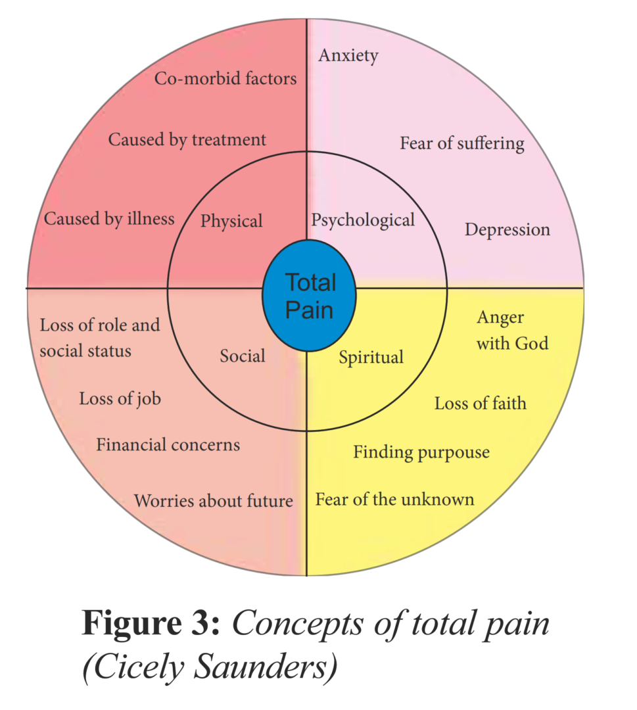
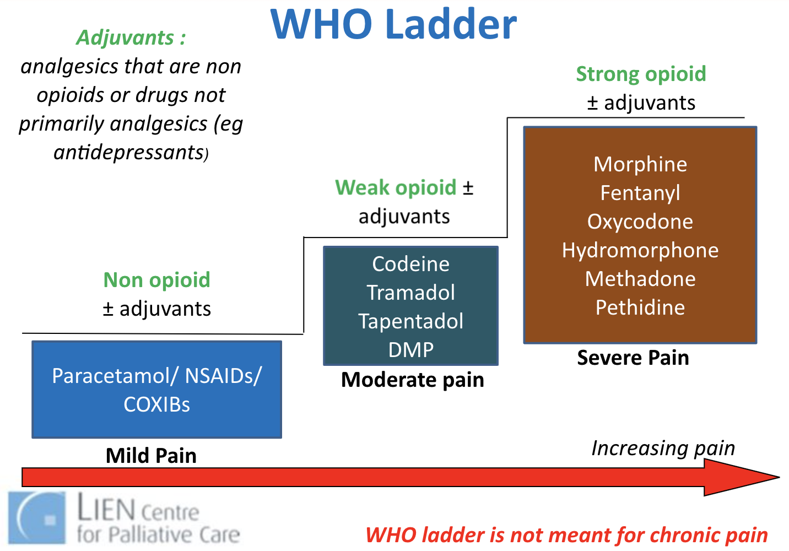
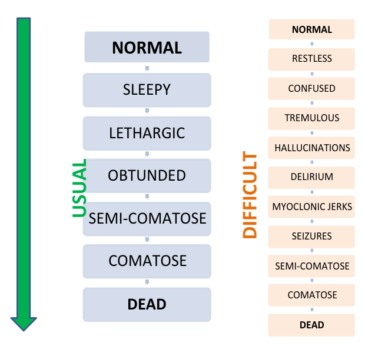

[[TOC]]

# Palliative Medicine

- Dr Alethea Yee (video, palliative care services in Singapore)
- Lee Hwei Khien, Principal Pharmacist TTSH (NV in Palliative Care Video)
- Prof Lalit Krishna, likes liverpool, boston celtics, used to play rugby

**Objectives**

- To understand the practice of palliative medicine, specifically in the areas of assessment, management, communications, continuing and integrating care
- Appreciate the potential ethical issues in palliative care.

**Notes about speciality**

- Physicians are very patient and talk much more slowly, especially in comparison to ENT which we just had. 
- It involves a lot of counselling and dealing with people's perception of things. I am not sure if I like this or have the personality for this?
- People in the specialty are very encouraging

Extensive history may be necessary to really understand the patient

- We can minimize what we will do to the palliative patient with some good history
- Really try to understand why the symptoms are happening and why it's affecting the patients

**Struggles**

- Why does the MSW have no way of checking in and out on patients?
  - At every admission, physicians need to refer again.

**Postgrad**

- Family Medicine (3 years, has surgical, o&g, peds)  + Palliative Care Subspecialty (3 years) = 6 years
- IM (5 years)  + Palliative Care Subspecialty (2 years) = 7 years
- Geriatrics + Palliative Care Subspecialty
- Certification in palliative care is also available (3 days); will not become a consultant in palliative care
- Postgrad diploma (part time course, modular, exit exam) - part time over 1 year on the weekend; diploma holder from NUS; will not become a consultant in palliative care

## Cases

### Case 1: Advanced Ovarian Cancer

Friend only 36 year old, mother of 2 children, recently diagnosd with ovarian cancer. The disease sounds advanced despite surgery and chemotherapy. While is comptemplating further treatment, your cousin is keen to find out more about palliative medicine and whether it has a role for her friend. Lady is currently ADL-assisted. She has abdominal pain and is worried.

- Define Palliative Medicine in 2 - 3 sentences that your cousin would understand.
- Discuss which of the palliative care service(s) would be appropriate for her friend at this point of time. Include reasons why other servies are not appropriate

#### Introduction to Palliative Care

**Learning Points**

- Important to highlight the idea that palliative care **involves a multidisciplinary team to improve quality of life using a very patient and family centric-approach**

- When communicating what palliative care is, we may not need to say everything; ask what the previous knowledge is first before sharing what is necessary to move them to the next stage.
- Palliative Care is complex, we need to know a lot about the patient and family before we can make a recommendation
- Specific issues to consider for this case
  - Psychosocial and emotional coping
  - Pain control
  - Grief in family members

#### Multi-disciplinary Collaboration

Cousin calls you again 1 week later. She has been asked to accompany her friend for a family conference in the clinic. The meeting will be attended by the oncologist, surgeon, radio-oncologist, but there is no mention of the palliative care specialist. 

She wonders if she has to request for a referral to palliative care at this point of time.

- Based on the definition of palliative care you have derived on and the potential needs of the patient, explore who are the other healthcare professionals that the palliative care physician will have to work with. This may include colleagues in allied health from other teams.
- Explain the role of the palliative care physician if he/she were to attend the family conference with the rest of the different specialist

**Learning Points**

- People in the Palliative Care Team

  - Physicians (surgeons, oncologists, palliative care), Palliative care nurses, Various Allied Health
  - Psychologist/psychiatrist support if needed
  - Medical social worker, Community services, Volunteers, Pastorial care worker
  - Caregiver training / support group

- Role of palliative care physician

  - Manage specific health issues

    - Medical: palliative treatments, pain control, nursing needs
    - Psychosocial: counselling services, caregiver services, financial needs, communication of patient needs to primary team

  - Coordinating the care at a high level:

    - Support the primary team, for example when the surgeon is confronted by the patients, to diffuse tension between the primary team
    - Support patient and patient's family; elucidating patient needs and communicating them with physician team i.e. coordinate care

    A lot of what palliative physician is not about what they do, it is about how they do it. There is a lot of inter-professional collaboration involved.

- At the family conference, need to know the role of the conference; never go in say here are the ways in which we can help, **observe first before offering help.**

  - Understand the medical treatment
  - Understand the patient's social support system, financial situation, medical condition, and thinking
  - Understand the family members, their needs, and thoughts.

#### Nausea Vomiting in This Patient

Current differentials

- Gastric
- Metabolic (CTZ trigger)
- Cerebral cortex (psychological)
- Increased ICP affect on vomiting center
- Vestibular

 Learning Points

- Tolerance to opioids develops within 5 days of starting/ increasing dose; so N/V improves
- What is the least number of questions that we can ask to cut down the differentials. 
  - What's in the vomitus? 
  - Onset: What's in the vomit in relationship to a meal? Or when feeling stressed?
  - Aggravating and alleviating factors: smell
  - Associated symptoms: can pass gas
- Establish the consequence of N/V
  - Nutrition
  - Injury to the GI Tract
  - Oral medications - problem with poor control of pain
- Need to have directed targeted set of questions to rule out some differentials; such that when someone joins the interview, they should be able to tell which differential we are working on.
- Approach to Nausea / Vomiting
  - Acute or chronic
  - A set of sequential causes of nausea / vomiting: temporal
    - Short episodes of things cause similar symptoms might be grouped together by the patients
  - Urgency of intervention
  - Complication of symptoms

### Case 2: COPD in Elderly

60 year old gentlement with COPD for 15 years. Chronic smoker, 50 pack year history. 

Social: single, used to work in construction, low education level. Parents passed away. Three other siblings who he infrequently keeps in contact with. Stays in 2 room flat by himself. Enjoys fishing with friends and walks by the beach.

#### Compare differences between this patient and case 1

Disease factors

Patient Health factors

Social factors

Psychology 

#### Trigger for End-of-life Care Discussion

- FEV1 <30% predicted
- Oxygen dependence
- One or more hospital admissions in the previous year for an acute exacerbation of COPD
- Left heart failure or other comorbidities 
- Weight loss or cachexia
- Decreased functional status
- Increasing dependence on others
- Age >70 yrs

#### Talking About End-of-Life Care

Prognosis, and Advance Care Planning.

**Initiating discussions about end-of-life care**

- Frame this discussion as an important part of care for all patients with severe COPD
- *Identify whether the patient or someone close to the patient has been seriously ill, whereby they were not able to make their own medical decisions, and use these situations to facilitate discussion*
- Inquire as to whether a *family member or other person should be present for the discussion*

**Discussing prognosis**

- Use ‘‘ask-tell-ask’’ to ask if patients are willing to discuss prognosis, then deliver prognosis, and then confirm understanding Use numeric expressions of risk rather than qualitative statements
- Frame prognosis as referring to groups of people rather than individuals
-  Explicitly discuss *uncertainty in prognostication*

**Discussing advance care planning**

- Frame as being important to ‘‘hope for the best and prepare for the worst’’
- If appropriate, clarify that discussing advance care planning with the physician will not diminish the physician’s focus on maximising the patient’s survival
- Discuss particular importance of advance directives if patients have strong opinions about use of CPR, mechanical ventilation or other treatments
- Discuss importance of advance directives if patients have a preference for another person to make medical decisions for them if they are not able and, especially, if that preference does not match the default surrogate decision-maker according to local laws
- Identify whether there are specific health states that the patient would consider ‘‘worse than death’’
- Explicitly discuss a commitment to nonabandonment
- Offer patients the opportunity to raise issues about their spirituality or religion that they would like their physicians to be aware of

## About Palliative Care
### Official Definitions

- WHO: Palliative care is an approach that improves the quality of life of patients and their families facing the problem associated with life-threatening illness, through the prevention and relief of suffering by means of early identification and impeccable assessment and treatment of pain and other problems, physical, psychosocial and spiritual. 
- European Association of Palliative Care: Active total care of patients whose disease is not responsive to curative treatment, where control of physical, psychosocial, spiritual, and family components are important
- An approach to **achieve personal goals of care** when **faced with progressive incurable illness**. Some goals of care include:
  - Cure
  - Prolongation of Life
  - Fight till the end
  - Well enough for treatment
  - Qualify of life
  - Suffer as little as possible
  - Be well cared for at the end of life

Two terms commonly used similar to palliative care

- Hospice care: community palliative care services for patients in the final months of life
- End of life care: provided hen life is limited to short number of hours or days
  Palliative Care is the overarching philosophy under which these sits

### Principles of Palliative Care

#### The development of hope: Rumbold’s three orders

- First order: Denial of symptoms  -> Hope for recovery
- Second order: Denial of non-recovery -> Hope beyond recovery
  - To die with dignity;
  - For the continuing success of children;
  - That a partner will find the support they need;
  - That their life’s contribution will continue and be found useful.
- Third order: Hope that faces existential extinction
  - Finds a sense of ultimate meaning in the life that has been lived.
  - Such hope may hold to a belief in a life after death, but recognizes this belief as a contingency of faith.

#### More of Hope

*Even when the future is short, it can be made better - better on an emotional or spiritual plane. Hope can continue even as clinical treatment cease.* - Jerome Groopman

- Multi-dimensional
- Shifts with time
- Hope not necessarily about survival
- Hope can range from big to small things
  - Hope for a pain-free day
  - Hope to see son get married
- 2 types of hope (Whitney et al.)
  - Specific (hope for specific outcome)
  - General (a non-specific sense of hopefulness)

- The breadth of hope - Chris Feudtner
  - Complex structure
  - Mundane to miraculous
  - Miracle hope is adaptive
  - Hope &rarr; cope
  - Hope enables a person to anchor onto something so that one can continue to engage with the future
  - Emotions affect sense of hope and hopelessnmess
    - Reciprocity of emotions and hopes: need to identify the emotions that influence hope, and how degrees of hop influence emotions
  - Treatment, treatment withdrawal are complex decisions with life and death implications
    - Explore the values that support one's choice and decisions
    - Prioritize the values which is more constant
    - Prioritize the hope

#### Dignity conserving care

A core framework of dignity conserving care has been developed by Chochinov, with the aim of reminding practitioners about the importance of caring for, as well as caring about, their patients. The mnemonic ABCD stands for Attitude, Behaviour, Compassion and Dialogue

- Attitude: be respectful, acknowledging the patient as an individual with cognisance of many issues including culture and ethics
- Behavior: An awareness of one’s attitude may lead to a more positive behaviour towards patients. Small acts of kindness and respect boost a patient’s sense of worth. Taking a little time to explain to patients what is happening dispels fear. Practising open and honest communication and giving patients full attention allows them to develop trust, thereby enabling more per- sonal and appropriate care
- Compassion refers to a deep awareness of the suffering of another coupled with the wish to relieve it. Compassion is felt beyond simply intellectual appreciation. Compassion may be inherent in the healthcare provider and hopefully develops over time with both professional and life experience. Demonstrating compassion does not need to take time and can be both verbal and non-verbal.
- Healthcare professionals speak to patients about their illness but may fail to touch on the issues that are most important to the patient, such as the emotional impact of the illness and the importance of being recognised as an individual and not another sick person. Healthcare decisions need to be taken considering not only the medical facts but also the life context of the patient. Psychotherapeutic approaches, such as life review or remi- niscence, can be used to support patients to regain or retain a sense of meaning, purpose and dignity.

#### Build Resilience

The capacity of an individual person or a social system to grow or to develop in the face of very difficult circumstances. Resilience can be promoted at different levels in:

- Individuals
- Families and carers
- Groups
- Communities
- Staff, teams and organizations

### Ethics in Palliative Care

#### Collusion

It is often established by the time a palliative care doctor inherit the case. Physician need to recognize that collusion is an act of love. However, one needs to make a decision of whether or not to address the collusion. Very often we need to address it in order to better manage the patient.

#### Giving a Drug

Is it acceptable for you to apply a drug that we don't know if the patient is allergic to?

- Administration of morphine in emergency setting but patient is 
- Good indication: drug is used proportional manner in which there is clear indication

#### Patient Refusing Care

- Duty to patient is to assess the patient and treat him as best as possible to what he allows or to the standard required professionally. 
- If a patient refuses care, we need to first assess patient's capacity
  - If patient has no capacity, we need to make a decision in the best interest of the patient

#### Withholding or withdrawing of treatment

#### Artificial hydration and nutrition

### Who Needs Palliative Care

The life-limiting conditions that may require palliative care (cancer and non-cancer):

Conditions that are managed by palliative care team

1. Kidney failure
2. Respiratory disease
3. Dementia and neurological conditions
4. Heart disease
5. Incurable cancer
6. Other life-limiting progressive conditions 

### Who Provides Palliative Care

This is a multidisciplinary team consisting of

- Doctor, Nurse, Pharmacist
- Medical social worker
- Spiritual care worker, 
- Physiotherapist, Occupational therapist, Art / Music therapist

#### Palliative Care Physician

Palliative Care Physicians care for

- **Patient**: manage complex conditions, pain, nursing needs
  - Runs outpatient clinic for those who are strong enough to return for care
- **Family**: Family's psychological and social wellness can be affected. They are called the hidden patients. 
- **Other doctors**: support their work by providing a holistic view of the patient, diffuse tension when problems arise, resolve conflicting management plans from different specialists

**Initial Contact at Inpatient Hospice**

- AMD status
- Check their understanding of hospice service
- Be aware of the social and cultural issues affecting patient's perception of hospice care

### Where is Palliative Care Provided

#### Hospice Model

This is a philosophy rather than a specific location of care.

- Focus on quality of life, comfort, and death with dignity, not cure or life prolongation
  - Symptom control (pain, nausea, dyspnea, agitation, anxiety, depression)
  - logistical support (eg, home health care, durable medical equipment)
  - psychological and spiritual counseling, and bereavement support
  - It is appropriate when aggressive curative treatments are no longer beneficial or desired. 
- Interdisciplinary team (medical, nursing, psychosocial, spiritual, bereavement care)
- Services provided at home, assisted living facility, or dedicated facility
- Requires survival prognosis of &leq; 6 months with documentation of irreversible decline in clinical and functional status.

Common misunderstandings regarding hospice eligibility include beliefs that the patient must be actively dying and have a do not resuscitate order. While most patients on hospice care have clear instructions to decline heroic life-sustaining measures, this is not a prerequisite to receive hospice services.

#### Hospital Service

- All restructured hospitals in Singapore has palliative beds
- TTSH, CGH, SGH, KKH, KTPH, NCC, NUH, NTFGH

#### Community Services

Referral to community hospice care services is done through aic website: www.aic.sg; referral to hospital support team is done through the regular services. There are three types of hospice services:

**Home hospice**

Empower family to care for patient until death at home. Each home is assigned a nurse as a case manager; the nurse can provide medication advice for symptom control, nursing advice (e.g. skin, bowel, mouth, tube care), and psychological support. Home care doctors and social workers/counsellors are available as needed.

- Who is it for:
  - ADL-assisted patients
  - With caregivers who are confident of caring for patient at home
  - Benefits of convenience: 
    - allow patient to continue care for children at home
    - spend more time with family
- Features
  - 24 hours
  - loans equipment to needy patients
  - Does not provide daily physical care to patient
  - Does not do regular wound or tube / catheter care
  - Frequency of visit varies according to the needs and stability of patient
  - Free for patients but means-testing is required for the services to get reimbursement from the government; patients need to pay for consumables
- Organizations in Singapore
  - HCA Hospice Care
    - Star PALS
      - By HCA Home Hospice
      - For pediatric patients
  - Hospice Home Care
  - Assisi Home and Hospice
  - Metta Welfare Association
  - Methodist Welfare services
  - Dover Park Hospice
  - AIC Home Program (only terminal known cancer cases)

**Inpatient hospice**

- Who
  - For those whose symptoms cannot be managed at home or dying patients with no carers
  - Patients with estimated prognosis <3 months
- 1 nursing home and 3 community hospitals; over 400 beds by 2030.
  - Dover Park and Assisi Home are standalone hospice run by volunteer organizations with government subvention
  - St Joseph Nursing Home has some palliative beds
  - Bright vision hospital, st andrew community hospital, and yishun community hospital have palliative beds
  - St Andrew's community hospital
- Features
  - Fees are payable by MediSave and means testing applies for government subvention
    - Approximately cost 300 dollars a day before subsidy and insurance

**Day hospice**

- For those who are relatively mobile and stable/deteriorating slowly, including those on wheelchairs
- Home doctors available and social workers/counsellors are available as needed = provide holistic care
- Flexibility for patient as frequency of attendance dependent on needs of patients
- Nominal daily fee
- Meals and transport are provided
- Only HCA Hospice and Assisi Hospice provide day care

### Explaining Palliative Medicine

#### Introducing Palliative Medicine

Palliative care is a way in which a team of many different types of care providers like doctors, nurses, pharmacists, therapists, social workers, come together to try to understand how to best care for you and your family, in order to improve your quality of life by helping you achieve your personal goals and needs. These can include:

- Cure / prolong life
- Good QOL / reduce suffering 
  - by early identification of pain/discomforting symptoms and active management
  - by identify and align hopes to achievable goals so  
- Specific personal goals
  - Seeing grandchildren
  - Graduation
  - Spiritual needs

#### What happens in palliative medicine

- Early identification of pain/discomforting symptoms (in terms of physical, psychosocial, spiritual well-being)  and active management
- Identify and align hopes to achievable goals; Suffering cease to be suffering once it has some meaning

**General palliative care** is provided by the usual professional carers of the patient and family with low to moderate complexity of palliative care need. Palliative care is a vital and integral part of their routine clinical practice which is underpinned by the following principles:

- Focus on quality of life, which includes good symptom control
- Whole person approach, taking into account the person’s past life experience and current situation
- Care, which encompasses both the person with life-threatening illness and those who matter to the person
- Respect for patient autonomy and choice (e.g. over place of care, treat- ment options)
- Emphasis on open and sensitive communication, which extends to patients, informal carers and professional colleagues

**Specialist palliative care** is provided for patients and their families with moderate to high complexity of palliative care need.

- **Supportive care for cancer** is that which helps the patient and their family to cope with the disease and its treatment—from pre-diagnosis, through the process of diagnosis and treatment, to cure, continuing illness or death and into bereavement. It helps the patient to **maximize the benefits of treatment and to live as well as possible with the effects of the disease**. It is given equal priority alongside diagnosis and treatment. This definition can be applied equally to non-cancer diagnoses.
- **Hospice and hospice care** refer to a philosophy of care rather than a specific building or service, and may encompass a programme of care and array of skills deliverable in a wide range of settings.

#### Selecting a type of palliative service

Choice of the right type of service is dependent on

- Patient health factor
  - Treatment requirements e.g. medication, procedures
  - Complexity of what is required to care for the patient
  - Prognosis (to qualify for inpatient care)
- Patient socioeconomic factor
  - Financial situation of the family
  - Ability of family and willingness of family to care for patient
- Patient psychology
  - Wishes of the patient; 
  - and psychological health of the patient

## Humanities in Medicine

Music, Art, Literature, Movie, Words, Narratives etc, help us piece the information together. 

- Cancer by My Chemical Romance as an illustration to the inner route of the thoughts of our patient, a sign of trust since they are telling this to us, and may be therapeutic.

- Humanities help us connect with the patients. Examples

  - https://poets.org/poem/do-not-go-gentle-good-night

    - Do not go gentle into that good night - 

  - Humor is an important coping mechanism: coughing meme and funeral meme

  - Buddhist scripture music helps

  - Aroma therapy

  - Bedside items tell us something about the patient; our job is to detect this and explore with the patient why this is so important.

  - Food therapy

  - The part of humanities that was meaningful to an individual doesn't has to be part of popular culture; Hey Jude, carry on my way etc. Soft kitty by sheldon cooper.

  - Art has a very special role; a child given a crayon does not ask why, but we still. 

  - Medical literature: atul gawandi, never let me go

- Humanities may force us to challenge our own values

  - Not everyone in the ward are the same 
  - Be open to receiving and listening to perspectives that are not coherent to our own values

### Art for EOL

https://media.swncdn.com/cms/BST/71315-joshua-earle-yi6dvuyneuo-unsplash-1.1200w.tn.jpg

https://media.pitchfork.com/photos/5929a5ecb1335d7bf1698cf6/1:1/w_320/aacbeb7c.png

https://i.redd.it/rgcf5jvkd5o31.png
https://i.pinimg.com/736x/da/b9/f7/dab9f7b1f5faa306c9b90fcfe1c91fa3--life-and-death-grim-reaper.jpg

https://www.youtube.com/watch?v=HS_LfeIIByA

Reasons for Arts

* Expression
* Connection
* Last wishes

### Movies for EOL

The Sea Inside: https://www.youtube.com/watch?v=chS6sFQEOqQ


- Quadraplegic man advocate
- Freedom that takes away life is no freedom at all; Life that takes away freedom is no life at all.
- The middle man had to deal with his own response. 

You Don't Know Jack: https://www.youtube.com/watch?v=n23TsHBSTho

- *Jack Kevorkian* was an American pathologist and euthanasia proponent. 
- He publicly championed a terminal patient's right to die by physician-assisted suicide, embodied in his quote "Dying is not a crime".

Whose life is it anyway: https://www.dailymotion.com/video/xe37qa

* Doctor

  * Automobile accident, shock, no improvement in spinal, trauma, renal
  * Mental depression, clinical depression vs reactive depressed; 18 years of clinical experience
  * Objective result there are clinical symptoms of depression
  * Wrong decision

* Patient

  * Cruelty is the choice is removed from the person concerned

  * You condemn me to a life of torment

    

## Living with Dying

Living and dying are very existential experience.

Don't keep focusing on the treatment.

### Death Anxiety

- Coined Irvin Yalom, 
- Socrates: life and death as interdependent: preparing for death is a way of preparing for life
- In facing death, one realizes that one's life is limited and begins to ponder how one has lived. If one has not lived well, then one cannot die well. 
- Fear of non-existence
- Fear of the end: earything stops; unfinished work
- Fear of being forgotten
- How will I be remembered?
- Fear of pain
- Concern for impact of the grief one's death will place on loved ones
  - Patient may then refrain to 

### Terminal Discharge

A terminal discharge is defined as a discharge home when patients are critically ill and likely to pass away within short hours or days.

For seriously ill patients with little chance of recovery, it is a good practice to proactively discuss about patients’ preference of place of death to facilitate early planning and coordination.

**Important! We do NOT push for terminal discharge.**

#### Factors to Consider for Terminal Discharge

- Patient
  - Has patient expressed a desire to die at home?
  - Will symptoms be manageable at home?
  - Could patient die enroute?
- Family/Caregiver
  - Are there caregivers available? How many are required?
  - Is the family able to cope physically and emotionally with patient’s care and demise?
  - Is the family aware of what to expect (e.g. about the signs of dying), how to respond, and who to contact when patient dies?
- Resources/Equipment
  - What equipment is needed (e.g. hospital bed, oxygen concentration)?
  - Should referral to a home hospice team be made?
    (Note: Please note that new referrals are seen during weekdays only, and it is not practically feasible for home hospice teams to see new patients that are expected to demise within hours on arrival at home or over weekends or public holidays. For patients already known to home hospice, please inform them in advance of the discharge.)
  - Consider private nursing contacts for caregiving, if necessary and affordable
  - For overseas terminal discharges, contact palliative care teams for advice

#### Terminal Discharge Checklist

This checklist might be helpful when facilitating a terminal discharge.

| Doctors                                                      | Nurses                                                       |
| ------------------------------------------------------------ | ------------------------------------------------------------ |
| Achieve consensus about terminal discharge between family and medical team Order controlled drugs correctly Consult Palliative team if a syringe driver^ or disposable infusor is required Supply adequate medications (usually 3-7days supply) Make [home hospice care referral](https://www.duke-nus.edu.sg/lcpc/resources/sg-pall-ebook-disclaimer/sg-pall-ebook/local-palliative-care-services/palliative-home-care-services)*, if not already known Contact home hospice team and give adequate information Fax discharge summary to home hospice Give 2 copies of discharge summary to family and home hospice service Write memo to Ambulance Officer (to send patient home and not to Emergency Department in case of demise en-route) Write memo to GP (with information to help GP write up death certificate) | Insert subcutaneous needle, if infusion is required Provide caregiver training as needed Book ambulance Arrange home oxygen and other equipment, if necessary Provide relevant brochure, if available Liaise with pharmacist with regards to discharge medications |

**Note:** Terminal discharge protocols might be available at your institution; ask if in doubt.

^If syringe drivers are used, the Palliative Care Team will counsel family about how to return the syringe driver.

*May not be appropriate to contact home hospice (unless already known to the service) if expected demise of patient is hours on arriving home or terminal discharge is over a weekend or public holiday.

#### Dying at Home

- How to turn the patient
- How to give medication
- Death certification
  - A doctor has to review the patient
  - Certified cause of death has to be issued
  - Family has to bring this to a police station along with patient's NRIC
  - Police will issue a formal certificate of death
- Coroner's Cases
  - Should not have terminal discharge
  - Police and investigating officer from hospital need to be present at home
  - Coroner has to determine the cause of death 

#### Foreign Patients

- No subsidy
- Preferred place of care and death might be in their home country
  - Challenge of transfer patient when they are well
- Pursuing further treatment might be futile, may affect the wish to go back to home country
- Control symptoms while giving treatment so that a patient can make the decision of whether they will go home
  - This might be especially tricky for medical tourists
- Note their hope is no longer feasible, what's the back up
  - Understanding that patients may have come here because of their trust in Singapore's medical system
  - They may have sold their house and farm back at home to afford the care here
- Terminal discharge level up
  - Can the patient take commercial plane
  - Medi-evac? Tens of thousands of dollars; sometimes even if the patient can afford it, there might not be resources to send them back
- Cannot discharge a patient to a place of less safety
  - At least should brief the patient and patient's family
  - Find out if there are other services that we can handover to

#### Foreign Family Members at Home

- If patient passes away, can foreign family member be supported?
  - Can they continue to work here?
  - Can the other members of the deceased patient help the patient stay here?
  - More complicated if there is young children involved
- Get the social worker involved
  - We cannot change the law
  - The spouse may have to go back to home country without the family; may loss the 

## Palliative Care Emergencies

### Suicide Ideation

Need have a high level of suspicion based on history

- Explore
- Risk factors
  - Previous attempts
  - Suicide note
  - Plan
- Escalate to consultant

### Acute Pain Crisis

- A pain crisis is defined as severe, uncontrolled pain that is causing the patient severe distress.
- It may be acute in onset or worsening gradually to an intolerable level and requires immediate intervention.

#### Investigation

During a pain crisis, history-taking needs to be focused. The assessment and pain management usually occurs simultaneously. Important aspects in the assessment include:

- Pain intensity
- Nature of the pain
- Elicit if this a new pain or an exacerbation of an existing pain
- Exclude reversible factors (e.g. cute retention of urine)
- Etiology of the pain

#### Management

- Respond in a calm and reassuring manner
- Seek help from senior members in the team, and/or a palliative care team
- Use strong opioids for rapid titration
  - Select the opioid based on pain assessment, patient’s response to opioids, and if there is renal/liver impairment.
  - Use parenteral route (IV/SC) for rapid onset of analgesia.
  - Commonly used opioids locally include Morphine, Fentanyl or Oxynorm.
- Aim to achieve ‘acceptable subjective analgesia’, or reduction of pain severity by 50%
- Initiate [Rapid Opioid Titration](https://www.duke-nus.edu.sg/lcpc/resources/sg-pall-ebook-disclaimer/sg-pall-ebook/palliative-care-emergencies/acute-pain-crisis#panelBody3) (see below)
- After pain is controlled, start a continuous infusion of the opioid, or increase the baseline opioid infusion to maintain analgesia.
- Breakthrough doses should be available for breakthrough pain.
- Start a pain chart if available.
- Revisit the pain history in greater detail when the patient is more comfortable.
- Titrate the opioid infusion over a period of time (usually few days) until pain is well-controlled, then consider converting to a non-parenteral route.
- Monitor for signs of opioid toxicity (e.g. low respiratory rate, excessive sedation, myoclonic jerks and hallucinations).

#### Rapid Opioid Titration

It is advisable to have another healthcare provider around to document the process. In the example below, a total of 4mg IV Morphine was required to achieve pain control.

| Time    | Pain score        | Respiratory rate | Sedation | Opioid dose     |
| ------- | ----------------- | ---------------- | -------- | --------------- |
| 10.00am | 10/10             | 28               | Alert    | IV Morphine 2mg |
| 10.10am | 8/10              | 24               | Alert    | IV Morphine 2mg |
| 10.20am | 4/10 (acceptable) | 20               | Alert    | Nil             |

**For opioid-naïve patients:**

- IV Morphine 1-2.5mg every 5-15min or SC Morphine 1-2.5mg every 15-30min, or
- IV Fentanyl 10-25mcg every 5-15min or SC Fentanyl 10- 25mcg every 15-30min till significant pain control is achieved or side effects develop

**For patients already on regular opioids, including parenteral opioid infusions:**

- Convert to the equivalent parenteral daily dose using conversion ratios (refer to [Opioid Conversion Calculator](https://www.duke-nus.edu.sg/lcpc/resources/sg-pall-ebook-disclaimer/sg-pall-ebook/opioid-conversion-calculator))
- Administer at 1/10th or 1/12th of the daily dose every 5-15min (if IV route) or every 15-30min (if SC route) till analgesia is achieved.
- If ineffective after 3 doses, to call for help.

**Setting up a continuous infusion after rapid opioid titration:**

- Once analgesia has been achieved, the total effective dose of Morphine or Fentanyl is assumed to last for 4hr. (Note: Some institutions use 2hr for Fentanyl)
- The infusion rate for Fentanyl or Morphine: Total dose divided by 4 = xx_mg/hr or mcg/hr). (Note: Some institutions divide by 2 for Fentanyl)

**Other Considerations:**

- Optimize adjuvant agents
- Interventional techniques if appropriate
- Palliative or pain team involvement
- Address any mood issues like anxiety

### Stridor

- Airway obstruction can occur in the upper or lower airways.
- Stridor is an abnormal, high-pitched breath sound (usually inspiratory) that is produced by turbulent airflow through a narrowed airway.
- **Once stridor is heard, the airway passage is often less than 5mm**.
- Onset may be gradual or sudden. It can be very distressing to the patient or anyone who witnesses it.

#### Approach

Airway obstruction can be anatomical or functional:

- Anatomical
  - Intraluminal (e.g. tumour, mucus plug)
  - Intramural (e.g. laryngeal carcinoma)
  - Extramural (e.g. mediastinal lymphadenopathy)
- Functional (e.g. recurrent laryngeal nerve palsy intensity)

#### Management

- Important to recognize and manage early because of risk of eventual total obstruction and asphyxiation.
- If aligned with the patient’s goals of care, secure the airway via
  - Tracheostomy
  - Bronchoscopic interventions (e.g. intraluminal stenting, laser, cryotherapy)
- Chemotherapy or radiotherapy may be considered subsequently if the obstruction is caused by a tumour that is responsive to these treatment modalities. An elective tracheostomy may be required before radiotherapy.
- If securing the airway is not feasible, refer to palliative care for advice.
- Palliative pharmacological management includes
  - PO/IV/SC Dexamethasone 16-24mg/day to decrease peritumour oedema
  - PO/IV/SC opioids for breathlessness
  - If agitated, may need sedation (e.g. with Midazolam)
  - Keep fluids to minimum, otherwise airway secretions may compromise an already narrowed airway
- Good communication and education of patients and family members about what to expect and treatment plans is essential.

### Bleeding in Cancer

- Causes of bleeding can include vascular tumours, tumour invasion into vascular structures, or systemic processes like disseminated intravascular coagulopathy or thrombocytopenia.
- When it is visible and massive, it can cause significant distress to anyone who witnesses it.
- The approach includes general and pharmacological measures relating to the site of bleed.

#### Approach

There might be little time for assessment. However, the following should be considered, if possible, in order to decide on the most appropriate management:

- Underlying cause of bleed
- Patient’s prognosis
- Patient’s resuscitation status and goals of care
- Likelihood of reversing the underlying cause
- Balance of benefit VS burden ratio of interventions

#### Management

**General Measures**

- If appropriate, consider:

  - Resuscitative support
  - Interventions (e.g. embolization) to stop the bleed

- All medications that can worsen bleeding should be discontinued.

- If bleeding is catastrophic (e.g. carotid blow out), efforts to stop the bleeding may not even be possible in such dire circumstances. Consider 

  Palliative Sedation

   (see below) and supportive measures as below:

  - Use dark green or brown towels
  - Consider [Adrenaline or Tranexamic acid packs](https://www.duke-nus.edu.sg/lcpc/resources/sg-pall-ebook-disclaimer/sg-pall-ebook/palliative-care-emergencies/bleeding-in-cancer#panelBody3) (see below)
  - Hemostatic pressure packing with gauze or ‘Kaltostat’ dressings for surface bleeding
  - Use curtains to screen patient

- Provide a calm and reassuring presence

  - Family members may be encouraged to ‘remain outside’ till the situation is under control.
  - Reassure family that will be done to keep patient comfortable.

- Involve medical social worker or nurse to support family

- After the incident, a debrief should be held to screen for distress amongst the involved team members

**Pharmacological Management**

- Topical treatments

Topical agents may be used if the site of bleeding is exposed. The following are common drugs used for surface bleeding.

| Drugs                              | How to prepare                                               | Notes                                                        |
| ---------------------------------- | ------------------------------------------------------------ | ------------------------------------------------------------ |
| Tranexamic Acid (antifibrinolytic) | Crush four 500mg tablets to a fine powder in a 60g base (e.g. soft paraffin) OR Soak undiluted Tranexamic acid ampoule (500mg/5ml, 10%) into gauze and apply pressure for 10mins, then leave in with dressings. | Institutional practices vary.                                |
| Adrenaline                         | Soak undiluted Adrenaline (1:1000) in gauze and apply pressure for 10min, then leave in with dressings. | Do not use long-term as it can cause ischemic necrosis and rebound vasodilation. |

- Systemic treatments

Besides blood products to correct the coagulation profile, Tranexamic acid can be used systemically for bleeding. Other systemic treatments that may help to reduce triggers for bleeding includes e cough suppressants for patients with hemoptysis, or proton-pump inhibitors for patients with hematemesis.

| Drugs           | How to prepare                                               | Notes                                                        |
| --------------- | ------------------------------------------------------------ | ------------------------------------------------------------ |
| Tranexamic Acid | PO/IV 500mg-1000mg t.d.s. (max dose 1500mg t.d.s.) Oral bioavailability: 30-50% Onset of action: 1-3 hrs Time to peak plasma concentration (PO): 3 hrs Plasma half-life: 2 hrs Duration of action: 24 hr | Do not use for hematuria as it will cause clots to form (hence, risk of urinary retention) Do not use for hemoptysis caused by pulmonary embolism Caution: Renal impairment, history of thromboembolism |

- Palliative Sedation
  - If bleeding is catastrophic bleeding, sedation of patient may be required.
  - If situation is foreseeable, prepare the patient and family beforehand.
  - The palliative care team should be consulted.
  - Clear documentation should follow the discussion, especially stating the consensus, intention and proportionate dosing to decrease awareness of suffering, if a catastrophic bleed occurs.

### Seizures

- Seizures are a result of abnormal electrical conductions in the brain causing the sudden onset of transient neurological symptoms.
- Continuous seizure activity that lasts longer than 30 minutes is termed as ‘status epilepticus’.
- There are convulsive and non-convulsive seizures.
- Convulsive seizures can be very distressing to family members.

#### Approach

In the palliative care setting, the common causes of seizures include:

- Brain pathology – Primary or metastatic brain tumours, scar epilepsy, stroke
- Metabolic abnormalities – Hepatic encephalopathy, hypoglycaemia, uraemia, hyponatremia
- Medication-related – Alcohol withdrawal

#### Management

**Non-pharmacological**

- Aim for termination and prevention of seizures
- Correct reversible causes if appropriate
- Discontinue medications that can lower seizure threshold (e.g. Imipenem, Cephalosporins, Haloperidol).
- Provide a calm and reassuring presence to the patient and family members
- Family members should be encouraged to ‘remain outside’ till the situation is under control and reassurance given.
- Place patient in recovery position
- Oxygen supplementation and suctioning if available
- An oropharayngeal airway is not required unless there is significant respiratory distress.
- Consider long-term antiepileptics (e.g. Levetiracetam (Keppra), Phenytoin)
- Dexamethasone (16-24mg/day) if underlying cause is brain tumours especially if there is cerebral oedema.
- If a seizure persists for more than 2 minutes, pharmacological management of seizures should be initiated.
- If a seizure takes place at home, institute the following pharmacological management, and consider admission to hospital or inpatient hospice if appropriate.

**Pharmacological**

- **Rectal Diazepam 10mg** can be given if immediately available
- **Parenteral Midazolam 1-2.5mg** can be given every 15 minutes until the seizure is aborted.
- If seizures persist, a parenteral (IV/SC) Midazolam continuous infusion (range from 0.5-3mg/hr) can be started OR consider intravenous antiepileptics (e.g. Phenytoin, Levetiracetam or Phenobarbitone)
- For persistent seizures, urgent referral to a neurologist or specialist palliative care team should be considered

### Malignant Spinal Cord Compression

- Spinal cord compression requires early identification and immediate treatment to prevent permanent neurological impairment.
- There should be a high index of suspicion in cancer patients who present with back pain or sudden worsening of previously well controlled back pain, especially with known spinal metastases. If in doubt, consider an early MRI of the spine.
- Patients can present acutely (within hours) or subacutely (weeks to months).
- The underlying cause can be from intramedullary, intradural, or extradural metastases.

**Clinical Features**

- **Back pain** is the most common symptom.
- Neurological impairment such as **weakness, sensory impairment, and bladder and bowel dysfunction** may develop.
- Physical examination should include a full neurological examination including looking for **lax anal tone and saddle anaesthesia**.

**Management**

- Confirm with MRI spine (unless patient refuses further treatments) . Assess if more than one level is involved.
- Start Dexamethasone 16mg/day with gastric protection
- Assess Spinal Stability with **Spinal Instability Neoplastic Score (SINS)** (see below)
- Calculate **Tokuhashi Score**: a prognostication tool that helps with decision-making regarding surgical intervention.
- Assess extent of neurological deficits. If deficits are severe and >48hours, chance of neurological recovery is very low with radiotherapy or surgery. However radiotherapy may still be given for pain control if pain is an issue (in absence of spinal instability)
- See table below for proposed management, if neurological deficits are mild OR <48hours

|                                          | Stable Spine (SINS < 7)                                      | Unstable Spine (SINS ≥ 7)                                    |
| ---------------------------------------- | ------------------------------------------------------------ | ------------------------------------------------------------ |
| **Good Prognosis** (Tokuhashi score ≥ 9) | Single Level: Surgery followed by radiotherapyMultiple levels: Radiotherapy alone | Surgery followed by post-operative radiotherapy              |
| **Poor Prognosis** (Tokuhashi score < 9) | Radiotherapy alone or Supportive Care                        | Orthopaedic consult for spine stabilization +/- Radiotherapy or Supportive Care |

**Considerations** 

- Radiotherapy is unlikely to relieve pain caused by an unstable spine. May require surgery or spinal analgesia to control such pain
- Good skin, urinary and bowel care are essential. This may include regular turning, indwelling catheter and rectal measures
- A referral to Palliative Care and/or Pain team should be considered for uncontrolled symptoms

**Spine Instability Neoplastic Score (SINS)**

|                                               | Score |
| --------------------------------------------- | ----- |
| **Spine Location**                            |       |
| Junctional (occiput-C2, C7–T2, T11–L1, L5–S1) | 3     |
| Mobile spine (C3–C6, L2–L4)                   | 2     |
| Semi-rigid (T3–T10)                           | 1     |
| Rigid (S2–S5)                                 | 0     |
| **Mechanical or Postural Pain**               |       |
| Yes                                           | 3     |
| No (occasional pain but not mechanical)       | 1     |
| Pain-free lesion                              | 0     |
| **Bone Lesion Quality**                       |       |
| Lytic                                         | 2     |
| Mixed lytic/blastic                           | 1     |
| Blastic                                       | 0     |
| **Radiographic Spinal Alignment**             |       |
| Subluxation/translation present               | 4     |
| De novo deformity (kyphosis/scoliosis)        | 2     |
| Normal alignment                              | 0     |
| **Vertebral Body Involvement**                |       |
| >50% collapse                                 | 3     |
| <50% collapse                                 | 2     |
| No collapse with >50% of the body involved    | 1     |
| None of the above                             | 0     |
| **Posterior Involvement**                     |       |
| Bilateral                                     | 3     |
| Unilateral                                    | 1     |
| None of the above                             | 0     |

### Superior Vena Cava Obstruction (SVCO)

- SVCO is the obstruction of blood flow in the superior vena cava.
- Most SVCOs are caused by primary or secondary lung tumours.
- Many patients present with an insidious onset of symptoms rather than acutely.
- In the event of rapid onset of SVCO, it may be life-threatening
- Generally, prognosis of the patient is that of the underlying cancer if appropriate treatment is instituted for SVCO

**Clinical Features**

| Symptoms                                 | Signs                                                     |
| ---------------------------------------- | --------------------------------------------------------- |
| Breathlessness                           | Tachypnea                                                 |
| Headache                                 | Engorged conjunctivae                                     |
| Visual changes                           | Periorbital oedema                                        |
| Dizziness                                | Cyanosis                                                  |
| Feeling of pressure in the head and face | Dilated neck veins and collateral veins in arms and chest |
|                                          | Papilloedema (late feature)                               |

**Investigations**

CT Thorax to

- Define level and degree of venous blockage
- Identify the cause of SVCO

**Management**

- If patient is acutely symptomatic with stridor, consider the possibility of tracheal compression which may need emergency tracheostomy
- Immediate Treatment
  - Sit patient upright
  - 100 percent oxygen if no contraindication
  - IV Dexamethasone 8mg b.d.
- Further Treatment
  - Endovascular Stent (Symptom relief in ~48 hours)
  - Radiotherapy (may take weeks to see full benefit)
- For patients with very chemosensitive tumours (e.g. small cell lung cancer, lymphoma, germ cell tumour), chemotherapy is often 1st line treatment

### Hypercalcaemia

- Hypercalcaemia is a common metabolic disorder affecting up to one third of cancer patients.
- It is a poor prognostic indicator in malignant disease.
- Malignant causes include osteolysis, humoral mediators, dehydration and tumour specific mechanisms
- Non-malignant causes includes primary hyperparathyroidism, dehydration, tuberculosis, sarcoidosis, certain medications (e.g. Lithium), and excessive Calcium/Vit D supplements

**Clinical Features**

- Most symptoms are insidious in nature.
- Acute symptoms usually occur with rapidly rising calcium levels.
- Classically, symptoms are described as "moans, stones, groans, and bones".

| Symptoms                | Signs                |
| ----------------------- | -------------------- |
| Fatigue                 | Drowsiness           |
| Nausea and vomiting     | Delirium             |
| Anorexia                | Seizure              |
| Abdominal pain          | Arrhythmia           |
| Constipation            | Postural hypotension |
| General aches and pains | Renal stones         |
| Polydipsia/polyuria     |                      |

**Investigations**

- Corrected Calcium (measured calcium corrected to serum albumin levels)
  - Corrected Calcium levels of >2.6mmol/L = hypercalcaemia
  - Corrected Calcium levels of >3.0mml/L requires urgent intervention
- Urea and Electrolytes
  - Dehydration and electrolyte imbalance is common in hypercalcaemia
- Plasma PTH
  - If suspicious of non-malignant causes of hypercalcaemia
  - Plasma PTH is suppressed in malignant hypercalcaemia
- ECG
  - Arrhythmia
  - Widened QRS, prolonged PR interval

**Management**

- Rehydration
  - Rehydration is most important. It helps to restore renal function and increase calcium excretion
  - Most patient have fluid deficits of 4 to 6L. Hydrate with 2 to 3L of IV fluids per day if there are no contraindications
- Bisphosphonates
  - Ensure adequate hydration before starting intravenous bisphosphonate
  - Dose reduction is required in renal impairment. Specialist advice should be sought for bisphosphonate use in patients with CrCl <30mls/min.
  - Onset of action is approximately 48 hours and calcium level continues to drop till approximately day 7.
  - **Pamidronate** and **Zoledronate** are equally efficacious
  - Dose may be repeated 3 to 4 weekly
  - Common side effect include transient fever and myalgia
  - Patients with poor dentition or recent dental issues may need dental clearance especially if on high doses and long duration of use, which increases risk of osteonecrosis of the jaw.
- **Calcitonin**
  - 4 unit/kg twice a day
  - Drops calcium level by 0.3 to 0.5mmol/L
  - Rapid onset at 4 hours
  - Tachyphalaxis usually occurs after 48 hours and calcitonin can be discontinued
  - Generally used when corrected calcium >3.5mmol/L to reduce calcium levels while awaiting bisphosphonate and hydration to take effect.
- **Denosumab**
  - (trade names Prolia and Xgeva) is a human monoclonal antibody
  - Considered as efficacious as bisphosphonates for hypercalcaemia
  - Not cleared by the kidneys, so may be used in renal failure with dose adjustments
  - The most common side effects are joint and muscle pain in the arms or legs.

## Basic Nursing Care

### Oral Care

- Oral problems may affect many palliative care patients, and can have a significant impact on their self-esteem, oral functions, and quality of life.
- Good mouth care is therefore a crucial aspect of palliative care, and should be part of daily routine nursing care.
- The aim of good mouth care is to prevent problems before they arise, and to control undesirable symptoms.

**Assessment**

Assessment, appropriate treatment and adequate reassessment to evaluate treatment response form the basis of successful management of oral problems.

- Assess daily for signs or symptoms of oral problems
- Examine all areas of the oral cavity, including lips, tongue, teeth, oral mucosa
- Assess patient’s ability to perform oral care
  - If able, encourage toothbrushing at least twice daily and rinse with water or prescribed mouthwash after each meal
  - If not able, assist with oral care after meals or 3-4 times daily
  - For patients in terminal phase:
    Frequency of oral care should be determined on an individual basis. As patient comfort is priority, any oral care intervention that causes distress should be discontinued.

**Complication**

Inadequate dental hygiene may cause mandibular molar infections, leading to cellulitis of the submandibular space (Ludwig angina). Manifestations include fever, drooling, muffled voice, stridor, and dysphagia. However, patients typically have tender, bilateral induration of the submandibular area, often with elevation of the floor of the oropharynx (not seen in this patient).

#### Oral Care for Dependent Patient

**Preparation**
Appropriate oral hygiene materials

- Cup with plain water or prescribed mouthwash for specific oral conditions
- Soft white paraffin for lips
- Oral swab sticks/foam sticks
- Other prescribed oral care agents (e.g. Oral 7 mouth gel)
- Kidney dish
- Denture box, if patient has dentures
- Bib or protective sheet
- Receptacle for waste

**Procedure**

- Explain the procedure and its purpose to the patient
- Assess the condition of patient’s oral cavity
- Place patient in sitting or semi-fowler’s position
  - Lateral if patient is unconscious, to prevent aspiration
- Protect clothing with bib or protective sheet
- If patient has dentures, remove dentures & perform denture hygiene
- Use at least 5 swabsticks with water or prescribed mouthwash solution to clean all parts of mouth – lips, gum, teeth, hard & soft palate, buccal area, tongue
- If sodium bicarbonate is used, it should be followed by cleaning with water
- Apply white soft paraffin to lips

#### Oral candidiasis

Possible causes:

- Poor oral hygiene
- Dry mouth
- Antibiotic use
- Immunosuppression

Management:

- Oral hygiene
- Anti-fungal treatment
  - **Nystatin** suspension:
    500,000 units q.d.s. for 7 days, swish & retain solution in mouth for as long as possible (few min) before swallowing, avoid consumption of food/drinks 20-30min after
  - PO/IV **Fluconazole**:
    Loading dose 200mg on day 1, maintenance dose 100mg each morning for 7-14 days

#### Xerostomia

Possible causes:

- Xerogenic drugs (e.g. opioids)
- Radiation therapy to head & neck
- Oxygen use
- Mouth breathing

Management:

- Oral hygiene
- Mucosal lubricants/saliva substitutes (e.g. Oral 7 mouthwash/gel, oral sprays)
- Saliva stimulation
  - PO **Pilocarpine** 5mg t.d.s.
  - Sugar-free **chewing gum**
- Humidifiers
- Review use of xerogenic drugs

#### Stomatitis

Possible causes:

- Chemotherapy
- Radiation therapy to head & neck
- Infection
- Dry mouth

Management:

- Treat infection
- Oral hygiene
- Avoid foods that trigger pain (e.g. acidic foods)
- Analgesic mouthwash
  - **Benzydamine hydrochloride (Difflam).**
- Topical analgesia
  - **Choline salicylate** oral gel
  - **Carmellose paste** (Orabase)
  - **Lidocaine** gel or spray
- Systemic analgesia
  - **NSAIDs or opioids**

#### Halitosis

Possible causes:

- Poor oral hygiene
- Dry mouth
- Tongue coating
- Spectrum of bacteria in saliva

Management:

- Oral hygiene
- For coated tongue:**Sodium bicarbonate** powder ¼ teaspoon to 30mls of water

### Skin and Wound Care

- Patients receiving palliative care often face skin problems, as a result of advanced disease and declining physical state.
- Nursing aspects consist of ensuring good skin care, managing skin breakdown and its associated symptoms, as well as addressing the psychosocial impact of wounds on patients and families.

The aim of good skin care is to maintain skin integrity through consistent care, coupled with skill and knowledge in the use of skin products:

- Gentle skin cleansers instead of soap which can cause dry skin
- Moisturizers for dry skin
- Barrier products to protect skin from excoriating body fluids

Psychological impact of wounds

- Physical 
- Emotional
- Psychological
- Spirituality
- Social: financial component of wound care, self-care and caregiver ability

#### General Wound Classification and Treatment

| **Necrotic (Black)/Sloughy (Yellow)**                        | **Infected (Green)**                                         |
| ------------------------------------------------------------ | ------------------------------------------------------------ |
| **Aim: Debride/Rehydrate** Consider autolytic debridement (hydrogels, hydrocolloids) or surgical/sharp debridement If debridement is not appropriate, protect peri‐wound area and leave exposed if dry or use simple dressing to protect the wound | **Aim: Debride/Treat infection/Manage odour/exudates** Debride dead tissue that harbours bacteria;  Consider antimicrobial dressings;  For exudates: alginates, hydrofibers, foams For odour: antimicrobial dressings, odour‐control products |
| **Granulating (Red)**                                        | **Epithelializing (Pink)**                                   |
| **Aim: Promote/Protect granulating tissue** Semi-occlusive, non-gauze dressings: hydrocolloids, foams, films For bleeding: alginates, hydrofibres | **Aim: Protect epithelial tissue** Low-adherent moisture conserving primary dressings: foams, hydrocolloid |

**Wound dressing types**

| **Dressing Types & Products**                                | **Dressing Types & Products**                                |
| ------------------------------------------------------------ | ------------------------------------------------------------ |
| **Films** (e.g. Tegaderm, Opsite)                            | Provides transparent primary wound cover with a range of fluid‐handling capacities. |
| **Non‐adherents** (e.g. Primapore, Melolin, Mepore pro)      | Allows removal without causing trauma, pain or damaging delicate new tissue around wound margin. |
| **Foams** (e.g. Allevyn Non-Adhesive, Mepilex)               | Super absorbent particles embedded within dressing that enhance absorption of exudates. Suitable for **moderate to heavily exuding wounds**. |
| **Alginates** (e.g. Algisite M, Urgosorb, Kaltostat, Seasorb) | Derived from seaweed. Maintains a moist microenvironment that **promotes healing and granulation**. Also has **haemostatic** effect. Useful for **moderate to heavily exudating wound** and to arrest superficial bleeding. |
| **Hydrogels** (e.g. Duoderm hydroactive gel, Intrasite gel)  | Transparent aqueous gels. Promotes rapid debridement by facilitating rehydration and autolysis of dead tissue in **dry, sloughy or necrotic wounds**. Requires change every 3 days. Not suitable for heavily-exuding wound. |
| **Hydrocolloids** (e.g. Wafers – Duoderm CGF, Duoderm thin, Versiva; Powder – Comfeel; Paste – Duoderm paste, Comfeel paste) | Contains gel‐forming agents and provides effective occlusion. Requires change every 3‐5 days. Does not cause trauma on removal. Useful for **clean granulating, superficial wounds**, with low to medium exudates. |
| **Hydrofibres** (e.g. Aquacel)                               | Absorbs and interacts with wound exudates to form a soft gel that traps bacteria. Conforms to wound contours, prevents peri-wound maceration whilst providing a microenvironment. Not useful in bleeding, dry and necrotic wounds. |
| **Anti‐microbials** (e.g. Cademoxer Iodine – Iodosorb paste, Iodosorb powder; Silver dressings – Acticoat Absorbent, Acticoat, Algisite Ag, UrgoCell Ag, Mepilex Ag, Aquacel Ag) | Controls bacterial burden and prevents microbial continuum in wound beds. **Iodine**: controls surface bacteria on a wound while facilitating debridement. **Silver**: broad spectrum of activity against gram‐negative, gram‐positive microorganisms, yeast and fungi. |
| **Odour Control Products** (e.g. Carbo Flex)                 | Utilises activated charcoal which absorbs odour and exudates. Usually indicated for malodorous wounds. |

#### Abrasion

Gentle wound cleansing

Cover

Skin care advice: keep dry, clean, monitor for infection

#### Laceration

**Blunt force** trauma. Might bridge into dermis. 

Treatment

- Tissue glue
- Stitches
- Staples
- Steristrip
- Hair apposition technique; don't wash hair for 24 hours then shower per normal

#### Incision

Edge is defined not jagged like the laceration. 

Treatment is the same. 

#### Contusion (bruising)

Bruising with force involved. Better for abuse bruising than ecchymosis, which imply more of a medical problem.

#### Hematoma

Complication of unattended hematoma, infection. But when initially presented, usually should leave it alone.

#### Penetrating Wound

Definitely has to come out. Give LA and pull it out. Antibiotics and tetanus. 

If not barefooted, the shoe bits might be in the wound, need more exploration by ortho.

Penetrating wound should not be stitched up! Just leave it to drain so that infection can be drained. 

Heal by secondary intention. 

#### Animal Bite

Never stitch up animal bite!

Wash under running water

Keep clean and dry

Antibiotic prophylaxis

- Deep puncture wounds (especially due to cat bites)
- Wounds requiring surgical repair
- Moderate to severe wounds with associated crush injury
- Wounds in areas of underlying venous and or lymphatic compromise
- Wounds on the hand or in close proximity to a bone or joint 
- Found on the face or in the genital area
- Wounds in immunocompromised hosts
- Wounds with late presentation (>8 hours)
- Wounds that cannot be debrided adequately

#### Fight bite

- Do x-ray and check for FB

  

#### Sutures

 Absorbable and non-absorbable - foreign body irritating the skin

- Absorbable sutures are typically used for 
  - oral mucosa
  - double layer closure - inner layer

- STO Suture to Off duration - determined by vascularity
  - Limbs - 10 - 14 days
  - Scalp -  7  - 10 days
  - Face - 5 - 7 days
- First suture on vermillion border if there is a laceration there
- Know when NOT to stitch
  - Medical should not stitch
  - Special areas
    - Worry lacrimal duct, do dye test before stitching. 
    - Genital area e.g. scrotum laceration

#### Incontinence associated dermatitis (IAD)

This is skin inflammation associated with exposure to urine or stool. It is also known as perineal dermatitis, diaper rash, irritant dermatitis. 

**Clinical Features**

- Initially as erythema which can range from pink to red
- May be patchy or continuous over large areas
- Areas where skin is intact may feel warmer and firmer than surrounding unaffected skin

**Management**

- Identify and treat reversible causes (e.g. urinary tract infection, constipation, diuretics) to reduce, or ideally eliminate skin contact with urine and /or faeces
  - For urinary incontinence, this may require the short term use of an indwelling urinary catheter
- Implement a structured skin care regimen to protect the skin exposed to uring and / or faeces and help restore an effective skin barrier function and should see improvement
  - Goals: cleanse, protect, restore the skin
  - Work: Reflect, review, education, documentation to improve work flow

#### Malignant Fungating Wounds

- Malignant fungating wounds arise when cancer cells infiltrate and proliferate within the skin, resulting in loss of tissue viability and development of a nodular/ulcerated wound.
- Bacterial colonization is common, leading to malodour and exudates.
- Unless they can be treated with anti-cancer treatments, wound healing is very unlikely.
- Generally have major negative physical and psychosocial impact on patients and families.
- Overall goal of treatment is to promote comfort, prevent isolation and maintain quality of life, through:
  - Minimizing pain and trauma
  - Controlling malodour, exudates and bleeding
  - Maintaining integrity of peri-wound area
  - Considering cosmetic appearance in the choice of dressing regime
- 

**Wound Care**

- Basics
  - Moisten wound dressings before removal if they stick to wound base
  - Gently irrigate with normal saline
- For painful wounds
  - Administer prescribed analgesia before commencing dressing.
  - Use non-adherent dressings (e.g. Mepilex). Do not allow wound to dry out as it will lead to increased pain/bleeding on removal.
  - Minimize frequency of dressing changes to reduce pain and discomfort.
  - Consider topical analgesia to reduce wound pain.
- For moderate to highly exuding wounds
  - Use absorbent dressings (e.g. alginate, hydrofibre, foam dressings, with secondary absorbent pad (e.g. gamgee).
  - Stoma appliance or wound manager may be considered for very highly exudative wounds with small openings.
- For bleeding wounds
  - Preventive measures such as use of non-adherent dressings and cleansing by irrigation rather than swabbing. Prepare dark towels if large amount of bleeding is anticipated.
  - Use alginate dressings (e.g. kaltostat)
  - Consider topical measures (e.g. adrenaline 1:1000) to bleeding points
  - Consider palliative radiation therapy
- For malodorous wounds
  - Use topical antimicrobial (e.g. Silver dressings or Metronidazole powder) to wound bed
  - Consider odour control products (e.g. charcoal)
  - Occlusive dressings should only be used if surrounding skin is healthy.
  - Consider environmental agents (e.g. room deodorisers, aromatherapy oils)
  - Protect peri-wound area with suitable barrier product (e.g. Cavilon cream), before securing dressing.

#### Pressure Ulcers

The key to good pressure ulcer management is prevention, if possible.

**Pressure ulcer prevention measures:**

- Regular assessment and skin inspection (especially pressure areas)
- Keep skin clean and dry, cleanse promptly following incontinence episodes and protect skin with barrier product
- Do not massage or vigorously rub skin at risk of pressure ulcers
- Consider skin moisturizer to hydrate dry skin
- Consider prophylactic foam dressings to bony prominences in high risk patients
- Maximise nutrition, consider dietician referral if necessary
- Frequency repositioning, avoid pressure on areas with existing erythema
- Use of assistive devices and proper lifting techniques to minimize injury caused by shearing
- Use pressure relieving devices (e.g. alternating pressure mattress)
- Caregiver education on pressure ulcer prevention

**Stages of Pressure injury**

| Stage                                                        | Picture                                                      |
| ------------------------------------------------------------ | ------------------------------------------------------------ |
| **Stage I: Nonblanchable Erythema:** Intact skin with non-blanchable redness of a localised area, usually over a bony prominence. |  |
| **Stage II: Partial Thickness Skin Loss** Presents clinically as a blister, shallow crater or open ulcer with a red pink wound bed, without slough. |  |
| **Stage III: Full Thickness Skin Loss** Presents clinically as a deep crater with or without undermining of adjacent tissue. Possible visibility of subcutaneous fat but no exposure of bone, tendon or muscle. Slough, if present, does not obscure depth of tissue loss. |  |
| **Stage IV: Full Thickness Tissue Loss** Presents with exposed bone, tendon or muscle, with **undermining and tunnelling**. Presence of slough or eschar. |  |

**Pressure Ulcer Treatment**

- Set treatment goals consistent with patient/family’s goals of care
- Initial assessment and reassessment of wound at each dressing change, at least weekly
- Assess for pain and institute pain management strategies as needed
- Select wound dressing based on:
  - Ability to keep wound bed moist
  - Bacterial burden
  - Presence of wound odour
  - Nature and volume of exudate
  - Condition of wound tissue & periwound skin
  - Wound size, depth, location
  - Presence of tunnelling/ undermining
  - Goals of care
- Protect peri-wound area
- Educate patient and family regarding skin changes and plan of care

### High Fleet Enema

**Indication for high fleet enema**

- Dilated or “ballooned” rectum – faecal loading proximal to rectum

**Contraindications**

- Neutropenia, thrombocytopenia
- Per rectal bleed
- Presence of anal tumour
- Complete bowel obstruction

**Preparation**

- Prepare requisites
  - Non-sterile examination gloves
  - Apron
  - Water-based lubricant gel
  - Protective sheet
  - Foley catheter (Size 14-16)
  - Fleet enema
  - Receptacle
  - Wet wipes
  - Bedpan or commode

**Procedure**

- Verify patient’s identity and explain procedure and its purpose to the patient
- Ensure privacy
- Position patient in left lateral position with both legs flexed
- Place protective sheet under patient’s hip and buttocks
- Perform hand hygiene and don gloves
- Lubricate tip of the Foley catheter with lubricant gel
- Prime the catheter with fleet enema
- Retract patient’s buttock with non-dominant hand
  - Gently insert the lubricated catheter into the rectum till resistance is felt. Do not advance if resistance is felt.
- Instruct patient to do deep breathing during catheter insertion
- Gently instill the enema solution till the bottle is empty, then remove the catheter
- Encourage patient to retain the enema solution for as long as possible or until the urge is strong
- Clean the perineal area
- Assist patient to dress and rest in a comfortable position
- Provide bedpan/commode or put on diapers for patient if incontinent/unable to retain fleet solution

**Follow up**

- Note outcome of fleet enema: colour, amount, consistency of stools

## Palliative Symptoms and Management

###  Nausea and Vomiting

Nausea, the unpleasant sensation of being about to vomit, can occur alone or can accompany vomiting. Vomiting is the expulsion of gastric contents through the mouth.

- Most palliative care patients have multiple causes of nausea and vomiting.
- Treat of the underlying cause if possible.
- There are specific guidelines on chemotherapy-induced nausea and vomiting. Check the chemotherapy agent that the patient is having and speak to the oncologist.

Nausea is an uneasiness of the stomach that often comes before vomiting. Vomiting is the forcible voluntary or involuntary emptying ("throwing up") of stomach contents through the mouth.
- Distressing symptom
- Frequently affects patients with terminal conditions
  - 36% on first contact
  - 62% 1 - 2 months before death
  - 71% during last week of life
- Degree of severity can progress if the symptoms are left unmanaged.
  - Limits quality of life
  - Affects survival as a result of
    - Dehydration
    - Aspiration pneumonia
    - Nutritional deficits
    - Metabolic disturbances

#### Triggers

- Gastritis
- Compression of the stomach
- Intestinal obstruction
- Severe constipation
- Medications
- Chemotherapy/radiotherapy
- Electrolyte imbalances (e.g. hypercalcaemia, uraemia)
- Increased intracranial pressure (e.g. brain tumours)

Many factors that trigger nausea vomiting in palliative care
- direct and indirect consequence of malignancy
- environmental factors
- treatment related side effects

In some cases, the cause can be multi-factorial (a combination of above). The pathophysiology involves vomiting center in the brainstem, which can be activated in 5 different ways:
- Vagus nerve simulation mediated by effects on GI tract (most common)
  - Delay gastric motility due to drugs like opioids and anticholinergics
  - Gastric compression due to hepatomegaly or ascites
  - Gastric irritation due to gastritis induced by NSAIDs, steroids, stress, and antibiotics
  - Gastric outlet obstruction due to mass effect (hepatic or other tumor mass) or simply constipation
- Metabolite disturbance activation CTZ
  - Metabolic trigger e.g. organ failure, hypercalcemia
  - Drugs e.g. opioids (esp if when starting in opioid naive patients or during dose increase, NV will appear within 5 days of these changes), antibiotics
- Psychological mediated by stimulation through cerebral cortex
  - Anxiety
  - Pain
  - Anticipatory nausea
- Neurological: increased intracranial pressure acting on pressure receptor
    - Brain tumor
    - Brain metastases
    - Cerebral edema
    - Bleeding
- Vestibular: effect on vestibular apparatus
  - Motion sickness
  - Base of skull tumor
  - Vestibular disease
  - Opioids

Emetogenicity: causing nausea and vomiting

- Hesketh Emetogenicity Criteria

#### 6 Sentinel questions

1. Intermittent nausea with early satiety, postprandial fullness or bloating. Nausea is relieved with vomiting small mounts of undigested food indicating **impaired gastric emptying**
2. Intermittent nausea assocaited with abdominal cramps and altered bowel habit. Nausea relieved by large emesis sometimes bilious / feculent indicating **bowel obstruction**
3. Persistent nausea aggravated by the sight and smell of good, unrelieved by vomiting, indicating **chemical cause.** 
4. Early morning nausea and/or vomiting associated with headache indicating **raised intracranial pressure**
5. Nausea aggravated by movement (from degrees of head turning to motion sickness) indicating a **vestibular component**.
6. Nausea and vomiting associated with anxiety indicating a **cortical component**

#### Management

**General Care**

- Small frequent meals
- Avoid strong smell
- Avoid known triggers

**Mechanistic Approach to pharmacological treatment**
If the underlying cause cannot be reversed or the cause is uncertain, identify the likely mechanism of nausea and vomiting and treat with an agent targeting the mechanism.

| **Central cause (e.g. brain metastases, anxiety)**    | Haloperidol Metoclopramide Olanzapine Lorazepam Steroids |
| ----------------------------------------------------- | -------------------------------------------------------- |
| **Chemotherapy related**                              | Ondansetron/Granisetron Aprepitant Steroids              |
| **GI Tract (e.g. intestinal obstruction, gastritis)** | Metoclopramide Domperidone Ondansetron/Granisetron       |
| **Vestibular**                                        | Prochlorperazine Cinnarazine                             |
| **Opioid Induced**                                    | Haloperidol Metoclopramide Domperidone                   |

- Pharmacological Treatment
  
  | Pathway            | Drug                                                         |
  | ------------------ | ------------------------------------------------------------ |
  | Gastrointestinal   | 1: Metoclopramide - prokinetic, drug-of-choice for mild to moderate opioid induced NV, especially at the onset of therapy   2: Domperidone - DOC for Parkinson patients because it does not cross BBB and have negligible extrapyramidal effect;   Do not use metoclopramide and domperidone in patients with impending or complete IO due to risk of perforation.   3. Ondansetron - NV due to chemo or abdominal radiotherapy. It causes significant constipation. |
  | Chemical metabolic | 1: Haloperidol   2: Metoclopramide   others: Prochlorperazine, Olanzapine, Ondansetron, Aprepitant |
  | Psychological      | Benzodiazepine e.g. lorazepam for anxiety related NV         |
  | Neurological       | Dexamethasone (potent steroid) reduces cerebral edema and hence decreases the intracranial pressure; It can also be used in early and subacute bowel obstruction. The dose is up to 16 mg daily. |
  | Vestibular         | Prochlorperazine - prolonged use give rise to Parkinson like features, hyoscine butylbromide (buscopan) |
| Others             | Olanzapine acts on multiple sites and can be given in the case of refractory N/V or if the cause of N/V is unknown.  Buscopan can also be used to treat NV due to colic and secretion in GI tract, however it has anticholinergic effect and may worsen ileus. |
  
- Non-pharmacological Intervention
  - Smell
  - Drugs: avoid certian antibiotics
  - Food: avoid spicy, greasy, high-fat foods
  - Meal temperature: not too cold or too hot
  - Portion: small, regular meals
  - Dental: good oral hygiene
  - Hydration

### Pain in Palliative Care

#### About Pain

Pain is an unpleasant sensory and emotional experience arising from actual or potential tissue damage or described in terms of such damage. - *International Association of the Study of Pain*
- Not just physical experience
- But also emotional experience
- Also when no tissue damage is found

Pain is whatever the experiencing person says it is, existing whenever he says it does. - *Mango McCaffrey*
- highlights the subjective nature of pain

**Classification of Pain**
There are multiple ways to classify pain to promote understanding or management. Edmonton classification for pain

- By temporal qualities
  - Acute
    - Sudden onset, lasting hours to days
    - Signals that something is wrong
    - Beneficial to patients
    - Most have clear cause and stops when the cause is gone
  - Chronic
    - Continuous beyond expected time
    - Not beneficial, brings about psychosocial consequences
    - Complete pain relief is rare, minimize pain and maximize function
- By mechanism
  - Nociceptive
    - Somatic (bone, muscle, or skin)
    - Visceral (liver or kidney)
  - Neuropathic pain (central or peripheral system)
    - Damage to peripheral or central nervous system
    - Occurs along dermatome
    - Felt as sharp, electric, burning pain
    - Often associated with other neurological symptoms

#### Pain Assessment

We cannot control what we cannot measure. Therefore we must do our best to characterize pain.

**Principles**

- Believe the patient
- Multiple sites of pain possible
- Detailed history of each pain essential
- May need further investigations to elucidate cause

**SOCRATES**

- Site: where is it?
- Onset: When did it start? how did it start?
- Character: How does it feel?
- Radiation: does it run anywhere else?
- Association: Any other symptoms
- Time Course: How long have you had it?
- Exacerbating / relieving factors: what makes it worse? what makes it better?
- Severity: How bad is it? What is the pain score?
- Further tips
  - Always ask what is an acceptable level of pain for you?

**Scoring**

- Numerical Rating Pain Scale

- Categorical Scale: None, mild, moderate, severe

- Verbal or Descriptive Scale: 

  - Wong-Baker

  - FLACC scores 

    

    

#### Pain Management

**Principles of Pain Management**

- Treat the underlying cause where possible
- Identify the pain mechanism behind the pain: nocciceptive (tissue injury) or neurological (nerve injury)
- **Total pain and multidisciplinary team approach**

Total pain describes the different aspects of pain and help us understand the pain more holistically to enable better patient management. 

**Pharmacological Treatment**

- Main principles of pharmacological treatment of pain
  - By the mouth
  - By the clock
  - By the ladder
  - For the individual 
  - With attention to detail; looking for vision and motor problems that prevent patients from effectively taking the medicine
- Becareful of overmedication: Ideally we should introduce a baseline around the clock medication PLUS a fast-acting medication to handle breakthrough pain

- 80 - 90 % of pain can be managed with the WHO ladder

- Drugs

  - Panadol: There are many different types of panadol in the market

  - Tramadol

    - Synthetic drug, low potential for abuse
    - Similar in potency to codeine
    - Little green pill

  - Morphine

    - There are 11 ways to give morphine
    - Orange liquid - 30 -45 min to onset last 4 hours
    - Tablet last for 12 hours, tend to be brown, purple; both cannot be crushed and therefore not suitable for patients with NG tube

  - Fentanyl 

    - About 100 times more potent than morphine

    - Very lipophilic and therefore can be used as a patch; the patch can be used for 3 days

      

  **Common patient questions**

  - I don't like this pain-killer; try others, there are many options

  - If I start painkillers, I will become a drug addict (dependence); If I use so much painkillers now, there will be no more effective painkillers when the pain gets worse (tolerance): This is very rare
    - Very unlikely if opioid is titrated to symptoms
    - Significant data out there shows low risk
  - Morphine has been started by the doctors, he must be dying. Or are you trying to kill her? (hastening death)
    - Introduce myself first
    - Confirm that we have started her on morphine and it is controlling her pain
    - Try to get to get more information from patient and understand the attitude of the patient / patient's family
    - We did not start on morphine first, but something else
    - Not concerned about analgesia but concerned about the potential side effects
    - How can we work together?
  - MYTH: maximum dose of morphine
    - Correction: the maximum dose is limited by toxicity of the drug, not an absolute number; we can titrate this very carefully while monitoring patients carefully.
    - Tramadol has a maximum of 400 mg
  - Euthanasia 

#### Patient Discussion

Need for consent, need for compliance, need for safety, need to manage side effects

- Identifiers and name

- What is the indication for 

- What the patient thinks of as pain and what's his usual level of pain tolerance

- Assess the total pain

  - Physical pain
  - Social aspects of pain
    - Taking care of kids can be hard due to sedative effect of pain
    - Family issue of starting opioids: 
      - patient will not be 'better', but often sleeping
      - perception of the drugs
      - collusion in which family members do not want patients to know about their condition; in Singapore only 15 - 20 % knows; Risk of not knowing your diagnosis increases with age and if you are a women.  But this affects patient management, because people need to know why they are taking certain medications, in order to really folllow instructions to take good care of themselves.
      - family should not treat this as a regular pain killer and use it for other conditions
  - What does the pain mean
    - Pain means the disease is getting worse
    - Still alive
  - Psychological aspect of pain
    - Depression
    - Anxiety

- Managing patient expectation

- Side effects

  - Constipation - Laxative
  - N/V
  - Respiratory depression
  - Morphine cannot be excreted if patient has poor renal function

- After starting a drug

  - Need to monitor the patient 
  - ALways consider to
    - Increase
    - Maintain
    - Decrease 
    - Stop

- How do we know we can decrease the drug

  - Problems with continuing receive drug that they no longer need
    - Side effects
    - Tolerance and dependence
  - Palliative patients tend to have acute pain as opposed chronic pain due to disease progression
  - 

  

**Common side effects of opioids**

Side effect | Prevalence | Remarks
---|---|---
Constipation | 40-95% | Effectively managed with regular laxatives
Dry mouth | 25%| Distressing and affects taste and appetite, local management
Somnolence | 20-70%| Resolves within a week; if persists, consider opioid rotation or stimulants
Nausea and vomiting | 10-30%| Controlled with appropriate anti-emetics

- Others: euphoria, sedation, confusion, convulsion, respiratory depression
- The pen that writes morphine writes the laxative

**Adjuvant pain medications**

Not listed on the WHO ladder, for particular causes of pain:

Drug | Indications
---|---
Gabapentin, pregabalin, amitrptyline, nortriptyline, topical lidocaine | Neuropathic pain
Corticosteroids | Bone pain, neuropathic pain, raised intracranial pressure, liver capsule stretch pain 
Bisphosphonate | Bone pain
Muscle relaxants e.g. baclofen, benzodiazepine | Cramps and muscle spasm
Hyoscine butylbromide | intestinal colic
Metoclopramide | Gastric distension

**Non-pharmacological Treatment**

- Massage
- Radiotherapy
- Heat / cold therapy
- Transcutaneous electrical nerve stimulation (TENS)

### Delirium

- Acute changes in mental state
- Should be considered an emergency

**What is delirium?**

- Acute deterioration in cognitive function accompanied by fluctuations in conscious level leading to disorientation and confusion
- 3 clinical subtypes:
  - Hypoactive
  - Hyperactive
  - Mixed

**How can delirium be diagnosed?**

- Confusion assessment method (CAM)
  - Acute onset and fluctuating course
  - Inattention
    - Difficulty focusing attention
  - Clouded consciousness
    - Ranging from hyper-awake to sleepy
  - Disorganised thinking
    - Rambling/irrelevant/incoherent conversation

**Common symptoms**

- Agitation (hyperactive delirium)
- Withdrawn behavior (hypoactive delirium)
- Confusion: disorientation, inappropriate behaviour / communication, hallucinations

#### Framework

Dementia vs delirium

- Drug: sedatives, narcotics, anticholinergics, alcohol, anticonvulsants
- Electrolyte / metabolic abnormalities: hypoglycemia, 
- Infection: encephalitis, sepsis, meningitis, encephalitis
- Intracranial: Stroke, intracranial bleeding
- Hypoxia / low nutrition / low hydration
- Myocardial infarction
- Major operation: cardiac surgery, orthopedic surgery
- Thyroid disorders
- Organ failure, anaemia, severe illness
- Urinary, faecal retention, pain
- Restraints / reduced sensory input / lack of sleep

DELIRIUM acronym can be used as a memory aid

- **D**rugs – Anticholinergic drugs, steroids, opioids, tricyclic antidepressants
- **E**lectrolytes – Hypercalcaemia, hypoglycaemia, hypernatraemia, hyponatraemia, hypoxia, hypercapnia
- **L**iver – Hepatic encephalopathy
- **I**nfections (e.g. urinary tract infection, chest infection)
- **R**etention – Urinary retention (leading to renal impairment or urinary infection)
- **I**ntracranial – Brain tumours, stroke, seizures
- **U**raemia
- **M**yocardial infarction

#### Assessment of Delirium

**Confusion Assessment Method (CAM)**

In medical and surgical settings, the CAM has a sensitivity of **94 - 100 %** and a specificity of **90 - 95 %**.

* Acute Onset and Fluatuating Course

  This feature is usually obtained from a family member or nurse and is shown by positive responses to the following questions: Is there evidence of an acute change in mental status from the patient’s baseline? Did the (abnormal) behavior fluctuate during the day, that is, tend to come and go, or increase and decrease in severity?

* Inattention

  This feature is shown by a positive response to the following question: Did the patient have difficulty focusing attention, for example, being easily distractible, or having difficulty keeping track of what was being said?

* AND the presence of EITHER

  * Disorganized thinking 

    This feature is shown by a positive response to the following question: Was the patient’s thinking disorganized or incoherent, such as rambling or irrelevant conversation, unclear or illogical flow of ideas, or unpredictable switching from subject to subject

  * Altered level of consciousness: alert, vigilant, lethargic, stuporous, comatose

    This feature is shown by any answer other than “alert” to the following question: Overall, how would you rate this patient’s level of consciousness? (alert [normal]), vigilant [hyperalert], lethargic [drowsy, easily aroused], stupor [difficult to arouse], or coma [unarousable])

**Abbreviated Mental Test Score**

- A test of cognitive function for rapidly assessing elderly patients for the possibility of dementia.
- Do not use this for confusion

**Physicial Examination**

- General
- Cognition
- Head/neck
- Chest
- Abdomen

#### Management

- Treat any potentially reversible cause(s), if appropriate
- Optimise pain control
- Non-pharmacological management
- Drug treatment

**Non-pharmacological measures**

- Frequent reorientation
- Providing a calm environment that avoids both sensory deprivation and overstimulation
- Using clear verbal instructions
- Providing emotional support
  - Avoiding confrontation
  - Do not confront delusional beliefs
  - Focus on emotions not content
- Promote a normal sleep-wake cycle
- Correct sensory deficits
  - Glasses
  - Hearing aids
- Minimize physical restraints
  - Consider discontinuing or avoiding intravenous or urinary catheters
- Minimize room and staff changes
- Request that family members bring in familiar items and sit with the patient

**Pharmacological measures**

| Drug               | Suggested oral dose                                          |
| ------------------ | ------------------------------------------------------------ |
| Haloperidol (oral) | Start with 0.5mg at bedtime and q2h p.r.n. If necessary, increase dose progressively (e.g. → 1.0mg → 1.5mg etc). The maintenance dose is based on initial cumulative dose needed to settle the patient. Usual max is 5mg/24h. |
| Risperidone        | Start with 0.5mg b.d. and p.r.n. If necessary, increase by 0.5mg b.d. every other day. Median maintenance dose is 1.0mg/24h. Uncommon to need >3.0mg/24h. |
| Quetiapine         | Start with 12.5mg b.d. If necessary, increase in 12.5-25mg increments. Mean effective dose is 40-100mg/24h. |
| Olanzapine         | Start with 2.5mg at bedtime and p.r.n. If necessary, increase to 5-10mg at bedtime. |
| Lorazepam          | 0.5mg at bedtime and p.r.n. Should not be used as single agent first-line as may cause paradoxical worsened delirium. |

**
Management of the confused and agitated patient**

- Subcutaneous Haloperidol 1.0-2.5mg stat and q2h p.r.n. (not more than 5mg per day). As IV Haloperidol can cause prolongation of QTc, baseline ECG is required before administration for doses >2mg/day, unless patient is near end of life and risk of prolonged QTc is irrelevant. There is no evidence presently for risk of prolonged QTc for subcutaneous route.
- Subcutaneous Haloperidol infusion may be started if more than 3 doses of p.r.n. doses are needed/24h. Doses range from 3-10mg/24h.
- Look out for extrapyramidal side effects, especially stiffness in the elderly.
- May need subcutaneous Midazolam 1.0-2.5mg p.r.n., if patient is very restless and uncooperative.

**If symptoms are not controlled with measures outlined here, please consult your local palliative care service.**

**Non-pharmacologic**

- Restraint
  - Protocol can be activated by nurses
- Reassurance
- Reorientation
- Relaxation / distraction
  - Reduce stimulations
  - Low ambient light
  - Correction of sensory deficit
  - Avoid physical restraints
  - Limit activity and noise
  - May consider music therapy

**Pharmacologic**

- Drugs like antipsychotics and benzodiazepines

  **Acute therapy**

  | Type                      | Consideration                                                | Drug            | Route                                                        |
  | ------------------------- | ------------------------------------------------------------ | --------------- | ------------------------------------------------------------ |
  | Antipsychotics            | Extrapyramidal syndrome, prolonged QT interval           | **Haloperidol** | 0.5–1 mg PO stat up to 5 mg per day or 2-5 mg q4-8hr PRN can repeat every 4h (IM); may require q1hr in acute agitation;  not to exceed 20 mg/day IM or SC;  Can give 2.5 mg SC ( typically 0.5 ml) |
  | Atypical antipsychotics   | Extrapyramidal syndrome, prolonged QT interval  More sedating (which may be useful) | Risperidone     | 0.5 mg BID                                                   |
  |                           |                                                              | Olanzapine      | 2.5–5 mg daily                                               |
  |                           |                                                              | Quetiapine      | 25 mg BID                                                    |
  | Benzodiazepines           | Paradoxical excitation, respiratory depression, excessive sedation, confusion | Lorazepam       | 0.5–1 mg PO;  can repeat every 4h                        |
  | Cholinesterase inhibitors | Nausea, vomiting, diarrhea                                   | Donepezil       | 5 mg QD                                                      |

  			- Benzodiazepines have a limited role in the treatment of delirium; they are primarily indicated in cases of sedative drug and alcohol withdrawal or when antipsychotic drugs are contraindicated - utd

  - B52. like the World War 2 Bomber plane
I heard it from Dr Dustyn on OnlineMedEd (great resource if you don't use it already)

  **Prophylactic Therapy**

  | Drug        | Route and Dose                                               | Consideration                                      |
  | ----------- | ------------------------------------------------------------ | -------------------------------------------------- |
  | Haloperidol | 0.5–1 mg PO or IM; can repeat every 4h (PO) or every 60 min (IM) | Extrapyramidal syndrome, prolonged QT interval |
  | Donepezil   | 5 mg QD                                                      | Nausea, vomiting, diarrhea                         |

  

- Monitor for side effects, withdrawal

- Eliminate non-essential / contributing medications

#### Cancer patients

#### Non-cancer patients

### Dyspnea

https://www.youtube.com/watch?v=HibZNezHkIU&feature=youtu.be

Breathing is a primal sensation of life. Its disturbance creats a visceral sense of dread that itself, incurs suffering.

- COPD limits airflow to the lungs.
- One of the most common symptoms is breathlessness. 

Dyspnoea is “a subjective experience of breathing discomfort consisting of qualitatively distinct sensations that vary in intensity”, as defined by American Thoracic Society.

**How to assess dyspnoea?**

- Pattern of breathlessness (alleviating and precipitating factors)
- Associated symptoms
- Severity of breathlessness
- Impact on functional ability/quality of life
- Screen for associated anxiety
- Look for reversible causes

#### Framework

- Respiratory – Pleural effusion, lymphangitis, lung tumour, pneumonia, pulmonary embolus, COPD exacerbation
- Cardiovascular – Pericardial effusion, congestive cardiac failure, superior vena cava obstruction
- Abdominal – Liver failure causing fluid overload, ascites causing abdominal splinting
- Systemic causes – Anaemia

#### Management

- Treat reversible causes, if possible
- Treat underlying disease, if possible
- Non-drug measures that optimize coping
- Drug options

**Non-pharmacological measures**

- Plan and pace activities – Break tasks into smaller bits, walking aids to decrease breathing effort
- Breathing techniques – Pursed lip breathing, anxiety management techniques
- Position – Find the most efficient position for the patient
- Environment – Open windows and fans to increase the sensation of airflow

**Pharmacological measures**

- Oxygen for hypoxic patients
  - For non-hypoxic patients, oxygen may be no better than a fan or draft across the face.
- Opioids
  - Usual starting dose of **Morphine** for opioid naïve patients is **2.5-5mg q4h**, dose can be titrated according to response. Please see using morphine for more information.
- Steroids
  - May reduce peri-tumoural oedema
    (e.g. **Dexamethasone** dose is 8-16mg/day in lymphangitis and 16mg/day in superior vena cava obstruction)
- Anxiolytics
  - Useful as an add-on for patients who are anxious and are not responding to opioids alone (e.g. Lorazepam 0.5mg p.r.n./b.d.). If the patient has a longer prognosis and has panic attacks, consider SSRIs (e.g. Escitalopram 10mg daily)
- Anticholinergics
  - To reduce secretions (in frail patients who are unable to expectorate), but may make them thicker (e.g. Buscopan 20mg p.r.n./t.d.s. subcutaneously)
  - To loosen secretions for patients who are able to expectorate, try nebulised 0.9% saline 5ml p.r.n.

### Depression

#### Framework

### Anxiety

#### Framework

### Constipation

**What is constipation?**

- Infrequent or difficult passage of stools, which may be (but not always) small and; hard
- May be associated with inability to defecate at will, discomfort when defecating, unproductive urges and straining, bloating and a sensation of incomplete evacuation
- Implies a significant variation from the normal bowel habit of an individual patient

#### Cause

| Cause         | Examples                                                     |
| ------------- | ------------------------------------------------------------ |
| Drugs         | Opioids, tricyclic antidepressants, 5HT3 antagonists, calcium, iron supplements |
| Metabolic     | Dehydration, hypercalcaemia, hypokalaemia, uraemia, hypothyroidism, diabetes mellitus |
| Neurological  | Parkinson’s disease, brain tumours, spinal cord compression, autonomic dysfunction, sacral nerve infiltration |
| Structural    | Intestinal obstruction secondary to extrinsic/intrinsic tumours/peritoneal disease/adhesions |
| Pain          | Anal fissures, haemorrhoids                                  |
| General       | Reduced mobility, decreased food intake, general weakness    |
| Environmental | Lack of privacy or assistance with toileting                 |

#### Management

**Non-pharmacological measures**

- Ensure adequate fluid intake – Increase intake of high water content foods such as soups, yoghurt and jelly
- Encourage patient mobility
- Encourage toileting in the morning 20min after breakfast because of the powerful gastro-colic reflex
- Maintain privacy and avoid bedpans, if possible

**Laxatives for constipation**

- Stimulant laxatives
  (e.g. Senna, Bisacodyl)

| Action          | Stimulates peristalsis by directly stimulating the smooth muscle of the intestine |
| --------------- | ------------------------------------------------------------ |
| Precautions     | Unsuitable for patients with complete bowel obstruction or with colic |
| Adverse effects | Dehydration, colic                                           |

- Osmotic laxatives
  (e.g. Lactulose, Macrogol (Forlax), Polyethylene glycol (PEG))

| Action          | Draws fluid into bowel by osmosis, softens faeces and stimulates peristalsis |
| --------------- | ------------------------------------------------------------ |
| Precaution      | Patient must drink fluids                                    |
| Adverse effects | Colic, flatulence, dehydration and electrolyte imbalance in debilitated patients |

- Bulk-forming laxatives

  (e.g. Fybogel)

  - Not usually used in palliative care as most patients struggle to drink the required 1.5litres/day.

**Rectal interventions for constipation**

- Is the rectum impacted or empty?
  - If impacted, is the stool hard or soft?
    - If stool is hard – Lubricate using glycerine suppositories or soften with olive oil enema followed by phosphate enema once softened.
    - If stool is soft – Use rectal stimulant (e.g. Bisacodyl suppositories, phosphate enema)
  - If empty, is the rectum dilated or not?
    - If dilated or “ballooned” – This often suggests constipation higher up. Give high fleet enema or high centa enema over a few days until constipation resolves.

**What can be done for constipation in patients who are incontinent?**
(e.g. spinal cord compression)

- PO Senna 2 tablets every other night, with Bisacodyl suppository 10mg every other day (the day after Senna is given)
- Avoid lactulose as it results in “acidic” stools that may cause skin irritation.
- Aim for well-formed stools every 2-3 days

**If symptoms are not controlled with measures outlined here, please consult your local palliative care service.**

### Diarrhoea

Diarrhoea is defined as the passage of more than 3 episodes of unformed stools in a day.

**Problems that can result from diarrhoea**

- Distress
- Dehydration
- Electrolyte imbalance
- Malnutrition and pressure ulcers

#### Causes

- Gastroenteritis
  - Viruses
  - Common bacteria (e.g. *E. coli, Campylobacter, Salmonella*)
- Clostridium difficile
  - Cancer patients are prone to this as they are immune-compromised and often receive multiple broad spectrum antibiotics
  - Treat with oral Metronidazole 400mg t.d.s.
- Enteral feeding
  - Can cause diarrhoea in 10-60% of patients due to high osmotic content, rapid or high volume feeding and hypoalbuminaemia
  - Switching to high fibre feeds like Jevity may help
- Tumour-related causes
  - Rectal cancers commonly secrete mucus that may present as diarrhoea
  - Pancreatic cancer causing pancreatic or biliary obstruction can cause diarrhoea
  - Rare causes include VIPomas (vasoactive intestinal peptide) and gastrinomas
- Treatment-related causes
  - Chemotherapy-related – Drugs or neutropenic enterocolitis
  - Radiotherapy-related – Acute radiation enterocolitis occurs within the first six weeks of radiotherapy. Chronic radiation enterocolitis occurs months to years after radiotherapy.
- Post-surgical
  - Extensive bowel resection causes reduced water absorption band diarrhoea
- Post-procedural
  - Coeliac plexus block can lead to loss of sympathetic tone and acute diarrhoea

#### Management

**Non-pharmacological measures**

- Avoid dairy products
- Use oral rehydration salts or isotonic drinks
- Replace electrolyte and fluid losses
- Prevent pressure ulcers with barrier creams, pressure-relieving mattresses and regular turning

**Pharmacological measures**

- Loperamide 2-4mg t.d.s. (up to max. 16mg/day)
- Hyoscine butylbromide (Buscopan) 20mg b.d.–q.d.s.
- Codeine 30-60mg t.d.s.–q.d.s.
- AVOID Lomotil (Diphenoxylate/Atropine) in the elderly as Atropine may cause delirium
- Subcutaneous Octreotide infusion 300-800mcg/24h for diarrhoea uncontrolled by the above agents eg short gut syndrome.

Note : Do NOT use anti-motility agents in infectious diarrhoea
**If symptoms are not controlled with measures outlined here, please consult your local palliative care service.**

### Hiccups

Hiccups are forceful contractions of the inspiratory muscles produced by recurring, unpredictable contractions of the diaphragm. They can be persistent and distressing to patients. Hiccups are considered persistent if it last **more than 48 hours**.

#### Framework

- Gastric stasis / gastric distension (most common cause)
- Gastro-oesophageal reflux
- Diaphragmatic splinting (e.g. from hepatomagaly)
- Metabolic disturbances (e.g. uraemia, hypercalcaemia, hyponatremia)
- Medication (e.g. Steroids, Diazepam, Cisplatin, Etoposide, Paclitaxel)
- Irritation of diaphragm or phrenic nerve
- Cerebral causes (e.g. tumour, metastases)

#### Management

**General Care**

- Reduce gastric distension with small meals
- Avoid triggers (e.g. medications, caffeine)
- Sit up after meals (for reflux)

**Non Pharmacological Management**

- Breath Holding
- Sneezing/ coughing
- Gargling with water
- Acupuncture
- Hypnotherapy

**Pharmacotherapy**
Treatment is directed at root cause if it can be identified

- 1st line agents – Metoclopramide, Domperidone, Simethicone
- 2nd line agents – Haloperidol, Chlorpromazine, Baclofen, Gabapentin
- 3rd line agents – Nifedipine, Sodium valproate, Sertraline, Midazolam
- Phrenic nerve ablation as a last resort

For doses of drugs, please refer to [Drug Formulary.](https://www.duke-nus.edu.sg/lcpc/resources/sg-pall-ebook-disclaimer/sg-pall-ebook/drug-formulary)

### Pruritus

Pruritus (itch) is an unpleasant sensation of the skin or mucous membranes that provokes the desire to scratch or rub. It can be distressing if persistent or widespread.
Pruritus can be categorised as:

- Prurioceptive – Chemically induced itch via the C-fibres (e.g. Histamine).
- Neuropathic – Damage to the afferent pathway (e.g. post herpetic pruritus).
- Neurogenic – Centrally acting pathway (e.g. uraemic pruritus).
- Psychogenic – Associated with anxiety and psychological disorders.

#### Causes

- Gastritis
- Compression of the stomach
- Intestinal obstruction
- Severe constipation
- Medications
- Chemotherapy/radiotherapy
- Electrolyte imbalances (e.g. hypercalcaemia, uraemia)
- Increased intracranial pressure (e.g. brain tumours)

| Dermatological                                               | Systemic                                                     |
| ------------------------------------------------------------ | ------------------------------------------------------------ |
| Atopic dermatitis Scabies Psoriasis Insect bites Lichen planus Bullous pemphigoid Cutaneous T-cell lymphoma | Biliary and hepatic disease (cholestatic) Chronic renal failure Drugs Endocrine diseases (e.g. diabetes, thyrotoxicosis) Haematopoietic diseases (e.g. Hodgkin’s lymphoma, polycythemia rubra vera) Infectious diseases (e.g. HIV, syphilis, parasites) Neurological disorders Senile itch |

#### Management

**General Skin Care**

- Removal of causative agents
- Emulsifying ointment/oatmeal emollients/aqueous cream
- Avoid hot baths
- Dry skin by patting, not rubbing
- Emollient post shower
- Avoid overheating, sweating and dehydration
- Discourage scratching, allow gentle rubbing and wear cotton gloves if severe itch

**Disease Specific**

- End Stage Renal failure
  - Antihistamine at night for sedation (to reduce scratching)
  - Gabapentin 100mg at bedtime and titrate as needed
  - Doxepin 10-30mg at bedtime
  - Paroxetine 10-40mg at bedtime
  - Phototherapy
- Cholestasis
  - Cholestyramine 4g t.d.s.
  - Mirtazapine 7.5-45mg at bedtime
  - Paroxetine 10-40mg at bedtime
  - Rifampicin 300-600mg/day
  - Naltrexone (opioid antagonist) 50-100mg once daily if not on systemic opioids
- Hematological Causes
  - Iron replacement
  - Paroxetine 10-40mg at bedtime
  - Fluvoxamine 50mg at bed time
  - Mirtazapine 7.5-45 mg at bedtime
  - Aspirin (for polycythemia rubra vera)
  - Phototherapy
- Opioid Induced
  - Switch opioids
  - Ondansetron 4-8mg t.d.s.

### Nutrition and Hydration

Artificial nutrition and hydration is defined as the nutritional and hydration support of an invasive nature requiring the placement of a tube into the alimentary tract or parenterally via intravenous or subcutaneous means.

Decisions on artificial nutrition and hydration must be made on an individual basis. Communications with patient and family is an important component of this decision.

#### Management

- Most terminally ill patient do not benefit from artificial nutrition and hydration whether in survival or symptoms.
- Discuss ideas, concern and expectations of family and patient regarding artificial nutrition and hydration. Most families have unfounded fears about thirst and hydration which can be addressed by the team.
- Monitor drug dosages and consider reducing doses as patient takes less fluid progressively.
- Mouth care, including oral cleaning, ice chips, artificial saliva and lip moisturizer should be part of routine care.
- Check regularly for bowel output, which may still be present despite having no oral intake.
- Use of time limited trial of hydration may be useful in some cases. Have clear goals about intended outcomes and consider stopping if these goals are not achieved after a stated period of time or when burdens outweighed benefits (e.g. increased respiratory secretions or peripheral oedema).

**Common Questions and Possible Responses**

| Advantages of hydration        | Some evidence suggests that artificial hydration for patients with intestinal obstruction or delirium secondary to opioid toxicity may be useful. |
| ------------------------------ | ------------------------------------------------------------ |
| Disadvantages of hydration     | Artificial hydration can cause fluid overload, throat/respiratory secretions and peripheral oedema. There is a need for IV/SC cannula to deliver hydration. |
| What if patients feel thirsty? | Most of the thirst sensation results from dry oral mucosa and lips. Patients with good oral care are less likely to feel thirsty. Studies have shown that artificial hydration does not affect thirst sensation in terminally ill patients. |
| Will patients die hungry?      | Patient towards the end of life have decreased oral intake and poor appetite. This is part of the natural process of dying and patients do not feel hungry at this stage. In fact, force feeding them may result in vomiting. |
| Will patients starve to death? | There is a lack of evidence to suggest this. Patients who are terminally ill will die from their underlying condition rather than from starvation. |

### Terminal Secretions

Respiratory secretions (rattling) are often observed in an imminently dying person. The cause is suspected to be due to salivary secretions or bronchial secretions accumulating in the pharynx and upper airways as patient becomes increasingly unconscious.

It often indicates a short prognosis. In general it is **within hours to short days** after secretions are first diagnosed.

#### Management

**Non pharmacological Approach**

- Position patient on side or semi-prone position, head down, to allow some oral secretions to flow out of mouth. Place a towel below the mouth to absorb the secretions.
- Ensure good mouth care
- Stop or reduce parenteral fluids (<500mls/day)
- Most secretions are below the larynx and inaccessible to suctioning. Routine suctioning is uncomfortable and usually not necessary if measures mentioned here are in place.

**Pharmacological Approach**

- No one anti-secretory medication is better than another.
- Start anti-secretory medication early as it does not remove secretions which have already accumulated in the airways

| Hyoscine butylbromide           | SC/IV 20mg stat dose and 60-120mg/day continuous infusion    |
| ------------------------------- | ------------------------------------------------------------ |
| Hyoscine hydrobromide           | SC/IV 200 microgram stat dose and 800-2400 microgram/day continuous infusion |
| Atropine sulphate (1%) eyedrops | 1-2 drops q4h-q6h given sublingually                         |
| Glycopyrrolate (Glycopyrronium) | 1-2 drops q4h-q6h given sublingually SC/IV 0.2mg stat and 1.2-2.4mg over 24h continuous infusion |

**Family Care**

- Explain why patients have secretions and that it is part of the normal dying process.
- Explain secretions are generally considered not distressing to patients.
- Explain the use of anti-secretory medications to reduce secretions.
- Explain suctioning may cause more distress if family request for it.

## End-of-Life or Terminal Care

This is an important part of palliative care and usually refers to the management of patients during their last few days, weeks or months of life from a point at which it becomes clear that the patient is in a **progressive state of decline**. However, end-of-life care may require consideration much nearer the beginning of the illness trajectory of many chronic, incur- able non-cancer diseases.

Objectives

- Identify symptoms and psychological needs at EOL and their management
- Understand and apply appropriate management strategies for EOL care

Key Principles

- Be calm, help family remain steady; since the emotions will be intense
- Tell patient family that they obviously want to hear; hearing is the last thing we loss so communication is useful

Approach

1. Consider where should the patient be cared
2. General nursing care required

### General nursing Care

- skin hygiene
- oral hygiene
- perianal and diaper care
- wound care
  - pressure ulcer
  - incontinence dermatitis
  - skin tears
  - fungating wound

#### Pressure Injury Staging

When looking at skin changes, always consider what is in addition to the baseline skin color of the patient.

| Stage                                   | Remark                                                       | Management                                                   |
| --------------------------------------- | ------------------------------------------------------------ | ------------------------------------------------------------ |
| 1 - Nonblanchable Erythema              | Erythema of intact skin A localized area of non-blanchable erythema Changes in sensation, temperature, etc | Barrier cream Skin barrier product (Sanyrene) Film spray Hydrocolloid dressing Pressure area care |
| 2 - Partial thickness skin loss         | Loss with exposed dermis Partial-thickness loss of skin with exposed dermis The woundbed is viable, pink, moist | Pressure area care Hydrocolloid dressing - Aquacel foam -Aquacel Ag Foam Skin barrier product Non-adhesive dressing, RApid capillary dressing |
| 3 - Full thickness skin loss            | Full-thickness loss of skin, in which adipose tissue is visible in the ulcer and granulation tissue Epibole are often present (rolled wound edges due to death of tissue underneath) Sloughing and eschar | Pressure area care Barrier cream                        |
| 4 - Full thickness skin and tissue loss | Full-thickness skin and tissue loss with exposed or directly palpable basic, muscle, tendon, cartilage Sloughing, undermining, tunnelling |                                                              |
| Unstageable: depth unknown              | Obscured full thickness skin and tissue loss, intact or non-intact skin Full-thickness skin and tissue loss in which the extent of tissue damage within the ulcer cannot be confirmed |                                                              |
| Suspected deep tissue pressure injury   | Persistent, non-blanchable deep red, maroon or purple discolouration; pain and temperature change often precedes temperature change Sensory changes could be |                                                              |
| Medical-device related pressure injury  | For example NG tube, use padding                             |                                                              |
| Mucosal membrane pressure injury        | Mucosal membrane pressure injury is found on mucous membranes with a history of a medical device in use at the locatio of the injury Due to the anatomy of the tissue, these ulcers cannot be staged. Happens, for instance, in the scaphoid fossa of the ear. |                                                              |

Terminal Wounds

| Wound         | Remark                                                       |
| ------------- | ------------------------------------------------------------ |
| Kennedy Ulcer | Sudden onset, occurring quickly as an abrasion, blister or dark area Mainly located on the sacrum or coccyx A discoloration of purple, red, blue, or black colour, of the skin in the shape of a butterfly / horseshoe / pear or irregular-shape Patient in phase 3 /4 |
| 3:30 syndrome | Sudden onset Irregular borders Patient in Phase 3/4 (deteriorating / terminal phase) |

Evidence-based Pressure Ulcer Treatment

| method                                      | remark                                                       |
| ------------------------------------------- | ------------------------------------------------------------ |
| Nutrition assessment                        | Challenging in PC setting due to decreased dietary intake, eletrolyte imbalance and lack of nutrient |
| Skin care                                   | Challenging in PC setting, fragility skin, and poor blood perfusion |
| Repositioning and early mobilization        |                                                              |
| Provide support for medical device surfaces |                                                              |

#### Fungal Rash

#### Dry Skin

DermaVenne for patients with end-stage renal failure; apply after showering

#### Skin Tear

Skin Tear Audit Research Classification

| Category | Description |
| -------- | ----------- |
| 1a       |             |

**Management of Skin Tears**

- Use STAR classification systems
- Apply an aseptic technique
- Control bleeding, provide analgesia, clean the wound with normal saline, and apply an appropriate dressing
- Approximate the skin flap by gently easing the flap back into place using dampened cotton bud or gloved finger. Then use surgical tape to secure the skin flap. FInally cover with nonadherent dressing and tubular gauze.
- If the skin flap is difficult to align, consider applying a sterile moistened non-woven swab for 5 - 10 minutes to rehydrate the skin flap before trying again.

### Two Roads to Death

### Common symptoms and principles of management in dying patients

| Symptoms                                      | Management                                                   |
| --------------------------------------------- | ------------------------------------------------------------ |
| Pain                                          | Continue analgesics via subcutaneous / transdermal / rectal route standby analgesics e.g. sc morphine |
| Dyspnea                                       | As above                                                     |
| Respiratory Tract secretions ("death rattle") | Reposition head, place towel at the side Oropharyngeal suctioning is usually not recommended Subcutaneous anticholinergics e.g. SC buscopan20 mg pro/Q4H |
| Termminal delirium                            | Speak calmly to patient Reassuring presence of loved ones SC antipsychotic e.g. SC haloperidol 1 mg stat and/or 5 mg over 24 hours SC midazolam may be necessary to sedate if agitated |
| Nausea / vomiting                             | SC anti-emetic, e.g. SC haloperidol or maxolon               |

### Common questions at EOL posed by family

Useful to give family ideas of simple things to do - **EMPOWERMENT!**

| Symptoms                                                     | What to advice family                                        |
| ------------------------------------------------------------ | ------------------------------------------------------------ |
| The body is cold                                             | keep patient warm                                            |
| Patient has fever                                            | Sponging; suppository Panadol                                |
| Patient is more sleepy                                       | Allow rest and sleep, keep a calm atmosphere, continue to speak to patient |
| Patient is not eating or drinking. Will she be hungry / thirsty? | Normal decrease in desire, (like if you are having flu, you will not feel like eating) will not feel hunger or thirst. Pleasure feeding only at patient's request. |
| Patient is agitated and seeing things                        | Speak calmly. Don't panic. Calming environment. Explain that bodily functions shutting down, confusion is normal. Review causes of confusion, use antipsychotics |
| Patient breathing is irregular / Patient looks breathless    | Reassure. Irregular breathing patterns are normal.           |
| Patient is drowning "death rattle"                           | Reassure. Pooling of secretions. Teach repositioning. Use buscopan |
| Dry skin / mouth                                             | Moisturizers, oral care, lip balm                            |

### Death Anxiety

**Reactions to death**

- secrets (lover, bad things done)
- relationship repair
- unfinished business
- Guit about not being able to keep promises, to carry out one's role
- Anger
- Ambivalence
  - What is the illness trajectory going to be like?
  - How much time will I have?
  - Dying yet wanting to live life to the fullness
  - Will I suffer a lot?

**Wit Movie Clip**

https://www.youtube.com/watch?v=48PHh_x_V_c

- Is that you beeping at 4 o clock in the morning
- I'm in a quandary having these thoughts: you are doing very hard things, it's like it's out of control isn't it
- I feel unsure; And you used to feel sure
- It's okay, that's all right, and it hurts, I know, i know.
- Allow patient to talk about his emotions, guilt, fears etc
- Validate patient's life and roles played
- Affirm relationship with patient
- Get patient involved in activities, where possible, so that patient feels useful
- Create memories, plans legacy work
- Assure patient he will not be forgotten

**Telling the family**

https://www.youtube.com/watch?v=oviA5ncbmc8

life-death pendulum

- Cognitive and emotional pendulum
- Internal resources, personal resources, social network, nature, animals, religion
- Look for things to align with their beliefs / conceptual framework to fight death, a form of meaning-making
- Continuation - something that one can pass along

Seeking alternative treatments

- Reasons: Still fighting, No regrets, Hope to live for anyone else
- Do no harm - do medical assessment, consider financial toxicity (porcupine bosoar)
- Best interest of patient - sometimes patient's family wants to try but patient doesn't; we have to ` advocate for the patient
- Google doctors: assume that physicians have geunine concerns, have high information needs
  - Help patients learn more about their own conditions
  - If there is rapport, patients usually are ok with us attending to antoher patient, so long we find time to talk to them later
  - Medical doctors use words to heal, if a conversation is very important, we need to finish it; Surgeons do not start a surgery and then finish it off the next day.
- Be very human as we go through this experience

### Depression 

### Euthanasia

## Palliative Care for Cancer Patients 

### Psychosocial Impact of Cancer on the Individual, Family, and Society

#### Diagnostic Stages

- Awareness
- Receiving the cancer diagnosis
  - The physician prepares the patient ahead of time for a possible cancer diagnosis
  - Guidelines for Giving a Cancer Diagnosis
    - Provide privacy and adequate time to share the information and provide support.
    - Ask the patient how much he or she wants to know.
    - Encourage the patient to bring a family member to the meeting.
    - Consider taping the meeting or providing a written summary of the information.
    - Monitor for signs of emotional distress and respond as needed.
    - Give the information gradually rather than starting with the diagnosis.
    - Listen to the patient’s and family’s concerns.
    - Assess their understanding of what has been shared throughout the process.
    - Develop an alliance with the patient about the treatment plan.
    - If needed, ensure that professional interpreters are available.
    - If the prognosis is very poor, avoid giving a definite time frame.
    - Reinforce information given on subsequent visits and when the patient and family see other healthcare professionals.

- Patient's Response to the Diagnosis
  - initial response usually is disbelief, numbness, and anxiety
  - Waves of intense emotions similar to a grief reaction with periods of calmness are common.
  - As the patients return to their normal routine, some of the initial intense reactions tend to decrease, with intermittent periods of increased intensity. 
  
- Family Reactions
  - Research clearly indicates that cancer enters the emotional, social, physical, and spiritual well-being of patients and their family members 
  - Some family members may assume the role of cheerleader to remain upbeat and encourage the patient to remain optimistic. This role can become very draining. It can lead to resentment if one’s own needs are not being recognized or met. Resentment can occur regarding the stress and inconvenience imposed on the family, as well as past behaviors that they attribute to causing the cancer (e.g., smoking, high-stress lifestyle) (Mood, 1996). Some members may take on additional roles, such as assist- ing with research and treatment decisions, if the patient is paralyzed by anxiety or is too ill to participate.
  - Children must receive information about what is happening, but it must be at a level that they can comprehend.

#### Treatment Stage

- Surgery
  - mastectomies, genital surgeries, head and neck surgeries, and colostomies generally are associated with more distress because of the obvious changes in appearance and body function
  - For the individual who receives the news of the cancer diagnosis postoperatively, pain and weakness from the surgery will add to the distress and depression created by the new diagnosis.
  - caregivers for patients undergoing palliative surgery experienced more intense psychological distress.
- Chemotherapy
  - The public often views chemotherapy negatively.
  - While still reeling from the diagnosis, starting chemotherapy can intensify the sense of vulnerability to one’s already weakened coping reserves. 
  - The protective equipment worn by staff members who administer chemotherapy may add to this fear. 
  - However, chemotherapy is an active treatment that can give patients a sense of strength as they hope for a cure.
  - Many patients are under the impression that chemotherapy must be given through IV to be effective. However, many new oral agents with lower side effect profiles are now available and can increase survival 
  - Nausea and vomiting from chemotherapy tend to be major concerns for patients.
  - Fatigue and irritability experienced by the patient and family can increase the nega- tive impact on the family system.
- Radiation Therapy
  - People are taught to fear and avoid radiation. However, the patient then is told that radiation is a treatment for the cancer. This dichotomy can create deep-seated anxieties related to the cancer treatment 
  - Patients with many side effects from the radiation treatment experience more negative emotions and intrusive negative thoughts about the cancer while receiving radiation therapy than patients with fewer side effects 
  - This emphasizes the need for ongoing education and assessment of the effects of treatment.
- The Patient’s and Family’s Response to Cancer Treatment
  - Congruency between family members in regard to their beliefs about the cancer also was important. This congruency made supporting each other easier for family members.
  - The ability to view the cancer as a temporary, short-term problem was extremely important in this process. 

#### Recurrence Stage

- Long-term survivors continue to experience distress over fear of recur- rence
- recurrence was associated with increased uncertainty and symptom distress as well as less hope. It also means returning to active treatment, which can bring back memories of past suffering 
- At this time, patients not only face the realization that treatment has failed and cure may be unattainable, but they must prepare themselves, as well as loved ones, for the possibility of death. 
- recurrence is one of the main fears of people with cancer. Patients may face multiple recurrences during their lifetimes; therefore, psychological response to recurrence remains a common concern for patients, families, and healthcare professionals 

Psychosocial Response to Recurrence
- may need more encouragement or more aggressive symptom management
- patients also may face decisions regarding more aggres- sive treatment, such as stem cell transplants, immunotherapy, and/or clinical trials.
- 80% of the patients facing recurrence in their sample believed they should have “fought the cancer more” following the initial diagnosis, and 50% believed they should have sought more opinions or more treatment with the initial diagnosis. This self-blame, anger, and guilt will contribute to patients’ negative emotional responses.
- Loss of faith in the medical establishment may be a reaction as the individual realizes the initial treatment did not provide a cure. 
- Recurrence may present financial demands if the patient is considering aggressive or experimental treatment. 
  

Family’s Response to Recurrence
- Recurrence may create so much distress that family members and friends will react with detachment because they fear reinvesting in the patient’s treatment when the outcome may be less positive.
- Weisman and Worden (1986) found that marriages that survived the challenges of the initial diagnosis mobilized well for the stressors of recurrence. A family-based cancer care program resulted in more satisfaction and optimism and less uncertainty.
- PThe response of parents to recurrence in a child may be very difficult as they real- ize that a cure may not be possible. Facing the realization that the situation is out of their control is particularly trying. arents facing the news of recurrence have been found to curb their immediate response to the bad news to maintain hopefulness and to attempt to remain focused on curative therapy 

Nursing’s Response to Recurrence
- dentifying how a patient coped at the time of initial diagnosis is an important early part of the treatment plan that may predict the patient’s response to the news of recurrence. Knowing what physicians told patients also can provide important information to gauge the response. Reinforcement of hope may help to maintain emotional balance. Patients may fear abandonment by the healthcare team after “failing” the first-line treatment. Regardless of the treatment goal, physicians and nurses must present a treatment plan that communicates a continued commitment to patients.
- Patients experiencing a recurrence will face many choices about treatment and need information to help them to make decisions. This provides nurses with important information regarding the need to take the time to talk with patients about their coping as well as to reinforce teaching about the disease, treatment, and side effects. Making important treatment decisions during a time of emotional upheaval requires patients to have access to a variety of information at different times. Written material may be helpful for patients to review after receiving oral instructions. Access to alternative resources such as the Internet and cancer information hot lines may be useful as patients seek more opinions about their options.
- Patients and family members need an opportunity to share fears in a safe environ- ment. They may be reluctant to express their deepest fears to one another in order to provide a measure of “protection.” The oncology nurse is in a key role to provide this important outlet.

#### End of Life Stage

Patient's Fears
- Fear of the unknown: Death is one of the strongest fears of all human beings, and it presents the greatest “unknown” for many people. 
- Fear of pain and suffering: Pain is one of the most common and greatest fears for those at the end of life (
- Fear of abandonment: As patients weaken and begin to lose some control, the fear that others involved in the care may abandon them can be intense. 
- Loss of control: When advancing cancer causes progressive weakness, fatigue, and confusion, patients have less opportunity to maintain control of the environment and what is happening to them. Loss of control can induce feelings of guilt because patients may feel uncomfortable relying on others and can maintain a belief of needing to be strong. 
  - Encouraging the completion of advanced directives and estate planning to ensure that personal wishes are known by others and will be followed can help patients to maintain a sense of control. 
  - Caregivers can be sensitive to the urge to take over for patients when they are still able to complete tasks. Helping patients to conserve energy and establish priorities in order to focus on things that are the most important can enhance a sense of control.
- Loss of identity: As the individual becomes weaker, more aspects of self can be lost as the patient can no longer maintain skills, interests, and relationships. Loss of dignity as patients become more dependent may increase this fear. Those patients with enough energy can leave a legacy by making video or audio recordings, which helps them to achieve a desired goal and enhances a sense of purpose and identity. For others, maintaining their self-respect and dignity by acknowledging their value as a person can address this fear.
- Loss of body image/self: Valued physical traits may be lost as weakness and emaciation occur. Maintaining patients’ dignity, respecting modesty, and assisting with personal care are all important supportive care measures.
- Loss of loved ones: Perhaps one of the most poignant fears that patients encounter is facing the loss of relationships with loved ones. Recognizing the limited time one has to right wrongs with a loved one or achieve forgiveness is a struggle for some. Borneman and Brown-Saltzman (2001) defined forgiveness as letting go of expectations that one will be vindicated for pain and loss. It can provide an opportunity for healing and possible reconciliation.
- Loss of hope:  Hope can thrive in the presence of terminal illness even with the realization that cure is no longer possible.  help patients to reframe hope by focusing on the present and specifics, rather than vague uncertainties in the future, can be helpful.

Family's Fears
- Loss of the relationship: Anticipating the loss of the patient is the beginning of the grieving process, which includes facing sadness, struggling with anger, and an- ticipating life without this loved one. 
- Loss of control: As with the patient, family members must face the loss of control when they can do nothing to stop the disease. This can generate many feelings, with anger often being the most pronounced. 
- Fear of sorrow: The growing realization of the impending loss may generate intense emotions that are frightening to some individuals. Helping the family member to be open to the grieving process and providing support and acceptance regardless of the reaction are very important.
- Fear of pain and suffering: Family members may anticipate that the patient will have to endure much suffering during the dying process.  
  - Education of the family about the dying process must begin early. This should include encouraging family members to express their fears about what they think will happen and then pro- viding information to alleviate those fears.

#### Survivorship

The concept of survivorship encompass the phases and changes the individual experiences after a cancer diagnosis.
- growing evidence has suggested that the effects of treatment, both physically and emotionally, remain long after therapy is completed
- Survivorship is a dynamic, lifelong process (Pelusi, 1997) that is viewed as a con- tinuum or ongoing role rather than an event that occurs at some designated point in time (e.g., five years). 
  - The perception of the quality of one’s life as a survivor may change over time as new symptoms or treatment effects recede or increase or as one’s coping abilities change. 
  - This definition not only includes people with no evidence of disease but also those living with cancers not associated with cure or cancers controlled by treatment but that periodically progress. 

**Personal Growth for Cancer Survivors**
- Survivors often report positive outcomes, including a heightened sense of appreciation of family members and friends, feelings of being a better person for having gone through this difficult experience, and the changing of priorities in life for the better. Some studies of survivors have revealed an increased desire to be of service to others, and many survivors volunteer to help other patients with cancer 
- Living through a life-threatening cancer experience can increase one’s desire to move quickly to accomplish one’s goals because of a heightened sense of the preciousness of life and how quickly it can be altered. 
- Others may make difficult decisions more easily (e.g., leaving a destructive relationship, completing work toward a degree) because of a sense of urgency created by having a potentially fatal illness.

**Quality of Life for Cancer Survivors**
The World Health Organization (1993) defined quality of life as individuals’ perceptions of their position in life in the context of the culture and value system in which they live and in relation to their goals, standards, and concerns. 
- Coping with limitations such as lymphedema, chronic pain, sexual dysfunction, and fears about the disease can greatly affect one’s perception of health and satisfaction with his or her life.
-  Individuals may make decisions about whether to seek more aggressive treatment based not just on prolonging life but on the risk of creating more of a burden related to their quality of life.
-  difficulty adjusting to the trade-offs of survival, including the long-term and potentially unknown late effects of the disease and treatment.
-  Psychological well-being is influenced by the ability to maintain a sense of control in the face of a potentially life-threatening illness and can contribute to problems such as anxiety, mood swings, and depression.

**Cancer as a Chronic Illness**

For survivors who experience advancing cancer or the ongoing effects of or dis- abilities from cancer and its treatment, survivorship may include the challenge of living with a chronic illness.
- Rather than being encouraged to move on with their lives, survivors may need support in managing the chronic aspects of the condition. 
- Often, the support that patients received at the time of diagnosis and treatment becomes less available once they enter extended survivorship.

### Coordination of Care for Cancer Patients

## EOL Care

### Medical Treatment

| EOL Symptoms                | Management                                                   |
| --------------------------- | ------------------------------------------------------------ |
| Death Rattle and dyspnea    | anticholinergic: glycopyrrolate, atropine, scopolamine opioid: morphine |
| Agitation and hallucination | antipsychotic: haloperidol, thorazine                        |
| Restlessness                | benzodiazepine: lorazepam                                    |
| Fatigue                     | Stimulant: methylphenidate Steroids                     |

### Supporting Patient at EOL

- Meet the patient at where he is first in terms of his lost, then his 
- Guilt
- Things that he still wants to do
- Existential drive

### Patient with Religion

- Spirituality and religiosity are different concepts
- When patient has a religion, it may not mean anything to them
- Or the meaning of religion might change over time, and especially at the end of life
- Some religions are easier to organise than others

| Religion     | Meaning of Death                                             | Bereavement Practice                                         |
| ------------ | :----------------------------------------------------------- | ------------------------------------------------------------ |
| Christianity | The body is mortal and temporal, subject to aging, sickness and death as part of the human condition. The soul/spirit is immortal and eternal, but will be subject to judgment for the sin committed in the body.  The Gospel (“Good News”) of salvation by grace through faith in Jesus Christ offers: • pardon from sin  • reconciliation with God  • fruitful and meaningful life • passing from judgment  • eternal life | • Dressing up the deceased in their best attire. Garland and sarees (Indian Christians). • Choice of burial or cremation. - Wearing of mourning attire. Walking around the casket to pay respect to the departed and comfort the bereaved.  - Love Gifts for funeral expenses. Anniversary memorial services: first month, first year and following, Easter Eve, etc. |
| Islamic      | Death in Islam is the termination of worldly life and the beginning of hereafter. Death is seen as the separation of soul from body, and its transfer from this world to the afterlife. Thus, it is the continuation of life in another form.  Muslim believes that the present life is a trial in preparation for the next realm of existence. When A Muslim dies, he or she is washed and wrapped in a clean, white cloth and buried after special prayers, preferably the same day. Muslims consider this a final service that they can do for their beloved relatives and opportunity to remember that their own existence here on earth is temporary. | - Body buried as soon as possible after death - Guests should not take photos or use recording devices - No worldly discussion should takes place at the time of burial, but all guests pray for the soul of the departed. Unless it is related to the funeral service. - After the body is buried, all guests are invited to go to the house of the family of the deceased. A meal is prepared and guests usually stay for a while and family members may stay for longer or the whole day. - During this time, the family members are allowed to socialize. It is believed that socializing helps to ease suffering. - Under Islamic funeral customs, the mourning period officially lasts for 3 days. - Buying flowers and wreaths to show their deep sympathy and concern is forbidden whether presenting it at the funeral, accompanying the funeral with it or bringing it to the deceased’s house. No sad music or religious chant should accompany funerals. - It is desirable that your conversation with the bereaved person be aimed at lightening the effect of the calamity. This could be done by mentioning the reward of patience over that calamity, the transitory nature of life on earth and that the hereafter is an everlasting abode. - The dress code for Men and Women should be modest. This means a shirt and trousers for men and an ankle length skirt, which should not be tight or transparent, together with a long sleeved and high-necked top for the women. A headscarf is also essential for women. Shoes are removed before going into the prayer hall. - Wailing, eulogizing (i.e. praising the deceased excessively) is not permitted in Islâm as the believer is required to face bereavement, like all the other trials of life, with patience. It is permitted to cry or weep, softy, before death, at the time of death, and after the person has died. |
| Sikh         | Death is the only Truth.  • Whoever has come, he shall depart.  • It is God’s will for man to come and go. | - The body should be cremated as soon as possible, be washed, clothed, and adorned with the 5Ks.  - All male must wear a turban and females to cover their heads with a scarf - ashes to be collected and dispersed into flowing water, or if there is no flowing water, the ashes can be buried - body needs to be covered by 5Ks - kesh (uncut hair), kara(iron/steel bangle), kanga (wooden comb), kachera (cotton short), kirpan (sword) |
| Hinduism     | Natural Process: “Death is certain for one who has been born, and rebirth is inevitable for one who has died. Therefore, you should not lament over the inevitable”.  What is immortal (permanent) is one’s divine aspect or self (atma) and not one’s physical body.  Death is viewed as an event that enables the atma to move nearer to its ultimate release (moksha) from the cycle of birth, death and rebirth into a physical universe. | Two fold purpose - Respectful disposal of the physical body, through ceremonies for its sanctification to prepare the physical body mainly for cremation - Prayers during the mourning period for the decreased's atma to gain a tranquil / peaceful afterlife This transitory state after the loss of the physical body in the Hindu tradition lasts for 10 days and therefore rituals are performed for the well being of the deceased to start its next journey. It is believed at this transitory stage hunger and thirst is experienced and ceremonies. Concluding sacrament that ends the mourning period on 16th or 31st day are conducted in a temple for the deceased atma to find peace (atma shanthi prayers).  The duty of the family is to conduct the funeral rites and cremation as soon as the death of a loved one, preferably within 24 hours |
| Buddhism     | Bhagavad Gita Chapter 2: Verse 27Buddhists commonly believe that life and death are a part of a cycle known as samsara, in which one’s actions in this life and all previous incarnations of life lead to further reincarnation.  Death is a natural and inevitable part of the lifecycle, and the dying person should be made to accept this reality. Friends and family should help the dying person reflect on his or her good deeds in this life, and the power those good deeds will have over his or her next incarnation.  A small statue of the Buddha may be placed by the head of the dying person and “parittas,” or protective verses, may be chanted. | According to the Last Rites of Amitabha, the body of the deceased should not be touched, disturbed, or moved in any way because they believe the consciousness doesn't leave the body immediately after breathing stops.  The body must be completely cold until it can be washed and prepared for burial or cremation. The deceased should not be dressed in fancy clothes, but rather in the everyday clothes that he or she would normally wear.  Organ donation and donating the body to medical research are both acceptable in the Buddhist faith.  Body can be embalmed, cremated.  Funeral is traditionally held on the 3, 7, 49, 100 days after the death.  Mourners should wear white rather than black clothing to symbolize their grief and seriousness. |
| Taoism       | **Philosophy:** Dissipating of “Qi” energy, Reunion with “Dao” (or The Way), Immortality  **Religion**: Exit of souls from the body, souls brought to the Underworld for judgement | For you raised me up, I’ll tend to you till death.”  Condolence money (白金), Visitors are never “seen off” but leave quietly, Wear clothes that are plain and dull in colour |

https://www.youtube.com/watch?v=crECtdWcZL0

### Palliative Sedation

**What is palliative sedation**

- Use of medications to induce reduced awareness or absent awareness to relieve refractory symptoms, pain, and intractable suffering at the end of life
- Usually used to treat delirium, pain, dyspnea, and nausea that cannot be treated with conventional options
- Intention: to relieve intractable suffering through sedation, NOT to hasten death

**When to use palliative sedation**

- Option of last resort, only carried out by senior consultant
- Use when there is around 2 weeks of life-span and if nothing is done the patient will continue to suffer
- Justified if requested by patient or family when patient has no decision-making capacity, and there are no other safer means to achieve the needed relieve
  - At least 3 physician, social worker, pharmacist, physiotherapist must all agree
- In the last 10 years we have 6 patients who required palliative sedation in SGH.

**Ethics and consideration**

- Risk of hastening death
  
- Evidence: often it is the underlying disease, not palliative sedation, that hasten death
  
- Non-maleficence

- Beneficence

- Respect for patient autonomy

- **Principle of proportionality (dominant)** - psychosocial, medical

  - Underlies the doctrine of double effect (Thomas Aquinas, 13th century)
  - Roman Catholic doctrine on how to act in moral dilemmas when it is impossible for a person to avoid all harmful actions
  - An action undertaken with the intention of seeking a good outcome is acceptable, even if pursuing it involves a means that may produce an unintended but foreseeable negative outcome, provided that the negative outcome is outweighed by the good outcome
  - Need to consider if the action if moral defensible

  When we want to treat intractable suffering we must be clear that

  - It is last resort
  - Acceptable to patient
  - Acceptable to standard of practice (culture, law, local setting)
  - Must monitor the patient
  - Should any ill effect occur, we need to do whatever it takes to enable that the patient is stable as opposed to carrying on

**Palliative sedation for existential suffering**

- NHPCO; existential suffering as "suffering that arises from a sense of meaninglessness, hopelessness, fear, and regret in patients who knowingly approach the end of life."
- EAPC: refractoriness as "intolerable distress due to physical symptoms."
  - Refractory symptom: defined by clinician
  - Intolerable suffering: defined by patient
  - Ambiguous and contradicting
- Netherlands national guideline: " a nonlinear combination of diverse dimensions of one or more symptoms that leads to a situation that constitutes unbearable suffering for the patient."
- Existential suffering: spiritual, psychological domains, usually calls into question the meaning of life (e.g. purpose, role fulfillment, values, expectations)
- Eric Cassel: no distinction between physical suffering and existential suffering; either is as justified for palliative sedation
- Requires additional spiritual and psychosocial assessment
- Remains controversial
- Hippocratic oath: relief of pain and suffering

### Physician-Assisted Suicide

Doctors provide information and or means that will help the patient end his life

- Request is made by the patient
- The patient takes the final test to end his life with the provided means
- Does not involve the doctor's active participation in ending of a life, for e.g. by administering a fatal dose or by removing life support

### Euthanasia

- Doctor takes the intentional steps that are known to end the patient's life
- 

**Ethical issues in PAD and Euthanasia**

- Goals of medicine include:

  - The relief of pain and suffering
  - Prevention of untimely death
  - Avoidance of harm to the patient in the course of care
  - Assisting in a peaceful death

- Hippocratic oath: to do no harm, to preserve life

  