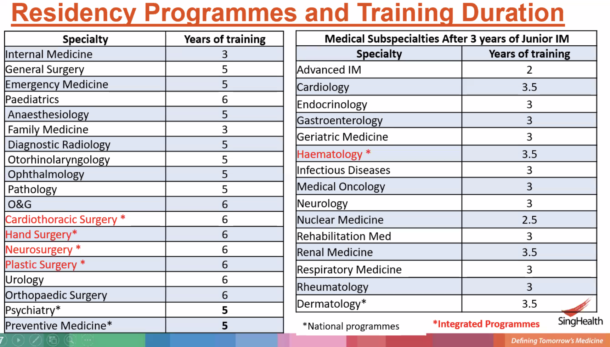
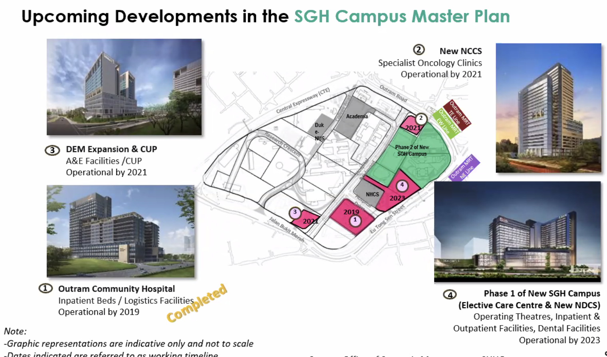
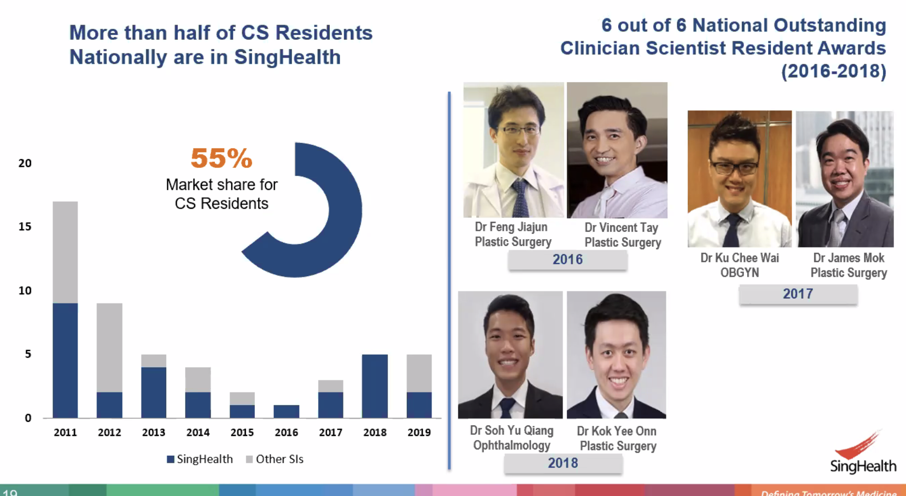
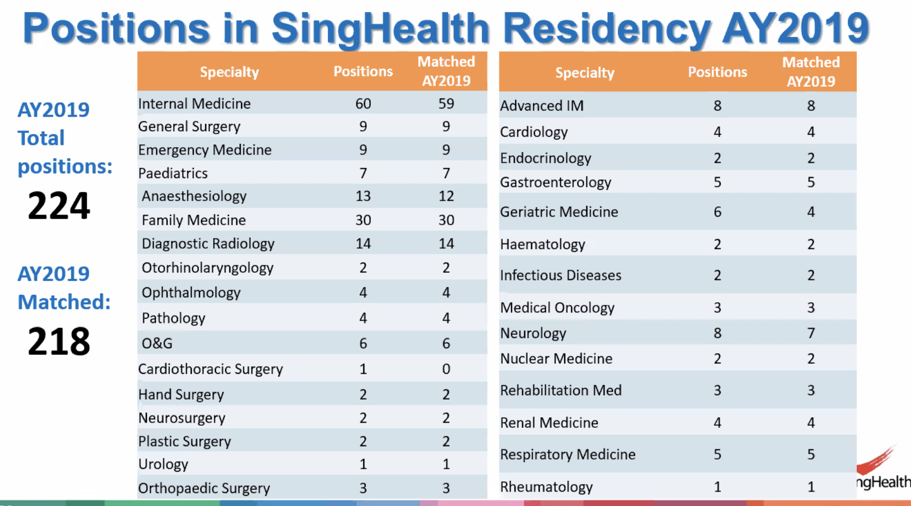
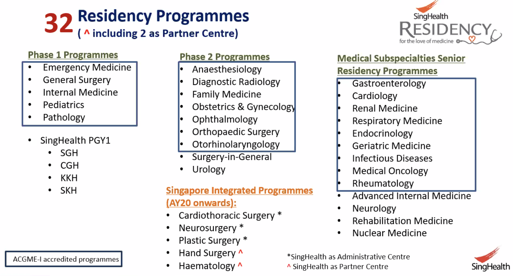
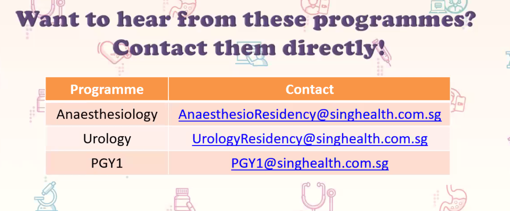

People
=============

JIa Hao - ED - SOLID!  96252639

Prof Tan Hak Koon

Cheong May Anne

Dr Melvin Chua

**Emergency**

- Lim jia ho (ED) ED physician 96252639, lim.jia.hao@singhealth.com.sg
- wan.paul.weng@singhealth.com.sg

## Singhealth

- AMEI
- Practice is centre based
- Childcare service at Singhealth is free

- Only the things in the blue boxes are ACGME accredited

- PGY1 request for elective in specialty that I want

- Intake for residency starts in July

- Complete PGY1 or HO training in overseas institution

- What is quality

  - Resilience, don't give up, commitment
  - Team player
  - Everyone has brain, no problem studying
  - What differentiate one from other is the additional experiences

  

**Cheong May Anne Singhealth Residency Experience**

- Hematology
- A lot of mishaps and randomness
- All 2012 graduation. 
- Make friends with the nurses
- **Case Write-ups: keep notes to do them**
- Become a very strong clinician
- May Anne Cheong - research projects
- Residence committee chair
- Organised a hackathon 2017
- IVY Ng is her leadership training mentor
- Overseas collaboration - strong ties with Duke-Durham; visit haematology 
  - From clinical care to research opportunities
  - Other residents are friends
- Think of this as a marriage
- Singhealth has a lot of work...

**Questions**

- PGY 1 electives engagement in November
- What's the CGH and SKH case difference and culture from SGH?
- MOHH website for various stages of residency application

## Emergency Department

juliana.poh@singhealth.com.sg - Taught us AMS / syncope / dizziness

## Ophthalmology

### Shamira Perera

- Simulation Side: TouchSurgery - cartoonifiedan operation for patient education; learn and test yourself on surgery; Downloaded
- Medical Devices: EnChroma glasses - dimmer; put onto the smart phone; Color blind
- Michael Jared: give projects to people at NUS and ask them
- First embedded engineering center in eye
- Biomechanics and surgery devices
- Some AI work
- Big fish in a small sea
- Gene therapy
- Drugs to the eye
- Bionic eyes
- Biological systems link up with electrical systems
- Ong Tien 2014 to bring an engineer in from NUS
- Business development team
- Design studio; maker space
- Rachael is old PhD from Cambridge; oraganials
- Clinical Investigator: KIP is half of clinical scientist
- Research
  - Biomechanics: 
    - pupil extender - mechanical ways; shape memory; chemical dilator replacement; FEM
    - cataract surgery take out the surgery and replace with a clear lens; inject the lens require a lot of different injectors (different for each type of lens); invented disposable single handed injector that fits all lens around
    - **low-tech, high volume devices;**
    - reverse the trend of the increased healthcare cost
  - AI projects: 
  - Surgical Device: 
- Collaboration with EMBS
  - Assisted devices for the blind
  - Counting money and for manuveuring
  - Patent search
  - Scale product
  - Marketing and graphical distribution etc
- Big Vision Projects
  - Clinical Work
  - Research
  - Teaching Education
  - Innovation
  - Humanitarian Work
- Next Big Project: Tricoder
  - Machines in optomology that you are very dependent upon
  - Big machine and miniturize into a mobile phone
  - Acuity, refraction, contrast sensitive, look into the eyes
- X-prize - build a device with 10 functionality
- 5000 OCT, work through 10000 dollar machine
  - Far along the lines of that one
- Bioengineering: more ideas in the last two week
  - Lack of dedication not lack of time right now

