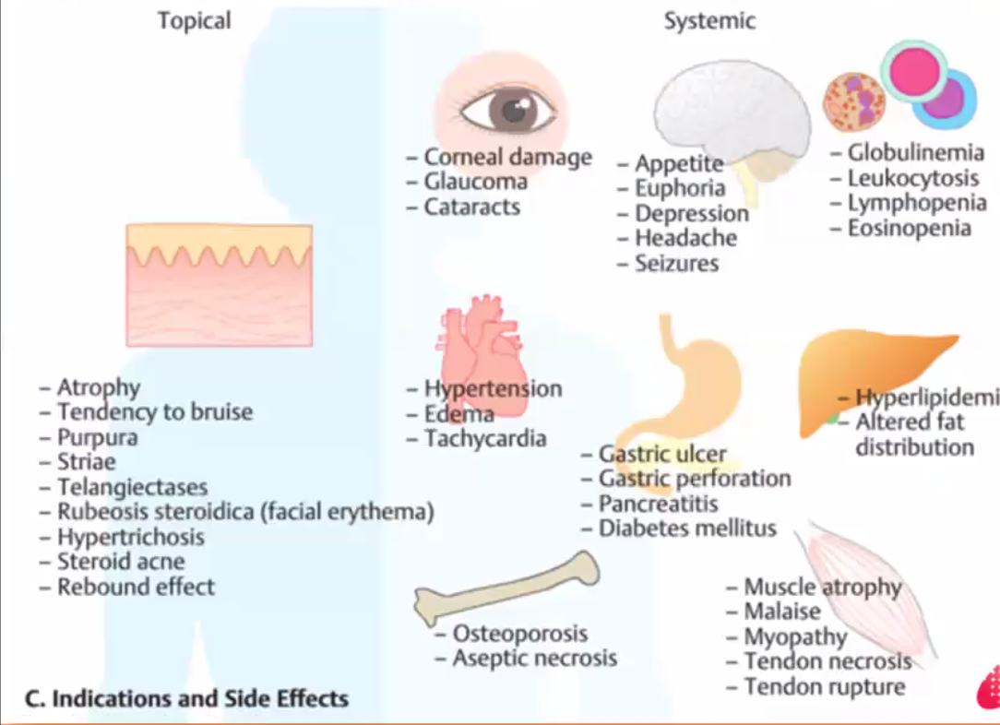
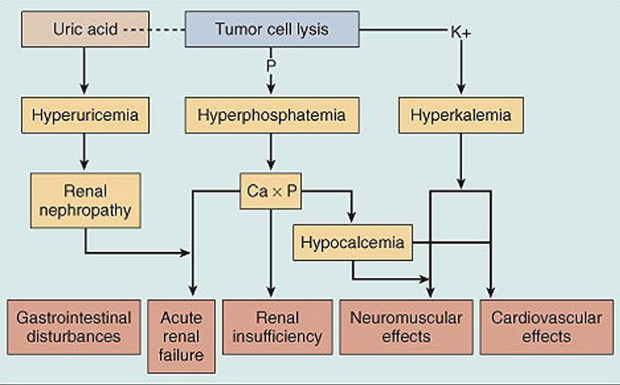

Pharmcology
===========
[[TOC]]

Aspirin: tinnitus and in high doses hearing loss 
Thiazide (e.g. metolazone): hyponatremia and hypokalemia
Sacubitril-varsartan: hyperkalemia, hypotension, cough

## Formulation

### Forms of Topical Drugs

Choosing the appropirate dosage form
- Body site

    Site of disese | Choice of dosage form
    |---|---
    Hair areas | extensive areas, nail forls. e.g minoxidil scalp lotion, clotrimazole solution | lotion / solution
    All areas except hairy areas flexures | cream
    Palsma nd soles at night, not only hairy sarea of flexure | Ointment
    HAir surface | Gel

    Dosage Form | Smooth, nonhairy skin; skin hyperkeratotic lesion | Palms and soles | Hairy areas | infected areas | between skin folds, moist, macerated lesions|
    |---|---|---|---|---|---
    Cream | ++ | ++ | +| + | ++
    Ointment | +++ |+++ | | |
    Solution | ||  +++ | +++ | ++
    Lotion | | |++ | ++ | ++
    Gel | || ++ | + |+

    

    Dosage form | Examples | Site of fungal infection
    |---|---|--
    Cream| clotrimazole, ketoconazol miconazole, | skin
    Gel | terbinafine gel |  hair
    Lotion| clotrimazole lotion, ketoconazole shampoo | nail, scalp body
    Suspension | Selenium sulfide suspension | scalp
    Power | clotrimazole powder | skin folds

- Morphology of disease
  
    Morphology | Choice of dosage form
    |---|----
    Dry scaly lichenified | ointment
    Inflamed | cream, ointment
    oil | Gel
    wounds | cream , gel, paste, solution

  
- Potency of topical corticosteroid
  
    UK classification: Very potent, Potent, Moderate, Mild 

    US classification
    Potency | Steroid 
    |---- | ----
    1 (high)| Clobetasol proprionate cream 0.05%,  Clobetasol proprionate ointment 0.05%  Betamethasone dipropionate ointment 0.05% (optimized vehicle)
    2 | Betamethasone dipropionate cream 0.05%   Mometasone furoate ointment 0.1%
    3| Betamethasone valerate ointment 0.1%   Triamcinolone acetonide ointment 0.1%
    4| Flucinolone acetonide ointment 0.025%   Mometasone furoate cream 0.1%
    5| Betamethasone valerate cream 0.1%   Flucinolone acetonide cream 0.025%
    6| Betamethasone valerate cream 0.025%   Flucinolone acetonide cream 0.0125%  Desonide lotion 0.05%
    7| Hydrocortisone (base or acetate) cream 1.0%   Hydrocortisone (base or acetate) ointment 1.0%

    Note that ointment is more potent than cream.

Exmples
- Daivobet pointment for of betamethasone dipropionate for solves with markedly thickened skin; warm patient it's slipery at night
- Betmethazone gel for scalp
- Sulphur resorcinol lotion for body, cream for face

1 palm is 1 % BSA.

## Wound Care

### Wound assessment
- Type of wound
- Aetiology
- Location
- Clinical appearance of wound bed
- Wound edge
- Periwound condition (1 cm)
- Size of wound 
- Tissue loss
- Exudate
- Pain
- Presence of infection

### Appropirate Wound Management
- Provide or main a moise wound healing environment
- Provide thermal protextion by maintiang tissue
- Promote epithemal migration

Criteria of an ideal wound dressing
- Removes excess exudate
- Allows gaseous exchange
- Protect against mechanical trauma
- Cost effective

wound products | remarks
|----|----
Antimicrobial | contain agents like silver, iodine or PHMB
Cadexomer-iodine | 
Calcium alginate |
Foam | moderate to high exudative wound and help with moisture control
Hydrocolloid |
Hydrofibres |
Hydrogel |
Hydrocolloid dressing | 

## Vaccine

#### Live Vaccines
1. Zoster
2. Measles, mumps, rubella (MMR combined vaccine)
3. Rotavirus
4. Smallpox
5. Chickenpox
6. Yellow fever

### Considerations when using systemic immunosuppressants
1. Complications of chronic corticosteroid use:
    - Monitor for osteoporosis, hypertension, diabetes and eye complications. 
    - There is also risk of reactivation of latent infections eg latent TB, hepatitis B/C.
    - Be aware of the risk of adrenal insufficiency during rapid tapering of steroids. 
      - Do blood pressure monitoring at home
      - Hypocount - hypoglycemia
2. Vaccinations:
    - Avoid live vaccines. In addition, vaccine efficacy may be limited in patients who are iatrogenically immunosuppressed.
3. Females of childbearing potential:
    - Avoid fetotoxic drugs such as cyclophosphamide, methotrexate, mycophenolate mofetil and rituximab.

### How to Start Someone on Oral Isoretinoid

- HLA-B*1502 pre-dispose patients to carbamazepine-induced SJS/TEN

### Drugs in Pregnancy
- Stop MTX 3 months, use cyclosporin instead
- Biologics can cross placenta

Pain Meds
---------

### Case

#### Surgical Pain Management

IASP definition \" An unpleasant sensory and emotional experience associated with actual or potential tissue damage or described in terms of such damage.\"

Why is it important to treat pain?

-   humane thing to treat pain

-   untreated pain can result in vital sign instability and precipitate pain

-   untreated pain can cause prolonged ileus post op

-   cannot mobilize early

-   cannot do chest therapy

Multimodal anelgesia - two or more drugs targetting different pathways

-   a combination of analgesics and techniques, each with a different mechanism of action within the central or peripheral nervous system). This approach may include opioid analgesics, nonopioid intravenous (IV) agents such as acetaminophen, ketamine, neuropathic pain medications (eg, gabapentin, pregabalin, carbamazepine), nonselective anti-inflammatory drugs (NSAIDs), or nefopam, as well as regional anesthesia, and other adjunct therapies (eg, massage, music, relaxation techniques). The specific approach can be individualized based on the source and severity of the patient's pain. Potential advantages of a multimodal approach include improved analgesia, reduced opioid dosing to achieve effective analgesia, and decreased risk of opioid-related side effects.


-   Reduce opioid consumption

-   Make use of ea

How will you manage patient's severe pain?

-   already on paracetomal and morphine

-   fentanyl 25 mcg morphine - titrated, every 10 minutes small bolus

-   WHO pain ladder for cancer pain

    -   Mild pain: simple analgesics

    -   Moderate: codeine, tramadol, simple analgesics

    -   Severe: strong opioid with morphine and simple analgesics

    -   Other pain meds for neuropathic pain:

    This ladder was created by a nurse who started palliative care and wanted to promote the use of opioids, it is more important to be human. Widely used.

Different pathways

-   Intramuscular / subcutenaous

    -   Does not ned cannula

    -   Does not require intact GIT

    -   Rapid onset

    -   High bioavailability - 100

    -   Unpleasant esp for children and unpredictable absorption (variable time to peak effect)

-   Intravenous

    -   Does not require intact GIT, good absorption, rapid onset, high bioavailability

    -   Requires IV acesss and IV pump makes it more expensive

-   Transdermal

    -   Does not require intact GIT

    -   Slow onset-offset, dificult to titrate, heat increases absorption

-   Oral

    -   Inexpensive and non-invasive

    -   1st pass metabolism means require higher dose, slow onset, require intact GI system

What are the different ways that opioids can be administered intravenously

-   PCA - lock out time is about the onset of action of opioid (5-10 minutes); PCA can have a continuous mode programmed into it; 2 mg morphine at a time to titrate to the minimal analgesic concentration

-   Bolus

-   Continuous

Patient is drowsy, RR of 4, BP 170/90, HR 80; What are the differentials?

-   Patient: stroke

-   Surgical:

-   Anesthesia: medication chart and PCA reading - how much opioid is given

What to do? Always ABC in unstable patient!

-   Hypotventilation associate

-   0.04 mg IV naloxone then reassess in 2- 3 minutes; repeat and if inadequate response increase to 0.08 mg IV naloxone; keep reassessing and doubling the dose

-   Once adequate response achieved closely observe patient for minutes

-   If signs and symptoms not improving, consider, discussion goals of care, need for endotracheal intubation, and transfer to ICU / HighD

Common opioid related side effects

-   GI: constipation - give lactulose and sennoside 2 tabs ON, N/V - give anti-emetic drug ondansetron (People much prefer to have pain than N/V, need to treat intensely)

-   Pruiritus: antihistamine like loratidine, switch to other pain relief, morphine is most itchy, oxycodone and fentanyl is better.

-   Urorenal: Acute urinary retention - catherize

-   respiratory depression only in overdose

How to assess pain in dementia pain? Don't just assume that they cannot tell you about the pain

-   Pain score

-   Visual numeric scale

-   Vsiaul categorical scale

-   Visual analogue scale

-   Wong baker faces pain scale

-   FLACC Pain scale: face, legs, activity, cry, consolability

-   Pain assessment in advanced dementia score

Managing pain in patients with CKD

-   Avoid renal toxicity drugs: in patients with heart failure, chronic renal failure and or hypovolemia, renal blood flow is much more dependent on prostaglandin-induced vasodilation thant is would be in a healthy person. so NSAID induced reduction in prostaglandins can precipitate acute renal failure

-   Dose adjust dose dependent drugs: Morphine (M6G), Codeine, oxycodone (preferable to morphine), pethidine (norpethidine lowers seizure threshold)

-   Safe: Paracetamol, Tramadol (metabolites are inactive),

NSAID

-   MOA: inhibit COX which is part of the arachidonic acid pathway; resulting in decrease of

-   Adverse effects: GI, Renal failure precipitate, obstetric patients prolonged labor, premature closure of PDA, increase the risk of MI / CVA.

-   Routes of adminstration: Oral, parenterly (Ketofenac and parecoxib), IM (ketofenac), transfermal patch, cream,

-   How are COX-II inhibitors different from NSAIDS: COX I more involved with basic homeostatic function and COX II is thought to be induciable specifically at inflammatory locations. Note that this is not a black and white sicuation. There is a gradient of COX 2 selectivity,. Katorolac is very high COX1 selectivity, etorricoxib and celecoxib is very high COX2 selectivity.

Paracetomal - inhibit COX3 centrally not NSAID peripherally

For every side effect, consider

-   What is the side effect on each system

-   What is the patient's risk factor in that system

-   How to reduce risk\>

Pain score is high and localized over surgical site, no significant distress

-   Check the site first

-   Give morphine

-   Reassess in some time

#### CA patient with mets and abdominal pain and NBM

What do we find out about her pain history? Think immediate and long term

-   Abdominal pain and how severe

-   Mets symptomatic? Treated with opioid, need to consider withdrawal if kept NBM

Current painL palliative, paracetamol 1 g QDS, Celecoxib 200 mg OM, Targin 30 mg BD, and Oxycodone 5 mg Q2H/PRN for the last 3 months. What additional questions?

-   Has she been taking all the meds?

-   For PRN drugs, ask how often the patient has been needing it

-   How she has been tolerating the drugs

-   How effective is the drugs

What's the difference between Oxycodone, Oxycontin and Targin

-   Oxycodone - immediate release

-   Oxycontin - prolong release 12 hours

-   Targin - substance abuse form, lack Gi side effect like constipation,

Define dependence, tolerance, addiction, withdrawal and pseudoaddiction

-   Dependence - need for function and prevention of withdrawal

-   Tolerance - need more for same function

-   Addiction - psychological component like craving in addition to the physical dependence

-   Withdrawal - physical and psychological symptoms upon stopping a drug

-   Pseudoaddiction - patient think they are addicted but they are not

How to formulate a management plan for the patient's pain

-   IV formulation of drugs to replace current drugs to prevent withdrawal

-   Paracetamol and celecoxib can be given IV

-   Convert Targin and oxycodone to parenteral version using opioid conversion table to convert to oxycodone IV version or morphine - need to make a referral for this. The principles are

    -   Maintain regular provision of patient's pre-axisting opioid requirement

    -   Additional analgesia through appropirate short acting opioids

    -   Patients need higher dosese of opioids than opioid-naive patients

    -   Use multimodal analgesia

    -   Consider use of adjuvants such as local ansethetics and regional anesthetics

CTAP show lesion near rectum suggestive of a mets causing impending obstruction. Offered a palliative colostomy in view of that. For post op pain, discuss what other options apart fro opioids / NSAIDS . etc

-   Use regional analgesia - nerve block and central neuraxial blocks

-   Important for opioid tolerant patients

#### Lower back pain

21 year old NS enlistee went to visit ED for low back pain with left sided radiculopathy. This was on the background of lifting heavy jerry cans a week ago

-   Differentials: Mechanical, non-mechanical, visceral

    -   Mechanical - muscle strain, herniated disc, degenerated disc, spinal stenosis, fractures, pstepporosis

-   What other questions would you like to ask him?

    -   Yellow flag - secondary gains, poor relationship with co-workers, negative attitude,s fear avoidance behavior, expectation that pasive rather than active treatment, wil be benedifical, social problems

    -   Red flag - urinary retention, caudal equidal syndrome, thoracic pain, fever / unexplained weight loss, bladder or bowel dysfunction, history of malignancy, ill health or other medical illness, progressive neurological deficit, disturbed gait / saddle anesthesia, age \<20 yr or \> 55 year old

-   How would you examine him?

    -   Inspection

    -   Palpation

    -   Active and passive motion

    -   Sensory deficits, digital rectal exam

-   What investigations will you order?

    -   Lumbar X-ray anterior and lateral

    -   Train of four

    -   If red flag, refer to neuro or spine surgeon quickly

-   How to treat

    -   Bed rest is fine initially

    -   Pace himself, do not go back to normal activity

    -   Physical therapy for the patient

    -   NSAID - good for back pain and also radiculopathy (neuropathic)

    -   Adjunvent treatment - the original indication of the drug is not

Difference between somatic pain, neuropathic pain, and visceral pain

-   Somatic pain -

-   Neuropathic pain - SNRI, TCA, gabapentin

-   Visceral pain -

Antihistamine
---------------

Meclizine: treat motion sickness and vertigo., PO, effect begin in a few hours and last for up to a day.

Topicals
--------

### Topical Corticosteroids

Key things to consider: diagnosis, vehicle, potency, frequency, side effect

#### Diagnosis

An accurate diagnosis is essential in selecting a topical corticosteroid. Topical corticosteroids are effective for conditions that are characterized by hyperproliferation, inflammation, and immunologic involvement. They can also provide symptomatic relief for burning and pruritic lesions.

#### Vesicle

There are several vehicles that can be used. The vehicle, or base, is the substance in which the active ingredient is dispersed. The base determines the rate at which the active ingredient is absorbed through the skin.

-   Creams: The cream base is a mixture of several different organic chemicals (oils) and water, and usually contains a preservative. It can be used in nearly any area and therefore most often prescribed. It is cosmetically most acceptable. It has a drying effect with continuous use, therefore best for acute exudative inflammation.

-   Ointments: The ointment base contains a limited number of organic compounds consisting primarily of grease such as petroleum jelly, with little or no water. Ointment is desirable for drier skin and has a greater penetration of medicine than a cream and therefore has enhanced potency.

-   Lotions and gels: Lotions contain alcohol, which has drying effect on an oozing lesion. Lotions are most useful in the scalp area because they penetrate easily and leave little residue. Gels have a jelly-like consistency and are beneficial for exudative inflammation, such as poison ivy.

#### Potency

The anti-inflammatory properties of topical corticosteroids result in part from their ability to induce vasoconstriction to the small blood vessels in the upper dermis. The potency of corticosteroids are tabulated in seven groups, with group I the strongest and group VII the weakest.

L1in\|L3in\|L2in Potency & Examples & Use to Treat\
Group I & Augmented betamethasone dipropionate 0.05%. Halobestasol propionate 0.05% & Psoriasis, lichen planus, severe hand eczema, and alopecia areata\
Group II & Desoximetasone, Fluocinonide 0.05% & Psoriasis, lichen planus, severe hand eczema, and alopecia areata.\
Group III & Betamethasone dipropionate 0.05%, Triamcinolone acetonide 0.5% (ointment or cream) & Atopic dermatitis, nummular eczema, stasis dermatitis, and seborrheic dermatitis\
Group IV & Floucinolone acetonide 0.025% (ointment), Triamcinolone acetonide 0.1% (ointment) & Atopic dermatitis, nummular eczema, stasis dermatitis, and seborrheic dermatitis.\
Group V & Floucinolone acetonide 0.025% (cream), Triamcinolone acetonide 0.1% (lotion) or Triamcinolone acetonide 0.025% (ointment) & Atopic dermatitis, nummular eczema, stasis dermatitis, and seborrheic dermatitis.\
Group VI & Alclometasone dipropionate 0.05%, Desonide 0.05% & Dermatitis in eyelids and diaper area, mild dermatitis on face, and mild intertrigo.\
Group VII & Hydrocortisone 1%, 2.5% & Dermatitis in eyelids and diaper area, mild dermatitis on face, and mild intertrigo.

#### Administration

Once or twice daily application is recommended for most preparations. More frequent administration does not provide better results.

#### Side effects

-   The most common side effect of topical corticosteroid is skin atrophy.

-   It also can cause hypopigmentation. This is more apparent with darker skin tones.

-   Topically applied high and ultra high potency corticosteroids can be absorbed well enough to cause systemic side effects. Hypothalamic-pituitary-adrenal suppression, glaucoma, septic necrosis of the femoral head, hyperglycemia, hypertension and other systemic side effects have been reported.

### Systemic Steriods

Both steroids and CNS stimulants can cause an increase in blood pressure, especially when used in combination. Steroids increase blood pressure by mimicking endogenous cortisol and the sympathetic fight or flight response. Stimulants mimic norepinephrine, stimulating alpha and beta adrenergic receptors, causing an overall increase in blood pressure.

Contraceptive Medications
-------------------------

### Vaginal Ring

The vaginal ring is placed inside the vagina and left for three weeks. It is removed the fourth week to have a period.

### Progesterone-releasing intrauterine device (IUD)

is an effective option for reducing menstrual blood flow in those with menorrhagia secondary to fibroids. Another advantage is that it can be left in for five years (potentially longer but not yet widely accepted yet). There are potential complications, particularly during the procedure to place the device, but after appropriately discussing these with a patient it is a viable option. In studies, the progesterone-releasing IUD (levonorgestrel-releasing intrauterine system) has clearly demonstrated decreased menstrual flow in those with fibroids. In one smaller study, the device decreased overall uterine volume. However, it does not decrease the size of individual fibroids already in the uterus. Through decreasing uterine volume and endometrial atrophy, the progesterone-releasing IUD can also decrease dysmenorrhea. In people who hope to maintain fertility for the future yet control their symptoms now, this is one of the best options with fewest side effects. Irregular vaginal bleeding, especially initially, is a common side effect of the progesterone-releasing IUD. Other potential side effects are lower abdominal pain and breast tenderness. The risk of uterine perforation is more likely at the time of insertion. The risk of infection is within the first 20 days of insertion. Routine STI testing may be performed prior to or during insertion with immediate treatment if any infection is found. Good patient instructions to monitor for foul smelling discharge and signs of systemic infection or perforation are key.

The progesterone-only IUD can stay in place for three to seven years, depending on which device is used. There may be some irregular bleeding at the beginning for up to six months. Some women will stop bleeding altogether, and others continue having periods with less bleeding. The IUD is just taken out if the patient decides to try to get pregnant again. If, after five years, they decide they do not want to get pregnant, it can be replaced at the same visit for another five years.

It is ok to place the IUD while a patient is having period. It is infact easier because the cervix open up a little bit.

Contraindications: Infection or active gynecologic cancer, allergy to levonorgestrel (uncommon)

Cautions: History of headache or vascular disease, history of perforation with prior IUD placement, allergy to iodine or shellfish (often used to clean the cervix, other methods could be used).

Complications:

During the actual procedure, the patient can have pain or bleeding. There is also a risk of a uterine infection or perforation. Both of these are rare.

After the procedure is done, the patient may have some bleeding or cramping for a few days, but this usually responds to ibuprofen. There may be foul smelling vaginal discharge from an infection.

Once the IUD in place, there is a risk the uterus can expel it, or the patient may have pain with intercourse or experience irregular bleeding. Some partners can feel the string. After the patient's next period, she should come back to have the string checked and make sure it is still in place. It is a good idea for the patient to check for the IUD strings after every menses to ensure it stays inside the uterus but to use caution that it is not inadvertently removed. The strings can be trimmed at follow-up visits if needed.

The patient should return to the clinic for any fever associated with lower abdominal pain, with or without abnormal vaginal discharge. These signs would be concerning for uterine infection.

### Progestin Implants

These are put under the skin and last for three years. They can cause unpredictable spotting and can also be removed earlier if desired.

### Hormone Patch

The patch is left in place for one week, then the person uses a new patch weekly for three weeks. No patch is placed during the fourth week, during which time the person has a period. This option contains ethinyl estradiol in addition to a progestin.

### Combined hormonal contraceptive

Combined hormonal contraceptives would be an effective option if the patient has not experienced side effects from these in the past. Oral contraceptive pills (OCPs) have been proven effective when used for dysmenorrhea related to anovulation only without a structural problem, especially in a patient who needs birth control. In those with isolated dysmenorrhea, small trials have demonstrated benefit. However, a meta-analysis of these found insufficient evidence that oral combined hormonal pills are effective for dysmenorrhea alone. The confusion is that OCPs are often used in structural problems of the uterus that cause both menorrhagia and dysmenorrhea. In leiomyoma and adenomyosis, OCPs decrease blood loss and may decrease dysmenorrhea by thinning the endometrial lining. OCPs are commonly known to patients and providers making them often the initial step in management. In adolescents, they have the additional benefit of regulated menses. However, other options that are not oral, such as the vaginal ring ring and the hormonal patch, are worth considering. These may cause less nausea and vomiting as they bypass the gastrointestinal system altogether. All types of combined hormonal contraceptives have slightly increased risk of venous thromboembolism, highest in the first year of use. For this reason, these types are not recommended in smokers older than 35 years. Specific side effects with the patch may be site dermatitis in as many as 20% of users. The vaginal ring has risks of leukorrhea and vaginitis in approximately 5% of patients; the other types do not. None of these worsen cervical dysplasia or have been proven to increase the risk of breast cancer.

### Medroxyprogesterone

Injectable medroxyprogesterone is another potential treatment for leiomyomas and the symptoms associated with them. However, recent literature does demonstrate that there is bone density loss after several years of use. Other side effects may include weight gain, irregular menses for weeks to months, and potential mood changes. However, there is no risk of venous thromboembolism and this can be used in a smoker older than 35. This is a great choice for transgender men as it can help decrease periods without additional estrogen or a traumatizing procedure.

The shot is given every 12 weeks. If a patient on this decides to get pregnant, it may take a little longer to get pregnant after stopping the shots than if they used the IUD. It also has a higher rate of irregular bleeding at the beginning.

### Copper IUD

The copper IUD is another effective form of birth control. This device may stay inside the uterus for up to 10 years. For those who are not planning any children in the near future, this may be a viable option for birth control. An advantage of the copper IUD is that it has no hormones. However, in people using this, there is an increased risk of dysmenorrhea and menorrhagia just from the IUD. It is not a treatment for leiomyomas at all. In this case it could potentially make the symptoms worse.

Chronic Pain Medications
------------------------

### Opioids

The use of opioids for chronic pain is controversial due to uncertain benefits for long-term pain control and very serious side effects. The recent rises in opiate addition and overdose in the US call into question the liberal use of these medications for chronic pain. Conversely, strict avoidance of these medications likely will leave some patients with considerable pain and poor function, particularly those with contraindications to other regimens (eg. NSAIDS).

-   The most common side effect of long-acting opioids is constipation, though the most serious ones are addiction and overdose.

-   The initiation of opioids for chronic pain should only be done with carefully-selected patients who have failed other regimens, who do not have identifiable increased risk for opioid abuse or misuse, and who understand the risks of chronic opioids.

-   A structured process of prescribing is advised. This includes clarification of a Pain Management Agreement between the prescriber and patient; regular visits that include review of function and side effects, intermittent urine drug screening, and checking of the state Prescription Monitoring Program database.

#### Tramadol

Tramadol is a centrally-acting synthetic opioid analgesic that works by binding to mu-opioid receptors and weakly inhibiting norepinephrine and serotonin reuptake.

-   Side effects

    -   Serious: lowering the seizure threshold in patients with epilepsy, serotonin syndrome, respiratory depression, angioedema, bronchospasm and dependency.

    -   Common: constipation, nausea, dizziness, and pruritis

### Tricyclic Antidepressants

-   Can be helpful in patients with chronic pain, particularly neuropathic pain. Have added benefit of aiding with sleep interrupted by pain. Use limited by its side effects and contraindications below.

-   Tricyclic antidepressants have anticholinergic side effects, including dry mouth, constipation, urinary retention, blurred vision and paralytic ileus.

-   They also have many gastrointestinal side effects, are sedating, and can have neurologic side effects like ataxia, tremors, paresthesias, and mental clouding.

-   They are relatively contraindicated in patients with severe cardiovascular disease or conduction problems because they can contribute to tachycardia, arrhythmias, hyper- or hypotension, heart block, and myocardial infarctions.

### SSRIs and SNRIs

-   SSRIs and SNRIs have been demonstrated to be mildly to moderately effective in treating certain types of chronic pain, including fibromyalgia and diabetic neuropathy.

-   There are very high rates of depression among patients with chronic pain, and guidelines recommend assessing for and treating comorbid depression among patients with chronic pain.

### Anticonvulsants

Systematic reviews show that gabapentin and pregabalin are the only two anticonvulsants with demonstrated efficacy for neuropathic pain, and this is only for certain conditions (eg. diabetic neuropathy and fibromyalgia).

-   Some anticonvulsants require blood level monitoring and have severe side effects like megaloblastic anemia.

-   Carbamazepine (Tegretol) can interfere with other medications because it is a cytochrome P-450 inducer, including decreasing the effectiveness of hormonal contraception.

-   Several anticonvulsants are also known teratogens.

### Acupuncture

This has been used for many pain conditions. Some studies demonstrate effectiveness for dysmenorrhea without uterine pathology when compared to sham or placebo treatments. In further studies, acupuncture improves quality of life but may be associated with higher health costs for the patient. Other nonmedical and nonsurgical treatment considerations for dysmenorrhea include TENS unit (transcutaneous electric nerve stimulation), thiamine supplementation, and, possibly, vitamin E supplementation. These may be offered to patients who are opposed to other treatments or in combination with other medical treatments.

Anti-inflammatory Drugs
-----------------------

### Steroids

-   High dose glucocorticoid can cause glucocorticoid-induced psychosis, typically manifest in the first week of glucocorticoid treatment; it can also cause manic or depressive symptoms

### NSAIDS

-   Side Effects\
    Patients who use NSAIDs chronically - taking 5,000 or more pills in a lifetime - are at an increased risk of developing end-stage renal disease. Elderly patients are at an increased risk of developing gastric ulcers when using NSAIDs chronically. NSAIDs, aspirin, and acetaminophen can all cause hepatotoxicity, and contribute to coagulopathy.

    -   gastrointestinal upset

    -   decreasing the effectiveness of hypertension medications

    -   increasing the effect of sulfonylureas

Cardiovascular Medications
--------------------------

### Beta-blockers

  ------------ ------------------------------------------------------
  metoprolol   more on heart rate;
  atenolol     more on heart, affect renal;
  propanolol   great agent for anxiety and BP and some tachycardia;
  carbetalol   mix of both, heart rate and blood pressure;
  labetalol    heart rate and BP
  ------------ ------------------------------------------------------

Diabetes medications
--------------------

#### Thiazolidinedione

-   Pioglitazone: not recommended in pregnancy due to adverse effects in animal reproduction studies

#### Sulfonylureas

Older ones:

-   Chlorpropamide

-   Tolbutamide

Not recommended during pregnancy, cross placenta and can cause fetal hyperinsulinemia, and neonatal hypoglycemia.

Anti-coagulants
---------------

### Warfarin

Advantages of warfarin

-   Cheap

-   Antagonist available - vitamin K

Prothrombopenic drugs like warfarin are not suitable for initial therapy in thromboembolism because their onset of action is too slow. Their only role is in maintaining anticoagulant protection for prolonged periods.

Monitor warfarin dose by measuring the INR and titrate the warfarin dose every three to seven days to an INR of 2.0-3.0. The half-life of warfarin is around 40 hours, that means it will take five to seven days for the steady state to be stable. When making a dose adjustment for a outpatient on warfarin, one should wait at least this long before rechecking an INR, as checking sooner can lead to overreactions and great swings in a patient's INR.

The advantages of warfarin include its minimal cost and familiarity among medical providers. Its disadvantages include its highly variable dosing range, its requirement of frequent laboratory monitoring, and its high rate of interactions with other medications.

If the goal INR is substantially overshot, it increases the risk of bleeding complications significantly. In this case Warfarin should be held, and an oral dose of Vitamin K should be given to reduce INR if the INR is above 9. Otherwise, if the INR is between 4 - 9, just discontinue warfarin and check INR again in 24 hours.

### Heparin

LMWH has several advantages over unfractionated heparin:

-   Longer biologic half-life so it can be administered subcutaneously once or twice daily

-   Laboratory monitoring is not required

-   Thrombocytopenia is less likely although periodic monitoring of platelets may be needed

-   Dosing is fixed

-   Bleeding complications are less common

LMWH may be used in the outpatient setting; whereas unfractionated heparin requires hospitalization as it is administered intravenously with the dosage based on body weight and titrated based on the activated partial thromboplastin time.

One advantage to unfractionated heparin is that it can be immediately shut off and reversed in the case of bleeding due to its very short half-life. In a patient with a significant bleeding risk (e.g. recent admission for gastrointestinal bleeding), it is advisable to choose unfractionated heparin over low molecular weight heparin, which has a much longer half-life once injected.

### factor Xa inhibitor

This relatively new class of drugs has the advantage of not requiring weekly lab monitoring of INR and thus makes adherence an easier process.

-   Fondaparinux is the parental form of the drug and could be used instead of LMWH.

-   Rivaroxaban and apixaban are oral factor Xa inhibitors which may be used in place of warfarin.

Although these drugs have been found to be as effective as and generally safer (i.e. fewer bleeding complications) than warfarin and LMWH, the negatives of this class of medications includes high cost and difficulty in reversing the anticoagulation in the face of a bleed.

### Direct Thrombin Inhibitors

Dabigatran is the only direct thrombin inhibitor available on the US market currently. Like the factor Xa inhibitors, dabigatran may be taken orally and does not require laboratory monitoring. It also has been demonstrated in meta-analyses to lead to fewer bleeding complications compared to warfarin.

One potential advantage to dabigatran over the factor Xa inhibitors is that a reversal agent (idarucizumab) was recently approved by the FDA, which may be useful in the case of serious bleeding. Neither direct thrombin inhibitors or factor Xa inhibitors may be used in pregnant patients (unlike heparin, they cross the blood-placenta barrier) or in patient with significant renal disease.

When using dabigatran, overlap with enoxaparin for 5 days.

Substance Use Treatment
-----------------------

#### Varenicline

-   $\alpha$4 $\beta$2 nicotine acetylcholine receptor partial agonist

-   Reduce nicotine craving for smoking cessation

-   Does not increase risk of suicidality or depression compared with placebo

-   Associated with increased risk of cardiovascular events in patients with pre-existing cardiovascular disease

### Hypnotics

#### Zolpidem

nonbenzodiazepine hypnotic used to treat insomnia.

### Dopamine and Dopamine Agonist

#### levodopa

-   Dose related risk of psychosis

#### Pramipexole

-   A dopamine agonist

-   Treat symptoms of mild Parkinson Disease and restless leg syndrome

-   May produce or exacerbate psychotic symptoms

### Dopamine Antagonist

Effect of antagonism in dopamine pathways

-   Nigrostriatal: extrapyramidal symptoms

-   Mesolimbic: antipsychotic efficacy

-   Tuberoinfundibular: hyperprolactinemia

#### Metoclopramide

-   Antiemetics that might block D2 receptor and induce some Parkinsonism

### Antipsychotic

-   All patients should receive baseline and yearly liver function tests

-   Antipsychotics may lower seizure threshold and must be used with caution in patients with seizure disorders

#### First generation antipsychotic

Fluphenazine, haloperidol

-   contraindicated in PD due to strong dopamine blocking properties

-   high risk of extrapyramidal side effects (e.g. acute dystonic reactions, akathisia)

-   hyperprolactinemia (galactorrhea, menstrual disturbances, sexual dysfunction, gynecomastia)

-   long-acting injectable form of haloperidol is available if patient were nonadherent and has no tolerability issues on oral haloperidol

#### Second Generation - mixed serotonin-dopamine antagonist

Risperidone, olanzapine, clozapine, aripiprazole, paliperidone, quetiapine, ziprasidone: bind serotonin 2A and dopamina D2 receptors

-   Clozapine

    -   Low potency

    -   Least likely to cause tardive dyskinesia

    -   Indicated in schizophrenic and schizoaffective patients with recurrent suicidality.

    -   Indicated in treatment-resistant schizophrenia and schizoaffective disorder (patients who have failed antipsychotic trials).

    -   [Neutropenia and lift-threatening agranulocytosis]{style="color: red"} - need to participate in a computer based registry that requires regular monitoring of the absolute neutrophil counts before dispensing the drug.

    -   Other problems: Seizures, myocarditis, HoTN, ileus

    -   Metabolic Syndrome: weight gain, dyslipidemia, hyperglycemia

    -   Require baseline, 3 month, and annual f/u: BMI, fasting glucose and lipids, BP, waist circumference

-   Olanzepine:

    -   use in acute situations because it can be administered intramuscularly and has a rapid onset of action

    -   Unlike Clozapine, does not require monitoring due to low risk of agranulocytosis.

    -   Carry significant metabolic adverse effect like clozapine: weight gain, dyslipidemia, hyperglycemia

    -   Require baseline, 3 month, and annual f/u: BMI, fasting glucose and lipids, BP, waist circumference

-   Ziprasidone:

    -   QT prolongation at high doses

    -   Low metabolic risk profile, suitable for patients with DM and obesity

-   Risperidone and paliperidone:

    -   Administered orally

    -   High potency, in patients with Dementia with Lewy bodies / PD, use low potentcy ones such as quetiapine

    -   hyperprolactinemia resulting in galactorrhea, menstrual irregularities, and infertility

-   Paliperidone

    -   high potency, in patients with Dementia with Lewy bodies, use low potentcy ones such as quetiapine

    -   hyperprolactinemia resulting in galactorrhea, menstrual irregularities, and infertility

-   Aripiprazole

    -   Low potency - partial D2R agonist

    -   least likely to produce hyperprolactinemia

    -   Also has low metabolic risk

-   Quetiapine

    -   low potency D2R antagonist

    -   least likely to produce hyperprolactinemia

    -   Treat acute bipolar

-   Lurasidone

    -   Low metabolic risk

    -   Treat acute bipolar

-   Pimavanserin

    -   Low potency

### Stimulants and Related Drugs

Dopamine reuptake inhibtion and stimulation of dopamine release.

-   Amphetamines

-   Methylpehnidate

Use

-   Most effective treatment for adult ADHD

-   But potential for misuse or addiction, especially in patients with a history of substance use disorder

-   Side effects:

    -   decreased appetite, weight loss, and insomnia

    -   Jitteriness, irritability, emotional liability

    -   modest cardiovascular effects: small elevations in HR (3-10/min), SBP (3 - 8 mmHg), diastolic blood pressure (2- 14 mmHg)/

#### Norepinephrine Reuptake Inhibitor

-   Atomoxetine: nonstimulant of choice for treatment of ADHA; not addictive and has been shown to reduce ADHD symptoms and improve executive functioning and quality of life

### GABAergic Drugs

#### Benzodiazepine

Drugs

-   Alprazolam: short acting, most likely to result in seizures following abrupt discontinuation.

-   Lorazepam: half life 12 hours, may produce withdrawal symptoms within 1 - 2 days if abruptly stopped, available in IV

-   Oxazepam: short half life

-   Temazepam: short half life

-   Diazepam: longer half life due to active metabolite, available in IV

-   Chlordiazepoxide: longer half life due to active metabolite, NOT available in IV

Usage

-   Potentially life-threatening withdrawal syndrome, characterized by anxiety, insomnia, tremors, psychosis, and seizure.

-   In patients with anxiety disorders, mild withdrawal may be difficult to distinguish from remergence of the underlying disorder

-   In patients with liver disease, use short half live benzodiazepine (ie.. those without active metabolite) and undergo hepatic metabolism via phase II glucuronidation instead of phase I cytochrome P450 reaction.

Overdose

-   Slurred speech, ataxia, depressed mental status with normal vital signs, fasciculations, and GI symptoms

-   Treat with Flumazenil - a selective GABA-A antagonist.

Use with care: elderly and people with baseline cognitive impairment

-   Need to be used sparingly due to increased risk of adverse effects

-   Elderly metabolize benzodiazepine more slowly and are more likely to experience confusion and increased risk of falls

-   Patients with baseline cognitive impairment are even more vulnerable to adverse effects of benzodiazepines

Paradoxical agitation

-   Characterized by increased agitation, confusion, aggression, and disinhibition, typically within hours of administration

-   Relatively uncommon (\<1%)

-   Manage by tapering and eventual discontinuation of patient's benzodiazepine.

### Mood Stabilizer and Anti-depressant

#### Lithium

-   Accumulates in patients with renal insufficiency

-   Side Effect:

    -   Nephrogenic DI

    -   chronic interstitial nephritis

    -   25% develop hypothyroidism - fatigue, constipation, bradycardia

    -   Hyperparathyroidism and associated hypercalcemia

    -   Teratogenic

    -   Dysrhythmia in CAD patients

-   Monitoring:

    -   Urinalysis

    -   Baseline metabolis panel with BUN and creatinine

    -   Calcium

    -   thyroid functions: baseline TSH and then every 6 - 12 months; if hypothyroid, give T4

    -   Pregnancy Test in women of childbearing age

    -   ECG if at risk for CAD

#### Selective Serotonin Reuptake Inhibitor

Drugs

-   Sertraline: Good post MI because it carries a very low risk of adverse drug reactions, esp with cardiac medications

-   Fluoxetine: Long half-life SSRI (i.e. 4 -6 days)

-   Escitalopram:

-   Citalopram: dose-related QT prolongation, avoid esp in patients with recent MI

General Counselling

-   Although some individuals respond after 2 weeks, most take 4 - 6 weeks to respond

-   Patients might experience early common side effects include headache, nausea, insomnia/somnolence, increased anxiety, and dizziness.

    -   Stimulating effects (new onset-anxiety, insomnia) would benefit from a temporary dose reduction

    -   Patients with anxiety disorders are especially sensitive to activating effects of antidepressants and should be started at lower doses than what is typically necessary to treat depression (e.g. half the normal starting dose) with gradual increase to a therapeutic level over several weeks

    -   If 18 - 24 y/o patients have increased risk of suicidality during the initial weeks of SSRI treatment

-   Prolonged use may lead to sexual dysfunction, and weight gain

-   Important to continue taking the drug daily, because missed doses or abrupt discontinuation may be associated with SSRI discontinuation syndrome e.g. anxiety, duysphoria, flu-like symptoms need to do a supervised taper process

#### Selective Serotonin and Norepinephrine Reuptake Inhibitors (SNRIs)

Drugs

-   Venlafaxine

    -   MDD, anxiety, panic disorder

    -   At low dose: primary action on serotonin reuptake inhibition

    -   Associated with tachycardia and increased blood pressure at high does due to inhibition of norepinephrine reuptake; incidence is \>10% if the dose is \>300 mg daily

-   Dexvenlafaxine

-   Duloxetine

    -   Has demonstrated efficacy in diabetic neuropathy due to analgesic properties.

    -   First line depression drug

#### Norepinephrine and Dopamine Re-uptake Inhibitor

-   Bupropion

    -   Also stimulate release of dopamine and norepinephrine, and a Ach antagonist

    -   antidepressant, long acting because metabolite is active, for seasonal affective disorder

    -   helps people stop smoking due to binding of drugs to ACh receptors cause their activation and reduces craving for cigarettes

    -   Distinct mechanism from SSRI and often used when SSRI fails

    -   Activating, does not cause weight gain, and has no sexual side effect - useful if depressive symptoms include hypersomnia, weight gain, and sexual dysfunction

    -   Increased risk of seizures

    -   Contraindicated in patients with electrolyte disorder e.g. eating disorder

#### Tricyclic Antidepressants

Inhibit the reuptake of serotonin and norepinephrine.

-   Desipramine

-   Clomipramine

-   Imipramine

-   Amitriptyline

-   Nortriptyline

General Side Effects

-   Cardiotoxicity - slow cardiac conduction by inhibition of fast sodium channels and therefore not indicated in patients with severe cardiovascular disease

-   Orthostatic hypotension

-   Urinary hesitancy

-   Sedation

#### Monoamine Oxidase Inhibitors (MAOI)

MAOIs irreversibly inhibit monoamine oxidase, preventing oxidative deamination of serotonin, norepinephrine, and dopamine.

-   Phenelzine: treatment-resistant depression

-   Tranylcypromine

Usage

-   Not first line for MDD due to side effect burden (e.g. sedation, weight gain) and potential for drug and food interactions (serotonin syndrome, tyramine hypertensive crisis)

-   Watch for MOAI induced hypertensive crisis - in patients on MAOI after consumption of foods rich in the sympathomimetic substance tyramine e.g. aged cheeses, aged, smoked, pickled or cured meats/fish/poultry. - this is NOT serotonin syndrome, it does not have hyperreflexia and myoclonus.

#### Atypical Antidepressant

-   Trazodone

    -   Serotonin-modulating antidepressant

    -   Extremely sedating, used at a low dose for sleep induction

    -   Orthostatic effects are problematic in the elderly

-   Mirtazapine:

    -   Alpha-2 receptor antagonist

    -   MDD for its noradrenaergic and serotonergic effects

    -   propensity to cause sedation and weight gain - good if the patient has insomnia and weight loss

-   Vortioxetine

### Other

#### Alpha blocker

-   Prazosin

    -   Augmentation to antidepressants to decrease nightmares and improve sleep in patients with PTSD.

-   Terazosin

    -   May cause orthostatic hypotension or syncope especially with the first dose

    -   Use with caution in elderly

#### Opioids

-   Semisynthetic: oxycodone, hydrocodone, hydromorphone

-   Synthetic: Fentanyl, meperidine, tramadol

-   Buprenorphine

    -   Partial agonist

    -   Treatment of opioid use disorder and pain management

-   Methadone

    -   Partial agonist

    -   A synthetic opioid to treat opioid withdrawal

#### Anti-cholinergic

-   Rivastigmine

    -   Cholinesterase inhibitor

-   Physiostigmine

    -   Acetylcholinesterase inhibitor

    -   Antidotal therapy for anticholinergic poisoning

    -   Anticholinergic poisoning manifest as confusion and hallucinations(mad as a hatter), vasodilation (red as a beet), and anhidriosis (dry as a bone), non-reactive mydriasis (blind as a bat), with tachycardia and decreased bowel sounds

-   Benztropine

    -   Used to treat extrapyramidal side effects of antipsychotic medications

-   Donepezil

    -   Acetylcholinesterase inhibitor

    -   Used to slow cognitive decline in patient with Alzheimer disease

Side effect

-   Diarrhea, vomiting, and bradycardia

#### Serotonin Antagonist

-   Cyproheptadine: treat severe cases of serotonin syndrome

#### Wakefulness promoting agent

-   Modafinil: treat narcolepsy

### Anti-Convulsant

-   Carbamazepine

    -   Risk of mucocutaneous rash known as Stevens-Johnson syndrome

-   Lamotrigine

    -   Great for bipolar depressive episodes

    -   Development of a rash that can range in severity from mild to Stevens-Johnson Syndrome to Toxic Epidermal Necrolysis

    -   Should be discontinued at the first sign of rash and substitute with another agent.

    -   Most cases of Lamotrigine induced rash develop in the first 2 months of therapy

    -   Risk of rash is greated in children and appears to be higher when coprescribed with valproate or when the dose is increased rapidly.

-   Valproate:

    -   Treat epilepsy and bipolar disorder, prevent migraine

### Antihypertensive

-   Antihypertensives that can cause hyperprolactinemia and resultant infertility: reserpine, methyldopa, verapamil

-   ACEi SE: cough, dizziness, hyperkalemia

#### Thiazides

General Features

-   Use at 25 mg in general adult population; and start lower doses such as 6.25mg or 12.5mg/d in older adult patient

    -   A 2004 JAMA meta-analysis of clinical studies indicated that low-dose (12.5 to 25 mg/d chlorthalidone or hydrochlorothiazide) and high-dose (50 mg/d or more of both drugs) diuretic therapy lowered blood pressure to a similar degree and exerted a similar benefit in reducing stroke, congestive heart failure, cardiovascular and total mortality, but only low-dose diuretic therapy significantly reduced coronary heart disease incidence.

    -   A 2009 Cochrane review reinforced that no other drug class improved health outcomes better than low-dose thiazides, and beta-blockers and high-dose thiazides were found to be inferior.

-   Period monitoring of electrolytes: watch for hyponatremia or hypokalemia

-   Also monitor Uric Acid and Calcium levels

-   Use with caution in:

    -   Patients with Gout: may trigger a flare, although risk is lower if the patient is on a uric acid lowering drug; Monitor Uric Acid

    -   Patients on the threshold of becoming incontinent or are already incontinent: may result in urine incontinence

Specific Drugs

-   Chlorthalidone is slightly preferred over other thiazides due to long action and evidence for CVD risk reduction.

-   Hydrochlorothiazide (HCTZ) - combo pill HCTZ and losartan is a premium treatment for patients who have problem taking multiple drugs.

#### Calcium Channel Blockers

-   Associated with dose-related **pedal edema**, which is more common in females than men.

Specific Drug

-   amlodipine - takes 2 days to kick in

#### ACE Inhibitors

Use Case

-   good for treatment of HTN with proteinuria on setting of diabetes, heart problem

Problems

-   Do not use in combination with ARBs or direct renin inhibitor.

-   There is an increased risk of **hyperkalemia**, especially in patients with CKD or in those on K+ supplements or K+-sparing drugs.

-   There is a risk of acute renal failure in patients with severe bilateral renal artery stenosis.

-   Do not use if patient has history of**angioedema** with ACE inhibitors.

-   ACE inhibitor **cough** is common, in 5 to 20 percent of patients, due to bradykinin production.

-   Avoid in pregnant females or females of reproductive age without adequate contraception

Specific Drugs

-   captopril (inpatient)

-   lisinopril

#### Angiotensin receptor blockers - ARBs

Use case

-   good for treatment of HTN with proteinuria on setting of diabetes, heart problem

Problems

-   Do not use in combination with ACE inhibitors or direct renin inhibitor.

-   There is an **increased risk of hyperkalemia** in CKD or in those on K+ supplements or K+-sparing drugs.

-   There is a risk of acute renal failure in patients with severe bilateral renal artery stenosis.

-   Do not use if patient has history of **angioedema** with ARBs. Patients with a history of angioedema with an ACE inhibitor can receive an ARB beginning 6 weeks after ACE inhibitor is discontinued.

-   Avoid in pregnant females or females of reproductive age without adequate contraception.

-   **Lower risk of cough than ACE-Is.**

Specific Drugs

-   trace amount of carcinogens in recent recalls of valsartan

-   max dose of losartan not as effective as the other '-sartans'

### Statins

-   HMG-CoA reductase inhibitors (Statins) SE: new onset type 2 diabetes mellitus, hepatic dysfunction, and myalgia

### Hormone Replacement

-   Levothyroxine SE: anxiety, heat intolerance, tachycardia

### Diabetic Medication

-   Metformin SE: Diarrhea, lactic acidosis, weakness

### Antibiotics

-   Trimethoprim-sulfamethoxazole (TMP-SMX) is avoided in the final month of pregnancy because it increases risk of neonatal kernicterus.

### Anxiolytic

#### Buspirone

-   Tx: GAD

Cancer Treatments
-----------------

### Side effect of chemo drugs

In general, these include

1.  Tumor lysis syndrome\
    Release of intracellular contents (ions, proteins, nucleic acids, phospholipids) of tumor cells after therapy overwhelms homeostatic mechanisms.

    -   Presentation: Hyperkalemia, hyperphosphatemia, Hyperuricemia, Hypocalcemia

    -   Consequence: neuromuscular effects (seizures), cardiovascular effects (arrhythmia), GI disturbance, renal insufficiency / acute failure, sudden death

        

2.  Neutropenia and infection

3.  Organ damage

4.  Secondary malignancy

And specifically for individual drugs
