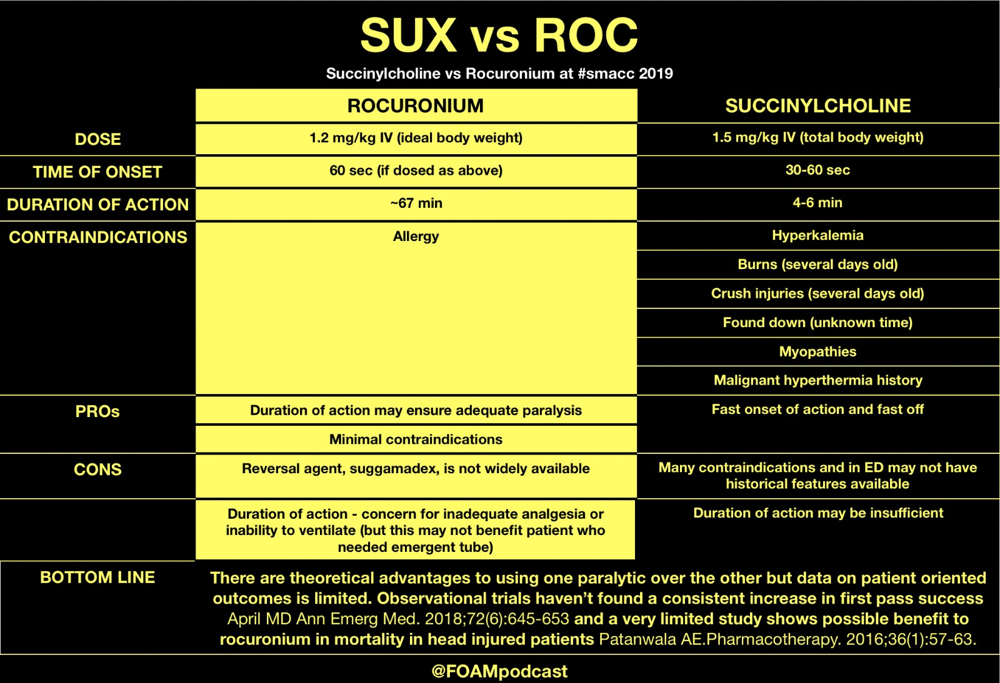
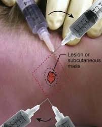

# Procedures

Follow up

- Go to ED and do lung U/S, see sliding lung sign

## Basic Care of Patient

### Intake

#### Nasogastric Tube Insertion

#### Parenteral Nutrition

#### Oral Feeding in Child

### Output

#### Urinary Catheter

#### Bed pan

#### Diapering

### Hygiene

#### Oral Hygiene

#### Genital Hygiene

#### Body Hygiene

### Moving Patients

#### LogRoll

## Developmental Assessment

### Neonatal Assessment

### Pediatric Development Assessment

### Pubertal Tanner Staging

## Wound Care

### Types of Wound

### Dress an open wound

### Suture Removal

## Bloods and Injections

### Capillary Blood Glucose Measurement

### Needles

| Color | Gauge    | Application |
| ----- | -------- | ----------- |
| Blue  | 23 Gauge |             |

### Disposal of needles and Sharps

### Venepuncture

### Intravenous cannulation

### Arterial Puncture for ABG

### Aseptic Blood Culture

### Peripheral Line

### Central Line

## Medication Delivery

### IV Drip

### IM Injection

### SC Injection

#### Insulin

### Nebulization

## Tissue Sampling

### Skin Swab

For pyogenic culture

### Skin Scrap

For fungal / parasitic microscopy / culture

### Biopsy

 ### Bone Marrow Aspiration

### Joint Aspiration

### Lumbar Puncture

## Airway and Ventilation

- BVM
- adjuncts - NPA or OPA
- O2 devices - nasal prong, face mask, venturi mask, NRM
- ventilation - invasive or NIV (CPAP, BiPAP)

### Principles of Airway Intervention 

1. Maintain airway **patency**: do we need device? Invasive?

   - Head-tilt / chin lift / jaw trust

   - Removal of supra glottis FB using **McGills forceps**

   - Use of airway adjuncts e.g. nasopharyngeal and oropharyngeal airway devices

     | Device                | Remarks                                                      |
     | --------------------- | ------------------------------------------------------------ |
     | Oropharyngeal airway  | Helps maintain airway patency by lifting the tongue from obstructing the glottis. The patient with gag reflex would not tolerate this. |
     | Nasopharyngeal airway | Helps maintain the airway in situations where the **gag reflex is present** as it is better tolerated |
     | Bag-valve mask        | To ensure a tight seal, use two thumbs and thenar eminences to press down the mask and lift the jaw with the other finger. Have another person perform bagging. Make sure that the chest rises |
     | Laryngeal Mask Airway | Supraglottic airway, allows for ventilation with **less risk of aspiration** compared to bag-mask ventilation (BMV) and is also slightly **more secure** than BMV |
     |                       |                                                              |
     |                       |                                                              |
     |                       |                                                              |
     |                       |                                                              |

   - Definitive airway

2. Ensure adequacy of breathing / **oxygenation**

   | % O2    | Technique               | Flow (L/min) | Remark                                                       |
   | ------- | ----------------------- | ------------ | ------------------------------------------------------------ |
   | 24 - 40 | Nasal prongs            | 1 - 4        |                                                              |
   | 50      | Venturi masks           | 15           |                                                              |
   |         | Oxygen mask             |              |                                                              |
   | 70      | Non-rebreather masks    | 15           | not a tight seal                                             |
   | 100     | High flow nasal cannula | 60           | Wall oxygen only goes up to 15 L; the air need to be humidified; generates a positive pressure when the patient closes his mouth to achieve a PEEP of 5 - 8 |

   - 88-92 % for type iI respiratory failure patient - don't obligate the hypoxic drive in these patients; We can use this goal and then escalate the type of respiratory device from Nasal prongs to Venturi to oxygen, non-rebreathe r mask etc in intervals of 3 - 5 minutes.
   - Use Venturi mask when we need to have tight control of oxygen level
   - Noninvasive ventilation
   - Intubation and mechanical ventilation

3. **Ensure airway control** in anticipation of clinical deterioration

   - patient with rapidly deteriorating GCS might lose airway patency
   - Severely ill patient e.g. major trauma patient in CT scan
   - Anticipate worsening of SOB in patient with acute pulmonary edema who is required to lie supine for coronary angiography

### Practical Approach for Invasive Ventilation

1. If the patient is collapsed or near arrest, do **crash intubation without drugs**
2. If the patient gag reflex, assess the airway for anatomical and physiological difficulties. **If there are none, intubate with RSI (induction with neuromuscular blocking agents)**
3. If the patient has a gag reflex and the airway is anatomically difficult, **awake oral intubation or intubate without paralysis or fiberoptic intubation**
   - Some clues: patient has nebuliser masks with lidocaine - anaesthetised and then do awake intubation
4. Finally surgical airway if all fails

**Recognising a difficult airway**

- Anatomically difficult airway - MOANS, LEMON, AIR
  - Difficult BMV airway (MOANS)
    - M - poor mask fit
    - O - obesity
    - A - elderly age > 65
    - N - no teeth
    - S - stiff lungs (reduced lung compliance)
  - Difficult intubation airway (LEMON)
    - L - look for anatomical difficulties e.g. swollen tongue
    - E - evaluate 3-3-2 (3 fb mouth opening, 3fb thyromental space, 2 fb thyrothyroid space)
    - M - movement e.g. chest compressions
    - O - obesity
    - N - neck immobility
  - Difficult surgical airway (AIR)
    - A - neck access problems e.g. tumor, enlarged thyroid
    - I - infections e.g. Ludwig angina
    - R - post radiation therapy where airway anatomy may be disturbed
- Physiologically difficult airway (HOPA)
  - There exist conditions that predispose patients to adverse outcomes as a result of the process of attempting intubation
  - H - hypotension may be aggravated by induction agents
  - O - low oxygenation or desaturation might be worsened when patient is paralysed for intubation
  - P - low pH or acidosis might worsen if ventilator settings do not match the initial respiratory rate of the patient who is tachypnoeic from metabolic acidosis

Decision for intubation based on 3 clinical assessments

1. **Failure to maintain or protect airway?**

   Adequacy of airway is confirmed by 

   - **Having the patient speak**: look for inability to phonate properly, stridor, and altered mental state precluding response to questions (low GCS is not in itself an indication for orotracheal intubation). 
   - Look in the airway to check for the presence of pooled secretions: indicate inability to swallow5

   A gag reflex is neither sensitive nor specific as an indicator of loss of airway protective reflexes. 

2. **Failure of ventilation** (e.g. status asthmaticus) **or oxygenation** (e.g. severe pulmonary

   oedema)?

3. **Anticipated deterioration in clinical course?**

**Clinical Pearls**

- Note the floor of  the nasal cavity is horizontal, parallel to the hard palate. Hence during the insertion of a nasopharyngeal airway or a nasogastric tube, the direction should be horizontal and not upwards.

### Laryngoscopy

- Always check the dentation before putting in the laryngoscopy
- 

### Bag-Valve-Mask Ventilation

### Extraglottic Device Placement

### Noninvasive Ventilation

BIPAP and CPAP are both NIV; NIV prevents intubation. Reduce length of stay in the ICU. We also use NIV in patients whom we are going to intubate. At maximum NIV patient deteriorates, to preoxygenate the patient before we oxygenate

- Compatibility of airway device with the ventilators
- Why are CPAP and BiPAP not compatible with ETT
- Palliative patients also use NIV. 
- For very breathless people with metabolic acidosis; air hunger, breath very deeply and have CO2 retention. 

| Method | Remarks                                                      |
| ------ | ------------------------------------------------------------ |
| CPAP   | CHF, OSA                                                     |
| BiPAP  | CHF, COPD, Type 2 Respiratory Failure, **Immunosuppressed with pneumonia / respiratory failure**, preoxygenation before intubation, post extubation |

- Contraindications of NIV are need for emergent intubation, drowsy, unable to maintain airway, airway obstruction, facial trauma, recent esophageal or gastric anastomosis
- In general we don't give CPAP, which only helps oxygenation. 
- Do NIV in immunocompromised patients because we are worried about intubation resulting in infection and sepsis
- BiPAP cannot be used in patients with COVID19; we intubate at the moment.
  - When ventilators so NIV is given to patients

### Intubation

Types  of intubation

- Orotracheal intubation with no drugs
- Orotracheal intubation via RSI
- Fiberoptic intubation with inhalational anesthesia (not available in ED but in OT)
  - Preferred method id 
- Awake orophargyneal intubation with sedation but NO paralysis. lIdocaine to anaesthetise the airway and then intubate the airway with surgical airway on standby
- Surgical airway

**Indication of Intubation**

- Failure to ventilate e.g. flail chest, chest injuries, head injuries, intoxication
- Failure to oxygenate e.g. pneumothorax, acute pulmonary oedema, pneumonia, ARDS
- Anticipated deterioration of airway status e.g. c-spine injury with concern for oedema and loss of airway, stab wound to the neck with expanding hematoma, intracranial hemorrhage with AMS , need for blood pressure control, uncooperative trauma patient with life-threatening injuries who needs procedures or immediate CT scanning, **airway burns**, expanding hematoma of the neck, maxillofacial injuries, includes inability to maintain the airway, traumatic coma

3 top indication: head injury, direct airway injury, multi system trauma

#### Rapid Sequence Intubation

RSI has intubation and paralysis to prevent struggling! Try not to do this in patients with difficult and dynamic airways.

Rapid sequence intubation (RSI) is the administration, after pre-oxygenation, of a potent induction agent followed immediately *by* a rapidly acting neuromuscular blocking agent (NMBA) to induce unconsciousness and motor paralysis for tracheal intubation.

Assumptions for RSI:

- Patient did not **fast** before intubation and is therefore at **risk for aspiration**
- A predicted difficult airway is no longer considered a contraindication to RSI.
- Administration of the drugs is preceded by a **preoxygenation phase** (refer to second **'P'** of RSI for further details) to permit a period of apnoea to occur safely between the administration of the drugs and intubation of trachea **without interposed assisted ventilation.**
- Use of **cricoid pressure or Sellick's manoeuvre** was previously recommended to prevent aspiration of gastric contents, but has been shown to impair glottic visualization in some cases, and evidence supporting its use is dubious, at best. It is **no longer recommended during emergency intubation.**

When not to intubate

- If you are uncomfortable with intubation techniques required AND ventilation is adequate
- If the patient's condition improves during intubation attempts
- If the respiratory arrest is reversible with a drug (**naloxone**, **flumazenil**)
- If the patient has a deformity of the airway or neck (and is stable)
- If the patient has a **do not resuscitate** order

**8 Ps of RSI**

- Preparation

  1. Gases
     - Oxygen source
     - Endtidal CO2 detector or bulb/syringe oesophageal detection device
  2. Yankauer suctioning device
  3. Airway devices
     - Non rebreather masks, venturimasks, nebuliser mask, nasal prongs
     - Bag-valve-mask with oxygen reservoir
     - Oral and nasopharyngeal airways, 
     - ETT of different sizes (6 - 8 for female, 7 - 9 for males)
     - Rescue airway devices e.g. bougie, laryngeal mask
     - Surgical airway sets, cricothyrotomy, tracheostomy tools
       - Scapel size 11
       - Artery forceps
       - Tracheal hooks
       - Tracheostomy or mini-tracheostomy or specialised cricothyrostomy tubes
  4. Stylets
  5. Disposables
     - Water soluable lubricants
     - Syringes 10 cc
     - Tape
     - Gauze
  6. Laryngoscope
     - Curved MacIntosh blades size 3 and 4
     - Straight Miller blades sizes 2 and 3
  7. McGill's forceps
  8. Others
     - Head stabilisers / small pillow

- Plans

  - Plan A - direct laryngoscopy via OTI
  - Plan B - OTI using videolaryngoscopy +/- bougie
  - Plan C - LMA and call for help from ENT or anesthesia
  - Plan D - cricothyoidotomy

- Preoxygenation

  - A normal patient can maintain his saturation at above 90% for 8 minutes if he is preoxygenated for at least 5 minutes
  - Preoxygenation allows for longer safe apnoea time during RSL
  - Apnoeic oxygenation is the administration of high flow oxygen via nasal prongs when patient is paralysed to prolong safe apnoea time

- Positioning

  - Ensure the line of the trigs is anterior to the shoulder to align the oral, pharyngeal, and laryngeal axes for better visualisation of the glottis.

- Pretreatment

  - Drugs given to attenuate the effects of intubation
  - Intubation might cause autonomic response associated with raised blood pressure, tachycardia, laryngospasm, raised ICP
    - **Lignocaine** might blunt ICP rise, airway reactivity. Worsens hypotension.
    - **Fentanyl** might blunt ICP rise, myocardial ischemia. Worsens hypotension.
    - **Atropine** might be given to prevent bradycardia in children.
  - Usually not used in situations when intubation has to be done rapidly and if the patient is hemodynamically unstable.

- Paralysis with induction

  - Hypnotic agents
    - **etomidate**: indicated for hypotensive and cardiac patients; not indicated in sepsis
    - **ketamine**: indicated for all hypotensive patients, relatively contraindicated in hypertension
    - **propofol**: neuroprotective, contraindicated in hypotension.
  - Paralytic agents: 
    - **Succinylcholine** - fast and short acting; will wear off more quickly and need not bag the patient for as long. Bag for 5 minutes and the patient resumes 
      - May increase ICP 
    - **Rocuronium** (used when patient has hyperkalemia) - reversible agent is available

- Placement with confirmation

  | confirmation method  | remarks                                                      |
  | -------------------- | ------------------------------------------------------------ |
  | Misting of ETT       | NOT sensitive                                                |
  | Seeing chest rise    | NOT sensitive                                                |
  | 5 point auscultation | NOT sensitive                                                |
  | SpO2                 | desaturation might take a few minutes in a well preoxygenated patient |
  | ETCO2                | Detected exhaled CO2 and is the GOLD STANDARD                |
  | CXR                  | to ensure that the ETT had not gone into one bronchus        |

- Post intubation management

  - Continual analgesia and sedation
  - Ventilator management
  - Pain control
  - Continuing investigations and treatment of  any acute medical conditions
  - Discussion with ICU and disposition

#### In variceal bleeder

- Preoxygenation: apnoeic oxygenation, **delayed sequence intubation**
- Choice of drugs: minimal hypotension avoid propofol and midazolam, use etomidate
- Optimising hemodynamics: vasopressors: phenylephrine, given blood or fluids if we need to
- Suction: double suction set up: 
- Laryngoscopy: video vs direct

### Surgical Airways

#### Cricothyroidotomy

The cricothyroid membrane is the site for emergency cricothyroidotomy. On palpation of an adult male, it is the **space below the Adam's apple or thyroid cartilage**.

### Supplemental Oxygen

### Ventilator Settings

- FiO2 at 100% (tail down as soon as possible to minimize hyperoxemia)
- TV = 6.8 ml/kg (reduce if  asthma or COPD)
- RR = 12 - 18 /min (reduce if  asthma or COPD), to increase if  patient has metabolic acidosis
- PEEP = 5 cmH2O
- I:E ratio = 1:2.5 (up to 1:6 for very tight lungs)

## Pulmonary Procedures

Intercostal catheter vs chest tube

- Chest tube is large bore - less likely to clot
- Pig tail catheter is a lot smaller
- 'Salinger' techniques for insertion of chest tube

### Peak Flow Measurement

### Nebulisation

### Thoracocentesis

### Thoracostomy

A thoracotomy is an incision made in the chest. Surgeons and doctors in emergency situations may use it to access the organs within the chest.

The organs in the chest or thorax are called the thoracic organs. These include:

- heart
- lungs
- food pipe or esophagus
- diaphragm

A thoracotomy also allows access to part of the aorta, which is the body’s largest artery.

Thoracotomies are often used to treat or diagnose a problem with one of these organs or structures.

The most common reason to have a thoracotomy is to treat lung cancer, as the cancerous part of the lung can be removed through the incision. It can also be used to treat some heart and chest conditions.

#### Needle Thoracostomy

Needle thoracostomy is an emergency, potentially life-saving, procedure that can be done if tube thoracostomy cannot be done quickly enough.

**Indication:** Tenson pneumothorax

**Contraindication**: none, because it is only done when there is immediate threat to life which supersedes other considerations

**Complication:** 

- Pulmonary or diaphragmatic laceration
- Intercostal neuralgia due to injury of the neurovascular bundle below a rib
- Bleeding
- Infection
- Pneumothorax (if the procedure was done because of falsely suspected pneumothorax)
- Rarely, perforation of other structures in the chest or abdomen

**Equipment**

- A 14- or 16-gauge needle (an over-the-needle catheter is best); 8-cm needles are more successful than 5-cm needles but increase the risk of injury to underlying structures
- Sterile gown, mask, gloves
- Cleansing solution such as 2% chlorhexidine solution

Get the biggest needle

Beware at 40 - 50% of IV cannula does not get into pleural cavity

#### Tube Thoracostomy

Insertion of an additional chest tube is indicated if the existing one is inadequate (eg, small diameter limiting the ability to adequately drain fluid). This patient's chest tube is functioning well (ie, draining large amounts of air), so the source of the large air leak (ie, tracheobronchial injury) should be investigated.

#### Finger Thoracostomy

#### Chest Tube Placement, Maintainance, Removal

### Thoracotomy

#### Resuscitative or Emergency Thoracotomy

Procedure

- First an incision is made along the fourth **or** fifth intercostal space (between the ribs),
- Intercostal muscles **and** the parietal pleura are divided, 
- **and** then the ribs are retracted to provide visualization. 

When the incision covers both the right **and** left hemithoraxes it is referred to as a "**clamshell**" **thoracotomy**.

#### Surgical Thoracotomy

## Gastrointestinal Procedure

### Endoscopy

Indications

-   Dysphagia
-   Initial onset of GI symptoms after age 50
-   Early satiety
-   Hematemesis
-   Hematochezia
-   Iron deficiency anemia
-   Odynophagia
-   Recurrent vomiting
-   Weight loss

### Abdominocentesis

### Endroscopic retrograde cholangiopancreatography (ERCP)

Indication: pancreatitis secondary to choledocolithiasis, cholestatic jaundice

## Urorenal Procedures

### Urine Specimen Catch

#### Bag

#### Mid-stream

### Dialysis

#### Urgent Dialysis

| category                      | Details                                                      |
| ----------------------------- | ------------------------------------------------------------ |
| **A**cidosis                  | Metabolic acidosis: pH <7.1 +  refractory to medical therapy |
| **E**lectrolyte abnormalities | Symptomatic hyperkalemia: ECG changes or ventricular arrhythmias Severe hyperkalemia: Potassium >6.5 mEq/L refractory to medical therapy |
| **I**ngestion                 | Toxic alcohols (methanol, ethylene glycol); Salicylate; Lithium; Sodium valproate, carbamazepine |
| **O**verload                  | Volume overload refractory to diuretics                      |
| **U**remia                    | Symptomatic: Encephalopathy, Pericarditis, Bleeding          |

### Suprapubic Catheter

## Obgyn Procedures

### Cuscoe's Speculum 

### Genital Swabs

### Hysteroscopy  

Visualization of the uterine cavity for diagnosis and treatment of intrauterine pathology

## MSK Procedure

### Back Slab

### Plastering techniques

## Anaesthetic Procedure

- Consider sedation for CT scans and MRIs
- Most common reason for nurses to call HO
- Counsel patients and families (correcting misconceptions e.g. no addiction)

### General Anesthesia

### Procedural Sedation and Analgesia (Conscious Sedation)

Conscious sedation is a technique in which the use of a drug or drugs produces a state of depression of the central nervous system (CNS) enabling treatment to be carried out, but during which the patient remains conscious. 

|                                        | Conscious sedation                                           | General anesthesia                                           |
| -------------------------------------- | ------------------------------------------------------------ | ------------------------------------------------------------ |
| What procedures is this used for?      | examples: dental cleaning, cavity filling, endoscopy, colonoscopy, vasectomy, biopsy, minor bone fracture surgery, tissue biopsies | most major surgeries or upon request during minor procedures |
| Will I be awake?                       | you’re still (mostly) awake                                  | you’re almost always fully unconscious                       |
| Will I remember the procedure?         | you may remember some of the procedure                       | you should have no memory of the procedure                   |
| How will I receive the sedative/drugs? | you may receive a pill, inhale gas through a mask, get a shot into a muscle, or receive a sedative through an intravenous (IV) line in your arm | this is almost always given through an IV line in your arm   |
| How quickly does it take effect?       | it may not take effect immediately unless delivered through an IV | it works a lot faster than conscious sedation because the drugs enter your bloodstream immediately |
| How soon will I recover?               | you’ll likely regain control of your physical and mental faculties quickly, so you may be able to take yourself home soon after a conscious sedation procedure | it may take hours to wear off, so you’ll need someone to take you home |

Physiological effects

- Bradypnea but should not require help with breathing
  - Patient may be given extra oxygen through a mask
- Blood pressure may drop a little
  - IV fluids through a catheter (tube) into a vein.

Tipping patient into depression seadtion

- Happens if we assume that patient need to sleep to not feel pain
- And also if there is a reduction in stimulation e.g. dislocation put back

#### Preparation

- ED procedural sedation checklist

- Get a senior nurse to watch the monitor

  - Tell me if the SPO2 drops below
  - Tell me if the BP drop below

- Always do a difficult airway assessment

  

  

#### Administering conscious sedation

- Informed consent
  - Side effects: drown, heaviness or sluggishness, memory loss, slow reflexes, low blood pressure, headache, feeling sick
- Check drug allergy
- Check cardiac reserve: auscultate the lungs, do ECG
- Set IV plug
- Set up oxygen supply

| Drugs         | Route      | Duration |
| ------------- | ---------- | -------- |
| Dizepam       | Oral       |          |
| Trizolam      | Oral       |          |
| Midazolam     | IM         |          |
| Midazolam     | IV         |          |
| Propofol      | IV         |          |
| Nitrous Oxide | Inhalation |          |

- Analgesics - fentanyl, ketamine
- Sedative: midazolam, propofol, etomidate (rare, more for induction)
  - Midazolam will feel the pain but not remember it
- Dissociative: ketamine at high dose
  - Don't sleep, awake but not really there
  - Classical: lights are on but no one is at home
- Inhalation vs IV procedure sedation

#### Post Procedure

- Observe for 1 - 2  hours
- Monitor vitals
- Discharge when 
  - alert and oriented
  - can eat and drink: not nauseous 
  - pass urine

### Nerve Block

In the following, we classify by anatomy. However, a nerve block can also be classified by how the injection is administered or by whether it’s nonsurgical or surgical:

#### Techniques in Nerve Block

| Non Surgical Nerve Blocks | Description                                                  | Indication |
| ------------------------- | ------------------------------------------------------------ | ---------- |
| Epidural                  | Medication is injected outside the spinal cord to numb the abdomen and lower extremities. | childbirth |
| Spinal anesthesia         | The anesthetic medication is injected in the fluid surrounding the spinal cord. |            |
| Peripheral                | Medication is injected around a target nerve that is causing pain. |            |

| Surgical Nerve Block | Description                                                  | Indication                                                   |
| -------------------- | ------------------------------------------------------------ | ------------------------------------------------------------ |
| Sympathetic blockade | Blocks pain from the sympathetic nervous system in one specific area. | Treatment of excessive sweating in specific parts of the body |
| Rhizotomy            | The root of the nerves that extend from the spine are surgically destroyed. | This may be used for neuromuscular conditions such as spastic diplegia or spastic cerebral palsy. |
| Neurectomy           | A damaged peripheral nerve is surgically destroyed           | only used in rare cases of chronic pain, where no other treatments have been successful, such as chronic regional pain syndrome |

#### Facial Nerve Block

| Subtype          | Decription        | Indication |
| ---------------- | ----------------- | ---------- |
| Supraorbital     | Forehead          |            |
| Ophthalmic nerve | Eyelids and scalp |            |
| Sphenopalatine   | Nose and palate   |            |
| Maxillary        | Jaw               |            |
| Trigeminal       | Face              |            |

#### Neck and Back Nerve Blocks

| Subtype           | Decription              | Indication |
| ----------------- | ----------------------- | ---------- |
| cervical epidural | neck                    |            |
| thoracic epidural | upper back and ribs     |            |
| lumbar epidural   | lower back and buttocks |            |

#### Chest and Abdominal Nerve Blocks

| Subtype                    | Decription        | Indication |
| -------------------------- | ----------------- | ---------- |
| Paravertebral              | Chest and abdomen |            |
| Intercostal                | Chest / rib       |            |
| Transverse abdominis plane | Lower abdomen     |            |
| Hypogastric plexus         | Pelvic region     |            |

#### Brachial Plexus Block

| Subtype         | Decription                       | Indication |
| --------------- | -------------------------------- | ---------- |
| Interscalene    | Shoulder, clavicle, or upper arm |            |
| supraclavicular | Upper arm                        |            |
| Infraclavicular | Elbow and below                  |            |

#### Lower Extremity Nerve Block

| Subtype               | Decription                                                   | Indication               |
| --------------------- | ------------------------------------------------------------ | ------------------------ |
| Lumbar plexus         | front of the leg, including the thigh, knee, and the saphenous below the knee |                          |
| femoral               | the entire anterior thigh, most of the femur and knee joint, and part of the hip joint, but **not** the back of the knee) | Knee replacement surgery |
| sciatic nerve         | back of the leg, lower leg, ankle, and foot                  |                          |
| popliteal nerve block | below the knee                                               |                          |

### Hematoma Block

A hematoma block is an analgesic technique used to allow painless manipulation of fractures while avoiding the need for full anesthesia. This procedure is normally only appropriate for fractures of the radius and ulna, and occasionally for fractures of the lower ends of the tibia and fibula.

Injection of a suitable local anesthetic by needle and syringe through the skin into this hematoma produces relief of the pain caused by the fracture, allowing the bones to be painlessly manipulated.

Goal: bath the periosteum and tissue around it in the LA; 

**Location**

- Consult room not need resus room because

**Procedure**

- Be more proximal than anticipated - err on the side of more proximal
- 10 ml of lidocaine in adults
- Go in aim for fracture line
- Withdrawal to check that we are in the hematoma

### Bier's Block

Intravenous regional anesthesia (IVRA) or **Bier's block** anesthesia is an anesthetic technique on the body's extremities where a local anesthetic is injected intravenously and isolated from circulation in a target area.

- Establish an intravenous (IV) line in the uninvolved extremity.
- Draw up and dilute 1% plain Lignocaine (1.5- to 3-mg/kg total Lignocaine dose) for a final concentration of 0.5% Lignocaine.
- Place a padded tourniquet and inflate the upper cuff.
- Insert a small IV cannula near the pathological lesion and secure it.
- Deflate the tourniquet..
- Elevate and exsanguinate the extremity.
- Inflate the tourniquet (250 mm Hg) and lower the extremity.
- Inflate the proximal cuff only, if a double-cuff system is used.
- Infuse the anaesthetic solution.
- Remove the infusion needle and tape the site.
- Perform the procedure.
- If pain is produced by the tourniquet*, inflate the distal cuff first*, and then deflate the proximal cuff.
- **Do not deflate the cuff if total tourniquet time is less than 30 minutes**.
- Observe 45 to 60 minutes for possible reactions

#### Indications and Contraindications

Indications include any procedure on the arm or leg that requires operating anaesthesia, muscle relaxation, or a bloodless field, such as reduction of fractures and dislocations, repair of major lacerations, removal of foreign bodies, debridement of burns, and drainage of infection. IVRA is commonly used for extremity surgery, such as carpal tunnel surgery or tendon repair. The procedure may be carried out on any patient of any age who is able to cooperate with the clinician.

**Absolute contraindications:**

- Allergy to the anaesthetic agent.
- Uncontrolled hypertension.

**Relative contraindications:**

- Raynaud's disease.
- Seizures
- Buerger's disease.
- Crushed or already hypoxic extremity in which further transient ischaemia would be detrimental.
- Uncooperative patient.
- Homozygous sickle cell disease is a theoretical contraindication.
- Vascular injury -  need to obliterate venous flow of the arm

**About the procedure**

- Fasting **not** required.
- Continuous cardiac or blood pressure monitoring is not routinely used and not required unless extenuating circumstances indicate potential cardiovascular problems.
- Need to be done in a resuscitation capable area

#### Procedure

Preparation

- Explain procedure to the patient in advance.
- General resuscitation equipment, including suction, **anticonvulsant drugs**, bag-valve-mask apparatus, and O2, should be available.
- Continuous cardiac and blood pressure monitoring is not routine but may be used as an option depending on the clinician's assessment of the potential for cardiovascular events.
- IV line in both arms
  - One in the arm for M&R
  - One in the other arm for resuscitation

Start

- With manual pressure on brachial pulse and tourniquet in position but not inflated, elevate the arm for circa 3 min to exsanguinate the arm
  - Exsanguination may be used to release tension in the arm due to swelling, in OT for bloodless field
  - Note that exsanguination is an optional step
- Inflate cuff.
- The traditional dose of Lignocaine for the arm is **3 mg/kg**. **Inject it as a 0.5% solution** (1% Lignocaine mixed with equal parts sterile saline in a 50-mL syringe). Hence, for a 70-kg patient, infuse 210 mg of Lignocaine (21 mL of 1% Lignocaine) mixed with 21 mL of saline for a total volume in the infusing syringe of 42 mL of 0.5% Lignocaine.
  - Start with 1 - 2 mg/kg of lidocaine
  - **Do not exceed a 3-mg/kg total dose of Lidocaine.**
  - Studies have described a procedure termed the *mini-dose Bier block* in which **1.5 mg/kg** of Lignocaine is used and reported a 95% success rate. This lower dose may decrease the incidence of central nervous system side effects and is more desirable in the ED setting.
- A pneumatic tourniquet with cotton padding (to prevent ecchymosis) under the cuff is applied proximal to the pathology.
- It is usually desirable to use a vein on the dorsum of the hand, but importantly, the injection site should be **at least 10 cm distal to the tourniquet** to avoid injection of anaesthetic proximal to or under the tourniquet.
- With the extremity still elevated, the tourniquet is inflated to **250 mm Hg** (or 100 mm Hg above systolic pressure) the arm is placed by the patient's side. In a child, the tourniquet is inflated to **50 mm Hg** above systolic pressure. In elderly obese patients with calcified peripheral vessels, arterial occlusion may not be achieved safely. In the leg, a cuff pressure of **300 mm Hg** or approximately twice the systolic pressure measured in the arms is suggested.
  - In generally 100 mm Hg 
  - Pneumatic cuff can only go up to 300 mmHg; thus in patients with HTN, we cannot use it. 
- With the tourniquet now inflated, slowly inject the 0.5% Lignocaine solution into the infusion catheter at the calculated dose.
- At this point, blotchy areas of erythema may appear on the skin. This is not an adverse reaction to the anaesthetic agent but merely the result of residual blood being displaced from the vascular compartment, and it heralds success of the procedure.
- In 3 to 5 minutes, the patient will experience paraesthesia or warmth beginning in the fingertips and travelling proximally, with final anaesthesia occurring above the elbow, to the level of the tourniquet. Complete anaesthesia ensues in 10 to 20 minutes, followed by muscle relaxation.
- Note that adequate analgesia may exist even if the patient can still sense touch and position and has some motor function. If the “mini-dose” technique (initial dose of 1.5 mg/kg of Lignocaine) does not provide adequate anaesthesia, infuse an additional 0.5 to 1 mg/kg of diluted Lignocaine at this time.
- **Wait** a full 15 minutes before infusing additional Lignocaine. Alternatively, if analgesia is slow or inadequate, an extra 10 to 20 mL of *saline* solution may be injected to supplement the total volume of solution to enhance the effect.
- Ask patient: paraoral numbness, tongue parenthesis, etc.
- A single deflation can be performed if the cuff has been inflated for longer than 30 min. It is reasonable to use a 20-minute cut-off if the mini-dose technique is used or a total of 200 mg or less of Lignocaine has been administered because this dose is equal to a commonly administered anti-arrhythmic IV bolus.
- Sensation returns quickly when the tourniquet is removed, and in 5 to 10 minutes the extremity returns to its Pre-anaesthetic level of sensation and function. Many patients describe a transient intense tingling sensation after cuff deflation.
- If the procedure takes longer than 20 or 30 minutes, many patients complain of pain from the tourniquet because it is not inflated over an anaesthetized area. Use of a double-cuff tourniquet may alleviate the problem of pain under the cuff. Most patients begin to feel significant discomfort after 30 minutes if only a single cuff is used. In the *preferred* double-cuff system, two separate tourniquets are placed side by side on the extremity. One is termed the *proximal cuff* and the other the *distal cuff*. The proximal cuff is inflated at the beginning of the procedure, and anaesthesia is obtained under the deflated distal cuff. When the patient begins to feel pain under the proximal cuff, the *distal cuff is first inflated over an already anaesthetized area, and the pain-producing proximal cuff is then deflated*. One must be certain to inflate the distal cuff before the proximal cuff is released.

**Post Procedure**

- Release tourniquet at least 30 mins after the procedure
  - Be at the patient's side when releasing the tourniquet
- Check NV Status and repeat XR post M&R
- After 45 to 60 minutes of observation, the patient may be discharged.
- There are no standard or specific post-procedure instructions, but precautions similar to those given for conscious sedation are reasonable. Driving is best prohibited for 6 to 8 hours, and the patient should leave with a responsible adult. Delayed complications from Lignocaine have not been reported.

#### Complication

- Drug allergy

- Tourniquet pain

- Arm necrosis / limb ischemia

- Systemic toxicity

  - CNS Excitation, seizures, respiratory depression

    

### Local Anaesthetic Application

Be very parallel to the skin. 

#### Field Block

- Lidocaine without epinephrine, warm the drugs is helpful; 

  - Cold LA is more painful.
  - Inject while withdrawing; 

  

- May bend the needle to get the needle as parallel to the wound as possible
- Lacerations
  - Need to anaesthetise the skin 
  - And then anaesthetise in the laceration
- Finger dislocation (Dislocated Finger - Bizzarre ER)
  - Reduce the finger
  - bupivacaine

## Basic Surgical Procedures

### Scrub and gown in operating room

### Preparing sterile field

### Knot tying and suturing

### Removal of staples and/or sutures

### Removal of surgical drains

### Backslab Application

## Others

### Helmet Removal
