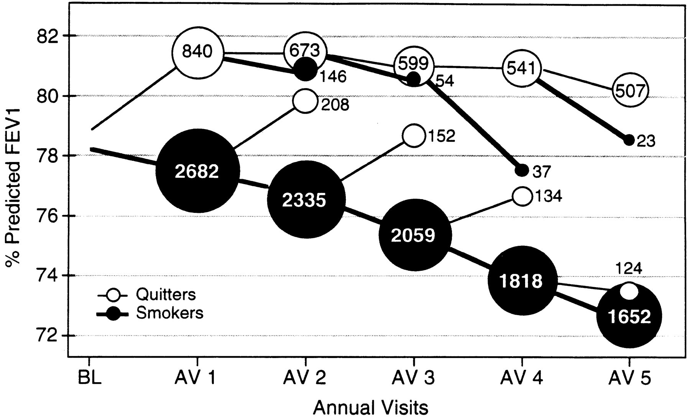

Pulmonology
===========

Special Clinical Techniques for Pulmonary Diseases
--------------------------------------------------

### Sounds of the Lungs

### Spirometry

Spirometry is the most commonly used office-based device for lung function testing. A spirometer is a hand-held device that can easily be used in the clinician's office by a patient with the assistance of a technician.

-   How it works

    -   The patient is asked first to exhale completely, then to inhale deeply.

    -   Next, the patient is told to exhale rapidly into the device until all the air is exhausted from his lungs.

    These two steps measure the inspiratory and expiratory flow of air. A number of calculations can then be derived from these measurements. An individual's spirometry results are based on comparison to predicted values of a standardized, healthy population.

-   Definitions

    -   Forced Vital Capacity (FVC) = total amount of air the patient can expel from the lungs after a full inspiration

    -   Forced Expiratory Volume - 1 second (FEV1) = amount of air the patient can expel after a full breath in one second

-   Diagnosis

    -   Post-bronchodilator FEV1-to-FVC ratio (FEV1/FVC) less than 70% (or less than the fifth percentile) with compatible symptoms and history, is diagnostic of COPD.

    -   Significant reversibility is defined as an increase in FEV1 %

    -   Further, the FEV1 impairment defines the level of COPD severity:

          FEV1 Impairment (Compared to Predicted)   Severity               Symptoms
          ----------------------------------------- ---------------------- --------------------------------------------------------------------
          \> 80%                                    Mild - GOLD 1          none
          50-79%                                    Moderate - GOLD 2      SOB on exertion
          30-49%                                    Severe - GOLD 3        SOB and frequent exacerbation
          \< 30%                                    Very severe - GOLD 4   significant reduction in QoL, exacerbation can be life-threatening

### different cough

Differentiating descriptors of cough

-   Dry: environmental irritant, asthma

-   Wet/productive: lower-respiratory infection

-   Barking: croup, subglottic disease, foreign body

-   Brassy or honking: habit cough, tracheitis

-   Paroxysmal: pertussis, chlamydia, mycoplasma, foreign body

-   Worse at night: asthma, sinusitis, allergic or vasomotor rhinitis (postnasal drip)

-   Disappears at night: habit cough

-   Associated with gagging or choking: gastroesophageal reflux disease

Review of systems clues for a school-aged child with cough

-   Change in voice: Dysphonia or hoarseness may suggest laryngeal irritation due to chronic rhinitis or gastroesophageal reflux.

-   Chest pain: Probe for evidence of gastrointestinal causes of cough, not cardiac conditions; true cardiac chest pain is rare in children. Alternatively, you could also ask the patient if she \"ever gets a bad taste in her mouth\" or \"if food ever comes back up.\" While rare, congestive heart failure, most commonly due to infectious myocarditis, can present in school-aged children with cough and wheezing and can easily be mistaken for a more common pulmonary condition, such as asthma or bronchitis.

-   Choking event: Although a foreign body aspiration is more likely in a toddler, otherwise healthy school-aged children and adults are still at a small risk for aspiration pneumonia secondary to inadvertently choking on food. Children with neurological impairment are at a significantly higher risk for aspiration, either from secretions (\"above\") or from refluxed gastric contents (\"below\").

-   Fever: Suggests an infectious etiology for cough, primarily pneumonia and sinusitis. Lobar pneumonia, particularly in the lower quadrants, may also present with abdominal pain mimicking appendicitis. The presentation of bacterial pneumonia is usually acute, rather than chronic.

-   Headaches: Frontal or orbital headaches may suggest a sinusitis, a common cause of persistent cough in children due to the associated post-nasal drip, which is often worse at night when the child is supine.

-   Sore throat: May suggest evidence of post-nasal drip and pharyngeal irritation due to allergies or sinusitis. (May be present in conjunction with nasal congestion, and/or a history of itchy, watery eyes.)

Upper Airway Conditions
-----------------------

congenital vocal cord abnormalities, laryngotracheomalacia, vascular ring, laryngeal web, tracheal stenosis or tracheoesophageal fistula

Inflammatory Diseases of the Respiratory System
-----------------------------------------------

{#fig:asthmavscopd width="90%"}

### Asthma

-   Management

    -   Patient education

    -   Removal of triggers (e.g., dust, pollen)

    -   Medications

    -   Immunotherapy

### COPD - Chronic Bronchitis and Emphysema

COPD encompasses both chronic bronchitis and emphysema and is characterized by airflow limitation that is progressive and not fully reversible with bronchodilators. Chronic bronchitis presents with productive cough for at least three months for the past two years. While the duration of illness provides a clinical distinction between acute and chronic bronchitis, the actual mechanisms and pathophysiology also probably differ between the two. Chronic bronchitis causes long-term inflammation that can lead to irreversible structural changes.

-   Epidemiology\
    While it is currently estimated by the World Health Organization to be the 12th most common cause of morbidity and the fourth most common cause of death worldwide, COPD is set to become the fifth most common cause of morbidity and third most common cause of death by 2020. Almost 15.7 million Americans are diagnosed with COPD, yet an additional 12 million Americans may have COPD and remain undiagnosed.

-   Presentation

    -   Predictors: Smoking more than 40 pack-years, Self-reported history of chronic obstructive airway disease, Maximum laryngeal height of 4 cm or less, and Age at least 45 years

-   Physical

    -   Increased anteroposterior (AP) diameter of the chest

    -   Decreased diaphragmatic excursion

    -   Wheezing (often end-expiratory)

    -   Prolonged expiratory phase

-   Diagnosis

    -   A clinical diagnosis of COPD should be considered in any middle-aged or older adult who has: dyspnea, chronic cough or sputum production, or a history of tobacco use. The diagnosis should be confirmed by spirometry.

    -   Pulmonary function testing (PFT) is the gold standard for diagnosing COPD. In pulmonary function testing, either a FEV1/FVC ratio less than the 5th percentile, or less than 70%, confirms a diagnosis of COPD.

    -   The current literature doesn't support the use of chest x-ray to rule in or out COPD, but some studies suggest that a chest x-ray might be helpful for finding other causes of dyspnea. The current guideline suggests using a CXR to rule out other causes of dyspnea

-   Management:

    -   Smoking cessation is single-most important treatment strategy for COPD. Although it sounds logical to have the patient decrease smoking, complete abstinence has been shown overall to have better quit rates than cutting down. Major improvement is seen in the first year after smokign cessation. Some structured smoking cessation programs, however, have had success with cutting down. Assess your patient's readiness to quit smoking, recommend that he stop smoking, and give him information on available smoking-cessation programs.

        {#fig:copd-smoking}

        Start the discussion by saying \"I would like to switch gears, and talk about what you can do to keep the COPD from getting worse\"

    -   Medications\
        All symptomatic patients with COPD should be prescribed a **short-acting bronchodilator (e.g., albuterol)** on an as-needed basis. Note potential side effects tachycardia, exaggerated somatic tremor, and hypokalemia (especially with concurrent use of thiazide diuretics). If symptoms are still inadequately controlled, a daily dose of **long-acting bronchodilator** should be added. The choice between beta-2-agonist, anticholinergic, theophylline, or combination therapy depends on availability and individual response in terms of symptom relief and side effects. I can use the GOLD groups for initiating management\

          ---------------------------- ----------------------------- ---------------------------------
                                       CAT score \< 10 or mMRC 0-1   CAT score \>= 10, or mMRC \>= 2
          0 to 1 prior exacerbations   Group A                       Group B
          \>= 2 prior exacerbations    Group C                       Group D
          ---------------------------- ----------------------------- ---------------------------------

          : GOLD groups for selecting initial therapy for patient

        -   group B: In addition to a short acting beta agonist (SABA) for symptoms, patients in group B should be given a long acting beta agonist (LABA) or long acting anti-muscarinic antagonist (LAMA). Eventually, if symptoms worsen, they may be given both a LABA and LAMA.

        -   group C: In addition to a SABA, LABA, and LAMA, patients in group C should be given an inhaled corticosteroid (ICS).

        -   group D: In symptomatic COPD patients whose FEV1 is \< 50% of predicted and severity of dyspnea and exacerbations is high, it is recommended that inhaled corticosteroids (ICS) be added to LABA bronchodilator treatment and/or LAMA. The addition of a glucocorticoid may increase the risk of pneumonia. Roflumilast, a Phosphodiesterase-4 inhibitor, can be substituted or added to the LAMA/LABA/ICS combinations. A SABA, ipratropium, or their combination can be used as needed. The cost of many of these inhalers can be a barrier to use. Oxygen therapy is indicated if room air oxygen saturations \< 88%.

    -   Prevent exacerbations, most commonly due to infections: Influenza and pneumococcal vaccines are recommended for adults with COPD. If the patient is due for a tetanus booster, then he should receive TdaP, which contains Tetanus toxoid, diphtheria, and acellular pertussis.

        -   Influenza vaccine reduces serious illness and death in patients with COPD by about 50%.

        -   Reduces the incidence of community-acquired pneumonia in patients \< 65 years old with COPD and an FEV1 \< 40% predicted.

    -   Other notes

        -   Combining bronchodilators of different pharmacological classes may improve efficacy and decrease the risk of side effects compared to increasing the dose of a single bronchodilator.

        -   Systemic glucocorticoids, such as prednisone, may be useful during an acute COPD exacerbation. And systemic glucocorticoids may improve lung function for about 20 percent of patients with stable COPD. However, the risks of chronic systemic steroid use outweighs the benefits -- as prednisone, even at a low dose, can cause serious side effects, such as osteoporosis, suppression of the hypothalamus-pituitary-adrenal axis, diabetes, cataracts, and necrosis of the femoral head. Perhaps the most relevant side effect of long-term treatment with systemic glucocorticoids is steroid myopathy -- contributing to muscle weakness, decreased functionality, and respiratory failure in advanced COPD.

    -   Patient education

        -   It will be important for you to return for regular checkups -just like we need to monitor folks with heart disease with regular visits to check their blood pressure, I would like to perform the pulmonary function tests you did today every six months to a year so we can determine how well you are responding to treatment and if your disease is progressing. And we will also want to keep track of your nutrition using what we call the body mass index (BMI), as good nutrition is especially important in COPD.

        -   There's no cure for COPD. And it's impossible to undo damage to your lungs. But your treatments can control symptoms, reduce the risk of complications and improve your ability to lead an active life. Difficulty breathing can keep you from doing activities that you enjoy. And it can be very difficult to deal with a disease that is progressive and incurable. Please talk to me if you feel sad or helpless or think that you may be experiencing depression.

        -   In the future, if you are interested and you're having more trouble with COPD, I can send you to a pulmonary rehabilitation program to help with your breathing. These are programs that typically combine education, exercise training, nutrition advice and counseling. You would work with physical therapists, respiratory therapists, exercise specialists and dietitians. Again, I don't think you need this help right now. But I want you to know there's a whole team of folks ready to help you as you need help.

        -   A patient should seek emergency medical care if the usual medications are not working and he or she finds:

            -   It is unusually hard to walk or talk (such as difficulty completing a sentence)

            -   The heart is beating very fast or irregularly

            -   Lips or fingernails are gray or blue, or

            -   Breathing is fast and hard, even when medication is being used

#### COPD Exacerbations

An exacerbation of COPD is defined as an event in the natural course of the disease characterized by a change in the patient's baseline dyspnea, cough, and/or sputum that is beyond normal day-to-day variations and is acute in onset. An exacerbation may warrant a change in regular medication in a patient with underlying COPD. The most common causes of an exacerbation are infection of the tracheobronchial tree and air pollution, but the cause of about a third of severe exacerbations cannot be identified.

-   Management

    -   Improve respiratory status with some type of mechanical ventilation such as nasal cannula, facemask, bipap, or even intubation if indicated by worsening of respiratory status such as decreasing oxygen saturation, confusion and drowsiness.

    -   Inhaled bronchodilators (particularly inhaled beta 2-agonists with or without anticholinergics) and oral glucocorticosteroids are effective treatments for exacerbations of COPD.

    -   Antibiotics should be given to

        -   Patients with exacerbations of COPD with the following three cardinal symptoms: increased dyspnea, increased sputum volume, and increased sputum purulence

        -   Patients with exacerbations of COPD with two of the cardinal symptoms, if increased purulence of sputum is one of the two symptoms

        -   Patients with a severe exacerbation of COPD that requires mechanical ventilation (invasive or noninvasive).

    -   For those patients more severely ill who might require hospitalization, noninvasive mechanical ventilation in exacerbations improves respiratory acidosis; increases pH; decreases the need for endotracheal intubation; and reduces PaCO2, respiratory rate, severity of breathlessness, the length of hospital stay, and mortality.

    -   Medications and education to help prevent future exacerbations should be considered as part of follow-up, because exacerbations affect the quality of life and prognosis of patients with COPD.

-   Complication

    -   Heart Failure - Cor Pulmonale\
        The proposed mechanism for COPD leading to heart failure is that chronic hypoxia (1) causes pulmonary vasoconstriction (2), which increases blood pressure in the pulmonary vessels. This elevation in blood pressure causes permanent damage to the vessel walls and leads to irreversible hypertension (3). The right heart eventually fails (4) because the pump cannot sustain flow effectively against this pressure. Right heart failure leads to an increase in preload, with peripheral edema and increased jugular venous distention.

Infectious Diseases of the Respiratory System
---------------------------------------------

### Maxillary sinusitis

-   Presentation

    -   usually preceded by an upper respiratory infection.

    -   facial pain in the area of the maxillary sinuses, purulent nasal discharge, post nasal drip, and tenderness to palpation or percussion of the sinuses

-   Management

    -   A recent Cochrane review concluded that in otherwise uncomplicated maxillary sinusitis, the beneficial effect of antibiotics is minimal and does not justify the use. This systematic review excluded studies of sinusitis complicated by involvement of multiple sinuses, severe systemic signs and symptoms, acute isolated frontal sinusitis, recurrent sinusitis, or sinusitis with known anatomic defect.

    -   Choosing Wisely Campaign recommendations for family medicine include recommending physicians not prescribe antibiotics for sinusitis unless symptoms have lasted days or there is double worsening (symptoms start to resolve, then get suddenly worse).

### Streptococcus Pharyngitis

-   Diagnosis:

    -   Compute Centor Score (1 point each):

        -   Tonsillar exudate or erythema

        -   Anterior cervical adenopathy

        -   Cough absent

        -   Fever present

        -   3 - 14 years

        -   (-1) if over 45 year old

    -   Do Rapid strep antigen test if

        -   Children has a score 2 or more

        -   Adult has a score of 3 or more

-   Treatment

    -   Antibiotics

### Acute Bronchitis

Presentation

-   Productive cough lasting 1-3 weeks

-   Self-limited inflammation of the large airways in the lung characterized by cough.

-   Inflammation leads to excessive tracheobronchial mucus production sufficient to cause purulent sputum in half of patients.

-   Cause is usually viral.

-   Symptoms of acute bronchitis during the first few days are hard to distinguish from those of a URI. However, in acute bronchitis, coughing persists for more than five days.

-   People with bronchitis sometimes have rhonchi, sometimes they have scattered wheezes and sometimes they have a normal lung exam. Rhonchi are noises made with the large airways and are often due to mucus or inflammation in the airways.

Treatment

-   Ninety percent of acute bronchitis is viral and antibiotics aren't indicated.

-   Guidelines recommend supportive treatment e.g. of a beta2 agonist is recommended for patients who are wheezing, but not for those who are coughing only.

### Bronchiolitis

-   Caused by viruses such as respiratory syncytial virus (RSV).

-   Seen in young children with the incidence peaking at 6 months of age.

-   Often starts as a viral illness and progresses to wheezing, cough, dyspnea, and cyanosis.

-   History of recurrent or persistent pneumonia.

-   Infants require supportive treatment including oxygen if hypoxic, while they are recovering.

### Influenza

It is estimated that 15 to 42% of preschool and school age children are infected with influenza each year. While for many children the disease is self-limiting and they improve in two to five days, complications, serious illness and hospital stays are more common in children less than five years of age. Children less than two years of age are especially vulnerable.

-   Presentation

    -   Abrupt onset of symptoms (differentiate from cold)

    -   Characterized by upper and lower respiratory tract symptoms accompanied by systemic symptoms such as myalgia, fever, headache, and weakness, sore throat, and cough; though children with influenza frequently present first with a headache, sore throat and generalized malaise before the upper respiratory symptoms of cough appear.

    -   Influenza is so abrupt that patients can often tell the precise time of onset.

    -   Outbreaks typically occur during the winter months.

    -   Presents in many ways, and headache can be the first symptom for some adults and children. Fever \>39$\circ$ C is often the first sign in younger children. However, older children can have a constellation of symptoms, and it can be difficult to determine if influenza is present. Very young children can present with febrile seizures.

    -   High fever of 102-104 F and chills are common, along with severe myalgias and headache.

    -   The influenza virus can cause upper and lower respiratory tract symptoms resulting in rhonchi being heard on the lung exam. Rhonchi are a result of the complications of influenza and are not one of its primary physical exam findings.

    -   Affects between 15 and 42% of preschool and school age children each year, children younger than two years of age have higher rates of complications and hospitalization.

-   Diagnosis

    -   Nasopharyngeal swab

-   Treatment

    -   Antivirals such as zanamivir, oseltamivir, amantadine, and rimantadine can decrease the duration of influenza symptoms by approximately 24 hours, but they are only recommended when given within the first 48 hours of illness.

    -   The only indications for starting antivirals for influenza after 48 hours of onset of illness are:

        -   if the patient has moderate to severe community acquired pneumonia with findings consistent with influenza

        -   if the patient is clinically worsening at the time of the initial outpatient visit

-   Complication

    -   Otitis Media

    -   Lower respiratory tract infections including bronchitis, streptococcal pneumonia, and staphylococcal pneumonia

    -   Neurologic complications: aseptic meningitis, Guillain-Barre syndrome, febrile seizures

    -   Myositis

    -   Myocarditis

    Risk factors for complication

    -   chronic pulmonary disease including bronchopulmonary dysplasia, asthma, cystic fibrosis and conditions that affect the ability to handle respiratory secretions or increase the risk of aspiration.

    -   congenital heart disease,

    -   metabolic conditions (i.e. diabetes mellitus) chronic renal disease,

    -   immunosuppression

    -   children who are on long-term aspirin therapy, (i.e. Kawasaki's)

-   Transmission\
    Direct transmission; airborne; and through hand-to-eye, hand-to-nose, or hand-to-mouth transmission, either from contaminated surfaces or from direct personal contact. Infected children are advised to stay out of school until most symptoms have improved and the child has been afebrile for 24 hours.

-   Prevention\
    Infection control and immunization of high-risk groups, such as children, the elderly, health care workers, and people who have chronic illnesses such as asthma, diabetes, heart disease, or are immuno-compromised.

-   Disease Course\
    The fever that comes with influenza lasts for three to five days. The cough and feeling tired can last longer; some people will have a cough and still feel tired about two weeks after they were initially sick.

### Viral Pneumonia

It can be caused by influenza (usually as part of a community outbreak in winter), respiratory syncytial virus in children or immunosuppressed individuals, and measles or varicella along with their characteristic rashes. Adenovirus, rhinovirus, and parainfluenza virus are also common causes.

Presentation

-   Often characterized by an atypical presentation, i.e., chills, fever, dry, nonproductive cough, and the predominance of extrapulmonary symptoms such as GI symptoms and arthralgias.

-   More common in children aged four months to five years.

### Streptococcus Pneumonia

Presentation

-   Characterized by a temperature greater than 38 degrees C (100.4 degrees F).

-   Does not have prodromal symptoms such as rhinorrhea or myalgias, though myalgias can be seen in atypical or viral pneumonias.

-   Streptococcal pneumonia (also called pneumococcal pneumonia) often presents abruptly in children with a fever and sputum production.

-   Streptococcal pneumonia in other age groups may have an abrupt or gradual onset and the usual symptoms include pleuritic chest pain, fever, chills, and dyspnea. Cough is usually present, but may not be prominent. Approximately one half of patients with streptococcal pneumonia have an accompanying pleural effusion.

-   Crackles (formerly called rales) are a cardinal feature of pneumonia. Focal crackles in a febrile child without underlying lung disease is pneumonia until proven otherwise, though crackles will not be heard in all children with pneumonia.

-   Other examination findings suggestive of pneumonia include focal wheezing or whistling sounds and decreased breath sounds in one lung field.

treatment

-   Most streptococcal pneumonia can be treated using amoxicillin 90mg/kg/day divided in three dosages for 7 to 10 days. In children 3 months to adolescence, amoxicillin is the recommended first line agent.

### Atypical Pneumonia

-   The patient's age is a key factor in differentiating between typical and atypical pneumonia. Young adults are more prone to atypical causes, and very young and older persons are more predisposed to typical causes. Atypical organisms, such as Mycoplasma or Chlamydia pneumoniae, are more common in older children and adolescents.

-   In addition to the pneumonia symptoms observed in younger children, adolescents may have other symptoms such as headache, pleuritic chest pain, and vague abdominal pain. Vomiting, diarrhea, pharyngitis, and otalgia/otitis are other common symptoms.

-   In one study, patients with bacterial pneumonia were significantly more likely to present with pan-inspiratory crackles, whereas patients with atypical pneumonia were more likely to present with late inspiratory crackles.

Treatment

-   In school age children who have a clinical presentation consistent with atypical pneumonia macrolides such as azithromycin, 10mg/kg on day one followed by 5mg/kg on days two through five, should be used.

### Management of Pediatric Pneumonia

When community-acquired pneumonia is suspected, a chest x-ray is only indicated if the child is hypoxic or isn't responding to treatment. Note: all children that are admitted to the hospital for pneumonia should have a PA and lateral chest x-ray.

For uncomplicated pneumonia in children more than five years old, azithromycin is indicated because the prevalence of atypical pneumonia is higher. Azithromycin is better tolerated than some other macrolides and is easy to dose. Likewise, in children three months to five years, the first line treatment is amoxicillin because it covers streptococcal pneumonia infections that are most common in those children.

Amoxicillin clavulanate is another antibiotic that some physicians chose when treating pneumonia. Using high dose amoxicillin saturates the penicillin binding proteins and is the preferred antibiotic. If a child isn't getting better when they return to the office in 24 to 48 hours, change antibiotics.

L0.5inL1.5inL1.5inL1.5inL1.5in 0-3 wk & E. Coli, GBS, Listeria monocytogenes & Admit all infant & Ampicillin and gentamicin &\
3wk - 3mth & S. pneumo, Chlamydia, Adenovirus, Influenza, RSV, Parainfluenza & Admit if concern for bacterial pneumonia or if in respiratory distress & Ampicillin or penicillin G or ceftriaxone if the child isn't immunized or if there are resistant strains\
3mth - 5yrs & Chlamydia, Mycoplasma, S. Pneumoniae, Adenovirus, Influenza, Parainfluenza, Rhinovirus, RSV & Moderate to severe pneumonia (respiratory distress with oxygen sat $<$90%), hypoxia, RR $>$70, difficulty breathing, intermittent apnea, lack of family support and concern for follow-up, pneumonia caused on virulent pathogen \*e.g. MRSA) & Ampicillin or penicillin G, ceftriaxone if child isn't immunized or if there are resistant strains & Amoxicillin for 7 - 10 days\
5 year to adolescence & C. pneumoniae, M. pneumonia, S. pneumoniae & RR $>$50, hypoxic, in distress, lack of family support to care for them when ill & azithromycin & azithromycin\
