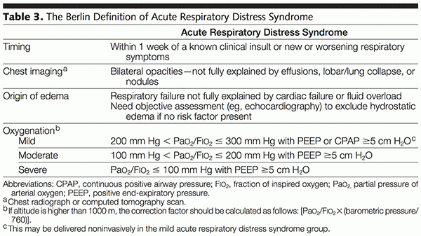
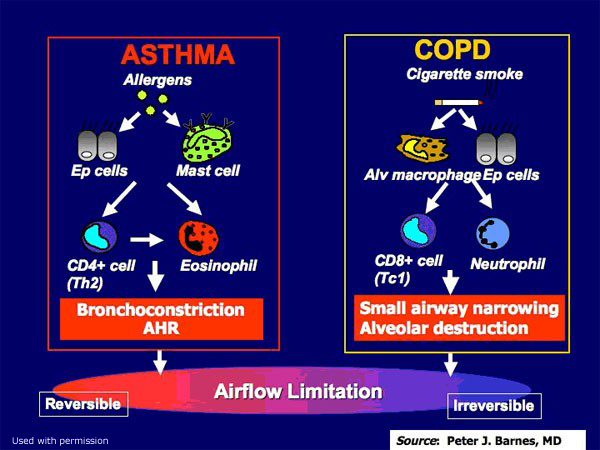
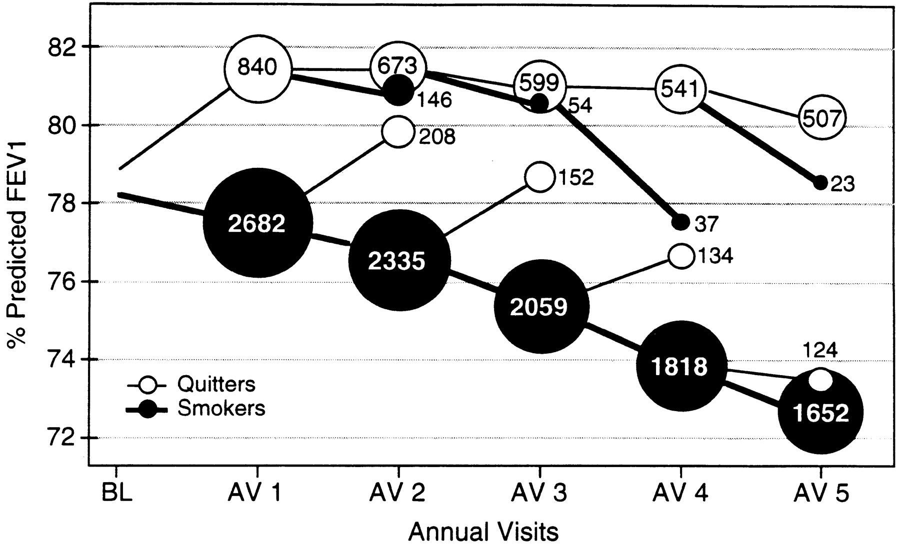
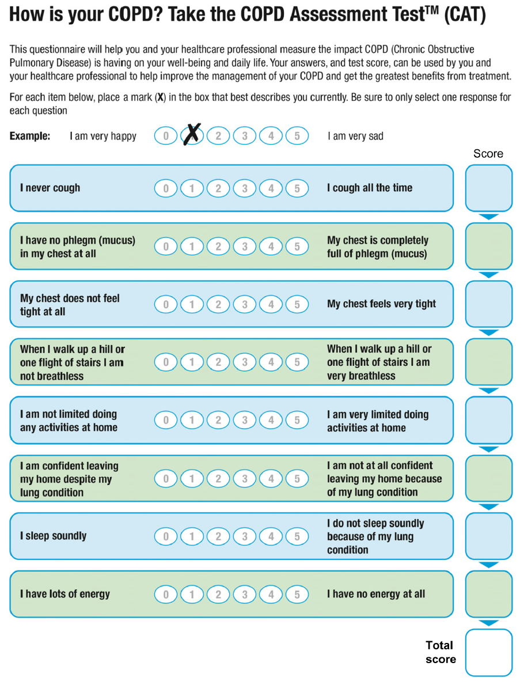
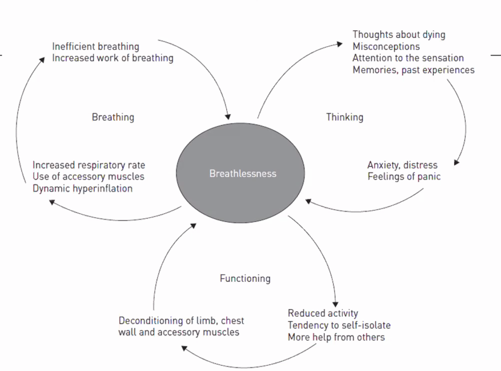

Respiratory
===========

[[TOC]]

- What's the difference between empyema and complicated parapneumonic effusions?
- How to assess VQ mismatch

  

General
-----------

### Respiratory Devices

#### CPAP for upper airway
Continuous positive airway pressure provides gentle pressure to prevent repetitive upper airway collapse/obstruction (eg, obstructive sleep apnea); it would not provide enough pressure to reexpand large segments of collapsed lung.

#### Mechanical Ventilation
Require endotracheal intubation to initiate mechanical ventilation.

**Complications**
- Right mainstem bronchus intubation would cause hypoxemia and elevated peak and plateau pressures due to the limited volume of the ventilated right lung 
- Positive pressure ventilation (eg, mechanical ventilation) poses the risk of pulmonary barotrauma, leading to alveolar rupture and pneumothorax formation.  Patients with COPD are at higher risk due to pre-existing pulmonary hyperinflation and the presence of bullae or blebs, which can rupture.
  - Severe chronic obstructive pulmonary disease (COPD) exacerbation (eg, wheezing, dyspnea, cough) requiring mechanical ventilation, developed abrupt-onset hypoxemia associated with elevated peak and plateau pressures (measured on the ventilator) and decreased right-sided breath sounds. 

### Transudative vs Exudative Effusion
- Transudative effusions are marked by low protein (eg, <3 g/dL).  Glucose and pH are usually normal.
- Exudative effusions are marked by elevated protein.

### Sounds of the Lungs

### Spirometry

Spirometry is the most commonly used office-based device for lung function testing. A spirometer is a hand-held device that can easily be used in the clinician's office by a patient with the assistance of a technician.

- How it works

  -   The patient is asked first to exhale completely, then to inhale deeply.

  -   Next, the patient is told to exhale rapidly into the device until all the air is exhausted from his lungs.

  These two steps measure the inspiratory and expiratory flow of air. A number of calculations can then be derived from these measurements. An individual's spirometry results are based on comparison to predicted values of a standardized, healthy population.

- Definitions

  -   Forced Vital Capacity (FVC) = total amount of air the patient can expel from the lungs after a full inspiration

  -   Forced Expiratory Volume - 1 second (FEV1) = amount of air the patient can expel after a full breath in one second

- Diagnosis

  - Post-bronchodilator FEV1-to-FVC ratio (FEV1/FVC) less than 70% (or less than the fifth percentile) with compatible symptoms and history, is diagnostic of COPD.

  - Significant reversibility is defined as an increase in FEV1 %

  - Further, the FEV1 impairment defines the level of COPD severity:

      FEV1 Impairment (Compared to Predicted)   Severity               Symptoms

    ----------------------------------------- ---------------------- --------------------------------------------------------------------

      \> 80%                                    Mild - GOLD 1          none
      50-79%                                    Moderate - GOLD 2      SOB on exertion
      30-49%                                    Severe - GOLD 3        SOB and frequent exacerbation
      \< 30%                                    Very severe - GOLD 4   significant reduction in QoL, exacerbation can be life-threatening

### Procedures

#### Endotracheal Tube

Repositioning the endotracheal tube is appropriate if chest x-ray reveals malpositioning (eg, tip in the right mainstem bronchus).  Intubation of the left mainstem bronchus would result in hypoxia and absent right-sided breath sounds

#### Talc pleurodesis 

obliterates the pleural space to prevent recurrence of frequent pleural effusion (eg, malignant effusion) or pneumothorax (eg, chronic obstructive pulmonary disease). It is not used for primary treatment. In addition, pleurodesis requires physical contact between the visceral and parietal pleurae, which is likely not present in this patient with a large air leak due to tracheobronchial injury.

### Tests and Studies

- arterial blood gas would provide information about the severity of respiratory compromise,

### Syndromes

#### ARDS

ARDS involves an inflammatory response that leads to capillary leakage and **diffuse pulmonary edema**.

- ARDS typically takes 6-72 hours (or longer) to evolve after the inciting event (while the inflammatory response builds)

## Frameworks

### Cough

Differentiating descriptors of cough

-   Dry: environmental irritant, asthma

-   Wet/productive: lower-respiratory infection

-   Barking: croup, subglottic disease, foreign body

-   Brassy or honking: habit cough, tracheitis

-   Paroxysmal: pertussis, chlamydia, mycoplasma, foreign body

-   Worse at night: asthma, sinusitis, allergic or vasomotor rhinitis (postnasal drip)

-   Disappears at night: habit cough

-   Associated with gagging or choking: gastroesophageal reflux disease

Review of systems clues for a school-aged child with cough

-   Change in voice: Dysphonia or hoarseness may suggest laryngeal irritation due to chronic rhinitis or gastroesophageal reflux.

-   Chest pain: Probe for evidence of gastrointestinal causes of cough, not cardiac conditions; true cardiac chest pain is rare in children. Alternatively, you could also ask the patient if she \"ever gets a bad taste in her mouth\" or \"if food ever comes back up.\" While rare, congestive heart failure, most commonly due to infectious myocarditis, can present in school-aged children with cough and wheezing and can easily be mistaken for a more common pulmonary condition, such as asthma or bronchitis.

-   Choking event: Although a foreign body aspiration is more likely in a toddler, otherwise healthy school-aged children and adults are still at a small risk for aspiration pneumonia secondary to inadvertently choking on food. Children with neurological impairment are at a significantly higher risk for aspiration, either from secretions (\"above\") or from refluxed gastric contents (\"below\").

-   Fever: Suggests an infectious etiology for cough, primarily pneumonia and sinusitis. Lobar pneumonia, particularly in the lower quadrants, may also present with abdominal pain mimicking appendicitis. The presentation of bacterial pneumonia is usually acute, rather than chronic.

-   Headaches: Frontal or orbital headaches may suggest a sinusitis, a common cause of persistent cough in children due to the associated post-nasal drip, which is often worse at night when the child is supine.

-   Sore throat: May suggest evidence of post-nasal drip and pharyngeal irritation due to allergies or sinusitis. (May be present in conjunction with nasal congestion, and/or a history of itchy, watery eyes.)

### Noisy Breathing

#### Wheezing

#### Stridor

### Hemoptysis

- TB
- Malignancy

Approach

1. History and physical to rule out other causes (e.g. oropharygnx, gastrointestinal
2. Then determine the severity of the bleed
   - For mild / moderate bleed do CXR, coagulation analysis, renal function, urinalysis, rheumatologica workup 
   - For massive bleeding, defined as >600ml/24 hr OR 100 ml/hr, secure airway, breathing and circulation, then proceed with the above workup if the bleeding stops, if not, skip to step 4
3. Do CT scan +/- bronchoscopy
4. Treat cause, Treat persistent bleeding with bronchoscopic interventions, embolization, or resection.

Initial management in hemoptysis involves establishing adequate patent airway, maintaining adequate ventilation and gas exchange, and ensuring hemodynamic stability. Patients should be placed with the bleeding lung in the dependent position (lateral position). Bronchoscopy is the procedure of choice to identify the site and attempt early therapeutic intervention.

 The greatest danger in massive hemoptysis is not exsanguination but asphyxiation due to the airway flooding with blood. Initial management involves establishing an **adequate patent airway**, maintaining adequate ventilation and gas exchange, and ensuring hemodynamic stability. The patient should be placed with the **bleeding lung in the dependent position** (lateral position) to avoid blood collection in the airways of the opposite lung.

 Endotracheal intubation should be performed to protect the airway in patients with hemoptysis who are hemodynamically unstable or have poor gas exchange, severe dyspnea, or massive hemoptysis. It is not indicated in this patient at this time.

Bronchoscopy should be performed to directly visualize and control the site of bleeding in patients with massive hemoptysis (>600 mL/day or 100 mL/hr). Bronchoscopy is the initial procedure of choice in such patients as it can localize the bleeding site, provide suctioning ability to improve visualization, and include other therapeutic interventions (eg, balloon tamponade, electrocautery).

Pulmonary arteriography should be performed when there is persistent bleeding and the initial bronchoscopy is unable to localize the source.  It can precisely identify the bleeding vessels and be used for therapeutic embolization to stop the bleeding.

Urgent thoracotomy and surgical intervention are reserved for patients with unilateral bleeding who continue to bleed despite initial bronchoscopy and/or pulmonary artery embolization.

### Solitary Pulmonary Nodule

A **solitary pulmonary nodule** (SPN) is defined by the following features:

- Rounded opacity
- ≤3 cm in diameter (>3 cm is considered a "mass")
- Surrounded by pulmonary parenchyma
- No associated lymph node enlargement

The size of an SPN strongly correlates with the chances of it being malignant. Nodules <0.6 cm are unlikely to be malignant and generally do not require follow-up; however, **nodules >0.8 cm** require **additional management or surveillance**.

In addition to size, other factors that influence the probability of an SPN being malignant include patient age, sex, **smoking history**, family history, location of the nodule in the lung, and radiographic appearance of the nodule (eg, regular versus **irregular borders**). Nodules >0.8 cm that are **intermediate or high probability for malignancy** (ie, ≥5% risk) based on these factors require tissue diagnosis with **biopsy or surgical excision**. This relatively large SPN with irregular borders in a 65-year-old patient with a significant smoking history has high malignant probability and should be biopsied or surgically excised.

For patients in whom the need for tissue diagnosis is unclear, positron emission tomography (PET) scan can be helpful. Nodules demonstrating high metabolic activity on PET scan are more likely malignant than benign and warrant biopsy or surgical excision.

Sputum cytology has low sensitivity for detecting malignancy and is generally not helpful in evaluating an SPN.

Surveillance with repeat CT scan in 3 months is appropriate for nodules >0.8 cm that are low probability for malignancy (eg, 1 cm nodule in a 50-year-old man with no smoking history). Solitary pulmonary nodules <0.6 cm are unlikely to be malignant, whereas those >0.8 cm require additional management or surveillance. Nodules that are intermediate or high probability for malignancy (ie, ≥5% probability) based on clinical factors (eg, nodule size, patient age, smoking history) should be biopsied or surgically excised.

### Sore Throat

Red flags

- Voice change, difficulty swallowing - not sensitive

- **Drooling** - late sign
- **Breathlessness**  - more breathless supine than sitting up, suggestive of epiglottis, supra glottis, next soft tissue infection

Investigation

- Soft tissue , lateral neck X-RAy 

### Hypoxemia

Hypoxemia can be caused by reduced inspired oxygen tension, hypoventilation, diffusion limitation, shunt, and V/Q mismatch. Hypoventilation is associated with a normal A-a gradient and respiratory acidosis.

This patient has respiratory acidosis evidenced by arterial blood gas values that show a decreased pH (<7.35) and a primary increase in PaCO2 (>40 mm Hg). High PaCO2 and low PaO2 levels are suggestive of alveolar hypoventilation, although an elevated PaCO2 alone, in the range of 50-80 mm Hg, is sufficient to make the diagnosis. Causes of alveolar hypoventilation and respiratory acidosis include the following:

- Pulmonary/thoracic diseases: Chronic obstructive pulmonary disease, obstructive sleep apnea, obesity hypoventilation, scoliosis
- Neuromuscular diseases: Myasthenia gravis, Lambert-Eaton syndrome, Guillain-Barré syndrome
- Drug-induced hypoventilation: Anesthetics, narcotics, sedatives
- Primary central nervous system dysfunction: Brainstem lesion, infection, stroke

In addition, the A-a gradient (PAO2 – PaO2) can help determine the specific cause of hypoxemia. The A-a gradient is a measure of oxygen transfer from the alveoli to the blood. The alveolar oxygen tension can be calculated using the following equation:

PAO2 = (FiO2 x [Patm – PH2O]) – (PaCO2/R)= (0.21 x [760-47]) – (59/0.8) = 76

Then, calculate the A-a gradient:

A-a gradient = PAO2 – PaO2 = 76 – 62 = 14

A normal A-a gradient is <15. Values increase with age, but an A-a gradient >30 is considered elevated regardless of age.

The A-a gradient is normal in patients with reduced inspired oxygen tension and hypoventilation.

Recent subdiaphragmatic surgery, narcotic pain medications, and obesity make this patient at risk for alveolar hypoventilation. The resultant respiratory acidosis confirms the hypoventilation (CO2 retention).

Pulmonary embolism, atelectasis, pleural effusion, and pulmonary edema cause V/Q mismatch. In V/Q mismatch, the A-a gradient is elevated. In all these conditions, there is a decrease in PaCO2 (respiratory alkalosis) due to compensatory tachypnea.

| **Causes of hypoxemia**          |                                              |                  |                                    |
| -------------------------------- | -------------------------------------------- | ---------------- | ---------------------------------- |
|                                  | **Examples**                                 | **A-a gradient** | **Corrects with supplemental O2?** |
| **Reduced PiO2**                 | High altitude                                | Normal           | Yes                                |
| **Hypoventilation**              | CNS depression, morbid obesity               | Normal           | Yes                                |
| **Diffusion limitation**         | Emphysema, ILD                               | Increased        | Yes                                |
| **V/Q mismatch\***               | Small PE, lobar pneumonia                    | Increased        | Yes                                |
| **Large intrapulmonary shunt**   | Diffuse pulmonary edema                      | Increased        | No                                 |
| **Large dead-space ventilation** | Massive PE, right-to-left intracardiac shunt | Increased        | No                                 |

*****Caused by localized dead-space ventilation and/or intrapulmonary shunting.

**A-a gradient** = alveolar-arterial oxygen gradient; **ILD** = interstitial lung disease; **PE** = pulmonary embolism; **PiO2** = partial pressure of inspired oxygen; **V/Q** = ventilation/perfusion ratio.

Respiratory Infections
---------------------------------------------

### Acute Bronchitis 急性支气管炎

Presentation

-   Productive cough lasting 1-3 weeks
-   Self-limited inflammation of the large airways in the lung characterized by cough.
-   Inflammation leads to excessive tracheobronchial mucus production sufficient to cause purulent sputum in half of patients.
-   Cause is usually viral.
-   Symptoms of acute bronchitis during the first few days are hard to distinguish from those of a URI. However, in acute bronchitis, coughing persists for more than five days.
-   People with bronchitis sometimes have rhonchi, sometimes they have scattered wheezes and sometimes they have a normal lung exam. Rhonchi are noises made with the large airways and are often due to mucus or inflammation in the airways.

Assessment

- Careful history & examination to rule out pneumonia & other serious illnesses
- Patient's understanding of causes & natural history of illness

Management

-   Ninety percent of acute bronchitis is viral and antibiotics aren't indicated.
-   Guidelines recommend supportive treatment e.g. of a beta2 agonist is recommended for patients who are wheezing, but not for those who are coughing only.
-   Patient Education
    -   Explain expected duration & self-limited course of illness
    -   Explain potential harm & lack of efficacy of antibiotics
    -   Refer to infection as a "cold" or "chest cold"
-   Symptomatic treatment: OTC (eg, guaifenesin, tea with honey) & prescription (eg, benzonatate) options
-   Consider delayed antibiotic prescription (ie, prescription to be filled only if no improvement occurs after predetermined time)

### Bronchiolitis

-   Caused by viruses such as respiratory syncytial virus (RSV).

-   Seen in young children with the incidence peaking at 6 months of age.

-   Often starts as a viral illness and progresses to wheezing, cough, dyspnea, and cyanosis.

-   History of recurrent or persistent pneumonia.

-   Infants require supportive treatment including oxygen if hypoxic, while they are recovering.

### Influenza

It is estimated that 15 to 42% of preschool and school age children are infected with influenza each year. While for many children the disease is self-limiting and they improve in two to five days, complications, serious illness and hospital stays are more common in children less than five years of age. Children less than two years of age are especially vulnerable.

- Presentation

  -   Abrupt onset of symptoms (differentiate from cold)

  -   Characterized by upper and lower respiratory tract symptoms accompanied by systemic symptoms such as myalgia, fever, headache, and weakness, sore throat, and cough; though children with influenza frequently present first with a headache, sore throat and generalized malaise before the upper respiratory symptoms of cough appear.

  -   Influenza is so abrupt that patients can often tell the precise time of onset.

  -   Outbreaks typically occur during the winter months.

  -   Presents in many ways, and headache can be the first symptom for some adults and children. Fever \>39$\circ$ C is often the first sign in younger children. However, older children can have a constellation of symptoms, and it can be difficult to determine if influenza is present. Very young children can present with febrile seizures.

  -   High fever of 102-104 F and chills are common, along with severe myalgias and headache.

  -   The influenza virus can cause upper and lower respiratory tract symptoms resulting in rhonchi being heard on the lung exam. Rhonchi are a result of the complications of influenza and are not one of its primary physical exam findings.

  -   Affects between 15 and 42% of preschool and school age children each year, children younger than two years of age have higher rates of complications and hospitalization.

- Diagnosis

  -   Nasopharyngeal swab

- Treatment

  -   Antivirals such as zanamivir, oseltamivir, amantadine, and rimantadine can decrease the duration of influenza symptoms by approximately 24 hours, but they are only recommended when given within the first 48 hours of illness.

  -   The only indications for starting antivirals for influenza after 48 hours of onset of illness are:

      -   if the patient has moderate to severe community acquired pneumonia with findings consistent with influenza

      -   if the patient is clinically worsening at the time of the initial outpatient visit

- Complication

  -   Otitis Media

  -   Lower respiratory tract infections including bronchitis, streptococcal pneumonia, and staphylococcal pneumonia

  -   Neurologic complications: aseptic meningitis, Guillain-Barre syndrome, febrile seizures

  -   Myositis

  -   Myocarditis

  Risk factors for complication

  -   chronic pulmonary disease including bronchopulmonary dysplasia, asthma, cystic fibrosis and conditions that affect the ability to handle respiratory secretions or increase the risk of aspiration.

  -   congenital heart disease,

  -   metabolic conditions (i.e. diabetes mellitus) chronic renal disease,

  -   immunosuppression

  -   children who are on long-term aspirin therapy, (i.e. Kawasaki's)

- Transmission\
  Direct transmission; airborne; and through hand-to-eye, hand-to-nose, or hand-to-mouth transmission, either from contaminated surfaces or from direct personal contact. Infected children are advised to stay out of school until most symptoms have improved and the child has been afebrile for 24 hours.

- Prevention\
  Infection control and immunization of high-risk groups, such as children, the elderly, health care workers, and people who have chronic illnesses such as asthma, diabetes, heart disease, or are immuno-compromised.

- Disease Course\
  The fever that comes with influenza lasts for three to five days. The cough and feeling tired can last longer; some people will have a cough and still feel tired about two weeks after they were initially sick.

### Viral Pneumonia

It can be caused by influenza (usually as part of a community outbreak in winter), respiratory syncytial virus in children or immunosuppressed individuals, and measles or varicella along with their characteristic rashes. Adenovirus, rhinovirus, and parainfluenza virus are also common causes.

Presentation

-   Often characterized by an atypical presentation, i.e., chills, fever, dry, nonproductive cough, and the predominance of extrapulmonary symptoms such as GI symptoms and arthralgias.

-   More common in children aged four months to five years.

### Streptococcus Pneumonia 肺炎

Presentation

-   Characterized by a temperature greater than 38 degrees C (100.4 degrees F).

-   Does not have prodromal symptoms such as rhinorrhea or myalgias, though myalgias can be seen in atypical or viral pneumonias.

-   Streptococcal pneumonia (also called pneumococcal pneumonia) often presents abruptly in children with a fever and sputum production.

-   Streptococcal pneumonia in other age groups may have an abrupt or gradual onset and the usual symptoms include pleuritic chest pain, fever, chills, and dyspnea. Cough is usually present, but may not be prominent. Approximately one half of patients with streptococcal pneumonia have an accompanying pleural effusion.

-   Crackles (formerly called rales) are a cardinal feature of pneumonia. Focal crackles in a febrile child without underlying lung disease is pneumonia until proven otherwise, though crackles will not be heard in all children with pneumonia.

-   Other examination findings suggestive of pneumonia include focal wheezing or whistling sounds and decreased breath sounds in one lung field.

treatment

-   Most streptococcal pneumonia can be treated using amoxicillin 90mg/kg/day divided in three dosages for 7 to 10 days. In children 3 months to adolescence, amoxicillin is the recommended first line agent.

### Atypical Pneumonia

-   The patient's age is a key factor in differentiating between typical and atypical pneumonia. Young adults are more prone to atypical causes, and very young and older persons are more predisposed to typical causes. Atypical organisms, such as Mycoplasma or Chlamydia pneumoniae, are more common in older children and adolescents.

-   In addition to the pneumonia symptoms observed in younger children, adolescents may have other symptoms such as headache, pleuritic chest pain, and vague abdominal pain. Vomiting, diarrhea, pharyngitis, and otalgia/otitis are other common symptoms.

-   In one study, patients with bacterial pneumonia were significantly more likely to present with pan-inspiratory crackles, whereas patients with atypical pneumonia were more likely to present with late inspiratory crackles.

Treatment

-   In school age children who have a clinical presentation consistent with atypical pneumonia macrolides such as azithromycin, 10mg/kg on day one followed by 5mg/kg on days two through five, should be used.

### Management of Pediatric Pneumonia

When community-acquired pneumonia is suspected, a chest x-ray is only indicated if the child is hypoxic or isn't responding to treatment. Note: all children that are admitted to the hospital for pneumonia should have a PA and lateral chest x-ray.

For uncomplicated pneumonia in children more than five years old, azithromycin is indicated because the prevalence of atypical pneumonia is higher. Azithromycin is better tolerated than some other macrolides and is easy to dose. Likewise, in children three months to five years, the first line treatment is amoxicillin because it covers streptococcal pneumonia infections that are most common in those children.

Amoxicillin clavulanate is another antibiotic that some physicians chose when treating pneumonia. Using high dose amoxicillin saturates the penicillin binding proteins and is the preferred antibiotic. If a child isn't getting better when they return to the office in 24 to 48 hours, change antibiotics.

L0.5inL1.5inL1.5inL1.5inL1.5in 0-3 wk & E. Coli, GBS, Listeria monocytogenes & Admit all infant & Ampicillin and gentamicin &\
3wk - 3mth & S. pneumo, Chlamydia, Adenovirus, Influenza, RSV, Parainfluenza & Admit if concern for bacterial pneumonia or if in respiratory distress & Ampicillin or penicillin G or ceftriaxone if the child isn't immunized or if there are resistant strains\
3mth - 5yrs & Chlamydia, Mycoplasma, S. Pneumoniae, Adenovirus, Influenza, Parainfluenza, Rhinovirus, RSV & Moderate to severe pneumonia (respiratory distress with oxygen sat $<$90%), hypoxia, RR $>$70, difficulty breathing, intermittent apnea, lack of family support and concern for follow-up, pneumonia caused on virulent pathogen \*e.g. MRSA) & Ampicillin or penicillin G, ceftriaxone if child isn't immunized or if there are resistant strains & Amoxicillin for 7 - 10 days\
5 year to adolescence & C. pneumoniae, M. pneumonia, S. pneumoniae & RR $>$50, hypoxic, in distress, lack of family support to care for them when ill & azithromycin & azithromycin\

### Croup / Bacterial trachitis

Presentation

-   With stridor

-   Usually in 1 - 3 year old

-   caused by parainfluenza.

-   Usually admited to peds if there is secondary bacterial infection

Imaging

-   Steeple sign classical of croup on CXR

### Tuberculosis

Tuberculosis can cause hemoptysis, cough, fatigue, and hilar lymphadenopathy but is unlikely to cause hypercalcemia or a hilar mass.

Tuberculosis typically has radiographic abnormalities (eg, patchy or nodular opacity, multiple nodules, cavity) involving the apical-posterior segments of the upper lobes of the lungs. 

Place patient in complete **respiratory isolation** to avoid further exposure to healthcare professionals and other individuals. Respiratory isolation should be continued until the diagnosis of tuberculosis can be confirmed or refuted by additional testing (eg, acid-fast bacilli smear and culture).

**Sputum analysis** to confirm the diagnosis of pulmonary tuberculosis.

### Infectious granulomas

 (eg, tuberculosis, histoplasmosis, atypical mycobacteria) are the most common cause of benign pulmonary nodules;  the nodules are typically multiple rather than solitary and, in the absence of active (symptomatic) disease (eg, fever, cough, weight loss), are relatively small (ie, <1 cm).

## Acute Respiratory Distress

## Pleural Effusion

Chest Growths and Cancers 
----------------

**Common manifestations of superior pulmonary sulcus tumor**

- Shoulder pain

- Horner syndrome (invasion of paravertebral sympathetic chain/stellate ganglion)

  - Ipsilateral ptosis, miosis, enophthalmos & anhidrosis

- Neurologic symptoms in the arm (invasion of C8-T2 nerves)

  - Weakness/atrophy of intrinsic hand muscles
  - Pain/paresthesia of 4th/5th digits & medial arm/forearm

- Supraclavicular lymphadenopathy

- Weight loss

  Superior pulmonary sulcus tumors usually arise in **smokers**; most cases are caused by adenocarcinoma or squamous cell carcinoma of the lung. Because the superior sulcus is located in the lung periphery, pulmonary symptoms such as dyspnea, hemoptysis, and cough do not generally occur until late in the disease course. Therefore, most patients come to clinical attention due to symptoms related to invasion of adjacent structures, including:

  - **Shoulder pain** (most common) due to invasion of the brachial plexus or adjacent bony structures
  - **Horner syndrome** (**miosis**, **ptosis**, anhidrosis) due to invasion of the paravertebral sympathetic chain or cervical ganglion
  - **Arm pain/hand weakness** in an ulnar distribution (eg, weakness in intrinsic hand muscles) due to invasion of the C8/T1 nerve roots

  Patients with suspected superior pulmonary sulcus tumors should undergo chest imaging (eg, chest x-ray) followed by staging imaging and biopsy if a lesion is found.

### Bronchogenic cyst 

A bronchogenic cyst may be seen on the AP chest x-ray.  The diagnosis is best made with a CT scan. Bronchogenic cysts are located in the middle mediastinum and are benign entities. Other middle mediastinal masses include: tracheal tumors, pericardial cysts, lymphoma, lymph node enlargement, and aortic aneurysms of the arch 

### Adenocarcinoma of the Lung

Most cases of adenocarcinoma of the lung are associated with peripheral lung lesions. Although hypercalcemia of malignancy can occur, it is usually due to osteolytic bone metastases (not PTHrP release). The presence of a central lesion and normal bone scan make adenocarcinoma less likely.

### Squamous Cell Carcinoma of the Lung

Squamous cell carcinoma of the lung usually arises in the central tracheobronchial tree (eg, hilar mass) and is often associated with cough, hemoptysis, dyspnea, and hypercalcemia (due to parathyroid hormone–related protein release). In contrast, small cell carcinoma of the lung causes other paraneoplastic syndromes (eg, ACTH production, syndrome of inappropriate antidiuretic hormone secretion), and adenocarcinoma of the lung typically causes peripheral lung lesions.

This patient's presentation is most consistent with lung cancer, with his extensive smoking history, hemoptysis, hypercalcemia, and hilar mass raising strong suspicion for **squamous cell carcinoma (SCC) of the lung**.

Most cases of SCC arise in the **central portion** of the lung, therefore manifesting as a **hilar mass** (due to squamous metaplasia → dysplasia → carcinoma-in-situ within the central tracheobronchial tree). Patients generally present with **cough**, dyspnea, and/or **hemoptysis** due to erosion of the airway mucosa. **Smoking** is the single greatest risk factor.

SCC is associated with **hypercalcemia** of malignancy (mnemonic: **sCa++mous**) due to the release of parathyroid hormone–related protein (**PTHrP**), which binds to the PTH receptor in bones and in the distal tubule of the kidney and increases calcium reabsorption. Common manifestations of hypercalcemia include anorexia/**constipation**, renal dysfunction (eg, nephrogenic diabetes insipidus **[polydipsia]**), and musculoskeletal pain.

Hypercalcemia of malignancy is generally due to either osteolytic bone metastases or the release of PTHrP. Differentiation can be made with whole-body bone scan and PTHrP testing. This patient's normal whole-body bone scan (no metastatic bone lesions) indicates that the source of his hypercalcemia is PTHrP.

### Small cell carcinoma

Neuroendocrine lung tumor that occurs almost exclusively in smokers.

Small cell carcinoma of the lung is not typically associated with PTHrP-induced hypercalcemia; it can sometimes cause other paraneoplastic syndromes such as ACTH production and syndrome of inappropriate antidiuretic hormone secretion.

## Structural Problems

### Foreign Body Aspiration

Wheezing, a common chief complaint in children, is primarily due to asthma or a viral illness. However, sudden-onset, **unilateral wheezing** that is **unresponsive to albuterol** raises suspicion for **foreign body (FB) aspiration**.

FB aspiration most commonly occurs in children age 1-3 due to **oral exploratory behavior** and **a relatively narrow airway diameter**. 

Following aspiration, patients classically develop **abrupt-onset respiratory distress** (eg, cough, dyspnea, hypoxia). The aspiration event may be unwitnessed, and a history of choking is not always present. In most cases, the object partially obstructs one of the bronchi, resulting in a **prolonged expiratory phase** due to air trapped distal to the obstruction. Wheezing and **decreased breath sounds** on the **affected side** are characteristic, and **hyperresonance** to percussion can occur over the hyperexpanded lung.

Although x-ray may be normal, findings suggestive of FB aspiration include **unilateral lung hyperinflation** with **mediastinal shift** toward the unaffected side, as seen in this patient. Atelectasis may be present in cases of complete bronchial obstruction. Most aspirated objects are radiolucent and therefore not identified on x-ray.

Management includes immediate rigid bronchoscopy to confirm the diagnosis and remove the object.

### Pneumothorax 

Can present abruptly with cough and hypoxia but does not typically cause wheezing. In addition, x-ray shows air without lung markings outside the pleural line with ipsilateral lung collapse (not hyperinflation).

This patient who was stabbed in the chest has respiratory distress and right-sided absent breath sounds accompanied by hypotension and distended neck veins. This is concerning for **tension pneumothorax** (TP). TP develops when accumulated air (due to injured lung tissue) causes **high intrathoracic pressure** that compresses the vena cava and **impedes cardiac venous return**, resulting in decreased cardiac output and hypotension. This occurs when a one-way valve has formed, allowing air to flow into the pleural space during inspiration but trapping it during expiration.

When TP is suspected, **decompression** (eg, needle thoracostomy) should be performed immediately to **prevent cardiovascular collapse**. Needle thoracostomy can be performed quickly and should **precede intubation**. This is an important exception to the typical order of establishing the airway first (ie, airway, breathing, circulation) but is necessary because positive-pressure ventilation (eg, intubation and mechanical ventilation) rapidly increases accumulated air and intrathoracic pressure, exacerbating TP and causing cardiovascular collapse **(Choice C)**. Following needle decompression, tube thoracostomy is required for definitive pneumothorax management.

Needle decompression precedes establishing a means of further ventilation in the specific case of TP. In addition, although cricothyroidotomy is sometimes used to establish an emergency airway (eg, upper airway obstruction or hemorrhage), this patient can likely undergo endotracheal intubation once the TP is decompressed.

Positive-pressure ventilation can rapidly exacerbate tension pneumothorax (TP) and cause cardiovascular collapse. Therefore, decompression (eg, needle thoracostomy) should be performed prior to intubation for patients with TP who also need airway protection—an important exception to the typical order.

Although cardiac tamponade (which can be treated by pericardiocentesis) may cause hypotension with distended neck veins, TP is more likely given this patient's absent right-sided breath sounds and normal (rather than muffled) heart sounds.

| **Pneumothorax**                                             |                                                              |                                                              |
| ------------------------------------------------------------ | ------------------------------------------------------------ | ------------------------------------------------------------ |
|                                                              | **Spontaneous pneumothorax**                                 | **Tension pneumothorax**                                     |
| **Associated features**                                      | Primary: no preceding event or lung disease; often thin, young menSecondary: underlying lung disease (eg, COPD, CF) | Life-threateningOften due to trauma or mechanical ventilation |
| **Signs & symptoms**                                         | Chest pain, dyspnea↓Breath sounds, ↓chest movementHyperresonant to percussion | Same as spontaneous plus:Hemodynamic instabilityTracheal deviation away from affected side |
| **Imaging**                                                  | Visceral pleural lineAbsent lung markings beyond pleural edge | Same as spontaneous plus:Contralateral mediastinal shiftIpsilateral hemidiaphragm flattening |
| **Management**                                               | Small (≤2 cm): observation & oxygen administrationLarge & stable: needle aspiration or chest tube | Urgent needle decompression or chest tube placement          |
| **CF** = cystic fibrosis; **COPD** = chronic obstructive pulmonary disease. |                                                              |                                                              |

Tension pneumothorax is a life-threatening condition caused by air within the pleural space that displaces mediastinal structures and compromises cardiopulmonary function. It is characterized by rapid-onset dyspnea, tachycardia, tachypnea, hypotension, and distension of the neck veins. Treatment should be initiated immediately with needle thoracostomy.

This patient has likely developed a **tension pneumothorax** (TP) as a complication of subclavian central venous catheter placement. TP is a life-threatening condition caused by air within the pleural space that displaces mediastinal structures and **compromises cardiopulmonary function**. It develops when injured tissue forms a one-way valve allowing air to enter the pleural space but preventing it from escaping naturally. TP is characterized by rapid-onset severe shortness of breath, tachycardia, tachypnea, hypotension, and distension of the neck veins due to superior vena cava compression. Positive-pressure ventilation can worsen TP by increasing intrathoracic pressures and intensifying the one-way valve effect. As the pleural cavity fills with air, increased pressure is required to initiate inspiratory flow.

TP is a clinical diagnosis, and decompression should be initiated immediately with **needle thoracostomy** (or, if available, direct emergency tube thoracostomy) in **hemodynamically unstable** patients. Classically, the second intercostal space in the midclavicular line has been used, but this fails in up to 50% of patients due to chest wall anatomy. Consequently, the fifth intercostal space in the midaxillary line is an excellent alternate site. Needle thoracostomy should be followed by an **emergency tube thoracostomy**.

n TP, an x-ray will show deviation of the trachea and mediastinum away from the affected side and increased lucency on the affected side of the chest. If there is diagnostic uncertainty or the patient is hemodynamically stable, radiographic confirmation should be considered. Otherwise, treatment of this emergent condition should not be delayed by waiting for radiographic studies.

### Pulmonary Edema

Fluid from pulmonary edema fills the alveoli and facilitates alveolar collapse. Alveolar ventilation (V) is zero, which results in an **extreme ventilation/perfusion (V/Q) mismatch** (right-to-left intrapulmonary shunting), causing hypoxemia. Because diffuse pulmonary edema prevents air from reaching the alveoli throughout much of the lungs (eg, >50%), an increase in the fraction of inspired O2 (FiO2) **does not correct the hypoxemia**.

**Increased alveolar-arterial (A-a) gradient** is another characteristic of pulmonary edema, as with any process causing V/Q mismatch or impaired diffusion across the A-a membrane. Finally, pulmonary edema also leads to fluid collection within the lung interstitium, resulting in stiffening of the lungs **(decreased lung compliance)**.

In contrast to hypoxemia due to diffuse pulmonary edema, hypoxemia due to localized intrapulmonary shunting (eg, lobar pneumonia, atelectasis, basilar pulmonary edema) typically does correct with increased FiO2 because only a portion of the lungs is affected and the normally ventilated alveoli compensate via increased O2 transfer.

- Do not use Venturi mask in APO patients because we don't need to tightly control the oxygen masks
- Diuresis: lasik, work 
- INGTN to temporize

### Obesity hypoventilation syndrome

Involves decreased compliance of the chest wall with impaired lung expansion. Although ventilation is decreased, diffusion and V/Q matching are intact; therefore, the A-a gradient is normal and increased FiO2 increases gas exchange and improves hypoxemia.

### Pulmonary Contusion

| **Pulmonary contusion**                        |                                                              |
| ---------------------------------------------- | ------------------------------------------------------------ |
| **Clinical features**                          | Present **<24 hours** after blunt thoracic traumaTachypnea, tachycardia, **hypoxia** |
| **Diagnosis**                                  | Rales or decreased breath soundsCT scan (most sensitive) or CXR with patchy, alveolar infiltrate **not restricted by anatomical borders** |
| **Management**                                 | Pain controlPulmonary hygiene (eg, incentive spirometry, chest PT)Supplemental oxygen & ventilatory support |
| **CXR** = chest x-ray; **PT** = physiotherapy. |                                                              |

Despite being restrained during the high-speed motor vehicle collision, this patient sustained **blunt thoracic trauma** with chest wall (and facial) bruising, likely from airbag impact. Blunt force to the chest wall can injure the underlying lung, resulting in **alveolar hemorrhage** and **edema**. Subsequent resuscitative fluid administration can exacerbate the alveolar edema, leading to progressive **dyspnea**, **tachypnea**, and **hypoxemia**. On CT scan, the alveolar edema can appear as ground-glass opacities in the lung adjacent to the affected chest wall (eg, anterior, peripheral lung in this patient); this pattern and distribution is classic for **pulmonary contusion**.

Pulmonary contusion is common (25%-35% of cases) following blunt thoracic trauma. Because clinically significant alveolar edema may take up to 24 hours to accumulate, pulmonary contusion may not be apparent immediately following an injury, and initial chest x-ray is often negative. CT scan of the chest is more sensitive and can identify the classic **irregular**, **nonlobular** (ie, not restricted by anatomic landmarks) **infiltrates**. Management involves pain control, pulmonary hygiene, and respiratory support.

Airway Problems
---------------
### Tracheal Stenosis 

### Tracheoesophageal Fistula

### Eosinophilic Bronchitis

-   Diangosis

    -   Normal spirometry, normal chest x-ray
-   Sputum eosinophilia on induced putum or bronchial wash obtained at bronchoscopy

### Hay Fever 枯草热

### Anaphylaxis

Anaphylaxis presents with acute-onset respiratory distress, angioedema/urticaria, and hypotension.  In addition, wheezing in anaphylaxis would be diffuse (ie, nonfocal).

### Asthma 气喘病

{#fig:asthmavscopd width="90%"}

Asthma is a chronic inflammatory disease of the airways that involves many cells, in particular: mast cells, eosinophils, T lymphocytes, macrophages, neutrophils, and epithelial cells. This chronic inflammation leads to airway hyperresponsiveness and limitation of airway flow (obstruction). The persistence of inflammation can lead to airway edema. Long-term inflammation can lead to airway remodeling and permanent loss of lung function.

Long terms effects of uncontrolled asthma include

-   Airway remodelling

-   Inflammation

-   Mucous hypersecretion

-   Airway smooth muscle hypertrophy

-   Angiogenesis

-   Subepithelial fibrosis

The most concerning long-term effect is less reversibility of the airway obstruction with medication so it will be more difficult to control the patient's asthma. This is why we want to treat patients early on with appropriate medication to control symptoms and prevent all of the long-term complications.

Patients with asthma have diffuse wheezing, prolonged expiratory phase, and bilateral hyperinflation on x-ray.

-   Management
    -   Patient education

    -   Removal of triggers (e.g., dust, pollen)

    -   Medications

    -   Immunotherapy

#### Co-morbid conditions

Conditions that may require treatment to improve control of asthma

-   Obesity / Overweight

-   Stress and depression

-   Rhinitis or sinusitis

-   Obstructive sleep apnea

-   GERD

It is also important to ask about aspirin allergy, as 21% of adults who have asthma have **aspirin-induced asthma** and should avoid NSAIDs.

#### Diagnosis

Three things are needed to diagnose asthma

1.  Episodic symptoms of airflow obstruction or hyperresposiveness are present

2.  THis obstructive airflow is at least partial reversible

3.  Alternative diagnosis are excluded

Objective assessments of pulmonary function are necessary for the diagnosis of asthma because history and physical are not reliable means of excluding other diagnoses or determining the extent of lung impairment.

#### Initial Management and Evaluation

According to the National Asthma Education and Prevention Program Expert Panel Report 3 (2007), there are four key tasks in an initial evaluation of asthma including:

1.  Classify asthma severity.

2.  Assess the patient's knowledge and skills for self-management.

3.  Identify and control environmental factors and comorbid conditions that may aggravate asthma.

4.  Offer appropriate medications.

People with asthma (as with other chronic lung conditions) should also receive pneumococcal polysaccharide (PPSV) vaccine.

Since inflammation is the primary pathologic mechanism in asthma, maintenance medication that reduces inflammation is first-line therapy.

If a patient is acutely wheezing, he or she may need quick-acting rescue medications that focus on bronchodilation and opening up the airways.

#### Asthma Medications

-   High dose inhaled corticosteroids are reserved for severe asthma as the risk of adverse effects increase with dose. Inhaled corticosteroids are well-tolerated and safe at the recommended doses. To reduce the potential adverse effects of inhaled corticosteroids: spacers are recommended to reduce local side effects, patients are advised to rinse their mouths and spit after inhalation, and consider adding a long-acting beta agonist to a low- or medium-dose of inhaled corticosteroid rather than using a higher dose of corticosteroid.

-   Oral corticosteroids suppress, control, and reverse airway inflammation. However, side effects with chronic administration include among other things: osteoporosis, adrenal suppression, growth suppression, dermal thinning, hypertension, Cushing's syndrome, cataracts, increased emotional lability, psychosis, peptic ulcer disease, atherosclerosis, aseptic necrosis of the bone, diabetes mellitus, and myopathy. Every effort, then, is given to minimizing systemic corticosteroid use and maximizing other modes of therapy. When oral corticosteroids are resorted to (for quick relief of symptoms in a moderate or severe asthma exacerbation), they are given for a short duration, and side effects are monitored. Multiple courses of oral systemic corticosteroids (more than three courses annually) should prompt re-evaluation of asthma management for the patient.

-   Leukotriene receptor antagonists may be used in conjunction with low-dose inhaled corticosteroids. A Cochrane review also revealed as additions to patients already on inhaled corticosteroids, a long-acting beta2 agonist inhaler improves symptoms and lung function, while preventing exacerbations, more effectively than leukotriene receptor antagonists. A recent study suggests the efficacy of using a leukotriene-receptor antagonist as monotherapy in the treatment of asthma, however, at this time, clinical guidelines for the management of asthma have not changed.

-   Theophylline may also be used in conjunction with low-dose inhaled corticosteroids, but is not used that often due to the difficulty in titrating the theophylline dose to the correct level. A meta-analysis demonstrated that salmeterol (a long-acting beta2 agonist) inhaler led to improved lung function and more symptom-free days and nights compared to theophylline.

-   There is an emerging role of anticholinergic medication in the treatment of asthma. A recent systematic review and meta-analysis (2018) confirmed that the addition of an anticholingeric medication to an inhaled corticosteroid lowered the risk for asthma exacerbations. However, current clinical guidelines for the management of asthma do not include this medication.

-   Generally, antibiotics are not needed in acute exacerbations or in chronic management of asthma. For example, one study noted no benefit of using azithromycin in acute exacerbations of asthma . However, another study demonstrated that for patients with persistent asthma symptoms despite appropriate medications, 500 mg azithromycin three times per week for 48 weeks resulted in fewer asthma exacerbations and an improved quality of life, though diarrhea was a common side-effect.

#### Monitoring

-   Use the Asthma Action Plan

    {width="\\textwidth"}

-   Peak flow: Good control (\>80%), Getting worse (50 - 79%), and (\<50%) -- percentages are in relationship to personal best

#### Example cases

-   A 40-year-old male presents to the clinic with dry cough and wheezing for the past two days. He states that his symptoms began two days ago with a headache for which he took aspirin. He denies fever, but does report some continued shortness of breath. He is a smoker but only smokes 1-2 cigarettes a day for about six months. Physical exam is negative except for bilateral wheezing and erythema on the face. What is the most likely diagnosis? Aspirin-induced asthma

-   A 15-year-old female with a history of allergic rhinitis presents to the clinic with a five day history of productive cough and wheezing that is worse at night. She denies any shortness of breath, chest pain, or fever. The patient states that she has had similar symptoms in the past, especially when seasons change. The only reported past medical history is atopic dermatitis which is well-controlled with an over-the-counter steroid cream. What is the best next step? Because the patient is symptomatic and wheezing, she needs to be treated with a medication to control her symptoms and treat her exacerbation. A short acting beta-agonist and short course of oral steroids do just that. After controlling her symptoms and treating her exacerbation, a more in-depth interview needs to be performed around the asthma symptoms and other ancillary tests need to be ordered and interpreted including a chest x-ray and pulmonary function test. Then, a decision can be made regarding daily controller inhalers (inhaled corticosteroids, chromolyn, etc).

-   An 18-year-old non-smoking male comes to the clinic with cough, chest tightness, and difficulty breathing. His past medical history is positive only for allergic rhinitis as well as an undiagnosed chronic cough primarily at night since he was 4 years old. He has no past surgical history and no recent travel. On physical exam, you notice the patient appears in mild distress, has hunched shoulders, is using accessory muscles during respiration, and is only able to talk in two to three word sentences. His vitals are: Pulse 125/min, O2 sat 88%, BP 100/70 mmHg. On auscultation, you hear wheezing on inspiration and expiration throughout both lungs. You also notice a prolonged expiratory phase. What is the most likely diagnosis? Severe Asthma Excerbation.

-   A 28-year-old male comes to the Emergency Department with shortness of breath, cough and wheezing for the last 4 hours. He states that he was diagnosed with asthma recently, and is currently using inhaled corticosteroid with a long acting B2-agonist daily to control his symptoms. His RR is 34/min; Temp: 98.8 degrees F; O2sat: 88%; BP: 130/85 mmHg. What treatment should be given to this patient first? Oxygen

### COPD 慢性阻塞性肺疾病 - Chronic Bronchitis 支气管炎 and Emphysema 肺气肿

COPD encompasses both chronic bronchitis and emphysema and is characterized by airflow limitation that is progressive and not fully reversible with bronchodilators. Chronic bronchitis presents with productive cough for at least three months for the past two years. While the duration of illness provides a clinical distinction between acute and chronic bronchitis, the actual mechanisms and pathophysiology also probably differ between the two. Chronic bronchitis causes long-term inflammation that can lead to irreversible structural changes.

- Epidemiology
  While it is currently estimated by the World Health Organization to be the 12th most common cause of morbidity and the fourth most common cause of death worldwide, COPD is set to become the fifth most common cause of morbidity and third most common cause of death by 2020. Almost 15.7 million Americans are diagnosed with COPD, yet an additional 12 million Americans may have COPD and remain undiagnosed.

- Presentation

  -   Predictors: Smoking more than 40 pack-years, Self-reported history of chronic obstructive airway disease, Maximum laryngeal height of 4 cm or less, and Age at least 45 years

- Physical

  -   Increased anteroposterior (AP) diameter of the chest

  -   Decreased diaphragmatic excursion

  -   Wheezing (often end-expiratory)

  -   Prolonged expiratory phase

- Diagnosis

  -   A clinical diagnosis of COPD should be considered in any middle-aged or older adult who has: dyspnea, chronic cough or sputum production, or a history of tobacco use. The diagnosis should be confirmed by spirometry.

  -   Pulmonary function testing (PFT) is the gold standard for diagnosing COPD. In pulmonary function testing, either a FEV1/FVC ratio less than the 5th percentile, or less than 70%, confirms a diagnosis of COPD.

  -   The current literature doesn't support the use of chest x-ray to rule in or out COPD, but some studies suggest that a chest x-ray might be helpful for finding other causes of dyspnea. The current guideline suggests using a CXR to rule out other causes of dyspnea

- Management:

  - Smoking cessation is single-most important treatment strategy for COPD. Although it sounds logical to have the patient decrease smoking, complete abstinence has been shown overall to have better quit rates than cutting down. Major improvement is seen in the first year after smoking cessation. Some structured smoking cessation programs, however, have had success with cutting down. Assess your patient's readiness to quit smoking, recommend that he stop smoking, and give him information on available smoking-cessation programs.

    {#fig:copd-smoking}

    Start the discussion by saying \"I would like to switch gears, and talk about what you can do to keep the COPD from getting worse\"

  - Medications
    All symptomatic patients with COPD should be prescribed a **short-acting bronchodilator (e.g., albuterol)** on an as-needed basis. Note potential side effects tachycardia, exaggerated somatic tremor, and hypokalemia (especially with concurrent use of thiazide diuretics). If symptoms are still inadequately controlled, a daily dose of **long-acting bronchodilator** should be added. The choice between beta-2-agonist, anticholinergic, theophylline, or combination therapy depends on availability and individual response in terms of symptom relief and side effects. I can use the GOLD groups for initiating management:

    | Exacerabtion               | CAT score \< 10 or mMRC 0-1                            | CAT score \>= 10, or mMRC \>= 2                              |
    | -------------------------- | ------------------------------------------------------ | ------------------------------------------------------------ |
    | 0 to 1 prior exacerbations | Group A Initial: short acting beta agonist (SABA) | Group B Add **long acting** beta agonist (LABA) or long acting anti-muscarinic antagonist (LAMA); if symptoms worsen, give both |
    | \>= 2 prior exacerbations  | Group C Add inhaled corticosteroids (ICS)          | Group D In symptomatic COPD patients whose FEV1 is \< 50% of predicted and severity of dyspnea and exacerbations is high, it is recommended that inhaled corticosteroids (ICS) be added to LABA bronchodilator treatment and/or LAMA. The addition of a glucocorticoid may increase the risk of pneumonia. **Roflumilast**, a Phosphodiesterase-4 inhibitor, can be substituted or added to the LAMA/LABA/ICS combinations. A **SABA, ipratropium**, or their combination can be used as needed. The cost of many of these inhalers can be a barrier to use. **Oxygen therapy** is indicated if room air oxygen saturations \< 88%. |

  - CAT scoring

    

  - Prevent exacerbations, most commonly due to infections: Influenza and pneumococcal vaccines are recommended for adults with COPD. If the patient is due for a tetanus booster, then he should receive TdaP, which contains Tetanus toxoid, diphtheria, and acellular pertussis.

    -   Influenza vaccine reduces serious illness and death in patients with COPD by about 50%.

    -   Reduces the incidence of community-acquired pneumonia in patients \< 65 years old with COPD and an FEV1 \< 40% predicted.

  - Other notes

    -   Combining bronchodilators of different pharmacological classes may improve efficacy and decrease the risk of side effects compared to increasing the dose of a single bronchodilator.

    -   Systemic glucocorticoids, such as prednisone, may be useful during an acute COPD exacerbation. And systemic glucocorticoids may improve lung function for about 20 percent of patients with stable COPD. However, the risks of chronic systemic steroid use outweighs the benefits -- as prednisone, even at a low dose, can cause serious side effects, such as osteoporosis, suppression of the hypothalamus-pituitary-adrenal axis, diabetes, cataracts, and necrosis of the femoral head. Perhaps the most relevant side effect of long-term treatment with systemic glucocorticoids is steroid myopathy -- contributing to muscle weakness, decreased functionality, and respiratory failure in advanced COPD.

  - Patient education

    -   It will be important for you to return for regular checkups -just like we need to monitor folks with heart disease with regular visits to check their blood pressure, I would like to perform the pulmonary function tests you did today every six months to a year so we can determine how well you are responding to treatment and if your disease is progressing. And we will also want to keep track of your nutrition using what we call the body mass index (BMI), as good nutrition is especially important in COPD.

    -   There's no cure for COPD. And it's impossible to undo damage to your lungs. But your treatments can control symptoms, reduce the risk of complications and improve your ability to lead an active life. Difficulty breathing can keep you from doing activities that you enjoy. And it can be very difficult to deal with a disease that is progressive and incurable. Please talk to me if you feel sad or helpless or think that you may be experiencing depression.

    -   In the future, if you are interested and you're having more trouble with COPD, I can send you to a pulmonary rehabilitation program to help with your breathing. These are programs that typically combine education, exercise training, nutrition advice and counseling. You would work with physical therapists, respiratory therapists, exercise specialists and dietitians. Again, I don't think you need this help right now. But I want you to know there's a whole team of folks ready to help you as you need help.

    -   A patient should seek emergency medical care if the usual medications are not working and he or she finds:

        -   It is unusually hard to walk or talk (such as difficulty completing a sentence)

- The heart is beating very fast or irregularly
      -   Lips or fingernails are gray or blue, or

- Breathing is fast and hard, even when medication is being used

#### Emphysema

Emphysema involves destruction of alveolar walls and increased lung compliance. 

#### Managing Dyspnea in COPD

**Dyspnea: Uncomfortable breathing, or difficulty breathing in and out.**

- When you can't breathe, you can't breathe. 
- Get anxious about missing medicine. 
- Having to give up work, keep warm. 
- Rely more and more on family to help. Significantly reduced lung function. Some patients accept it as a part of their disease and do not discuss it with their physicians. 

It is important to manage breathlessness in COPD. Reduce tiredness, depression, prevent exacerbation.

**Impact of Breathlessness**

**Pathophysiology**

- Afferent signals to the sensory cortex ("demand to breath")
- Efferent signal from the motor cortex to ventilatory muscles ("ability to breath")
- "Corollary discharge" with signal copy from motor cortex to the sensory cortex
- Mismatch between demand to breathe and ability to breathe triggers the sensation of effort or dyspnea
- Psychological factors e.g. anxiety, depression can magnify this perception

**Assessment of Breathlessness**

1. quantify severity: how breathless are you? 0 - 10, mild, moderate, or severe,
2. impact on function (MRC dyspnea scale) 1 to 5 from no trouble, feeling troubled, walks slower than normal people, stops for breath after a few minutes,  to problem with ADL
3. Impact on the person

**Management of Breathlessness**

Consider if the disease is modifiable?

1. If yes, allerviate symptoms through disease specific interventions

2. If no, (if di) alleviate symptoms through global / systemic interventions

   - Non-pharmacological (more evidence)

     - Positioning
     - Learning to pace the day: how to expend their limited amount of energy
     - Control breathing: pursed lip breathing, learn efficient breathing pattern
     - Anxiety management
     - Mindfulness
     - Walking and functional aids
     - Fan: stimulate facial and nasopharyngeal receptors
     - Alters mechano-receptor afferents and decreases discomfort from mechanical load -> decreases dyspnea sensation

   - Pharmacological

     - Opioid

       - Blunts responses to hypercapnic and hypoxic drives both centrally and peripherally
       - Modifies central perception of breathlessness through receptors distributed widely through the limbic system
       - Reduces the afferent-efferent dissociation and thus reducing the sensation of effort / dyspnea

       Some evidence for benefit to reduce breathlessness severity, may lead to short term increase in exercise capacity, no difference in oximetry or blood gases and no increased risk of admissions or mortality when used at low doses.

     - Oxygen

       - PO2 < 55% start long term oxygen therapy

       - indicated for hypoxemic patients

       - NOT indicated for non-hypoxic patients; in these, just use fan.

         

#### COPD Exacerbations

An exacerbation of COPD is defined as an event in the natural course of the disease characterized by a change in the patient's baseline dyspnea, cough, and/or sputum that is beyond normal day-to-day variations and is acute in onset. An exacerbation may warrant a change in regular medication in a patient with underlying COPD. The most common causes of an exacerbation are infection of the tracheobronchial tree and air pollution, but the cause of about a third of severe exacerbations cannot be identified.

- Clinical Feature

  - sudden worsening of their symptoms beyond day to day variation
  - feel like being underwater, and desperate. 
  - after each attack, something is taken away from me
  - it's painful
  - Associated with faster disease progression and decreased quality of life
  - Patients with frequent exacerbation: cough - embarassed, inconvenience

- Management

  -   Improve respiratory status with some type of mechanical ventilation such as nasal cannula, facemask, bipap, or even intubation if indicated by worsening of respiratory status such as decreasing oxygen saturation, confusion and drowsiness.

  -   Inhaled bronchodilators (particularly inhaled beta 2-agonists with or without anticholinergics) and oral glucocorticosteroids are effective treatments for exacerbations of COPD.

  -   Antibiotics should be given to

      -   Patients with exacerbations of COPD with the following three cardinal symptoms: increased dyspnea, increased sputum volume, and increased sputum purulence

      -   Patients with exacerbations of COPD with two of the cardinal symptoms, if increased purulence of sputum is one of the two symptoms

      -   Patients with a severe exacerbation of COPD that requires mechanical ventilation (invasive or noninvasive).

  -   For those patients more severely ill who might require hospitalization, noninvasive mechanical ventilation in exacerbations improves respiratory acidosis; increases pH; decreases the need for endotracheal intubation; and reduces PaCO2, respiratory rate, severity of breathlessness, the length of hospital stay, and mortality.

  -   Medications and education to help prevent future exacerbations should be considered as part of follow-up, because exacerbations affect the quality of life and prognosis of patients with COPD.

- Complication

  -   Heart Failure - Cor Pulmonale\
      The proposed mechanism for COPD leading to heart failure is that chronic hypoxia (1) causes pulmonary vasoconstriction (2), which increases blood pressure in the pulmonary vessels. This elevation in blood pressure causes permanent damage to the vessel walls and leads to irreversible hypertension (3). The right heart eventually fails (4) because the pump cannot sustain flow effectively against this pressure. Right heart failure leads to an increase in preload, with peripheral edema and increased jugular venous distention.

#### Case Study

Md A. 60 year old gentleman

COPD GOLD 

Diffuse bronchial obstruction is seen in an acute COPD exacerbation due to increased production of purulent sputum. Lung examination reveals diffuse rhonchi and wheezing, and symptoms tend to occur more gradually.

-   Diagnosis

    -   Spirometry: For differentiating from asthma and for classifying the severity of the disease.

          Severity      | % predicted FEV1
          |---|---
          Mild          | >80
          Moderate      | 50 - 79
          Severe        | 30 - 49
          Very Severe   | < 30

#### COPD exacerbation
-  Endotracheal intubation was performed and mechanical ventilation initiated
-  Inhaled bronchodilators, systemic glucocorticoids, and empiric antibiotics were administered. 

### Post-infectious Cough

### Bronchogenic Carcinoma

### Bronchopleural Fistulas 
Often occur with malignancy or trauma, or after surgical procedures involving the bronchi (eg, pneumonectomy).  They can cause empyemas, but there is usually radiographic evidence of air in the pleural space as well.

### Atelectasis

rapid bronchial occlusion resulting in extensive atelectasis can result in similar symptoms (eg, chest pain, dyspnea, hypoxia), this patient does not have risk factors for obstructive atelectasis such as a history of foreign body aspiration, malignancy, or severe pneumonia (mucus plug). Moreover, extensive atelectasis frequently causes tracheal deviation toward the collapsed lung.

#### Postoperative Atelectasis

Thoracic or abdominal pain following surgery can restrict chest expansion and lead to low tidal volume (TV) respiration with basilar alveolar collapse. Pharyngeal secretions, airway tissue edema, and residual anesthetic effects can also contribute. Postoperative atelectasis most commonly manifests on day 2 following surgery and may be seen up to postoperative day 5.

Atelectasis causes **hypoxemia** (ie, low PaO2) due to localized intrapulmonary shunting, leading to ventilation-perfusion mismatch. This triggers an increased respiratory rate (RR), which more than compensates for the reduction in tidal volume (TV). Because minute ventilation = TV × RR, there is an increase in minute ventilation (ie, **hyperventilation**), which leads to **decreased PaCO****2** and consequently **increased pH** (primary **respiratory alkalosis**). In patients without underlying chronic lung disease, any cause of significant ventilation-perfusion mismatch (eg, pulmonary embolism, pneumonia) usually presents similarly with hypoxemia and primary respiratory alkalosis.

Lung Parenchyma
---------------

### Pneumothorax
Pneumothorax, or the presence of air within the pleural space.  Pneumothoraxes may occur spontaneously or secondary to underlying lung disease, trauma, or iatrogenic injury.  

- Large pneumothorax often demonstrate abrupt-onset tachycardia, tachypnea, hypoxemia, and decreased or absent breath sounds on the affected side.  
- In patients who are mechanically venilated, the collapsed lung, receiving a relatively stable volume of air from the ventilator, results in increased peak pressure (a measure of increased resistance to air flow from the ventilator) and increased plateau pressure (a measure of the lung's decreased ability to expand [compliance])
- Management of pneumothorax involves placement of a chest tube, which allows reexpansion of the lung.

Pneumothorax typically presents with sudden pleuritic chest pain and shortness of breath.  Chest x-ray reveals a radiolucent (black) region of extrapulmonary air.  This patient has fever and upper respiratory symptoms that developed over days (and an effusion).

- CXR: deep sulcus sign
- U/S: sliding lung sign - pleural adjacent to the lung
- ECG: S1Q3T3
  - The **S1Q3T3** pattern describes the presence of an S wave in lead I, a Q wave in lead III, and an inverted T wave in lead III. This pattern was first described by McGinn and White in 1935, and **is** fairly well known as an indication of acute pulmonary embolism.

| Feature                 | Spontaneous Pneumothorax                                     | Tension Pneumothorax                                         |
| ----------------------- | ------------------------------------------------------------ | ------------------------------------------------------------ |
| **Associated features** | Primary: no preceding event or lung disease; often thin, young men Secondary: underlying lung disease (eg, COPD, CF) | Life-threatening;  Often due to trauma or mechanical ventilation |
| **Signs & symptoms**    | Chest pain, dyspnea ↓Breath sounds, ↓chest movement Hyperresonant to percussion | Same as spontaneous plus: Hemodynamic instability Tracheal deviation away from affected side |
| **Imaging**             | Visceral pleural line Absent lung markings beyond pleural edge | Same as spontaneous plus: Contralateral mediastinal shift Ipsilateral hemidiaphragm flattening |
| **Management**          | Small (≤2 cm): observation & oxygen administration Large & stable: needle aspiration or chest tube | Urgent needle decompression or chest tube placement          |

#### Primary spontaneous pneumothorax

PSP occurs in patients without a history of lung disease and is most common in **tall, thin men** in their early 20s. Other risk factors include smoking, Marfan syndrome, and thoracic endometriosis. PSP occurs due to rupture of subpleural blebs and commonly develops while patients are at rest. Clinical manifestations include dyspnea, hypoxemia, reduced chest excursion and breath sounds on the affected side, and hyperresonance to percussion. Diagnosis is confirmed by identifying a visceral pleural line on chest x-ray with absent lung marking beyond the line.

**Management**

The management of PSP depends on the size of the lesion and the clinical status of the patient. Radiographically, pneumothoraces are categorized as **small (≤2 cm apicopleural distance)** or large. 

- **Small pneumothoraces** in clinically stable patients, such as this patient, can be managed with observation and **supplemental oxygen** (regardless of oxygen saturation), which enhances the speed of resorption. 
  - Reduce nitrogen content, create diffusion gradient for pleural cavity into the lung.
  - No swimming, no diving, no air travel and strenuous activity for at least 6 months
  - Return advice: 
- **Stable patients with large pneumothoraces** should undergo **needle decompression** with a large-bore needle (eg, 14- to 18-gauge) inserted in the second or third intercostal space in the midclavicular line or at the fifth intercostal space in the mid or anterior axillary. 
  - Keep patient in the ED for observation
  - Repeat x-ray; after chest tube, repeat x ray right away; 
  - Once attach to chest tube and attach Hemlich valve
  - Repeat 6 - 8 hours later / prior to discharge
  - If the pneumothorax resolves in ED, still leave the chest tube in and get early respiratory referral?
- Patients who are **hemodynamically unstable** should undergo emergent placement of a **tube thoracostomy**. If tube thoracostomy is not available or will be delayed, urgent needle decompression can be performed.

If the lung fails to adequately re-expand (eg, <90% expansion) and a persistent air leak is present, placement of a one-way valve, creation of a blood patch, or video-assisted thoracoscopic surgery (VATS) can be used. For patients with recurrence, VATS pleurodesis or chemical (eg, tetracycline derivative, talc) pleurodesis can be performed.

- Heimlich valve (small one way valve) attached to end of chest tube before discharging patient. Do not let water come in; do not seal off, make sure it is not wet. Repeat x-ray with respiratory medicine in 1 week and remove chest tube. 
- Patient can be discharged with a chest tube and the Heimlich valve

#### Secondary Pneumothorax

Pneumothorax in the presence of a disease lung.

Causes

- COPD, bronchiectasis

Management

- Actively consider inserting chest tube even if the pneumothorax is small
- 

#### Loculated Pneumothorax

Chest CT scan should be done for a loculated pneumothorax.

#### Post-op Pneumothorax

### Sarcoidosis

Sarcoidosis can cause hypercalcemia, most patients have bilateral hilar lymphadenopathy

Ddx lung cancer: usually unilateral hilar mass. In addition, this patient's age and smoking history make lung cancer more likely.

### Pneumonia

#### Aspiration Syndromes

| Features | Pneumonia | Pneumonitis
|----|---|---
Pathophysiology | Lung parenchyma infection   Aspiration of upper airway or stomach microbes (anaerobes) | Lung parenchyma inflammation   Aspiration of gastric acid with direct tissue injury
Timing |   days after aspiration event |  hours after aspiration event
Symptoms | Fever, cough, ↑ sputum | Range from no symptoms to nonproductive cough, ↓ O2, respiratory distress
CXR | infiltrate in dependent lung segment (classically RLL) |CXR infiltrates (one or both lower lobes) 
Prognosis | Can progress to abscess | resolve without antibiotics
Management | Antibiotics: clindamycin or beta-lactam & beta-lactamase inhibitor | Supportive (no antibiotics) 

#### Tuberculosis
 Tuberculosis reactivation can lead to a cavitary lung lesion, subacute systemic symptoms, and leukocytosis. Lung lesions tend to occur in well aerated upper lobes.

#### Pulmonary aspergillosis 
It is seen primarily in immunocompromised patients and presents with fever, pleuritic pain, and hemoptysis.  Imaging typically reveals nodules with surrounding ground-glass infiltrates (ie, halo sign).

####  Histoplasma capsulatum CAP
Histoplasma capsulatum is endemic to the Ohio and Mississippi River valleys.  It is a common cause of community-acquired pneumonia in these regions and frequently presents with productive cough and subacute systemic symptoms.  Chest x-ray usually reveals a lobar pulmonary infiltrate and hilar/mediastinal lymphadenopathy; cavitation very rarely occurs.

#### Pneumocystis jiroveci pneumonia 

is common in patients with HIV with a CD4 count <200/mm3.  Symptoms (eg, shortness of breath, nonproductive cough, fever) typically arise over several weeks.  Chest x-ray can be normal but often reveals diffuse bilateral interstitial or alveolar infiltrates, not a large, unilateral effusion.

### Interstitial Lung Disease

Interstitial lung disease involves stiffening of the alveolar walls and decreased lung compliance. 

hypoxemia results largely from impaired diffusion of O2 across the disrupted A-a membrane as well as some V/Q mismatching. Because alveolar ventilation is generally intact, increased FiO2 usually improves the hypoxemia.

### Pneumonia Complications 

#### Lung Abscess
Lung abscess is usually due to the aspiration of oropharyngeal anaerobic bacteria.  Patients with dysphagia or episodes of impaired consciousness (eg, seizures, drug or alcohol abuse) are at high risk.  Symptoms include subacute fever, night sweats, weight loss, and cough with putrid sputum.  X-ray reveals cavitary infiltrates, often with air-fluid levels.

Pneumonitis → pneumonia → abscess/empyema

Risks
- Parkinson disease is frequently associated with significant swallowing dysfunction due to loss of dopaminergic neurons that control the striated muscles in the oral cavity, pharynx, and esophagus. Coughing during eating (due to microaspiration of food particles) is often an important clue; as dysphagia worsens, patients are at very high risk for aspiration pneumonia with or without lung abscess.

Clinical Features
- Subacute fever
- Cough with foul-smelling sputum
- Systemic manifestations: night sweats, weight loss, malaise
- Lab: leukocytosis and signs of chronic inflammation (anemia of chronic diease, thrombocytosis)

Diagnosis
- CXR shows cavitary infiltrates with air-fluid levels on dependent portion of the lung
  - In patients often lying down
    - Superior segment of a lower lobe
    - Posterior segment of an upper lobe
- Cultures rarely useful

Treatment
- Ampicillin-sulbactam, imipenem, meropenem
- Alternate: clindamycin

This patient with a history of alcohol abuse has cough productive of foul-smelling sputum, fever, leukocytosis, and a cavitary lung infiltrate, raising strong suspicion for aspiration pneumonia with lung abscess.  Most cases are caused by the aspiration of oropharyngeal anaerobic bacteria (eg, Peptostreptococcus, Fusobacterium) in the setting of dysphagia or impaired consciousness (eg, due to alcohol abuse or seizures).  Those with poor dentition or gingival disease are at greatest risk.

Because anaerobic bacteria grow slowly, manifestations generally arise over days or weeks.  Common symptoms include fever, night sweats, weight loss, and cough with foul-smelling sputum.  Hyponatremia may be present due to infection-induced antidiuretic hormone secretion.  Chest x-ray and CT scan typically reveal cavitary infiltrates, often with air-fluid levels in the superior lower lobe or posterior upper lobe (sections that are dependent with recumbency).

Anaerobic bacteria are difficult to isolate on culture.  Therefore, patients with suspicious symptoms generally receive empiric antibiotics with an agent that has good pulmonary penetration and efficacy against anaerobes.  Ampicillin-sulbactam is considered first-line therapy.  Clindamycin is used less often than in the past due to the risk of Clostridioides (formerly Clostridium) difficile infection and increasing resistance.  A prolonged course is indicated; surgical intervention (eg, pneumonectomy, lobectomy) may be required in the rare cases that do not improve with antibiotic therapy.

Differentials
- Pulmonary aspergillosis is seen primarily in immunocompromised patients and presents with fever, pleuritic pain, and hemoptysis.  Imaging typically reveals nodules with surrounding ground-glass infiltrates (ie, halo sign), not consolidation with cavitation.
-  Squamous cell carcinoma of the lung may present with a cavitary lung lesion, weight loss, and hyponatremia; however, fever, leukocytosis, and a short duration of symptoms would be uncommon
-  Aspiration of gastric contents can result in chemical pneumonitis.  Symptoms typically arise within hours (not a week) and include significant dyspnea but minimal fever.
-  Homeless individuals are at increased risk for reactivation tuberculosis, which can cause fever and cavitary lung lesions, but symptoms are usually more chronic.  Nontuberculous mycobacteria (eg, Mycobacterium avium complex) can also cause cavitary lung disease, but this is more common in older patients with underlying chronic obstructive pulmonary disease or immune suppression.  Foul-smelling sputum is more suggestive of lung abscess than mycobacterial infection.

#### Parapneumonic Effusions

Parapneumonic Effusions | Uncomplicated | Complicated
|---|----|---
Etiology | Sterile exudate in pleural space | Bacterial invasion of pleural space
Pleural fluid analysis | pH ≥7.2   Glucose ≥60 mg/dL   WBC ≤50,000/mm3 | pH <7.2   Glucose <60 mg/dL   WBC >50,000/mm3
Pleural fluid Gram stain and culture | Negative | Negative*
Treatment| Antibiotics | Antibiotics + drainage

*Gram stain & culture are typically false negative due to low bacterial count.  Both are typically positive in empyema.

Approximately 40% of pneumonias are associated with pleural effusions.  Most are small, free-flowing, sterile, and resolve with antibiotics (ie, uncomplicated parapneumonic effusion).  However, if bacteria persistently cross from the infected pulmonary parenchyma into the pleural space, a complicated parapneumonic effusion or an empyema can develop.  

Both empyemas and complicated parapneumonic effusions are marked by large, (often) loculated effusions and typical thoracentesis abnormalities (low pH, low glucose); unlike complicated parapneumonic effusions, empyemas also have frank pus or bacteria (by Gram stain) in the pleural space.

**Complicated parapneumonic effusions**
Bacterial pneumonia often causes a pleural effusion.  Typically, the effusion is small, sterile, free-flowing, and resolves with antibiotics (uncomplicated).  However, if bacteria persistently invade the pleural space, a complicated parapneumonic effusion or empyema may develop.

Complicated parapneumonic effusions often present with continued symptoms (fever, pleuritic pain) despite adequate antibiotic coverage for pneumonia.  Chest x-ray usually shows loculation, and thoracentesis reveals fluid that is exudative with
-  low glucose (<60 mg/dL) due to consumption (high metabolic activity) by activated neutrophils and bacteria
-  low pH (<7.2) due to anaerobic utilization of glucose by neutrophils and bacteria
-  high protein due to increased microvascular permeability and cellular destruction

Most complicated parapneumonic effusions require drainage (eg, chest tube) in addition to antibiotics

**Empyemas**
Empyemas can also develop as a complication of pneumonia. It presents similarly as complicated parapneumonic effusion. Empyemas are differentiated from complicated parapneumonic effusions by the presence of gross pus or bacteria on Gram stain.

All empyemas require drainage (eg, chest tube) in addition to antibiotics.
prolonged antibiotics (2-4 weeks) and drainage (usually with a chest tube).

### Pulmonary Edema

#### Cardiogenic acute pulmonary edema

#### Negative pressure pulmonary edema 
Occurs when a patient has upper airway obstruction (eg, laryngospasm during extubation) that results in large negative intrathoracic pressure (due to inspiration against the obstruction), causing noncardiogenic pulmonary edema.  It is more common in young men or after head and neck surgery.

Pulmonary Vasculature
---------------------

### Granulomatosis with polyangiitis
Granulomatosis with polyangiitis is a necrotizing vasculitis that frequently presents in older adults with subacute systemic manifestations and dyspnea from trachea or lung involvement.  However, productive cough is atypical, and chest x-ray usually reveals nodular infiltrates, not cavitary disease.

### Acute Pulmonary Embolism

**Presentation**
- sudden-onset dyspnea, non-productive cough, tachycardia, and hypoxia
  

**Investigations**
- Clinically, use modified Wells score to determine the pre-test possibility of PE
  
  | Points | Feature                                                      |
  | ------ | ------------------------------------------------------------ |
  | +3     | clinical signs of DVT, alternate diagnosis less likely than PE |
  | +1.5   | Previous PE or DVT, tachycardia, recent surgery or immobilization |
| +1     | Hemoptysis, cancer                                           |
  

A total score of **>4 indicates a high likelihood of PE**.

- **CT angiography** is the test of choice in clinically stable patients in whom PE is **likely**.  

- **D-dimer testing** can be helpful in patients presenting with **unlikely** probability of PE (modified Wells score <4).  However, a negative test result cannot be used to reliably exclude PE in patients with a modified Wells score >4.

- Ventilation-perfusion scan may be used to diagnose PE

- Bedside transthoracic echocardiogram (TTE) may show acute PE findings of increased right ventricular size and right ventricular dysfunction.  However, these findings are often only seen in massive PE accompanied by syncope, shock, and hemodynamic instability.  Therefore, TTE is generally reserved for clinically decompensating patients in whom CTA cannot be obtained.

**Management**

- Stabilize patient with oxygen and IV fluids
- Evaluate for absolute contraindications to anticoagulation. 
  - Early, effective anticoagulation decreases the mortality risk of acute PE and should be considered in patients without absolute contraindications (eg, hemorrhagic stroke, massive gastrointestinal bleed).
  - Peptic ulcer disease is not an absolute contraindication to anticoagulation, although it increases risk of bleeding with anticoagulation.
- If there is no absolute contraindication, assess clinical suspicion of PE with modified Wells criteria
  - PE likely, consider anticoagulation especially if patient has
    - No relative contraindications
    - Moderate to severe distress
  - If unlikely, obtain diagnostic test to evaluate for PE
    - If positive, start or continue anticoagulation, consider surgery or thrombolytics
    - If negative, stop anticoagulation
- If there is absolute contraindication, obtain diagnostic test to evaluate for PE
  - Positive for PE: consider IVC filter
  - Negative for PE: no further evaluation required
- Prophylactic anticoagulation does not eliminate the risk of acute pulmonary embolism (PE), especially in high-risk patient populations (eg, postoperative cancer resection). 

General Inflammatory Conditions
---------------------
### Aspirin-exacerbated Respiratory Disease
This is a pseudo-allergy because it is not mediated by IgE. Although the pathophysiology is not fully elucidated, it seems to be related to overproduction of leukotrienes. Exposure to NSAIDs leads to acute reactions. 

**Presentation**
Persistent nasal symptoms and previously had a wheezing reaction after taking naproxen.

**Clinical Feature**
Triad of
- asthma (often severe and presenting in adulthood)
- bronchospasm or nasal congestion following ingestion of aspirin or NSAID
- chronic rhinosinusitis with nasal polyposis

**Management**
- inhalers
- intranasal saline and glucocorticoids
- leukotriene-modifying agents