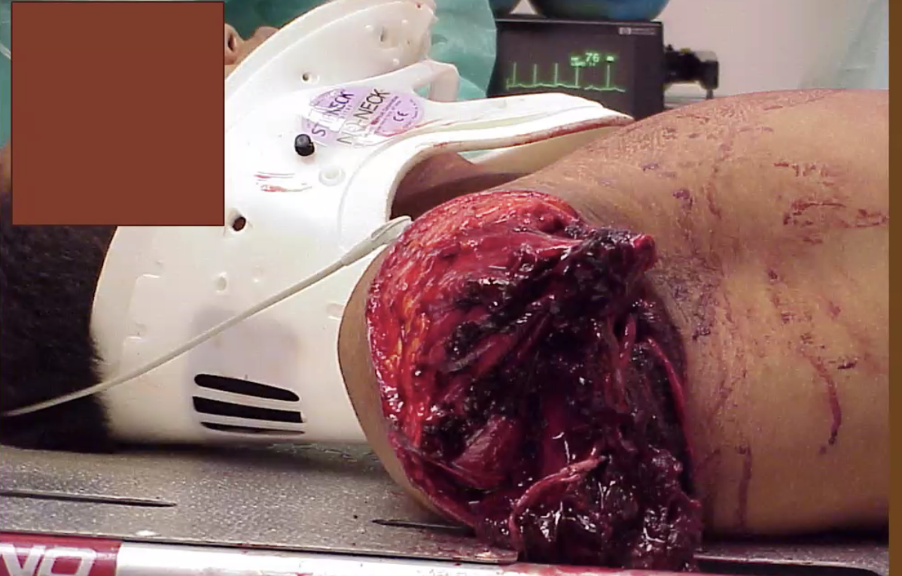
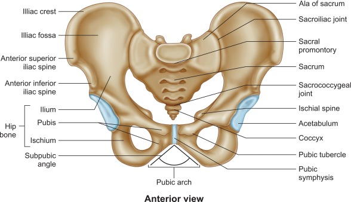
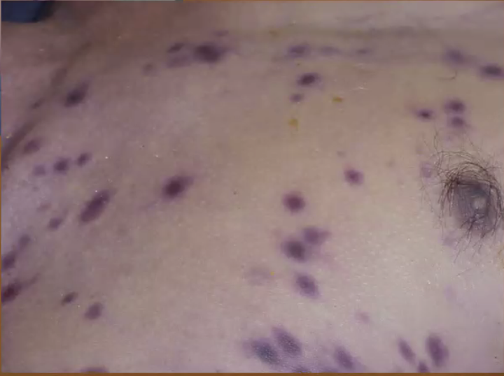

# Trauma

**Key Principles**

- Timing is crucial
- Use a systematic approach that can be rapidly and accurately applied
- Requires coordination of pre-hospital and hospital teams

## How are Trauma patients Special

- Danger of resuscitative **hyperkalemia**
- Trauma death triad: **hypothermia, acidosis and coagulopathy**
  - Enzymes are sensitive to temperature and pH
  - 24% of trauma patients already have **coagulopathy** on arrival to ED; due to a mixture of consumption coagulopathy and inflammatory reaction.
  - All results in bleeding

## Management Approach

Principles involved in the **initial assessment** of a patient with major trauma are those outlined by the American College of Surgeons (ACS) in their Advanced Trauma Life Support (ATLS) guidelines or those of the Australasian College of Surgeons in the Early Management of Severe Trauma guidelines.

The principles involved consist of:

1. Preparation and transport
2. Primary survey and resuscitation, including monitoring, urinary and nasogastric tube insertion, and radiography
3. Secondary survey, including special investigations, such as CT scanning or angiography
4. Ongoing re-evaluation
5. Tertiary evaluation
6. Definitive care

Note

- The **primary and secondary surveys are repeated frequently** to identify any change in the patient’s status that indicates the need for additional intervention. 
- Many of these activities can occur **simultaneously**. 

- ACLS and DCR are the core

### Preparation and Transport

#### Preparation 

**Prehospital**

- Clinical: Emphasize airway maintenance, control of external bleeding and shock, immobilization of the patient, and immediate transport to the closest appropriate facility, preferably a verified trauma center.
  - make every effort to minimize scene time (Field Triage Decision Scheme)
- Team Formation: Events are coordinated with the clinicians at the receiving hospital
  - Mobilization of the hospital’s trauma team members so that all necessary personnel and resources are present in the emergency department (ED) at the time of the patient’s arrival
- Doc & Report: Obtaining and reporting information needed for triage at the hospital
  - Including time of injury, events related to the injury, and patient history. 
  - The mechanisms of injury can suggest the degree of injury as well as specific injuries the patient needs evaluated and treated.

**Hospital**

Preparations are made to facilitate rapid trauma patient resuscitation

- Trauma team **activation**

- **Wear PPE:** standard precautions

- Introduction to team and assignment of key roles

  - **Team Leader** – responsible in leading the entire team, communicating with patient/taking focused history, asking for significant physical exam findings, ask other team members to do certain task i.e. take vital signs, administer oxygen, administer drugs, order investigations, as well as call for help or ward/ICU bed

  - **Airway person** – responsible for maintaining the patient’s airway

  - **Circulating Lead** – responsible for taking the appropriate apparatus/consumables needed to

    perform any investigation/management on the patient

  - **Nurse (Lead)** – responsible for taking/looking after vital signs and communicating back to team members

  - **Nurse Co-Lead** – responsible for documentation, i.e. time stamps for drugs and/or any other

    significant events in the scenario, and communicating back to team members

  - **Medication Administrator** – responsible for administering drugs

- Mental preparation - prebrief patient case

- Equipments

  - Properly functioning airway equipment (e.g., laryngoscopes and endotracheal tubes) is organized, tested, and strategically placed to be easily accessible.
  - Warmed intravenous crystalloid solutions are immediately available for infusion, as are appropriate monitoring devices.

- CT room notified

- Blood bank notification /ensure availability of E blood

**Peace-time Prep**

- A resuscitation area is available for trauma patients.
- A protocol to summon additional medical assistance is in place, as well as a means to ensure prompt responses by laboratory and radiology personnel.
- Transfer agreements with verified trauma centers are established and operational. 

### Primary Survey and Resuscitation

Patients are assessed for **life threatening condition**, and their **treatment priorities are established**, based on their injuries, vital signs, and the injury mechanisms. Logical and sequential treatment priorities are established based on the overall assessment of the patient.

- Clinicians can quickly assess A, B, C, and D in a trauma patient (10-second assessment) by identifying themselves, asking the patient for his or her name, and asking what happened - airway intact breathing ok, conscious, if they can do this. 

- Do NOT proceed until each stage is clear e.g. do not start secondary survey until primary survey is clear
- Frequent evaluation is needed, any abnormal results in the restart of the primary survey from the top
- Practically things are done in tandem / simultaneously
- Adjuncts to Primary Survey with resuscitation
  - Physiologic parameters such as pulse rate, blood pressure, pulse pressure, ventilatory rate, ABG levels, body temperature, and urinary output are assessable measures that reflect the adequacy of resuscitation. Values for these parameters should be obtained as soon as is practical during or after completing the primary survey, and reevaluated periodically.

#### Airway and C-spine

**A**irway maintenance with restriction of **cervical spine** motion and **conscious state**: **can patient speak clearly**

- Is there airway compromise?
  - Upper airway obstruction symptoms – stridor, hoarse voice, orthopnoea, drooling, dysphagia
- Is there **impending** airway compromise?
  - Establish a definitive airway if there is any doubt about the patient’s ability to maintain airway integrity
  - Risk factors — suspected airway burn, neck trauma (blunt or penetrating)
  - The finding of **nonpurposeful motor responses** strongly suggests the need for definitive airway management.

Special note in trauma: 

- While assessing and managing a patient’s airway, take great care to **prevent excessive movement of the cervical spine**. **Based on the mechanism** of trauma, not physical, assume that a spinal injury exists. 

Consider appropriate airway intervention: is this going to be a difficult airway:

- The difficult airway is “*the clinical situation in which a conventionally trained Anesthesiologist experiences difficulty with facemask ventilation, difficulty in supraglottic device ventilation, difficulty in tracheal intubation or all three”*
  - **Difficulty with facemask** ventilation is the inability of an unassisted anesthesiologist:
    - a) to maintain oxygen saturation, measured by pulse oximetry, 92%; or
    - b) to prevent or reverse signs of inadequate ventilation during positive-pressure mask ventilation under general anesthesia
  - **Difficult laryngoscopy** occurs when “*it s not possible to visualize any portion of the vocal cords with conventional laryngoscopy.*” This typically corresponds to a Cormack and Lehane Grade IV laryngoscopy view
  - **Difficult endotracheal intubation** occurs when “*proper insertion of the tracheal tube with conventional laryngoscopy requires more than three attempts or more than 10 minutes*”

Consider **adjuncts**

- NGT - contraindicated in patient with facial fracture

#### Breathing and ventilation

 Breathing and ventilation: ability to generate air movement to permit speech

- Ventilation requires adequate function of the lungs, chest wall, and diaphragm; therefore, clinicians must rapidly examine and evaluate each component.
- Look out for life threatening issues: 
  - Flail chest
  - Pulmonary contusion
  - Tension PTX, or open PTX
  - Massive haemothorax
- A simple pneumothorax can be converted to a tension pneumothorax when a patient is intubated and positive pressure ventilation is provided before decompressing the pneumothorax with a chest tube.

**Approach**

- Physical Exam: inspect, palpation, percussion, auscultation
  - Inspect
    - Distended neck veins
    - Chest rise
    - Ecchymosis / bruising / injury
  - Palpated
    - Clavicle stability, ribs for step off
    - Subcutaneous emphysema - worry pneumothorax
    - JVD
  - Percuss the chest for hyper resonance and dullness - stony means hemothorax (blood before water), hyper-resonance for pneumothorax
  - Auscultate: breath sounds

**Consider Adjunct**

- SpO2
  - Hemoglobin saturation from the pulse oximeter should be compared with the value obtained from the ABG analysis. Inconsistency indicates that one of the two determinations is in error.
- ABG, capnography, ventilatory rate
  - **End tidal CO2** can be detected using colorimetry, capnometry, or capnography
    - Capnography is a noninvasive monitoring technique that provides insight into the patient’s ventilation, circulation, and metabolism. Because endotracheal tubes can be dislodged whenever a patient is moved, capnography can be used to confirm intubation of the airway (vs the esophagus). However, capnography does not confirm proper position of the tube within the trachea.
    - End tidal CO2 can also be used for tight control of ventilation to avoid hypoventilation and hyperventilation. It reflects cardiac output and is used to predict return of spontaneous circulation(ROSC) during CPR.
  - In addition to providing information concerning the adequacy of oxygenation and ventilation, **ABG** values provide acid base information. In the trauma setting, low pH and base excess levels indicate shock; therefore, trending these values can reflect improvements with resuscitation.
- Xrays 
  - Lateral c-spine: may be replaced in the age of CT, because we cannot do very much immediate, can wait and do it 
  - CXR
  - Pelvic x-ray

#### Circulation with haemorrhage control

**Assessments**

- Inspect
  - Looking for **significant hemorrhage** occurs in any of five sites: external, intrathoracic, intraperitoneal, retroperitoneal, and pelvic or long bone fractures 

    - external
    - intrathoracic
    - Intraperitoneal and retroperitoneal: Obtain no cutaneous signs, Cullen sign (umbilical ecchymosis) and Grey Turner sign (flank ecchymosis) +/- palpable swelling
- Palpate
  - Capillary refill
  - Pulses
- Auscultate for heart sounds

**Investigations**

- IV cannulation large bore x 2
- Send bloods
  - FBC, PT/PTT, GXM 
  - U/E/Cr, LFT+/-, lactate, 
  - Renal, liver, lactates
- FAST / eFAST - eFAST involve lung u/s
- Urinary catheter
- ECG 
  - monitoring for dysrhythmias, PEA (cardiac tamponade, tension pneumothorax, and or profound hypovolemia)
  - When bradycardia, aberrant conduction, and premature beats are present, hypoxia and hypoperfusion should be suspected immediately. Extreme hypothermia also produces dysrhythmias.

**Action**

- Warm fluids, what and how much?

  - Bloods first! Loss blood replace blood. **ABC criteria for Transfusion**
  - Give **Tranxemic acid 1 g stat then 1 g over 8 hours**
  - ATLS give **1 litre fluid bolus**
  - Permission HoTN / balanced resuscitation
    - Why: abdominal inflammation and
    - Bickell (1994) - lmmediate vs delayed fluid resuscitation for hypotensive patients with penetrating torso injuries; 
    - NOT for patients with suspected TBI; full GCS
- Decision point: OT, CT, IR

  - NEVER BRING HoTN patient to CT room
  - Resuscitation can also take place in OT or ICU
  - Radiology is not involved in the trauma team, 
    - EG level 1 trauma team in US
    - CT find arterial bleed activate IR; 

#### Disability

(assessment of neurologic status)

- Assess **patient for deficits**
- AVPU: Alert, verbal, pain, unresponsive
- Patients with evidence of brain injury should be treated at a facility that has the personnel and resources to anticipate and manage the needs of these patients. When resources to care for these patients are not available arrangements for transfer should begin as soon as this condition is recognized.
- Some people use D as drugs as well.

#### Exposure/Environmental control

- What to do
  - Ensure a warm environment
  - Control hemorrhage rapidly
  - Cover the patient with warm blankets or an external warming device to prevent him or her from developing hypothermia 
  - The use of a high-flow fluid warmer to heat crystalloid fluids to 39°C (102.2°F) is recommended.
- Hypothermia can be present when the patient arrives, or it may develop quickly in the ED if the patient is uncovered and undergoes rapid administration of room-temperature fluids or refrigerated blood. Because hypothermia is a potentially lethal complication in injured patients, take aggressive measures to prevent the loss of body heat and restore body temperature to normal

### Consider need for patient transfer and special population

During the primary survey with resuscitation, the evaluating doctor frequently obtains sufficient information to determine the need to transfer the patient to another facility for definitive care. This transfer process may be initiated immediately by administrative personnel at the direction of the trauma team leader while additional evaluation and resuscitative measures are being performed. It is important not to delay transfer to perform an in-depth diagnostic evaluation. Only undertake testing that enhances the ability to resuscitate, stabilize, and ensure the patient’s safe transfer. Once the decision to transfer a patient has been made, communication between the referring and receiving doctors is essential.

### Secondary Survey

More in-depth head to toe examination of the patient.

### Tertiary Survey

To recheck everything in 48 - 72 hours.

Overall, somewhere between 7-13% of patients have injuries that are missed during the initial evaluation (primary and secondary survey).

A well-designed tertiary survey helps identify these occult injuries before they are truly “missed.” This survey consists of a structured and comprehensive re-examination that takes place within 48-72 hours, and includes a review of every diagnostic study performed. Ideally, it should be carried out by two people: one familiar with the patient, and the other not.

Examples where tertiary survey is necessary

- Alcoholic
- Seizures

Patient's mental state has improved, revisit, where is the pain etc. 

Trauma patients must be reevaluated constantly to ensure that new findings are not overlooked and to discover any deterioration in previously noted findings. As initial life-threatening injuries are managed, other equally life-threatening problems and less severe injuries may become apparent, which can significantly affect the ultimate prognosis of the patient. A high index of suspicion facilitates early diagnosis and management.

## Damage Control Resuscitation

DCSurgery vs DCRs

Causes of hypotension

- Cardiac collapse

Deliberate practice

### Permission hypotension 

### Massive Transfusion Protocol

- Crystalloid is not preferred or there is a movement towards severe blood loss
  - Hartman is probably a better crystalloid: lactate buffering, no acidosis
  - Normal saline is ok, but may cause hyperchloremic acidosis
  - However, there is not Hartman
- However, just start blood

		- Each **unit of FFP** contains approximately 200 to 250 mL. **Apheresis-derived** **units** can contain as much as 400 to 600 mL. Administration of one 250 mL **unit** should raise the fibrinogen level by 5 to 10 mg/dl. The goal of therapy is a cessation of bleeding.
		- Typically, **one unit of PRBC** is approximately 350 mL in volume, of which RBC volume is 200–250 mL. The remaining volume is due to plasma (typically <50 mL), white blood cells (WBCs), platelets and anticoagulants.
  - Whole blood derived **platelets** should contain a minimum of 5.5 x 10^10 **platelets** per **unit** with an overall volume of around 50 mL. **Apheresis platelets** should contain a minimum of 3 x 10^11 **platelets** per **unit** with an overall volume around 300 mL. Transfused **platelets** have an expected life-span of 3-4 days.
    		- Platelet lite concentrate?

### Tranexamic Acid

- Does not require refrigeration
- Need to give within 3 hours of severe trauma
  - Severe trauma
    - Injury severity score more than 15, can only be calculated retrospectively
    - CRASH-II inclusion means increased risk of bleeding and risk bleeding: early shock (ECG, vital signs) via vital, patient looks pale;
- 1 g initial tranexamic acid and then 1 g over 8 hours.

CRASH-2: 

## Damage control surgery

- 2nd hit concept - first hit is the initial trauma

- Restore physiology not anatomy: resect rather than repair

- Haemorrhage control

- Decompression of compartments: head, thorax, abdomen limb

- Decontaminate

- Splint

- Minimise op time e.g. resect rather than repair

- Plan for re-operation e.g. leave abdomen open

  

## Head Trauma

### Severity of Head Trauma

A minor HI is defined as:

- GCS 13 - 15
- Witnessed LOC, retrograde amnesia disorientation
- However, there is no syncope/seizure, and the patient is NOT on anticoagulation

### CT Head without Contrast

Patients with major HI should receive CT head without contrast. Patients without head trauma should NOT receive a CT scan. However, if the injury is minor, consider using Canadian CT Head Rule to decide.

#### Canadian CT Head Rule - When to Order

This is a clinical rule devised to reduce unnecessary CT scans in minor HI. 

- Original study shows 100% sensitivity for “clinically important brain injury”
- External validation 72.9-100% (Young 2011, Smits 2005, Papa 2012)

The rule is: CT head is only required for patients with minor head injury AND any one of the following findings

- High risk (for neurological intervention)
  - GCS score < 15 at 2 hours after injury
  - Suspected open or depressed skull fracture
  - Any sign of basal skull fracture
  - Vomiting &geq; 2 episodes
  - Age &geq; 65 years
- Medium Risk (brain injury on CT)
  - Amnesia before impact &geq;30 min
  - Dangerous mechanism (pedestrian struck by vehicle, occupant ejected from motor vehicle, fall from elevation &geq; 3 feet or 5 stairs)

This rule CANNOT be applied for 

- Non-trauma cases
- GCS < 13 
- Age < 16 
- Coumadin or bleeding disorder
- Obvious open skull fracture

**Investigations**

- Bedside: Blood glucose,  blood gas, urine dipstick, UPT, ECG
- Labs: 
  - Bloods
  - Other fluids
  - Solid tissue
- Imaging: Xray ct, MRI, ultrasound

- Acute on chronic component; midline shift

  

  - 

- Traumatic subarachnoid hemorrhage, 
- Contra coup injury; 
- Need to look at the bone window to look for fractures

## Traumatic Amputation

## Pelvic Fracture In Trauma

 

### Pelvic Binder - think Mini Skirt

## Bee Sting

## Video inspired discussion

**Case 1: Pelvic Fracture Patient**

https://www.youtube.com/watch?v=NYnRdl7nQNQ&list=PLxIk6Gl-hUMloA_ZEeFZhgC-CTFKbxdN_&index=16

45 year old male fell off a truck, ramp, complaining of hip and back pain, probable chest contusions, rib and pelvic fractures.

Patient - is some one gonna take care of me or what? He seems to be breathing just fine.

He is going to need pain meds and a full blow trauma assessment. 

Pressure is dropping; Pelvic plain film, stat trauma labs, and morphine; pelvic bind. 

Pelvic ultrasound; 4 units of 0 negative bloods. 

1. How critically injured is this patient and what are the reasons for your assessment? 
2. Do you think the providers know what they are doing?

Disorganised. What is doing ABC?

**In stressful environment, we may regress to a state that we are most comfortable with as opposed to keeping to the protocol or doing things that's more challenging for ourselves.**

**Case 2: Team Approach**

https://www.youtube.com/watch?v=WKRDmdRYjDM

1. What preparation is done to receive a trauma patient? Prebrief
   - Assign roles: leader, airway, primary, secondary, respiratory, medical administrator
     - Trauma team leader in Singapore: GS
     - Here trauma team has around 5 minutes to come down, so emergency will be a temporary leader; when GS arrive, they will 
     - GS, ortho, em in general, radiographer, 
   - Team leader provides team with latest information from the prehospital providers and outlines a quick game plan
     - 18 year old RTA, driver killed on scene, patient unresponsive, hotn, intubated with 8.0 tube, good breath sound, pulse ox at 100%
   - Ask for questions.
2. What is Primary Survey and Secondary Survey? 
   - Primary survey is done while patient is still on EMS stretcher, if there is a need for immediate airway measures the need is stated immediately. 
   - Confirm collar change
   - Hook him up to our monitors
   - Carefully move him onto the bed and reconfirm collar change
   - Femoral pulse
   - Confirm breath sounds, still bilateral
   - Confirm vitals
   - Order CXR
   - Manual BP obtained, patient placed on main monitor, exposed and secondary survey started simultaneously
   - Leader: this patient is hypotensive folks, let's get a CXR and quite report please
     - At first alert, aggressive
     - RSI 8.0 at 23 a with good breath sounds
     - More tachycardia, 100 up to 120; initially 110 decreasing
     - 2 L of fluids 
     - No follow up sedation and paralytics
     - Any periods of hypotension hypoxia (saturation <90%) or tachycardia should be relayed to the team
     - Do you have any question
   - Leader: 2 laters still hypotensive, so let's transfuse him, 2 units of trauma O positive blood
     - All orders for blood products and or medication are verbally crosschecked by the primary or secondary nurse
   - Leader ask the team to prep for FAST
   - Secondary survey
     - Alright up from the top
     - Pupils are clear equal round and reactive, 
     - TMs are clear
     - No facial trauma or skull trauma
     - Trachea is midline
     - Anterior neck is clear
     - Clavicle stable no ecchymosis or trauma on chest wall
     - Ecchymosis on lower abdomen; a little burns
     - Pulse stable
     - Extremity no deformity, good pulses in DP (Doral pedialis) in bilateral radial 
     - HR 130, sats 100 percent
3. What is FAST Exam? 
   - Happens after secondary survey
   - Technician prepping while secondary survey is happening
   - Fast: fluid in left and right upper quadrant, and pelvis, no pericardial fluid
4. What else needs to be done before proceeding to OT?
   - His hoTN receiving blood, we are going to proceed towards operative intervention
     - I would like to initiate the trauma exsanguination protocol
     - Please get the blood bank on the phone
     - Let's call the operating room and head to the OR
   - Keep patient warm
   - Patient on transport monitor
   - Final vitals check

**Case 3: Airway obstruction**

https://www.youtube.com/watch?v=cJZUuLf7EM4

1. How do you assess the airway? Look feel listen; assume all injuries patient

   - Risk factors — suspected airway burn, neck trauma (blunt or penetrating)

   - Inspect:
     - General: Diminished GCS, Sats in the low 90s
     - Oral: look into the mouth for signs of lost teeth, foreign body, burns or injury
     - Oral pharynx: drooling, dysphagia
     - Larynx: stridor, hoarse voice
     - non purposeful movement, chest movement, orthopnoea, use of accessory respiratory muscles, and paradoxical chest movements, 
   - Palpate: chest movement, lung expansion, trachea, feel the breath
   - Auscultate: breath sounds

2. How would you manage this? Always try the least invasive first. 

   - Foreign body obstruction - see if we can remove the foreign body; requires clear visualization
   - I would consider intubating this patient even after removal of foreign body, in case there is damage and subsequent airway edema

Jaw thrust and OPA.

**Case 4: Trauma Airway and intubation in MVC casualty**

https://www.youtube.com/watch?v=t-cMUzMBQQE

1. How to prepare for intubating a trauma patient?
   - Leader asks: What is the plan
   - Plan A: Video laryngoscope with a c mac
     - Size 4 curve blade
     - D blade
   - Plan B: LMA for back up, bogie for assistance
   - Who is going to do it
   - Stabilization of head and neck
   - Cricoid
   - Pharmcological agents
     - 20 mg etomidate
     - 100 mg rocuronium
   - Suction ready
   - ET tube ready
   - BVM ready
   - Preoxygenation
   - Collar off and C-spine
   - Check ETCo2, check breath sounds

In the past we always do **c-collar** in every patient; Now there is a move away from using too much C-collar; 

- For unconscious patient, c-collar may prevent throwing up; if patient is throwing up, can we roll patient
- Increase ICP by decreasing venous return
- Reduction to access to the neck
- To clear the c-spine
  - Pain, tenderness, neurological symptoms and signs; if all absent, ask the aptient to move his head; if he can move the head to the left and right, we are ok.

Scrub in ED - trauma coordinator

Question

- Cricoid pressure is applied for a long time
- No premedication for intubation

**Case 5: Trauma examination**

https://www.youtube.com/watch?v=PWCWCtOvwRs

What procedure is being performed and what is the purpose 

- LogRoll
  - Patient is rolled to assess posterior surfaces and palpate spine and spine board is removed
  - Remember to check for anal tone

**Initial Management of the Multiply Injuried Patient**

